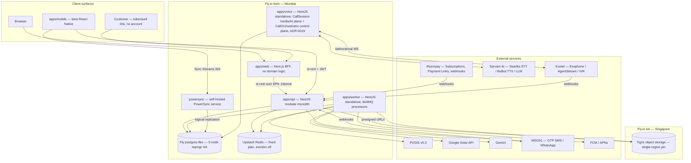

# 02 — System Architecture

Binding source: `BLUEPRINT.md`. Evidence: `./research/backend.md`, `./research/fly.md`,
`./research/sync.md`, `./research/geo3d.md`, `./research/calc.md`. Where a research file
recommended differently (Hono/oRPC/Graphile/S3), the user's final-review directives in
BLUEPRINT override it; this document records only the final architecture.

---

## 1. Architecture overview

HelioGrid is a **modular monolith on Fly.io Mumbai (`bom`)** with two already-separate
compute processes (worker, voice), one self-hosted sync service (PowerSync), object storage
pinned to Tigris Singapore (`sin`), and a thin set of external providers. One Postgres is
the system of record; Redis exists only for BullMQ, rate limiting and SSE fan-out.



Fly topology (from `./research/fly.md`; ADR-0018): **one Fly app per service** —
`heliogrid-web`, `heliogrid-api`, `heliogrid-worker` (`autostop="off"`, larger machines),
`heliogrid-voice`, `heliogrid-powersync` (prebuilt `journeyapps/powersync-service` image) —
plus the postgres-flex cluster app and the log-shipper. web/api/worker/voice build per-app
Dockerfiles. `bom` is capacity-tight, so web/api run `min_machines_running=1` (never
scale-to-zero); `sin` is the overflow fallback. Internal traffic rides 6PN
`.internal`/flycast private networking — the api is never exposed except through Fly's
proxy for webhooks and mobile.

---

## 2. Monorepo layout and boundaries

pnpm workspaces + Turborepo + TS project references (ship source; references order
typecheck). Lint/format: **Biome v2.5**. Boundary enforcement: **dependency-cruiser**
(layer rules, no cycles) + **Turborepo Boundaries** (package encapsulation) + **sherif**
(version drift).

```
apps/
  web/        Next.js — frontend + BFF only; zero domain logic
  api/        NestJS modular monolith (Node 22)
  worker/     NestJS standalone — BullMQ processors, worker_threads for CPU
  voice/      NestJS standalone — CallSession orchestrator (Exotel ↔ Sarvam)
  mobile/     bare React Native (iOS + Android, no Expo)
packages/
  domain/     ported studio engines — pure TS, rules/catalog INJECTED
  contracts/  ts-rest contract + Zod 3.x schemas (single API source of truth)
  adapters/   provider adapters implementing the ports in 07-integrations.md
  db/         Drizzle schema + migrations
  ui/         web components (design system)
  tokens/     Style Dictionary (shorthand — canonical: bespoke build.ts CSS parser, docs/10 §2) → CSS vars (web) + RN theme object
  i18n/       Lingui v5 catalogs (EN/HI/MR)
  config/     shared tsconfig / biome / dependency-cruiser presets
```

**Dependency direction (dependency-cruiser enforced, never weakened):**

- `apps/* → packages/contracts → packages/domain`.
- `packages/domain` imports **nothing** from db/api/ui and no framework: no NestJS, no
  React, no fetch, no storage, no env reads. Rules, catalogs and market config are
  injected parameters (§10) — the POC's `resolveRules()` module-global dies at port time
  (`./research/geo3d.md` §3, the one named coupling smell).
- `packages/db` is imported by `apps/api` and `apps/worker` only. Web and mobile never
  see the database; they see `contracts`.
- `packages/adapters` implements the provider ports defined in `07-integrations.md`
  (telephony, payments, messaging, …). Apps depend on adapters; adapters depend on
  `packages/contracts`, never on domain internals; `packages/domain` never imports
  adapters.
- `packages/ui` → web only. `packages/tokens` → ui, web, mobile. `packages/i18n` → web,
  mobile.

**NestJS modules in `apps/api`** (one per bounded context): `auth`, `tenancy`, `crm`,
`survey`, `design`, `proposal`, `customer-link`, `projects`, `billing` (payments,
subscriptions, entitlements, usage), `catalog`, `agent` (voice config/calls/knowledge),
`notifications`, `admin`.

**Why modular monolith now.** One deployable API means one Postgres transaction scope, no
distributed sagas, one deploy pipeline, and single-digit-ms internal calls — the only
honest shape for a next-month launch run by AI agents. NestJS modules give compile-visible
boundaries (explicit `imports:[]`) so the monolith cannot silently tangle.

**Extraction seams (designed in, used later).** `worker` and `voice` are already separate
OS processes — the queue payload contract and the CallSession WS protocol are pre-existing
service boundaries. For the rest: NestJS module boundaries = future service boundaries.
Because every module's surface is a ts-rest contract slice and every cross-module call goes
through the module's exported service, any module (first candidates: `billing`, `agent`)
can be lifted to its own Fly app behind the same contract with zero client changes. Do not
extract anything before a scaling or isolation reason exists.

---

## 3. Request path anatomy

**Web** — browser → `apps/web` (Next.js). Better Auth cookie session terminates at the BFF;
route handlers/server components call `apps/api` with the ts-rest fetch client over
`.internal`, forwarding identity. Next.js composes pages and holds sessions; it computes
nothing. The 3D studio runs in the browser against `packages/domain` (client bundle) for
interactive geometry, and persists via the design endpoints (§9).

**Mobile** — two channels, deliberately:
1. **PowerSync Sync Streams** (WebSocket) for the offline working set: leads, tasks,
   surveys + photo refs, visits, notifications — parameterized by JWT claims
   (`tenant_id`, assignee). All writes go through the local SQLite upload queue and land
   on **our NestJS backend connector** — idempotent, tenant-checked, versioned.
2. **ts-rest + JWT** (Better Auth, keychain-stored) for non-synced operations: issue
   proposal, trigger PDF, billing screens, catalog admin, agent config. If it must be
   correct-now and online-only, it is an RPC, not a synced table.

**Public customer link** — `/c/<payload>.<mac>` on `apps/web` → `customer-link` module on the api.
The token is a **stateless HMAC-signed grant** (scope + proposal/project id + expiry),
never a session, never touching Better Auth. Rate-limited per token+IP (Upstash). Grants:
view proposal, accept, download PDF (presigned GET), pay tranche via the tenant's
BYO-Razorpay payment link. Every access is audit-logged.

**Webhooks** (`/webhooks/razorpay`, `/webhooks/exotel`, `/webhooks/msg91`) — one invariant
pipeline: **verify HMAC signature → dedupe (unique index on provider event id, e.g.
`x-razorpay-event-id`) → enqueue to the `webhooks` queue → return 2xx in <500 ms.** No
business logic in the receiving request. Processing is idempotent in `apps/worker`;
API-polling reconciliation (§6) is the at-least-once backstop.

---

## 4. Tenancy model

Single database, shared schema, `tenant_id` (uuid, NOT NULL, FK → `tenants`) on every
tenant-owned row.

- **Primary: app-layer scoping.** Every query path goes through the tenant-scoped
  repository layer in `packages/db`; repositories require a `TenantContext` argument —
  there is no un-scoped query API to forget to scope.
- **Backstop: Postgres RLS.** The api/worker connect as an app role **without BYPASSRLS**;
  each transaction runs `SET LOCAL app.tenant_id = <verified JWT claim>` and policies
  enforce `tenant_id = current_setting('app.tenant_id')::uuid`. A bug in layer one becomes
  an empty result, not a leak.
- **Roles:** 6 stackable presets — owner, manager, sales_rep, surveyor, designer, engineer —
  OR-across-roles, widest visibility wins. JWT claims `{tenant_id, roles[]}` drive Nest
  guards. The normative capability matrix lives in `08-security-and-tenancy.md`; this doc
  fixes only the mechanism.
- Platform-admin operations use a separate role and are audit-logged; customer-link tokens
  are outside the role system entirely (§3).
- The locked invariant tests (`tests/invariants/`) include cross-tenant read/write
  attempts that must fail — they never get deleted or skipped.

---

## 5. Offline & sync (summary — full detail in `06-offline-and-sync.md`)

**PowerSync self-hosted (Open Edition)** on Fly `bom`, Postgres bucket storage (no Mongo),
reading WAL via logical replication (`./research/sync.md`). Client = local SQLite
(op-sqlite, New-Architecture verified) + durable upload queue. The decisive property: **the
write path is our code** — the backend connector is a NestJS endpoint applying mutations
with idempotency keys, tenant checks and version checks, so sync writes obey the same
guards as every other write. Photos: PowerSync Attachments Helper → Tigris presigned
uploads (offline capture, resumable). Conflicts: surveys are versioned-append (revisit =
new version); designs are single-editor LWW with a server version check. The web studio
reuses the PowerSync web SDK (OPFS) — one sync mental model on both surfaces.

---

## 6. Background processing

**BullMQ + `@nestjs/bullmq`** on Upstash Redis (Fly extension, `bom`, **fixed plan** —
Fly's explicit recommendation for BullMQ — eviction OFF, `maxRetriesPerRequest: null`).
All processors live in `apps/worker` (`autostop="off"`, dedicated larger machines). CPU
holds (shading at scale, Playwright PDF) run in `worker_threads` so the event loop keeps
draining queues.

| Queue | Work | Notes |
|---|---|---|
| `shading` | Server-side solar-access sims via the same pure kernels as the browser (§9) | worker_threads; big-array jobs chunked |
| `pdf` | Proposal/document render — Playwright/Chromium (only correct Devanagari shaping) | output → Tigris `pdfs` bucket |
| `imports` | Catalog/price-book imports, DEM tile ingestion | validates then versions, never in-place |
| `agent-triggers` | Voice-agent journeys + compliance housekeeping | queued calls use queue-time agent-config version (D36) |
| `webhooks` | Razorpay/Exotel/MSG91 event processing + reconciliation | idempotent by provider event id |
| `notifications` | Push (Notifee → FCM/APNs), in-app fan-out, OTP-adjacent messaging | per-tenant metered |

**Repeatable jobs** (BullMQ repeatables, registered on their owning queue; times IST):

| Job | Queue | Schedule | Purpose |
|---|---|---|---|
| `proposal-unopened-3d` | agent-triggers | daily 09:15 | queue follow-up calls for proposals unopened 3 days |
| `task-overdue-2d` | agent-triggers | daily 09:05 | overdue-task nudges to assignees |
| `snooze-wake` | agent-triggers | every 15 min | wake snoozed leads/tasks |
| `dormant-sweep` | agent-triggers | daily 02:00 | flag dormant leads for the agent queue |
| `dnd-scrub` | agent-triggers | daily 06:00 | refresh DND registry flags before the 09:00 calling window (ComplianceGate) |
| `recording-retention` | agent-triggers | daily 03:00 | purge call recordings past 90-day retention |
| `razorpay-reconcile` | webhooks | every 6 h | poll subscription state vs local; heal missed webhooks |
| `trial-expiry-sweep` | webhooks | daily 00:30 | expire trials, flip entitlements to soft-block (read+export always work) |
| `usage-rollup` | webhooks | hourly | roll `usage_events` into period aggregates for metering |

Infra-level cron (pgBackRest WAL archiving, nightly `pg_dump` to the `heliogrid-backups` bucket, `pg/` prefix) is NOT
BullMQ — it runs beside Postgres and is specified in `09-observability-and-ops.md`.

---

## 7. Realtime (SSE)

Nest-native `@Sse` endpoints; Redis pub/sub fans events out across api machines; clients
reconnect with `Last-Event-ID` replayed from a short Redis stream buffer; 25 s heartbeat
keeps the Fly proxy from idling connections. SSE chosen over WebSockets: unidirectional
fan-out, no sticky sessions, auto-reconnect for free (`./research/backend.md`). WebSockets
enter only if collaborative design editing ever lands.

| Channel | Scope | Events |
|---|---|---|
| `/realtime/notifications` | per-user | new notification, badge count |
| `/realtime/designs/:id` | per-design | fingerprint invalidation (staleness badges), shading job progress/done, quote-stale |
| `/realtime/agent/calls/:id` | per-call | live status, turn transcript, outcome — feeds the live call monitor |

---

## 8. Storage architecture (Tigris, single-region pin `sin`)

Tigris is Fly-native and S3-compatible (presigned URLs + multipart verified). No India
region exists; `sin` is the nearest pin. DPDP Rules 2025 use a negative-list model —
cross-border storage is permitted by default (`./research/fly.md` §DPDP), and the DB
holding primary PII stays in `bom`. Migration path to India-region S3-compatible storage
is a documented adapter swap, not a rewrite.

| Bucket | Contents | Access pattern |
|---|---|---|
| `heliogrid-photos` | survey photos, roof captures, drone shots | PowerSync Attachments Helper presigned PUT; presigned GET (short TTL) |
| `heliogrid-documents` | project documents, KYC uploads, engineer sign-off records | api-issued presigned PUT/GET |
| `heliogrid-pdfs` | rendered proposals/quotes | worker writes; customer-link reads via object-scoped presigned GET |
| `heliogrid-dem-tiles` | Copernicus GLO-30 DEM tiles (platform-wide, not tenant data) | worker ingest; api/browser presigned GET |
| `heliogrid-backups` | pgBackRest WAL archive + nightly logical dumps | infra credentials only — api/worker have no access |

Rules: tenant buckets key objects under `{tenant_id}/{entity}/{id}/…`; the api authorises
+ quota-checks every presign (15 min PUT, 5 min GET); clients upload/download **direct to
Tigris** — bytes never proxy through the api; every stored object has an owning row in
Postgres (attachment/document tables) written on upload confirmation, so orphan sweeps are
a query, not a bucket listing.

---

## 9. Design-studio data flow (the flagship path)

The studio is the product's moat; this path gets the strictest invariants.

- **Persistence: one JSONB payload.** A `designs` row carries the relational spine
  (`tenant_id`, project id, name, status, `version`, `updated_by`, stamped fingerprints)
  plus `payload` JSONB — the canonical `Project` shape ported from the POC
  (`./research/geo3d.md` §2). Visual meshes are never truth; everything derived (structure
  graph, poses, casters, heatmap) is a pure function of the payload and is NOT persisted.
- **Normalize-on-read.** Every load passes the ported normalizer: defaults filled,
  malformed sub-entities dropped item-by-item, `Exhaustive<T>` guard so no field silently
  vanishes (the bug that once erased saved discounts — `./research/calc.md` §3). The
  server never trusts a stored payload across schema evolution.
- **Write path.** Single-editor LWW with a server version check: writes carry the base
  `version`; mismatch → 409 and the client rebases. Server assigns all business
  identifiers. Photo/capture blobs are Tigris refs, never inline base64.
- **Fingerprints drive freshness.** The 5 nested fingerprints
  (`siteFp ⊂ geometryFp ⊂ layoutFp ⊂ electricalFp ⊂ designFp`) plus engine-versioned
  `shadingFp` port intact. `catalogVersion`, `structureModelVersion` and
  `SHADING_ENGINE_VERSION` join the fingerprints so a price-book or engine change
  self-stales older outputs. This mechanism IS the "money never renders while stale" rule:
  a quote whose `designFp` no longer matches reads as provisional, enforced at the API,
  not in the UI.
- **One-frame gate.** `panelInstanceMatrix` lives once in `packages/domain`
  (scene-frame); renderer, analytical footprint and 2D editors all read the same
  composition. `one-frame.test.ts` and `frame-parity.test.ts` travel with the package as
  release gates — never deleted, never skipped.
- **Compute placement.** The same pure TS kernels run in a browser Worker pool
  (interactive rooftop work) and in Node `worker_threads` via the `shading` queue (giant
  sims). Results are stamped with the `shadingFp` they were computed from; the
  `/realtime/designs/:id` channel announces completion.
- **Scale representation.** Above rooftop scale the editable unit is the
  **block/table/zone — panels become derived instances** (`11-scale-program.md`). The
  payload carries `blocks[]` alongside the per-panel rooftop model from day one so 100 MW
  does not require a payload migration; GPU shadow-map shading (WebGPU, WebGL2 fallback)
  with three-mesh-bvh CPU fallback replaces the POC's O(n²) raycaster at that scale
  (`./research/geo3d.md` §4 cliff list).
- **Per-site UTM/ENU origin** (proj4js) replaces the POC single equirectangular origin,
  removing km-scale distortion for MW sites.

---

## 10. Global expansion strategy (market packs)

India-first, global-ready means one thing concretely: **no market fact is ever a
module-level constant.** The POC already reads everything through `resolveRules()` /
`resolveCatalog()` / `tariffFor()` (`./research/calc.md` §6) — the port completes the
design by making them injected.

**Market pack = rules + catalog + templates + locale data**, versioned as one unit:

| Component | Contents |
|---|---|
| RulesContext | electrical ladders (IEC 62548 factors, MCB/MCCB rungs), design-temp bands, setbacks, wind zones, subsidy model, tax model (GST v1), net-metering conventions, compliance calendar (calling hours, DND semantics) |
| CatalogContext | platform-catalog scope for the market, price-book currency + defaults (two-tier resolution unchanged: tenant-override → tenant-item → platform-item) |
| Templates | proposal/PDF/SLD templates, standards labels ("IS/IEC 62548 · CEA" for IN), document boilerplate |
| Locale data | Lingui catalog, default units, currency formatting (₹ Indian grouping is per-market data), holiday calendar |

**Injection, not resolution.** `RulesContext`/`CatalogContext` are resolved once per
request (api), per job (worker) and per call session (voice) from
`tenants.country_code` + `tenants.state_code` (v1: `'IN'` only, matching
`market_rules_packs`) plus in-market overlays (state wind zone, DISCOM
tariffs), then passed as explicit parameters into every `packages/domain` call. Domain
code cannot read a market fact any other way — dependency-cruiser blocks the import path.

**What stays invariant across markets:** the geometry and electrical kernels (ladders are
data, math is not), the provenance/honesty system (4 tiers, fingerprints,
money-never-stale), the one money path, the tenancy model, the ts-rest contract layer, the
design system. **What swaps per market:** rules data, catalog/price book, tax + subsidy
models, locale, telephony adapter (Exotel is India; the capability-negotiated telephony port
family of ADR-0019 is the seam — a new market's provider declares its own capability
matrix) and payment adapter (`SubscriptionBillingPort`/`PaymentLinkPort`).

**Region expansion on Fly:** a new market that earns it gets web/api/worker machines in
the nearest region, a regional Postgres and a regional Tigris pin, with `fly-replay`
routing tenants to their home region. Single-region `bom` until a paying market demands
otherwise — expansion is a deployment decision, not an architecture change, because the
market boundary already exists in code.
