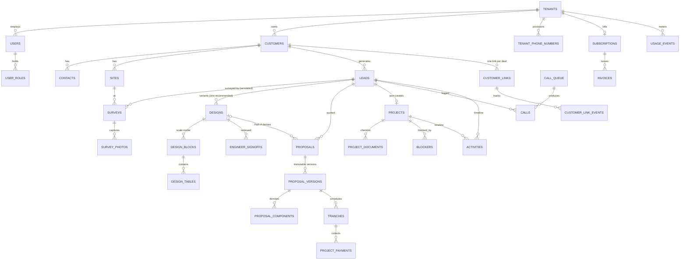

# 04 — Data Model (full multi-tenant schema)

> **LAW 9 — this is FROZEN DESIGN, not a build order.** Every table below is the reference
> that keeps future modules coherent. Tables, enums and columns are AUTHORED only when their
> OWNING module's slice begins. An agent asked to "implement the schema" implements the
> CURRENT module's slice of it. Designing or migrating ahead for modules not being built is
> a violation — the forward-compat register exists precisely so each module's first migration
> can satisfy future needs without building them early.

Canonical schema for HelioGrid on Postgres (Fly postgres-flex, `bom`) via Drizzle. This document
is the source of truth for every table: **never invent a table or column that is not here or in a
migration**. Conventions in `packages/db/CLAUDE.md` are binding and
are not restated per-table; the deltas that matter:

- `id uuid` PK, **UUIDv7 generated app-side** by Drizzle's default function (time-ordered; no
  extension dependency on postgres-flex). `created_at` / `updated_at timestamptz` on everything.
- Every tenant-owned table: `tenant_id uuid not null → tenants.id`, composite indexes starting
  with `tenant_id`, and an RLS policy `USING (tenant_id = current_setting('app.tenant_id')::uuid)`
  for the `app_user` role. RLS is the backstop; the tenant-scoped repository layer is primary.
- Money `numeric(14,2)` INR. Percentages `numeric(5,2)`. Coordinates `numeric(9,6)`.
- Postgres enums for closed sets migrations own; `text` + Zod refinement where tenants extend.
- State-machine columns change **only** through service-layer transition functions.
- Append-only tables have no UPDATE/DELETE grants (census in §12).

Scope legend used below — **TENANT**: tenant-scoped + RLS. **PLATFORM**: global, no `tenant_id`,
readable by all tenants (or admin-only where noted). **AUTH**: owned by Better Auth migrations.

Sources: entity census ./research/journey.md §5 · persistence/catalog shapes ./research/calc.md
§3–4 · BLUEPRINT.md data-layer/billing/voice sections · ./research/auth.md ·
./research/verify-billing.md ([Razorpay webhook practices](https://razorpay.com/docs/webhooks/best-practices/)) ·
./research/voice.md.

---

## 1. Identity & tenancy

### Better Auth tables (AUTH — noted, not redefined)

Better Auth (organization + phoneNumber + jwt plugins) owns and migrates: `user`, `session`,
`account`, `verification`, `organization`, `member`, `invitation`, `jwks`. Rulings:

- **`tenants.id` IS the Better Auth `organization.id`** — created in the same transaction at
  signup. No mapping table, no drift.
- **Our `users.id` IS the Better Auth `user.id`** (1:1 domain profile). Auth tables carry
  credentials/sessions only; all product fields live on our tables.
- Auth tables are accessed by Better Auth's own DB role and are **exempt from app RLS**; they are
  never queried by feature code directly.
- Better Auth `invitation` (email-first) is unused; phone invites are ours (`invites` below).

### `tenants` — PLATFORM (the multi-tenant root; RLS root key)

| Column | Type | Notes |
|---|---|---|
| id | uuid PK | = Better Auth organization.id |
| name, slug | text | slug unique |
| segment | enum `tenant_segment` | `residential` / `ci` / `both` (Stage-0 "what do you sell") |
| typical_system_kw | numeric(8,2) | seeds first-quote defaults |
| gstin | text | validated format; nullable until first proposal |
| address | jsonb | line1/line2/city/state_code/pincode |
| bank_details | jsonb | account/IFSC/UPI for proposal step 11 |
| logo_file_id | uuid → files | |
| country_code, state_code | text | drives `market_rules_packs` resolution; India-first, global-ready |
| status | enum `tenant_status` | `active` / `suspended` / `churned` |

### `users` — TENANT (domain profile, 1:1 with auth user)

| Column | Type | Notes |
|---|---|---|
| id | uuid PK | = Better Auth user.id |
| tenant_id | uuid → tenants | v1: exactly one tenant per user |
| name | text | |
| phone_e164 | text | login identity; unique global (auth owns verification) |
| language | enum `ui_language` | `en` / `hi` / `mr` — per-user UI language (D25) |
| units_pref | enum | `m` / `ft` (procurement stays metric regardless) |
| photo_file_id | uuid → files | |
| status | enum `user_status` | `invited` / `active` / `deactivated` — deactivate, never delete |
| last_active_at | timestamptz | |

Indexes: `(tenant_id, status)`.

### `user_roles` — TENANT (six presets, D27/D28)

| Column | Type | Notes |
|---|---|---|
| tenant_id, user_id, role | composite PK | |
| role | enum `role_preset` | `owner` / `manager` / `sales_rep` / `surveyor` / `designer` / `engineer` |
| granted_by | uuid → users | |

Permission = OR across held roles; lead visibility = widest scope held. **No per-user permission
override table exists — deliberately (D28).** Custom roles are v2 (D29). Service-layer invariants:
always ≥1 owner, always ≥1 user with team management.

### `invites` — TENANT (phone-based)

`id` · `tenant_id` · `phone_e164` · `roles role_preset[]` · `invited_by → users` ·
`token_hash text unique` · `status` enum `invite_status` (`pending`/`accepted`/`expired`/`revoked`)
· `expires_at`. Accept path creates auth user + `users` + `user_roles` + Better Auth `member`
in one transaction.

### `tenant_settings` — TENANT (one row per tenant)

Unique `(tenant_id)`. Typed JSONB sections, each with a Zod schema in `packages/contracts`:
`branding jsonb` (colours within token constraints, letterhead) · `proposal_defaults jsonb`
(T&C pages, timeline template, default tranche template id) · `lead_sources jsonb` (which
sources live) · `capture jsonb` (website snippet config — deferred sources parked here) ·
`locale jsonb` (default language, holiday calendar). Ruling: JSONB because these are
read-whole configuration documents, never filtered or joined.

### `tenant_counters` — TENANT (server-assigned business numbers)

`tenant_id` + `counter_key text` composite PK (`proposal_number`, `project_number`) ·
`next_value bigint`. Allocated with `SELECT … FOR UPDATE` inside the issuing transaction —
**server assigns all business identifiers; never client-generated** (CLAUDE.md hard rule).

---

## 2. CRM

All TENANT.

### `customers` — phone is identity (dedupe root)

| Column | Type | Notes |
|---|---|---|
| id | uuid PK | |
| tenant_id | uuid | |
| name, city | text | |
| phone_e164 | text | **unique `(tenant_id, phone_e164)`** — dedupe on capture from every channel |
| segment | enum `customer_segment` | `residential` / `commercial` |
| preferred_language | enum `agent_language` | `en`/`hi`/`mr`/`gu`/`ta`/`te` — agent set is broader than UI set (D12) |
| voice_consent | enum `consent_status` | `granted` / `denied` / `unknown` + `voice_consent_at` |
| dnd_status | enum `dnd_status` | `clean` / `registered` / `unknown` + `dnd_checked_at` (daily scrub cache) |
| do_not_call | boolean + `do_not_call_at` | "stop calling" — irreversible without the customer's say-so |
| quiet_permanent | boolean | complaint-triggered permanent quiet flag |
| merged_into_customer_id | uuid → customers | husband/wife merge target; merged rows are tombstones, never deleted |

### `contacts` — additional people on a customer

`id` · `tenant_id` · `customer_id → customers` · `name` · `phone_e164` · `role_label text`
(decision-maker / landlord / spouse — tenant-extendable, text+Zod) · `is_primary boolean`.
Index `(tenant_id, phone_e164)` — dedupe also checks contacts.

### `leads` — the funnel spine

| Column | Type | Notes |
|---|---|---|
| id | uuid PK | |
| tenant_id | uuid | |
| customer_id | uuid → customers | |
| site_id | uuid → sites, nullable | attached at survey/design time |
| owner_user_id | uuid → users, nullable | **null = unassigned/inbox**; >24 h unassigned escalates to owner (worker job) |
| source | enum `lead_source` | `manual` / `csv_import` / `inbound_call` / `website` / `whatsapp` / `referral` (last three dormant v1, D13) |
| stage | enum `lead_stage` | see state machine below |
| stage_entered_at | timestamptz | |
| stage_before_close | enum `lead_stage`, nullable | restore point for reopen |
| snoozed_until | timestamptz, nullable | orthogonal to stage; hidden from My Day until wake (worker resurfaces) |
| estimated_value_inr | numeric(14,2) | weighted-pipeline input (forecast ≠ revenue) |
| qualification | jsonb | monthly bill ₹, roof ownership, roof type, shading, timeline, decision-maker — form snapshot, Zod-schema'd |
| monthly_bill_inr | numeric(10,2) | mirrored from qualification for sorting/filtering |
| disqualify_reason | enum `disqualify_reason` | `renting`/`budget`/`not_interested`/`unreachable`/`already_installed`/`wrong_number` |
| lost_reason | enum `lost_reason` | `price`/`competitor`/`postponed`/`not_reachable`/`roof_unsuitable`/`financing_failed` |
| reopened_count | int default 0 | |

**Lead state machine** (`lead_stage`) — funnel: `new → contacted → qualified → survey → design →
proposal → negotiating → won`; parking/terminal: `lost`, `disqualified`, `junk`, `dormant`.
Rules enforced in the transition function: reason mandatory entering `lost`/`disqualified`;
`dormant` set only by the 30-day-silent sweep; **reopen** from `lost`/`dormant`/`disqualified`
restores `stage_before_close` and increments `reopened_count`; `postponed` losses auto-resurface
via `snoozed_until`; entering `won` creates the `projects` row in the same transaction.
Raw stage UPDATEs are forbidden (packages/db/CLAUDE.md).

Indexes: `(tenant_id, owner_user_id, stage)` · `(tenant_id, stage, stage_entered_at)` ·
partial `(tenant_id, created_at)` where `owner_user_id is null` (inbox/escalation) ·
partial `(tenant_id, snoozed_until)` where `snoozed_until is not null` (wake sweep).

### `lead_assignments` — append-only assignment history (D14)

`id` · `tenant_id` · `lead_id` · `assigned_to → users` · `assigned_by → users` ·
`open_load_at_assign int` (rep's open-lead count snapshot shown at assign time) · `note`.
Current owner lives on `leads.owner_user_id`; this table is the audit trail.

### `activities` — polymorphic timeline (append-only)

| Column | Type | Notes |
|---|---|---|
| id | uuid PK | |
| tenant_id | uuid | |
| subject_type | enum `activity_subject` | `lead` / `project` / `customer` |
| subject_id | uuid | polymorphic — no FK; integrity via service layer |
| kind | enum `activity_kind` | `note`/`call_logged`/`agent_call`/`stage_change`/`assignment`/`proposal_sent`/`link_opened`/`survey_submitted`/`design_event`/`signoff_event`/`payment`/`document`/`task_event`/`system` |
| actor_type | enum `actor_type` | `user` / `agent` / `system` / `customer` |
| actor_user_id | uuid → users, nullable | |
| payload | jsonb | kind-shaped body (Zod per kind) |
| occurred_at | timestamptz | |

Ruling: **polymorphic JSONB, not one table per event type** — the timeline is rendered as one
stream, never joined per-kind; Zod discriminated union in contracts keeps payloads typed.
Indexes: `(tenant_id, subject_type, subject_id, occurred_at desc)` · BRIN on `occurred_at`.

### `tasks`

`id` · `tenant_id` · `lead_id?` · `project_id?` · `assignee_user_id → users` · `title` ·
`kind` enum `task_kind` (`follow_up`/`site_visit`/`call`/`custom`) · `due_at timestamptz` ·
`status` enum `task_status` (`open`/`done`/`cancelled`) · `completed_at` · `auto_rule text`
(e.g. `proposal_sent_plus_2d` — provenance of auto-created tasks). Overdue is derived
(`status='open' and due_at < now()`), never a stored state. Task-overdue-2d agent trigger reads
this. Index `(tenant_id, assignee_user_id, status, due_at)`.

### `files` — object registry (Tigris)

| Column | Type | Notes |
|---|---|---|
| id | uuid PK | |
| tenant_id | uuid | |
| bucket, object_key | text | Tigris (`sin`); presigned upload/download only — bytes never transit the API |
| mime, bytes, sha256 | text/bigint/text | |
| kind | enum `file_kind` | `photo`/`document`/`logo`/`receipt`/`recording`/`transcript`/`export`/`kyc` |
| subject_type, subject_id | enum `file_subject` + uuid | `lead`/`survey`/`design`/`proposal`/`project`/`call`/`tenant` |
| status | enum `file_status` | `pending_upload` / `uploaded` / `deleted` (soft; 90-day recording purge sets this) |
| uploaded_by | uuid → users, nullable | null for agent/system artefacts |

Index `(tenant_id, subject_type, subject_id)`. Storage bytes roll into `usage_events`
(`storage_gb` daily gauge).

---

## 3. Survey

All TENANT. **Surveys are versioned-append: a revisit inserts a new version row; nothing mutates**
(packages/db/CLAUDE.md). This is also the PowerSync conflict story — offline captures never fight over one row.

### `sites` — the physical roof/building

`id` · `tenant_id` · `customer_id → customers` · `address text` · `lat, lng numeric(9,6)` ·
`state_code, discom_code text` (tariff resolution most-specific-first: DISCOM → state → default,
per ./research/calc.md §6) · `site_type` enum (`residential`/`commercial`) ·
`sanctioned_load_kw numeric(8,2)` (from meter photo; design overrun = real approval blocker) ·
`roof_type text` · `utm_epsg int` (per-site UTM/ENU origin for the scale program). Index
`(tenant_id, customer_id)`.

### `surveys`

| Column | Type | Notes |
|---|---|---|
| id | uuid PK | |
| tenant_id | uuid | |
| site_id | uuid → sites | |
| lead_id | uuid → leads | |
| version | int | unique `(tenant_id, site_id, version)`; server-assigned sequential |
| mode | enum `survey_mode` | `remote` / `physical` (D30) |
| status | enum `survey_status` | `draft → in_progress → submitted → superseded` (new version supersedes prior) |
| assigned_to | uuid → users, nullable | survey is a task assignable to anyone with capability (D15) |
| provenance | enum `provenance_tier` | survey-level default: remote→`derived`, physical→`measured` |
| captured | jsonb | the five guided sections (roof/electrical/shading/access/structural) incl. per-field skipped-but-flagged markers and per-field provenance; `schemaVersion` inside |
| detection | jsonb | remote mode: outline/obstruction/pitch artefacts + per-detection confidence + source (`dataLayers`/`gemini`) + prompt version — mirrors the POC `RoofArtifact` doorway |
| meter_reading, sanctioned_load_seen_kw | text / numeric(8,2) | mirrored from captured for the sanctioned-load warning |
| submitted_at, submitted_by | timestamptz / uuid | submit notifies the designer |

Ruling: `captured`/`detection` are **JSONB** — form-shaped offline-synced documents written as a
unit by the PowerSync upload queue; only the columns lists filter on are mirrored. Sync scope:
PowerSync bucket parameterised by `(tenant_id, assigned_to)`.

### `survey_photos` — Tigris refs (D35: reference for design, never measurement)

`id` · `tenant_id` · `survey_id → surveys` · `file_id → files` · `tag text` + Zod
(`roof_corner`/`obstruction`/`meter`/`db_board`/`structure`/`access`/`other`) ·
`source` enum `photo_source` (`on_site`/`customer_sent`/`drone`) · `caption` ·
`obstruction_ref text` (id of the obstruction inside `captured`) · `lat, lng` · `taken_at`.
Photos travel to the designer attached to the survey; offline capture uses the PowerSync
attachments helper → Tigris presigned upload. Index `(tenant_id, survey_id)`.

### `survey_gaps` — what remote couldn't determine

`id` · `tenant_id` · `survey_id → surveys` · `field_key text` · `label text` ·
`resolution` enum `gap_resolution` (`ask_customer`/`capture_on_site`/`resolved`/`waived`) ·
`resolved_in_survey_id → surveys, nullable` · `notes`. Physical-visit booking pulls the open
`capture_on_site` set into the guided flow. Index `(tenant_id, survey_id, resolution)`.

### `visits` — site-visit assignments (physical survey scheduling)

`id` · `tenant_id` · `lead_id → leads` · `site_id → sites` · `assigned_to → users` ·
`scheduled_at timestamptz` · `status` enum `visit_status`
(`scheduled` / `in_progress` / `done` / `cancelled`) · `survey_id → surveys, nullable` (set when
the visit produces a survey version). Booking a visit for open `capture_on_site` gaps schedules
here; transitions via service function. Index `(tenant_id, assigned_to, status, scheduled_at)`.

---

## 4. Design

All TENANT. The studio is the flagship; this group carries the POC's honesty machinery intact.

### `designs` — JSONB payload + mirrored query columns

| Column | Type | Notes |
|---|---|---|
| id | uuid PK | |
| tenant_id | uuid | |
| lead_id | uuid → leads | variants = sibling rows on the same lead |
| site_id | uuid → sites | |
| name | text | |
| payload | jsonb | **canonical POC `Project` shape**; `schemaVersion` inside; ported `normalizeProject()` runs on EVERY read (Exhaustive<T> field-drop protection) |
| version | int | **server-side optimistic concurrency**: write requires expected version (single-editor LWW per BLUEPRINT sync rules); mismatch → 409, client refetches |
| variant_of_design_id | uuid → designs, nullable | duplication lineage |
| is_recommended | boolean | **partial unique `(tenant_id, lead_id) where is_recommended`** — customer sees exactly one recommendation (D16) |
| kwp | numeric(8,2) | mirror |
| panel_count | int | mirror |
| annual_kwh | int | mirror |
| price_total_inr | numeric(14,2) | mirror of BOM total |
| health_score | int | mirror |
| irradiance_source | enum | `pvgis` / `estimate` — provenance surfaced on every energy figure |
| design_fp, solar_access_fp | text | ported 5-layer fingerprint heads; staleness = compare, not flag-flipping |
| catalog_version, price_book_version, rules_pack_version | text | pinned inputs that join the fingerprint so external changes self-stale |
| signoff_status | enum `signoff_status` | `draft` / `awaiting_review` / `approved` / `returned` |
| created_by | uuid → users | |

Ruling (the load-bearing one): **the design graph stays JSONB** — it is a deep single-editor
document mutated hundreds of times per session; relational decomposition would buy nothing and
cost the ported normalize/fingerprint machinery. **Mirrors are derived, recomputed on write,
never hand-edited** (packages/db/CLAUDE.md). Money-never-stale: `proposal_versions.design_fp ≠ designs.design_fp`
⇒ every money figure renders provisional. Indexes: `(tenant_id, lead_id)` ·
`(tenant_id, signoff_status)` (engineer queue, oldest first via `updated_at`).

### `engineer_signoffs` — append-only decisions (structural honesty)

`id` · `tenant_id` · `design_id → designs` · `design_version int` + `design_fp text` (pins
exactly what was reviewed) · `engineer_user_id → users` · `decision` enum (`approved`/`returned`)
· `comments jsonb` (array of `{anchor, text}` pinned to the fault) · `decided_at`.
Each decision is a new row; `designs.signoff_status` is the mirror of the latest. **Structural
adequacy is never computed — this table records who signed and when**, and the disclaimer travels
with every structure-bearing output (CLAUDE.md product law). A design edit after approval
(fingerprint mismatch) drops `signoff_status` back to `draft` in the write path.

### `design_blocks` — scale-program zones (1 kW → 100 MW)

`id` · `tenant_id` · `design_id → designs` · `kind` enum `block_kind` (`block`/`zone`) ·
`name` · `seq int` · `geometry jsonb` (polygon in site ENU frame) · `params jsonb`
(tilt, azimuth, GCR, tracker config, row spacing, module orientation) · `status` enum
(`active`/`excluded`).

### `design_tables` — mounting tables within a block

`id` · `tenant_id` · `design_block_id → design_blocks` · `seq int` · `frame jsonb`
(origin/rotation/rows×columns) · `module_count int` · `string_plan jsonb` (assigned strings) ·
`excluded boolean`.

Ruling: blocks/tables are **relational, outside the payload**, because at 100 MW they are the
server-side query surface — shading/stringing jobs in `apps/worker` read blocks without hydrating
a multi-MB payload, and PowerSync can sync block subsets. **Panel instances are NEVER persisted
per-row** — panels are derived instances computed from table frames (a 100 MW plant is ~180k
modules; the editable unit above rooftop scale is the block/table, per BLUEPRINT §3D). The
rooftop per-panel model stays inside `designs.payload` exactly as the POC has it.

---

## 5. Proposal

All TENANT. One proposal object, two entry paths (D21); components mandatory (D22).

### `proposals`

| Column | Type | Notes |
|---|---|---|
| id | uuid PK | |
| tenant_id | uuid | |
| lead_id | uuid → leads | |
| design_id | uuid → designs, nullable | null ⇒ Path B |
| path | enum `proposal_path` | `with_design` (derived numbers) / `without_design` (estimated/assumed + mandatory "Indicative proposal" disclaimer) |
| proposal_type | enum | `capex` / `opex_ppa` (PPA billing beyond the document is out of v1 scope) |
| proposal_number | text | server-assigned from `tenant_counters`; unique `(tenant_id, proposal_number)` |
| status | enum `proposal_status` | `draft → shared → accepted / declined`; `superseded` when a newer proposal replaces it on the lead |
| current_version_no | int | mirror of latest `proposal_versions.version_no` |
| created_by | uuid → users | |

Staleness is **derived, never stored**: latest version's pinned `design_fp` vs live
`designs.design_fp`. Index `(tenant_id, lead_id)` · `(tenant_id, status)`.

### `proposal_versions` — immutable, append-only

| Column | Type | Notes |
|---|---|---|
| id | uuid PK | |
| tenant_id | uuid | |
| proposal_id | uuid → proposals | |
| version_no | int | server-assigned; unique `(proposal_id, version_no)` |
| snapshot | jsonb | full 11-step field set + computed money block (cost ex/incl GST, GST %, battery + battery GST %, subsidy ₹, discount %⇄₹, payable) + narrative facts |
| catalog_version, price_book_version | text | **pinned — sent proposals keep original prices forever** (packages/db/CLAUDE.md) |
| design_fp | text, nullable | pinned design state (Path A) |
| pdf_file_id | uuid → files | Playwright-rendered |
| change_note | text | "what changed and why" (v1 vs v2 screen) |
| created_by | uuid → users | |

Ruling: the version snapshot is **JSONB** — a commercial document frozen at send time; it is read
whole, rendered whole, and must never drift when catalogs move. Components are relational
(below) because the mandatory-gate and BOM reconciliation query them. Money guard at Generate:
`payable ≤ ₹0` blocks — the only hard discount guard (D34); no approval tables exist.

### `proposal_components` — per version, the mandatory gate

`id` · `tenant_id` · `proposal_version_id → proposal_versions` · `category` enum
`component_category` (`panel`/`inverter`/`structure`/`electrical`/`bos`/`battery`/`other`) ·
resolution provenance: `source_tier` enum `catalog_source` (`tenant_override`/`tenant_item`/
`platform_item`/`custom`) + `platform_item_id?` + `tenant_item_id?` · snapshot fields
`name`, `spec jsonb`, `qty numeric(12,3)`, `unit text`, `rate_inr numeric(14,2)`,
`gst_pct numeric(5,2)`, `line_total_inr numeric(14,2)` · `provenance` enum `provenance_tier`
(`measured`/`derived`/`estimated`/`assumed`). Gate: all five categories present (+`battery`
mandatory for offgrid/hybrid — no-battery hard block). Rows are immutable with their version.
Index `(tenant_id, proposal_version_id)`.

### `payment_tranche_templates`

`id` · `tenant_id` · `name` (e.g. "10/60/20/10") · `splits jsonb`
(`[{label, pct, due_on_stage}]` — Zod enforces Σpct = 100.00) · `is_default boolean`.
Platform seeds 10/60/20/10 and 30/60/10 at tenant creation.

### `tranches` — one money path, schedule → collection

| Column | Type | Notes |
|---|---|---|
| id | uuid PK | |
| tenant_id | uuid | |
| proposal_version_id | uuid → proposal_versions | the quoted schedule |
| project_id | uuid → projects, nullable | set when Won — same rows become the collection schedule |
| seq, label | int / text | |
| pct | numeric(5,2) | Σ per version = 100.00 (service-enforced + locked money invariant test) |
| amount_inr | numeric(14,2) | Σ = payable **to the paisa** (BOM ↔ proposal ↔ tranches ↔ payments reconcile) |
| due_on_stage | enum `project_stage`, nullable | stage completion makes the tranche due |
| status | enum `tranche_status` | `upcoming → due → part_received → received`; `waived` terminal |

Index `(tenant_id, project_id, status)`.

### `customer_links` — tokenised, no login ever (D5)

| Column | Type | Notes |
|---|---|---|
| id | uuid PK | |
| tenant_id | uuid | |
| customer_id, lead_id | uuid | |
| project_id | uuid, nullable | set at Won |
| label | text, nullable | named link (D33) — e.g. "CFO link"; ships in the 20-day build (Track B, R6-amended 2026-07-24) |
| contact_id | uuid → contacts, nullable | named-link recipient (D33); ships in v1 |
| otp_required | boolean, not null, default false | OTP-at-accept gate (R6-amended); the tenant-set value threshold that flips it lives in `tenant_settings` |
| token_hash | text | **unique GLOBAL index** (public route resolves without tenant context); raw token never stored |
| phase | enum `link_phase` | `proposal → progress → handover` — **one URL advances in place through the lifecycle** (journey: "same tokenised URL") |
| status | enum `link_status` | `active` / `revoked` / `expired` |
| created_by | uuid → users | |

Named links + OTP-at-accept **ship in the 20-day build** (Track B, R6-amended 2026-07-24): a
deal may carry multiple named links (`label`/`contact_id`), and `otp_required` gates acceptance
— the tenant-set value threshold lives in `tenant_settings`; per-link open attribution rows are
append-only events (`customer_link_events` below). Public reads go through **SECURITY DEFINER
functions scoped to the link's single deal** (packages/db/CLAUDE.md) — never a broad RLS policy. Never revoked
over unpaid money (product law: chase the person, don't punish the view).

### `customer_link_events` — append-only open tracking (D32: opens tracked, delivery never)

`id` · `tenant_id` · `link_id → customer_links` · `event` enum `link_event`
(`opened`/`section_viewed`/`accepted`/`negotiate_requested`/`declined`) · `meta jsonb`
(section, view duration; user-agent hash — no PII in URLs or logs) · `occurred_at`.
"Shared → opened → viewed duration" derives from here; `accepted` notifies the rep — the rep
still marks Won (human confirms, then the project row is born). BRIN on `occurred_at`.

---

## 6. Projects

All TENANT. Light by design (D9): status + documents + money.

### `projects`

| Column | Type | Notes |
|---|---|---|
| id | uuid PK | |
| tenant_id | uuid | |
| lead_id | uuid → leads | unique — one project per won lead |
| customer_id, site_id | uuid | |
| accepted_proposal_version_id | uuid → proposal_versions | the commercial contract |
| design_id | uuid → designs, nullable | approved design |
| project_number | text | server-assigned; unique `(tenant_id, project_number)` |
| stage | enum `project_stage` | see machine below |
| stage_entered_at | timestamptz | days-in-stage is the primary board metric |
| final_value_inr | numeric(14,2) | set at Mark Won |
| expected_install_date | date | |
| cancel_reason, cancelled_at | text / timestamptz | cancelled projects stop counting as revenue immediately |
| handed_over_at | timestamptz | |

**Project state machine** (`project_stage`) — the full 9-stage chain is canonical (ruling on
journey ambiguity #2; the D9 5-stage chain is a display grouping, not the model):
`won → material_ordered → dispatched → installation → electrical_and_metering →
discom_inspection → commissioned → subsidy_claimed → handed_over`, plus terminal `cancelled`
(reason mandatory) reachable from any stage. `subsidy_claimed` is skipped (transition allowed
commissioned → handed_over) for non-residential/no-subsidy projects. Transitions via service
function only; stage completion marks matching tranches due.

Indexes: `(tenant_id, stage, stage_entered_at)` (board + aged cards).

### `project_documents` — the 8-item checklist

`id` · `tenant_id` · `project_id → projects` · `doc_type` enum `project_doc_type` —
`signed_proposal` / `advance_receipt` / `net_metering_application` / `discom_approval` /
`subsidy_application_and_sanction` / `commissioning_certificate` / `warranty_documents` /
`handover_pack` · `status` enum `document_status` (`pending` / `uploaded` / `verified`) ·
`file_id → files, nullable` · `verified_by → users` · `verified_at`. Unique
`(project_id, doc_type)`; 8 rows seeded at project creation (subsidy row omitted for
commercial). Handover = all rows past `pending` + pack shared on the link.

### `blockers` — who waits on whom

`id` · `tenant_id` · `project_id → projects` · `waiting_on` enum `blocker_party`
(`discom` / `customer` / `material` / `us`) · `reason text` · `started_at` ·
`expected_until date, nullable` (customer link renders "applied 15 Aug, typically 3–6 weeks") ·
`resolved_at, resolved_by`. Active = `resolved_at is null`; partial index
`(tenant_id, project_id) where resolved_at is null`. The product's job is to make waiting
visible and attributable, not faster.

### `project_payments` — append-only receipts ledger

`id` · `tenant_id` · `project_id → projects` · `tranche_id → tranches` ·
`amount_inr numeric(14,2)` · `mode` enum `payment_mode` (`upi`/`neft`/`cheque`/`cash`/
`payment_link`) · `reference text` · `receipt_file_id → files` · `received_at` ·
`recorded_by → users` · `reverses_payment_id → project_payments, nullable`.
Ruling: **append-only with reversal rows** (negative amount + pointer), never edited — this is
the received side of the money path and feeds the locked money-invariant test. Tranche `status`
is the mirror recomputed from Σ payments. BYO-Razorpay payment-link receipts arrive via
`webhook_events` and insert here with `mode='payment_link'`.

### `installation_checklist`

`id` · `tenant_id` · `project_id → projects` · `seq int` · `step_key text`
(`foundation`/`legs`/`rafters`/`purlins`/`modules`/`stringing`/`bos` — generated from the ported
`installationPlan(project)` structural dependency graph) · `label text` · `source` enum
(`derived_from_design` / `manual`) · `status` enum (`pending`/`done`) · `done_by → users` ·
`done_at`. v1: the coordinator ticks (no installer role, D29). Unique `(project_id, step_key)`.

---

## 7. Catalog (two-tier, user directive)

Resolution order — implemented **once**, in the domain `CatalogContext` builder, nowhere else:
**tenant_catalog_overrides → tenant_catalog_items → platform_catalog_items.** Archive, never
delete: removed products keep serving old proposals (packages/db/CLAUDE.md).

### `platform_catalog_items` — PLATFORM (curated master)

| Column | Type | Notes |
|---|---|---|
| id | uuid PK | |
| kind | enum `catalog_kind` | `panel` / `inverter` / `battery` / `structure` / `electrical` / `bos` / `service` |
| brand, model, sku | text | brand+model never translated |
| spec | jsonb | typed per kind — `PanelSpec` (Voc/Vmp/Isc/Imp/temp-coeffs/ALMM/DCR/dims/warranty), `InverterSpec` (acKw/phases/MPPT windows/maxDcV/efficiency) — the POC shapes verbatim (./research/calc.md §4) |
| provenance | enum `catalog_provenance` | `manufacturer_datasheet` / `installer_pricebook` / `mock_representative` |
| status | enum | `active` / `archived` |

Read-only to tenants (RLS: platform-readable, `app_admin` writes only, audited).

### `platform_catalog_versions` — PLATFORM, append-only

`id` · `item_id → platform_catalog_items` · `version_no int` · `spec jsonb` snapshot ·
`effective_from date` · `published_at`. Unique `(item_id, version_no)`.

### `catalog_releases` — PLATFORM, append-only

`id` · `version_label text unique` (e.g. `2026.08-1`) · `effective_from date` · `notes`.
The label rides into `designs.catalog_version` and `proposal_versions.catalog_version` — a
release publish self-stales every design fingerprint that pinned an older label.

### `tenant_catalog_items` — TENANT (own SKUs)

`id` · `tenant_id` · `kind` enum `catalog_kind` · `brand, model, sku` · `spec jsonb` (same typed
shapes) · `default_rate_inr numeric(14,2)` · `gst_pct numeric(5,2)` · `status`
(`active`/`archived`) · `created_by`. Index `(tenant_id, kind, status)`.

### `tenant_catalog_overrides` — TENANT (price/visibility over platform items)

`id` · `tenant_id` · `platform_item_id → platform_catalog_items` · `rate_inr numeric(14,2),
nullable` · `gst_pct numeric(5,2), nullable` · `visibility` enum (`visible`/`hidden`) ·
`is_preferred boolean`. **Unique `(tenant_id, platform_item_id)`.** Null field = fall through to
platform value (override is sparse).

### `price_book_versions` — TENANT (rates for everything that isn't a catalog item)

`id` · `tenant_id` · `version_no int` (unique `(tenant_id, version_no)`) · `rates jsonb` — the
POC `PriceBook` shape verbatim: ~50 keyed flat rates + by-size DC/AC cable tables +
`installationPerKw` labour + site-dependent prompts (./research/calc.md §4) ·
`default_margin_pct numeric(5,2)` · `effective_from` · `is_active boolean`
(partial unique `(tenant_id) where is_active`) · `created_by`.

Ruling: rates are **JSONB per version** — an immutable snapshot document read whole by the BOM
engine; no query ever filters on an individual rate. **Price updates create a new version, never
mutate rates in place**; sent proposals pin `version_no` (packages/db/CLAUDE.md).

---

## 8. Voice agent

All TENANT unless noted. Compliance columns exist because `ComplianceGate` is our non-swappable
code (BLUEPRINT voice section; ./research/voice.md — [TRAI/DND for AI outbound](https://www.caller.digital/blog/trai-dnd-compliance-ai-outbound-calling-india)).

### `agent_configs` — versioned-append (D36)

`id` · `tenant_id` · `version int` (unique `(tenant_id, version)`) · `status` enum
(`draft`/`active`/`superseded`; partial unique one `active` per tenant) · `config jsonb` —
agent name, voice, tone, languages (6-language agent set), opening line (AI disclosure default),
allowed topics, hand-over rules, max attempts · `calling_window jsonb` — days/hours (9am–9pm
default), timezone, holiday calendar · `activated_at` · `created_by`. Configs are never edited
in place: publishing a change inserts version n+1 — **queued calls keep the version they were
queued with (D36)**. Change history screen reads this table directly.

### `knowledge_bases` + `knowledge_sections`

`knowledge_bases`: `id` · `tenant_id` unique · `seeded_pack_version text`.
`knowledge_sections`: `id` · `tenant_id` · `kb_id` · `section` enum `kb_section`
(`about_us`/`products`/`warranty`/`process`/`pricing`/`subsidy`/`financing`/`objections`) ·
`content text` · `updated_by`. Unique `(kb_id, section)`. Mutable (calls pin agent-config
version, not KB content); edits land in `audit_log`.

### `unanswered_questions` — the feedback loop (D24)

`id` · `tenant_id` · `call_id → calls, nullable` · `question text` · `asked_count int` ·
`status` enum (`open`/`answered`/`dismissed`) · `answer text` · `feeds_section` enum
`kb_section, nullable` · `answered_by` · `answered_at`. One-tap answer writes the answer into
the named knowledge section. Index `(tenant_id, status)`.

### `call_queue` — scheduled agent work (D17)

| Column | Type | Notes |
|---|---|---|
| id | uuid PK | |
| tenant_id | uuid | |
| customer_id, lead_id | uuid | |
| trigger | enum `call_trigger` | `proposal_unopened_3d` / `task_overdue_2d` / `failed_attempts_3` / `manual` / `callback_requested` (ADR-0019: callback queue + fallback routing) |
| callback | jsonb, nullable | callback-request details: requested window, reason, source handoff id (set when trigger = `callback_requested`) |
| scheduled_at | timestamptz | window-shifted: 11 pm capture ⇒ not before 9 am |
| agent_config_version | int | **pinned at queue time** |
| attempt_no | int | |
| status | enum `queue_status` | `queued → dialing → in_progress → done`; `cancelled` (owner removes), `blocked` |
| blocked_reason | enum `block_reason`, nullable | `dnd` / `no_consent` / `do_not_call` / `outside_window` / `quiet_flag` — the pre-dial ComplianceGate verdict, persisted |
| created_by | uuid → users, nullable | null = system trigger |

Index `(tenant_id, status, scheduled_at)`. BullMQ repeatable jobs feed this table; the voice app
consumes it.

### `calls` — every call ledgered (human and agent)

| Column | Type | Notes |
|---|---|---|
| id | uuid PK | |
| tenant_id | uuid | |
| lead_id, customer_id | uuid | |
| queue_id | uuid → call_queue, nullable | |
| phone_number_id | uuid → tenant_phone_numbers | which CLI dialled |
| direction | enum | `inbound` / `outbound` |
| actor | enum | `agent` / `human` |
| provider_call_ref | text | Exotel call SID |
| started_at, duration_secs | timestamptz / int | |
| outcome | enum `call_outcome` | `interested` / `callback_requested` / `not_interested` / `no_answer` / `busy` / `wrong_number` / `voicemail` / `escalated` / `transferred` / `opted_out` |
| interest_signal | enum `interest_signal` | `hot` / `warm` / `cold` / `none` |
| summary | text | the one-line timeline summary (D18) |
| language | enum `agent_language` | |
| transcript_file_id | uuid → files | full transcript in Tigris; on tap only |
| recording_file_id | uuid → files, nullable | **90-day retention purge job nulls this + soft-deletes the file; transcript retained** |
| recording_consented | boolean | may decline, still served |
| disclosure_played | boolean | AI disclosure ≤30 s |
| dtmf_trace | jsonb, nullable | outbound IVR traversal log (digits sent, prompts detected) |
| escalated_to_user_id, escalation_reason | uuid / text | |
| agent_config_version | int | version actually used |
| cost_breakdown | jsonb | per-leg: telephony secs, STT secs, TTS chars, LLM tokens in/out (all four natively metered) |
| total_cost_inr | numeric(14,2) | mirror; also emitted as a `voice_minutes` usage_event |

Indexes: `(tenant_id, lead_id, started_at desc)` · `(tenant_id, started_at desc)` (call log).

### `tenant_phone_numbers` — platform or BYO (final-review directive 7)

`id` · `tenant_id` · `phone_e164` · `provider` enum (`exotel`) · `provider_ref text`
(Exophone SID) · `number_type` enum (`platform` / `byo`) · `cli_series` enum
(`series_1600` transactional / `series_140` promotional / `standard` inbound DID) ·
`status` enum `number_status` (`provisioning → kyc_pending → active`; `porting`, `suspended`,
`released`) · `kyc jsonb` (doc file ids + verification state — BYO is a hosting/porting flow
with KYC, never CLI spoofing) · `purpose` enum (`outbound`/`inbound`/`both`) ·
`ivr_flow_id → ivr_flows, nullable`. Unique `(tenant_id, phone_e164)`.

### `ivr_flows` — inbound per-tenant IVR builder

`id` · `tenant_id` · `name` · `version int` · `status` (`draft`/`active`) · `flow jsonb` —
node graph: greeting → menu → routes (`ai_agent` / `ring_group` [user ids] / `voicemail`),
business-hours branches · `provider_ref text` (Exotel applet id after publish). Ruling: the flow
is JSONB (a node graph document, published whole to Exotel). Outbound DTMF **traversal** is
CallSession runtime behaviour (`sendDtmf`/`onDtmf` on `TelephonyProvider`) — deliberately not a
table; its trace persists on `calls.dtmf_trace`.

Consent/DND live on `customers` (§2) — the gate reads one row per dial.

### Telephony platform tables (ADR-0019 — land with Track C's first migration)

The call-control plane (warm/cold transfer, escalation chains, callback routing) is
tenant-configurable data. All TENANT; specified here so earlier tracks leave room
(forward-compat register).

**`ring_groups`** — `id` · `tenant_id` · `name` · `member_user_ids uuid[]` · `strategy`
enum `ring_strategy` (`round_robin` / `simultaneous` / `longest_idle`) ·
`ring_timeout_secs int` · `status` (`active`/`archived`). Transfer/escalation targets.

**`routing_policies`** — versioned-append (D36-style): `id` · `tenant_id` ·
`version int` (unique `(tenant_id, version)`) · `status` (`draft`/`active`/`superseded`;
partial unique one `active`) · `policy jsonb` — ordered rules `when(conditions) →
then(action)`; conditions: AI confidence threshold, customer-requests-human,
intent/department, priority, business-hours state, VIP/existing-project; actions:
`continue_ai` / `warm_transfer` / `cold_transfer` / `escalate(chain)` /
`enqueue_callback` / `voicemail`; escalation chains = ordered levels (target + ring
timeout) with mandatory terminal fallback (callback queue or voicemail) ·
`activated_at` · `created_by`. In-flight calls keep the version they started with.

**`call_handoffs`** — append-only, the context-handoff ledger: `id` · `tenant_id` ·
`call_id → calls` · `kind` enum `handoff_kind` (`warm_transfer` / `cold_transfer` /
`escalation`) · `escalation_level int, nullable` · `target_type` enum (`user` /
`ring_group` / `external`) + `target_user_id?` / `target_ring_group_id?` /
`target_e164?` · `summary jsonb` — the PINNED AI-generated context (summary text,
intent, sentiment, collected fields, transcript pointer) generated once at handoff
decision time · `outcome` enum `handoff_outcome` (`accepted` / `no_answer` /
`rejected` / `timeout` / `cancelled`) · `whisper_played boolean` · `occurred_at`.
Index `(tenant_id, call_id)`.

**`user_presence`** — routing availability (one row per user): `tenant_id` + `user_id`
PK · `status` enum `presence_status` (`available` / `busy` / `off`) ·
`until timestamptz, nullable` · `updated_at`. v1 = manual toggle; richer presence later
without schema change.

`calls.dtmf_trace` (above) additionally records capability degradations
(`ivr_blocked` markers) per ADR-0019's honesty rule.

Platform SaaS billing = Razorpay Subscriptions; entitlements + usage in-house on Postgres
(./research/verify-billing.md). Trial-only, no free tier. Enforcement is soft-block UX;
**read + export always work regardless of billing state** — no schema mechanism may hold data
hostage.

### `plans` — PLATFORM

`id` · `code text unique` (`starter` / `growth` / `pro` / `enterprise`) · `name` ·
`price_monthly_inr, price_annual_inr numeric(14,2)` · `razorpay_plan_id text` ·
`trial_days int` · `bundles jsonb` — included quotas: `voice_minutes`, `ai_detections`,
`otp_sms` (fair-use cap — not billed v1), `storage_gb`, `seats` (reserved — always unlimited in
v1, no per-seat pricing); plan capacity ceilings (`design_kw_ceiling` etc.) also live here in
the JSONB, NOT in the `entitlement_key` enum (org-level capacity tiers, priced under
ARKA/Reslink per BLUEPRINT) · `status` (`active`/`retired`).

### `subscriptions` — TENANT

`id` · `tenant_id` (partial unique: one non-terminal subscription per tenant) ·
`plan_id → plans` · `razorpay_subscription_id text unique` · `status` enum
`subscription_status`: `trialing → active → past_due → halted`; `cancelled`, `expired` terminal
(mapped from Razorpay states; `subscription.charged` webhook is the entitlement grant trigger) ·
`current_period_start/end` · `trial_ends_at` · `cancel_at_period_end boolean` ·
`mandate_type` enum (`upi_autopay` / `card_emandate`).

### `subscription_events` — TENANT, append-only

`id` · `tenant_id` · `subscription_id` · `event_type text` (Razorpay event or internal
transition) · `razorpay_event_id text unique nullable` (domain-level dedupe; transport-level
dedupe is `webhook_events`) · `payload jsonb` · `processed_at`. The reconciliation backstop
(API polling) writes synthetic events here too.

### `entitlements` — TENANT (current effective limits)

`id` · `tenant_id` · `key` enum `entitlement_key` (`voice_minutes` / `ai_detections` /
`otp_sms` / `storage_gb` / `seats` — `seats` reserved: always unlimited in v1, no per-seat
pricing) · `limit_value numeric(12,2)` · `source` enum
(`plan` / `trial` / `manual_grant`) · `period_start/end`. **Unique `(tenant_id, key)`** —
recomputed on every `subscription.charged` / plan change; queried on the hot path (soft-block
check), which is why this is relational while plan bundles are JSONB. Plan capacity ceilings
(`design_kw_ceiling` etc.) come from `plans.bundles` JSONB, **not** from the `entitlement_key`
enum — the enum stays metered-quota-only.

### `usage_events` — TENANT, append-only, the metered ledger

| Column | Type | Notes |
|---|---|---|
| id | uuid PK | |
| tenant_id | uuid | |
| metric | enum `usage_metric` | billable: `voice_minutes` / `ai_detections` / `otp_sms` (fair-use, NOT billed v1) / `storage_gb` · non-billable observability: `solar_data_fetch` / `map_tile_fetch` / `dem_tile_fetch` / `push_sent` / `document_rendered` |
| quantity | numeric(12,3) | minutes, detections, messages, fetches; `storage_gb` = daily gauge sample |
| unit | text | `minutes` / `count` / `gb` — makes the ledger self-describing |
| subject_type, subject_id | text / uuid | provenance: the call, survey detection, OTP send, rendered document |
| provider_ref | text, nullable | upstream provider reference (call SID, message id, fetch request id) |
| cost_estimate_paise | bigint, nullable | internal unit-economics estimate; never customer-facing |
| idempotency_key | text unique | producer-supplied; duplicate emits are no-ops |
| occurred_at | timestamptz | |
| period_key | text | billing-period bucket (e.g. `2026-07`); partition/rollup alignment |

**Range-partitioned by month** from day one; BRIN on `occurred_at`. Rollup table
`usage_period_rollups` (`tenant_id`, `metric`, `period_start`, `total` — recomputed by a worker
job, derived, safe to rebuild) serves the usage screen; the ledger is the truth.

### `invoices` — TENANT (platform → tenant; we are supplier of record)

`id` · `tenant_id` · `subscription_id` · `razorpay_invoice_id text unique` ·
`invoice_number text` · `period_start/end` · `amount_ex_gst_inr, gst_pct, gst_amount_inr,
total_inr numeric(14,2)` · `irn text, nullable` (e-invoicing IRN — ours to validate) ·
`status` enum (`issued`/`paid`/`failed`/`refunded`) · `pdf_file_id → files` · `issued_at,
paid_at`. Razorpay generates the GST invoice per cycle with our GSTIN/SAC; this row is our
ledger mirror.

### `tenant_integration_credentials` — TENANT (BYO integration secrets: Razorpay now, WABA later)

`id` · `tenant_id` · `provider` enum (`razorpay`; extension point for `waba` and future BYO
integrations) · unique `(tenant_id, provider)` · `key_id text` ·
`key_secret_ciphertext bytea` + `nonce bytea` — **AES-256-GCM app-layer encryption with a
per-tenant DEK envelope, master key in Fly secrets; decrypted only inside the owning port
adapter (PaymentLinkPort for Razorpay); never logged, never in contracts** ·
`webhook_secret_ciphertext bytea` · `status` (`unverified`/`verified`/`disabled`)
· `last_verified_at`. Platform never touches tenant funds (no RBI PA licence needed) — tranche
payment links are created with these credentials; receipts land via `webhook_events` →
`project_payments`.

---

## 10. Platform services

### `notifications` — TENANT

`id` · `tenant_id` · `user_id → users` · `type` enum `notification_type`
(`proposal_opened` / `agent_escalation` / `follow_up_due` / `survey_submitted` /
`design_returned` / `signoff_requested` / `payment_due` / `lead_unassigned_24h` /
`system`) · `title, body text` (rendered in the user's language at emit time — notifications
are not re-translated) · `subject_type, subject_id` (deep-link target) · `read_at` ·
`push_sent_at` (Notifee/FCM/APNs fan-out marker). Index
`(tenant_id, user_id, read_at, created_at desc)`.

### `message_templates` — TENANT (3 UI languages)

`id` · `tenant_id` · `template_key text` (`proposal_share` / `follow_up_nudge` /
`payment_reminder` / `visit_confirmation` / `handover` — extendable, text+Zod) ·
`language` enum `ui_language` (`en`/`hi`/`mr`) · `body text` with `{placeholders}` ·
`is_platform_seed boolean`. **Unique `(tenant_id, template_key, language)`.** Copy-paste
supply for the rep's manual WhatsApp flow (D32 — the app never sends).

### `targets` — TENANT (monthly targets)

`id` · `tenant_id` · `scope` enum `target_scope` (`tenant` / `user`) · `user_id → users,
nullable` (null when scope = `tenant`) · `period_month date` (first of month) ·
`value_inr numeric(14,2)` · `created_by → users` · `created_at, updated_at`.
**Unique `(tenant_id, scope, user_id, period_month)`.** Consumed by the Track C dashboards —
"set a monthly target" (journey Stage 9). Stores the goal only; actuals derive from
proposals/payments at read time.

### `audit_log` — append-only, TENANT-scoped with platform rows

`id` · `tenant_id uuid, nullable` (null = platform-level action) · `actor_type` enum
(`user`/`agent`/`system`/`webhook`/`admin`) · `actor_id uuid, nullable` · `action text`
(dot-namespaced: `lead.stage_change`, `catalog.override_set`, `billing.entitlement_grant`) ·
`subject_type, subject_id` · `changes jsonb` (before/after sparse diff) · `ip inet, nullable`
· `occurred_at`. **Range-partitioned by month**; BRIN on `occurred_at`. `app_admin` reads
audited; no UPDATE/DELETE grants for anyone.

### `market_rules_packs` — PLATFORM, versioned

`id` · `country_code text` · `state_code text, nullable` (state overlays country) ·
`version_no int` · `rules jsonb` — the POC `MarketRules` shape whole: GST rates, PM Surya Ghar
subsidy slabs, design-temp latitude bands, DC/AC sizing ladders, wind zones, financing terms,
defaults, tariff directory (STATE/DISCOM tariffs ride inside the pack) ·
`status` (`draft`/`published`) · `effective_from`. Unique
`(country_code, state_code, version_no)`. Injected into domain `resolveRules(ctx)` — the
module-level global dies (BLUEPRINT monorepo note). Designs pin `rules_pack_version`; publishing
a new pack self-stales fingerprints. India ships as pack `IN` v1; a new market is a new pack,
zero schema change.

### `webhook_events` — PLATFORM ingress dedupe (transport layer)

`id` · `provider` enum (`razorpay_platform` / `razorpay_tenant` / `exotel` / `msg91`) ·
`tenant_id uuid, nullable` (resolved for tenant-BYO webhooks) · `external_event_id text` ·
`signature_verified boolean` · `payload jsonb` · `status` enum
(`received` / `processed` / `failed` / `skipped_duplicate`) · `received_at, processed_at`.
**Unique `(provider, external_event_id)`** — at-least-once delivery becomes exactly-once
processing: verify HMAC → insert (conflict = duplicate, skip) → fast 2xx → BullMQ processes.
Append-only (status transitions via the worker are the single exception, granted to the worker
role only).

### `sync_mutations` — TENANT (offline-write idempotency ledger)

`id` · `tenant_id` · `user_id → users` · `mutation_id text unique` (client-generated per
mutation; a replayed upload is a no-op) · `entity_type text` · `entity_id uuid` ·
`applied_at timestamptz` · `result` enum `mutation_result` (`applied` / `rejected`). The
PowerSync upload-queue write path checks this ledger before applying a mutation — at-least-once
upload becomes exactly-once apply. Retention: rows older than 90 days are purged by a worker
job. Index `(tenant_id, entity_type, entity_id)`.

### `solar_data_cache` — PLATFORM (coordinate-keyed provider cache)

`id` · `source` enum (`pvgis` / `google_solar`) · `lat, lng numeric(9,6)` · `payload jsonb`
(raw provider response) · `fetched_at` · `expires_at`. Unique `(source, lat, lng)`. No
`tenant_id` — irradiance/imagery for a coordinate is tenant-independent, so the cache is shared
across tenants; cache misses emit non-billable `solar_data_fetch` usage_events.

### `ops_drills` — PLATFORM (restore-drill log, append-only)

`id` · `kind text` (`pg_restore` / `tigris_restore` — text+Zod, ops-extendable) ·
`performed_at timestamptz` · `duration interval` · `outcome` enum (`pass` / `fail`) ·
`notes text`. `app_admin` only; append-only — the evidence trail that backups actually restore.

---

## 11. JSONB vs relational — the ruling census

| Data | Ruling | Why |
|---|---|---|
| `designs.payload` | **JSONB** | Canonical POC `Project`; deep single-editor document; ported normalize + fingerprint machinery works on the whole; mirrors serve queries |
| `surveys.captured` / `.detection` | **JSONB** | Offline-synced form documents written atomically by PowerSync upload queue |
| `proposal_versions.snapshot` | **JSONB** | Immutable commercial document — must never drift when reference data moves |
| `proposal_components` | **Relational** | Mandatory-gate validation, BOM reconciliation and category queries need rows |
| `tranches`, `project_payments` | **Relational** | The money path — summed, reconciled to the paisa, invariant-tested |
| `price_book_versions.rates` | **JSONB** | Immutable snapshot read whole by the BOM engine; no per-rate queries |
| Catalog item `spec` | **JSONB** | Typed per-kind shapes (PanelSpec/InverterSpec) consumed whole by domain; brand/model/kind columns serve search |
| `design_blocks` / `design_tables` | **Relational** | Server-side query surface at 100 MW; jobs must not hydrate the payload; panel instances never persisted |
| `agent_configs.config`, `ivr_flows.flow` | **JSONB** | Versioned/published documents; pinned whole per call / per applet |
| `activities.payload`, `notifications` subject | **JSONB / polymorphic** | One rendered stream; Zod discriminated unions keep them typed |
| `market_rules_packs.rules` | **JSONB** | `MarketRules` consumed whole by injected `resolveRules(ctx)` |
| `entitlements` | **Relational** | Hot-path soft-block lookups per key |
| `leads.qualification`, `tenants.address/bank_details`, `tenant_settings.*` | **JSONB** | Form/config snapshots; mirrors (e.g. `monthly_bill_inr`) where lists sort |
| `calls.cost_breakdown` | **JSONB** | Per-leg unit economics; `total_cost_inr` mirrored numeric + usage_event |

## 12. Append-only census (no UPDATE/DELETE grants)

`activities` · `lead_assignments` · `engineer_signoffs` · `proposal_versions` ·
`proposal_components` (immutable with their version) · `customer_link_events` ·
`project_payments` (corrections = reversal rows) · `platform_catalog_versions` ·
`catalog_releases` · `agent_configs` (versioned-append; only `status` transitions) ·
`routing_policies` (versioned-append; only `status` transitions) · `call_handoffs`
(only `outcome` transition by the control plane) · `subscription_events` ·
`usage_events` · `audit_log` · `webhook_events` (worker-role status transition
excepted) · `ops_drills` · `surveys` (versioned-append; only `status` transitions on
the head row).

## 13. State-machine index (transitions only via service functions)

| Machine | Values |
|---|---|
| `lead_stage` | new → contacted → qualified → survey → design → proposal → negotiating → won · lost / disqualified / junk / dormant (+ `snoozed_until` orthogonal, reopen via `stage_before_close`) |
| `project_stage` | won → material_ordered → dispatched → installation → electrical_and_metering → discom_inspection → commissioned → subsidy_claimed → handed_over · cancelled |
| `signoff_status` | draft → awaiting_review → approved / returned (edit after approval ⇒ draft) |
| `proposal_status` | draft → shared → accepted / declined · superseded |
| `tranche_status` | upcoming → due → part_received → received · waived |
| `document_status` | pending → uploaded → verified |
| `survey_status` | draft → in_progress → submitted → superseded |
| `visit_status` | scheduled → in_progress → done · cancelled |
| `queue_status` | queued → dialing → in_progress → done · cancelled / blocked |
| `number_status` | provisioning → kyc_pending → active · porting / suspended / released |
| `subscription_status` | trialing → active → past_due → halted · cancelled / expired |
| `link_phase` | proposal → progress → handover |

## 14. ER overview — the core spine

## 15. What deliberately does not exist

- Per-user permission overrides (D28) and custom roles (D29) — no tables, on purpose.
- Feature-flag tables — the only runtime gating is billing entitlements (directive 8).
- Discount-approval queue (D34) — the arithmetic guard is the only guard.
- WhatsApp message log (D32) — the app never sends; templates are copy supply.
- Per-panel instance rows at scale — panels derive from `design_tables` frames.
- PPA billing/metering engine (journey ambiguity #17) — `opex_ppa` is a proposal type only.
- Referral credit model — `source='referral'` exists; attribution is a registered UX gap.

Forward-compatibility hooks already in place: `customers.merged_into_customer_id` (merge flow),
`customer_links` single-deal SECURITY DEFINER path (named links + OTP-at-accept in v1 — Track B,
R6-amended), `market_rules_packs`
country/state versioning (global expansion), `design_blocks`/`design_tables` (tracker + terrain
phases), `webhook_events.provider` enum extension point (BSP adapters v2).
