# HelioGrid — logical data model & ERD

Status: design-time deliverable · derived from `docs/prd/` · **not product truth** — where this
document and `docs/prd/` disagree, the PRD wins (`CLAUDE.md` §7).

**Logical model only — no SQL, no migrations, no ORM schema.** It answers register question
`Q68` ("the data model is rebuilt from this PRD rather than restored"). Read it with
[`forward-compat.md`](forward-compat.md), which states what each module's FIRST MIGRATION must
satisfy; this document states what the entities and relationships ARE. Neither restates the other.

Source of truth: `docs/prd/` (suite of 2026-08; owner rulings Q1–Q72 applied; **`Q53` is the only open question** — the IN pack's statutory messaging window and send hour, which await TRAI research and constrain no entity here).
Requirement IDs (`M02-31`, `F5-07`, `BM-22`, `MS10-39`, `OV-xx`, `PS-xx`) cite the PRD rows that
justify each element.

**Read §2 with two things beside it:** the `V`/`Block` columns, which say when each table may be
authored under Law 9 and flag the ⚠ cross-scope hazards; and **§5.7a**, which records the one
persistence decision this model does take — studio geometry is a chunked payload, not a table per
3D object. Everything else stays logical: no SQL, no physical types, no index implementations.

## 1. Domain Overview

Fifteen domains, four ownership boundaries. The entity list groups them into twelve sections — the §2 column is the mapping:

| # | Domain | §2 | What it holds | Boundary |
|---|---|---|---|---|
| 1 | Identity & tenancy | §2.1 | Global phone-keyed accounts, tenants, memberships, preset roles, invites, sessions, OTP | platform + tenant |
| 2 | Market framework | §2.2 | Versioned market packs (tax, compliance, calling rules, vocabularies), utilities, certification schemes, DND scrub, demo content | market-pack |
| 3 | Platform billing & entitlements | §2.3 | Plans, market price books, subscription lifecycle, usage meters, entitlements, invoices, dunning, grandfathering | platform + tenant |
| 4 | Tenant configuration | §2.4 | Business profile, tax registrations, branding, templates, integrations, onboarding resume state | tenant |
| 5 | Catalog & rates | §2.4 | Platform catalog + releases, tenant SKUs and overrides, append-only rate history, tenant price book, pack BOM rates | platform + tenant + market-pack |
| 6 | CRM & marketing | §2.5 | Customers, contacts, leads, timeline, consent ledger, campaigns, capture, referrals | tenant |
| 7 | Site & survey | §2.6 | Sites; and the V2 (M04) **alternative** capture path — versioned-append surveys, visits, gaps, photographs, survey-side roof obstructions. Not the studio's upstream: the imagery tile and AI detection live in domain 8, because the V1 studio draws its own roof (Q67) | tenant |
| 8 | Design studio | §2.7 | Designs and their geometry (roofs, obstructions, panels, tables, blocks, strings, cables), the pinned imagery tile and the in-canvas AI roof detection the studio runs itself (MS2-37/38/40), BOM, SLD overrides, sign-off, captures | tenant |
| 9 | Proposals | §2.8 | Proposal + immutable sent versions, component lines, payment-term tranche lines | tenant |
| 10 | Sales execution & voice | §2.8 | Tasks/My Day, voice agent config + calls + queue, IVR, telephony numbers, presence, routing | tenant |
| 11 | Customer link | §2.9 | Tokenised no-login links, per-scope tokens, open/accept events, questions, callbacks | tenant + customer |
| 12 | Projects | §2.10 | Project stages, blockers, document/installation checklists, handover artefacts | tenant |
| 13 | Field workforce | §2.11 | Visits, check-ins, attendance, tracking toggles, location stream, geofences | tenant |
| 14 | HR-lite | §2.11 | Employee records (same person as user), leave, documents | tenant |
| 15 | Platform services | §2.12 | Notifications, message templates, audit log, dashboards targets, global search (derived) | platform + tenant |

**Tenant boundary law.** Every entity marked `tenant` is scoped to exactly one tenant; one tenant
= one market = one currency (OV-23, BM-38). `platform` rows are HelioGrid-global; `market-pack`
rows are versioned platform-supplied market data every tenant of that market resolves against —
never copied into tenant rows, always referenced with a version pin where outputs depend on them.
`customer` rows are created or read by the no-login customer surface through a bearer link token —
the customer is never a user (OV-32).

## 2. Entity List

Owner column = data boundary: platform (HelioGrid-global) · tenant (one tenant) · market-pack (versioned market data) · customer (created/read through the no-login link). Every tenant-owned entity is additionally scoped by its tenant; that scoping is implicit and not repeated per row.

**V and Block columns.** `V` is the V1/V2 scope lock carried from `docs/prd/registers/screens.md` — 99 of 150 screens are V1. `Block` is the build block from `docs/build-order.md`: 0 Foundations · 1 Shell + entry & tenant · 2 Billing & plans · 3 CRM & leads · 4 Projects · 5 Payments & collections · 6 Sales exec + calling core + owner home · 7 3D Design Studio · 8 Proposals + customer link. **138 entities are V1; 33 are V2** (M03 marketing, M04 survey, M09 field workforce, M10 HR-lite and the four M01 V2 settings screens — the M07 voice-admin console leaves no V2 entity behind it: its tables are V1 block 6 carrying platform-seeded defaults, and only their editors wait, per the seeded-default law in §5.0). Per **Law 9** a table is authored only when its owning module's slice begins — the Block cell is what says when that is. A V2 entity's shape is owed to its own module's `docs/tasks/` file, and is never a blocker on V1 work.

**Markers.** An italic parenthetical in the Purpose cell means the entity's existence, shape, grain, placement or ownership is still open — 147 markers across 108 entities, folded in from §8 so a migration author meets them here rather than 3,000 lines away. A marker is a decision to take before that table is authored, not a defect.

**⚠ Cross-scope hazards.** A ⚠ on the Block cell means a V1 consumer depends on this entity across the V1/V2 line, or a V1 entity has a mandatory parent on the V2 side. These are sequencing traps: the table cannot simply wait for its own module. Each needs a decision before the consuming block starts.

| Entity | Block | Hazard |
|---|---|---|
| `demo_project_content` | 1 | Its payload is 'localized survey/design/proposal content' but survey_version (§2.6) is V2 — M04. Q67 settles the direction rather than leaving two options open: the studio draws its own roof, so a demo with no survey chapter is a complete demo, not a truncated one — V1 seeds lead → design → proposal, and the survey chapter joins the pack content when M04 lands. What is still owed to M01's slice is the payload's shape and seeding format, never a survey-shaped row faked to satisfy a parent. Do not discover it at seed time. |
| `message_template` | V1 | 1 | **Stays V1 — the copy-paste path still needs the text to copy.** The M01 *message templates* SETTINGS SCREEN is one of the four M01 V2 screens, but the table and its platform-seeded keys are read by V1 blocks 3 (`M02-33`/`M02-47`/`M02-48`), 5 (`M11` payment reminder), 6 (follow-up nudge) and 8 (`F5` pre-link messages, `M06-53`/`M06-54`). Block 1 authors the table and seeds the keys; the tenant-facing editor waits for V2. |
| `integration_credential` | V2 — M01 settings | M11's collections_account_connection (V1, block 5) and M03's channel_connection carry the same write-only encrypted-secret + last-4 + probe + audited-decrypt shape (§5.13 rows 2535/2549). The encryption, rotation and decrypt-audit seam is a cross-cutting concern (forward-compat register) that block 5 must build even though this table and its screen are V2 — do not let 'credentials = V2' defer the seam. |
| `consent_record` | 6 | Its leading PRD refs are M03-34/M03-46 and it sits in the marketing sub-domain, but M03 is entirely V2. A naive 'M03 → V2' mapping defers the ledger that the V1 calling gate (block 6, M07-28/31/40) and the V1 callback_request consent evidence (F5-54, block 8) both require. Author the calling/DND classes in block 6; only the per-contact messaging-class rows wait for M03. |
| `channel_connection` | V2 — M03 | **SETTLED — V1 ships no connected channel.** Owner ruling `Q33` specifies automatic transactional sending *"with composed copy-paste as the fallback where no channel is connected (no delivery ever claimed there)"*. V1 connects none, so every transactional moment takes that already-specified fallback branch: the product composes the text and a person sends it. This is not a reversal of `Q33` — it is `Q33`'s own no-channel path being the only path in V1. The table stays V2 with M03. **What V1 loses:** the three *time-triggered pushes* that have no pull equivalent — `F5-68` evening-before crew message, `M02-47` visit confirmation, `M02-48` the single no-show reminder — become a person's task. Everything else the customer *pulls* from the customer link (`F5`), which carries proposal, money status and progress. |
| `site` | 4 | **site does not move.** It sits in §2.6 but carries no survey dependency of its own: its only required parent is `lead` (§3.6, V1), and `survey` requires `site` rather than the reverse — so it is authorable in block 4 with M04 still V2. Q67 removes the second consumer this row used to claim: the studio no longer reaches site through the survey chain, because the tile and detection parent on `design`. What that leaves is an authorship gap, not a placement one — the only writers the model gives site are M04's address capture and correction (M04-12/57/59), both V2, while project (block 4, M08-04) and geofence (M09, V2) reference it. Author site with the projects slice and settle who writes it (§8.1). |
| `roof_obstruction` | V2 — M04 | SETTLED by ruling Q67, recorded rather than merged — kept here so nobody re-opens it. The tile/detection/artifact trio moved to the studio; roof_obstruction did NOT. The studio has its own `design_obstruction` (§2.7, V1 block 7, 11-type closed set with shadow and setback maths), so nothing in V1 reads roof_obstruction: it stays the survey-side capture under `survey_version`, V2 with M04, and the near-duplication of the two shapes is deliberate. Block 7 authors `design_obstruction` only — a studio-detected obstruction lands there, never in roof_obstruction. |
| `handoff_record` | 6 | **SETTLED — resolved by `routing_policy_version` below; the entity never needed a scope change.** A V1 handoff always resolves a target because block 6 seeds the policy (§5.8): the chain's single level, and where nobody answers the mandatory terminal fallback — which is a handoff *outcome with no human target*, not a missing one. The target descriptor's vocabulary and the seeded chain's composition are block-6 decisions, and the ring-group question stays open at §8. |
| `routing_policy_version` | 6 | **SETTLED — the table is V1 block 6; only the editor is V2.** The *Routing Rules Editor* (`SCR-M07-15`) is one of the nine V2 console screens, but the screen register already splits the requirement itself: it classifies M07-44 as `mixed | SCR-M07-15 · +non-UI: chains ring level-by-level with timeouts, mandatory terminal fallback` — the chain, the timeouts and the fallback are the non-UI half, and the V1 escalations surface (`SCR-M07-14`, whose states include terminal-fallback entries) runs on them. §M07.8 settles the direction in its own words: *"The default hand-over set (§M07.3, M07-11) is the routing layer's seed; the condition→action editor is the grown-up form of the same list, and both edit the same tenant data. Launch scope is deliberately modest: single-level escalation chains as data."* So block 6 writes v1 of the policy as a platform-seeded default (§5.0's seeded-default law; contents in §5.8), exactly as block 1 seeds `message_template`'s keys, and the editor is the second writer, never the first. **What genuinely waits for V2:** the wider condition vocabulary (confidence, intent, priority, VIP/existing-project), multi-level chains, and tenant-authored rule ordering. |
| `ivr_flow_version` | 6 | **SETTLED — the table is V1 block 6; only the editor is V2.** Same resolution as `routing_policy_version` above, and the screen register draws the same line here too: M07-47 is classified `mixed | SCR-M07-16 · +non-UI: flows versioned and published whole; in-flight calls keep their version` — the versioning half is not the editor's. V1 owns a platform-provisioned number that rings and an agent that answers inbound and captures the enquiry (M07-48), and §M07.9's edge case forbids a hang-up by omission — so block 6 seeds a default flow (§5.8). The seed's chosen shape is a greeting, **no menu keys**, and a fallback route ending in voicemail; that shape is block 6's decision, not something M07-47's acceptance compels, and the missed-call log's own shape is still open (§8). **What waits for V2:** the *IVR Flow Editor* (`SCR-M07-16`) and everything only it can author — tenant menu items, per-language greeting edits, business-hours branches, spoken preview. |
| `telephony_number` | 6 | **SETTLED — the table and the platform row are V1; the BYO half is V2.** V1 runs outbound agent calling and the platform-provisioned number is *"the only outbound origin"*, so the row cannot wait for the V2 wizard; M07-51's acceptance is that a new tenant opening voice settings finds a platform number available instantly. Block 6 therefore provisions the `kind = platform` row server-side. *(at tenant creation, or when voice is provisioned? — M07-51 vs M12 entitlement, M07-27/F1-16; §8)* **What waits for the *Number Provisioning Wizard* (`SCR-M07-17`):** the whole BYO half — `kind = byo_forwarding`, the requested → verifying → active → failed status machine, its failure reason and retry. Those columns exist from block 6 and stay null in V1. |
| `payment_link` | 5 | **Resolved with `channel_connection` above.** `send_path` has one live value in V1 — copy — and `channel_delivery_states` stays null and unread until a channel exists, per `Q33`'s no-delivery-claim discipline on the fallback path. The link itself is minted on the tenant's own gateway (`M11-17`/`M11-24`) and is unaffected; only its delivery is manual. `message_template`'s `payment_reminder` key is seeded in block 1, so block 5 has its text. |

### 2.1 Identity & tenancy

| Entity | V | Block | Purpose | Owner | Key fields | Lifecycle | PRD refs |
|---|---|---|---|---|---|---|---|
| tenant | V1 | 1 | One EPC company's isolated workspace — root scope for data, market, currency, subscription and team *(white-label custom-domain field provisioned at launch or deferred? — F5-82)*  | platform | company_name; city; market_key (exactly one); tenant_currency (exactly one); default_language; timezone; segment; typical_system_kw; quiet_hours_window; tracking_force_stop_hour (default 20:00, owner-set — M09-44); geofence_default_radius (M09-50) | — | M01-01, M01-23, F1-07, F1-10, OV-06, BM-01, F6-14 |
| user_account | V1 | 1 | Global platform account keyed by verified phone; one account whatever door it enters; Google identity links to it *(user status placement open — user_account vs tenant_membership; multi-tenant person unstated)*  | platform | phone_e164 (natural key, unique globally); name; photo; linked_google_identity; status; interface_language (F3); unit_preference (F3) | invited → active → deactivated (never deleted) | M01-18, M01-02, M01-08, M01-14, F2-20, OV-31 |
| tenant_membership | V1 | 1 | Attaches a user_account to a tenant with stacked preset roles; created atomically at invite-OTP verification *(may carry user status instead of user_account; multi-tenant membership unstated)*  | tenant | tenant ref; user_account ref; last_active; first-run/coach-mark dismissal state (≤3) | — (status home ambiguous, see open questions) | M01-13, M01-19, M01-20, M01-16, F2-10 |
| membership_role | V1 | 1 | Junction stacking one F2 preset onto one membership; OR-composition of grants across a person's rows | tenant | tenant_membership ref; role_preset ref | assigned → removed (guarded; audited old → new) | M01-12, M01-20, F2-10, F2-11, F2-19 |
| role_preset | V1 | 0 | One of exactly twelve fixed platform presets named 1:1 for the personas; read-only, no role editor *(stored table or shipped product configuration? — F2 §1, F2-25) · (twelve presets per F2 vs retired six; launch set unconfirmed — Q69)*  | platform | canonical_english_name (natural key); per-language display names (open language set — F3-25); plain-language description phrases; default per-domain visibility scopes | — (fixed product data) | F2-01, F2-02, F2-16, M01-20, M01-21, PS-02 |
| capability | V1 | 0 | One row of the per-module permission matrices — the only permission truth in the suite *(matrix as tables or code? F2 deliberately carries no schema — F2 §1, F2-25)*  | platform | row_key `F2.M<nn>.<slug>` (natural key, stable); plain-language phrase (never CRUD); owning module (M01–M13, F5) | — (extended only by product release) | F2-25, F2-26, F2-11 |
| role_capability | V1 | 0 | Junction holding one matrix cell: a preset's grant on a capability — check-mark or scope word *(matrix cells as rows or shipped configuration — F2 §1, F2-25)*  | platform | role_preset ref; capability ref; grant_cell (✓ / scope word: All/Team/Own/Assigned/Portfolio) | — (fixed product data; cell change is a product release) | F2-25, F2-26, F2-11, F2 §F2.5 |
| invitation | V1 | 1 | Phone-keyed team invite carrying ≥1 preset role; accepting creates user + membership + roles in one atomic step *(is 'declined' a distinct state or folded into revoked? — M01-12) · (request-to-join: stored record or transient notification? no entity modeled — M01-09)*  | tenant | invitee_name; invitee_phone_e164; inviter ref; carried preset roles (≥1); expiry; status | pending → accepted \| declined (voids) \| expired \| revoked | M01-12, M01-13, F2-21, PS-30 |
| invitation_role | V1 | 1 | Junction: one preset role carried by one invitation (≥1 per invite); accepted invite materialises as membership_role rows | tenant | invitation ref; role_preset ref | — | F2-21, M01-12 |
| otp_challenge | V1 | 1 | Single-use 6-digit OTP keyed to a phone (pre-account), with TTL, delivery state and per-phone anti-abuse counters | platform | phone_e164; code (single-use); channel (sms / user-initiated voice); ttl_expiry (5 min); failed_verify_count; delivery_state; request counters (3/15min, 8/day); lock_state (15 min) | sent → verified \| invalidated \| expired | M01-03, M01-04, M01-05 |
| session | V1 | 1 | A device session for a user; web 30 days rolling, mobile 90; revocable everywhere within ≤10 minutes | platform | user_account ref; platform_kind (web/mobile); rolling_expiry; revoked state | active → expired \| revoked | M01-07, F2-20 |

### 2.2 Market framework & localization

| Entity | V | Block | Purpose | Owner | Key fields | Lifecycle | PRD refs |
|---|---|---|---|---|---|---|---|
| market_pack | V1 | 0 | The one versioned unit of a market's configuration; source of tenant market and server-assigned currency; carries launch-gate facts. | market-pack | market_code (natural key); market_currency; privacy_residency_determination_present; supplier_of_record_decision_present | authored → launch-gated → live (gate: F1-05) | F1-01, F1-02, F1-05, F1-06, F1-07, F1-12 |
| market_pack_version | V1 | 0 | One published, dated revision of the pack's eight-key data, versioned as one unit; pinned by every money/engineering-bearing computed output. *(one version per pack or per-key versions? outputs' pinned identity unfixed — F1-11/14/33)*  | market-pack | version_identifier (natural key with market_code); published_date; tax_config; subsidy_config; calling_rules (incl. ai_disclosure_flag, statutory windows); payment_rails; formats (currency/date/phone/holiday/OTP-allowlist/units); display_labels; data_rights; engineering_rules_data; certification_scheme_set | published → superseded (never deleted; pinned versions live forever) | F1-01, F1-11, F1-13, F1-14, F1-15, F1-18, F1-21, F1-22, F1-23, F1 §F1.3 |
| certification_scheme | V1 | 0 | A scheme the market's pack declares as required (IN: ALMM, DCR); keys catalog certifications, picker badges and subsidy-path money gates. *(version affinity unfixed — pack-versioned rows or standalone cross-version keys? — F1-11/19/53)*  | market-pack | scheme_key (e.g. ALMM, DCR; untranslated proper noun); market_code | — | F1-19, F1-44, F1-34, F1-14 |
| utility | V1 | 0 | One entry of the pack-supplied utility directory (IN: state → DISCOM) that site records select from; drives blocker labels and honest wait attribution. *(version affinity unfixed — pack-versioned rows or standalone cross-version keys? — F1-11/19/53)*  | market-pack | state; utility_name; display_label (never translated) | — | F1-53, F1-51, F3-08 |
| dnd_scrub_entry | V1 | 6 | Cached DND-registry scrub verdict per phone number, refreshed daily before the calling window; consumed by the pre-dial compliance gate. *(platform-wide or per-tenant; per-number cache or batch verdicts — F1-36/15)*  | platform | phone_e164; dnd_registered_status; scrubbed_at (24 h freshness threshold) | fresh (<24 h) → stale (promotional dialing pauses fail-closed) | F1-36, F1-15, F1-17 |
| demo_project_content | V1 | 1 ⚠ | One finished, realistic demo project per market pack (V1: lead → design → proposal; the survey chapter joins the pack content when M04 lands — Q67), shipped as pack content versioned with the pack; instantiated per new tenant. *(content shape and seeding format deferred to M01-27 — F1-02)*  | market-pack | market_code; pack_version_pin; localized design/proposal content (survey content added with M04) | — | F1-02, M01-27, Q19, Q67 |
| language | V1 | 0 | Product-level language list (EN/HI/MR at launch): per-language readiness state; an open list nothing may hard-code; the value set for interface_language. *(readiness state stored, or only the offered set? proposed addition — F3-26/27)*  | platform | locale_code (natural key); script; own-script display name; readiness_state; offered_in_picker | — | F3-01, F3-25, F3-26, F3-27 |

### 2.3 Platform billing & entitlements

| Entity | V | Block | Purpose | Owner | Key fields | Lifecycle | PRD refs |
|---|---|---|---|---|---|---|---|
| plan | V1 | 2 | Tier definition as stored entitlement source; entitlement truth lives in platform tables, money truth at the gateway | platform | tier_name (Starter/Growth/Pro/Enterprise); trial_days; included_bundles per meter (voice, detections, OTP fair-use, storage, V2 slots); capacity_ceilings (design-kW, proposals/month, Starter active projects); gateway_plan_refs (exactly two: monthly + yearly) | — | M12-02, M12-12, M12-17, BM-11 |
| market_price_book | V1 | 2 | Per-market, owner-authored, versioned commercial book; a market without one has no prices and cannot sell; never FX-derived | market-pack | market_key; currency; version/revision; per-tier per-cycle prices (ex-tax); bundle_sizes per meter; overage_rates per meter; addon_rows with draft/sellable status; trial_caps; benchmarks (page, date, currency — provenance recorded); grandfather_protection_horizon; service_terms per tier | authored → owner-approved/published → superseded (revisions retained) | BM-37..BM-42, F1-25, F1-26, M12-57 |
| plan_price | V1 | 2 | Per-currency tier × cycle price row mirrored 1:1 to a gateway plan object; the row a subscription bills against *(Enterprise custom pricing unmodeled — per-tenant row or per-contract book row? — BM-15/BM-41)*  | market-pack | tier; cycle (monthly/yearly); currency; amount_ex_tax; market_key; book_version pin; gateway_plan_object_ref | — (immutable book rows; retained indefinitely for grandfathering) | M12-03, M12-12, M12-57, BM-38, F1-27 |
| subscription | V1 | 2 | The tenant's single billing-lifecycle machine: tier, cycle, six-state relationship with the platform; runtime gating source with entitlements *(trialing: row with null gateway refs, or no row until conversion? — M12-04/52/54)*  | tenant | state (six BM-33 names); tier; cycle; billed plan_price ref; gateway_subscription_ref (conversion onward); paid_period_start/end; entitled_until (period end + 3-day buffer); billing_anchor; trial_start/expiry; cancellation_reason; pending_plan_change (target tier/cycle, applied at the next cycle boundary — M12-48/49/54) | trialing → active → past_due (grace d0–3/d4–7) → halted; active → cancelled (runs to period end); trialing → expired; reactivation = new row | M12-04..08, M12-14, M12-50, M12-52, M12-54, BM-33 |
| subscription_state_history | V1 | 2 | Append-only record of every subscription state entered — when, why, tenant- or time-caused; readable on billing screen | tenant | state_entered; entered_at; cause (pay/cancel/reactivate/charge failure/timer/trial expiry); actor_class (tenant-caused vs time-caused) | append-only | M12-04, M12 §M12.2 |
| payment_mandate | V1 | 2 | The tenant's live gateway payment authorization — reference only; instrument data exists solely at the gateway | tenant | gateway_mandate_ref (no instrument data); rail (pack F1-40/41 ladder); live_status (one live at a time); established_at (conversion, never signup) | established → live → superseded/ended | M12-08, M12-10, M12-11, M12-55, M12-58 |
| entitlement | V1 | 2 | Current effective limit per key per tenant — the product's only runtime gate, read on every gated mutation *(history retained, or current effective row only? — M12-16/58) · (tracked_field_seats: entitlement limit, usage meter, or both — Q70)*  | tenant | entitlement_key (capacity/boolean/bundle keys only); effective_value; source (plan / trial / manual grant); recomputed_at | — (recomputed in place on charge/plan change) | M12-15..17, M12-20, OV-27 |
| entitlement_override | V1 | 2 | Audited support-issued goodwill credits and the single 7-day trial extension — never manual edits | tenant | issued_by; key/credit granted; reason; issued_at; kind (goodwill credit / trial extension — once only) | append-only | M12-19, M12-52, M12-58 |
| usage_event | V1 | 2 | One row of the append-only usage ledger — "the ledger is the bill"; every rollup reproducible from it *(rollups materialized or derived-only? no rollup entity modeled — M12-32/34/38) · (platform internal cost metering unmodeled — product model or ops telemetry? — M12-37, BM-24)*  | tenant | meter (voice_minutes/ai_detection/otp/tracked_seat_month/marketing_send); quantity + unit (incl. seat month-fractions); provenance_ref (originating call/detection/send/document/toggle); idempotency_key; billable_flag (failed detections never bill; OTP tracked not billed v1); occurred_at; billing_period attribution | append-only | M12-32, M12-33, M12-35, M12-38, BM-16 |
| storage_gauge_snapshot | V1 | 2 | Nightly storage gauge — storage is a snapshot measurement, never a counter; feeds gate (ceiling × 1.1) and usage screen | tenant | snapshot_date (nightly); gauge_value_gb | append-only nightly | M12-23, M12-33, BM-20 |
| subscription_invoice | V1 | 2 | Scheme-neutral tax-compliant invoice per cycle (plus upgrade proration); platform is supplier of record; PDF immutable at issue *(upgrade proration: separate invoice or lines on the cycle invoice? — M12-48, §M12.7)*  | tenant | status (issued/paid/failed/refunded); kind (cycle / one-time proration); currency; subtotal; tax_breakdown (pack.tax scheme); total; supplier_registration_ids (e.g. platform GSTIN); tenant_tax_registration rendered; place_of_supply; scheme_tagged_statutory_extras (e.g. IRN from threshold); pdf_ref (attached at issue, never regenerated); cycle_covered | issued → paid \| failed; paid → refunded | M12-44..48, M12 §M12.7, F1-30 |
| invoice_line | V1 | 2 | Line items of a subscription invoice: plan line, proration lines, ledger-derived overage add-ons, scheme tax lines | tenant | line_type (plan/proration/overage/tax); amount; meter (overage lines); ledgered_units; per_unit_book_rate (BM-41 published) | — (immutable with issued invoice) | M12-35, M12-48, M12 §M12.7 |
| subscription_payment | V1 | 2 | The recorded platform charge — a successful charge is entitlement truth: extends window, triggers invoice, clears dunning, atomically *(does a failed charge write a row, and a failed invoice? — M12-09/44/39)*  | tenant | amount; currency; gateway_charge_ref; idempotency_key (duplicate/out-of-order events are no-ops); occurred_at | — (append) | M12-09, M12-32, M12-48 |
| credit_note | V1 | 2 | Market scheme's credit-note artefact auto-issued against the first-cycle invoice on 7-day money-back refund; refund-to-source | tenant | scheme_artefact_type (pack.tax; IN: GST credit note); amount; currency; invoice ref; refund_to_source_ref; issued_at | — (issued, immutable) | M12-47 |
| dunning_event | V1 | 2 | A fired rung of the dunning ladder (or trial nudge reusing the pipeline); history renders on the billing screen *(distinct rows or derived from F6's notification log? — M12-39/55, F6-11) · (trial nudges parent on subscription or tenant — depends on trialing storage; M12-42/54)*  | tenant | rung (day 0/2/4/6/7; post-halt weekly ×4 then monthly; trial nudge day 7/12/14); channels_used (pack stack); fired_at; cleared_at / cleared_by_payment; forfeiture_disclosure_included (protected tenants, from day 0) | fired → cleared-by-payment | M12-39, M12-40, M12-42, M12-55 |
| price_protection | V1 | 2 | The tenant's grandfathering fact: signed-up book/rows billed against, protection horizon, and permanent forfeiture on lapse *(grandfathering stored on tenant or subscription — register M12-Q4; M12-57)*  | tenant | signed_up_book / plan_price rows pinned; protection_horizon (from market book); status (protected / forfeited-on-lapse / horizon-lapsed); forfeited_at; lapse_cause (cancelled / halted) | protected → forfeited-on-lapse \| horizon-lapsed (recorded, never deleted) | M12-57, M12-39 (Q43), BM-42, M12-Q4 |
| price_protection_pin | V1 | 2 | Junction: one plan_price row a price_protection pins as its signed-up (or protected-upgrade) billing row *(which plan_price rows a protected upgrade pins is undecided — M12-Q4, M12-57)*  | tenant | price_protection ref; plan_price ref; pin_kind (signed_up \| protected_upgrade) | — | M12-57, BM-42 |

### 2.4 Tenant configuration, catalog & rates

| Entity | V | Block | Purpose | Owner | Key fields | Lifecycle | PRD refs |
|---|---|---|---|---|---|---|---|
| business_profile | V1 | 1 | Single write-point for company identity facts fed to proposal, agent script, customer link and invoice; skippable until first proposal send *(tenant OTP-at-accept threshold has no carrier entity — 01 §4 Glossary)*  | tenant | company_name; logo; address; bank_details | — | M01-24, M01-31, M01-51 |
| tax_registration | V1 | 1 | A tenant tax registration of a pack-declared type, live-validated against the pack format; empty until the first proposal forces the prompt *(config domain or billing data? capture surface is conversion — M12-44, F1-13/29)*  | tenant | registration_type (from pack.tax); value (pack-format validated) | — | M01-24, M01-25 |
| onboarding_progress | V1 | 1 | Persisted signup/setup resume point with per-step completed/skipped state and exactly one tracked later prompt-point per skipped fact | tenant | resume_step; per_step_state (completed/skipped); prompt_point_state per skipped fact (fired/completed/declined) | — | M01-10, M01-22, M01-29 |
| branding_settings | V1 | 1 | Tenant branding for customer documents only — logo, letterhead, brand colour with derived compliant shades; never restyles the operator app | tenant | logo; letterhead; brand_colour; derived_compliant_shades | — | M01-50, M01-28 |
| proposal_template_settings | V1 | 1 | Document defaults the proposal builder and Quick mode consume: cover, included sections, default T&C, bank details referencing the business profile *(T&C save-as-template implies a template entity; count and defaults unstated — M01-51)*  | tenant | cover; sections_included; default_terms (save-as-template round-trip); bank_details_ref → business_profile | — | M01-51, M01-53 |
| timeline_template | V1 | 1 | Tenant default project-timeline template: ordered, editable, reorderable phases with descriptions, consumed as the builder's timeline-step default *(one default per tenant or multiple named templates? — M01-52)*  | tenant | ordered_phases (name + description) | — | M01-52, M01-28 |
| message_template | V1 | 1 ⚠ | One key × language registry: platform-seeded exhaustive key list plus tenant-authored keys; variables resolved or safely omitted; never translation-catalog strings *(pack display-label translations: here or versioned inside the pack? — F1-22 vs F3-07)*  | tenant | template_key (7 seeded keys: proposal_share, follow_up_nudge, payment_reminder, visit_confirmation, survey_complete, handover, crew_arrival; plus tenant keys); language; body_with_variables; origin (seeded/tenant-authored) | — | M01-55, F6-26 |
| integration_credential | V2 | V2 — M01 settings ⚠ | Tenant-supplied write-only credential (BYO gateway, messaging/voice): last-4 display, scheduled probes, every decrypt audit-logged, tenant-rotatable | tenant | kind/owning_module (M11 gateway, M07 messaging/voice); encrypted_secret (write-only, no read-back); last4_display; probe_status; last_probe_result | stored → probe_ok \| probe_failed → rotated | M01-60 |
| lead_channel_setting | V2 | V2 — M01 settings | Per-tenant capture state for each lead source: live channels toggleable; not-yet channels rendered as toggle-less "later" cards | tenant | channel_key (set owned by M02); availability (live/not_yet); enabled (live channels only) | not_yet → live | M01-58 |
| tenant_holiday | V1 | 1 | A tenant-added holiday narrowing the pack calling calendar; never widens past the statutory floor; read by scheduling consumers | tenant | date; label | — | M01-59 |
| tranche_template | V1 | 1 | Named payment-term template; two standards seeded at tenant creation, exactly one default; archives never deletes; feeds builder, Quick mode and M11 | tenant | name (tenant data per language); is_default (exactly one per tenant); archived | active → archived | M01-53, M01-54 |
| catalog_item_market_availability | V1 | 1 | Junction: one platform catalog item's availability in one market; a tenant sees exactly their market's slice | platform | catalog_item ref; market_pack ref | — | M01-33 |
| catalog_item_certification | V1 | 1 | Junction: one scheme-keyed certification held by one platform catalog item; drives picker badges and subsidy-path gates | platform | catalog_item ref; certification_scheme ref | — | M01-34, F1-44 |
| catalog_release_line | V1 | 1 | One changed-item line of a catalog release — what a release contains is inspectable | platform | catalog_release ref; catalog_item ref; change_kind | — (immutable with the release) | M01-43 |
| tranche_template_line | V1 | 1 | One row of a payment-term template: label + percentage + canonical stage + order; rows sum to exactly 100.00 | tenant | tranche_template ref; label (per language); percentage; due_on_stage (canonical); order | — | M01-54 |
| catalog_item | V1 | 1 | Platform-curated master-catalog component with typed per-kind specs and market-scoped availability; read-only to tenants — overrides are the only tenant write | platform | component_kind (incl. MLPE); brand (never translated); model (never translated); typed per-kind spec fields; market_availability; certifications (scheme-keyed); provenance_label (verified-datasheet/representative); archived; out_of_stock/discontinued | active → archived | M01-33, M01-34, M01-35, M01-42, M01-45, MS4-13 |
| tenant_catalog_item | V1 | 1 | A tenant's own full SKU, usable everywhere a platform item is, invisible to other tenants; created via form, datasheet-PDF extraction or spreadsheet import *(do tenant SKUs carry scheme certifications and badges? — M01-34 vs M01-36) · (preferred flag: override-only or also on tenant SKUs? — M01-37/38)*  | tenant | component_kind; brand; model; typed per-kind spec fields (same gates as platform); provenance_label (tenant-provided); source_datasheet (stays attached); archived | active → archived | M01-36, M01-39, M01-40, M01-42, MS4-06, MS4-13 |
| tenant_catalog_override | V1 | 1 | Sparse per-tenant override on one platform item — only changed fields stored, unset fields fall through; at most one per platform item per tenant | tenant | catalog_item_ref; price (sparse, tenant currency); tax_rate (sparse); hidden (pickers only, never history); preferred (pins forward in ranking) | created → cleared | M01-37, M01-32, M01-41 |
| catalog_rate_entry | V1 | 1 | Append-only dated rate-history entry on a tenant SKU or override so any past output can name the rate it used; never an in-place edit *(does dated history cover tax-rate changes or price only? — M01-44/37)*  | tenant | parent (tenant SKU xor override); rate_value (tenant currency); entry_date | — (append-only, immutable) | M01-44, M01-41 |
| catalog_release | V1 | 1 | Labelled append-only publish of catalog changes; the label is pinned by design fingerprints and proposal versions; a publish self-stales older pins by comparison *(ownership contested — M01-43 vs F8-14; tenant publish grant vs platform publication)*  | platform (registry; scope contested — see open questions) | label (human-readable); publish_date; contents (which items changed, inspectable) | — (append-only) | M01-43, M01-49, F8-13, F8-14, F8-15 |
| catalog_import_job | V1 | 1 | Async spreadsheet (Excel/CSV) import run with column mapping, smart matching, inline row fixing, visible progress and a kept, re-openable per-row report | tenant | source_file; column_mapping (auto-guessed, any language); entry_point (onboarding/settings/in-flow); status/progress; counts (matched→overrides, new SKUs, needs-attention); per_row_report (kept) | uploaded → mapped → previewed → running → completed (report kept) | M01-41 |
| steel_profile | V1 | 7 | Structural steel profile catalog (8 sections) with mass rules by shape family, derived labels and default ordering, consumed by the BOM structure emitter | platform | section_id (8 sections); shape_family; mass_rule; derived_label; default_profile_order | — | MS4 §4 (.87–.92), MS10-28 |
| pack_rate_entry | V1 | 7 | Pack-supplied BOM base rate the six emitters resolve prices through per derivation; size-stepped for cables (round-up lookup); tenant overrides win via catalog resolution *(attaches to market_pack or market_pack_version? unstated — MS10-39, F1-11)*  | market-pack | item_key; size_step (cables); unit_rate (pack currency) | — | MS10-39, MS10-26, MS4-05 |
| price_book_version | V1 | 1 | Immutable version of the tenant's non-catalog rates; exactly one active per tenant; default margin rides the version; pinned by proposals at generation *(seeded active version at tenant creation, or none until first publish? — M01-48 vs M01-28)*  | tenant | publish_date; change_summary; default_margin_pct; active_flag (exactly one per tenant); currency (tenant single currency) | active → superseded (immutable throughout) | M01-48, M01-49, F8-14 |
| price_book_rate | V1 | 1 | A non-catalog rate row inside a price-book version: service and installation charges, engineering fees, per-kW adders and comparable rates *(rate_kind: fixed vocabulary or tenant-defined structure? — M01-48, M01 §M01.5)*  | tenant | rate_name (tenant data, per-language); rate_kind (service/installation charge, engineering fee, per-kW adder); amount (tenant currency) | — (immutable with version) | M01-48, M01 §M01.5 |

### 2.5 CRM & marketing

| Entity | V | Block | Purpose | Owner | Key fields | Lifecycle | PRD refs |
|---|---|---|---|---|---|---|---|
| customer | V1 | 3 | Phone-identified person/organisation; the dedupe anchor carrying calling-compliance state read per dial; object of merge with survivor/tombstone semantics | tenant | phone_e164 (pack-normalised; the dedupe lookup key, NOT an enforced unique key — M02-12 create-anyway and M02-66 same-moment server collision both deliberately land a second row with the same number in one tenant, carried by duplicate_link); name; city; preferred_language; voice_consent; dnd_status; do_not_call_flag; complaint_quiet_flag; merged_into (tombstone pointer); merge_status | active → merged (tombstone, never deleted) | M02-02, M02-37, M02-59..63, M03-34 |
| contact | V1 | 3 | Additional person on a customer (decision-maker, landlord, spouse); phones join dedupe; messaging consent ledger hangs per contact | tenant | name; phone_e164 (dedupe-matched); role_label ref; is_primary (exactly one per customer) | — | M02-34, M02-02, M03-34 |
| contact_role_label | V1 | 3 | Tenant-extendable set of contact role labels, seeded with decision-maker/landlord/spouse-style values *(label vocabulary table shape: per-language storage, retirement, rename behaviour unspecified — F3-10)*  | tenant | label (canonical identity, fixed regardless of display language) | — | M02-34 |
| referral | V1 | 3 | Attribution-only link from a referring customer to the referred lead, visible on both records; no credit, redemption or balance *(non-customer 'came from' free-text storage shape unstated — M02-16) · (handover referral-ask outcome: here, on project, or analytics-only? — M08-47)*  | tenant | referring_customer ref; referred_lead ref; created_at; explicitly no money fields | — | M02-16, F5-72 |
| duplicate_link | V1 | 3 | Pairwise duplicate linkage: create-anyway links the two records; a server-detected collision flags both; each shows the other until resolved *(customer-level, lead-level, or both? no junction in the registry — M02-08/12/66)*  | tenant | record refs (pair — grain follows the open customer-vs-lead ambiguity); origin (create_anyway \| server_detected); resolution_state | open → resolved (sheet choice \| merge) | M02-12, M02-66, M02-09 |
| lead | V1 | 3 | An enquiry/deal: source-badged, segment-carrying, rep-owned, moving the eight-stage funnel with the orthogonal R9 parking/terminal machine *(prior_stage, reopen_count, closed-period: stored fields or derived from timeline? — M02-51/56)*  | tenant | source (closed set, immutable); segment; stage; lifecycle_state (R9); prior_stage; owner_ref; estimated_value (provenance + provisional, tenant currency); monthly_bill (tenant currency); snooze_wake_date / postponed_resurface_date; disqualify_reason / lost_reason (closed sets); no_call_suppress_until; reopen_count | new → contacted → qualified → survey → design → proposal → negotiating → won; orthogonal: unassigned · snoozed · dormant · disqualified · lost · junk | M02-01, M02-03, M02-05, M02-13, M02-38..42, M02-49..57 |
| lead_stage_transition | V1 | 3 | Append-only funnel-history event, the CRM mirror of project_stage_transition: every move of the eight-stage funnel and every orthogonal R9 parking/terminal change, with actor, moment and cause. Without it M13-22 time-in-stage and M13-24 cycle duration have only the free-text timeline to reconstruct from, and lead carries a single scalar prior_stage. | tenant | lead_ref; move_kind (funnel_stage \| lifecycle_state — an R9 parking/terminal change is orthogonal to the funnel and MUST be distinguishable from a stage change, or per-stage duration double-counts); from_value; to_value; moved_at; moved_by; cause (manual \| import \| automation \| wake \| reopen \| system) | — (append-only) | M02-49, M02-51..56, M13-22, M13-24 |
| activity | V1 | 3 | Append-only timeline entry per lead/customer/project; every module writes into it; the audit-usable account including overwritten concurrent edits *(anchors on lead, customer, or both; post-merge stream composition unstated — M02-35/60) · (field timeline: dedicated stream or derived view? no entity modeled — M09-54/56)*  | tenant | kind (closed vocabulary); actor_type (person\|agent\|system\|customer); actor_ref (survives deactivation); capture_time; server_apply_order; body | — (append-only) | M02-35, M02-36, M02-11, M03-31, M08-16 |
| lead_assignment | V1 | 3 | Append-only assignment history entry with the assignee's open-load snapshot at that moment; reassignments record why | tenant | assigned_by; assigned_to; assigned_at; assignee_open_lead_count_snapshot; reason (mandatory on bulk reassignment) | — (append-only) | M02-30, M02-29 |
| lead_import | V1 | 3 | Bulk-import job record on tenant history: file, runner, and full report so "where did 300 leads come from" always answers | tenant | file_name; run_by; run_at; total_rows; duplicate_count; created/skipped/failed counts; per_row_rejection_reasons; unmapped_columns; duplicate_resolution_chosen; progress_state | running → completed (partial success kept) | M02-18..21 |
| consent_record | V1 | 6 ⚠ | Consent-ledger entry: opt-in source + timestamp per channel class (messaging, per contact) and calling/recording/DND classes (per customer); campaign filter reads it *(two grains: messaging per contact, calling per customer — one entity or two? M03-34, F1-58) · (operator consent-registration record for lane 3 unmodeled — M07-Q1, register Q30) · (shape owed — Q68, owner ruling before M03's first migration)*  | tenant | contact_ref; customer_ref; channel_class / consent_type (pack classes); state; opt_in_source; recorded_at; consent_statement_shown; tenant_declaration (who attested, when); evidence_ref | — (append-only ledger) | M03-34, M03-46, M02-37, F1-58, F1-39 |
| suppression_entry | V2 | V2 — M03 | Suppression-list entry (opt-out, complaint, repeated undeliverable) per customer per channel class; auto-applied to every future audience, permanent *(per customer or per contact? recipient grain unpinned — M03-47) · (shape owed — Q68, owner ruling before M03's first migration)*  | tenant | customer_ref; channel_class; reason (opted_out \| complained \| repeatedly_undeliverable); recorded_at | — (permanent until customer reverses) | M03-47, M03-11, M03-20 |
| campaign | V2 | V2 — M03 | One named marketing send: channel + audience + content + schedule + owner + state; its reports are permanent compliance records; archive only *(campaign-touch history source unmodeled — captures, sends, or dedicated structure? M03-10) · (shape owed — Q68, owner ruling before M03's first migration)*  | tenant | name (never translated); channel_connection ref; owner_ref; state; pause_reason; audience_definition; scheduled_time (tenant tz); resolved_audience_summary; send_time_delta_reasons; completion_report; projected/actual_meter_burn; archived_flag | draft → scheduled → sending → paused → completed → cancelled | M03-08, M03-09, M03-11..14, M03-44, M03-49 |
| campaign_template | V2 | V2 — M03 | Campaign content extending the M01-55 message-template class with channel binding and registration state; per-language versions; tokens with declared fallbacks *(one template per channel, or one with per-channel registration states? — M03-39/40) · (shape owed — Q68, owner ruling before M03's first migration)*  | tenant | channel_binding; registration_state (with channel's rejection reason); per_language_content_versions (tenant-authored); personalisation_tokens_with_fallbacks | draft → submitted → approved → rejected | M03-38..41, M03-21 |
| campaign_send | V2 | V2 — M03 | Per-recipient send record with state drawn only from the channel's own reporting; carries token-resolution and opt-out-before-send exclusions *(recipient grain unpinned — contact, customer, or lead? — M03-10/34/47) · (shape owed — Q68, owner ruling before M03's first migration)*  | tenant | campaign ref; recipient ref (grain open); state (channel-reported only); failure_reason (channel's own); excluded_reason; open/click events | queued → sent → delivered → failed → opted-out-before-send | M03-04, M03-26, M03-41, M03-47, M03-55 |
| campaign_link | V2 | V2 — M03 | Opaque campaign-tagged link token read back on capture for attribution; carries no personal data; may carry tenant's external tag as data *(shape owed — Q68, owner ruling before M03's first migration)*  | tenant | opaque_token (natural key; identifies a campaign, never a person); campaign ref; tenant_external_tag | — | M03-35 |
| lead_capture_record | V2 | V2 — M03 | Campaign-side record of one capture hung off the lead it produced (or existing lead on log-enquiry): how the enquiry arrived, which campaign *(unverified-identity flag and optional campaign reference unsettled — Q35, M03-31/33) · (shape owed — Q68, owner ruling before M03's first migration)*  | tenant | lead ref; campaign ref; channel; arrival_time; raw_fields_supplied; consent_statement_shown; dedupe_outcome | — | M03-31, M03-32, M03-30 |
| capture_failure | V2 | V2 — M03 | Capture-failure log entry on campaign and channel: what arrived and why it could not become a lead; no enquiry dropped without trace *(shape owed — Q68, owner ruling before M03's first migration)*  | tenant | campaign ref; channel_connection ref; payload; failure_reason (malformed \| no usable field \| after disconnection); received_at | — | M03-36, M03-29 |
| lead_capture_form | V2 | V2 — M03 | Connectable capture-only form (website embed or social lead form): phone field required on every embed, per-language authored, tenant-branded *(shape owed — Q68, owner ruling before M03's first migration)*  | tenant | channel_connection ref; field_definitions (phone required); per_language_authored_versions; tenant_branding | — | M03-24, M03-23, M03-33, M03-19 |
| channel_connection | V2 | V2 — M03 ⚠ | Tenant-owned channel identity (email, WhatsApp, SMS, social page, website form) with honest connection and registration state; carries transactional sends too *(shape owed — Q68, owner ruling before M03's first migration)*  | tenant | channel_type; tenant_owned_identity (address/number/page); connection_state; action_needed_reason; registration_state (pack-required, gates activation); credential (masked, decrypts audited); market_availability | not connected → connecting → connected → action needed → disconnected | M03-18..24, M03-27..29, M03-03 |

### 2.6 Site & survey

| Entity | V | Block | Purpose | Owner | Key fields | Lifecycle | PRD refs |
|---|---|---|---|---|---|---|---|
| site | V1 | 4 ⚠ | The roof/premises anchor: survey identity is per-site; projects and geofences reference it; address corrections propagate here. *(site-level sanctioned-load source of record when versions disagree — M04-45/57)*  | tenant | address; dropped-pin coordinates; utility ref (pack directory); lead ref | — | M04-57, M04-59, M04-12, F1-53, M08-04, M09-49, 03 §2 |
| survey | V2 | V2 — M04 | Per-site survey identity header under which immutable versions accumulate; carries the version-kept notice and latest-version pointer. *(lead anchor: survey header or survey_version? — M04-01/57/61)*  | tenant | site ref (unique — one per site); latest version number; version-kept notice ("v2 — v1 kept") | — | M04-01, M04-57, F4-14, F4-25 |
| survey_version | V2 | V2 — M04 | One immutable capture of the site (remote or physical) — the designer's brief and evidence of the site that day. *(draft storage locus device, server, or both? — M04-48/55) · (immutability trigger: explicit close action or next version appended? — F4-14)*  | tenant | mode (remote\|physical); status; version number + supersedes ref; roof geometry/type/pitch/azimuth/area with per-field provenance tiers; roof origin path; confirmed building pick; remote-unreliable mark + imagery-age ack; known-distance calibration; meter reading + sanctioned load (person-entered); access constraints + structural observations; skipped-but-flagged markers + open-gap count; captured-by/submitted-by/-at; optional pinned_tile / detection references (§3.7, never required) | draft → in progress → submitted → superseded | M04-01..03, M04-28, M04-34/35, M04-42..45, M04-51/52, M04-57, M04-62/63 |
| survey_visit | V2 | V2 — M04 | Scheduled on-site assignment (Mode B) with forward-only states, reschedule chain and could-not-complete handling. *(one-customer-message fact may move to a unified transactional_send — 8.1, M02-48)*  | tenant | site/lead ref; assigned surveyor; scheduled time (tenant tz); status; could-not-complete reason; reschedule successor ref; produced survey version ref; cancelled/rescheduled-by; one customer message record | scheduled → in progress → done \| cancelled (forward-only) | M04-32, M04-38, M04-58, M04-60, F4-17 |
| survey_gap | V2 | V2 — M04 | First-class record of what a remote survey could not establish — state, owner and history, visible until closed. *(state vocabulary and gap taxonomy both unpinned — M04-30/31)*  | tenant | survey version ref; gap type (the source's five); resolution (ask_customer\|capture_on_site\|resolved\|waived); owner; resolution actor + time; what-was-established; waive reason (required); pre-resolved-from-lead marker; composed customer question | open → ask_customer / capture_on_site → resolved \| waived | M04-29..33, §M04.5 |
| visit_gap_agenda_entry | V2 | V2 — M04 | Junction: one open capture_on_site gap pulled onto one visit's guided-flow agenda; a reschedule re-pulls onto the successor visit *(reschedule re-pull: junction retaining history or simple re-link? — M04-32/58)*  | tenant | survey_visit ref; survey_gap ref | — | M04-32, M04-58 |
| survey_photograph | V2 | V2 — M04 | Reference imagery attached to a version — never measurement, any source; governed by the product's one device-held upload queue. | tenant | survey version ref; tag (closed 7-value set); source (on_site\|customer_sent\|drone); obstruction pin (optional); capture group; capture time; upload/acknowledgement status | captured_on_device → upload_queued → uploaded → acknowledged | M04-53..56, §M04.10, F4-21 |
| roof_obstruction | V2 | V2 — M04 | Individually identifiable roof obstruction captured SURVEY-SIDE — detected or person-captured, with person-entered height and sketch/overlay position. Deliberately not merged with the studio's `design_obstruction` (§2.7), which is what block 7 authors and what a studio detection lands in; nothing in V1 reads this row (Q67). | tenant | survey version ref; description/type (market-neutral); height with provenance tier (person-entered, never photo-derived); position/geometry; origin (detected\|manual); detection confidence (where detected) | — (removable before submit; immutable after) | M04-15/16, M04-46, M04-53/54, §M04.8 |
| quarantined_submission | V2 | V2 — M04 | Failed-validation or server-refused submission preserved and badged for attention — nothing a field user captured is ever unrecoverable. *(rows live on device or server? retention and purge unspecified — F4-21)*  | tenant | author ref; badged-for-attention flag; preserved captured payload; refusal reason | — (preserved until recovered) | F4-21 |
*(Sequencing hazard RESOLVED by owner ruling Q67, 2026-08-16 — shape (b) was taken. `pinned_tile`, `roof_detection` and `detection_artifact` are no longer modelled here: they are studio entities (§2.7), V1, build block 7, parented on `design`. The reasoning is the ruling's own: survey went to V2 precisely because the studio draws its own roof in Step 2, so gating the studio on the thing it replaces inverts that — the V1 studio pins its own tile and runs its own in-canvas detection at P0 with no survey in existence (docs/prd/modules/M05-studio/02-step2-roof.md §MS2.10, MS2-37/38/40). When M04 lands, `survey_version` REFERENCES the same cluster (§3.7, Required? = no) rather than owning it, and M04-09/10/13/15..20/22/23/24/65 remain its detailed specification. `roof_obstruction` deliberately did NOT move: the studio has its own `design_obstruction` (§2.7, 11-type closed set with shadow and setback maths), so the survey-side capture stays here, V2 with M04, and the near-duplication is recorded rather than merged.)*

### 2.7 Design studio

| Entity | V | Block | Purpose | Owner | Key fields | Lifecycle | PRD refs |
|---|---|---|---|---|---|---|---|
| design | V1 | 7 | Central studio record: one editor document per lead variant turning a lead's premises into a buildable, sellable design — the studio draws its own roof (Q67), so a survey is a V2 alternative capture path and never a prerequisite; pins all inputs; carries honesty markers *(replayable version snapshots or counters only? no design_version entity — M05-11/60/85) · (status vocabulary unenumerated; soft-vs-hard delete and retention unspecified — MS9-07, MS12-14/20) · (per-step states stored or derived from payload completeness? — M05-03) · (Design Health: stamped per-save snapshot or recomputed on demand? — M05-06/79, MS12-06) · (step-1 customer name/phone/address: local copies or references to lead? — M05-15)*  | tenant | lead ref; duplicated_from; is_recommended; customer name+phone; address+pin coords; confirmed_location flag + site-insights status (loading \| unavailable \| unreachable \| ok) with built-in vs measured irradiance/PSH values, per-figure source provenance ("±10% — verify" until real data) and the 0.11 m pin-move discard guard (MS1-18, MS1-23); server_version; five-layer fingerprint; pinned catalog_release/price_book_version/pack_rules/engine versions; optional survey_version pin (null in V1 — no survey exists; Q67); regime; target_capacity_kwp; bom_margin_pct+discount(kind,value); status+per-step states | draft → awaiting sign-off → returned with comments → engineer approved → draft (on post-approval edit) | M05-02/03/09/10/12/15/37/78/85, MS11-18, MS12-10, F4-15 |
| pinned_tile | V1 | 7 | Satellite tile fetched once when the design's location is confirmed and pinned immutably — one coordinate frame across imagery, detection and the geometry traced on it. The studio pins its OWN tile in V1, with no survey in existence (Q67). | tenant | design ref; imagery capture date (shown as age); coordinate mapping/bounds (1:1 pixel registration); fetched-at; provider capability ref (vendor-neutral) | — (immutable once pinned) | MS2-37, M05-16, M04-09, M04-10, M04-13, M04-19 |
| roof_detection | V1 | 7 | One metered AI detection run against the design's pinned tile, held for accept/adjust/reject with per-element confidence; its billed flag is the provenance_ref of the ai_detection meter on usage_event (§2.3). *(retention of non-accepted runs and which run stands, unstated — M04-23)*  | tenant | design ref; pinned tile ref; detection path (dsm-plane-fit\|vision-fallback); detector version + prompt version; per-element geometry + per-detection confidence; empty-result flag; failed-step; confidence-floor marker; operator disposition + elements-changed; low-confidence-accepted-unchanged marker; billed flag | pending review → accepted \| adjusted \| rejected | MS2-37, MS2-38, M04-14..20, M04-23, §M04.3 |
| detection_artifact | V1 | 7 | Validated doorway through which detected geometry — and only geometry that passed validation — crosses into the design that ran the detection; M04-24 remains the contract that governs it. *(cardinality undefined — can one artifact seed several designs? — M04-24/65)*  | tenant | source detection ref; artifact version; tile pin; per-entity geometry, bounds, confidence; dropped entities with stated reasons | — (immutable once validated) | MS2-40, M04-24, M04-65, §4 cross-module contracts |
| design_roof | V1 | 7 | Traced roof surface (satellite-anchored polygon), the substrate for obstructions, panels, tables; may be a converted platform | tenant | name (next-free number); polygon vertices (metric); roof_type; eave height; pitch; slope azimuth; parapet chain; setback (uniform+per-edge); locked; provenance (manual\|ai+confidence); remembered insights pitch/azimuth suggestion (nearest segment ≤20 m, never auto-applied, per-roof memory — MS2-28); parent_roof; face_group ref | — | M05-24/25/28/35, MS2-09/11/12/21/43 |
| face_group | V1 | 7 | Linkage from pitched-roof conversions so plane-shared fields (pitch, eave) propagate across faces; azimuth stays per-face *(stored entity or a linkage id denormalized onto roofs? — MS2-25/27/19)*  | tenant | member roof faces; shared_pitch; shared_eave_height; ridge direction | — | MS2-23/24/25/27, MS2-19 |
| design_obstruction | V1 | 7 | Typed shading/blocking object (11-type closed set) driving shadow, setback ring and bridging maths | tenant | type; auto label (WT1…); shape (rect\|circle, both dim sets kept); L×W×H; rotation; anchor (roof\|ground); setback; casts_shadow; blocks_placement; bridging chain+clearance; engineer_confirmation_flag; locked; ai_provenance | — | M05-30/32/33/34/35, MS3-12/14/15/28/30 |
| design_panel | V1 | 7 | One placed PV module — the unit of capacity, stringing, shading access, install counts; at scale a derived table instance *('keep for review' orphan representation undefined — M05-27, MS2-36)*  | tenant | pose (grid-snapped); roof ref; table ref (nullable); enabled/disabled; azimuth/rotation; tilt; string membership+series order; stored solar-access (keyed by shading fingerprint+engine version) | enabled → disabled | M05-45/46/88, MS6-16, MS6-33, MS8-26 |
| design_panel_table | V1 | 7 | Parametric array table carrying racking and the mounting-structure model the BOM and work order count from | tenant | name; rows×cols; roof ref; structure preset; racking; foundation kind (surface-constrained); tilt; azimuth; inter-row pitch+GCR; steel profile+member model; persisted leg plan; per-panel remove-map | — | M05-47/53/89, MS6-14/19/20/39/45 |
| design_block | V1 | 7 | Editable unit above rooftop scale (zone → block → tracker table), in the design payload from day one | tenant | zone polygon/parent zone; per-block GCR; per-block tilt; keep-out subtraction; tracker configuration; block electrical tier; aggregate provenance (weakest member tier) | — | M05-88/90/91/92/93/94 |
| design_string | V1 | 7 | Ordered chain of enabled panels wired to an inverter MPPT, under the locked electrical rules and the one hard gate | tenant | inverter/MPPT assignment; ordered panel chain; origin (auto\|manual); stable colour; group basis; routed home-run ref | — | M05-45/48/49, MS6-24, MS8-25/26/27 |
| design_inverter_placement | V1 | 7 | Placed wall-mounted inverter anchoring cable routing; MPPT slots receive strings | tenant | wall placement/position; inverter spec ref (catalog); MPPT slot assignments | — | MS6-09, MS8-27/36, MS11-23 |
| design_cable_route | V1 | 7 | Routed DC/AC cable run; MANUAL runs never overwritten; routed metres ARE the BOM cable quantity | tenant | kind (DC home-run\|AC main); waypoints; endpoints fixed; manual flag; routed length (path+drop+slack); per-string voltage-drop result | — | M05-46/50/71, MS8-36/37/38 |
| design_safety_item | V1 | 7 | Drawn safety/service element that subtracts from placement, casts shadow, feeds BOM Safety category | tenant | kind (walkway\|no_build_zone\|safety_rail\|lightning_arrester\|wall_meter); geometry at true width; placement incl. off-roof fallback | — | M05-45, MS6-08/09/32, SC.10-6.11–14 |
| design_capture | V1 | 7 | One of four fixed shadow-study shots; evidence stamped with shot definition, actual sun position, and fingerprint/version pictured | tenant | slot (4 fixed presets); image_blob ref (may be absent); actual sun position at capture; layout fingerprint / design version stamp; is_cover; save-failure state | — (staleness derived by comparison) | M05-57/59/60, MS7-02/03/05/08 |
| image_blob | V1 | 7 | Out-of-project image bytes for captures/cover; designs hold references only; unreferenced blobs garbage-collected | tenant | blob id; bytes | referenced → unreferenced → collected | MS7-07, MS12-20, MS9-23 |
| solar_data_cache | V1 | 7 | Coordinate-keyed cache of solar/insights results so the same pin never re-bills; errors never cached | platform | coordinate key; result status (ok\|unavailable); provider; cache day; insights payload | — | MS1-24, MS2-44 |
| weather_dataset | V1 | 7 | Measured weather for the design's confirmed pin, all-or-nothing with provenance and stale-pin guard *(owned by the design or by a site/location record shared across variants? — MS7-18/27)*  | tenant | monthly irradiance+diffuse fraction; source database name; years covered; validity window; location-pin stamp | — (invalidated on pin mismatch) | MS7-18/26/27, M05-54 |
| bom_line | V1 | 7 | Derived BOM line re-emitted by six emitters over one shared context — merge candidate: PRD stores only overrides + custom lines *(battery selection persistence in v1 payload and BOM unresolved — M05-37, MS4-24)*  | tenant | line key (stable semantic); category; quantity; unit; rate; tax %; confidence tier; source attribution | — (re-derived, not stored) | M05-71, MS10-21/23/28 |
| bom_line_override | V1 | 7 | Sparse per-field human override on a derived line, recording the engine value at edit for exact staleness *(proposal-time BOM edits write here or onto the proposal's money block? — M06-39)*  | tenant | line_key; field; override value; engine value at edit time; provenance override=measured; include/exclude switch; orphan resolution choice | current → stale → orphaned → kept-as-custom or discarded | M05-72/73/74, MS10-17/33/06 |
| bom_custom_line | V1 | 7 | User-added BOM line — the only removable kind; landing shape of an adopted orphaned override | tenant | category; item; spec; brand; quantity; unit; waste %; rate; tax % (0–40); include flag | — | M05-72/73, MS10-12/20 |
| sld_rating_override | V1 | 7 | Sparse hand-set electrical rating; only values differing from derived defaults are kept, counted, resettable | tenant | field key (ladder-valued: cable mm², fuse A, SPD type, isolator A, MCCB A, standards family); override value | — | M05-65, MS8-20/21, SC.10-9.17–29 |
| design_signoff | V1 | 7 | Append-only human engineer review decision (approve/return), pinned to exactly the version + fingerprint reviewed *('review clears' an attributed stored act, or implicit re-pin? — M05-13)*  | tenant | decision (approve\|return_with_comments); decided_by (never the author, F2-04); decided_at; pinned design version; pinned fingerprint; queued_at | pending → approved \| returned_with_comments (append-only history) | M05-82/85/86, MS11-13..17, F8-26/27 |
| signoff_comment | V1 | 7 | Reviewer comment on a return, pinned to an object or step — never a loose note; renders as locating marker | tenant | signoff decision ref; pinned target (object id\|step id, mandatory); comment text; author; resolution state | open → resolved | M05-86, MS11-14, SC.10-11.17 |
| design_decision_log_entry | V1 | 7 | Transparency record for automated choices: auto-layout reasoning, improvement suggestions, Compare decision cards | tenant | topic; choice; reason; inputs; suggestion accept/ignore state | — | M05-41/45, MS6-02/03, SC.10-5.37 |
| insight_disposition | V1 | 7 | Per-design disposition of an analyzer/Copilot insight; Dismiss reversible; review counts undispositioned insights | tenant | insight dedupe key (stable, duplicate-protected); disposition | open → accepted \| dismissed | MS6-05, MS7-35, MS11-09 |
| installation_plan_tick | V1 | 7 | Remembered done-state of a derived work-order step; the plan itself is derived, never stored; R16 attribution *(tick state owned by design or project; overlaps installation_checklist_step — M05-76, MS11-35)*  | tenant | deterministic step id (derived per roof/table/phase); done state; ticked_by (coordinator); done_by (free text); ticked_at | — | M05-76, MS11-28/35/38 |

*(The studio digests' `user_preference` (MS12-18) is deliberately NOT a separate entity: interface language and unit preference have exactly one home — `user_account` (F3-02, F3-03). Any studio-local UI state beyond those two fields is tracked in §8.)*

### 2.8 Proposals, sales execution & voice

| Entity | V | Block | Purpose | Owner | Key fields | Lifecycle | PRD refs |
|---|---|---|---|---|---|---|---|
| proposal | V1 | 8 | The single commercial object per lead — eleven-step builder output, two entry paths, duplicated, shared, accepted; no separate quote exists. *(status machine on proposal, version, or both? — M06-45 vs M06-53) · (declined-by-tenant status value and quick-mode persistence unsettled — M06-45/58, M06-18/19)*  | tenant | proposal_number (server-assigned); type (capex\|opex_ppa); path (with_design\|without_design\|duplicate); segment; status; currency_code (stamped at creation); system_capacity_kw + system_type; money block (cost, taxes[], incentive_amount, discount value+entered mode, client_payable); battery block (capacity_kwh, cost, chemistry); emi_enabled + emi_interest_rate; per-figure provenance tier (derived\|estimated\|assumed); marked_shared_at | draft → shared → accepted \| declined \| superseded | M06-01, M06-02, M06-06, M06-09, M06-25, M06-34, M06-44, M06-45 |
| proposal_version | V1 | 8 | Immutable, append-only, server-numbered snapshot per successful Generate; the unit of share, tracking, acceptance and tranche schedule downstream. *(narrative claim→fact mapping stored, or a generation-time discipline? — M06-52)*  | tenant | version_number (server-numbered); full eleven-step field-set snapshot; computed money-block snapshot; pinned catalog_release; pinned price_book_version; pinned market_pack_version; pinned design fingerprint; change_note (mandatory at regenerate); creation_trigger (generate\|regenerate\|upgrade); indicative-disclaimer/honesty labels; PDF artifact | — (append-only, immutable) | M06-42, M06-43, M06-46, M06-47, M06-51 |
| proposal_component_line | V1 | 8 | A selected component per category on a proposal — mandatory, no lump-sum quotes; frozen immutably with each generated version. *(version snapshot: physical row copies or references to frozen draft rows? — M06-31/42)*  | tenant | category (panel\|inverter\|cable\|electrical\|structure\|battery); brand (locked); model; count; per-type spec fields (warranties, capacities, types); description (≤110 chars); resolution provenance (tenant_override\|tenant_item\|platform_item\|custom); provenance tier; certification-scheme compliance; frozen version ref | draft-editable → version-frozen | M06-27, M06-29, M06-30, M06-31, M06-23 |
| proposal_tranche | V1 | 8 | Payment-term row (label + percentage + due-on stage) totalling 100% at Generate; the accepted version's rows become the project's collection schedule. *(tranche materialization open — this edge may be derived, not copied; M11-09/10)*  | tenant | label; percentage; order; due_on_stage (version-frozen — the row's own copy of the canonical stage, mandatory before the Generate Σ=100.00 check passes); source_template_ref (provenance only — records which tranche_template_line seeded the row; never read to resolve due-ness, since the template is tenant-mutable and archivable); frozen version ref | draft-editable → version-frozen | M06-13, M06-23, M07-62, M11-09, M11-11 |
| task | V1 | 6 | The follow-up task every module's automation feeds; fills My Day; overdue derived from due date, never stored. *(status vocabulary and transitions never enumerated — M07-05)*  | tenant | assignee (named person, never a pool); kind (follow_up\|site_visit\|call\|custom); due_date; status (set unenumerated); provenance_rule (on auto-created); lead ref | — (status vocabulary unenumerated; overdue derived) | M07-05, M07-06, M07-07, M06-55 |
| agent_config_version | V1 | 6 | Versioned-append voice-agent configuration; publishing creates a new version; queued calls and call records pin the version that governed them. | tenant | version id; name/voice/tone; offered agent languages (subset of six); opening_line + fallback_line; hand-over rules ('asks to stop' non-removable); calling window (narrower than pack floor only); max_attempts; enabled + live triggers; discount_enable; negotiation_enable | draft → published (append-only) | M07-09..M07-15, M07-22, M07-23, M07-34 |
| knowledge_base_section | V1 | 6 | One of eight fixed structured sections of owner-authored agent knowledge; seeded at tenant creation; mutable with its own change history. *(change-history granularity unstated; calls pin config version only — §M07.4, M07-26)*  | tenant | section_key (closed set of eight); content per agent language; seeded-from-market-default marker; change history | — (mutable, historized) | M07-16, M07-17, M07-19, M07-20, M07-26 |
| unanswered_question | V1 | 6 | Question the agent could not answer, captured as a pattern with asked-count; owner's one-tap answer writes into the named section. *(pattern-normalization identity for asked_count matching unspecified — M07-18)*  | tenant | question pattern; asked_count; section guess; answer + answering owner; answer_path (one_tap\|edited) | captured → answered | M07-18, M07-20, M07-58 |
| call_queue_entry | V1 | 6 | The one visible place scheduled voice automation lives — nothing dials that was never queued; pins config version, persists gate verdicts. *(uniqueness per lead or per lead+number; post-dial states unstated — M07-35)*  | tenant | lead ref (one entry per lead across triggers); trigger reasons[]; scheduled not-before (window-shifted); callback consent evidence (timestamped); pinned agent_config_version; attempt count vs configured max; persisted gate verdict when blocked; allowance-blocked marker; cancellation record (actor, cancelled-by-off) | queued → blocked \| cancelled \| dialed (post-dial states unstated) | M07-30, M07-33..M07-37 |
| call_record | V1 | 6 | The call ledger — every call, human and agent, inbound and outbound, always written; lands on the lead's single timeline. *(missed-call log: distinct record type or a view over this ledger? — M07-38/50) · (does it pin routing-policy and IVR-flow versions, or only agent config? — M07-44/47)*  | tenant | direction + actor; typed outcome; interest signal; summary (original agent read retained); transcript (hard floor); recording + consent flag; language; opener version + AI-question answer; agent_config_version ref; IVR-traversal markers; duration; metered minutes | — (written once: completed \| dropped \| failed) | M07-24, M07-25, M07-32, M07-38, M07-39, M07-49, M07-57 |
| agent_review_item | V1 | 6 | Owner review-queue item emitted by a rep's correction of an agent call; only explicit owner promotion reaches the knowledge base. | tenant | source call ref; corrected outcome/summary; correcting actor; KB promotion (owner-only explicit act) | emitted → owner-reviewed (promotion explicit) | M07-25, M07-26 |
| handoff_record | V1 | 6 | Pinned context written once at every agent-to-human handoff; records reason, target, outcome and which delivery path ran. | tenant | pinned context (summary, intent, sentiment, collected fields); transcript pointer; handoff reason; target descriptor (kind + ref, plus the user actually resolved at ring time where one answered; kind vocabulary open — §8 ring groups); outcome; path_run (warm\|cold_push\|fallback) | — (pinned once at handoff) | M07-42, M07-43, M07-44, M07-45 |
| routing_policy_version | V1 | 6 | Routing and escalation rules as versioned-append tenant data — ordered condition→action rules, chains with timeouts, mandatory terminal fallback. Block 6 writes v1 as the platform-seeded default (§5.0 seeded-default law; contents in §5.8); the *Routing Rules Editor* is the second writer, V2, and is what widens the condition vocabulary and allows multi-level chains and tenant ordering. *(one home for the M07-11 hand-over set — agent_config_version or routing_policy_version; §M07.8 says both edit the same tenant data) · (the seeded chain's per-level ring timeout has no PRD value — §8)*  | tenant | version (append-only); origin (platform_seed \| tenant_edit); ordered rules (condition → action); escalation chains (levels, per-level timeouts; single-level at launch per §M07.8); level target descriptor (kind + ref, resolved through user_presence at ring time; kind vocabulary open — §8); mandatory terminal fallback (callback queue \| voicemail) | — (append-only versions) | M07-11, M07-44, M07-46, §M07.8 |
| user_presence | V1 | 6 | Per-user routing availability is a manual toggle in v1: available · busy · off, with an optional until-time. Ring groups and chains read it (M07-46's own wording). The toggle lives on the V1 shell (`SCR-SHELL-01`), so this row's V1 status never depended on how a ring destination is modelled — and how one is modelled is open at §8. | tenant | user ref; state (available\|busy\|off); optional until-time | — | M07-44, M07-46, M07-47 |
| ivr_flow_version | V1 | 6 | The tenant's inbound call flow as versioned configuration — greeting, menu, business-hours branches; published whole; in-flight calls keep their version. Block 6 writes v1 as the platform-seeded default — greeting, no menu keys, fallback route only (§5.8); the *IVR Flow Editor* is V2 and is what makes the menu, greeting text and business-hours branches tenant-authored. *(the seeded greeting's source — a market-pack key or the published agent_config_version's opening_line — is undecided; §8)*  | tenant | version; status; origin (platform_seed \| tenant_edit); ordered menu items (key → destination; empty in the seeded default, which is block 6's choice); destination kind (ai_agent \| human \| voicemail — M07-47's own three; how *human* resolves is open at §8); business-hours switch (within pack floor); per-language greeting text; fallback route (mandatory — never hang-up by omission, §M07.9) | draft → published | M07-47, M07-50, §M07.9 |
| telephony_number | V1 | 6 | The tenant's voice identity: platform-provisioned outbound origin plus optional BYO inbound forwarding with provisioning status machine. The `platform` row is provisioned server-side — instant, no screen, the only outbound origin; the `byo_forwarding` kind and its status machine are written only by the *Number Provisioning Wizard*, V2, and stay null until it ships. *(provisioned at tenant creation or at voice provisioning? — M07-51 vs M12 entitlement, M07-27/F1-16; §8)*  | tenant | kind (platform\|byo_forwarding); number; BYO status (BYO rows only); failure reason + retry (BYO rows only) | active on provisioning (platform); requested → verifying → active \| failed (BYO, V2) | M07-51, M07-52, M07-53 |

### 2.9 Customer link

| Entity | V | Block | Purpose | Owner | Key fields | Lifecycle | PRD refs |
|---|---|---|---|---|---|---|---|
| customer_link | V1 | 8 | Named, tokenised, per-contact customer-facing link — the deal's customer identity across proposal, progress and handover phases; holds no phase state itself. *(deal reference: lead only, or also a project reference? — F5-19, M08-46) · (design share identity vs per-recipient links: one root or replacement? — MS12-16, MS9-09)*  | tenant | label (tenant-authored, never translated); lead ref (the deal); contact ref (optional, where known); status; scope set (view proposal; respond; view progress; view handover pack); server-assigned unguessable URL identity; mint/re-mint/revoke attribution (who, when) | active → revoked ('expired' survives only for pre-Q34 tokens) | F5-19, F5-20, F5-21, F5-22, F5-26, F5-30, F5-75, F5-76, F5 §F5.3 |
| link_token | V1 | 8 | Individually revocable token instance serving a customer_link; re-mint issues a fresh token, both may serve concurrently unless regenerate-with-revoke. *(expiry field presence post-Q34 open; link-vs-token split declared engineering — F5-22/75)*  | tenant | owning link ref; scopes carried; per-scope lifetime (view: permanent-until-revoked per Q34; respond: ends with phase); legacy expiry horizon (pre-Q34 tokens only); revoked flag; revoked-at moment | active → revoked \| expired (legacy only) | F5-22, F5-75, F5-76, F5 §F5.11 |
| link_event | V1 | 8 | Append-only event stream on a link: opened / section viewed / accepted / negotiate requested / declined; deliberately PII-thin while reading. *(stored business events vs analytics-only boundary unresolved — F5-27, F5 §F5.1)*  | customer | link ref; event type (opened / section viewed / accepted / negotiate requested / declined); moment; device class (opens only — the sole device data allowed); section (section-viewed only); duration (section-viewed only) | — (append-only) | F5-27, F5-28, F5-29, F5-31, DOC04.link-events |
| acceptance_record | V1 | 8 | One-time attribution snapshot written the moment the customer taps Accept — the sole acceptance evidence of record; server re-validates before writing. *(proposal_version and contact references in the attribution snapshot unsettled — F5-26/46/47)*  | customer | link ref; contact ref; accepted proposal-version pin (storage open — F5-46 omits, F5-47 validates); challenge outcome incl. tenant Q42 setting state; network address of accepting session; user agent; accepted-at moment | — (written once, never a running collection) | F5-43, F5-44, F5-46, F5-47 |
| customer_question | V1 | 8 | Customer question asked via the link's every-phase Ask affordance; becomes tenant notification + lead timeline entry; the reply is a call. | customer | link ref; lead ref (timeline target); question text (customer-authored, never translated or altered); phase asked in; moment; acknowledgement state | submitted → received/acknowledged (state persists on the page) | F5-52, F5-53, F5-56, F5 §F5.7 |
| callback_request | V1 | 8 | Customer-requested callback from the link — the recorded, timestamped consent the Q30 requested-callback lane requires; feeds M07's queue. | customer | link ref; request moment (the timestamped consent); customer-named time (optional, may sit outside lawful window); phase requested from; window-shift outcome (scheduled lawful moment the page states) | requested → scheduled (window-shifted where no time named) | F5-54, F5-11, F5 §6 Q30 |

### 2.10 Projects, payments & collections

| Entity | V | Block | Purpose | Owner | Key fields | Lifecycle | PRD refs |
|---|---|---|---|---|---|---|---|
| project | V1 | 4 | Post-Won status/documents/money tracker, created atomically by the won transition; supplies facts to customer link, M11, M12, M13. *(per-phase 'named person with a phone number' has no source field — F5-55/73) · (demo-instance marker unmodeled on instantiated rows — 8.1, M01-27)*  | tenant | project_number (server-assigned, natural key); stage; stage_entered_at; segment; cancellation_reason; market_pack_version_pin; proposal_version_in_force_ref; system_size_kw; system_value (tenant currency — the M07-62 typed final value captured at Won); expected_install_date (required at Won — M07-62); commissioning_artifact_refs | WON → MATERIAL_ORDERED → DISPATCHED → INSTALLATION → ELECTRICAL_METERING → UTILITY_INSPECTION → COMMISSIONED → INCENTIVE_CLAIMED → HANDED_OVER; CANCELLED terminal from any stage | M08-02..05, M08-07, M08-08, M08-48, M08-51, M08-52 |
| project_blocker | V1 | 4 | Wait-attribution sub-state riding any stage: who is waited on, why, since when; feeds F5 and M13. *(reason_class vocabulary: closed or free, module- or pack-owned? — M08-29)*  | tenant | party (closed set utility\|customer\|material\|company); reason (internal); reason_class (published); wait_start_date; expected_until; cleared_by; cleared_at; attributed_utility_ref | active → cleared (explicit act only) | M08-20..25, M08-28, M08-29 |
| document_checklist_item | V1 | 4 | One document-checklist row seeded at creation from the pack per segment; the rows collectively define handover. | tenant | pack_row_key (pack label ref); status; verified_by; verified_at | pending → uploaded → verified | M08-05, M08-30..32, M08-34 |
| project_document_file | V1 | 4 | A file attached to a checklist row; replace retains history; verified files form the handover pack. *(handover pack: stored snapshot at handover or live view? — M08-46/49)*  | tenant | checklist_item_ref; uploaded_by; uploaded_at; replaced_retained_flag | current → replaced (retained, never deleted) | M08-31, M08-46, M08 §M08.5 |
| installation_checklist_step | V1 | 4 | Execution state of the design's derived work order plus marked manual additions: tick, evidence, attribution; no commercial figure. *(may duplicate installation_plan_tick — which module owns stored tick state? M05-76, MS11-35)*  | tenant | derived_step_ref (design phase/step/build order); manual_flag; title (manual only); ticked_by; ticked_at; done_by_text (free text); evidence_photo_refs | unticked → ticked (ticks survive design changes) | M08-41..43, M08-45 |
| project_stage_transition | V1 | 4 | Append-only stage-history event: forward and backward moves with dates; the basis of days-in-stage and the customer link's stage history *(dedicated record or derived from the activity timeline? — M08-11/14/17/29)*  | tenant | project ref; from_stage; to_stage; moved_at; moved_by; backward_flag | — (append-only) | M08-11, M08-14, M08-29 |
| project_assignment | V1 | 4 | Names a person on a project — the only row F2.M08.project-visibility's Own-projects and Assigned-job-only cells can resolve over; without it the crew preset whose whole premise is reaching exactly one job resolves to the whole tenant. | tenant | project_ref; person_ref (user_account); role_on_project (coordinator \| crew_member); assigned_at; assigned_by | — (append-only, per the suite's attribution posture: an ended assignment is a new row, never an edit or a delete) | M08-18, M08-41..43, M08-45, F2 §F2.5-M08, F2-20 |
| commissioning_artifact | V1 | 4 | Commissioning fact retained as data at handover (certificates, as-built references, system facts) so future O&M attaches without re-collection *(distinct stored object or the checklist's verified files? — M08-48)*  | tenant | project ref; artifact_kind; file/document ref; system_facts | — (retained at handover) | M08-48 |
| tranche | V1 | 5 | One collection-schedule row: the accepted version's payment term inherited at Won; amount is version arithmetic; state derived from ledger. *(stored rows or derived from proposal_tranche terms plus ledger? — M11-09/10, F8-13)*  | tenant | project_ref; proposal_version_ref (pinned); label; share_pct (Σ=100.00/version); amount (tenant currency, minor unit); due_on_stage; state (derived, never typed); state_entered_date; waive_reason; waived_by; waived_at; outstanding (derived) | upcoming → due → part_received → received; waived terminal | M11-08..14, M11-49, M08-35, M08-36 |
| payment_entry | V1 | 5 | Append-only ledger entry, one ledger per project: recorded, account-confirmed and reversal rows; the receipt is this entry rendered. *(Finance 'receipts waiting to be recorded' queue has no backing entity — M11-54)*  | tenant | project_ref; tranche_ref; amount (positive; negative only on reversals); mode (pack.payment-rails vocabulary); reference; received_on_date; receipt_file; recorded_by; confirmation_state (account-confirmed vs person-recorded); provider + external_id (the gateway's payment/settlement object; null on hand-recorded entries — (tenant, provider, external_id) is the ledger's idempotency key, the thing that makes M11-27's confirmation safe to receive more than once); payment_link_ref (account-confirmed rows); reversal_of_ref; reversal_reason; recorded_at | — (append-only, immutable once recorded) | M11-27, M11-29, M11-34, M11-36..42, M11-46 |
| payment_link | V1 | 5 ⚠ | Collection instrument minted on the tenant's own account for one tranche's exact outstanding; superseded when the amount changes. *(is 'confirmed' a link state at all, or only a ledger fact? — M11-30) · (channel_delivery_states may move to a unified transactional_send — 8.1, M11-26)*  | tenant | tranche_ref; amount (outstanding at mint, minor unit); provider + external_id (the gateway's own link object — the pair M11-29's on-view re-check and periodic sweep read; per the register's provider-ref law, never a bare id or a URL); minted_by; minted_at; state; supersession_reason; send_path (channel vs copy); channel_delivery_states (channel path only) | minted → awaiting_confirmation → confirmed → superseded | M11-24..29, M11-30, M11-23 |
| collections_account_connection | V1 | 5 | The tenant's own gateway account connection: mints links, receives verified confirmations; tenant is merchant of record. *(one per tenant never stated; the PRD only speaks singular — M11-17)*  | tenant | credential (encrypted, write-only, last-4 display); connection_state; webhook_verification_secret; connected_by (EPC Owner only); probe_results; disconnect_rotation_events | not_connected → connected_healthy → connected_failing_probe | M11-17..23, M11 §M11.3 |

### 2.11 Field workforce & HR-lite

| Entity | V | Block | Purpose | Owner | Key fields | Lifecycle | PRD refs |
|---|---|---|---|---|---|---|---|
| field_visit | V2 | V2 — M09 | A planned stop — place, window, assignee, reason — plus unplanned stops; distinct from M04's survey visit. *(one record with two lenses, or two linked rows with survey_visit? — M09-26/29) · (shape owed — Q68, owner ruling before M09's first migration)*  | tenant | employee_ref; origin_ref (lead/survey_visit/project); planned_place_anchor; planned_window; reason; status; outcome; could_not_complete_reason; unplanned_flag; rescheduled_to_ref; actual_arrival_at; actual_departure_at | planned → completed \| could_not_complete \| rescheduled (forward-only) | M09-26..32 |
| check_in_record | V2 | V2 — M09 | The presence record ("I am here / I am done here"), for every employee on every tier; retained as a business record. *(anchor polymorphism unenumerated; unplanned stops may need site rows — M09-19/32/49) · (shape owed — Q68, owner ruling before M09's first migration)*  | tenant | employee_ref; anchor_ref (site-or-visit); check_in_at; check_in_position; accuracy_radius; provenance_tier=measured; check_out_at; check_out_position; elapsed (derived); closed_by; note; prompted_origin (geofence/unprompted) | checked_in → checked_out | M09-18, M09-19, M09-21..24, M09-57 |
| attendance_record | V2 | V2 — M09 | One self-marked day start and day end per person per tenant-timezone day; the field half of the M10 register. *(shape owed — Q68, owner ruling before M09's first migration)*  | tenant | employee_ref; day (tenant-tz); day_start_at (server, untiered); day_end_at (server); marked_by (self) | — | M09-35, M09-37, M09-39, M09-40, M09-71 |
| attendance_correction | V2 | V2 — M09 | Append-only correction to an attendance record; original stays readable, visible to the subject. *(shape owed — Q68, owner ruling before M09's first migration)*  | tenant | attendance_record_ref; corrected_value; reason (mandatory); author_ref; corrected_at | — | M09-38, M09-70 |
| employee_tracking_state | V2 | V2 — M09 | Per-employee tracked-seat toggle — the one seat-counting exception (DD7); default off, EPC-Owner-only, metered by M12. *(state row plus toggle-event log, or state derived from events? — M09-04) · (shape owed — Q68, owner ruling before M09's first migration)*  | tenant | employee_ref (unique); tracked (default off); toggle_event_history (actor, subject, at, direction); employee_notified_state | untracked → tracked (Owner toggle only, reversible) | M09-04, M09-10..15, M09-65 |
| location_position | V2 | V2 — M09 | One point of a tracked seat's GPS stream inside the tracking window; sole basis of live map, route, playback. *(shape owed — Q68, owner ruling before M09's first migration)*  | tenant | employee_ref; captured_at; position; accuracy_radius; provenance_tier=measured; age_of_fix (derived) | — | M09-42, M09-44..46, M09-48, M09-55, M09-57 |
| geofence | V2 | V2 — M09 | A radius around a place the product already holds; prompts, never acts, never creates a place. *(anchors wider than site — confirmed addresses and corrected sites may not materialise — M09-49) · (shape owed — Q68, owner ruling before M09's first migration)*  | tenant | site_ref (anchor); radius (per-site override of tenant default); created_by | — | M09-49, M09-50, M09-53, M09-70 |
| geofence_crossing_event | V2 | V2 — M09 | Server-evaluated fence crossing by a tracked employee, recorded as an event of the fence, distinct from person acts. *(shape owed — Q68, owner ruling before M09's first migration)*  | tenant | geofence_ref; employee_ref; direction (enter/exit); evaluated_at (server) | — | M09-51..53, M09-56 |
| employee_record | V2 | V2 — M10 | The people-side view of the M01 user: one record per employee, created at invite, persisting after deactivation; SME-weight facts only. *(manager/team mapping home undecided — employee_record vs tenant_membership; M10-32, F2 §F2.5-M10) · (parent is user_account or tenant_membership? multi-tenant case unaddressed — M10-03, M01-18) · (prepared-offboard and offboard-sweep records: stored or ephemeral? — M10-18/19/22) · (shape owed — Q68, owner ruling before M10's first migration)*  | tenant | phone_e164 (natural key, mirrors M01); user_account_ref; status (invited/active/deactivated); job_title; date_joined; work_city_location; emergency_contact_name; emergency_contact_phone; manager_ref | invited → active → deactivated | M10-03, M10-06..08, M10-10, M10-31 |
| leave_request | V2 | V2 — M10 | Request-and-decision record: any employee requests own leave; HR/Admin or Owner decides; terminal per request. *(whole-vs-part days and overlapping approved requests unstated — M10-27, M10.5) · (shape owed — Q68, owner ruling before M10's first migration)*  | tenant | employee_ref; date_range; leave_type_ref; note (optional); status; decider_ref (named — self-approval visible); decided_at | requested → approved \| declined (terminal) | M10-27 |
| leave_type | V2 | V2 — M10 | Tenant-configured leave labels, market-neutral; one default label until configured; per-language tenant data. *(vocabulary table shape: per-language storage, retirement, rename behaviour unspecified — M10-27, F3-10) · (shape owed — Q68, owner ruling before M10's first migration)*  | tenant | label (per-language, F3-10) | — | M10-27 |
| employee_document | V2 | V2 — M10 | Per-employee document (contract, certification, identity doc): type-labelled, optional expiry; replace retains prior file; narrowest-read object in M10. *(expiry lead-time setting's owning module unstated — M01 settings vs M10-local) · (shape owed — Q68, owner ruling before M10's first migration)*  | tenant | employee_ref; type_label_ref; file_ref (prior-file trail); upload_date; uploader_ref; expiry_date (attention, never enforcement) | — | M10-35, M10-36, M10-38, M10-39 |
| employee_document_type | V2 | V2 — M10 | Tenant-configurable document type label vocabulary; per-language tenant data. *(vocabulary table shape: per-language storage, retirement, rename behaviour unspecified — M10-35, F3-10) · (shape owed — Q68, owner ruling before M10's first migration)*  | tenant | label (per-language, F3-10) | — | M10-35 |
| register_holiday | V2 | V2 — M10 | Tenant-declared holiday rendered on the HR attendance register; separate data with separate consequences from the calling-window holiday calendar (tenant_holiday, F1-50) *(shape owed — Q68, owner ruling before M10's first migration)*  | tenant | holiday_date; label (per language) | — | M10-28, M10-23 |

### 2.12 Platform services

| Entity | V | Block | Purpose | Owner | Key fields | Lifecycle | PRD refs |
|---|---|---|---|---|---|---|---|
| audit_log_entry | V1 | 0 | Append-only tenant audit record — who, what, when — written with the causing change, covering the F2-22 checklist including blocked attempts and platform-staff reads. *(platform-staff actor reference and polymorphic subject_ref representation both open — F2-24, F2-22) · (analytics event streams unmodeled and explicitly not this table — F2 §F2.4, M13-51) · (data-rights request records: stored entity or support tooling plus audit? — F1-24/56)*  | tenant | event_type (F2-22 checklist); actor_ref; actor_kind (tenant user \| platform staff); occurred_at; subject_ref (polymorphic); change_payload (old→new; discount amount + who; agent-config version id); blocked_attempt_flag; sender_name (Q52 connected-channel sends); retention_tier | written → hot (24 months) → archived | F2-22, F2-23, F2-24, F2-19, F2-Q2/Q3, M12-58 |
| notification_type | V1 | 0 | One row of the product-wide notification registry — complete day one, extended only by registration; no unregistered notification can exist. Product data, never tenant settings. *(type-group taxonomy never enumerated; mute and filter groupings may differ — F6-12/15/17)*  | platform | type_key (natural key: proposal_opened, agent_escalation, follow_up_due, payment_due, lead_unassigned_24h, dashboard/agent monthly summaries, …); raising_module; recipient_rule (persona + scope, or self); channel_set (in-app always; push flag; dunning family + pack stack); grouping_class; urgency_class (immediate \| standard) | — | F6-05, F6-10, F6-11, F6-12, F6-13, M13-21, M13-45 |
| notification | V1 | 0 | The per-recipient notification record — source of truth for inbox and badge (push best-effort); a pointer to a real subject record with monotonic read state. *(polymorphic subject_ref representation and merge re-pointing open — F6-02/16) · (per-device push tokens and held-delivery state unmodeled — F6-06/14)*  | tenant | type_key; recipient_user_ref; subject_ref (polymorphic deep link); title + body (materialized in recipient language at emit, never re-translated); read_state; push_sent_marker; emitted_at; batch_summary_count | unread → read (up only; nothing un-reads) | F6-02, F6-06, F6-07, F6-08, F6-12, F6-16, F6-19 |
| notification_preference | V1 | 0 | A per-user push mute for one notification type-group. Push only — never the in-app record, never Owner billing/compliance events. *(binds to user_account or tenant_membership? — F6-04, M01-18/19)*  | tenant | user_ref; type_group; push_muted (boolean); natural key user × type_group | — | F6-15 |
| target | V1 | 6 | The optional monthly dashboard goal — the one sanctioned dashboard write. Goal only; actuals derive from proposals/payments at read time. *(goal unit/metric never declared — money implied by 'signed value vs target' — M13-17/14)*  | tenant | scope (tenant \| per-user); scope_user_ref (when per-user); month; goal_value (unit unstated — money implied, tenant currency); natural key scope + month | — | M13-02, M13-17, M13-31 |
| home_preset_ladder | V1 | 6 | The fixed preset-precedence ladder ordering the twelve persona presets for home-screen composition — a product constant whose order is data, never tenant configuration. *(table-vs-constant open — M13-Q1)*  | platform | preset_ref (one of twelve, unique); ladder_position (unique, per M13-10 order EPC Owner … Installation Team Member) | — | M13-09, M13-10, M13-Q1 |
| file | V1 | 0 | The one files table the forward-compat register mandates by name: every stored byte-stream in the suite is one row here — survey photographs, studio capture blobs, project checklist documents, employee documents, receipts. The domain carriers (survey_photograph, image_blob, project_document_file, employee_document) stay: they hold the domain facts (tag, source, checklist linkage, verification, expiry). The bytes/storage facts — size, checksum, content type, object-store location — live only here, and storage_gauge_snapshot (M12-23) measures per-tenant bytes over these rows. | tenant | subject_kind + subject_ref (the owning domain record); provider + external_id (the object-store reference pair, per the register's provider-ref law — never a bare id or a path string); content_type; byte_size; checksum; uploaded_by; uploaded_at | uploaded → superseded (replace retains the prior row) → unreferenced (collected only where the owning module sanctions GC) | M12-23, M12-33, M04-55, M08-31, M10-38, MS12-20, F4-21 |

## 3. Relationship Matrix

A relationship appears once, in the domain of its child (reference-holding) entity. Required? = the child needs the parent. N:M rows name their junction entity in the Relationship column. Tenant scoping rows are omitted unless the tenant is the true business parent.

### 3.1 Identity & tenancy

| From (parent) | Relationship | To (child) | Cardinality | Required? | Delete behavior | PRD refs |
|---|---|---|---|---|---|---|
| market_pack | is the one market for | tenant | 1:N | yes | Packs are versioned (F1-11); never deleted from under a tenant | M01-23, M01-33, OV-23, F1-11 |
| tenant | has members through | tenant_membership | 1:N | yes | Deactivate, never delete; history stays attributed forever | M01-13, M01-18, M01-19, F2-20 |
| user_account | joins a tenant through | tenant_membership | 1:N | yes | Deactivate, never delete; every session ends within ≤10 min | M01-13, M01-18, M01-07, F2-20 |
| tenant_membership | membership_role (stacked presets, ≥1 at creation) | role_preset | N:M | yes | Removal is an audited old → new transition; last-EPC-Owner / last-Manage-team removals blocked and the attempt audited | M01-12, M01-19, M01-20, F2-10, F2-19, F2-22 |
| role_preset | role_capability (matrix grant cell) | capability | N:M | yes | Fixed product data — tenants never edit a cell; a cell change is a product release / owner ruling | F2-25, F2-26, F2-02, F2-11 |
| tenant | issues | invitation | 1:N | yes | Revocation/decline are states, never deletes; PRD silent on purging expired invites | M01-12, F2-21 |
| user_account | sends as inviter | invitation | 1:N | yes | PRD silent; inviter attribution survives deactivation (re-invite request notifies the inviter) | M01-13, F2-20, F6.3 matrix |
| invitation | invitation_role (carried preset roles, ≥1) | role_preset | N:M | yes (≥1) | PRD silent | F2-21, M01-12 |
| user_account | holds device sessions | session | 1:N | yes | Deactivation or sign-out-everywhere revokes every device's session within ≤10 minutes | M01-07, F2-20 |

(otp_challenge has no parent: it is keyed to a phone pre-account, before any user_account exists — M01-03, M01-05.)

### 3.2 Market framework & localization

| From (parent) | Relationship | To (child) | Cardinality | Required? | Delete behavior | PRD refs |
|---|---|---|---|---|---|---|
| market_pack | is published as | market_pack_version | 1:N | yes | Versions effectively permanent: computed outputs pin them, sent proposals keep them forever; a revision supersedes, never rewrites (F1-11) | F1-01, F1-11, F1-33 |
| market_pack | declares required schemes | certification_scheme | 1:N | yes | Removal is a pack revision; outputs computed on prior versions self-stale rather than change (F1-11); otherwise PRD silent | F1-19, F1-44, F1-11 |
| market_pack | supplies utility directory of | utility | 1:N | yes | PRD silent (pack data is versioned; never-delete posture implied by F1-11) | F1-53 |
| market_pack | ships one demo project as pack content | demo_project_content | 1:1 | yes | Versioned with the pack (Q19); tenant demo instances are resettable; PRD silent on removal | F1-02, M01-27, M01 §6 M01-Q2 |
| language | is the interface-language value set for | user_account | 1:N | no (may be unset before first run — device language, then English backstop) | Fixed product-level open list with readiness states; never hard-coded | F3-01, F3-25, F3-26, F3-27 |

(dnd_scrub_entry has no PRD-grounded business parent: it is a per-phone-number platform cache; its platform-wide vs per-tenant/market boundary is an open question below.)

### 3.3 Platform billing & entitlements

| From (parent) | Relationship | To (child) | Cardinality | Required? | Delete behavior | PRD refs |
|---|---|---|---|---|---|---|
| tenant | holds | subscription | 1:N | yes | Never deleted — every state retains all data indefinitely; reactivation creates a NEW row, so history accumulates | M12-04, M12-07, M12-08, BM-32 |
| subscription | logs transitions as | subscription_state_history | 1:N | yes | Append-only; never deleted | M12-04, M12 §M12.2 |
| plan | is priced per currency and cycle by | plan_price | 1:N | yes | PRD silent; grandfathering requires signed-up rows to stay resolvable indefinitely | M12-03, M12-12, M12-57 |
| market_price_book | publishes book rows as | plan_price | 1:N | yes | Book revisions are versioned; repricing never retroactive; old rows persist for protected tenants | BM-38, BM-41, BM-42, F1-27 |
| market_pack | authors | market_price_book | 1:N | yes | Revisions retained; absence of a book is the defined cannot-sell state, not a deletion path | F1-25, F1-26, BM-37, BM-42 |
| plan_price | bills | subscription | 1:N | no (trialing has no billed row until conversion) | PRD silent | M12-12, M12-52, M12-57 |
| tenant | carries current effective limits as | entitlement | 1:N | yes | Recomputed in place; PRD silent on deletion | M12-16 |
| tenant | receives audited grants as | entitlement_override | 1:N | yes | PRD silent; audit coverage implies retention | M12-19, M12-52, M12-58 |
| tenant | meters billable usage in | usage_event | 1:N | yes | Append-only ledger; no purge rule stated | M12-32, M12-33 |
| tenant | records nightly storage gauge as | storage_gauge_snapshot | 1:N | yes | PRD silent | M12-33, BM-20 |
| subscription | is invoiced per cycle by | subscription_invoice | 1:N | yes | Issued invoices immutable, never regenerated, exportable in every billing state | M12-44, M12-46, M12-48 |
| subscription_invoice | itemizes | invoice_line | 1:N | yes | Immutable with the issued invoice | M12-35, M12 §M12.7 |
| subscription | collects charges as | subscription_payment | 1:N | yes | PRD silent; money-path discipline implies retention | M12-09, M12-48 |
| subscription_payment | triggers issue of | subscription_invoice | 1:1 | no (failed-charge invoice shape open — see open questions) | PRD silent | M12-09, M12-44 |
| subscription_invoice | is refunded via | credit_note | 1:1 | yes (a credit note always names its invoice) | Statutory artefact; immutability implied by document posture | M12-47 |
| tenant | authorizes platform charging via | payment_mandate | 1:N | yes | PRD silent; only gateway references exist locally | M12-08, M12-10, M12-11 |
| market_pack | supplies collection rails for | payment_mandate | 1:N | yes | PRD silent | M12-11, F1-40, F1-41 |
| subscription | escalates non-payment / trial nudges through | dunning_event | 1:N | yes | History retained and readable on the billing screen | M12-39, M12-42, M12-55 |
| tenant | may be grandfathered under | price_protection | 1:1 | yes | Forfeiture is recorded, never deleted (reactivation must know protection ended) | M12-57, BM-42, M12-Q4 |
| price_protection | price_protection_pin (pins signed-up rows) | plan_price | N:M | yes | Pinned rows must stay resolvable; PRD silent on mechanics | M12-57, BM-42 |
| market_pack | parameterizes tax scheme of | subscription_invoice | 1:N | yes | Pack updates never change already-issued invoices | M12-44, M12-45, M12 §M12.7 |

### 3.4 Tenant configuration, catalog & rates

| From (parent) | Relationship | To (child) | Cardinality | Required? | Delete behavior | PRD refs |
|---|---|---|---|---|---|---|
| tenant | has one profile (single write-point) | business_profile | 1:1 | yes | PRD silent on row deletion; no data deleted for non-payment (BM-32) | M01-31, M01-24 |
| tenant | tracks setup progress in | onboarding_progress | 1:1 | yes | PRD silent; abandonment loses nothing (M01-10) | M01-10, M01-29 |
| tenant | has customer-document branding | branding_settings | 1:1 | yes | PRD silent; generated documents never restyle retroactively (F8-15) | M01-50, M01-28 |
| tenant | has proposal document defaults | proposal_template_settings | 1:1 | yes | Sent documents unchanged; new generations use the new template | M01-51, M01-53 |
| tenant | has one default timeline template | timeline_template | 1:1 | yes | PRD silent | M01-52, M01-28 |
| business_profile | holds registrations of pack-declared types | tax_registration | 1:N | yes | PRD silent; skippable/empty until first proposal | M01-24, M01-25 |
| market_pack | declares type and format of (pack.tax) | tax_registration | 1:N | yes | Packs versioned (F1-11), never deleted from under a tenant | M01-24, M01-25 |
| business_profile | supplies bank details to (one write-point reference) | proposal_template_settings | 1:1 | no (profile skippable; platform defaults stand in) | PRD silent | M01-51, M01-31, M01-28 |
| market_pack | catalog_item_market_availability (market-scoped availability) | catalog_item | N:M | yes (every item carries market availability) | PRD silent | M01-33 |
| catalog_item | catalog_item_certification (scheme-keyed certifications) | certification_scheme | N:M | no (empty scheme set = no badges, never an error) | PRD silent | M01-34, F1-44 |
| catalog_release | lists changed items as | catalog_release_line | 1:N | yes | Immutable with the release (append-only) | M01-43 |
| catalog_item | is named changed in | catalog_release_line | 1:N | yes | Archived items keep serving old references | M01-43, M01-42 |
| tranche_template | is composed of | tranche_template_line | 1:N | yes (rows sum to exactly 100.00) | Template archives never delete | M01-53, M01-54 |
| catalog_item | is overridden per tenant by (one per item per tenant) | tenant_catalog_override | 1:N | yes | Platform items archive, never delete; hidden affects pickers only; archived items keep serving old references (M01-42) | M01-37, M01-42 |
| catalog_import_job | creates price overrides for matched rows | tenant_catalog_override | 1:N | no (overrides also authored manually) | Import report kept, re-openable; PRD silent on job purge | M01-41 |
| catalog_import_job | creates tenant SKUs for unknown rows | tenant_catalog_item | 1:N | no (SKUs also via form/datasheet paths) | PRD silent | M01-41, M01-39 |
| tenant_catalog_item | accrues dated rate history | catalog_rate_entry | 1:N | yes (parent is SKU xor override — exclusive arc) | Append-only; never edited or deleted so past outputs stay nameable (M01-44) | M01-44 |
| tenant_catalog_override | accrues dated rate history | catalog_rate_entry | 1:N | yes (exclusive arc, other branch) | Append-only; import re-runs append new entries, never edits (M01-41) | M01-44, M01-41 |
| market_pack | supplies base BOM rates | pack_rate_entry | 1:N | yes | Pack content is versioned (F1-11); never deleted from under a tenant | MS10-39, MS10-26 |
| price_book_version | contains immutable rate rows | price_book_rate | 1:N | yes | Immutable with the version; past versions browsable read-only, never mutated or deleted (M01-48) | M01-48 |

### 3.5 CRM & marketing

| From (parent) | Relationship | To (child) | Cardinality | Required? | Delete behavior | PRD refs |
|---|---|---|---|---|---|---|
| customer | raises | lead | 1:N | yes | No lifecycle state deletes a lead; sole removal is the F2 delete capability; erasure = anonymisation preserving dedupe (F1-57); merge re-points to survivor | M02-02, M02-07, M02-60 |
| customer | carries additional contacts | contact | 1:N | yes | Merge re-points contacts to survivor; otherwise PRD silent | M02-34, M02-60 |
| contact_role_label | labels | contact | 1:N | yes | PRD silent | M02-34 |
| customer | refers new business via | referral | 1:N | yes (only an existing customer produces a linked row) | PRD silent; rows retained as the base a future credits ledger would reference | M02-16, F5-72 |
| lead | is attributed as referred by | referral | 1:1 | yes | PRD silent | M02-16, F5-72 |
| lead | has timeline entries | activity | 1:N | optional (anchoring lead-vs-customer open) | Append-only: nothing edits or deletes an entry; correction is a new entry | M02-35, M02-11 |
| customer | anchors timeline stream | activity | 1:N | optional | Append-only, never deleted; merge re-points to survivor; tombstone keeps the trail | M02-35, M02-60, M02-61 |
| project | anchors the one polymorphic project timeline | activity | 1:N | no | Append-only, never deleted | M08-16, M08-17 |
| lead | has assignment history | lead_assignment | 1:N | yes | Append-only; attribution survives user deactivation (F2-20) | M02-30 |
| lead | logs funnel and R9 moves as | lead_stage_transition | 1:N | yes | Append-only; a reopen is a new row, never a rewrite of the close; no lead state ever deletes, and merge re-points rows to the survivor so cycle-time reads never drift | M02-49, M02-56, M02-60, M13-24 |
| user_account | named as assigner/assignee in | lead_assignment | 1:N | yes | Attribution preserved after deactivation (F2-20) | M02-30 |
| user_account | currently owns | lead | 1:N | no (unassigned is an R9 state) | Deactivated assignee's leads reassigned via M01 guard-rail; history stays attributed | M02-28, M02-30, M02-50 |
| lead_import | created | lead | 1:N | no | Imported rows never rolled back for other rows' failures; PRD silent on import-record removal | M02-21, M02-18 |
| customer | absorbs merged tombstones (survivor ← losers) | customer | 1:N | no | Tombstone never deleted; merge irreversible; provably touches no money | M02-59..63 |
| customer | duplicate_link (pairwise duplicate linkage; grain follows the open customer-vs-lead ambiguity) | customer | N:M | no | Resolved only by explicit sheet choice or merge; never silently discarded or auto-merged | M02-12, M02-66 |
| message_template | is content-class parent of (no second template system) | campaign_template | 1:N | no | PRD silent | M03-40, M01-55 |
| user_account | owns/authored | campaign | 1:N | yes | PRD silent | M03-08, M03-28 |
| channel_connection | carries sends of | campaign | 1:N | yes | Disconnection stops new sends only; never rewrites a completed campaign's report | M03-08, M03-27, M03-28 |
| campaign_template | provides content for | campaign | 1:N | no (only where the channel requires a registered template) | Edit re-enters draft/submitted while approved version stays usable; campaign never loses ability to send | M03-39, M03-40, M03-21 |
| campaign | produces per-recipient sends | campaign_send | 1:N | yes | Nothing sent is ever un-sent; completed report permanent, survives archival | M03-04, M03-13 |
| customer | targeted as recipient by | campaign_send | 1:N | yes (grain customer-vs-contact-vs-lead open) | Opt-out never deletes the record or changes stage/owner/pipeline position | M03-04, M03-10, M03-47 |
| contact | holds messaging consent ledger | consent_record | 1:N | optional (messaging-class rows) | Compliance trail; opt-outs honored suite-wide permanently; PRD gives no deletion path | M03-34, M03-46 |
| customer | carries calling-consent state | consent_record | 1:N | optional (voice/DND-class rows) | Do-not-call irreversible without the customer's say-so; erasure anonymises PII, ledger retained | F1-58, F1-36, M02-37 |
| customer | suppressed for channel class | suppression_entry | 1:N | yes | Permanent until customer reverses; no campaign-level override; never deletes the record | M03-47, M03-11 |
| campaign | produced capture | lead_capture_record | 1:N | no (open Q: organic/standing-form captures may lack a campaign) | Campaigns that sent are archived never deleted, so attribution never dangles | M03-31, M03-08 |
| lead | carries capture records | lead_capture_record | 1:N | yes | Merge re-points captures to survivor so campaign counts never drift | M03-32, M03-30 |
| channel_connection | connects | lead_capture_form | 1:N | yes | Permission revoked while live: capture stops, received submissions kept, channel shows action needed | M03-23, M03-24, M03-33 |
| lead_capture_form | submissions arrive as | lead_capture_record | 1:N | no | PRD silent beyond never-drop-without-trace (failures go to capture_failure) | M03-24, M03-32, M03-36 |
| campaign | logs failed captures | capture_failure | 1:N | no | PRD silent; posture is nothing captured is discarded | M03-36 |
| channel_connection | logs failed captures | capture_failure | 1:N | yes | Post-disconnection arrivals recorded with that reason, never dropped | M03-36, M03-29 |
| campaign | tags links with | campaign_link | 1:N | yes | PRD silent; campaign archival (never deletion) keeps attribution resolvable | M03-35, M03-08 |

### 3.6 Site & survey

| From (parent) | Relationship | To (child) | Cardinality | Required? | Delete behavior | PRD refs |
|---|---|---|---|---|---|---|
| lead | acquires | site | 1:N | yes | No lead state ever deletes; PRD silent on site deletion — survey history hangs off it forever | 03 §2, M04-61, M09-49 |
| utility | is selected by | site | 1:N | no | PRD silent; packs are versioned, directory entries never hard-coded | F1-53 |
| site | has survey identity | survey | 1:1 | yes | Never deleted — versions under it are immutable and readable forever | M04-01, M04-57, F4-14 |
| lead | originates and scopes | survey | 1:N | no | PRD silent; visibility follows the lead/site scope, no separate visibility domain | M04-61, F2-12–F2-14, §M04.1 |
| survey | has versions | survey_version | 1:N | yes | Versioned-append: never overwritten, never deleted; prior versions readable forever | F4-14, F4-25, M04-57 |
| survey_version | supersedes | survey_version | 1:1 | no | Immutable chain; superseded version keeps tile, result, photographs as evidence | M04-37, M04-57, F4-25 |
| site | is visited by | survey_visit | 1:N | yes | PRD silent; cancellation is a forward-only state, never a deletion | M04-32, M04-59, M04-60, F4-17 |
| user_account | is assigned | survey_visit | 1:N | yes | Reassignment supported; users deactivated never deleted so attribution survives | M04-38, M04-60, OV-31 |
| survey_visit | reschedules into successor | survey_visit | 1:1 | no | Both visits retained; could-not-complete reason stays on the earlier visit | M04-58 |
| survey_visit | produces | survey_version | 1:1 | no | PRD silent; the produced version follows versioned-append retention | M04-60 |
| survey_version | carries | survey_gap | 1:N | yes | Waived gap keeps waiver, author and reason forever; a later visit makes a new version, never edits the gap | M04-30, M04-31 |
| user_account | owns (responsible person) | survey_gap | 1:N | yes | Users deactivated never deleted; gap history stays attributable | M04-31, OV-31 |
| survey_visit | visit_gap_agenda_entry (pulls open gaps onto the visit agenda) | survey_gap | N:M | no | PRD silent; re-pull history on reschedule not pinned | M04-32, M04-58 |
| survey_version | attaches | survey_photograph | 1:N | yes | Never moved between versions; earlier versions keep photographs forever; device eviction never touches the server copy | M04-54, M04-55, M04-56 |
| file | holds the bytes of | survey_photograph | 1:1 | yes | The photograph row keeps tag, source, capture group and obstruction pin; the file row keeps bytes, size, checksum and store reference. Device eviction never touches either server row; the local original is never pruned before server confirmation | M04-54, M04-55, F4-21 |
| roof_obstruction | is pinned by | survey_photograph | 1:N | no | PRD silent (obstructions removable only before submit) | M04-46, M04-54 |
| survey_version | records | roof_obstruction | 1:N | yes | Removable before submit ("editor, not a log"); immutable after submit | M04-15, M04-16, M04-46 |
| user_account | authored | quarantined_submission | 1:N | yes | Preserved for recovery and badged, never discarded | F4-21, M04-62 |

### 3.7 Design studio

| From (parent) | Relationship | To (child) | Cardinality | Required? | Delete behavior | PRD refs |
|---|---|---|---|---|---|---|
| lead | holds design variants of | design | 1:N | yes | Design delete confirms and states what is removed; retention PRD silent | M05-78, MS12-10/14 |
| design | duplicated_from (variant lineage) | design | 1:N | no | Lineage kept and visible; copy fully independent (no approval, ticks, image refs) | M05-78/81, MS11-25/27 |
| survey_version | is pinned survey input of | design | 1:N | no — V2-onward: no survey exists in V1, so the pin is null, and a null pin is neither staleness nor a block (Q67) | Superseding never rewrites the design; nothing auto-applied (Q24). Q24 stays live, but it can only fire for a design that actually pinned a version | M05-13/14, M04-63/64, Q24, Q67 |
| catalog_release | is pinned by | design | 1:N | yes | Archived items never break references; releases stay resolvable | M05-10/43, M01-42/43, F8-14 |
| price_book_version | is pinned by | design | 1:N | yes | Versions kept forever — sent outputs keep their rate version (F8-15) | M05-10/72, F8-14/15 |
| market_pack_version | supplies pinned rules to | design | 1:N | yes | Packs versioned, never removed (F1-11); PRD silent otherwise | M05-10/15, F8-14 |
| design | pins | pinned_tile | 1:N | yes | Immutable once pinned — the tile never changes under the design; kept as evidence forever. Replaces the old inverted 'pinned_tile is traced on by design' row: the design now OWNS the tile | MS2-37, M05-16, M04-10, M04-11, DOC07.map-tile-pinned |
| design | runs | roof_detection | 1:N | yes | PRD silent on deletion; provenance (path, tile, detector version) must survive on the design — this row is the source record behind the ai_detection usage_event (§2.3) | MS2-37, MS2-38, M04-18, M04-22, M04-23 |
| pinned_tile | is detected against | roof_detection | 1:N | yes | Tile immutability guarantees reproducibility of every detection claim | M04-18, M04-19 |
| roof_detection | validates into | detection_artifact | 1:1 | yes | PRD silent on deletion; dropped entities carry stated reasons, never silently absent | MS2-40, M04-24, M04-65 |
| pinned_tile | is imagery reference of (V2 — when M04 lands) | survey_version | 1:N | no | Optional forward reference under owner ruling Q67: a survey version REFERENCES the studio-owned tile instead of owning it. Required? = no, so it never gates V1 — a tile with no survey behind it is the normal V1 case, and a survey version with no tile reference is legal | Q67, M04-10, M04-19 |
| catalog_item | is selected component of (panel / inverter+count / battery / MLPE role fields) | design | 1:N | no | Discontinued/out-of-stock flags in design; nothing silently swaps; archived refs never break | M05-37/40/43, MS4-05/12/24 |
| design | contains | design_roof | 1:N | yes | Pin move >25 m wipes all (undoable confirm); roof delete cascades dependents in one undo step | M05-19/24, MS1-20, MS2-13 |
| design_roof | parents stacked child (mumty / platform) | design_roof | 1:N | no | PRD silent on parent deletion; dependent-items guard governs geometry change | MS2-09, MS3-32/36 |
| face_group | links plane-shared faces of | design_roof | 1:N | no | Duplicated roofs never inherit linkage; PRD silent | MS2-19/25/27 |
| design | carries | face_group | 1:N | yes | PRD silent | MS2-23/25 |
| design | contains | design_obstruction | 1:N | yes | Explicit delete action; >25 m wipe (undoable); on-roof cascade with roof delete | M05-19/30, MS2-13, MS3-13 |
| design_roof | anchors (or on-ground) | design_obstruction | 1:N | no | Cascade on roof delete; stale anchors healed by position, explicit ground kept | M05-32/33, MS2-13, MS3-36 |
| design_obstruction | converts to rooftop platform | design_roof | 1:1 | no | Conversion replaces obstruction with '{label} platform' roof; one-tap, one undo step | M05-35, MS3-32 |
| design | contains | design_panel | 1:N | yes | Erase/Delete/Clear-all behind explicit confirm; prunes strings and routes atomically | M05-44/45/46, MS8-39 |
| design_roof | hosts placement of | design_panel | 1:N | yes | Roof delete cascades panels in one undo step; orphaning edits raise keep/review/remove guard | M05-27/45, MS2-13/36 |
| design_panel_table | groups as derived instances | design_panel | 1:N | no | Delete table explicit; loose panels persist independently; per-panel edits via remove-map | M05-46/47/89, MS6-17 |
| design | contains | design_panel_table | 1:N | yes | Duplicate/delete are explicit table actions with cascade+reindex | M05-47, MS6-17/23 |
| design | carries in payload (scale regimes) | design_block | 1:N | yes | PRD silent | M05-88/90 |
| design_block | aggregates (zone → block → tracker table) | design_panel_table | 1:N | no | PRD silent | M05-87/91/92 |
| steel_profile | is structure profile of | design_panel_table | 1:N | no | Fixed platform catalog (8 sections); resolved per the table structure model | MS4 §4 (.87–.92), MS10-28 |
| design | contains | design_string | 1:N | yes | Clear strings removes them AND their routes; emptied strings disappear; cascades atomic | M05-48, MS6-25, MS8-39 |
| design_string | chains in series order | design_panel | 1:N | no | Deleting panels prunes their strings; panel in at most one string; disabled panels excluded | M05-45/48, MS8-26/39 |
| design | places | design_inverter_placement | 1:N | yes | PRD silent (count change invalidates electrical fingerprint layer) | MS6-09, MS11-23 |
| catalog_item | specifies | design_inverter_placement | 1:N | yes | Archived items never break references (M01-42) | MS6-09, MS4-23, M05-43 |
| design_inverter_placement | receives strings on MPPT slots | design_string | 1:N | no | More strings than MPPT inputs is a validation error; PRD silent on deletion | M05-48, MS8-25/27 |
| design | routes cable through | design_cable_route | 1:N | yes | MANUAL runs never overwritten by auto-routing; clearing strings clears their routes | M05-46/50, MS6-25, MS8-39 |
| design_string | has routed home-run | design_cable_route | 1:1 | no | Route pruned atomically with its string — no dead copper priced | M05-45, MS8-38/39 |
| design | contains | design_safety_item | 1:N | yes | Tap/Erase removes with highlight-first; shared erase priority resolver | M05-45, MS6-08/32 |
| design | has shadow captures | design_capture | 1:N | yes | Retaking a preset overwrites its capture; duplicate drops image references | M05-57/59, MS7-05, MS11-25 |
| image_blob | stores image of | design_capture | 1:1 | no | Unreferenced blobs garbage-collected; missing blobs render gracefully | MS7-07, MS12-20 |
| file | holds the bytes of | image_blob | 1:1 | yes | image_blob keeps the capture/cover linkage and the GC state; bytes, size and checksum live on file, which is what the storage gauge (M12-23) measures. Reverse-reference GC enumerates file rows through image_blob, never around it | MS7-07, MS12-20, M12-23 |
| design_capture | is cover of | design | 1:1 | no | Cover reference preserves the capture's OWN freshness stamp | MS7-05/09/10, M05-57 |
| design | stores measured weather for | weather_dataset | 1:1 | yes | Invalidated (not trusted) when pin no longer matches; deletion PRD silent | MS7-18/26/27 |
| design | derives (re-emitted, not stored) | bom_line | 1:N | yes | Re-derived on every emit; excluded lines kept visible priced zero, never deleted | M05-71, MS10-16/21 |
| design | carries sparse BOM overrides | bom_line_override | 1:N | yes | Re-sync-all discards after explicit confirm; orphans resolve keep-as-custom or discard, never silently dropped | M05-72/73/74, MS10-06 |
| design | carries custom BOM lines | bom_custom_line | 1:N | yes | Remove offered ONLY for custom lines | M05-72, MS10-20 |
| design | carries SLD rating overrides | sld_rating_override | 1:N | yes | Reset-to-auto clears all; after design changes only still-differing values kept | M05-65, SC.10-9.29 |
| design | receives (append-only) | design_signoff | 1:N | yes | Append-only — never deleted or rewritten (F8-26/27) | M05-85, MS11-14/15 |
| design_signoff | return carries | signoff_comment | 1:N | yes | PRD silent; ≥1 comment required per return, zero-comment returns refused | M05-86, MS11-14 |
| design | records automated decisions of | design_decision_log_entry | 1:N | yes | PRD silent | M05-41/45, MS6-02 |
| design | records insight dispositions | insight_disposition | 1:N | yes | Dismiss is reversible; otherwise PRD silent | MS6-05, MS11-09 |
| design | remembers work-order ticks of | installation_plan_tick | 1:N | yes | Duplicate starts with clean ticks; ticks persist per project, never device-local | M05-76, MS11-16/35 |

### 3.8 Proposals, sales execution & voice

| From (parent) | Relationship | To (child) | Cardinality | Required? | Delete behavior | PRD refs |
|---|---|---|---|---|---|---|
| lead | is quoted by | proposal | 1:N | yes | PRD silent — leads are flagged/lost, never deleted; drafts resumable from the lead | M06-05, M06-25, M06-58 |
| design | pre-fills and prices (Path A) | proposal | 1:N | no | Never cascades — a design edit flags staleness by fingerprint comparison, never mutates versions | M06-02, M06-03, M06-46, M06-47 |
| bom_line | feeds computed money (Path A; value flow snapshotted into version money block, no stored line ref) | proposal | 1:N | no | PRD silent; BOM detail internal, never customer-facing; BOM ↔ proposal figures reconcile | M06-01, M06-39 |
| proposal | generates | proposal_version | 1:N | yes | Versions never deleted or edited — sent prices kept forever; changes append a new version | M06-42, M06-43, M06-45 |
| proposal | duplicated from (self) | proposal | 1:N | no | PRD silent; duplicate never copies number, version history, share state or source client details | M06-05, M06-48 |
| proposal | selects | proposal_component_line | 1:N | yes | Battery removal removes its section stated, never silent; archived products never break references | M06-27, M06-30, M06-31 |
| proposal_version | freezes at generation | proposal_component_line | 1:N | no | Immutable with the version — never changed or deleted | M06-31, M06-42 |
| catalog_item | resolves to | proposal_component_line | 1:N | no | Archive affects pickers, never history; picker flags an archived source on next edit | M06-28, M06-31, M01-42 via M06 §4 |
| proposal | schedules payment in | proposal_tranche | 1:N | yes | PRD silent for draft rows; version-frozen rows immutable | M06-13, M06-23 |
| proposal_version | freezes at generation | proposal_tranche | 1:N | no | Immutable snapshot; accepted version's rows become the project's collection schedule (M11) | M06-13, M06-42, M07-62 |
| market_pack_version | is pinned by | proposal_version | 1:N | yes | Pack revisions never change existing versions; drafts recompute on the live pack | M06-38, M06-42, §M06.6 |
| price_book_version | is pinned by | proposal_version | 1:N | yes | Pinned, immutable; a price-book update creates a new version, never an edit (R13) | M06-42, M06-43 |
| catalog_release | is pinned by | proposal_version | 1:N | yes | Releases append-only; staleness derived by comparing pins against live | M06-42, M06-46 |
| lead | carries | task | 1:N | yes | PRD silent — tasks hide/return with the lead's snooze/wake, no deletion stated | M07-04, §M07.2 |
| user_account | is assignee of | task | 1:N | yes | PRD silent (offboarding reassigns open work) | M07-05, M07-06 |
| proposal | share auto-creates follow-up | task | 1:N | no | PRD silent | M06-55, M07-06 |
| lead | is queued for | call_queue_entry | 1:N | yes | Never silently dropped — cancellations marked and logged to the lead timeline with actor | M07-33, M07-34, M07-35 |
| agent_config_version | is pinned at queue time by | call_queue_entry | 1:N | yes | Config versions append-only, retained; queue names divergence from current | M07-14, M07-36 |
| call_queue_entry | produces dial attempts as | call_record | 1:N | no | Record always written for any completed/dropped/failed dial; blocked entries produce no call | M07-35, M07-38, M07-39 |
| lead | timelines | call_record | 1:N | yes | Recording purged at pack retention bound; transcript retained | M07-20, M07-38 |
| customer | is dialed under compliance gate; write-backs land on the record | call_record | 1:N | yes | Do-not-call irreversible without customer say-so; complaint quiet flag permanent | M07-28, M07-31, M07-40 |
| agent_config_version | answered under | call_record | 1:N | no | PRD silent (human manual calls carry no config) | M07-14, M07-38, M07-57 |
| routing_policy_version | routes (in-flight keeps starting version) | call_record | 1:N | no | Versioned-append; v1 is the platform seed, so a policy always exists and this edge is never unresolvable — whether the ref is *stored* on the record is still open (§8) | M07-44 |
| ivr_flow_version | routes inbound (in-flight finishes on starting version) | call_record | 1:N | no | Versioned-append; v1 is the platform seed, so every inbound call resolves a flow that carries a fallback route; whether the ref is stored on the record is still open (§8) | M07-47, M07-49 |
| telephony_number | carries | call_record | 1:N | no | PRD silent (per-tenant number named as a call field) | OV-37 glossary voice fields, M07-51 |
| call_record | correction emits | agent_review_item | 1:N | yes | PRD silent | M07-25, M07-26 |
| call_record | hands to human via | handoff_record | 1:N | yes | PRD silent; pinned once at handoff time | M07-42, M07-45 |
| user_account | is target of | handoff_record | 1:N | no | Optional by construction: the handoff stores a target *descriptor* (kind + ref) and the terminal fallback has no human target (how a group destination is modelled is open — §8) | M07-44, M07-45, M07-46 |
| knowledge_base_section | collects and receives answers for | unanswered_question | 1:N | no | PRD silent (section is a guess until answered into the named section) | M07-18 |
| user_account | declares availability via | user_presence | 1:1 | yes | PRD silent | M07-46 |

### 3.9 Customer link

| From (parent) | Relationship | To (child) | Cardinality | Required? | Delete behavior | PRD refs |
|---|---|---|---|---|---|---|
| lead | carries named links for its contacts (the "deal reference") | customer_link | 1:N | yes | Never deleted or silently revoked: a cancelled deal's link keeps serving the honest state (§F5.3, M08-51); never revoked over money or billing state (F5-23, F5-24); PRD silent on hard deletion | F5-19, F5-20, F5-26 |
| contact | is the named recipient of | customer_link | 1:N | no (only where the contact is known) | Contact departure: that link is revoked and a new named link minted for the successor; other links untouched (§F5.4); PRD silent on contact deletion | F5-26, F5-27, F5 §F5.4 |
| customer_link | is served by tokens | link_token | 1:N | yes | Revocation instant and absolute regardless of expiry, no propagation window (F5-76); PRD silent on removal of dead token rows | F5-22, F5-75, F5-76, F5 §F5.11 |
| customer_link | accrues append-only events | link_event | 1:N | yes | Append-only, never mutated; retention beyond the tenant-exportable audit log PRD silent (F5-79) | F5-27, F5-29, F5-31 |
| customer_link | records acceptance via | acceptance_record | 1:1 | yes | Written once at acceptance, never a running collection (F5-46); the sale's evidence — PRD silent on any deletion | F5-43, F5-46, F5-47 |
| proposal_version | is the version accepted by | acceptance_record | 1:1 | yes at validation (storage of the ref is an open question) | Sent versions pinned forever — a price change is a new version, never an edit (F5-40); PRD silent on record deletion | F5-40, F5-47 |
| contact | attributes the accepter of | acceptance_record | 1:N | yes per F5-46 attribution (unresolved for contact-less links — see open questions) | PRD silent; attribution must remain readable (append-only audit posture, F5-31) | F5-46, F5-26 |
| customer_link | receives questions via | customer_question | 1:N | yes | PRD silent | F5-52, F5-53 |
| lead | receives as timeline entry | customer_question | 1:N | yes | PRD silent (no lead state ever deletes) | F5-53, F5 §4 provides (M02) |
| customer_link | receives call requests via | callback_request | 1:N | yes | A single 'stop' ends the requested-callback lane (Q30), recorded — the row itself persists as consent evidence; PRD silent on deletion | F5-54, F5-11 |

### 3.10 Projects, payments & collections

| From (parent) | Relationship | To (child) | Cardinality | Required? | Delete behavior | PRD refs |
|---|---|---|---|---|---|---|
| lead | won transition creates | project | 1:1 | yes | Never deleted; mistaken Won corrected by cancellation with mandatory reason | M08-02, M08-03, M08-52 |
| customer | is customer of | project | 1:N | yes | PRD silent; suite never-delete posture (inherit by reference, never copy) | M08-04 |
| site | is site of | project | 1:N | no | PRD silent; empty reference stated honestly when won without survey | M08-04, M08-28 |
| design | approved design of | project | 1:1 | no | PRD silent; project may exist with no design and says so | M08-04 |
| survey | designed from | project | 1:1 | no | PRD silent; empty when won without a survey, nothing fabricated | M08-04 |
| proposal_version | accepted version in force | project | 1:1 | yes | Versions immutable; supersession moves the reference explicitly, originals stay readable | M08-04, M08-50 |
| market_pack_version | pinned at project seeding | project | 1:N | yes | Later pack version never rewrites a live project (F8 staleness law) | M08-05, M08-09, M08-30 |
| project | carries wait sub-states | project_blocker | 1:N | yes | Never expires alone; cleared explicitly; repeat blocks are separate measured waits, history retained | M08-21, M08-22 |
| project | logs stage moves as | project_stage_transition | 1:N | yes | Append-only; backward moves first-class, never rewritten | M08-11, M08-14 |
| project | is staffed by | project_assignment | 1:N | yes | Append-only; a person leaving the job is a new row, never a deletion; projects are never deleted so the staffing history stays readable | M08-18, F2 §F2.5-M08 |
| project | retains at handover | commissioning_artifact | 1:N | yes | Retained as data for future O&M attach; never deleted | M08-48 |
| utility | attributed for utility waits (via site's pack selection) | project_blocker | 1:N | no | PRD silent; pack directory data (F1-53) | M08-28, F1-53 |
| project | seeds checklist rows at creation | document_checklist_item | 1:N | yes | Rows never disappear when complete; seeded once, pack-version pinned | M08-05, M08-30 |
| document_checklist_item | holds | project_document_file | 1:N | yes | Replace keeps both acts; nothing deleted; verified files form handover pack | M08-31, M08-46 |
| file | holds the bytes of | project_document_file | 1:1 | yes | Replace retains both rows on both sides; nothing deleted. The document row keeps checklist linkage, uploader and verification; the file row keeps bytes, size, checksum and store reference | M08-31, M08-46 |
| project | executes derived work order via | installation_checklist_step | 1:N | yes | Ticks and attribution survive design changes; divergence visible, never reconciled silently | M08-41, M08 §M08.7 |
| design | derives step definition of | installation_checklist_step | 1:N | no | PRD silent; manual steps carry no design reference, marked manual | M08-41, M05-76 (cited) |
| project | collects on (inherited schedule) | tranche | 1:N | yes | Cancellation never unwinds money; receipts stay readable; refunds are reversing entries | M11-09, M11-50, M08-35, M08-53 |
| user_account | is named on jobs via | project_assignment | 1:N | yes | Users are deactivated, never deleted; attribution survives deactivation (F2-20); a deactivated person's rows stay readable and stop granting scope | F2-20, M08-18 |
| proposal_version | sets pinned terms of | tranche | 1:N | yes | New accepted version revises schedule; earlier schedule stays readable; receipts never rewritten | M11-09, M11-13, M11-14 |
| proposal_tranche | is inherited as ("same rows, never re-entered") | tranche | 1:1 | yes | Term rows immutable per sent version; materialization shape open (see open questions) | M11-09, M08-35, M11.2 behavior |
| tranche | receives entries against | payment_entry | 1:N | yes | Append-only: never edited, never deleted; no correction path removes an entry | M11-10, M11-36, M11-40 |
| project | owns the one ledger of | payment_entry | 1:N | yes | Ledger permanent; readable on cancelled projects in every billing state | M11-40, M11-50 |
| payment_entry | reverses (negative amount + pointer) | payment_entry | 1:1 | no | Both rows remain visible as a pair; totals reflect the reversal | M11-38, M11-46, M11-47 |
| payment_link | is confirmed into | payment_entry | 1:N | no (hand-recorded entries carry no link) | Append-only on both sides: a repeat confirmation of the same (tenant, provider, external_id) resolves to the existing entry and writes nothing new; a superseded link keeps the entries already confirmed against it | M11-27, M11-28, M11-29 |
| tranche | is collected via | payment_link | 1:N | yes | Product cannot revoke minted links (tenant's own account); superseded marked, never removed | M11-24, M11-25, M11-30, M11-23 |
| collections_account_connection | mints | payment_link | 1:N | yes | Disconnect stops minting immediately; existing links live on on the tenant's account | M11-17, M11-23, M11-24 |
| tenant | connects own collections account (business 1:1, not mere scoping) | collections_account_connection | 1:1 | yes | Disconnect/rotation recorded and audited; receipts unchanged; singular reading flagged open | M11-17, M11-20, M11-23 |

### 3.11 Field workforce & HR-lite

| From (parent) | Relationship | To (child) | Cardinality | Required? | Delete behavior | PRD refs |
|---|---|---|---|---|---|---|
| user_account | is the people-side view of | employee_record | 1:N (one per tenant the person joined) | yes | Deactivate, never delete; record/documents/history persist; erasure = anonymisation with statutory carve-outs; re-invite of same phone resolves to same record | M10-03, M10-06, M10-10, M10-12 |
| employee_record | manages (flat manager mapping) | employee_record | 1:N | no | Mapping cleared at offboard; reports become unmapped and fail closed (empty team, never widening) | M10-31..34 |
| employee_record | requests | leave_request | 1:N | yes | PRD silent on deletion; suite append posture — decisions terminal per request, persist after deactivation | M10-27, M10-10 |
| leave_type | labels | leave_request | 1:N | yes | PRD silent | M10-27 |
| employee_record | holds | employee_document | 1:N | yes | Nothing deleted; replace retains prior file in trail; erasure per pack.data-rights (anonymisation, carve-outs) | M10-35, M10-38, M10-12 |
| file | holds the bytes of | employee_document | 1:1 | yes | Prior file retained in the trail as its own pair of rows; erasure anonymises per pack.data-rights and never silently deletes a file row. The document row keeps type label, uploader and expiry; the file row keeps bytes, size and checksum | M10-35, M10-38, M10-12 |
| employee_document_type | labels | employee_document | 1:N | yes | PRD silent | M10-35 |
| employee_record | assigned to | field_visit | 1:N | yes | Never deleted; reschedule closes original with history and creates the next | M09-26, M09-31 |
| lead | booked site visit becomes stop | field_visit | 1:N | no | PRD silent; visit facts travel back readable on the lead | M09-28, M02-46 (cited) |
| survey_visit | renders as surveyor's field stop | field_visit | 1:1 | no | PRD silent (adopted reading: every survey visit is a field stop, not vice versa) | M09-26, M09-29 |
| project | project site visited by | field_visit | 1:N | no | PRD silent; no project state written by field module | M09-30, M09-08 |
| field_visit | reschedule creates next | field_visit | 1:1 | no | Original closed with history, never deleted | M09-31 |
| employee_record | performs | check_in_record | 1:N | yes | Wrong-site records survive — a record of a mistake is still a record; retained beyond trail purge | M09-19, M09-57 |
| field_visit | has presence record | check_in_record | 1:N | no | Never deleted; twice-in-one-day = two records, neither overwritten | M09-19, M09-27 |
| site | checked into (site-anchored form) | check_in_record | 1:N | no | PRD silent | M09-19, M09-32 |
| employee_record | marks own day | attendance_record | 1:N | yes | Corrected by appending only; originals readable; absence never inferred from a missing row | M09-35, M09-38, M09-39 |
| attendance_record | corrected by appending | attendance_correction | 1:N | yes | Append-only; nothing edited away | M09-38 |
| employee_record | has tracking toggle | employee_tracking_state | 1:1 | yes | Toggle-off stops collection at once but never deletes what was collected | M09-10, M09-14, M09-15 |
| employee_record | produces trail while tracked in window | location_position | 1:N | yes | 90-day rolling auto-delete (Q40); stricter pack.data-rights period wins; erasure = anonymisation, never row deletion | M09-42, M09-57, M09-69 |
| site | anchors | geofence | 1:1 | yes | PRD silent; a fence never creates a place — wrong fence is an address problem in the owning module | M09-49, M09-50 |
| geofence | raises | geofence_crossing_event | 1:N | yes | PRD silent — retention bucket unstated (neither trail nor business-record list) | M09-51, M09-57 |
| employee_record | crossed by (tracked seats only) | geofence_crossing_event | 1:N | yes | PRD silent | M09-53 |

### 3.12 Platform services

| From (parent) | Relationship | To (child) | Cardinality | Required? | Delete behavior | PRD refs |
|---|---|---|---|---|---|---|
| user_account | performed (attributed actor) | audit_log_entry | 1:N | No (actor may be platform staff, F2-24) | Never deleted — append-only; attribution survives deactivation forever (users deactivated, never deleted) | F2-22, F2-24, F2-20, F2-23 |
| notification_type | classifies | notification | 1:N | Yes (no unregistered notification can exist) | PRD silent — registry is extend-only-by-registration; nothing on retiring a type | F6-05, F6-10 |
| user_account | receives | notification | 1:N | Yes (every recipient is a tenant user) | Centre keeps a bounded "practical horizon"; mark-all-read deletes nothing; facts persist on record timelines forever | F6-04, F6-16, F6-19 |
| (polymorphic subject — any module record: lead, design, tranche, invitation, project, …) | is subject of (deep link) | notification | 1:N | Yes (a notification is a pointer to a real record, never a dead announcement) | Never a dangling pointer: merge re-points to the survivor; closed/out-of-scope renders an honest landing; scope re-checked at open | F6-02, F6-16, F6 §F6.1 edge cases |
| user_account | configures push mutes as | notification_preference | 1:N | Yes | PRD silent | F6-15 |
| user_account | is the per-user scope of | target | 1:N | No (tenant-scope targets carry no user) | PRD silent | M13-17, M13-31 |
| role_preset | takes home-screen precedence via | home_preset_ladder | 1:1 | Yes (each of the twelve presets holds exactly one ladder position) | Presets can never be deleted (F2-02); ladder is fixed platform data — a re-order is a product release ("one-table change") | M13-09, M13-10, F2-02, M13-Q1 |

## 4. ERD

The complete ERD is the set of twelve domain diagrams (4.1–4.12): every entity appears there
exactly once, and every relationship-matrix row is drawn once, in the domain of its child
entity. The 4.0 context diagram is an illustrative overlay of the spine — it repeats a subset
of those relationships (plus the implicit tenant scoping of leads) and matches the domain
diagrams edge for edge. Two matrix rows are not drawable as single edges and are carried as
footnotes instead: notification's polymorphic subject (3.12) and catalog_rate_entry's
exclusive arc (3.4).

### 4.0 Context — the spine

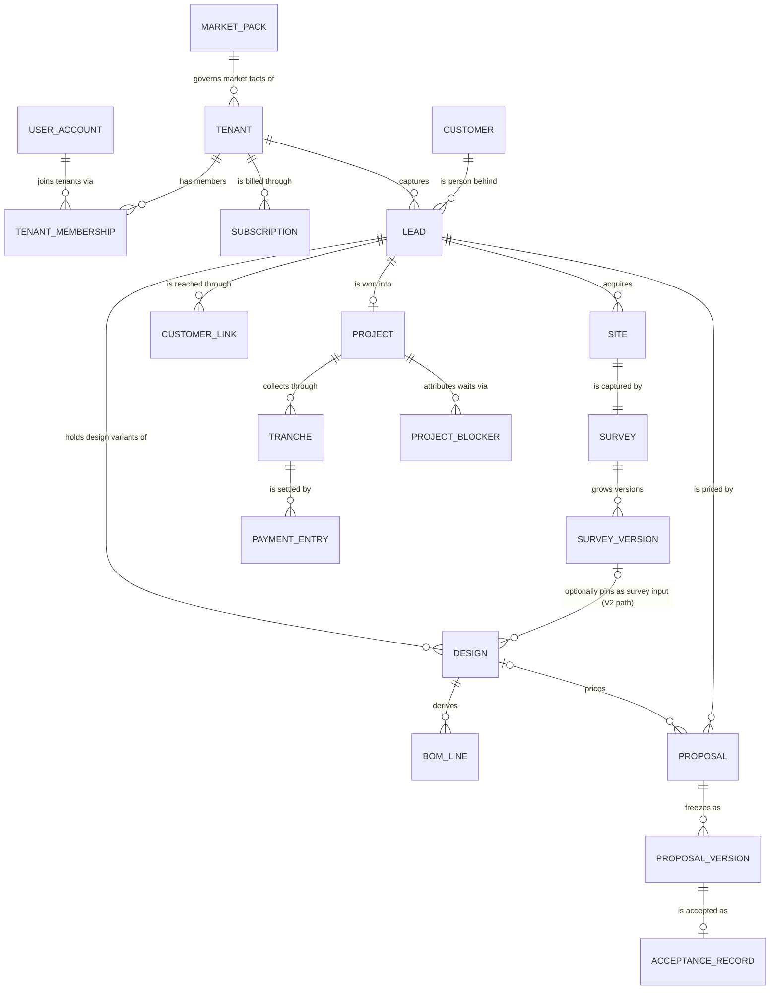

### 4.1 Identity & tenancy

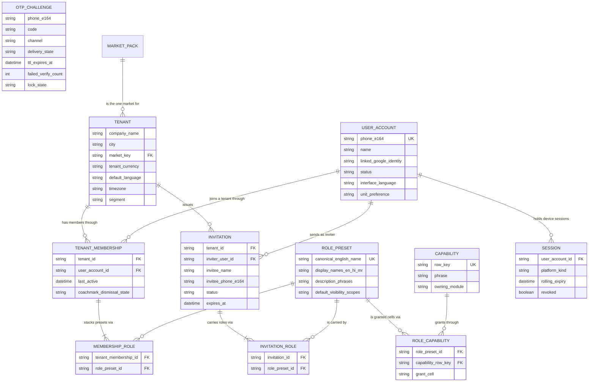

### 4.2 Market framework & localization

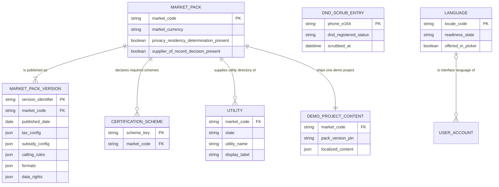

### 4.3 Platform billing & entitlements

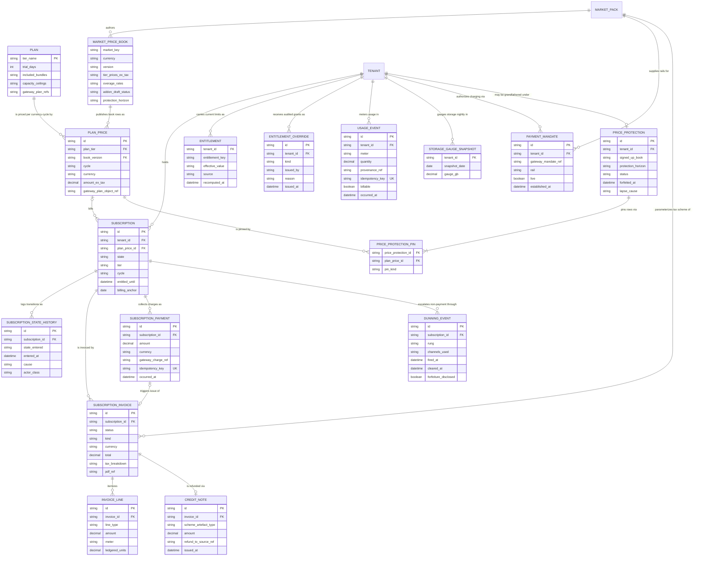

### 4.4 Tenant configuration, catalog & rates

```mermaid
erDiagram
  TENANT ||--o| BUSINESS_PROFILE : "has one profile"
  TENANT ||--|| ONBOARDING_PROGRESS : "tracks setup progress in"
  TENANT ||--o| BRANDING_SETTINGS : "has customer-document branding"
  TENANT ||--o| PROPOSAL_TEMPLATE_SETTINGS : "has document defaults"
  TENANT ||--o| TIMELINE_TEMPLATE : "has default timeline template"
  BUSINESS_PROFILE ||--o{ TAX_REGISTRATION : "holds registrations"
  MARKET_PACK ||--o{ TAX_REGISTRATION : "declares type and format of"
  BUSINESS_PROFILE |o--o| PROPOSAL_TEMPLATE_SETTINGS : "supplies bank details to"
  MARKET_PACK ||--o{ CATALOG_ITEM_MARKET_AVAILABILITY : "scopes availability via"
  CATALOG_ITEM ||--|{ CATALOG_ITEM_MARKET_AVAILABILITY : "is available via"
  CATALOG_ITEM ||--o{ CATALOG_ITEM_CERTIFICATION : "holds certifications via"
  CERTIFICATION_SCHEME ||--o{ CATALOG_ITEM_CERTIFICATION : "keys"
  CATALOG_RELEASE ||--|{ CATALOG_RELEASE_LINE : "lists changed items as"
  CATALOG_ITEM ||--o{ CATALOG_RELEASE_LINE : "is named changed in"
  TRANCHE_TEMPLATE ||--|{ TRANCHE_TEMPLATE_LINE : "is composed of"
  CATALOG_ITEM ||--o{ TENANT_CATALOG_OVERRIDE : "is overridden per tenant by"
  CATALOG_IMPORT_JOB |o--o{ TENANT_CATALOG_OVERRIDE : "creates price overrides"
  CATALOG_IMPORT_JOB |o--o{ TENANT_CATALOG_ITEM : "creates tenant SKUs"
  TENANT_CATALOG_ITEM |o--o{ CATALOG_RATE_ENTRY : "accrues dated rate history"
  TENANT_CATALOG_OVERRIDE |o--o{ CATALOG_RATE_ENTRY : "accrues dated rate history"
  MARKET_PACK ||--o{ PACK_RATE_ENTRY : "supplies base rates"
  PRICE_BOOK_VERSION ||--|{ PRICE_BOOK_RATE : "contains immutable rate rows"

  BUSINESS_PROFILE {
    string company_name
    string logo
    string address
    string bank_details
  }
  TAX_REGISTRATION {
    string registration_type FK
    string value
  }
  ONBOARDING_PROGRESS {
    string resume_step
    string per_step_state
    string prompt_point_state
  }
  BRANDING_SETTINGS {
    string logo
    string letterhead
    string brand_colour
    string derived_shades
  }
  PROPOSAL_TEMPLATE_SETTINGS {
    string cover
    string sections_included
    string default_terms
    string bank_details_ref FK
  }
  TIMELINE_TEMPLATE {
    string ordered_phases
  }
  MESSAGE_TEMPLATE {
    string template_key
    string language
    string body_with_variables
    string origin
  }
  INTEGRATION_CREDENTIAL {
    string kind
    string encrypted_secret
    string last4_display
    string probe_status
  }
  LEAD_CHANNEL_SETTING {
    string channel_key
    string availability
    boolean enabled
  }
  TENANT_HOLIDAY {
    date holiday_date
    string label
  }
  TRANCHE_TEMPLATE {
    string name
    boolean is_default
    boolean archived
  }
  CATALOG_ITEM {
    string item_id PK
    string component_kind
    string brand
    string model
    string provenance_label
    boolean archived
    boolean out_of_stock
  }
  TENANT_CATALOG_ITEM {
    string component_kind
    string brand
    string model
    string provenance_label
    string source_datasheet
    boolean archived
  }
  TENANT_CATALOG_OVERRIDE {
    string catalog_item_ref FK
    decimal price
    decimal tax_rate
    boolean hidden
    boolean preferred
  }
  CATALOG_RATE_ENTRY {
    string parent_ref FK
    decimal rate_value
    date entry_date
  }
  CATALOG_RELEASE {
    string label
    date publish_date
    string contents
  }
  CATALOG_IMPORT_JOB {
    string source_file
    string column_mapping
    string entry_point
    string status
    string per_row_report
  }
  STEEL_PROFILE {
    string section_id PK
    string shape_family
    string mass_rule
    string derived_label
    int default_order
  }
  PACK_RATE_ENTRY {
    string item_key
    string size_step
    decimal unit_rate
  }
  PRICE_BOOK_VERSION {
    date publish_date
    string change_summary
    decimal default_margin_pct
    boolean active_flag
    string currency
  }
  PRICE_BOOK_RATE {
    string rate_name
    string rate_kind
    decimal amount
  }
  CATALOG_ITEM_MARKET_AVAILABILITY {
    string catalog_item_ref FK
    string market_code FK
  }
  CATALOG_ITEM_CERTIFICATION {
    string catalog_item_ref FK
    string scheme_key FK
  }
  CATALOG_RELEASE_LINE {
    string catalog_release_ref FK
    string catalog_item_ref FK
    string change_kind
  }
  TRANCHE_TEMPLATE_LINE {
    string tranche_template_ref FK
    string label
    decimal percentage
    string due_on_stage
    int order_index
  }
```

### 4.5 CRM & marketing

```mermaid
erDiagram
  CUSTOMER {
    string phone_e164 "dedupe path, NOT unique - M02-12/M02-66"
    string name
    string preferred_language
    boolean do_not_call_flag
    boolean complaint_quiet_flag
    string merge_status
    string merged_into FK
  }
  CONTACT {
    string name
    string phone_e164
    string role_label FK
    boolean is_primary
  }
  CONTACT_ROLE_LABEL {
    string label UK
  }
  REFERRAL {
    string referring_customer FK
    string referred_lead FK
    datetime created_at
  }
  LEAD {
    string source
    string segment
    string stage
    string lifecycle_state
    string prior_stage
    string owner_ref FK
    money estimated_value
    date snooze_wake_date
  }
  ACTIVITY {
    string kind
    string actor_type
    string actor_ref
    datetime capture_time
    int server_apply_order
    text body
  }
  LEAD_ASSIGNMENT {
    string assigned_by FK
    string assigned_to FK
    datetime assigned_at
    int open_lead_count_snapshot
    string reason
  }
  LEAD_IMPORT {
    string file_name
    string run_by FK
    datetime run_at
    int total_rows
    int duplicate_count
    string progress_state
  }
  CONSENT_RECORD {
    string contact_ref FK
    string customer_ref FK
    string channel_class
    string consent_type
    string state
    string opt_in_source
    datetime recorded_at
  }
  SUPPRESSION_ENTRY {
    string customer_ref FK
    string channel_class
    string reason
    datetime recorded_at
  }
  CAMPAIGN {
    string name
    string channel_connection FK
    string owner_ref FK
    string state
    datetime scheduled_time
    string pause_reason
    boolean archived_flag
  }
  CAMPAIGN_TEMPLATE {
    string channel_binding
    string registration_state
    string rejection_reason
  }
  CAMPAIGN_SEND {
    string campaign FK
    string recipient_customer FK
    string state
    string failure_reason
    string excluded_reason
  }
  CAMPAIGN_LINK {
    string opaque_token UK
    string campaign FK
    string tenant_external_tag
  }
  LEAD_CAPTURE_RECORD {
    string lead FK
    string campaign FK
    string channel
    datetime arrival_time
    string dedupe_outcome
  }
  CAPTURE_FAILURE {
    string campaign FK
    string channel_connection FK
    text payload
    string failure_reason
    datetime received_at
  }
  LEAD_CAPTURE_FORM {
    string channel_connection FK
    string field_definitions
    string branding
  }
  CHANNEL_CONNECTION {
    string channel_type
    string identity
    string connection_state
    string registration_state
    string action_needed_reason
    string credential_masked
  }
  CUSTOMER ||--o{ LEAD : "raises"
  CUSTOMER ||--o{ CONTACT : "carries contacts"
  CONTACT_ROLE_LABEL ||--o{ CONTACT : "labels"
  CUSTOMER ||--o{ REFERRAL : "refers via"
  LEAD ||--o| REFERRAL : "attributed as referred by"
  LEAD |o--o{ ACTIVITY : "timeline entries"
  CUSTOMER |o--o{ ACTIVITY : "anchors stream"
  PROJECT |o--o{ ACTIVITY : "anchors timeline stream"
  LEAD ||--o{ LEAD_ASSIGNMENT : "assignment history"
  LEAD_STAGE_TRANSITION {
    string lead_ref FK
    string move_kind
    string from_value
    string to_value
    datetime moved_at
    string moved_by
    string cause
  }
  LEAD ||--o{ LEAD_STAGE_TRANSITION : "logs funnel and R9 moves as"
  USER_ACCOUNT ||--o{ LEAD_ASSIGNMENT : "assigner and assignee"
  USER_ACCOUNT |o--o{ LEAD : "currently owns"
  LEAD_IMPORT |o--o{ LEAD : "created"
  CUSTOMER |o--o{ CUSTOMER : "merged into survivor"
  DUPLICATE_LINK {
    string record_a_ref FK
    string record_b_ref FK
    string origin
    string resolution_state
  }
  CUSTOMER ||--o{ DUPLICATE_LINK : "is linked duplicate via"
  MESSAGE_TEMPLATE |o--o{ CAMPAIGN_TEMPLATE : "is content-class parent of"
  USER_ACCOUNT ||--o{ CAMPAIGN : "owns"
  CHANNEL_CONNECTION ||--o{ CAMPAIGN : "carries sends of"
  CAMPAIGN_TEMPLATE |o--o{ CAMPAIGN : "provides content for"
  CAMPAIGN ||--o{ CAMPAIGN_SEND : "produces"
  CUSTOMER ||--o{ CAMPAIGN_SEND : "targeted recipient"
  CONTACT |o--o{ CONSENT_RECORD : "messaging consent ledger"
  CUSTOMER |o--o{ CONSENT_RECORD : "calling consent state"
  CUSTOMER ||--o{ SUPPRESSION_ENTRY : "suppressed for class"
  CAMPAIGN |o--o{ LEAD_CAPTURE_RECORD : "produced capture"
  LEAD ||--o{ LEAD_CAPTURE_RECORD : "carries captures"
  CHANNEL_CONNECTION ||--o{ LEAD_CAPTURE_FORM : "connects"
  LEAD_CAPTURE_FORM |o--o{ LEAD_CAPTURE_RECORD : "submissions arrive as"
  CAMPAIGN |o--o{ CAPTURE_FAILURE : "logs failures"
  CHANNEL_CONNECTION ||--o{ CAPTURE_FAILURE : "logs failures"
  CAMPAIGN ||--o{ CAMPAIGN_LINK : "tags links with"
```

### 4.6 Site & survey

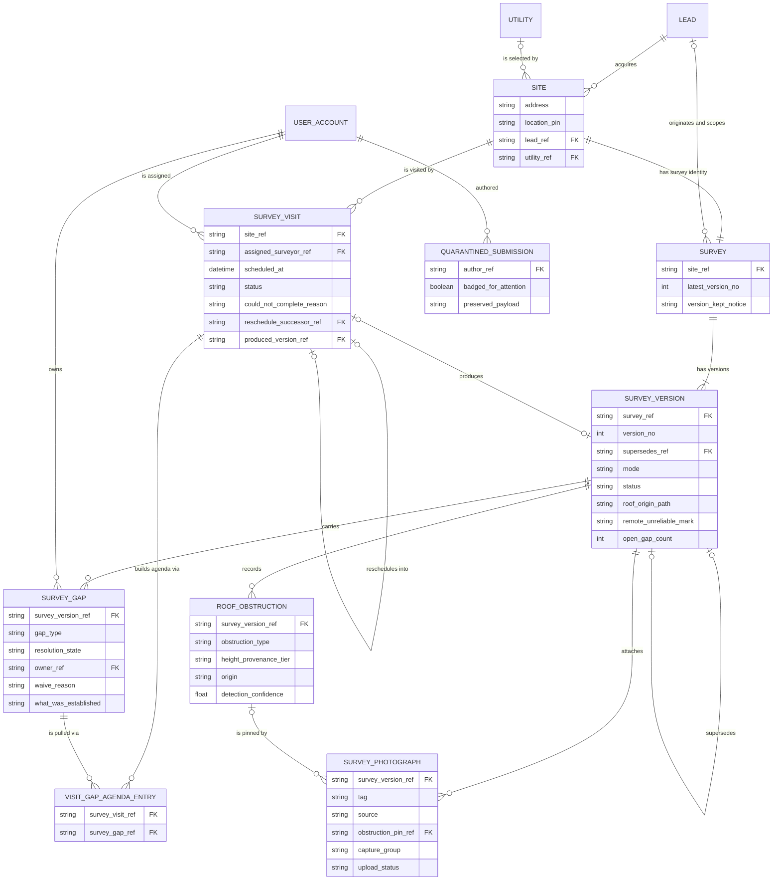

### 4.7 Design studio

```mermaid
erDiagram
  DESIGN {
    string design_id PK
    string lead_ref FK
    string duplicated_from FK
    string status
    int server_version
    string fingerprint_5layer
    string pinned_versions_set
    boolean is_recommended
  }
  PINNED_TILE {
    string tile_id PK
    string design_ref FK
    date imagery_capture_date
    string coordinate_mapping
    string provider_ref
  }
  ROOF_DETECTION {
    string detection_id PK
    string design_ref FK
    string pinned_tile_ref FK
    string detection_path
    string detector_version
    string operator_disposition
    boolean empty_result
    boolean billed
  }
  DETECTION_ARTIFACT {
    string artifact_id PK
    string source_detection_ref FK
    int artifact_version
    string tile_pin
    string dropped_entities
  }
  DESIGN_ROOF {
    string roof_id PK
    string design_ref FK
    string name
    string roof_type
    string provenance
    boolean locked
    string parent_roof FK
    string face_group_ref FK
  }
  FACE_GROUP {
    string face_group_id PK
    string design_ref FK
    decimal shared_pitch
    decimal shared_eave_height
  }
  DESIGN_OBSTRUCTION {
    string obstruction_id PK
    string design_ref FK
    string type
    string label
    string anchor_roof_ref FK
    boolean casts_shadow
    boolean engineer_confirmation_flag
    string ai_provenance
  }
  DESIGN_PANEL {
    string panel_id PK
    string design_ref FK
    string roof_ref FK
    string table_ref FK
    boolean enabled
    string string_ref FK
    int series_order
  }
  DESIGN_PANEL_TABLE {
    string table_id PK
    string design_ref FK
    string name
    string structure_preset
    string racking_kind
    string foundation_kind
    string remove_map
  }
  DESIGN_BLOCK {
    string block_id PK
    string design_ref FK
    decimal block_gcr
    decimal block_tilt
    string aggregate_provenance
  }
  DESIGN_STRING {
    string string_id PK
    string design_ref FK
    string inverter_placement_ref FK
    string mppt_slot
    string origin
    string colour
  }
  DESIGN_INVERTER_PLACEMENT {
    string placement_id PK
    string design_ref FK
    string catalog_item_ref FK
    string wall_position
  }
  DESIGN_CABLE_ROUTE {
    string route_id PK
    string design_ref FK
    string string_ref FK
    string kind
    boolean manual_flag
    decimal routed_length_m
  }
  DESIGN_SAFETY_ITEM {
    string safety_item_id PK
    string design_ref FK
    string kind
    string geometry
  }
  DESIGN_CAPTURE {
    string capture_id PK
    string design_ref FK
    string slot
    string image_blob_ref FK
    string version_pictured
    boolean is_cover
  }
  IMAGE_BLOB {
    string blob_id PK
    string tenant_ref FK
  }
  SOLAR_DATA_CACHE {
    string coordinate_key PK
    string result_status
    string provider
    date cache_day
  }
  WEATHER_DATASET {
    string weather_id PK
    string design_ref FK
    string source_database
    string years_covered
    string pin_stamp
  }
  BOM_LINE {
    string line_key PK
    string design_ref FK
    string category
    string confidence_tier
  }
  BOM_LINE_OVERRIDE {
    string override_id PK
    string design_ref FK
    string line_key
    string field
    string override_value
    string engine_value_at_edit
  }
  BOM_CUSTOM_LINE {
    string custom_line_id PK
    string design_ref FK
    string category
    boolean included
  }
  SLD_RATING_OVERRIDE {
    string override_id PK
    string design_ref FK
    string field_key
    string override_value
  }
  DESIGN_SIGNOFF {
    string signoff_id PK
    string design_ref FK
    string decision
    string decided_by
    string pinned_design_version
    string pinned_fingerprint
  }
  SIGNOFF_COMMENT {
    string comment_id PK
    string signoff_ref FK
    string pinned_target
    string resolution_state
  }
  DESIGN_DECISION_LOG_ENTRY {
    string entry_id PK
    string design_ref FK
    string topic
    string choice
  }
  INSIGHT_DISPOSITION {
    string disposition_id PK
    string design_ref FK
    string insight_dedupe_key
    string disposition
  }
  INSTALLATION_PLAN_TICK {
    string tick_id PK
    string design_ref FK
    string step_id
    string ticked_by
    string done_by
  }
  LEAD ||--o{ DESIGN : "holds design variants of"
  DESIGN |o--o{ DESIGN : "duplicated from"
  SURVEY_VERSION |o--o{ DESIGN : "is pinned survey input of"
  CATALOG_RELEASE ||--o{ DESIGN : "is pinned by"
  PRICE_BOOK_VERSION ||--o{ DESIGN : "is pinned by"
  MARKET_PACK_VERSION ||--o{ DESIGN : "supplies pinned rules to"
  DESIGN ||--o{ PINNED_TILE : "pins"
  DESIGN ||--o{ ROOF_DETECTION : "runs"
  PINNED_TILE ||--o{ ROOF_DETECTION : "is detected against"
  ROOF_DETECTION ||--o| DETECTION_ARTIFACT : "validates into"
  PINNED_TILE |o--o{ SURVEY_VERSION : "is imagery reference of (V2)"
  CATALOG_ITEM |o--o{ DESIGN : "is selected component of"
  DESIGN ||--o{ DESIGN_ROOF : "contains"
  DESIGN_ROOF |o--o{ DESIGN_ROOF : "parents stacked child"
  FACE_GROUP |o--o{ DESIGN_ROOF : "links plane-shared faces of"
  DESIGN ||--o{ FACE_GROUP : "carries"
  DESIGN ||--o{ DESIGN_OBSTRUCTION : "contains"
  DESIGN_ROOF |o--o{ DESIGN_OBSTRUCTION : "anchors or ground"
  DESIGN_OBSTRUCTION |o--o| DESIGN_ROOF : "converts to rooftop platform"
  DESIGN ||--o{ DESIGN_PANEL : "contains"
  DESIGN_ROOF ||--o{ DESIGN_PANEL : "hosts placement of"
  DESIGN_PANEL_TABLE |o--o{ DESIGN_PANEL : "groups as derived instances"
  DESIGN ||--o{ DESIGN_PANEL_TABLE : "contains"
  DESIGN ||--o{ DESIGN_BLOCK : "carries in payload"
  DESIGN_BLOCK |o--o{ DESIGN_PANEL_TABLE : "aggregates tracker tables"
  STEEL_PROFILE |o--o{ DESIGN_PANEL_TABLE : "is structure profile of"
  DESIGN ||--o{ DESIGN_STRING : "contains"
  DESIGN_STRING |o--o{ DESIGN_PANEL : "chains in series order"
  DESIGN ||--o{ DESIGN_INVERTER_PLACEMENT : "places"
  CATALOG_ITEM ||--o{ DESIGN_INVERTER_PLACEMENT : "specifies"
  DESIGN_INVERTER_PLACEMENT |o--o{ DESIGN_STRING : "receives on MPPT slots"
  DESIGN ||--o{ DESIGN_CABLE_ROUTE : "routes cable through"
  DESIGN_STRING |o--o| DESIGN_CABLE_ROUTE : "has routed home-run"
  DESIGN ||--o{ DESIGN_SAFETY_ITEM : "contains"
  DESIGN ||--o{ DESIGN_CAPTURE : "has shadow captures"
  IMAGE_BLOB |o--o| DESIGN_CAPTURE : "stores image of"
  DESIGN_CAPTURE |o--o| DESIGN : "is cover of"
  DESIGN ||--o| WEATHER_DATASET : "stores measured weather for"
  DESIGN ||--o{ BOM_LINE : "derives re-emitted"
  DESIGN ||--o{ BOM_LINE_OVERRIDE : "carries sparse overrides"
  DESIGN ||--o{ BOM_CUSTOM_LINE : "carries custom lines"
  DESIGN ||--o{ SLD_RATING_OVERRIDE : "carries rating overrides"
  DESIGN ||--o{ DESIGN_SIGNOFF : "receives append-only"
  DESIGN_SIGNOFF ||--o{ SIGNOFF_COMMENT : "return carries"
  DESIGN ||--o{ DESIGN_DECISION_LOG_ENTRY : "records automated decisions"
  DESIGN ||--o{ INSIGHT_DISPOSITION : "records dispositions"
  DESIGN ||--o{ INSTALLATION_PLAN_TICK : "remembers ticks of"
```

### 4.8 Proposals, sales execution & voice

```mermaid
erDiagram
  PROPOSAL {
    string proposal_number PK
    string lead_ref FK
    string design_ref FK
    string type
    string path
    string status
    string currency_code
    datetime marked_shared_at
  }
  PROPOSAL_VERSION {
    int version_number PK
    string proposal_ref FK
    string catalog_release_pin FK
    string price_book_version_pin FK
    string market_pack_version_pin FK
    string design_fingerprint_pin
    string change_note
    string creation_trigger
  }
  PROPOSAL_COMPONENT_LINE {
    string proposal_ref FK
    string frozen_version_ref FK
    string catalog_item_ref FK
    string category
    string brand_model
    int count
    string resolution_provenance
    string provenance_tier
  }
  PROPOSAL_TRANCHE {
    string proposal_ref FK
    string frozen_version_ref FK
    string label
    decimal percentage
    int order_index
    string due_on_stage
    string source_template_ref
  }
  TASK {
    string lead_ref FK
    string assignee_ref FK
    string kind
    date due_date
    string status
    string provenance_rule
  }
  AGENT_CONFIG_VERSION {
    int version PK
    string status
    string offered_languages
    string opening_line
    string handover_rules
    string calling_window
    int max_attempts
  }
  KNOWLEDGE_BASE_SECTION {
    string section_key PK
    string content_per_language
    bool seeded_from_default
  }
  UNANSWERED_QUESTION {
    string question_pattern
    int asked_count
    string section_guess FK
    string answer
    string answer_path
  }
  CALL_QUEUE_ENTRY {
    string lead_ref FK
    string trigger_reasons
    datetime scheduled_not_before
    int pinned_config_version FK
    int attempt_count
    string gate_verdict
    string cancellation_record
  }
  CALL_RECORD {
    string lead_ref FK
    string customer_ref FK
    string direction_actor
    string outcome
    string transcript
    string language
    int config_version_ref FK
    decimal metered_minutes
  }
  AGENT_REVIEW_ITEM {
    string call_ref FK
    string corrected_outcome
    string correcting_actor
    bool promoted_to_kb
  }
  HANDOFF_RECORD {
    string call_ref FK
    string target_kind
    string target_user_ref FK
    string reason
    string pinned_context
    string outcome
    string path_run
  }
  ROUTING_POLICY_VERSION {
    int version PK
    string origin
    string ordered_rules
    string escalation_chains
    string level_target_kind
    string terminal_fallback
  }
  USER_PRESENCE {
    string user_ref FK
    string state
    datetime until_time
  }
  IVR_FLOW_VERSION {
    int version PK
    string status
    string origin
    string menu_items
    string destination_kind
    string greetings_per_language
    string fallback_route
  }
  TELEPHONY_NUMBER {
    string number PK
    string kind
    string byo_status
    string failure_reason
  }
  LEAD ||--o{ PROPOSAL : "is quoted by"
  DESIGN |o--o{ PROPOSAL : "pre-fills and prices Path A"
  BOM_LINE |o..o{ PROPOSAL : "feeds computed money snapshot"
  PROPOSAL ||--o{ PROPOSAL_VERSION : "generates"
  PROPOSAL |o--o{ PROPOSAL : "duplicated from"
  PROPOSAL ||--o{ PROPOSAL_COMPONENT_LINE : "selects"
  PROPOSAL_VERSION |o--o{ PROPOSAL_COMPONENT_LINE : "freezes at generation"
  CATALOG_ITEM |o--o{ PROPOSAL_COMPONENT_LINE : "resolves to"
  PROPOSAL ||--o{ PROPOSAL_TRANCHE : "schedules payment in"
  PROPOSAL_VERSION |o--o{ PROPOSAL_TRANCHE : "freezes at generation"
  MARKET_PACK_VERSION ||--o{ PROPOSAL_VERSION : "is pinned by"
  PRICE_BOOK_VERSION ||--o{ PROPOSAL_VERSION : "is pinned by"
  CATALOG_RELEASE ||--o{ PROPOSAL_VERSION : "is pinned by"
  LEAD ||--o{ TASK : "carries"
  USER_ACCOUNT ||--o{ TASK : "is assignee of"
  PROPOSAL |o--o{ TASK : "share auto-creates follow-up"
  LEAD ||--o{ CALL_QUEUE_ENTRY : "is queued for"
  AGENT_CONFIG_VERSION ||--o{ CALL_QUEUE_ENTRY : "pinned at queue time"
  CALL_QUEUE_ENTRY |o--o{ CALL_RECORD : "produces dial attempts"
  LEAD ||--o{ CALL_RECORD : "timelines"
  CUSTOMER ||--o{ CALL_RECORD : "dialed under compliance gate"
  AGENT_CONFIG_VERSION |o--o{ CALL_RECORD : "answered under"
  ROUTING_POLICY_VERSION |o--o{ CALL_RECORD : "routes"
  IVR_FLOW_VERSION |o--o{ CALL_RECORD : "routes inbound"
  TELEPHONY_NUMBER |o--o{ CALL_RECORD : "carries"
  CALL_RECORD ||--o{ AGENT_REVIEW_ITEM : "correction emits"
  CALL_RECORD ||--o{ HANDOFF_RECORD : "hands to human via"
  USER_ACCOUNT |o--o{ HANDOFF_RECORD : "is target of"
  KNOWLEDGE_BASE_SECTION |o--o{ UNANSWERED_QUESTION : "collects and answers"
  USER_ACCOUNT ||--o| USER_PRESENCE : "declares availability via"
```

### 4.9 Customer link

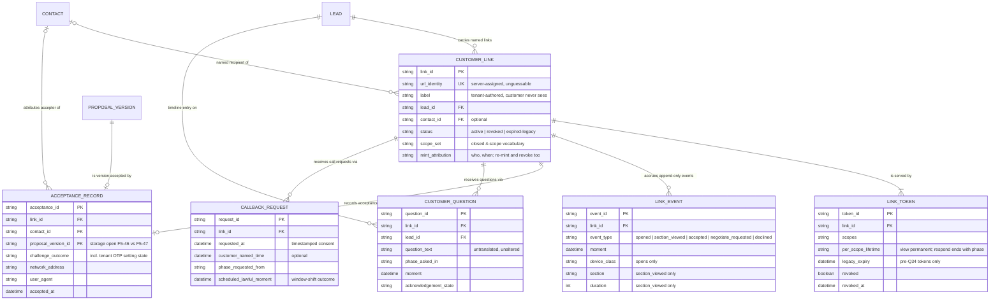

### 4.10 Projects, payments & collections

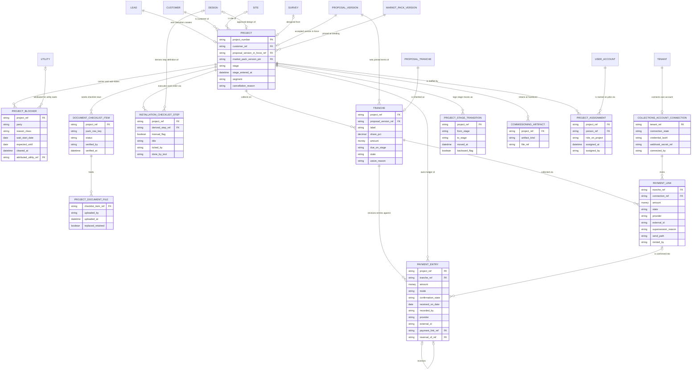

### 4.11 Field workforce & HR-lite

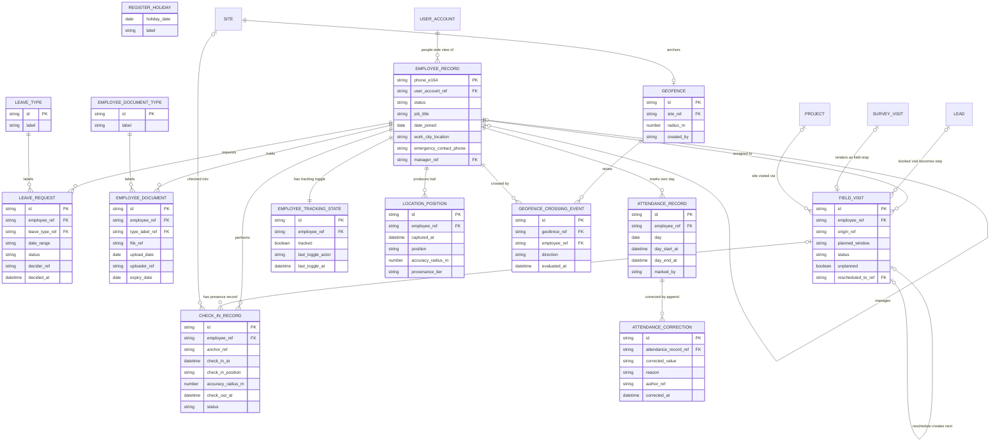

### 4.12 Platform services

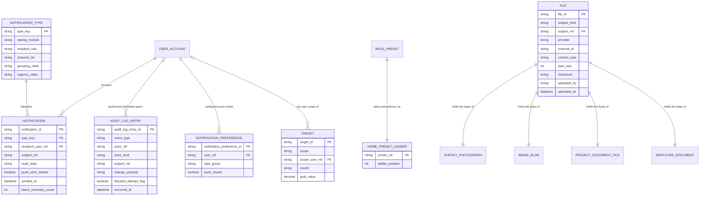

*(Matrix 3.12's polymorphic-subject row — any module record is the subject of a notification, deep-linked and never dangling — is not drawable as one edge; this footnote carries it.)*

## 5. Business Rules & Constraints

### 5.0 Cross-cutting laws (bind every domain)

- **One tenant, one market, one currency.** Market facts (tax, stages, checklists, rails, phone
  spec, calling rules) resolve from versioned market packs, never from constants (OV-23, F1).
- **Phone is the identity anchor on both sides**: globally unique E.164 login identity for
  `user_account` (M01-18); capture-time dedupe key for customers/leads on every channel (M02-07).
- **Deactivate, never delete.** Users, employees, catalog items, leads: terminal states, archival
  flags, merges — never row deletion. The single lawful deletion path is the data-rights erasure
  workflow (F1-24, BM-32, OV-31).
- **The server owns truth**: server-assigned business identifiers and timestamps; client capture
  times are display/audit only and order nothing (F4, M08 project numbers, M09-71, M02-67).
- **Money**: every money-bearing document root stamps the tenant currency; BOM ↔ proposal ↔
  tranches ↔ payments reconcile to the currency's minor unit; a figure whose inputs moved renders
  provisional (money-never-stale, F8; 01 §9).
- **Provenance is a four-value enum** — measured / derived / estimated / assumed — carried per
  user-visible number; recorded values are untiered (Q59); energy figures also carry a source
  label (F8-01/02, OV-22).
- **Sent things never mutate.** Sent proposal versions, survey versions, sign-off records,
  catalog releases, audit entries, usage events are append-only/immutable; a change is a new
  version that may mark older outputs stale, never a rewrite (OV-41, M04-57, F8-13..15).
- **Soft-block law**: in every billing state, reads, search, dashboards, export, and customer
  links keep working; only new creations pause at caps/halted (BM-32..36).
- **Entitlements are the only gating** — no feature flags anywhere (OV-27/28, BM-05).
- **Every automated act is attributable**: audit log from the first mutation; automation lands as
  owned, dated tasks; toggle/send/override events carry actor + timestamp (F2-22, OV-13).
- **Structural adequacy is never computed** — engineer sign-off is a human, append-only record,
  and the disclaimer travels with every structure-bearing output (OV-22, M05).
- **V1 sends nothing; V1 composes.** No tenant has a connected messaging channel in V1, so every
  transactional moment takes `Q33`'s composed copy-paste fallback and no surface claims delivery.
  A time-triggered push with no pull equivalent (`F5-68`, `M02-47`, `M02-48`) is a person's task in
  V1, never an automated send. `channel_connection` and the campaign lane arrive with M03 (V2).
- **No second seat count.** `employee_tracking_state` is the only place the product counts people
  (BM-22, DD7, M09).
- **Survey is an alternative capture path, never the studio's input.** The V1 studio draws its own
  roof in Step 2 — which is precisely why M04 went V2 (owner ruling Q67). No V1 capability may
  require a survey entity; every reference from a V1 entity into the survey domain is optional and
  null until M04 lands, and an absent survey is never staleness, never a gate and never a gap
  (Q67, MS2-37/38/40, M04-04/05).
- **Configuration a V1 path reads is platform-seeded, never assumed.** Where the surface that
  authors a piece of tenant configuration is a V2 screen but a V1 path reads the data, the TABLE is
  V1 and the block that provisions the tenant writes a platform-seeded default row of the same shape
  a tenant would author; the V2 editor is the second writer, never the first. `message_template`
  (block 1 seeds the key list; the M01 editor is V2) and the voice trio — default routing policy,
  default IVR flow, platform telephony number (§5.8) — both take this path. A V1 read of a row that
  nothing authors is the defect this law exists to prevent (§M07.8 "the routing layer's seed",
  M07-11, M07-47, M07-51).

### 5.1 Identity & tenancy

- phone_e164 is the login identity, unique globally; a known phone at signup offers login and never creates a duplicate account or company. (M01-08, M01-18, OV-31)
- No passwords exist anywhere; sign-in is phone + single-use OTP, or a linked Google identity bound to the SAME phone account — never a duplicate account. (M01-02, M01-05, Q18)
- Exactly twelve fixed preset roles named verbatim for the personas; no tenant create/edit/rename/delete/duplicate; canonical identity is the fixed English name, display names localized EN/HI/MR. (F2-01, F2-02, F2-16, PS-02)
- Permission resolution is exactly OR across held presets' matrix cells — no AND, no precedence, no negative grant; a preset can only add. (F2-11)
- No per-person permission exceptions may exist as data — every grant is explicable as "holds preset X"; role-change audit entries (old → new set) keep this honest. (F2-15, F2-22)
- Visibility resolves per domain (leads, projects, field work, people records, money, campaigns), widest-wins within a domain, never leaking across domains; EPC Owner is All everywhere. (F2-12, F2-13, F2-14)
- A tenant always retains ≥1 EPC Owner and ≥1 Manage-team holder — guarded at the transition, not UI-only; blocked attempts are themselves audit entries. (F2-19, M01-19, F2-22)
- The signup actor becomes the tenant's first EPC Owner server-side, so F2-19 holds from the first moment. (M01-01)
- Users are deactivated, never deleted: sessions revoked ≤10 min, hidden from assignment pickers, open work reassigned, all history stays attributed forever. (F2-20, M01-18, M01-07)
- An invitation must carry ≥1 preset role — zero-role invites are blocked before sending; invite sends are capped per tenant per day (value unspecified). (F2-21, M01-12, M01-04)
- Invite acceptance is atomic: OTP verification creates user_account + tenant_membership + membership_role rows in one step — no half-joined state. (M01-13)
- capability rows carry stable keys `F2.M<nn>.<slug>` and the matrices are the ONLY permission truth — modules reference row keys, never restate grants; a scope word in the cell IS the grant. (F2-25, F2-26)
- Matrix cells and presets are fixed product data; the sole v1 grant-set supersession is DD11 (catalog: Owner + Operations manage, Finance views prices/margins). (F2-02, F2-26)
- OTP is single-use with 5-min TTL; per-phone caps 3/15 min and 8/day; 5 failed verifies invalidate; 3 consecutive invalidations lock the phone 15 min; a confirmed hard delivery failure releases only the resend cooldown. (M01-03, M01-04, M01-05, Q44, Q51)
- No automatic OTP channel fallback; SMS delivers, voice is user-initiated only, failure fails loudly. (M01-03, Q47)
- otp_challenge is keyed by phone pre-account — anti-abuse counters and lock state attach to the phone, never to a user_account. (M01-03, M01-04)
- Session lifetimes are fixed: web 30 days rolling, mobile 90 days; deactivation or sign-out-everywhere ends every session within ≤10 minutes. (M01-07)
- Roles bind only to tenant users (Owner/Employee audiences); the customer never holds an account, role or matrix cell and reaches the product only via the F5 token link. (F2-18, PS-04, OV-32)
- Mid-task permission loss is graceful: the in-flight action completes; restriction applies from the next action. (F2-17)
- One market and one currency per tenant, set at creation; every market fact resolves from the versioned market pack, never a stored constant. (F1-07, M01-23, OV-23)
- Signup stores exactly phone, company name, owner name, city — nothing else (no tax, logo, team, plan or payment data). (M01-01, M01-11)
- Tenant default_language governs customer-facing document defaults and the new-invite default only; interface language is always per-user on user_account. (M01-59, F3)
- Stacking presets is the only way to widen access; one person may hold several presets, shown as chips. (M01-20, F2-10)
- Invitation decline voids the invite and notifies the EPC Owner; an expired invite supports a one-tap re-invite request to the inviter. (F2-21, F6.3 matrix)
- No commercial figure may appear on any surface reachable through Installation Team Member grants — a surface property that stacking never weakens, enforced through the money-domain grant cells. (F2-06, PS-27)

### 5.2 Market framework & localization

- Packs are platform-authored, never tenant-editable; statutory-floor items can only be narrowed by tenant config (shorter window, extra holidays), never widened — no override flag, no support-side bypass. (F1-12, F1-17, F1-36)
- Pack data versions as one unit; a revision is a dated data update; computed outputs pin the pack/rules version and self-stale on revision, never recompute; running work keeps its version, new work takes the new one; sent proposals keep their versions forever. (F1-01, F1-11)
- Launch gate: pack.tax, pack.formats, pack.data-rights and the market price book can never be empty; a privacy/residency determination must exist before any tenant, a supplier-of-record decision before any sale — both stored with the pack. (F1-05)
- An absent voice ruleset hard-disables outbound voice — never a permissive default. pack.subsidy may be `none`; an empty certification-scheme set means no badges and no gates — never an error. (F1-16, F1-14, F1-19)
- Pack internal consistency is validated at authoring (a subsidy requiring a scheme the scheme set lacks makes the pack invalid); pack validation is a platform-ops duty, never resolved locally by a module. (F1 §F1.2)
- No market fact is ever a module-level constant; every market fact resolves from the versioned pack through the eight keys. (F1-01, F1-04, OV-23)
- Market vocabularies (payment modes, mandate types, checklists) are open sets validated against the tenant market's pack — never closed product enumerations. (F1-09, F1-18, F1-41, F1-42)
- State machines store market-neutral value names; what users read is the pack's display label; historical records render the current label, already-generated documents keep the label they were generated with. (F1-09, F1-22, F1-51)
- Every ruleset item carries an explicit floor-or-default classification; clock-time floors are measured on the tenant's timezone — one clock, never per-recipient or per-market. (F1-17, F1-10, F1-15)
- DND scrub is refreshed daily before the calling window opens; entries older than 24 h pause promotional dialing fail-closed while transactional calls continue. (F1-36, F1-15)
- The AI-disclosure flag ships OFF for IN and auto-flips ON with owner notification when TRAI's rule binds — a dated, notified pack-data change. (F1-36, F1-Q1)
- Certification schemes key the scheme-keyed certifications on catalog items; subsidy-path money gates fail non-conforming outputs at Generate time (IN: DCR). (F1-19, F1-34, F1-44)
- Utility/DISCOM names and the scheme keys are proper nouns, never translated — stored and rendered byte-identical in every language. (F1-53, F3-08)
- Format values (currency symbol/grouping/minor unit, digit rules, date style, default timezone, holiday calendar, phone spec, OTP allowlist, unit defaults) live only in pack.formats — stated once, never duplicated, never role/plan/tenant-configurable. (F1-21, F3 §5, F1-12)
- The OTP-destination allowlist is pack data (+91 default); enabling another country code is a data switch, not a code change. (F1-49, F1-21)
- One demo project per pack, versioned with the pack — pack content, not a ninth rules key; tenant instances are labelled demo, resettable, excluded from reports. (F1-02, M01-27, Q19)
- market_code is unique (one pack per market); market_code + version_identifier is unique; exactly one authored pack exists at launch (IN) on global-safe schemas. (F1-01, F1-06)
- Pack authoring and change control are platform operations outside the tenant role system: every change versioned, dated and audited; no tenant-facing surface edits pack data. (F1 §4, F1-11, F1-12)
- The pack supplies only the market default timezone; the tenant's actual timezone is tenant data. (F1-10, F1-21)
- No FX-converted pricing ever rides pack data; the market's commercial book is a separate authored artifact (billing domain) whose absence is the defined cannot-sell state. (F1-25, F1-26, F1-27)

### 5.3 Platform billing & entitlements

- Two money systems never mix: platform billing entities are fully disjoint from tenant collections (M11 tranches/payments); no surface or total combines them. (M12-01, BM-02)
- Exactly one non-terminal subscription per tenant; state is always one of the six BM-33 names; no pause state; reactivation always creates a NEW subscription and NEW mandate, never resumes a halted one. (M12-04, M12-08, M12-13, M12-14)
- A successful charge is entitlement truth and is atomic from the tenant's view: extends entitled window (period end + 3-day buffer), writes subscription_payment, triggers the tax invoice, clears all pending dunning rungs; idempotent — stale/out-of-order gateway events never regress state or double-extend. (M12-05, M12-09, M12-39)
- No payment instrument (card, mandate, bank) is ever stored on the platform — hosted gateway checkout only; only gateway references exist locally; one live mandate at a time, established at conversion never signup. (M12-10, M12-11, BM-29)
- Each tier has exactly two gateway plan objects (monthly + yearly) mirrored 1:1 by per-currency plan_price rows; platform tables are entitlement truth, the gateway's are money truth. (M12-12)
- One entitlement row per tenant + key (current effective limit); recomputed in the same act as the charge/plan change; entitlements are the ONLY runtime gating — no feature flags, no studio key beyond design-kW, no proposal-type key ever; no entitlement gates read or export. (M12-15, M12-16, M12-20, M12-28, OV-27)
- Entitlement changes outside plan/trial derivation exist only as audited entitlement_override records (who/what/why/when); at most one 7-day trial extension per tenant. (M12-19, M12-52)
- Subscription state history and the usage ledger are append-only; every usage_event carries a provenance reference and an idempotency key; the ledger is the bill and the only counter — rollups always reproducible from it. (M12-04, M12-32)
- Usage screen, gate enforcement and invoice overage lines must read the same rollup of the same ledger; overage add-on lines equal ledgered units × the book's published per-unit rate — a discrepancy is a defect by definition. (M12-34, M12-35, F8-33)
- Issued invoices are immutable: PDF attached at issue, never regenerated; pack tax updates never change issued invoices; platform is supplier of record with its registration identifiers on every invoice. (M12-44, M12-45)
- Refunds: 7-day money-back on the first paid cycle only, refund-to-source, exactly one credit note auto-issued against that cycle invoice; renewal cycles have no refund path; an unconverted trial refunds nothing. (M12-47, M12-51)
- Grandfathering: a protected tenant bills its signed-up plan_price rows until the book's horizon lapses; a lapse to cancelled/halted forfeits protection permanently — reactivation bills the current list book; repricing never mid-cycle or retroactive. (M12-57, BM-42, Q43)
- Trial is modelled in-app only: 14 days, no gateway subscription, mandate or plan_price link until conversion; trial remainder never extends the first paid period. (M12-52, M12-54)
- Meters are a closed set; detections bill only when a result returned (failures ledgered unbilled); OTP tracked not billed v1; storage is a nightly gauge snapshot, never a counter; tracked-seat-months derive from M09 toggle history with month-fraction arithmetic. (M12-33, BM-16..BM-22)
- Caps are plain counts over the tenant's cycle window, reset on the billing anchor; 80% pre-warning must precede any gate; 100% starts 7-day grace, then only NEW creations pause. (M12-30, BM-34)
- Metering writes never fail or delay the request they record; gaps repaired by reconciliation (6-hour gateway poll), never user-facing. (M12-18, M12-43, M12-09)
- Dunning ladder runs per subscription from the first failed charge (day 0/2/4/6/7, post-halt weekly ×4 then monthly indefinitely); trial nudges (day 7/12/14) reuse the same pipeline; a successful payment clears all pending rungs; protected tenants get forfeiture disclosure from day 0. (M12-39, M12-42, Q43)
- Cancellation captures a reason as product signal, never a gate; service runs to paid period end; all data retained; reactivation always offered. (M12-50)
- Every billing act requires F2.M12.manage-billing (Owner only); employees see billing state but never amounts, prices, invoices or usage figures; no billing state, surface or dunning message ever reaches a customer link. (M12-56, M12-29)
- Billing schema is per-currency and provider-neutral behind billing ports; one market and one currency per tenant; no FX-derived pricing; a market without an authored book cannot sell. (M12-03, F1-07, F1-26, BM-37)
- Tier and state vocabulary resolve verbatim from 04-business-model's book — this domain stores no constant of its own; a second definition is a defect. (M12-02, M13-49)
- Audit coverage (F2-22): plan changes, subscription transitions, entitlement overrides, mandate changes and every reactivation write audit_log_entry rows. (M12-58)
- Nothing is deleted for non-payment; deletion only via data-rights erasure, and financial/tax records outlive erasure under the pack's statutory retention (IN: GST 6+ years). (BM-32, F1-24, F1-32)
- Draft add-on book rates (V2 meters) are unsellable until rate cards verify; benchmarks are recorded with provenance (page, date, currency). (BM-26, BM-39, BM-41)

### 5.4 Tenant configuration, catalog & rates

- Catalog resolution order is fixed and per-field: tenant override → tenant own item → platform item; unset override fields fall through (M01-32, M01-37).
- At most one override per platform item per tenant; overrides are sparse — exactly price, tax rate, hide, preferred (M01-37).
- Archive, never delete: catalog items, tenant SKUs and tranche templates archive; every existing reference (old proposals, drafts, BOM lines) keeps resolving; deletion does not exist (M01-42, M01-54).
- Rate changes on tenant SKUs and overrides are append-only dated entries, never in-place edits — any past output can name the rate it used (M01-44).
- Catalog releases are labelled and append-only; designs and proposal versions pin the release label; a publish self-stales older pins by comparison, never silent recompute; sent proposals keep their pins forever (M01-43, M01-49, F8-13/14/15).
- Price-book versions are immutable; exactly one active per tenant; the default margin percentage rides the version; rates are in the tenant's single currency; publishing is serialized server-side (M01-48, M01 §M01.5).
- Every catalog item carries exactly one of three provenance labels — verified-datasheet / tenant-provided / representative — and the label rides into the picker (M01-35, F8-06).
- Platform items are read-only to tenants; the sparse override is the only tenant-side write on them (M01-34, M01-37).
- The platform catalog is market-scoped: a tenant reads only its market's slice plus its own SKUs; tenant SKUs are invisible to other tenants (M01-33, M01-36).
- Import smart matching: rows matching platform products become price overrides (never duplicate SKUs, never spec edits); unknown rows become tenant SKUs; re-running the same file appends new rate entries on the overrides (M01-41, M01-37, M01-44).
- Datasheet-PDF extraction is review-before-commit — never committed silently; the source datasheet stays attached; failure degrades to the manual form (M01-40).
- Tenant SKUs pass the same spec gates as platform items (panel: watt>0, length>width, Voc>Vmp, Isc>Imp, negative temp coefficient, price>0; inverter electrical contract); a violating entry never reaches a picker (MS4-13, MS4-23, MS4-06).
- The business profile is the single write-point for company identity facts; every consumer (proposal, agent script, customer link, invoice) references it and never re-asks (M01-31, M01-51).
- Tax registrations stay empty until the first proposal send forces the prompt; types and formats come from pack.tax; validation is live and skippable, never a hard wall (M01-24, M01-25).
- Zero-config fallback is total: every setting has a working platform default; a tenant with zero configuration can send a real proposal (M01-28, M01-22).
- Each skipped onboarding fact keeps exactly one later in-context prompt-point, tracked in onboarding_progress (M01-29, M01-10).
- Tranche-template percentages sum to exactly 100.00 (save blocked otherwise); two standard templates (10/60/20/10, 30/60/10) seeded at tenant creation; exactly one is default; editing never changes documents already generated (M01-54).
- Branding applies to customer documents only; a palette is never rejected — compliant shades are derived computationally; the operator app is never restyled per tenant (M01-50).
- Message templates are tenant-authored content per key × language; a missing language falls back to the original language with a note; the seeded key list is exhaustive and platform-owned (M01-55, F6-26).
- Integration credentials are write-only: last-4 display only, no read-back; scheduled probes; every platform decrypt audit-logged; invalid credential raises alert plus persistent nag — never silent failure (M01-60).
- Tenant holiday additions only narrow calling availability, never widen past the pack's statutory floor (M01-59).
- Catalog neutrality is product law: no sponsored ranking or pay-to-play data on any catalog surface; no tenant request-queue entity exists (M01 §5 CG-13, M01-46).
- Pack rate resolution rounds cable rates UP to the next priced size — never understating; all commercial market data is pack-driven with tenant overrides winning via catalog resolution (MS10-26, MS10-39).
- Search ranks preferred first, then relevance; archived items appear only under the archived filter (M01-38).
- Catalog, price-book, branding, template and credential changes are audit events; concurrent catalog edits resolve last-write-wins per server apply order with both attempts in the audit trail (M01 §M01.4, §M01.5, M01-60, F2-22).

### 5.5 CRM & marketing

- The pack-normalised E.164 phone is the customer's dedupe key, not an enforced unique key: (tenant_id, phone_e164) is a NON-unique lookup path, run on every capture before save across customers' AND contacts' numbers; no other field is an identity. M02-12 create-anyway (mandatory reason, both timelines, audit log) and M02-66 same-moment server collision each deliberately produce a second customer row with the same number inside one tenant, and duplicate_link is what carries the pair until a sheet choice or merge resolves it. Any hard uniqueness is therefore at most PARTIAL — over active, unlinked rows — and cannot be authored until the duplicate_link grain question in §8 (customer-level, lead-level, or both) is ruled. (M02-02, M02-07, M02-12, M02-66, M02-34)
- The timeline is append-only — no entry edited or deleted; corrections are new entries; lead field edits resolve per-field LWW by server apply order with an activity per applied change; capture_time preserved separately. (M02-35, M02-36)
- Merge: survivor chosen, every reference re-pointed (contacts, leads, proposals, links, activities, tasks, files), loser tombstoned never deleted, irreversible, both records in actor's visibility scope, provably touches no money. (M02-60..63)
- No lead state ever deletes; R9 is the single definition of parking/terminal states; wake-ups land at 09:00 tenant-local; reopen restores prior stage; reopens counted; closed period stays on the record. (M02-49, M02-51..56)
- Lead source is a closed vocabulary set by the creating path and never editable afterwards. (M02-13, M02-17, M03-31)
- Exactly one primary contact per customer; changing it is audited; merge requires a single primary chosen. (M02-34, M02-60)
- Assignment is manual (no routing engine); history is append-only with open-load snapshot; current owner is a separate fact from the trail; overdue is derived, never stored. (M02-27, M02-28, M02-30)
- Create-anyway requires a mandatory reason recorded on both timelines and the audit log and links the two records; same-moment collisions flag both possible-duplicate — never auto-merged, never silently discarded. (M02-09, M02-12, M02-66)
- Disqualify/lost reasons are mandatory from fixed sets (six/seven); postponed auto-resurfaces on its date; lost=not-interested suppresses calls six months; reason never edited away — correction is reopen + new close. (M02-42, M02-54)
- Reaching won creates the project in the same transaction — atomic, no re-entry of the customer. (M02-57)
- Customer carries consent/DND/do-not-call/quiet-flag/preferred-language from day one — the gate reads one row per dial; stop-calling is irreversible without the customer's say-so; wrong-number flags the number against any dialling. (M02-37, M02-44)
- Referral is attribution only — no monetary credit, redemption or balance exists in v1; future credits would reference these rows. (M02-16, F5-72)
- A campaign is never deleted once it sent anything — archive only; its completion report is a permanent compliance record surviving archival and disconnection. (M03-08, M03-27)
- Campaign state is a closed six; editing a scheduled campaign returns it to draft; a sending campaign is frozen (pause/cancel only); nothing sent is ever un-sent. (M03-09, M03-13)
- One send moment per campaign in the tenant timezone; out-of-window scheduling refused never shifted; window close pauses, reopening resumes. (M03-12, M03-48)
- Audience resolves to matched / itemised exclusions / sendable count before scheduling; re-resolved at send with delta by grouped reason; zero audience unschedulable; builder is aggregate-only — never record reads. (M03-10, M03-11, M03-14)
- Per-recipient send state comes only from the channel's own reporting; unreported states render "not reported", never zero or inferred. (M03-04, M03-26, M03-55)
- Promotional sends are gated on the consent ledger per the pack's regime; stale consent fails closed; no consent override exists anywhere. (M03-46, M03-34)
- Suppression is auto-applied to every future audience with no campaign-level override, permanent until the customer reverses, and never deletes or repositions the record. (M03-47)
- Every channel is a tenant-owned identity — the platform never sends from its own; connection is EPC-Owner-only; credentials masked with every decrypt audited. (M03-18, F2-22)
- Only an approved registered template is schedulable where the channel requires one; rejection blocks with the channel's reason; an edit keeps the approved version usable; one template system extending M01-55. (M03-39, M03-40, M03-21)
- Every personalisation token declares a fallback; an unresolvable no-fallback token excludes that recipient and the exclusion is reported. (M03-41)
- A form without a required phone field cannot connect; every M03 capture enters M02's inbox through the same dedupe sheet; system-created collisions resolve as log-enquiry-on-existing. (M03-33, M03-30, M03-32)
- Metered sends burn the marketing meter; the campaign's counts equal the usage ledger's billed counts; overage needs EPC-Owner approval; test sends burn the real meter; capture never silently fails — failures logged with payload and reason; campaign links are opaque, no customer data in any URL. (M03-44, M03-45, M03-49, M03-15, M03-36, M03-35)
- Market facts (phone spec, calling windows, consent classes, registration duties, send windows) resolve only from versioned market packs; a missing ruleset is a hard disable; records read/export in every billing state. (M02-02, M03-06, M03-58, BM-32)

### 5.6 Site & survey

- Versioned-append: a revisit inserts a new immutable version, never overwrites; earlier versions readable forever with their photographs and pinned tile (M04-57, F4-14, F4-25).
- One survey identity per site; mode is a property of a version, not the site; a survey started in one mode may complete in the other (M04-01, M04-57).
- Nothing is fetched, detected or metered before the operator confirms the building; the pick is recorded on the survey (M04-08).
- Imagery pinning, in-canvas AI detection, detection metering and the validated artifact doorway are STUDIO rules and live in §5.7 — owner ruling Q67 parents `pinned_tile`, `roof_detection` and `detection_artifact` on `design` (V1, block 7). When M04 lands, a survey version references that cluster instead of owning it; M04-10/15/16/17/19/20/22/23/24/65 remain its detailed specification (Q67, M04-19, M04-24).
- Provenance is per field, from F8's four tiers only: remote=derived, physical=measured; typed values re-tier per owner ruling Q8 (assumed, except surveyor-typed instrument readings in physical capture = measured) (M04-34, M04-35, F8-21).
- No measurement is ever derived from a photograph; every dimension and obstruction height is person-entered or person-estimated (M04-46, M04-53).
- Structural capture is observations plus photographs only — no adequacy score, flag or verdict exists anywhere (M04-43, F8-25).
- Every photograph carries a tag and source from closed sets before save, and belongs to its capture version forever — never moved to make a later survey look complete (M04-54, M04-56).
- The photograph queue is the product's one device-held queue: acknowledged originals evicted first, unacknowledged never; the local original never pruned before server confirmation (M04-55).
- Submit is never blocked and is idempotent: skipped/missing items travel as named absences; a retry never creates a second record and notifies the designer exactly once (M04-51, M04-52, F4-07).
- All five gaps are present on every remote survey; exactly four resolutions; resolve records what/who; waive requires actor and reason; gap 5 pre-resolves from the lead's roof-ownership answer, never asked twice (M04-30, M04-31, M02-39).
- Visit status only moves forward; could-not-complete requires a reason and exactly one customer message via the transactional lane (Q33 ruling) (M04-58, M04-60, F4-17).
- A superseding version never rewrites a design or sent document: review-needed marker set, designer notified, draft proposals blocked from sending, sent proposals pinned. This whole machinery is V2-onward — it fires only for a design that pinned a survey version, and in V1 none does, so no V1 design is review-needed or send-blocked by this path (M04-66, Q24 ruling, Q67, F8-15).
- Address correction — remote re-point or on-site — updates the survey and propagates to the site record (M04-12, M04-59).
- Survey/visit visibility follows the lead/site scope (F2-12–F2-15); no separate visibility domain, no per-person exceptions (M04-61).
- Concurrency resolves by server apply order only; capture time is display/audit only and orders nothing (M04-62, F4-19).
- Nothing a field user captured is ever unrecoverable: drafts restore fully; failed-validation and refused submissions are preserved and badged (F4-21, M04-48).
- Capture and photograph upload are never held hostage to billing state (§M04.7, BM-36).
- Sanctioned load is person-entered per site from the meter photograph and carried as a soft cap — warns, never clamps (M04-45).
- No design, proposal or price is gated on a physical visit having happened; mode rules are guidance, never locks — and Q67 goes further than M04-04/05: the studio does not wait on a survey at all, because it draws its own roof, which is the reason survey went V2 (M04-04, M04-05, Q67).

### 5.7 Design studio

- Every design pins at save: catalog release, price-book version, market-pack rules version, engine versions, the imagery tile, and — only from V2, where one exists — a survey version (a null survey pin is not staleness; Q67); staleness is always DERIVED by comparing pins against current publishes — never a stored flag. (M05-10, F8-13/14)
- The studio pins its OWN imagery tile and runs its OWN detection in V1, with no survey in existence — owner ruling Q67 (2026-08-16). Survey went to V2 precisely because the studio draws its own roof in Step 2, so gating the studio on the thing it replaces inverts that: `pinned_tile`, `roof_detection` and `detection_artifact` are design-parented block-7 tables, and a survey version references them when M04 lands rather than owning them. (Q67, MS2-37/38/40, M04-24)
- Nothing is fetched, detected or metered before the operator confirms the location and building; the confirmed pick is recorded on the design. (MS1-18/23, M04-08)
- The pinned tile never changes under the design once pinned — newer imagery is a new pin, and every detection runs pixel-for-pixel against the stored tile, which is what makes a detection claim reproducible. (MS2-37, M04-10, M04-19)
- A detection is never applied silently: accept/adjust/reject is required; no configuration, tier, role or tenant setting enables auto-apply. (M04-15, MS2-37)
- Confidence is per element, never one score per design; poor overlap with the confirmed footprint floors confidence; unverifiable confidence is not presented. (M04-16, M04-20)
- The detector never guesses: an empty result is valid, stored as such, and never billed; no default shape or average pitch anywhere. (M04-17, M04-23)
- Detection is metered with a pre-call allowance check (the M12 gate), and `roof_detection.billed` is the provenance_ref of the ai_detection `usage_event`; only result-bearing runs bill, failed and empty runs never do, and manual outlining is always sufficient and never metered. (MS2-38, M04-22/23, M12-32/35, BM-16)
- `detection_artifact` is the SOLE doorway for detected geometry into a design — the studio never reads a detector directly, even though it now owns the detector's records; failed entities are dropped with stated reasons. (MS2-40, M04-24, M04-65)
- Optimistic concurrency: every save carries the server version it was based on; mismatch refused, reload and re-apply; no merge ever; nothing durable until a save succeeds. (M05-09, F4-15, MS12-22)
- Sign-off decisions are append-only, pinned to design version + fingerprint; any post-approval edit (fingerprint mismatch) drops the design back to draft; approval never survives duplication. (M05-85, MS11-15/16, F8-26/27)
- Approver ≠ author (F2-04), with the recorded one-person-tenant exception; only F2.M05.approve-designs records a sign-off. (M05-85, F8 §F8.5)
- A return requires ≥1 comment pinned to an object or step — never a loose note; zero-comment returns refused. (M05-86, MS11-14)
- An unapproved or returned design is never rendered on any customer-facing surface; readiness gates issuance, sign-off gates customer surfaces. (M05-82/86, MS11-17, F8-29)
- Structural adequacy is NEVER computed; verification is a two-state human record; the disclaimer travels with every structure-bearing output at every scale. (M05-66/82/94, F8-25/28)
- Exactly one design per lead carries is_recommended; setting it moves the mark atomically, never duplicates it. (M05-79/80, D16)
- A customer size change is a new variant — a standing quoted design is never rewritten in place; duplicate = new identity + share id, fresh timestamps, status reset, image refs dropped. (M05-81, MS11-25)
- Provenance is exactly four tiers (measured/derived/estimated/assumed), no fifth; override = measured; aggregates (blocks) inherit the weakest member tier; AI confidence sits beside the tier, never replaces it. (M05-28/72/92/94, F8-01..04)
- Locked electrical rules: never produce an illegal string — leave panels unstrung; a panel is in at most one string; disabled panels excluded from production and stringing; error-level electrical is the studio's ONE hard gate. (M05-48/49, MS8-26/33)
- Cascades are atomic: roof delete removes panels, segments, on-roof obstructions, safety items, placements and prunes strings + routes in one undo step; emptied strings disappear; no dead copper is priced. (MS2-13, MS8-39)
- Geometry changes never cascade silently: the dependent-items guard offers keep / keep-for-review / remove-invalid. (M05-27, MS2-36)
- Stored BOM state = overrides + custom lines + commercial settings; derived lines re-emit from six emitters; excluding keeps the line priced zero, never deletes; only custom lines are removable. (MS10-21/16/20, M05-71)
- BOM overrides record the engine value at edit time; untouched fields create no override (no phantom edits); orphans surface with adopt-as-custom, never silently dropped. (MS10-33/34/06)
- One money path: BOM, proposal and comparison read one engine; margin below tax, discount pre-tax pro-rata bounded from margin, round once; margin 0–60%; payable ≤ 0 blocks Generate. (M05-69/70, MS10-04/11/30)
- Money never renders stale: provisional through the whole recompute window, issue blocked until shading and money reconcile — no express lane at any scale. (M05-06/94, F8-12/17)
- The entitlement kW ceiling is the ONLY gate, checked at save/creation and Generate — never mid-edit; over-ceiling designs stay readable forever. (M05-12, MS6-29, Q28)
- Exactly four fixed capture slots; one capture per preset (retake overwrites); each stamped with shot definition, actual sun position and version/fingerprint pictured; the cover keeps its own freshness stamp; staleness travels to print. (M05-57/59/60, MS7-05/08/09, MS9-16)
- Pin relocation >25 m wipes the whole design behind a clear undoable confirmation with named counts + calibration reset; ≤25 m never wipes. (M05-19, MS1-19/20)
- All dimensions stored metric with display-only unit conversion and exact typed-value round trip; physical user-entered values never rescale under calibration. (MS3-06, MS10-38, MS1-26)
- Server-assigned auto-naming takes the next FREE number (roofs, obstruction labels) — never twins after deletions; deterministic ids for structure members, install steps and string colours. (MS2-11, MS3-14, MS6-40, MS11-28)
- Fingerprints are deterministic and byte-stable across migrations; each edit invalidates exactly its documented layers; consumers stamp the layer they computed against. (MS11-18/20/23/24)
- Crew-facing outputs carry no money, ever (R16); crew has no login — the coordinator ticks with attribution, persisted per project. (M05-77, MS11-32/35/38)
- Read and export work regardless of billing state (BOM CSV named explicitly); casts_shadow is one stored predicate read by both 3D and energy engine. (M05-74, MS3-28/37)

### 5.7a Studio persistence — geometry is a chunked payload, not rows

**Decision.** Studio geometry persists as a chunked payload: rows keyed `(design_id, layer, scope_key)`, where `layer` is the fingerprint layer `MS11-19` already names — site physics, geometry, layout, electrical, design — and `scope_key` chunks by roof or by zone. Not one relational row per 3D object, and not one JSON document per design. A migration author reading `§2.7` must read this section with it: `§2.7` lists the studio's *entities*, not its *tables*.

**Why not one row per object.** No PRD read of a studio sub-object exists outside an editor session. The design list searches name, customer and address and sorts by recency (`MS12-11`); cards show a capacity stat (`MS12-12`); the share page loads exactly one design's data (`MS9-12`); dashboards touch the design at design level only (`M13-33`). Every consumer inside a session already holds the whole design in memory: the six BOM emitters run over one shared context (`MS10-21`), energy is one pure function (`MS7-15`), the work order is derived by walking roofs and tables in memory (`MS11-28`), and the dependent-items guard runs in-session (`M05-27`). `§6.7` confirms it independently — every geometry index proposed there is already `(design_ref, …)`-scoped, which is a payload access pattern written as an index. The PRD itself uses document language: `M05-88` says "the design payload" outright.

**Why not one document per design.** Postgres rewrites and WAL-logs a modified TOASTed value in full on every `UPDATE`; there is no partial-jsonb update. Against the debounced autosave of `MS12-20`, write cost becomes proportional to design size rather than edit size. At the committed box of `M05-87` — Rooftop ≤ 1,100 modules, Large C&I ≤ 20,000, Utility ≤ 175,000 — that is roughly 0.4 MB, 2–4 MB and 10–15 MB rewritten *per save*, putting the 100 MW regime out of reach on write cost alone: the exact opposite of `M05-88`'s promise that 100 MW needs no migration.

**Why the chunk key is not arbitrary.** `MS11-23` is a normative table stating which edits invalidate which fingerprint layers — the PRD therefore already specifies the write set of every edit. A restring writes the electrical layer and never rewrites roof polygons. Layer is the PRD's own partition, not an invented one; scope_key follows the units the editor and the work order already walk.

**Stays relational, whatever happens**

- `design` — identity, status and per-step states, `server_version`, the five pins, the five-layer fingerprint, regime, margin and discount, plus the summary columns `MS12-12` (capacity stat on cards) and `MS7-14` require. These are queried across designs; nothing else in the studio is.
- `design_signoff`, `signoff_comment` — append-only (`F8-26/27`), and the sign-off queue is a real cross-design query (`§6.7`, `M05-83`). Comment resolution has its own lifecycle, independent of the edit cycle.
- `design_capture`, `image_blob` — blobs live out of project (`MS7-07`) and are collected by reverse-reference scan (`MS12-20`).
- `solar_data_cache` — platform-owned and cross-tenant, keyed by coordinate (`MS1-24`).
- `weather_dataset` — written by a background job (`MS7-25/26`); it must not collide with the editor's version check.
- `bom_line_override`, `bom_custom_line`, `sld_rating_override` — sparse, string-keyed, orphan-scanned per `§6.7`.
- `insight_disposition`, `design_decision_log_entry`, `installation_plan_tick`.
- `bom_line` stays derived, not stored (`M05-71`, `MS10-21`).

**Becomes payload content**

`design_roof`, `face_group`, `design_obstruction`, `design_panel`, `design_panel_table`, `design_block`, `design_string`, `design_inverter_placement`, `design_cable_route`, `design_safety_item`. The consequence worth naming: the ~12 hand-written cascade contracts in `§3.7` — roof delete removing panels, obstructions and safety items, and pruning placements, strings and routes in one undo step (`MS2-13`, `MS8-39`) — become structural. Deleting a roof's chunk deletes its contents; the atomicity `5.7` requires stops being twelve contracts held by review.

**Three preconditions before the first studio migration**

1. **Is a panel a stored object or a derived table instance?** The model currently says both — `M05-88` treats panels at scale as instances of a table, while `§2.7`'s `design_panel` is a stored object and `design_string` chains individual panels (`M05-45/48`). The chunk cannot be authored until one answer holds at every regime.
2. **Where does per-panel solar access live?** It is engine output, wholesale-invalidated by `MS11-21` and written by a background host (`MS12-28`). Co-locating it with human-authored geometry fires spurious `M05-09` save conflicts on every shading run. It must move off the geometry object into its own engine-owned chunk.
3. **What are fingerprints computed over?** A canonical projection, never stored payload bytes. `MS11-18` requires byte-stable determinism, `MS11-20` requires a newly added absent field not to change the string, `MS11-24` requires migrations to preserve fingerprint bytes. Hashing raw jsonb would unpin every engineer sign-off in the platform on the first storage change.

**What is not lost.** Reporting over geometry — already served by the design-level summary columns the surfaces require, since no surface reads below design level. Partial repair — it gets easier: `MS12-23`'s normalise-and-repair on load (entity-array coercion, roof and segment defaults) and `MS12-15`/`MS12-20` quarantine of one unreadable design express naturally as a bad chunk beside good ones, which a missing relational row cannot. Per-object comments — `signoff_comment`'s pinned target was never an FK; it is a derived string id today (`MS11-14`). FK integrity to `catalog_item` — `M01-42` archives and never deletes, and the design already pins `catalog_release` (`M05-10`, `M01-43`), so the reference was resolved through the pin, not the constraint.

### 5.8 Proposals, sales execution & voice

- Proposal numbers are server-assigned from tenant counters, never client-generated; collision-free under concurrent Generates. (M06-44, DOC02 via M06-44)
- proposal_version is immutable, append-only and server-numbered; drafts have no version — the first successful Generate creates v1; change_note mandatory at regenerate. (M06-42, §M06.7)
- Sent prices never move: any input change produces a new version, never an edit; the customer's copy and the tenant's copy always agree. (M06-43, R13, F8-15 via M06-43)
- Every version pins catalog_release, price_book_version, market_pack_version and the design fingerprint; drafts are unpinned and recompute on the live pack. (M06-42, M06-46, §M06.6)
- Staleness is derived by comparing pins against live values, never stored; stale money never renders as final; Regenerate runs the full Generate gate. (M06-41, M06-46, F8-13)
- Component lines are immutable with their version and carry catalog-resolution provenance plus provenance tier; archive/reprice never mutates or breaks existing lines. (M06-31, M01-42/43 via M06-31)
- Components are mandatory across all categories before Generate (Battery joins the denominator when a battery exists); no lump-sum quotes. (M06-23, M06-27, D22)
- OFFGRID/HYBRID with no battery is a hard block at Generate. (M06-23, M06-30)
- client_payable ≤ 0 blocks Generate — the only hard discount guard; below-cost pricing warns with the loss stated, never blocks; no approval flow, status or per-rep ceiling exists. (M06-36, M06-37, D34)
- Tranche percentages total exactly 100% at Generate; the accepted version's rows become the project's collection schedule at Won — same rows. (M06-13, M07-62)
- Every proposal_tranche row carries its own version-frozen due_on_stage, and the Generate-time Σ=100.00 check passes only when every row has one — a percentage with no stage mapping is not a payment term. tranche.due_on_stage at Won is copied from proposal_tranche, never resolved through source_template_ref: the template is tenant-mutable and archivable, so reaching back through it would let a later template edit move a schedule that the accepted version froze. source_template_ref is provenance only. (M06-13, M06-23, M11-09, M11-11)
- One currency per tenant, stamped at creation; sums reconcile to the currency's minor unit; tax strategy, labels and the incentive computation come from the versioned market pack, never tenant-configured. (M06-34, M06-38, F1-07/13/14 via M06-34)
- Money is server-computed only; one computed value set feeds builder, document, link, exports and the agent's speech — divergence between renderings is a defect. (M06-41, M06-51, M07-41)
- Every figure carries one of the closed four provenance tiers; Path B is never presented as derived and always renders the verbatim indicative disclaimer; a tier change at upgrade is shown before commit. (M06-03, M06-04, M06-47, F8-02/05/20)
- Status moves by acts: shared by explicit mark or connected-channel send; accepted only by the customer tapping Accept on the link — never by the agent, never verbally; superseded when a newer proposal takes over; the link always serves the latest version. (M06-45, M06-53, M07-23)
- Duplicate never copies the proposal number, version history, share state, or the source customer's client details. (M06-48)
- Entitlement checkpoint at new-proposal creation only; editing, sharing, duplicating, reads and exports never pause in any billing state. (M06-26, BM-12/32 via M06-26)
- Bank details persist even when the include toggle is off — saved but not printed. (M06-17)
- Task overdue is derived from due_date, never stored — the agent's overdue-2d trigger reads task dates directly; every auto-created task records its provenance rule and lands on a named person. (M07-05, M07-06, M07-07, M06-55)
- agent_config_version, routing_policy_version and ivr_flow_version are versioned-append; queued and in-flight calls keep the version they started with; each call records the config version that answered it. (M07-14, M07-36, M07-44, M07-47)
- The voice defaults are seeded in block 6, and what they contain is law. V1 has no rules editor, no IVR editor and no provisioning wizard, so the block that provisions voice writes v1 of each (§5.0's seeded-default law). The routing policy carries the M07-11 hand-over set as its conditions; ONE escalation level — the lead's current owner, filtered to `available` by user_presence and rung with a per-level timeout — and then the mandatory terminal fallback. The seeded fallback is voicemail, not the callback queue: M07-44 offers either, and voicemail is the branch that carries no consent duty of its own; a tenant that wants the callback queue configures it when the Routing Rules Editor ships. The IVR flow carries a per-language greeting, no menu keys, and a fallback route of AI agent → that same available human → voicemail, so a hang-up by omission is impossible by construction (§M07.9). The telephony_number row of kind `platform` is provisioned server-side as the only outbound origin. The V2 editors change these rows; they never author the first one. *(open before block 6's migration: the seeded greeting's source, and the per-level ring timeout's value — §8)* (M07-11, M07-44, M07-46, M07-47, M07-51, §M07.8, §M07.9)
- A routing target is stored as a descriptor rather than as a group reference — the recommended shape, and still open at §8. An escalation chain level, a handoff target and an IVR human destination each store a target kind plus a ref, and user_presence resolves it to the people actually reachable at ring time. The PRD names ring groups in four P0 rows but defines no surface that authors one, so whether a `ring_group` entity exists is an owner decision this model does not make; the descriptor column is the seam either way — V2 can add a kind without migrating stored targets. (M07-44, M07-46, M07-47, M07-50, §M07.9)
- Four non-removable disclosure floors (never claims human, honest AI answer, instant handoff, full transcription); 'asks to stop' is a non-removable statutory hand-over rule; calling windows may only narrow the pack floor. (M07-10, M07-11, M07-12, M07-24, M07-32)
- The compliance gate runs before every dial on every leg; blocked entries persist their verdict on queue and lead; stale registry scrub fail-closes promotional dialing while transactional continues. (M07-27..M07-30)
- 'Stop calling' sets do-not-call instantly, irreversible without the customer's own say-so; a complaint sets a permanent quiet flag; the requested-callback lane requires stored, timestamped consent evidence; wrong/reassigned numbers mark unverified and halt automation. (M07-31, M07-33, M07-40)
- One queue entry per lead across simultaneous triggers, attempts count once against the configured max; cancellations are actor-logged, never silent — owner-off marks entries cancelled-by-off. (M07-34, M07-35, Q31 via M07-35)
- The call record is always written — completed, dropped or failed; the transcript is a hard floor retained past recording purge; corrections keep the original agent read; nothing trains the agent without explicit owner promotion (review queue only, R10). (M07-25, M07-26, M07-38, M07-39)
- Authorization as data: create/edit and send are separate grants; proposal visibility follows lead visibility; agent config, KB answers and promotions are Owner-only; queue visibility is Owner-all / Manager-team / Exec-own. (§M06.1, §M06.2, §M07.3, §M07.7)

### 5.9 Customer link

- No customer account, credential, password, session or portal exists anywhere; the token is the customer's entire authority, and the acceptance challenge creates no credential or persistent session. (F5-01, F5-45)
- One link per named recipient per deal; one URL for life — phase changes and proposal-version supersession never re-issue the URL or mint a second link; no second URL family, portal or app may exist. (F5-02, F5-19, F5-40)
- A customer_link comes into existence only from the explicit share act (M06-53); nothing else creates a customer-facing URL; the URL/token is server-assigned and unguessable. (F5-20, F5-75)
- Closed scope vocabulary (view proposal · respond · view progress · view handover pack); effective rights = token scopes ∩ current phase; the link stores no phase state machine — phase derives from the deal's/project's state (M02-57/M07-62 won; M08-46 terminal). (F5-21, F5 §F5.3)
- View scopes are permanent-until-revoked (Q34); respond scopes end with their phase; 'expired' exists only for pre-ruling tokens; neither expiry nor revocation may ever result from billing state or arrears. (F5-22, F5-75, F5-23, F5-24)
- Revocation is immediate and absolute — a revoked token dies instantly regardless of its own expiry, no propagation window; revoking one named link never affects another on the same deal; regenerate-without-revoke deliberately leaves both tokens serving. (F5-76, F5-26, F5-22, F5 §F5.11)
- Links serve fully (view AND respond) in all six tenant billing states; nothing on the page is withheld, degraded or annotated over money in either direction, ever. (F5-23, F5-24, F5-60)
- Acceptance is recorded only by the customer tapping Accept on their link; the server re-validates first (current non-stale version, deal not already won/lost, challenge satisfied where required); no partial acceptance; first accept wins — at most one acceptance_record per deal. (F5-43, F5-47)
- The acceptance_record is written once at commitment with full attribution — link, contact, challenge outcome plus the tenant's Q42 setting state, network address, user agent — never a running collection. (F5-46, F5-44)
- Accept does not create the project: it raises a notification and timeline entry; a person marks the deal Won, and that act creates the project row. (F5-49)
- OTP-at-accept ships default OFF; per-tenant enable; any threshold is tenant configuration in the tenant's currency; no product default, no pack key. (F5-44)
- Deliberate attribution asymmetry: link_event rows store link, moment, device class only — no network address persisted while reading; rich PII exists only on the acceptance_record at commitment. (F5-29, F5-46)
- No customer personal data in any URL or log line; public pages load zero third-party scripts, fonts or analytics. (F5-77)
- Rate ceilings are product law: 60 views/hour and 5 respond-actions/hour per link plus a global public ceiling with backoff; a ceiling met shows the honest failure page, never silence. (F5-78, F5-25)
- Every act on a link — mint, re-mint, revoke, open, accept, negotiate, decline — is append-only audit-covered with attribution; the log is tenant-scoped and tenant-exportable; customer acts attribute to the link and its contact, never a user. (F5-31, F5-79)
- A question becomes a notification and a lead timeline entry; no reply thread, chat or message history exists — the reply is a call; question text is never translated or altered; acknowledgement state persists on the page. (F5-52, F5-53)
- A callback_request is recorded, timestamped consent (Q30 lane); a customer-named time outside the lawful window may be honoured at that time; no named time → window-shifted to the next lawful moment, which the page states; a single 'stop' ends the lane. (F5-54, F5-11)
- The customer writes nothing except respond actions, a question, a callback request and a referral; no customer write scope exists for surveys, designs or figures ('not my roof' travels as a question, Q25). (F5-56, F5-21)
- The page renders only published facts — never re-derives, re-rounds or re-computes anything M05/M06/M08/M11 published; an unapproved design never reaches it (gate on M05's recorded sign-off state). (F5-38, F5-59, F5-34)
- Shared-version figures are pinned forever; the page always renders the latest version at the same URL; negotiation is a revised version re-shared at the same URL with no approval hop. (F5-40, F5-50)
- Delivery states exist only where the connected channel sent and reported them; the copy-paste fallback stores NO delivered state anywhere; opens (link_event) are the product's own evidence. (F5-28)
- A link that cannot serve (revoked, rate-limited, cancelled deal, legacy-expired) shows an honest failure page naming a contact person and number, disclosing no customer data. (F5-25)
- Decline requires a mandatory reason; 'not interested' carries the six-month suppression (stored CRM-side); postponed resurfaces on the named date (Q21). (F5-51)
- No branding or white-label arrangement (Enterprise custom domain included) removes a provenance tier, disclosure, wait attribution, named contact or changes any link property. (F5-81, F5-82, F5-83)
- One customer-link framework: every customer-facing share surface is a tokenised link under these laws; the 3D view ships inside the proposal link (Q27) — no separate share path exists. (F5-80, F5-33)

### 5.10 Projects, payments & collections

- A project is created only by the won transition, atomically; no create form; concurrent Mark-wons yield exactly one project. (M08-02, M08-03)
- project_number is server-assigned from tenant counters, unique per tenant, never client-generated. (M08-03)
- Projects are never deleted: CANCELLED is terminal, reachable from any stage, reason mandatory; cancellation preserves timeline, documents, checklist and receipts. (M08-51..53)
- Inheritance is by reference, never copy; exactly one proposal_version in force at a time; supersession moves the reference explicitly with originals readable. (M08-04, M08-50)
- Market-pack seeding happens once at creation with the pack version pinned; a later pack version never silently rewrites a live project. (M08-05, M08-09)
- The stage set is closed: nine canonical market-neutral values plus CANCELLED; labels and the skippable set are pack data; a skipped stage is never removed from the chain. (M08-08, M08-09)
- Blocker party is mandatory from the closed 4-set; blockers never change stage; the internal reason is never published — F5 receives only party, reason_class, start date, expected_until. (M08-20..25, M08-29)
- Checklist rows have exactly three states; verification is a separate attributed act; handover requires every row past pending; no other stage move is document-gated. (M08-31, M08-32, M08-34)
- Document files are append-only: replace retains the prior file; verified files form the handover pack served by the link after handover. (M08-31, M08-46, M08-49)
- No commercial figure ever reaches the installation surface or any surface the Installation Team Member preset reaches. (M08-43, M08-45, M11-56)
- Person-scoped project visibility resolves over project_assignment: "Own projects" (Project Manager) and "Assigned job only" (Installation Team Member) are exactly the rows naming that person on that project — absent a row, a crew-preset user reaches no project at all, never the whole tenant. "Team" (Sales Manager) does NOT read project_assignment: it resolves over the M10-31 flat manager mapping applied to the source lead's owner, and fails closed to an empty team when the mapping is unset. (F2 §F2.5-M08, M08-18, M10-31..34)
- Active project = neither HANDED_OVER nor CANCELLED; entitlement limits gate creating one, never working one. (M08-07)
- Tranche rows ARE the accepted version's terms: Σshare_pct = 100.00 per version, Σamounts = the version's payable to the minor unit; a person never types an amount; one remainder arithmetic everywhere. (M11-08, M11-09, M11-13)
- Tranche state is derived from the ledger and can never be typed; a reversal restates it automatically. (M11-10, M11-48)
- Stage completion is the only event making a tranche due; a tranche mapped to a skipped stage becomes due when the project passes that point (disclosed reading, owner-overturnable). (M11-11, M11-12, M08-36)
- The ledger is append-only, one per project; entries are never edited or deleted; negatives exist only as reversal rows with pointer, mandatory reason and actor. (M11-38, M11-40, M11-46)
- Confirmation is verified against the tenant's own webhook secret and is idempotent; only an account confirmation or an explicit person-recorded entry moves state. (M11-27)
- Every gateway-side object is referenced as a provider + external_id pair, never a bare id: payment_link carries the gateway's link object, payment_entry the gateway's payment/settlement object (null on hand-recorded entries). (tenant, provider, external_id) is the ledger's idempotency key — the same confirmation received twice resolves to the existing entry and writes nothing new — and it is the same handle the M11-29 on-view re-check and periodic sweep read. Collections honours the provider-ref law the M12 side already follows (gateway_charge_ref, gateway_subscription_ref, gateway_mandate_ref, gateway_plan_object_ref); the two money systems still share no surface, total, export or vocabulary. (M11-27, M11-28, M11-29, M11-02)
- Account-confirmed vs person-recorded provenance travels with every figure and is never dropped or upgraded. (M11-42)
- A payment link is minted for one tranche for exactly its outstanding amount to the minor unit; mismatch marks it superseded; the product cannot revoke a minted link. (M11-25, M11-30, M11-23)
- Collections credentials are write-only, encrypted at rest, last-4 display only, never logged or client-side; every decrypt is audited. (M11-18, M11-22)
- The connected account is an accelerator, never a dependency: manual recording is always available on every tranche; nothing may be conditional on a connection. (M11-19..21, M11-33)
- Waiving is terminal, mandatory-reasoned, audited, never counts as collected, deletes nothing and alters no other row. (M11-49)
- Unpaid money never gates the customer link, a stage, a document or handover. (M08-39, M11-32)
- Collected-against-due is one computed figure rendered identically everywhere; no money figure renders final while stale. (M08-37, M11-43, M11-44)
- Every money mutation is online-only, server-owned, and an immutable audit entry with actor, time, before/after. (M11-06, M11-07)
- Two money systems never mix: collections entities share no surface, total, export or vocabulary with subscription billing. (M11-02)

### 5.11 Field workforce & HR-lite

- Attendance uniqueness: one day start + one day end per person per tenant-timezone day, marked by that person; server-confirmed only (pending never shown as recorded); a first check-in may propose the day start, never write it. (M09-35, M09-37, M09-71)
- Absence is never inferred: a day with no marks is "no record"/"unmarked" — never absent, off, on-leave or scored; leave/holiday facts are M10's; no punctuality, hours-worked or productivity figure is computed. (M09-39, M09-40, M10-24, M10-25)
- Attendance corrections are append-only with mandatory reason, author and time; original stays readable; non-subject corrections audited and visible to the subject. (M09-38, M09-70)
- Tracking is default-off, moved only by the EPC Owner, per person, never bulk or derived from preset/team/job/plan; the seat belongs to a person, never a device; toggle-off stops collection at once without deleting collected data. (M09-10, M09-11, M09-14, M09-15, M09-65)
- Exactly one employee_tracking_state per employee; toggle events (who, whom, when) are audited, metered by M12 as tracked-seat-months, and the subject is notified on every move with their state always self-visible. (M09-04, M09-11, M09-13, M09-70)
- Location is collected only for a tracked seat AND inside the day-start→day-end window bounded by the tenant force-stop hour (default 20:00); both conditions necessary; no attendance = no tracking; no exception or override (Privacy Law 1). (M09-42, M09-44, M09-64)
- GPS trail retention: 90 days rolling, auto-deleted (Q40); attendance, visits and check-ins (with positions) retained as business records; a stricter pack.data-rights period wins; erasure is anonymisation, never row deletion. (M09-57, M09-69)
- A market with no pack.data-rights determination cannot enable tracking at all — absence is a disable; stricter pack rules win and are never tenant-editable. (M09-67, M09-68)
- Position honesty: every position is provenance-tier measured with accuracy radius; no fix → "location unavailable", never fabricated; gaps never interpolated; stale renders "last known" with its time; no score, distance total or ranking derived. (M09-21, M09-22, M09-45, M09-46, M09-48, M09-09)
- Check-in/out, visit logging, attendance, team visibility and the activity timeline are included for every employee on every tier — never gated by plan, entitlement or billing state; read and export always work. (M09-02, M09-05, M09-17, M09-18)
- An open check-in is never closed with a product-invented time: a human (self or coordinator) closes it with attributed correction; capture submission is idempotent. (M09-24)
- Visit status is forward-only (server refuses regressions); could-not-complete requires a reason; reschedule creates the next visit and closes the original; unplanned stops are marked unplanned forever and create no lead, project or survey. (M09-31, M09-32)
- The field module writes only field records — no act in it moves lead, project, survey or employee state. (M09-08)
- Geofences anchor only to places the product already holds and never create one; radius per site over a tenant default, refused below typical fix accuracy; crossings are server-evaluated, prompt-only — an ignored prompt writes nothing; no tracked seat → no fences, prompts or events. (M09-49..53)
- Crossing events are recorded as events of the fence, distinct from acts the person performed; late positions are never evaluated as live crossings. (M09-51, M09-52, M09-56)
- Every read of another person's live position, route or playback is an audited event (viewer, subject, when); the log is tenant-scoped, retained and exportable. (M09-70)
- Field work is its own visibility domain (Own ⊂ Team ⊂ All), never widened cross-domain; visit facts ride the lead's/project's own scope; HR/Admin reads attendance only — no location, route or geofence fact reachable from any register surface. (M09-60, M09-41, M10-30)
- One employee_record per person, keyed by the M01 E.164 phone identity; inviting is creating; re-invite of the same phone resolves to the same record; no parallel account exists. (M10-03, M10-06)
- The same fact is never stored twice: name/phone/photo mirror the M01 profile, preset chips mirror F2 live; only employment facts are edited in M10; no grade, band, salary or cost-centre field exists; all employment facts optional. (M10-07, M10-08, M10-17)
- Deactivate, never delete: the record, documents and history persist after deactivation; user deletion does not exist; PII erasure = anonymisation with statutory carve-outs per pack.data-rights. (M10-10, M10-12, M10-20)
- Manager mapping: at most one manager per employee, flat (direct reports only), acyclic (cycles blocked at save); changes are Owner-only, audited old→new, applied from the next action; unmapped fails closed; the mapping carries no authority of its own. (M10-31..34)
- Leave decisions are terminal per request (a changed plan is a new request); the decision names the decider so self-approval is visible; no accrual, balance or quota arithmetic exists; approved leave never overrides a recorded day start — both facts render. (M10-27)
- Employee documents are readable only by EPC Owner, HR/Admin and the employee — never through team scope; replace is append-never-overwrite with the prior file in the trail; expiry is an attention item, never an enforcement; uploads count against the BM-20 storage meter, reads never pause. (M10-35..39)
- Offboard = access revocation + reassignment of open work via each owning module's own act, together; explicit leave-unassigned is allowed but visible; last-Owner/last-manage-team offboards are blocked with audit; Owner-gated (HR/Admin prepares read-only). (M10-18..22)
- Location ingestion carries no second meter: covered by the tracked seat or absorbed — no usage counter, allowance or overage for location anywhere. (M09-47)

### 5.12 Platform services

- The audit log is append-only, entries written with the change that caused them, never reconstructed, never edited or deleted — covering the fixed F2-22 checklist product-wide; modules inherit, never restate divergent lists. (F2-22)
- Audit retention: 24 months hot, then archived; a tenant exports only its own entries, and export works regardless of billing state. (F2-23)
- Blocked guard-rail attempts (removing the last EPC Owner / last Manage-team holder) are themselves audit entries. (F2-19, F2-22)
- Platform-staff access to tenant data is read-only and every such access is an entry in the tenant's own log — the actor reference is wider than the tenant user set. (F2-24)
- The copy-paste payment-request fallback writes NOTHING — no compose/copy/send record, counter or timeline entry; only the connected-channel send is audited, under the sender's name. (F2-22 as amended Q52/Q57, F2-Q2, F2-Q3)
- Billing events are audit-covered: plan changes, subscription transitions, entitlement overrides, mandate changes, every reactivation; credential lifecycle and every decrypt likewise. (M12-58, F2-22)
- The audit log is not an analytics stream — named analytics events (notification emitted/pushed/read, search performed, template copied, …) are explicitly a separate, unspecified store. (F2 §F2.4, F6 §F6.1–F6.6 analytics)
- No unregistered notification can exist; a type's registration fixes name, raising module, recipient rule, channel set, grouping class and urgency class — never a per-tenant setting. (F6-05, F6-10, F6 §5)
- The notification record is the source of truth; push is best-effort — a dropped push loses nothing; badge counts derive from records, never push state, and must match the list. (F6-06, F6-17)
- Read state is set once and travels up only, syncing across devices; nothing un-reads. (F6-07)
- Title/body are frozen in the recipient's language at emit time and never re-translated; the deep-linked subject renders in open-time language. (F6-08)
- One notification per person per event regardless of how many held presets qualify; recipients resolve through F2 scope at emit AND at open; content never exceeds recipient scope; events matching nobody escalate to the EPC Owner. (F6-16, F2-19)
- Bulk acts emit one grouped summary notification per recipient (batch count); grouping is presentation only — every underlying record still exists individually; immediate-class types are never grouped. (F6-12, F6-13)
- Urgency class is fixed per type — immediate (pushed at once, never held by quiet hours in the working day) vs standard (groupable, quiet-hours-held); quiet hours apply to push only, the in-app record is always immediate. (F6-13, F6-14)
- Mutes are push-only, per user per type-group; the in-app record is never mutable, and Owner billing/compliance events can never be muted; no per-event snooze. (F6-15)
- Notifications, badge, history and global search are never billing-gated. (F6-09, F6-24)
- Channels are in-app + push only, with a single exception: the M12 dunning family additionally rides the market pack's platform-to-tenant channel stack. (F6-11, M12-40)
- A notification's deep link never dangles: a merged subject re-points to the survivor; a closed or out-of-scope subject renders an honest landing. (F6-16, F6 §F6.1 edge cases)
- One target per scope + month (tenant or per-user); only the goal is stored — actuals derive from proposals/payments at read time; it is the sole write any dashboard performs; never a nag. (M13-02, M13-17)
- The home-screen ladder holds exactly the twelve presets, each once, with a total order; the home is derived from held presets via this ladder — never a tenant setting or user preference. (M13-09, M13-10)
- Uniqueness: notification_preference is unique per user × type-group; home_preset_ladder unique per preset and per position; target unique per scope + month. (F6-15, M13-10, M13-17)
- Search is scope-filtered per F2 domain and never a side door; junk leads and merged customers surface honestly (junk plain, merged resolves to survivor) — a query law over other domains' entities, storing nothing here. (F6-21, F6-23)

### 5.13 Sensitive data register

#### Identity & tenancy

| Entity.field(s) | Class | Handling noted in PRD |
|---|---|---|
| user_account.phone_e164 | PII | Global login identity and natural key; also the invite identity; anti-vishing rules apply around it (M01-06, M01-18) |
| user_account.name, photo | PII | Captured at first run; history stays attributed to deactivated people forever (M01-14, F2-20) |
| user_account.linked_google_identity | PII / credential-adjacent | Third-party auth identity bound to the phone account; never a duplicate account (M01-02) |
| otp_challenge.code, counters, lock_state | credential-secret | Single-use, 5-min TTL, per-phone abuse caps and lock; delivery is an absorbed cost line (M01-04, M01-05, BM-24) |
| session (token/device) | credential-secret | Hard revocation guarantee: all devices within ≤10 minutes on deactivation or sign-out-everywhere (M01-07) |
| invitation.invitee_phone_e164, invitee_name | PII | Phone-keyed invites; invite sends capped per tenant per day (M01-12, M01-04) |
| tenant.company_name, city | PII (business) | Signup minimum facts; used for likely-existing-workspace matching (M01-01, M01-09) |

#### Market framework & localization

| Entity.field(s) | Class (PII / credential-secret / financial / location / biometric-none / imagery) | Handling noted in PRD |
|---|---|---|
| dnd_scrub_entry.phone_e164, dnd_registered_status | PII | Regulated third-party compliance data with a 24 h freshness duty; staleness fail-closes promotional dialing; read pre-dial | 
| market_pack, market_pack_version, certification_scheme, utility, demo_project_content (all fields) | — (none) | Platform-authored market configuration and fictional demo content; no personal data |

#### Platform billing & entitlements

| Entity.field(s) | Class (PII / credential-secret / financial / location / biometric-none / imagery) | Handling noted in PRD |
|---|---|---|
| payment_mandate.gateway_mandate_ref; subscription.gateway_subscription_ref; subscription_payment.gateway_charge_ref | financial | References only — instruments exist exclusively at the gateway (hosted checkout); RBI payment-data localisation satisfied by construction (M12-10, F1-43) |
| subscription_invoice.supplier_registration_ids, tenant tax registration rendered, place_of_supply | PII / financial | Statutory identity on invoices; supplier of record; statutory retention (IN GST 6+ years) outlives erasure (M12-44, M12-45, F1-32) |
| plan_price.amount; market_price_book prices/benchmarks; subscription_invoice, invoice_line, credit_note, subscription_payment amounts | financial | Owner-only (F2.M12.manage-billing); no employee surface shows amounts; never mixed with M11 collections figures (M12-56, M12-01) |
| subscription.state; dunning_event history | financial | Confidential toward EPC customers — never reaches a customer link; employees see state, never amounts; inbound callers never told of billing (M12-29, M12-25, M12-56) |
| dunning_event delivery contacts (owner/manager phones via pack channel stack) | PII | Platform→tenant messaging over registered SMS templates and opted-in business messaging (M12-40, F1-38) |
| usage_event.provenance_ref (links to calls, detections, sends, documents, seat toggles) | financial | Behavioral trace of tenant activity; internal per-tenant cost estimates never customer-facing (M12-32, M12-37) |
| entitlement_override.issued_by, reason | PII | Attributed audit records (who/what/why/when), surfaced in the audit log (M12-19, M12-58) |

#### Tenant configuration, catalog & rates

| Entity.field(s) | Class (PII / credential-secret / financial / location / biometric-none / imagery) | Handling noted in PRD |
|---|---|---|
| business_profile.bank_details | financial | Entered once at the single write-point; rendered on proposals and customer documents (M01-24, M01-31, M01-51) |
| business_profile.address | PII | Business PII in the profile; skippable until first proposal (M01-24, M01-31) |
| tax_registration.value | PII (regulated business identifier) | Live pack-format validation, skippable; types from pack.tax (M01-24, M01-25) |
| integration_credential.encrypted_secret, last4_display | credential-secret | Write-only, encrypted, last-4 display only, no read-back; every platform decrypt audit-logged; tenant-rotated (M01-60) |
| tenant_catalog_override.price, tax_rate; catalog_rate_entry.rate_value | financial | Tenant money data; catalog and price changes are audit events; money renders only to presets with the money grant (M01-44, M01 §M01.4 permissions) |
| price_book_version.default_margin_pct; price_book_rate.amount | financial | Margin figures never render without a money grant (Finance views; Operations/Owner administer) (M01-48, M01 §M01.5 permissions) |
| branding_settings.logo, letterhead | imagery | Customer-document branding only; never restyles the operator app (M01-50) |
| tenant_catalog_item.source_datasheet | imagery (document attachment) | Source datasheet stays attached to the SKU created via the PDF path (M01-40) |

#### CRM & marketing

| Entity.field(s) | Class (PII / credential-secret / financial / location / biometric-none / imagery) | Handling noted in PRD |
|---|---|---|
| customer.phone_e164, contact.phone_e164 | PII | Identity key itself; cross-scope disclosure limited to three-fact dedupe sheet; erasure replaces with keyed hash preserving dedupe integrity (M02-02, M02-08, F1-57) |
| customer.name, customer.city; contact.name; lead address facts | PII | Never translated; cross-scope disclosure limited to owner/stage/last-contact only (M02-01, M02-08, F3-08) |
| customer consent/DND/do_not_call/complaint_quiet_flag/preferred_language | PII | Regulated compliance data read per dial; stop-calling irreversible without customer's say-so (M02-37, M02-44) |
| consent_record.*, suppression_entry.* | PII | Legal-proof data: one-tap provable, honored suite-wide within pack deadlines; no deletion path (M03-34, M03-46, M03-47) |
| channel_connection.credential | credential-secret | M01 discipline: masked/last-4 display only, every decrypt audited (F2-22), never displayed back (M03-18) |
| lead.monthly_bill, lead.estimated_value | financial | Tenant-currency; value carries provenance + provisional state, forecast-only, never revenue; merge provably touches no money (M02-38, M02-40, M02-62) |
| lead_import file rows; lead_capture_record.raw_fields; capture_failure.payload | PII | Raw customer PII in bulk/channel form; failures retain "what arrived" by law (M02-18, M03-36) |
| campaign_link.opaque_token | PII (negative constraint) | Must carry no customer data in any URL; no third-party scripts on customer-facing pages (M03-35, F5-77) |

#### Site & survey

| Entity.field(s) | Class (PII / credential-secret / financial / location / biometric-none / imagery) | Handling noted in PRD |
|---|---|---|
| site.address, location pin; survey_version.confirmed building pick | location / PII | Precise home location; corrections propagate to site; retained immutably per version (M04-08, M04-12) |
| survey_photograph (all tags: meter, structure, access; incl. customer_sent/drone) | imagery / PII | Images of private premises and electrical installation; source labelled; device-held until server-acknowledged (M04-53, M04-54, F4-21) |
| survey_version.meter reading, sanctioned/existing load, structural observations | PII | Utility-relationship facts about an identified customer, person-entered from the meter photo (M04-45) |
| survey_gap gap-5 roof-ownership; composed ask-the-customer question | PII | Property-ownership fact linked to lead qualification; question rides M02's transactional lane (M04-30, M02-39) |
| survey_visit customer message record (and customer name/phone via lead join) | PII | Q33 ruling: sent via connected channel or composed with no delivery claimed; written to lead timeline (M04-58) |
| quarantined_submission.preserved_payload | PII / imagery | Full captured payload retained for recovery even when the server refused it (F4-21) |

#### Design studio

| Entity.field(s) | Class | Handling noted in PRD |
|---|---|---|
| design.customer_name, customer_phone | PII | Printed on proposals; phone validated per market pack; visibility follows lead visibility (F2) | 
| design.address, pin coordinates, pinned imagery tile | location / imagery | Precise premises location; tile pinned and retained with the design; satellite thumbnail on cards (MS12-12) |
| pinned_tile (stored tile, bounds, capture date) | imagery / location | Aerial image of a private residence, retained immutably with the design that pinned it as provenance evidence (M04-10, Q67) |
| roof_detection.billed flag / usage feed | financial | Money-adjacent metering feeding M12 from the studio; empty and failed runs never counted is product law (M04-23, MS2-38) |
| design.margin, discount, cost-before-margin, BOM rates/totals, subsidy | financial | Crew outputs carry no money ever (R16); buy-side never leaks to customer surfaces; one reconciled money path |
| design_capture / image_blob imagery | imagery | Images of customer property; blobs out-of-project, GC'd when unreferenced |
| weather_dataset.pin stamp; solar_data_cache.coordinate_key | location | Coordinates embedded as cache/guard keys; provider keys proxy-only, never in browser (MS1-24, MS2-44) |
| design_signoff.decided_by, decided_at | PII | Attribution bound to a safety-relevant decision; name displayed as entered (F8 §F8.5) |
| installation_plan_tick.ticked_by, done_by | PII | R16 crew/coordinator attribution, persisted per project |
| design.avg_monthly_bill | financial | Customer financial data feeding sizing suggestion; stored null-not-zero (MS1-06) |
| design company logo override | imagery | Tenant branding asset, 5 MB PNG/JPG, per M01 branding rules |

#### Proposals, sales execution & voice

| Entity.field(s) | Class (PII / credential-secret / financial / location / biometric-none / imagery) | Handling noted in PRD |
|---|---|---|
| proposal.prepared_for, client_address, client_phone | PII | Pack-format phone validation; embedded in drafts, versions, documents and customer links (M06-16, M06-50) |
| proposal.bank_details (bank name, account name, account number, pack routing id) | financial | Saved even when the include toggle is off — 'details save but will not print' (M06-17) |
| proposal / proposal_version money block (costs, taxes, discount, payable, margin, incentive, EMI) | financial | Server-computed only; BOM line pricing internal, never customer-facing; strict reconciliation (M06-34, M06-39, M06-41) |
| call_record.recording (+ consent flag) | PII | Consent may be declined and the customer still served; purged at the pack's retention bound (M07-38, F1-36(e)) |
| call_record.transcript, summary | PII | Full transcription is a hard floor; retained past recording purge; corrections keep original read (M07-24, M07-25, M07-38) |
| call_record.metered_minutes + per-call cost composition | financial | Internal only, never customer-facing; per-call provenance to the usage ledger (M07-37) |
| call_queue_entry.callback_consent_evidence | PII | Timestamped customer request (transcript/message/rep note) stored as statutory lane-3 evidence trail (M07-33) |
| handoff_record.pinned_context (summary, intent, sentiment, collected fields) | PII | Derived behavioural data about the customer, generated once at handoff (M07-45) |
| customer compliance fields written back by sales flows (do_not_call, quiet_flag, wrong-number/unverified) | PII | Edited only by their own flows; do-not-call irreversible without customer say-so; quiet flag permanent; audited (M07-31, M07-40, §M07.6) |

#### Customer link

| Entity.field(s) | Class (PII / credential-secret / financial / location / biometric-none / imagery) | Handling noted in PRD |
|---|---|---|
| link_token.token value; customer_link.url_identity | credential-secret | The bearer URL IS the customer's entire authority — unguessable, scoped, revocable; leaked token is the threat model, answered by instant revocation + acceptance challenge; construction/signing/storage deliberately excluded as engineering (F5-75, F5-76, F5 §1 not-in-scope) |
| acceptance_record.network_address, user_agent | PII | Captured deliberately and only at the moment of commitment to protect both parties; forbidden while merely reading (F5-46, F5-29) |
| link_event (whole row — negative constraint) | PII (deliberately none) | Link, moment, device class only; no persisted network address; no customer data in URLs or logs; zero third-party code on public pages (F5-29, F5-77) |
| customer_link.contact ref (and event/acceptance attribution through it) | PII | Each link carries the contact it was minted for; opens and acceptance attribute to that person (F5-26, F5-27) |
| customer_question.question_text | PII | Customer-authored free text landing on the tenant timeline; never translated or altered by the product (F5-53) |
| callback_request.requested_at, customer_named_time | PII | Recorded, timestamped consent — the Q30 lane's statutory evidence; a single 'stop' is recorded and ends the lane (F5-54, F5-11) |
| customer_link page payload (proposal money, tranches, receipts — rendered, not stored here) | financial | Renders to a no-login surface via token; page never recomputes money; instruments are the tenant's own — platform never in the money path (F5-32, F5-57, F5-58, F5-59) |

#### Projects, payments & collections

| Entity.field(s) | Class (PII / credential-secret / financial / location / biometric-none / imagery) | Handling noted in PRD |
|---|---|---|
| collections_account_connection.credential | credential-secret | Write-only, last-4 display, encrypted at rest, never logged/returned/client-side; every decrypt audited (M11-18, M11-22) |
| collections_account_connection.webhook_verification_secret | credential-secret | Same credential family; verifies confirmations genuinely come from the tenant's account (M11-27) |
| payment_entry.amount / mode / reference / recorded_by | financial | Server owns every figure; append-only; never on Installation Team Member surfaces (M11-34, M11-40, M11-56) |
| payment_entry.receipt_file | financial / imagery | May contain bank/UPI and customer details; device-held until upload (F4-21 carve-out) (M11-37) |
| tranche.amount / state / waive_reason | financial | Reads ride project visibility; customer sees only due label + amount via F5 (M11-55, M11-56) |
| project.system_value, collected-vs-due facts | financial | One reconciled figure everywhere; absent from every installation surface (M08-10, M08-37, M08-43) |
| project_blocker.reason (internal) | financial (internal commercial detail) | Never published to the customer link; only party/reason_class/start/expected_until go out (M08-25, M08-29) |
| project_document_file (files, handover pack, commissioning artefacts) | PII / imagery | Customer paperwork and certificates retained permanently; served through the link token after handover (M08-30, M08-46, M08-48, M08-49) |
| installation_checklist_step.done_by_text | PII | Free-text personal names of non-account crew members (M08-42) |
| payment_link + customer-facing money facts | financial | Published to F5's no-login token surface; may never gate the page (M11-55, M11-32) |

#### Field workforce & HR-lite

| Entity.field(s) | Class (PII / credential-secret / financial / location / biometric-none / imagery) | Handling noted in PRD |
|---|---|---|
| location_position.position, captured_at, accuracy_radius | location | Collected only in the work window for tracked seats; 90-day rolling purge (Q40); every non-self read audited; pack.data-rights compliance floor; erasure = anonymisation (M09-42/44/57/64/69/70) |
| check_in_record.check_in_position, check_out_position, note, photo attachments | location / PII / imagery | Retained as business records beyond the trail purge; positions measured-tier with radius, never fabricated (M09-19/21/22/57) |
| attendance_record.*, attendance_correction.* | PII | Worker-monitoring data read as judgements about a person; server-confirmed-only; append-only corrections visible to the subject; absence never inferred; fed to M10's register (M09-35/38/39/71) |
| employee_tracking_state.tracked + toggle event history | PII | Both a privacy fact (who is located) and a commercial fact (billed seat); subject notified on every toggle, state always self-visible; audited (M09-11/13/70) |
| geofence_crossing_event.direction, evaluated_at | location | Location-derived personal events tied to a named person and place; kept distinct from acts the person performed; retention bucket unstated (M09-51/56/57) |
| employee_record.phone_e164, emergency_contact_name/phone, work_city_location (+ mirrored name/photo) | PII | Rides pack.data-rights export/erasure determinations; erasure = anonymisation with statutory carve-outs (M10-07, M10-12) |
| employee_document.file (identity documents, contracts, certifications), expiry_date | PII / imagery | Narrowest-read object in M10: Owner, HR/Admin and the employee only, never team scope; replace retains trail; statutory retention carve-outs on erasure (M10-35/38/39, M10-12) |
| leave_request.note | PII | Optional note may carry personal/health-adjacent content; people-records domain scope; decisions attributed (M10-27) |
| audit entries recording who viewed whose location | PII | Sensitive meta-record of surveillance acts; tenant-scoped, retained, exportable (M09-70; stored in audit_log_entry) |

#### Platform services

| Entity.field(s) | Class (PII / credential-secret / financial / location / biometric-none / imagery) | Handling noted in PRD |
|---|---|---|
| audit_log_entry.actor_ref, sender_name | PII | Attribution is permanent and survives deactivation; entries render in viewer language, record language-independent (F2-20, F2 §F2.4) |
| audit_log_entry.change_payload (discount amounts, tranche edits, payments, credential decrypt events, data-rights requests) | financial | Tenant-exportable own-entries-only, 24 months hot; a breach target and compliance artifact; log records only what the product performed (F2-22, F2-23) |
| notification.title, body (materialized) | PII + financial | May carry customer names and money facts pushed to devices; content must never exceed recipient's readable scope; Owner billing/compliance pushes unmutable (F6-16, F6-15) |
| notification.subject_ref (deep link) | PII | Scope re-checked at open; honest "no longer in your scope" landing rather than disclosure (F6-16) |
| target.goal_value | financial | Per-user target visible only own-scoped on the rep's step-back; tenant money data (M13-31, M13-17) |

## 6. Index Recommendations

Logical level only — access paths the PRD itself evidences. Every tenant-owned path is implicitly prefixed by the tenant scope.

### 6.1 Identity & tenancy

| Entity | Suggested index / access path | Justifying access pattern (from the PRD) | PRD refs |
|---|---|---|---|
| user_account | unique on phone_e164 | Sign-up/sign-in lookup by phone; duplicate-phone detection offering login instead of a new company | M01-08, M01-18 |
| tenant | (company_name, city) | Likely-existing-workspace detection at signup to offer request-to-join | M01-09 |
| tenant_membership | by tenant_id (with status, last_active) | Team screen: list the tenant's people with role chips, status, last-active; assignment pickers excluding deactivated | M01-19, F2-13, F2-20 |
| tenant_membership | unique (tenant_id, user_account_id) | Check whether an invited phone is already a member of the tenant | M01-12 |
| membership_role | by (tenant, role_preset_id) | Roles reference: count holders per preset, including zero | M01-21 |
| membership_role | by tenant_membership_id | Permission check on every action: collect the actor's held presets, OR the cells | F2-11 |
| role_capability | by capability row_key | Resolve a capability's grant cells across the actor's presets on every action; per-domain widest-scope resolution | F2-11, F2-12, F2-25 |
| session | by user_account_id | Find all sessions of a user for revocation within the ≤10-minute window | M01-07 |
| otp_challenge | by phone_e164 over rolling time windows | Per-phone request counters (3/15 min, 8/day), failed-verify counts and lock state | M01-04 |
| invitation | by tenant_id + status (with expiry) | Pending-invite listing with expiry processing; HR home shows pending/expired invites | M01-12, PS-30 |
| invitation | by invitee_phone_e164 | Invite landing / acceptance by phone; already-member check before send | M01-12, M01-13 |

### 6.2 Market framework & localization

| Entity | Suggested index / access path | Justifying access pattern (from the PRD) | PRD refs |
|---|---|---|---|
| market_pack | market_code (unique) | Tenant creation fixes market and server-assigns currency from the pack; every market-fact resolution starts at the tenant's pack | F1-07, F1-01 |
| market_pack_version | (market_code, published_date desc) | Fetch the current version for new work; staleness evaluation compares an output's pinned version to the current one | F1-11, F1-33 |
| market_pack_version | version_identifier (unique per market) | Pinned reads: sent proposals, designs and subsidy computations resolve the exact version they pinned | F1-11, F1-33 |
| utility | (market_code, state) | Utility selection lists the pack directory filtered by state (state → DISCOMs) for site records; blocker rendering reads the label | F1-53 |
| certification_scheme | (market_code) | Component picker badges catalog items by the tenant market's declared scheme set; Generate-time subsidy gate reads required schemes | F1-19, F1-44, F1-34 |
| dnd_scrub_entry | phone_e164 (unique) | Pre-dial gate reads the scrub verdict for the number about to be dialed, before every dial | F1-36, F1-39 |
| dnd_scrub_entry | (scrubbed_at) | Daily refresh sweep before the calling window opens; freshness check (age < 24 h) pauses promotional dialing fail-closed | F1-36, F1-15 |
| demo_project_content | (market_code) | Instantiated for every new tenant at creation; reset re-reads the pack content | M01-27, F1-02 |

### 6.3 Platform billing & entitlements

| Entity | Suggested index / access path | Justifying access pattern (from the PRD) | PRD refs |
|---|---|---|---|
| subscription | tenant + state (unique partial on non-terminal states) | Hot-path billing-state gate on every gated mutation; one non-terminal subscription per tenant | M12-21, M12-04, BM-35 |
| entitlement | tenant + entitlement_key (unique) | Hot-path entitlement read before every gated action | M12-16, M12-18 |
| usage_event | tenant + meter + billing_period / occurred_at | One rollup query serving usage screen, gates, and invoice overage lines; 80% detection per cap | M12-34, M12-35, M12-30 |
| usage_event | idempotency_key (unique) | Duplicate/out-of-order metering writes are no-ops | M12-32 |
| usage_event | provenance_ref | Usage-screen drill-down deep links from rollup figures to ledger event detail | M12-36 |
| subscription_payment | gateway_charge_ref / idempotency_key (unique) | Gateway webhook ingestion — duplicate/out-of-order charge events are no-ops | M12-09 |
| subscription | trial_expiry; entitled_until | Trial-expiry sweep; 6-hour reconcile-by-poll against the gateway | M12-43, M12-07, M12-09 |
| subscription | state + last-rung timing (with dunning_event) | Dunning scheduler: find past_due/halted subscriptions due a rung and trials due a nudge | M12-39, M12-42 |
| dunning_event | subscription + fired_at | Billing screen renders dunning state and history; scheduler reads last fired rung | M12-55, M12-39 |
| subscription_state_history | subscription + entered_at | Subscription history readable on the billing screen | M12-04, M12-55 |
| subscription_invoice | subscription/tenant + cycle_covered | Invoice list with PDFs on the billing screen; export in every billing state | M12-55, M12-46 |
| storage_gauge_snapshot | tenant + snapshot_date (latest) | Storage gate at upload issuance reads gauge vs ceiling × 1.1; usage screen | M12-23, M12-33 |
| plan_price | market + tier + cycle + currency; book_version | Price resolution only from the tenant market's book; grandfather row selection (signed-up rows vs current list book) at billing time | F1-27, M12-12, M12-57 |

### 6.4 Tenant configuration, catalog & rates

| Entity | Suggested index / access path | Justifying access pattern (from the PRD) | PRD refs |
|---|---|---|---|
| catalog_item | (market, component_kind, archived) + text/spec-range search path (brand, model, wattage, technology, scheme badges, preferred) | Unified picker/search over the tenant's market slice with source/kind/spec/certification/preferred/archived filters, preferred-first ranking; shared with DD12 picker | M01-33, M01-38 |
| tenant_catalog_item | (tenant, component_kind, archived) | Own-SKU half of unified search; other tenants must never see these rows | M01-36, M01-38 |
| tenant_catalog_override | unique (tenant, catalog_item_ref) | One override per platform item per tenant; effective-item resolution and rates-panel "which tier supplied each field" | M01-37, M01-32 |
| catalog_rate_entry | (parent_ref, entry_date) | Rate-at-date lookup so any past output names the dated entry it used | M01-44 |
| catalog_release | (label) and (publish_date desc) | Staleness derivation: compare a design's/draft's pinned label to the latest published release; release-contents inspection | M01-43, F8-13 |
| price_book_version | partial-unique (tenant) where active; (tenant, publish_date desc) | Fetch the single active version; browse past versions read-only; draft staleness check against active | M01-48, M01-49 |
| price_book_rate | (price_book_version) | Render a version's rates; Quick mode and builder consume the active version's rows | M01-48, M01-53 |
| message_template | (tenant, template_key, language) | Lookup by transactional moment + recipient-appropriate language with fallback to original language | M01-55 |
| integration_credential | (probe_status, last_probe_at) per tenant | Scheduled credential probe sweep; surface failing credentials as alert + persistent settings nag | M01-60 |
| onboarding_progress | (tenant) | Resume lookup for a returning account — resumes exactly where it stopped; prompt-point checks at moment of need | M01-10, M01-29 |
| catalog_import_job | (tenant, created_at desc) | Kept, re-openable per-row import report; visible progress on async runs | M01-41 |
| pack_rate_entry | (market_pack, item_key, size_step) | Per-derived-line price resolution; cable lookup = smallest priced size ≥ required (round up) | MS10-26, MS10-39 |
| tranche_template | (tenant, archived, is_default) | Template list with seeded pair present and exactly one default; archived excluded from pickers | M01-54 |
| tenant_holiday | (tenant, date) | Working-calendar re-read by scheduling consumers (M07 calling window, M02 snooze wake-ups) | M01-59 |
| lead_channel_setting | (tenant, channel_key) | Capture-settings render: every lead source with real live/not-yet status and toggle state | M01-58 |

### 6.5 CRM & marketing

| Entity | Suggested index / access path | Justifying access pattern (from the PRD) | PRD refs |
|---|---|---|---|
| customer | (tenant, phone_e164) NON-unique; post-erasure keyed phone hash | Dedupe lookup — the product's hottest query: live as typed, on server apply, in bulk for import preview; must survive anonymisation. Deliberately not unique: M02-12 create-anyway and M02-66 same-moment collisions sanction duplicate rows in one tenant (duplicate_link carries them). A partial unique index over active, unlinked rows is the only uniqueness available, and waits on the duplicate_link grain ruling (§8) | M02-02, M02-07, M02-19, M02-12, M02-66, F1-57 |
| contact | (tenant, phone_e164) | Dedupe match set includes contacts' numbers | M02-02, M02-34 |
| lead | (tenant, lifecycle_state, created_at desc) | Unassigned inbox newest-first; >24h escalation sweep; owner dashboard "needs you" | M02-23, M02-50 |
| lead | (tenant, snooze_wake_date) and (tenant, postponed_resurface_date) | 09:00 tenant-local wake sweep for snoozed and lost=postponed leads | M02-49, M02-51, M02-54 |
| lead | (tenant, stage, last-activity date) | Nightly dormancy sweep: open stages with 30 days zero activity | M02-52 |
| lead | (tenant, owner_ref, stage) | Assign-picker open-lead/overdue counts computed at open; visibility-scoped lists | M02-28, M02 §2 |
| lead | (tenant, monthly_bill); filters on source, stage, city, qualification facts | Leads list sort/filter; aggregate-only audience resolution with running counts | M02-40, M03-10, M03-11 |
| activity | (lead_ref, server_apply_order) and (customer_ref, server_apply_order); filter by kind | Chronological single-stream timeline read per lead/customer, filterable by kind; call-attempt count driving three-attempt handoff | M02-35, M02-43 |
| campaign_send | (campaign, state) | Campaign report per-recipient state counts; running count while sending; honest partials | M03-04, M03-49, M03-50 |
| consent_record | (contact_ref, channel_class, recorded_at desc) | Per-recipient consent check at audience resolution and again at send time (fail closed on staleness) | M03-46, M03-34 |
| suppression_entry | (customer_ref, channel_class) | Auto-applied suppression filter on every audience resolution | M03-47, M03-11 |
| campaign_link | opaque_token unique | Inbound attribution: resolve token (or tenant external tag) back to its campaign on capture | M03-35 |
| lead_capture_record | (campaign) | Captures produced per campaign; campaign→pipeline view of captured leads and terminal counts | M03-50, M03-56 |
| capture_failure | (channel_connection, received_at desc) | Channel-health surface listing failures per channel | M03-29, M03-36 |

### 6.6 Site & survey

| Entity | Suggested index / access path | Justifying access pattern (from the PRD) | PRD refs |
|---|---|---|---|
| survey_visit | (assigned_surveyor_ref, scheduled_date) ordered by time | Surveyor's home: today's visits by assignee and date, joined to lead/site for address/phone | M04-38 |
| survey | site_ref (unique) | Current survey per site; opening a site with a survey offers "revisit", never "edit" | M04-57 |
| survey_version | (survey_ref, version_no desc); supersedes chain | Latest submitted version; prior versions reachable in full from the current one | M04-57, F4-25 |
| survey_version | status + superseded lookup | Freshness sweep: find designs built on a now-superseded version to set review-needed and block drafts — V2-onward, since no V1 design pins a survey version (Q67); the sweep is authored with M04, not with block 7 | M04-66, Q24, Q67 |
| survey_gap | (survey_version_ref, resolution_state); open-state by lead/site | Open gaps shown on survey, lead and designer hand-off until closed; agenda build fetches open capture_on_site gaps at visit booking | M04-31, M04-32, M04-33 |
| survey_photograph | (survey_version_ref, capture_group); upload status per capture session | Hand-off renders photographs inline by group with tag/source/pin; queue status on SCR-M04-07 only, failed uploads listed with retry-or-discard | M04-63, M04-55 |
| survey / survey_visit | lead/site visibility scope | Every list/search filters by reader's lead/site scope; out-of-scope search returns nothing | M04-61 |
| quarantined_submission | badged_for_attention flag | Surface records failing validation, badged for attention, not hidden | F4-21 |

### 6.7 Design studio

| Entity | Suggested index / access path | Justifying access pattern (from the PRD) | PRD refs |
|---|---|---|---|
| design | (tenant, lead_ref, updated_at) | Lead-scoped design list, live counts, sort by recency | MS12-10/11, M05-78 |
| design | (tenant, status); search over name/customer/address | List status filters and search | MS12-11 |
| design | (pinned_catalog_release), (pinned_price_book_version), (pinned_pack_rules_version) | Self-stale sweep on publishing a newer release/revision | M05-10, M01-43 |
| design | (pinned_survey_version) | Survey-superseded sweep → review-needed + block draft proposal sending. V2-onward: in V1 the column is null on every row and nothing sweeps (Q67) — index it with the pin's first real writer, not with block 7 | M05-13, Q67 |
| design | (tenant, status=awaiting, queued_at ASC) | Sign-off queue oldest-first with waiting time; feeds M13 role-home | M05-83, MS11-13 |
| design | (lead_ref, is_recommended) partial-unique path | Exactly one recommended variant per lead; compare grouping | M05-79/80, MS11-27 |
| design_capture | (design_ref, slot); compare version_pictured vs current | Capture staleness check incl. cover; resume at first uncaptured preset | M05-59/60, MS7-01/08 |
| bom_line_override | (design_ref, line_key) | Orphan scan and per-field staleness scan per section | MS10-06/13, M05-73 |
| image_blob | reverse-reference enumeration (blobs referenced by no capture/cover) | Image garbage collection | MS12-20, MS7-07 |
| solar_data_cache | (coordinate_key), (coordinate_key, cache_day) | Same-pin lookup never re-bills; day-cached relay | MS1-24, MS2-44 |
| roof_detection | (tenant, billed, cycle window); (design_ref, created_at) | Detection usage counted against the M12 meter, empty runs verifiably not counted, pre-call allowance check per tenant; per-design run history for 'which run stands' | M04-23, MS2-38 |
| pinned_tile | (design_ref) current pin | Tile resolved on every canvas load and on the pin-move re-capture path | MS2-37, M05-16, MS1-19/20 |
| design_roof / design_obstruction | (design_ref, name-number) scan | Next-free-number naming within a design | MS2-11, MS3-14 |
| installation_plan_tick | (design_ref, step_id) | 'Done of total' tick counts grouped by phase | M05-76, MS11-35 |
| insight_disposition | (design_ref, insight_dedupe_key) | Count insights neither accepted nor dismissed for readiness | MS11-09 |
| design_string | (design_ref); (inverter_placement_ref, mppt_slot) | String-connections list; more-strings-than-MPPT validation | M05-45/48, MS8-27 |
| weather_dataset | (design_ref) + pin_stamp check on read | Stale-pin guard on every read | MS7-18/27 |

### 6.8 Proposals, sales execution & voice

| Entity | Suggested index / access path | Justifying access pattern (from the PRD) | PRD refs |
|---|---|---|---|
| proposal | lead_ref + status (find open draft) | Resume a draft from the lead — 'Proposal draft — 7/11' | M06-25 |
| proposal | lead_ref; customer (via lead) listing | Proposals listed per lead and per customer; two proposals on one customer render together with withdraw actions | M06-48, M06-58 |
| proposal | marked_shared_at + open-state | Safety-net scan: proposals marked shared and unopened 3 days (agent trigger) | M06-55, M07-33 |
| proposal_version | proposal_ref + version_number desc | Customer link serves the latest generated version; versions screen ordered with change notes | M06-42, M06-45 |
| proposal_version | pin columns (catalog_release, price_book_version, pack_version, design_fingerprint) | Staleness derivation on list, detail and customer rendering — compare pins against live | M06-41, M06-46 |
| task | assignee + due_date + status | My Day: OVERDUE first (due_date < today AND open), then TODAY/UPCOMING; agent task-overdue-2d trigger reads directly | M07-01, M07-05, M07-07 |
| task | lead_ref | Tasks hide with a snoozed lead and return with the wake task | M07-04, §M07.2 |
| call_queue_entry | scheduled_not_before + state | Queue view (who/when/why), window-shifted dial sweep, blocked entries with persisted verdicts | M07-30, M07-35 |
| call_queue_entry | lead_ref (one open entry per lead) | Simultaneous triggers merge into one entry with both reasons; attempts count once | M07-34, §M07.7 |
| call_record | lead_ref + occurred-at | The lead's single timeline; My Day agent-activity block (overnight outcomes on viewer's leads) | M07-01, M07-03, M07-38 |
| call_record | filter axes: customer, outcome, language, config_version, duration | Filterable call log with transcript/recording on tap | M07-57 |
| call_record | period (month) aggregates | Monthly agent performance this-month-vs-last; 'deals it touched' correlation (agent call + response within 3 days) | M07-55, M07-56 |
| call_record | metered_minutes per billing cycle | Usage view reads the real ledger — same numbers as billed | M07-37, M07-59 |
| unanswered_question | asked_count + capture period | Grouped/ordered list — '3 customers asked about hail damage this week' | M07-18, M07-58 |
| handoff_record | created-at + reason | Escalations surface: every handoff with its visible reason | M07-42 |
| routing_policy_version | tenant + latest version | Every escalation resolves the live policy at call start, and in-flight calls keep the version they started with | M07-44 |
| ivr_flow_version | tenant + latest published version | Every inbound call resolves the live flow at answer; in-flight calls finish on their starting version | M07-47, M07-50 |
| user_presence | tenant + state (available) | Ring-time target resolution — the chain level and the IVR's human destination both filter a descriptor's people down to those available | M07-46 |
| telephony_number | byo_status | BYO provisioning status tracking (requested → verifying → active/failed) with notifications | M07-52 |

### 6.9 Customer link

| Entity | Suggested index / access path | Justifying access pattern (from the PRD) | PRD refs |
|---|---|---|---|
| link_token | unique token value → owning link | Public open resolution: token → validate (revoked? legacy-expired? ceiling?) → resolve deal/project state → render phase | F5-19, F5-75, F5-76, F5-25 |
| customer_link | by lead ref (the deal) | Deal-side link manager: list a deal's links with labels, contacts, open history and state; mint/re-mint/revoke from there | F5-30, F5-26 |
| link_event | (link ref, moment) ordered | Per-link open history attributed to contact, ordered by moment — 'who opened, when' on the deal | F5-27, F5-31 |
| link_event | (link ref, event class, hour window) | Rate-limit counting per link: 60 views/hour, 5 respond-actions/hour | F5-78 |
| acceptance_record | unique by link ref (and by deal via link) | First-accept-wins re-validation and already-won re-check before recording | F5-47, F5 §F5.6 |
| customer_question | (lead ref, moment) | Question fan-out: notification + timeline entry on the lead | F5-53 |
| customer_question | by link ref | Acknowledgement state re-read on subsequent page opens | F5-53, F5 §F5.7 |
| callback_request | by scheduled lawful moment | Callback scheduling: queue entry at the customer's named time or window-shifted next lawful moment | F5-54 |
| customer_link | by contact ref | Support lookup of a customer's link on the tenant's own record (never via anything in a URL); successor re-mint on contact departure | F5-77, F5 §F5.4/§F5.11 |

### 6.10 Projects, payments & collections

| Entity | Suggested index / access path | Justifying access pattern (from the PRD) | PRD refs |
|---|---|---|---|
| project | (tenant, project_number) unique | Server-assigned number from tenant counters; lookup by business identifier | M08-03 |
| project | (tenant, stage, stage_entered_at) | Stage board columned by stage, oldest-first (days-in-stage descending); aged-project surfacing | M08-10..12 |
| project | (tenant, active-flag path: stage ∉ {HANDED_OVER, CANCELLED}) | Active-project count for M12's entitlement gate | M08-07 |
| project | (tenant, source-lead owner) | Sales Executive read-only list of their own won deals (own-scope filter) | M08-18 |
| project_blocker | (tenant, cleared_at IS NULL, party, wait_start_date) | Operations view: active blockers grouped by party, company first, oldest first | M08-23, PS-34 (cited) |
| document_checklist_item | (project, status) | Handover attempt queries and names pending rows; "n of m verified" count | M08-32, M08 §M08.5 |
| tranche | (project, due_on_stage order) | Payments screen: schedule rows in stage order with per-row state | M11-52 |
| tranche | (tenant, state = due/part_received, state_entered_date) | Finance home and dashboards: due-now and overdue by project, with since-when | M11-53, M11-54, M08-39 |
| payment_entry | (project, recorded_at) | Per-project ledger read including reversal pairs | M11-40, M11-47 |
| payment_entry | (tranche) | Tranche state derivation and outstanding recomputation from its entries | M11-10, M11-36 |
| payment_link | (state = awaiting_confirmation) | Periodic reconciliation sweep over unconfirmed links; status-poll on view | M11-28, M11-29 |
| payment_entry | (tenant, provider, external_id) unique, partial where external_id IS NOT NULL | Idempotent confirmation: a repeat webhook or a sweep hit resolves to the existing entry instead of writing a second one. Partial because hand-recorded entries carry no gateway pair | M11-27, M11-29 |
| payment_link | (tenant, provider, external_id) | Resolving an inbound gateway callback or a sweep result back to the link that minted it | M11-28, M11-29 |
| collections_account_connection | (connection_state = connected_failing_probe) | Scheduled probes driving alert, settings nag, in-place fallback messaging | M11-19 |

### 6.11 Field workforce & HR-lite

| Entity | Suggested index / access path | Justifying access pattern (from the PRD) | PRD refs |
|---|---|---|---|
| field_visit | (employee_ref, planned window/day, status) | Technician route today: a person's assigned stops in order, current stop carrying check-in control | M09-33, M09 §M09.3 |
| field_visit | open visits past planned window, per team scope | Team view ordered by what needs attention: visits past window | M09-59 |
| check_in_record | (status = checked_in, check_in_at) per person/coordinator | Open check-ins past the work-hours window surfaced for human close-out | M09-24 |
| check_in_record | (employee_ref, day of check_in_at) | First-check-in-of-day lookup to propose (never write) the day start | M09-37 |
| attendance_record | unique (employee_ref, day) | One start/end per person per day; register per-person per-day calendar | M09-35, M10-25 |
| attendance_record | (tenant, day) | Attendance exceptions: yesterday's unmarked days, start-without-end; HR tenant-wide visibility | M10-26, M09-41 |
| location_position | (employee_ref, captured_at) | Day playback in time order with gaps preserved; route timeline | M09-55 |
| location_position | latest position per tracked employee | Live map: current stop, next stop, time of last position; last-known labelling | M09-43, M09-48 |
| location_position | (captured_at) age scan | 90-day rolling retention purge (or stricter pack period) | M09-57 |
| geofence | by anchor site for incoming-position matching | Server-side crossing evaluation of tracked positions against fences of anchored sites | M09-52 |
| geofence_crossing_event | (geofence_ref, evaluated_at); (employee_ref, evaluated_at) | Crossing recorded on the timeline as an event of the fence; per-person day timeline | M09-51, M09-56 |
| employee_tracking_state | unique (employee_ref); tracked = true subset | Tracked-seat set driving live map, window evaluation and seat-count display before/after toggle | M09-42, M09-12 |
| employee_record | unique (phone_e164) per tenant | Dedupe by phone: re-invite resolves to the same record ("already a member") | M10-03, M10.2 edge cases |
| employee_record | (manager_ref) | Team = direct reports of a manager; every F2 Team-visibility cell resolves over this mapping | M10-31, M10-32 |
| employee_record | (status) | People list filterable by status; "all" includes deactivated with status shown | M10-10, M10-11 |
| leave_request | (status = requested) | People-today queue: leave awaiting a decision | M10-14 |
| leave_request | (employee_ref, date_range) | Register paints approved leave (with type) per person per day | M10-25, M10-28 |
| employee_document | (expiry_date) within tenant lead window | Document-expiry attention items in people-today and on the record | M10-36 |

### 6.12 Platform services

| Entity | Suggested index / access path | Justifying access pattern (from the PRD) | PRD refs |
|---|---|---|---|
| audit_log_entry | (tenant, occurred_at) | Tenant-scoped audit listing and self-export of the 24-month hot window, in every billing state | F2-23 |
| notification | (recipient_user, read_state) | Badge = count of the user's unread records; must match the list and derive from records only | F6-17 |
| notification | (recipient_user, emitted_at desc) with type-group and read-state filters | Centre list newest-first, filterable by type-group and read state; grouped by type + subject class | F6-17, F6-12 |
| notification | (push_sent_marker = false, urgency_class = standard, tenant quiet-hours window) | Held-push queue: standard pushes emitted during quiet hours deliver at the window's end | F6-14 |
| notification_preference | (user, type_group) point lookup | Consulted at push emit to decide whether to push a type-group to this user | F6-15 |
| target | (scope, scope_user, month) point lookup | Dashboard reads "target if set" for this period per tenant/per user, comparing derived actuals | M13-17, M13-14, M13-31 |
| home_preset_ladder | Ordered scan by ladder_position | At sign-in: highest-ladder preset among held presets wins the home; others compose as blocks | M13-10 |

## 7. PRD Traceability

Grain: one row per PRD feature area (not per requirement ID). Covered? = yes / partial / gap / n-a (no stored data).

### 7.1 Identity & tenancy

| PRD area | Requirement cluster | Entities / relationships | Covered? |
|---|---|---|---|
| F2 §F2.1 | Fixed role registry — twelve presets, no editor (F2-01/02/05/09/16) | role_preset | yes |
| F2 | Stacking and OR resolution (F2-10/11; manager fan-out F2-08) | tenant_membership, membership_role, role_capability | yes |
| F2 | Visibility-scope law per domain, widest wins (F2-12/13/14) | role_capability.grant_cell (scope words) | yes |
| F2 | No per-person exceptions (F2-15) | absence of any per-user override entity (by design) | yes |
| F2 | Sign-off capability and record (F2-03/04) | design_signoff (studio domain) via F2.M05 capability rows | yes |
| F2 | No commercial figures on installer surfaces (F2-06) | n/a (no stored data — surface law enforced via role_capability money cells) | n/a (no stored data) |
| F2 | Checklist tick attribution incl. no-login crew (F2-07, PS-28) | installation_checklist_step (projects domain) | yes |
| F2 | Mid-task permission grace (F2-17) | n/a (no stored data — enforcement behaviour) | n/a (no stored data) |
| F2 | Audience law: customer never a user (F2-18) | user_account vs customer_link (customer-link domain) separation | yes |
| F2 | Owner/Manage-team guard rails (F2-19) | membership_role guarded transitions + audit_log_entry | yes |
| F2 | Deactivate never delete (F2-20) | user_account.status, session revocation, attributed history | yes |
| F2 | Invitation carries ≥1 role (F2-21) | invitation + invitation_role junction | yes |
| F2 §F2.4 | Append-only audit log, covered events, retention, export (F2-22/23) | audit_log_entry (platform-services domain) | yes |
| F2 | Platform-staff read-only, always audited (F2-24) | audit_log_entry actor reference | partial (cross-tenant actor representation open) |
| F2 §F2.5 | Capability matrices as sole permission truth, stable row keys (F2-25/26) | capability, role_capability | yes |
| F2 §F2.5-M02/M09/M10/M11/F5 | Per-module grant cells (dedupe override, tracking, people records, money, links) | role_capability cells; subject data in owning domains | yes |
| 02-personas | Persona ↔ preset 1:1 identity; Owner/Employee audiences (PS-02, PS-04) | role_preset (names verbatim), user_account | yes |
| 02-personas | Persona home-screen queries (PS-07/11/13/16/18/21/26/30/32/34/36) | n/a (no stored data — query compositions over other domains' entities) | n/a (no stored data) |
| 02-personas | Phone as identity and dedupe key (PS-37) | user_account.phone_e164; customer/lead phone (crm domain) | yes |

### 7.2 Market framework & localization

| PRD area | Requirement cluster | Entities / relationships | Covered? |
|---|---|---|---|
| F1 §F1.1 | Pack as versioned unit, eight keys, no market constants, platform-authored (F1-01..04, F1-06, F1-11, F1-12) | market_pack, market_pack_version; market_pack→market_pack_version | yes |
| F1 §F1.1 | New-market launch gate: residency determination, supplier-of-record decision (F1-05) | market_pack (gate-fact fields) | yes |
| F1 | Tenant market/currency/timezone assignment (F1-07, F1-10) | tenant [identity] child of market_pack (identity domain writes the row) | yes |
| F1 pack.tax | Scheme-neutral tax + IN GST/IRN/retention (F1-08, F1-13, F1-28..32) | market_pack_version.tax_config; tax_registration [config]; subscription_invoice [billing] | yes |
| F1 pack.subsidy | Versioned subsidy model, DCR gate, incentive stage (F1-14, F1-33..35) | market_pack_version.subsidy_config; certification_scheme | yes |
| F1 pack.calling-rules | Voice/messaging floors, DND scrub, consent, AI disclosure (F1-15..17, F1-36..39) | market_pack_version.calling_rules; dnd_scrub_entry; consent_record [crm] | yes |
| F1 pack.payment-rails | Mandate ladder/caps, payment-mode open sets, localisation (F1-18, F1-40..43) | market_pack_version.payment_rails; payment_mandate [billing] | yes |
| F1 pack.certification-schemes + standards | Scheme set, catalog badging, engineering-standards labels (F1-19, F1-20, F1-44, F1-45) | certification_scheme; catalog_item [catalog] scheme-keyed certifications | yes |
| F1 pack.formats | Currency/digits/date/timezone/holidays/phone/OTP/units (F1-21, F1-46..50) | market_pack_version.formats | yes |
| F1 pack.display-labels | Stage/blocker labels, skippable set, document checklist (F1-22, F1-51, F1-52) | market_pack_version.display_labels | yes |
| F1 | Utility directory and wait attribution (F1-53) | utility; site [survey] selects utility | yes |
| F1 pack.data-rights | DPDP roles, residency, rights map, erasure/retention (F1-23, F1-24, F1-54..59) | market_pack_version.data_rights; consent_record [crm]; erasure = anonymisation on owning entities | partial — whether rights requests (export/erasure/correction) are tracked as stored records is open |
| F1 price book | Per-market book, per-currency plan rows, draft add-on rates (F1-25..27, F1-60, F1-61) | market_price_book, plan_price [billing] | yes |
| F1-02 | One demo project as versioned pack content | demo_project_content; market_pack→demo_project_content | yes |
| F3 | Product-level language set + readiness gate (F3-01, F3-25..27) | language | yes |
| F3 | Per-user interface language and unit preference (F3-02, F3-23) | user_account [identity] fields | yes |
| F3 | Runtime English fallback, reader-language render, translated catalog content (F3-05..07) | product translation catalog is shipped content, not tenant-stored data | n/a (no stored data) |
| F3 | Never-translated set, naming law, closed vocabularies (F3-08, F3-11, F3-12) | storage constraints across all entities (byte-identical values, neutral machine values) | n/a (no stored data) |
| F3 | Tenant-authored per-language content (F3-10) | message_template [config]; price_book_rate names [catalog] | yes |
| F3 | Formatted values carry provenance/staleness/disclosures everywhere (F3-24) | rendering duty; provenance fields live on owning domain entities | n/a (no stored data) |
| F3 | Voice-agent language set independent of interface set (F3-29) | agent_config_version [sales]; where the per-customer language is captured is open (M02/F5/M07) | partial |

### 7.3 Platform billing & entitlements

| PRD area | Requirement cluster | Entities / relationships | Covered? |
|---|---|---|---|
| M12 §M12.1 | Money-system separation, vocabulary resolution, per-currency neutrality (M12-01..03) | plan, plan_price, market_price_book; disjoint from payments-domain entities | yes |
| M12 §M12.2 | Six-state subscription machine, history, reactivation, no-pause (M12-04..08, M12-13, M12-14) | subscription, subscription_state_history, payment_mandate | yes |
| M12 §M12.2 | Charge = entitlement truth; gateway mirror; reconcile (M12-09, M12-12, M12-43) | subscription_payment, subscription_invoice, subscription.entitled_until, entitlement | yes |
| M12 | Mandate & hosted checkout; pack rails (M12-10, M12-11) | payment_mandate; market_pack → payment_mandate | yes |
| M12 §M12.3 | Entitlement model, keys, recompute, check-before-act (M12-15..18, M12-20) | entitlement | yes |
| M12 | Goodwill/overrides (M12-19) | entitlement_override | yes |
| M12 §M12.4 | Soft-block matrix, enforcement points, always-on set, carve-outs (M12-21..31) | reads subscription.state + entitlement; matrix itself is product law, not stored | yes |
| M12 §M12.5 | Usage metering ledger, per-meter rules, transparency (M12-32..36, M12-38) | usage_event, storage_gauge_snapshot | yes |
| M12 | Proxied third-party cost metering & quotas (M12-37) | none — platform-side internal metering; shape owed | gap (tracked in §8.1) |
| M12 §M12.6 | Dunning ladder, channels, trial nudges (M12-39..42) | dunning_event (record shape vs F6 log — open question) | partial |
| M12 §M12.7 | Tax-compliant invoicing, supplier of record, export (M12-44..46) | subscription_invoice, invoice_line; market_pack → subscription_invoice; tax_registration [config] | yes |
| M12 | Refunds & credit note (M12-47, M12-51) | credit_note | yes |
| M12 §M12.8 | Upgrade/downgrade, proration, preview (M12-48, M12-49) | subscription, subscription_invoice (kind=proration), entitlement (proration document shape open) | partial |
| M12 | Cancellation & reactivation (M12-50, M12-08) | subscription.cancellation_reason, subscription_state_history, new payment_mandate | yes |
| M12 §M12.9 | Trial lifecycle & extension (M12-52, M12-54, M12-14) | subscription trial fields, entitlement (source=trial), entitlement_override (trialing representation open) | partial |
| M12 §M12.10 | Billing screens & Owner-only permission (M12-55, M12-56) | read composition of subscription, invoices, dunning_event, usage_event; F2 capability data | yes |
| M12 | Grandfathering (M12-57) | price_protection + price_protection_pin ↔ plan_price | yes (storage-level residue tracked at M12-Q4) |
| M12 | Billing audit coverage (M12-58) | audit_log_entry [platform-services] | yes |
| 04-business-model | Subscription structure, unlimited seats, org-level billing (BM-01..06, OV-29, OV-42) | subscription, plan; no seat entity by design | yes |
| 04-business-model | Two money systems never mix (BM-02) | disjoint billing vs payments domains; no shared entity | yes |
| 04-business-model | Tier framework & market book (BM-11..15, BM-37..41) | plan, plan_price, market_price_book (draft/sellable status, benchmarks) — BM-15 public-API classification open upstream | yes |
| 04-business-model | Meter set, per-meter rules, COGS/absorbed-cost law, transparency (BM-16..27) | usage_event, storage_gauge_snapshot, market_price_book bundles/overages; absorbed non-tracked location ingestion & internal cost lines have no entity | partial |
| 04-business-model | Trial (BM-28..30) | subscription trial fields, entitlement (source=trial) | yes |
| 04-business-model | Soft-block & cap law (BM-07, BM-32..36) | subscription.state, entitlement, usage_event rollups; matrix is engine behaviour | yes |
| 04-business-model | Grandfathering & protection horizon (BM-42) | price_protection + price_protection_pin; market_price_book.protection_horizon | yes |
| 04-business-model | Trial-to-paid launch metric (BM-47) | derivable from subscription_state_history (trialing→active); event taxonomy lands in M13 | yes |

### 7.4 Tenant configuration, catalog & rates

| PRD area | Requirement cluster | Entities / relationships | Covered? |
|---|---|---|---|
| M01 §M01.1 | Signup & tenant creation (M01-01, -11, -22, -23) | tenant (identity domain: company_name, city, segment, typical_system_kw, market, currency) | yes |
| M01 §M01.1 | Duplicate detection & request-to-join (M01-08, -09) | user_account phone-unique lookup; no request-to-join entity — storage vs transient notification unstated | partial |
| M01 §M01.1–.2 | Auth: OTP, Google link, no passwords, sessions (M01-02, -03, -04, -05, -07) | user_account, otp_challenge, session (identity domain) | yes |
| M01 §M01.3 | Resume & skipped-fact prompt-points (M01-10, -29) | onboarding_progress; tenant → onboarding_progress 1:1 | yes |
| M01 §M01.2 | Invites & atomic join (M01-12, -13) | invitation, tenant_membership, membership_role (identity domain) | yes |
| M01 §M01.2 | Profile capture (M01-14) | user_account (name, photo) | yes |
| M01 §M01.2 | Team, roles, guard rails, deactivation (M01-18, -19, -20, -21) | tenant_membership, role_preset, membership_role, audit_log_entry | yes |
| M01 §M01.3 | Company profile & tax registrations (M01-24, -25, -31) | business_profile, tax_registration; business_profile → tax_registration; market_pack → tax_registration | yes |
| M01 §M01.3 | Demo project (M01-27) | demo_project_content (market domain), versioned with the pack per Q19 | yes |
| M01 §M01.3 | Zero-config platform defaults (M01-28) | — (platform defaults are product behaviour, not tenant rows) | n/a (no stored data) |
| M01 §M01.4 | Catalog structure, scoping, specs, provenance, archive, MLPE, no queue (M01-32..38, -42, -45, -46) | catalog_item, tenant_catalog_item, tenant_catalog_override, certification_scheme; catalog_item → tenant_catalog_override | partial (junctions present — catalog_item_market_availability, catalog_item_certification; residue: tenant-SKU certification/preferred handling open, §8) |
| M01 §M01.4 | Add paths & spreadsheet import (M01-39, -40, -41) | catalog_import_job, tenant_catalog_item, tenant_catalog_override, catalog_rate_entry; import → SKU/override relationships | yes |
| M01 §M01.4 | Catalog releases & pinning (M01-43, -49) | catalog_release; pins held by design, proposal_version (studio/proposals domains) | partial (release publisher/scope unresolved — see open questions) |
| M01 §M01.4 | Rate history (M01-44) | catalog_rate_entry; SKU/override → catalog_rate_entry append-only | yes |
| M01 §M01.5 | Price book (M01-48) | price_book_version, price_book_rate; version → rate 1:N | yes |
| M01 §M01.6 | Branding (M01-50) | branding_settings; tenant → branding_settings 1:1 | yes |
| M01 §M01.6 | Proposal template defaults & Quick mode (M01-51, -53) | proposal_template_settings; business_profile → proposal_template_settings bank-details reference | partial (multi-T&C-template round-trip unmodeled) |
| M01 §M01.6 | Timeline template (M01-52) | timeline_template; tenant → timeline_template 1:1 | yes |
| M01 §M01.7 | Tranche templates (M01-54) | tranche_template + tranche_template_line | yes |
| M01 §M01.8 | Message templates (M01-55) | message_template (key × language, seeded + tenant-authored) | yes |
| M01 §M01.9 | Agent & voice config with versioned history (M01-56, -57) | agent_config_version (sales domain); statutory floor from market_pack | yes |
| M01 §M01.10 | Capture channel settings (M01-58) | lead_channel_setting | yes |
| M01 §M01.10 | Locale, timezone & holidays (M01-59) | tenant fields (default_language, timezone); tenant_holiday | yes |
| M01 §M01.10 | Integration credentials (M01-60) | integration_credential; decrypt events in audit_log_entry | yes |

### 7.5 CRM & marketing

| PRD area | Requirement cluster | Entities / relationships | Covered? |
|---|---|---|---|
| M02 capture | Quick add, phone-only save, segment, source badges, inbound voice (M02-01, 03, 05, 13, 14, 15) | lead, customer, lead_capture_record | yes |
| M02 dedupe | On-capture dedupe, three-fact sheet, three choices, create-anyway, same-moment collision (M02-02, 07..12, 66) | customer, contact, activity, customer↔customer duplicate link | partial (no junction entity; grain open) |
| M02 referral | Bidirectional attribution, no credit ledger (M02-16) | referral (customer→referral, lead→referral) | yes |
| M02 channel toggles | Toggle governs new capture only; manual always on (M02-17, 64, 65) | lead_channel_setting (config domain) | yes |
| M02 import | Wizard, preview counts, async job + full report (M02-18..21) | lead_import, lead_import→lead | yes |
| M02 inbox & triage | Single unassigned queue, server-completed triage (M02-23, 67) | lead (lifecycle_state), activity | yes |
| M02 assignment | Manual assign, picker counts, append-only history, owner notification (M02-27..31) | lead_assignment, lead.owner_ref, notification (platform-services) | yes |
| M02 messaging action | Transactional message, visit confirmation, one reminder per visit (M02-33, 47, 48) | channel_connection, message_template (config), activity | partial (no transactional-send record entity — tracked in §8.1) |
| M02 contacts | Name/phone/role, tenant-extendable labels, one primary (M02-34) | contact, contact_role_label | yes |
| M02 timeline | Append-only stream, per-field LWW with activity per change (M02-35, 36) | activity | yes |
| M02 compliance flags | Consent/DND/quiet/preferred-language from day one; wrong-number flag (M02-37, 44) | customer, consent_record | yes |
| M02 qualification & value | Six inline facts, estimated value provenance, monthly bill (M02-38..40) | lead | yes |
| M02 funnel & R9 | Eight stages, closed reason sets, snooze/dormant/junk/reopen, surfacing law (M02-41, 42, 49..56, 58) | lead (stage, lifecycle_state, prior_stage, reasons, dates) | yes |
| M02 voice attempts | Retry logging, three-attempt agent handoff (M02-43) | activity / call_record (sales); count derived, never stored | yes |
| M02 visit booking | Booking creates M04-owned visit (M02-46, 48) | survey_visit (survey domain owns relationship) — V2, M04, while lead-side booking is V1 block 3 | partial (what a V1 booking writes is unsettled — §8.1) |
| M02 won→project | Atomic project creation (M02-57) | project (projects domain owns relationship) | yes |
| M02 merge | Survivor/tombstone, re-point, full audit, no-money proof (M02-59..63) | customer.merged_into/merge_status, activity | yes |
| M03 lanes & pack law | Campaign vs transactional lanes; pack compliance data; inbound voice is M07's (M03-03, 06, 25) | channel_connection, market_pack_version (market) | yes |
| M03 campaigns | Six parts, six states, single send moment, freeze rules (M03-08, 09, 12, 13) | campaign | yes |
| M03 audience | Aggregate-only builder, resolution + exclusions, send-time delta (M03-10, 11, 14) | campaign (audience_definition, resolved summaries, delta) | yes |
| M03 send reporting | Channel-reported states only, honest partials, throughput ceilings (M03-04, 26, 49, 50, 55) | campaign_send | yes |
| M03 test send | Nominated recipient, sample tokens, real meter burn (M03-15) | campaign_send, usage_event (billing) | yes |
| M03 channel connections | Tenant-owned identities, state machines, per-channel rules, health surface (M03-18..24, 27..29) | channel_connection, lead_capture_form | yes |
| M03 capture funnel | Into M02 inbox via dedupe, attribution, failure log, opaque links (M03-07, 30..33, 35, 36) | lead_capture_record, capture_failure, campaign_link | yes |
| M03 templates | Registration lifecycle, per-language content, token fallbacks (M03-38..41) | campaign_template | partial (channel-binding grain open) |
| M03 consent & suppression | Ledger per contact per class, fail-closed gating, permanent suppression (M03-34, 46, 47) | consent_record, suppression_entry | yes |
| M03 metering & spend | Meter burn = billed counts, overage approval, draft rates not sellable (M03-44, 45, 52) | campaign meter fields, usage_event, entitlement (billing) | yes |
| M03 send windows | Out-of-window refusal, pause/resume at window edges (M03-48) | campaign + market_pack_version calling-rules data | yes |
| M03 paid social | Spend settles tenant-direct, never platform money path (M03-51) | — | n/a (no stored data) |
| M03 analytics & export | Correlation-only reporting, campaign→pipeline view, export in every billing state (M03-53, 56, 57, 58) | reads over campaign, campaign_send, lead_capture_record | yes |

### 7.6 Site & survey

| PRD area | Requirement cluster | Entities / relationships | Covered? |
|---|---|---|---|
| M04 §M04.1 | Two modes, one record kind; mode rules as guidance (M04-01..06) | survey, survey_version (mode, provenance, remote-unreliable mark) | yes |
| M04 §M04.2 | Address entry, building confirmation, tile pin, calibration, imagery age (M04-08..13) | site, survey_version (building pick, calibration, remote-unreliable); pinned_tile is studio-owned (§2.7, design-parented per Q67) and referenced from here, never owned | yes |
| M04 §M04.3 | AI detection, editable overlay, per-element confidence, footprint cross-check (M04-15..20) | roof_detection; pinned_tile → roof_detection — both studio-owned (§2.7/§3.7, design-parented per Q67). M04 remains their detailed specification and references them when it lands | yes (entities live in §2.7) |
| M04 §M04.4 | Manual outline always sufficient; metering, empty-never-billed (M04-22, M04-23) | roof_detection.billed/empty-result (studio domain §2.7); usage_event ai_detection meter (billing domain) | yes (entities live in §2.7) |
| M04 §M04.5 | Gap register: five gaps, four resolutions, visit agenda (M04-29..33) | survey_gap; visit_gap_agenda_entry junction | yes |
| M04 §M04.6–.8 | Five capture groups: electrical, shading, access, structure; sanctioned load (M04-42..46) | survey_version fields; roof_obstruction | yes |
| M04 provenance | Per-field tiers, re-tiering, upgrade shown before commit (M04-34, 35, 37) | survey_version per-field tiers; roof_obstruction height tier | yes |
| M04 §M04.7/.11 visits | Surveyor home, visit lifecycle, could-not-complete + one message (M04-38, 58, 60) | survey_visit (incl. reschedule chain, produced version) | yes |
| M04 §M04.9 | Draft restore, quarantine, submit never blocked, idempotent (M04-48, 51, 52) | quarantined_submission; survey_version status/flags | partial (draft locus open) |
| M04 §M04.10 | Photographs: reference-only, tag+source, one device queue, version-bound (M04-53..56) | survey_photograph; roof_obstruction pin | yes |
| M04 §M04.11 | Versioned-append, supersession, version-kept notice (M04-57, M04-37) | survey, survey_version supersedes self-ref | yes |
| M04 address correction | On-site/remote correction propagates to site (M04-12, M04-59) | site ← survey_version correction path | yes |
| M04 visibility/permissions | Capability-gated capture; lead/site scope (M04-06, M04-61) | F2 matrix (capability/role_capability, identity domain); lead → survey scoping | n/a (no stored data of its own) |
| M04 attribution | Every consequential act attributed; capture time display-only (M04-62) | captured/submitted/resolved/cancelled-by fields; audit_log_entry | yes |
| M04 §M04.12 hand-off | Complete named designer brief (M04-63, M04-64) | derived read over survey_version + photographs + gaps + tile + detection | yes |
| M04 artifact doorway | Validated artifact only route into design (M04-24, M04-65) | detection_artifact — studio-owned outright (§2.7/§3.7, parented on design per Q67), not just its seeds-design edge; M04-24 stays the contract that governs it | yes (entity lives in §2.7) |
| M04 supersession reconciliation | Review-needed marker, drafts blocked, sent pinned (M04-66, Q24) | survey_version supersedes; design's **optional** survey-version pin (studio domain) — reachable only from V2, since no V1 design carries the pin (Q67) | yes |
| M04 vendor neutrality | Imagery/roof-data as ports; energy never depends on roof data (M04-09, M04-27) | pinned_tile.provider ref only; energy is F8/M05's | n/a (no stored data) |
| M04 no-gating | No physical-visit gate on design/proposal/price (M04-04, M04-05) | guidance only; rule-4 mark stored on survey_version (see §M04.1 row) | n/a (no stored data) |

### 7.7 Design studio

| PRD area | Requirement cluster | Entities / relationships | Covered? |
|---|---|---|---|
| M05 | Wizard shell, stable step ids, per-step states, resume (M05-01..05, MS12-01/02) | design (saved_step, per-step states) | yes |
| M05 | Saves, optimistic concurrency, server system-of-record (M05-09, F4-15, MS12-20/22/23) | design (server_version, five-layer fingerprint) | partial (no studio quarantine entity or field exists anywhere in the model — the suite's only quarantine is the survey domain's quarantined_submission, which is F4-21 field capture, not a refused or version-conflicted design save; a refused save's preserved payload has no home) |
| M05 | Input pinning & derived staleness, self-stale sweeps (M05-10/11/13) | design ← catalog_release / price_book_version / market_pack_version; design ← survey_version (optional, V2 — never a precondition, Q67); design → pinned_tile (design-owned, §3.7) | yes |
| M05 | Entitlement kW ceiling at Save/Generate (M05-12, MS6-29, Q28) | design.target_capacity_kwp vs entitlement (billing domain) | yes |
| M05 §MS1 | Step-1 site setup, pre-fill, tariff, location confirm, calibration (M05-14..21, MS1-01..27) | design fields (tariff+provenance, pin, scale_factor, north offset) | yes |
| M05 §MS2 | AI detection doorway, ghosts, provenance stamping (M05-23, MS2-37..44) | detection_artifact (studio domain §2.7, parented on design per Q67) → design; design_roof/design_obstruction ai_provenance | yes |
| M05 §MS2.10 | In-canvas tile pin, detection ladder, per-detection metering, artifact doorway — with NO survey in existence (MS2-37/38/40) | pinned_tile, roof_detection, detection_artifact (V1, block 7, design-parented per owner ruling Q67); roof_detection.billed → usage_event ai_detection meter (billing domain) | yes |
| M05 §MS2 | Roof model: drawing, types, parapets, conversions, face groups, locks, cascade (M05-24..28, MS2) | design_roof, face_group, roof self-parenting | yes |
| M05 | Survey photos as reference only, never measured (M05-29) | survey_photograph (survey domain, read-only reference) — V2-onward: in V1 no survey photograph exists, so the studio's reference panel has no source (Q67) | n/a (no stored data) |
| M05 §MS3 | Obstructions: 11 types, bridging, shadow predicate, platform conversion (M05-32..36, MS3) | design_obstruction; obstruction→roof conversion | yes |
| M05 §MS4 | Component picker, resolved catalog, compare, spec gates (M05-37..43, MS4) | design ← catalog_item (role fields); tenant_catalog_item/override (catalog domain) | partial (component-role junction not in registry; modeled as design role fields) |
| M05 §MS6 | Layout: panels, enable/disable, safety items, lock, cable routes (M05-44..46/50, MS6) | design_panel, design_safety_item, design_cable_route | yes |
| M05 §MS6 | Tables & mounting structure, leg plans, foundations (M05-47/53, MS6-14..47) | design_panel_table | yes |
| M05 §MS8 | Stringing, MPPT, DRC, hard gate, SLD ratings (M05-48/49/62..65, MS8) | design_string, design_inverter_placement, sld_rating_override | yes |
| M05 | 3D layers, heatmap, inspection view state (M05-52, MS6-35) | view state never persists | n/a (no stored data) |
| M05 §MS7 | Energy report, weather paths, financials, self-consumption assumption (M05-54, MS7) | weather_dataset, design (assumption fields), solar_data_cache | yes |
| M05 | Customer 3D inside proposal link, no separate URL (M05-55/75, MS9-09..13) | customer_link, link_event (customer-link domain, per Q27) | yes |
| M05 | P50/P90 additive reporting layer (M05-56, P2) | — | n/a (no stored data) |
| M05 §MS7 | Shadow captures, cover, staleness stamps (M05-57/59/60, MS7-01..10) | design_capture, image_blob | yes |
| M05 | Readiness card, worst-of-four verdict (M05-58, MS7-11, MS11-02) | derived per design; composes stored honesty state | n/a (no stored data) |
| M05 | Drawing sheets, exports, compliance box (M05-62..67, MS10-36/37) | derived from design; sld_rating_override; exports are read paths | yes |
| M05 §MS10 | BOM & money: emitters, overrides, custom lines, invariants, checklist (M05-69..74, MS10) | bom_line (derived), bom_line_override, bom_custom_line, pack_rate_entry (catalog domain) | yes |
| M05 §MS11 | Installation plan derived, ticks, R16, no money to crew (M05-76/77, MS11-28..38) | installation_plan_tick | partial (M05-vs-M08 ownership of tick rows is an open question) |
| M05 | Variants, lineage, exactly-one recommended (M05-78..81, MS11-25/27) | design self-ref duplicated_from; is_recommended | yes |
| M05 §MS11 | Engineer sign-off: queue, approve/return, pinned comments (M05-82..86, MS11-13..17) | design_signoff, signoff_comment | yes |
| M05 | Scale regimes, blocks, trackers, reconciliation gates (M05-87..94) | design_block; design.regime | yes |
| M05 §MS11.4 | Five-layer fingerprint system, invalidation table, consumer keys (MS11-18..24) | design fingerprint fields; capture/access/health stamps | yes |
| M05 §MS12 | Design list, cards, delete, prefs, i18n, blob GC (MS12-05..23) | design, image_blob, file (platform services). NOT user_preference — §2.7's footnote states it is deliberately not an entity: interface language and unit preference live on user_account (F3-02/03) | partial (any studio-local UI state beyond those two user_account fields, MS12-18, has no home — tracked in §8) |
| M05 §MS1/MS2 | Solar/insights caching, proxy-only relay, metering (MS1-22..24, MS2-44) | solar_data_cache; metering via usage_event (billing domain) | yes |
| M05 §MS6/MS7/MS11 | Decision log, Copilot insights, dispositions (M05-41, MS6-02..05, MS7-35, MS11-09) | design_decision_log_entry, insight_disposition | yes |
| M05 §MS9 | Proposal identity, issuance gating, pinned versions (M05-61, MS9-01..28) | proposal, proposal_version (proposals domain); design proposal-ready mark | yes |
| M05 | Notification types raised (signoff_requested, design_returned, design_survey_superseded) (M05-13/83/86) | notification (platform-services domain); design_survey_superseded is V2-onward — it can only fire for a design that pinned a survey version (Q67) | yes |
| M05 | Analytics event stream to M13 (§M05.1–15 analytics) | event stream, no M05-owned store named | n/a (no stored data in this domain) |

### 7.8 Proposals, sales execution & voice

| PRD area | Requirement cluster | Entities / relationships | Covered? |
|---|---|---|---|
| M06 | One proposal object / naming law (M06-01) | proposal; 'quote' as search-alias only (no entity) | yes |
| M06 | Entry paths & provenance (M06-02..05) | proposal.path, provenance tiers; design→proposal; lead→proposal | partial — Path B typed-figure tier open (Q8) |
| M06 | Proposal type (M06-06) | proposal.type (capex\|opex_ppa), document-only branching | yes |
| M06 | Builder step field sets (M06-07..12, M06-15..17) | proposal field blocks (company, achievements, performance, financial, timeline phases, T&C, client details, bank details) | yes |
| M06 | Payment terms step (M06-13) | proposal_tranche; proposal→proposal_tranche | yes |
| M06 | Quick mode & loss-free expansion (M06-18..20) | same proposal object; defaults at fill time | partial — quick-mode state persistence open |
| M06 | Generate gate (M06-23, M06-27, M06-30, M06-36, M06-37) | validations over proposal_component_line, proposal_tranche, money fields; certification-compliance field | yes |
| M06 | Draft persistence / commit-on-blur (M06-25) | proposal draft status + step-completion metadata | yes |
| M06 | Entitlement checkpoint (M06-26) | entitlement (billing domain), creation-time only | yes |
| M06 | Components & catalog resolution (M06-27..31) | proposal_component_line; catalog_item→proposal_component_line | yes |
| M06 | Money block & pack incentive (M06-34, M06-35, M06-38) | proposal money fields; market_pack_version→proposal_version pin | yes |
| M06 | BOM detail & margin (M06-39) | bom_line (studio domain) feeding proposal money | partial — edit locus open |
| M06 | EMI (M06-40) | proposal.emi_enabled + emi_interest_rate | yes |
| M06 | Server money & staleness (M06-41, M06-46) | proposal_version pins; staleness derived, never stored | yes |
| M06 | Versioning & server identifiers (M06-42..44) | proposal_version + four pins + change_note; server counters | yes |
| M06 | Status machine, share & tracking (M06-45, M06-53, M06-54, M06-57) | proposal.status, marked_shared_at; customer_link/link_event (customer-link domain) | partial — status locus ambiguity |
| M06 | Path B→A upgrade (M06-47) | proposal_version.creation_trigger = upgrade | yes |
| M06 | Duplicate (M06-48) | proposal self-relationship (duplicated from) | yes |
| M06 | Tenant document defaults (M06-49) | proposal_template_settings, timeline_template, message_template (config domain) | yes |
| M06 | Rendering honesty, PDF, fact-traceability (M06-50..52) | proposal_version disclaimer labels + PDF artifact | partial — claim→fact mapping persistence open |
| M06 | Recommended system / variants (M06-56) | design recommended flag (studio domain) | yes |
| M06 | Share auto-task (M06-55) | proposal→task with provenance_rule | yes |
| M06 | Two proposals / withdraw (M06-58) | proposal.status (superseded/declined-by-tenant) | partial — status value open |
| M07 | My Day assembly (M07-01..04) | read surface over task, call_queue_entry, call_record, lead states | n/a (no stored data) |
| M07 | Task system (M07-05..07) | task; lead→task; user_account→task | partial — status vocabulary unenumerated |
| M07 | Agent configuration (M07-09..15, M07-22, M07-23, M07-34) | agent_config_version (floors, window, switches) | yes |
| M07 | Knowledge base & learning loop (M07-16..20, M07-25, M07-26) | knowledge_base_section, unanswered_question, agent_review_item | partial — KB change-history granularity open |
| M07 | Compliance gate & consent (M07-27..32, M07-40) | customer compliance fields (crm), call_queue_entry.gate_verdict, call_record write-backs | yes |
| M07 | Triggers & call queue (M07-33..37) | call_queue_entry; agent_config_version pin; consent evidence | partial — post-dial states / uniqueness scope open |
| M07 | Call ledger (M07-38, M07-39, M07-41, M07-57) | call_record (full field set, always written) | yes |
| M07 | Handoff, routing, presence (M07-42..46) | handoff_record, routing_policy_version (V1, platform-seeded default), user_presence | partial — per-call policy/IVR pins open; ring-group destination modelling open (§8) |
| M07 | IVR & inbound degradation (M07-47..50) | ivr_flow_version (V1, platform-seeded default with a mandatory fallback route); call_record IVR markers | partial — missed-call-log shape open |
| M07 | Telephony numbers & adapters (M07-51..54) | telephony_number — the platform row server-provisioned in V1 because outbound calling needs its only lawful origin; the BYO kind and its status machine with the V2 wizard (M07-52) | partial — adapter capability declarations live outside the tenant model (platform integration config); platform-number provisioning trigger open (§8) |
| M07 | Agent analytics (M07-55, M07-56, M07-58) | derived aggregates over call_record, unanswered_question | n/a (no stored data) |
| M07 | Voice usage metering (M07-37, M07-59) | call_record.metered_minutes → usage_event (billing domain owns that edge) | yes |
| M07 | Close-out: won/lost/reopen (M07-62..65) | lead reasons (crm), proposal_version→project (projects domain), acceptance_record (customer-link domain) | yes |
| M07 | Agent inbound capture (M07-48) | lead_capture_record / dedupe flow (crm domain) | yes |

### 7.9 Customer link

| PRD area | Requirement cluster | Entities / relationships | Covered? |
|---|---|---|---|
| F5 §F5.1 | Pre-link deal-moment messages: visit confirmation, survey close-out promise, day-two design-wait, accept confirmation auto-send (F5-13, F5-14, F5-16, F5-48) | message_template, channel_connection, task (other domains) | yes |
| F5 §F5.2 | Statutory calling floor, opt-out with timestamp and source, three-lane law (F5-11) | consent_record, suppression_entry (crm); callback_request consent timestamp | yes |
| F5 §F5.3 | Link identity, minting, one-URL-for-life, one framework (F5-02, F5-19, F5-20, F5-80) | customer_link; lead→customer_link | yes |
| F5 §F5.3 | Scopes, token properties, permanence (Q34), revocation (F5-21, F5-22, F5-75, F5-76) | link_token; customer_link→link_token | yes |
| F5 §F5.3 | Billing-state immunity — never gated over money either direction (F5-23, F5-24, F5-60) | n/a (negative constraint: link state never couples to subscription state) | n/a (no stored data) |
| F5 §F5.4 | Named per-contact links, open attribution, deal-side link manager (F5-26, F5-27, F5-30) | customer_link, link_event; contact→customer_link | yes |
| F5 §F5.4 | Delivery states only where channel reported; opens as own evidence (F5-28) | link_event; delivery states on sending-channel records (crm/platform-services); fallback stores none | yes |
| F5 §F5.5 | Page rendering: language, provenance tiers, disclosures, one computed set, pinned versions (F5-05, F5-08, F5-32–F5-40) | customer language (crm customer), proposal_version (proposals), design_signoff gate (studio) — read-only rendering | yes |
| F5 §F5.6 | Acceptance: sole path, OTP setting, one-time attributed record, server re-validation (F5-43–F5-49) | acceptance_record; customer_link→acceptance_record; proposal_version→acceptance_record | partial (version-ref storage open) |
| F5 §F5.6 | Negotiation and decline (F5-50, F5-51) | proposal_version new version (proposals); link_event declined/negotiate; lost reason + suppression_entry (crm) | yes |
| F5 §F5.7 | Ask-a-question path (F5-52, F5-53, F5-56) | customer_question; customer_link→customer_question; lead→customer_question | yes |
| F5 §F5.7 | Requested-callback path (F5-54) | callback_request; call_queue_entry (sales) | yes |
| F5 §F5.8 | Progress phase: stages, blockers, no invented facts (F5-61–F5-67) | project, project_blocker (projects) — rendered as published, no customer-link storage | yes |
| F5 §F5.3–.10 | Named person with phone number on the page every phase, surviving close (F5-55, F5-73) | no entity/field carries the source — open question | gap |
| F5 §F5.9 | Payment surface: due tranche, instrument, receipts as published (F5-57–F5-59) | tranche, payment_entry, payment_link (payments) — read-only | yes |
| F5 §F5.10 | Handover pack, permanence, respond-scope death (F5-70, F5-71, F5-74) | project_document_file, document_checklist_item (projects); link_token per-scope lifetime | yes |
| F5 §F5.10 | Referral ask at handover, attribution only (F5-72) | referral (crm) with customer/lead attribution | yes |
| F5 §F5.10 | Evening-before crew message: template row, pack send hour, statutory window (F5-68) | message_template crew_arrival (config); market_pack send-hour default (market) | partial (Q53 open — IN values unauthored) |
| F5 §F5.11 | Rate ceilings and honest failure page (F5-25, F5-78) | link_event as counting basis; counter persistence explicitly engineering | partial |
| F5 §F5.11 | Audit: every act append-only, tenant-scoped, exportable (F5-31, F5-79) | audit_log_entry (platform-services); link_event | yes |
| F5 §2 | No-account law; challenge is not a credential (F5-01, F5-45) | n/a (negative constraint — no stored data may exist) | n/a (no stored data) |
| F5 §F5.11 | PII minimisation, no third-party code, no PII in URLs (F5-29, F5-77) | link_event restricted fields; acceptance_record commitment-only PII | yes |
| F5 §F5.10 | Branding and white-label: same pages, same properties, unremovable content (F5-81–F5-83) | branding_settings (config) | partial (custom-domain forward-compat open, F5-82) |

### 7.10 Projects, payments & collections

| PRD area | Requirement cluster | Entities / relationships | Covered? |
|---|---|---|---|
| M08 §M08.1 | Project creation, numbering, inheritance by reference (M08-02..05, 07) | project; lead/customer/site/design/survey/proposal_version/market_pack_version → project | yes |
| M08 §M08.2 | Stage machine, board, days-in-stage, stage events (M08-08..15) | project.stage/stage_entered_at; due-trigger via due_on_stage; stage-history storage shape open | partial |
| M08 §M08.3 | Project detail + one polymorphic timeline (M08-16, 17) | activity (crm-owned, anchored on lead/customer/project — 3.5); project→activity | yes |
| M08 permissions | Sales Executive read-only own won deals (M08-18) | authorization over project via own-scope; no new stored data | n/a (no stored data) |
| M08 §M08.4 | Blockers and wait attribution (M08-20..29) | project_blocker; utility → project_blocker; F5 facts (party/reason_class/start/expected_until) | yes |
| M08 §M08.5 | Document checklist and files (M08-30, 31, 32, 34) | document_checklist_item; project_document_file | yes |
| M08 §M08.6 | Collection schedule and money surface (M08-35..39) | tranche; payment_entry; payment_link; one-figure collected-vs-due derived | yes |
| M08 §M08.7 | Installation checklist execution (M08-41..43, 45) | installation_checklist_step; design → step derivation | yes |
| M08 §M08.8 | Handover, pack, referral ask (M08-46, 47, 49) | document_checklist_item verified rows; customer_link phase; referral (crm); pack snapshot + ask-outcome storage open | partial |
| M08 commissioning | Commissioning artefacts retained (M08-48) | project.commissioning_artifact_refs; distinct-object shape open | partial |
| M08 §M08.9 | Cancellation, never delete (M08-51..53) | project.cancellation_reason, terminal CANCELLED; ledger/receipts unaffected | yes |
| M08 scope laws | Closed surface set; OPEX/PPA never branches (M08-01, 06) | no project-side data (proposal type is M06's) | n/a (no stored data) |
| M11 posture | Platform never touches funds; two money systems never mix (M11-01..03) | separate collections entities vs billing-domain entities/vocabulary | yes |
| M11 rails | Pack payment-rails vocabulary (M11-05, 35) | payment_entry.mode validated against market-pack vocabulary | yes |
| M11 engine | Online-only mutations, idempotent retry (M11-06, 39) | server-write behaviour only | n/a (no stored data) |
| M11 audit | Every money event audited incl. Q52/Q57 sends (M11-07) | audit_log_entry (platform-services) | yes |
| M11 §M11.2 | Schedule inheritance and arithmetic (M11-08, 09, 13..16) | tranche; proposal_version → tranche; proposal_tranche → tranche | yes |
| M11 tranche states | Derived state and stage-driven due-ness (M11-10..12) | tranche.state derived from payment_entry; due_on_stage mapping | yes |
| M11 §M11.3 | Gateway connection and credentials (M11-17..23) | collections_account_connection | yes |
| M11 §M11.4 | Payment links and supersession (M11-24..26, 30, 31) | payment_link; connection → link; tranche → link | yes |
| M11 confirmation | Confirmation and reconciliation healing (M11-27..29) | payment_link.state; payment_entry.confirmation_state; webhook_verification_secret | yes |
| M11 §M11.5 | Manual recording, append-only ledger (M11-33, 34, 36..40) | payment_entry; project ledger relationship | yes |
| M11 receipts | Receipt is the rendered entry, instant publish (M11-41, 45) | payment_entry (no separate receipt entity); facts to customer_link | yes |
| M11 §M11.6/7 | Reversal, waiver, cancellation money (M11-46..51) | payment_entry self-reversal; tranche waive fields | yes |
| M11 honesty | Provenance qualifiers, one figure, never stale (M11-42..44) | payment_entry.confirmation_state; collected-vs-due derived once | yes |
| M11 surfaces | Payments screen, finance home, overdue surfacing, ITM exclusion (M11-52..54, 56) | derived reads over tranche/payment_entry; "receipts waiting to be recorded" queue has no backing object | partial |
| M11 customer | Customer-surface money facts, never a gate (M11-32, 55) | tranche/payment_link/payment_entry facts via customer_link (F5) | yes |

### 7.11 Field workforce & HR-lite

| PRD area | Requirement cluster | Entities / relationships | Covered? |
|---|---|---|---|
| M09 | Included-tier field basics — check-in/out and visit logging free for all (M09-02/05/17/18) | check_in_record, field_visit, attendance_record | yes |
| M09 | Tracked bundle & per-employee toggle (M09-03/04/10..15/65/66) | employee_tracking_state (+ toggle events metered to usage_event, billing domain) | yes |
| M09 | Tracked-seat pricing display (M09-16) | market_price_book / plan_price (billing domain) | yes |
| M09 | Field-record write boundary and no-scoring laws (M09-08/09) | — (behavioural constraints only) | n/a (no stored data) |
| M09 | Check-in/out capture semantics (M09-19/21/22/23/24) | check_in_record; employee_record→check_in_record; field_visit/site anchors | yes |
| M09 | Visit model, outcomes, reschedule, unplanned stops (M09-26..32) | field_visit; lead/survey_visit/project→field_visit; self-reschedule relation | yes |
| M09 | Attendance capture & corrections (M09-35/37/38/39/40/41/71) | attendance_record, attendance_correction | yes |
| M09 | Live location, trail, playback (M09-42..48, M09-55) | location_position | yes |
| M09 | Geofencing (M09-49..53) | geofence, geofence_crossing_event; site→geofence | yes |
| M09 | Activity timeline & team visibility (M09-54/56/58..62) | derived over check_in_record, field_visit, location_position, geofence_crossing_event, attendance_record + employee_record.manager_ref | partial (storage shape of typed timeline open — see open questions) |
| M09 | Privacy laws, retention & data-rights (M09-57/64/67/68/69) | location_position retention policy; market_pack_version (pack.data-rights) | yes |
| M09 | Audit incl. reads of location (M09-70) | audit_log_entry (platform-services domain) | yes |
| M10 | Employee record identity & lifecycle (M10-03/06/07/08/10/17) | employee_record; user_account→employee_record | yes |
| M10 | Role display and people-records visibility domain (M10-04/05/09) | — (mirrors F2 role_capability matrix, identity domain; no M10 storage) | n/a (no stored data) |
| M10 | People list & people-today queue (M10-11/13/14/15) | derived over employee_record, invitation, leave_request, employee_document, attendance_record | yes |
| M10 | PII export & erasure (M10-12) | policy over employee_record, employee_document | yes |
| M10 | Offboard flow (M10-18..22) | employee_record status; reassignment via owning modules; audit_log_entry for blocked attempts | partial (prepared-offboard persistence open — see open questions) |
| M10 | Attendance register split & exceptions (M10-23..26, M10-29, M10-30) | attendance_record, attendance_correction (field domain), leave_request, register_holiday | yes |
| M10 | Leave request-and-decision (M10-27) | leave_request, leave_type | yes |
| M10 | Tenant holiday calendar on the register (M10-28) | register_holiday (hr domain) — separate data from the calling-window tenant_holiday (F1-50) | yes |
| M10 | Flat manager mapping (M10-31..34) | employee_record self-relation (manager_ref) | yes |
| M10 | Employee documents (M10-35..39) | employee_document, employee_document_type (+ storage meter via usage_event / storage_gauge_snapshot, billing domain) | yes |

### 7.12 Platform services

| PRD area | Requirement cluster | Entities / relationships | Covered? |
|---|---|---|---|
| F4 | Server truth: identifiers and money server-assigned; server apply order, capture time display-only (F4-04, F4-19) | server-assigned ids on all entities; activity (capture_time + apply order), survey_version | yes |
| F4 | Survey versioned-append + idempotent submissions (F4-07, F4-14, F4-25) | survey → survey_version (immutable chain, version-kept notice) | yes |
| F4 | Design optimistic version check, no merge (F4-15) | design (server version basis) | yes |
| F4 | Lead per-field LWW + mandatory activity entry + stage machine (F4-16) | lead → activity (kind, actor_type, actor_ref, capture_time, server_apply_order, body) — activity defines NO field/old/new columns, so the changed-field triple is carried only inside free-text body; lead → lead_stage_transition covers the stage machine | partial (per-field LWW's changed-field record is unmodeled; audit_log_entry.change_payload carries old→new for audited events only) |
| F4 | Visit status forward-only (F4-17) | field_visit / survey_visit status | yes |
| F4 | Field capture never unrecoverable (F4-21) | survey_photograph (device-held upload queue), quarantined_submission | yes |
| F6 | Notification type registry — day-one enum, channels, grouping, urgency (F6-05, F6-10..13) | notification_type | yes |
| F6 | Notification record: deep link, read state, emit-language freeze, scope, horizon (F6-02, F6-06..08, F6-16, F6-19) | notification; user_account → notification; polymorphic subject → notification | yes |
| F6 | Quiet hours + per-user push mutes (F6-14, F6-15) | notification_preference; tenant quiet-hours setting (tenant/config field); held-push state unmodeled | partial |
| F6 | Notifications/search never billing-gated (F6-09, F6-24) | — | n/a (no stored data) |
| F6 | Global search: scope-filtered, identifier-first, alias, junk/merged honesty (F6-20..25) | query surface over lead, customer, site, proposal, project, catalog_item; junk/merged state on lead/customer | n/a (no stored data) |
| F6 | Message templates: seeded keys × language, tenant-extendable (F6-26, F6-27) | message_template (config domain) | yes |
| F8 | Four-tier provenance on every user-visible number; weakest-wins aggregation (F8-01..06) | tier fields on survey_version, design, bom_line, proposal_version, proposal_component_line | yes |
| F8 | Energy source labels + fallback provenance chain (F8-08..11) | design per-figure source label; proposal_version figure payloads | yes |
| F8 | Staleness derived from pinned inputs, never stored (F8-12..14, F8-17..19) | design / proposal_version pins → catalog_release, price_book_version, market_pack_version | yes |
| F8 | Sent-document immutability; one figure one source (F8-15, F8-24) | proposal_version (immutable, pinned; per-figure payload storage shape open) | yes |
| F8 | Indicative documents, survey basis, projection assumptions (F8-20..23) | proposal / proposal_version (indicative flag, basis line, assumptions block); survey_version basis is the V2 path only — under Q67 a V1 document has no survey behind it and what its basis line states is unmodeled | partial (V1 basis line owed — §8.1) |
| F8 | Structural adequacy never computed; append-only human sign-off (F8-25..29) | design_signoff, signoff_comment; design.signoff_status | yes |
| F8 | Honest reporting semantics: correlation, won-means-signed, cancelled stops counting (F8-30, F8-32) | derived at read over lead/project/call_record states | n/a (no stored data) |
| F8 | Usage honesty: billed = enforced = shown, 80% disclosure (F8-33) | usage_event ledger, storage_gauge_snapshot, entitlement | yes |
| F8 | Declared degradation + fail-fast (F8-35, F8-36) | outcome recorded on owning records (e.g. call_record flags); no dedicated entity | partial |
| M13 | Dashboards store nothing; inline monthly target the sole write (M13-02, M13-17, M13-31) | target; user_account → target | yes |
| M13 | Role-decided home via fixed preset ladder (M13-09, M13-10, M13-13) | home_preset_ladder; role_preset; membership_role (held presets) | yes |
| M13 | Owner/manager dashboards, attention list, cash, pipeline, win/loss, cycle time (M13-14..16, M13-22..27) | derived reads over lead, lead_stage_transition, proposal, project, project_stage_transition, tranche, referral, task | partial (M13-22 time-in-stage and M13-24 lead-created-to-won/lost duration, per-funnel-stage duration and per-segment medians are only derivable because lead_stage_transition was added for exactly this; before it the funnel had no stage history at all — lead carried one scalar prior_stage and the rest lived in free-text activity rows) |
| M13 | Agent & campaign reporting with correlation caveats (M13-28, M13-41..46) | derived reads over call_record, unanswered_question, campaign, usage_event rollups | n/a (no stored data) |
| M13 | Field/people rollups — facts and gaps only, no scores (M13-47, M13-48) | derived reads over M09/M10 records (tracked seats only for live/playback) | n/a (no stored data) |
| M13 | Exports: every read exportable, qualifiers travel, scope-exact, every billing state (M13-08, M13-52..54) | derived snapshots at export time; no stored export entity (PRD silent) | n/a (no stored data) |
| M13 | Pushed monthly summaries + trial-to-paid launch metric (M13-21, M13-45, M13-51) | notification_type rows (dashboard/agent summary); conversion event taxonomy storage unspecified | partial |
| 01/03 | One tenant = one market = one currency; new market = rows not schema (OV-19, BM-38) | tenant (market_key, currency); market_pack; plan_price | yes |
| 01/03 | Phone as identity anchor both sides; dedupe before save (OV-31, PS-37) | user_account.phone (unique); customer/lead phone dedupe key | yes |
| 01/03 | Customer never a user — tokenised link only (OV-32) | customer_link, link_token, link_event, acceptance_record | yes |
| 01/03 | One record travels; mark-won creates the project atomically (03 §2, M07-62) | lead → project (1:1); customer/site/design/proposal chain, with survey an optional V2 link inside it and never a step the chain waits on (Q67) | yes |
| 01/03 | Money-never-stale + four-tier provenance law (OV-22) | pins + tier fields on design, proposal_version, bom_line | yes |
| 01/03 | Soft-block: reads/search/export/links work in every billing state; nothing deleted for non-payment (BM-32, OV-26) | subscription state machine, entitlement; never-delete posture across all entities | yes |
| 01/03 | Fixed preset roles, union evaluation, no per-person exceptions (D28, D29) | role_preset, capability, role_capability, membership_role; absence of any override entity | yes |
| 01/03 | Naming law: 'quote'/'quotation' banned; search alias only (OV-35) | — | n/a (no stored data) |

## 8. Open Questions

Every question below that bears on a specific entity is **also inlined as an italic marker in that entity's §2 row**, so a migration author meets it at the table rather than here. This section stays the full statement; §2 carries the warning.

### 8.0 Already tracked in the PRD registers (not re-decided here)

- **Q53** — the IN market pack declares neither a statutory messaging window nor a send hour;
  `F5-68`'s automatic send has no IN value to resolve against. Research task, named owner.
  Scope corrected 2026-08-16: it also governs the send hour of every dunning rung (M12-39) and
  trial nudge (M12-42) — no lawful IN window exists for them until the pack declares one.
- **Q65** — no rule for a client too old to talk to the server (no version-skew policy).
- **Q66** — shared field phone holding another user's unuploaded photographs: `F4-21`
  (nothing captured is lost) vs tenant isolation — unresolved; blocks any multi-user field device.
- **Q68** — M03 / M09 / M10 had no retired schema; entity shapes owed before those slices begin.
  This document proposes those shapes from the PRD (M03 → §2.5, M09/M10 → §2.11) — an owner
  ruling is still owed before their first migrations.
- **Q69** — role presets: retired enum said six, F2 says twelve. This model follows F2 (twelve);
  confirmation owed, plus whether all twelve ship at launch.
- **Q70** — are tracked seats billed or only counted? Decides whether `tracked_field_seats` is an
  entitlement limit, a usage meter, or both. This model carries it as both surfaces
  (entitlement + usage_event) pending the ruling.

### 8.1 Raised by this design pass (cross-domain)

- **Transactional-lane send record has no single home.** The lane (M03-03, Q33) requires honest
  channel-reported delivery states (F5-28), audited sends under the sender's name (Q52), and
  uniqueness facts like "exactly one reminder per visit" (M02-48). Today those facts are modeled
  locally: `payment_link.channel_delivery_states`, `survey_visit`'s one customer-message record,
  M02's reminder mark. A unified `transactional_send` entity is the natural shape, but the PRD
  never names one — owner ruling owed before M03's first migration (adjacent to Q49/Q57, Q68).
- **`catalog_release` publish scope is contested PRD text.** M01 §M01.4 places "publishing
  releases" inside the tenant grant `F2.M01.manage-catalog`, while F8 §F8.3 and the overview
  glossary describe platform publication of the platform catalog. Both readings are live; this
  model keeps the entity platform-owned and flags the ruling as owed (M01-43 vs F8-14).
- **Per-tenant demo instance marking.** M01-27 requires the instantiated demo project to be
  labelled demo on every surface, excluded from reports, and resettable — a stored demo marker
  (or demo_instance record) on the instantiated lead/survey/design/proposal rows. The pack side
  (demo_project_content) is modeled; the tenant-side marker's shape is owed with M01's first
  migration.
- **Data-rights request record.** F1-24/F1-56 give erasure and a 30-day-SLA export/correction
  workflow; whether rights requests are tracked as stored records (state, SLA clock, outcome) or
  handled as support tooling plus audit entries is unstated.
- **Enterprise custom pricing.** BM-15/BM-41 make Enterprise custom-priced with the book carrying
  only an anchor; whether an Enterprise subscription bills a bespoke per-tenant price row or a
  per-contract book row is unmodeled — owed before M12's slice.
- **Platform-side internal cost metering.** M12-37/BM-24/BM-25 require per-tenant metering of
  proxied third-party services (with quotas) and absorbed costs — never on the tenant bill,
  disjoint from usage_event's billed meters. Whether this cluster lives in the product data model
  or in platform ops telemetry is an owner decision.
- **Nothing authors a `site` row in V1.** Q67 removes the studio's route to `site` — the tile and
  detection parent on `design` — and the only writers the model gives `site` are M04's address
  capture and correction (M04-12/57/59), both V2. Yet `project` references a site in V1 (M08-04,
  block 4), `geofence` anchors on one (M09-49), and the V1 studio holds its own address and pin on
  `design` (M05-15, MS1-18). Owner decision owed with the projects slice: does the won transition
  materialise a site row from the design's confirmed pin, does the lead carry the premises facts
  until M04 lands, or does the project's site reference simply stay empty in V1 (§3.10 permits it,
  M08-28 makes the emptiness honest)? Note this is authorship, not placement — `site` needs no move.
- **What does a V1 document state as its basis?** `F8-20/22` require an indicative document to state
  the basis it was built on, and §7.12 resolves that to `survey_version`. Under Q67 no V1 document
  has a survey behind it — the basis is the studio's own Step-2 capture (traced roof over pinned
  imagery, person-entered dimensions). Whether the basis line derives from the design's capture
  provenance or from a stored field on the design is unmodeled; owed before the first proposal
  document ships in block 8.
- **A V1 lead-side visit booking has nowhere to write.** `M02-46/48` (CRM, V1, block 3) book a site
  visit and send the confirmation, and §7.5 routes the record to `survey_visit` — V2, M04. Same
  shape as Q67 but outside the studio: either block 3 authors a minimal visit record of its own, or
  V1 books nothing and the affordance waits for M04. Decide before block 3's first migration; do not
  let block 3 author an M04 table (Law 9).
- **Note (SETTLED, not open): the imagery/detection cluster.** Owner ruling Q67 (2026-08-16) decides
  what this pass raised. `pinned_tile`, `roof_detection` and `detection_artifact` are design-parented
  studio tables — V1, build block 7, §2.7/§3.7 — because the V1 studio pins its own tile and runs its
  own in-canvas detection at P0 with no survey in existence, and survey went to V2 precisely because
  the studio draws its own roof in Step 2. `survey_version` REFERENCES the cluster when M04 lands
  (§3.7, Required? = no), never owns it. `roof_obstruction` did NOT move: the studio has its own
  `design_obstruction` (§2.7, 11-type closed set with shadow and setback maths), so the survey-side
  capture stays in §2.6 as V2 and the near-duplication is deliberate and recorded, not merged.

### Per-domain (raised by the writers; registry rows noted where one exists)

#### Identity & tenancy

- Where does user status (invited/active/deactivated) live — on the global user_account or the per-tenant tenant_membership — and can one phone hold memberships in multiple tenants? Request-to-join implies joining an existing tenant but multi-tenancy of a person is unstated. (M01-18, M01-13, M01-09, OV-31)
- Is "declined" a distinct invitation state or folded into revoked? M01 lists pending/accepted/expired/revoked, yet declining "voids the invite". (M01-12, M01 §M01.2 edges S1.wrong.2)
- Are the twelve presets and the capability matrices stored data or shipped product configuration? F2 deliberately carries no schema, yet row keys have stable identities the whole suite references. (F2 §1, F2-25)
- Can an existing user's role set be reduced to zero? Only zero-role invites are blocked and only last-Owner/last-Manage-team removals are guarded. (F2-19, F2-21)
- The per-tenant daily invite cap exists but its value is never specified. (M01-04, M01-12)
- Is "request to join" stored data (an invite-request routed to the EPC Owner) or a transient notification? Analytics names the events but no lifecycle is given. (M01-09)
- Manager/team mapping (M10-32) resolves every Team-visibility scope and manager-scoped notification recipient, but its representation (first-class entity vs manager edges, and whether it lives on employee_record or tenant_membership) is M10's to define — identity-domain permission resolution depends on the answer. (F2 §F2.5-M10, F6-16)
- How platform-staff actors (F2-24 read-only access entries) are identified — the actor reference is wider than the tenant's user_account set; affects how audit_log_entry points into identity. (F2-24)
- The confirmed-hard-delivery-failure state's naming/copy ("delivery-failed-retry-later") is flagged in M01 §6 as a new question still needing a register id. (M01 §6, Q51 closure)

#### Market framework & localization

- Pack-version identity granularity: pack data versions "as one unit" (F1-01, F1-11), yet the subsidy computation model is separately "versioned injected configuration" (F1-14, F1-33) and outputs pin "the pack/rules version" — one version identity or per-key versions, and which exact identity do outputs pin? No register Q-number cited in the digests.
- dnd_scrub_entry data boundary and shape: platform-wide per market, or per-tenant; per-number cache vs batch verdicts — F1 fixes only the freshness duty and the cache's existence; mechanism is M07's. (F1-36, F1-15)
- Do certification_scheme and utility rows version with the pack (pack versions as one unit) or stand as stable cross-version keys the version content references? The registry models them standalone; the PRD does not fix their version affinity. (F1-11, F1-19, F1-53)
- Where do per-language translations of pack display labels live — versioned with the pack, or in the product message catalog? F1-22 and F3-07 each half-claim it. (F1-22, F3-07)
- The IN pack declares neither a statutory messaging window nor a scheduled-send hour — no market value exists yet for pack.calling_rules to carry. Register Q53 (OPEN) tracks this. (F1-Q3(a), F1-15)
- Demo content shape and seeding format are deferred to M01-27; whether reset restores the creation-time pack version or the current pack version is unstated. (F1-02, M01-27)
- Is a language's readiness-gate state (script/weight coverage, plural rules, expansion check) stored data driving picker availability, or a release-process gate with only the offered set as data? Ties to the proposed `language` addition below. (F3-27, F3-26)

#### Platform billing & entitlements

- How is `trialing` stored: a subscription row with null gateway references, or the row created only at conversion (trial modelled in-app only)? Affects whether trial-nudge dunning_events parent on a subscription or the tenant. (M12-04, M12-52, M12-54)
- Are usage rollups materialized records or purely derived queries? Three consumers plus M13 dashboards all read "M12's rollups", yet the ledger is stated as the only counter. (M12-32, M12-34, M12-38, M13-50)
- Upgrade proration shape: one-time proration invoice (M12-48) vs "proration lines" on the cycle invoice (§M12.7) — one document kind or two? (M12-48, M12 §M12.7)
- Does a failed charge write a subscription_payment and/or an invoice in status `failed`? Only the successful charge is specified to write, yet `failed` is a listed invoice status and dunning starts at the first failed charge. (M12-09, M12-44, M12-39)
- Grandfathering storage level (tenant vs subscription) and which plan_price rows a protected upgrade pins ("the new tier under their protection terms") — tracked as register M12-Q4. (M12-57)
- Dunning history shape: distinct dunning_event records owned here, or derived from F6's notification log (dunning types register in F6's matrix)? (M12-39, M12-55)
- Is entitlement history kept, or only the current effective row per key, with change visibility solely via the F2-22 audit trail? (M12-16, M12-58)
- Where does the tenant's tax registration live — M01 tenant identity vs billing data? Registry places `tax_registration` in config; the capture surface is conversion. (M12-44, F1-13, F1-29)
- V2 meter book slots (tracked seats, marketing sends): how an unsellable meter's ledger/usage-screen behaviour is modelled when the book has no value — register Q1 open. (M12-33, M12 §M12.5)
- Storage gate reads ceiling × 1.1 at upload issuance, but the gauge is a nightly snapshot "never a counter" — what figure the gate reads intra-day is unspecified. (M12-23, M12-33)

#### Tenant configuration, catalog & rates

- Catalog release scope — tenant or platform? The registry marks catalog_release platform-owned, but M01 §M01.4 states "a release is the publish act of catalog administration" and the tenant grant `F2.M01.manage-catalog` (EPC Owner + Operations) includes "publishing releases", while F8 §F8.3 behavior detail and the overview glossary say releases are "published by the platform" over the platform catalog. Both readings are in the PRD; no Q-number tracks it. (M01-43, M01 §M01.4 permissions, F8-14, F8 §F8.3)
- Does append-only rate history cover tax-rate changes on overrides, or only price ("every price change… is a new dated entry")? (M01-44, M01-37)
- Do tenant own SKUs carry scheme-keyed certifications and badges, or only platform items? M01-34 speaks of platform items; M01-36 says a tenant SKU is "a full catalog item". (M01-34, M01-36)
- Does `preferred` exist on tenant own SKUs, or only on overrides of platform items? DD8/M01-37 place it on the override; the M01-38 preferred filter and preferred-first ranking span the whole unified list. (M01-37, M01-38)
- Timeline template cardinality: one default template per tenant (M01-52 is singular) or multiple named templates? (M01-52)
- The T&C save-as-template round-trip (M06 S6B.step.9) implies multiple stored T&C templates; their count, naming and default semantics are unstated in M01 — proposal_template_settings currently holds one default_terms. (M01-51, M01 §M01.6)
- Does a fresh tenant get a seeded active price_book_version (M01-48 requires exactly one active) or does the platform default stand in with no version row until first publish (M01-28 zero-config law)? (M01-48, M01-28)
- Is the price-book rate_kind set a fixed vocabulary or tenant-defined structure? Rate names are tenant data per language; the kind taxonomy is unstated. (M01-48, M01 §M01.5)
- Does pack_rate_entry attach to market_pack or to market_pack_version? Pack content is versioned (F1-11) and MS10-39 names the price book pack data, but the attach point of rate rows across pack revisions is unstated. (MS10-39, F1-11)
- Where does the tenant-set OTP-at-accept value threshold live? The glossary says it exists (tenant-set, tenant currency); F5/M01 own its model, and no config-domain entity in the registry carries it. (01 §4 Glossary:OTP-at-accept)

#### CRM & marketing

- Recipient grain for campaign_send / consent / suppression: consent is per contact (M03-34), suppression per customer (M03-47), audience resolves over the lead base (M03-10) — which entity a send row targets is never pinned. No register row tracks this (M02/M03 register questions all RESOLVED).
- Unverified-identity contradiction: ruling Q35 (RESOLVED) says the no-phone path is not built, yet M03.4's edge cases, an acceptance criterion and analytics still describe captures "flagged unverified-identity" — whether that flag exists in the model is unsettled. (M03-33, M03.4)
- Activity anchoring: "one append-only timeline per lead and customer, rendered as a single stream" — do rows attach to lead, customer, or both, and how do multiple leads compose one stream post-merge? (M02-35, M02-60)
- Duplicate-link grain: dedupe matches customers (M02-02) but the sheet discloses lead facts and M02-12/M02-66 link "the two records" — customer-level, lead-level, or both; no junction entity exists in the registry. (M02-08, M02-12, M02-66)
- Template channel binding: singular "channel binding" (M03-40) vs per-channel registration states (M03-39) — one template per channel, or one template with registration states across channels?
- Where prior_stage, reopen_count and closed-period facts live — dedicated stored fields vs derivation from the timeline — is unstated. (M02-51, M02-56)
- Is the campaign reference on lead_capture_record optional? A standing website-form embed or organic submission may have no producing campaign, yet M03-31 records "one campaign" per capture. (M03-31, M03-24)
- "Campaign history" as an audience filter presupposes queryable per-record campaign-touch history — from capture records, send records, or a dedicated structure? (M03-10)
- Referral to a non-customer: the free-text "came from" name's storage shape (lead field vs referral-row variant) is unstated. (M02-16)
- R9's "Reopened": stored state or event/counter, given the lead immediately re-enters its prior funnel stage? (M02-56, M02-49)
- Consent grain split within consent_record: contact-anchored messaging classes (M03-34) vs customer-anchored voice/recording/DND classes (F1-58, M02-37) — one entity with two grains or two structures?

#### Site & survey

- Where the lead reference anchors — survey header vs survey_version — the PRD gives "one object with one identity per site" (M04-01) but the digest attached lead origination to versions; no register row tracks this (M04-01, M04-57, M04-61).
- Gap closed-state semantics: resolved/waived clearly close; whether ask_customer/capture_on_site are open routes or terminal states is not pinned (M04-31).
- Gap↔visit re-pull after a could-not-complete reschedule: junction with retained history, or simple re-link? (M04-32, M04-58).
- Gap taxonomy: closed at the source's five, or open to designer-raised gap types per §M04.12? (M04-30).
- Draft storage locus: drafts restore fully (M04-48) yet the photo queue is the only device-held store (§5) — device-held, server-held, or both is unresolved (M04-48, M04-55).
- Sanctioned load is "captured per site" but stored per version — which figure is the site-level source of record M05's overrun warning reads when versions disagree (M04-45, M04-57). Q67 splits this in two: the versions-disagree half is V2-onward, and a V1 half opens beside it — with no survey in existence, M05's overrun warning has no sanctioned-load input modelled anywhere (`design` §2.7 carries no such field), so whether V1 captures it on the design, on `site`, or not at all is an owner decision owed before block 7. (M04-45, M04-57, Q67)
- Device photograph-storage cap value and its configuration owner are unspecified (M04-55).
- Where quarantined_submission rows live (device vs server) and their retention/purge policy (F4-21).
- When an in-progress survey_version becomes immutable — explicit close action vs appending of the next version (F4-14).
- Note: M04-Q1 (register Q24, supersession reconciliation) and M04-Q2 (register Q25, detection corrector set) are RESOLVED by owner rulings of 2026-08-04 and modeled as such — not open.

#### Design studio

- Design version storage granularity: proposals, captures and approvals pin "design version + fingerprint", but whether historical versions are retained as replayable snapshots or only counters is unstated. (M05-11/60/85, MS11-14/15, MS9-08)
- The design status vocabulary is never enumerated — every issuing route must "mark the design consistently", list has status filters, duplicate resets status, but no file lists the states or transitions. (MS9-07, MS11-02/25, MS12-11)
- Design deletion/archival and retention: delete confirms and "states what is removed", but soft-vs-hard delete, retention of pinned proposals/sign-offs of a deleted design, and blob GC timing are unspecified. (MS12-14/20, M05-78)
- Ownership of installation-tick rows: M05 remembers ticks but the execution surface and evidence rules are M08's — which module's model owns the stored tick state, and does it scope to design or project across variants? (M05-76, MS11-35/16)
- Per-step states: stored fields on the design or derived from payload completeness and validation results? (M05-03)
- Design Health persistence: stamped per-save snapshot (needed for since-last-save delta and variant compare) vs recompute-on-demand — the stamped-snapshot reading (MS12-06) vs M05-06's delta is not fully settled. (M05-06/79, MS12-06)
- face_group: stored entity or a shared linkage id denormalized onto roofs? Propagation semantics defined, storage shape not. (MS2-25/27/19)
- Weather ownership: on the design or on a site/location record shared by variants of the same lead? Pin coupling implied, owning record not. (MS7-18/27)
- Share identity vs named links: how the design's built-in share identity (MS12-16) composes with F5's per-recipient named links — one root plus N links, or replacement — is deferred. (MS12-16, MS9-09; M05's share_link IS customer_link per registry/Q27)
- Undo retention for the >25 m pin-move wipe: where the pre-wipe state lives to honour "undoable" given nothing is durable until save; likewise whether undo snapshots persist server-side. (M05-19/09, MS12-21/13)
- Step-1 customer name/phone/address: design-local duplicates of M02's lead data (editable form fields) or references — and divergence behaviour. (M05-15, SC.10-2.03/04)
- Battery in v1: present in DD12 screenshots, absent from census — "recorded, not resolved"; does a battery selection persist in the v1 payload and BOM? (M05-37, MS4-24)
- m/ft units display: the durable per-user preference lives on user_account (F3-03); whether the studio's in-session toggle and the first-run walkthrough dismissal need any further home (per design or per tenant) is unstated. (M05-04, MS1-08, MS12-18)
- 'Review clears' recording for a survey-superseded design (unblocking draft sends): explicit attributed act or implicit re-pin? V2-onward only — Q67 puts no survey behind a V1 design, so nothing can supersede one and no V1 design is ever review-needed; the question stands for M04's slice, not block 7's. Tracked as Q24 ruling context. (M05-13, Q24, Q67)
- Capture binary persistence for V2 (size limits, retention; POC names client-side storage). (M05-57, SC.10-8.12)
- 'Keep for review' representation: how orphaned panels/placements/strings are stored until resolved on the validation surface. (M05-27, MS2-36)
- Multiple detection runs per design (retry allowed, each metered): retention of non-accepted runs and which run's result stands is unstated — the §2.7 `roof_detection` marker. (M04-23, MS2-38)
- Whether one detection_artifact can seed more than one design — the doorway is defined, the cardinality is not; and when M04 lands, whether one survey version's reference to a tile/detection cluster may span several designs. (M04-24, M04-65, Q67)

#### Proposals, sales execution & voice

- Do proposal versions physically copy component/tranche rows or reference frozen draft rows? Snapshot mechanics unstated. (M06-31, M06-42)
- Which object carries the status machine at the share boundary — proposal, version, or both? M06-45 puts it on the proposal; M06-53 moves 'the version' to shared. (M06-45, M06-53)
- Is 'declined-by-tenant' (withdraw) a distinct status value or a reason on declined/superseded? (M06-45, M06-58)
- Path B typed cost figure's provenance tier — deliberately open, already tracked at register Q8. (M06-03, F8-21)
- Step 3's 0.5–7000 kW range diverges from D1's 1 kW–100 MW commitment — which bounds the stored field? Recorded, unresolved. (M06-09)
- Is Quick-mode state (entry toggle, hidden-vs-shown steps) persisted on the proposal or purely presentational? (M06-18, M06-19)
- Is the narrative claim→fact mapping persisted data or a generation-time discipline? (M06-52)
- BOM edits at proposal time (margin adjustable per proposal): do they live on the proposal's money block or write back to M05's BOM object? (M06-39, §M06.6)
- Task status vocabulary is not enumerated — no closed set or transitions defined. (M07-05)
- Per-call effective-KB derivation: calls pin config version, not KB content, yet auditability names 'config version + KB version'; KB change-history granularity unstated. (§M07.4, M07-26)
- Is the missed-call log a distinct record type or a view over the call ledger? (M07-38, M07-50, §M07.9)
- Does call_record store routing-policy and IVR-flow version pins? In-flight version-keeping implies knowability, but only the agent-config pin is named as stored. Now a block-6 question rather than a V2 one: both versions exist from the first V1 call as platform-seeded defaults (§5.8), so the record *could* pin them from day one — decide with block 6's migration, not when the console ships. (M07-38, M07-44, M07-47)
- Unanswered-question aggregation identity (pattern normalization for asked_count matching) is unspecified. (M07-18)
- Queue-entry uniqueness scope (per lead vs per lead+number) and post-dial entry states are unstated. (M07-35, §M07.7)
- Lane-3 activation may require operator-side consent-registration data (pack F1-38-class scheme) — record shape unmodeled; tracked at register Q30's caveat. (M07 §6 M07-Q1)
- What text does the seeded default IVR greeting play? The seeded flow needs greeting text per offered agent language, and the market pack is the only lawful home for market copy (§5.0) — if F1's pack schema declares no such key, the seed must instead play the published agent_config_version's opening_line. Decide before block 6's migration; do not invent a pack key at seed time. (M07-47, F1, §M07.9)
- What is the seeded escalation chain's per-level ring timeout, in seconds? M07-44 requires timeouts but names no value, and the seeded single-level chain cannot ship without one. A pack-resolved value would be consistent with §5.0's market-facts law; a product constant would not. (M07-44, F1)
- Ring groups have no entity, though M07-44, M07-46, M07-47 and M07-50 and §M07.9 all route to *named* ring groups (escalation chain levels, handoff targets, IVR menu destinations), user_presence exists specifically so "ring groups and escalation chains read it", and ivr_flow_version's menu destination is left untyped. Two shapes: a first-class ring_group entity plus a ring_group_member junction over user_account, or a named roster embedded in routing_policy_version (versioned-append with the rules that reference it). The PRD never defines a ring-group management surface at all, so this is an unmade product decision rather than a modelling gap — and the M07 voice-agent admin console is V2 (9 screens), so the decision belongs in M07's `docs/tasks/` file and is never a blocker on current work. **Recommended shape, and the migration seam:** store the destination as a typed target descriptor (kind + ref) on the chain level, the handoff and the IVR destination, with user_presence resolving it to reachable people at ring time — V2 can then add a `ring_group` descriptor kind without migrating a single stored target. **What the descriptor costs if no named group ever lands:** a tenant cannot carve or name one — "Sales — Pune" cannot exist apart from the Sales Executive preset, since F2-01's twelve fixed presets would be the only referents. V1 does not feel that cost, because no V1 surface displays a group. (M07-44, M07-46, M07-47, M07-50, §M07.9, F2-01)

#### Customer link

- Link vs token modelling: the PRD gives the link a status vocabulary yet requires multiple concurrently-valid, individually-revocable tokens per link, while declaring token construction/storage engineering (design spec §14/DD4); whether post-Q34 tokens carry any expiry field at all, or only legacy ones do, is open. (F5-22, F5-75, F5 §F5.11, §1 not-in-scope)
- Does acceptance_record store the accepted proposal_version reference? F5-47 re-validates version currency at accept and the overview glossary lists the ref, but F5-46's attribution list omits it. (F5-46, F5-47)
- The link's "deal reference": the registry has no deal entity — modelled here as lead (per overview: lead —is reached through→ customer_link); whether the link additionally holds a project reference for progress/handover phase derivation, or resolves it via lead→project, is unstated. (F5-19, M08-46, M07-62)
- Contact attribution at accept when the link was minted contact-less: F5-26 makes the contact optional ('where the contact is known') yet F5-46 names contact in the mandatory attribution snapshot — unresolved. (F5-26, F5-46)
- Which link events are stored business data vs analytics-only: DOC04.link-events names five append-only events, while F5's localization notes list many analytics events (dwell durations, slow-render, phase-advanced) with no storage/retention boundary. (F5-27, F5 §F5.1/§F5.5)
- Question acknowledgement persistence: whether prior questions and their states are listed to the customer, and for how long. (F5-53, F5 §F5.7)
- What stored field supplies 'the named person with a phone number' in each phase (deal owner? project contact? per-phase assignment?) — required in every phase and surviving project close, but no source field is named. (F5-55, F5-73)
- Rate-limit mechanics: the ceilings are product law but whether counters are persisted data or ephemeral is explicitly engineering. (F5-78, F5 §5 non-goals)
- White-label custom domain (Enterprise, built on demand): whether the tenant record provisions a custom-domain field at launch (forward-compat) or defers all schema. (F5-82)
- Register Q53 — STILL OPEN in F5 §6: the IN market pack declares neither a statutory messaging window nor a crew-message send hour, so the model can carry only the resolution rule (pack default hour, tenant clock, window floor), never a value. (F5-68, Q53)

#### Projects, payments & collections

- Stage history storage shape: days-in-stage and F5's "stage history with dates" need per-project access, but the PRD is silent on whether stage transitions are a dedicated record or derived from the polymorphic timeline (activity). (M08-11, M08-14, M08-17, M08-29)
- Commissioning artefacts (M08-48): retained "as data, not only inside a downloaded file" — distinct stored object vs the checklist's verified files, and which "system facts" are included, is undefined. (M08-48)
- Blocker reason_class vocabulary: closed set or free, and owned by module vs market pack, is undefined. (M08-29, M08 §M08.4 localization)
- Handover pack: stored assembled snapshot at handover vs live view over verified files (which can later be replaced/re-verified). (M08-46, M08-49)
- Skipped-stage tranche due-ness is a disclosed author reading explicitly open to an owner ruling (alternative: stays upcoming until a person releases it). (M08-36, M11-12, M11 §6 recorded readings)
- Tranche materialization: how much of the tranche is a stored row vs derived at read time from proposal_tranche terms + ledger ("a view of an inheritance, not a copy"; F8-13 derived-state law) — bears directly on the proposal_tranche→tranche edge. (M11-09, M11-10, M11.2 behavior)
- Payment-link lifecycle and supersession are author readings; whether "confirmed" is a link state at all vs only a ledger fact is open. (M11-30, M11 §6 recorded readings)
- One collections_account_connection per tenant: the PRD speaks in the singular but never states a one-per-tenant rule. (M11-17)
- "Receipts waiting to be recorded" on Finance home has no backing stored object in this model (an entry does not exist until recorded); what drives the queue is unstated. (M11-54)
- Channel delivery states on links/sends: stored per link/message in M11 vs read live from M03's channel objects is unstated. (M11-26)
- Referral-ask outcome at handover (named/declined/skipped): durable data vs analytics-only, and its home (project vs M02's referral), unspecified. (M08-47, M08 §M08.8)
- Non-launch-market collections are owner-blocked on the supplier-of-record decision — already tracked as register Q7 (M11-Q2). (M11-Q2, M11-05, M11-20)

#### Field workforce & HR-lite

- survey_visit ↔ field_visit storage: the adopted reading is two compatible objects, but whether that is one stored record with two lenses or two linked rows — and where the presence record physically attaches — is unspecified. (M09-26, M09-29; no register Q-number cited)
- Check-in anchor polymorphism: "which site or visit" is never enumerated; does an unplanned stop's place create a site row, reference an existing one, or live as ad-hoc capture data (M09-49 forbids fences inventing places)? Related: registry pins geofence's parent to site, but M09-49 also names M02-46 confirmed addresses and M04 corrected sites as anchors — whether those materialise as site rows is unstated. (M09-19, M09-32, M09-49)
- Attendance day boundary: one start/end per tenant-timezone day — behaviour for a day spanning midnight (day end after the boundary) is unaddressed. (M09-35, F3-22)
- Retention bucket for geofence_crossing_event: M09-57 rules GPS trails (90-day) and business records (retained); location-derived crossing events are named in neither list. (M09-57, M09-51)
- Tracked-seat representation: current-state row plus toggle-event log vs state derived from events, and the exact M12 usage-ledger contract shape, are left to M12 and unstated. (M09-04, M09 §4 provides)
- Field activity timeline storage: entries are typed (person-act / system-observed / unrecorded-interval) and append-only, but whether a dedicated stored stream exists or the timeline is a derived view over field records is unstated; the registry holds no field-timeline entity. (M09-54, M09-56)
- employee_record parent grain: keyed to the M01 phone identity (user_account) per M10-03, but as a tenant-owned row for a possibly multi-tenant user the natural parent could be tenant_membership; the PRD does not address the multi-tenant case. (M10-03, M01-18)
- Prepared offboard: persisted record with its own identity/lifecycle (HR prepares, Owner executes later) or ephemeral run-time composition — nothing stated as stored between the two acts. (M10-18, M10-22)
- Per-item "deliberately left unassigned" at offboard: stored offboard-sweep record or only the item's state in its owning module; whether offboard analytics counts are derived or stored. (M10-19, M10.4 analytics events)
- Document-expiry attention lead time: which module owns the tenant-configurable setting (M01 tenant settings vs M10-local) is not stated. (M10.7 behavior detail)
- Label vocabulary shape for leave_type and employee_document_type: per-language value storage, activation/retirement, and what happens to existing rows on rename are unspecified. (M10-27, M10-35, F3-10)
- Leave granularity (whole vs part days) and whether overlapping approved requests for one person are permitted are unstated. (M10-27, M10.5 behavior detail)

#### Platform services

- What "archived" means for audit entries after 24 months hot — location, format, access path, and whether tenant export covers the archive tier. (F2-23)
- How platform-staff actors are identified inside a tenant's audit log — a cross-tenant actor reference the tenant boundary must accommodate. (F2-24)
- Representation of the polymorphic subject reference (audit_log_entry.subject_ref, notification.subject_ref) and the merge re-pointing mechanic — behavior fixed, representation open. (F6-02, F6-16, F2-22)
- The notification centre's "practical horizon" is unquantified — no retention bound or purge policy for notification records. (F6-19)
- Is the "type-group" used for mutes (F6-15) and centre filters (F6-17) the same taxonomy as the per-type grouping class (F6-12)? Never enumerated. (F6-12, F6-15, F6-17)
- The set of Owner billing/compliance types that can never be push-muted is not enumerated as a type list. (F6-15)
- Push delivery mechanics — per-device tokens, dead-token edge, held-delivery state during quiet hours — are implied but unmodeled. (F6-06, F6-14, F6 §F6.2 edge cases)
- Whether the notification recipient / preference / per-user target binds to the platform-global user_account or to the tenant_membership — F6-04 says "tenant user" while user_account is platform-global with per-tenant membership; registry disambiguation leaves the binding open. (F6-04, M01-18/19)
- Is the home_preset_ladder a stored platform table or a shipped code constant — "product constant" vs "the order is data, a one-table change"; revisit trigger already registered at M13-Q1. (M13-10, M13-Q1)
- The monthly target's unit/metric is unstated — money goal implied by "signed value vs target", never declared. (M13-17, M13-14)
- Storage model of the named analytics event streams (explicitly NOT the audit log) is unspecified — including the M13-51/BM-47 trial-conversion event taxonomy. (F2 §F2.4, F6 analytics notes, M13-51, BM-47)
- Whether dunning history is distinct dunning_event rows (billing domain) or derivable from the notification log where the dunning types register — billing digest carries this as open. (M12-39, M12-55, F6-11)
