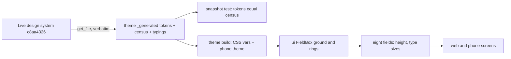
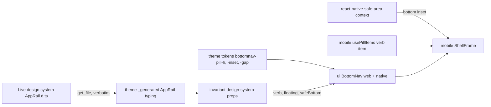
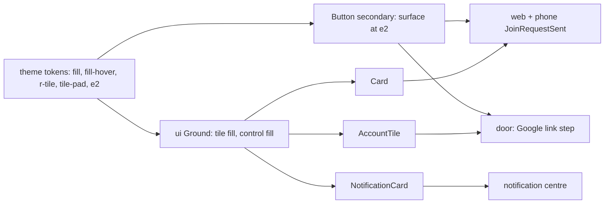
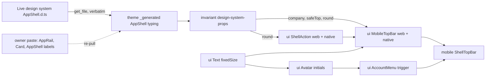
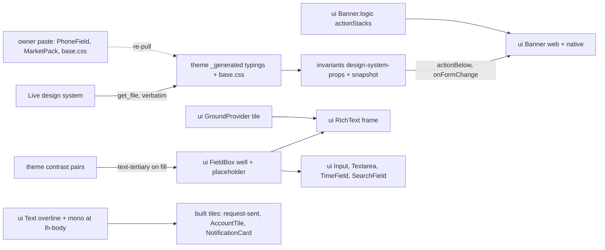
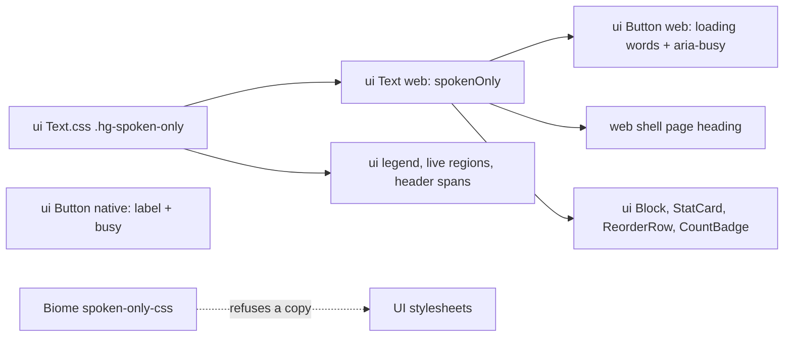
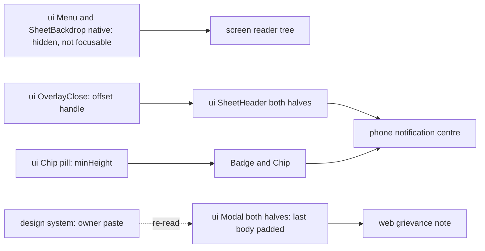

# F-platform (F2 · F3 · F4 · F6 · F7 · F8) — engineering tasks

This file dispositions every requirement row of the suite's six platform foundations — `docs/prd/foundations/F2-roles-and-permissions.md` (F2), `docs/prd/foundations/F3-localization.md` (F3), `docs/prd/foundations/F4-data-integrity.md` (F4), `docs/prd/foundations/F6-notifications-and-search.md` (F6), `docs/prd/foundations/F7-design-language.md` (F7) and `docs/prd/foundations/F8-data-honesty.md` (F8) — under the task-id prefix **T-FPLAT-**. This bucket owns no screens: the platform surfaces these documents describe (the app shell, global search, the notification centre, the language picker, the profile preferences and the branding settings) are built in `docs/tasks/SHELL.md` and `docs/tasks/M01-onboarding.md`, and appear here under **## Realized elsewhere**. What this file builds is the machinery those screens and every module screen read from: the permission and audit engines, the message catalog and the four format implementations, the server-owns-truth engine, the notification registry and delivery engine, global search, and the provenance, staleness and disclosure engines of the data-honesty foundation. Every rule that engineering cannot build as a component — because it is a property of screens and of review — is carried verbatim under **## Laws**. Every row appears exactly once in the **## Disposition index** at the end.

---

### T-FPLAT-001 · The twelve fixed presets and the per-module capability matrix
**Type:** engine · **Tier:** P0
**Status:** shipped (#42)
**Why:** Every guard, screen and query in the suite asks one question — "does this person's preset grant this act, and how far can they see?" — and the answer must come from one table that reads exactly as `F2` §F2.5, or the first module to type its own cell is the first cross-tenant leak. The guard `T-M01-025` shipped already asks `can(roles, capability)`; today the matrix behind it holds M01's five rows and an EMPTY visibility table, so every other module's route would compile against nothing and every visibility question answers "none".
**PRD rows:** F2-01, F2-02, F2-03, F2-05, F2-08, F2-09, F2-16, F2-25, F2-26
**Design:** none — an engine task with no screen; the Roles Reference screen (`T-M01-014`) renders the tuple this task fixes.
**Data model:** nothing new in the database — `role_preset` is a pgEnum mirroring `ROLE_PRESETS` (`M17`) and `membership_role.role_preset` is that enum, so a tenant-created role cannot exist. The matrices are DOMAIN DATA in `packages/domain/src/authz/`: one file per product area beside `capabilities.ts`, named for what it holds (`survey.ts`, `projects.ts`, `customer-link.ts` — never the PRD's module number, `CLAUDE.md` §8), holding the rows §F2.5 already fixes (58 rows: M01–M13 and the F5 customer-link surfaces); a capability id is `<area>.<act>` (`crm.add_edit_leads` for row `F2.M02.add-edit-leads`); a placeholder row stays the owning module's to append. Four cell forms and their types: `✓` → held; `—` → not held; `✓ (phrase)` or a bare phrase → held with the phrase as `limitedTo`, verbatim; a VISIBILITY row (`lead-visibility`, `campaign-visibility`, `project-visibility`, `field-visibility`, `attendance-visibility`, `people-records`, `see-agent-queue`) carries scope words that map to the domain's ladder — leads Own ⊂ Team ⊂ All beside Assigned; projects Own ⊂ Team ⊂ Portfolio ⊂ All (ruled at build: F2-14 names the rungs that differ from leads, and §F2.5-M08 grants Sales Manager `Team`, so Team is the projects ladder's second rung — the cell wins); field work Own ⊂ Team ⊂ All; people, money and campaigns as their rows state — with any qualifier kept verbatim beside the scope; a cell whose rung belongs to another domain's ladder (`Portfolio deals (read)` in leads) or whose qualifier names projects from another domain (`Own projects' deals (read)`) reads THROUGH the projects domain and is typed so — carried out whole by the resolution, never folded onto a ladder that lacks the rung, never dropped. The ladder is therefore PER DOMAIN (`F2-14`), which widens today's single ladder type; the resolution over it is `T-FPLAT-002`'s.
**Contract:** nothing new — `rolePresetSchema` already derives from the tuple; no roles route exists and none ever will (F2-16): a unit test over `apiContract` refuses any `/roles` write route, so a role editor cannot land without an owner ruling.
**Depends on:** `T-M01-025` (shipped, #40 — the guard that consumes `can`).
**Out of scope:** the resolution laws and their proofs (`T-FPLAT-002`: OR across presets, widest-wins per domain); the design sign-off RECORDING and return flow (the studio's approve task owns it — here only the matrix row exists); placeholder rows (each module's first slice); the presets' display names in three languages (`packages/i18n`, `T-M01-014`).
**Requirements (verbatim):**

- **F2-01** (P0) — The preset role set is **exactly twelve fixed presets**, named verbatim for the twelve personas: EPC Owner · Sales Manager · Sales Executive · Survey Engineer · Design Engineer · Project Manager · Field Technician · Installation Team Member · HR/Admin · Finance · Operations · Marketing. Every module and foundation PRD uses these exact names; a document that needs a thirteenth preset raises the need with the owner rather than coining one.
- **F2-02** (P0) — **Presets are fixed and cannot be edited, renamed, or deleted by a tenant.** The source's own guard carries: "Presets are fixed and cannot be edited — a company cannot break 'Sales rep' for everyone who came after" (journey L1482–1483). There is no role editor, no duplicate-from-preset, and no tenant-created role in this release (D29 carried into V2 by DD3 — see §5 Non-goals).
- **F2-03** (P0) — **Decision A — design sign-off is an approval capability of the Design Engineer preset, not a thirteenth preset.** The v1 `Engineer` preset ("Reviews and signs off designs", journey L1436) folds into Design Engineer; the capability row `F2.M05.approve-designs` grants sign-off to EPC Owner and Design Engineer. The v1 capability itself is carried whole — nothing an Engineer could do in v1 is lost.
- **F2-05** (P0) — **Decision C — the Installation Team Member preset exists in V2.** R16 is honored verbatim for the v1-derived scope: in v1 the crew has no login, the coordinator runs the checklist, and "crew sees no money because crew sees no screen". R16's own consequence names the path this document takes: "v2 adds an Installer preset without schema change (roles are already M:N)" — and the owner's V2 brief lists Installation Teams as primary users. The preset's V2 name is **Installation Team Member**, per the fixed persona vocabulary.
- **F2-08** (P0) — **Decision B — the v1 `Manager` preset fans out as: Sales Manager = direct successor; Project Manager and Operations = delivery re-grants.** (a) **Sales Manager** inherits every grant the v1 `Manager` preset held in the v1 capability matrix, unchanged — Team lead visibility; add/edit leads; assign leads; capture surveys; create/edit and send proposals; update project stages; record payments and upload documents; see agent performance; see company reports (team-scoped). (b) **Project Manager** re-grants the coordinator subset at single-project scope — update stages, upload/verify documents, record payments — and takes over the v1 coordinator's checklist duty (R16's "coordinator (Manager role) runs the checklist" becomes the Project Manager in V2). (c) **Operations** re-grants the coordinator subset at portfolio scope — stages, documents, blockers — plus the DD11 catalog grant and field-workforce team visibility. No v1 `Manager` grant is dropped; each is either carried by Sales Manager or additionally re-granted.
- **F2-09** (P0) — **Field Technician and Installation Team Member are distinct presets.** Different jobs, different grants: the technician's grants are visits, routes, check-in/out and tasks (M09 rows); the installer's are the installation checklist and its photo evidence (M08 rows) under the F2-06 no-commercial-figures law. Merging them would put route and visit rights on a crew surface bound by R16's constraint, and checklist rights on every general field employee — both leaks. One person may of course hold both presets (F2-10).
- **F2-16** (P0) — **No custom roles (D29), verbatim:** "Custom roles deferred to v2. Ship the six, watch which combinations companies actually ask for, then add the presets they wanted — rather than guessing at a checkbox editor nobody fills in." V2 is that watched step and its answer is DD3: the presets the personas wanted, **still fixed, still no editor**. The v1 phrase "deferred to v2" does not make a role editor V2 scope — DD3 rules the V2 box ships expanded fixed presets only, and adding a future preset is a product release, not a tenant action.
- **F2-25** (P0) — **The matrices below are the only permission truth in the suite.** One table per module `M01`–`M13` plus the F5 customer-link surfaces; columns are the twelve presets of F2-01, in fixed order; rows are capabilities phrased in plain language, never as CRUD on entities (journey L1440–1441). Rows already fixed by source or owner ruling are filled here; every placeholder row is replaced by the owning module task's rows, appended **in this document**. Module PRDs reference their rows by row key (`F2.M<nn>.<slug>`); no module document restates a matrix. The closure pass verifies no placeholder remains.
- **F2-26** (P0) — **Every v1 capability row survives.** The v1 matrix's 16 capabilities (journey L1443–1461; `DOC08.matrix.*`) all appear below with their v1 grants either carried verbatim onto the successor presets or superseded by a recorded owner ruling (DD11 is the only supersession; billing is restored per the overlay). The set widened from six presets to twelve, but no v1 grant was silently dropped or narrowed (`DOC08.six-roles` disposition: superseded in count, carried in content).

**DONE WHEN:**

- Given any tenant, when the role list is read, then exactly the twelve presets of F2-01 exist, by exactly those names, and no tenant-created role exists (F2-01, F2-02). → proof: invariant `matrix-mirrors-f2` (static, `tests/invariants/`) — every §F2.5 table's columns are the twelve, by F2-01's names, in its order (the list is the domain tuple and has no read route: a fixed vocabulary ships in the client); invariant enum-parity (`M17`) — the pgEnum and the contract enum equal it; the schema holds no role table, so a tenant-created role has nowhere to exist
- Given a design awaiting sign-off, when a holder of `F2.M05.approve-designs` acts, then the matrix grants that act to EPC Owner and Design Engineer and to nobody else (F2-03). → proof: unit — `can` answers true for those two presets alone; the recording of who and when, and the return with pinned comments (F2-04), are the studio's approve task's lines, proven there
- Given any tenant, when roles are administered, then no create-role, edit-role or delete-role action exists on any surface (F2-16, F2-02). → proof: unit `packages/contracts/tests/no-role-editor.test.ts` — `apiContract` declares no route whose path names roles with a write method; schema — `membership_role.role_preset` is the enum, there is no role table; the screens have nothing to render because the contract has nothing to call
- Given a person holding only Sales Manager, when they act, then every v1 `Manager` matrix grant is available to them and no more (F2-08). → proof: unit over the matrix — Sales Manager holds each of the nine v1 `Manager` grants (Team lead visibility · add/edit leads · assign leads · capture surveys · create/edit and send proposals · update project stages · record payments and upload documents · see agent performance · team-scoped company reports) by their V2 row keys; "no more" is the parity test below — the preset holds exactly the cells §F2.5 states
- Given the matrices in `F2` §F2.5, when the code's matrix is compared cell for cell, then every fixed row exists in code with identical cells and no code row is absent from the PRD (F2-25, F2-26). → proof: invariant `matrix-mirrors-f2` (static, always runs, `tests/invariants/src/matrix-mirrors-f2.ts`) reads §F2.5 from the PRD file and diffs it against `CAPABILITY_MATRIX` and the visibility cells — seen red on one changed cell before it is trusted; a package may not import a file outside itself, which is why the proof is an invariant and not a domain unit test
- (F2-05, F2-09 carry no dedicated Given/When/Then lines in the PRD's acceptance block; the requirement texts above are the binding criteria.) → proof: invariant — `matrix-mirrors-f2` holds Installation Team Member and Field Technician as two columns whose cells differ where §F2.5 says they differ

---
### T-FPLAT-002 · Permission resolution — OR across held presets, per-domain visibility scope, widest-wins
**Type:** engine · **Tier:** P0
**Status:** shipped (#43)
**Why:** The matrix (`T-FPLAT-001`) says what each preset holds; a person holds several, and every guard, list and report needs ONE answer for the stack — may they, how far can they see, and which held role is doing the work. The API guard already folds `can` over the held roles and `visibilityIn` already folds widest-wins per domain, but neither is proven at its edges nor barred, and the visibility answer is not yet the closed vocabulary every repository will scope its query by; left unproven, the first module to need it re-implements the fold in a handler, which is the sweep F2-15 forbids.
**PRD rows:** F2-10, F2-11, F2-12, F2-13, F2-14, F2-15, F2-17, F2-18
**Design:** none — an engine task; the Team screen (`T-M01-012`) renders the held presets as chips and names the one doing the work from this task's answer.
**Data model:** nothing in the database. The resolution OUTPUT is the fact, typed in `packages/domain/src/authz/`: `ResolvedVisibility { scope, includesAssigned, through, grantedBy }` — `grantedBy` names the held presets whose cell provides the winning rung (F2-13, "the team list shows which role is doing the work"); `limitsOn(roles, capability)` returns the distinct limit phrases when EVERY held grant of the act is limited and nothing when it is held outright or not at all (replaces `capabilityLimit`, whose "first phrase" answer was arbitrary); `can` and `grantedCapabilities` stay as they are. Roles in, answer out: no user id, no tenant, no clock in any signature, which is F2-15 by type.
**Contract:** none — the session projection already carries the held presets, and the guard already asks `can`.
**Depends on:** `T-FPLAT-001` (shipped, #42 — the matrices and ladders this resolves over).
**Out of scope:** the SQL a scope becomes (each module's repository, against the vocabulary fixed here — `own`, `team`, `portfolio`, `all`, `assigned`, `through`); the role-administration transitions (`T-FPLAT-003`); the Team screen and its chips (`T-M01-012`); any list or report UI (`M02` onward).
**Requirements (verbatim):**

- **F2-10** (P0) — **One person can hold several presets — stacking is the design.** The census states it: "Six fixed preset roles; one person may hold SEVERAL. Permission granted if any held role grants it; lead visibility takes the widest" (D27 — the count widens to twelve per DD3, the law is unchanged). The small-firm problem — one person is rep *and* surveyor *and* designer — is solved by stacking, never by building a custom role. The team list shows all roles a person holds as chips.
- **F2-11** (P0) — **OR across roles.** The permission check is exactly: *does any of my held roles grant this?* Permission granted if any held role grants it — there is no AND, no precedence, no negative grant; a preset can only add.
- **F2-12** (P0) — **The visibility-scope law (D20), verbatim:** "Reps see only their own leads. Managers see the team's, owner sees everything." Restated by the source's dashboard rules as "Visibility follows role (D20): a rep sees only their own, a manager their team, the owner everything. The same screen, scoped" (journey L1538–1539). Every list, board, report and dashboard in the product is the same surface, scoped by role — never a different surface per role.
- **F2-13** (P0) — **Widest scope wins within a domain.** When held roles carry different visibility scopes in the same domain, the widest applies — a Sales Executive + Sales Manager sees Team; anyone + EPC Owner sees All. The team list shows which role is doing the work (journey L1507–1508).
- **F2-14** (P0) — **Visibility resolves per domain, and never leaks across domains.** V2 has more scope domains than v1's single lead axis: leads (Own ⊂ Team ⊂ All; Assigned beside Own for the assigned-only presets), projects (Own projects ⊂ Portfolio ⊂ All), field work (Own ⊂ Team ⊂ All), people records, money, campaigns. The widest-wins rule of F2-13 applies **inside each domain independently**; holding a wide scope in one domain never widens another (a Sales Manager + Field Technician sees the team's leads and only their own route). The EPC Owner's "everything, always" is All in every domain.
- **F2-15** (P0) — **No per-person permission exceptions, ever (D28), verbatim:** "To know what someone can do, you look at their roles — one source of truth. Exceptions are how permission systems become unauditable." There is deliberately no per-user override anywhere in the product; every grant is explicable as "holds preset X".
- **F2-17** (P1) — **Mid-task permission loss is graceful.** If a role is removed while someone is mid-task, the current in-flight action completes; the restriction applies from the next action — no mid-flight error storms.
- **F2-18** (P0) — **Roles bind only within the tenant's user audiences.** Every preset is held by an Owner-or-Employee user; the customer is never a role, never appears in a matrix, and reaches the product only through F5's tokenised link.

**DONE WHEN:**

- Given a person holding Sales Executive + Survey Engineer, when they open any lead list, then they see their own leads (widest of Own and Assigned), and both grant sets are available by OR (F2-10, F2-11, F2-13). → proof: unit `packages/domain/tests/authz/resolution.test.ts` — `visibilityIn` answers `own` with `includesAssigned` and names both presets in `grantedBy`; `can` holds `crm.add_edit_leads` (the rep's) and `survey.capture_surveys` (the surveyor's) for the pair; a limited and an outright grant of one act resolve to the outright one, and two limited grants to both phrases
- Given a person holding Sales Manager + Field Technician, when they open the field surfaces, then they see the field team's day only if a field-domain scope grants it — their Team *lead* scope changes nothing outside the lead domain (F2-14). → proof: unit — the pair answers `team` in leads and `own` in field work; a domain with no fixed row answers `none`; a cell that reads through projects is carried in `through`, never folded
- Given any user, when an administrator asks what they can do, then the answer is fully determined by their preset list — no per-person exception exists to consult (F2-15). → proof: unit — `grantedCapabilities`, `can`, `limitsOn` and `visibilityIn` answer the same for a preset list in any order and with duplicates, and zero presets grant nothing anywhere; the signatures take roles alone, and the schema holds no per-user permission table
- Given a user whose role is removed mid-action, when the in-flight action completes, then it succeeds and the next action is what the restriction applies to (F2-17). → proof: unit `packages/domain/tests/auth/admission.test.ts` — a claim whose `authorizationVersion` is stale is refused, which happens at the NEXT request because the guard admits once per request (`apps/api/src/common/auth/session.guard.ts`) and never re-checks mid-flight
- (F2-12 and F2-18 carry no dedicated Given/When/Then lines in the PRD's acceptance block; the requirement texts above are the binding criteria.) → proof: unit — a rep sees own, a manager team, the owner all, in leads and in every fixed domain; invariant `matrix-mirrors-f2` — the customer is no column of any table
- Given the resolution files, when the unit suite runs with coverage, then `packages/domain/src/authz/**` is at 100% and the deferred row that named the gap is gone. → proof: gate `M71` — the bar widens from the matrix files to the folder

---
### T-FPLAT-003 · Role-administration guarded transitions — last Owner, last Manage-team, deactivation, zero-role invite
**Type:** engine · **Tier:** P0
**Status:** shipped (#44)
**Why:** An owner changes a teammate's presets or ends a leaver's access from the Team screen, and the company can never lock itself out, orphan a person's history or mint a member who signs in to nothing; without these transitions the guards are promises a screen keeps, a deactivation is a row edit no session notices, and the first screen to need a transition writes its own.
**PRD rows:** F2-19, F2-20, F2-21
**Design:** none — an engine task. The Team screen (`T-M01-012`) rests the sole owner's own row on this task's decision and calls the deactivate transition; Assign Roles (`T-M01-013`) calls the role-set transition; Invite Teammate (`T-M01-007`) is refused by the same role-set schema.
**Data model:** no table, no column, no enum. Writes `tenant_membership.status` and `authorization_version` and replaces a membership's `membership_role` rows — all authored by `T-M01-025` (migration 0002). Migration `0003_role_administration.sql` grants `app_user` INSERT and DELETE on `membership_role`: the tenant-scoped write path these transitions open, under the fail-closed policy 0002 already declares (`packages/db/CLAUDE.md` — a tenant write rides the runtime pool, all three layers always); the invitation tables become migration 0004. Domain types, `packages/domain/src/authz/administration.ts`: `keepsControl(activeRoleSets)` — true when at least one set holds `epc_owner` AND at least one set grants `onboarding.manage_team` (F2-19's two clauses; the second asked of the matrix through `can`, never of a preset name) — and `acceptsAdministration(status)` — true for `active` alone (F2-20: a deactivated person keeps their chips as history, an invited one has not joined). Roles in, answer out: no user id, no tenant, no clock in any signature.
**Contract:** `packages/contracts/src/common.ts` — `roleSetSchema`, the presets a person holds, at least one (F2-21); `session.ts`'s `membershipSchema.roles` reads it in place of its own `.min(1)`, and `T-M01-028`'s POST /invitations body reads it too · `packages/contracts/src/tenant.ts` — `PUT /tenants/me/members/{membershipId}/roles` (body `{ roles: roleSetSchema }` → the `memberSchema` row; the old → new write `T-M01-013` recorded as owed here) · `POST /tenants/me/members/{membershipId}/deactivate` (no body → the row). Both `{ capability: 'onboarding.manage_team' }`; both answer 404 for a membership that is not this tenant's, 409 `CONFLICT` for one that is not active, and 422 `LAST_OWNER` — the one route code, in `tenantErrorCodes` — when the change would leave the company without an EPC Owner or a Manage-team holder. `packages/i18n/src/copy/api-error.ts` carries the `LAST_OWNER` explanation as a `Record` over `tenantErrorCodes`, so a route code without copy fails to compile. `packages/data/src/tenant/repository.ts` gains `assignRoles` and `deactivate`, so no screen builds a transport.
**Depends on:** `T-M01-025` (shipped, #40 — migration 0002, the guard, the session sweep) · `T-FPLAT-001` and `T-FPLAT-002` (shipped, #42, #43 — `can` over the matrix).
**Out of scope:** the audit entry a blocked attempt and a role change write — `T-FPLAT-004`'s table, written beside these refusals when it lands (the ruling `T-M01-025` took for auth events); the Team and Assign Roles screens — `T-M01-012`, `T-M01-013`; the invite route, its record and the atomic accept — `T-M01-028`; the assignment pickers that exclude the deactivated — each module's own picker over the roster's `status`; reassignment of open work — the owning modules (M02, M08); reactivation — no row asks for it (the Team brief reports the hole).
**Ruled at `/start`:**
- A membership's role set never reaches zero, by F2-21's own reason — a person with no role signs in and sees nothing — so ONE schema refuses the empty set at every transition (the invite, the role write, the projection); ending access is deactivation, never an empty set.
- In this matrix only the EPC Owner grants Manage team, so a refusal always names the owner law: one code, `LAST_OWNER`. The decision still asks both clauses, which is what keeps the guard true if a later matrix widens the second.
- Each transition is ONE tenant transaction, serialised per tenant by a transaction-scoped advisory lock on the tenant id: the active role sets are read and judged inside it, so two concurrent removals cannot each see the other owner and both pass.
- Deactivation revokes the sessions acting under THIS tenant (`session.active_tenant_id`), never the person's sessions in another company; whichever comes first, their token is refused at its next request by `admit` (`not-active`).
**Requirements (verbatim):**

- **F2-19** (P0) — **A tenant always retains at least one EPC Owner, and at least one person holding Manage team.** An owner removing their own admin rights, or the removal of the last Manage-team holder, is blocked with an explanation. Enforced as guarded transitions, not UI-only.
- **F2-20** (P0) — **People are deactivated, never deleted.** Deactivation revokes sessions and hides the person from assignment pickers; every lead, activity, tick and money event they touched stays attributed to them, and their open work gets reassigned. Deleting a user — which would orphan their history — does not exist.
- **F2-21** (P1) — **An invitation carries at least one preset.** Inviting a person with no role at all is blocked — they would sign in and see nothing. (The invite flow itself — name, phone, roles — is M01's.)

**DONE WHEN:**

- Given a tenant with one EPC Owner, when anyone attempts to remove that person's Owner preset or deactivate them, then the attempt is blocked with an explanation and the blocked attempt is audit-logged (F2-19, F2-22). → proof: unit `packages/domain/tests/authz/administration.test.ts` — `keepsControl` is false for no sets and for a full team without an owner, true the moment one set holds it whatever the order or the duplicates, and every preset the matrix grants Manage team is the owner (seen red on a guard that always answers true); unit `apps/api/tests/tenant/role-administration.test.ts`, against a migrated database — the refusal leaves both the role rows and the authorization version untouched, and the same write is accepted once it keeps the owner (seen red on a transition that skips its guard); qa-api — dropping the sole owner's preset and deactivating them both answer 422 `LAST_OWNER` and change no row; the audit entry is `T-FPLAT-004`'s and is proven there
- Given a person who leaves, when they are deactivated, then their sessions end, they leave assignment pickers, and their history stays attributed to them (F2-20). → proof: unit `apps/api/tests/tenant/role-administration.test.ts` — a member the company can spare is deactivated, keeps their name and every preset they held, moves the authorization version on, and their sessions under THIS company are revoked while the same person's session in another company is not (seen red on a sweep without its tenant predicate); a second deactivation and a later role write both answer not-active, and no route, grant or column deletes a person; the roster's `status` is what every picker filters on and the pickers are their own modules'
- Given an invite composed with zero roles, when it is submitted, then it is blocked before sending (F2-21). → proof: unit `packages/contracts/tests/role-set.test.ts` — `roleSetSchema` refuses the empty set and an unknown preset, and accepts one preset and all twelve (seen red on a schema without its floor); qa-api — `PUT …/roles` with an empty list answers 400 `VALIDATION_FAILED` whose `details[].path` is `roles`; the invite route itself is `T-M01-028`'s, against this schema
- Given migration 0003, when the tenancy invariants run, then a role row is written under the tenant's own pin and refused under another tenant's. → proof: invariant `tenancy-rls` — the own-tenant INSERT is accepted as `app_user` and the cross-tenant one refused by WITH CHECK, seen red as `permission denied for table membership_role` before the migration was applied; the migration applies fresh and skips cleanly when already applied
- Given the administration files, when the unit suite runs with coverage, then `packages/domain/src/authz/**` stays at 100%. → proof: gate `M71`

---
### T-FPLAT-004 · The append-only audit log, its tenant-scoped export and the impersonation record
**Type:** engine · **Tier:** P0
**Status:** shipped (#45)
**Why:** Today nothing the product performs is recorded, so "who removed my access?" has no answer at all — and F2-15 only dares to derive every permission purely from roles because this log keeps the derivation's history readable. The two guarded transitions that shipped refuse and rewrite in silence; every module from M06 to M12 is written against a log that does not exist, and without it the first one to need an entry invents its own table.
**PRD rows:** F2-22, F2-23, F2-24
**Design:** none — an engine task with no screen. `screens.md` disposes all three rows as `policy`, so no V1 surface lists the log: the export is a route a tenant administrator calls, and rendering an entry in the viewer's language (F2 §F2.4's localization note) belongs to the first screen that lists them, which is not designed.
**Data model:** migration `0004_audit_log.sql` authors ONE tenant-scoped table. The whole planned chain shifts up one — invitations `0005`, tenant settings `0006`, catalog `0007`, price book `0008`, catalog import `0009` — because a migration number is taken in LANDING order, and `packages/db/CLAUDE.md`, `docs/tasks/M01-onboarding.md` and `docs/tasks/SHELL.md` are swept in the same commit (Law 8). The table is NOT partitioned (owner ruling): the archive move is its own task and the rule that said otherwise named two tables nobody built and one deleted with the offline capability, so it is corrected here.

| entity | key fields | rules | rows |
|---|---|---|---|
| `audit_log_entry` | tenant_id; event_type (a pgEnum mirroring the contract tuple); actor_kind; actor_ref; occurred_at; blocked; subject_kind; subject_ref; change_payload (jsonb) | The tenant's own append-only record of what the product performed — written inside the transaction that caused it, never reconstructed. Tenant-scoped, all four always, and the grants are **SELECT and INSERT alone**: no UPDATE and no DELETE exists for any role, so append-only is a privilege rather than a promise. `actor_ref` and `subject_ref` are ids with NO foreign key — an entry outlives the row it records, survives a deactivation forever, and is never re-pointed, so a merge is itself an entry. `change_payload` is typed as its ENVELOPE per `event_type`, parsed in `domain`, never here. No `retention_tier` column and no `sender_name`: the first is the archive task's, the second `T-M11-009`'s. Index (tenant_id, occurred_at desc) — the listing, the export and every tenant-scoped read. | F2-22, F2-23, F2-24, F2-19, F2-20 |

**Contract:** the three vocabularies are authored in `packages/domain/src/audit/events.ts` and DERIVED in contracts, as every other set is: `packages/db` may not import contracts, so the tuple must sit in the bottom layer for the pgEnum to mirror it (`M17`). `AUDIT_EVENT_TYPES` is the closed vocabulary of F2-22's checklist holding today only the acts that exist — `auth.signed_in`, `auth.signed_out`, `auth.signed_out_everywhere`, `team.roles_changed`, `team.member_deactivated` — beside `AUDIT_ACTOR_KINDS` (`tenant_user` | `platform_staff`), `AUDIT_SUBJECT_KINDS` (`user_account` | `tenant_membership` today, the one polymorphic-pointer union `notification` and `file` will read) and `AuditChangePayload`, the old → new envelope. `packages/contracts/src/audit.ts` (new) derives each as a `z.enum`, adds `auditLogEntrySchema`, and mounts `auditContract` — `GET /tenants/me/audit-log`, paginated newest-first, under `{ capability: 'onboarding.manage_tenant_settings' }`. `packages/data/src/audit/repository.ts` gains the typed read, so no screen builds a transport.
**Depends on:** `T-M01-025` (shipped, #40 — migration 0002, `tenant`, the tenant-scoped pattern, and the auth acts this logs) · `T-FPLAT-001` (shipped, #42 — the matrix the export's gate comes from) · `T-FPLAT-003` (shipped, #44 — the two guarded transitions whose writes and refusals this logs).
**Out of scope:** every covered event whose act does not exist yet — settings, branding, catalog and price-book changes; money events; customer-link events; design sign-off; agent config, knowledge-base, queue, DND and escalation changes; billing transitions and entitlement overrides; credential lifecycle and decrypts; data-rights requests — each appends its own `event_type` value and writes its own entry when its slice begins (Law 9), against THIS table and THIS writer, and no module ever writes a second log; the payment-request-message send and the two acceptance lines that carry it — `T-M11-009`, which already quotes both; the archive tier after 24 months hot — its own task; the back-office surface F2-24's read-only half needs — no task in the suite creates one, so it goes to `docs/tasks/deferred.md` and becomes the next task; the screen that lists entries and translates them for the reader — none is designed; analytics event streams — `T-M13-011`.
**Ruled at `/start`:**
- **The vocabulary grows module-wise.** `event_type` is CLOSED to F2-22's checklist — no analytics event, ever — but it is not authored whole today: Law 9 gives each value to the slice that performs the act, so five values land here and a module appends its own with its own migration. Authoring thirty values for acts no code can perform would put a vocabulary in the database that nothing can write.
- **An entry rides the transaction that caused the change.** The writer takes the caller's `tx` and inserts on it, so the entry and the change commit together or neither does; a blocked attempt commits its entry alone, because the guard refuses before any write. There is no after-the-fact writer and no queue.
- **An auth act is logged under the company the session acts under.** The log is a tenant's own (F2-23), so a sign-in by a person who belongs to no company writes nothing — there is no tenant to own the entry. A sign-out-everywhere writes one entry per company the person is signed into.
- **The export is one paginated read, not a file.** No V1 screen lists the log, and a download is a rendering a surface performs over rows it already has; one route serves both the future screen and the administrator paging the log out. A file format invented before a surface asks for it is a shape nothing has agreed to.
- **The export is gated on `onboarding.manage_tenant_settings`.** F2-23 says "a tenant administrator", and in this matrix exactly one preset is that administrator — the EPC Owner, through the row it already holds. No matrix row is coined: F2-25 makes the matrix the only permission truth, and reading the log needs no cell the Owner does not already have.
- **A blocked attempt is the `blocked` flag on its own event, not a second event type.** One act, one vocabulary entry, and the export answers "was it refused?" by a column rather than by a parallel set of names that would double every module's appends.
- **The archive tier is not authored** (F2-23) — every entry stays in this one table with no `retention_tier` column and the export returns all of it; the move is its own task, authored when the first entry ages out, with the tier's storage an owner decision under `CLAUDE.md` §4. No entry can reach the cut-off inside V1's first two years, and an unexercisable path is speculative. Cost if wrong: one bulk move of aged rows and an export widened to read both.
- **A platform-staff actor is `actor_kind: platform_staff` beside an `actor_ref` that is a `user_account` id** (F2-24), never a foreign key: `user_account` is the one identity table for every human, a staff member is simply an account holding no membership in that tenant, and the row's own `tenant_id` says whose log it is. Cost if wrong: a third `actor_kind` value, with no rewrite of written rows.
- **`subject_kind` + `subject_ref` is the one polymorphic pointer of the suite** (F2-22, F6-02, F6-16) — the pair `notification` and `T-FPLAT-035`'s `file` will read from this same union. An audit entry records the subject as it was and is never re-pointed; `notification` rows ARE re-pointed inside a merge transaction, and that merge is itself an entry.

**Requirements (verbatim):**

- **F2-22** (P0) — **An append-only audit log exists, and its covered-events list is the acceptance checklist:** auth events; team invite / role changes (old → new) including blocked last-Owner and last-Manage-team attempts; tenant settings, branding, catalog and price-book changes; money events (proposal generate/send/version, discount applied with amount and who, tranche edits, payment recorded, Won/Lost/Cancelled-after-Won); customer-link mint/re-mint/revoke/open/Accept-Negotiate-Decline with attribution; **the send of the plain payment-request message from the tenant's connected official channel, recorded under the name of the person who sent it — whatever preset that person holds, the project-visibility-only reader of `F2.M11.send-request-message` included (owner ruling 2026-08-06) — the covered event being that send and nothing else: where no channel is connected the product only composes the message and places it on the clipboard, a person sends it outside the product, and nothing at all is written to this log for that path (owner ruling 2026-08-06)**; design sign-off approve/return with who and when (the engineer-led structural safety record); agent config changes (version id), knowledge-base edits, queue changes, DND/consent changes, escalations; billing plan changes, subscription transitions, entitlement overrides; credential lifecycle and every decrypt; data-rights requests and completions; admin/back-office access to tenant data. Entries are written with the change that caused them, never reconstructed after the fact. *(**Amended by owner ruling 2026-08-06**, which adds the payment-request-message-send clause to the checklist and changes nothing else in it. The ruling's reason, recorded: the message leaves the company's official channel and reaches a customer about money, which is what this log exists for, and the entry answers "who messaged my customer?" instantly. Every other covered event, and the written-with-the-change discipline, is unchanged.)* *(**Further amended by owner ruling 2026-08-06**, which draws the boundary of that clause and adds no covered event to the checklist. The owner ruled the simpler of the two options in their own words — *"keep as much as simple. and dont do overengineering"* — so **no compose record, no copy record, no counter and no timeline entry is written for the fallback path**. The accepted trade, recorded honestly rather than compensated for: the same chase, to the same customer, about the same tranche, is attributable when the product sends it from the connected channel and unrecorded when a person sends it outside the product. That is a deliberate simplification, not an oversight — this log records what the product performed, and the standing law is that the product never claims what it did not do. Every other covered event, the send clause's own terms and the written-with-the-change discipline are unchanged.)*
- **F2-23** (P1) — **The audit log is tenant-scoped and the tenant's own:** retained 24 months hot, then archived; tenants can export their own log.
- **F2-24** (P0) — **Admin/back-office impersonation is read-only and always audited.** Platform staff viewing a tenant's data never mutate as the tenant, and every such access appears in the F2-22 log.

**DONE WHEN:**

- Given any event named in F2-22's list, when it occurs, then an append-only entry exists recording who, what and when — including for blocked attempts (F2-22). → proof: unit `apps/api/tests/audit/audit-log.test.ts`, against a migrated database — a role change lands ONE entry carrying actor, subject, time and the old → new set; a deactivation lands its own, whose event name is the whole change; a sign-in lands one under the company the session acts under, a sign-in belonging to no company lands none, and the FOUNDING sign-in lands at the moment the session adopts the company it just created — the signer verified their code before that company existed, and without it every company's log would open with a sign-out that has no sign-in (seen red on an adoption that records nothing); the writer joins the CALLER's transaction, so a change that fails after its entry leaves no entry (seen red on a writer that opens its own connection — three cases fail, that one included); a refused last-Owner removal lands its entry with `blocked` true, carrying the set that was attempted, and changes no role row (seen red on a transition that returns before recording); that no role may EDIT or REMOVE an entry is the invariant's, below, and is deliberately not restated here — asked of a unit test it would pass locally and lie under CI, whose connecting role is a superuser that bypasses RLS and holds every privilege; the acts no code performs yet are the modules' own appends and are proven in their slices
- Given a tenant administrator, when they export the audit log, then they receive their own tenant's entries and no other tenant's (F2-23). → proof: unit `apps/api/tests/audit/audit-log.test.ts` — two companies each act, and each export returns only its own rows, newest first, over the `(tenant_id, occurred_at desc)` index (seen red on a read that has neither its tenant predicate nor the policy behind it; the predicate alone can be dropped without the test noticing, which is what defence in depth means and is said here rather than claimed away); qa-api — an EPC Owner reads the log over `curl` (200, newest first, `?page=2&limit=1` a different id at the same `totalCount`) and an unauthenticated read answers 401 `UNAUTHENTICATED`; a cross-company read returns that company's entries alone, the two id sets disjoint in the response AND under a tenant-pinned read. The 403 for a holder WITHOUT the capability is NOT proven on the wire and is not claimed: no route puts a second person in a company until `T-M01-028` lands, and seeding one is a database write the repo forbids. Its three parts are each proven — the route declares the capability, the guard denies a route's capability by construction, and the matrix invariant holds the cell — but the composition waits, as the `docs/tasks/deferred.md` row this task raises
- Given a platform-staff access to tenant data, when it occurs, then it is read-only and an audit entry records it (F2-24). → proof: unit `apps/api/tests/audit/audit-log.test.ts` — an entry whose `actor_kind` is `platform_staff` writes, exports beside a tenant user's, and its actor holds no membership in the company logged; the READ-ONLY half is unprovable here — no back-office surface exists in the suite for staff to read a tenant through — and it is the `docs/tasks/deferred.md` row this task raises, which owns the surface, its read-only enforcement and this line's second proof
- Given migration 0004, when the tenancy invariants run, then an entry is written under the tenant's own pin and refused under another tenant's, and no role may change or remove one. → proof: invariant `tenancy-rls` — the own-tenant INSERT is accepted as `app_user` and the cross-tenant one refused by WITH CHECK (seen red on a refusal aimed at its own tenant), the append-only half reads UPDATE, DELETE and TRUNCATE from the catalog over every RLS-subject role — the ONE home for that proof, because a privilege is a property of the system and a test that connects as a privileged role cannot see it — and it now names the ledger that EXISTS: it had named `audit_log`, `usage_events` and `sync_mutations`, none of which was ever built, so it matched nothing and reported a pass it never earned — it is corrected here and fails on an empty list (seen red both ways: on the empty list, and aimed at a table that does hold UPDATE); invariant `enum-parity` (`M17`) — the three new pgEnums equal their contract tuples (seen red on a value added to the tuple alone); invariant `schema-parity` (`M18`); the migration applies fresh and skips cleanly when already applied

---
### T-FPLAT-005 · The message catalog and runtime language resolution — per-user language, silent English fallback, reader-language rendering
**Type:** engine · **Tier:** P0
**Status:** shipped (#46)
**Why:** A Marathi-speaking surveyor and an English-speaking owner open the same lead and each must see their own language around the same data — and today neither does: the catalog, the provider and the switch all exist in `packages/i18n`, but both apps boot in English and stay there, because the session never says which language the person chose. Without this the first designed screen has nothing to follow, the picker screens (`T-M01-003`, `T-M01-011`) have nothing to write to that the app will honour, and every engine that must render for a READER — a notification, a customer link — has no proven seam to call.
**PRD rows:** F3-01, F3-02, F3-04, F3-05, F3-06, F3-07
**Design:** none — an engine task. The pickers that CALL it are designed and built elsewhere: `SCR-M01-03` (`T-M01-003`) and `SCR-M01-11` (`T-M01-011`), whose brief fixes the behaviour this task must honour — *every preference applies as it is touched; no Save, no confirmation; the whole application redraws*. `packages/ui`'s `LanguageSwitcher` is M07's AGENT-language strip, not the user's picker, and is not this task's.
**Data model:** none — reads `user_account.interface_language`, authored by `T-M01-025` (migration 0002). No table, no column, no enum: the language set is `UI_LANGUAGES` in `packages/domain/src/format/languages.ts` and never a table (F3-01).
**Contract:** `packages/contracts/src/session.ts` — `actorSchema` gains `interfaceLanguage: uiLanguageSchema`, so the projection every screen boots from carries the person's language (F3-02); additive, and the API projects it from the account row it already reads. No new route: the write is `T-M01-025`'s `PATCH /users/me` (`updateUserProfileSchema.interfaceLanguage`), which `T-M01-003` and `T-M01-011` recorded as a gap and which has since landed — their lines are corrected here. `packages/data/src/session/` — `SessionUser.interfaceLanguage` and one store method, `setInterfaceLanguage(next)`, the ONE persist path both platforms share (Law 11). `packages/i18n/src/react/provider.tsx` — a `follow` prop: the language the provider tracks, applied whenever it changes, so the flow "the app follows the person" is authored once and each app root passes the session user's language.
**Depends on:** `T-M01-025` (shipped, #40 — `user_account.interface_language`, `PATCH /users/me`, the session projection) · the i18n foundation (#7 — the catalog, `createI18nRuntime`, `createTranslator`, the provider, both loaders; no task id owns it) · `T-FPLAT-001` (shipped, #42 — no capability row: language is every preset's own, F3 §F3.1).
**Out of scope:** the pickers and their first-run and profile surfaces — `T-M01-003`, `T-M01-009`, `T-M01-011` (F3-03 is realized there); the engines that CONSUME the reader-language seam — notifications `T-FPLAT-017`/`T-FPLAT-018`, proposal documents M06, the customer link F5 — each calls `createTranslator(readerLanguage)` and proves its own use when it lands; the never-translated set and tenant-authored per-language content — `T-FPLAT-006`; script rendering and Devanagari faces — `T-FPLAT-007`; the four format implementations — `T-FPLAT-008` (landed); the language-set boundary and the add-a-language playbook — `T-FPLAT-009`; the `PlaceholderScaffold` English literals on every live screen — replaced screen by screen as each is designed, and until then no live surface renders translated copy; the `TranslatedText` brand that would close `M50` — `docs/tasks/UI.md`; the "missing translation rendered" analytics event (F3 §F3.1) — `T-M13-011`'s stream, never this runtime.
**Ruled at `/start`:**
- **The runtime follows the person, and the flow is authored once.** The provider takes `follow`; when it changes to a language other than the active one, the provider switches. Both roots pass `user?.interfaceLanguage ?? null`. A `useEffect` in each app doing the same would be the flow written twice (Law 11).
- **A switch is optimistic** (F3-04, the brief's "applies as it is touched"). `setInterfaceLanguage` switches the runtime at once and persists through `PATCH /users/me`; a failed persist keeps the chosen language for this mount, and the server's value wins at the next sign-in. A round trip before the redraw, a spinner or a reload is F3-04's own failure. The provider's `onLocaleChange` is where persisting is wired; a `follow` that arrives equal to the active language is a no-op, so persist → snapshot → follow cannot loop.
- **Fallback is by construction, and it is proven.** The message id IS the English source text, so a message absent from the active catalog renders English (F3-05). A catalog that fails to load leaves the runtime on the language it had — never a blank, never a crash — and the failure is the app's to log, not the user's to see.
- **A mount with no one to follow returns to the language it had before it followed anyone** (F3-02, ruled at `/verify`: the PRD is silent, and a reload already boots fresh, so an in-app sign-out agreeing with it is consistency rather than a feature). Nobody's language is the mount's own default — the source locale today, the device language once `T-M01-003` resolves it — never the previous person's, so a shared field phone's sign-in screen is not left in Marathi for the next person. No sign-out control exists on any surface yet; the seam is the provider's and its surface proof lands with the first one (`T-SHELL-001`).
- **The reader-language seam is `createTranslator(locale)`** (F3-06): one instance per call, so two readers in two languages at one moment never share an active locale. Consumers prove their use; this task proves the seam.
- **`packages/i18n` joins the unit-tested layers**, for `runtime.ts` alone: `createI18nRuntime` and `createTranslator` are logic with edges — a missing message, an unloadable catalog, two concurrent locales — and a layer proven only by running cannot see them. The provider, the loaders and the polyfills stay proven by running. `.claude/rules/testing.md` and the coverage globs gain the package, `runtime.ts` at 100% (`M71`).
- **F3-07 is held by gates that exist** — `M45`, `M46`, `M47`, `M48` — and by `packLabel` for the pack's own labels (the settle below); this task adds no gate and cites them.
- **Where per-language translations of the pack's display labels live** (F1-22, F3-07) — in the pack, versioned with it, one value per language of `UI_LANGUAGES`; the message catalog carries no pack label, and a label missing a language falls back under F3-05 like any other string (F1-22 makes the labels pack data and F1-11 makes a label change a pack revision, so a catalog copy would be a second home that drifts). Built: `PackLabel` and `packLabel` in domain, with their test.
- **T-FPLAT-004's `Status:` flips to `shipped (#45)` in this PR** (owner ruling: a task's own PR can never flip its own status; the next task's carries it).

**Requirements (verbatim):**

- **F3-01** (P0) — **The interface language set at launch is English, Hindi and Marathi, served from one message catalog for every surface and both platforms.** The set is a product-level list, not tenant data and not market-pack data: a tenant does not choose which languages exist, and a market pack does not add or remove one (a market pack declares formats, `F1-21`, never languages). The list is expected to grow (§F3.5); nothing in the product may assume its size.
- **F3-02** (P0) — **Language is a per-user setting, never a per-tenant setting.** Each person's interface language is their own; no tenant configuration, admin action, plan tier or market pack sets, forces or restricts the language of the people inside a tenant. Users of different languages coexist in one tenant, on one record, at the same time.
- **F3-04** (P0) — **Switching language re-renders the whole application immediately — no reload, no sign-out, and no loss of in-progress work.** The change applies to every open surface at once, including surfaces the user is midway through; a partially completed form, an open sheet or an in-progress capture survives the switch with its entered values intact.
- **F3-05** (P0) — **A missing translation falls back to English at runtime — never a bare key, never a blank, never a crash.** The fallback is silent to the user: the sentence appears in English inside an otherwise translated screen rather than as an identifier, an empty space, an error or a broken layout. A missing translation is a content gap to be filled, never a failure state the user is shown.
- **F3-06** (P0) — **Language follows the reader, not the author.** A notification renders in the language of the person receiving it, at the moment it is emitted — not in the language of whoever or whatever triggered it. A customer-facing document or link renders in the customer's language, not the rep's. A record created by a Marathi-speaking surveyor and opened by an English-speaking owner shows each of them their own language around the same unchanged data.
- **F3-07** (P0) — **Everything the product says is translated content.** All interface labels, buttons and navigation; all empty states, error messages and help text; notification copy; product-supplied document copy including every honesty and disclosure line required by `foundations/F8-data-honesty.md`; and the display labels the market pack declares for canonical machine values (`F1-22`). A user-visible string authored by the product exists in every language in the set, or it falls back under `F3-05` — there is no third category of "English-only product copy".

**DONE WHEN:**

- Given two users of different languages in one tenant, when they open the same record, then each sees the interface in their own language and the record's data identical (`F3-01`, `F3-02`). → proof: qa-api — `GET /auth/session` answers `actor.interfaceLanguage` equal to what `PATCH /users/me` stored, for two accounts in one company holding different languages; qa-web — a session whose language is `mr` boots the app and `<html lang>` reads `mr` with no navigation, and the same page under an `en` session reads `en` (the data is the server's and never translated, `F3-02`'s structural claim); unit `packages/i18n/tests/runtime.test.ts` — two translators in two languages built at one moment each answer in their own (seen red on a shared instance). The copy on a SCREEN redrawing is proven by each designed screen as it lands — every live screen today is a placeholder rendering English literals, and none renders a message
- Given a user with an in-progress form open, when they change language, then every surface re-renders in the new language immediately, without a reload, and their entered values are unchanged (`F3-04`). → proof: unit `packages/i18n/tests/runtime.test.ts` — `setLocale` swaps the catalog on the SAME instance and the runtime's identity never changes, so nothing above it remounts (seen red on a runtime that rebuilds its instance); qa-web — with the person's stored language changed on the server, one boot of the app moves `<html lang>` to it with the navigation count unchanged at 1 (the switch is the client's, not a reload; the server always paints the source locale); the store's `setInterfaceLanguage` has no caller on any surface yet — the pickers are `T-M01-003`/`T-M01-011`'s — and its persist-then-follow path is proven by the same store method's read side on the wire, not by a screen; a typed value surviving the switch is proven on the first designed form (`T-M01-001`, which depends on this) — no live surface holds a form today, and a proof invented on a placeholder would prove the placeholder
- Given a string with no translation in the active language, when the surface renders, then the English string appears in its place and no identifier, blank or error is shown (`F3-05`). → proof: unit `packages/i18n/tests/runtime.test.ts` — a Hindi translator given an id its catalog lacks returns the English source text, never `''` and never a key; a translated id returns Hindi; a catalog that fails to load leaves the runtime on its current language and rejects with the cause rather than blanking (seen red on a translator that returns the raw id for a message its catalog holds); gate `M46` counts every empty translation on each run, so a gap is seen and filled while the runtime path renders it in English
- Given a notification or a customer-facing rendering, when it is emitted or opened, then it is in the recipient's or customer's language, not the originating user's (`F3-06`). → proof: unit `packages/i18n/tests/runtime.test.ts` — `createTranslator('mr')` and `createTranslator('en')` awaited together answer Marathi and English respectively, and neither moves the other (seen red on a module-level instance); the notification and document engines that emit for a reader are not built and each proves its own call when it lands — `T-FPLAT-018`, M06, F5
- Given any product-supplied user-visible string, when the language set is enumerated, then a translation exists for it in every language or `F3-05`'s fallback applies — and no string is designated permanently English-only (`F3-07`). → proof: gate `M45` (copy goes through Lingui) · gate `M46` (every empty translation reported) · gate `M47` (catalogs fresh) · gate `M48` (every language registered in both loaders and the meta table) — all HELD in `mechanisms.md`; unit `packages/domain/tests/format/languages.test.ts` — `packLabel` falls back to English for a pack label missing the reader's language (exists)
- Given `packages/i18n/src/runtime.ts`, when the unit suite runs with coverage, then it stays at 100%. → proof: gate `M71`

---
### T-FPLAT-006 · Content classes — the never-translated set, and tenant-authored per-language content
**Type:** engine · **Tier:** P0
**Status:** shipped (#104)
**Why:** Two of this ticket's four rows are already true in the tree and two belong elsewhere, and the ticket said none of that. `F3-08` landed with the format implementations (`T-FPLAT-008`): the unit formatters take no language at all, so a unit cannot vary by one, and the value–unit join is a non-breaking space proven in `measurement.test.ts`; names, addresses and brand names are DATA, which never enters the translator. the one-term law's enforceable half is `T-FPLAT-058`'s by that ticket's own words, and the closed-vocabulary guard belongs with the first closed vocabulary that gets a translated display — both rows moved to those tickets at this `/start`, with the reason on each. What is genuinely unbuilt is `F3-10`'s one open law: tenant-authored content stored per language already exists (`PerLanguage<T>`, `perLanguage()` on the wire, the tenant's default terms), but the ONE fallback the tree has — `inLanguage()` — is `F3-05`'s SILENT English substitution, right for a pack label and exactly what `F3-10` forbids for a tenant's words. No consumer renders tenant content in a reader's language yet (M06, M07 and F5 are later blocks), so this is the moment to author that resolution once, before three screens each invent it (Law 11).
**PRD rows:** F3-08, F3-10
**Design:** none — an engine task with no screen. The note a reader sees ("shown in English — not yet written in Marathi") is copy this task authors in `packages/i18n`; the part that draws it lands with the first screen that renders tenant content, per `M115`.
**Data model:** none — the per-language shape is stored already (`proposal_template_settings.default_terms` and every future authored field take `PerLanguage<T>`), and no column is added.
**Contract:** `packages/domain/src/format/languages.ts` gains `authoredIn(content, reader)` — the reader's version where it exists, otherwise the ORIGINAL (`en`, the version the type requires) with `shownIn` naming which was shown, plus the languages still unwritten for the author's side; and the type alias `AuthoredPerLanguage<T>`, the name tenant content carries so a reader of `defaultTerms` sees which law applies. `inLanguage()` keeps `F3-05`'s silent fallback for pack labels and product defaults, and its comment now says which shape may NOT go through it. `packages/i18n/src/copy/authored-content.ts` (new) — `shownInNote(t, shownIn, requested)`, the one sentence every surface uses, in all three catalogs. No wire shape moves; `packages/contracts/src/document-content.ts`'s comment names the two laws.
**Depends on:** `T-FPLAT-005` (shipped, #46 — the reader-language seam and `createTranslator`). The formatters `F3-08` is proven by landed in #13 before task ids existed; their ledger row is the `deferred.md` entry this task raises, not a dependency.
**Out of scope:** drawing the note — the first screen that renders tenant content (M06's document, M07's script editor, F5's link) composes `authoredIn` and `shownInNote` into a `packages/ui` part then, per `M115`; machine translation of anything, which the row forbids and nothing here offers; the never-translated set as a runtime list — it is held by construction (units take no language; data never enters the translator) and no code reads such a list, so a constant would be a test restating a constant; the word ban and the closed-vocabulary guard, now `T-FPLAT-058`'s and `T-FPLAT-026`'s rows.
**Ruled at `/start`:** **two rows move to the tasks that hold their mechanism.** The one-term law's done-when is "the banned synonyms appear nowhere" — a gate, and `T-FPLAT-058` says in its own Why that it builds exactly that gate; a row proven by another task's mechanism is that task's row. The closed-vocabulary row's done-when needs a closed vocabulary with a translated display to walk, and none exists yet — the provenance tiers are that row's own example and land at `T-FPLAT-026`, so the registry and its distinctness test land there with the first entry rather than here over none (Law 9; an empty registry is a vacuous proof). Both moves are recorded on the receiving tickets and in the register.
**Ruled at `/start`:** **one data shape, two resolvers, named for their laws.** The alternative that makes a silent substitution UNWRITABLE — a required phantom on the product-copy shape so `inLanguage` cannot accept tenant content — would touch every pack label literal the markets author and every wire read that produces one, for a mistake no consumer can yet make. The name `AuthoredPerLanguage`, the resolver `authoredIn`, and one review-only row are what this slice affords; the first consumer that renders tenant content proves it took the labelled door, and the phantom is reconsidered if a second one does not. Cost if wrong: a type widened at the boundary, no stored row touched.

**Requirements (verbatim):**

- **F3-08** (P0) — **The never-translated set is fixed and binding:** customer and person names; addresses; brand and model names (panels, inverters, and every catalog manufacturer name); technical units — kW, kWh, kWp and their kin; utility/network-operator names; and the market-neutral machine values behind pack labels (`F1-09`). These render identically in every language. **A value and its unit are unbreakable**: they never separate across a line, and the unit is never localized into a translated word.
- **F3-10** (P0) — **Tenant-authored content is data, not catalog copy, and the product never translates it.** Message templates (voice-agent scripts, messaging templates), knowledge-base entries, catalog descriptions, document cover copy and terms are tenant content authored **per language** — one stored version per language the tenant uses. The product supplies seeds in the launch languages where the source does, offers authoring per language, and **never machine-translates, auto-fills from another language, or silently substitutes a different language's version**. **Where a version is missing, the ruled fallback applies (owner ruling 2026-08-04): the reader is shown the original language with a small note saying so** — never a silent machine translation, never an unlabelled substitute — and the gap is still surfaced to the author.

**Verified:** digest 3e750e08f725 · 2026-09-18 · depth NONE — a pure function, a copy function and two comments; grepped: nothing in `apps/`, `packages/ui`, `packages/data` or `packages/forms` imports `authoredIn`, `shownInNote` or `AuthoredPerLanguage`, so no surface can see this change and no agent ran · parity n/a · unit `packages/domain/tests/format/authored.test.ts` 6/6 — **seen RED** on a resolver that falls to the nearest written language: exactly the two tests that guard "never the nearest other language" failed, restored · unit `packages/i18n/tests/authored-content.test.ts` 3/3 — the note in `en`, `hi` and `mr` differs pairwise and carries the endonyms unchanged · gate `M46` (every extracted message translated) **fired first**: `check:adherence` named `hi/messages.po: 1 untranslated` and `mr/messages.po: 1 untranslated` on the freshly extracted id, green once Hindi and Marathi were authored · gate `M45` the sentence is a `/*i18n*/` descriptor through Lingui · gate the `format/**` 100% coverage bar holds over the new branches, the stored-null one included · `pnpm check:all` exit 0 — 91 test files, 1143 tests, catalogs fresh, 31/31 gates · the moved rows: `T-FPLAT-058` and `T-FPLAT-026` each carry the verbatim row and an acceptance line, the register names them, gates 4, 9, 15 and 21 green on the move · **found in the room and fixed here**: the two HTTP suites, run in parallel, shared the development number, and #102's teardown DELETED sessions bound to its companies — including the other suite's live session, whose signup then answered `404 The session is gone`; the teardown now UNBINDS (`active_tenant_id = null`) and never deletes another run's session — proven by both suites together, three runs, 11/11 each · the fixture, at its line ceiling, split by responsibility: `tests/support/preconditions.ts` holds the env reads and both skip helpers, `fixture.ts` re-exports them so no test's import moved
**DONE WHEN:**

- Given a customer name, address, brand or model name, unit, or operator name, when it renders in any language on any surface including generated documents, then it is byte-identical to the English rendering (`F3-08`). → proof: unit `packages/domain/tests/format/vocabulary.test.ts` reads `DISCOM` identically in `mr` and `hi`, and `measurement.test.ts` renders `m` and `ft` from a formatter that takes a MARKET and no language — a unit cannot vary by a parameter it does not have; names and addresses are data with no translator path, which is structural and said here rather than tested
- Given a numeric value with a unit, when it renders at any viewport width, then value and unit appear together on one line (`F3-08`). → proof: unit `packages/domain/tests/format/measurement.test.ts` asserts the non-breaking join on every rendered length, positive, zero and negative
- Given a tenant-authored template, entry or document copy, when it is rendered in a language the tenant has not authored it in, then the product does not display a machine translation or a different language's version as if it were that language (`F3-10`). → proof: unit `packages/domain/tests/format/authored.test.ts` — `authoredIn` returns the Marathi version when written, and when not returns the ORIGINAL with `shownIn: 'en'` and `requested: 'mr'`, never a third language and never the Hindi version dressed as Marathi (seen red on a resolver that falls through to the nearest written language); unit `packages/i18n/tests/authored-content.test.ts` — `shownInNote` says which language is shown and which was asked for, in `en`, `hi` and `mr`, and the three renderings differ
- Given the author's side, when a piece of content is read for its gaps, then every unwritten language in the set is named. → proof: unit `authored.test.ts` — `authoredIn(...).missing` lists exactly the languages with no version, in the set's order, empty when all are written
---
### T-FPLAT-007 · Script rendering — the bundled face on both platforms, its weights, and per-script line height
**Type:** engine · **Tier:** P0
**Status:** shipped (#105)
**Why:** A person who picks हिन्दी or मराठी on the phone is not reading our typeface and is losing the tops of every heading. Measured, not assumed: Geist maps 0 of the 128 Devanagari codepoints, a React Native `Text` carries ONE `fontFamily`, and iOS's cascade never reaches an app-linked face — so the phone draws Devanagari in Kohinoor while the web draws it in the Noto Sans Devanagari both surfaces bundle (`deferred.md`; the owner found the clipped Marathi heading after #53). Two records, one law: `F3-13` says script runs are resolved explicitly on a platform without per-codepoint fallback. The second half is why the clipping happened at all — Devanagari inks 1.289 em in the bundled face against Geist's 0.92 em over the same copy, and five of the scale's line boxes are shorter than that (`h4` 1.059 em, `display` and `h3` 1.100, `h1` 1.125, `h2` 1.167), so the marks have nowhere to go. `F3-17` names the fix and no token expresses it (`docs/ux/briefs/SCR-M01-03-onboarding-language.md`). The native half carries a hand-measured stand-in for the wrong face — `DEVANAGARI_INK_LINE_EM = 1.56`, Kohinoor's ink line, padded in the primitive — which this change makes both wrong and unnecessary, so the two halves cannot be split: setting the family without the line height makes the clipping worse, not better.
**PRD rows:** F3-09, F3-13, F3-14, F3-17
**Design:** none — an engine task with no screen. It changes what every existing screen draws in `hi` and `mr`: the two `Text` halves and the emitted line-height set, measured against the `HelioGrid-UX/` exports, whose frames carry no per-script rule of their own.
**Data model:** none — no column, no table.
**Contract:** no wire shape. `packages/domain/src/format/scripts.ts` (new) — `splitScriptRuns(text, stack)` and its `FamilyCoverage` / `ScriptStack` / `ScriptRun` types: the pure resolution of a line into the stretches each bundled family draws, knowing no family name and no codepoint range of its own. `packages/theme` emits `theme.type.scriptStack` — per bundled sans family, its `ranges` (from the face's character map), its `weights` (from its variation axis) and its `lineFloorEm` (from its own vertical metrics), in the design system's stack order; `src/font-metrics.ts` (new) reads them and `build.ts` REFUSES to emit on a face that would have a sanctioned weight synthesized, a file whose family is not the one the stack names, or a face with no weight axis. `packages/ui/src/primitives/Text/Text.logic.ts` (new) binds the two — `runsOfString`, `lineHeightFor`, `isMono` — and both halves consume it: `Text.native.tsx` draws one nested `Text` per run and loses `DEVANAGARI_INK_LINE_EM`, `inkRoom()` and `roomedEdge()`; `Text.tsx` sets a line height only where the scale would clip. `Text.types.ts` is unchanged — the split is invisible to a consumer (Law 7). One dev dependency, `fontkit` with its types, in `packages/theme` alone: it reads font TABLES and never shapes text.
**Depends on:** nothing. `packages/theme`'s generator, the `Text` primitive, the bundled faces and the runtime language switch are all on `main`; confirmed ready at this `/start` from the build-order line.
**Out of scope:** generated documents — `F3-15` moved to `T-M06-017` at this `/start`, the ticket that renders the first one; the design system's own tokens, which no session here may edit (`CLAUDE.md` §6) and which this change does not need, since a per-script floor is a fact of the bundled file rather than a drawn decision; a general Unicode script table — the ranges come from the two faces' coverage and grow when a face is added (`F3-27`); the phone's code-step language control and the ten unlifted door parts, each `deferred.md`'s own row.
**Ruled at `/start`:** **`F3-15` moves to `T-M06-017`.** Its done-when opens a generated document and reads its conjuncts, and no generated artifact exists — no renderer, no port, no template anywhere in `apps/worker` (grepped: `DocumentRenderPort` appears in no source file). Authoring one here would be a block-8 subsystem invented inside a block-0 ticket (Law 9, Law 1). `T-M06-017` renders the first commercial document, so the row lands on the ticket whose proof can walk it, with the obligation's full reach — every generated artifact, not only the proposal — carried on the row.
**Ruled at `/start`:** **a line box is floored at the face's own line, and the brand face imposes none.** `F3-17` says the scale keeps its sizes and line height takes a per-script adjustment; it does not say how much. The type scale was drawn against the brand face, so the brand face DEFINES the boxes and is floored at nothing — every Latin line is drawn exactly as before, on both platforms. Every other bundled face must fit its own metrics inside them, and its ascent-plus-descent is its own statement of that: Noto Sans Devanagari asks 1.304 em and lifts five roles (`display` 44→53px, `h1` 36→42, `h2` 28→32, `h3` 22→27, `h4` 18→23, and `overline`, which had no line-height token, to 15); every body role already clears it. **Found while building, and it changed the measure:** the first reading took the tallest INK the face draws, which is 1.74 em — set by a Vedic cantillation mark and, in the brand face, by a stacked Vietnamese accent. Neither is a character this product ships, and measuring them would size every heading in the product for a letter nobody types. The face's declared line is the stable fact and is what the designer states the face needs. The richer reading — scaling the box so Devanagari keeps the air above its ink that Latin gets, ≈1.58 em — is a drawn decision with no measured basis and a far larger change, so it is named here and not taken. Cost if wrong: one expression in the derivation.
**Ruled at `/start`:** **the number is read from the font, never typed.** `packages/theme` is generated and never hand-edited, and the design system carries no per-script token — so the coverage, the ranges and the ink extents are parsed out of the bundled faces inside `build.ts`, which already refuses to emit when the pull is incomplete. A re-vendored face moves every derived number with it, and the one thing a reader could otherwise get wrong — `DEVANAGARI_INK_LINE_EM = 1.56`, measured by hand against a face we do not ship, padded into the primitive and paid back with margin — stops existing along with the two functions that spent it. `packages/ui` keeps no number of its own.
**Ruled at `/start`:** **the brief is not edited.** `SCR-M01-03`'s note names this ticket as the one that closes the mobile half, and that stays true after it ships; the ledger that records the close is this task's `Status` and the removed `deferred.md` row. A byte changed in a brief marks its approved design `owed` and pulls the screen out of the build order (`M128`), which is a price paid for a drawn change and not for a sentence that is still correct.

**Requirements (verbatim):**

- **F3-09** (P0) — **A line that mixes scripts is normal, deliberate, and a required test case.** Latin values, units and names sit inside sentences in any script — the source's own example is a capacity in Latin digits and units followed by a word in Devanagari — and such lines must render with correct shaping, spacing, baseline alignment and line breaking on every surface, including generated documents. Mixed script is never treated as an error, and never worked around by translating a unit or transliterating a name.
- **F3-13** (P0) — **Every language in the set renders through a bundled face that covers its script, matched to the brand face — never through the operating system's fallback.** The brand face has zero coverage for the launch non-Latin script, and OS fallback rendering (which differs per device and per OS version) is explicitly unacceptable for a product whose documents are commercial artifacts. The bundled face is matched to the brand face for optical size and weight so that a mixed-script line (`F3-09`) reads as one typeface decision rather than two. On a platform without automatic per-codepoint fallback, script runs are resolved explicitly — the obligation is the same on both platforms. **Ruling clause carried from the cell:** **The face is chosen (owner ruling 2026-08-04): Noto Sans Devanagari (OFL, free) is the bundled Devanagari face for HI/MR UI and documents**, paired with the brand face (Geist per `design/ds-source`);
- **F3-14** (P0) — **The bundled script face covers every weight the design language sanctions, and the product never synthesizes one.** A script face shipped at fewer weights than the interface uses forces synthetic bolding, which distorts the script's stroke and matras; it is not an acceptable degradation. Weight parity between the brand face and each script face is a condition of adding a language (`F3-27`), not a later refinement. The chosen face — **Noto Sans Devanagari (owner ruling 2026-08-04)** — ships at the full sanctioned weight set, with the design phase confirming the exact weights and pairing (`F7-14`).
- **F3-17** (P0) — **Line height is a per-script property; the type scale keeps its sizes.** A script whose glyphs carry strokes above and below the baseline needs more vertical room than the Latin scale allows, and the correct adjustment is per-script line height inside the existing scale — never a smaller size, never a bespoke scale, never ad-hoc spacing on individual screens.

**Verified:** digest 35ea0c395a1b · 2026-09-19 · depth full — the `Text` primitive is on every screen of both apps · web 8/8 pass (round 1: 6 pass, 2 steps the PLAN wrote wrong, re-run corrected in round 2 and both pass) — `h1` in English computes `36px` with NO inline style, in हिन्दी `42px`; at 375px the Devanagari `h1` has `scrollHeight == clientHeight == 42` and the page does not scroll sideways; `body-lg` and `body-sm` in हिन्दी keep their token line heights and no inline style, so only a clipped line is raised; `document.fonts.check('32px "Noto Sans Devanagari"')` is true; signed-out `/home` lands on the door · ios 6/6 pass — the title is drawn in Noto Sans Devanagari and not iOS's Kohinoor fallback (zoom read by the author as well as the agent: even shirorekha, low-contrast humanist strokes), no mark cut flat, bold is a real face; and the two ENGLISH screenshots, before and after a language round trip, put every ink band on the IDENTICAL pixel row · android 3/3 pass — the title node is taller in हिन्दी than in English (84px vs 74px), the zoom matches the iOS reference typeface, and the two English screenshots differ by 813 pixels ALL inside the status-bar clock with the title bounds identical · parity — one shared answer by construction: `Text.logic.ts` is the only caller of `splitScriptRuns` and of `theme.type.scriptStack`, and both halves import it; the two platforms were read against each other on the typeface and on Latin being untouched · api 2/3 pass, 1 inconclusive — the always-on core, run although no api route changed: no session on a protected route answers 401 `NO_CREDENTIAL`; a cross-tenant read answers 404 ON THE WIRE (company A's invite requested by a freshly founded company B); money to the minor unit is `inconclusive: no emitter` — no api route returns a money amount on this branch · **gates made to FIRE, not trusted silent:** `M133` red three ways — a face shipping fewer weights than are sanctioned, a file whose family is not the one the stack names, a face with no weight axis · the `format/**` 100% coverage bar FIRED on this change, refusing it at 99.17% until a dead defensive branch went · the boundary rule FIRED on the new file by injection (`error theme-standalone: packages/theme/src/font-metrics.ts → @heliogrid/domain`), so `fontkit` passing is a scanned pass and not an unscanned one · `M45`/`M46` ABSTAINED — this change adds no copy, so the catalog checks had nothing of ours to read · **not proven, and why:** the exact native line box. The simulator's `inspect` is unavailable in this environment (retried by the agent four times and by the author once), and a screenshot measures INK, not the box. What device evidence does establish is that the box GREW: native clips a `Text`'s ink to its line box, and the Devanagari ink now reaches 3pt above where the English ink sat without being cut. The value itself — 42px — is proven on the web surface, from the same `lineHeightFor` both halves call · **found in the room and fixed here:** `flattenStyle` copies every key of every style object it is given, `undefined` values included, so the first native draft's unconditional `{ lineHeight: lineHeightFor(…) }` would have ERASED the scale's line height on every Latin line on the phone; the entry is now appended only when a raise exists. Found by reading React Native's own source, not by a gate — `landmines.md` carries it, with the fixed Devanagari-clipping trap retired and the web's empty `style=""` artifact recorded beside it
**DONE WHEN:**

- Given a string mixing Latin values or names with another script, when it renders on any surface, then shaping, spacing and line breaking are correct and nothing is transliterated (`F3-09`). → proof: unit `packages/domain/tests/format/scripts.test.ts` — the source's own example, a capacity in Latin digits and units beside a Devanagari word, splits into two runs with the digits and the unit in the brand face and the word in the bundled script face; the same line the other way round splits the other way; five inputs put every character back byte for byte, and a joiner — which decides whether two consonants draw as one conjunct — stays inside its run rather than cutting it. Seen RED three times, one guard at a time: cutting the run at an uncovered character, sorting the stack instead of reading its order, and letting the current face keep a character it also covers each failed exactly the test that guards it; qa-mobile reads the line on the phone in `hi` and `mr`, qa-web in the browser
- Given any surface on either platform, when text renders in a non-Latin language, then it renders in the bundled script face at the correct weight, identically across devices, with no system-fallback rendering and no synthesized weight (`F3-13`, `F3-14`). → proof: gate `M133` — the build reads each bundled face and REFUSES to emit, seen RED on a face shipping fewer weights than the design language sanctions and on a file whose family is not the one the stack names; the resolution itself is measured, not assumed — the brand face maps 0 of the 128 Devanagari codepoints and the bundled face maps all of them, so a native `Text`'s one family is chosen from the file rather than from the operating system's cascade; qa-mobile reads a Devanagari heading at regular and bold on iOS and on Android against the export, which is where the Kohinoor substitution was found and is the only place its absence can be proven
- Given text in a script requiring more vertical room, when it renders, then line height is adjusted per script while the type scale's sizes are unchanged (`F3-17`). → proof: gate `M133` — no `--fs-*` is touched and no token is hand-edited; the floor is the bundled face's own declared line, so a Latin line is drawn exactly as `Text.css` and the native scale already drew it and only a clipped line is raised — five roles in Devanagari, none in Latin, measured through the shipped binder; qa-mobile reads those five roles on the phone with no mark clipped, qa-web reads the same five in the browser, and qa-parity reads one import list and one derived answer across the two halves
### T-FPLAT-008 · The four format implementations — money, non-money numbers, dates and times, measurements
**Type:** engine · **Tier:** P0
**Status:** shipped (#108)
**Why:** Three of the four implementations are already on `main`, built inside the slices that needed them — `packages/domain/src/format/` holds money, numbers, dates and measurements, and the `M49` invariant already refuses a second `Intl` formatter anywhere outside that folder. What never landed is the half of this section that joins F8. `F3-24` puts the honesty obligation INSIDE the format layer, and the format layer carries none: a figure and its provenance tier are two independent props today, so the narrow screen that `F3-24` names by name can render the amount and drop the label, and nothing anywhere notices. `F3-22`'s tenant half is missing the same way — every date renders on the MARKET's default zone, because nothing substitutes the tenant's own, and a rep reading an 09:00 slot from another country reads the market's answer rather than their company's.
**PRD rows:** F3-19, F3-20, F3-21, F3-22, F3-23, F3-24
**Design:** none — an engine task with no screen. The qualifier a reader sees is drawn by `packages/ui`'s `Provenance`, which is landed and is not touched: this task gives that component a value it cannot be handed without its label, not a second way to draw one.
**Data model:** none — no table and no migration. The provenance vocabulary gains no pgEnum: no row stores a tier yet, and `M17` binds a pgEnum to its contract enum and never the reverse, so a contract-only enum is the enrolled shape here (`MEASUREMENT_SYSTEMS` is the same case one file over).
**Contract:** `packages/contracts/src/common.ts` — `provenanceTierSchema` stops restating its four literals inline and derives them from `PROVENANCE_TIERS` in `packages/domain`, which is the shape `measurementSystemSchema` already takes four lines below it. `provenanceStandingSchema` is new and derives from `PROVENANCE_STANDINGS` the same way; `packages/ui`'s `ProvenanceStanding`, declared inside the design system today, becomes that derived type so the two halves cannot drift. No route, no wire shape and no response body changes — this is vocabulary ownership, not an API change.
**Depends on:** nothing open, written at this `/start` because the ticket carried no line (`M126`). The pieces it completes are all on `main` and were confirmed there at this `/start`: `packages/domain/src/format/` and its 169 passing tests, the `M49` invariant `format-rendering`, `packages/contracts`' `provenanceTierSchema`, and `packages/ui`'s `Provenance` component with its open tier vocabulary.
**Out of scope:** every surface that will CONSUME a qualified amount — block 0 has none, and a screen adopts the value when its own slice lands; the measurement preference's screen and its picker, which are `T-M01-011`; the open tier vocabulary a caller may write in its own words, which stays `packages/ui`'s and is deliberately not closed here; documents, exports and the voice agent's spoken text, which have no module yet and acquire no second format when they arrive.
**Ruled at `/start`:** **the four implementations were already built, and the ticket never said so.** `packages/domain/src/format/` holds all four with their rows cited, 169 unit tests pass over them, and `T-M01-011` already records this task's outputs as *landed* in its own `Depends on` line while this ticket still read `planned`. The ticket is not re-opened and the work is not redone: what this task builds is the three gaps a file-by-file read found — `F3-24`, `F3-22`'s tenant zone, and the language-invariance proof that acceptance line two asks for and no test makes.
**Ruled at `/start`:** **`F3-24` is built as a VALUE in the format layer, not as a review rule** (owner's decision, asked and given at this `/start`). The row says the format layer carries the obligation with the value, so a qualified amount is one object: the rendered figure, its tier, its standing and its disclosure, obtained together or not at all. The alternative — leaving the tier a separate optional prop and adding a review-only row — was put to the owner and declined, because it leaves the label droppable, which is the single failure the row exists to prevent.
**Ruled at `/start`:** **the honesty vocabulary is authored in `packages/domain` and derived in `packages/contracts`.** `packages/domain` cannot import `packages/contracts`, so a format layer that carries a tier must own the tier's words; and `packages/ui` declaring its own standing list beside a domain one would be the second copy §8 forbids. Both tuples therefore sit beside the format slice that consumes them, contracts derives its `z.enum` from each, and the design system reads the derived type — one list, three readers, the shape `ROLE_PRESETS` and `MEASUREMENT_SYSTEMS` already took.
**Ruled at `/start`:** **the tenant's timezone is substituted INTO the pack, never threaded through call sites.** `formatDate` already takes its zone from the pack, and every other date reader does the same; passing a tenant zone alongside the pack would give every call site two sources for one fact and one of them optional. One function returns the pack a tenant reads by, and the market default stays what it is — a default.

**Verified:** digest 4ae7795c08a9 · 2026-09-19 · depth **smoke**, and why: nothing consumes what this change adds — grepped, and the only importer of `PROVENANCE_TIERS` / `PROVENANCE_STANDINGS` outside `packages/domain` is the `packages/contracts` derivation itself; `qualifyMoney`, `qualifyMinorUnits`, `compactQualified`, `qualifiers` and `packOnTenantTime` have NO consumer in `apps/` or `packages/`; both `packages/ui` files touched are type-only and emit no JavaScript (grepped for a runtime export — none); no file under `apps/` changed at all; and the committed OpenAPI spec did not move, so no wire shape changed. **The one runtime value that DID change was proven identical rather than assumed:** `provenanceTierSchema` stopped restating four literals and now derives them, and its built `.options` reads `["measured","derived","estimated","assumed"]` — character for character the list it replaced · **api, booted on the real server** because a green `check:all` does not prove a boot: `Nest application successfully started`, every module initialised and every route mapped; `GET /health` 200; and `GET /market-packs/IN` 200 serving the format pack whole — `locale en-IN-u-nu-latn` (the Latin-digit pin), `₹`, `minorUnitDigits 2`, `Asia/Kolkata`, and both compact rungs (`L`, ` Cr`) · **web, booted**: renders Sign in at `localhost:3002`, ZERO console errors, and `+91` on the number field — which is `pack.phone.dialCode`, so the format pack reaches the browser intact · **ios and android NOT run, and why**: the only mobile-facing change is type-only (`packages/ui`'s two files emit nothing) and the new domain modules have no importer, so the bundle a simulator would run is byte-unchanged; booting two simulators to watch unchanged code render is form, not proof · **parity NOT run, and why**: no screen changed on either platform, so there is no pair of rendered values to compare · **gates made to FIRE, not read as green:** `M49` red on this change — `compactQualified` was made to drop a disclosure and the invariant failed with `F3-24 a qualifier was lost to fit: compacting dropped Excludes subsidy`, then restored; gate 29 red on this change — one done-when line's proof was removed and the ticket gate failed, then restored; `M71` red on this change — an uncalled function was appended to `qualified.ts` and the per-glob threshold failed with `Coverage for branches (98.54%) does not meet "packages/domain/src/format/**" threshold (100%)`, which is the proof the glob MEASURES the new files rather than matching none of them; and `check:adherence` FOUND A REAL SECOND COPY this change exposed — `Charts.types.ts` was restating the four standings, which now import from their owner · **unit proofs, seen red before the code existed:** `qualified.test.ts` and `tenant-pack.test.ts` both failed on the missing module, then passed; `qualified.test.ts` went red again on the injected qualifier drop · **two of my own tests were DELETED as defects, not kept as coverage**: `expect(PROVENANCE_TIERS).toEqual([…])` restated a constant, which `.claude/rules/testing.md` forbids and `check:adherence` enforces; and an arity pin in the language test was a gimmick, replaced by the edge that matters — a language tag reaching the pack changes every rendering, which is why it never does · `pnpm check:all` exit 0 and `pnpm verify:clean` exit 0 in CI's room — 1227 tests, 100 files, invariants real rather than vacuous (RLS armed on 19 tables, 25 tables scanned, 14 enums matched)

**Requirements (verbatim):**

- **F3-19** (P0) — **Each format capability has exactly one rendering implementation, product-wide.** One way to render money, one to render non-money numbers, one to render dates and times, one to render measurements. No surface, document template, export, notification or spoken-text composer formats a value of its own, and no surface hand-rolls a date string. The values these implementations use are the tenant market's `pack.formats` declarations (`F1-21`); F3 owns the rendering, F1 owns the values, and neither is duplicated in a module.
- **F3-20** (P0) — **Money never renders through a language's default number format.** Amounts render through the single money implementation using the tenant market's declared symbol, grouping rule, compact notation and minor unit — **the same way in every language** — on web, on mobile, in generated documents, in exports and in the voice agent's spoken text. The formatting does not change because the reader's language changed; only the words around it do.
- **F3-21** (P0) — **Digits are always Latin 0–9, in every language, including generated documents.** No language, market or document type renders numerals in another numbering script.
- **F3-22** (P0) — **Dates, times and durations render through the shared implementation, in the pack's declared style, on the tenant's timezone.** The date style is pack data (`F1-21`); user-facing schedules run on the tenant's timezone (`F1-10`). No surface composes its own date string, and no surface renders a user-facing time in a timezone other than the tenant's.
- **F3-23** (P1) — **Measurement units follow a per-user preference where the market offers one, with one fixed exception: procurement quantities stay metric regardless.** The preference sits beside the language setting on the same per-user basis (`F3-02`); the market's default is pack data (`F1-21`). Ordering, BOM and supplier-facing quantities are unaffected by the preference — they are metric in every case, for every user.
- **F3-24** (P0) — **The format layer carries every honesty obligation with the value and never drops one to fit.** A formatted amount keeps its provenance tier, its provisional/stale state and any required disclosure wherever it renders — including compact notation, narrow screens, table cells, exports and spoken text. Compact rendering never abbreviates a figure so far that its qualifier becomes unclear, and one computed figure renders identically wherever it appears rather than being re-formatted independently by each surface.

**DONE WHEN:**

- Given any surface, document, export or spoken output in the product, when it renders an amount, then it renders through the single money implementation using the tenant market's declared format values, identically in every language (`F3-19`, `F3-20`). → proof: invariant `format-rendering` walks every tracked file and fails on an `Intl` formatter outside the format slice; unit packages/domain/tests/format/money.test.ts renders the market's declared strings character for character
- Given a user who switches interface language, when they re-read the same amount, date or measurement, then the rendered value is character-identical apart from surrounding words (`F3-20`, `F3-22`). → proof: unit packages/domain/tests/format/language-invariance.test.ts — every formatter renders once per shipped UI language and the renderings must be ONE string, and the same test proves the claim is not vacuous by showing the same formatters DO move when the pack's own locale changes
- Given any language and any surface including generated documents, when a numeral renders, then it uses Latin digits (`F3-21`). → proof: invariant `format-rendering` scans every rendered value for a non-Latin digit, the qualified renderings included
- Given a user-facing date or time, when it renders, then it uses the pack's declared style and the tenant's timezone, from the shared implementation (`F3-22`). → proof: unit packages/domain/tests/format/tenant-pack.test.ts — a tenant zone substituted into the pack moves a date across midnight while the market default leaves it where it was; invariant `format-rendering` holds the market case
- Given a user with a non-default measurement preference, when they open a procurement or BOM quantity, then it is metric (`F3-23`). → proof: unit packages/domain/tests/format/measurement.test.ts — `PROCUREMENT_SYSTEM` is a constant and not a parameter, so an imperial reader still renders metres; invariant `format-rendering` holds the rendered string
- Given an amount carrying a provenance tier, provisional state or disclosure, when it renders compactly or on the narrowest supported screen, then the qualifier renders with it (`F3-24`). → proof: unit packages/domain/tests/format/qualified.test.ts — a qualified amount cannot be built without its tier, compacting keeps every qualifier the full rendering carried, and one qualified value renders one way for every reader; invariant `format-rendering` fails on a qualified rendering that lost a qualifier

---
### T-FPLAT-009 · The language-set boundary — the readiness gate and the add-a-language playbook
**Type:** engine · **Tier:** P0
**Status:** shipped (#153)
**Why:** Hindi and Marathi render today because `T-FPLAT-007` bundled the one face they need and a person checked them. Nothing stops the fourth language from shipping with its script drawn by the phone's system font, its plurals in English grammar, or a phone that never linked its face — each breaks every screen at once, and no fallback hides it (`F3-27`). And nobody has written down what adding a language IS, so the first one will be a release instead of a configuration change (`F3-26`).
**PRD rows:** F3-26, F3-27, F3-28
**Design:** none — an engine task with no screen. The pickers (`SCR-M01-03`, `SCR-M01-11`, the sign-in language control) already list the language set and are not changed: a language that fails the gate never reaches the set.
**Data model:** none — no column, no table. The set is `UI_LANGUAGES` in `packages/domain/src/format/languages.ts`; `ui_language` (pgEnum, `packages/db/src/schema/tenant.ts`) mirrors it under `M17`. Readiness is a build fact that no stored flag can make true (`docs/engineering/data-model.md`, the F3 row).
**Contract:** no wire shape. `scripts/check-language-readiness.mjs` (new) is the gate, run as `pnpm check:languages` inside `check:all` and `verify`. For every language in the set it decides four facts: every character its compiled catalog and its endonym draw is covered by a family in the design system's sans stack (`theme.type.scriptStack`; `M133` already refuses a face missing a sanctioned weight); the runtime has plural rules for it (the phone half is `check:adherence` 9); every translated plural message carries every category the language's rules name; and every family in the stack ships its four static phone faces in `apps/mobile/assets/fonts`, `android/app/src/main/assets/fonts` and `Info.plist`. `packages/theme/build.ts` reads its font files from the pulled `fonts.css` instead of a typed list, so a new face is a pull and a file. The playbook is a section of `packages/i18n/CLAUDE.md`. On the wire, `uiLanguageResponseSchema` (`packages/contracts/src/locale.ts`, `extensibleEnum` over the set) replaces the closed enum wherever a RESPONSE carries a language — the session actor, the profile, the tenant, the effective settings' locale, a notification — and `uiLanguageOrSource` (`packages/domain/src/format/languages.ts`) is the reader's fallback, applied where the session store maps the actor; requests stay closed. Three domain tests that wrote the set out as three languages (`authored`, `proposal-template-defaults`, `platform-message`) derive it from `UI_LANGUAGES` instead.
**Depends on:** `T-FPLAT-005` (shipped, #46 — the set, the catalogs, the fallback) · `T-FPLAT-007` (shipped, #105 — the script stack the coverage check reads) · `T-FPLAT-008` (shipped, #108 — money takes the market's pack and never a language, so `F3-20`'s step is a type fact).
**Out of scope:** removing a language (no row asks; a stored value stays valid forever); adding any real language — the proofs add Gujarati on a throwaway tree and never commit it; per-language CONTENT on the wire (`perLanguage` in `packages/contracts/src/document-content.ts`), which still refuses a key it does not know — `deferred.md`; the five densest surfaces themselves, which do not exist yet and each prove `F3-18` at their own screen review; the voice agent's set (`F3-29`, M07).
**Ruled at `/start`:** **readiness is a build gate, not a second list.** A language that fails the gate fails the build, so it never reaches `main` and the picker, which lists the set, can never offer it. Reason: the owner ruled readiness a build fact that no stored flag can make true, and a second "offered" list would be the stored flag.
**Ruled at `/start`:** **an older build reads a newer language as English (owner, 1A).** A release rolls machine by machine and phones lag for weeks, so a person who picks a language a build does not know would otherwise lock that build out of their whole session. A response carries the language open; the reader shows the source language and never writes the choice back. Without it, adding a language would be a forced upgrade — a product release, which `F3-26` rules out.
**Ruled at `/start`:** **a translation gap is reported, never refused (owner, A).** `check:adherence` 7 failed the run on any empty translation, so no partly translated language could ship — against `F3-27` and the behaviour detail's "untranslated counts are reported-not-blocking". It now counts the gaps per language and prints them (`M46`). The platform's default terms read the same way: `proposal-template-defaults.test.ts` proves every reader gets a well-formed body — their language's version, or English (`F3-05`, `F3-07`, `M01-28`) — and no longer refuses a language the terms are not yet written in.
**Ruled at `/start`:** **the expansion check has no machine.** Whether a dense screen survives a language is a reviewer's judgment (`F3-18`, `F7-43` item 7); the playbook names it as a step and the gate does not pretend to decide it.
**Requirements (verbatim):**

- **F3-26** (P0) — **Adding a language is configuration, not a product change, and the playbook is defined.** Its steps: add the locale to the language set; translate, with English fallback covering the gaps (`F3-05`); check the script renders in the bundled font chain at every sanctioned weight, adding a face for a new script where needed (`F3-13`, `F3-14`); check the language's plural and grammatical-number rules are available; confirm the money implementation is **unchanged by design** (formats are the market's, not the language's — `F3-20`); and run the expansion check on the five densest screens (`F3-18`). The source's own closing condition holds: no design-token change, no component change, and no change to the product model beyond the language list itself.
- **F3-27** (P0) — **A language ships only when it passes the readiness gate.** Until its script renders in the bundled chain at every sanctioned weight, its quantity-bearing strings have the language's own plural forms, and the densest screens pass the expansion and render check (`F3-18`), the language is **not offered in the picker** — a half-ready language is absent rather than present and broken. Translation completeness is *not* part of this gate: an incompletely translated language is legitimate and falls back to English string by string (`F3-05`); a language whose script renders wrongly is not.
- **F3-28** (P1) — **A new script is a font and rendering question, never a redesign.** Adding a language in a script the product does not yet bundle adds that script's face at the sanctioned weights and extends the script-run handling; it does not fork the design system, the component set or the type scale. The per-script line-height mechanism (`F3-17`) is the extension point that makes this true. *Ruled at `T-FPLAT-009`: the chain is the design system's sans font stack — that one token and its face declaration are the font step, and no other token, no type-scale value and no component changes.*

**Verified:** digest d8022af1e6fb · 2026-09-25 · depth **smoke** (re-stamped after the `/ship` review's fixes — a test, and the theme build copying one file per face, whose output stayed the same three woff2), and why: every storable language is in the set, so `uiLanguageOrSource` returns its input and the widened response schemas accept the same values; the unknown-language path has no writer on the running app and is proven by `packages/contracts/tests/locale.test.ts` and `packages/domain/tests/format/languages.test.ts`; the gate is a script, red per assertion (`M135`) · api 5/0/0 — unauthenticated 401 ×2, dev sign-in, PATCH `ta` 400 (request closed), PATCH `mr` 200 read back by session/tenant/effective settings, the tax-registration refusal in Marathi for an `mr` reader and in English for an `en` one · web 2/0/0 — an `mr` account signed in at `/login` lands on `/home` with `lang="mr"`; a fresh reload: no console error, one `GET /auth/session` 200, no PATCH · ios 1/0/0 — Debug build on iPhone 17 Pro, Metro serving this tree, reached Home signed in, no Metro error · android not booted (same JS bundle as iOS) · parity n/a (one shared store, no screen changed) · dryrun 4/0/0, author-driven and recorded as verdicts — the done-when lines: the Gujarati dry run on a throwaway tree — refused with no face and a plural short of `one`, green once both landed, offered at `/login` as ગુજરાતી in the bundled face with English filling every gap; diff held to the playbook's files
**DONE WHEN:**

- Given a new language, when it is added, then the work consists of the playbook's steps only and produces no design-token change, no component change, and no product-model change beyond the language list (`F3-26`).
- Given a language that has not passed the script, plural-rule and expansion checks, when the language picker renders, then that language is not offered (`F3-27`).
- Given a language that has passed those checks but is incompletely translated, when it is selected, then it is offered and its gaps fall back to English (`F3-27`, `F3-05`).
- Given a language in a script the product does not yet bundle, when it is added, then a matching face is bundled at every sanctioned weight and no component or token is changed (`F3-28`).

---
### T-FPLAT-010 · STRUCK 2026-08-07 — the offline vocabulary and the capability boundary registry
**Type:** — · **Tier:** —
**Status:** struck
**PRD rows:** none — every row this task carried was deleted 2026-08-07.

**Struck in place by owner decision 2026-08-07**, which removed the offline/sync capability from the product and replaced `docs/prd/foundations/F4-offline-and-sync.md` with `docs/prd/foundations/F4-data-integrity.md`. Everything this task built was the boundary itself — the closed three-term vocabulary, the one-boundary-both-platforms parity rule, the time-not-scope commitment, the ruled offline-capable and online-only sets and their per-capability tables, the design-editing carve-out, the queued proposal-draft rule, and the boundary-governance row with its ruling that attendance and geofence events never joined the offline-capable set. With no connectivity boundary there is nothing to name, classify, police or move by ruling, and `docs/prd/foundations/F4-data-integrity.md` §5 makes losing the connection an ordinary network error. Nothing is built here. **The task id is struck in place and not renumbered**, so `T-FPLAT-011` onward keep their numbers and every existing citation still resolves.

**Where the surviving obligations went — no citation was dropped:**

- **The stale-save rule** — a save that fails the server's version check rolls back the optimistically applied state and prompts a reload, never merged, never silently kept — is `F4-15`'s ("Design — single editor plus a server version check. No merge, ever") and, module-side, `M05-09`'s. Its acceptance now sits in **`T-FPLAT-012`**.
- **No device ever prints a customer-facing price computed locally** is `F4-04`'s ("no device computes, assigns or finalises a money figure or a business identifier for any market"), restated module-side at `M06-41`. Its acceptance now sits in **`T-FPLAT-011`**.
- **The honest immediate refusal** the online-only set stated — never queued, never an optimistic result, never a silent no-op — is live and verbatim at `F8-36`, built by **`T-FPLAT-032`** with its own acceptance line.
- **No capability is deferred into a "later" bucket** is live and independent at `OV-43`, dispositioned in `docs/tasks/F-core.md`.

---
### T-FPLAT-011 · A submission applied twice never makes a second record — idempotent apply
**Type:** engine · **Tier:** P0
**Status:** shipped (#159)
**Why:** A request whose answer is lost is sent again — a dropped connection, a killed app, a second tap after an error. Before this task the server applied it again: `POST /settings/tranche-templates` twice wrote two templates, and `POST /tenants` twice wrote two companies for one owner. A repeated revoke, archive, decline or deactivate answered an error for an act that had succeeded. `F4-07` says none of this may happen, from the first release.
**PRD rows:** F4-07 (P0)
**Design:** none — an engine task with no screen. A retried act reads on every screen exactly like the first.
**Data model:** two nullable columns on each table a create route writes — `tenant`, `invitation`, `tranche_template` — defined once in `packages/db/src/schema/creation-key.ts`: `creation_key` (uuid) and `creation_fingerprint` (text, sha-256 hex). A partial unique index on each key, `WHERE creation_key IS NOT NULL`: `(tenant_id, creation_key)` on `invitation` and `tranche_template`, leading with the tenant (`M12`); `(creation_key)` on `tenant`, which is ARMED platform data with no `tenant_id`, so `M12`'s leading-tenant check does not apply and the key is global by nature — no company exists when a signup's key is sent. Migration `0012_creation_keys.sql`, additive only. No new table. *Design check:* the key is stored nowhere else; it cannot be derived; the one query reading it is the create's own lookup by `(tenant_id, creation_key)` or `(creation_key)`, served by the partial unique index; it grows one row per create, never on its own; written once at insert, never updated; null is the real state "made without a key". *Release check:* additive — nullable columns and new indexes; every existing row keeps null and the partial index skips it; each index is built in the migration's transaction over tables of thousands of rows, not `CONCURRENTLY`.
**Contract:** one optional request header, `idempotency-key` (a uuid), declared once as `createHeadersSchema` in `packages/contracts/src/common.ts` and carried by every route that answers `201` — `POST /tenants`, `POST /invitations`, `POST /settings/tranche-templates` (`M138`). One new error code, `IDEMPOTENCY_KEY_REUSED` (422), in `packages/contracts/src/error.ts`; each create route's 422 code set is an `extensibleEnum`, because a closed set that gains a code is a breaking change to every client built before it (`M26`) — and only a send carrying a key can meet the new code. `POST /tenants` now declares the 422 it already answered (`DOMAIN_RULE_VIOLATION`). A replay answers `201` with the record as it stands now. Revoke, archive, decline and deactivate keep their contracts; a repeat now answers `200` with the record instead of `409`, which older apps read as success.
**Depends on:** none — every table and route it changes is on `main`: `tenant`, `invitation`, `tranche_template` and their three create routes.
**Out of scope:** the survey half of `F4-07` — versioned-append is `F4-14`, owned by `T-M04-015`; notify-once on a retried submit is `M04-52` in `docs/tasks/M04-survey.md`. A repeated ACCEPT — it opens a session under the new company, so its repeat is the auth flow's, `docs/tasks/deferred.md`. A PUT or role write repeated with the same value writes a second audit entry — `docs/tasks/deferred.md`. Signed-out creates (`/auth/*`) — no actor to bind a key to. A key that survives the app being killed — no row asks, and a relaunch reads from the server. The invite SMS sent inside the transaction — a commit that fails after the send leaves a dead link, an outbox question, `docs/tasks/deferred.md`. Server-to-server idempotency (webhooks by provider event id, Temporal activities) — `docs/engineering/02-system-architecture.md:262`, `apps/worker/CLAUDE.md:43`. The device and money half of `F4-04` — `T-FPLAT-070`.
**Ruled at `/start`:** **a create is made idempotent by its own row, not by a stored-response table.** The key and the request's fingerprint are written on the created row, in the same transaction as the create, under a per-key lock; a replay reads that row back. A separate table of stored answers was designed first and broken at `/start`: its answer is saved in a second transaction (a crash between the two duplicates the record), a crash mid-request leaves a key stuck "in flight", `POST /tenants`' answer carries a login token that would be stored, and it needs a retention number and a purge job. The row-borne key has none of these. Reason: `F4-07` leaves the mechanism to engineering; this is the simplest one with no failure window.
**Ruled at `/start`:** **the fingerprint binds the actor.** It is sha-256 over the actor's user id, the contract route and the parsed body (`apps/api/src/common/creation-key.ts`). A key replayed by another person, or with a changed body, never matches and is refused.
**Ruled at `/start`:** **a replay answers the record as it stands now**, never a frozen copy: a template edited after its create replays with the edit. `POST /tenants` replays by adopting the SAME company into the session again and minting its token then; no token is ever stored.
**Ruled at `/start`:** **an act repeated on a record already in its end state answers success with the record and writes nothing** — revoke of a revoked invite, archive of an archived template, decline of a declined invite, deactivate of a deactivated member. The worked example was `makeDefaultTrancheTemplate`, which already did this. A different act stays a conflict: revoking an invite the person declined or accepted is refused.
**Ruled at `/start`:** **the key is optional during the roll, and `packages/data` holds it per submission** (`packages/data/src/client/creation-key.ts`). A request without a key is applied as before. The tenant and invite repositories keep one key until a send succeeds: the same input sent again carries the same key; a success or a changed input starts a new one. The key needs no secrecy, so a v4 uuid from `Math.random` serves both platforms without a native module. `packages/data` has no unit tests by law, so this is proven by driving the real client against the running api.
**Ruled at `/start`:** **the owner split `F4-04` into `T-FPLAT-070` (owner, A).** `F4-07` needs schema and api work; `F4-04` needs a lint guard and no data. Each passes its done-when alone.
**Ruled at `/start`:** **one task, not two (owner).** About 27 hand-written files and one migration; the size rule asked, and one law ships whole.
**Broken at /start:**
- Two sends with one key at the same moment → `lockCreationKey` (`apps/api/src/common/db/creation-key-lock.ts`) takes a transaction-scoped advisory lock on the key before the lookup, so the second waits and then finds the first's row; the partial unique index is the backstop → proof: the "AT ONCE" test in each of `retried-create.test.ts`, `retried-signup.test.ts` and `retried-send.test.ts`, whose overlap is FORCED by a held lock (`apps/api/tests/support/held-lock.ts`) — each red on 3 of 3 runs with its lock removed, green on 3 of 3 with it.
- The process dies after the create commits, before the answer leaves → the retry finds the row and replays it → proof: the driven data-layer run, a proxy that let the server answer 201 and dropped it; the retry got the same company and the same invite, one row each; red with the key memory broken (two companies).
- The process dies before the commit → the transaction rolls back with its key, and the retry creates → proof: `retried-send.test.ts` "leaves no key behind a send the carrier refused" — the invite, its entry and its key are written, the carrier refuses, all roll back, and the same key then creates.
- `POST /tenants` commits the company, then dies before the session adopts it → the retry finds the company by key and adopts it → proof: `apps/api/tests/tenant/retried-signup.test.ts` "finishes a signup whose company committed before the session moved onto it", red with the lookup removed.
- Same key, changed body → `422 IDEMPOTENCY_KEY_REUSED`, nothing written → proof: the three `retried-*.test.ts`, red with the fingerprint compare ignored.
- A person fixes a form and sends again, or sends again after a success → a new key → proof: the driven data-layer run, where each showed a new key.
- The same input sent again after a network error → the same key → proof: the driven data-layer run, keys printed by the proxy.
- An old app sends no key → applied as before → proof: `retried-create.test.ts` "applies a send with no key as before".
- An old api machine mid-roll gets a retry → it ignores the header and applies it again; accepted for the length of the roll → proof: none — a roll cannot be driven locally; stated in the PR.
- Rows written before this release carry no key → the partial index skips them and no lookup can match them → proof: the migration applied over the existing local rows, twice, and the invariants green.
- Another person, or another company, sends a key it saw → the fingerprint binds the actor; the lookup is tenant-scoped → `422`, and another company makes its own record → proof: `apps/api/tests/settings/tranche-templates.test.ts` "refuses a retry key another person sent", red with the actor left out of the fingerprint.
- A caller who lost access → the session guard refuses before the handler runs → proof: `M15`'s existing tests; no new code.
- A replay would send a stored secret → only the key and a hash are stored; the signup replay mints its token then → proof: `retried-signup.test.ts` "adopted again under a working token".
- Scale → one advisory lock and one indexed lookup per keyed create; no new table, nothing to purge, and each index grows with its rows → proof: the lookup reads by the partial unique index's own columns; no plan test.
- A malformed or empty key → `400 VALIDATION_FAILED` before anything is written → proof: `retried-create.test.ts` "refuses a malformed key".
- A create route added later without the key → the contracts test fails for any route answering `201` without the header → proof: `packages/contracts/tests/create-retry-key.test.ts` (`M138`), red with the header removed from `POST /invitations`.
- A repeated revoke, archive, decline or deactivate → `200` with the record, no second entry → proof: `retried-send.test.ts`, `retried-create.test.ts`, `apps/api/tests/invitations/lifecycle.test.ts`, `apps/api/tests/tenant/role-administration.test.ts`, each red with its repeat check removed.
- Two archives AT ONCE (found by `/ship`'s review: archive read the template's standing with no lock, so both read "live" and both recorded the act) → archive takes the tenant lock before the read, as save and make-default do → proof: `retried-create.test.ts` "two archives AT ONCE", overlap forced by a held row lock, red 3 of 3 without the lock.
- The app killed mid-create → the in-memory key is lost; a relaunch reads what the server holds → proof: none — out of scope, said above.
- Seeing it fail → every replay logs one line with the route and the tenant, never the body; a reused key is the error code in the envelope → proof: `apps/api/tests/common/creation-key.test.ts` "logs the route and the tenant, never the body".
**Requirements (verbatim):**

- **F4-07** (P0) — **Two guarantees hold from the product's first release: a survey is versioned-append, and a submission applied twice never produces a second record.** The source ties both to the write model rather than to any connectivity layer. Survey versioning is the conflict policy of `F4-14`; idempotent submission is what makes any retry safe, whether after a dropped request, a killed application or a duplicate delivery. The mechanism is engineering; the product law is that a retried capture never duplicates a record and never silently drops one.

**Verified:** digest dcc4204db24e · 2026-09-25 · round 2 (after `/ship`'s review): archive now takes the tenant lock before it reads — **A4-r2 pass** on the running api (archive twice → 200, 200, one entry; the default template's archive still 409) — and the Drizzle schema regained `tranche_template_tenant_archived_default_idx` from a swallowed `*/`, which changes no query and no migration; the lock and forced-overlap tests are unit proofs, red 3 of 3 each · round 1: depth **full** for api (new behaviour, no earlier stamp) · **api 10/10 pass** (qa-api, curl on the running api): the same key twice answers ONE company (`GET /tenants/me` then 200 on it), ONE template with ONE created entry, ONE invite with ONE `Message for` log line; two concurrent sends of one key → one row (the timing did not prove the two requests overlapped, so the LOCK is proven by `retried-create.test.ts` "AT ONCE", red with the lock removed); archive and revoke repeated → 200, 200 and one entry each; a reused key with another body → 422 `IDEMPOTENCY_KEY_REUSED`, nothing written; a malformed and an empty key → 400 `VALIDATION_FAILED` at `idempotency-key`; no key → two rows as before; **cross-tenant ON THE WIRE**: company B archiving A's template → 404, and B sending A's key with A's exact body → a NEW row in B; **unauthenticated** keyed create → 401 `NO_CREDENTIAL`, no row · **web 3 pass, 2 inconclusive** (qa-web, signup — the one screen reaching the change): W1 the first `POST /tenants` answer dropped in the page, the screen showed its error, the second submit carried the SAME uuid key and one company exists; W2 the key rides the request and the CORS preflight answers 204; W4-r2 (re-run with a page recorder, replacing W4, which could not read request headers) only `POST /tenants` carries a key — the OTP posts and every GET carry none; W3 **not reachable** — the submit button refuses a second click, so a double click made one request · **ios / android NOT driven** — no simulator booted, and no file under `apps/mobile/` changed; the phone runs the same `packages/data` code, proven in the data layer's MOBILE mode (bearer token, no cookies) by recorded author runs · **recorded proofs 6/6 pass** (`scripts/record-proof.sh`, `M137`): P1 a proxy let the server answer and dropped the answer — the retry carried the same key for the company and the invite, a success and a changed input each started a new key; P2 one company and one invite in the database; P3 the key memory broken → `tenant keys equal: false` and the invite retry refused `ALREADY_INVITED`, restored by copy and P1 re-run green; P4 `M138` red with the header removed from `POST /invitations`, P5 green after the restore · **not proven**: `Math.random` key generation on the phone's Hermes engine and React Native's fetch passing the custom header — same code, not run on a device · parity n/a — no screen changed on either platform · money reconciles: n/a, no money-bearing route changed · **found in the room**: the signup banner asserts "Nothing was created" over a lost answer → `docs/tasks/deferred.md`
**DONE WHEN:**

- Given the same submission delivered twice, when the server applies it, then exactly one record exists and the second delivery returns the first outcome (`F4-07`). → proof: `apps/api/tests/{settings,tenant,invitations}/retried-*.test.ts`, each create sent twice with one key
- Given a POST sent twice with the same key, when the second arrives, then no second row exists and it answers `201` with the same record — `POST /tenants`, `POST /invitations`, `POST /settings/tranche-templates` (`F4-07`) → proof: the same three files
- Given the same key with a different body or from a different person, when it arrives, then it is refused with `IDEMPOTENCY_KEY_REUSED` and nothing is written (`F4-07`) → proof: the same three files and `tranche-templates.test.ts`
- Given a POST with no key, when it arrives, then it is applied as before (`CLAUDE.md` §8) → proof: `retried-create.test.ts`
- Given a revoke, archive, decline or deactivate repeated on a record already in that state, when it arrives, then it answers success with the record and writes no second audit entry (`F4-07`) → proof: `retried-send.test.ts`, `retried-create.test.ts`, `lifecycle.test.ts`, `role-administration.test.ts`
- Given `packages/data`, when a create's answer is lost and the same input is sent again, then both sends carry the same key and one record exists; a changed input or a success starts a new key (`F4-07`) → proof: the data-layer run driven against the running api through a dropping proxy
- Given a contract route that answers `201`, when it lacks the key header, then the contracts test fails (`M138`) → proof: `create-retry-key.test.ts`, proven red

*(Swept 2026-08-07 for the removal of the offline/sync capability. `F4-02` — "reads are local, always" — and `F4-03` — the durable device write queue — were deleted with `docs/prd/foundations/F4-offline-and-sync.md`; the local-first read engine is a non-goal by name (`docs/prd/foundations/F4-data-integrity.md` §5: "The product does not read from a cache"), and `M04-55` now rules that the photograph queue is the product's one and only device-held queue and "holds photographs and nothing else". The two clauses inside them that had independent life are already live elsewhere and already cited: no spinner walls at `F4-27`, and "nothing a field user captured is ever unrecoverable" at `F4-21`. The task title lost "the local-first core — local reads, the durable write queue" for the same reason. `F4-04`'s and `F4-07`'s texts above were re-pulled verbatim from the live document: `F4-04` lost its trailing "Offline output is always labelled provisional" clause and the `F8-16` citation with it — the general money law is `F8-12`'s, built by `T-FPLAT-028` — and `F4-07` lost "independent of when the offline layer lands". The second acceptance line above is deleted `F4-12`'s surviving headline, repointed to `F4-04` and `M06-41` per the 2026-08-07 audit; `F4-12`'s queued proposal-draft request and its "every figure shown from local data renders provisional" clause died with the queue and the cache.)*

---

### T-FPLAT-070 · The server owns truth and money — no device computes a price or an identifier
**Type:** engine · **Tier:** P0
**Status:** shipped (#190)
**PRD rows:** F4-04 (P0)
**Design:** none — an engine task with no screen.
**Risk:** HIGH — it decides where every money figure is computed, and it changes three shared `packages/ui` money parts.
**Why:** `packages/domain` is shared by the server and both apps, and it holds the money maths. Nothing stops a screen from importing it and printing a price it computed itself — and `packages/ui` already does: `MoneySummary` (`MoneySummary.tsx:39`, `.native.tsx:49`) and `DocumentPreview` (`document-model.ts:96`) sum the payable with `resolvePayable`, and `DataTable.totalRow` (`DataTableTotal.logic.ts:60`) computes the gap with `reconcileMinorUnits`, on the phone. `F4-04` says no device may.
**Ruled at `/start` of `T-FPLAT-011`:** split from `T-FPLAT-011` by the owner (A).
**Ruled at `/start`** (two readings the rows support, the simplest taken):
- **"Device" is every package a device bundles, not only the two apps.** `F4-04` says *no device computes*; a guard over `apps/` alone passes while `packages/ui` sums the payable on every phone. The fence covers `apps/web`, `apps/mobile`, `packages/ui`, `forms`, `i18n`, `theme`, `contracts`, `data` and `env` — each WHOLE, server halves included, because `@heliogrid/data/server` is what a Next server component in `apps/web` imports (`apps/web/CLAUDE.md`); only `apps/api` and `apps/worker` compute.
- **`M06-35`'s live card is the server's, asked again on every change.** "Recomputing on every change" names when, not where; `F4-04` names where. The builder sends the change and renders the equation the server returns. `T-M06-005`'s "Landed ahead" line is corrected to say so (Law 8).
- **The design system's typings lose to the PRD (`CLAUDE.md` §7).** `MoneySummary.d.ts.txt` and `DocumentPreview.d.ts.txt` say the part sums its lines. The ported parts carry server results, not inputs. `ds:contract` (b) stays green through domain's own types (`contracts.mjs:171-194` walks into `@heliogrid/domain`), so it decides nothing here; the reviewer reads the prop contracts. Re-drawing the two typings in Claude Design is the owner's, recorded in `deferred.md`.
- **A money computation is a function that returns a NEW figure.** A function that mints the brand (`minorUnits`), reads a figure out of a pack (`tierRow`, `listedPrice`, `mandateType`, `activeStatutoryExtras`), returns a pack as written (`marketOfPhone`, `phoneReach`, `parseStoredPack`, `readStoredPack`, and `PACK_SCHEMAS`, the schemas they parse with), picks the setting in force (`resolveEffectiveSettings` — no figure in it; its shape outruns the depth the guard walks) or labels a figure it is given (`qualifyMoney`, `qualifyMinorUnits`, `compactQualified`, `statedAssumptions`) computes nothing and stays on the device entry, each on the guard's reviewed list with that reason. A function that works out a figure inside and returns something else computes money too: `clearsCogsFloor` and `metersBelowCogsFloor` (`pricing/cogs.ts:25-28, 42-44`) move with the eight.
**Scope:**
- **In** — (1) `packages/domain`: a declared server entry `@heliogrid/domain/server` holding the ten computations — `applyRate`, `amountForQuantity`, `sumMinorUnits`, `resolvePayable`, `reconcileMinorUnits`, `taxBreakdown`, `subsidyAmount`, `tenMonthYearly`, `clearsCogsFloor`, `metersBelowCogsFloor` — which the main index stops exporting (their TYPES stay). (2) A guard with two halves: under `tsc`, nothing on the main index hands out a function whose return type holds `MinorUnits` — as an export, an object member or a returned function, failing closed past eight levels — outside the reviewed list; under vitest, no function reachable from the index is one of the server entry's. (3) One dependency-cruiser rule: no device package imports the server entry. (4) `packages/ui`: `MoneySummary` (both halves) takes ONE server value, `equation: ResolvedPayable<MoneyLine>`, and renders its lines and figures; `DataTable.totalRow.reconcile` takes the server's `PayableReconciliation` plus the `column` it judged, and that column prints the verdict's `target`, so the figure shown is the figure compared; `totalRow.amount`, read by nothing once the part stops comparing, goes; `DocumentPreview` prints the `total` and `payable` it is handed, and its sample identity (company, tax number, customer, document number, date) shows only with the sample figures. None computes; `MoneySummary.resolve` / `.stands` go. (5) Docs: `architecture.md` §2 domain and `packages/domain/CLAUDE.md` name the `./server` entry, what belongs in it (a money computation, a business-identifier formatter) and who may import it. No twin screen: no screen mounts any of the three today.
- **Out** — the wire shape that carries the server's equation to a screen: `M06`'s, when its first money route lands (Law 9). Raw arithmetic on a device (`a + b` on two figures the server sent): no machine can see it, so the reviewer holds it — said here, not assumed safe. Business-identifier minting: none exists yet (no numbering code in `packages/domain`, `contracts` or `db` — grep `numbering|sequence|nextNumber`); `db` is already unreachable from a device (`web-no-db`, `mobile-no-db`), and a pure identifier formatter, when one is written, goes in the server entry (the rule this task writes into `packages/domain/CLAUDE.md`). A function that computes money inside and returns something else is invisible to a type: the reviewer holds it. English literals inside the ui parts: already `deferred.md`'s. How honestly a figure is labelled (`F8-12`, `T-FPLAT-028`); proposal money itself (`M06-41`, `docs/tasks/M06-proposals.md`).
- **Size** — about 24 files, 550 lines: domain 6, dependency-cruiser 1, ui 10, docs 7.
**Placement:**

| fact | owner | why | how others reach it | guard |
|---|---|---|---|---|
| the eight money computations | `packages/domain`, entry `./server` (`src/server.ts`) | domain owns money maths; `F4-04` puts computing on the server; `data` and `env` already declare `./server` | `apps/api` (declared dependency) imports `@heliogrid/domain/server`; `apps/worker` adds `@heliogrid/domain` with `pnpm add` when its first money use lands; no caller in this change | `M148` |
| the reviewed list — money-returning functions that compute nothing | `packages/domain/tests/money/device-entry.test.ts` | the guard that reads the index is the one place that list means anything | — | `M148` |
| rule `devices-never-compute-money` | `.dependency-cruiser.cjs` | every boundary rule lives there | — | `M148` |
| `MoneySummary.equation`, `DocumentPreview.payable` props | `packages/ui` `<Name>.types.ts` | Law 7 — one prop contract, both halves | the screen passes the server's value | none — `ds:contract` (b) is met through domain's types; the reviewer reads the contract |

**Data model:** none.
**Contract:** none — no route or schema changes; the server's `ResolvedPayable` crosses the wire in `M06`.
**Depends on:** none — the money maths is on `main`.
**Architecture:**
```
screen (web / mobile) ── renders ──▶ packages/ui  MoneySummary · DataTable.totalRow · DocumentPreview
      ▲                                   └─ prints the figures it is handed; imports no computation
      │ the server's figures (the wire — M06)          ✗ @heliogrid/domain/server  (dependency-cruiser, M148)
apps/api · apps/worker ── compute ──▶ @heliogrid/domain/server  resolvePayable · taxBreakdown · subsidyAmount …
@heliogrid/domain (index) — types · packs · formatters · reducers   ✗ a money-returning function (tsc guard, M148)
```
**Cases:**
- **C1** · a screen or a shared device package imports a money computation → the computations exist only on `@heliogrid/domain/server`, and `devices-never-compute-money` refuses that import from every device package, by bare specifier and by `dist/` path (dependency-cruiser resolves through `dist/`, landmine) → two red proofs by `break-and-run.sh --pattern devices-never-compute-money`, each over `pnpm exec dependency-cruiser --config .dependency-cruiser.cjs apps packages tests`: one with an import of `@heliogrid/domain/server` injected into `packages/ui/src/components/MoneySummary/MoneySummary.tsx`, one into a file under `apps/mobile/src/`, and one — `break-it-reviewer`'s — re-exporting `resolvePayable` from `packages/data/src/server/index.ts`, which a Next server component in `apps/web` imports: a server half of a device package is a device path, so the rule exempts none.
- **C2** · a money computation reaches the main index again — as an export, as a member of an exported object, or returned by another function — so devices reach it → `packages/domain/tests/money/device-entry.test.ts` holds two halves. Under `tsc`, one `it` assigns the set of index exports that hand out a function whose return type holds `MinorUnits`, failing closed past eight levels, minus the reviewed list, to `never`; under vitest, `packages/domain/tests/money/device-entry.test.ts` › "reaches no function of the server entry, under any name or inside any export" walks every function reachable from the index and compares it with the server entry's by identity → red by `break-and-run.sh`: `pnpm --filter @heliogrid/domain typecheck` with `resolvePayable` re-exported from `src/index.ts` (`--pattern "error TS2322"`); the same with `break-it-reviewer`'s `export const moneyMaths = { resolvePayable }`; and the vitest test by name on that same break.
- **C3** · a ui part prints a total it summed → `MoneySummary` takes the server's `ResolvedPayable`, `DataTable.totalRow` its `PayableReconciliation`, `DocumentPreview` its `total` + `payable`, and none calls a computation; `resolvePayable` and `reconcileMinorUnits` are no longer on the index, so the old call does not compile → `tsc` over `packages/ui`, and C1's gate over `packages/ui`.
- **C4** · the reviewed list becomes a way round C2 → each entry carries the one reason it computes nothing; a name without a reason fails review → `none — a reviewer's call`, read by `break-it-reviewer`.
- **C5** · the `./server` entry does not resolve for the api, and nothing notices because no caller imports it yet → `package.json` `exports` gains `./server` → `recorded C5`: after `pnpm --filter @heliogrid/domain build`, `node -e "import('@heliogrid/domain/server').then(m => console.log(typeof m.resolvePayable))"` run from `apps/api` prints `function`, and prints an `ERR_PACKAGE_PATH_NOT_EXPORTED` with the `exports` key removed; `pnpm verify:clean` also runs, since a `package.json` changes.
- **C6** · a `DocumentPreview` given real lines prints a sample figure beside them — the ₹78,000 subsidy, a made-up payable — or the sample's identity: tax number `27AABCS1429P1ZQ` (a device-made business identifier), company, customer, document number `PRO-2026-0418`, date → the sample is ONE set, figures and identity, shown only when no money prop is passed; real lines without their `total`, or a subsidy without its `payable`, cannot be written: `DocumentMoney` is a union of none, figures, and figures with subsidy → `recorded C6`: `tsc` over a scratch caller passing real `lineItems` without `total`, and `subsidyAmount` without `payable`, fails `TS2322`; `resolveDocument` run with real lines and no identity returns an empty tax number, company, number and date, and with no props the whole sample. `packages/ui` carries no test (`.claude/rules/testing.md` — ui is proven by running), so the proof is recorded rather than committed.
- **C7** · a screen passes rows from one draft and a payable from another, so the rows shown do not add up to the payable under them → `MoneySummary` takes one `equation` and renders `equation.lines`; there is no second prop to disagree with → `recorded C7`: `tsc` over a scratch caller passing `lines` beside `equation` fails `TS2322`.
- **C8** · `DataTable.totalRow` prints one figure and says "Reconciles" under it about a verdict the server reached on another — the printed total and the verdict were two props → the judged column prints the verdict's `target`, never a `values` entry → `recorded C8`: `buildTotal` run with `values` holding ₹45,24,710 and a verdict whose `target` is ₹40,000.00 prints ₹40,000.00 in the judged column; `tsc` refuses a `reconcile` without its `column`.
**Used by:** `T-M06-005` (the live payable card renders the server's equation), every `M06` / `M11` money screen, `T-FPLAT-028` (labels the figures the server sends).
**QA plan:** none — no running surface reaches this change: no screen mounts `MoneySummary`, `DataTable.totalRow` or `DocumentPreview` (grep over `apps/`, no match outside `.next/`), and no route serves money. `/verify` records the red proofs for C1 (three), C2 (three), C5, C6, C7 and C8, and the smoke: the built domain entries (S1), the iOS and Android bundles building, with no body of `resolvePayable`, `reconcileMinorUnits`, `taxBreakdown` or `subsidyAmount` in them (S2, S3 — six other computations' bodies ride along in files that also hold a device-safe export, unreachable from the index by C2's identity half; `deferred.md`), web compiling and serving `/login` (S4), and `pnpm verify:clean` (C5); then stamps; no QA agent is dispatched.
**Requirements (verbatim):**

- **F4-04** (P0) — **The server owns truth and money.** Version checks, tenant checks, business identifiers and **every money figure** are computed server-side. The source states it as a rule about currency — *"every rupee [is] computed server-side"* — and the rule is market-neutral: no device computes, assigns or finalises a money figure or a business identifier for any market.

**Verified:** digest 2dde8abeb042 · 2026-09-28 · smoke (no screen or route reaches the change) · recorded 13 pass / 4 fail, each fail superseded (S2, S3: the bundles carry six unreachable bodies — restated and filed; S4 ×2: the check was wrong) · red: C1 ×3, C2 ×3 current · C5 `pnpm verify:clean` pass · parity not dispatched — both `MoneySummary` halves print one prop
**DONE WHEN:**

- **D1** · Given any money figure or business identifier, when it is produced, then it was computed on the server, and no device computed, assigned or finalised it (`F4-04`). → C1, C2; identifiers: `none — no identifier is minted anywhere yet` (Out).
- **D2** · Given any customer-facing artifact — a document, a link, an export or a spoken figure — when it is produced, then no price in it was computed on a device (`F4-04`, `M06-41`). → C3 (`DocumentPreview` prints only figures it is handed), C1.

---

### T-FPLAT-071 · The PRD states roles, never design-system values
**Type:** policy · **Tier:** P0
**Status:** shipped (#191)
**PRD rows:** none claimed — this is `F7-03`'s document half, split from `T-FPLAT-023` by the owner (B); `F7-03` stays claimed there.
**Design:** none — a documents task with no screen.
**Risk:** LOW — it changes PRD text and adds one docs gate to `scripts/gates.py`; no runtime path, no database, no API, no screen (`CLAUDE.md` §3).
**Why:** a PRD that restates a size or a colour keeps a second copy of a design-system value, and the two drift the day the design system changes — then a builder follows the stale copy.
**Scope:** **In** — `docs/prd/foundations/F7-design-language.md`: three source quotes lose the value a token holds, each replaced in square brackets (`F7-15` "1px" → `[…]`; `F7-20` "16–24px" → `[--r-md–--r-lg]`; `F7-24` "2px … 2px" → `[…]` twice — field mode draws a 3px ring, so the quote's 2px is already wrong there) · `scripts/gates.py`: gate 32 — every size (`px`, `dp`, `sp`, `pt`, `rem`, `em`, any letter case, spaced or not, ranges and `W×H` included) and every colour literal (hex of 3, 4, 6 or 8 digits; `rgb(`, `hsl(`, `oklch(` and the other CSS colour functions) in `docs/prd/**` must sit on the gate's reviewed list, whose entries name file, value, exact count and reason; `375px` and `1536px` (the viewports `OV-09`, `F7-30`, `F7-43` fix) pass in every file · `.claude/mechanisms.md` row M149 · `docs/tasks/deferred.md` one row (the dead path below). **Out** — `docs/ux/briefs/` and `docs/tasks/`: not the PRD suite `F7-03` names, and a brief edit stales its design review (M128) · the dead path `design/ds-source/`, named 24 times across `docs/prd/` (21 in F7, `F7-01`'s own row text included) — the folder does not exist; the token files live at `packages/theme/src/_generated/tokens/`. Fixing it rewrites row text that tasks and briefs quote (gates 4 and 31), so it is its own task: `deferred.md` row · a unitless size (`N2`'s `≥44×44`) — see C7. **Size** — 4 files, about +70 / −4 lines.
**Settle at /start — ruled (owner, at the go):**
- **The PRD's sizes, 41 today, sorted.** 34 are not design-system values and go on the list with their reason: the viewports (`375 px` ×24, `1536px` ×1), the studio's gesture distances (`3 px` drag ×2, snap `10 px`, `8 px`, close `14 px`, hide `30 px` — `02-step2-roof.md`, `01-step1-site-setup.md`, the register's mirror), the logo preview limit (`70×200 px`), the POC's `~9px` handles (a defect `F7-29` names), and `5 dp` (decimal places, not a length). 7 are design-system shaped. **4 go** — the three quotes in In (`2px` twice); each value lives in the token files (`radius.css`, `base.css`, `field-mode.css`), and the row's requirement cell already names the role. **3 stay** — `12px` ×3: in `F7-10`'s quote, in `F7-23`'s cell and in its verbatim block: the floor is a RULE (a minimum), no token file holds it (`--fs-caption` is a size on the scale, not the floor), and `F7-23` carries N1–N10 "never reword"; `F7-03` lets a requirement state a rule.
- **D1's path** — the row says the value is found in `design/ds-source/`; read as the token files at `packages/theme/src/_generated/tokens/` until the deferred row fixes the path.
**Placement:**
| fact | owning package (architecture.md §2) | why it owns it | how others reach it |
|---|---|---|---|
| the reviewed list of PRD sizes | `scripts/gates.py` (gate 32) | the one docs-gate script `pnpm check:all` and CI run over `docs/` | read by gate 32 only; guard M149, new, proven red here |
**Data model:** none. **Contract:** none.
**Depends on:** `T-FPLAT-023` (shipped #164) — the tokens the PRD names by role.
**Cases:**
- **C1** · input · a new size or colour typed into any PRD file → gate 32 refuses it, naming file, line and value → `recorded` `python3 scripts/gates.py` gate 32 red on an injected `padding 12px` in `modules/M06-proposals.md` and an injected `#1A73E8` in `foundations/F7-design-language.md`
- **C2** · input · a reviewed value typed a second time in its file (a new requirement repeating `12px`) passes as "seen" → the list holds an exact count per file → `recorded` `python3 scripts/gates.py` gate 32 red on a second `12px` in F7
- **C3** · input · a size removed from the PRD leaves a pardon on the list that a later, unreviewed use would spend → the count is exact both ways: a count above the file's is refused as stale → `recorded` `python3 scripts/gates.py` gate 32 red on the snap distance `10 px` deleted from `02-step2-roof.md` (a viewport is allowed everywhere and never counted, so only a listed value can go stale)
- **C4** · input · spellings — `375 px` / `375px`, `16–24px`, `70×200 px`, `1.5rem`, `5 dp`, `12PX`, `14sp`, `#FFF` → matched in any letter case and normalised before the list is read → `recorded` `python3 scripts/gates.py` gate 32 red on an injected `1.5 rem`, and on `#FFF` beside `12PX` (found by `break-it-reviewer`: the first pattern missed short hex, upper case and `sp`)
- **C5** · observability · the pattern or the glob rots and the gate prints PASS over nothing → the scan carries a floor (`scanned()`, 30 sizes) → `recorded` `python3 scripts/gates.py` gate 32 red, `CORPUS ROT`, with the glob pointed at an empty folder
- **C6** · input · `ms`, `%` and ratios (`3:1`, `1.14:1`) → not matched: a latency, a share and a WCAG threshold are not design-system values → none — the regex's own units; a reviewer reads a new one
- **C7** · input · a unitless size (`≥44×44`), one written in words, or a named colour (`red`) → not matched: a bare `N×M` is also every obstruction in metres (`1.2×1.5`, `M05-design-studio.md:349`), and a colour's name is an ordinary word in prose → none — named on M149's not-held list; a reviewer's call
**Used by:** every later PRD edit — gate 32 meets it at `pnpm check:all`.
**DONE WHEN:**
- **D1** · **Given** a requirement in any PRD in this suite that concerns appearance, **when** a reader looks for the value behind it, **then** the value is found in `design/ds-source/`, and the PRD states only the role or rule (`F7-01`, `F7-03`). → `python3 scripts/gates.py` gate 32 green over `docs/prd/`, every design-system-shaped value gone or on the list with its rule; `recorded` red per C1–C5 (path ruled above)
---
### T-FPLAT-012 · STRUCK 2026-09-04 — the conflict-policy engine
**Type:** — · **Tier:** —
**Status:** struck
**PRD rows:** none — all five moved to the modules that consume them.

**Struck in place by owner decision 2026-09-04.** The concurrency law is real and unchanged; what
was wrong was building it as a block 0 engine before any module existed to use it. Law 9 puts a
rule with the slice that consumes it, so each row moved to its owner and this task carries none.

**Where every row went — no citation was dropped:**

| row | rule | now carried by |
|---|---|---|
| `F4-14` | survey is versioned-append; a revisit never overwrites | `T-M04-015` (`docs/tasks/M04-survey.md`) |
| `F4-15` | design save carries its base version; a mismatch is refused, never merged | `T-MS-367` (`docs/tasks/MS-studio-c.md`) |
| `F4-16` | lead fields are per-field last-writer-wins, with an activity entry per change | `T-M02-012` (`docs/tasks/M02-crm-leads.md`) |
| `F4-17` | a visit's status only moves forward | `T-M04-015` (`docs/tasks/M04-survey.md`) |
| `F4-19` | server apply order decides, never a device clock | `T-M02-012` (`docs/tasks/M02-crm-leads.md`) |

Each receiving task quotes its row verbatim and closes it with its own acceptance line. The
read-state line this task used to carry belongs to `T-FPLAT-017` (`F6-07`) and was already there.

---
### T-FPLAT-013 · STRUCK 2026-09-04 — nothing captured is unrecoverable
**Type:** — · **Tier:** —
**Status:** struck
**PRD rows:** none — `F4-21` moved to its module.

**Struck in place by owner decision 2026-09-04.** The guarantee is unchanged; it lands with the
module that captures photographs rather than as a block 0 engine (Law 9).

| row | now carried by |
|---|---|
| `F4-21` — nothing a field user captured is ever unrecoverable | `T-M04-017` (`docs/tasks/M04-survey.md`) |

---

### T-FPLAT-014 · STRUCK 2026-09-04 — the version-kept notice
**Type:** — · **Tier:** —
**Status:** struck
**PRD rows:** none — `F4-25` moved to its module.

**Struck in place by owner decision 2026-09-04.** The notice belongs where the version is created.

| row | now carried by |
|---|---|
| `F4-25` — the version-kept notice | `T-M04-015` (`docs/tasks/M04-survey.md`) |

---

### T-FPLAT-033 · The too-old client — server-declared minimum version and the refusal
**Type:** engine · **Tier:** P0
**Status:** shipped (#185)
**PRD rows:** F4-36 (P0)
**Risk:** HIGH — the API refuses requests before any route runs, the contract gains a wire shape every future too-old phone reads, the transport's refresh path changes, and the mobile app gains a native dependency.
**Why:** The product will break API compatibility, and an installer's phone updates weeks late; without a server-declared minimum that phone meets a broken screen or a silent failure mid-job, and raising the bar would need a release of the very app that cannot update.
**Scope:** **In** — the api refuses a request whose `x-client-version` is below the minimum, before the session guard and before the body is parsed, with a 426 naming the required version and both store links (`apps/api/src/common/`); the minimum and the two store links are server config (`packages/env`); the version grammar, the comparison and the store-platform vocabulary (`packages/domain`); the header name, the code, the status and the refusal body, emitted on every operation of the OpenAPI spec (`packages/contracts`); the phone sends its own store version on every request, the refresh included, and a refresh answered 426 signs nobody out (`packages/data`'s transport, `apps/mobile` through `react-native-device-info`); the web app's own data layer, whose construction changed shape, still signs in and is never refused (owner, at `/verify`). · **Out** — the forced-upgrade screen, the transport signal that carries the refusal's body up, the sticky fact the data layer holds and the hook that reads it: the state is not drawn in the SCR-SHELL-01 export, and the signal has no reader to be proven by until the screen exists, so all four move to `T-SHELL-001` with the done-when line (owner, split at `/start`); the web app — it deploys with the api, never runs older than it, and sends no version, so it is never refused; a per-platform minimum — one number covers both stores, raised once both builds are live. · **Size** — ~20 files, ~550 lines beside the lockfiles and `openapi.json`.
**Placement:**

| fact | owner | why | reached by | guard |
|---|---|---|---|---|
| `CLIENT_VERSION_HEADER` (`x-client-version`), `CLIENT_UPGRADE_REQUIRED`, `CLIENT_UPGRADE_REQUIRED_STATUS` (426), `clientUpgradeRequiredSchema` (`{ error: { code, message, requestId, upgrade: { requiredVersion, storeUrls: { ios, android } } } }`) | `packages/contracts/src/client-version.ts` | the wire shape both sides must agree on. NOT a base code: the global filter never answers it and `genericErrorSchema` is closed (`M121`). 426 carries no `Upgrade` header — it names an app, not a protocol — said in its comment | the index | `M26`: `emit-openapi.ts` writes the 426 response onto every operation, so oasdiff judges any breaking edit (proven red) |
| `STORE_PLATFORMS` (`ios`, `android`), `parseClientVersion`, `isBelowMinimum`, `ClientVersion` | `packages/domain/src/shell/client-version.ts` | pure logic; one caller (the api), so no brand. The store platforms are their own vocabulary: `PUSH_PLATFORMS` names push transports and may gain web push, which has no store | the index; `storeUrls`' keys are written out in contracts and tied to `StorePlatform` by `satisfies`, so a platform ADDED fails to compile — one REMOVED does not, and is a contract change `M26` judges; `STORE_PLATFORMS`' value is read by `T-SHELL-001` to pick this platform's link | unit test; `tsc` for an added key |
| `MOBILE_MIN_VERSION`, `MOBILE_STORE_URL_IOS`, `MOBILE_STORE_URL_ANDROID` — all unset by default: no minimum, nothing refused | `packages/env/src/schema/api.ts` + `.env.example` | environment; three optional fields. The version GRAMMAR is domain's alone and env may not import domain, so both boot refusals — a minimum it cannot read, a minimum without both links — live in ONE place, `readMinimumClientVersion` in `createApp`, never also in an env `superRefine` (found at `/ship`) | `ENV` | `M5` names the keys; the api tests prove both refusals |
| the refusal middleware | `apps/api/src/common/client-version.ts`, mounted in `createApp` after CORS, before the body parsers | request plumbing before any module, like the 413 answer beside it | `app.ts` | api tests |
| the phone's version on every request | `packages/data` transport — set in `sendRequest`'s mobile branch beside the cookie, so the refresh carries it too; `DataLayerConfig` becomes `{ storage: TokenStorage; appVersion: string } \| { storage?: undefined }` | the one wire path (the `apps-never-touch-the-wire` gate) | `apps/mobile/App.tsx` passes `getVersion()` | the union type (no unit test layer for `data`, `.claude/rules/testing.md`); Q10, Q11 |

**Data model:** none — no table, no column.
**Contract:** `packages/contracts/src/client-version.ts` — no route; one request header every route may carry and one 426 response every operation declares in the emitted spec. A request with no header is never checked.
**Depends on:** none — the transport, the env loader and `createApp` are on `main`.
**Cases:**
- **C1** · a supported phone is refused because `1.10` compares below `1.9` as text → each part compared as a number, a missing part is 0 (`1.0` = `1.0.0`) → `packages/domain/tests/shell/client-version.test.ts › "a version is below the minimum only when a part is numerically lower"` (red-proven: a text comparison) · Q3
- **C2** · a build sends a version that is not dotted numbers (`1.0-beta`, empty, the header twice) → unreadable is below any minimum, so the phone is told to update rather than served on a guess → `packages/domain/tests/shell/client-version.test.ts › "an unreadable version is below any minimum"` · `apps/api/tests/common/client-version.test.ts › "a version header sent twice is unreadable"` (a repeated header reaches the api as one comma-joined value) · Q4 · the domain test red-proven at `/ship` by `break-it-reviewer` (the grammar's end anchor dropped)
- **C3** · the web app, a webhook or a health check is locked out when the minimum is raised → a request with no header is never checked → `apps/api/tests/common/client-version.test.ts › "a request with no client version is served"` (red-proven) · Q5
- **C4** · the minimum is set malformed, or without its store links → the api refuses to boot and names the key → `apps/api/tests/common/client-version-unset.test.ts › "a malformed minimum stops the boot, naming the key"` · `apps/api/tests/common/client-version-unset.test.ts › "a minimum without both store links stops the boot, naming the missing key"` · Q7
- **C5** · a too-old phone meets the sign-in door first, answers 401 and is signed out instead of told to update → the check runs before the session guard → `apps/api/tests/common/client-version.test.ts › "a too-old client is refused before the session guard"` (red-proven) · Q10
- **C6** · a too-old phone's write lands, or its body is judged first (413, 400) → the check runs before the body parsers and every handler → `apps/api/tests/common/client-version.test.ts › "a too-old client is refused before its body is read"` (a body over 1 MiB and a malformed JSON body each answer 426, never 413 or 400; red-proven at `/ship`, a break `break-it-reviewer` named: the refusal mounted after the body parsers) · Q8
- **C7** · every future too-old phone reads this refusal with the code it shipped with, so a later edit to its shape strands them → the shape is written once in contracts, emitted on every operation, and judged by `M26`'s oasdiff → `pnpm check:openapi` over `packages/contracts/openapi/openapi.json` (red-proven: `requiredVersion` removed from the schema, judged against a base that already carries the 426 — what `main` holds once this merges) · `apps/api/tests/common/client-version.test.ts › "the refusal names the required version and both store links"` (the live body parsed with the schema)
- **C8** · the roll: machines take a raised minimum one by one, so a phone may be served by one and refused by the next for a few minutes → none — each request is judged alone and nothing is stored; the screen holding the refusal once seen is `T-SHELL-001`'s. Older readers: none — no mobile build is in any store yet, so the first shipped build carries the header
- **C9** · a lapsed token's first call is served 401 by a machine on the old minimum and the refresh lands on one with the raised minimum; today any non-200 refresh signs the person out (`transport.ts` `refreshedOnce`) → a refresh answered 426 hands back that 426 and reports no lost session → none — one local api cannot stage two minimums at once; the three-line branch is read at `/ship` by `break-it-reviewer`
- **C10** · production cannot see how many phones are turned away → one `warn` log line per refusal with the request id, the method, the path without its query, the version sent and the version required, no person's data — the refusal is written before the request logger runs, so this line is its only record → Q2
- **C11** · a supported phone is refused when no minimum is set → no minimum mounts no check → `apps/api/tests/common/client-version-unset.test.ts › "with no minimum a 1.0 client is served"` · Q1

The two api test files stub the environment in a `vi.hoisted` block, as `apps/api/tests/boot/lazy-temporal.test.ts` does: `client-version.test.ts` sets the minimum `1.10` and both store links; `client-version-unset.test.ts` clears all three.

**Used by:** `T-SHELL-001` — its transport signal parses a 426 with `clientUpgradeRequiredSchema` before ts-rest throws (the client's `throwOnUnknownStatus` keeps only the envelope's four fields), and its update-required state routes to its platform's store link.
**QA plan:** every step that sets a minimum sets `MOBILE_MIN_VERSION=1.10` with both `MOBILE_STORE_URL_*` keys, and `.env.local` is restored when the run ends — vitest and the developer's own phone read it.
- **Q1** · api · landing, D4, C11 · no minimum set: `GET /auth/session` with version `1.0` and no cookie → expect `401 NO_CREDENTIAL` (served, not refused) · observe http · severity major
- **Q2** · api · D1, C7, C10 · minimum `1.10`: `GET /auth/session` with version `1.0` → expect `426`, code `CLIENT_UPGRADE_REQUIRED`, `requiredVersion` `1.10`, both store links, and one `warn` log line with the same request id, `GET`, `/auth/session`, `1.0` and `1.10` · observe http, log · severity blocker
- **Q3** · api · D4, C1 · minimum `1.10`: version `1.9` → expect `426`; versions `1.10`, `1.10.0`, `1.11`, `2` → expect `401 NO_CREDENTIAL` each, never 426 · observe http · severity blocker
- **Q4** · api · C2 · minimum `1.10`: versions `1.10-beta`, empty, and the header sent twice → expect `426` each · observe http · severity major
- **Q5** · api · C3 · minimum `1.10`: no version header → expect `401 NO_CREDENTIAL`, never 426 · observe http · severity blocker
- **Q6** · api · D3 · the same `1.0` request before and after setting the minimum in `.env.local` and restarting the api only → expect `401` then `426`; no client rebuilt · observe http · severity blocker
- **Q7** · api · C4 · boot with `MOBILE_MIN_VERSION=1.10` and no store links, then with `MOBILE_MIN_VERSION=one` and both links → expect the api to refuse to boot, naming `MOBILE_STORE_URL_IOS`, then `MOBILE_MIN_VERSION` · observe log · severity major
- **Q8** · api · C6 · minimum `1.10`, version `1.0`: `POST /invitations` with a body over 1 MiB, then with malformed JSON, then a well-formed invite as a signed-in owner → expect `426` each, never 413 or 400, and the owner's invitation list unchanged · observe http · severity major
- **Q9** · api · core · version `1.10`, then no version: a signed-in owner of one company revokes another company's invitation with `POST /invitations/:id/revoke` → expect `404 NOT_FOUND` both times · observe http · severity blocker
- **Q10** · mobile · landing, D4, C5 · iOS simulator, no minimum: the sign-in door loads and a sign-in completes → expect the api log to show the app's requests carrying `x-client-version: 1.0`; then the minimum set and a relaunch → expect every app request answered 426 — each refusal's `warn` line names its path — and no `POST /auth/refresh` among them, and RECORD what the app shows today (for `T-SHELL-001`) · observe screen, log · severity major
- **Q11** · mobile · landing · Android emulator, no minimum: the sign-in door loads → expect the api log to show `x-client-version: 1.0` (Android reads `versionName`, iOS reads `MARKETING_VERSION`) · observe screen, log · severity major
- **Q12** · web · landing, C3 · minimum `1.10` set: sign in on the web with the development number and land on the first page → expect every request answered below 426 in the network log, and no `x-client-version` on any web-origin request in the api's request log · observe screen, network, log · severity blocker

**Verified:** digest 31c78d456b35 · 2026-09-27 · api 9/9 pass (Q2, Q5 re-run after the log-line fix; Q1, Q4, Q7 re-run at delta after the PR review moved the store-links rule into `readMinimumClientVersion`) · ios Q10 pass (its minimum half inconclusive in round 1, pass in round 2) · android 1/1 pass · web 1/1 pass · red proofs C1 C3 C5 C7 (author) and C2 C6 (reviewer, C6 re-run by the author) current · parity pass
**DONE WHEN:**
- **D1** · Given a client below the server-declared minimum version, when it calls the API, then the server refuses with a distinguishable version-skew response rather than a generic error (`F4-36`). → `apps/api/tests/common/client-version.test.ts › "the refusal names the required version and both store links"` · Q2
- **D2** · Given that refusal, when the app receives it, then the forced-upgrade screen replaces the requested surface, names the required version and routes to the store (`F4-36`). → moved to `T-SHELL-001` (owner, split at `/start`: the state is not drawn)
- **D3** · Given the minimum supported version is raised, when it is raised, then it takes effect with no client release (`F4-36`). → Q6
- **D4** · Given a supported client, when it calls the API, then no upgrade screen ever appears (`F4-36`). → `apps/api/tests/common/client-version.test.ts › "a supported version is served"` (minimum `1.10`: `1.10` and `1.11` served, `1.9` refused) · Q3 · Q10

**Requirements (verbatim):**

- **F4-36** (P0) — **A client too old to talk to the server is told so plainly, and told which version to get.** The product ships client versions and will break API compatibility; when a client is below the minimum supported version the server declares, the app shows a plain forced-upgrade screen that **names the required version and routes to the store**, in place of the surface the person asked for. It is never a bare error, never a silent failure, and never a screen that pretends to work. There is nothing to fall back to: v1 keeps no local store (§5), so an out-of-date client has no cached data being withheld from anyone — which is why the rule is a screen and not a degraded read mode. The minimum supported version is server-declared, so raising it never requires a client release.

---
### T-FPLAT-034 · STRUCK 2026-09-04 — shared-device user switch
**Type:** — · **Tier:** —
**Status:** struck
**PRD rows:** none — `F4-37` moved to its module.

**Struck in place by owner decision 2026-09-04.** The switch happens at sign-in and its screen half
was already `SCR-M01-01`, so the rule sits with the session engine rather than in block 0.

| row | now carried by |
|---|---|
| `F4-37` — a user switch discards held work, after warning | `T-M01-025` (`docs/tasks/M01-onboarding.md`) |

---

### T-FPLAT-015 · STRUCK 2026-09-04 — the device-held photograph queue
**Type:** — · **Tier:** —
**Status:** struck
**PRD rows:** none — both were already carried elsewhere.

**Struck in place by owner decision 2026-09-04.** This task duplicated work its module already
owns: `M04-55` was dispositioned to `T-M04-017` and `F4-21` moved there with it. Nothing was lost
by removing it, and the product keeps one device-held queue, specified once, in survey.

| row | already carried by |
|---|---|
| `M04-55` — capture unconditional, upload deliberate, storage bounded | `T-M04-017` (`docs/tasks/M04-survey.md`) |
| `F4-21` — the carve-out half | `T-M04-017`, with the rest of the row |

---

### T-FPLAT-016 · STRUCK 2026-09-04 — continuity under a billing block
**Type:** — · **Tier:** —
**Status:** struck
**PRD rows:** none — all four were already carried elsewhere.

**Struck in place by owner decision 2026-09-04.** This task restated billing rules its own module
already owns. The never-gated guarantee survives as product law (`CLAUDE.md` §9, "read and export
work regardless of billing state"), which is what `M12-24` and `M12-26` are already marked as.

| row | already carried by |
|---|---|
| `M12-22` — the always-on set is unconditional | `T-M12-009` (`docs/tasks/M12-platform-billing.md`) |
| `M12-24` — the never-gated list is law | LAW |
| `M12-26` — a captured photograph always uploads | LAW |
| `M12-27` — new field capture is never cut off before `halted` | `T-M12-008` (`docs/tasks/M12-platform-billing.md`) |

---

### T-FPLAT-017 · The notification type registry and the record-of-truth model
**Type:** engine · **Tier:** P0
**Status:** shipped (#100)
**Why:** The product cannot tell anyone anything. Nothing exists to say a proposal was opened, a survey is ready or a tranche fell due, and every module from M02 to M12 is written against a notification that has no table, no vocabulary and no inbox. The first module to need one would invent its own — a private surface `F6-01` forbids by name — and the second would invent a different one. Push makes it worse rather than better: a notification that lives only in a push is lost the moment the push is, so the RECORD has to exist first and push has to be the best-effort half (`F6-06`). This task authors the registry every later module registers into, and the one row that is the truth.
**PRD rows:** F6-01, F6-02, F6-05, F6-06, F6-07, F6-08, F6-09
**Design:** none — an engine task with no screen. The notification CENTRE is `SHELL`'s, and the bounded horizon over these rows is `T-FPLAT-019`; neither is designed, so nothing here renders. The inbox read and the badge count are the routes those screens will call.
**Data model:** migration `0008_notifications.sql` authors ONE tenant-scoped table, `notification`, and one pgEnum, `notification_type`.

| entity | key fields | rules | rows |
|---|---|---|---|
| `notification` | tenant_id; recipient_user_ref; type; subject_kind + subject_ref; title; body; language; emitted_at; read_at; push_sent_at | The record IS the truth (`F6-06`): the inbox and the badge derive from it, so a dropped push loses nothing. Tenant-scoped, all four always. `recipient_user_ref` is a `user_account` id WITH its foreign key — a person is the one thing a notification cannot be missing — and the pair with the row's own `tenant_id` is the membership, with no key to it (a membership can be deactivated; a delivered record must keep resolving to the person who received it). `subject_kind` + `subject_ref` is the suite's one polymorphic pointer (`T-FPLAT-059`), NOT NULL both, so `F6-02`'s "never a dead announcement" is unwritable rather than discouraged — `system` points at the tenant. `title` and `body` are rendered at emit and `language` records which language that was, so `F6-08` holds by storage rather than by discipline. Grants are SELECT, INSERT and `UPDATE (read_at)` ALONE — column-level, so no other column can ever change — and the writer sets `read_at` only `where read_at is null`, which makes `F6-07`'s up-only-and-once a privilege plus a predicate rather than a promise. Index (tenant_id, recipient_user_ref, emitted_at desc) — the inbox, and the badge over it filtered on `read_at is null`. | F6-02, F6-06, F6-07, F6-08, F6-09 |

**Contract:** `NOTIFICATION_TYPES` is authored in `packages/domain/src/notifications/types.ts` and DERIVED in contracts, as every other set is (`packages/db` may not import contracts, so the tuple sits in the bottom layer for the pgEnum to mirror — `M17`). It holds `F6-05`'s day-one enum verbatim and nothing else: `proposal_opened`, `agent_escalation`, `follow_up_due`, `survey_submitted`, `design_returned`, `signoff_requested`, `payment_due`, `lead_unassigned_24h`, `system`. Beside it `packages/domain/src/notifications/registry.ts` holds `NOTIFICATION_REGISTRY`, typed `Record<NotificationType, NotificationRegistration>` — the TYPE is the mechanism: a type with no registration and a registration for no type each fail to compile, which is what "no unregistered notification can exist" means in a tree rather than in prose. A registration carries `raisedBy`, `recipients`, `channels` and `urgency`, read off `F6.3`'s matrix. `packages/contracts/src/notification.ts` (new) derives the `z.enum`, adds `notificationSchema`, and mounts `notificationContract` — `GET /notifications` (the recipient's own, newest first, paginated), `GET /notifications/unread-count` (the badge) and `POST /notifications/{id}/read` (the up-only set), all three `member` access, because `F6-09` puts the inbox, the badge and the history in the always-on set and no matrix cell gates a person's own records. `packages/data/src/notification/repository.ts` gains the typed reads, so no screen builds a transport.
**Depends on:** `T-FPLAT-001` (shipped, #42 — the presets the recipient rules name) · `T-FPLAT-002` (shipped, #43 — the resolution `T-FPLAT-018` will drive) · `T-FPLAT-004` (shipped, #45 — the tenant-scoped pattern and the polymorphic pointer) · `T-FPLAT-005` (shipped, #46 — the language set `language` records) · `T-FPLAT-059` (shipped, #95 — that pointer under its own name).
**Out of scope:** delivery entire — the full matrix, channel behaviour, urgency behaviour, quiet hours, per-user mutes and recipient RESOLUTION through F2 scope, which are `F6-10`/`F6-11`/`F6-13`/`F6-14`/`F6-15`/`F6-16` and `T-FPLAT-018`'s; the push transport, tokens and the held push — the same task; the bounded horizon — `T-FPLAT-019`, and its purge — `deferred.md`'s Temporal Schedule; the notification centre, its grouping and its filters — `SHELL`; global search — `T-FPLAT-020`; the per-type COPY, because `F6-08` fixes language at emit and no module emits yet, so each type's title and body are authored by the slice that first raises it (Law 9) and the record simply stores what it was given; the three types the team invite owes this registry — `invitation.declined`, `invitation.reinvite_requested` and the join REQUEST, all named at `T-M01-028`'s `/start` — which land with M01's slice for the same reason, against THIS registry and THIS writer.
**Already installed for this task:** `apps/mobile` carries `@notifee/react-native` and both `@react-native-firebase` packages, and `landmines.md` carries the `use_modular_headers!` row they require. No file imports them yet. They were KEPT when the other dead dependencies went at `T-FPLAT-042`, because push is `F6-01` scope and removing them would regenerate `ios/Podfile.lock`, change Gradle autolinking and retire that landmine row — all of it paid twice. If this task or `T-FPLAT-018` ends up not using one, remove it there.

**Requirements (verbatim):**

- **F6-01** (P0) — **The notification centre, push wiring and global search are committed v1 scope** — a bell centre with grouped, actionable items; push; one app-wide search. This document is their specification; no module builds a private notification surface or a private search box.
- **F6-02** (P0) — **Every notification deep-links to its subject and is actionable from where it lands.** A notification is a pointer to a real record — the lead, the design, the tranche, the invite — never a dead announcement. Where the subject offers a one-step act the recipient may perform (approve, resend, pay, reassign), the notification surfaces it.
- **F6-05** (P0) — **One notification type registry, complete from day one and extended only by registration.** The source's day-one enum: `proposal_opened` · `agent_escalation` · `follow_up_due` · `survey_submitted` · `design_returned` · `signoff_requested` · `payment_due` · `lead_unassigned_24h` · `system` (the full enum exists from day 1, forward-compatible). The V2 modules extend the registry with the types their §4 contracts hand this document (all in §F6.3's matrix); every type is registered here with its recipients and channels — no unregistered notification can exist.
- **F6-06** (P0) — **The notification record is the source of truth; push is best-effort by contract.** The in-app inbox and the badge derive from the record, so a dropped push never loses information — push is a tap on the shoulder, the inbox is the fact. Each record tracks read state and a push-sent marker.
- **F6-07** (P0) — **Read state travels up only and is set once** — reading on one device reads everywhere; nothing un-reads. *(Re-pulled verbatim 2026-08-07: the sweep cut this row's offline tail — "offline reads sync per F4's conflict rule for notification read-state. Notifications read from the local cache offline; new items arrive with sync" — and kept exactly the up-only law, which is also where deleted `F4-18`'s and deleted `F6-18`'s surviving halves now land.)*
- **F6-08** (P0) — **Language is fixed at emit time.** Title and body render in the recipient's language when the notification is created — notifications are not re-translated when the user later switches language; the deep-linked subject renders in whatever language the user has at open time.
- **F6-09** (P0) — **Notifications are never billing-gated.** The inbox, badge and history are reads and live in the soft-block matrix's always-on set; billing-state events themselves are matrix rows (§F6.3).

**Ruled at `/start`:** **the recipient is a `user_account` id beside the row's own `tenant_id`** (`F6-04`, `M01-18`) — the pair IS the membership, with no foreign key to it. `user_account` is the one home of a person, a membership can be deactivated, and a delivered record must keep resolving to whoever received it. `notification_preference` (`T-FPLAT-018`) binds the same way. The key to `user_account` IS taken, unlike the audit log's: an entry records a person who may be gone, a notification is addressed to one who must be there.
**Ruled at `/start`:** **the subject pointer is NOT NULL, and `system` points at the tenant.** `F6-02` says a notification is a pointer to a real record, never a dead announcement — so it is made unwritable rather than discouraged. The one type with no record of its own is `system`, whose audience is the company; `subject_kind` already carries `tenant` for exactly this shape, so no nullable column and no special case is needed. The pair and its re-point rule were settled at `T-FPLAT-004`; nothing about them is decided here.
**Ruled at `/start`:** **the registry declares who in KIND, not who in person.** `F6-05` fixes each type's recipients, and `F6-16` resolves them through F2 scope — a different row, owned by `T-FPLAT-018`. So a registration carries a closed union of the four shapes `F6.3`'s matrix actually uses — `subject_owner`, `subject_assignee`, `capability_holders`, `epc_owner` — and no resolver. Every day-one row maps onto them, `payment_due` taking three. Cost if wrong: a fifth shape, and no record touched.
**Ruled at `/start`:** **the registry carries no grouping class.** `T-FPLAT-018`'s `/start` already ruled one taxonomy rather than two: records group by `type` × subject class within a day, and whether a type groups at all is its urgency class (immediate never groups, `F6-13`). A column for it here would be a second vocabulary that can only drift from the first.
**Ruled at `/start`:** **the vocabulary is `F6-05`'s day-one enum, whole, and nothing else.** This is the one place Law 9's grow-with-the-slice is overridden, because the row overrides it in its own words — "complete from day one", "the full enum exists from day 1, forward-compatible". Nine values land with no emitter, which is deliberate: the registry is what stops the first module inventing its own. The three types the team invite owes are M01's, and land with M01's slice against this registry.

**Verified:** digest dae08a141010 · 2026-09-18 · depth FULL, api 11/11 pass over two rounds · web/ios/android NOT driven and NOT claimed — grepped: nothing in `apps/web`, `apps/mobile`, `packages/ui` or `packages/forms` imports `notificationContract`, `NotificationRepository`, `NOTIFICATION_REGISTRY`, `NOTIFICATION_TYPES`, `unreadCount` or `notificationSchema`, so no screen can see this change · parity n/a, no shared component and no twinned screen touched · **round 1 found a real bug**: `POST /notifications/not-a-uuid/read` answered 500 — the path param reached the database as text — and the route now declares `pathParams: z.object({ id: uuidSchema })`, re-driven to `400 VALIDATION_FAILED` with `{"path":"id","issue":"Invalid uuid"}` and the request never reaching the database · qa-api `GET /notifications` `200 {"items":[],"totalCount":0}` · `GET /notifications/unread-count` `200 {"unreadCount":0}` · `?page=2&limit=1` the same `totalCount` · `?limit=101` and `?limit=-1` both `400 VALIDATION_FAILED` naming `limit` · no credential `401 NO_CREDENTIAL` (the contract's deliberate split from `UNAUTHENTICATED`; the step named the wrong literal and the agent flagged it rather than passing quietly) · a well-formed id that is not the reader's `404 NOT_FOUND`, never 403 · api log clean, no unhandled rejection · gate `M130` proven RED both ways at COMPILE time — a type with no registration and a registration for no type · gate `M17` fired on `notification_type` before it was enrolled, then green · gate the set-once guard removed from the writer turns the read-once proof red · gate the two refusals read the database's SQLSTATE (`23502`, `22P02`), seen red on a wrong code — an earlier version matched the error MESSAGE, which echoes the query we sent, and would have passed on our own text · invariant `tenancy-rls` green with `notification` RLS-armed, `table-tenancy-scan` 22 tables, `enum-parity` 12 enums, `schema-parity` 21 · unit `apps/api/tests/notifications/notification.test.ts` 8 passed against a migrated database, 8 SKIPPED without one · `pnpm check:all` exit 0, 1131 tests
**DONE WHEN:**

- Given any notification, when it is written, then it carries a subject that resolves and the registry names the act its type offers (F6-02). → proof: unit `apps/api/tests/notifications/notification.test.ts`, against a migrated database — a write with a null `subject_ref` is refused by the column, and a write naming a `type` outside the vocabulary is refused by the pgEnum (seen red on a table whose subject columns are nullable); the TAP itself is the notification centre's, which no task in this slice builds, and the act each type offers is registered by the module that raises it (Law 9), so neither is claimed here
- Given every notification type in the product, when traced, then its registration names its raising module, its recipients, its channels and its urgency (F6-05). → proof: gate `NOTIFICATION_REGISTRY` is typed `Record<NotificationType, NotificationRegistration>`, so a type with no registration and a registration for no type each fail to COMPILE — the mistake is unrepresentable rather than caught (seen red both ways: one key deleted, one unknown key added); `pnpm check:all` builds. Grouping is deliberately not a registry fact, per the ruling above
- Given a dropped push, when the user opens the app, then the inbox contains the record and the badge counted it (F6-06). → proof: unit `apps/api/tests/notifications/notification.test.ts` — a record written with `push_sent_at` null reads back from `GET /notifications` and is counted by `GET /notifications/unread-count` (seen red on a read filtered by the push marker); qa-api — the same two routes over `curl`, the record present and the count matching, and an unauthenticated read 401 `UNAUTHENTICATED`
- Given a language switch, when the inbox renders, then old items keep their emit-time language and new items use the new language (F6-08). → proof: unit `apps/api/tests/notifications/notification.test.ts` — a record written in `en` reads back with its stored `title`, `body` and `language` after the recipient's language is changed to `hi` (seen red on a read that re-renders from the type rather than returning the stored strings)
- Given a record already read, when it is marked read again, then nothing changes and nothing un-reads (F6-07). → proof: unit `apps/api/tests/notifications/notification.test.ts` — the second `POST /notifications/{id}/read` leaves `read_at` at its first value (seen red on a writer with no `where read_at is null`); invariant `tenancy-rls` — the catalog holds no UPDATE privilege on any column but `read_at`, over every RLS-subject role, so no other column can be changed and `read_at` cannot be nulled by any path the application has (seen red on a table-wide UPDATE grant)
- Given migration 0008, when the tenancy invariants run, then a notification is written under the tenant's own pin and refused under another tenant's. → proof: invariant `tenancy-rls` — the own-tenant INSERT accepted as `app_user` and the cross-tenant one refused by WITH CHECK (seen red on a refusal aimed at its own tenant); invariant `enum-parity` (`M17`) — `notification_type` equals its contract tuple (seen red on a value added to the tuple alone); invariant `schema-parity` (`M18`); the migration applies fresh and skips cleanly when already applied
- Given the inbox and the badge, when the tenant is in any billing state, then both answer (F6-09). → proof: gate the three routes declare `member` access in the route map, which `M15` types against the router so a route with no entry fails to compile; no entitlement or billing check exists on this path, and none is added — `F6-01` and `F6-09` carry no dedicated Given/When/Then lines in the PRD's acceptance block, so their requirement texts are the binding criteria and this is the one that can be shown in the tree

---
### T-FPLAT-018 · Quiet hours, per-user mutes, and the channels a notification may use
**Type:** engine · **Tier:** P0
**Status:** shipped (#106)
**Why:** A notification has nowhere to be held and no way to be declined. `T-FPLAT-017` landed the record and the registry; what neither carries is the two things standing between a record and a phone at 2am — the tenant's quiet window and the reader's own mute. Without them the first module that emits will push at whatever hour it fires, and the second will invent a snooze the PRD forbids by name (`F6-15`). The tenant already carries the timezone the window is read in (`tenant.timezone`, `F1-10`), and the registry already carries each type's urgency, so both decisions are computable today and neither waits on a transport: what this task fixes is WHEN a push becomes due and WHETHER it is owed at all, which is the whole of the decision. The sending is `T-FPLAT-067`'s, and a due time is exactly what it will read.
**PRD rows:** F6-11 (P0), F6-14 (P1), F6-15 (P2)
**Design:** none — an engine task with no screen. The preferences surface is `SCR-M01-11` (Profile and Preferences), which draws five groups and is `M01`'s to build; this task authors the five, the mute record and the rule, and that screen composes them.
**Data model:** migration `0009_notification_delivery.sql` authors ONE tenant-scoped table, `notification_preference`, and one pgEnum, `notification_type_group`; it adds `push_due_at` to `notification`. Migration `0010_notification_settings.sql` authors the second tenant-scoped table, `notification_settings`, and drops the two columns 0009 put on `tenant`.

| entity | key fields | rules | rows |
|---|---|---|---|
| `notification_preference` | tenant_id; user_ref; type_group; push_muted | One row per person per group, and nothing else — `F6-15` says minimal and honest, so there is no per-event snooze and no in-app column: the record always lands (`F6-06`). Tenant-scoped, all four always. `user_ref` keys `user_account` and the pair with `tenant_id` IS the membership, bound exactly as `notification.recipient_user_ref` is (`T-FPLAT-017`'s ruling). The unique key leads with `tenant_id` (`M12`), so the same person in two companies keeps two sets. Grants are SELECT, INSERT and UPDATE on `push_muted` alone; there is no DELETE grant, because a row's absence and `push_muted = false` say the same thing and only one of them needs a privilege. A mute is the absence of a PUSH, never of a record. | F6-15 |
| `notification_settings` | tenant_id; quiet_hours_start; quiet_hours_end | One row per company, and its ABSENCE is the market's default — so no policy number is stored and a company that never set a window needs no row. Its OWN table rather than columns on `tenant`: `tenant`'s policy is `FOR SELECT` to `app_user`, which is why every tenant-EDITABLE setting in this schema already sits beside its peers. Grants are SELECT, INSERT and UPDATE on the two columns alone. | F6-14 |
| `notification` (+1) | push_due_at | Set at emit and never moved: `now` for an immediate type, the window's end for a standard one held by quiet hours, `now` otherwise. NOT a state enum — the pair with the existing `push_sent_at` already says everything a sender needs, and a third vocabulary could only drift from the two. | F6-13 (consumed), F6-14 |

**Contract:** `NOTIFICATION_TYPE_GROUPS` is authored in `packages/domain/src/notifications/types.ts` beside the existing sets and DERIVED in contracts, as every other vocabulary is (`M17`): `sales`, `delivery`, `payments`, `team`, `billing`. A type does NOT carry its group — `registry.ts`'s `GROUP_BY_SOURCE`, a `Record<NotificationSource, NotificationTypeGroup>`, maps what RAISES a type to its group and `typeGroupOf(type)` reads it, so the two can never disagree and a new source is a compile error until the module that adds it says where its notifications belong. `packages/domain/src/notifications/quiet-hours.ts` (new) — `pushDueAt(urgency, emittedAt, window, timezone)`, the one place a held push gets its time, and `marketQuietHours(callingRules)`, the market's default; both take `ClockTime` (`packages/domain/src/calling/clock-time.ts`), the suite's existing time-of-day, rather than a second `HH:MM` parser. `packages/domain/src/notifications/mutes.ts` (new) — `mayMute`, `pushMuted` and `channelsOwed`. `packages/contracts/src/notification.ts` gains the preferences pair; `packages/contracts/src/tenant-settings.ts` gains `clockTimeSchema`, `quietHoursSchema` and the `GET`/`PUT /settings/quiet-hours` pair, resolved `tenant` or `platform` like every other setting. `apps/api` gains `rolesOf(req)` beside `tenantIdOf(req)`, so a handler reaching for the caller's presets has no status to invent.
**Depends on:** `T-FPLAT-017` (shipped, #100 — the registry, the record and the type set this reads) · `T-FPLAT-001` (shipped, #42 — the EPC Owner preset the billing rule names) · `T-FPLAT-004` (shipped, #45 — the tenant-scoped table pattern). The tenant's `timezone` landed with M01's founding. Confirmed ready at this `/start`: nothing it needs is open.
**Out of scope:** the push TRANSPORT — device tokens, the sender, the dead token, both apps' wiring — which is `T-FPLAT-067` and needs an external account decision the owner has not made; resolving a recipient rule to actual people, which is `T-FPLAT-066` and has no record to resolve against until a module lands one; the preferences SCREEN and the five groups' DISPLAY NAMES, which are `SCR-M01-11`'s — the same reason `T-FPLAT-017` left each type's copy to the slice that first raises it, since the words are authored by whoever draws them; the M12 dunning channel stack, which `F6-11` hands to the market pack and M12's own slice (`F1-38`); the bounded horizon, `T-FPLAT-019`'s, and its purge, `deferred.md`'s Temporal Schedule.
**Ruled at `/start`:** **three rows move, because their proofs cannot walk today.** `F6-10`'s done-when checks the matrix against every module's §4 contract and eleven of those modules have no contract in the tree; `F6-16` resolves `subject_owner` and `subject_assignee`, and the subject kinds that exist are `user_account`, `tenant_membership`, `invitation` and five tenant settings — not one lead, design, proposal or tranche, so eight of the nine registered types have no legal subject to own. Both go to `T-FPLAT-066`, which declares that dependency. `F6-13`'s classes are already registered and its remaining half is "pushed at once", which is a transport's verb; it goes to `T-FPLAT-067` with the sending. What is left here computes today and is proven today.
**Ruled at `/start`:** **the five type-groups are the matrix's own "Raised by" column, and the un-mutable set is a group rather than a list.** `F6` never enumerates the groups and `SCR-M01-11` draws five without naming them; the raising module is the only grouping `F6` itself offers, so `sales` (M02, M03, M06, M07, F5), `delivery` (M04, M05, M08, M09), `payments` (M11), `team` (M01, M10, M13, system) and `billing` (every M12 row) is the assignment. `F6-15` names a class — "audit-relevant billing/compliance events for the Owner" — and not its members, and every M12 row in the matrix addresses the Owner, so the group IS the list: a `billing` mute is refused at write for a holder of the EPC Owner preset and disregarded at push for one, and every other group mutes freely.
**Ruled while building:** **the group is DERIVED from what raises a type, never stored beside it.** The ticket planned a `typeGroup` on each registration; the assignment turned out to be a function of `raisedBy` alone, so a stored copy could only diverge from the table it was read off. `GROUP_BY_SOURCE` is the one mapping and its `Record` makes a new source without a group a compile error. What NO mechanism holds is whether a source is assigned to the RIGHT group — both sides are strings — so it stands exactly where `raisedBy`, `recipients` and `channels` already stand: a registration read off `F6.3`'s matrix and held by review. Said out loud rather than left to look covered (Law 12).
**Ruled while building:** **the market's default is DERIVED from the pack, not authored.** `F6-14` says the default is outside ordinary working hours and gives no number — and then explains itself by saying agent calls run in the market's lawful calling window (`F1-36`). That window is already pack data (`callingRules.voice.promotionalWindow`, 09:00–21:00 for India), so `marketQuietHours` returns its complement and this change writes no policy number anywhere. A market that declares NO voice ruleset declares no such hours, so the product holds nothing back rather than inventing a night for it.
**Ruled while building:** **the window lives in its own table, and 0009's columns are dropped forward.** 0009 put `quiet_hours_start`/`_end` on `tenant` with a column-level UPDATE grant. The grant was necessary and not sufficient: `tenant`'s policy is `tenant_own_row FOR SELECT`, so an update by `app_user` matches no row and silently changes nothing — which is exactly why every tenant-editable setting in this schema already lives in its own tenant-scoped table. Migrations are append-only (`M19`), so `0010` drops the columns and authors `notification_settings` rather than editing `0009`. The trap — a write that neither errors nor happens — is now `landmines.md`'s.
**Ruled at `/start`:** **a held push is a due TIME, not a state.** `notification` already carries `push_sent_at`; adding `push_due_at` beside it means a sender asks one question — due, and not yet sent — and no row can be in a state the pair does not describe. A `push_state` enum would be a third vocabulary over the same two facts, and the one thing it could express that the pair cannot is a push that FAILED, which is `T-FPLAT-067`'s to define against a real transport's errors rather than invented here.

**Requirements (verbatim):**

- **F6-11** (P0) — **Channels are in-app and push, and nothing else, for every staff notification** — with one exception: the M12 dunning family additionally rides the market pack's platform→tenant channel stack (registered-template SMS, opted-in business messaging — `M12-40`'s rows, `F1-38`'s rule). No other event may use an out-of-app channel; a module wanting one is asking for a pack-level decision, not a notification setting.
- **F6-14** (P1) — **Quiet hours: tenant-configurable, applied to push only.** The tenant declares staff quiet hours (default: outside ordinary working hours in the tenant's timezone, `F1-10`; formats per `F1-21` — the defaults ride the market pack's locale conventions, the setting is the tenant's). During quiet hours, standard pushes hold and deliver at the window's end; the in-app record is always immediate. Immediate-class events in practice occur inside working hours (agent calls run in the market's lawful calling window — `F1-36` is the voice law, not this document's), so quiet hours and immediacy do not collide; where they ever would, the push holds and the record stands — no staff notification wakes a phone at night.
- **F6-15** (P2) — **Per-user notification preferences are minimal and honest:** a user may mute push per type-group (never the in-app record, never audit-relevant billing/compliance events for the Owner); no per-event snooze theatre. The record always lands (F6-06).

**Verified:** digest 6b2685c3afc1 · 2026-09-19 · depth full · **api 10/10 pass, 1 inconclusive; no other surface in the radius** — grepped: nothing in `apps/web`, `apps/mobile`, `packages/ui` or `packages/data` names `marketQuietHours`, `pushDueAt`, `channelsOwed`, `mayMute`, `typeGroupOf` or `NOTIFICATION_TYPE_GROUPS`, so no rendered surface can see this change and no web, mobile or parity agent ran · the five groups come back once each with `billing.mutable` false and the other four true · a mute set through the route reads back on the next request and moves no other group · a company that never set a window reads exactly `{"source":"platform","value":{"start":"21:00","end":"09:00"}}` — the complement of India's lawful calling window, derived from the pack and never typed · a window crossing midnight is kept as given and reads back `tenant` · **the Owner's billing mute is refused 403 AND stores nothing** — the row count for `type_group='billing'` under that tenant is 0 after the refusal · an unknown group and a `25:00` time are both 400 before any query runs · no session is 401 `NO_CREDENTIAL` · **cross-tenant proven twice**: on the wire, a second company reads its own unmuted defaults and `platform` hours, never the first's `delivery` mute or its `22:30–07:15` window; and at the DATABASE as `app_user` with `app.tenant_id` pinned to the second company, `notification_preference` and `notification_settings` return 0 rows while the same tables pinned to the first return its rows — the POLICY hides them, not the query's shape · money to the minor unit is `inconclusive: no emitter` — no route in either module returns a money amount on this branch · **deviation named, not hidden**: the plan told the executor to found company B through `POST /tenants`; the fresh number it used already carried a company from an earlier local run, so that call was skipped. The step's subject — a session bound to another tenant reading its own rows — was met either way, and the database-level proof stands independent of it · **gates made to FIRE, not trusted silent:** `M57` red on this change — `check:adherence` refused `new Date(…)` in `packages/domain` and the file was rewritten to epoch milliseconds · `M17` red — the invariants refused `notification_type_group` as "neither mapped to a contract schema nor listed", green once enrolled · `M12`/`M13` fired by landing: the tenancy scan and the RLS check now name `notification_preference` and `notification_settings` among 19 armed tables, and schema parity counts 23 Drizzle tables against the migrated database · `M15` holds both new routes by their `RouteAccessMap` entries, and an entry omitted is a compile error · biome `noMagicNumbers` and `check:adherence`'s test-restates-a-constant both red on this change and both fixed · `M26` judged the emitted surface against `origin/main`: no breaking change · **unit proofs, each seen RED one guard at a time:** `quiet-hours.test.ts` 12/12 — red on reading the offset at emit instead of at the window's end (a DST morning), on a zero-length window holding the whole day, on the window's end counting as inside, and on reading the server's zone instead of the tenant's · `mutes.test.ts` 12/12 — red on letting the Owner mute billing, on enforcing that rule at write only, and on a mute silencing the record · `preferences.test.ts` 13/13 over HTTP — red on dropping the rule from the write and on sourcing the market default from a literal instead of the pack · **what NO mechanism holds, said out loud (Law 12):** whether a source is assigned to the RIGHT group. Both sides are strings and no type can tell them apart, so the assignment stands where `raisedBy`, `recipients` and `channels` already stand — a registration read off `F6.3`'s matrix and held by review · **found while building and fixed here:** `0009` put the quiet window on `tenant` with a column-level UPDATE grant; `tenant`'s policy is `FOR SELECT`, so the write matched no row and neither errored nor happened. `0010` drops those columns and authors `notification_settings`, and `landmines.md` carries the trap · `pnpm check:all` exit 0 and `pnpm verify:clean` exit 0 in CI's room — 1192 tests, 31/31 gates, invariants real rather than vacuous · **two failures the clean room found that `check:all` had NOT**, both fixed after the agent ran and neither a behaviour change: `M49` red — `Intl.DateTimeFormat` outside `packages/domain/src/format/` is a second date implementation (`F3-19`), so the zone helpers moved to `format/zone.ts` and `quiet-hours.ts` imports them; it passed locally only because turbo had CACHED the invariants, which is the reason that room exists. And this suite's teardown DELETED its companies: every HTTP suite signs in with the one development number, so a deleter races every other suite's sign-in and the loser fails `session_active_tenant_id_tenant_id_fk` in an unrelated file — invisible with two company-creating suites and deterministic with three, proven by `main`'s own code passing on the same database. The teardown now clears the rows it wrote and leaves the company standing; `landmines.md` carries both traps. The re-run needed no agent round: the move is a refactor whose decisions are unchanged and whose 23 unit tests and 13 wire tests are its proof (`/verify` §8) · the review's one note was taken rather than left: `contracts` imported domain's `CLOCK_TIME_PATTERN` instead of spelling the same `HH:MM` regex a second time, so the wire accepts exactly what `clockTime()` parses — also a refactor, also no round
**DONE WHEN:**

- Given a staff notification, when its channels are read, then they are in-app and push and nothing else, and no module can name another (`F6-11`). → proof: unit `packages/domain/tests/notifications/mutes.test.ts` — the channel set is closed by its type, so a third channel is a compile error rather than a test; what IS tested is that a muted group yields `in_app` alone and never an empty channel set, because the record always lands
- Given quiet hours configured, when a standard event fires inside the window, then its push becomes due at the window's end and the in-app record is already there (`F6-14`). → proof: unit `packages/domain/tests/notifications/quiet-hours.test.ts` — `pushDueAt` over the window's edges, both sides of midnight, a window that wraps the day, and the tenant's own timezone rather than the server's; qa-api emits through the route and reads `push_due_at` and `emitted_at` off the row on the wire
- Given an immediate type, when it fires inside the window, then its push is due at once and the window does not hold it (`F6-14`'s closing clause). → proof: unit `quiet-hours.test.ts` — the same window and instant, read once per urgency class, differ
- Given a user who has muted a type-group, when a type in that group fires for them, then the record lands and no push is owed (`F6-15`). → proof: unit `mutes.test.ts`; qa-api mutes through the route and reads the emitted row
- Given a holder of the EPC Owner preset, when a `billing` mute is written or read, then it is refused at write and disregarded at push (`F6-15`). → proof: unit `mutes.test.ts` over both paths; qa-api attempts the write on the wire and reads the refusal's status
- Given a mute row, when it is read across tenants, then it answers nothing (`M12`, `M13`). → proof: invariant `tenancy-rls` over the new table, and qa-api asking for another company's row on the wire

---

### T-FPLAT-066 · The recipients a record names — the matrix cross-check and scope resolution at emit
**Type:** engine · **Tier:** P0
**Status:** planned
**PRD rows:** F6-10 (P0), F6-16 (P0)

Moved here at `T-FPLAT-018`'s `/start`. Neither proof can walk yet: `F6-10`'s done-when checks the
matrix against every module's §4 contract, and eleven of the thirteen modules have none in the
tree; `F6-16` resolves `subject_owner` and `subject_assignee`, and the subject kinds that exist
are `user_account`, `tenant_membership`, `invitation` and five tenant settings — not one lead,
design, proposal or tranche, so eight of the nine registered types have no legal subject to own.
The two preset-shaped rules, `epc_owner` and `capability_holders`, resolve against presets and
could be written today; they wait here so that resolution is authored ONCE, against all four
rules, rather than half now and half beside the first record (Law 11).

**Depends on:** `T-MS-117` for the M05 done-when line, recorded in `docs/build-order.md` as a proof that waits on block 7; the block-3 slice that lands the lead record — its subject kind, its owner and its assignee — which that block's task names at its start; `T-FPLAT-017` (shipped, #100) carries the registry and the four recipient rules; `T-FPLAT-002` (shipped, #43) carries the F2 resolution this reads.
**Block:** 3, by owner ruling at its own `/start` — built before `T-M02-011` notifies a lead's new owner, so resolution is written once.

**Requirements (verbatim):**

- **F6-10** (P0) — **The matrix below is the complete v1 event registry** — every notification-worthy event named by a module's §4 contract, with its recipients (persona + scope) and channels. It is the cross-check the suite's modules registered into (M02, M03, M04, M05, M06, M07, M08, M09, M10, M11, M12, M13, F5); an event absent from a module's contract and from this table does not notify. *(Re-pulled verbatim 2026-08-07: `F4` was dropped from the list of registering modules when the offline/sync capability was removed — the deleted document's §4 contract raised the sync and queue events, and `docs/prd/foundations/F4-data-integrity.md` raises none.)*
- **F6-16** (P0) — **Recipients resolve through F2 scope at emit and at open.** A notification targets personas by scope ("the record's owner", "team's manager", "portfolio Operations"), resolved by F2's domains (`F2-12`–`F2-14`, with team membership per `M10-32`); a recipient who has lost the subject's visibility gets the honest landing (F6.2 edge). No notification widens anyone's visibility — the notification never contains more of the record than its recipient may read.

**DONE WHEN:**

- Given every module's §4 contract (M01–M13, F5), when its named events are checked against the matrix, then each appears with recipients and channels, and the matrix contains no event no module raises (F6-10).
- Given any notification, when its content is compared against the recipient's scope, then it discloses nothing beyond what the recipient may read (F6-16).
- Given a recipient who has lost the subject's visibility, when they open the notification, then they get the honest landing rather than the record (F6-16).
- Given the matrix's M05 rows, when they are inspected, then `design_survey_superseded` stands beside `signoff_requested` and `design_returned` with recipient "the design's author (own)" and push marked, sourced to M05-13 (owner ruling 2026-08-04); and given the supersession emitter (`docs/tasks/MS-studio-a.md` T-MS-117), then delivery resolves that author through F2 scope and the record lands with the standard class (F6-10, F6-13, F6-16).

---

### T-FPLAT-067 · The push transport — a device registers, and an immediate push arrives
**Type:** integration · **Tier:** P0
**Status:** shipped (#107)
**Why:** A notification can be decided but not delivered. `T-FPLAT-017` landed the record, `T-FPLAT-018` decided WHEN a push falls due and WHETHER it is owed — and nothing carries it. `F6-13` calls an escalation "pushed at once", which is a transport's verb and the one half of that row still unbuilt. The pieces are already paid for: `apps/mobile` carries `@notifee/react-native` and both `@react-native-firebase` packages, kept at `T-FPLAT-042` because push is `F6-01` scope, and no file imports them yet; the Firebase project `heliogrid-app` registers both apps under `com.heliogrid.app`, with `google-services.json` and `GoogleService-Info.plist` committed. What is missing is ours: a place to keep a device's token, a port to leave through, and the send itself.
**PRD rows:** F6-13 (P0)
**Design:** none — an integration task with no screen. The notification a person sees is drawn by the operating system from the payload this sends; the in-app centre is `SHELL`'s.
**Data model:** migration `0011_push_devices.sql` authors ONE table, `push_device`, and one pgEnum, `push_platform`.

| entity | key fields | rules | rows |
|---|---|---|---|
| `push_device` | user_ref; platform; token; registered_at; last_seen_at | A person's phones follow the PERSON, not the company: someone in two tenants carries one handset and must not be asked to register it twice, and a push is addressed to a human rather than to a membership. So this is a GLOBAL table on `user_account`, listed in `GLOBAL_TABLES` with that reason — the third option the tenancy scan refuses to invent for you. ARMED: RLS enabled and forced, one canonical policy reading a device through its owner, exactly as `user_account` is read through a membership. `token` carries its own unique key: one row per token, so a handset re-registering replaces rather than accumulates, and a token the provider calls dead is DELETED — `F6` §F6.2 is explicit that nothing retries. | F6-06, F6-13 |

**Contract:** `packages/contracts/src/ports/push.ts` (new) — `PushDelivery` with `send(request)` and the `PUSH_DELIVERY` symbol, copied in shape from `ports/message-delivery.ts`, which is the same problem already solved: a provider behind a port, a development adapter that writes to the log and a real one that sends. `send` resolves when the provider ACCEPTED, throws on a confirmed hard failure, and answers which tokens the provider called dead so the caller can delete them. `PUSH_PLATFORMS` (`ios`, `android`) is authored in `packages/domain` and derived in contracts (`M17`), mirrored as a pgEnum. `packages/contracts/src/notification.ts` gains the device pair — register a token, forget one — both `member`. `packages/env` gains `FCM_SERVICE_ACCOUNT_JSON_BASE64`, which is already the deployment contract's reserved name.
**Depends on:** `T-FPLAT-018` (shipped, #106 — `push_due_at`, and the mute this honours) · `T-FPLAT-017` (shipped, #100 — the record and its `push_sent_at`) · `T-FPLAT-001` (shipped, #42). The owner's account decision is MADE: the Firebase project exists, both apps are registered, and the service-account credential is in place. Confirmed ready at this `/start`.
**Out of scope:** the HELD push — a standard notification whose window has not ended waits for a drain that nothing runs yet, which is `deferred.md`'s row — a Temporal Schedule in `apps/worker`, by the owner's ruling, waiting on the worker's first database pool; grouping, which `F6-12` gives the notification centre; the centre itself and its badge (`SHELL`, `T-FPLAT-019`); recipient resolution (`T-FPLAT-066`); the per-type copy, which the slice that first raises each type authors.
**Ruled at `/start`:** **the order is the owner's, not the build line's.** `scripts/gates.py` names `T-FPLAT-008` next and this task sits lower in the same ready set; the owner asked for push directly. Recorded here so the choice is visible rather than read later as drift (`M126`).
**Ruled at `/start`:** **iOS is BUILT and not proven, deliberately.** The owner ruled that iOS deployment waits, and the transport cannot be tested without a paid Apple Developer Program membership — which alone gates the APNs auth key Firebase needs, the Push Notifications capability, and provisioning onto a handset — and without a physical device, since a simulator can never obtain an APNs token. Every line of iOS code this task would write is written anyway: the entitlement, the background mode, the permission request and the token handling, so the platform is not a stub waiting to be discovered. `DEVELOPMENT_TEAM` stays unset, because it is the owner's team id. The proof line says unproven and why, so nobody reads silence as working.
**Ruled at `/start`:** **`push_device` is GLOBAL, and that is a tenancy decision, not a convenience.** A phone belongs to a person. Tenant-scoping the table would give someone in two companies two rows for one handset and two pushes for one notification, and would make a token's uniqueness meaningless. It is ARMED rather than unreachable: a person reads their own devices, which is the same shape `user_account` already takes.
**Ruled at `/start`:** **FCM is reached over its HTTP v1 endpoint with `google-auth-library`, not the `firebase-admin` SDK.** The suite's vendor rule wants the capability, not the vendor: what is needed is an OAuth token minted from the service account and one POST per send. `firebase-admin` brings Firestore, Storage and Auth clients for that, and the stack's own row rejects an extra data path. The adapter is small enough to read in one sitting, and `ports/push.ts` means swapping it is a module binding.

**Requirements (verbatim):**

- **F6-13** (P0) — **Two urgency classes, fixed per type:** **immediate** (agent escalation, proposal accepted — pushed at once, never grouped, never held by quiet hours *within the working day*) and **standard** (everything else — pushed subject to quiet hours, groupable). A type's class is registered, never per-event improvised (no false urgency — F6-03).

**Verified:** digest 2f679b726634 · 2026-09-19 · depth full · **api 9/9 · android 5 pass 1 inconclusive · ios 3/3 · parity not run** · web is NOT in the radius — grepped: nothing in `apps/web` or `packages/ui` names `registerDevice`, `forgetDevice`, `pushIsDue`, `PUSH_PLATFORMS` or `usePushRegistration`, so no browser surface can see this change · **THE LIVE PROOF, on a real Android runtime**: the app asked permission, took a REAL 142-character FCM token from Google (`f4ZsQFSgRCq49CPIajnb5a:A…`) and registered it against the right person; a record emitted through the module's own writer and delivered through the REAL FCM adapter arrived on the handset — the shade reads `HelioGridMobile · Live push round2 S1 · proving real FCM delivery` and `push_sent_at` is `2026-09-19 06:03:24.962+00` on that row. The author read that screenshot as well as the agent. A second send with the app in the FOREGROUND drew too, which is the app's own Notifee path rather than the platform's; 37,000 lines of logcat carry no fatal exception and nothing from push, firebase or notifee · **api on the wire**: register returns one row for the actor; the same token twice stays one row; forget removes it and forgetting twice is 200 rather than 404; an unknown platform is 400 before any query; no session is 401; and `push_device` answers `permission denied for table push_device` to `app_user` — the unreachable-global property proven AT THE DATABASE, not inferred from a query's shape. Cross-tenant: a freshly founded company reads its own five unmuted groups and `platform` quiet hours, never the first company's · **ios, built and rendered but NOT delivered**: the app launches to the Sign in screen, signing in raises the permission prompt, and an injected payload draws a banner reading `Escalation · A call needs you now` — the author read that screenshot too; the device log carries no Firebase error and the expected simulator note that a real APNs registration will time out. **What that does not prove, said here rather than left to silence: DELIVERY.** A paid Apple Developer membership alone gates the APNs key Firebase needs, the push capability and provisioning onto a handset, and a simulator can never obtain an APNs token — so the path from this server to an iPhone stays unproven until there is an account and a device. Every line this repo owns is exercised; none of Apple's is · **parity NOT run, and why**: push registration has no web twin — a browser has no handset and no token, so there is no pair of values to compare and running it would be form rather than proof · **inconclusive, named**: forget-on-sign-out. The route is proven (a forget returns 200 and the row is gone), but the APP calling it cannot be driven — Home is still a placeholder screen with no sign-out control to reach. Money to the minor unit is `inconclusive: no emitter`, no route in these modules returns an amount · **gates made to FIRE, not trusted silent:** `M17` red — the invariants refused `push_platform` as neither mapped nor listed, green once enrolled · `M12` fired by landing: the tenancy scan now counts `push_device` among 4 unreachable globals, each with its written reason · `M15` fired BY CONSTRUCTION — the route map is typed against the router, so the two new routes failed to compile until they declared their access · biome's `noRestrictedGlobals` red on the FCM adapter's `fetch` (the ban is on calling our own wire; an outbound third-party call is excepted at its own line with the reason) and `noMagicNumbers` red twice in the test · gate 23 red — `apps/mobile/CLAUDE.md` went one line over its budget when the new folder was recorded, and two lines were merged rather than a rule cut · **unit and wire proofs, each seen RED one guard at a time:** `delivery.test.ts` 7/7 — red on sending again after a marker, on ignoring the channels so a mute stops mattering, and on making the due instant strictly exclusive · `push.test.ts` 11/11 over HTTP — red on ignoring whether a push is due, on keeping a token the provider called dead, and on ignoring the mute · **TWO REAL BUGS the agents found that every gate had passed:** (1) `NotificationPushService` took `PinoLogger` with no `@Inject` token, so `pnpm dev` crashed at boot and never opened its port — while all 11 HTTP tests passed, because the test transform emits decorator metadata and `tsx` does not. Three files fixed and the trap written to `landmines.md`: a green `check:all` proves nothing about whether the api boots. (2) The push code CRASHED THE iOS APP on launch — iOS has no equivalent of Android's Gradle auto-init, so every `messaging()` call threw `No Firebase App '[DEFAULT]'`, and `onPushArrived` threw it out of a mount effect into the render tree: a red error and a blank screen, no login reachable. `FirebaseApp.configure()` now runs before React Native, and every platform call in `src/push/` answers no rather than raising — push is best effort by contract (`F6-06`) and an app that dies because push failed contradicts the law it implements · `pnpm check:all` exit 0 and `pnpm verify:clean` exit 0 in CI's room — 1210 tests, invariants real rather than vacuous · **after the run, and neither a behaviour change:** an empty 0-byte artifact the QA run left under `apps/api/src/scripts/` was removed, and the review's one major was taken — the new `@Inject` trap restated a row three lines below it, so the NEW half (that the test suite cannot see it) was folded into that row and the duplicate deleted, which is `CLAUDE.md` §8's one-fact-one-file rather than a rule cut
**DONE WHEN:**

- Given a signed-in person on a handset, when the app starts, then its token is registered against that person and a second start replaces rather than duplicates it (`F6-06`). → proof: qa-api registers a token on the wire and reads the row; a second registration of the same token leaves one row; unit over the domain rule that a person's own device list is theirs alone
- Given an immediate type, when it is emitted with its push already due, then the push leaves at once through the port and the record's `push_sent_at` is set (`F6-13`). → proof: unit over the sender with the development adapter, so the whole path is exercised without FCM; qa-api emits and reads `push_sent_at` off the row; and a LIVE Android run — a real token from the emulator, a real send through FCM, the notification on screen
- Given a device token the provider reports invalid, when a push is attempted, then the token is deleted and never retried (`F6` §F6.2). → proof: unit — the development adapter is asked to report a token dead and the row is gone afterwards, with no second attempt; the record still stands, because the inbox loses nothing when a push does
- Given the iOS half, when it is read, then the entitlement, the background mode, the permission request and the token handling are all present. → proof: qa-mobile drives the iOS simulator and reads the notification rendered from an injected payload — it renders, it carries its words, and tapping it lands on the subject; every line this repo owns is exercised and none of Apple's. **What that does NOT prove, said here rather than left to silence:** DELIVERY. A paid Apple Developer membership gates the APNs key Firebase needs, the push capability and provisioning onto a handset, and a simulator can never obtain an APNs token — so the path from this server to an iPhone stays unproven until there is an account and a device

---

### T-FPLAT-019 · The notification centre's data contract — the 30-day horizon, the filters, grouping and mark all read
**Type:** engine · **Tier:** P0
**Status:** shipped (#144)
**Why:** `SCR-SHELL-03` is drawn, and `T-SHELL-003` calls three things no route answers yet: a list bounded by a horizon and filterable by type-group and read state, a key that tells the screen which items group, and mark-all-read. `T-FPLAT-017` landed the inbox, the badge and mark-one-read over the whole table, so a reader sees every row forever and the badge counts items the list will never show. Without this, the centre is an archive that says it is an inbox.
**PRD rows:** F6-19 · F6-07 (quoted and built at `T-FPLAT-017`)
**Design:** none of its own — an engine task. It builds the wire for two of `T-SHELL-003`'s rows, quoted in `docs/tasks/SHELL.md`, which hands that wire to this task: the list-read half of the centre row and the grouping row. It serves `SCR-SHELL-03` (`T-SHELL-003`'s DESIGN link), whose head reads "7 unread · 13 of 46 in the last 30 days" and whose tail reads "The centre keeps the last 30 days."
**Data model:** none — no migration. Reads `notification` (`T-FPLAT-017`) and `tenant.timezone`. Every centre read stays on the `(tenant_id, recipient_user_ref, emitted_at desc)` index; the horizon is a lower bound on `emitted_at`, so the scan is bounded by it. Nothing is deleted, so no DELETE grant is added.
**Contract:** `packages/contracts/src/notification.ts` —
- `inbox` query grows two optional filters beside pagination: `readState` (`all` default · `unread`) and `typeGroups`, a comma-separated list of `notificationTypeGroupSchema` values (a comma list because the typed client encodes an array as `key[0]=…`, which Express 5's query parser does not read back as an array). `totalCount` counts the SAME filters.
- `notificationSchema` grows `groupKey: string | null` — equal keys group, `null` never groups (`F6-12`).
- `markAllRead` (new) — `POST /notifications/read-all`, body `{ seenThrough, typeGroups? }`, answers `{ marked }`. `member` access, like its siblings.
- `unreadCount` is bounded by the same horizon, so the badge and the list agree (`F6-17`).
Domain (`packages/domain/src/notifications/`): `NOTIFICATION_CENTRE_HORIZON_DAYS`, `centreHorizonStart(now)`, `typesInGroups(groups)`, `centreGroupKey(type, subjectKind, emittedAt, timeZone)`; `NOTIFICATION_READ_FILTERS` beside the other vocabularies, derived in contracts. `format/zone.ts` grows `localDate(instant, timeZone)` — the one place that asks a wall clock.
**Depends on:** `T-FPLAT-017` (shipped, #100 — the record, the inbox, mark-one-read) · `T-FPLAT-018` (shipped, #106 — the type-groups and the urgency class). Confirmed ready at this `/start`.
**Out of scope:** the PURGE of rows past the horizon, and the held-push drain — `deferred.md`'s row, both Temporal Schedules in `apps/worker` by the owner's ruling, low priority; the screen, its copy and its data hook — `T-SHELL-003`; each item's one-step act — the subject's own module; recipient resolution — `T-FPLAT-066`.
**Ruled at `/start`:** **the order is the owner's.** The owner named this task directly; recorded so it reads as theirs, not drift (`M126`).
**Ruled at `/start`:** **the horizon is 30 days, the owner's number.** The drawn screen says "The centre keeps the last 30 days." Nothing is deleted today, so the number bounds every centre READ — the list, its count and the badge — and moving it later costs nothing.
**Ruled at `/start`:** **a periodic job runs as a Temporal Schedule in `apps/worker`, never a timer in `apps/api`** — the owner's ruling, written into `architecture.md` apps/worker and apps/api and `02-system-architecture.md`'s schedule table. Built later, at low priority.
**Ruled at `/start`:** **the type filter is the five groups `T-FPLAT-018` owns.** The drawing shows seven type chips (Leads, Proposals, Designs, Surveys, Payments, Agent calls, Product news). The five groups already decide push mutes (`F6-15`), and `types.ts` rules one taxonomy, not two; the contract ranks above the design (`CLAUDE.md` §7). `T-SHELL-003` carries the fix to the drawing.
**Ruled at `/start`:** **grouping is decided on the server, as a key.** `F6-12` groups same-type events on the same subject class, and `types.ts` rules "within a day": the key is the type, the subject kind and the TENANT's calendar day (`F1-10`), and an immediate type carries none. The screen collects equal keys; it decides nothing (Law 11).
**Ruled at `/start`:** **mark all read marks only what the reader saw.** `seenThrough` is the newest `emittedAt` the list showed, so a notification that lands between the render and the tap stays unread. It honours the same type filter as the list ("this list with nothing unread"), stays inside the horizon, is up only and set once (`F6-07`), and deletes nothing.

**Requirements (verbatim):**

- **F6-19** (P2) — **History is bounded and honest:** the centre keeps a practical horizon of items (with read state); the underlying facts live on their records' timelines forever — the centre is an inbox, not an archive, and says so at its horizon.

**The centre's read-state contract is `F6-07`'s** — "Read state travels up only and is set once — reading on one device reads everywhere; nothing un-reads" — quoted verbatim and built at `T-FPLAT-017`, and never blocking on the network is `F4-27`'s, carried under **## Laws**.

**Verified:** digest 96a47e07a8f9 · 2026-09-24 · depth FULL · **api 11/11 pass** · web/ios/android NOT driven and NOT claimed — grepped: the only notification-client caller outside `packages/data` is `apps/mobile/src/push/`, which calls `registerDevice`/`forgetDevice` alone; nothing calls `inbox` or `markAllRead` · parity n/a, no screen and no shared component touched · qa-api on :8084, a fresh account and company: `GET /notifications?readState=unread&typeGroups=sales,payments` `200 {"items":[],"totalCount":0}` · `POST /notifications/read-all` `200 {"marked":0}` · `typeGroups=payments,payments` and `=billing` `200` · `typeGroups=sales,nope`, empty `typeGroups`, `readState=read`, `seenThrough:"yesterday"` and a body with no `seenThrough` all `400 VALIDATION_FAILED` naming the field · no credential `401 NO_CREDENTIAL` · a body carrying `tenantId` refused by the strict schema and `typeGroups=sales');--` refused before any query, the log showing `RequestValidationError` and no SQL · a second company's session `200` empty · **inconclusive on the wire: no emitter** — no route writes a notification yet, so the horizon, both filters, the group key and mark-all-read over REAL rows, and cross-company isolation over real rows, are not driven by an agent; they are driven over the booted app by `apps/api/tests/notifications/notification-centre.test.ts` (13) and `notification.test.ts`'s company test, rows written by the one writer · red runs: the horizon bound, the unread predicate, the type filter, the `seenThrough` bound, mark-all's set-once and the tenant zone (UTC in its place) each removed in the repository turned the HTTP suite red; the urgency check, the day in the key and the group filter each removed turned the domain suite red; `markAllRead` dropped from the access map failed to compile (`M15`); the new `packages/domain/src/notifications/**` coverage bar, added here because the folder had none (`M71`), went red at 97.72% with one domain test removed · `pnpm check:all` exit 0, openapi no breaking change · `pnpm test:unit` 1251 passed

**DONE WHEN:**

- Given a notification emitted 31 days ago and one emitted 29 days ago, when the reader lists the centre and reads the badge, then only the 29-day item is listed, counted and badged (F6-19). → proof: api HTTP test over a migrated database — red first with the horizon bound removed from the repository
- Given the unread filter and a type-group filter, when the reader lists the centre, then only matching items return and `totalCount` counts the same filter (F6-17). → proof: api HTTP test — red first with each predicate dropped
- Given two standard items of one type on one subject kind on one tenant day, and one immediate item, when they are listed, then the two share a group key and the immediate one has none (F6-12). → proof: domain unit table at the day boundary in the tenant's zone and at each urgency — red first with the urgency check removed; api HTTP test reads the keys off the wire
- Given unread items and one more emitted after `seenThrough`, when the reader marks all read, then every seen unread item is read, the later one stays unread, a second call marks nothing, and no row is deleted (F6-07). → proof: api HTTP test — red first with the `seenThrough` bound removed
- Given a malformed `typeGroups` or `seenThrough`, when it is sent, then the route refuses it as `VALIDATION_FAILED` naming the field. → proof: api HTTP test

*(Swept 2026-08-07 for the removal of the offline/sync capability. `F6-18` — "the centre works offline: cached items read, read-state syncs up-only, new items arrive with sync" — was deleted. Its cached-items and arrive-with-sync clauses die with the cache; its read-state clause is live and verbatim at `F6-07`, and its never-blocking clause is live at `F4-27`, so the citation is repointed rather than excised — a plain excise would have left the centre's read-state contract with no row at all. The airplane-mode acceptance line is deleted, and the task title lost "offline cached reads".)*

---
### T-FPLAT-020 · Global search — scope-enforced results, the alias law, junk leads and plain ranking
**Type:** engine · **Tier:** P0
**Status:** planned
**PRD rows:** F6-21, F6-22, F6-23, F6-24, F6-25
**Requirements (verbatim):**

- **F6-21** (P0) — **Search is scoped by role visibility — D20, per domain, no leakage.** A result appears only if the searcher's F2 scopes would let them open it: leads per lead visibility, projects per project visibility, people per people-records scope, campaigns per campaign scope (`F2-12`–`F2-14`). Search never becomes the side door around a scope — the dedupe sheet's minimal-disclosure surface (`M02-08`) is the only sanctioned cross-scope reveal in the product, and it is not this one.
- **F6-22** (P0) — **The search-alias law (R1's single exception):** the queries "quote" and "quotation" return **Proposals** — because that is what users will type — while both words stay banned from identifiers, interface strings and documents. The alias is a query behaviour only; results, labels and the opened records say "Proposal" in every locale.
- **F6-23** (P0) — **Junk leads surface in search only.** A lead marked junk leaves every queue and list but is never deleted; search is the one surface that still finds it (with its junk state plain), and Reopen exists from there for the rare mistake.
- **F6-24** (P0) — **Search is never billing-gated.** In every billing state, search works — it is in the soft-block matrix's always-on set. *(Re-pulled verbatim 2026-08-07: the sweep cut this row's offline half — "Search works offline over synced data"; "Offline, the box searches the device's synced cache with the standard staleness indication (`F4-02`)" — which cited a row that no longer exists. The task title lost "offline reads" with it.)*
- **F6-25** (P1) — **Search finds records, not analytics:** results are records the searcher can open — no computed answers, no cross-record aggregation, no natural-language querying in v1 (§5). Result ranking is plain (exact identifier matches — phone, proposal number — first; then name/city matches); no engagement tuning.

**Depends on:** the lead record — the first `M02` task that authors it, in block 3 (the `M02` tickets do not yet say which one carries the `lead` table; that task names it here at its start) · `T-M02-015` (the junk state `F6-23` searches for). Each later module adds its own search target when its slice begins (Law 9): proposals (`M06`, block 8) for the alias, projects (`M08`), customers and sites, catalog items, people.
**Ruled at `/start`:** **the owner moved this task to block 3, out of block 0.** In block 0 no searchable table exists — today's schema is identity, tenancy, settings, invitations, notifications, audit and the market pack — so every done-when line would run over empty results and prove nothing, and building the engine ahead of its first target is a contract for a need no slice has yet. Recorded in `docs/build-order.md`'s block table; `T-SHELL-002`, the screen that calls it, is recorded there as waiting on it.

**DONE WHEN:**

- Given a searcher with any scope set, when results render for each entity type, then every result is a record their scopes let them open, and none other (F6-21).
- Given the queries "quote" and "quotation", when submitted, then Proposals return and every rendered label says Proposal (F6-22).
- Given a junk lead, when its phone number is searched by a user whose scope contains it, then it returns with its junk state visible; and given any list or queue, then it does not appear there (F6-23).
- Given a halted tenant, when search runs, then results return (F6-24).
- (F6-25 carries no dedicated Given/When/Then line in the PRD's acceptance block; the requirement text above is the binding criterion)

---
### T-FPLAT-021 · The message-template registry — the closed key list and the composer
**Type:** engine · **Tier:** P0
**Status:** shipped (#147)
**Why:** Every customer message the product composes — the proposal share, the nudge, the reminder, the visit confirmation, the survey promise, the handover, the crew's evening-before note — is one of seven keys, and `F6-26` makes that list exhaustive by owner ruling. Without one closed list, the first module that sends a message invents a private key; without one composer, each flow fills `<date>` its own way and a customer eventually reads a raw placeholder.
**PRD rows:** F6-26, F6-27
**Design:** none — an engine task. The editor that would show templates, `SCR-M01-21`, is V2 (`docs/prd/registers/screens.md`).
**Data model:** none — no table in V1. The only writer of a tenant's own template is the V2 editor (`T-M01-021`), so a `message_template` table with no V1 writer would be storage for a need no V1 slice has (`/migration`'s design check, question 5); the table and its grants land with that editor.
**Contract:** none — no route in V1. Composition happens inside the flow that sends; the read and write routes land with their first caller.
**Depends on:** `T-FPLAT-006` (shipped, #104 — `authoredIn`, the labelled missing-language fallback this task reuses, `M132`) · `T-FPLAT-017` (shipped, #100 — the precedent that each item's words are authored by the slice that first raises it).
**Out of scope:** each key's starter words and its placeholders — authored by the task that first sends the key, on `T-FPLAT-017`'s precedent: `visit_confirmation` by `T-M02-013` (`M02-47`), `survey_complete` by `T-M04-009` (its English seed is fixed by `F5-14`), `crew_arrival` by `T-F5-002` (the four `F5-68` facts plus the crew lead's name and number), the rest by their modules' share flows (`M06`, `M07`, `M08`, `M11`); the send through a connected transactional channel and the copy-paste fallback — `T-M02-013` and each sending flow, whose tickets already carry those lines; the send HOUR — market-pack data under `F1-15`/`F1-17` read on the tenant's clock, `T-F5-002`'s; the tenant editor, its table and its routes — `T-M01-021` (V2).
**Ruled at `/start`:** **the owner chose the small registry now** — the closed key list, the composer and the reused fallback, in `packages/domain`, with no table, no route and no words. The send, copy, seeded-copy and send-hour lines this ticket carried are each already a done-when line of the task that sends (`T-F5-002`, `T-M04-009`, `T-M02-013`), so they are removed here as duplicates, not dropped.
**Ruled at `/start`:** **a placeholder is `<name>`, as `F6-26` writes `<date>`,** and one with no value — absent, empty, only spaces, or a name the values object merely inherits — is left out and named in `omitted`, so a flow can tell its author; text like `<3 kWp>` is not a placeholder. Only the gap an omission leaves is closed — no space before a Latin or Devanagari stop (`।`, `॥`) or a line end (`\n` or `\r\n`), none at a line's start, one between two words — and every supplied value and the template's other text are kept exactly as given. The template is read once, so a value is never read as a template and closing a gap never joins two pieces of text into a new placeholder.

**Requirements (verbatim):**

- **F6-26** (P0) — **One message-template registry supplies every manual copy-paste flow:** templates per key — `proposal_share` · `follow_up_nudge` · `payment_reminder` · `visit_confirmation` · `survey_complete` (the post-survey promise-with-a-date of `foundations/F5`'s `F5-14`, seeded as *"Survey done. Your proposal will reach you by <date>."* with `<date>` as its placeholder — the key was seeded with the survey-supersession ruling and enters this list by owner ruling 2026-08-06) · `handover` · `crew_arrival` (the evening-before pre-installation message of `foundations/F5`'s `F5-68`, seeded with who is coming, when, how long it will take and what disturbance to expect, plus the crew lead's name and number — owner ruling 2026-08-06). **This list is exhaustive, not illustrative (owner ruling 2026-08-06):** every key the platform seeds appears in it, so this one row answers *"what messages does this product send to customers?"* — and seeding a key anywhere, by any later ruling, task or module, is not complete until the key is added here. Templates are tenant-extendable, one version per template per language (three at launch), with placeholders; the platform seeds a starter set. Consumed by the share flows of `modules/M06`, `M07`, `M08` (and `M11`'s payment-request message); the composed output **sends from the tenant's connected transactional channel where one exists, and is copied for a person to send where none is** (owner ruling 2026-08-04 — the fallback path claims no delivery, D32's surviving discipline). The hour a scheduled send goes out is never this registry's: it is market-pack data under `F1-15`/`F1-17`, read on the tenant's timezone under `F1-10` (owner rulings 2026-08-06). *(Amended to owner ruling 2026-08-06 — the authoring act applying the ruling that put the evening-before crew message on the transactional lane, not a new decision; this key list previously read `proposal_share` · `follow_up_nudge` · `payment_reminder` · `visit_confirmation` · `handover` and carried no row for the evening-before crew message, a gap `foundations/F5-customer-link.md` had recorded as open once that message rode the automatic transactional lane. The precedent named by the ruling is `survey_complete`, seeded with the survey-supersession ruling. Nothing else in the row changes; the send-rail sentence and the copy-paste fallback discipline are untouched.)* *(Further amended to owner ruling 2026-08-06 — the list's status and its one missing key. Immediately before this amendment the key list read `proposal_share` · `follow_up_nudge` · `payment_reminder` · `visit_confirmation` · `handover` · `crew_arrival`, and the row said nothing about whether that was the registry's whole seeded set: `survey_complete`, seeded with the survey-supersession ruling, lived only in `docs/tasks/F-platform.md` T-FPLAT-021's DONE WHEN and `docs/tasks/F5-customer-link.md`'s `F5-14` trace, so two seeded keys were recorded two different ways — the asymmetry this document had recorded as open. The ruling makes the list exhaustive and adds `survey_complete` to it. No key is removed, no seeded copy changes, and the tenant-extendable clause, the send-rail sentence, the copy-paste fallback discipline and the never-this-registry's-hour sentence are all untouched.)*
- **F6-27** (P0) — **Templates are tenant data, per language — never translation-catalog messages.** The content-class law is `F3-10`'s; the missing-language behaviour is ruled (owner ruling 2026-08-04): the reader sees the original language with a small note — never a silent substitution — and the gap is surfaced to the author.

**Verified:** digest 6206b50b2fbf · 2026-09-24 · depth SMOKE, re-run after `break-it-reviewer`'s fixes — the change adds a pure domain module no route, screen or flow calls yet (grepped: nothing outside `packages/domain` and `tests/invariants` imports `composeMessage` or `MESSAGE_TEMPLATE_KEYS`), so no surface behaviour changed; the one runtime effect is the domain index every surface loads · api booted on :8084 through the preview tool, `/health/ready` `200 {"status":"ok","checks":{"database":"ok"}}`, `/notifications` without a credential `401`, log clean · web, iOS and Android NOT booted: the same index is bundled by `pnpm verify:clean`'s `mobile-js` lane and typechecked in both apps · no QA agent ran, so there are no verdict files · parity n/a

**DONE WHEN:**

- Given the registry's keys, when they are compared with `F6-26`'s list, then the two sets are identical both ways — a key seeded anywhere is incomplete until `F6-26` names it, because the list is exhaustive (`F6-26`, owner ruling 2026-08-06). → proof: invariant `template-keys-mirror-f6` (`M134`) reads the PRD row; red with `handover` removed from code and with an unnamed `invoice_sent` added
- Given a template and a flow's facts, when it is composed, then every placeholder is resolved or safely omitted — never a raw `<date>`, the gap closed, the omitted names returned (`F6-26`; `M01-55`'s "resolved or safely omitted"). → proof: unit `packages/domain/tests/messaging/templates.test.ts`, 21 cases; red with a second scan over the filled text (which let `<<y>x>` join into a new placeholder), with a typed private-use marker kept, a blank value read as a value, a missing placeholder kept raw, the space before punctuation kept, any angle-bracket text read as a placeholder, an inherited name read as a value, the Devanagari stops dropped, the Windows line end dropped, a word gap closed to nothing, and a line-start gap keeping its space. Five of those cases were added after `break-it-reviewer` found them: `<toString>` threw, `धन्यवाद ।` kept its space, `\r\n` and a tab left stray space, the double-space rule had no guard, and the cleanup rewrote a value's own spacing; the coverage floor then found that closing a gap could join `<<y>x>` into a placeholder a second scan filled
- Given a template with no version in the reader's language, when it is resolved, then the original shows with the language it is in named — never a silent substitution — and the gap is listed for its author (`F6-27`). → proof: `authoredIn` reused, not rewritten (`T-FPLAT-006`, `M132`); unit `packages/domain/tests/format/authored.test.ts`

---
### T-FPLAT-022 · Tenant branding scope and the contrast re-verification engine
**Type:** engine · **Tier:** P0
**Status:** shipped (#151)
**PRD rows:** F7-07
**Landed ahead of this task, from the architecture review:** the WCAG maths has one owner — `packages/domain/src/branding/` holds the hex shape, `contrastRatio`, both floors and the shade walk, and `packages/ui/src/utils/color-contrast.ts` binds this system's inks to it, so the shade a field offers is the shade this engine will derive. `packages/theme` keeps its own copy of the formula because it imports nothing in the workspace (`M1`), and says so. The coverage scan over the design system's own pairings is `docs/tasks/deferred.md`'s.
**Verified:** digest e98418d6f05a · 2026-09-12 · smoke (the contrast maths got its one owner; no screen mounts `BrandColorField`, `DocumentPreview` or `CustomerSurface` yet, so nothing user-visible changed) · web pass — the running dev server compiled this tree, `/login` renders "Sign in" at the 420 measure and `/company-signup` "Create your company" at the 480 one, the only console errors being the API refused because none was running (environment) · mobile bundle pass — Metro resolved the tree to a 3.1 MB bundle; ios/android not booted · api/worker n/a · parity n/a — one shared package, no screen · unit 80 files, 1081 tests pass, the branding slice at its 100% coverage floor · design-system contract green · dupes ratchet 2.02, measured 2.01
**Why:** A tenant's brand colour must dress the proposal and the customer's page without ever making them unreadable, and must never restyle the operator application. Without one engine, each surface would judge contrast its own way and some would refuse a colour the tenant chose.
**Design:** none — an engine task. The colour field is `SCR-M01-18` (`T-M01-018`); the surfaces it dresses are `F5`'s.
**Data model:** none of its own — `branding_settings` is `T-M01-026`'s (shipped, #49).
**Contract:** none of its own — `GET` and `PUT /settings/branding` are `T-M01-026`'s (shipped, #49); the saved answer carries `shades` (`compliantShadesSchema`).
**Depends on:** nothing open — built by #66 and #49.
**Out of scope:** the document and link-page renders that carry the branding — `T-F5-012` and `T-F5-001` (block 8), which now carry that proof; the colour field's screen — `T-M01-018`.
**Ruled at `/start`:** **the owner closed this task as built.** The engine is #66 (`packages/domain/src/branding/`: the hex shape, `contrastRatio`, both floors, `compliantShades`), and the save that never refuses and returns the derived shade is #49 (`apps/api/src/modules/settings/settings.service.ts`, "Never refused (`F7-07`)"). The half of the done-when line that needs a rendered proposal and a link page moved to `T-F5-012` and `T-F5-001`, which build those surfaces in block 8. **"The operator application carries none" has no machine guard:** it holds today — no file under `apps/web/src` or `apps/mobile/src` reads the brand colour or a `--tenant-*` token — and is held by review, as `F5-81` records; no gate is added for it.

**Requirements (verbatim):**

- **F7-07** (P0) — **Tenant branding applies to customer-facing documents and link pages only; the operator application is never restyled per tenant.** A tenant supplies a logo and a primary brand colour that appear on the generated proposal document and the tokenised customer-link pages. There is no tenant stylesheet, no theme upload and no per-tenant palette anywhere in the web or mobile application. When a tenant saves a palette, contrast is **re-verified computationally and the palette is never rejected**: compliant shades are derived from what the tenant chose and previewed live, so a tenant is never told their brand colour is wrong and never allowed to publish an unreadable document.

**DONE WHEN:**

- **Given** a tenant has saved a brand colour, **when** the colour would fail contrast, **then** a compliant shade is derived and returned with the save rather than the palette being refused (`F7-07`). → proof: api HTTP test `apps/api/tests/settings/settings-writes.test.ts` ("never refuses a brand colour: the answer rides back with the save, derived, not stored"); the shade walk and both floors, unit `packages/domain/tests/branding/` at the branding slice's 100% floor
- **Given** the operator application, **when** it renders, **then** it carries no tenant branding (`F7-07`). → proof: held by review (`F5-81`); at this `/start` no file under `apps/web/src` or `apps/mobile/src` reads the brand colour, `CustomerSurface` or a `--tenant-*` token
- The render half — a proposal document and a customer-link page carrying the branding — is a done-when line of `T-F5-012` and `T-F5-001` (block 8), which build those surfaces (`F7-07`).
---
### T-FPLAT-023 · The design-system adherence build gate
**Type:** engine · **Tier:** P0
**Status:** shipped (#164)
**PRD rows:** F7-03 (P0), F7-26 (P0)
**Why:** an installer's crew reads every screen in sunlight on a phone; a colour or size typed into a screen drifts from the design system, and an unlabelled icon button is silent to a screen reader — each ships green today unless a build step refuses it.
**Impact:** every screen author gets a build that refuses a typed colour, a typed size, an icon button with no words and a dark theme, and names the file, line and rule — so design drift and silent buttons stop at the author's desk, not in the field. The owner stops checking these by eye in review.
**Scope:** **In** — `scripts/check-adherence.sh` (check 3 widened to every colour-bearing property; new checks 16 sizes, 17 empty labels, 18 light-only; a crash in 16–18 fails the run) · `packages/theme` (two tokens, `--bp-desktop`, `--form-max`, pulled from the live design system; `_generated/README.md` names the partial pull) · `packages/ui` (`Button.children` required and typed `string`; `AttentionGlyph` drawn on both platforms) · `apps/web` (sign-in and sign-up CSS read the two tokens; `SwitchPanel` uses `AttentionGlyph`; `CodeStep` renders no Button whose words are null; `:root { color-scheme: only light }`) · `apps/mobile` (iOS `UIUserInterfaceStyle = Light`; Android `AppTheme` never forced dark; `CodeStep` renders no Button whose words are null; Android fonts moved to `res/font`, one family XML each, registered by name in `MainApplication.kt` — owner ruling: fixed in this PR, found by `/verify`) · `.claude/mechanisms.md` rows M40, M143–M145 · `.claude/rules/ui-adherence.md` pointers · `packages/ui` `Wordmark.native` draws both runs as SVG text on one baseline · `scripts/check-language-readiness.mjs` refuses a family Android cannot resolve by name (row M135) · the font playbook in `packages/i18n/CLAUDE.md` and `apps/mobile/react-native.config.js`. No domain, contracts, db, data or i18n change; no api. **Out** — the four items under **Out of scope**. **Size** — 36 files (12 of them font files renamed, byte for byte), about +380 / −60 lines. Past the 25-file signal (M111): owner ruled one PR.
**Requirements (verbatim):**

- **F7-03** (P0) — **No document in this suite, and no screen in the product, restates a design-system value.** Requirements name roles and rules; values stay in the token files. On screens the same law is mechanical: **zero raw colour literals and zero off-scale dimensions** — every visual value reaches a screen through the design system, never by transcription. This is a completion condition, not a style preference (`F7-43`, item 10).
- **F7-26** (P0) — **Every icon-only control carries an accessible label, and a missing label is a build failure rather than a warning.** The source's escalation is carried deliberately: this is not a lint suggestion, it is a completion condition. An icon-only control without a label is unusable by a screen-reader user and ambiguous to everyone else.

**Placement:**

| fact | owning package (architecture.md §2) | why it owns it | how others reach it |
|---|---|---|---|
| `--bp-desktop` (968px), `--form-max` (520px) | `theme` (`tokens/spacing.css`, generated) | a visual value; written to the live design system first, never hand-edited here | `var(--bp-desktop)` / `var(--form-max)` in app CSS; check 16 reads the breakpoint token values from the file (guard M143) |
| `AttentionGlyph` (web + native) | `ui` (`primitives/Icon/`) | icons are drawn in `packages/ui`, one SVG, both halves (M118) | `import { AttentionGlyph } from '@heliogrid/ui'` (guard M118) |
| `Button.children` required, typed `string` | `ui` (`Button.types.ts`) | one prop contract for both platforms (Law 7) | `tsc` refuses `<Button icon/>` with no words; icon-only is `IconButton` with its required `label` (guard M144) |
| light-only switches | each app's own config: `apps/web/app/globals.css`, `apps/mobile/ios/HelioGridMobile/Info.plist`, `apps/mobile/android/app/src/main/res/values*/styles.xml` | platform settings live in the platform shell; no shared package can set them | check 18 reads the three tracked files (guard M145) |
| Android font families (`Geist`, `Geist Mono`, `Noto Sans Devanagari`) | `apps/mobile` Android shell: `res/font/<family>.xml` + `MainApplication.kt` | Android finds a font by file name; only the platform shell can register a family | the theme's family names, unchanged; `check:languages` refuses a family Android cannot resolve (guard M135) |
| the refusals | `scripts/check-adherence.sh` checks 3, 16, 17, 18 | the one adherence script `pnpm check:all` and CI run | rows M40, M143, M144, M145; each proven red by the break tests at `/verify` |

**Data model:** none — the task stores nothing.
**Contract:** none.
**Depends on:** none (owner named this task) — the token files (`packages/theme/src/_generated/tokens/`) and `packages/ui`'s `IconButton` are on `main`.
**Out of scope:** the PRD's own sizes (`F7-03`'s document half) — `T-FPLAT-071`, split out by the owner (B): editing PRD rows is the owner's review, and this task stays code; raw sizes INSIDE `packages/ui` (about 2,300 today) — `packages/ui` is the design system's own implementation, copied from its export, so its numbers are the design system's, not a screen restating one (ruling below); the opt-in field mode (`F7-16`) — `T-FPLAT-024`; the `F7-04` row itself is claimed as a law elsewhere in this file — this task only adds its guard.
**Settle at /start:**
- **"Screen" means the apps** (`apps/web`, `apps/mobile`) — ruled: `F7-03` says "no screen … restates a design-system value", and the screens are the apps; `packages/ui` is where the design system's values are applied, so the apps are where a transcription can happen.
- **The two web sizes no token carried** — `968px` (the sign-in and sign-up desktop breakpoint, `apps/web/features/auth/sign-in.css:77`, `company-signup.css:55`) and `520px` (the sign-up form's width, `company-signup.css:35`). Owner ruling: both became design-system tokens, `--bp-desktop` and `--form-max`, written to the live design system and pulled into `packages/theme/src/_generated/tokens/spacing.css`.
- **Icon-only is decided by TYPE, not by reading JSX** — ruled: screens never render a raw `<button>`, `<a>` or `Pressable`; the design system's icon-only control is `IconButton`, whose `label` is required, so `Button`'s `children` become required too and `<Button icon={…}/>` with no words fails `tsc` — the author reaches for `IconButton`. The design system's own `Button` contract marks `children` optional; `ds:contract` compares prop names only, and a stricter type is the point. An empty literal label is refused by the adherence check. No lint plugin is added.
- **The app-drawn icon** — `apps/web/features/auth/components/SwitchPanel.tsx:25-37` draws its own SVG (`strokeWidth={1.5}`), which `M118` puts in `packages/ui`: the glyph moves into `packages/ui` and the screen uses it.

**Cases:**
- **C1** · input · a size ON the scale typed raw into a screen (`padding: 8px` in `apps/web`, `padding: 8` in `apps/mobile`) → refused: the row forbids transcription, not only off-scale values; only `0` is allowed raw → proof: gate M143
- **C2** · input · a raw size hidden in `calc()`, a shorthand, a negative, or `rem`/`em`/`pt` → refused the same way; `%`, `vw`, `vh` and `fr` are proportions, not design-system values, and pass → proof: gate M143
- **C3** · input · a size written in a comment (`SignupProgress.tsx:9` says `335px`) → passes: comments are exempt, as check 3 already does for colour → proof: gate M143
- **C4** · input · a size inside `@media` or a `matchMedia` string, where a token cannot be read → passes only when it equals a breakpoint token's value, read from the token file → proof: gate M143
- **C5** · platform · `<Button icon={…}/>` with no `children`, or with children that can be `null`, `undefined` or `false` (`{cond && t('x')}`), on either platform → `tsc` fails: `children` is required and typed `string` — the words themselves, so an element child that draws no words (an `Icon`, an empty fragment) fails too — and an icon-only control is an `IconButton` with its required `label`. The narrower type found two such buttons in each platform's `CodeStep` (`words.primary`, `words.resend` are `string | null`); each now renders only when its words exist. An empty-string child (`{''}`) still type-checks; it is named under M144's not-held list → proof: gate M144
- **C6** · input · a label present but empty or only spaces (`label=""`, `aria-label=" "`, `accessibilityLabel=""`, `label={''}`, and the object form, key quoted or not — `{ label: '' }`, `{ 'aria-label': ' ' }` — handed through a spread or an actions array) in the apps or `packages/ui` → refused by the adherence check → proof: gate M144
- **C7** · input · an icon-only control built inside `packages/ui` from its own `Pressable` or a raw `<button>` (14 today, all labelled) → not decided by a machine: a new one is read by `/ship`'s reviewer → proof: none — "only child is an icon" cannot be read without resolving imports
- **C8** · platform · iOS in dark appearance draws the app's system parts — alerts, pickers, the keyboard — dark, because `apps/mobile/ios/HelioGridMobile/Info.plist` has no `UIUserInterfaceStyle` → `UIUserInterfaceStyle = Light`; the gate reads that tracked file (never the ignored `ios/build/`), refuses it without the key, refuses an Android `AppTheme` whose `parent=` is `DayNight` or any theme that is not a Light one (`Theme.AppCompat.NoActionBar` is dark, and draws the system's edit menus and dialogs dark) in any `res/values*/styles.xml` (the attribute, not a comment), and refuses an `AppTheme` that does not set `forceDarkAllowed` to false — without it Android darkens a light app on its own (found by `/verify`: forced dark darkened the sign-in screen) → proof: gate M145 + qa-mobile Q5 + qa-mobile Q8
- **C9** · roll · an iPhone running an older build keeps following dark mode until it updates → nothing a release can change in an installed binary → proof: none — the fix reaches a phone only through a store update
- **C10** · input · a design-system re-export that brings a dark value-set anywhere in `packages/theme/src/_generated/` — a `prefers-color-scheme` query, or a dark-scoped selector anywhere in a selector or in `manifest.json`'s theme list (`.dark`, `html.dark`, `.theme-dark`, `[data-theme="dark"]`, `:root[data-mode="dark"]`) — or that flattens an alias or drops the whole alias block → refused: every property in the `Semantic aliases` block of `tokens/colors.css`, read to the block's end with comments stripped, must be a `var()` chain, and the block must hold at least one. Dropping SOME aliases while one remains is not refused (named under M145's not-held list) → proof: gate M145
- **C11** · input · a named colour on a property check 3 does not list (`borderTopColor: 'red'`, `fill="red"`, `stroke`) → refused: every colour-bearing property and attribute → proof: gate M40
- **C12** · observability · a refusal says which file, which line and which rule, so the author fixes it without a second run → proof: gate M143
- **C13** · input · a size a screen carries outside a style sheet — a numeric JSX size attribute or inline style on web (`width={16}`, `style={{ padding: 8 }}`), a nested native size (`shadowOffset`, `transform`), a native size prop (`hitSlop`, `size`, `strokeWidth`), a Tailwind size utility or arbitrary value (`p-2`, `w-[335px]`) → refused the same way → proof: gate M143
- **C14** · platform · a browser that darkens pages by itself (Chrome's auto-dark, Samsung Internet) renders the web app dark → `:root { color-scheme: only light; }` in `apps/web/app/globals.css`, required by the gate; a `color-scheme` declaring anything else is refused → proof: gate M145 + qa-web Q1
- **C16** · observability · checks 16–18 crash on an unreadable input (a malformed `styles.xml`, a moved `Info.plist`, a non-UTF-8 file) → the script prints `CHECKS 16-18 CRASHED` and fails; before, a crash left the findings empty and printed `adherence OK` → proof: gate M145
- **C17** · platform · `AttentionGlyph.native.tsx` has no native consumer yet — only the web `SwitchPanel` draws the glyph → the native half exists because every icon is drawn once for both halves (M118) → proof: none — no native screen renders it; the first native screen that does proves it in its own QA
- **C18** · platform · Android draws every screen in Roboto: the theme asks for `fontFamily: 'Geist'` with a weight, Android looks the font up by FILE name, and the faces were named `Geist-Bold.ttf` — nothing matched, so it fell back silently (on `main` since the fonts landed; found by `/verify` in this task) → the faces move to `res/font/<family>_<weight>.ttf`, one `<family>.xml` maps each weight, and `MainApplication.kt` registers each family under the theme's name; `check:languages` now refuses a family whose registration (outside a comment, before React Native loads), XML weight or face is missing. The Devanagari family is proven by the gate alone: an unregistered one falls back to Android's own Noto Devanagari, which a screenshot cannot tell apart → proof: gate M135 + qa-mobile Q9
- **C19** · platform · the wordmark's "Grid" sat off the baseline of "Helio" — about 2 dp high on Android, 1.5 pt low on iOS — because "Helio" was native text and "Grid" SVG text, which each platform places differently → both runs are SVG text at one `y`, each as wide as its measuring twin; the seam between them stays the web's (web 1.0 dp at size 24; measured Android 1.5, iOS 0.7) → proof: qa-mobile Q9 + qa-mobile Q10
- **C20** · input · `npx react-native-asset`, the playbook's link step, copies the faces back into `android/app/src/main/assets/fonts` under their old names, shipping a second set → `check:languages` refuses any file in that folder → proof: gate M135
- **C21** · roll · an Android phone on an older build keeps Roboto and the off-baseline wordmark until it updates → nothing a release can change in an installed binary → proof: none — the fix reaches a phone only through a store update
- **C22** · platform · on Android 7–8.1 (API 24–27) a Medium or SemiBold weight draws the Regular Geist face, because React Native below API 28 picks a registered family's face by style only; Bold still draws Bold, and nothing draws Roboto → proof: none — the fix is a family per weight across 129 native files, logged in `docs/tasks/deferred.md`
- **C15** · input · the phrase `dark` used as a variant name in code (`IconButton.native.tsx:20`, `dark: { background: … }`) → not a dark theme: the gate matches the dark-mode APIs and Tailwind's `dark:` inside a class name, never the word → proof: gate M145
- **n/a** · concurrency · a build check holds no shared state; two runs read the same files
- **n/a** · partial-failure · each check reads files and exits; nothing is written, so nothing is half done
- **n/a** · retry · a re-run reads the same files and gives the same answer
- **n/a** · tenancy · no tenant data is read; a tenant's brand colour arrives at runtime as data, never as a literal in a screen
- **n/a** · scale · the checks read the UI trees once per run, in seconds; the trees grow by files, not by data

**QA plan:**
- **Q1** · web · landing, C14, D4 · open the sign-in page at 1536×900; read the page root's colour scheme → expect sign-in renders, and the colour scheme reads `light only` (Chrome's spelling of the authored `only light`) · observe computed-style · severity blocker
- **Q2** · web · D2 · same page; read the two new tokens from the page root → expect `--bp-desktop` = `968px` and `--form-max` = `520px` · observe computed-style · severity major
- **Q4** · mobile · landing · iPhone simulator in light appearance; install and launch the build that carries the new `Info.plist` → expect the sign-in phone field is on screen · observe ios-tree · severity major
- **Q5** · mobile · C8, D4 · set the simulator to dark appearance; quit and relaunch the app; long-press the phone field to open the system edit menu (Paste / AutoFill) → expect the edit menu is light with dark text, and the screen stays light · observe screenshot · severity blocker
- **Q7** · mobile · landing · Android emulator (API 29 or later) in day mode; install the rebuilt app and launch it → expect the sign-in phone field is on screen · observe android-tree · severity major
- **Q9** · mobile · C18, C19 · Android emulator, sign-in in day mode, the app rebuilt with the new fonts → expect the title "Sign in" measures 74 dp wide ±1 (iOS draws it 74.0 dp in Geist; the Roboto build drew it 69.0 dp); the wordmark's "Helio" and "Grid" letters' bottom edges on the same pixel row ±1 px; the gap between them 1 dp ±1 · observe screenshot · severity major
- **Q10** · mobile · C19 · iPhone simulator, sign-in in light appearance → expect the wordmark's "Helio" and "Grid" letters' bottom edges on the same pixel row ±1 px, and the gap between them 1 dp ±1 · observe screenshot · severity major
- **Q8** · mobile · C8, D4 · night mode ON and Android's forced dark override ON (the setting that darkened the app in the earlier round); force-stop and relaunch → expect the app is not darkened: the background is light, as in Q7 · observe screenshot · severity blocker

**Verified:** digest 7485179b63cd · 2026-09-26 · driven on ed874231b3fc; since then only types changed (`Button.children: string`, `AttentionGlyphProps`), proven by `tsc` and its reds — no runtime depth · depth delta (owner pick A: round 0's own step ids W2 = today's Q2 and I1 = today's Q4 passed and stand; the steps first written as Q3 and Q6 were dropped by that pick) · web 1/1 pass (Q1) · ios 2/2 pass (Q5, Q10) · android 3/3 pass (Q7, Q8, Q9) · break tests 25 current · parity not run — the wordmark was measured on both platforms against the web, and the native glyph has no consumer (C17)
**DONE WHEN:**

- **D2** · **Given** any screen in the product, **when** its rendered styles are inspected, **then** no raw colour literal and no off-scale dimension is present (`F7-03`) → proof: gate M40 + gate M143 + qa-web Q2
- **D3** · **Given** an icon-only control, **when** the build runs, **then** a missing accessible label fails the build rather than warning (`F7-26`) → proof: gate M144
- **D4** · **Given** the shipped product, **when** its surfaces and settings are inspected, **then** no dark value-set ships, no per-user theme switch exists and no surface — including the studio canvas and the customer's 3D view — renders a dark variant, while the semantic alias layer remains intact so a dark set could be added later without a redesign (`F7-04`) → proof: gate M145 + qa-web Q1 + qa-mobile Q5 + qa-mobile Q8

---
### T-FPLAT-024 · STRUCK 2026-09-28 — opt-in high-contrast field mode
**Type:** — · **Tier:** —
**Status:** struck
**PRD rows:** none — `F7-16` was struck in place 2026-09-28.
**Risk:** LOW — it deletes one `packages/ui` component that no app, screen or test imports, and edits PRD, task and brief text; no database, API, route or screen changes (`CLAUDE.md` §3).
**Depends on:** nothing.
**Scope:** **In** — the removal below, and, by owner ruling in the same change, the four block-1 rulings the plan owed once block 0 closed: `T-M01-006`, `T-M01-016` and `T-M01-019` hand the proof steps that need later screens to the tasks that build those screens (`T-M02-003`, `T-M06-010`, `T-MS-201`, `T-M06-027`), and `T-SHELL-002` moves to block 3 beside `T-FPLAT-020` · **Out** — the design system's half, which arrives through `ds:pull` (`docs/tasks/deferred.md`) · **Size** — about 19 files.

**Struck in place by owner decision 2026-09-28.** The product has no field mode. V1 ships without it,
field workers manage sunlight without it, and the base colours are being redesigned, so a contrast
mode built on today's colours would be built twice. The change that struck it removed the PRD row
(`F7-16`, struck in place and not renumbered; `F7-15` now names one exception, the file-upload drop
zone), the `FieldModeToggle` component from `packages/ui` with its two export lines, and field mode
from `T-M01-011` and its brief `SCR-M01-11`.

**Left for the colour redesign**, because it arrives through `ds:pull` and is never hand-edited here:
the design system's field-mode and edge tokens, the component styles that read them, the field-mode
parsing in `packages/theme`, and the switch on the drawn `SCR-M01-11`. `docs/tasks/deferred.md` carries it.

**Cases:**
- **C1** · something still imports the deleted component and a build breaks → no import outside its own folder (grep over `apps/`, `packages/`, `tests/`, `scripts/`) → `pnpm check:all`, which builds and typechecks every package
- **C2** · a live row, task or brief still asks for field mode → strike in place with a dated record and remove every live mention → `python3 scripts/gates.py` checks 4 and 15
- **C3** · a design-system contract with no component fails a `ds-contract` check → `pnpm check:all` runs them → none — read in the gate output
- **C4** · a proof step handed to a later task is not proven there, so it is dropped rather than moved → each handed step is read against the receiving ticket's done-when, and the two `T-M06-027` lacked are written there → none — a reviewer's read; `scripts/gates.py` check 30 proves only the placement

**DONE WHEN:**
- **D1** · Given the PRD, the tasks and the briefs, when they are read, then no live row, task or screen state asks for field mode → `python3 scripts/gates.py` checks 4 and 15
- **D3** · Given block 1 open, when the build order is read, then no block-1 task waits on a later block → `python3 scripts/gates.py` check 30
- **D2** · Given `@heliogrid/ui`, when it is built for web and native, then it ships no field-mode component → `pnpm check:all`

---
### T-FPLAT-025 · Role-adaptive shell centre-verb resolution
**Type:** engine · **Tier:** P0
**Status:** shipped (#51)
**Why:** A rep in a customer's living room reaches Add lead under their thumb and a surveyor on a roof reaches Start survey the same way — the arc centre is the product's highest-frequency act, and the shell must know which act that is for the person holding the phone without asking a screen. Without this `T-SHELL-001` has no fact to render: each screen would type its own verb and its own slot set, the centre would one day offer an act the person's presets forbid, and the two-minutes-to-useful-work promise would land on a button that does the wrong thing.
**PRD rows:** F7-22
**Design:** none — an engine task. The surface is `SCR-SHELL-01` (`T-SHELL-001`, `docs/ux/briefs/SCR-SHELL-01-app-shell.md`), whose design decisions this task honours: the verb follows the home in force and the standing destinations belong to the person and do not change with it (decision 6); the fourth destination is Proposals — Home · Leads · Proposals · More, never a fifth slot (decision 5).
**Data model:** none — reads nothing stored. The held presets arrive in the session projection (`T-M01-025`); the preset whose home is in force comes from `T-M13-006`'s ladder or its switcher. The facts are DOMAIN DATA in `packages/domain/src/shell/`: one table per fact, every preset a written cell.
**Contract:** none — nothing crosses HTTP. The client resolves both facts from presets it already holds, so the vocabularies are domain's (`docs/engineering/architecture.md` §4 step 3), the way `ROLE_PRESETS` is domain's and contracts derives only what the wire carries.
**Depends on:** `T-FPLAT-001` (shipped, #42 — `ROLE_PRESETS`, `CAPABILITY_MATRIX` and the visibility cells the law tests read) · `T-FPLAT-002` (shipped, #43 — `can` and `visibilityIn`).
**Out of scope:** the arc bar, the near-black token, the fixed glyph, the rail and every rendering — `T-SHELL-001`; the ladder that picks the preset whose home is in force, and the switcher — `T-M13-006`; the verb and slot COPY in three languages (`F3-07`, `F7-14`) — `packages/i18n`, authored by `T-SHELL-001` when it first renders them; the eight verbs and the nine slot sets no PRD row names — each home's own task names its cell when that home lands (Law 9; one row in `docs/tasks/deferred.md` lists them); Quick Add Lead and the survey capture the two verbs open — `T-M02-001`, M04.
**Ruled at `/start`:**
- **The verb follows the HOME IN FORCE; the slots follow the PERSON** (brief decision 6). Both resolvers take one preset — `centreVerbFor(homePreset)` and `standingDestinationsFor(preset)` — and neither ranks presets: which preset's home is in force is `T-M13-006`'s ladder or the switcher's, and the slots are read for the ladder's top preset, so switching homes never moves a slot.
- **A cell is a PRD-ruled fact or `null`, never a default.** Both tables are `Record<RolePreset, …>`, so a thirteenth preset is a compile error in every row (`packages/domain/CLAUDE.md`), and a home the PRD names no act for holds `null` until its own task names one (Law 9), the way a module appends its capability rows. Nothing here invents an act.
- **Four verbs are ruled, eight are not.** EPC Owner, Sales Manager and Sales Executive → Add lead (`F7-22` "a sales persona adds a lead"; `M02-06`; `SCR-M01-06` decision 8 puts quick-add on the owner's arc centre; all three hold `crm.add_edit_leads`). Survey Engineer → Start survey (`M04` §Surfaces; brief decision 6; holds `survey.capture_surveys`). Design Engineer, Project Manager, Field Technician, Installation Team Member, HR/Admin, Finance, Operations and Marketing → `null`: every PRD-named act is DENIED to them, so any verb would be an invention.
- **A verb carries the capability it needs, and the law is proven, not encoded** (`F7` §F7.3 permissions: the centre "never exposes an action the person's presets do not permit"). The unit test reads `can` for every cell; a cell handing a verb to a preset denied its capability goes red.
- **The slot set is a TYPE: exactly four, Home first, More last** — `readonly ['home', WorkDestination, WorkDestination, 'more']` — so a fifth slot and a moved Home are compile errors (mechanism before rule). The work destinations today are `leads` and `proposals`, never Quotes (`F6-22`).
- **Three slot sets are ruled, nine are not.** EPC Owner, Sales Manager and Sales Executive → Home · Leads · Proposals · More (brief decision 5). Every other preset → `null` until its home's task names its two work lists; the unit test holds that a named slot is never a list the preset's own visibility calls `none` (`F2-12`, read from `visibilityIn`).
- **Copy is not this task's.** `add_lead` and `leads` are keys; "Add lead" and "Leads" in three languages are `packages/i18n`'s and land with the first screen that renders them.
- **`packages/domain/src/shell/` is the SHELL module's slice folder** (`architecture.md` §2 domain's extension point), joining the coverage thresholds at 100% (`M71`); `architecture.md` §2's folder list gains it in the same commit (Law 8).
**Requirements (verbatim):**

- **F7-22** (P0) — **The mobile shell is a floating pill footer; the desktop shell is a sidebar.** Mobile navigation is not a flat tab rectangle: it is one white pill floating over the page, above the home-indicator band (`F7-50`), holding the persona's few standing destinations and the primary add action. The destination in view is a **near-black pill — the primary-action colour, not a brand colour —** carrying its filled icon and its name; every other slot is an outlined icon whose name is its accessible label (`F7-26`). The add action sits in the pill's middle as a glyph that never changes per screen, while the **verb it performs adapts to the person's role** (a sales persona adds a lead; a surveyor starts a survey). Desktop uses the sidebar-and-header shell. Both shells are part of the design system rather than per-module inventions. **The pill replaces the arc bar and its raised centre** (owner ruling 2026-09-29, mockup "A · Open page").

**DONE WHEN:**

- **Given** the mobile application, **when** the shell renders for any persona, **then** the arc centre is the near-black primary action with a fixed glyph and a role-appropriate verb (`F7-22`). → proof: unit `packages/domain/tests/shell/centre-verb.test.ts` — over all twelve presets the verb is Add lead exactly where the preset holds `crm.add_edit_leads`, Start survey where it holds `survey.capture_surveys` without Add lead, and `null` elsewhere, and every named verb's capability is granted to the preset carrying it (seen red on a cell handing Add lead to a Field Technician); unit `packages/domain/tests/shell/standing-destinations.test.ts` — every named set is exactly Home · Leads · Proposals · More, named for the three sales presets only, and no named slot is a list the preset's leads visibility calls `none` (seen red on a Finance set naming Leads); the near-black token, the fixed glyph and the verb on screen are proven at `T-SHELL-001` (qa-mobile)
- Given `packages/domain/src/shell/`, when the unit suite runs with coverage, then it stays at 100%. → proof: gate `M71`

---
### T-FPLAT-026 · The provenance model — weakest-member aggregation and the tiers' translated display
**Type:** engine · **Tier:** P0
**Status:** shipped (#168)
**PRD rows:** F8-04 (P0), F3-12 (P0)
**Row moved here from `T-FPLAT-006` at that task's `/start`:** the four tiers are the closed-vocabulary row's own worked example, and the guard that no translation collapses a closed vocabulary lands with the FIRST vocabulary that gets a translated display — this one (Law 9).
**Split at this `/start` (owner pick, size):** the design system's half — its `Provenance` label accepting only the four tiers and reading their words from here, with `F8-02` and `F8-03` — is `T-FPLAT-072`, which depends on this task. `F8-01`, `F8-05`, `F8-06` and `F8-07` state properties of every surface, so they moved to the Laws below, each with what enforces it — the shape `F7-35` already takes.
**Landed ahead:** the four tiers are `contracts`' `provenanceTierSchema` / `ProvenanceTier` (F8-02); `packages/ui` reads that one declaration (`Provenance.types.ts`, `Charts.types.ts`, `chart-provenance.ts`) instead of restating it, and adherence check 10d holds any package to a single copy of an owner's vocabulary.
**Why:** a system total built from one guessed reading and forty measured ones must not read `measured`, and a Hindi reader must never see two tiers printed as one word — both are honesty the installer's customer relies on.
**Impact:** every total the product computes takes its tier from one rule instead of each screen's guess, and the tier and standing words exist in English, Hindi and Marathi behind a test that refuses two members sharing a word — so `T-FPLAT-072` and every screen after it read one set of words instead of the English the design system types today.
**Scope:** **In** — `packages/domain`: `weakestTier` beside the tier tuple in `format/qualified.ts`, whose ORDER becomes the aggregation's policy, with its unit cases · `packages/i18n`: `copy/provenance.ts` (the four tier words and the four standing words, `tierLabel`, `standingLabel`), `copy/closed-vocabularies.ts` (the one registry of closed-vocabulary GROUPS — the words one surface shows together; the first group is the provenance label, its four tiers and four standings), the rule that decides when two words are one word to a reader, and unit tests over made-up pairs and over every registered group in every catalog language, and the six catalogs re-extracted with Hindi and Marathi written · `.claude/mechanisms.md`: one row, `M146`, for the distinctness test · `docs/tasks/deferred.md`: one row for the market pack's stage and blocker labels (`F1-09`), which this test cannot reach · `docs/tasks/F-platform.md`: this split. **Out** — the design system's own English tier words and its open tier: `T-FPLAT-072`; every screen that renders a total: its own slice. **Size** — about 18 files and 400 lines, most of them catalog lines.
**Requirements (verbatim):**

- **F8-04** (P0) — **An aggregate inherits the weakest tier of its members.** Any number computed from other numbers — a block total, a system total, a project roll-up, a comparison row, a dashboard tile — carries the weakest tier present in its inputs, in the order `measured` → `derived` → `estimated` → `assumed` (weakest last). Aggregation never launders a weak input into a stronger claim, and resolution changes never change the honesty: at any scale, tiers go block-level, not away.
- **F3-12** (P0) — **Canonical product vocabulary has a fixed identity and a translated display, and translation may not collapse it.** Values that the suite defines as closed sets — the four provenance tiers (`F8-02`), canonical stage and blocker values (`F1-09`), status values — keep their fixed English identities as the thing the product means, and their *display* is translated. A translation may not merge two canonical values into one word, and may not introduce a distinction the canonical set does not make; where a language lacks a distinct everyday term, the translation uses a distinguishing phrase.

**Placement:**

| fact | owning package | why it owns it | how others reach it |
|---|---|---|---|
| `weakestTier(members)` — the `F8-04` rule, reading the tier tuple's order strongest to weakest; a member whose tier is not established makes the whole `null` | `domain` (`format/qualified.ts`) | policy over the tier vocabulary `domain` already owns; pure | `@heliogrid/domain` root · guard: the `format/**` 100% coverage bar (`M71`) |
| the four tier words and the four standing words, EN/HI/MR | `i18n` (`copy/provenance.ts`) | user-visible copy (`CLAUDE.md` §8) | `tierLabel(t, tier)` and `standingLabel(t, standing)` from `@heliogrid/i18n` · guard: catalogs fresh (`M47`), made red by adding the words before `extract` |
| the closed-vocabulary registry, and the rule for when two words are one word to a reader | `i18n` (`copy/closed-vocabularies.ts`) | it lists only `i18n`'s own maps, and the rule is about how a language is read | read by its unit tests from `src/`, not exported — nothing else reads it · guard: new row `M146`, made red by giving two tiers one Hindi word · enrolment has NO guard: a machine cannot tell a vocabulary's display from a screen title (`copy/homes.ts:10` gives two presets one title on purpose), so `/ship`'s reviewer reads every new `Record` over a contracts vocabulary in `copy/` |

**Data model:** none — the task stores nothing.
**Contract:** none.
**Depends on:** none — written at this `/start` because the ticket carried no line (`M126`). The tier and standing vocabularies are on `main`: `packages/domain/src/format/qualified.ts:30` and `:37`, derived in `packages/contracts/src/common.ts:77` and `:85`; `weakestTier` and any tier copy in `packages/i18n` are not (grep `weakest` over both packages, and `provenance` over `packages/i18n/src`: no match).
**Out of scope:** the design system's half — `T-FPLAT-072`; `qualifiers()` in `format/qualified.ts`, which hands a surface the tier's English identity as a word, is translated by its first renderer through `tierLabel` — `T-FPLAT-072`; a sum or roll-up of qualified amounts, which no caller asks for yet.
**Settle at /start:**
- **An aggregate with no members, or with a member whose tier is not established, has no tier** — ruled: `weakestTier` takes `(ProvenanceTier | null)[]` and returns `null` for an empty list or any `null` member, because `F8-01` says a number whose tier cannot be established is not rendered as a number. Dropping the unknown member and taking the weakest of the rest is the laundering `F8-04` forbids.
- **"Distinct" is decided on the words a reader sees** — ruled: two displays that differ only in case, in surrounding or doubled spaces, or in Unicode form (one Devanagari word composed two ways) are one word to a reader, so the rule removes invisible format characters (Unicode `Cf`: zero-width joiner and non-joiner, zero-width space, soft hyphen), folds every run of Unicode space (the no-break space included) to one space and trims, then compares after NFC and the language's own lower-case. Lower-case changes nothing in Devanagari; it is there for English.
- **The standings are a closed vocabulary with a translated display, checked together with the tiers** — ruled into `F3-12`: the row names "status values"; the four standings come from `M11-42` (confirmed, reported), `M06-41` / `F5-59` / `M05-06` (provisional) and `MS12-06` (pending); and the design system prints a tier and a standing on one label, so a tier word equal to a standing word reads one word twice with two meanings. The registry holds GROUPS, and the words of a group must be distinct across all its members.
- **The words** — the English words are the design system's (`packages/ui/src/components/Provenance/Provenance.tiers.ts:22-37`): Measured, Derived, Estimated, Assumed; Confirmed, Provisional, Reported, Not yet calculated. Hindi and Marathi are authored here in plain words, never a borrowed English word — tiers: measured मापा गया / मोजलेले · derived गणना से प्राप्त / गणनेतून काढलेले · estimated अनुमानित / अंदाजित · assumed मान लिया गया / गृहीत धरलेले; standings: confirmed पुष्टि हुई / पुष्टी झालेले · provisional अस्थायी / तात्पुरते · reported सूचित किया गया / कळवलेले · pending ("Not yet calculated") अभी गणना नहीं हुई / अद्याप गणना झालेली नाही.

**Cases:**
- **C1** · input · a total with no members, or with one member whose tier is not established → `null`, never a default tier and never the weakest of the rest → proof: unit `packages/domain/tests/format/qualified.test.ts` › "an aggregate with no members, or an unknown one, has no tier (F8-01)"
- **C2** · input · members in any order, repeated, or all one tier (`assumed` before `measured`; `derived` twice) → the weakest present, whatever the order → proof: unit `packages/domain/tests/format/qualified.test.ts` › "an aggregate carries its weakest member's tier (F8-04)"
- **C3** · roll · a later edit reorders `PROVENANCE_TIERS` and every aggregate changes its tier silently; the wire enum does not care about order and the coverage bar cannot see it → the tuple's comment states its order is the `F8-04` policy, and the unit table holds each neighbouring pair with a LITERAL answer — measured + derived → derived, derived + estimated → estimated, estimated + assumed → assumed — made red by swapping two tiers in the tuple → proof: unit `packages/domain/tests/format/qualified.test.ts` › "an aggregate carries its weakest member's tier (F8-04)"
- **C4** · input · two words that differ only in case, surrounding or doubled spaces, a no-break space, Unicode form (NFC against NFD Devanagari) or an invisible joiner (a ZWJ inside a Marathi conjunct) → one word to a reader → proof: unit `packages/i18n/tests/closed-vocabularies.test.ts` › "two words a reader cannot tell apart are one word"
- **C8** · input · a tier word equal to a standing word (Marathi estimated and provisional both अंदाजे) → refused: the group is checked across both vocabularies → proof: unit `packages/i18n/tests/closed-vocabularies.test.ts` › "compares a group's words across all its vocabularies"
- **C9** · input · a later screen uses the same English word with another meaning ("Confirmed" for a visit) and needs a different Hindi word; the catalog keys a message by its English text (`packages/i18n/CLAUDE.md`), so both share this entry and the test cannot see the second meaning → proof: none — repo-wide id convention; that screen writes a distinct English phrase, and `M146` names the gap
- **C5** · observability · a merged translation fails with the language, the vocabulary and both members named, so the fix needs no second run → proof: unit `packages/i18n/tests/closed-vocabularies.test.ts` › "names both members of every clash"
- **C6** · input · a display map with a fifth key or a missing member → `tsc` refuses it: the map is a `Record` over the contracts vocabulary → proof: none — a type, enforced by the typecheck in `pnpm check:all`; a test of it would test the type
- **C7** · input · a word missing from the Hindi or Marathi catalog → the reader sees the English id, which is still distinct, so the test passes; `M46` counts the gap on every run and never fails, and cannot see a `msgstr` left in English → proof: none — completeness is `M46`'s report, not this task's
- **n/a** · concurrency · a pure function and static copy; no shared state
- **n/a** · partial-failure · nothing is written
- **n/a** · retry · the same input always gives the same answer
- **n/a** · tenancy · no tenant data is read; the words are the product's, never a tenant's (`F8-06`)
- **n/a** · scale · one pass over the members; the test walks three languages and one group of eight words
- **n/a** · platform · pure data and a pure function, React-free, in the root entries both apps already load (`packages/i18n/CLAUDE.md`, three entry points)

**QA plan:** none — no screen, route or job reads these yet; `T-FPLAT-072` is the first reader and drives the words on both platforms.
**Verified:** digest 4fd688d76bc9 · 2026-09-26 · depth smoke, author-booted, no QA step (the plan is none: no screen, route or job reads `weakestTier`, `tierLabel` or `standingLabel` yet) · web booted — the dev server on 3002 compiled this tree and `/login` rendered with no console or server error · mobile bundled — Metro on 8081 served the ios and android bundles from this tree, both carrying the new words · api/worker n/a · parity n/a — no screen · unit 1358 pass under `--maxWorkers=2` (the connection limit in `docs/tasks/deferred.md`) · red proofs: D1 and C2 by red-20260926T043126Z-3321, which `--stale` hides behind C3's proof of the same test (deferred row); every other claim CURRENT in `--stale`; `M47` seen red on the words before `extract`, recorded outside the claims
**DONE WHEN:**

- **D1** · **Given** a total computed from members of mixed provenance, **when** the total renders, **then** its tier equals the weakest tier among its members (`F8-04`) → proof: unit `packages/domain/tests/format/qualified.test.ts` › "an aggregate carries its weakest member's tier (F8-04)"
- **D2** · **Given** a closed canonical vocabulary, **when** its display strings are enumerated in any language, **then** each member has a distinct display and no two members share one (`F3-12`) → proof: unit `packages/i18n/tests/closed-vocabularies.test.ts` › "every closed vocabulary shows each member in its own words, in every language"

---
### T-FPLAT-072 · The design system's provenance label takes only the four tiers, in i18n's words
**Type:** engine · **Tier:** P0
**Status:** shipped (#192)
**PRD rows:** F8-02 (P0), F8-03 (P0)
**Design:** none — the design system's own component; no screen renders it yet (no `apps/` file names a provenance host: `grep -rn "provenance=\|<Provenance" apps` finds nothing).
**Risk:** LOW — `packages/ui` and docs only; no `apps/` file renders a provenance label yet, so no screen, route or job reaches the change (`CLAUDE.md` §3). No HIGH path is touched (`M113`).
**Why:** the design system prints the tier words in English itself and accepts any string as a tier, so a Marathi screen reads *Derived* and any screen can invent a fifth tier (`F8-03`). After this, a label shows only the four tiers, in the words the reader's language gives.
**Split at this `/start` (owner pick, size):** this task is the tier set and its words. The label's other facts — the energy source (`T-FPLAT-027`), the freshness (`T-FPLAT-028`), the projection and `Disclosure`'s three ruled kinds (`T-FPLAT-029`, `T-FPLAT-030`), and `DataTable`'s one-source rule — moved to `T-FPLAT-073` with their owed lines.
**Scope changed after the go (owner pick A):** `pnpm ds:contract` (b) reads the tier object's `tone` as DROPPED — the gate refuses any prop the design system declares and the port drops — so the design system's own `Provenance` contract closes here too, and `withLabel={false}` (owed by `F8-07`) comes back from `T-FPLAT-073` with it.
**Scope:** **In** — `packages/ui`: `Provenance/` (the tier prop takes the four tiers and `unmarked` only; the tier and standing words come from a words context the consumer mounts; the English word tables become colour-only; the caller-word and tier-object paths go) · `Charts/` (its second copy of the tier and standing tables, its own tier type and its raw-colour path go; it reads `Provenance`'s colours and the same words) · `VersionDiff`, `DataTable`, `Kanban` (tier compared by identity, never by a word; the element and tier-object branches go) · the eleven hosts whose `provenance` slot also takes a ready node (`BandedFigure`, `Accordion`, `CompareGrid`, `Slider`, `StatCard`, `ListRow`, `ActivityStream`, `NumberField`, `Block`, `NextAction`, `MoneySummary`) lose the node arm · `ProvenanceTier` loses `withLabel` on both halves, and `.hg-provenance-sr` goes · the design system in Claude Design (project `c8aa4326`): `components/data/Provenance.d.ts` (the tier closed to the four and `unmarked`, no tier object, no `withLabel`) and `Provenance.prompt.md` (the drawing guide says the set is closed and a surface's own word is `source`) · `packages/theme/src/_generated/`: that one contract re-pulled verbatim, and the README's partial-pull line · `packages/domain/src/format/qualified.ts`: one docstring pointer · docs: this ticket, `T-FPLAT-073`, the `Provenance` rows of `docs/tasks/UI.md` (the localisation row closes), the `F8-01`/`F8-07`/`F8-18` law pointers, `M06-proposals.md`'s pointer. **Out** — see `**Out of scope:**`. **Size** — about 38 files and 300 lines, most of them deletions.
**Out of scope:**
- **Mounting the words** — `ProvenanceWordsProvider` beside `MarketProvider` in `apps/web/app/providers.tsx` and `apps/mobile/App.tsx`: the first screen that renders a provenance label. An unmounted label throws naming the provider, so it cannot be forgotten.
- **`qualifiers()`' words** — it still hands the English identities; its first renderer prints them through `tierLabel` / `standingLabel`.
- **The design system's renderer and the drawn boards** — `components/data/Provenance.jsx` still renders a free word and `withLabel={false}`, so the boards already drawn with free words (`"Tenant-provided"`, `"Actual usage"`) do not change under the owner in Claude Design; a screen built from such a board prints the word as `source`. That renderer is `T-FPLAT-073`'s.
- **Every other English word in `packages/ui`** (`Derivation`'s *Assumed*, `StatusChip`, `FieldOverride`) — their own `UI.md` rows.
**Ruled at `/start`:**
- **The words arrive by context, the way the market arrives** (`MarketProvider`, `packages/ui/src/components/MarketProvider/market-context.ts`): `packages/ui` may not import `@heliogrid/i18n` (`architecture.md` §2), and eleven hosts nest the label, so a words prop on every host would be eleven new props. The context has NO default: English inside the design system is the defect this task removes.
- **`ProvenanceTierSpec` keeps its name** and becomes `ProvenanceTier | 'unmarked'`, so `pnpm ds:contract` (a) still resolves every host's slot to the spec it names (`scripts/ds-contract/contracts.mjs:69`).
- **A caller's own word is `source`**, the "prose beside the tier" `F8-03` names — the catalog's verified-datasheet / tenant-provided / representative (`M01-35`) included.
- **`unmarked` is not a tier**: it renders nothing and records a deliberate absence (`M05-52`).
**Placement:**
| fact | owning package (architecture.md §2) | why it owns it | how others reach it |
|---|---|---|---|
| `ProvenanceWords` — the word for each tier and each standing, given by the consumer | `packages/ui` (`Provenance/Provenance.words.ts`) | the label's input contract; ui cannot import i18n | `ProvenanceWordsProvider` and `useProvenanceWords` from `@heliogrid/ui`; the consumer fills it from `@heliogrid/i18n`'s `tierLabel` / `standingLabel`. Guard: `tsc`. No enum, brand, route, table or copy is added. |
**Data model:** none. **Contract:** none — `ProvenanceTier` and `ProvenanceStanding` are `contracts`' already.
**Depends on:** `T-FPLAT-026` (shipped #168 — `tierLabel`, `standingLabel`).
**Cases:**
- **C1** · input · a caller passes its own word or a tier object as a tier (`"verified-datasheet"`, `{ label: 'Published' }`) → the tier prop is `ProvenanceTier | 'unmarked'`; own words go to `source` → `recorded D1.2`
- **C2** · input · a host's slot takes a ready node, so `<span>Unverified</span>` smuggles a fifth tier past the type → the node arm leaves every provenance slot and `renderProvenance` → `recorded D1.2`
- **C3** · input · a label renders with no words mounted and falls back to English → no English in ui; `useProvenanceWords` throws, naming `ProvenanceWordsProvider` → `recorded D2.2`
- **C4** · input · `Charts` keeps its own English tables and its own open tier type, so a chart reads a fifth tier or English → its tables, tier type and raw-colour path are deleted; it reads `Provenance`'s colours and the same words → `recorded D1.2` (a chart given `tier: 'Published'` is refused) and `recorded D2.2`
- **C5** · input · `VersionDiff` compared two tiers by their resolved WORD, and `DataTable` suppressed a column's tier by word → both compare the tier identity, so a tier change still shows in any language (`F8-05`) → `recorded D2.2` (a diff row `estimated → derived` with one value prints both tier words; a table column whose tier differs from the table's keeps its word, one that matches drops it — added after `break-it-reviewer` broke the table's comparison and D2 stayed green)
- **C6** · input · `ProvenanceTier withLabel={false}` shows a sighted reader a coloured dot alone (`F8-07`) → the prop is gone on both halves and in the design system's contract → `recorded D1.2` (a probe passing `withLabel` is refused)
- **C7** · gate · the design system's contract still declares the open tier and `withLabel`, so `pnpm ds:contract` (b) reads the port as dropping them → the contract is closed in Claude Design and re-pulled verbatim → `pnpm ds:contract` green (an existing gate, read)
- **C8** · roll · a tier value outside the four arriving from the wire → none — `contracts`' `provenanceTierSchema` refuses it before any screen holds it; ui ships inside each app's build, so no older reader exists
**Used by:** the first screen that renders a provenance label (mounts the words) · `T-FPLAT-073` (adds the source, freshness and projection to the same words) · `T-M01-015` (the catalog's three words as `source`).
**Requirements (verbatim):**

- **F8-02** (P0) — **The four tiers, verbatim and canonical:** `measured` (on site) · `derived` (computed from model/imagery/BOM geometry) · `estimated` (heuristic from capacity+location, incl. Path B AI fill) · `assumed` (catalog defaults without design). These definitions are the product's, not a screen's: the BOM's per-line confidence, the proposal's honesty labels and the customer link's disclaimers all read the same four values with the same meanings.
- **F8-03** (P0) — **The set is closed: "No screen invents a fifth tier."** No surface, module, market pack, tenant configuration or future release adds a tier, renames one, or introduces a parallel vocabulary (a "provisional" or "unverified" tier alongside these four). Where a surface needs to say more than the tier says, it says it as prose beside the tier — never as a new tier value. A genuine need for a fifth tier is an owner ruling, not a local decision.

**DONE WHEN:**
- **D1** · Given any screen, document, export or spoken output in the product, when its provenance values are enumerated, then the set is a subset of `{measured, derived, estimated, assumed}` and no other tier value exists anywhere (`F8-02`, `F8-03`). → `recorded D1.2` — `tsc` over a probe outside the tree refuses a free-word tier, a tier object, a chart tier `'Published'`, a ready node in a host slot and `withLabel`, and accepts the four and `unmarked`
- **D2** · Given the label, when it renders a tier and a standing, then it prints the words its consumer gave and none of its own (`F3-12`, the `UI.md` row "a tier word cannot be localised"). → `recorded D2.2` — a server render: outside the provider it throws naming `ProvenanceWordsProvider`; inside one built from `tierLabel` / `standingLabel` in Hindi it prints the Hindi words, and a chart's line and a `VersionDiff` tier-only row do too; a table column's tier is compared by identity
---
### T-FPLAT-073 · The provenance label prints a figure's source and freshness, and `Disclosure` prints i18n's lines
**Type:** engine · **Tier:** P0
**Status:** shipped (#193)
**PRD rows:** none claimed — the rows are claimed by `T-FPLAT-027` to `T-FPLAT-030` and the `F8` Laws below; this task carries their owed lines on the design system's half.
**Design:** none — the design system's own components; no screen renders a provenance label or a disclosure yet (`grep -rn "<Provenance\|<Disclosure\|provenance=" apps --include='*.tsx'` finds nothing).
**Risk:** LOW — `packages/ui`, `packages/i18n`, `packages/domain/src/format/` and docs only; no `apps/` file renders either component, so no screen, route or job reaches the change, and no HIGH path is touched (`M113`).
**Why:** `Disclosure` prints English of its own that is not the PRD's verbatim text (`F8-20`, `F8-22`, `F8-28`), and the label cannot print an energy figure's source or a stale figure's state in the reader's language, so a stale or fallback figure reads as current and final. After this, both print only the words `@heliogrid/i18n` gives.
**Split from `T-FPLAT-072` at its `/start` (owner pick, size); split again at this `/start` (owner pick, size and a missing drawing):** the projection's words are the drawn document's (`SCR-M06-17`), which is `PENDING` (`docs/tasks/M06-proposals.md:299`), and the design system's own renderer, with the boards drawn on free words, goes with them — both to `T-FPLAT-074`, in block 8.
**Scope:** **In** — `packages/domain/src/format/`: `disclosure.ts` (the basis lines take the design system's names, `indicative-basis` and `remote-survey`, and `RULED_DISCLOSURES` lists the four ruled kinds in document order, the basis lines first) · `freshness.ts` (`FreshnessWarning`, a freshness a reader must be told: every state but `current`) · `qualified.ts` (one docstring pointer: the projection's label is `T-FPLAT-074`'s) · `index.ts` · their tests · `packages/i18n/src/copy/`: `document-basis.ts` (keys renamed), `disclosure.ts` (new — the four lead clauses, the staleness line moved verbatim from `packages/ui`, `disclosureLead` and `disclosureLine`, the three PRD lines reused from `BASIS_LINE_WORD` and `STRUCTURE_DISCLAIMER`, never copied), `freshness.ts` (new — the three warning words, the input words, the pack-key words, `freshnessLabel`), `closed-vocabularies.ts` (the freshness words join the `provenance label` group; the leads form a `disclosure` group), `index.ts`, the EN/HI/MR catalogs, their tests · `packages/ui`: `Disclosure/` (the kind is `RuledDisclosure | 'custom'` from `@heliogrid/domain`; the English table, `DISCLOSURE_TEXT`, `Disclosure.TEXT` and the unread `subject` go; the lead and line come from `DisclosureWordsProvider`, which has no default and throws) · `Provenance/` (`energySource` and `freshness` props, typed as `QualifiedAmount` carries them; `ProvenanceWords` gains `energySource` and `freshness`; the label renders `standing · freshness · tier · energy source · source · projection · note`) · `DataTable/DataTableProvenance.logic.ts` (a column carrying an energy source or a freshness warning is never folded into the table's statement) · `Charts/` (the chart's provenance line, the other printer of a figure's label, takes the same `energySource` and `freshness` in the same order — added after `break-it-reviewer` found a chart could print neither) · `src/index.ts` · docs: this ticket, `T-FPLAT-074` (new), `docs/build-order.md` (block 8 places `T-FPLAT-074`), `M06-proposals.md:297`'s dependency sentence. **Out** — see `**Out of scope:**`. **Size** — about 30 files and 600 lines, a third of them catalogs and tests.
**Out of scope:**
- **The projection** — its word, each assumption and the label's `projection` prop typed from `ProjectionAssumptions`: `T-FPLAT-074`, whose words are `SCR-M06-17`'s drawing.
- **The design system in Claude Design** — `Provenance.d.ts` and `Provenance.jsx` (the `energySource`, `freshness` and projection props, the free word as `source`), `Disclosure`'s own English and `DISCLOSURE_TEXT`, and the nine boards drawn on free words: `T-FPLAT-074`. `pnpm ds:contract` (b) reads the design system's props against the port, never the port's against the design system, so the port may lead it; the gate is read, not altered.
- **Mounting the two providers** — `ProvenanceWordsProvider` and `DisclosureWordsProvider` beside `MarketProvider` in `apps/web/app/providers.tsx` and `apps/mobile/App.tsx`: the first screen that renders either. An unmounted component throws naming its provider.
- **The corrective action beside a stale figure** (`F8-18`'s "recompute, regenerate, or open the newer version") — the surface's: `T-M06-018`, `T-M06-019` and the studio's `M05-10`/`M05-11` surfaces, which already carry owed lines. The label says what is wrong; the screen offers the fix.
- **Which kind a document passes** — `basisLineOf`'s answer now IS a `Disclosure` kind, so `T-M06-017` passes it straight through.
**Ruled at `/start`:**
- **`qualifiers()` does not list the source.** `T-FPLAT-027`'s owed line said it would; `T-FPLAT-029`'s later docstring (`packages/domain/src/format/qualified.ts:198`) rules it out — a source names a database and is no single identity word — and the later record wins (`CLAUDE.md` §7). The label is the one printer of the source.
- **The basis lines take the design system's kind names** (`indicative` → `indicative-basis`, `imageryBasis` → `remote-survey`), so `RULED_DISCLOSURES` extends `BASIS_LINES` and there is ONE vocabulary: two names for one line in one file is the duplicate `CLAUDE.md` §8 forbids. Nothing stores or sends a basis line (`grep -rn "imageryBasis" packages apps` finds only `domain`, `i18n` and their tests), so the rename is safe at every step of the roll.
- **The words arrive by context, the way `T-FPLAT-072`'s did**: `packages/ui` may not import `@heliogrid/i18n` (`architecture.md` §2), and `DisclosureSet`, `PagedDocument`'s print scope, `Banner`, `Explainer`, `DrawingSheet` and `MoneySummary` all render a disclosure.
- **A `current` figure prints no freshness word** — the comparison said current, and "current" beside every figure is noise; every other state prints (`recomputing`, `unchecked`, `stale` with what moved), so no reader is left to infer staleness from absence (`F8-18`). The rule lives once in the type: `FreshnessWarning` excludes `current`, so the words function cannot be handed it.
- **What moved is named, and a moved market pack is named by its keys** — `Out of date: design, tax rates changed`, never "market pack", which no reader can act on. Input order is `PINNED_INPUTS`', the pack's keys standing where `marketPack` stands.
- **The staleness line and the four leads move verbatim** from `packages/ui/src/components/Disclosure/Disclosure.lines.ts` into `i18n` as their English identity: no PRD row gives them verbatim text, and they are the design system's drawn words.
**Placement:**
| fact | owning package (architecture.md §2) | why it owns it | how others reach it |
|---|---|---|---|
| `RULED_DISCLOSURES` / `RuledDisclosure` — the four ruled lines, document order | `domain` (`format/disclosure.ts`) | a vocabulary (`CLAUDE.md` §8), extending `BASIS_LINES` | `ui` types `DisclosureKind` from it; `i18n` keys its words by it. Guard: `tsc` (`Record<RuledDisclosure, …>`). Not a pgEnum or contract enum, so `M17` does not apply — said out loud. |
| `FreshnessWarning` — every freshness but `current` | `domain` (`format/freshness.ts`) | the brand's owner; a narrowing, never a mint | `ui`'s words type and `i18n`'s `freshnessLabel`. Guard: `tsc`; the brand stays in `M60`'s registry unchanged. |
| the leads, the staleness line, the freshness words | `i18n` (`copy/disclosure.ts`, `copy/freshness.ts`) | user-visible copy | `disclosureLead`, `disclosureLine`, `freshnessLabel` from `@heliogrid/i18n`. Guard: `M146` — both join `CLOSED_VOCABULARY_GROUPS` in this change. |
| `DisclosureWords` and the `energySource` / `freshness` members of `ProvenanceWords` | `ui` (`Disclosure/Disclosure.words.ts`, `Provenance/Provenance.types.ts`) | the components' input contracts | `DisclosureWordsProvider` from `@heliogrid/ui`; the consumer fills them from the three `i18n` functions and `energySourceLabel`. Guard: `tsc`. |
No brand, route, table, error code or contract enum is added.
**Data model:** none. **Contract:** none.
**Depends on:** `T-FPLAT-072` (shipped #192 — the words context), `T-FPLAT-027` (#169), `T-FPLAT-028` (#170), `T-FPLAT-029` (#174), `T-FPLAT-030` (#182).
**Cases:**
- **C1** · input · a disclosure renders with no words mounted and falls back to English → no English in `ui`; `useDisclosureWords` throws, naming `DisclosureWordsProvider` → `recorded D1.3`
- **C2** · input · `Disclosure` prints English that is not the PRD's (`F8-20`, `F8-22`, `F8-28`) → its English table is deleted; the lines are `i18n`'s, which the PRD text is compared against → `packages/i18n/tests/disclosure.test.ts` › "prints each ruled line in English as its row gives it, and translated in Hindi and Marathi"
- **C3** · input · a disclosure hoisted by `PagedDocument`'s print scope renders outside the words → none — the hoisted copy is rendered by `PrintScope`'s own JSX, no portal (`packages/ui/src/components/PagedDocument/PrintScope.tsx:54`), so it sits under the same provider; the hoist runs in an effect, which a server render does not run, so no recorded render can drive it
- **C4** · input · a stale, recomputing or unchecked figure shows only a colour, or nothing → each prints its word beside the tier; a stale one names what moved → `packages/i18n/tests/freshness.test.ts` › "names every warning state, and what moved in pinned-input order" and `recorded D3.3` (the label prints `Not checked` and `Recalculating` as well as the stale line — added after `break-it-reviewer` made an unchecked figure print nothing and D3 stayed green)
- **C5** · input · a moved market pack prints "market pack" → the moved keys print in its place, in `PACK_KEYS` order, between the inputs around it → `packages/i18n/tests/freshness.test.ts` › "names a moved market pack by the keys that moved" and `packages/i18n/tests/freshness.test.ts` › "names the moved pack keys where the market pack stands, between the inputs around it" (added after `break-it-reviewer` moved the keys to the end and the first test stayed green)
- **C6** · input · a caller hands the words a `current` freshness → `FreshnessWarning` refuses it → `tsc` — `@ts-expect-error` in `packages/i18n/tests/freshness.test.ts`
- **C7** · i18n · a Hindi or Marathi freshness word or lead equals a tier, standing or source word on the same label → they join `M146`'s groups → `packages/i18n/tests/closed-vocabularies.test.ts` (existing, reads the new members)
- **C8** · input · a table column with the table's tier but another energy source, or a stale figure, is folded into the table's one statement (`F8-09`) → a column carrying either always states its own → `recorded D4.3`
- **C9** · input · rows of two sources under one table statement where the caller gave no row its source → none — the table cannot see a source it is not given; each screen's review holds `F8-09` (`F8-07`'s law pointer)
- **C10** · roll · the basis-line rename reaches a stored or sent value → none — no table, contract, job or pack holds one (Ruled above); `ui` and `i18n` ship inside each app's build, so no older reader exists
**Used by:** the first screen that renders either component (mounts the two providers) · `T-FPLAT-074` (the projection and the design system's half) · `T-M06-017` (passes `basisLineOf`'s answer as the kind; `disclosureLine` in its exports) · `T-M06-018`, `T-M06-019` (the stale label beside their corrective action).
**DONE WHEN:**
- **D1** · Given `Disclosure`'s `indicative-basis` and `remote-survey` kinds, when they render, then they print `@heliogrid/i18n`'s `BASIS_LINE_WORD` — in English, `F8-20`'s and `F8-22`'s verbatim text — never English of the component's own (`F8-20`, `F8-22`, owed by `T-FPLAT-029`). → `packages/i18n/tests/disclosure.test.ts` › "prints each ruled line in English as its row gives it, and translated in Hindi and Marathi" + `recorded D1.3` — a server render: outside the provider it throws naming `DisclosureWordsProvider`; inside one built from `disclosureLead` / `disclosureLine` it prints the PRD's English in document order, none of the old English, and the Hindi line
- **D2** · Given `Disclosure`'s `structure` kind, when it renders, then it prints `@heliogrid/i18n`'s `STRUCTURE_DISCLAIMER` (`F8-28`, owed by `T-FPLAT-030`). → the same test + `recorded D1.3`
- **D3** · Given a figure whose `Freshness` is not current, when its label renders, then the state — and, when stale, what moved (`moved`, `movedPackKeys`) — prints beside its tier in `i18n`'s words, EN/HI/MR, never only a colour and never hover-only (`F8-18`, `F8-07`, owed by `T-FPLAT-028`). → `packages/i18n/tests/freshness.test.ts` › "names every warning state, and what moved in pinned-input order" + `recorded D3.3` — a server render by `.git/heliogrid-harness/T-FPLAT-073/probe/render.tsx`, kept outside the tree, prints a stale label in English and Marathi, `Not checked` and `Recalculating` beside the tier, none for a current figure, and a chart's line prints the same
- **D4** · Given an energy figure, when its label renders, then its source prints through `energySourceLabel` beside its tier, and a `DataTable`'s one table-level statement never stands in for a column of another source (`F8-08`, `F8-09`, owed by `T-FPLAT-027`). → `recorded D4.3` — a server render by `.git/heliogrid-harness/T-FPLAT-073/probe/render.tsx`, kept outside the tree, prints `Real · PVGIS (SARAH3)` beside the tier, a chart's line prints its source; in a table, a column sharing the table's tier with another energy source, and a stale one, keep their own label while a tier-only column folds into the table's. `scripts/break-and-run.sh` ran each half of the table's rule broken, and an unchecked figure printing nothing (D3), red 3 of 3 by name; those runs are evidence only, withdrawn from the record, because a probe outside the tree reads as changed to git's pre-commit (`docs/tasks/deferred.md`)

---

### T-FPLAT-074 · The provenance label prints a projection, and the design system's renderer closes
**Type:** engine · **Tier:** P0
**Status:** planned
**PRD rows:** none claimed — `F8-23` is `T-FPLAT-029`'s, `F8-03` `T-FPLAT-072`'s; this task carries their owed lines on the design system's half.
**Split from `T-FPLAT-073` at its `/start` (owner pick):** the projection's words are the drawn document's (`SCR-M06-17`), `PENDING` when `T-FPLAT-073` started, so this waits in block 8, where that screen is drawn. The drawing is checked first, before the build.
**Owed by `T-FPLAT-029` (`F8-23`):** the label prints a figure's `projection` — the word that calls it a projection and each assumption `statedAssumptions(projection)` from `@heliogrid/domain` lists, in that order and never its own, money through the money formatter, EN/HI/MR, the words taken from the drawn document (`SCR-M06-17`) — beside the tier, never hover-only (`F8-07`). The label's `projection` prop, a free string today, takes `ProjectionAssumptions`. Proven by a label render that prints a projection's word and its horizon.
**Owed by `T-FPLAT-072` and `T-FPLAT-073` (the design system's half):** in Claude Design, `components/data/Provenance.d.ts` declares the port's `energySource`, `freshness` and typed `projection`, and `Provenance.jsx` renders the tier closed to the four and `unmarked` and no `withLabel={false}`; `components/feedback/Disclosure` stops owning its English and `DISCLOSURE_TEXT` — its words are `i18n`'s, as the port's are since `T-FPLAT-073`; both contracts are re-pulled verbatim. The boards drawn on free words (`SCR-M01-15`, `SCR-M01-16`, `SCR-M01-17`, `SCR-M12-02`, `SCR-M12-04`, `SCR-SHELL-06`) are redrawn by the owner to print them as `source`. The indicative lead clause ("Indicative — Indicative proposal. …") says one word twice; the drawn document decides the lead.
**Depends on:** T-FPLAT-073
The rest of the ticket is written at the task's start.
---

### T-FPLAT-075 · Open page — a white page, and every field a grey well
**Type:** engine · **Tier:** P0
**Status:** shipped (#200)
**Why:** A rep typing a customer's number outdoors cannot see where the field is: every field is white, and on a white card or sheet it vanishes (`SCR-M01-05` draws exactly that). The owner chose the "Open page" layout: a white page, every field a grey well on it, one surface deep, the camera cut-out kept clear. Without it every screen still to be built inherits the missing field, and ten fields keep ten copies of their box that already disagree on the focus ring.
**PRD rows:** F7-15 (P0), F7-24 (P0), F7-49 (P0, new), F7-50 (P0, new)
**Design:** no export yet — the owner's Claude Design update waits on the plan's weekly limit. The reference is the owner-picked mockup "A · Open page" (this task's `/start`, 2026-09-29); every value below is an existing theme token, so the export, when it lands, is measured against this ticket, and a gap is fixed then. The mockup's field radius is 16; the token is 14 (`--r-input-expressive`) — a known gap, not a fault.
**Risk:** HIGH — every screen: the page, the field and the controls a shipped screen shows change on both platforms.
**Scope:** **In** — `docs/prd/`: `F7-15` (a field is a well; a control that is not a field is the opposite of what holds it; text inside a well), `F7-24` (how a well shows focus), `F7-49` and `F7-50` new, their acceptance lines and the register · `packages/ui`: `FieldBox` (new primitive — the well, the radius by density, the focus ring, the inset error ring, disabled), composed by `Input`, `PhoneField`, `OtpInput`, `NumberField`, `Select`, `TimeField`, `DatePicker`, `Textarea`, `SearchField` and `RangeField`'s end boxes, both platforms; their placeholders step up to `--text-secondary`; `Button`'s secondary variant and the overlay's Try again pill take the well; `Sheet`, `Modal` and `DetailPanel` hold their content on `--surface`; `DoorFrame` paints `--surface` · `apps/mobile`: `screens/shared/door-styles.ts`, `screens/shared/styles.ts`, and `company-signup/styles.ts`'s account card and facts block, which lose their surface · `apps/web`: `app/globals.css` paints the root `--surface`; `features/auth/company-signup.css`'s account card and facts block; `features/home/HomeScreen.css` · `docs/tasks/UI.md`: the design system's half, owed · comments the change makes false. **Out** — to `T-FPLAT-076`: the rule for every other control (`Checkbox`, `Radio`, `Switch`, `Slider`, `Chip`, `IconButton`, `SegmentedControl`, `LanguageSwitcher`, `Stepper`'s markers and indicator, `EmptyState`'s disc, `TimeField`'s presets, the page-level retry pills and the rest that paint `--surface`) — no shipped screen shows them: the signup draws `Stepper`'s progress bar and numbered list, already on the well, and `EmptyState`'s disc sits on its glow, `Card` as a tile and the ground that flips a control to white inside it, the shimmer on a tile, `AppShell` and `AppRail`, and the success ring (no shipped screen shows one, and removing `Input`'s `success` prop is a contract change) · to `T-SHELL-001`: the pill — `F7-22`, `F7-48`, `M02-06` and the briefs that draw the arc — built with the shell that renders it · field mode's leftovers in the generated tokens (`tokens.css:314-460`): the design system's, gone when it drops them and `ds:pull` runs. **Size** — about 50 files, about 1,200 lines, no migration, no contract, no new token.
**Placement:**

| fact | owner | why | how others reach it | guard |
|---|---|---|---|---|
| `FieldBox` — `fieldBox({ focused, tone, disabled, density })`, `tone` `'none' \| 'error' \| 'success'` (success until `T-FPLAT-076`), `focused` also meaning a list or calendar is open; web returns data attributes that `FieldBox.css` draws, the phone returns the box's style; paints `--bg-well`, `--r-input-*` by density, no shadow; the ring from state, never a pseudo-class | `packages/ui/src/primitives/FieldBox/` | one visual fact, ten copies today (Law 5) | every field composes it and sets the props from its own focus, open and error state | none — a kind with no guard: `break-it-reviewer` checks the list of selectors and style keys each field deletes (below) |
| a control that is not a field takes the well on the page | `packages/ui` `Button` (secondary), `Sheet`'s overlay Try again pill | a control's look is its component's | unchanged props | `pnpm ds:contract` (gate 6) as a regression — no prop changes |
| the page is `--surface` | `packages/ui` `DoorFrame`; `apps/web/app/globals.css`; `apps/mobile` door and scaffold styles | the frame and the root paint the page | unchanged props | none — `M40` keeps it a token |
| the new and rewritten rows | `docs/prd/foundations/F7-design-language.md` | the PRD is the product law | cited by id | the register gates (`scripts/gates.py`) |

**Data model:** none. **Contract:** none.
**Depends on:** nothing unshipped — the door screens `T-M01-001`, `T-M01-002` are shipped.
**Ruled at `/start`:**
- **Open page is the owner's pick, in code before Claude Design** (owner, 2026-09-29): the design system's weekly limit blocks its half, so the repo leads and `docs/tasks/UI.md` records what the design system owes — the raised-control comment in `tokens.css:230-262`, each field's `.jsx` recipe, `Button`, `Stepper`, `EmptyState`, `Sheet`, `--bg-page` and `body`. No token is typed by hand.
- **Split in two at this `/start` (owner, option 1):** this task makes the shipped screens whole on a white page; `T-FPLAT-076` carries the rule to every other control; `T-SHELL-001` carries the pill.
- **A field is a well:** `--bg-well` (`--canvas-sunken`) on a `--surface` page or sheet — darker than what holds it, never white on white, never outlined. 1.14:1, the pair the old ruling accepted the other way round. The fill alone does not find the field outdoors: its label above and its value, prefix or placeholder inside do, so a field always carries a visible label.
- **Text inside a well is `--text-secondary` or stronger.** `--text-tertiary` on the well is 4.48:1, under the floor (`packages/theme/src/contrast.ts:73-75`); placeholders, `Select`'s empty text and `DatePicker`'s empty text step up.
- **Disabled** fades the well to `--surface-form`, keeps the value in `--text-secondary` and keeps the screen's reason line — the door locks the phone field while the code is sent (`apps/web/features/auth/components/PhoneStep.tsx:65`, `apps/mobile/src/screens/shared/PhoneStep.tsx:50`).
- **The focus ring:** on the web, the system ring outside the well — a 2px `--surface` gap, then 2px `--accent` — which moves no layout. On the phone, a 2px `--accent` ring on the well's own edge with no gap: a ring outside would pad every box by 4px, and the code row, six 48px cells and five 8px gaps, would reach 376px in a 335px column (`OtpInput.native.tsx:15-31`). `F7-24` is rewritten to say so.
- **Error with focus shows both rings on the web** — the inset danger ring and the focus ring; today `OtpInput` lets error replace focus. On the phone there is one edge, so it is the focus colour while the caret is in and the danger colour otherwise; the error's words stay under the field either way. `Select` and `DatePicker` ring while open, and keyboard focus on their trigger takes the system outline every button carries; `SearchField` does not ring while its clear button holds focus.
- **On the phone, `Textarea`, `NumberField` and `TimeField` lose the outer view that drew their ring**, so each is 4px smaller in each direction there; no shipped screen shows them. Each field's padding gives up the edge's width (`FIELD_BOX_EDGE`), so its text sits where it did.
- **The signup's verified number and its facts block lose their white card** and sit on the page: a label, the number in mono, the Verified chip. A grey tile would make the read-only number look like the fields below it, which breaks `SCR-M01-02`'s decision 1 ("a fact, not a field").
- **Mockup A's numbers map to tokens:** page `--surface`; well `--bg-well`; field radius `--r-input-expressive` / `--r-input-functional`; sides `--screen-pad-mobile` / `--screen-pad-mobile-fn`.
- **What each field deletes**, for the reviewer: its own box background, shadow and focus, error and disabled rules — web `Input.css:22-37`, `PhoneField.css:18-27`, `OtpInput.css:21-36`, `NumberField.css:18-34`, `Select.css:17-37`, `TimeField.css:26-43`, `DatePicker.css:21-37`, `Textarea.css:13-28`, `SearchField.css:5-19`, `RangeField.css:192-201`, with their focus and error rules; native `Input.native.tsx:36-50`, `PhoneField.native.tsx:25-42`, `OtpInput.native.tsx:17-32`, `NumberFieldBox.native.tsx:12-30`, `Select.native.tsx:225-252`, `TimeField.native.tsx:151-181`, `DatePicker.native.tsx:41-61`, `Textarea.native.tsx:105-153`, `SearchField.native.tsx:98-129`, `RangeEndBox.native.tsx:21-34`. Lists, popovers, calendars, presets, the range rail and carets inside those folders keep their own surfaces.

**PRD rows (verbatim, as this task writes them):**
- **F7-15** (P0) — **There are no structural borders: hierarchy comes from luminance and soft shadow.** Surfaces separate because they differ in luminance from what is behind them and, where they float, carry a soft, wide, low-opacity shadow — not because a line has been drawn around them. The source states the governing rule as *"Hierarchy comes from luminance and softness, never from lines."* Exactly **one** exception exists: the dashed drop zone of a file upload. **A control is made findable by luminance, never by outlining it (owner ruling 2026-09-29, reversing the 2026-08-28 raised-control ruling).** A field is a **well**: it takes `--canvas-sunken` and sits on a `--surface` page or sheet, so it reads darker than what holds it. A white field on a white surface has no luminance left to spend, and that is the case the ruling exists to prevent. The focus ring (`F7-24`) is not a structural border. **A control that is not a field is the opposite of what holds it:** on the page or in a sheet it takes the well's ground; inside a tile (`F7-49`) it takes `--surface`; an action is told from a field by its shape — a pill, never the field's rectangle. **Text inside a well is `--text-secondary` or stronger**: `--text-tertiary` on the well is 4.48:1, under the text floor, so a placeholder steps up. **The cost is on the record, measured:** `--canvas-sunken` against `--surface` is **1.14:1**, below WCAG's 3:1 floor for information that identifies a control; the owner chose the well with that number in hand. Depth is blur and desaturation, never dimming.
- **F7-24** (P0) — **Focus is always visible, and it is never removed.** Every interactive element shows the system's focus ring at the system's offset whenever it is focused, on both platforms and for every input method. Inputs are borderless wells (`F7-15`). Focus is the system ring outside the well on the web; on the phone it is the accent ring on the well's own edge, with no gap, because a ring outside would widen a row of code cells past a 375px screen (owner ruling 2026-09-29). An input in error carries an inset danger ring, and one in error and focused carries both. No surface, no density mode and no third-party component suppresses the ring.
- **F7-49** (P0) — **A surface never holds another surface: a section is a heading on the page, and only the items in it are surfaces.** The page is `--surface`. A list item is one tile — `--canvas-sunken`, no shadow — and a group of tiles is a heading and the tiles, never a box around them. A tile holds one record and never a field; fields sit on the page or in a sheet. The parts of one tile, and the sections of a form, are separated by space, never by a line (`F7-15`). *(Owner ruling 2026-09-29, "Open page".)*
- **F7-50** (P0) — **Every mobile screen keeps its content out of the device's safe areas.** No text, control or image is drawn under the camera cut-out or the status bar, and nothing interactive sits in the home-indicator band; the shell's navigation and any sticky action sit above it. The page's ground — and a screen's designed background, like the door's bloom — runs behind them edge to edge, as the platforms' own guidance asks. The insets are the device's, read at run time, never a fixed number. *(Owner ruling 2026-09-29; "content, not ground" ruled at `T-FPLAT-075`'s `/verify`, the reading the platforms' guidance takes.)*

**Cases:**
- **C1** · a grey well on today's grey page vanishes → the page turns `--surface` in the same change: `DoorFrame`, the web root, the phone's door and scaffold → Q1, Q3
- **C2** · a white secondary button, or an overlay's white Try again pill on a now-white sheet, vanishes; or a disabled primary, filled with the well, reads as an enabled secondary → both take the well, and a disabled button of any filled variant fades lighter, to `--surface-form` (`F7-15`'s opposite rule) → Q2, Q7
- **C3** · the signup's verified number and facts block are white cards that vanish, or grey tiles that look like fields → they sit on the page with no surface → Q4
- **C4** · a locked phone field reads as empty → disabled fades to `--surface-form` with the value in `--text-secondary` and the reason line kept → Q1
- **C5** · a placeholder in a well fails contrast (4.48:1) → placeholders and empty texts step up to `--text-secondary` → Q3 reads the computed colour
- **C6** · the code row overflows 375px when the ring moves outside each cell on the phone → the phone ring sits on the cell's own edge, no gap → Q2 at 375, focused and in error
- **C7** · a field changes size, or its text moves, when its box moves into `FieldBox` → `FieldBox` owns colour, shadow and ring, never size, and on the phone every field's padding gives up the always-drawn edge (`FIELD_BOX_EDGE`), `Input` and `PhoneField` included → Q6 measures every shipped field's box and where its text starts, on `main` and on the branch
- **C8** · the fields keep drawing their own boxes and drift again → each field deletes the rules listed above → `break-it-reviewer` checks that list
- **C9** · the ring differs per field, or error hides focus → one ring from `FieldBox`'s props; error and focus show both → Q5 on the code step, whose cells draw a plain ring today
- **C10** · the phone's account-switch sheet shows a seam between a `--surface-form` body and its header → `Sheet` holds its content on `--surface` → Q7
- **C11** · the web shows grey around the door on overscroll, because the root is the design system's `--canvas` → `apps/web/app/globals.css` paints the root `--surface` → Q3 reads `body`'s computed colour
- **C12** · the design system still draws raised white fields, and a pull or a drawn screen brings them back → none — no gate reads token values against a component; `docs/tasks/UI.md` lists every owed piece, and the export is measured when it lands
- none — the roll: nothing stored or sent changes.
- none — tenancy, money and permissions: no read, no write, no figure.

**Used by:** `T-FPLAT-076` carries the opposite rule to every other control and makes `Card` a tile · `T-SHELL-001` builds the pill and the shell's safe areas on this page · every screen still to be built draws fields as wells.
**QA plan:**
- **Q1** · mobile · landing, C1, C4 · open the app signed out on an iPhone with a camera cut-out; type a number and send the code → expect a white page, the phone field a grey well with no shadow, nothing drawn under the camera; while the code is sent, the field lighter grey with the number still readable and the door's reason line under it · observe screenshot: page #FFFFFF, well #EEF0F3, locked well #F6F7F9 · severity blocker
- **Q2** · mobile · C2, C6 · on the code step at 375, focus the third cell, then type a wrong code → expect six wells in one row inside the screen, the focused cell with a violet edge, then every cell with the red ring and the door's error words; the secondary button grey on white · observe screenshot · severity blocker
- **Q3** · web · landing, C1, C5, C11 · open `/login` at 375 and at 1536 → expect `body` and the door computed `rgb(255, 255, 255)`, the phone field's box `rgb(238, 240, 243)` with no box-shadow, its placeholder in the `--text-secondary` colour · observe computed-style · severity blocker
- **Q4** · web · C3 · reach the company step with a verified number → expect the number, its label and the Verified chip on the white page with no card behind them, the facts block the same · observe computed-style + screenshot · severity major
- **Q5** · web · C9 · on the code step, focus a cell, then type a wrong code while it is focused → expect the cell's box-shadow to be the white gap then the violet ring, then the inset red ring together with the focus ring · observe computed-style · severity major
- **Q6** · mobile + web · C7 · measure the frame of every shipped field — the phone field, a code cell, the three company fields — on `main` and on this branch → expect equal heights and widths · observe computed-style (web) and element frames (mobile) · severity major
- **Q7** · mobile · C2, C10 · open the account-switch sheet from the door → expect the sheet's header and body one white surface, no seam, and its secondary button grey · observe screenshot · severity minor
- **Q8** · parity · C8 · compare the web and phone halves of `FieldBox` and of each field that composes it → expect one well colour, one radius per density, and the one ruled difference in the ring · observe code · severity major
- money reconciles: none — nothing in this change touches money.
**Verified:** digest 067ce6fcb0e3 · 2026-09-29 · two runs — FULL (`qa/earlier/20260928T204807Z/`) and DELTA after the PR review's fixes (`qa/`) · delta — web: 2 pass / 1 fail (Q6 branch: every field's size and x equal to main's; the company fields sit 32px higher, the verified-number card's removed padding, `sp-4` above and below, C3) · ios: 5 pass / 1 fail / 1 inconclusive (Q6 branch: painted boxes and text starts equal to main's — `+91` x36, company text x36 — the company fields 32pt higher for the same padding, and each code cell's inner tree frame 44×52 inside the painted 48×56, the ruled 2pt edge, as main's focused cell reads; Q2 disabled-filled inconclusive: no shipped screen shows a disabled filled button) · android: 3 pass (shell [53,744][1028,881] equal to main's, the EditText's left bound 177px equal, 4dp shorter) · parity: 6 pass (text inset 16 on both halves; disabled fill and unit colour agree) · full — web: 7 pass · ios: 5 pass / 3 fail / 1 inconclusive, android: 2 pass / 1 fail — the fails are false positives from run.md (the door's designed bloom read as a grey page, a ghost button read as the secondary, a wrong button label), superseded by the delta run's Q1 and Q2 passes; Q7 inconclusive: no route opens the account-switch sheet · parity: 25 pass / 3 fail, all three withdrawn on exact re-measure · red proofs: none owed — no gate added or altered, no money, tenancy, permission or safety rule
**DONE WHEN:**
- **D1** · **Given** any screen, **when** its structure is inspected, **then** no structural border is present except a file-upload drop zone (`F7-15`). → Q1, Q3, Q4 · `break-it-reviewer` over the diff
- **D2** · **Given** a field on a page or in a sheet, **when** it renders, **then** it is a well darker than what holds it, never white on white and never outlined, and its text reads at `--text-secondary` or stronger (`F7-15`). → Q1, Q2, Q3, Q8
- **D3** · **Given** any focused field, **when** it is focused, **then** the system's ring shows — outside the well on the web, on its edge on the phone — and an input in error carries an inset danger ring, both at once when both hold (`F7-24`). → Q2, Q5
- **D4** · **Given** any screen, **when** its surfaces are inspected, **then** no surface holds another, a tile holds one record and never a field, and parts are separated by space, not lines (`F7-49`). → Q4 for the door; every later screen is held to it by `design-reviewer`
- **D5** · **Given** a phone with a camera cut-out, **when** any screen renders, **then** no text, control or image is drawn under the cut-out or the status bar, the page's ground runs behind them, and nothing interactive sits in the home-indicator band (`F7-50`). → Q1 for the door (`apps/mobile/src/screens/shared/InsetDoorFrame.tsx:12-14`); the shell at `T-SHELL-001`

---

### T-FPLAT-076 · Open page — the ground, the tile, and every control the opposite of what holds it
**Type:** engine · **Tier:** P0
**Status:** shipped (#201)
**Why:** After `T-FPLAT-075` the page is white and only the controls on shipped screens moved. Every other control still paints a raised white control that vanishes on the page, no tile exists to hold a record, and a control has no way to know it sits in one. Without it the next screens that use a checkbox, a chip, a switch or a card draw them invisible — and the signup's desktop step list already draws its step markers white on the white page, found only by a grey ring.
**PRD rows:** F7-15 (P0), F7-49 (P0) — written by `T-FPLAT-075`.
**Design:** no export yet. The reference is the owner-picked mockup "A · Open page" and its catalog redraw (`T-FPLAT-075`'s `/start`): a grey tile on the white page; white chips and white secondary pills inside a tile; grey round icon buttons and grey chips on the page; the segmented control a grey track with a white indicator. Every value below is an existing token, so the export, when it lands, is measured against this ticket.
**Risk:** HIGH — every screen: the shipped code step's secondary button, the account switch's disabled secondary (its `--surface-form` rule still wins), and the signup's step list and progress bar read their colour through the new ground on both platforms, and every screen still to be built draws its controls through it.
**Scope:** **In** — `docs/prd/`: the acceptance lines `F7-15`'s opposite rule and `F7-49` lack · `packages/ui`: `Ground` (new primitive — web: `Ground.css` sets `--hg-ground` and `--hg-control-fill` on `:root` and on each ground's own class, so no component adds an attribute; phone: a context a ground provides, the page by default); `Surface` sets the ground its background is — `canvas`, `canvas-sunken` the tile, `surface`, `surface-alt` the page; `Card` becomes the tile — `--canvas-sunken`, no shadow, the tile ground, hover the `--mark-subtle` ring, selected the `--accent` ring, the shimmer drawn in `--surface`, `IconCircle` mixed over the ground — and `Kanban`'s column and its loading column, the one component that stacks cards, lose their surface; the controls take the control fill, flat at rest, and fade to `--surface-form` when disabled: `Button` (secondary), `Checkbox`, `Radio`, `Switch` (track), `Slider` (steps, rail), `Chip`, `Badge`'s neutral tone, `IconButton` (surface variant), `SegmentedControl` (track), `LanguageSwitcher` (pill), `Stepper` (markers, indicator, track, dots, lines), `EmptyState` (disc), `TimeField` (presets); the knob on a track — `Switch`'s thumb, `Slider`'s thumb, `SegmentedControl`'s indicator — takes the ground; on the web `Sheet`, `Modal`, `DetailPanel`, `Menu`'s list, `CoachMark` and `Explainer`'s bubble are page grounds; `Input.success` becomes the words, drawn under the field with the success mark, and `FieldBox`'s success tone goes, both platforms · `packages/ui/CLAUDE.md`: the primitives list · `docs/tasks/`: `UI.md` (the design system's half, owed; the `Chip` row), `deferred.md` (the overlay pill row to `T-FPLAT-077`; the shell parts; `F7-50`'s missing acceptance line), `T-FPLAT-077` written · comments the change makes false. **Out** — to `T-FPLAT-077` (split at this `/start`, owner): every part inside a larger component that paints white — the ~20 hand-drawn Try again pills as one shared pill (with the overlay pill's margin and inline label, `deferred.md`), `Card`'s own pill included, which is already white on the tile; the other action pills; the containers `F7-49` turns into tiles or page sections (`StatCard`, `NextAction`'s record card, `Block`, `Accordion`, `Checklist`, `DataTable`, `CompareGrid`, `OptionCardGroup`, `Kanban`'s messages and skeleton bars, …); the cut-out rings (`Avatar`, `BrandColorField`, the meters' ticks); `ListRow`'s hover · to `T-SHELL-001` and `T-SHELL-008` (owner): `AppShell`, `AppRail`, `BottomNav`, the top bars and `CountBadge`'s ring, built and measured with the shells that render them against `SCR-SHELL-01` · what floats stays white with its shadow (`F7-15`, "where they float"): `Menu`'s and `Select`'s lists, the calendars, `Toast`, `JobTray`, the coach-mark and explainer bubbles; paper stays white (documents, `QRCode`'s quiet zone). **Size** — about 55 files, about 700 lines, no migration, no contract, no new token.
**Placement:**

| fact | owner | why | how others reach it | guard |
|---|---|---|---|---|
| `Ground` — `'page' \| 'tile'`, what holds a control, the page by default; page: ground `--surface`, control fill `--bg-well`; tile: ground `--canvas-sunken`, control fill `--surface`; on both, the disabled fill `--surface-form` | `packages/ui/src/primitives/Ground/` | one visual rule every control reads, decided once (Law 5) | web: `Ground.css` sets `--hg-ground`, `--hg-control-fill` and `--hg-control-fill-disabled` on `:root` and on every ground's class — the one list of which surface is which ground — and each control's CSS reads them; phone: `GroundProvider` and `useGround()` (`ground`, `controlFill`, `controlFillDisabled`) from `Ground.native.tsx` | none — a kind with no guard: `break-it-reviewer` checks the list of rules each control drops (below) |
| which surface is which ground | web: `Ground.css`'s two selector lists (tile: `.hg-card`, `Surface` on `canvas`/`canvas-sunken`; page: `:root`, `Surface` on `surface`/`surface-alt`, the six floats); phone: `Card` and `Surface` wrap their children in `GroundProvider` | a class the component certainly emits, so no markup can forget it | `T-FPLAT-077` adds each container it makes a tile to the tile list and its provider | none — as above |
| `Input.success` — the confirming words, `string` | `packages/ui` `Input.types.ts` | a prop belongs to the one contract (Law 7) | unchanged name | none — no caller passes it; `tsc` holds the type (`ds:contract` reads names and spec unions, so it is green either way) |

**Data model:** none. **Contract:** none.
**Depends on:** T-FPLAT-075 (shipped, #200)
**Ruled at `/start`:**
- **Split in two at this `/start` (owner, option 1):** this task lands the ground, the tile and every stand-alone control; `T-FPLAT-077` carries every part inside a larger component; the shell parts go to the shell tasks.
- **Flat at rest.** The raised control (`--surface` at `--e2`) went with the ruling `F7-15` reversed; a control is found by its fill. Hover keeps the one step of lift it has today (`Button`, `IconButton`).
- **Disabled fades to `--surface-form`**, as a field and a button do: the well is now every enabled control's fill, so `Checkbox`'s and `IconButton`'s disabled `--canvas-sunken` and `Switch`'s disabled track would read as enabled. The rule is written once, in `Ground` (`--hg-control-fill-disabled`, `controlFillDisabled`), and its seven readers take it from there: `Button`, `IconButton`, `Checkbox`, `Radio`, `Switch`'s track, `Slider`'s steps, `TimeField`'s presets. `FieldBox` keeps its own disabled well — a field is not a ground's control. In a tile the disabled fill sits about 1.07:1 below the white enabled one, as on the page it sits 1.07:1 above the well: no token lies between, so the label and the mark carry the state, as `F7-11` requires of every disabled control. `Slider`'s rail keeps its fill when disabled; its thumb ring and its fill turn `--text-disabled`.
- **A disabled switch's knob takes `--text-disabled`**, the design system's mark for an inactive control, and loses its shadow (the `Slider`'s disabled thumb keeps the ground and is marked by its `--text-disabled` ring): the ground on a `--surface-form` track measures about 1.07:1, `--text-disabled` 1.53:1 (on `main` a white knob on the well was 1.14:1). A disabled switch still shows on or off by where its knob sits.
- **A knob takes the ground** — the opposite of the track that holds it: white on the page, the tile's grey in a tile, keeping its shadow; a checked `Switch`'s thumb stays `--surface` on the accent. On the page this is the mockup's segmented control exactly.
- **A static and a pressable `Chip` are both flat** on the fill; the `--e1`/`--e2` split that told them apart belonged to the raised ruling. A label a record HAS is the tinted `Badge` (`UI.md`'s `Chip` row, rewritten).
- **`Card`'s hover is a 2px `--mark-subtle` ring and selected a 2px `--accent` ring**, no lift; keyboard focus keeps the system outline; no state depends on hover, and the phone has none.
- **`IconCircle` mixes its 6% over the ground**, as the split said: over the tile's grey it measures 1.085:1 against the tile, over white 1.047:1 — the tile's own grey reads better.
- **The step markers:** not-started and in-progress take the fill and lose the inset ring, an outline (`F7-15`); the number steps up to `--text-secondary` (text inside a well); in-progress keeps its accent number and halo; done and errors keep their fills.
- **A float that can open inside a tile is a page ground on the web**: no web float renders through `Portal`, so `Sheet`, `Modal`, `DetailPanel`, `Menu`'s list, `CoachMark` and `Explainer`'s bubble render inline and would inherit a tile's ground; the other inline floats (the calendar, `Select`'s list, `Tooltip`, `Toast`, `JobTray`) hold no control this task moves, and a field never sits in a tile. On the phone every float renders through `Portal` at the host `apps/mobile/App.tsx` mounts, outside any tile, so it reads the page by construction.
- **The neutral `Badge` takes the control fill**: `--neutral-bg` on the tile measures about 1.01:1, and the mockup draws a record's plain labels white inside the tile; on the page the fill moves from `--neutral-bg` to the well, a step no eye sees. The tinted tones keep their tints.
- **The success ring goes (`F7-12`, not `F7-11` as the split cited):** it differs from the error ring by hue alone. `Input.success` becomes the confirming words, drawn under the field with the success `StatusMark`, replacing the helper as an error does, and the error wins. No caller passes it (`grep` over `apps/` and `packages/`).
- **What each control drops**, for the reviewer, in two groups. **A raised white becomes the control fill**, and its rest `--e1`/`--e2` and a disabled `--canvas-sunken` go: web `Checkbox.css`, `Radio.css`, `Chip.css` (and the neutral `Badge`), `IconButton.css`, `LanguageSwitcher.css`, `Stepper.css` (markers, indicator), `EmptyState.css`, `TimeField.css` (presets), `Slider.css` (steps); native `Checkbox.native.tsx:33-37`, `Radio.native.tsx:29-41`, `Chip.native.tsx:45-47`, `IconButton.native.tsx:19-27`, `LanguagePill.native.tsx:21-25`, `StepperMarker.native.tsx:70-85`, `StepperIndicator.native.tsx:118-122`, `EmptyState.native.tsx:62-63`, `TimeField.native.tsx:189-196`, `Slider.native.tsx:160-162`. **A fixed well becomes the control fill**, the same colour on the page: web `Button.css` (secondary), `Switch.css` (track), `Slider.css` (rail), `SegmentedControl.css` (track), `Stepper.css` (track, dots, lines); native `Button.native.tsx:25-28`, `Switch.native.tsx:109`, `SliderTrack.native.tsx:106`, `SegmentedControl.native.tsx:187`, `Stepper.native.tsx:160,177`, `StepperNumberedItem.native.tsx:123`, `StepperRow.native.tsx:94`. **A knob becomes the ground**: `Switch.native.tsx:125-126`, `SliderTrack.native.tsx:126-133`, `SegmentedControl.native.tsx:200-201` and their web rules. **The tile**: `Card.css` and `Card.native.tsx:20,79,95-106` (fill, shadow, rings, `IconCircle`'s mix), the shimmer (`Card.css`, `CardBody.native.tsx:17`) drawn in `--surface`; `Kanban.css:52,251` and `KanbanColumn.native.tsx:78` with the column's loading slab (`KanbanStates.native.tsx:157`) lose their surface, and the comment at `KanbanColumn.native.tsx:45` goes with it.

**PRD acceptance lines (verbatim, as this task writes them):**
- `F7.3` — **Given** a control that is not a field, **when** it renders on the page or in a sheet, **then** it takes the well's ground, and inside a tile it takes `--surface` (`F7-15`).
- `F7.6` — **Given** any screen, **when** its surfaces are inspected, **then** no surface holds another, a list item is one tile with no shadow, a tile holds one record and never a field, and its parts are separated by space, never by a line (`F7-49`).

**Cases:**
- **C1** · a control inside a tile keeps the well and vanishes, grey on grey → a tile sets the ground and every control paints the control fill → Q3, Q5
- **C2** · a sheet, menu or bubble declared inside a tile inherits its ground on the web, and its controls turn white on a white sheet → the six web floats are page grounds in `Ground.css`; the phone's floats render at the portal host → Q3, Q5
- **C3** · the shipped code step's secondary button or the signup's progress track loses its colour when the variable or the context is missing — transparent on the web, undefined on the phone → `:root` carries the page values, `Ground.css` is imported ahead of every component, the phone's context defaults to the page → Q1, Q2 (web); on the phone Q4 proves the screens still render and Q5 reads the default — no step can read a colour on the phone
- **C4** · a disabled control reads as enabled → every disabled control fades to `Ground`'s disabled fill, `--surface-form`, written once → Q3 (the colour), Q5 (written once)
- **C15** · a disabled switch's knob vanishes on its `--surface-form` track, so its state cannot be read (found by `break-it-reviewer`) → a disabled knob takes `--text-disabled`, both platforms → Q3, Q5
- **C16** · `Input` given an empty `success` draws a mark with no words, and an empty `error` a red ring with no words (found by `break-it-reviewer` and `case-reviewer`) → an empty or blank `error`, `success` or `helper` is treated as absent, decided once in `Input.logic.ts` for both platforms → Q5
- **C5** · a tile's parts vanish: a card on `Kanban`'s grey column is a tile on a tile, and the shimmer drawn in `--canvas` on `--canvas-sunken` is grey on grey → the column and its loading column sit on the page with no surface; the shimmer is drawn in `--surface` — the web sweeps it through `--surface-form`, the phone pulses its opacity, as each half did before → Q3, Q5
- **C13** · a record's plain label vanishes in its tile: the neutral `Badge`'s `--neutral-bg` is about 1.01:1 on the tile → the neutral `Badge` takes the control fill → Q3
- **C6** · a knob vanishes on a track a tile turned white → the knob takes the ground → Q3
- **C7** · a tile's hover and selected were shown by an elevation the tile no longer has → the rings → Q3
- **C8** · the signup's step markers are white discs on the white page, found only by an outline ring → the fill, no ring, the number in `--text-secondary` → Q2
- **C9** · success differs from error by hue alone (`F7-12`) → the words and the success mark, no ring → Q5
- **C10** · the two halves drift: the web reads a variable, the phone a context → one `Ground` type both halves name, and each control's four colours are compared → Q5
- **C14** · the web proof reads markup the author typed, so it passes when a component never emits what the proof assumed → a ground is keyed on the component's own class, never an attribute a component must remember, and Q5 confirms each class and disabled marker Q3 used is the one the component emits → Q3, Q5
- **C11** · a control keeps its own white and drifts back → each drops the rules listed above → `break-it-reviewer` checks that list
- **C12** · the design system still draws raised white controls, and a pull or a drawn screen brings them back → none — no gate reads token values against a component; `docs/tasks/UI.md` lists every owed piece
- none — the roll: nothing stored or sent changes.
- none — tenancy, money and permissions: no read, no write, no figure.

**Used by:** `T-FPLAT-077` reads the ground in every part it moves and sets the tile ground in every container it makes a tile · `T-SHELL-001` and `T-SHELL-008` put the shell's parts on this page · every screen still to be built that uses a control or a card.
**QA plan:**
- **Q1** · web · landing, C3 · open `/login` at 375 and send a code → expect the code step's secondary button `rgb(238, 240, 243)` (`--bg-well`, `--canvas-sunken`) with no box-shadow, on a `body` of `rgb(255, 255, 255)`, and no console error · observe computed-style · severity blocker
- **Q2** · web · C3, C8 · open the signup's first step at 1536, then at 375 → expect at 1536 the step list's current marker `rgb(238, 240, 243)` keeping its accent number and halo, the two markers not yet reached `rgb(238, 240, 243)` with no inset ring and their numbers `rgb(84, 86, 91)` (`--text-secondary`); at 375 the progress bar's unfilled track `rgb(238, 240, 243)`, as on `main` · observe computed-style + screenshot · severity major
- **Q3** · web · C1, C2, C4, C5, C6, C7, C13, C14, C15 · with no screen yet drawing a tile, place one on the running page from the served stylesheet, holding each control this task moves — at rest and disabled — a neutral badge, a card, a card in a `Kanban` column, and a sheet opened inside the tile → expect inside the tile every control's fill `rgb(255, 255, 255)`, every knob `rgb(238, 240, 243)`, every disabled control `rgb(246, 247, 249)` (`--surface-form`), a disabled switch's knob `rgb(199, 202, 208)` (`--text-disabled`), checked or not, on the page and in the tile, the neutral badge `rgb(255, 255, 255)`; the card `rgb(238, 240, 243)` with no shadow, selected ringed `rgb(90, 75, 255)` (`--accent`), hovered ringed `rgb(131, 136, 142)` (`--mark-subtle`); the column transparent; inside the sheet the secondary button `rgb(238, 240, 243)` · observe computed-style · severity blocker
- **Q4** · mobile · landing, C3 · on an iPhone, open the app signed out and send a code, then open the signup's first step → expect the code step's secondary button and the signup's progress counter present by their words, copied from their source, as on `main`; the screenshot kept as evidence of the grey pill and the grey track · observe ios-tree + screenshot · severity blocker
- **Q5** · parity · C1, C2, C6, C9, C10, C14, C15, C16 · compare the web and phone halves of `Ground` and of every control, `Card`, `Surface`, `Kanban`'s column and `Input` → expect one ground vocabulary; for each control the same page fill, tile fill, knob and disabled colour; `Card`'s tile, rings and shimmer alike (the phone has no hover); the phone's floats rendered through the portal host; `Input.success` drawn as words with the success mark and no ring on both; `Input` with an empty `success` or `error` draws exactly what it draws with it undefined — the helper when one is given, no ring; `surface-form` named in `packages/ui/src` only by `Ground`, `FieldBox` and `Card`'s shimmer; every class and disabled marker Q3 used is the one each component emits · observe code · severity major
- money reconciles: none — nothing in this change touches money.
**Verified:** digest e49c1578903d · 2026-09-29 · one FULL run, then one DELTA after the PR review's fixes (`qa/`) · web: 6 pass — branch 3 (Q1 the code step's secondary `rgb(238, 240, 243)`, no shadow, `body` `rgb(255, 255, 255)`; Q2 at 1536 the current and the two unreached markers `rgb(238, 240, 243)`, no inset ring, unreached numbers `rgb(84, 86, 91)`, at 375 the track `rgb(238, 240, 243)`, fill 0.333; Q3 every control in a tile `rgb(255, 255, 255)`, knobs `rgb(238, 240, 243)`, disabled `rgb(246, 247, 249)`, the card flat, selected ring `rgb(90, 75, 255)`, hover ring `rgb(131, 136, 142)`, the column transparent, a sheet inside the tile back on the well), main 1 (Q2 on `main` by stash, the digest equal after pop: markers `rgb(255, 255, 255)` with the inset `rgb(238, 240, 243)` ring, numbers `rgb(106, 109, 115)`, the track equal), delta 2 (Q1 again; Q3 again with the four disabled switch knobs `rgb(199, 202, 208)`, no shadow, and `--hg-control-fill-disabled` `#F6F7F9`) · ios: 3 pass (Q4 on iPhone 17 Pro; after the step-name fix; after the review's fixes — its first send there failed on two api servers the agents had started on one port, and passed on one) · android: 1 pass (Q4 on Pixel 8) — the phone decides on words, and no step reads a colour there, so Q5 is its colour proof · parity: 30 pass / 4 fail / 2 inconclusive — branch 24 pass, 4 fail, 2 inconclusive; delta 6 pass. Two fails are superseded by delta passes: the not-started step name (`tertiary` on the phone, older than this change, now `secondary`) and the disabled fill written per control (now once in `Ground`). Two stand, ruled false-positive: the phone card's always-drawn 2px transparent ring border and its opacity-pulse shimmer are each half's platform mapping on `main` too (`Card.native.tsx:23-24`, `CardBody.native.tsx:44` on `origin/main`); this change moved only their colours. Inconclusive: no quantity recorded on both surfaces; copy not compared · red proofs: none owed — no gate added or altered, no money, tenancy, permission or safety rule
**DONE WHEN:**
- **D1** · **Given** a control that is not a field, **when** it renders on the page or in a sheet, **then** it takes the well's ground, and inside a tile it takes `--surface` (`F7-15`). → Q1, Q3, Q4, Q5
- **D2** · **Given** any screen, **when** its surfaces are inspected, **then** no surface holds another, a list item is one tile with no shadow, a tile holds one record and never a field, and its parts are separated by space, never by a line (`F7-49`). → Q3 for `Card` and `Kanban`'s column; the other containers at `T-FPLAT-077`; every later screen is held to it by `design-reviewer`
- **D3** · **Given** any screen, **when** its structure is inspected, **then** no structural border is present except a file-upload drop zone (`F7-15`). → Q2 (the markers' inset ring) · `break-it-reviewer` over the diff

---

### T-FPLAT-077 · Open page — every control part inside a component reads the ground, every Try again is the shared `Button`
**Type:** engine · **Tier:** P0
**Status:** shipped (#202)
**Why:** After `T-FPLAT-076` the stand-alone controls and `Card` follow the page, but about thirty components still paint their own white parts — about twenty hand-drawn Try again pills with their words typed in, the other action pills, cut-out rings, `ListRow`'s hover — and each vanishes on the white page. They vanish because each names the raw white (`--surface`, `theme.colors.surface`) instead of reading `Ground`, so the rule change in `T-FPLAT-076` could not reach them. Nothing stops the next component, or the next screen, doing the same.
**PRD rows:** F7-15 (P0), F7-49 (P0)
**Design:** as `T-FPLAT-076`.
**Split again at this `/start` (owner, option 1):** this task moves every control part inside a component to `Ground`, turns every Try again into the shared `Button`, and adds the check that keeps the raw white out of new code; `T-FPLAT-078` turns the containers `F7-49` names into tiles or page headings.
**Risk:** HIGH — every screen: the shipped sheet's error state and every screen still to be built that shows a component's error, action pill or ring reads its colour through the ground on both platforms; about twenty components' error states change their control.
**Scope:** **In** — `packages/ui`:
- **(1) the Try again pills** become `Button` `variant="secondary"` `size="md"`, each component's own pill rule deleted, both halves: `Card`, `Block`, `Charts` (`ChartFrame`), `Checklist`, `CompareGrid`, `DataTable`, `Image`, `Kanban`, `PagedDocument` (web only), `StatCard`, `Timeline`, `Transcript`, `ActivityStream`, `AudioPlayer`, `MapSurface`, `OperationProgress`, `PendingAction`, `SourceDocument`, `UsageMeter`, and the overlay's (`OverlayStates`) that `Sheet`, `DetailPanel` and `EditorSurface` reach. Every contract with an `onRetry` and no `retryLabel` gains `retryLabel?: string` — `Sheet`, `DetailPanel` and `EditorSurface` (threaded through `editor-state-props.ts` to `OverlayStates`) included — and every English Try again default goes: `Image`, `OperationProgress`, `PendingAction`, `OverlayStates`, `Charts`' `CHART_RETRY_LABEL`. `NoConnection` already renders `Button` `lg`: its `retryLabel` becomes required and loses its default, nothing else moves. The pill sits `--sp-2` under its message on both halves.
- **(2) the other text action pills** become the same `Button`: `OperationProgress`'s cancel, `PendingAction`'s dismiss (its ghost variant becomes `Button` `ghost`), `FindingList`'s jump, `ActivityStream`'s load-more, `AudioPlayer`'s transcript door, `Transcript`'s and `SourceDocument`'s plain buttons.
- **(3) the control parts no shared component draws** read `Ground`, flat — the control fill: `Banner`'s action pill (keeping its 32px pill in a 44px target), `Dropzone`'s held-queue flush pill (keeping its spinner beside its words), `FilterBar`'s chip and Filters pills, `AudioPlayer`'s round and speed buttons, `DrawingSheet`'s zoom button (web only), `CompareGrid`'s selected pill and chosen cell, `Checklist`'s tick box, `Timeline`'s current and upcoming nodes; the ground: `AudioPlayer`'s and `RangeField`'s thumbs; `Banner`'s status pill loses its `--e1`.
- **(4) the cut-out rings** take the ground: `Avatar` (group and overflow), `BrandColorField`'s selected swatch (web), `AllocationMeter`'s and `UsageMeter`'s ticks and overage edge, `LineChart`'s end dot.
- **(5) `ListRow`'s hover** takes the control fill, flat.
- **(6) more grounds**, so a control inside reads the right fill: every tint that holds a control is a **tile** ground (white controls on a tint) — `Banner` and its pill, `SourceDocument`'s message panel, `Image`'s missing panel, `AudioPlayer`'s error and reason panels, `Transcript`'s error panel, `CompareGrid`'s selected column head and cell; every white container owed to `T-FPLAT-078` is a **page** ground until that task makes it a tile or a heading — web: `Ground.css`'s two lists; phone: `GroundProvider` around each one's content.

`scripts/check-adherence.sh`: **check 20** · `.claude/mechanisms.md`: its row `M150` · `docs/tasks/`: `T-FPLAT-078` written; `deferred.md` — the overlay row closed, `RichText`'s frame (a field drawn white, not `FieldBox`'s well, missed by `T-FPLAT-075`), the English error-message defaults that say *Tap Try again* (`Card.tsx:31`, `Block.tsx:29`, `DataTableShell.tsx:47`, `chart-state.ts:32`, `AudioPlayer.tsx:28`, `Checklist.tsx:41`, `Kanban.tsx:40`, `MapSurface.tsx:41`, `DetailPanel.tsx:53`, `Image.missing.ts:32` and the rest) with `NoConnection`'s and `Dropzone`'s other English defaults · `packages/ui/CLAUDE.md` if its rules name the raised pill · comments the change makes false.

**Out** — to `T-FPLAT-078` (owner, this `/start`): the containers `F7-49` turns into tiles or page headings — `StatCard`, `NextAction`'s record card, `Block`, `Accordion`, `Checklist`, `DataTable` (with its cell editor), `CompareGrid`, `BandedFigure`, `FindingList`, `ReorderList`, `DateSet`, `OptionCardGroup` (with its radio dot), `ActivityStream`'s day heading, `TenantHeader`, `SourceDocument` (with its message mark), `Transcript`'s bubbles, `Kanban`'s messages and skeleton bars, `PagedDocument`'s cards on the desk · to the shell tasks (owner, at `T-FPLAT-076`): `AppShell`, `AppRail`, `BottomNav`, the top bars, `AppHeader`, `CountBadge`'s ring · to `deferred.md`, above: the English error messages and `RichText`'s frame · what floats stays white with its shadow (`F7-15`): `Menu`'s and `Select`'s lists, the calendars, `Toast`, `JobTray`, the bubbles, and what sits over an image or a map (`Image`'s reference chip, `Dropzone`'s thumbnails, `MapSurface`'s controls and markers); the panels `Sheet`, `Modal`, `DetailPanel` are the page's white; paper stays white; the full-screen grounds (`NoConnection`, `SuccessDwell`, `CustomerSurface`, `DoorFrame`, `PreviewFrame`) are the page · `FieldBox`'s focus gap: a field never sits in a tile.

**Size** — about 115 files, about 1,000 lines (mostly deleted pill rules and the check's list), no migration, no contract, no new token, one check.
**Placement:**

| fact | owner | why | how others reach it | guard |
|---|---|---|---|---|
| the Try again control — `Button` `secondary` `md`, which already reads `Ground` on both halves | `packages/ui` `Button` (exists) | twenty copies of one pill is duplication (`CLAUDE.md` §8, Law 5); `Button`'s secondary reads `--hg-control-fill` (`Button.css:71-78`) and `useGround()` (`Button.native.tsx:87`), so the next change to the rule is made once | each component renders `<Button variant="secondary" size="md" onClick={onRetry}>{retryLabel}</Button>` | check 20 refuses a new hand-drawn white pill in a file off its list; `break-it-reviewer` reads the deleted rules |
| `retryLabel?: string` — the Try again words, the caller's; required on `NoConnection` | each component's `<Name>.types.ts` (Law 7) | a prop belongs to the one contract; the copy rule forbids an English default (`docs/tasks/UI.md`); no caller passes `onRetry` today (`git grep -nE "onRetry\|retryLabel" -- apps` is empty) | the caller passes words from `packages/i18n`; the pill renders only when `onRetry` and `retryLabel` are both given | `tsc` for `NoConnection`; none for the pair elsewhere — an interface cannot require two optional props together; said out loud in C4 |
| every tint that holds a control is a tile ground — `Banner` and its pill, `SourceDocument`'s message, `Image`'s missing panel, `AudioPlayer`'s error and reason panels, `Transcript`'s error panel, `CompareGrid`'s selected head and cell; each white container owed to `T-FPLAT-078` is a page ground | `packages/ui/src/primitives/Ground/` (`Ground.css`'s lists) and each component's `GroundProvider` | a control reads its fill from what holds it; a tint and a white container each hold controls today | the two lists; `GroundProvider` on the phone | none — as `T-FPLAT-076`: Q2, Q3 and Q5 read it |
| **check 20** — the raw white is named only by a file on its list. Spellings: `var(--surface)`, `var(--surface-card)`, and `--text-inverse` as a `background`, `fill`, `stroke`, `box-shadow`, `border` or `outline` (web); `theme.colors.surface`, `theme.colors['surface']`, `theme.colors["surface"]`, `theme.colors['surface-card']`, and `theme.colors['text-inverse']` anywhere in a `backgroundColor`, `border…Color`, `shadowColor`, `fill` or `stroke` expression, a ternary included (phone); and in TSX `var(--text-inverse)` in a `backgroundColor`, `boxShadow`, `border…`, `outline…`, `fill` or `stroke` prop or style (web); comments stripped as check 3 strips them. Scope: `UI_DIRS` — `packages/ui/src` and the apps. Each listed file carries one reason: `ground` (`Ground`, `Surface`), `panel` (`Sheet`, `Modal`, `DetailPanel`), `float`, `over-media`, `paper`, `full-screen-ground`, `page-ground` (the apps' page and door styles), `on-accent` (a checked switch's knob, words on the accent), `illustration` (`SunCloudMark`, `BrandBloom`), `measure` (`color-contrast.ts`'s paper), `field` (`FieldBox`), `shimmer` (`Card`), `owed-T-FPLAT-078`, `owed-T-SHELL`, `deferred` (`RichText`) | `scripts/check-adherence.sh`, beside check 3 (`M40`, the raw colour) | the fault this task cleans up is a file naming a colour where it means a role; at the file's grain a machine decides it | `pnpm check:adherence`, so `check:touched`, `check:all` and CI; a file that truly needs the white joins the list with its reason, in review | new row `M150`, proven red in this change (`scripts/break-and-run.sh`): a file off the list naming each spelling fails it, one run per spelling — a web ring (`box-shadow` in `--text-inverse`), a phone ternary and an SVG `stroke` included (the two `break-it-reviewer` found green), and a TSX `fill=` and inline `boxShadow` (found by `case-reviewer`); a listed file that no longer names the white fails it, so the list cannot rot. Unseen, said out loud: a white reached through a local name (`const { surface } = theme.colors`), and a new white part added to a file already listed |

**Data model:** none. **Contract:** none (`packages/contracts` untouched; `ui` prop contracts gain `retryLabel`).
**Depends on:** T-FPLAT-076 (shipped, #201)
**Ruled at `/start`:**
- **Split again (owner, option 1):** the controls here, the containers in `T-FPLAT-078`.
- **Size accepted at build (owner, option 1):** 187 files, +1,833 / −1,726 lines against the stated ~115 files and ~1,000 lines — the pills reach more files than counted, check 20's list is ~140 lines, and the tinted panels became tiles on both halves; nothing outside the Scope's behaviours.
- **Every text action pill is `Button`**, not a copy that reads `Ground`: the owner asked for one place to change a rule, and a copy that reads `Ground` still copies `Button`'s size, radius, type and states. **`md`**, measured: most copies draw a 44px pill, `--sp-5` sides and 15px words (`ChartFrame.css:193-199`, `DataTableChrome.css:218-225`, `Kanban.css:238-244`, `OverlayShared.css:124-133`); `md` is `--sp-10` raised to the 44px floor, `--sp-5` sides, `--fs-button` (`Button.css:16,53-57`). `Card`'s copy (18px sides, 14px words) and `PagedDocument`'s move by 2px and 1px. The pill gains `Button`'s pressed, disabled, loading and focus states that not every copy had.
- **Two pills keep their shape and read `Ground`**: `Banner`'s action is a 32px pill in a 44px target on a tint, and `Button` would grow every banner; `Dropzone`'s held-queue flush keeps its words beside its spinner while it runs, where `Button`'s `loading` replaces them, and it is a flush, not a Try again.
- **A `Banner`'s tint is a tile ground**: `Button`'s well on the neutral tint (`--neutral-bg`) is about 1.01:1; a white control on a tint reads on every tone.
- **The white containers owed to `T-FPLAT-078` are page grounds until then**: without it, a container placed in a tile would draw its Try again white on its own white, where the old pill at least had a shadow.
- **A control part no shared component draws reads `Ground`** — the control fill, flat; a knob the ground — as `T-FPLAT-076` ruled for the stand-alone controls. `Timeline`'s nodes follow `Stepper`'s markers: the fill, no ring.
- **A cut-out ring is the ground**, so a ring cut out of a tile is the tile's grey.
- **The pill sits `--sp-2` under its message on both halves.** Today the gap is 0, 2, 8, 10 or 14px by component; the spacing scale has no 10, and `deferred.md`'s overlay row asks for one token on both halves. Where a component's own layout gap already puts it `--sp-2` under, the gap stays.
- **No English Try again default.** A component draws no Try again when its caller passes no words; `NoConnection`, the one full-screen retry whose only action it is, requires them. The English error messages that name *Try again* stay and go to `deferred.md` with the English-string debt: this task moves colours and pills, not copy.
- **One `RetryButton`, both halves** (`packages/ui/src/components/Button/RetryButton.tsx`, `.native.tsx`, internal, not exported): `Button` `secondary` `md` when both `onRetry` and `retryLabel` are given, nothing otherwise — so the pair rule and the size are written once, not in twenty components (found at build; the Placement's first row names `Button`, which it renders).
- **A tinted panel holds its controls as a tile does** (owner, 2026-09-30, option 1, the measured contrast accepted and written into `F7-15` with a new acceptance line; found at build, the `Banner` ruling applied to every tint that holds a control): `Banner` and its pill, `SourceDocument`'s message panel, `Image`'s missing panel, `AudioPlayer`'s error and reason panels, `Transcript`'s error panel, `CompareGrid`'s selected column head and cell — `Ground.css`'s tile list and `GroundProvider ground="tile"`. `--surface-alt` stays a page ground, as `T-FPLAT-076` ruled for `Surface`, so `Charts`' and `MapSurface`'s notes keep the well.
- **`SourceDocument`'s Open original stays a link on the web** when it has a URL — new tab, copy-link and middle-click — an `<a>` wearing `Button`'s own rule (`.hg-button`, `data-variant="secondary"`, `data-size="md"`; `Button.css` gains `text-decoration: none`), so no copy of the pill exists; without a URL, and on the phone, it is `Button`.
- **`ActivityStream`'s Clear filters** shared the load-more's class, so it is `Button` too.
- **Check 20 lists files, not lines**, and names the white in every spelling the theme gives it; the list only shrinks — `T-FPLAT-078` empties its group, the shell tasks theirs.

**Cases:**
- **C1** · a Try again pill vanishes: white on the page, or grey in a tile → `Button` secondary, which reads the ground → Q2, Q5
- **C2** · a retry loses its behaviour when it becomes `Button` — the press, the accessible name → each `onRetry` passes to `onClick` unchanged; the words are the button's name → Q5
- **C3** · a Hindi or Marathi reader meets an English Try again button → no English default; the words are the caller's `retryLabel` → Q5 (no `'Try again'` label literal left in `packages/ui/src`); the English error messages → `deferred.md`
- **C4** · a caller passes `onRetry` without `retryLabel`, and the retry silently disappears → the pair is stated on each prop's doc line; no caller passes `onRetry` today; `NoConnection`, where it is the only action, requires it → Q5 (`NoConnection.types.ts` declares `retryLabel: string`, required); otherwise none — chosen, not forced: a union type would require the pair, but every one of the twenty component contracts would become a union alias and `ds:contract` reads interfaces, a cost this task does not take; Q5 reads that both halves render on the same pair
- **C5** · the two halves drift: the web pill loses its rule, the phone keeps its white → both halves render `Button`, and every control part reads `Ground` on both → Q5
- **C6** · an action pill or a control part keeps its own white and shadow → each rule is deleted or reads `Ground` → Q3, check 20
- **C7** · a knob or a ring vanishes in a tile → both read the ground → Q3
- **C8** · a retry in a white container placed in a tile turns white on white → the container is a page ground until `T-FPLAT-078` → Q2
- **C9** · a `Banner`'s action vanishes on the neutral tint → the tint is a tile ground, the action white → Q3, each tone
- **C10** · `Dropzone`'s flush hides its words while it runs → it keeps its own pill and spinner, reading `Ground` → Q3, Q5
- **C11** · a new file, in `packages/ui` or an app, names the raw white and the next rule change misses it → check 20 fails the build → `recorded M150` — `scripts/check-adherence.sh` check 20, red once per spelling
- **C12** · check 20's list rots, or carries a reason outside its set → a listed file that no longer names the white fails the check, and so does a bad line → `recorded M150` — `scripts/check-adherence.sh` check 20
- **C13** · the shipped sheet's error pill: the web and phone halves each hard-code the well (`OverlayShared.css:121-136`, `OverlayStates.native.tsx:133-140`), correct only because a sheet is a page → `Button`, which reads the sheet's page ground → Q2
- none — the roll: nothing stored or sent changes; a component contract gains an optional prop.
- none — tenancy, money and permissions: no read, no write, no figure.

**Used by:** `T-FPLAT-078` empties check 20's `owed-T-FPLAT-078` group and removes those page grounds as it makes each container a tile or a heading · every screen that shows a component's error state passes its Try again words from `packages/i18n`.
**QA plan:**
- **Q1** · web · landing · open `/login` at 375 and send a code, and wait out the resend wait → expect the page and the code step render as on `main`, `body` `rgb(255, 255, 255)`, the code step's secondary button (the call offer, shown once the wait ends) `rgb(238, 240, 243)`, no console error but the signed-out session probe's 401 · observe computed-style · severity blocker
- **Q2** · web · C1, C8, C13 · with no screen yet showing a component's error, place on the running page, from the served stylesheet, `Card`, `Block`, `Checklist`, `DataTable`, `Kanban`, `StatCard`, `Timeline` and `Sheet` in their error state, each with words for its retry; then `Block` and `StatCard` again inside a tile → expect every Try again a `button` named by the given words, 44px tall, with no box-shadow and 8px under its message; `Card`'s `rgb(255, 255, 255)` (a card is a tile); the others `rgb(238, 240, 243)`, inside a tile too · observe computed-style · severity blocker
- **Q3** · web · C6, C7, C9, C10 · place on the page and in a tile `FilterBar`, `AudioPlayer`, `FindingList`, `Dropzone` with a held queue, `Avatar`'s group, `AllocationMeter`, `UsageMeter` and a hovered `ListRow`; place `Banner` with an action in each tone → expect each action pill and control part `rgb(238, 240, 243)` on the page and `rgb(255, 255, 255)` in the tile, no box-shadow; each thumb and cut-out ring `rgb(255, 255, 255)` on the page and `rgb(238, 240, 243)` in the tile; the hovered row `rgb(238, 240, 243)`, no box-shadow; the banner's action `rgb(255, 255, 255)` on every tone; on each tinted panel placed on the page (`AudioPlayer`'s error and reason panels, `Transcript`'s error panel, `Image`'s missing panel, `SourceDocument`'s message panel, `CompareGrid`'s selected head and cell) every control `rgb(255, 255, 255)`, where a `Button` outside it reads `rgb(238, 240, 243)`; inside a container owed to `T-FPLAT-078` (`FindingList`'s jump) `rgb(238, 240, 243)` on the page and in the tile · observe computed-style · severity major
- **Q4** · mobile · landing · on an iPhone, open the app signed out and send a code, then open the signup's first step → expect both screens present by their words as on `main`; the screenshot kept · observe ios-tree + screenshot · severity blocker
- **Q5** · parity · C1, C2, C3, C4, C5, C10 · compare the web and phone halves of every component in the Scope → expect both halves render `Button` `secondary` `md` for the same retry on the same `onRetry` and `retryLabel` pair, `onRetry` passed to `onClick` unchanged; every control part reads the same `Ground` colour on both; the same containers are page grounds, and the banner and every tinted panel tile grounds, on both; no `'Try again'` label literal left in `packages/ui/src`; `NoConnection`'s focus move kept; `Dropzone`'s words beside its spinner kept; every class Q2 and Q3 used is the one each component emits · observe code · severity major
- money reconciles: none — nothing in this change touches money.
**Verified:** digest 2ddce7ac64cc · 2026-09-30 · one FULL run, then a DELTA after the PR review (`qa/`) · web: 17 pass / 4 fail — round 1: Q2 pass (every Try again 44px, no shadow, 8px under its message; `rgb(255, 255, 255)` in `Card`, `rgb(238, 240, 243)` in the rest and in `Block`/`StatCard` inside a tile), Q3 8 of 11 pass, Q1 fail; the 4 fails: Q1 read before the resend wait ended, and three Q3 lines (the Q3 total, `AudioPlayer`'s error panel, `FindingList`'s jump) judged against plan lines that lagged the build's rulings; the rulings were read by `case-reviewer` and the owner (the tint contrast, option 1), the plan lines corrected; round 2 Q1 pass and the two sub-lines re-judged from round 1's values; round 3 Q1 pass after the parity fixes; round 4, fresh on the final tree: Q1 pass (the call offer `rgb(238, 240, 243)`, no shadow, `body` `rgb(255, 255, 255)`, one console error, the signed-out `GET /auth/session` 401), every control on each tinted panel placed on the page `rgb(255, 255, 255)` beside a plain secondary `rgb(238, 240, 243)` (`AudioPlayer` error and reason, `Transcript` error, `Image` missing in both tones, `SourceDocument` message with its link — `text-decoration-line: none`, 44px — `CompareGrid` selected head and cell), `FindingList`'s jump `rgb(238, 240, 243)` on the page and in a tile · ios: 2 pass (Q4 on iPhone 17 Pro; round 2 on the final tree read the door, the code step and signup step 1 from the accessibility tree; not compared against `main` — no file under `apps/` or `packages/i18n` differs from it) · android: 1 pass (Q4 landing on Pixel 8 in round 1, before the review's `RetryButton` and `Button.css` edits, which no landing screen renders) · parity: 40 pass / 3 fail — round 1's three fails (the reading area's link had taken the header link's class, the overlay drew an empty message on the web, `DataTable`'s second action sat 10px under the retry on the web) fixed and passed in round 2; rounds 1–2 carry no observed values (the agent has no write tool and the author typed them); round 3 re-emitted all 20 comparisons with values and file:line on both halves and round 4 the link's 3, each written from the agent's own block by script · red proofs: check 20 (`M150`), `recorded` — every spelling of the white off the list (web `--surface`, `--surface-card`, `--text-inverse` as a fill and as a ring, TSX `fill=` and inline `boxShadow`; phone `theme.colors.surface` in three spellings, `surface-card`, a ternary and an SVG `stroke`), an app file off the list, a stale line and a bad reason each fail it
**DONE WHEN:**
- **D1** · **Given** a control that is not a field, **when** it renders on the page or in a sheet, **then** it takes the well's ground, and inside a tile it takes `--surface` (`F7-15`). → Q1, Q2, Q3, Q5
- **D2** · **Given** any screen, **when** its structure is inspected, **then** no structural border is present except a file-upload drop zone (`F7-15`). → Q2, Q3 · `break-it-reviewer` over the diff
- **D3** · the raw white is named in `packages/ui/src` and the apps only by a file on check 20's list → `recorded M150` — `scripts/check-adherence.sh` check 20
- **D4** · **Given** a control on a tint — a banner, a panel's warning, error or information wash, a selected column — **when** it renders, **then** it takes `--surface`, as inside a tile (`F7-15`). → Q3, Q5
- `F7-49`'s containers → `T-FPLAT-078`

---
### T-FPLAT-079 · The regression suite — every shipped web route and phone screen keeps a flow that runs on every change
**Type:** engine · **Tier:** P0
**Status:** shipped (#204)
**Why:** No end-to-end test exists (no Playwright, Maestro or Detox anywhere; CI runs none), so a change that breaks a shipped screen is caught only if a QA agent happens to drive it again, at a price in tokens, or by a person. `F7-43` item 12 (no orphan screens), item 1 (no horizontal scroll at both viewports) and `F3-18` (rendered in a non-Latin launch language) are checked today by eye, once, and never again after the screen ships.
**PRD rows:** F7-43 (P0), F3-18 (P0)
**Design:** none — no screen.
**Chosen by the owner** as the next task (the QA harness plan's PR B, after PR A #203), ahead of `T-FPLAT-078`, which is then tested with this task's component tests.
**Risk:** LOW — no served file changes: a new test package under `tests/`, one CI job, one gate, one adherence exemption and harness docs. The lockfile moves the runtime digest, and no path the change touches is HIGH by path (`scripts/verify-digest.sh:56`); ruled LOW by the owner (plan V1).
**Scope:** **In** —
- **(1) `tests/e2e` = `@heliogrid/e2e`**, a workspace package (`pnpm-workspace.yaml` already matches `tests/*`) with its own `CLAUDE.md`, `turbo.json` tag `app-e2e` (allowed: `ui`, `theme`, `i18n`, `contracts`, `domain`, `config`), `playwright.config.ts` (web) and `playwright-ct.config.ts` (components). Dependencies through `pnpm add -D` only: `@playwright/test` and `@playwright/experimental-ct-react`, the CT package pinned exact (R12).
- **(2) web flows**, `web/<route>.spec.ts`, each at 375 and 1536: `root.spec.ts` (`/` → `/home`, signed out → the door), `login.spec.ts` (a wrong code shows its error; a new number's code signs in and is taken to set up its company; the door switches EN → HI → MR, each language's words read from `packages/i18n`), `company-signup.spec.ts` (a new number through the three steps lands on home), `home.spec.ts` (signed out → the door; with a company, home opens); no horizontal scroll on any of them. Playwright's `webServer` starts the BUILT api and web and is the one starter (R1); the api's output goes to `.git/heliogrid-harness/api.log`, the file the `api` launch config already writes, and a helper reads the newest `via sms` line for its own number.
- **(3) component tests**, `components/<Name>.spec.tsx`, mounting the real `@heliogrid/ui` index with the app's stylesheets in `apps/web/app/layout.tsx`'s order: `Card` and `Block` in their error state (the internal `RetryButton` they render: a `button` named by the given words, `onRetry` called, no button without words, its fill the ground's) and `Button` `secondary` `md` (44px tall). These three mount FIRST; one that will not mount stops the task (R8).
- **(4) phone flows**, `mobile/<screen>.yaml` for `boot`, `login` and `company-signup` (to the filled form), `mobile/steps/enter-code.yaml`, `support/mobile-cli.ts` (the words from `packages/i18n`, a fresh number, the code from the api log) and `mobile/run.sh` (about 40 lines): Maestro cannot read a file mid-flow, so it runs the request-code half, reads the code, and runs the rest with `-e CODE=…`; one device per call (Ruled below). The phone's `home` is held by gate 33 (Ruled below).
- **(5) CI:** job `e2e-web`, gated by a new `changes` lane (web, api and every package they import, `tests/e2e`, the root files, `ci.yml`); postgres, roles and migrate as `quality` does; builds, installs Chromium, runs the web and component suites; `retries: 0`, traces kept on failure and uploaded as an artifact (R5).
- **(6) the coverage gate** — `scripts/gates.py` gate 33, by file NAME only: every `apps/web/app/**/page.{tsx,ts,jsx,js}` has `tests/e2e/web/<route>.spec.ts` (route groups `(…)` dropped, the rest joined by `-`, `/` → `root`), and every `apps/mobile/src/screens/**/` folder holding a `*Screen.tsx` has `tests/e2e/mobile/<name>.yaml`, joined the same (`shared/` holds none) (W10), except a screen on its held list — a held screen that is gone or has its flow fails the gate; adding one is review's · `.claude/mechanisms.md` row `M152`.
- **(7) check 1 of `scripts/check-adherence.sh`** lets `tests/e2e/web/*.spec.ts` and `tests/e2e/components/*.spec.tsx` exist — exactly where the two runners read — and no other `*.spec.*` · its `mechanisms.md` row `M70`.
- **(8) docs:** `tests/e2e/CLAUDE.md` · `CLAUDE.md` §5 (the component tests' port `3100`) · `docs/tasks/deferred.md` (two rows found here) · `.claude/rules/testing.md` (the e2e layer proves shipped flows keep working; it never replaces the QA agents or `tests/invariants/`) · `docs/engineering/architecture.md` §1 and a §2 block for `tests/e2e` · `.gitignore` `playwright/.cache/` (V15) · `.claude/skills/verify/SKILL.md` §3 (the mobile suite once per `/verify`, and only this task's own component specs, through `scripts/record-proof.sh`; the web suite and the full component suite in CI only) · `.claude/skills/start/SKILL.md` §3 (a route or screen task adds its flow as a done-when line; gate 33 holds it).
- **(9) the stamp check for a PR that ships two tasks** (owner, at `/ship`: `T-FPLAT-078`'s PR #205 merged into this branch, and both ship in #204): `scripts/verify-digest.sh --stamped` accepts the stamp in the section of the branch's task OR of a task whose Status turns `shipped` since the merge base; an older task's stamp stays refused · the CI step's error names both places and says what made the change HIGH · `M113` · the hook's header.

**Out** — sign out returns to the door: no sign-out exists on either platform yet (`git grep -niE "signout|sign out" -- apps` is empty), so its flow joins the task that adds it · the phone's company creation and `home` → `qa-mobile` (Ruled below) · probes, built-mode QA, the api-log error check, Marathi in the QA matrix and accessibility (`axe`) → PR C · the release mobile builds → PR C · making `e2e-web` a required check → the owner, in GitHub's branch settings (W3) · the mobile suite in CI → never (D2: CI has no simulator) · `T-FPLAT-078`'s own component specs → that task.
**Size** — about 40 files, about 1,300 lines; no migration, no contract, no served file. The lockfile's `next` entry names `@playwright/test` as the optional peer it now finds in the workspace; no package `apps/web` installs changes.
**Placement:**

| fact | owner | why | how others reach it | guard |
|---|---|---|---|---|
| the shipped flows as specs and Maestro flows | `tests/e2e` (new, `architecture.md` §2 block written here) | a flow crosses web, api and the database; no package owns it, and `tests/invariants` proves system properties, not flows | `pnpm --filter @heliogrid/e2e test`, `test:ct`, `test:mobile`; CI job `e2e-web` | gate 33 (`M152`); `turbo boundaries` (`app-e2e`) |
| the code's length a spec types and reads | `packages/domain` (exists: `OTP_LENGTH`) | a policy number is `domain`'s | `support/api-log.ts`, `door.ts` and `mobile-cli.ts` import it | none new |
| the words a spec expects | `packages/i18n` (exists: `SIGN_IN`, `COMPANY_SIGNUP`, `createTranslator`) | copy is unspeakable outside `i18n` (`CLAUDE.md` §8) | the spec imports them | none new — a typed English literal is `break-it-reviewer`'s to refuse |
| a colour a component test expects | `packages/theme` (exists: `tokens.css`) | a visual value is `theme`'s | the spec resolves the token in the page and compares | none new — said out loud |
| a new number's code | the api log (`message-delivery.development.ts:34`, `.git/heliogrid-harness/api.log`) | the one place a development code appears | `tests/e2e/support` reads it | none — C2 |
| route → spec and screen → flow names | `scripts/gates.py` gate 33 | an exact fact a machine decides | `pnpm check:docs` | `M152`, proven red |

**Data model:** none. **Contract:** none.
**Depends on:** T-FPLAT-077 (shipped, #202 — the `RetryButton`, `Card` and `Block` the component tests mount)
**Ruled at `/start`:**
- **`RetryButton` is mounted through `Card` and `Block`**, its two real callers: it is internal (`packages/ui/src/components/Button/index.ts` exports only `Button`), a deep import breaks the index rule, and exporting it would change `packages/ui`, which is HIGH by path. `Button` is the third mount.
- **Every web flow signs in with its own fresh `+91` number**, never the development number: that number's session binds to whichever company it holds (`landmines.md`, apps/api), and its wrong-code count is the developer's own. So no spec depends on what the database already holds (R11).
- **The specs keep Playwright's `*.spec.ts` name** (plan B6, W10): check 1 exempts `tests/e2e/` alone, so a unit test still has one name.
- **A new number signs in to company setup, not home** (found at build): the web's gate sends a person with no company to `/company-signup` (`apps/web/features/auth/SessionGate.tsx`, `landingFor`), so `login.spec.ts` expects that, and a spec needing a company creates one first (`support/door.ts` `createCompany`).
- **The phone's `home` is held by gate 33** (owner, option 1, after two capped tries): pressing *Create company* inside a Maestro flow on the iOS simulator never reaches the api, while the same tap on a still screen does; `company-signup.yaml` stops at the filled form, the gate names `home` on its held list with that reason, and `deferred.md` carries the fix. The split itself holds: the code is read from the log and entered on both phones.
- **The configs read no environment**: `forbidOnly` is always on and a running server is always reused — CI's ports are free, so CI starts both — since `process.env` is `packages/env`'s alone and a reader there would make this task HIGH.
- **The phones run one after the other** (owner, option 1, after three runs with both at once each lost a phone's first keys): `run.sh` takes one device, so the unstable way cannot be run.
- **#204 ships `T-FPLAT-078` too** (owner, at `/ship`: "everything in the same PR now"): its PR #205 was merged into this branch, so the head is HIGH by `packages/ui` and its real stamp sits in `T-FPLAT-078`'s section. A stamp is never copied by hand into this section; the check learns that one PR may ship two tasks (Scope 9). The squash title names both ids, since gate 27 reads commit subjects.
- **Maestro's analytics are off** in `run.sh` (`MAESTRO_CLI_NO_ANALYTICS`), and the system's notification prompt after sign-in is refused, as a person keeping their privacy would.

**Cases:**
- **C1** · a spec passes or fails on another spec's or a developer's data in the one shared database → its own fresh number and its own company; no count and no empty-state assertion → `recorded` — `tests/e2e/playwright.config.ts` green twice running on the same database
- **C2** · the helper reads another number's code, or an older one → it takes the newest `via sms` line for its own number, written after its own request → `recorded` — `tests/e2e/support/api-log.ts`, the suite green with its workers in parallel
- **C3** · two apis on 8084 (R1) → `webServer` is the one starter, and a server already listening is reused, never started twice; a reused api that writes no log is named as the fault (`support/api-log.ts`) → owed on the PR's `e2e-web` run — its log shows one api start
- **C4** · a flake is retried away (R5) → `retries: 0`, the trace uploaded on failure → `retries: 0` in both configs; none — the upload runs only on a red CI run, and forcing one pushes a broken commit into the PR, so its first real failure proves it
- **C5** · a spec that tests nothing stays green → one flow broken on purpose (the web door's *Send code* button given another key's words in `apps/web/features/auth/components/PhoneStep.tsx`; changing the catalog would change the spec's words too) and seen to fail → `recorded` — `tests/e2e/web/login.spec.ts`
- **C6** · a component test measures a copy, or the component without the app's CSS → it mounts the `@heliogrid/ui` index with `layout.tsx`'s three stylesheets in their order → `Card.spec.tsx`, `Block.spec.tsx`, `Button.spec.tsx`; one that will not mount stops the task (R8)
- **C7** · a new route or screen ships with no flow (D9) — a nested one, or a `page.ts` — or the held list keeps a screen that is gone or has its flow → gate 33 → `recorded M152` — `scripts/gates.py`, red with a web spec removed, with a phone flow removed, with `login` and a missing screen held, and on a fixture tree whose nested route and screen are joined by `-` (red with the join broken; firing with both flows missing)
- **C8** · check 1's exemption lets `*.spec.*` in anywhere, or lets a spec sit where no runner reads it → it names the two runner folders alone → `recorded M70` — `scripts/check-adherence.sh`, red with a `*.spec.ts` under `packages/` and under `tests/e2e/support/`
- **C9** · a run dirties the tree (`playwright/.cache`, reports, traces) → `.gitignore` → `recorded` — `git status --short` empty after a CT run
- **C10** · a Hindi or Marathi door breaks and nobody looks again (`F3-18`) → `login.spec.ts` switches EN → HI → MR and finds each language's own words at 375 with no horizontal scroll → `login.spec.ts`
- **C11** · the Maestro split (request, read the log, enter) does not hold (R9) → it holds on both phones; the step it could not take — pressing *Create company* — stays with `qa-mobile` (Ruled above) → `recorded` — `tests/e2e/mobile/run.sh`
- **C12** · iOS and Android together are unstable → they are: under two phones' load a field loses the first keys typed, on either phone, in three runs; so `/verify` runs one device after the other (owner, option 1; the plan's own fallback) → `recorded` — `tests/e2e/mobile/run.sh`, once per device
- **C14** · Maestro types faster than a phone field takes keys, so a number or a code arrives short → the flow waits for the tap to settle before typing, gives each code box its own digit, and closes the keyboard with Return before the next tap → C11's run
- **C13** · a docs-only PR pays for the job, or its failure does not block a merge (W3) → the `changes` lane; the owner makes `e2e-web` required → the owner, at `/ship`
- **C15** · a PR that ships two tasks carries its stamp in the other task's section, and the check refuses a verified tree; or the widened check accepts an OLD task's stamp → the check reads the branch's task and the tasks whose Status turns `shipped` since the merge base, nothing older → `recorded M113` — `scripts/verify-digest.sh`, red with the shipped-here set emptied, and red with its since-the-base filter removed
- none — money, tenancy and permissions: no served code changes, and every spec acts only as its own new person.
- none — the roll: nothing stored or sent changes shape.

**Used by:** `T-FPLAT-078` tests its containers with `components/*.spec.tsx` · every later route or screen task adds its flow as a done-when line (gate 33) · PR C adds `axe` and the offline drives to the suite.
**DONE WHEN:**
- **D1** · **Given** any screen proposed as complete, **when** it is checked against the twelve items, **then** all twelve pass, and a single failure means the screen is not done (`F7-43`). → this task makes items 1 (no horizontal scroll at 375 and 1536) and 12 (wired into its flow) re-checked on every change for the four shipped web routes and three of the four phone screens (`home` held): the web specs and the phone flows above · gate 33 keeps every future screen in the suite; the other ten items stay with review
- **D2** · Given any screen presented as done, when its completion record is inspected, then it has been rendered and checked in a non-Latin launch language (`F3-18`). → `login.spec.ts` (EN → HI → MR on the door); the phone flows render in the device language only — the other screens' non-Latin check stays with review
- **D3** · `pnpm --filter @heliogrid/e2e test:web` and `test:ct` green locally on built servers → `recorded`; `e2e-web` green on the PR → owed on the PR's run
- **D4** · the Maestro flows pass on the iPhone simulator and the Android emulator, one after the other → `recorded` — `tests/e2e/mobile/run.sh`

---
### T-FPLAT-078 · Open page — the containers become tiles or page headings
**Type:** engine · **Tier:** P0
**Status:** shipped (#205)
**Why:** `F7-49` says a surface never holds another: a section is a heading on the page, and only its items are tiles. About eighteen components still draw their own white box with a shadow around other content, so on the white page each is a white box on white.
**PRD rows:** F7-15 (P0), F7-49 (P0)
**Design:** as `T-FPLAT-076`.
**Split from `T-FPLAT-077` at its `/start` (owner, option 1):** each container becomes a tile (`Card`'s ground: `--canvas-sunken`, no shadow, on `Ground.css`'s tile list, wrapping its children in `GroundProvider`) or a heading on the page with tiles for its items — `StatCard`, `NextAction`'s record card, `Block`, `Accordion`, `Checklist`, `DataTable` (with its cell editor), `CompareGrid`, `BandedFigure`, `FindingList`, `ReorderList`, `DateSet`, `OptionCardGroup` (with its radio dot), `ActivityStream`'s day heading, `TenantHeader`, `SourceDocument` (with its message mark), `Transcript`'s bubbles, `Kanban`'s messages and skeleton bars, `PagedDocument`'s cards on the desk. Each leaves the page-ground list `T-FPLAT-077` put it on and check 20's list (`M150`) as it moves, and the `owed T-FPLAT-078` group ends empty. Which containers are tiles and which are headings is ruled at this task's `/start`, which may split it again at the size signal.
**Found by `qa-parity` (the QA harness rehearsal), corrected by `case-reviewer` at this `/start`:** the two halves of `NextAction` already agree — `.hg-record-card` is on `Ground.css`'s page list and `RecordCard` (`NextAction.native.tsx:86`) wraps a page `GroundProvider` at `:107`; `.hg-next-action` holds no control. This task makes the record card a tile on both (D4).
**Depends on:** T-FPLAT-077
**Chosen by the owner** as the build line's NEXT step, stacked on `T-FPLAT-079` (PR #204, not yet merged): the branch starts from that PR's head, and it is tested with that task's component tests.
**Risk:** HIGH — `packages/ui`: eighteen components every later screen composes change their surface and the fill of the controls inside them, on both platforms.
**Ruled at this `/start` — tile or heading, by `F7-49`'s own words** (a list item is one tile; a group of tiles is a heading and the tiles; a tile holds one record and never a field):
- **A tile** — `--canvas-sunken`, no shadow, on `Ground.css`'s tile list, its content in `GroundProvider ground="tile"` on the phone, a hover or selected state shown as `Card`'s ring (`--mark-subtle`, `--accent`), never a lift: `StatCard`; `NextAction`'s record card; `BandedFigure`'s card and box; `Kanban`'s board message; and each ITEM of `Checklist` (a row on the screen — a `surface="document"` checklist is paper, and its rows are not tiles), `FindingList` (a finding), `ReorderList` (a row — its body the record's own content, never a field; its flash fades from the tile's grey to `--accent-subtle`), `DateSet` (a row), `OptionCardGroup` (an available option — selected is the accent ring on the tile's grey, no longer `--accent-subtle`; the radio dot takes the control fill, its inner dot stays white on the accent; an OFF option is the one item that is not a tile — it lies on the page with no fill, so it reads as nothing to press, its reason line says why (`F7-11`) and its dot keeps its `--text-disabled` ring over the ground), `Transcript` (a turn — both parties the tile, the speaker line tells them apart as `F7-11` asks, the turn being played `--accent-subtle`) `DataTable`'s total block (`DataTable.spec.tsx` › "a stacked total is a grey tile with no shadow"), and `DataTable`'s stacked card (the narrow form, `DataTableCards.css:23`, today `--surface-alt`) for a record with no editable cell.
- **A heading on the page** — the frame goes: no fill, no shadow, no radius: `Block` (always; its `flat` prop goes with the frame — `git grep` finds no caller), `Accordion` (each item a heading and its body on the page, apart by space — a body may hold a field, and a tile never does; an item in errors loses its `--danger-bg` fill, and its head's dot and state word carry the danger), `Checklist`'s and `FindingList`'s frames, `TenantHeader`, `SourceDocument` (a viewer, not a record: its frame goes, its header's controls are on the page, its reading area stays the sunken desk that holds the document, and its state panel stays tinted over that desk), `CompareGrid` (every part that paints `--surface` — `CompareGrid.css:94, 107, 137, 201, 260` and `CompareGridStyles.native.tsx` — paints the ground instead; its selected head and cell stay tinted tile grounds), and `DataTable` — its rows are NOT tiles, because a row holds fields (the select box, the cell editor); the cell editor is a field and draws its well through `FieldBox`, no shadow (`packages/ui/CLAUDE.md`); a stacked card that holds an editor (a flagged import row, `DataTableCards.css:11`) lays out on the page as the rows do. What must stay opaque over scrolling content — `DataTable`'s sticky head, rows, pagination and skeleton rows, `CompareGrid`'s pinned cells, `ActivityStream`'s sticky day heading — paints `var(--hg-ground)` / `useGround().ground`: the page's white, read from what holds it, never named.
- **The tile's look lives in one place (owner, at the go: option 1).** `Ground.css`'s tile list splits in two: the TILES — `Card` and every tile above — whose rule also draws the tile, `--canvas-sunken` and no shadow; and the TINTS and `Surface`'s grey, which only set the ground. On the phone, `Ground.native.tsx` exports the one tile style beside `GroundProvider`. A component says it is a tile by its class or that style, and keeps only its own radius, padding and ring states. A tile's selector on the list is one class and at most one condition the component already renders — `.hg-option-card:not([data-off="true"])`, `.hg-dt-card:not([data-editable="true"])` — and names no state, so the component's own state rules (selected, played, flagged), loaded later, still win; on the phone `tileSurface` is the FIRST entry of the style array for the same reason; `Card` gives up its own fill and shadow to it. So a rule change — "tiles get a soft shadow" — is two files, not twenty.
- **Unchanged:** `PagedDocument`'s cards — its error card and its unavailable card (`PagedDocument.css:210`, `:237`) — are paper. The component draws no desk; its sheets are white paper that "separates from the canvas" (`PagedDocument.css:7`), so the screen that composes it sets it on the canvas, and `--canvas` is `--canvas-sunken`'s grey (`#EEF0F3`, `packages/theme/dist/tokens.css:40–41`): a tile there would vanish, and each card stands where a sheet would. Both cards are page grounds on the standing list, the unavailable card joining it, so a retry on them is the well even when the desk is a tile ground. `Kanban`'s loading bars keep their shimmer through white on the page; `Kanban.css`'s line changes reason to `shimmer`, whose note widens to "loading bars".
- **`SourceDocument`'s message mark** is a glyph, not a control: its white disc and shadow go, and the glyph stands on the panel in its tone.
**Scope:** **In** — `packages/ui`: the eighteen components above, both halves (`.css` / `.tsx` and `.native.tsx`) — `PagedDocument` is web only; `Kanban`'s phone message is `KanbanStates.native.tsx:184`, its bars (`:169`) kept — each tile's fill and shadow, each heading's frame, the phone's `GroundProvider` from `page` to `tile` or gone (the page is the default); `Ground.css` — the owed block goes, the tiles join the tile list, `.hg-paged-document-card` and `.hg-paged-document-unavailable` join the standing page list; `Block`'s `flat` STAYS declared — the design system's contract declares it (`packages/theme/src/_generated/contracts/data/Block.d.ts.txt:65`) and `ds:contract` fails a dropped prop — and changes nothing now, which its doc comment says; its removal is owed to Claude Design in `docs/tasks/UI.md` · `scripts/raw-white-allowed.tsv` — every `owed-T-FPLAT-078` line leaves, or changes reason where the file keeps a true white (`OptionCardGroup`'s inner dot → `on-accent`, `Kanban.css`'s bars → `shimmer`) · `scripts/check-adherence.sh` — `owed-T-FPLAT-078` leaves check 20's closed reason set, orphaned · `tests/e2e/components/` — one `<Name>.spec.tsx` per changed web half; `Block.spec.tsx` keeps its well, since a heading is on the page · `docs/tasks/UI.md` — the containers owed to the design system, as `T-FPLAT-076`'s and `T-FPLAT-077`'s rows · comments the change makes false. **Out** — the shell parts → `T-SHELL-001`, `T-SHELL-008` · what floats, the panels, paper and the full-screen grounds (`T-FPLAT-077`'s Out) · `RichText`'s frame and the English error defaults → their `deferred.md` rows · a phone screen that renders these components → the screen tasks that compose them (no app renders any of the eighteen: `git grep -E "<Name( |>)" -- apps` is empty for each). **Size** — about 52 component files (`Card`'s two halves added), 17 specs, 5 other files: about 74 files and 1,400 lines; no migration, no contract, no new token.
**Placement:** one new fact — **the tile's look** (its fill and its shadow at rest): `packages/ui/src/primitives/Ground/` — `Ground.css`'s tiles list on the web, the exported tile style in `Ground.native.tsx` on the phone — because a tile IS a ground and that folder is already the one record of which surface is which; every tile reaches it by its class or by importing the style; no guard decides it, said out loud: a component that paints its own tile fill is read by `break-it-reviewer` and `qa-parity`. Each tile's ground joins `Ground.css`'s tile list and the phone's `GroundProvider` (`packages/ui/src/primitives/Ground/`), the one record of which surface is which ground; the raw white leaves check 20's list (`M150`). Check 20 is ALTERED — its closed reason set loses `owed-T-FPLAT-078` — so it is proven red here (`scripts/break-and-run.sh`: a line carrying the dead reason fails `BAD LINE`). Said out loud, unguarded: whether a component draws a tile or a heading is read by its spec and by `qa-parity`, never by a gate; and the phone halves render on no screen yet, so `tsc` and `qa-parity` are their only proof until a screen task composes them.
**Flow:** none — no component holds state this changes; each reads its ground from what holds it.
**Data model:** none. **Contract:** none.
**Architecture:**
```
F7-49 ruling ─► packages/ui/<Name>.css ──► Ground.css (tile list | page = :root) ──► --hg-ground, --hg-control-fill ──► every control inside
             └► packages/ui/<Name>.native.tsx ─► <GroundProvider ground="tile"> (page by default) ─► useGround() ─► every control inside
check 20 (scripts/check-adherence.sh + raw-white-allowed.tsv) ─► a file that names the white is listed with a true reason; the owed group is gone
tests/e2e/components/<Name>.spec.tsx ─► mounts the web half with the app's stylesheets ─► reads computed colour against the page's own tokens
```
**Cases:**
- **C1** · a control inside a new tile keeps the well's grey, invisible on the grey tile, or the tile keeps its own white or shadow → each tile joins the tile list and wraps `GroundProvider ground="tile"` → one test in each tile's spec asserting three things: the tile `--canvas-sunken`, no shadow, a control inside `--surface` (e.g. `tests/e2e/components/StatCard.spec.tsx` › "a stat card is a grey tile with no shadow and its controls are white")
- **C2** · a heading still draws a white box, or a shadow, on the white page → the frame's fill, shadow and radius go → `tests/e2e/components/Block.spec.tsx` › "a block is a heading on the page — no fill, no shadow", and one such test in each heading's spec
- **C3** · a heading's controls turn white when the owed page entry leaves → a heading is on the page, `:root`'s ground → `tests/e2e/components/Block.spec.tsx` › "an errored block on the page draws its retry in the well" (kept green)
- **C4** · a row that holds a field becomes a tile, breaking `F7-49` → `DataTable`'s rows and `Accordion`'s items stay on the page; the cell editor is a `FieldBox` well → `tests/e2e/components/DataTable.spec.tsx` › "a table row is on the page and its cell editor is a well"
- **C5** · a sticky heading or row left transparent lets content scroll through it, or keeps naming the white → it paints the ground that holds it → `tests/e2e/components/ActivityStream.spec.tsx` › "the sticky day heading paints the ground that holds it", `DataTable.spec.tsx` › "the sticky head paints the ground that holds it" — each mounted inside a `Card`, expecting `--canvas-sunken`, which fails on today's white
- **C6** · a selected or hovered state carried only by the shadow or the tint that goes → `Card`'s ring on the tile's grey → `tests/e2e/components/OptionCardGroup.spec.tsx` › "every available option is a grey tile with no shadow, the selected one ringed in the accent" — the selected one's fill `--canvas-sunken` (today `--accent-subtle`), an unselected one's shadow none (today `--e2`)
- **C7** · the two parties' turns lose the fill that told them apart → the speaker line carries the party → `tests/e2e/components/Transcript.spec.tsx` › "the agent's turn is a tile under the agent's name" — the agent's turn, the one that changes: `--canvas-sunken`, no shadow
- **C8** · `PagedDocument`'s card as a tile vanishes on the grey desk, or loses its page ground and draws its retry white on its own white → it stays paper and a page ground → `tests/e2e/components/PagedDocument.spec.tsx` › "an errored document's card on a grey desk is white paper and its retry is the well" — mounted inside `Surface background="canvas"`, a tile ground, so it fails if the card leaves the page list
- **C9** · the web and phone halves disagree on a ground → each phone half wraps the same ground its web class is listed under; `NextAction`'s record card is a tile on both → `tests/e2e/components/NextAction.spec.tsx` › "a record card is a tile and its controls are white" (fails today: white with `--e2`) · Q3
- **C10** · a phone style made conditional passes `undefined` into a style array and the flattener crashes (`landmines.md`, `packages/ui`) → a conditional style is `null` when off, as `Block.native.tsx:123` does → Q3
- **C12** · a state panel inside `SourceDocument` vanishes into what holds it → the viewer is a heading and its reading area stays the sunken desk → `tests/e2e/components/SourceDocument.spec.tsx` › "a document's frame is on the page and its reading area is the sunken desk"
- **C13** · an off option looks the same as an available one once every option is a grey tile, or lies on the page while reading the tile's ground → the off option is off the tile list, so it is on the page and reads the page → `tests/e2e/components/OptionCardGroup.spec.tsx` › "an off option lies on the page, apart from the grey tiles" — no fill, and its dot's fill the page's
- **C14** · an Accordion item in errors keeps a tint that holds a field → the tint goes; the head's dot and state word carry the danger → `tests/e2e/components/Accordion.spec.tsx` › "an item in errors has no tint and its head says so"
- **C15** · `DataTable`'s stacked card made a tile while it holds an editor → only a record with no editable cell is a tile → `tests/e2e/components/DataTable.spec.tsx` › "a stacked record is a tile, and one holding an editor lies on the page" (its select box the page's well), "a record whose only editor is in its detail list lies on the page", "a column marked editable with nothing to commit to leaves the record a tile"
- **C16** · a tile's own stylesheet keeps its fill or shadow, loaded later, and quietly overrides the one place → each tile's own fill and shadow at rest go → `none — no test tells whose rule drew the grey; break-it-reviewer and qa-parity read that no tile names its own fill`
- **C17** · a tile's state fill (a flagged stacked record, the played turn, a selected option) loses to the tile rule → the tile selector stays one class and one condition, state rules load later → `tests/e2e/components/DataTable.spec.tsx` › "a flagged stacked record keeps its warning fill", "a flagged record holding an editor keeps its tint, and its controls are white" — a tinted card holds its buttons as any tint does, the editor keeping `FieldBox`'s well (found by `break-it-reviewer`), `Transcript.spec.tsx` › "the turn being played keeps its accent tint"
- **C11** · check 20's list rots — a file that no longer names the white still listed, or kept with a false reason → check 20 fails a stale line (`M150`); the dead reason leaves the set → `scripts/check-adherence.sh` check 20, proven red on a line carrying the dead reason (`scripts/break-and-run.sh`)
**Used by:** every screen task that composes these components, and `T-SHELL-001`, which builds on a page with no white box left in it.
**Rounds:** ship 3 — owner, the author labelled /ship's one review-fix round as the third, carrying /verify's count; every step was driven again as the first and passes
**Verified:** digest b515122e3143 · 2026-09-30 · ios 1 pass / 0 fail / 0 inconclusive · android 1 pass / 0 fail / 0 inconclusive · parity 2 pass / 0 fail / 0 inconclusive · recorded 1 pass / 0 fail / 0 inconclusive
**DONE WHEN:**
- **D1** · Given any screen, when its surfaces are inspected, then no surface holds another, a list item is one tile with no shadow, a tile holds one record and never a field, and its parts are separated by space, never by a line (`F7-49`) → C1, C2, C4, C6, C7, C12–C15 · Q3
- **D2** · Given a control that is not a field, when it renders on the page or in a sheet, then it takes the well's ground, and inside a tile it takes `--surface` (`F7-15`) → C1, C3, C8
- **D3** · check 20's `owed-T-FPLAT-078` group is empty and its reason gone from the set → C11
- **D4** · `NextAction`'s record card is a tile on both halves: `.hg-record-card` on the tile list, `NextAction.native.tsx`'s `RecordCard` wrapping `ground="tile"` → C9 · Q3
**QA plan:**
- **Q1** · web · landing · suite `tests/e2e/web/login.spec.ts`
- **Q2** · mobile · landing · suite `tests/e2e/mobile/login.yaml`
- **Q3** · parity · C9, C10 · compare the web and phone halves of the seventeen components with a phone half (`PagedDocument` is web only) → expect the same parts are tiles and the same are headings on both; every tile's phone half spreads `tileSurface` as the FIRST entry of its style array and wraps `GroundProvider ground="tile"` — never one without the other — and its web class is on `Ground.css`'s tile list; no phone tile names its own grey; no heading's phone half wraps a ground; `NextAction`'s `RecordCard` a tile on both; an off option on the page on both; `DataTable`'s stacked card a tile only without an editor on both; every conditional phone style `null` when off, never `undefined` · observe code · severity major
- **Q4** · parity · landing · run `tests/e2e/components/` whole → expect every spec passes, the eighteen components' specs among them · observe suite · severity blocker
---
### T-FPLAT-080 · QA coverage — probes past the plan, a server error fails the step, Marathi, the drives, the API core and accessibility
**Type:** engine · **Tier:** P0
**Status:** shipped (#206)
**Why:** The QA agents drive only the steps the plan wrote, and pass a step whose screen looks right while the api answered 500. Nothing checks accessibility: `F7-26` says a missing label is a build failure, and no build looks. The edge checklist reads EN and HI though the product speaks three languages, the network dropped and the app killed are "cannot drive" though commands exist for them, and a surface that wrote one verdict line reads `wall: 0 min` (`docs/tasks/deferred.md`, the `wall:` row). In PRs #186, #198, #199 and #201 `/verify` found 0–1 code bugs and the PR review 4–5 each.
**PRD rows:** F7-26 (P0), F8-36 (P0), F3-18 (P0)
**Design:** none — no screen.
**Chosen by the owner** ("/start PR C"): the QA harness plan's PR C (fixes 27, 29–35; D3, D4), without its built mode (owner, below), ahead of the build line's NEXT, `T-SHELL-001`, whose `/verify` is this task's first real `full` run.
**Risk:** LOW — no served file changes: harness docs and agent prompts, one mode and one measure in `scripts/verify-digest.sh`, four allow rules, a dev dependency and specs in `tests/e2e`. The lockfile moves the runtime digest, and no path the change touches is HIGH by path (`scripts/verify-digest.sh:56`); ruled LOW as `T-FPLAT-079` was (plan V1).
**Scope:** **In** —
- **(1) Probes** — `test-matrix.md` §"Probes" (new): after its steps, each surface agent runs up to 8 probes on a `full` run and 3 on a `delta` round, each aimed at a route or screen `run.md` names as changed, each picked from the edge checklist (double tap, back then resubmit, bad and absurd input, the longest Devanagari, the language switched mid-flow, an expired session, a role without the capability, the network dropped where a command drives it); each writes a `P<n>` line, `clean` or `finding`, and a finding is triaged as a failure (`/verify` §6). `qa-web`, `qa-mobile` and `qa-api` cite it in one line: the steps are the floor, not the ceiling. `/verify` §2: `run.md` names the changed routes and screens per surface. The checker already reads `P` lines (`scripts/verify-digest.sh:260`, `:288`, `:321`, `:345`); nothing changes there.
- **(3) A server error fails the step** — `scripts/verify-digest.sh --api-errors [<mark>] [<surface>]` reads the api log (`.git/heliogrid-harness/api.log`, one JSON line per request): it prints `mark: <lines>@<log id>` (the log id is its first line's process and time, so a restarted log is known), then each line past the mark whose `res.statusCode` is 500 or more or whose `level` is 50 or more — method, url, status, message and the client (`web` by the `origin` `http://localhost:3002`, `android` by an `okhttp` user agent, `ios` by any other app request); with a surface — `web`, `ios`, `android` or `api`, any other refused — it prints only that client's lines and the lines it cannot place; a mark from another log reads from the first line. `qa-web` and `qa-mobile` take a mark before each step and read it after; a printed line fails the step, even when the screen looks right. It runs as `bash scripts/verify-digest.sh *`, already allowed.
- **(4) Marathi** — `test-matrix.md:17` reads EN, then HI and MR without clipping.
- **(5) The drives** — `test-matrix.md` §"What each agent can see and do": `qa-mobile` DRIVES Android's network (`adb -s <serial> shell cmd connectivity airplane-mode enable|disable`) and the app killed (`xcrun simctl terminate <udid> <bundle id>`, `adb -s <serial> shell am force-stop <package>`); the author drives the web's network through a spec, `context.setOffline` and `page.route(…, route => route.abort())`, which `tests/e2e/web/login.spec.ts` does once here (below). iOS network loss stays "cannot drive". Four allow rules in `.claude/settings.json`, each ending in the exact word it runs (`enable`, `disable`, the app's id `com.heliogrid.app`). `/verify` §8's close turns airplane mode off on each Android device the run used.
- **(6) The always-on API core** adds two checks to `test-matrix.md` and `qa-api`: every role against every action on the changed routes, deny by default; and the two auth cookies' flags, read from `apps/api/src/common/auth/cookies.ts` (`HttpOnly`, `SameSite=Lax`, `Secure` only in production, paths `/auth` and `/`).
- **(7) Accessibility** — `pnpm --filter @heliogrid/e2e add -D @axe-core/playwright`; `tests/e2e/support/axe.ts` fails on a `serious` or `critical` violation; each of the four web specs runs it at its landing, at both viewports. `qa-mobile`'s `landing` step also checks that every tappable element in the tree has a label: iOS `idb ui describe-all`, a `Button` with an empty `AXLabel`; Android `uiautomator`, `clickable="true"` with empty `text` and `content-desc`. `tests/e2e/CLAUDE.md` says so.
- **(8) Wall time from the dispatch** — `/verify` §3 writes `dispatched <surface> <UTC time>` into `$R/run.md` per agent; the checker's `wall:` measures each surface from it to its last line's `at`, and from its first line where none is written. The `deferred.md` row goes.
- **(9) Docs** — `.claude/mechanisms.md` `M151` (the two script changes) · `tests/e2e/CLAUDE.md` · `docs/tasks/deferred.md` (the `wall:` row goes; one row found here: the door's words for a request that got no answer).

**Out** — the plan's built mode (C2, D5): no local build, neither `api-built` and `web-built` in a `full` run nor the phone release builds (owner, at this `/start`: "the build is in CI") · two browsers or two phones in one step → no shipped row needs two actors yet; the first that does (`M01-07`'s "sign out everywhere", when its screen lands) adds a two-context spec, so no flow is invented here · a mobile release build in CI → never (D2: CI has no simulator) · an accessibility check in the component tests → no plan row asks for it; the web routes that mount them are scanned · a check that a `full` run wrote any probe line → the depth is not in the record, so no machine can decide it; `break-it-reviewer` reads it at `/ship` (said out loud: no guard) · the home page's missing level-one heading (axe `moderate`, measured below) → below the bar the plan sets.
**Size** — about 15 files, about 350 lines; no migration, no contract, no served file.
**Placement:**

| fact | owner | why | how others reach it | guard |
|---|---|---|---|---|
| the probe budget and how a probe is picked | `.claude/skills/verify/references/test-matrix.md` §"Probes" | the one QA reference every agent cites | `qa-web`, `qa-mobile`, `qa-api` cite the section | none — prose; `break-it-reviewer` |
| a server error inside a step | `scripts/verify-digest.sh --api-errors` | an exact fact read off the api's JSON log; the one QA script (fewer scripts) | the two surface agents run it; the allow rule exists | `M151`, proven red |
| a surface's wall time | `scripts/verify-digest.sh` checker | exact, from two recorded times | the `wall:` line `/verify` §4 reads | `M151`, proven red |
| a serious accessibility violation on a web route | `tests/e2e/support/axe.ts` | the suite already visits every route (gate 33) | the four web specs | the suite in CI (`e2e-web`); proven red |
| the words for a code request that got no answer | `packages/i18n` (exists: `SIGN_IN.requestFailedTitle`, `sendItAgain`) | copy is `i18n`'s (`CLAUDE.md` §8) | `login.spec.ts` imports it | none new |
| the drive commands | `test-matrix.md` | one place each | agents and the author read them | none — each run once here, `recorded` |

**Data model:** none. **Contract:** none.
**Depends on:** T-FPLAT-079 (shipped, #204 — the suite)
**Ruled at `/start`:**
- **The server-error check is a command, not the agent's reading of `preview_logs`.** The plan said the agents read the log with `preview_logs`, level `error`; that tool filters on the WORD "error", and the api's log is JSON with a status on every request line, so a 500 is an exact fact a script can print. The agents still run it after each step, as the plan says.
- **No local build** (owner, at this `/start`: the build is in CI). CI's `e2e-web` runs the web suite on built servers on every change (`.github/workflows/ci.yml:306`); `/verify` stays on the dev servers. The phone lanes in CI build Debug only (`ci.yml:383`, `:414`), so a bug that shows only in a phone release build is caught by no check; said out loud.
- **Accessibility fails on `serious` and `critical` only** (plan C7). Measured on the running app: `/login` has none; `/home` has one `moderate` (`page-has-heading-one`).
- **The offline drive is a door test** (`F8-36`): with the network down, and with the code request aborted, *Send code* shows the door's own `request-failed` frame — `SIGN_IN.requestFailedTitle` and *Send it again* (`packages/i18n/src/copy/sign-in-frames.ts:87`), the words `SCR-M01-01` draws — not the generic `no_connection` sentence (found at build).

**Cases:**
- **C1** · a 5xx behind a screen that looks right passes → `--api-errors` after each step; a printed line fails it → `recorded M151` — `scripts/verify-digest.sh`, red on a real 500 (an api handler broken for the run, restored) and green with it restored; that an agent runs it and writes `fail` → owed on `T-SHELL-001`'s `/verify` (owner, at build: the rehearsal skipped)
- **C2** · another surface's 500 fails my step (one shared log) → each line names its client, and a surface reads its own and the ones it cannot place → `recorded M151` — `scripts/verify-digest.sh`, red with the surface filter removed: a web-origin 500 then printed for `android`
- **C3** · the api restarted between the mark and the read — the new log shorter than the mark, or already grown past it (found by `break-it-reviewer`) → the mark carries the log's id, and a mark from another log reads from the first line and says so → `recorded M151` — `scripts/verify-digest.sh`, red with the id compare removed
- **C14** · a surface word the script does not know (`mobile`, `iphone`) drops every placed line, and a 500 reads as none (found by `break-it-reviewer`) → refused, exit 2 → `recorded M151` — `scripts/verify-digest.sh`, red with the refusal removed
- **C15** · a `dispatched` time that is no real time (`2026-02-30T…`) crashes the checker inside git's pre-commit (found by `break-it-reviewer`) → the `wall:` measure runs only when the checker prints, never in the quiet commit check, and a time that does not parse is skipped → `recorded M151` — `scripts/verify-digest.sh`, red with the skip removed
- **C5** · a surface with one verdict line reads `wall: 0 min` → measured from its `dispatched` line → `recorded M151` — `scripts/verify-digest.sh`, red with the `dispatched` line ignored
- **C6** · a probe wanders off the change, or never stops → at most 8 or 3, aimed at `run.md`'s changed routes and screens; the checker refuses a target that is no route or screen of its surface (`verify-digest.sh:288`, exists) → none new — owed on `T-SHELL-001`'s `full` run, its probe lines present
- **C7** · an out-of-scope probe finding blocks the stamp for ever → a finding clears with the `deferred.md` row it cites (`verify-digest.sh:321`, exists) → none new
- **C8** · a new allow rule runs any command → each ends in the exact word it runs — `enable`, `disable`, `com.heliogrid.app` — so nothing rides after it; the `adb -s *` prefix is the existing rules' shape; the owner approves each → `break-it-reviewer`
- **C9** · airplane mode left on after a run breaks the next → the step that enables it disables it, and `/verify` §8 turns it off on each Android device → `recorded` — the command run once, `settings get global airplane_mode_on` reads `1` then `0`; the app killed on both phones by its command, its process gone after (`C9`, `C9-ios`)
- **C10** · the axe check tests nothing → the door's *Send code* button left with no words — a control with no name, what `F7-26` forbids — and the spec seen to fail (an emptied field label does not: the field keeps a name from its placeholder) → `recorded` — `tests/e2e/web/root.spec.ts`, red with the button's words emptied in `apps/web/features/auth/components/PhoneStep.tsx`
- **C12** · the offline spec passes with the network up → it is seen to fail with its cut removed → `recorded` — `tests/e2e/web/login.spec.ts`
- **C13** · axe fails on a transition frame → it runs after the landing's words are visible → the suite green twice running
- none — money, tenancy and permissions: no served code changes.
- none — the roll: nothing stored or sent changes shape.

**Used by:** `T-SHELL-001`'s `/verify` is the first `full` run with probes, the error check and the label check.
**DONE WHEN:**
- **D1** · **Given** an icon-only control, **when** the build runs, **then** a missing accessible label fails the build rather than warning (`F7-26`). → every shipped web route runs axe in the suite, `e2e-web` on every change (C10); each phone `landing` checks every tappable element's label
- **D2** · Given an action the product cannot complete, when a user attempts it, then it fails at the attempt with a plain-language reason and is never queued, partially applied, or shown as having succeeded (`F8-36`). → PART met: `tests/e2e/web/login.spec.ts` proves the fail-at-once half — offline and aborted, the attempt fails at once, is not shown as sent, and offers *Send it again* (C12). The plain-language reason is NOT met: the door blames the server for the person's own network, and the fix is the `deferred.md` row this task writes (found by `break-it-reviewer`)
- **D3** · Given any screen presented as done, when its completion record is inspected, then it has been rendered and checked in a non-Latin launch language (`F3-18`). → the edge checklist names HI and MR
- **D4** · `pnpm --filter @heliogrid/e2e test:web` green locally against the running dev servers (the suite reuses a server already listening) → `recorded`; `e2e-web` green on the PR, on built servers → owed on the PR's run
- **D5** · `--api-errors` and the `wall:` measure fire on this change → `recorded M151` (C1, C3, C5)

---
### T-FPLAT-081 · Development numbers — a list of numbers with the one fixed code
**Type:** engine · **Tier:** P0
**Status:** shipped
**Why:** QA gives each surface its own account, because two surfaces on one person can end each other's sessions. Only ONE number has the fixed code today (`DEV_OTP_PHONE`), so every other surface signs up a fresh number by tapping and reads its code from the api log, and waits out `M01-04`'s caps. A list of fixed-code numbers lets every surface keep its own account and sign in at once.
**PRD rows:** none — a development facility. `M01-04`'s caps and `M01-05`'s single use still bind every number outside the list.
**Design:** none — no screen.
**Chosen by the owner** ("/start new T-FPLAT task"): Step 0 of the QA harness plan; the harness PR's standing accounts (its C4) sign in on these numbers.
**Depends on:** none.

#### Plan
**Scope** — In: `DEV_OTP_PHONE` (one number) becomes `DEV_OTP_PHONES` (a comma list), all with the one `DEV_OTP_CODE`; no request cap for any listed number; refused at boot in production, as today; every live reference renamed · Out: the standing QA accounts and the `/qa` account steps (the harness PR's C4) · Out: shipped task records that name `DEV_OTP_PHONE` (`M01-onboarding.md:135`, this file's `T-FPLAT-064` follow-up) — they record what shipped then · Size: ~9 files, ~120 lines

**Where**
| package | what changes |
|---|---|
| env | `schema/fragments.ts` — `developmentPhonesSchema`: a comma list, each item trimmed, each an E.164 number (an empty item fails that pattern) · `schema/api.ts` — `DEV_OTP_PHONES` replaces `DEV_OTP_PHONE`; the two refusals name it; the variable's doc comment moves back above it (it sits above `FCM_SERVICE_ACCOUNT_JSON_BASE64` today, `api.ts:63-68`) |
| api | `modules/auth/internal/otp.service.ts:152-157` — `developmentCode` asks whether the list holds the number · `tests/auth/otp-development-number.test.ts` — two listed numbers, and the env refusals · `tests/support/http.ts:26` — the wire harness signs in with the FIRST listed number |
| root | `.env.example:111-116` — the list, its form and an example · `.github/workflows/ci.yml:117`, `:256` — the key renamed, one number |
| harness | `.claude/skills/start/SKILL.md:21`, `:35` — cleanup keeps every listed person · `.claude/skills/qa/SKILL.md:41` — the name only (C4 rewrites the step) |
| local | `.env.local` (git-ignored, not committed) — `+919999999999` plus four numbers for the harness PR's standing accounts |

**How it works**
  `.env.local` `DEV_OTP_PHONES=+919999999999,+919999999991` → `apiEnvSchema` parses it to `['+919999999999', '+919999999991']` → `POST /auth/otp/request` → `OtpService.request` → `developmentCode(phone)` finds the number in the list → a challenge with the fixed code's hash, nothing sent, no cap counted → `POST /auth/otp/verify` with `DEV_OTP_CODE` → a session.

**Example**
  QA signs the iPhone in on `+919999999991` and the web on `+919999999992`. Both type `000000`. Both land on their own home at once. Neither reads the log, and a tenth sign-in that hour still works.
  ```ts
  DEV_OTP_PHONES: developmentPhonesSchema.optional(), // readonly string[] | undefined
  function developmentCode(phoneE164: string): string | null {
    const { DEV_OTP_PHONES, DEV_OTP_CODE } = ENV;
    if (DEV_OTP_PHONES === undefined || DEV_OTP_CODE === undefined) return null;
    return DEV_OTP_PHONES.includes(phoneE164) ? DEV_OTP_CODE : null;
  }
  ```

**Data / API** — none. No table, no route, no contract.

**Risks**
- An old `.env.local` keeps `DEV_OTP_PHONE`; zod drops the unknown key, so only `DEV_OTP_CODE` remains → the "set together" refusal stops the boot and names `DEV_OTP_PHONES` → `otp-development-number.test.ts` › "refuses the code without the numbers" · QA P2.1
- A CI lane keeps the old key and its wire suites skip → `skipWithoutHarness` already THROWS under CI with no number (`http.ts:69-79`), so a missed rename turns the lane red → after the build, `grep -rn 'DEV_OTP_PHONE\b'` over live files returns nothing · R2
- The production refusal has no test today (`grep` finds none) → a new test parses the schema with `NODE_ENV=production` → `otp-development-number.test.ts` › "refuses the numbers in production"

**Decided at /start**
- **A comma list in one variable**, not numbered variables: one key to read, one to refuse in production, the form `.env` files and CI both write.
- **"No limits" means the request caps, as today.** A listed number's request sends nothing and counts against no cap (`otp.service.ts:44-54`). Its verify keeps `M01-04`'s wrong-code rules and `M01-05`'s single use — a right code never meets them, and QA's wrong-code checks need them.
- **No shim for the old name.** No production host sets it; CI is renamed in this change; a local file with the old name stops at boot with a message naming the new one.
- **Shipped task records keep the old name.** They record what shipped; rewriting history is not Law 8's "docs your change made wrong".
- **The wire harness takes the first listed number** — it needs one person, and the first is the one every machine already has.

**For you**
- The four extra local numbers: `+919999999991` to `+919999999994`, one per standing account (web, ios, android, api). They go in your `.env.local` only. Say if you want other numbers.

#### Acceptance criteria
- A1 · Given `DEV_OTP_PHONES` holds two numbers and `DEV_OTP_CODE` is set, when either number requests a code, then nothing is sent, no cap is read, and the fixed code verifies → proof: `otp-development-number.test.ts` › "sends nothing and accepts the fixed code for every listed number" · QA G1.1, G1.2
- A2 · Given a listed number, when it requests a code ten times in a row, then every request answers 200 → proof: QA G1.3
- A3 · Given a number not in the list, when it requests a code, then the real path runs (a random code, sent) and the fixed code is refused → proof: `otp-development-number.test.ts` › "leaves every other number on the real path" · QA G1.4
- A4 · Given a listed number, when a wrong code is sent, then it is refused like any other → proof: `otp-development-number.test.ts` › "refuses a wrong code for a listed number like any other" · QA G1.5
- A5 · Given `NODE_ENV=production` and the pair set, when the env parses, then it refuses with "A fixed sign-in code never runs in production" → proof: `otp-development-number.test.ts` › "refuses the numbers in production" · QA P2.3
- A6 · Given only one of `DEV_OTP_PHONES` and `DEV_OTP_CODE`, when the env parses, then it refuses and names both → proof: `otp-development-number.test.ts` › "refuses the code without the numbers" and "refuses the numbers without the code" · QA P2.1
- A7 · Given `DEV_OTP_PHONES=+919999999999, +91abc`, when the env parses, then it refuses on `DEV_OTP_PHONES`; spaces around a comma are trimmed → proof: `otp-development-number.test.ts` › "trims each number and refuses one that is not E.164, an empty one included" · QA P2.2
- A8 · Neither variable set → every number takes the real path → proof: `otp-development-number.test.ts` › "treats every number as any other when the variables are absent"
- A9 · No live file names `DEV_OTP_PHONE`; the api wire suites sign in with the first listed number → proof: `grep -rn 'DEV_OTP_PHONE\b'` over everything but the shipped records · R1, R2

#### QA plan
Surfaces: api        (no screen, no client package changes; the phones and the web sign in through the same unchanged route)

Setup
- Account: fresh, by curl — the checks ARE the sign-in. Each listed number that verifies creates its company `QA T-FPLAT-081 api` with `POST /tenants`. `/start` cleanup keeps the listed persons.
- Phase 1 (default): `.env.local` with the five numbers → G1, A6, A7, R1.
- Phase 2: `DEV_OTP_PHONES` removed, `DEV_OTP_CODE` kept → P2.1. Phase 3: `DEV_OTP_PHONES=+919999999999,+91abc` → P2.2. Phase 4: shell `NODE_ENV=production` with the default file → P2.3. Then back to phase 1; `.env.local` proven equal to its start.

G1 · Development numbers — api (phase 1)
- G1.1 · `POST /auth/otp/request` `+919999999999` → 200 with a `challengeId`; no new `Message for +919999999999` line in `.qa/api.log`; `POST /auth/otp/verify` with `000000` → 200 and a session
- G1.2 · the same for `+919999999991` → 200, no message line, verify 200
- G1.3 · ten requests in a row for `+919999999991` → ten 200s, never 429
- G1.4 · `+919845027746` (unlisted) → 200 and one `Message for +919845027746 via sms` line; verify with `000000` → 401 `OTP_MISMATCH`
- G1.5 · `+919999999992`, verify with `123456` → 401 `OTP_MISMATCH`

P2 · Boot refusals — api
- P2.1 · phase 2: the api does not start; the error names `DEV_OTP_PHONES and DEV_OTP_CODE are set together, or not at all.`
- P2.2 · phase 3: the api does not start; the error path is `DEV_OTP_PHONES`
- P2.3 · phase 4: the api does not start; the error reads `A fixed sign-in code never runs in production. Remove DEV_OTP_PHONES and DEV_OTP_CODE.`

API — api
- A6 · no 5xx and no error line in `.qa/api.log` during phase 1
- A7 · the database (read-only): `otp_challenge` rows for `+919999999991` from G1.3 number ten; none has `delivery_failed_at`

Regression — machine
- R1 · `pnpm --filter @heliogrid/api test` — the wire suites sign in through `http.ts` with the first listed number and do not skip
- R2 · CI's two lanes with `DEV_OTP_PHONES` (`ci.yml:117`, `:256`) green on the PR

Not in: A1 · A2 · A3 · A4 · A5 — no route, role, input shape or create changes · S1–S11, H1–H11, W1–W4, M1–M4 — no screen changes · $1–$3 — no money · E1 — the change sends LESS: a listed number sends nothing

---
### T-FPLAT-027 · Energy source labelling and the fallback chain
**Type:** engine · **Tier:** P0
**Status:** shipped (#169)
**PRD rows:** F8-08 (P0), F8-09 (P0), F8-10 (P0)
**Moved at this `/start`:** `F8-11` states a property of every model's output, and its content — the shading model's limits and the decorative elements' exclusion — is M05's (`M05-94`, printed by the surfaces that show a shading output, and `MS6-32` in `T-MS-206`); it moved to the Laws below with what enforces it, the shape `F8-01` and `F8-05`–`F8-07` took at `T-FPLAT-026`.
**Why:** a yield built from the ±10% fallback that reads like the source of record is the one lie a customer cannot check, and it gets worse on its way to money — a payback from an estimate that prints as final is a price the installer cannot honour.
**Impact:** an energy figure's source becomes part of the figure, so a surface cannot print one without the other, and money computed from the fallback reads provisional with the estimate badge by construction instead of by each screen's memory — so `T-MS-101`'s Solar Data card, the proposal and the customer link all read one rule and one set of words in English, Hindi and Marathi.
**Scope:** **In** — `packages/domain`: `format/energy-source.ts` (the databases the label may name, the source of a figure, the source of a figure computed from several, the fallback's tolerance) and `format/qualified.ts` (every figure states its source, `null` where no irradiance fed it; money from the fallback reads `provisional`; `qualifiers()`' docstring says the source is not in its list until `T-FPLAT-072`), with their unit cases · `packages/i18n`: `copy/energy-source.ts` (the two labels, `energySourceLabel`), the source joining the provenance label's group in `copy/closed-vocabularies.ts`, the six catalogs re-extracted with Hindi and Marathi written, and unit cases · `tests/invariants/src/format-rendering.ts`: its two `qualifyMoney` calls state `energySource: null`, nothing else · `docs/tasks/`: `F8-11` to the Laws; one owed line each in `T-FPLAT-072`, `T-MS-101`, and — for `F8-11` — `T-MS-205`, `T-MS-260` and `T-M06-017`. **Out** — see `**Out of scope:**`. **Size** — 20 files and about 400 lines, a quarter of them catalog lines.
**Requirements (verbatim):**

- **F8-08** (P0) — **Energy figures carry a source label in addition to their provenance tier, and the label names the database.** The two labels are fixed copy, verbatim: **"Real · PVGIS ({database})"** where the energy source of record supplied the figure, and **"Built-in estimate ±10%"** where the built-in latitude-fit fallback did. The `{database}` slot is filled with the specific database the figure came from, so a reader can tell two source-of-record figures apart. Per the suite's vendor rule, the capability is "the market's energy source of record"; the v1 reference implementation is PVGIS with its documented database ladder, and the label copy above is the required v1 rendering.
- **F8-09** (P0) — **The source is never switched silently, and the label is per figure.** A figure produced from the fallback is labelled as such wherever it appears, including inside documents already generated; a screen may not label itself once and let mixed-source figures share the header. The provenance line naming the database travels with the figure into the proposal, the customer link and every export.
- **F8-10** (P0) — **A source fallback never blocks work, and it never stops at the energy figure.** When the source of record is unavailable, the product falls back to the built-in estimate, labels it, and continues — "design is never blocked". The estimate badge rides on the energy output *and* on every financial output computed from it, and money produced from an estimate carries the provisional provenance chain of §F8.3 rather than rendering as final.

**Placement:**

| fact | owning package | why it owns it | how others reach it |
|---|---|---|---|
| `ENERGY_DATABASES` — `['SARAH3', 'ERA5']`, the names the label prints, in the v1 ladder's order; `EnergyDatabase` | `domain` (`format/energy-source.ts`) | a closed vocabulary (`CLAUDE.md` §8); the ORDER is the order a label names them | `@heliogrid/domain` root · guard: the `format/**` 100% bar (`M71`) · a COPY of it has no guard: `check:adherence` 10d (`M58`) reads sets of three or more, and this one has two — said out loud |
| `EnergySource` — `{ kind: 'record', databases }`, naming at least one database, or `{ kind: 'estimate' }`; `inLadderOrder(databases)` — each once, in ladder order, the one order every label prints | `domain` (`format/energy-source.ts`) | the source of a figure is policy the format layer carries | `@heliogrid/domain` root · guard: `tsc` — a union, no brand; `databases` is a non-empty tuple, so a record naming nothing does not compile |
| `energySourceOf(sources)` — the source of a figure computed from several: the fallback if any input came from it, else the source of record naming each database once, in ladder order; `null` when no input drew on irradiance | `domain` (`format/energy-source.ts`) | the `F8-10` rule, pure | root · `M71` |
| `ESTIMATE_TOLERANCE_PERCENT` — `10` | `domain` (`format/energy-source.ts`) | a policy number (`CLAUDE.md` §8); the label reads it, so no translation can change the tolerance (`F8` §F8.2 localization note) | root · guard: biome `noMagicNumbers` (`M58`) keeps a second literal out of apps; packages have none — said out loud |
| `Qualifier.energySource` — REQUIRED, `EnergySource` or `null` where no irradiance fed the figure; `QualifiedAmount.energySource`; the fallback rule, `moneyStanding()`, read by both money builders | `domain` (`format/qualified.ts`) | the figure and its obligations are one value (`F3-24`); required, so a payback call site cannot forget it the way an optional field is forgotten | root · `M71` · guard: `tsc` over `packages/domain/tests/tsconfig.json`, where a `@ts-expect-error` on a call without it goes red the moment the field turns optional |
| the two labels, EN/HI/MR, and `energySourceLabel(translate, source)` | `i18n` (`copy/energy-source.ts`) | user-visible copy | `@heliogrid/i18n` root · guards: catalogs fresh (`M47`), made red by adding the words before `extract`; `M146`, which the source joins as a third vocabulary of the `provenance label` group, made red by giving the Hindi fallback label the Hindi `estimated` tier word |

**Data model:** none — the task stores nothing.
**Contract:** none — nothing sends a source yet; `EnergySource`'s wire schema derives in `contracts` when its first sender's slice begins (Law 9), `T-MS-101`'s Solar Data card.
**Depends on:** `T-FPLAT-026` (shipped, #168 — `weakestTier` at `packages/domain/src/format/qualified.ts:48`, and the `provenance label` group at `packages/i18n/src/copy/closed-vocabularies.ts:21`). Nothing of this task exists on `main`: `pvgis`, `energySource`, `Built-in estimate` and `latitude` over `packages/domain/src` and `packages/i18n/src` match nothing; the only hits in the tree are `packages/ui`'s open `source?: string` docstrings (`Provenance.types.ts:75`, `Charts.types.ts:45`, `:72`), prose beside the tier that the design system's half keeps.
**Out of scope:**
- **The energy figure's own builder** — its unit (kWh, and MWh or GWh at scale, `M05-94`) and its compact form; `compactQualified` compacts money only. `T-MS-101`, the first energy figure, builds it with the source REQUIRED — owed line written there.
- **The label on a surface** — the `Provenance` label printing `energySourceLabel` beside the tier, `qualifiers()` listing the source, and `DataTable`'s one table-level statement never covering rows of two sources (`DataTable.types.ts:152`) — `T-FPLAT-072`, owed line written there.
- **The label inside a stored document, the customer link and every export** — each carries `QualifiedAmount` whole (`F8-24`, a law), and each is its own slice (`F5-05`, `MS9-18`).
- **Which database answered, the fallback window, and the analytics events** (rendered by source, window entered and exited, a document generated inside one) — the solar-data adapter and the Solar Data card, `T-MS-101`.
**Settle at /start:**
- **The slot prints the short database name** — ruled into `F8-08`: `SARAH3`, `ERA5`, as the design system draws it ten times (`"Real · PVGIS (SARAH3)"`, `packages/ui/src/components/Provenance/Provenance.types.ts:75`); the PVGIS response names them `PVGIS-SARAH3` and `PVGIS-ERA5`, and mapping one to the other is the adapter's (`docs/engineering/07-integrations.md` §1).
- **A figure computed from two databases names both** — ruled into `F8-08` ("so a reader can tell two source-of-record figures apart"): each once, in the ladder's order, so one figure prints one way wherever it is read (`F8-24`) — `Real · PVGIS (SARAH3, ERA5)`. The names are proper names and are never translated; the separator is `, ` in every language.
- **The fallback changes the source, never the tier** — ruled from §F8.2's Behavior detail: "a simulated figure is `derived` whichever database fed it", and the source label is what tells the reader the irradiance was the ±10% fit. `qualifyMoney` and `qualifyMinorUnits` keep the tier their caller states for either source.
- **Money from the fallback reads provisional** — ruled into `F8-10`: a standing that reads final — none, or `confirmed` — becomes `provisional`; `pending` and `reported` already read not final and are kept. An energy figure's standing is not touched: `F8-12` is a money law.
- **The words** — English verbatim from `F8-08`, the tolerance a slot: `Real · PVGIS ({database})`, `Built-in estimate ±{tolerance}%`. Hindi `वास्तविक · PVGIS ({database})`, `अंतर्निर्मित अनुमान ±{tolerance}%`; Marathi `वास्तविक · PVGIS ({database})`, `अंगभूत अंदाज ±{tolerance}%` — PVGIS is a proper name and stays Latin; digits are Latin in every language (`F3-21`).

**Architecture:**

```
T-MS-101 (later): adapter answers ─▶ EnergySource { record, [ERA5] } or { estimate }
                                            │
packages/domain  format/energy-source.ts    ▼
   energySourceOf(inputs) ──▶ one source for a computed figure (fallback wins)
packages/domain  format/qualified.ts
   qualifyMoney(pack, n, { tier, energySource }) ──▶ QualifiedAmount (moneyStanding)
        estimate ⇒ standing provisional · tier and source kept
   compactQualified keeps it
packages/i18n    copy/energy-source.ts
   energySourceLabel(t, source) ──────▶ "Real · PVGIS (ERA5)" │ "Built-in estimate ±10%"
                                            │
T-FPLAT-072 (later): Provenance label prints it beside the tier, per figure
```

Nothing is stored and nothing is sent: two pure functions and static copy, read in-process.

**Cases:**
- **C1** · input · a figure computed from a source-of-record input and a fallback input, in either order → the fallback, never the source of record → proof: unit `packages/domain/tests/format/energy-source.test.ts` › "a figure computed from the fallback carries the fallback (F8-10)"
- **C2** · input · inputs from ERA5 and SARAH3, in any order and repeated → one source of record naming SARAH3 then ERA5, each once, as a LITERAL expected list, so reordering the tuple turns it red → proof: unit `packages/domain/tests/format/energy-source.test.ts` › "a figure computed from two databases names each once, in ladder order (F8-08)"
- **C3** · input · no input drew on irradiance (a shading fraction, a tariff) → `null`: the figure carries no source marker (§F8.2, the geometric-figure edge case) → proof: unit `packages/domain/tests/format/energy-source.test.ts` › "a figure no irradiance fed carries no source"
- **C4** · input · money from a fallback figure with no standing or `confirmed` → standing `provisional`, the tier exactly as claimed (`derived` stays `derived`), source kept; `pending` and `reported` are kept → proof: unit `packages/domain/tests/format/qualified.test.ts` › "money from the fallback reads provisional (F8-10)"
- **C5** · input · money from the source of record → tier and standing exactly as claimed, source kept → proof: unit `packages/domain/tests/format/qualified.test.ts` › "money from the source of record keeps what its caller claimed"
- **C6** · input · a fallback figure compacted, once or twice → the source is still on it, asserted as the LITERAL `{ kind: 'estimate' }` because `qualifiers()` does not list it yet → proof: unit `packages/domain/tests/format/qualified.test.ts` › "keeps the energy source however many times it is compacted"
- **C11** · input · a money call site that states no source (a payback written without it) → `tsc` refuses it: the field is required, and `null` must be said out loud → proof: none — a type; the `@ts-expect-error` in `packages/domain/tests/format/qualified.test.ts` fails `pnpm check:all`'s typecheck the moment the field turns optional
- **C12** · input · a source of record naming no database (`databases: []`) → `tsc` refuses it: the label would print `Real · PVGIS ()` and name nothing → proof: none — a type; the `@ts-expect-error` in `packages/domain/tests/format/energy-source.test.ts` fails the typecheck the moment the tuple admits an empty list
- **C13** · input · a source gathered out of order or twice (`ERA5, SARAH3, SARAH3`) and printed without passing through `energySourceOf` → the label still prints `SARAH3, ERA5`, each once, because it orders through `inLadderOrder` → proof: unit `packages/i18n/tests/energy-source.test.ts` › "prints each database once, in ladder order, however the source was gathered (F8-24)"
- **C7** · input · the labels in English → exactly `Real · PVGIS (SARAH3)`, `Real · PVGIS (SARAH3, ERA5)` and `Built-in estimate ±10%`; in Hindi and Marathi the database names and `±10%` appear unchanged, and each language's fallback label rendered with a tolerance of 7 reads `±7%`, so a catalog that hard-codes the number fails → proof: unit `packages/i18n/tests/energy-source.test.ts` › "names the database and the tolerance unchanged in every language (F8-08)"
- **C8** · input · the Hindi fallback label translated as the Hindi `estimated` tier word → refused: the two share one label, and that Hindi word is the injection that proves the source joined the group. NOT decided: a word shared INSIDE two members (Hindi अनुमान inside the fallback label, beside the tier अनुमानित) — `M146` compares whole labels; English carries the same overlap ("Built-in estimate" beside "Estimated") with the same meaning, and `/ship`'s reviewer reads the Hindi and Marathi → proof: unit `packages/i18n/tests/closed-vocabularies.test.ts` › "every closed vocabulary shows each member in its own words, in every language"
- **C9** · roll · none today: the one reader outside `packages/domain` is the format invariant (`tests/invariants/src/format-rendering.ts:107` and `:122` — the `/start` grep searched `apps/` and `packages/*/src` and missed `tests/`; `tsc` found it at build), which ships in the same tree as the type and never runs against an older one; its two calls state `energySource: null` and its checks are unchanged, the invariant set being locked. The first stored or sent copy is `T-MS-101`'s → proof: none — nothing stored or sent
- **C10** · observability · a figure that fell back says so in its own label; the window's log line and events are the adapter's → proof: none — `T-MS-101`
- **n/a** · concurrency · pure functions and static copy; no shared state
- **n/a** · partial-failure · nothing is written
- **n/a** · retry · the same inputs always give the same source and the same words
- **n/a** · tenancy · no tenant data is read; the labels are the product's, never a tenant setting (`F8-06`)
- **n/a** · scale · one pass over a figure's inputs; the vocabulary has two members
- **n/a** · platform · pure data and pure functions in the root entries both apps already load (`packages/i18n/CLAUDE.md`)

**QA plan:** none — no screen, route or job reads a source yet; `T-MS-101` is the first reader and `T-FPLAT-072` the first renderer.
**Verified:** digest 535aa802a3ff · 2026-09-26 · depth smoke, author-booted, no QA step (the plan is none: no screen, route or job reads `energySourceOf`, `energySourceLabel` or `Qualifier.energySource` yet) · web booted — the dev server on 3002 compiled this tree and `/login` rendered; one console error, `GET :8084/auth/session` refused, the api being out of this change's reach and not started · mobile bundled — Metro on 8081 served the ios and android bundles from this tree, both carrying `inLadderOrder` and the Hindi fallback label · api/worker n/a · parity n/a — no screen · unit 1386 pass in `pnpm check:all`, invariants green · red proofs: 12 CURRENT in `--stale` covering C1–C8, C11–C13 and D1–D4, 8 bad attempts withdrawn; `M47` seen red on the words before `extract` and `M71` scanning both new domain files at 100%, recorded outside the claims
**DONE WHEN:**

- **D1** · **Given** an energy figure from the source of record or from the built-in fallback, **when** its source label is read in English, Hindi or Marathi, **then** it reads "Real · PVGIS ({database})" with the database named unchanged, or "Built-in estimate ±10%" (`F8-08`) → proof: unit `packages/i18n/tests/energy-source.test.ts` › "names the database and the tolerance unchanged in every language (F8-08)"
- **D2** · **Given** a figure computed from inputs of mixed source, **when** its source is taken, **then** it is the fallback whenever any input came from it — never switched silently to the source of record — and it travels on the figure through compacting (`F8-09`) → proof: unit `packages/domain/tests/format/energy-source.test.ts` › "a figure computed from the fallback carries the fallback (F8-10)" + unit `packages/domain/tests/format/qualified.test.ts` › "keeps the energy source however many times it is compacted"
- **D3** · **Given** money computed from a fallback energy figure, **when** it is qualified, **then** it carries the fallback source and reads `provisional`, its tier unchanged (`F8-10`) → proof: unit `packages/domain/tests/format/qualified.test.ts` › "money from the fallback reads provisional (F8-10)"
- **D4** · **Given** the source labels, the tier words and the standing words, **when** they are shown on one label in any language, **then** no source label reads as a tier or a standing word (`F3-12`, `M146`) → proof: unit `packages/i18n/tests/closed-vocabularies.test.ts` › "every closed vocabulary shows each member in its own words, in every language"

---
### T-FPLAT-028 · Money never renders stale — version pinning, comparison-derived staleness, provisional rendering
**Type:** engine · **Tier:** P0
**Status:** shipped (#170)
**PRD rows:** F8-12 (P0), F8-13 (P0), F8-14 (P0), F8-17 (P0)
**Moved at this `/start`:** `F8-15`, `F8-18` and `F8-19` state properties of objects no block-0 code holds — a shared version's stored figures, the stale state on a list, a detail screen and a customer rendering, and a capture, sheet, drawing or export — so each moved to the Laws below with the tasks that enforce it, the shape `F8-11` took at `T-FPLAT-027`. What this task gives them is the one value they read: a figure's `Freshness`, which names what moved.
**Why:** a quote that still prints a final price after the design, the price book, the catalog or the pack moved under it is a price the installer cannot honour, and a surface that simply forgot to check is the same lie.
**Impact:** whether a figure is current becomes part of every figure built through `qualifyMoney` or `qualifyMinorUnits`: the call site must state the comparison's result, only the comparison can say "current", and anything else — stale, mid-recompute, or not checked — reads `provisional` and blocks issue by construction. The design (`M05-10`), the proposal version (`T-M06-025`) and the capture (`T-MS-261`) then pin and compare one way, instead of each module writing its own staleness rule. NOT held: money printed through the bare formatters (`formatMoney` at `packages/domain/src/format/index.ts:39`, which `packages/ui`'s `createFormat().money` and its money components use with an optional standing and no freshness) — written to `docs/tasks/deferred.md` in this change.
**Scope:** **In** — `packages/domain`: `format/freshness.ts` (the inputs an output can pin, the pin set, the comparison, the four freshness states, the issue block) and `format/qualified.ts` (every money figure states its freshness, `null` where it is a record rather than a computation; money that is not current reads `provisional`), and `market/version.ts` (`marketOf`, the other half of `revisionOf`, so a pin's envelope is checked against the market it names), with their unit cases · `tests/invariants/src/format-rendering.ts`: its two money calls state `freshness: null` · `scripts/check-adherence.sh`: `Freshness` joins `BRANDS` (`M60`) · docs: this ticket, `F8-15`/`F8-18`/`F8-19` in the Laws and the disposition index, owed lines in `T-M06-018`, `T-M06-019`, `T-M06-025`, `T-FPLAT-072` and `T-MS-261`, one row in `docs/tasks/deferred.md`. **Out** — every surface, every stored pin, every word (below). **Size** — about 15 files, about 600 lines, half of them tests; no migration, no contract, no copy.
**Requirements (verbatim):**

- **F8-12** (P0) — **The law, verbatim: "money must never render as final while stale — this is a hard product rule."** Before a money figure is displayed it is reconciled against its inputs; if it is current, it renders as final; if it is not — or if it cannot be reconciled at that moment — it renders as provisional, visibly labelled, and it is never presented as a final price. There is no surface, no export and no speed optimisation exempt from this.
- **F8-13** (P0) — **Staleness is derived by comparison, never stored as a flag.** The product decides whether an output is current by comparing what it was computed from against what is current now — "staleness = compare, not flag-flipping"; for a pinned pack version the comparison is per key the output read, so a revision to a key it never read leaves it current (owner ruling 2026-09-07). Nothing marks an output stale as a state change, and nothing can mark a stale output fresh; a surface that has not performed the comparison has not established freshness and must render provisional under `F8-12`.
- **F8-14** (P0) — **Every computed money-bearing or engineering-bearing output pins the versions of every input it used.** Catalog release label, price-book version, market-pack/rules version (`F1-11`) together with the pack keys the output read (owner ruling 2026-09-07), and the versions of the engines that computed it are pinned into the output at the moment of computation, so that any later change to any of them self-stales the output rather than silently rewriting it. Pinning is what makes the comparison in `F8-13` possible; an output that pinned nothing cannot be shown as final.
- **F8-17** (P0) — **While a recompute is in flight, the affected outputs are provisional for the whole window, and issue is blocked until they reconcile.** A long recomputation does not license an optimistic display: for the entire duration the priced outputs render provisional, and sending, sharing or issuing the document is blocked until the computation and the money path agree. Duration changes nothing about the rule — there is no express lane for large jobs.

**Placement:**

| fact | owning package | why it owns it | how others reach it |
|---|---|---|---|
| `PINNED_INPUTS` — `['design', 'catalogRelease', 'tenantPriceBook', 'marketPack', 'engines']`, the order `moved` lists them in: what the output was built from, then `F8-14`'s four. `tenantPriceBook` is the tenant's `price_book_version` (`M01-48`), named apart from the pack's own `priceBook` key (`packages/domain/src/market/keys.ts:21`); `PinnedInput` | `domain` (`format/freshness.ts`) | a closed vocabulary (`CLAUDE.md` §8) | `@heliogrid/domain` root · guards: the `format/**` 100% bar (`M71`); a copy in another package: `check:adherence` 10d (`M58`), made red by pasting the five names into a `packages/ui` file |
| `InputPins` — `{ design?: string \| null; catalogRelease?: string \| null; tenantPriceBook?: number \| null; marketPack?: PackPin \| null; engines?: Readonly<Record<string, string>> \| null }`: an output pins what it read, and only what it pinned is compared; `null` and an empty string pin nothing, because a stored pin column with no value reads back `null`. `design` is the design fingerprint (`MS-studio-c`'s ruling: the fingerprint, not the save counter, so undoing an edit restores freshness, `M06-46`) | `domain` (`format/freshness.ts`) | what every computed money- or engineering-bearing output records at computation (`F8-14`); authored before design and proposal consume it (Law 11), the way `PackPin` was (`packages/domain/src/market/staleness.ts:14`) | root · `tsc`. NO guard on the values: the fingerprint, the release label, the price-book version number and the engine names are plain, their types owned by `M05-10`, `T-M01-027`, `T-M01-031` and the first engine — said out loud. Whether a pinner pinned everything it read is the pinner's done-when (`T-M06-025`, `M05-10`, `T-MS-261`) |
| `CurrentInputs` — each input's value now (absent, `null` or an empty string means not handed in; an empty engines map is handed in and stales every pinned engine), the envelope the pack pin names and the current one, and `recomputeInFlight`, required | `domain` (`format/freshness.ts`) | the other side of the one comparison (`F8-13`) | root · `tsc` |
| `Freshness` — declared as an unbranded `FreshnessState` union (`current`; `stale` with `moved`, never empty, in `PINNED_INPUTS` order, and `movedPackKeys`, the pack keys that moved, in `PACK_KEYS` order; `recomputing`; `unchecked`), then branded on ONE line, `export type Freshness = FreshnessState & { readonly [FRESHNESS]: 'freshness' };` — the shape `brand-registry` detects (`tests/invariants/src/brand-registry.ts:38`). Minted only by `freshnessOf` and the `UNCHECKED` constant | `domain` (`format/freshness.ts`) | "nothing can mark a stale output fresh" (`F8-13`): a brand makes `current` unspeakable outside the comparison | root · guards: `check:adherence` 10b (`M60`) — `Freshness` joins `BRANDS`, made red by an `as Freshness` in an `apps/` file; the `brand-registry` invariant (`M125`), made red by leaving `Freshness` out of `BRANDS` |
| `freshnessOf(pins, now)` — in this order: `recomputing` while a recompute is in flight; `unchecked` when nothing was pinned, when an input was pinned and its current value was not handed in, or when the pinned envelope is not the version the pin names or the current envelope is another market's; else `stale` naming each pinned input that moved, or `current`. Pack keys compare through `stalePinnedKeys` (per key read); engines compare per engine pinned | `domain` (`format/freshness.ts`) | the `F8-13`/`F8-14`/`F8-17` rule, pure | root · `M71` |
| `issueBlockedBy(freshness)` — `null` only for `current`; else the state's kind | `domain` (`format/freshness.ts`) | the `F8-17` send, share and issue block, decided once for M06 and F5 | root · `M71` |
| `Qualifier.freshness` — REQUIRED, `Freshness` or `null` for a record (a payment received, an amount a person typed, a shared version's figures); `QualifiedAmount.freshness`; `moneyStanding()` reads it | `domain` (`format/qualified.ts`) | the figure and its obligations are one value (`F3-24`); required, so a proposal total cannot forget it the way an optional field is forgotten | root · `M71` · guard: `tsc` over `packages/domain/tests/tsconfig.json`, a `@ts-expect-error` on a call that states `energySource: null` and leaves out only `freshness` |

**Data model:** none — the task stores nothing. The pin columns are their tables' (`design`, `proposal_version`, the capture), in their migrations.
**Contract:** none — nothing sends a pin set or a freshness yet; their wire schemas derive in `contracts` when their first sender's slice begins (Law 9).
**Depends on:** `T-FCORE-016` (shipped, #39 — `PackPin` and `stalePinnedKeys` at `packages/domain/src/market/staleness.ts:14` and `:24`) · `T-FPLAT-027` (shipped, #169 — `Qualifier` and `moneyStanding` at `packages/domain/src/format/qualified.ts:61` and `:101`). Nothing of this task exists on `main`: `git grep` for `freshness`, `InputPins`, `PINNED_INPUTS`, `recomput` and `issueBlocked` over `packages/` and `tests/` matches nothing; the only staleness code is the pack half, `stalePinnedKeys`, which this task calls rather than repeats.
**Out of scope:**
- **Every surface** — the stale state and its corrective action on the proposal list and detail (`F8-18`): `T-M06-019`, `T-M06-018`; the studio's own surfaces, under the `M05-10` and `M05-11` laws; the label that prints the state beside the tier, `T-FPLAT-072`. Owed lines written in the three tasks.
- **Every word** — the stale word, the names of what moved, and the corrective verbs, which the PRD's localization note gives to the module surfaces that offer them ("translated with the same verb used by the module surfaces"); `T-FPLAT-072` owes the label's. The drawn `SCR-M01-15` says "will show as out of date" in its own sentence, `T-M01-015`'s.
- **A shared version's frozen figures** (`F8-15`) — `T-M06-025`'s version record (`M06-43`) and `F5-40`'s link; owed line in `T-M06-025`.
- **Captures, sheets, drawings and exports** (`F8-19`) — each pins the design fingerprint it was made from through `InputPins.design`; the capture is `T-MS-261` (`MS7-09`, under the `M05-60` law), owed line written there. A survey supersession is NOT a freshness input: it is `M05-13`'s review-needed marker, whose remedy is review, not regenerate (`T-MS-117`, `T-M06-018`).
- **The money path agreeing** (`F8-17`'s "until the computation and the money path agree") — `payableStandsUp` (`packages/domain/src/money/equation.ts:140`), read by the send gate beside `issueBlockedBy`; owed line in `T-M06-018`.
- **The analytics events** (provisional render, comparison failed, issue blocked, regenerate offered) — the surfaces that render and block.
**Settle at /start:**
- **A record states `null`, never `current`** — ruled into `F8-14` ("every computed money-bearing output"): a payment received or an amount a person typed was never computed, so nothing is pinned and nothing can go stale, and its standing is what its caller claims. Two holes a type cannot close, both the reviewer's, as a caller's `energySource: null` is: a COMPUTED figure that states `null`, and a `Freshness` taken from pins other than the output's own stored ones — `freshnessOf` is public, so invented pins, or one output's freshness laid on another figure, read `current`. Each pinner's and reader's review checks that a figure's freshness comes from that output's own stored pins — an owed line in `T-M06-018`, `T-M06-019`, `T-M06-025`, `T-MS-261` and under the `M05-10` law — and `M60`'s row names the hole.
- **A shared version's figures are a record** — ruled from `F8-15` and §F8.3's Behavior detail ("a sent document's pins are fixed, so its figures are fixed") and its edge case ("the sent proposal is unaffected … the difference is visible as a version comparison, never as a silent edit"): once shared, a version's figures qualify with `freshness: null` and keep their standing, so the customer's copy and the tenant's agree. Comparing its pins with `freshnessOf` still tells the tenant a newer version is due; it never changes the shared figures' standing.
- **Only what an output pinned is compared, and pinning nothing is `unchecked`** — ruled from `F8-13`'s per-key reading and `F8-14`'s "an output that pinned nothing cannot be shown as final": a pack revision stales only through the keys read (the owner ruling), an engine added after the output was computed is one it never read, and a pin set stored before an input class existed is compared on what it pinned.
- **A recompute in flight outranks the comparison** — ruled into `F8-17` ("for the whole window … no express lane"): `recomputing`, never `current`, even when every pin still matches.
- **A comparison that could not be made is `unchecked`, never `current`** — ruled into `F8-13` ("a surface that has not performed the comparison has not established freshness"): a pinned input with no current value handed in (absent, `null` or an empty string), the wrong pinned envelope, or an envelope of another market than the pin names.
- **Not current reads `provisional`** — ruled into `F8-12`: a standing that reads final (none, or `confirmed`) becomes `provisional` for `stale`, `recomputing` and `unchecked`; `pending` and `reported` already read not final and are kept; the tier and the energy source are untouched.
- **Issue is blocked unless current** — ruled from `F8-12` and `F8-17`: sending a stale document presents a stale price as final, so `stale` and `unchecked` block as `recomputing` does.

**Architecture:**

```
M05 / M06 / capture (later): an output is computed ─▶ InputPins stored beside it (their migrations)
                                                        │
packages/domain  format/freshness.ts                   ▼  on every display
   freshnessOf(pins, now) ──▶ Freshness  current │ stale(moved, movedPackKeys) │ recomputing │ unchecked
        pack keys: market/staleness.ts stalePinnedKeys (per key read)
   issueBlockedBy(freshness) ──▶ null │ 'stale' │ 'recomputing' │ 'unchecked'   (M06 send gate)
packages/domain  format/qualified.ts
   qualifyMoney(pack, n, { tier, energySource, freshness }) ──▶ QualifiedAmount
        not current ⇒ standing provisional · compactQualified keeps it
                                                        │
T-FPLAT-072 / M06 / M05 surfaces (later): print the stale state and what moved
```

Nothing is stored and nothing is sent: pure functions, read in-process.

**Cases:**
- **C1** · input · every pinned input equal to the current one → `current`, and money keeps its claimed standing → proof: unit `packages/domain/tests/format/freshness.test.ts` › "an output whose pins all match is current"
- **C2** · input · one input moved at a time — the design fingerprint, the catalog release, the tenant price-book version, a pack key the output read, an engine it pinned → `stale` naming exactly that input; a price-book version of zero is a pin like any other → proof: unit `packages/domain/tests/format/freshness.test.ts` › "each pinned input stales the output on its own (F8-14)" + unit `packages/domain/tests/format/freshness.test.ts` › "compares a price-book version of zero like any other"
- **C3** · input · a pack revision that changed only a key the output did not read → `current` → proof: unit `packages/domain/tests/format/freshness.test.ts` › "a pack revision to a key the output never read leaves it current (F8-13)"
- **C4** · input · an engine present now that the output never pinned → `current`; an engine it pinned that has no current version, or no engines now at all → `stale` naming `engines` → proof: unit `packages/domain/tests/format/freshness.test.ts` › "only the engines an output pinned are compared"
- **C5** · input · several inputs moved, handed in any order → `moved` is the LITERAL list in `PINNED_INPUTS` order, each once, and `movedPackKeys` the literal keys in `PACK_KEYS` order, so reordering either tuple turns it red → proof: unit `packages/domain/tests/format/freshness.test.ts` › "names every input and pack key that moved, once, in order"
- **C6** · input · the pinned envelope is not the version the pin names, the current envelope is another market's, or both envelopes are another market than the pin names → `unchecked`, never `current` → proof: unit `packages/domain/tests/format/freshness.test.ts` › "a comparison against the wrong pack is unchecked (F8-13)"
- **C16** · input · nothing pinned at all, or only `null`, empty strings, no engines and no pack keys; or an input pinned whose current value was not handed in or reads back `null` or an empty string → `unchecked` → proof: unit `packages/domain/tests/format/freshness.test.ts` › "an output that pinned nothing, or was not compared, is never current (F8-14)"
- **C7** · retry · a recompute in flight over pins that all still match, and over pins that moved → `recomputing` both times → proof: unit `packages/domain/tests/format/freshness.test.ts` › "a recompute in flight is recomputing however the pins compare (F8-17)"
- **C8** · input · `issueBlockedBy` over each of the four states → `null` for `current` only, the state's kind for the other three → proof: unit `packages/domain/tests/format/freshness.test.ts` › "issue is blocked unless the output is current (F8-17)"
- **C9** · input · money with freshness `stale`, `recomputing` or `unchecked` and no standing or `confirmed` → `provisional`; `pending` and `reported` kept; tier and energy source unchanged; `current` and `null` keep the claimed standing; `current` from the fallback still reads `provisional` → proof: unit `packages/domain/tests/format/qualified.test.ts` › "money that is not current reads provisional (F8-12)"
- **C10** · input · a stale figure compacted, once or twice → the freshness is still on it, `moved` intact → proof: unit `packages/domain/tests/format/qualified.test.ts` › "keeps the freshness however many times it is compacted"
- **C11** · tenancy · a caller outside `packages/domain` writes `{ kind: 'current' }` as a `Freshness` to mark a stale output fresh → `tsc` refuses the literal, a `@ts-expect-error` the typecheck fails without the brand; the cast is refused by `check:adherence` 10b. NOT held: a `current` from invented pins — the Settle ruling gives it to each pinner's review → proof: unit `packages/domain/tests/format/freshness.test.ts` › "only the comparison can say current" + gate M60
- **C12** · input · a money call site that states no freshness (a proposal total written without it) → `tsc` refuses it: the field is required and `null` must be said out loud → proof: none — a type; the `@ts-expect-error` in `packages/domain/tests/format/qualified.test.ts`, on a call that states `energySource: null` and leaves out only `freshness`, fails `pnpm check:all`'s typecheck the moment the field turns optional
- **C13** · roll · a pin set stored before an input class existed (no `design`, or `design: null` as a nullable column reads back) → compared on what it pinned, never `unchecked` for the class it could not know; and `Qualifier`'s readers outside `packages/domain` are the format invariant's two calls (`tests/invariants/src/format-rendering.ts:107`, `:126`), found by `git grep` over the whole repo, shipped in the same tree with `freshness: null` → proof: unit `packages/domain/tests/format/freshness.test.ts` › "a pin set stored before an input class existed is compared on what it pinned"
- **C17** · input · another package copies the five input names instead of importing them → `check:adherence` 10d refuses the copy → proof: gate M58
- **C14** · observability · a figure that is not current says so in its own standing; the analytics events are the surfaces' → proof: none — owed to the surfaces named in Out of scope
- **C15** · tenancy · one tenant's pins compared against another tenant's current price-book version → the caller reads the current version through the output's own tenant-scoped read; nothing here reads tenant data → proof: held M11
- **n/a** · concurrency · pure functions over values handed in; no shared state
- **n/a** · partial-failure · nothing is written
- **n/a** · scale · one pass over five inputs, the pack's keys and the pinned engines
- **n/a** · platform · pure functions in the root entry both apps already load

**QA plan:** none — no screen, route or job reads a freshness yet; `M05-10` and `T-M06-025` are the first pinners and `T-FPLAT-072` the first renderer.
**Verified:** digest f0770f02d9b0 · 2026-09-26 · depth smoke, author-booted, no QA step (the plan is none: no screen, route or job reads `freshnessOf`, `issueBlockedBy` or `Qualifier.freshness` yet — `git grep` over `apps/` and the other packages finds no caller) · web booted — the dev server on 3002 compiled this tree and `/login` rendered; the only console errors, `GET :8084/auth/session` 401, the signed-out probe · api booted on 8084, no server error, `/auth/session` 401 · mobile bundled — Metro on 8081 served the ios and android bundles from this tree, each carrying `isGiven` · worker n/a · parity n/a — no screen · red proofs: 18 current, 0 stale (`break-and-run.sh --stale`)
**DONE WHEN:**

- **D1** · **Given** a money figure whose pinned inputs no longer match current inputs, **when** any surface renders it, **then** it renders as provisional with a visible label and never as a final price (`F8-12`, `F8-13`) → proof: unit `packages/domain/tests/format/qualified.test.ts` › "money that is not current reads provisional (F8-12)" + unit `packages/domain/tests/format/freshness.test.ts` › "each pinned input stales the output on its own (F8-14)"
- **D2** · **Given** any computed money-bearing output, **when** it is created, **then** it pins the catalog release, price-book version, pack/rules version and engine versions it used (`F8-14`) → proof: unit `packages/domain/tests/format/freshness.test.ts` › "each pinned input stales the output on its own (F8-14)" + unit `packages/domain/tests/format/freshness.test.ts` › "an output that pinned nothing, or was not compared, is never current (F8-14)"
- **D3** · **Given** a recompute in progress, **when** a user attempts to issue or share the affected document, **then** the action is blocked and the outputs render provisional until reconciliation completes (`F8-17`) → proof: unit `packages/domain/tests/format/freshness.test.ts` › "a recompute in flight is recomputing however the pins compare (F8-17)" + unit `packages/domain/tests/format/freshness.test.ts` › "issue is blocked unless the output is current (F8-17)"

---
### T-FPLAT-029 · Document-level disclosure — the basis line, the no-design tier rule, and the projection's assumptions
**Type:** engine · **Tier:** P0
**Status:** shipped (#174)
**PRD rows:** F8-20 (P0), F8-21 (P0), F8-22 (P0), F8-23 (P0)
**Moved at this `/start`:** `F8-24` states a property of renderings no block-0 code holds — the screen, the generated document, the customer link, the export and the voice agent — so it moved to the Laws below with the tasks that enforce it, the shape `F8-15` took at `T-FPLAT-028`. Its engine half is already on `main`: `QualifiedAmount` (`packages/domain/src/format/qualified.ts:89`) is the one payload every rendering reads, formatted once by `qualifyMoney`; this task adds the projection to that payload, so it travels too.
**Why:** a Path B proposal that prints its heuristic figures with a modelled design's confidence, a remote-survey proposal that reads like a site survey, and a 25-year savings figure that reads like money owed are the three ways an installer's document over-promises — and the customer compares the final bill against it.
**Impact:** which honesty line a document carries becomes one decision in `packages/domain`, read the same way by the builder, the document, the customer link and every export, in the reader's language from `packages/i18n`, verbatim in English. A tier stronger than a no-design document can hold is refused by one rule the builder and the Generate gate share. A money figure cannot be built without saying whether it is a projection, and a projection cannot be built without the assumptions it rests on. NOT held: `packages/ui`'s `Disclosure` prints its own English for the two lines (`packages/ui/src/components/Disclosure/Disclosure.lines.ts:13`), and that English is NOT the PRD's verbatim text — owed to `T-FPLAT-072`, written there in this change.
**Scope:** **In** — `packages/domain`: `format/disclosure.ts` (new — the two basis lines, which one a document carries, the no-design tier rule), `format/projection.ts` (new — the projection's assumption vocabulary, and `statedAssumptions`, which lists a projection's stated assumptions in that order with each value in its own unit, apart so `qualified.ts` reads it without an import cycle) and `format/qualified.ts` (every money figure states `projection`, `null` where it is not one; a projection cannot claim `confirmed`; `qualifiers()`'s contract names the projection as printed beside its list), exported from `format/index.ts`, with their unit cases in `packages/domain/tests/format/disclosure.test.ts` and `projection.test.ts` (new) — the shared `MEASURED` fixture and the two existing `@ts-expect-error` calls in `packages/domain/tests/format/qualified.test.ts` state `projection: null`, so each still leaves out exactly one field · `packages/i18n`: `copy/document-basis.ts` (new — the two lines, EN verbatim, HI and MR), joined to `CLOSED_VOCABULARY_GROUPS` as a `document basis` group, the six catalogs extracted, with a unit case · `tests/invariants/src/format-rendering.ts`: its two money calls state `projection: null`, and the compaction check also fails when the compact figure's `projection` is not the full figure's · docs: this ticket, `F8-24` in the Laws and the disposition index, owed lines in `T-M06-017`, `T-M06-021`, `T-M06-022`, `T-M04-014` and `T-FPLAT-072`. **Out** — every surface, every stored basis, the projection's words (below). **Size** — about 20 files, about 700 lines, half of them tests; no migration, no contract.
**Requirements (verbatim):**

- **F8-20** (P0) — **A priced document built without a design must say so visibly, on the document — not in fine print.** The required line is fixed copy, verbatim: *"Indicative proposal. Generation and savings are estimated from system size and location. A site survey and shadow analysis will confirm the final figures."* It renders on the document itself and on the customer-facing rendering of that document, in the reading flow, at the same visual weight as the figures it qualifies.
- **F8-21** (P0) — **Numbers in a document built without a design are `estimated` or `assumed` — never `derived`.** Path B figures are heuristics from capacity and location (AI auto-fill included) or catalog defaults; they never borrow the tier of a modelled design. Where a design exists, its figures are `derived` from the model and the BOM. The distinction is the point of the label, and it is not softened for presentation. **Ruling clause carried from the cell:** **Reading FINAL (owner ruling 2026-08-04 — the two-flow simplicity rule):** a typed Path B figure is `assumed`, never `derived`.
- **F8-22** (P0) — **A document built on a remote survey states its basis.** Remote data is derived from imagery; on-site data is measured on site; the document carries the fixed line, verbatim: *"Roof measured from satellite imagery. A site visit will confirm dimensions, shading and electrical access."* A proposal built on remote data is legitimate and sellable — "it just must not claim to be a site survey."
- **F8-23** (P0) — **A financial projection is labelled as a projection and travels with its assumptions.** Multi-year savings, payback, lifetime value, per-unit tariff projections and pipeline forecasts render as projections, never as amounts owed, earned or promised; the fixed assumptions they rest on (escalation rate, horizon, margin, incentive assumptions supplied by the market pack) are disclosed alongside the projection rather than held in a specification. This is the honesty label that rides on alternative commercial document types, whose per-unit terms are projections by construction.

**Placement:**

| fact | owning package | why it owns it | how others reach it |
|---|---|---|---|
| `BASIS_LINES` — `['indicative', 'imageryBasis']`, in document order; `BasisLine` | `domain` (`format/disclosure.ts`) | a closed vocabulary (`CLAUDE.md` §8) | `@heliogrid/domain` root · guard: the `format/**` 100% bar (`M71`, `vitest.config.mts:105`) · a COPY of it has no guard: `check:adherence` 10d (`M58`) reads sets of three or more, and this one has two — said out loud |
| `DocumentBasis` — `{ designed: boolean; roofTier: ProvenanceTier \| null }`: whether a design stands behind the document, and the tier of that design's roof capture (`null` where none was stamped) | `domain` (`format/disclosure.ts`) | the two facts `M06-51`'s ruling derives the basis from (`T-M06-017` Settle); authored before the document consumes it (Law 11) | root · `tsc` |
| `basisLineOf(basis)` — `indicative` with no design, whatever survey exists; `imageryBasis` for a design whose roof is not `measured`, `null` roof included; `null` for a `measured` roof | `domain` (`format/disclosure.ts`) | the `F8-20`/`F8-22` rule, pure, decided once for M06, F5 and every export | root · `M71` |
| `tierFitsBasis(basis, tier)` — with no design, `true` only for `estimated` and `assumed`; with a design, `true` for all four | `domain` (`format/disclosure.ts`) | the `F8-21` rule, read by the builder that assigns tiers (`T-M06-021`) and the Generate gate that refuses a document breaking it (`T-M06-022`) | root · `M71` |
| `PROJECTION_ASSUMPTIONS` — `['horizonYears', 'escalationRate', 'interestRate', 'margin', 'incentive']`, the order a label lists them; `ProjectionAssumption`; `ProjectionAssumptions` — `horizonYears` (a number, fractions allowed) REQUIRED; `escalationRate`, `interestRate` and `margin` optional `BasisPoints`; `incentive` optional `MinorUnits` | `domain` (`format/projection.ts`) | a closed vocabulary; the horizon required, because every projection `F8-23` and `M06-40` name runs over one; rates and money in the brands `domain` already owns (`money/basis-points.ts:10`, `money/minor-units.ts`), so `6` cannot be handed in where `600` is due and the incentive stays on the one money path (`F1-07`) | root · guards: `tsc`; a copy in another package: `check:adherence` 10d (`M58`), made red by pasting the five names into a `packages/ui` file |
| `statedAssumptions(assumptions)` — the assumptions a projection states, each once, in `PROJECTION_ASSUMPTIONS` order, as `StatedAssumption`s whose value keeps its key's brand (`MinorUnits`, `BasisPoints`) | `domain` (`format/projection.ts`) | the one order every label prints them in (`F8-24`), so the label (`T-FPLAT-072`) and the document never order them twice | root · `M71` |
| `Qualifier.projection` — REQUIRED, `ProjectionAssumptions` or `null` where the figure is not a projection; `Qualifier` becomes a union, so a projection's `standing` excludes `confirmed`; `QualifiedAmount.projection` | `domain` (`format/qualified.ts`) | the figure and its obligations are one value (`F3-24`, `F8-24`); required, so a savings call site cannot forget it the way an optional field is forgotten | root · `M71` · guard: `tsc` over `packages/domain/tests/tsconfig.json` — in `packages/domain/tests/format/projection.test.ts`, a `@ts-expect-error` on a call that states `energySource` and `freshness` and leaves out only `projection`, and one on a projection claiming `confirmed` |
| `BASIS_LINE_WORD` — the two lines, EN verbatim from `F8-20` and `F8-22`, HI and MR (below); a `document basis` group in `CLOSED_VOCABULARY_GROUPS` | `i18n` (`copy/document-basis.ts`) | user-visible copy | `@heliogrid/i18n` root · guards: catalogs fresh (`M47`), made red by adding the words before `extract`; `M146`, made red by giving both Hindi lines one text |

**Data model:** none — the task stores nothing. Freezing a version's basis is `T-M06-025`'s version record (`F8-15`, a law).
**Contract:** none — nothing sends a basis or a projection yet; their wire schemas derive in `contracts` when their first sender's slice begins (Law 9), `T-M06-025`.
**Depends on:** `T-FPLAT-026` (shipped, #168 — `ProvenanceTier` at `packages/domain/src/format/qualified.ts:35`) · `T-FPLAT-027` (shipped, #169) and `T-FPLAT-028` (shipped, #170) — `Qualifier` at `packages/domain/src/format/qualified.ts:62`, whose two required fields this task's third copies. Nothing of this task exists in `packages/domain` or `packages/i18n` on `main`: `git grep -n 'basisLineOf\|BASIS_LINE\|tierFitsBasis\|PROJECTION_ASSUMPTIONS\|Indicative proposal\|Roof measured from satellite'` over both prints nothing. The two lines' only other copy is `packages/ui`'s, with other words (Impact).
**Out of scope:**
- **Every surface** — the line in the reading flow at the figures' weight (`F8-20`), and the projection label beside the figure: the document `T-M06-017`, which already carries the done-when lines and the `M06-51` basis ruling, owed line written there; the customer link `F5-05`; the provenance label `T-FPLAT-072`, owed line written there.
- **The projection's words** — the label that calls a figure a projection and names each assumption, EN/HI/MR: the PRD gives no verbatim text, so they are the drawn document's (`SCR-M06-17`), authored with the label by `T-FPLAT-072` — owed line written there.
- **`packages/ui`'s `Disclosure` wording** — its `indicative-basis` and `remote-survey` kinds print English that is not `F8-20`'s or `F8-22`'s, and English is `i18n`'s (`packages/ui/CLAUDE.md`, "user-visible English") — `T-FPLAT-072`, which already closes `packages/ui`'s tier English, owed line written there.
- **Which tier each Path B figure takes** — typed `assumed`, AI auto-fill `estimated`, catalog default `assumed` — `T-M06-021`'s pre-fill map (`M06-03`), owed line written there; this task gives it the rule it must pass.
- **The roof figures' own tier** — remote `derived`, physical `measured`, `D2`'s second half — `M04`'s capture stamp (`T-M04-014`, `M04-36`), owed line written there; this task reads it.
- **Template editing that would remove or hide a line** (§F8.4 Permissions) — the template surfaces, `T-M01-019` and `T-M06-027`.
- **The analytics events** (indicative document generated, imagery-basis document generated, projection rendered with assumption block) — the surfaces that render.
**Settle at /start:**
- **The basis is derived from the design and its roof tier** — `T-M06-017`'s ruling for `M06-51`, carried here as the one rule: no design → the indicative line, whatever survey exists, because a Path B document's figures come from size and location, not from the roof; a design whose roof tier is not `measured` → the imagery line; a `measured` roof → no basis line. A design with NO stamped roof tier reads `imageryBasis`, never nothing: a document that cannot show it was measured on site must not read as a site survey (`F8-22`).
- **A tier too strong for the basis is refused, never weakened** — ruled into `F8-21` ("not softened"): `tierFitsBasis` answers, it does not rewrite. Weakening a `derived` figure to `estimated` would give a typed figure the wrong tier (the owner's ruling makes it `assumed`), and would hide the builder's mistake the way `F8-24`'s edge case forbids ("not reconciled by choosing the friendlier number").
- **The assumption vocabulary** — ruled from `F8-23`'s list and `M06-40`: escalation rate, horizon, margin and incentive are `F8-23`'s; the interest rate is `M06-40`'s EMI arithmetic, "a labelled projection", which rests on it. The horizon is required and in years, fractions allowed (an 18-month EMI is `1.5`); the three rates are `BasisPoints` (6% is `600`); the incentive is `MinorUnits` in the tenant currency.
- **A projection cannot claim `confirmed`** — ruled into `F8-23` ("never as amounts owed, earned or promised"): `confirmed` is the standing of a reconciled final figure, so the type refuses it on a projection, the way `tierFitsBasis` refuses rather than rewrites; `provisional`, `pending` and `reported` are allowed, and the fallback and freshness rules still make it `provisional`. The tier is untouched: a savings projection from a design is still `derived`. What this does NOT hold: a projection with no standing still reads final by `moneyStanding`'s definition — the word that says "projection" beside it is the label's, `T-FPLAT-072`.
- **The HI and MR lines** — meaning-complete, the confirming clause kept (§F8.4 Localization notes). `F8-20`: HI `सांकेतिक प्रस्ताव। उत्पादन और बचत का अनुमान सिस्टम के आकार और स्थान से लगाया गया है। साइट सर्वे और छाया विश्लेषण से अंतिम आंकड़ों की पुष्टि होगी।` · MR `सूचक प्रस्ताव. वीजनिर्मिती आणि बचतीचा अंदाज सिस्टमच्या आकारावरून आणि ठिकाणावरून केला आहे. साइट सर्व्हे आणि सावली विश्लेषणातून अंतिम आकडे निश्चित होतील.` `F8-22`: HI `छत का माप सैटेलाइट इमेजरी से लिया गया है। साइट विज़िट से माप, छाया और बिजली कनेक्शन की पहुँच की पुष्टि होगी।` · MR `छताचे मोजमाप उपग्रह प्रतिमांवरून घेतले आहे. साइट भेटीत मापे, सावली आणि वीज जोडणीची सोय निश्चित होईल.` Digits and kW stay Latin (`F3-21`); no digits appear.

**Architecture:**

```
M04 capture stamp (later): roof tier ──┐        M06 builder (later): each figure's tier (T-M06-021)
M05 design (later): designed? ─────────┤                         │
                                       ▼                         ▼
packages/domain  format/disclosure.ts
   basisLineOf({ designed, roofTier }) ──▶ 'indicative' │ 'imageryBasis' │ null
   tierFitsBasis(basis, tier)          ──▶ true │ false   (T-M06-022 Generate gate refuses on false)
packages/domain  format/qualified.ts
   qualifyMoney(pack, n, { tier, energySource, freshness, projection }) ──▶ QualifiedAmount
        projection travels whole · compactQualified keeps it · a projection cannot claim confirmed
packages/i18n  copy/document-basis.ts
   BASIS_LINE_WORD[line] ──▶ the verbatim line in the reader's language
                                       │
T-M06-017 document · F5 link · exports · T-FPLAT-072 label (later): print the line and the projection
```

Nothing is stored and nothing is sent: pure functions and copy, read in-process.

**Cases:**
- **C1** · input · no design, with a roof tier of each kind and with none → `indicative`, never `imageryBasis` → proof: unit `packages/domain/tests/format/disclosure.test.ts` › "a document without a design carries the indicative line, whatever survey exists (F8-20)"
- **C2** · input · a design over a `derived`, `estimated` or `assumed` roof, or no stamped roof tier → `imageryBasis`; over a `measured` roof → `null` → proof: unit `packages/domain/tests/format/disclosure.test.ts` › "a design on a roof not measured on site carries the imagery line (F8-22)"
- **C3** · input · each of the four tiers, with and without a design → without, `true` for `estimated` and `assumed` only; with, `true` for all four → proof: unit `packages/domain/tests/format/disclosure.test.ts` › "a document without a design takes only estimated or assumed figures (F8-21)"
- **C4** · retry · a Path B proposal that later gets a design → the next basis read gives the new line and `tierFitsBasis` admits `derived`; an already-sent version keeps its line because its basis is frozen with it, `T-M06-025`'s record (`F8-15`, a law) → proof: none — `basisLineOf` is pure, so the next read is C1's and C2's input; the frozen line is `T-M06-025`'s (`F8-15`, a law) and the upgrade shown before it commits is `F8-05`'s
- **C5** · input · the English lines differ from the PRD by one character, or HI or MR falls back to English → the catalog test compares the EN render to literals copied character for character from `docs/prd/foundations/F8-data-honesty.md` `F8-20` and `F8-22`, which `break-it-reviewer` diffs against the PRD, and each other language to a render that is not the English one → proof: unit `packages/i18n/tests/document-basis.test.ts` › "prints both basis lines verbatim in English and translated in Hindi and Marathi"
- **C6** · input · a translation that drops the confirming clause → no machine decides meaning-completeness; the reviewer reads the HI and MR lines against the English → proof: none — prose has no guard (Law 12); `break-it-reviewer` reads them
- **C7** · input · the two lines given one text in a language → `M146` refuses the group → proof: gate M146
- **C8** · input · a money call site that leaves out `energySource`, `freshness` or `projection` → `tsc` refuses it → proof: none — a type; three `@ts-expect-error` calls — `energySource`'s and `freshness`'s in `packages/domain/tests/format/qualified.test.ts`, `projection`'s in `packages/domain/tests/format/projection.test.ts` — each stating the other two fields and leaving out only its own, so each fails `pnpm check:all`'s typecheck the moment its field turns optional — each made red on its own field at build
- **C9** · input · a projection with no assumptions (`{}`), or with a margin but no horizon, or a rate as a bare number (`6`) → `tsc` refuses each → proof: none — a type; `@ts-expect-error` lines in `packages/domain/tests/format/projection.test.ts` on `projection: {}`, on `{ margin }` alone and on `escalationRate: 6` fail the typecheck the moment `ProjectionAssumptions` admits any of them
- **C10** · input · a projection claiming `confirmed` → `tsc` refuses it; the same figure with `projection: null` keeps `confirmed` → proof: none — a type; the `@ts-expect-error` in `packages/domain/tests/format/projection.test.ts` › "a projection cannot claim confirmed (F8-23)" fails the typecheck the moment a projection's standing admits `confirmed` — vitest does not typecheck, so it is red only under `tsc`
- **C17** · input · a projection with no standing, `provisional`, `pending` or `reported` → kept; from the fallback, or never compared → `provisional`, `reported` kept; tier and assumptions unchanged → proof: unit `packages/domain/tests/format/projection.test.ts` › "a projection keeps the standing it claims, and reads provisional when it cannot be final (F8-23)"
- **C18** · input · a horizon of `0`, a negative number, `NaN` or `Infinity` → carried as stated; this layer does not bound the horizon. The builder's field that takes it (`M06-11`'s 25-year horizon, `M06-40`'s EMI tenure) refuses it where a person types it → proof: none — owed to `T-M06-007` and `T-M06-005`, the steps that take the horizon
- **C11** · input · a projection compacted, once or twice, or a copy rebuilt field by field that leaves `projection` behind → compacting keeps the same assumptions; the rebuilt copy is caught by the format invariant, which compares the compact figure's `projection` with the full one's → proof: unit `packages/domain/tests/format/projection.test.ts` › "keeps the projection and its assumptions however many times it is compacted" + invariant `tests/invariants/src/format-rendering.ts` › "compacting dropped the projection"
- **C16** · input · all five assumptions written in scrambled order, one alone, and a stated `0` (a flat tariff, no incentive) → listed in `PROJECTION_ASSUMPTIONS` order, each once, the absent ones skipped and a `0` kept; all five LITERAL pairs, so any reorder of the tuple turns it red → proof: unit `packages/domain/tests/format/projection.test.ts` › "lists the assumptions a projection states, in one order however they were written"
- **C12** · input · another package copies the five assumption names instead of importing them → `check:adherence` 10d refuses the copy → proof: gate M58
- **C13** · roll · `Qualifier` gains a required field; its readers outside `packages/domain` are the format invariant's two calls (`tests/invariants/src/format-rendering.ts:107`, `:126`), found by `git grep` over the whole repo, shipped in the same tree with `projection: null`; nothing is stored or sent → proof: none — nothing stored or sent; `pnpm check:all`'s typecheck fails on a missed call site
- **C14** · tenancy · a template or a caller that removes the line from a Path B document → nothing here can be told to leave it out: the line is `basisLineOf`'s answer, not an option; whether a surface prints it is the surface's done-when → proof: none — owed to `T-M06-017` (its done-when lines) and the template tasks named in Out of scope
- **C15** · observability · the analytics events are the rendering surfaces' → proof: none — owed to the surfaces named in Out of scope
- **n/a** · concurrency · pure functions over values handed in; no shared state
- **n/a** · partial-failure · nothing is written
- **n/a** · scale · one comparison per document, one record per figure
- **n/a** · platform · pure functions and copy in the root entries both apps already load

**QA plan:** none — no screen, route or job reads a basis line, a tier rule or a projection yet; `T-M06-017` is the first renderer and `T-M06-022` the first gate.
**Verified:** digest 55921a8f969f · 2026-09-26 · depth smoke, author-run, no QA step (the plan is none: `git grep` over `apps/` and the other packages finds no caller of `basisLineOf`, `tierFitsBasis`, `statedAssumptions`, `BASIS_LINE_WORD` or `Qualifier.projection`) · domain and i18n built, each `dist` imported once and answered (`indicative`, `imageryBasis`, `false`, the Marathi imagery line) · web, api, mobile, worker n/a — nothing they load calls the new code · parity n/a — no screen · red proofs: 8 current, 0 stale (`break-and-run.sh --stale`); the `none — a type` claims C8, C9 and C10's type half each red `TS2578` on their own line; gates M58 10d, M146 and M47 each made red on this change's facts
**DONE WHEN:**

- **D1** · **Given** a priced document generated without a design, **when** it renders on any surface, **then** the verbatim indicative line of `F8-20` appears in the reading flow of the document, and every figure it carries is tiered `estimated` or `assumed` (`F8-20`, `F8-21`) → proof: unit `packages/domain/tests/format/disclosure.test.ts` › "a document without a design carries the indicative line, whatever survey exists (F8-20)" + unit `packages/domain/tests/format/disclosure.test.ts` › "a document without a design takes only estimated or assumed figures (F8-21)" + unit `packages/i18n/tests/document-basis.test.ts` › "prints both basis lines verbatim in English and translated in Hindi and Marathi"
- **D2** · **Given** a document built on remote-survey data, **when** it renders, **then** the verbatim imagery line of `F8-22` appears and the roof figures are tiered `derived` (`F8-22`) → proof: unit `packages/domain/tests/format/disclosure.test.ts` › "a design on a roof not measured on site carries the imagery line (F8-22)" + unit `packages/i18n/tests/document-basis.test.ts` › "prints both basis lines verbatim in English and translated in Hindi and Marathi"
- **D3** · **Given** a multi-year financial projection, **when** it renders on any surface or in any document, **then** it is labelled a projection, its fixed assumptions are disclosed with it, and it is never presented as an amount owed, earned or promised (`F8-23`) → proof: unit `packages/domain/tests/format/projection.test.ts` › "a projection keeps the standing it claims, and reads provisional when it cannot be final (F8-23)" + unit `packages/domain/tests/format/projection.test.ts` › "keeps the projection and its assumptions however many times it is compacted"

---
### T-FPLAT-030 · Structural adequacy — sign-off pinned to the version reviewed, the customer gate's one answer, the disclaimer's words
**Type:** engine · **Tier:** P0
**Status:** shipped (#182)
**PRD rows:** F8-26 (P0), F8-27 (P0), F8-28 (P0), F8-29 (P0)
**Moved at this `/start`:** `F8-25` states a property of every output — that none states, implies or scores adequacy — and no block-0 code produces an output, so no code here can hold it; it moved to the Laws below with the surfaces that enforce it, the shape `F8-24` took at `T-FPLAT-029`.
**Risk:** LOW — pure logic and copy no caller reaches yet: the sign-off rule and the gate answer in `packages/domain/src/format/`, one line in `packages/i18n`. No HIGH path (`M113`): no table, no route, no screen, no `authz` change — the approving capability is `T-FPLAT-001`'s row, read, never touched.
**Why:** an engineer's approval that silently carries over a later edit is a rubber stamp on a roof nobody reviewed, and a customer shown an unapproved design reads it as safe. The one rule that decides "is this exact design signed off" is written once, so the studio, the customer link and every document ask it the same way and none can answer "yes" on its own.
**Scope:** **In** — `packages/domain`: `format/sign-off.ts` (new — the two decisions, the decision record, `signOffOf` over the append-only log and the current design fingerprint, the branded `SignOff`, `mayReachCustomer`), exported from `format/index.ts`, with `packages/domain/tests/format/sign-off.test.ts` (new) · `scripts/check-adherence.sh`: `SignOff` joins `BRANDS` (`M60`) · `packages/i18n`: `copy/structure-disclaimer.ts` (new — the one statement, EN/HI/MR), exported from the index, the six catalogs extracted, with `packages/i18n/tests/structure-disclaimer.test.ts` (new) · docs: this ticket, `F8-25` in the Laws and the disposition index, one owed line in `T-FPLAT-072`. **Out** — every stored decision, every surface, the return's comments, the author guard (below). **Size** — about 11 files, about 350 lines, half of them tests; no migration, no contract.
**Requirements (verbatim):**

- **F8-26** (P0) — **Structural verification is a recorded human decision, and the human is named.** Adequacy is established by a sign-off recorded with who signed and when, held by the **Design Engineer** preset (and the EPC Owner) through the capability row `F2.M05.approve-designs`. The product's role is to record the decision faithfully, never to substitute for it, and never to imply a decision that no one made.
- **F8-27** (P0) — **A sign-off pins exactly what was reviewed, and a change after approval un-approves it.** The recorded decision names the version of the design it applies to; an edit after approval means the approval no longer describes what exists, so the design returns to unapproved and requires a fresh decision. Decisions are append-only — an approval or a return is added, never edited or erased — and a return carries comments pinned to the specific fault.
- **F8-28** (P0) — **The structure disclaimer travels with every structure-bearing output.** Every surface, document, drawing, sheet and export that carries structural quantities or a structural model also carries the statement of what it is and is not — a material estimate and a visual model, not a structural check, requiring engineer verification. The disclaimer is not confined to the screen where the structure was authored.
- **F8-29** (P0) — **An unapproved design is never shown to the customer.** No customer-facing surface — the tokenised link, a generated document, a shared file — renders a design that has not been signed off. The gate belongs to `foundations/F5-customer-link.md`; the law that there is a gate belongs here.

**Placement:**

| fact | owning package | why it owns it | how others reach it |
|---|---|---|---|
| `SIGN_OFF_DECISIONS` — `['approved', 'returned']`; `SignOffDecision` | `domain` (`format/sign-off.ts`) | a closed vocabulary (`CLAUDE.md` §8); F8's honesty laws live in `format/` beside `freshness.ts` and `disclosure.ts` | `@heliogrid/domain` root · a copy has no guard: `check:adherence` 10d (`M58`) reads sets of three or more, and this one has two — said out loud; derived in `contracts` when the record's first route lands (Law 9) |
| `SignOffRecord` — `{ decision; decidedBy: string; decidedAt: number; designVersion: string }`: who, when (epoch ms), and the design fingerprint reviewed — the same string `InputPins.design` pins (`format/freshness.ts:37`) | `domain` (`format/sign-off.ts`) | the one shape the M05 record stores and every reader passes in (Law 11) | root · `tsc` |
| `signOffOf(log, currentVersion)` → `SignOff`: `awaiting` (no decision) · `approved` (the latest decision approved exactly `currentVersion`, naming its approver) · `outdated` (the latest decision is an approval that does not describe `currentVersion`) · `returned` (the latest decision is a return); each non-`awaiting` state carries that decision, and every state the version it was read against | `domain` (`format/sign-off.ts`) | the `F8-26`/`F8-27` rule, pure, decided once for the studio (`T-MS-314`), the customer link (`T-F5-009`) and every document | root · unit cases below |
| `SignOff` — branded, minted only by `signOffOf` | `domain` (`format/sign-off.ts`) | "never imply a decision that no one made" (`F8-26`): a caller cannot write `{ kind: 'approved' }` itself | root · guards: `tsc` (`@ts-expect-error` in the test) · `M60` cast check, `SignOff` added to `BRANDS`, made red by an `as SignOff` in a `packages/ui` file · `M125` brand registry, seen red on `SignOff` before `BRANDS` listed it |
| `mayReachCustomer(signOff, currentVersion)` — `true` only for `approved` read against `currentVersion` itself | `domain` (`format/sign-off.ts`) | the `F8-29` answer the F5 gate and the studio ask; one answer, so no surface decides it twice | root · unit case, proven red |
| `STRUCTURE_DISCLAIMER` — the `F8-28` statement, EN/HI/MR | `i18n` (`copy/structure-disclaimer.ts`) | user-visible copy | `@heliogrid/i18n` root · guard: catalogs fresh (`M47`), read, not re-proven |

**Data model:** none — the task stores nothing. The append-only decision table and its tenancy are M05's (`T-MS-313`, `T-MS-314`).
**Contract:** none — nothing sends a decision yet (Law 9).
**Depends on:** `T-FPLAT-001` (shipped — `studio.approve_designs`, `F2.M05.approve-designs`, at `packages/domain/src/authz/studio.ts:28`) · `T-FPLAT-028` (shipped, #170 — the design fingerprint as a pinned string, `InputPins.design` at `packages/domain/src/format/freshness.ts:37`). Nothing of this task exists on `main`: `git grep -n -i 'signoff\|sign_off\|signOff'` over `packages`, `apps`, `tests` and `scripts` matches only the `signoff_requested` notification type (`packages/domain/src/notifications/types.ts:17`, `registry.ts:69`, `packages/db/migrations/0008_notifications.sql:29`), which this task does not touch; no disclaimer string exists in `packages/i18n`.
**Settle at /start:**
- **Approval is a comparison, never a stored flag** — ruled into `F8-27` from §F8.5's Behavior detail ("the same comparison-not-flag discipline as §F8.3"): `approved` only while the approval's `designVersion` equals the current fingerprint. So an edit un-approves, and an undo that restores the exact fingerprint approves again, because the approval then describes exactly what exists — the rule `freshnessOf` applies to a design pin.
- **The latest decision decides, and a tie fails closed** — the greatest `decidedAt` decides; where decisions share it, a return outranks an approval, and an approval counts only if every approval there describes the current version. A decision whose time cannot be read is placed last and never approves. So a return after an approval of the same version un-approves it, and the answer never depends on the order a reader fetched the log in (found at `/ship`'s review: the earlier later-entry tiebreak failed open).
- **An approval that names no approver or no version never approves** — ruled into `F8-26` ("never imply a decision that no one made"): an empty or blank `decidedBy` or `designVersion`, or an empty `currentVersion`, reads `outdated`, never `approved`.
- **The gate compares again** — ruled into `F8-27`: a `SignOff` carries the version it was read against, and `mayReachCustomer` takes the version that exists now, so an answer kept from before an edit cannot open the gate.
- **The disclaimer's words** — the PRD fixes the content, not the text; ruled into `F8-28` as one plain statement carrying each part it names, EN: `This is a material estimate and a visual model, not a structural check. An engineer must verify the structure.` · HI: `यह सामग्री का अनुमान और एक दृश्य मॉडल है, संरचनात्मक जाँच नहीं। संरचना की पुष्टि किसी इंजीनियर को करनी होगी।` · MR: `हा साहित्याचा अंदाज आणि एक दृश्य मॉडेल आहे, संरचनात्मक तपासणी नाही. संरचनेची पडताळणी अभियंत्याने करणे आवश्यक आहे.` No standard is named: a market's standard (India's IS 875) is `pack.certification-schemes`' engineering-standards label (`F1-20`), printed beside the line by the sheet that carries both — carried from SCR-M08-04's design review.
**Out of scope:**
- **The decision record and its table, the approve and return acts, the return's comments pinned to the fault (`F8-27`), and the approver-is-not-the-author guard (`F2-04`)** — the review surface `T-MS-313` (`MS11-14`), which stores `SignOffRecord` and reads `signOffOf`.
- **Re-opening sign-off on a material change, duplication carrying no approval, the installation sheet's status** — `T-MS-314` (`MS11-15`–`MS11-17`), which passes the design fingerprint of `T-MS-315` as `currentVersion`.
- **The customer gate itself** — `T-F5-009` (`F5-34`), which asks `mayReachCustomer`.
- **Where the disclaimer renders (`F8-28`)** — every structure-bearing surface's own task (the studio's sheets `T-MS-268`, the installation checklist `T-M08-004`, the documents `T-M06-017`); and `packages/ui`'s `Disclosure` `structure` kind, whose English (`packages/ui/src/components/Disclosure/Disclosure.lines.ts:23`) is not this statement — `T-FPLAT-072`, owed line written there.
- **The analytics events** (approved / returned, approval invalidated by edit, customer render blocked) — the surfaces that record them.
**Cases:**
- **C1** · an approved design is edited and the old approval is read as still valid → `signOffOf` compares the approval's `designVersion` with the current fingerprint → `outdated` → proof: `packages/domain/tests/format/sign-off.test.ts` › "an edit after approval leaves the design unapproved (F8-27)"
- **C2** · an unapproved design reaches the customer → `mayReachCustomer` is `true` for `approved` alone → proof: `packages/domain/tests/format/sign-off.test.ts` › "only an approval of the current version may reach the customer (F8-29)", proven red with `scripts/break-and-run.sh` by letting `outdated` through
- **C3** · a caller writes `{ kind: 'approved' }` by hand to pass the gate → `SignOff` is branded, minted only by `signOffOf` → proof: `tsc` — `@ts-expect-error` in `packages/domain/tests/format/sign-off.test.ts` › "a hand-written approval cannot open the gate (F8-26)", on a literal stating every field but the brand; `scripts/check-adherence.sh` 10b (`M60`) for an `as SignOff` outside `packages/domain`, proven red with `scripts/break-and-run.sh`
- **C4** · a return lands after an approval of the same version → the latest decision decides → `returned` → proof: `packages/domain/tests/format/sign-off.test.ts` › "a return after an approval un-approves the same version (F8-27)"
- **C5** · two decisions share one `decidedAt`, or the log arrives newest-first → greatest `decidedAt`; on a tie a return outranks an approval, and every tied approval must describe the design → proof: `packages/domain/tests/format/sign-off.test.ts` › "the latest decision decides whatever order the log is read in — a return at the same instant", proven red with `scripts/break-and-run.sh`
- **C6** · no decision yet → `awaiting`, never `approved` → proof: `packages/domain/tests/format/sign-off.test.ts` › "a design with no decision is awaiting and never reaches the customer (F8-26)"
- **C7** · an approval with an empty or blank approver or version, or an empty current version, reads as signed → `outdated` → proof: `packages/domain/tests/format/sign-off.test.ts` › "an approval that names no approver or no version never approves (F8-26) — no approver", proven red with `scripts/break-and-run.sh`; its rows `blank approver`, `no reviewed version`, `blank reviewed version`, `no current version` beside it
- **C8** · an undo restores the reviewed fingerprint → `approved` again → proof: `packages/domain/tests/format/sign-off.test.ts` › "restoring the reviewed version restores its approval (F8-27)"
- **C10** · a decision whose `decidedAt` is `NaN` or infinite is kept as the latest and approves, hiding a later return → it is placed last and never approves → proof: `packages/domain/tests/format/sign-off.test.ts` › "a decision with no readable time never approves and never hides a later return (F8-26) — NaN", proven red with `scripts/break-and-run.sh`
- **C11** · an `approved` answer read before an edit is kept (studio state, a cache) and passed to the gate after it → the gate compares the version the answer was read against with the version now → proof: `packages/domain/tests/format/sign-off.test.ts` › "a sign-off read before an edit does not let the edited design reach the customer (F8-27)", proven red with `scripts/break-and-run.sh`
- **C9** · a Hindi or Marathi reader gets the English disclaimer, or the line drops a part `F8-28` names → catalogs extracted; the test holds the English to the ruled text and each translation to Devanagari → proof: `packages/i18n/tests/structure-disclaimer.test.ts` › "prints the structure disclaimer in English, Hindi and Marathi (F8-28)"
- none — the roll: nothing is stored or sent. Tenancy, N+1, unbounded input: pure functions over a log the caller already scoped and bounded (`T-MS-313`'s query).
**Used by:** `T-MS-313` (stores `SignOffRecord`) · `T-MS-314` (`signOffOf` over the fingerprint) · `T-F5-009` (`mayReachCustomer`) · `T-MS-312` and the Step 8 verification chip (`MS8-04`, the state) · every structure-bearing surface and `T-FPLAT-072` (`STRUCTURE_DISCLAIMER`).
**DONE WHEN:**

- **D1** · Given a design requiring structural verification, when it is approved, then the decision is recorded with the approver's identity, the time, and the design version reviewed (`F8-26`, `F8-27`). → `tsc` — `SignOffRecord` requires `decidedBy`, `decidedAt` and `designVersion`; the store is `T-MS-313`'s · C7
- **D2** · Given an approved design, when it is edited, then its approval no longer applies and the design is unapproved until a fresh decision is recorded (`F8-27`). → C1, C8, C11
- **D3** · Given any surface or file carrying structural quantities or a structural model, when it renders or is exported, then the material-estimate-not-structural-check statement travels with it (`F8-28`). → C9 for the statement; the rendering is each surface's own (Out)
- **D4** · Given a design without a recorded sign-off, when any customer-facing surface is requested for it, then nothing is shown to the customer (`F8-29`). → C2, C6, C11 for the answer; the gate is `T-F5-009`'s (Out)

---
### T-FPLAT-031 · The correlation-not-attribution reporting contract
**Type:** engine · **Tier:** P0
**Status:** shipped (#183)
**PRD rows:** F8-30 (P0), F8-31 (P0), F8-32 (P0)
**Risk:** LOW — pure logic and copy no caller reaches yet: one branded window and its policy number in `packages/domain/src/format/`, one caption in `packages/i18n`, one brand enrolled in `scripts/check-adherence.sh`. No HIGH path (`M113`): no table, no route, no screen, no money maths.
**Why:** an owner who sees "₹18 lakh pipeline the agent touched" and reads it as "the agent earned ₹18 lakh" stops trusting every other number once they find out. The caption that says "sequence, not cause", and the window it names, are written once, so the agent screen, the dashboards and every export print the same words and no screen can type its own window.
**Scope:** **In** — `packages/domain`: `format/observation-window.ts` (new — the branded `ObservationWindow` in whole days, and `AGENT_CALL_WINDOW`, the 3 days `F8-30`'s caption states), exported from `format/index.ts` · `scripts/check-adherence.sh`: `ObservationWindow` joins `BRANDS` (`M60`) · `packages/i18n`: `copy/correlation.ts` (new — `AGENT_CALL_CORRELATION`, the `F8-30` caption with the window as a slot, and `agentCallCorrelation(t, window)`), exported from the index, the six catalogs extracted, with `packages/i18n/tests/correlation.test.ts` (new) · docs: this ticket. **Out** — every surface that renders the caption, the projection-vs-achieved total, exports, analytics (below). **Size** — about 11 files, about 200 lines, half of them tests and catalogs; no migration, no contract.
**Requirements (verbatim):**

- **F8-30** (P0) — **Influence is reported as correlation, and the screen says so.** The rule, verbatim: **"'Deals it touched' is correlation, not attribution — and the screen must say so."** The automated agent's impact block renders with its caption, verbatim: *"The agent called and the customer responded within 3 days. We cannot prove the call caused it."* The product never claims that an automated touch generated a deal or a value of pipeline.
- **F8-31** (P0) — **The caveat renders beside the number, not behind an interaction.** The correlation statement is persistent on-screen content adjacent to the figure it qualifies — never a tooltip, an info icon, a hover state, or a link to an explanation elsewhere. The source names the failure it is preventing: an owner sees a big number and over-trusts it because the caveat was one interaction away.
- **F8-32** (P0) — **The law generalises: no surface claims causation where the product observed only sequence.** Any metric that relates an action to an outcome — automated-call impact, campaign influence, a rep's touch, a nudge, a notification — is reported as observed sequence with its window stated, never as credit. Related laws that flow from the same principle and are owned elsewhere: a forecast is a projection and never counted as revenue; won means signed; and an outcome that reverses stops counting immediately rather than quietly persisting in a total.

**Placement:**

| fact | owning package | why it owns it | how others reach it |
|---|---|---|---|
| `ObservationWindow` — whole days after an action within which an outcome was observed; branded, minted only in its owner | `domain` (`format/observation-window.ts`) | a policy number (`CLAUDE.md` §8); F8's honesty values live in `format/` beside `qualified.ts` and `sign-off.ts` | `@heliogrid/domain` root · guards: `tsc` (`@ts-expect-error` in the test) · `M60` cast check, `ObservationWindow` added to `BRANDS`, made red by an `as ObservationWindow` in a `packages/ui` file · `M125` brand registry, seen red before `BRANDS` lists it |
| `AGENT_CALL_WINDOW` — `3` days, the window `F8-30`'s caption states | `domain` (`format/observation-window.ts`) | the policy number the caption and the agent's read model (`T-M07-018`) must agree on | root · the English caption test binds it to the verbatim text |
| `AGENT_CALL_CORRELATION` — the `F8-30` caption, `{days}` a slot, EN/HI/MR; `agentCallCorrelation(t, window)` | `i18n` (`copy/correlation.ts`) | user-visible copy | `@heliogrid/i18n` root · guard: catalogs fresh (`M47`), read, not re-proven |

**Data model:** none — the correlation set is derived at read over lead, project and call-record states and stores nothing (`docs/engineering/data-model.md:2871`).
**Contract:** none — nothing sends a correlation figure yet (Law 9).
**Depends on:** none — the task reads no data, and builds on the format layer already on `main` (`packages/domain/src/format/qualified.ts`) and the catalog runtime (`packages/i18n/src/runtime.ts`). Nothing of this task exists on `main`: `grep -rn -i correlation` over `packages` and `apps` source matches only the request-correlation header (`packages/contracts/src/common.ts:156`), which this task does not touch.
**Settle at /start:**
- **The window is a slot, and `3` is the policy number** — ruled into `F8-30`/`F8-32`: `F8-32` requires every such metric to state its window, and §F8.6's localization note says the window renders through the locale's rules "without altering the window itself". So the caption carries `{days}` with a plural, and `AGENT_CALL_WINDOW = 3` fills it; the English with 3 days is `F8-30`'s caption, verbatim.
- **The window prints in Latin digits in every language** — a plural's `#` goes through `Intl.NumberFormat('mr')`, which prints `३` beside every other number in `3`; the caption uses the plain slot instead. The wider bug is logged in `docs/tasks/deferred.md`.
- **The caption's words**, EN: `The agent called and the customer responded within 3 days. We cannot prove the call caused it.` · HI: `एजेंट ने कॉल किया और ग्राहक ने 3 दिनों के भीतर जवाब दिया। हम यह साबित नहीं कर सकते कि जवाब कॉल की वजह से आया।` · MR: `एजंटने कॉल केला आणि ग्राहकाने 3 दिवसांत प्रतिसाद दिला. हा प्रतिसाद कॉलमुळेच आला हे आम्ही सिद्ध करू शकत नाही.`
- **"Projection never in the achieved total" is `T-M13-007`'s** — ruled into `F8-32`, which names it "owned elsewhere": the total is the revenue read-model, and its done-when line already says forecast and won are never summed (`M13-03`). No block-0 code sums a total.
**Out of scope:**
- **Rendering the caption beside the figure, never a tooltip (`F8-31`)** — `T-M07-018` (`M07-56`, its done-when line 2) and each influence surface in `M13` (`M13-06`); `packages/ui`'s `Block` already carries a persistent footer caveat (`packages/ui/src/components/Block/Block.types.ts:49`).
- **Projection vs achieved in one total** — `T-M13-007` (above).
- **The caveat in exports** — `T-M13-012` (`M13-42`) and `M03-58`.
- **Campaign and other influence captions** — each module that reports one adds its own caption over an `ObservationWindow` (`M03-53`); no row gives their words yet.
- **The analytics events** (correlation block rendered, caveat impression) — the surfaces that record them.
**Cases:**
- **C1** · the English caption drifts from `F8-30`'s verbatim text → the test holds the English, with `AGENT_CALL_WINDOW`, to the text copied from the PRD, not from the catalog → proof: `packages/i18n/tests/correlation.test.ts` › "prints the agent's caption in English exactly as F8-30 words it"
- **C2** · a Hindi or Marathi reader gets the English caption → catalogs extracted; each translation must be Devanagari and differ from the other → proof: `packages/i18n/tests/correlation.test.ts` › "prints the agent's caption in Hindi and Marathi (F8-30)"
- **C3** · a translation writes the number instead of the slot, or prints `३` or `१` through `#`, so the stated window is wrong or mixed with other digits → the test fills windows of 0, 1 and 5 days — each plural branch, and windows the catalog was never written with — and the caption's only digits must be the window's own, in Latin → proof: `packages/i18n/tests/correlation.test.ts` › "states the window it is given, in Latin digits, in every language (F8-32)", proven red with `scripts/break-and-run.sh` by a `#` in Marathi's `one` branch
- **C4** · a screen types its own window (`3`), so the caption and the agent's read model can disagree → the caption takes only an `ObservationWindow`, minted only in `packages/domain` → proof: `tsc` — `@ts-expect-error` in `packages/i18n/tests/correlation.test.ts` › "takes only a window the domain states (F8-32)"; `scripts/check-adherence.sh` 10b (`M60`) for an `as ObservationWindow` outside `packages/domain`, proven red with `scripts/break-and-run.sh`
- **C5** · the new brand is not in the cast registry, so `M60` never checks it → `ObservationWindow` joins `BRANDS` → proof: `recorded M125` — invariant `brand-registry` seen red before the line is added
- none — the roll: nothing is stored or sent. Tenancy, money, N+1, unbounded input: a constant and a string.
**Used by:** `T-M07-018` (the "deals it touched" block, `AGENT_CALL_WINDOW` for its read and `agentCallCorrelation` beside the figure) · `T-M13-001` and `T-M13-012` (the caption on dashboard and export) · the `M03` campaign surfaces (their own caption over an `ObservationWindow`).
**DONE WHEN:**

- **D1** · Given an impact block reporting the automated agent's influence, when it renders, then the verbatim correlation caption of `F8-30` renders with it, as persistent on-screen content adjacent to the figure (`F8-30`, `F8-31`). → C1, C2 for the caption; the rendering beside the figure is `T-M07-018`'s (Out)
- **D2** · Given any metric relating an action to an outcome, when it renders, then its observation window is stated and no causal claim is made (`F8-32`). → C3, C4 for the window; no causal claim — the caption's words, held by review
- **D3** · Given a projection and an achieved figure on the same surface, when they render, then the projection is never included in the achieved total (`F8-32`). → none — `T-M13-007`'s done-when line 1 (Out)

---
### T-FPLAT-032 · Honest state, usage figures and declared degradation
**Type:** engine · **Tier:** P0
**Status:** shipped (#184)
**PRD rows:** F8-33 (P0), F8-34 (P0), F8-35 (P0), F8-36 (P0)
**Risk:** HIGH — it changes `packages/data`, the typed client every screen calls (`M113` reads it as HIGH by path). No table, no route, no contract, no screen, no money.
**Why:** a site engineer on a roof with one bar of signal taps Save and the request dies. Today the app holds only an English developer sentence for that ("The network request failed."), and for a request that timed out it cannot tell the person that the save MAY have landed — so a screen either says nothing true or says "failed" about a write the server kept. The words for "could not reach", "no answer in time" and "an answer we could not read" are written once, in three languages, and every screen finds the words for any failed attempt with one call.
**Scope:** **In** — `packages/domain`: `src/format/transport-failure.ts` (new — `TRANSPORT_FAILURES`: `no_connection`, `no_answer`, `unreadable_answer`, `cancelled`, and `TransportFailure`), exported from `format/index.ts` · `packages/data`: `src/errors/errors.ts` — every `DataError` carries `failure`: `NetworkError` → `no_connection`, `RequestTimeoutError` → `no_answer`, `InvalidResponseError` → `unreadable_answer`, `RequestCancelledError` → `cancelled`, an `ApiError` whose body is not HelioGrid's envelope (a proxy's HTML 502) → `unreadable_answer`, and an `ApiError` the server described → `null`; `code` is unchanged; `src/transport/transport.ts` — a phone token store that fails AFTER the server answered is `InvalidResponseError`, no longer `NetworkError`; the stale comments at `errors.ts:28-31` and `:85` (`'UNKNOWN'` and the `apiErrorContent` that does not exist) are rewritten · `packages/i18n`: `src/copy/api-error.ts` gains the words for the four failures and `attemptFailureMessageId(error)`, exported from the index, the six catalogs extracted, with `tests/api-error.test.ts` (new) · docs: this ticket; one done-when line each in `T-M12-003`, `T-M12-004`, `T-M12-009` and `T-M07-029` for the half they build (below); one `deferred.md` row. **Out** — `F8-33`, `F8-34`, `F8-35` and every screen that renders a failed attempt (below). **Size** — about 14 files, about 260 lines, half of them catalogs, tests and ticket lines; no migration, no route, no contract.
**Requirements (verbatim):**

- **F8-33** (P0) — **Usage screens show exactly the numbers the product enforces and bills from.** The tenant-visible usage view reads the same rollups, from the same query, that entitlement enforcement and invoicing use — same numbers, no smoothing, no rounding for presentation, no separate display counter. Each figure is labelled with the period it covers and described in **plain "actual usage" language** (owner ruling 2026-08-04): the provenance word "measured" — and the tier vocabulary generally — is **reserved for engineering and survey data** and does not appear on usage or billing screens. Consumption is disclosed *before* a gate fires: when a bundle is substantially consumed, the screen says so ahead of the block, never afterwards.
- **F8-34** (P0) — **A message about product state describes the actual state.** Copy about billing, entitlement, gating or account state states what is true and what will happen: it never threatens a consequence that will not occur, it names exactly what has paused and what still works, and where an action would restrict the tenant it shows exactly what will be blocked before they confirm. The product's standing pre-commitment — reads, exports and customer links keep working — is stated plainly rather than left ambiguous as leverage.
- **F8-35** (P0) — **A capability that is unavailable degrades on a declared path and says so — it never silently no-ops.** Where a capability the product advertises is not provided by the underlying rail in a given market or deployment, the affected step is skipped or downgraded along a defined path, the outcome is recorded on the record it affects, and a human is told what did not happen. The named v1 instance: automated menu traversal is unavailable because the reference telephony rail does not provide the required capability, so traversal "degrades honestly" and the call is flagged for human follow-up.
- **F8-36** (P0) — **An action that cannot be performed fails fast and honestly rather than appearing to succeed.** Where the product cannot complete an action — connectivity, entitlement, a missing capability — it says so at the moment of the attempt, in plain language naming the reason, and does not silently queue, partially apply, or display an optimistic result. *(Trailing sentence removed 2026-08-07 by the owner ruling that removed the offline capability: it read "The offline/online boundary that decides which actions this covers is `foundations/F4-data-integrity.md`'s." That sentence was never in the F8-36 cell, and the boundary it pointed at no longer exists — F4-data-integrity §5 makes the connectivity layer a non-goal by name. F8-36 needs no boundary: it covers every action the product cannot complete.)*

**Placement:**

| fact | owning package | why it owns it | how others reach it |
|---|---|---|---|
| `TRANSPORT_FAILURES` / `TransportFailure` — the four ways a request ends with no answer from HelioGrid's API that the client can read: `no_connection`, `no_answer`, `unreadable_answer`, `cancelled` | `domain` (`src/format/transport-failure.ts`) | a vocabulary (`CLAUDE.md` §8) that never crosses HTTP, so not `contracts` (`architecture.md` §2); `data` sets it and `i18n` words it, both already import `domain` and neither may import the other; F8's honesty values live in `format/` | `@heliogrid/domain` root · guard: the `i18n` copy `Record` over it (a failure with no words does not compile) · no `mechanisms.md` row guards a vocabulary with no database enum (`M17` is pgEnum parity) — said here, and held by that `Record` |
| `failure` on every `DataError` | `data` (`src/errors/errors.ts`) | the stable failure taxonomy is `data`'s | `@heliogrid/data` root, as today · guard: `tsc` — the field is a `TransportFailure \| null`, so a value outside the list does not compile |
| the words for each transport failure, EN/HI/MR, and `attemptFailureMessageId` — the one call a screen makes for any failed attempt | `i18n` (`src/copy/api-error.ts`) | user-visible copy, and a function that chooses words from facts | `@heliogrid/i18n` root · guard: catalogs fresh (`M47`), read, not re-proven |

**Data model:** none — nothing is stored.
**Contract:** none — nothing new crosses HTTP; `packages/contracts` is not touched.
**Depends on:** none — the task reads no data. It builds on the error taxonomy already on `main`: `packages/data/src/errors/errors.ts:46` (`NetworkError`, English developer text, no reason a screen can word), `packages/data/src/transport/transport.ts:143` (which failure becomes which class, unchanged here) and `packages/i18n/src/copy/api-error.ts:82` (`apiErrorMessageId`, server codes only). Nothing of this task is on `main`: `grep -rn "no_connection\|no_answer\|unreadable_answer\|attemptFailureMessageId"` over `packages` and `apps` source matches nothing.

**Architecture:**

```
a screen's attempt ─► packages/data hook ─► typed client ─► transport (fetch, 10 s deadline)
                                                              │                         failure
   the server answered with HelioGrid's envelope ─────────────┼─► ApiError  code = server's  null
   the answer is not the envelope (a proxy's HTML 502) ───────┼─► ApiError  status kept      unreadable_answer
   body not JSON, or not the contract's shape ────────────────┼─► InvalidResponseError       unreadable_answer
   10 s and no answer ────────────────────────────────────────┼─► RequestTimeoutError        no_answer
   no socket, refused, or dropped after sending ──────────────┼─► NetworkError               no_connection
   (web: a proxy 502 with no CORS header lands here too)      │
   the caller aborted ────────────────────────────────────────┴─► RequestCancelledError      cancelled
                                                              │
the screen ◄── t(attemptFailureMessageId(error)) ◄── packages/i18n (EN · HI · MR)
                 failure null → the server code's words · otherwise → the failure's words
```

Nothing is stored and nothing crosses a process: `failure` lives in one bundle for one request. Which failure becomes which class is unchanged; this task names each and gives it words. The server's words are chosen by `code` and the transport's by `failure`, a field only the client sets, so a server code can never reach transport words. Mutations still never retry (`packages/data/src/react/query-client.ts:23`).

**Settle at /start:**
- **Three of the four rows are built by the module that owns their surface, not here** — owner ruling 2026-09-27, taken at this `/start`. `F8-33`: the usage screen and its rollups are `T-M12-004` and `T-M12-010` (`M12-32`, `M12-34`), and the 80% disclosure point is already `CAP_WARNING_PERCENT` (`packages/domain/src/commerce/caps.ts`, `T-FCORE-014`). `F8-34`: pause messages `T-M12-009` (`M12-31`), dunning copy `T-M12-011` (`M12-39`, `M12-41`), the downgrade preview `T-M12-003`, and the state banner `SCR-SHELL-06`. `F8-35`: `T-M07-029` (`M07-49` — step skipped, call flagged for human follow-up). Each gets the F8 row's own done-when line, verbatim, in this change: `F8-33`'s two in `T-M12-004`, `F8-34`'s message line in `T-M12-009` (entitlement and pause messages; dunning copy is `T-M12-011`'s `M12-41` audit line), `F8-34`'s confirmation line in `T-M12-003`, and `F8-35`'s in `T-M07-029` — whose own lines say "flagged for human follow-up" and not that a human is notified.
- **`F8-36`'s shared half is the reason a request failed with no answer the client can read** — ruled into `F8-36`, which names connectivity as a reason the attempt must state. The refusals the server gives already have words (`packages/i18n/src/copy/api-error.ts`: `ENTITLEMENT_BLOCKED` "Your current plan doesn't include this."); the no-optimistic-result half is already `packages/ui`'s `PendingAction`.
- **A request with no readable answer never claims the write failed, nor that it did not** — ruled into `F8-36` ("does not … display an optimistic result", and equally no false failure): a dropped connection, a timeout, an unreadable answer and a stopped request cannot know whether the server applied a write — a connection can drop AFTER the server committed (`transport.ts:149` cannot tell that from a refused socket) — so all four say "if you were saving, check whether it saved before trying again". The same words fit a read, where that clause asks nothing.
- **`no_connection` does not blame the person's network** — on web a proxy's 502 carries no CORS header, so the browser rejects it and it arrives as `no_connection` while HelioGrid is what is down (`transport.ts:175`, credentials `include`); the words say "from your side or ours".
- **`cancelled` keeps words** — case-reviewer asked for none. Ruled to keep them: a screen the person has left is unmounted and shows nothing anyway, and a lookup with an "empty" answer beside its "no words, show the message" answer would give every screen two meanings of `undefined` to tell apart. The words are true for an abort before the socket too: they ask the person to check, and claim nothing.
- **The words.** EN — `no_connection`: `HelioGrid could not be reached, from your side or ours. If you were saving, check whether it saved before trying again.` · `no_answer`: `HelioGrid did not answer in time. If you were saving, check whether it saved before trying again.` · `unreadable_answer`: `HelioGrid's answer could not be read. If you were saving, check whether it saved before trying again.` · `cancelled`: `This stopped before HelioGrid answered. If you were saving, check whether it saved before trying again.` HI — `HelioGrid तक पहुँचा नहीं जा सका — आपकी ओर से या हमारी ओर से। अगर आप कुछ सेव कर रहे थे, तो दोबारा कोशिश करने से पहले देख लें कि वह सेव हुआ या नहीं।` · `HelioGrid ने समय पर जवाब नहीं दिया। अगर आप कुछ सेव कर रहे थे, तो दोबारा कोशिश करने से पहले देख लें कि वह सेव हुआ या नहीं।` · `HelioGrid का जवाब पढ़ा नहीं जा सका। अगर आप कुछ सेव कर रहे थे, तो दोबारा कोशिश करने से पहले देख लें कि वह सेव हुआ या नहीं।` · `HelioGrid के जवाब देने से पहले यह रुक गया। अगर आप कुछ सेव कर रहे थे, तो दोबारा कोशिश करने से पहले देख लें कि वह सेव हुआ या नहीं।` MR — `HelioGrid पर्यंत पोहोचता आले नाही — तुमच्या बाजूने किंवा आमच्या. तुम्ही काही सेव्ह करत असाल, तर पुन्हा प्रयत्न करण्यापूर्वी ते सेव्ह झाले का ते तपासा.` · `HelioGrid ने वेळेत उत्तर दिले नाही. तुम्ही काही सेव्ह करत असाल, तर पुन्हा प्रयत्न करण्यापूर्वी ते सेव्ह झाले का ते तपासा.` · `HelioGrid चे उत्तर वाचता आले नाही. तुम्ही काही सेव्ह करत असाल, तर पुन्हा प्रयत्न करण्यापूर्वी ते सेव्ह झाले का ते तपासा.` · `HelioGrid ने उत्तर देण्यापूर्वी हे थांबले. तुम्ही काही सेव्ह करत असाल, तर पुन्हा प्रयत्न करण्यापूर्वी ते सेव्ह झाले का ते तपासा.`
**Out of scope:**
- **`F8-33`, `F8-34`, `F8-35`** — the M12 and M07 tasks named above.
- **Rendering the words on a screen** — each screen that makes an attempt, through its own error state; no screen on `main` calls `apiErrorMessageId` yet.
- **The company step's "Nothing was created" after a request that got no answer** — a shipped screen's copy (`SCR-M01-02`); logged in `docs/tasks/deferred.md`.
- **The analytics event** (fail-fast refusal shown, with its reason class) — the surfaces that show one.
**Cases:**
- **C1** · a lost network, a timeout or an answer we cannot read reaches a person as an English developer sentence, or as nothing, with no reason named → each failure has its own words, translated, and one call finds them → proof: `packages/i18n/tests/api-error.test.ts` › "names the reason for each failed attempt the server did not answer, in every language (F8-36) — <failure>", one per failure; Q1, Q2, Q3 on the real client
- **C2** · a write whose connection dropped, timed out, or whose answer could not be read is told as failed while the server kept it — the person makes it twice, or stops trusting the app → every failure's words, in every language, say to check whether it saved; none says it failed or did not → proof: the test of C1 holds all three languages to the ruled sentences above; the ruling's words held by review; Q1, Q2, Q3 print them
- **C3** · a server code that happens to equal a failure's name (`OTP_*`, `LEAD_ALREADY_WON`, a future route code) shows transport words for a server's refusal → the transport's words are chosen by `failure`, which only the client sets; a server answer has `failure: null` and keeps its code's words → proof: Q7 on the real client, and `packages/i18n/tests/api-error.test.ts` › "a server's refusal keeps its own words, whatever its code (F8-36) — code <code>, failure <failure>": a server code keeps its words, a server code spelled `no_answer` gets none, and a client failure is worded as that failure whatever its code
- **C4** · on mobile and in a server render, a proxy's HTML error page (a 502 from the load balancer) keeps code `UNKNOWN`, which has no words, so the screen falls back to `request failed (502)` in English → a non-envelope answer takes `failure: unreadable_answer`, with its status kept → proof: Q2. On web the same 502 has no CORS header and arrives as `no_connection`, whose words say "from your side or ours" — held by the words, no web step
- **C5** · the new field changes the retry policy or the session's reading of a refusal → `retryable` and `code` are unchanged on every class; the session store reads only an `ApiError`'s code (`packages/data/src/session/store.ts:37`) → proof: Q5, Q6 — a wrong code still reads as a wrong code, then sign-in works, through the changed client
- **C6** · on the phone the server answers and rotates the cookie, then the secure store refuses the write: the error was `NetworkError`, so the person would read "could not be reached" about a server that answered and may have committed → the jar write's failure is classified where it happens, as `unreadable_answer` → proof: Q8 (found by `break-it-reviewer`)
- none — the roll: `failure` lives in one bundle for one request and is never stored or sent; an app in the field on the older bundle never sees the new ids. Tenancy, money, N+1, unbounded input: none is reached.
**Used by:** every screen that states a failed attempt — first the M01 and M02 screens' error states (`M02-67`'s triage refusal), `M09-71`'s day mark, `T-M12-009`'s typed denial beside its banner.
**QA plan:** Q1–Q3, Q7 and Q8 are the author's, through `scripts/record-proof.sh`: `data` is proven by driving the real client (`.claude/rules/testing.md`), and no QA agent can drive it. Each runs one Node script against the BUILT `@heliogrid/data` and `@heliogrid/i18n`, in mobile mode (an in-memory token store), and prints `class=<name> status=<n> code=<code> failure=<failure>` and the English words from `attemptFailureMessageId`.
- **Q1** · recorded · C1, C2, D6 · the real client asks for health at a port nothing listens on → expect `class=NetworkError`, `failure=no_connection` and `HelioGrid could not be reached, from your side or ours. If you were saving, check whether it saved before trying again.`; reject `failure=null` · observe recorder · severity major
- **Q2** · recorded · C1, C2, C4 · the real client at a local server that answers `502` with `content-type: text/html` and an HTML page → expect `class=ApiError status=502 code=UNKNOWN failure=unreadable_answer` and `HelioGrid's answer could not be read. If you were saving, check whether it saved before trying again.`; reject `class=InvalidResponseError` and `failure=null` · observe recorder · severity major
- **Q3** · recorded · C1, C2 · the real client at a local server that accepts and never answers → after 10 s expect `class=RequestTimeoutError failure=no_answer` and `HelioGrid did not answer in time. If you were saving, check whether it saved before trying again.`; reject `failure=null` · observe recorder · severity major
- **Q7** · recorded · C3, D6 · the real client at a local server that answers `403` with HelioGrid's envelope, code `ENTITLEMENT_BLOCKED` → expect `class=ApiError status=403 code=ENTITLEMENT_BLOCKED failure=null` and `Your current plan doesn't include this.`; reject `failure=unreadable_answer` · observe recorder · severity major
- **Q8** · recorded · C6 · the real client, its token store refusing writes, at a local server that answers `200` with a valid body and a `set-cookie` → expect `class=InvalidResponseError` and `failure=unreadable_answer`; reject `class=NetworkError` · observe recorder · severity minor
- **Q4** · api · landing · the always-on core on the running API: tenant B's invitation id revoked in a tenant A session (`POST /invitations/:id/revoke`), and the same route with no session → expect `404` and `401` · observe response · severity blocker. Money reconciles: none — no route on `main` carries an amount (`amountSchema`, `packages/contracts/src/common.ts:62`, is used by no router)
- **Q5** · web · landing, C5 · on the running web app, the development number with a wrong code, then the right one → expect `That code did not match`, then the signed-in home · observe a11y-text · severity major
- **Q6** · mobile · landing, C5 · the same on the iOS simulator → expect `That code did not match`, then the signed-in home · observe ios-tree · severity major
**Verified:** digest 3a22e58138c0 · 2026-09-27 · depth delta after the PR review's fixes, on smoke (no caller of the changed code outside `data`, `i18n`, `domain`) · recorded 5 pass / 0 fail / 0 inconclusive (Q1, Q2, Q3, Q7, Q8, the built client) · smoke by the author, not a verdict: api booted, `/health` 200; web `/login` rendered, console only the signed-out 401; ios and android bundles built, the words and the transport fix inside · Q4–Q6 not run: smoke depth, no agents · parity skipped (no screen renders the words)
**DONE WHEN:**

- **D1** · Given the tenant-visible usage view, when it renders a metered figure, then that figure equals the rollup used for enforcement and invoicing for the same period, and the period and provenance are labelled with it (`F8-33`). → none — `T-M12-004`'s line of the same words, and `T-M12-010` (Out)
- **D2** · Given a bundle that is 80% consumed, when the tenant opens the usage view before any gate fires, then the screen already says so (`F8-33`). → none — `T-M12-004`'s line of the same words (Out); the 80% is `CAP_WARNING_PERCENT`, on `main`
- **D3** · Given any billing, entitlement or account-state message, when it renders, then it names what has changed, what still works, and no consequence that will not occur (`F8-34`). → none — `T-M12-009`'s line of the same words, `T-M12-011`'s `M12-41` audit line, `SCR-SHELL-06` (Out)
- **D4** · Given a restricting action a tenant can choose, when confirmation is requested, then exactly what will be blocked is shown before the confirmation (`F8-34`). → none — `T-M12-003`'s line of the same words (Out)
- **D5** · Given an automated step whose required capability is unavailable, when the step is reached, then it degrades on its declared path, the record shows what did not happen, and a human is notified (`F8-35`). → none — `T-M07-029`'s line of the same words (Out)
- **D6** · Given an action the product cannot complete, when a user attempts it, then it fails at the attempt with a plain-language reason and is never queued, partially applied, or shown as having succeeded (`F8-36`). → C1–C4, C6, Q1–Q3, Q7, Q8 for the reason when the server gave no answer the client can read; the server's own refusals already have words; showing it on a screen is each screen's (Out)

---
### T-FPLAT-036 · One Temporal identity, read once
**Type:** engine · **Tier:** P0
**Status:** shipped (#67)
**Why:** Every workflow the platform runs is authorised by a signed token and a client certificate, and both the API and the worker must present theirs the same way; when each process reads its own credential its own way, a rotation fixed in one is not fixed in the other, and the failure reads as a permissions problem rather than an expired token — at which point the instinct is to widen permissions.
**PRD rows:** none of its own — it serves every row whose work runs on the worker (the notification deliveries of `F6`, the catalog import of `M01-40`), by making the identity both processes present one thing.
**Data model:** none.
**Contract:** none — no route changes. `@heliogrid/env/server` gains the reader both services call: the token file (read once, re-read only when the file changes) and the mTLS material, plus the one cadence at which a connection that cannot ask per request notices a rotation.
**Depends on:** nothing — ADR-0025 named the two halves of identity; this is where they are read.
**Out of scope:** the workflow timeouts that belong beside their workflow name in `packages/contracts`; the worker's own tests; the container hardening of both images.
**Found by:** the architecture review of 2026-09-11 (its `H9`) — the same Bearer strip, the same mtime-and-size cache key and the same TLS assembly written twice, with two refresh models.
**Verified:** digest 637bfb320387 · 2026-09-12 · api pass (qa-api, driven twice — the second time after the identity key shape became a `Pick` from the schema: both processes boot through the one reader, the worker logging `queue=heliogrid-platform`, `GET /health/ready` answering 200 with the database ok; a token minted under both running processes changes the file and adds no line to either log, and the readiness call still answers 200; the first run additionally pointed an API at a missing token file and it died at the shared reader with `ENOENT` without binding a port) · two limits recorded rather than claimed: the worker's push of a rotated token is silent by design, so that step proves no breakage on rotation and not the push itself — a token old enough to expire is what would prove it, and no local run is that long; and the second run saw the rotation as a changed modification time, which is what the reader's cache key reads, where the first run also compared the file's hash · web/ios/android n/a — no screen reaches this · parity n/a · unit 80 files, 1081 tests pass · `M116` proven red on a file read injected into the API's client and green on the one excluded build-artifact path · the derived identity type proven red both ways: renaming a key in `schema/api.ts` stops `packages/env` compiling, renaming it in `schema/worker.ts` stops the worker's call site
**DONE WHEN:**
- Given the API and the worker, when each connects to Temporal, then both read the token and the certificates through one reader in `@heliogrid/env/server` and neither imports a file API of its own. → proof: gate `M116` goes red on an injected credential read in either service · qa-api both processes boot and the worker's log names its queue
- Given a token rotated while both processes run, when the next call and the next poll happen, then neither process needs a restart and neither logs an unauthorised request. → proof: qa-api rotate the token file under a running worker and a running API, then drive a workflow through the API route that starts it and read the worker log for the outcome

---
### T-FPLAT-037 · What the server images run as, and what may enter their build context
**Type:** engine · **Tier:** P0
**Status:** shipped (#68)
**Why:** The two images that carry this product to a machine decide what an intruder inherits and what a developer's laptop hands to a registry; a process running as root turns one broken dependency into a rewritten application, and a credential that reaches any image layer has leaked even if a later stage discards it.
**PRD rows:** none of its own — it serves every row that runs on a server, by making what ships unprivileged and clean.
**Data model:** none.
**Contract:** none — no route or schema changes. Both `Dockerfile`s drop to the base image's unprivileged user after their copies, and `.dockerignore` covers the credential shapes that carry no extension plus the local trees no image needs.
**Depends on:** nothing.
**Out of scope:** pinning the base image by digest and the floating tags in CI's services; the CI database roles; the registry and its scanning. Each is its own review finding.
**Found by:** the architecture review of 2026-09-11 (its `M7`).
**Verified:** digest 0be28a6cd889 · 2026-09-12 · api pass (qa-api, 3 steps: both images build and report `uid=1000(node)`; a write under the application directory is refused in each with `Permission denied` while the api's entrypoint, the worker's entrypoint and the worker's pre-built bundle all stay readable; the three paths exist on the host and none of `.temporal-token`, `HelioGrid-UX` or `.tools` appears in the build stage's own tree) · web/ios/android n/a — no application code changed · parity n/a · unit 80 files, 1081 tests pass · not covered: the base image is still a floating tag, and a registry scan would be the gate this run is not
**DONE WHEN:**
- Given either server image, when its process starts, then it runs as an unprivileged user and cannot write to the application directory. → proof: qa-api build both images and, in each, read `id` and attempt a write under the application directory
- Given a developer's working tree, when an image is built from it, then no credential, design export or downloaded tool reaches the build context. → proof: qa-api list the build stage's own tree in each image and find none of the three

---
### T-FPLAT-038 · The unit-test corpus, declared once
**Type:** engine · **Tier:** P0
**Status:** shipped (#70)
**Why:** Four things decide where a unit test may live — the runner, the write guard, the adherence check and the boundary rule — and while each carried its own copy of the list they could disagree; the runner collected from ANY package, so a test in a layer three guards refuse would run and pass, and a reader could not tell which answer was the rule.
**PRD rows:** none of its own — it serves every row whose proof is a unit test, by making the layers that may hold one a single fact.
**Data model:** none.
**Contract:** none — no route or schema changes. `@heliogrid/config` gains `unit-test-packages.json`: the layers, and the sources coverage is measured over. The four readers take it from there and nothing else restates it; which layers and why stays `.claude/rules/testing.md`.
**Depends on:** nothing.
**Out of scope:** that all four still key on `*.test.*`, so a file named `money-tests.ts` evades every one, and that the write guard fires on `Write` alone — both recorded in `M70`'s gap.
**Found by:** the architecture review of 2026-09-11 (its `H12`, and `L9` for the locked invariant set).
**Verified:** digest 2e533c571d48 · 2026-09-12 · none — no runtime path changed; the change is what the gates read · gate pass (the corpus proven load-bearing by adding `apps/web` to it and watching all four readers admit it — the guard allowed `apps/web/tests/`, the boundary fence became `^apps/(api|worker|web)/tests/`, the runner's collection grew — then reverting and watching all four refuse it again) · unit 80 files, 1081 tests pass, the same suite the six-copy arrangement collected · web/ios/android/api n/a · parity n/a · **what stops each returning**: the transport seam is a TYPE — `SessionSignals` is REQUIRED, so unwiring it in `createDataLayer` is a compile error, seen red (`M119`); the worker's resolver has a unit test that runs from the SOURCE layout, seen red on the compiled-only path (`M120`); the extensible error set is held by `M26`'s judge and the new code by `packages/i18n`'s exhaustive `Record`, which is what the clean room refused to build without. TWO are NOT held and say so: the explicit generic-code map (`M121`) and the port written once (`M122`), both review-only, each naming what would close it — a lint rule and a script, and a script needs the owner's ruling
**DONE WHEN:**
- Given the runner, the write guard, the adherence check and the boundary rule, when the corpus changes, then all four change with it and none states the list itself. → proof: gate add a package to `unit-test-packages.json` and read all four back, then revert
- Given a test written into a layer outside the corpus, when it is written, then it is refused rather than silently collected. → proof: gate the write guard refuses `packages/db/tests/` and `packages/ui/tests/` while admitting `packages/domain/tests/` and `apps/api/tests/`

---
### T-FPLAT-039 · A gate reports what it actually read
**Type:** engine · **Tier:** P0
**Status:** shipped (#72)
**Why:** A check with nothing to look at reports a pass it never earned: the tree moves, a glob stops matching, and the gate goes quietly green for ever — which is worse than no gate, because the green is believed. Six doc gates could pass on an empty corpus, one advertised a reach it did not have, one scan could not see a comment in a manifest or an image, and no gate at all held what a server image runs as.
**PRD rows:** none of its own — it serves every row whose proof is a gate, by making a pass mean the gate read something.
**Data model:** none.
**Contract:** none — no route or schema changes. `scripts/gates.py` gains one `scanned()` helper that refuses a corpus below a floor, and six gates take one; `scripts/check-adherence.sh` reads manifests and Dockerfiles for dated comments and gains check 14, the image's user.
**Depends on:** nothing. `T-FPLAT-037` made both images unprivileged; this is the gate that keeps them so.
**Out of scope:** the floating base-image tag and the unscanned registry (`M16` and its own finding); the vocabulary gate's blindness to generated trees, which `docs/tasks/deferred.md` already carries.
**Found by:** the architecture review of 2026-09-11 (its `M15`, and the guard promised against `M7` when the owner asked what stops a finding returning).
**Verified:** digest e5486400ee8d · 2026-09-12 · none — no runtime path changed; what changed is what the gates read · gate pass (every floor proven red by emptying its corpus one at a time — six gates, six `CORPUS ROT` refusals, all green again on restore; check 14 proven red twice, once with the image's `USER` removed and once with it moved into a build stage, where it must not count) · unit 80 files, 1081 tests pass · web/ios/android/api n/a · parity n/a · **what stops each returning**: the transport seam is a TYPE — `SessionSignals` is REQUIRED, so unwiring it in `createDataLayer` is a compile error, seen red (`M119`); the worker's resolver has a unit test that runs from the SOURCE layout, seen red on the compiled-only path (`M120`); the extensible error set is held by `M26`'s judge and the new code by `packages/i18n`'s exhaustive `Record`, which is what the clean room refused to build without. TWO are NOT held and say so: the explicit generic-code map (`M121`) and the port written once (`M122`), both review-only, each naming what would close it — a lint rule and a script, and a script needs the owner's ruling
**DONE WHEN:**
- Given a gate whose corpus has gone empty, when the gates run, then it fails naming the corpus rather than passing. → proof: gate empty each of the six corpora in turn and read the refusal back
- Given a server image that does not drop to an unprivileged user, when the adherence check runs, then it fails; and a `USER` in a build stage does not satisfy it. → proof: gate remove the final-stage `USER` and read the failure, then move it into the build stage and read it again
- Given a comment in a manifest or a Dockerfile that carries a date, when the adherence check runs, then it is caught like any other dated comment. → proof: gate the widened scan names the four build notes that carried one

---
### T-FPLAT-040 · No app writes a number that belongs to a layer
**Type:** engine · **Tier:** P0
**Status:** shipped (#74)
**Why:** A number an app writes itself is a number nobody can move: a connection ceiling an operator cannot raise without a deploy, an auth path that three layers must agree on and none owns, a strictness setting the phone copies by hand from a file it could not even reach. Each is fine until the day it has to change, and then it changes in one place and not the others.
**PRD rows:** none of its own — it serves every row that runs on a server or a phone, by putting each number where it can be moved once.
**Data model:** none.
**Contract:** `packages/contracts/src/auth.ts` exports `AUTH_PATH_PREFIX` and refuses to load if an auth route leaves it — the cookie's `Path` and the transport's refresh-and-retry both key on that prefix, and a route moved without them stops the refresh cookie being sent at all. `packages/env` gains `DB_POOL_MAX` and `DB_ADMIN_POOL_MAX`, the ceiling against Postgres's own `max_connections`.
**Depends on:** nothing.
**Out of scope:** the phone's hard-coded api port and the door's `968px` breakpoint, which wants a theme token and therefore a design-system write (`docs/tasks/deferred.md`); the workflow timeouts beside their workflow message.
**Found by:** the architecture review of 2026-09-11 (its `M6`, `M10`, `M16`, `M2`, `L1`).
**Verified:** digest eeafaf769cea · 2026-09-12 · none — no user-visible behaviour changed · gate pass (the contract proven to REFUSE an auth route moved out from under its prefix, and to load again on restore; both server images rebuilt from their pinned digest and still reporting `uid=1000(node)`; the phone's effective compiler settings compared before and after, identical but for `verbatimModuleSyntax` moving from unset to the base's explicit `false`, which behaves the same) · unit 80 files, 1081 tests pass · web/ios/android/api not driven — nothing a screen or a route renders changed · parity n/a · **what stops each returning**: the transport seam is a TYPE — `SessionSignals` is REQUIRED, so unwiring it in `createDataLayer` is a compile error, seen red (`M119`); the worker's resolver has a unit test that runs from the SOURCE layout, seen red on the compiled-only path (`M120`); the extensible error set is held by `M26`'s judge and the new code by `packages/i18n`'s exhaustive `Record`, which is what the clean room refused to build without. TWO are NOT held and say so: the explicit generic-code map (`M121`) and the port written once (`M122`), both review-only, each naming what would close it — a lint rule and a script, and a script needs the owner's ruling
**DONE WHEN:**
- Given an auth route moved out from under the shared prefix, when the contract loads, then it refuses rather than letting the cookie and the transport drift apart. → proof: gate move `/auth/refresh` to `/v2/auth/refresh` and read the refusal, then restore
- Given an operator who must raise the connection ceiling, when they set the environment key, then the pools follow without a deploy of new code. → proof: gate `DB_POOL_MAX` and `DB_ADMIN_POOL_MAX` in the schema and documented in `.env.example`, read by the provider that opens the pools
- Given the phone app, when it typechecks, then it inherits the workspace strictness rather than copying part of it. → proof: gate the effective compiler settings before and after the change, compared flag by flag

---
### T-FPLAT-051 · A failure that says nothing
**Type:** engine · **Tier:** P0
**Status:** shipped (#85)
**Why:** Three places reported success, or reported nothing, while something had actually gone wrong. `check-adherence.sh`'s check 10d captures its scanner's output, so a CRASH yields an empty string and empty is exactly what "no copies found" looks like — the gate printed `adherence OK` with that check never having run. It was hidden because the clean room's git INDEX is the clone's and describes the HISTORY, not the tree the overlay builds: six checks enumerate with `git ls-files --cached` and are handed paths the overlay has just deleted. And `pack:publish` died on a boot error with an empty stdout AND an empty stderr, telling an operator nothing at all. The script already carries this exact lesson in its own words for `SRC_DIRS` — a renamed folder once turned a check into a silent no-op that still printed `adherence OK` — so this is the same trap met a second time in the same file.
**PRD rows:** none of its own — it serves every row every gate stands behind, by making a check that did not run say so.
**Data model:** none.
**Contract:** none.
**Depends on:** nothing.
**Out of scope:** `M11` itself (`T-FPLAT-050`), which this lands before so that its proof does not rest on a gate known to lie. `gates.py`'s gate 26 catches `FileNotFoundError` and continues — a silent under-scan rather than a crash, and the index fix removes the condition, so it is left as it is rather than changed in a diff that is not about it.
**Found by:** `T-FPLAT-049`'s own `verify:clean`, whose log carries `FileNotFoundError` on the line ABOVE `adherence OK`; both rows were parked in `docs/tasks/deferred.md` and are cleared here.
**Ruled at `/start`:** **the fix is at the ROOM, not at each check.** Making six enumerating checks defensive against a stale index would be six patches around one wrong fact. The index is refreshed after the overlay instead, so the room's own answer to "which files are here" is true — and check 10d is ALSO made to fail closed, because a crash must never read as a pass whatever caused it.
**Ruled at `/start`:** **`set -e` is not the fix.** `check-adherence.sh` runs under `set -uo pipefail` deliberately without `-e`, because it is built on greps that exit 1 when they find nothing; turning `-e` on would abort the gate on every clean check. The exit status is read at the one site that captures a crashing interpreter.
**Verified:** digest 3ecb11dff836 · 2026-09-13 · depth GATES, each of the three proven RED and then green · gate check 10d fails CLOSED — a tracked source file removed from disk gives `CHECK 10d DID NOT RUN`, exit 1 and ZERO `adherence OK` lines; the identical trigger on the tree before this change exited 0 and printed `adherence OK`, which is the whole defect · gate the room's index — the real `verify-clean.sh` run with a deleted file present and probed at `git -C "$repo" ls-files --cached`: it NAMES the deleted file without the refresh and does not with it, run both ways in one sitting · gate `pack:publish` with a provider removed now prints `Nest cannot export a provider/module that is not a part of the currently processed module (CommonModule) … Symbol(REFERENCE_DB)` through the redacting handler, where the same run gave an empty stdout AND an empty stderr before · gate the full `pnpm verify:clean` on this tree exits 0 with ZERO tracebacks in the room's log, against the `FileNotFoundError` above `adherence OK` that `T-FPLAT-049`'s run carried · gate `pnpm check:all` exits 0 · unit 87 files, 1123 tests · **a first reproduction was WRONG and is recorded rather than quietly replaced**: the deleted file chosen was a TEST, and check 10d filters `/tests/` out before opening, so the room stayed green with the fix reverted and proved nothing. The probe above replaced it and tests the claim the fix actually makes — that the room's index describes the room · the six enumerating checks were COUNTED, not estimated: `check-adherence.sh` lines 380, 390, 410, 466, 529, 545 · api n/a beyond the script driven above — no route, contract or repository changed · web/ios/android n/a · parity n/a
**DONE WHEN:**
- Given a check whose scanner crashes, when the gate runs, then it FAILS naming the check rather than printing a pass. → proof: gate a tracked file removed from disk — `CHECK 10d DID NOT RUN`, exit 1 and no `adherence OK`; the identical trigger exited 0 with `adherence OK` before
- Given the clean room, when it is asked which files it holds, then the answer describes the room. → proof: gate the room's `git ls-files --cached` probed with a deleted file present — it names the file without the index refresh and not with it
- Given a command that cannot boot, when an operator runs it, then they are told why. → proof: gate `pack:publish` with a provider removed prints `Nest cannot export a provider/module … Symbol(REFERENCE_DB)` through the redacting handler; the same run printed an empty stdout and an empty stderr before

---
### T-FPLAT-061 · The ask — one anchored popover, so a screen carries facts and not lectures
**Type:** engine · **Tier:** P0
**Status:** shipped (#188)
**Risk:** LOW — a design-system component and its pure page model that no screen composes yet; it touches `packages/ui`, `packages/domain/src/shell/` and `packages/i18n`, none of them a HIGH path (`M113`), and no table, route, wire shape or stored value.
**Why:** Screens across the onboarding and catalog corridors explain themselves in paragraphs — what the importer can read, why a document's name is the product's to set, that two answers did not save — while the facts an act turns on sit in the same weight of type beside them. `F7-46` rules the split: the decision's own words stay on the screen, teaching waits until the person asks. Nothing in the product can carry that ask today. `Tooltip` opens on hover and keyboard focus and states in its own contract that a touch user will never see it; `Disclosure` is the line that must NOT be hidden; `CoachMark` is a first-run tour with a cap of three. So every screen that needed an ask so far answered it by printing the paragraph, which is the clutter the rule exists to remove — and a second screen inventing its own popover is how one product becomes two.
**PRD rows:** F7-46 (P0)
**Design:** none of its own — it is a design-system component every screen composes. The design system's own component is the reference: `components/feedback/Explainer.jsx` inside `HelioGrid-UX/_ds/*/_ds_bundle.js` (behaviour, measures, tokens), typed by `packages/theme/src/_generated/contracts/feedback/Explainer.d.ts.txt` (`T-FPLAT-068`).
**Rulings at /start:** (1) a NEW component, `Explainer`, never a `Tooltip` mode — the design system settled it, and `Tooltip`'s contract says it is never the only home of a fact. (2) The page model and the three-page cap live in `packages/domain/src/shell/explainer.ts`: a flow state machine and a policy number are domain's (`architecture.md` §2), and domain is the one of the two where a unit test may live (`packages/config/unit-test-packages.json`); both halves drive the one reducer, and `shell/` already holds `F7`'s shared product-wide rules. (3) A paged explainer's words — Back, Next, "2 of 3" — are required props by TYPE, from `packages/i18n` in EN/HI/MR; the design system's English fallbacks are not ported (`packages/ui/CLAUDE.md`: no more hardcoded English). (4) Native: the bubble renders through the `Portal`, anchored by `measureInWindow` as `Menu.native.tsx` anchors its list, with a transparent full-screen catcher — `Menu.native.tsx`'s outside tap — so on the phone a scroll that starts outside closes it as an outside tap; React Native has no window scroll event. (5) `hover` is declared in the one types file and read by the web half alone.
**Scope:** **In** — `packages/domain` the page model, the cap and the pages type (`shell/explainer.ts`, its test); `packages/ui/src/components/Explainer/` both halves — each split into the trigger, the bubble and a placing hook — the shared types, the shared open-and-page hook, placement and audit logic, the web CSS, the drawn "i" glyph, and the export; `packages/i18n` the three pager words in EN/HI/MR · **Out** — any screen: none composes the ask yet, and the twenty-four drawn designs bind `F7-46` when each is BUILT; the driven proofs of opening, closing, focus, swipe and parity, which need a screen to drive and go with the first screen that composes it (**Used by**); a gate for hover in a `.native.tsx`, which the ticket assumed `check:adherence` holds and it does not — a harness change, `docs/tasks/deferred.md`; `Tooltip`'s hover behaviour, unchanged · **Size** — 28 files, about 1,775 lines; past 1.5× the first estimate of 14 files and 1,100 lines because lint's complexity limit split each half in three, with no new behaviour or layer — owner ruled the size at build.
**Placement:**
| fact | owner | why | reached by | guard |
|---|---|---|---|---|
| `EXPLAINER_MAX_PAGES`, the page reducer, `ExplainerPages<P>` (one to three) | `domain` `shell/explainer.ts` | a policy number and a flow state machine (§2) | `@heliogrid/domain` index — ui keeps no second copy of the cap | unit tests; `tsc` |
| `ExplainerProps` and the open-reason union | `ui` `Explainer.types.ts` | the one prop contract both halves implement (Law 7) | `@heliogrid/ui` index | `ds:contract` (`M35`) — read, not re-proven |
| placement, the swipe distance, the refused-children audit, the pager model | `ui` `Explainer.logic.ts` | geometry and component names are the design system's, not product policy | both halves import it | none — said out loud: ui has no unit layer |
| Back, Next, "{page} of {total}" | `i18n` `copy/explainer.ts` | every user-visible string (§6) | `@heliogrid/i18n` index | `check:catalogs` (`M47`) |
**Depends on:** nothing.
**Cases:**
- **C1** · a fourth page is authored → `ExplainerPages<P>` is a one-to-three tuple, so a fourth is a type error; an untyped array is sliced to three and warned → `tsc` (`@ts-expect-error` in the domain test) and `packages/domain/tests/shell/explainer.test.ts` › "keeps three pages and reports the ones it dropped"
- **C2** · a paged explainer with no words for Back, Next or its position renders English to a Hindi reader → the props are required by type once there is a second page → `tsc` (`@ts-expect-error` in the domain test over the same union)
- **C3** · Next on the last page or Back on the first steps out of range → the reducer holds the edge → explainer.test.ts › "never steps past the first or the last page"
- **C4** · reopened, it shows the page it was closed on → closing resets to the first page → explainer.test.ts › "opens on the first page again after closing"
- **C5** · the action shows before the last page, so a person acts before reading → the model offers the action on the last page only → explainer.test.ts › "offers the action on the last page only"
- **C6** · a fact the rule keeps on screen is put behind the ask → the refused props have no slot (a type error), and a refused component in a page is warned by name with its real home → `tsc` for the props; the children: `none — ui has no unit layer`, read by `break-it-reviewer` and checked per screen by `/verify`'s prose split
- **C7** · closing on scroll moves focus back, which reopens it → the reopen guard of the design system is ported → `none — needs a screen`, the first composing screen's keyboard step
- **C8** · a hover state in the native half → none written; the gate is owed (Out) → `none — no gate`, read by `break-it-reviewer`; `qa-parity` at the first composing screen
- **C9** · React Native erases a style key set to `undefined` (`landmines.md`, packages/ui) → every conditional style is appended whole → `none — read by break-it-reviewer`
- **C10** · Hindi and Marathi readers get the pager words → three catalogs carry them → gate `pnpm check:catalogs` (`M47`)
**Used by:** every screen whose export draws `Explainer` — `SCR-M02-02`…`06`, `SCR-M08-01`…`06`, `SCR-M11-01`, `SCR-M12-02`, `SCR-M12-03`; the first one built drives D1, D2's swipe and D4 on both platforms through `/verify`'s prose-split check.
**DONE WHEN:**
- **D1** · Given a person on either platform, when they press the information control, then the popover opens anchored to that control, closes on Escape, on an outside tap and on scrolling away, and returns focus to the control. → proof: `none — needs a screen`; the first composing screen's QA (Used by)
- **D2** · Given a popover of two or three pages, when it is read, then it states its position, offers Back and Next at every page, and a swipe never replaces them. → proof: explainer.test.ts › "states its position and offers Back and Next on every page"; the swipe at the first composing screen
- **D3** · Given content that would need a fourth page, when it is authored, then it is refused. → proof: C1
- **D4** · Given a touch surface, when the component renders, then no state of it depends on hover. → proof: C8
- **D5** · Given a fact the rule keeps on the screen — money, what paused, a tier, a disclosure, an error's fix — when a screen is reviewed, then it is not behind the ask (F7-46). → proof: C6, and `/verify`'s prose split per screen
- **D6** · Given the new component folder, when the contract gate runs, then every prop the design system declares is declared in `Explainer.types.ts`. → proof: gate `pnpm ds:contract`, and `pnpm check:all`
**Found by:** the owner, reading the exported onboarding and catalog screens and naming the pattern: the teaching text crowds the decision, and a modern popover on demand is what it wants instead.

---
### T-FPLAT-068 · The design-system mirror carries the ask and the fact row
**Type:** engine · **Tier:** P0
**Status:** shipped (#122)
**Why:** A screen is built against the design system's own typings, and the mirror was two components behind: the billing screens are drawn with the ask and the fact row, and a builder opening the mirror found neither. Without the pull, the contract gate reads a census that no longer matches what the designs use.
**PRD rows:** none of its own — it keeps current the mirror every UI task builds against.
**Design:** none — generated data only; no component and no screen.
**Data model:** none.
**Contract:** none. `packages/theme/src/_generated/` gains `contracts/data/FactRow.d.ts.txt` and `contracts/feedback/Explainer.d.ts.txt` and takes the design system's current `manifest.json` and `tokens/elevation.css` — byte-verbatim, never hand-edited; its `README.md` names the pull as partial.
**Depends on:** nothing.
**Out of scope:** `adherence.oxlintrc.json` and `contracts/feedback/Banner.d.ts.txt` — the design system gave `Banner` two props, `actionBelow` and `onFormChange`, and either file turns the contract gate red until `packages/ui` ports them; they arrive with that port (`docs/tasks/deferred.md`). The ports themselves: `FactRow` (`docs/tasks/deferred.md`) and the ask (`T-FPLAT-061`).

**Verified:** digest 756f1e397572 · 2026-09-20 · depth NONE — four generated design-system data files, no component, screen or route: `manifest.json` has no runtime reader (the generator never reads it for values and the package does not export it), the two `.d.ts.txt` typings are read only by `scripts/ds-contract/`, and `tokens/elevation.css` changed in comment text alone — the built theme's `base.css` and `tokens.css` are identical once comments are removed and no other emitted file differs · theme build green (166 tokens, 29 field-mode overrides, 48 contrast pairs) · `ds:contract` green on this tree and **seen red both ways** — with `adherence.oxlintrc.json` pulled, and with `contracts/feedback/Banner.d.ts.txt` pulled, it fails `(b) DROPPED` on `Banner.actionBelow` and `Banner.onFormChange`; on the two new typings it abstains, because `packages/ui` has no folder for them yet · web, mobile, api, worker: no runnable surface · parity: not run, nothing both platforms render changed

**DONE WHEN:**
- Given the four pulled files, when the theme is built, then what it emits is unchanged but for comment text. → proof: gate `pnpm --filter @heliogrid/theme build` — `base.css` and `tokens.css` identical once comments are removed, and no other emitted file differs
- Given the mirror as pulled, when the contract gate runs, then it is green — and with either held-back file pulled it fails on `Banner.actionBelow` and `Banner.onFormChange`. → proof: gate `ds:contract` seen green, and seen RED both ways with a held-back file in place

---
### T-FPLAT-069 · A package's build and typecheck see the packages it imports
**Type:** engine · **Tier:** P0
**Status:** shipped (#155)
**Why:** Seven packages compiled with `tsc -b`, which judges a project up to date from its own files alone, and the workspace keeps no project references (ADR-0001). So a type change in an imported package was invisible to them: `pnpm turbo typecheck` reported every task green over a real error in `packages/data`, and `contracts`' `dist/` kept the old types after `domain` changed — a local false green, met at `T-FPLAT-009`. CI builds a fresh clone and was not affected.
**PRD rows:** none of its own — it keeps every task's local typecheck and build honest.
**Design:** none — build scripts and their guard; no runtime path.
**Data model:** none.
**Contract:** none. `build` and `typecheck` in `packages/{db,data,domain,contracts,forms,i18n,env}/package.json` use `tsc -p tsconfig.json` (`--noEmit` for a typecheck), never `tsc -b`; `scripts/check-adherence.sh` check 15 refuses `tsc -b` or `tsc --build` in any package script (`M136`). ADR-0001, `03-tech-stack.md` and the README template say `tsc -p`.
**Depends on:** nothing.
**Out of scope:** project references — ADR-0001 removed them because they drift from each package's dependencies; `tsc -p`'s own incremental reuse, which is TypeScript's to get right.
**Found by:** `T-FPLAT-009`'s gates, recorded in `deferred.md` and `.claude/landmines.md`; both rows go with this task.

**Verified:** digest 89faddbec48c · 2026-09-25 · depth NONE — no runtime path: build scripts, their guard and docs; no surface boots · proof 10/0/0 through `scripts/record-proof.sh`, plan reviewed first by `break-it-reviewer` — P1 a clean `tsc -b` build of `origin/main` and a clean `tsc -p` build of this branch emit the same 1,004 files byte for byte across the seven packages · P2 `data`'s typecheck red at `store.ts(45,5)` on a `domain` retype, no cache cleared · P3a–c `contracts`' `dist/auth.d.ts` counts `"xx"` 0 → 6 → 0 across break and restore, each a forced build · P4a–e check 15 red on `tsc -b`, `tsc --build`, `tsc  -b` and `"typecheck":"tsc -b"`, `adherence OK` clean · P5 `pnpm verify:clean` NOT RUN — stopped by the owner; the PR's CI run is that line's proof · the `tsc -b` control was observed at `/start` and by `break-it-reviewer`, not recorded · parity n/a
**DONE WHEN:**
- Given a type change in `domain` that breaks `data`, when `pnpm turbo typecheck` runs with no cache cleared, then `data`'s typecheck fails naming the error. → proof: gate `uiLanguageOrSource` retyped to `string`: `data`'s typecheck red at `store.ts(45,5): error TS2322` under `tsc -p` (recorded P2); the same break read green under `tsc -b` at `/start`; restored.
- Given a change in `domain` that `contracts` writes into its declarations, when `pnpm turbo build` runs, then `contracts`' `dist/` carries it. → proof: gate `OTP_CHANNELS` grown by `'xx'`: `dist/auth.d.ts` counts 0 → 6 → 0 across break and restore under `tsc -p` (recorded P3); `tsc -b` left it at 0 at `/start`.
- Given a package script that compiles with `tsc -b` or `tsc --build`, when `check:adherence` runs, then it fails naming the file. → proof: gate `M136`, red on `tsc -b`, `tsc --build`, `tsc  -b` and `"typecheck":"tsc -b"` in `packages/forms/package.json` (recorded P4a–d), `adherence OK` clean (P4e); restored.
- Given the whole tree, when CI's quality run checks it, then every stage is green. → proof: gate the PR's own CI run (`pnpm verify:ci`); `pnpm verify:clean` was stopped by the owner.

---
### T-FPLAT-065 · A proof's precondition has one shape, and the harness fails closed under CI
**Type:** engine · **Tier:** P0
**Status:** shipped (#103)
**Why:** `T-FPLAT-064` shipped the HTTP harness with a precondition that SKIPPED quietly: absent `DEV_OTP_PHONE` / `DEV_OTP_CODE`, both wire suites reported themselves skipped and the lane stayed green. A future edit to `ci.yml` that lost the key would erase eleven wire proofs without a red mark — the "skipped proof reports success" trap the fixture already refuses for the database, and did not extend to the number. Read from the merged run's own log rather than assumed: the suites ran there, so nothing was lost yet, and this is the hole before it is fallen into.
**PRD rows:** none of its own — it protects every wire proof any api task will write.
**Design:** none — test support only; no runtime code.
**Data model:** none.
**Contract:** none. `apps/api/tests/support/fixture.ts` gains `skipUnless(present, proof, unproven)` — present runs, absent under CI THROWS, absent locally skips loudly — and `skipWithoutDatabase` becomes one call of it; `apps/api/tests/support/http.ts` replaces `httpHarnessBlocker()` with `skipWithoutHarness(proof, unproven)` through the same door; both suites call it. One shape, so no suite can invent a quiet third way.
**Depends on:** `T-FPLAT-064` (shipped, #102 — the harness this hardens).
**Out of scope:** any other precondition a future suite needs — it goes through `skipUnless` when it lands; the lane's keys themselves, which `ci.yml` carries.
**Verified:** digest 39317bb54b05 · 2026-09-18 · depth NONE — test support only, no runtime path and no surface; the proof is the pair of runs below · unit `apps/api/tests/notifications/notification.test.ts` 10/10 and `apps/api/tests/boot/lazy-temporal.test.ts` 1/1 locally with the number present · **seen red both ways**: with `DEV_PHONE` forced empty and `CI=true`, each suite THROWS `… NOT RUN under CI: no DEV_OTP_PHONE / DEV_OTP_CODE …` and its file fails; the same without `CI` prints `SKIP …` and skips — restored after each · `skipWithoutDatabase` unchanged in behaviour, now one call of the shared shape · qa n/a, parity n/a

**DONE WHEN:**
- Given the development number absent under CI, when a wire suite starts, then the run FAILS naming the proof rather than skipping. → proof: unit each suite thrown `NOT RUN under CI` with `DEV_PHONE` forced empty and `CI=true`, its file failed; seen green again restored
- Given the same absence locally, when a wire suite starts, then it skips and says so. → proof: unit `SKIP NOTIFICATION WIRE PROOF …` printed and 10 tests skipped with `DEV_PHONE` forced empty and no `CI`
- Given every proof precondition in `apps/api/tests`, when read, then each is one call of `skipUnless`. → proof: gate `grep -n "skipUnless\|skipWithout" apps/api/tests/support/*.ts apps/api/tests/**/*.test.ts` shows the two wrappers and their callers, and no `console.warn` + `return true` pair outside `skipUnless`

---
### T-FPLAT-064 · The api boots in a test exactly as in production, and CI runs it with RLS on
**Type:** engine · **Tier:** P0
**Status:** shipped (#102)
**Why:** No api test drives HTTP — every one stops at the repository — so the routes were only ever met on the wire by `qa-api`, which cannot write a row and therefore only ever saw an EMPTY inbox at `T-FPLAT-017`. Ordering, paging, a real badge count, a 200 on mark-read and cross-tenant at the route were all proven at the repository and never on the wire, which `/verify` names mandatory. Three roots, each verified: `apps/api/src/config/env.ts` reads `ENV` at import and calls `process.exit(1)`, so importing the app inside a test kills the run wherever a key is absent; `temporal.module.ts` provides the client through an eager factory that dials Temporal at BOOT, so the app cannot start without one; and CI's quality lane runs the tests as the container's superuser with no Temporal and no development number — so RLS is invisible there, which the fixture admits in its own comment, while the `app_runtime` role CI itself creates goes unused.
**PRD rows:** none of its own — it serves every route's proof, and `F2`'s tenancy rows by making CI see RLS at all.
**Design:** none — an engine and CI task with no screen.
**Data model:** none.
**Contract:** none — no wire shape moves. `apps/api/src/app.ts` gains `createApp()`, everything `main.ts` does short of `listen`, and `main.ts` calls it (one fact, two callers). `apps/api/tests/support/http.ts` boots it on port 0, signs in through the development number over real HTTP and hands back a caller with the cookie jar — Node's own `fetch`, no new dependency. `apps/api/tests/notifications/notification.test.ts` is rewritten to seed rows through the writer and drive the ROUTES: newest-first ordering across a page boundary, a badge that counts, mark-read 200 then unchanged, a second company's session answered 404, and two concurrent mark-reads landing one moment. `.github/workflows/ci.yml`'s quality lane connects as `app_runtime` / `app_admin` and carries the keys the boot needs.
**Depends on:** `T-FPLAT-063` (the harness laws this proves under) · `T-FPLAT-017` (shipped, #100 — the first slice whose proof this widens).
**Out of scope:** the path-param gate (its own deferred row; a script, needing the owner's ruling); the undeclared filter statuses (deferred); a test that starts a workflow — the first module to need one lands the Temporal half of the harness; rewriting the OTHER api tests to HTTP, which each slice does when it next touches its routes.
**Ruled by the owner — Temporal connects LAZILY (option A).** The connection opens on the first workflow start, not at boot: a test that starts no workflow needs no Temporal, and an api whose only work is reads does not fail to serve them because Temporal is down. Env VALIDATION stays at boot — a misconfigured service still refuses to start — only the socket moves. The alternative, a Temporal container in CI's quality lane, was declined as slower and more moving parts.
**Ruled by the owner — CI's quality lane runs as `app_runtime` (option A).** The role exists in CI already, created by the same step that creates `app_admin`, and is never used; switching the lane's `DATABASE_URL` to it makes RLS real in CI and lets the boot-time tenancy precondition pass instead of being skipped. The alternative — stay superuser and skip the precondition in tests — was declined as weakening a guard.

**Verified:** digest 24d8838b5dad · 2026-09-18 · depth SMOKE on the running api plus the wire suite in-process — the change is the boot path and WHEN Temporal connects, no route behaviour moved, and the routes' wire proofs now live in `apps/api/tests/notifications/notification.test.ts` (10/10 over real HTTP against a migrated database) and `apps/api/tests/boot/lazy-temporal.test.ts` (1/1); qa-api NOT dispatched — nothing a curl would show that the harness does not, and stated rather than implied · web/ios/android n/a — no screen, no shared package · parity n/a · **smoke**: `main.ts` → `createApp()` booted through the preview tool against the real local Temporal, every module initialised, all 40 routes mapped, `GET /health` `200 {"status":"ok"}`, `GET /health/ready` `200 {"checks":{"database":"ok"}}`, no error line and NO Temporal connect in the boot log — the channel stayed closed · **every proof seen red first**: R1 the eager factory restored → boot died `Failed to connect before the deadline` with Temporal at a closed port · R2 the `where read_at is null` guard removed → exactly the two set-once tests red · R3 the recipient predicate removed → the colleague test red (and the three counts it leaks into) · R4 the JSON body parser moved to `main.ts` alone → the whole wire suite dies at sign-in, so the two callers cannot drift · R5 `DATABASE_URL` pointed at the container's superuser → the boot precondition refused: `the runtime database role "heliogrid" has SUPERUSER + BYPASSRLS` · gate `M17`/`M12`/`M18` untouched — no enum, table or route added; the new KIND (a boot-time side effect) has no row and is `M131`, review-only · `pnpm check:all` exit 0 — 89 test files, 1134 tests, no dependency violation, 31/31 gates · **CI's half is proven by the PR's own run**: the lane as `app_runtime`/`app_admin` with the boot keys and the IN pack published by the harness, which no local run can stand in for
**DONE WHEN:**
- Given the api, when a test boots it, then it is the SAME app production runs — request id, CORS, body limits, the filter, the guard, the tenancy precondition. → proof: unit `apps/api/tests/notifications/notification.test.ts` — the JSON body parser registered in `main.ts` alone, not in `createApp()`, kills the whole wire suite at sign-in (seen RED, restored); and `main.ts` holds nothing but `createApp()` and `listen`, which is read rather than gated — `M131`, review-only, until a script is ruled
- Given the notification routes, when driven over HTTP with seeded rows, then ordering, paging, the badge, mark-read and cross-tenant hold on the wire. → proof: unit `apps/api/tests/notifications/notification.test.ts` — three rows read newest-first across `limit=2` pages with no repeat and no gap; `unread-count` reads 3, then 2 after one mark-read; the second mark-read returns the first moment; a second company's session gets `404 NOT_FOUND`; two concurrent mark-reads land ONE `read_at` — each seen red on the guard it proves removed
- Given CI's quality lane, when the tests run, then they run under RLS. → proof: invariant `tenancy-rls` under CI reporting the runtime role is not privileged, and the boot precondition passing in the harness rather than being skipped — seen red on the lane left as superuser
- Given a test that starts no workflow, when the app boots, then no Temporal connection is attempted. → proof: unit the harness boots with `TEMPORAL_ADDRESS` pointing at a closed port and every read route still answers; seen red on the eager factory restored

---
### T-FPLAT-063 · The counts are a signal, and three misses become laws
**Type:** engine · **Tier:** P0
**Status:** shipped (#101)
**Why:** Four things this session showed about the harness itself, each verified. The PR size ceiling (`M111`) nearly withheld a finished, verified, reviewed feature over 24 lines — 509 of them the generated OpenAPI surface — and the owner ruled that a restriction must never force compromising something important: the counts are a signal to ask one-task-or-two, never a gate, and nothing is ever cut to fit one. Then three misses, two of them repeated: a first-match text edit into a 1,500-line task file landed a verify stamp in a shipped ticket 400 lines above its own and, lifted out, left a blank line that turned four unrelated gates red — twice in one session, and the owner's standing rule is that a miss made twice becomes a law; the task's ticket repairs were written on `main` before the branch existed; and a refusal test matched the error MESSAGE — which echoes the query we sent — and would have passed on our own text forever, which no rule in `testing.md` forbade. Beside them one honest gap in `/verify`: it names cross-tenant on the wire mandatory, and the notification run satisfied it with a repository test and said so only faintly.
**PRD rows:** none of its own — it changes how every task is started, tested, verified and shipped.
**Design:** none — instruction files only; the runtime tree is byte-identical to `main`.
**Data model:** none.
**Contract:** none — no package is touched. `.claude/mechanisms.md` `M111` becomes a signal; `.claude/skills/start/SKILL.md` §3 asks one-task-or-two and §4 requires the branch before the first edit; `.claude/skills/ship/SKILL.md` §2 gains the landed-where-it-was-meant check and §3 states the size rather than enforcing it; `.claude/rules/testing.md` gains "a test counts only once it has gone red"; `.claude/skills/verify/SKILL.md` §3 makes the always-on core wire-proven by the agent and §9 reports the gap in its own line; `.claude/landmines.md` gains the first-match-edit trap. `CLAUDE.md` is NOT touched: it sits at its 220-line budget, and its own §8 says a file at budget has taken on something that belongs in the skills or the ledgers — which is where these went.
**Depends on:** nothing.
**Out of scope:** the HTTP test harness and CI's runtime role — `T-FPLAT-064`, written beside this with the owner's two rulings so the next session reads them from the tree; the path-param gate and the undeclared filter statuses — their deferred rows; a script holding any of these — none can tell one task from two, or a right edit from a wrong one, and `CLAUDE.md` §8's mechanism order puts a script last and behind a ruling.
**Ruled at `/start`:** **the edit law lives in the skills and the landmine, not in `CLAUDE.md`.** The owner's rule says a repeated miss earns a generic law in `CLAUDE.md`, `/start` and `/verify`; the constitution's budget rule, higher in §7's order, says a file at its ceiling grows no further. Both are honoured: the law is in `/ship` §2 where edits are reviewed, in `/start` §4 where the first edit happens, and in the landmine; `CLAUDE.md` §1's "verify reality" already carries the principle in "read failures, not exit codes".

**DONE WHEN:**
- Given a finished task past the counts, when `/ship` runs, then the PR body is printed with the number stated and nothing removed. → proof: gate the SIZE paragraphs of `/ship` §3 and `/start` §3 withhold nothing and call no split "not optional" — `/ship` §3's other sentence, that a done-when line without a proof keeps the body unprinted, stands and is not about size; `M111` reads "never a gate"; and `T-FPLAT-017` (#100) shipped whole at 25 files and 1,524 lines under the ruling this records
- Given a text edit into a task file or ledger, when `/ship` reviews it, then every hunk is named for its block and a stray one is a finding. → proof: gate `/ship` §2 carries the landed-where-it-was-meant check, and the landmine row names the trap; this PR's own `docs/tasks/F-platform.md` diff is ONE contiguous insertion sitting between `T-FPLAT-061`'s closing `---` and `T-FPLAT-062`'s heading, holding the two new blocks and nothing else — checked by reading the lines either side rather than by a hunk header, whose numbers change with the context width — and no stray blank line anywhere in the file
- Given a task's first edit, when it is made, then it is on the branch. → proof: gate `/start` §4 reads the branch name before the first edit; this task's branch existed before its first file changed
- Given a new test, when it is trusted, then it has been seen red. → proof: gate `.claude/rules/testing.md` carries the rule under its 85-line budget (40 lines); the instruction hygiene checks pass — no date, no tool name, no unsourced claim
- Given an always-on core step the wire could not prove, when `/verify` reports, then it says so in its own line. → proof: gate `/verify` §3 names the wire as the proof and `inconclusive: no emitter` as the record; §9 requires the line

---
### T-FPLAT-062 · A shipped task cannot vanish, and an id cannot be taken twice
**Type:** engine · **Tier:** P0
**Status:** shipped (#99)
**Why:** `T-FPLAT-059`'s entire ticket was deleted from `main` by its successor's merge — the branch resolved a conflict in `docs/tasks/F-platform.md` correctly, then a `git checkout --theirs .` restored the other side over that resolution, and the clobbered file was staged without being re-read. Every one of the 31 gates stayed green across the merge, because every ledger check is keyed on the block EXISTING: with no block there is no `Status:` to read, no id to dangle, and nothing to disagree with `screens.md`. The loss surfaced only when an unrelated ticket happened to cite the id days later. A ledger that cannot notice one of its own rows disappearing is not a ledger, and the record of WHY a shipped change was made is the half no code carries. Closing that hole exposed a second of the same shape: this task's own first ticket reused `T-FPLAT-061`, an id a parallel session had taken in `#98` minutes earlier, and nothing refused it — an id is the ledger's key and every set and dict in the gate, including the vanished-block check itself, collapses two blocks under one id into one. Both are the same defect: the ledger could not count its own rows.
**PRD rows:** none of its own — it protects every row's task record, which `docs/tasks/README.md` rule 0 makes the one ledger.
**Design:** none — an instruction and gate change with no screen and no runtime code.
**Data model:** none.
**Contract:** none — no package is touched. `scripts/gates.py` gate 27 gains BOTH checks — every id the history names still holds a block, and no id is held by two blocks; `.claude/mechanisms.md` `M106` gains the halves that describe them, and the reverted-task blind spot beside the emptied-block one; `.claude/landmines.md` gains the `checkout --theirs` trap; `docs/tasks/F-platform.md` gets `T-FPLAT-059`'s block back, recovered verbatim from `5f75a1d`, status and all.
**Depends on:** nothing.
**Out of scope:** a task whose work was REVERTED whole, whose subject stays in the history forever — recorded in `M106` as a blind spot rather than handled, since no task has been reverted and the fix is a stub like a struck task's; a block EMPTIED rather than deleted — its heading survives, so this cannot see it, and nothing else can either without a shape the ticket does not have; the reverse of a false `shipped`, which `M106` already records as beyond it; a hook refusing `checkout --theirs` over a resolved path, which as a script needs the owner's ruling (`CLAUDE.md` §8's mechanism order) and which the landmine row holds meanwhile.
**Ruled at `/start`:** **the history is the witness, not a manifest.** A list of "tasks that must exist" would be a second ledger to maintain and to forget. Commit SUBJECTS already name every task that shipped — gate 27 reads them for the `shipped` claim — so the same text answers the opposite question for free: an id the history names is an id that HAD a block. Measured on this tree: 57 ids named by history, 413 blocks, exactly one orphan — the lost ticket, and no false positive.
**Ruled at `/start`:** **the duplicate-id half rides with it, because it is the same defect.** It was found while fixing the first and it is the first's blind spot — a set cannot tell two blocks under one id apart — so shipping the vanished-block check alone would leave the check itself unable to count. Four lines, the same gate, the same row, and it was proven red on a REAL collision rather than an injected one.
**Ruled at `/start`:** **it widens gate 27 rather than adding a gate.** A vanished block IS a ledger disagreement, so it belongs to the row that owns the ledger; a new script would need an owner ruling under `CLAUDE.md` §8's mechanism order and would say the same thing from a second place. It asks only that the block exists — a struck task keeps its stub (rule 0), so its content is deliberately not checked here.

**DONE WHEN:**

- Given an id already held by a task block, when a second block takes it, then the documentation gates refuse and name it. → proof: gate `M106` seen RED on a REAL collision, not an injected one — this task's own first ticket reused `T-FPLAT-061`, taken by `#98` minutes earlier, and the check reported `T-FPLAT-061: 2 task blocks share this id — an id is never reused (rule 0)`; green once renumbered to `T-FPLAT-062`
- Given a task block deleted from the tree, when the documentation gates run, then they refuse and name the id. → proof: gate `M106` seen RED by deleting `T-FPLAT-059`'s block again — the exact mistake — which reports `T-FPLAT-059: named by HEAD's history, so it HAD a block — and no task file holds one now`; green with the block restored
- Given the tree as it stands, when the check runs, then every id the history names still has a block. → proof: gate `python3 scripts/gates.py -v` prints `57 ids named by history, every one still held`, and 31 of 31 PASS; and the check is not vacuous in CI — the `quality` job that runs it checks out with `fetch-depth: 0`, so the history it reads there is the whole history and not one commit (a shallow checkout would make this abstain while still printing a pass, which is the shape Law 12 forbids)
- Given `T-FPLAT-059`'s lost record, when it is restored, then it is the shipped ticket and not a rewrite. → proof: gate the block is recovered from `5f75a1d` by `git show`, carrying its own `**Status:** shipped (#95)` and its verified stamp unchanged
- Given the resolution step that caused it, when the next conflict is met, then the trap is written down. → proof: gate `.claude/landmines.md` carries the `checkout --theirs` row with its fix, and Law 8's sweep covers that file

---
### T-FPLAT-060 · The flip rides the change commit, and the PR opens ready
**Type:** engine · **Tier:** P0
**Status:** shipped (#97)
**Why:** Every task has been costing the repository TWO complete CI runs. The change commit is pushed, its run is watched to green, and only then is the ledger flip written as a second commit and pushed — which starts a second run over the same tree, for a one-line edit to a document CI never reads. The draft window exists only to hold the merge shut while that second commit is in flight. Both are consequences of one choice: the flip lands after the PR number is known, so it cannot ride the commit that earns it. The number is readable BEFORE the PR opens — it is the repository's highest issue-or-PR number plus one — so the flip can ride the change commit, the ledger is correct from the moment it is true, and the task pays for one run instead of two. Owner ruling: the second run is wasted time and tokens, and the draft is unnecessary.
**PRD rows:** none of its own — it serves every task that ships, by halving what shipping costs.
**Design:** none — an instruction change with no screen and no runtime code.
**Data model:** none.
**Contract:** none — no package is touched. `.claude/skills/ship/SKILL.md` §4 gains the flip and §5 loses the draft, the second wait and the ready-marking; `.claude/mechanisms.md` `M105`, `M106` and `M127` follow; `docs/tasks/README.md` rule 0 moves the flip's home from the branch's last commit to the change commit.
**Depends on:** nothing.
**Out of scope:** the hook `M127` names as what would close it — a push refused while the branch has a run in flight — which as a script still needs the owner's ruling (`CLAUDE.md` §8's mechanism order); required status checks on `main`, which are a repository setting and the owner's; every other NONE row in the ledger.
**Ruled at `/start`:** **the number is read, not waited for.** The next PR's number is the repository's highest issue-or-PR number plus one, readable before the PR exists. The alternative — amending the commit after the PR opens — needs a force-push, which is forbidden. The residual risk is a PR opened by someone else in the seconds between reading the number and creating ours: `/ship` §5 compares the two straight after creation, and the rare mismatch costs ONE mechanical correction commit (`M105`) instead of a guaranteed second run on every task.
**Ruled at `/start`:** **the draft goes because its reason goes.** The draft existed so the owner could not merge while the ledger still read `planned`. With the flip inside the change commit there is no such moment, so holding the merge shut protects nothing and only delays the owner. CI's verdict is still read and reported before the owner is told to merge; the PR simply shows its own checks while that happens.

**DONE WHEN:**
- Given a task ready to ship, when its change commit is made, then the ledger already reads `shipped (#n)` inside it. → proof: gate this task's own change commit — `git show --stat HEAD` carries `docs/tasks/F-platform.md` and `git log -1 --format=%s` names `T-FPLAT-060`, so the subject `M106` reads and the flip it justifies are the same commit
- Given a claim of `shipped`, when the branch's history does not name the task, then the ledger check refuses it. → proof: gate `M106` seen RED by setting a second task's `Status:` to `shipped (#0)` on this branch, whose subjects never name it; green with only this task flipped
- Given the PR this task opens, when its runs are counted, then there is exactly ONE. → proof: gate `gh run list --branch fix/t-fplat-060-flip-rides-the-change-commit` returns a single run, against the two every earlier task recorded
- Given that PR, when it is created, then it is not a draft and needs no ready-marking. → proof: gate `gh pr view --json isDraft` reads `false` on the PR as created, with no `gh pr ready` call in the session
- Given the instruction files after the change, when the documentation gates run, then no claim, budget or hygiene rule is broken. → proof: gate `python3 scripts/gates.py` — 31 of 31 pass, `M105`/`M106`/`M127` still the only place the procedure is enforced and the skill citing row ids alone

---
### T-FPLAT-059 · The suite's one polymorphic pointer gets its own name
**Type:** engine · **Tier:** P0
**Status:** shipped (#95)
**Why:** `T-FPLAT-004` ruled `subject_kind` + `subject_ref` to be ONE union every record naming a subject reads — the audit entry, then `notification`, then `file` — and then authored it inside the audit slice, where it took that slice's name. `notification` is the second reader and lands next (`T-FPLAT-017`). Left alone it would declare a column typed `audit_subject_kind` in a table that has nothing to do with the audit log, which a reader has to un-learn; and the alternative a reader reaches for instead — a second pgEnum holding the same values — is exactly the drift `M17` exists to catch. The move costs less today than it will with every reader added after it.
**PRD rows:** none of its own — it serves `F2-22` and `F6-02`, the two rows that name the pointer, by making one union stay one union.
**Design:** none — an engine task with no screen.
**Data model:** migration `0007_subject_kind.sql`, one statement: `ALTER TYPE "public"."audit_subject_kind" RENAME TO "subject_kind"`. No table, no column and no written row is touched, so there is nothing to back out. The Drizzle mirror moves to `packages/db/src/schema/subject.ts`, beside neither table that reads it.
**Contract:** `subjectKindSchema` moves from `packages/contracts/src/audit.ts` to `common.ts`, which is where a set two contracts read already lives beside `rolePresetSchema`. `auditLogEntrySchema.subjectKind` keeps its `extensibleEnum(SUBJECT_KINDS)` form — the wire is byte-identical, so `check:openapi` reports no change. `SUBJECT_KINDS` and `SubjectKind` move to `packages/domain/src/subject/kinds.ts`; `packages/domain/src/audit/events.ts` keeps only what the audit log itself owns.
**Depends on:** nothing — `T-FPLAT-004` (shipped, #45) authored the union this moves.
**Out of scope:** the notification type registry, its record and its routes — `T-FPLAT-017`, which this unblocks and which adds the union's next reader; `file` and its own subject kinds — `T-FPLAT-035`, which adds the reader after that; every value in the union, which grows with the slice that lands the row it names (Law 9) and gains nothing here; the three `file_*` and the `audit_actor_type` entries in the enum invariant's no-contract list, which name enums no migration built and are a separate read.
**Ruled at `/start`:** **a neutral folder, not a re-export.** `packages/domain/src/audit/` could have kept the tuple and exported it under a second name, which costs one line instead of a folder. It would leave the fact owned by a slice that no longer speaks for it — the next reader would import a subject union *from the audit log*, and `CLAUDE.md` §8's one-fact-one-file would then be satisfied by a file whose name is wrong. The pointer belongs to no single table, so it sits beside none of them.
**Ruled at `/start`:** **the rename lands BEFORE the second reader, in its own change.** Folded into `T-FPLAT-017` it would put a rename touching three shipped packages inside a diff whose subject is notifications, and push that task past the `M111` ceiling. Split at the layer seam, each half is readable on its own.
**Verified:** digest 157b3f893e95 · 2026-09-18 · depth REFACTOR — one type renamed and one tuple moved, the wire byte-identical and no decision relocated, so no surface agent ran and the gates are the proof · gate `enum-parity` (`M17`) proven RED on this change by leaving the map on `audit_subject_kind`: two problems, both directions — the old name missing and the new one unmapped — green with the map on `subject_kind` · gate `schema-parity` (`M18`) and `tenancy-rls` green over the LIVE renamed database, 20 tables, append-only still proven on `audit_log_entry` · gate the audit INSERT path driven against that database — `apps/api/tests/audit/audit-log.test.ts` 9 passed with a database and 9 SKIPPED without one, so the pass is not vacuous · gate `check:openapi` `No changes detected (oasdiff 1.31.0)`, the committed spec byte-identical to `origin/main` · gate `pnpm db:migrate` applies `0007_subject_kind.sql` once and prints `skip … (applied)` on the second run · gate `pnpm check:all` exit 0, 87 test files, 1123 tests · api/web/ios/android not driven — no route, no screen and no wire moved · parity n/a

**DONE WHEN:**
- Given a table that names a subject, when it declares the column's type, then the type is named for the pointer and not for the audit log. → proof: invariant `schema-parity` and `enum-parity` (`M17`) over the live database — the mapped key is `subject_kind` against `subjectKindSchema`, seen red with the map left pointing at `audit_subject_kind`, which is a type no database holds
- Given the union, when anything asks for it, then exactly one list answers. → proof: gate `grep -rn "AUDIT_SUBJECT_KINDS\|AuditSubjectKind\|auditSubjectKind" --include="*.ts"` over `apps/`, `packages/` and `tests/` returns nothing, and `pnpm check:all` builds — a second copy would have to be written to compile
- Given the wire, when the rename lands, then no consumer sees a change. → proof: gate `check:openapi` emits a byte-identical `openapi/openapi.json`
- Given the migration, when it is applied twice, then the second run skips it. → proof: gate `pnpm db:migrate` applies `0007_subject_kind.sql` once and reports `skip … (applied)` on the next run

---
### T-FPLAT-058 · The banned word cannot re-enter the product
**Type:** engine · **Tier:** P0
**Status:** shipped (#187)
**Why:** `F6-22` bans *quote* and *quotation* from identifiers, interface strings and documents in every locale — the search alias is the one exception, and it is a query behaviour only. Nothing in the repository holds that ban: no type, no lint rule, no gate, no `mechanisms.md` row. So the word walked back in unnoticed on both sides of the product — the shipped signup copy tells an owner their company name "goes on every quote and proposal you send", in English and in both generated catalogs, and a shared survey disclosure line opens "This quote is based on a remote survey". Every gate passed on both. A ban the tree cannot enforce is a ban that returns with the next screen, and the word is the product's own vocabulary law: a reader who is told *quote* here and *proposal* on the next screen is being told they are two things.
**PRD rows:** F3-11
**Data model:** none.
**Contract:** none.
**Depends on:** nothing.
**Risk:** HIGH — the rewritten company-name sentence renders on two built screens, web and phone signup (`apps/web/features/auth/components/CompanyFields.tsx:26`, `apps/mobile/src/screens/company-signup/components/CompanyFields.tsx:34`, both through `companyFieldRefusal`), and a screen is HIGH (`CLAUDE.md` §3). Ruled LOW at the first `/start`; `break-it-reviewer` found the tier dishonest at `/ship` and the owner ruled HIGH. Budget: `case-reviewer`, then `qa-web` and `qa-mobile` at `/verify`; no `qa-parity`, because both screens read the one `COMPANY_FIELD_NEEDED` entry and no screen file changes, so nothing can drift between them.
**Scope:** **In** — `scripts/check-adherence.sh`: a new check 19 that refuses *quote*, *quotation*, *quoting* (any case, inside identifiers too) and the Devanagari spellings `कोटेश…`, `क्वोट…`, `क्वॉट…` on every non-comment line of the served source (`apps/*/src`, `apps/mobile/App.tsx`, `apps/web/{app,features,lib}`, `packages/*/src` without `_generated`), of the three `.po` catalogs, and of the files that name the app to a person outside a tree (`apps/mobile/app.json`, the iOS `Info.plist`, the Android `strings.xml`, `apps/web/next.config.ts`), naming each hit by its real file and line · `.claude/mechanisms.md`: row `M147` under Copy and locale · `packages/i18n`: the company-name sentence without the word, in `en`, `hi` and `mr`, catalogs re-extracted and compiled · `packages/ui`: `Disclosure.lines.ts`'s two English lines (`remote-survey` says *proposal*, `structure` says *priced*) · `packages/theme`: `emit-theme.ts`'s thrown build message, reworded · `docs/ux/briefs/SCR-M01-02-company-signup.md`: the fields-invalid line says *proposal*, and `docs/prd/registers/screens.md` records its new digest with `code ok`, the code this ticket owed (the export already reads "every proposal you send"). **Out** — comments, which are neither an interface string nor an identifier and use *quotes* in its citing sense (`AllocationMeter.model.ts:91`); the pulled design-system source `packages/theme/src/_generated` (its `Block` and `MoneySummary` declarations say "Quote v4" and "a quote screen" in comments — a design-system fix, re-pulled, never hand-edited); tests, `scripts/` and the rest of `docs/`, which are not served — a brief that uses the word in its own prose for a DESIGNED screen goes to `docs/tasks/deferred.md`, because its edit owes a design review (`SCR-M01-20`), and one that quotes a PRD row verbatim keeps the row's words; the compiled `messages.ts`, derived from the `.po` files and kept fresh by `M47`; the Hindi and Marathi rendering of the disclosure lines, owed by `T-FPLAT-072` — its "Owed by `T-FPLAT-029`" line for `remote-survey` and its "Owed by `T-FPLAT-030`" line for `structure` — which replace this English with `@heliogrid/i18n`'s `BASIS_LINE_WORD` and `STRUCTURE_DISCLAIMER`; native synonyms such as Marathi *दरपत्रक*, which also means a price list — the translator's call at authoring, per the row; the search alias (`T-FPLAT-020`). **Size** — 15 files (3 compiled catalogs, the ticket, the ledger, the register and `deferred.md` among them), about 140 lines.
**Placement:**
| fact | owner | why | reached by | guard |
|---|---|---|---|---|
| the banned-word list and where it is refused | `scripts/check-adherence.sh` check 19 | the repo's grep gates for what Biome cannot express live there (Biome has no restricted-identifier rule) — one script, not a new one | `pnpm lint` (CI's `verify`) and git's pre-commit | `M147`, new, proven red in this change |
| the corrected company-name sentence | `packages/i18n` `copy/company-signup.ts` | every user-visible string | `COMPANY_FIELD_NEEDED` via `companyFieldRefusal` | `M47` (catalogs fresh), `M147` |
**Cases:**
- **C1** · a comment that cites a row ("`M06-13` quotes the sentence") fires the gate, and a noisy gate gets ignored → code comments are found by the TypeScript parser and blanked before matching; a catalog drops its `#` lines, SQL its `--` and `/* */`, XML its `<!-- -->` → `scripts/check-adherence.sh` check 19 green on the fixed tree, where every other hit is in a comment
- **C2** · blanking a multi-line comment shifts every later line, so the gate names the wrong line → a block comment is replaced by its own newlines, never deleted → `recorded` `scripts/check-adherence.sh` check 19 red on a literal appended after `Disclosure.lines.ts`'s multi-line block comments, named at its true line
- **C7** · a `/*` inside a string (`'src/*.ts'`) opens a fake comment that hides a banned name after it, and a code line starting with `#` (a private field) is taken for a comment → the parser, not a pattern, decides what is a comment, and `#` is a comment only in a catalog → `recorded` `scripts/check-adherence.sh` check 19 red on `export const quoteTotal` placed after `'src/*.ts'`, and on a `#quoteCache` private field
- **C8** · the phone's display name lives outside every source tree → `apps/mobile/app.json`, the iOS `Info.plist` and the Android `strings.xml` are read → `recorded` `scripts/check-adherence.sh` check 19 red on *Quotes* as the display name in each of the three, named at its line
- **C9** · a regex literal holding `/*` (`/\/*$/`), after an operator or after `return`, opens a fake comment that hides the code after it → the TypeScript parser tells a regex from a comment, which no pattern can → `recorded` `scripts/check-adherence.sh` check 19 red on `export const quoteTotal` placed after `.replace(/\/*$/, '')` and after `return /\/*$/.test(p)`
- **C10** · hand-written SQL in a migration names a function, policy or view → `packages/db/migrations` is read, its `--` and `/* */` comments blanked → `recorded` `scripts/check-adherence.sh` check 19 red on an injected SQL identifier in a migration
- **C3** · `quota` (the file table's growth note, `costs.ts`) is a different word and must pass → the pattern needs `quote`, `quotation` or `quoting`, never bare `quot` → `scripts/check-adherence.sh` check 19 green with an injected `export const quotaLeft` in `packages/domain/src/commerce/costs.ts`, run by hand, output in the PR
- **C4** · the word hides in an identifier (`quoteTotal`, `QuoteCard`) or a Devanagari catalog line → the match is case-free and needs no word boundary, and the Devanagari spellings are in the list → `recorded` `scripts/check-adherence.sh` check 19 red on an injected `export const quoteTotal` in `packages/domain/src/commerce/costs.ts` and an injected `कोटेशन` in the `hi` and `mr` sentences, each named
- **C5** · a scanned folder is renamed and the check shrinks to nothing while printing OK → each scanned path is checked to exist, as checks 1 and 3 do → `recorded` `scripts/check-adherence.sh` check 19 red on a misnamed scan path, which prints `CONFIG ROT`, and on a comment scan that cannot load the parser, which prints `CRASHED`
- **C6** · the new English id leaves Hindi and Marathi empty, so both show English → the two translations are authored in the same change, beside the fresh extraction → `pnpm check:catalogs` green and both `.po` entries non-empty in the diff
- The roll: none — catalogs are bundled per build, nothing stored or sent carries the sentence; an older phone shows its old sentence until it updates.
**Used by:** `T-FPLAT-020` — its query alias is the one place the words may appear, so it adds the alias's file to check 19 as the single exemption by path, with `M147` updated in that change.
**QA plan:**
- **Q1** · web · landing · on the company signup step, leave Company name empty and press Create company → expect `A company name is needed — it goes on every proposal you send.` under the field, and `every quote` absent · observe a11y-text · severity major
- **Q2** · web · D3 · switch the language to Hindi and repeat Q1 → expect `कंपनी का नाम ज़रूरी है — यह आपके हर प्रस्ताव पर जाता है।`, and `कोटेशन` absent · observe a11y-text, and a screenshot for "whole, not clipped" only · severity major
- **Q3** · web · D3 · switch the language to Marathi and repeat Q1 → expect `कंपनीचे नाव आवश्यक आहे — ते तुम्ही पाठवलेल्या प्रत्येक प्रस्तावावर जाते.`, and `कोटेशन` absent · observe a11y-text, and a screenshot for "whole, not clipped" only · severity major
- **Q4** · mobile (iOS simulator) · landing · the same as Q1 on the phone → expect the Q1 sentence in the tree, and `every quote` absent · observe ios-tree · severity major
- **Q5** · mobile (iOS simulator) · D3 · the same as Q2 on the phone → expect the Q2 sentence in the tree · observe ios-tree, and a screenshot for "whole, not clipped" only · severity major
- **Q6** · mobile (iOS simulator) · D3 · the same as Q3 on the phone → expect the Q3 sentence in the tree · observe ios-tree, and a screenshot for "whole, not clipped" only · severity major
- **Q7** · mobile (Android emulator) · landing · the same as Q1 on Android → expect `text="A company name is needed — it goes on every proposal you send."` · observe android-tree · severity major
**Ruled at `/start`:** **the ban covers every form of the word** — *quotes*, *quoted* and *quoting* included — because a gate cannot tell the noun from the verb, and "Structure and mounting are quoted" on a customer document still calls the document a quote; the row's "quote" is read as the word, not one inflection. **The mechanism is a check in `scripts/check-adherence.sh`, row `M147`**, not a line in `.claude/rules/ui-adherence.md`: a machine decides the fact completely (the word is on a served line or it is not), so a review-only rule would be the weaker holder (`CLAUDE.md` §8). **`D4` is `T-FPLAT-020`'s**: no alias exists on `main` (`git grep -i alias -- packages/*/src` finds none for search), so "its test stays green" has no test to run; `F6-22` already carries that behaviour on its own ticket. **`D3`'s disclosure half is English here**: the `Disclosure` lines are the component's own English, printed by no app screen (`git grep -l renderDisclosure -- apps` finds none), and `T-FPLAT-072` replaces them with the translated lines.
**Found by:** the five design redesigns — the App Shell's tab read *Quotes*, and a sweep for the same word then found it in nineteen more exported designs and in these two live strings. The one-term row moved here from `T-FPLAT-006` at that task's `/start`: this task is the ban's enforceable half, and a row's proof lives with its mechanism; the search alias stays `T-FPLAT-020`'s.
**Requirements (verbatim):**

- **F3-11** (P0) — **One concept, one term, in every language.** The naming law is language-wide, not English-only: where the product rules that a concept has a single name, that ruling binds every locale's translation, and no language may carry a second word for the same thing. The worked instance is the ruling's own: the customer-facing commercial document is a **Proposal** — as entity, interface copy and customer-facing document — in every launch locale, and the words "quote" and "quotation" are banned from interface strings and identifiers in every language. Translators render the single term, retaining the English word where the transliteration reads more naturally in the field. An identical Hindi and Marathi rendering of "Proposal" is treated as a likely source typo: the translator confirms the canonical renderings at catalog authoring, and the per-string retain-English judgements are made in the same authoring pass by the named translation authority (owner ruling 2026-08-04). The one exception is search, which accepts the banned words as **query aliases only, never as labels** (`foundations/F6`).

**Verified:** digest 9f2fb7c92bdb · 2026-09-27 · depth full · web 3 pass (Q1–Q3, a11y-text) · ios 3 pass (Q4–Q6, ios-tree) · android 1 pass (Q7, uiautomator) · 0 fail · 0 inconclusive · the "whole, not clipped" halves of Q2, Q3, Q5 and Q6 were read from screenshots the agents viewed and did not save · parity skipped: both screens read the one `COMPANY_FIELD_NEEDED` entry and no screen file changed · red: 17 current proofs over check 19 (`M147`)
**DONE WHEN:**
- **D1** · Given any language in the set, when interface strings for a single named concept are enumerated, then exactly one term is used for it, and the banned synonyms appear nowhere except as search query aliases (`F3-11`). → gate `scripts/check-adherence.sh` check 19 (`M147`), `recorded` red on the signup sentence before its fix in all three catalogs, and on an injected literal after it
- **D2** · Given a user-visible string carrying *quote*, *quotation* or *कोटेशन*, when the gates run, then the change is refused and the string is named. → `recorded` `scripts/check-adherence.sh` check 19, red under `scripts/break-and-run.sh --pattern`: the old sentence in `en`, an injected `कोटेशन` in `hi` and `mr`, and an injected string literal in `packages/ui`, each refused and named by file and line
- **D3** · Given the two live strings, when signup renders its company-name error and the survey disclosure renders its line, then both read *proposal* in every launch language. → gate check 19 green over the three catalogs and `Disclosure.lines.ts`; Q1–Q7, the signup error in `en`, `hi` and `mr` on web and iOS, and in `en` on Android; the disclosure's Hindi and Marathi are `T-FPLAT-072`'s (ruled above)
- **D4** · Given the search box, when someone types "quote" or "quotation", then proposals still return. → none — `T-FPLAT-020`'s, which has not landed (ruled above)
---
### T-FPLAT-057 · A design names the brief it was reviewed against
**Type:** engine · **Tier:** P0
**Status:** shipped (#93)
**Why:** A screen is designed against its brief, and the brief keeps changing after — a ruling folded in, a requirement re-pulled — while the design stays as drawn. Every gate that reads the design side passed while five of the twenty-three designs showed behaviour their briefs had since changed: Company Signup asked about a known number before the code was sent, Catalog Settings drew a platform price, Add Catalog Item lacked a state ruled after it was drawn, Payment Terms accepted 99.99 as full, and the App Shell's tab read a word the product bans. The gates checked that a brief file EXISTS and that its quotes match the PRD; none compared a brief against the design drawn from it. Building those screens to match their designs pixel for pixel would build what their briefs retired — and for a screen already built, nothing told anyone to look at its code again.
**PRD rows:** none of its own — it serves every row a screen renders, by making a design that has fallen behind its brief something that is refused rather than built from.
**Data model:** none.
**Contract:** none.
**Depends on:** nothing.
**Out of scope:** the five redesigns themselves, which are the design session's work and now head its queue; a design redrawn without its brief changing, which lives in exports outside git and is the design session's own step; the two web screens whose designs live on their phone twins' canvases, which share those twins' reviews rather than carrying their own.
**Found by:** the owner asking whether design could run in parallel with the build, then pushing back that a green gate is not proof — the repository's own Law 12.
**Ruled by the owner:** the five stale designs are redesigned first, before any new screen; both the recorded list and this gate were asked for; and a design that changes for a screen already built must bring that screen's code back into question, not leave it assumed.
**Ruled at `/start`:** **the register holds the review, not the brief.** It is already the design ledger — status and link per screen — so the review is one more column in one file, read by column name so neither `scripts/gates.py` nor `scripts/next-screen.py` breaks on it.
**Ruled at `/start`:** **the review names a digest of the brief's content, never a date or a commit.** A digest needs no git history, so it holds in the clean room exactly as it does locally, and any edit to the brief moves it.
**Ruled at `/start`:** **what is wrong with a stale design is written in the brief**, under `## Redesign owed` — the brief is the file the design session pastes, so the designer reads the exact fault. Deleting that note changes the digest, which makes clearing a redesign gated too.
**Ruled at `/start`:** **a new design's digest is recorded LAST.** `docs/start-here.md` lets the designer write decisions into the brief, and a digest taken before that names a brief that no longer exists — so the design tool names none in advance and gate 31 names it at the end.
**Ruled at `/start`:** **every one of the twenty-three was verified before its cell was written, not assumed.** Eight briefs had not changed since their designs. Fifteen had: their changes were read word by word — nine replaced a retired question id with the ruling it became, one clarified which values carry no provenance tier on a screen that renders no dates, and five changed what the screen shows, each confirmed inside its exported design. Company Signup's `code ok` was verified in the shared flow: `admit` holds a known number only for an account that has verified, and `signupView` is the one decision both platforms read.
**DONE WHEN:**
- Given a designed screen whose brief changes after its design was reviewed, when the gates run, then it is refused until the design is reviewed again. → proof: gate the five briefs that gained a `Redesign owed` note were each refused with their new digest, then accepted as owed
- Given a design found stale, when the design queue and the build order are read, then it comes first in one and is absent from the other. → proof: gate `next-screen.py` lists the five before any new screen; Team marked owed drops the ready list from 28 to 27
- Given a screen already built, when its review is recorded, then it names its code's verdict, and a code change names a real task. → proof: gate a built screen with no verdict, and one owed to a task id that does not exist, are each refused
- Given a screen not yet built or not yet designed, when its cell is written, then it claims no code verdict and no review. → proof: gate an unbuilt screen with `code ok`, and a planned screen with a digest, are each refused
- Given a new design approved, when it is recorded, then its digest is taken after every brief edit. → proof: gate `docs/start-here.md` records it as Edit 4, last, and `next-screen.py` names no digest in advance

---
### T-FPLAT-056 · A change commit's CI verdict is read before the flip
**Type:** engine · **Tier:** P0
**Status:** shipped (#91)
**Why:** On every PR the second-to-last commit showed a failed-looking run and the last a green one. It was never the code: CI cancels an in-flight run when a newer push lands on the same PR, and `/ship` told the agent to push the ledger flip "at once", so the run proving each change was cancelled by our own flip — 18 of the last 100 runs. That trains everyone to ignore a red mark on exactly the commit that matters, and a cancelled run can still hold a step that had already failed: one held a secret scan killed mid-step, recorded as a failure, proven clean only by scanning the same commits again. The "at once" existed for a real reason — waiting let the owner merge before the flip landed, which has happened — so the fix has to keep that window shut too.
**PRD rows:** none of its own — it serves every row CI stands behind, by making the result on the change commit something that is read rather than cancelled.
**Data model:** none.
**Contract:** none.
**Depends on:** nothing.
**Out of scope:** a push hook that refuses a push while a run is in flight, which would hold this mechanically and, as a script, needs the owner's ruling; changing CI's cancellation, which the owner declined because it roughly doubles the billable minutes; the queued run a runner outage left on merged PR #80, cancelled only with the owner's yes.
**Found by:** the owner noticing that every PR's second-to-last commit failed and its last passed.
**Ruled by the owner:** **`/ship` waits for the change commit's CI, reads it, then flips** — over changing CI to stop cancelling pull-request runs.
**Ruled at `/start`:** **the PR opens as a DRAFT and is marked ready only when the flip's run is green.** Waiting alone would reopen the window the old "at once" closed; a draft cannot be merged, and marking it ready fires no extra CI run, because the workflow triggers on a pull request being opened or pushed to and not on it becoming ready.
**DONE WHEN:**
- Given a change commit's CI run, when `/ship` waits on it, then the wait ends only when that run completes, and ends in failure when the run did not succeed. → proof: gate the §5 wait replayed against real runs — a success exits 0; PR #80's runner-outage failure and PR #90's cancelled run each exit non-zero
- Given the run lookup, when it resolves the commit, then it uses the full commit id, because a short one finds nothing and nothing is not a pass. → proof: gate the short id `01009e9` returns an empty list where `git rev-parse` of it returns the run
- Given a PR whose CI is still being read, when the owner looks to merge, then it cannot be merged until it is marked ready. → proof: gate this PR reads `isDraft: true` while its runs are read, and is marked ready only after both are green

---
### T-FPLAT-055 · The build order is computed, never remembered
**Type:** engine · **Tier:** P0
**Status:** shipped (#90)
**Why:** The owner's order lives in `docs/build-order.md` — blocks 0 to 8, decided with a written reason — yet no gate read it, and the order inside each block lived only in `Depends on:` lines no gate read either. So the next task was picked from memory, and memory was wrong twice in one hour: `T-SHELL-001` was called ready while it waits on `T-SHELL-007`, and "no ordering document exists" was said while `build-order.md` sat in `docs/`. Reading the whole graph mechanically found what no reading by eye had: five dependency LOOPS that no task in them could ever start, eight V1 tasks in block 1 waiting on later blocks, and seven STRUCK stubs still reading `planned`, which inflated block 0 from 24 open tasks to 31. The owner's worry is a missed task; this makes a missed task loud.
**PRD rows:** none of its own — it serves every row by making the order they are built in something the gates compute.
**Data model:** none.
**Contract:** none.
**Depends on:** nothing.
**Out of scope:** writing the `Depends on:` lines 315 of 351 live tickets still lack — each is written by that task's own `/start`, which is now told to; the six rulings the plan now records; folding `next-screen.py`'s copy of the blocks into one reader, which `docs/tasks/deferred.md` carries.
**Found by:** the owner asking how the implementation order is decided, and a walk of the dependency graph that answered it.
**Ruled by the owner:** **the order is `docs/build-order.md` as written** — block 0's 24 open foundation tasks, then Shell and onboarding — rather than building each engine just before its first consumer. That second shape was recommended first, before `build-order.md` had been read, and is withdrawn.
**Ruled at `/start`:** **a navigation link is not a build dependency.** Team, and Catalog Settings, are hubs: the screens that open from them land after them and wire their own entries. The catalog family runs Catalog Settings → Import Wizard → Add Catalog Item, because the add sheet hands off to the wizard's spreadsheet path — the one edge in that family a done-when proof actually drives. Each removed edge is written into its ticket's Out of scope, so no link is lost.
**Ruled at `/start`:** **two of the eight later-block waits are not dependencies.** Branding Settings' proofs drive its own previews and say the document and link renders are proven at `T-M06-017` and `T-F5-001`. The other six drive a later-block screen inside their own proof, so they are RECORDED in the plan rather than ruled here: each owes a move or a split before block 1 starts, and the gate turns red the moment block 1 opens with any still recorded.
**Ruled at `/start`:** **`struck` is a fourth ledger state.** The stubs stay so their ids are never reused, but a stub that says `planned` is counted as open work.
**Ruled at `/start`:** **no `T-FPLAT-028` edge is missing.** Two were claimed missing from `T-M01-015` and `T-M01-031`; both proofs already hand the staleness comparison to `T-FPLAT-028`, and `T-M01-015`'s Out of scope already rules the interim — the count renders as absent until it lands. Nothing was added.
**DONE WHEN:**
- Given the build order, when the gates run, then the next ready task is printed whether the run passes or fails. → proof: gate the order line reads `build order: block 0 · 24 open · 6 recorded cross-block · ready now: T-FPLAT-017 (unblocks 4) …`
- Given a ticket whose readiness rests on silence, when the order line is printed, then it says so. → proof: gate `22 of 24 declare no dependencies yet`, moving to 21 when one ticket declares a line
- Given a dependency loop, a wait on a struck task, a V1 task waiting on a V2 one, an unrecorded later-block wait, a stale record, an unplaced V1 file, a drifted copy of the blocks or an unreadable plan, when the gates run, then each is refused by name. → proof: gate each injected in turn and read back
- Given a recorded later-block wait, when its block becomes the open one, then the ruling is owed at once. → proof: gate a recorded wait inside the open block goes red
- Given a stub whose rows moved elsewhere, when the ledger is read, then it is struck and counts as no open work. → proof: gate the seven stubs read `struck`, and a heading and a status that disagree are refused

---
### T-FPLAT-054 · A skill is an instruction file
**Type:** engine · **Tier:** P0
**Status:** shipped (#89)
**Why:** `.claude/skills/` holds law — a skill tells the agent what to DO at the moment it applies — and it sat outside every instruction-file gate. `CLAUDE.md` §8 says a rule cites a mechanism row and never describes the gate itself, and `/migration` had been describing a hook and a runner in place of citing `M19`. The same class of slip was caught by hand in `/start` one task earlier, which is twice in two days that a skill carried something no gate could see. The corpus regrows in three shapes — a dated war story, an unsourced enforcement claim, a named tool — and all three were being watched everywhere except the files the agent reads first.
**PRD rows:** none of its own — it serves every row the skills stand behind, by holding the skills to the rule the rest of the corpus already obeys.
**Data model:** none.
**Contract:** none.
**Depends on:** nothing.
**Out of scope:** a line BUDGET on skills. The owner dropped that deliberately and the reason stands — the worry is a missed instruction, never a long file — so the list gains a `None` budget rather than a number, and `/verify` stays at 188 lines without complaint.
**Found by:** reading the `T-FPLAT-052` ticket's own admission that `INSTRUCTION_BUDGETS` did not cover the skills, and then looking to see whether anything had already gone wrong there. It had.
**Ruled at `/start`:** **three gates, not four.** Skills join the dated-story, unsourced-claim and named-tool checks and NOT the ceiling. A budget of `None` says "this file states rules but carries no ceiling" in one word, which is truer than a number nobody intends to enforce. `INSTRUCTION_BUDGETS` is renamed `INSTRUCTION_FILES`, because a list holding an unbudgeted entry should not be called budgets.
**Verified:** digest 614b2061b912 · 2026-09-13 · depth GATES — no runtime file changed, so the digest is `T-FPLAT-053`'s unchanged, and the change IS the gate · gate the moment skills came into scope, check 25 went red on a real violation nobody had reported — `.claude/skills/migration/SKILL.md:55` described a hook and a sha256-locked runner where `M19` belonged; it cites the row now and the gate is green · gate proven to keep biting: `enforced by vitest` planted in `/verify` is caught by check 24 AND check 25 at the same line, green on removal · gate the ceiling is proven ABSENT for skills, not merely passing — `/verify` stands at 188 lines and no skill appears in the budget check's own report, which is the owner's dropped-budget ruling shown rather than asserted · gate skills were checked against the other two shapes before they were brought in: zero dates and zero unsourced claims, so this change enrolled a clean corpus and the one failure it found is the one it reports · gate `pnpm check:all` and `pnpm verify:clean` both exit 0; 1123 tests · api/web/ios/android n/a — no runtime file changed · parity n/a
**DONE WHEN:**
- Given a skill that names a gate instead of citing its row, when the gates run, then it is refused. → proof: gate red on `.claude/skills/migration/SKILL.md:55`, which described a hook and a sha256-locked runner; it now cites `M19`
- Given a skill that claims something is enforced without naming the row, when the gates run, then it is refused. → proof: gate red on a planted `enforced by vitest` in `/verify`, caught by BOTH the claim and the tool check, green on removal
- Given a long skill, when the gates run, then no ceiling is imposed on it. → proof: gate `/verify` at 188 lines passes and no skill appears in the budget check's own report

---
### T-FPLAT-053 · Four fences the tenancy work left open
**Type:** engine · **Tier:** P0
**Status:** shipped (#88)
**Why:** `M11` closed the big hole and its gap column named what it did not hold. Four of those are closable now. `M14` walked `body` and `query` only, so a route shaped `/tenants/:tenantId/…` would have put the id on the wire and passed — the one defence against a tenant id arriving from the client had a hole in it. `tenantIdOf` was written TWICE and the copies already differed, one throwing a status its route never declares, and that is the single function deciding which company a request acts as. `createDb` was importable anywhere, so a repository could build its own pool and walk around the door entirely. And `M60`'s cast registry is kept by hand, so a brand declared and never listed there is unguarded while the check prints the same pass either way — `M125` said as much and nothing asserted it.
**PRD rows:** none of its own — it serves every tenant-scoped row by closing the ways round the door `T-FPLAT-050` built.
**Data model:** none.
**Contract:** none — `tenant-id-on-the-wire` reads the contract, it does not change it.
**Depends on:** `T-FPLAT-050`.
**Out of scope:** the branded `TenantId` that would make `withTenantTransaction(body.tenantId, …)` fail to compile. The owner ruled its home is `packages/domain` (which `packages/db` already depends on), and the ripple is MEASURED at 31 files — every repository, service and controller that names a tenant id — so it is its own task, not a rider on this one. Two shapes in `landmines.md` stay documented rather than typed away: a door inside a door, and a `tx` kept past its callback. Both fail CLOSED, and closing them needs linear types.
**Found by:** the owner asking what gaps were left after `T-FPLAT-050`, and reading the ledger's own gap columns back.
**Ruled at `/start`:** **the `DbTransaction` fence is NOT built, and this says why rather than leaving it unsaid.** Fencing that type out of tenant-side repositories needs exceptions for `*.admin.repository.ts` AND for `audit.repository.ts`, whose writer rides either pool by design. Two exceptions on a three-file rule buys almost nothing, and the widening it would catch is already visible in the signature that performs it. `M11`'s gap column keeps saying so.
**Ruled at `/start`:** **the `createDb` ban folds into the EXISTING override; it does not get its own.** A Biome `overrides` entry REPLACES a rule's config for the files it matches rather than merging — measured, and a separate override would have silently switched off the `node:fs` ban across the whole api. The two legitimate pool openers carry a `biome-ignore` at the call site instead of a path exclusion, so the exemption is greppable and sits where it applies.
**Verified:** digest 614b2061b912 · 2026-09-13 · depth GATES — no route, service or repository behaviour changed; the four proofs are the gates themselves, each seen RED · gate `tenant-id-on-the-wire` red on a `tenantId` injected into `memberParamsSchema`, naming `PUT /tenants/me/members/:membershipId/roles` and `POST …/deactivate`, green on restore; the judged population went 21 → 30 routes, which is the nine path-only routes the check could not previously see · gate the `createDb` ban red in an ordinary repository with its full message, and the `node:fs` ban proven to STILL fire in the same file — that pairing is the point, because a separate override switched the fs ban off silently · gate `brand-registry` **found a real unenrolled brand on its first run** — `ClockTime`, declared long before this row and never listed with the cast check, so the gap `M125` described was systemic rather than one careless landing; red again with `TenantScopedDb` removed from the registry, and it REFUSES an empty scan so a changed declaration shape cannot report a pass it never earned · gate `pnpm check:all` and `pnpm verify:clean` both exit 0; 1123 tests · **three attempts failed first and are recorded rather than tidied away**: a second Biome override for the new ban disabled `M116`'s `node:fs` check across `apps/api` — caught only because the fs ban was probed in the same run, not assumed; the first `biome-ignore` suppressions did not suppress, because the reason wrapped onto a second `//` line and broke the adjacency the directive needs; and editing `biome.json` by a JSON round-trip escaped every `§` and `—` in the file to `\uXXXX` and reflowed an unrelated block — 60 changed lines for a one-key addition, reverted and redone as a text edit, 6 lines · api not re-driven — `tenantIdOf`'s two copies differed only in the exception thrown on a state the guard already excludes, and the surviving one throws the plain `Error` the route's contract expects; no handler's declared statuses moved · web/ios/android n/a · parity n/a
**DONE WHEN:**
- Given a route that would carry a tenant id in its PATH, when the invariants run, then it is refused. → proof: gate `tenant-id-on-the-wire` red on a `tenantId` injected into a path schema, naming both routes; the judged population rises from 21 to 30 as path-only routes become visible to it
- Given the function that decides which company a request acts as, when a reader looks for it, then there is ONE. → proof: gate the private copy in `tenant.controller.ts` is gone and the shared one is imported; the copy's undeclared `NotFoundException` goes with it
- Given a repository, when it tries to build its own pool, then it does not lint. → proof: gate the `createDb` ban red in an ordinary repository, with the `node:fs` ban proven to still fire in the same file
- Given a brand declared and never enrolled with the cast check, when the invariants run, then they say so. → proof: gate `brand-registry` red on `ClockTime`, unenrolled since before this row existed, and red again on `TenantScopedDb` removed from the registry

---
### T-FPLAT-052 · Silence is not evidence
**Type:** engine · **Tier:** P0
**Status:** shipped (#87)
**Why:** Five times in one run, an ABSENCE was read as a pass: `adherence OK` printed over a check that had crashed and never run; a typecheck exited 0 on a file that was outside its own program; a "red" run that changed nothing because its regex matched a shape the formatter had since rewritten; a clean room that stayed green with the fix reverted, because the file chosen to delete was filtered out before the check saw it; and `no brand obtained by a cast` printed over a brand that had never been added to the registry. The last one is the shape that matters most — `M60`'s own gap column had said all along that listing a brand there is part of landing it, and the instruction still did not fire, because nothing made anyone GO AND LOOK at a fixed moment. An unguarded fact and a guarded one look identical from the gate's output.
**PRD rows:** none of its own — it serves every row every gate stands behind, by refusing to count a gate that abstained as a gate that passed.
**Data model:** none.
**Contract:** none.
**Depends on:** nothing.
**Out of scope:** the narrow holder `M125` names — a check that every `unique symbol` brand declared under `packages/` appears in the cast registry. It covers brands only and a script needs the owner's ruling (`CLAUDE.md` §8), so the row says so and stops there.
**Found by:** the owner, reading `T-FPLAT-050` and observing that the same class of miss had now happened repeatedly and had each time needed a second prompt from a human to surface.
**Ruled at `/start`:** **the ceiling moves, no rule is cut.** `CLAUDE.md` was at exactly its 215 budget. Cutting an existing rule to fit a law the owner asked FOR is precisely what the owner's standing ruling forbids — the worry is missed instructions, not size. The budget goes to 220 in `CLAUDE.md` §8 and in the gate that reads it, and the law bought those five lines.
**Ruled at `/start`:** **one law, cited from three places, never restated.** `CLAUDE.md` §1's existing sentence is pointed at Law 12 rather than rewritten; `/start` §3 and `/verify` §5 each add ONE paragraph that cites the law and says what to DO at that moment. "One fact, one file" — the law lives in `CLAUDE.md` alone.
**Verified:** digest d01c1e2207b4 · 2026-09-13 · depth GATES — this change touches no runtime file, so the digest is `T-FPLAT-050`'s unchanged, and the only mechanical part of it is the budget · gate the raised budget proven BOTH ways: red at `CLAUDE.md 222 > 220` with a line appended, green at 220 restored — so the ceiling still bites where it was moved to, rather than being switched off · gate `pnpm check:all` and `pnpm verify:clean` both exit 0; 1123 tests · **the law caught a violation in its own implementation, which is the proof that matters here**: `/start`'s new paragraph first named four gates by name — the cast registry, enum-parity, the access map, the tenancy scan — which `CLAUDE.md` §8 forbids outside `mechanisms.md`. It now cites `M60`, `M17`, `M15` and `M12` instead. Gates 24 and 25 could not have caught it: `INSTRUCTION_BUDGETS` does not cover `.claude/skills/`, so the skills are outside every instruction-file gate — stated here rather than left to be discovered · the rest is REVIEW-ONLY by construction and `M125` says so: a law about what a reader must go and check cannot be held by a gate, and the narrow holder that would cover one kind of it — brands — needs the owner's ruling before it is written (`CLAUDE.md` §8) · api/web/ios/android n/a — no runtime file changed · parity n/a
**DONE WHEN:**
- Given a fact added to a guarded kind, when the work is planned, then the guard it joins is named before any code is written. → proof: gate `/start` §3 asks for the `mechanisms.md` row each new fact enrols in and the injection that will prove it fires
- Given a gate reported as green, when the change is verified, then it must say what made it fire. → proof: gate `/verify` §5 item 6 turns a check that scanned none of the change's files, crashed, or has no entry for the new fact into an ABSTAIN rather than a pass
- Given the law itself, when it is added, then it does not displace an existing rule. → proof: gate `CLAUDE.md` at 220 lines against a budget raised to 220 in both the file and `scripts/gates.py`, seen red at 221

---
### T-FPLAT-050 · A cross-tenant query stops compiling
**Type:** engine · **Tier:** P0
**Status:** shipped (#86)
**Why:** `M11` is the largest safety win left. Today a tenant repository is handed the whole database and is *expected* to wrap every read in `withTenantTransaction`, which pins `app.tenant_id`. Nothing stops it skipping that, and a skipped pin is a query that reads every company's rows. Tenancy is held by review and by `M13`'s behavioural invariant — both of which run after the code is written. The handle moves it to the compiler: hand a repository a DOOR rather than a database, and the mistake stops being representable.
**PRD rows:** none of its own — it serves every tenant-scoped row in the product by making the wrong query fail to build.
**Data model:** none. No migration: the pin, the pools and the policies are unchanged.
**Contract:** none — no wire shape moves. `packages/db` gains three TYPES and loses one export: `DbTransaction` (the one name for a transaction, replacing eight hand-copied `Parameters<Parameters<Db['transaction']>[0]>[0]` aliases), `TenantScopedDb` (that type branded with a symbol minted in `client.ts` and exported nowhere), and `TenantPool` (the door: one method, no query of its own). The free `withTenantTransaction(db, …)` leaves the public surface, because a door that can be walked around is not a door.
**Depends on:** `T-FPLAT-049`, which moves the one consumer that legitimately reads unpinned out of the tenant pool's way.
**Out of scope:** the ADMIN pool, which crosses tenancy on purpose and keeps a raw handle behind its own fence; the REFERENCE pool, settled at `T-FPLAT-049`.
**Found by:** `.claude/mechanisms.md`'s `M11` row, the last `NONE` row of the tenancy block, raised by the owner.
**Ruled at `/start`:** **no new token for the boot check — it takes `REFERENCE_DB`.** `assertRuntimeRoleIsNotPrivileged` asks the connection about its OWN role's privileges, which is not a tenant's read and has no tenant to pin; the reference token is already that pool handed over raw, and the fence permits `common/db/`. A third door would have been invented for a caller that already had one.
**Ruled at `/start`:** **`RUNTIME_DB` is renamed `TENANT_DB`, not kept.** The name described a POOL; what the token now carries is a permission — the door. Keeping the old name would leave the api's most safety-critical token describing the thing it deliberately stopped handing out.
**Found in passing:** `packages/db/CLAUDE.md` went 6 lines over its 85 budget. Its header restated all six migrations, which their own FILENAMES already say and which the same file's own rule ("a migration is named for what it does") makes a duplicate — verified against `migrations/` before cutting. The list went and the two rules inside it stayed. No rule was cut to hit a number (`CLAUDE.md` §8).
**Verified:** digest d01c1e2207b4 · 2026-09-13 · depth DELTA plus the new TYPE, proven RED twice in REAL files rather than a spike · **driven against the REAL database and the real DI container, never a mock** (owner rule) · gate the mistake M11 exists to stop, written into `tenant.repository.ts`: `Property 'select' does not exist on type 'TenantPool'` · gate the brand, an admin transaction returned as a `TenantScopedDb` from `settings.admin.repository.ts`: `Property '[tenantScoped]' is missing` · gate the free `withTenantTransaction(db, …)` is gone from the export surface, so there is no second door — every former caller failed to compile until it took the handle, which is how the seven repositories and six proofs were found rather than guessed · qa-api **the pin proven to reach postgres through the new door and not to leak**: inside it `current_user` is `app_runtime` and `current_setting('app.tenant_id')` is the tenant; on the SAME pool outside it the setting is empty — which is `M10` holding and the reason `M10` is not retired · qa-api the real Nest container booted against live postgres; `Symbol(TENANT_DB)` seen RED with its provider removed (`Nest cannot export a provider/module …`) and green restored · unit 87 files, 1123 tests; the twelve database-backed api proofs (78 tests) driven against live postgres · gate the RLS invariants green on real state, no VACUOUS and no SKIP — isolation behaviourally exercised on eight tables, 21 base tables scanned · gate `pnpm check:all` and `pnpm verify:clean` both exit 0 · **a first red attempt matched nothing and is recorded rather than replaced quietly**: the regex removing the `TENANT_DB` provider was written against a single-line object Biome had since reformatted, so the run proved nothing and was redone with the edit asserted before the run · **the api was NOT driven over HTTP**, and this says so: port 8084 is held by another session's preview registry with nothing listening, and `CLAUDE.md` §5 forbids falling back to another port. No controller, service or contract changed — only how a repository obtains its transaction, which is proven directly above against the same database the route would use · web/ios/android n/a · parity n/a
**DONE WHEN:**
- Given a tenant repository, when it queries without pinning a tenant, then it does not compile. → proof: gate `this.db.select()` in a tenant repository, seen red as `Property 'select' does not exist on type 'TenantPool'`
- Given a raw transaction, when it is passed where a tenant-scoped one is required, then it does not compile. → proof: gate the brand is minted only inside the door, seen red on an assignment from `DbTransaction`
- Given the running api and the real database, when every tenant path is driven, then nothing it answers has moved. → proof: qa-api the six database-backed proofs and `tenancy-rls` green against the live postgres, driven not read
- Given a transaction's type, when a repository needs to name it, then one name answers. → proof: gate no `Parameters<Parameters<Db['transaction']>[0]>[0]` remains outside `packages/db`

---
### T-FPLAT-049 · The pack read gets its own door
**Type:** engine · **Tier:** P0
**Status:** shipped (#84)
**Why:** The market-pack read has no tenant predicate, and that is correct — the pack is readable global reference data every tenant reads and none owns (`F1-12`). But it asked the TENANT pool's token for it, so the one legitimately unpinned read in the api looks, at its import, exactly like a tenant read that forgot to pin. That also blocks `M11`: a tenant handle cannot be the tenant pool's only door while one consumer still needs that pool raw.
**PRD rows:** none of its own — it serves `F1-12` by giving a tenant-free read a name.
**Data model:** none. No migration: a token is a permission, not a table.
**Contract:** none.
**Depends on:** nothing.
**Out of scope:** `M11` itself — the `TenantScopedDb` handle and the seven repositories that take it are `T-FPLAT-050`. The two together reach 30 files against `M111`'s 25, and the owner ruled the split at `/start`. The ADMIN pool's token and fence are unchanged and already correct.
**Found by:** reading `M11`'s row at `/start`, which does not mention that one consumer of the tenant pool cannot pass through a tenant door.
**Ruled at `/start`:** **a third repository KIND, named, not a second token quietly sharing the first one's name.** `REFERENCE_DB` provides the SAME `pools.runtime` socket as `RUNTIME_DB`; what differs is the permission, and `admin.token.ts` already says in its own words that a token lives alone in its file so the fence can be mechanical. So the fence hangs off a naming convention — `*.reference.repository.ts` — rather than off this module's path, which would encode today's tree and rot (`CLAUDE.md` §8).
**Ruled at `/start`:** **`M10` is NOT retired by `M11`, and its row said it would be.** `M10` holds that the pin is transaction-local — `set_config`'s third argument `true`. The handle holds WHERE a query runs, never HOW the pin is scoped. Flip that argument to `false` and the tenant sticks to the pooled connection and leaks into whichever request borrows it next; no handle sees that. `M10` stays, and its gap column now says so.
**Verified:** digest 51995a67c28a · 2026-09-13 · depth DELTA plus one new gate, proven RED · **driven against the REAL database and the real DI container, never a mock** (owner rule) · gate `reference-pool-fenced` red on `tenant.repository.ts` importing the token — `error reference-pool-fenced: apps/api/src/modules/tenant/tenant.repository.ts → apps/api/src/common/db/reference.token.ts` — and green with that one import removed · qa-api the real Nest container booted against the live postgres through `pack:publish`, which resolves `MarketPackService` → `MarketPackReferenceRepository` through the NEW token and reads the pack on the unpinned pool: `IN_PACK: no difference from revision 7; nothing written`. Seen RED with the provider removed and nothing else changed — the boot refuses with `Nest cannot export a provider/module that is not a part of the currently processed module (CommonModule) … Symbol(REFERENCE_DB)`, so the token is load-bearing rather than shadowed by the one it replaced · unit 87 files, 1123 tests; the nine database-backed api proofs (62 tests) driven against the live postgres, and shown to REFUSE rather than skip when the URLs are blanked · gate the db-backed invariants green on real state, no VACUOUS and no SKIP — 21 base tables scanned, isolation behaviourally exercised on eight · gate `pnpm check:all` and `pnpm verify:clean` both exit 0 · web/ios/android n/a — no screen renders differently; the contract and the wire are untouched, and `check:openapi` reports the committed spec still matches · parity n/a · **one gate did NOT run in the clean room and said it had**: `check-adherence.sh` check 10 crashed there on the renamed-away file and still printed `adherence OK` — recorded in `docs/tasks/deferred.md`, and check 10 was separately proven to FIRE locally the same day, red on a copied four-member union and green on its removal, so the green claimed here is measured rather than assumed
**DONE WHEN:**
- Given any file that is not a reference repository, when it reaches for the tenant-free pool, then boundaries refuse it. → proof: gate `reference-pool-fenced` seen red on `tenant.repository.ts` importing the token, green with the import removed
- Given a reader of the api, when they ask which reads run unpinned, then the file names answer. → proof: gate exactly one `*.reference.repository.ts` exists and it is the pack read; `apps/api/CLAUDE.md` states the three kinds
- Given the running api and the real database, when the pack paths are driven, then they answer as before. → proof: qa-api the pack read and publish driven against the live postgres, and the settings proofs that stand on a published pack

---
### T-FPLAT-048 · A mistake made unrepresentable, and two folders that say what they hold
**Type:** engine · **Tier:** P0
**Status:** shipped (#83)
**Why:** `M121` was written as a review-only row three hours after the mistake it describes broke every 401 in the api — a reverse scan of the status map returning whichever code was declared first. A row nobody watches is a rule the next reader can miss, and the owner's concern is exactly that: the agent must not miss a single instruction. Beside it, two folders are named for a layer rather than what they hold: `apps/web/features/app/` held nothing but the word `app`, and `apps/mobile/src/screens/shared/` was undeclared and unfenced, so a folder already waiting to empty could have become the app's second component tree.
**PRD rows:** none of its own — it serves every row the api answers, by making a wrong error code impossible rather than discouraged.
**Data model:** none.
**Contract:** `packages/contracts/src/error.ts` — the status map becomes PRIVATE and `httpStatusFor(code)` is the door. No wire shape changes; `check:openapi` emits an identical surface.
**Depends on:** nothing.
**Out of scope:** the other fourteen NONE rows, read one by one and triaged rather than swept. Four are held by the SKILLS instead and want no gate (`M28`, `M105`, `M111`, `M115`); five genuinely cannot be mechanised and should keep saying so — `M95` is the ABSENCE of a conversion, and `M91`'s path grep was written and rejected at 217 candidates, nearly all legitimate; three are blocked elsewhere (`M50` is `M4`'s branded-text ruling, `M38` would fail on day one over 28 unpaired files, `M122` needs a script and therefore the owner's ruling). The two worth building next are `M42`'s web half, a filename rule, and `M11` — a `TenantScopedDb` handle that makes a cross-tenant query stop compiling, which is the largest safety win left and deserves its own task.
**Found by:** the architecture review of 2026-09-11 (its `M14`, `L3`), and the ledger's own NONE list.
**Ruled at `/start`:** **`M14`'s skills budget is dropped, its premise disproved.** The review said `verify/SKILL.md` overlaps its test-matrix by 25%; measured, the two share ZERO identical phrases. A budget would have forced 83 lines of non-duplicated procedure out of the skill that governs verification — loosening the harness to hit a number. Cutting a duplicate is a gain; cutting a rule is a loss, and a line count cannot tell them apart.
**Ruled at `/start`:** **a TYPE, not a lint rule.** `CLAUDE.md` §8's mechanism order asks for a lint rule before a script, but Biome carries no syntax-level restriction — `noRestrictedImports` bans specifiers, not expressions — so the reverse scan could not be linted. Unexporting the map is a rung HIGHER: the mistake stops being representable rather than being caught.
**Verified:** digest 31a118b5fd28 · 2026-09-13 · depth REFACTOR plus two new gates, each proven RED · gate the reverse scan that broke every 401 written back into the filter and refused at COMPILE time — `Cannot find name 'errorHttpStatusByCode'` — which is the mistake becoming unrepresentable rather than merely caught · gate `mobile-shared-parts-are-screens-only` red on `navigation/guards.ts` importing a shared part, green when a screen does · gate `check:openapi` emits a byte-identical surface, so unexporting the map changed no wire · gate `pnpm check:all` and `pnpm verify:clean` both exit 0, no VACUOUS and no SKIP; 1123 tests · api NOT re-driven — the six call sites ask the same map through a function and `httpStatusFor('X')` is `errorHttpStatusByCode.X` by construction; the behaviour the wire shows was driven end to end at `T-FPLAT-046` and nothing about it moved · web/ios/android n/a — a folder rename with one importer, and a fence that adds no code · parity n/a
**Measured, not assumed:** the fifteen NONE rows were read one by one before any was touched, and the review's "25% overlap" in `verify/SKILL.md` was measured at ZERO identical phrases — which is why its skills budget was dropped rather than built.
**DONE WHEN:**
- Given the exact reverse scan that broke every 401, when it is written again, then it does not compile. → proof: gate `Cannot find name 'errorHttpStatusByCode'`, seen red by writing that line back into the filter
- Given every legitimate reader of a code's status, when it asks, then one function answers. → proof: gate six call sites in `apps/api` read `httpStatusFor`, and `check:openapi` emits a byte-identical surface
- Given a folder named for a layer, when a reader looks for the capability, then the folder is the capability. → proof: gate `apps/web/features/app/` is gone and its one importer follows
- Given anything but a screen reaching into the phone's shared parts, when boundaries run, then it is refused. → proof: gate `mobile-shared-parts-are-screens-only`, seen red on `navigation/guards.ts` importing a part

---
### T-FPLAT-047 · One landing, one language provider, and a publish that cannot race
**Type:** engine · **Tier:** P0
**Status:** shipped (#82)
**Why:** Both navigators answer the same question — where does this visitor belong — and answered it in two shapes: the web computed a route, the phone a pair of booleans, and `M01-10`'s rule that a verified number with no company belongs on the company step lived in both. Beside it the language provider was written twice, the copies differing only by web's `<html lang>`. And `MarketPackService.publish` read the current revision and inserted the next with no lock, so two publishers computed the same number and the loser died on a primary key instead of seeing that the winner had already published its payload.
**PRD rows:** none of its own — it serves `M01-10` and `F3-02`/`F3-04` by answering each once, and `F1-11` by making a revision safe to take.
**Data model:** none. No migration: an advisory lock is taken, not stored.
**Contract:** none.
**Depends on:** nothing.
**Out of scope:** the ten door parts that still exist once per platform, which belong to the next door task (`T-M01-035`) and are ten prop contracts rather than one; the handler that can throw a status its contract never declares, whose row says the OWNER picks the mechanism — a lint rule or a helper — before it lands. Every other `deferred.md` row is blocked on a ruling or a dependency, stated on each.
**Found by:** the architecture review of 2026-09-11 (its `M11`), and `deferred.md`.
**Ruled at `/start`:** **`landingFor` lands in `packages/domain`, not `packages/data` as the review said** — `T-FPLAT-043` moved its siblings there and `architecture.md` §4 step 3 puts a flow view-model both platforms read in domain. And it answers a LANDING, never a route: `/home` against a `Home` screen name is each app's own, so the route is not the shared fact.
**Ruled at `/start`:** **the language provider can only go as far as the boundary allows.** The review said put it in `@heliogrid/i18n/react`; that package may not import `packages/data` (`architecture.md` §2: contracts, domain, config), and the component reads `useSession`. So the provider moves and the session read stays in each app — about twenty duplicated lines become three, not zero, and this says so rather than claiming the copy is gone.
**Verified:** digest f83ae66cde6a · 2026-09-13 · **driven against the RUNNING api, the real database and a real browser** (owner rule) · qa-web the production build served on 3002: `/home` asked for while signed out renders the SIGN-IN screen — the gate deciding through `landingFor` — and `/company-signup` renders "CREATE A COMPANY · STEP 1 OF 3"; the browser's own network log over six page loads shows six `GET /auth/session` and **zero** `POST /auth/refresh`, which is `T-FPLAT-046`'s fix proven in a browser for the first time rather than through node · qa-api the publish race driven for real: two concurrent `pack:publish` runs, one answering `published revision 5` and the other `no difference from revision 5; nothing written`. Seen RED with the lock removed and nothing else changed — one published revision 6 and the other died with `Failed query: insert into`, which is the bug exactly · unit 1123 tests, `landingFor` at domain's existing 100% bar, seen red twice: on a branch that lets a person with no company inside (`M01-10`), and on one that stops the sign-in beat keeping the door · gate `pnpm check:all` and `pnpm verify:clean` both exit 0, no VACUOUS and no SKIP · ios/android NOT driven — the phone's two guard hooks now read the same `landingFor` the web's gate does and its language provider is the same import, so the decisions are one by construction; a simulator would exercise the function already proven here · parity by construction, shown by the import list rather than a second drive · the route map moved to `constants.ts` after that drive, on the owner reading it: `apps/web/CLAUDE.md`'s folder shape names that file for a feature's constants, and it is now `Record<Exclude<SessionLanding, 'wait'>, string>` rather than left to inference — a landing added in domain fails to compile THERE naming the missing key, where before it surfaced as an index error in the gate. Proven both ways by adding a `blocked` landing and reading each message; three imports the map replaced were dead and went with it. No behaviour changed, and the room was re-run on the moved tree
**Found in passing:** the web dev server could not serve ANY route — `EMFILE: too many open files`, with 149 node processes on the machine — and the 404s read exactly like a broken gate. `.claude/launch.json` gains `web-built` beside the `api`/`api-built` pair it mirrors, so a production build can be driven when the watcher cannot run; the `worker-built` entry `deferred.md` still asks for is the same gap on the third app.
**DONE WHEN:**
- Given a signed-out visitor asking for a signed-in route, when the gate decides, then both platforms read ONE function. → proof: gate `landingFor` in domain, read by the web's `destinationOf` and the phone's `useHasTenant`/`useHasNoTenant`; unit at domain's 100% bar, seen red on a branch that lets a person with no company inside and red on one that stops the sign-in beat keeping the door
- Given the real web app, when a signed-out visitor opens `/home`, then they land on the door. → proof: qa-web the production build driven in a browser — `/home` renders the sign-in screen, `/company-signup` renders step 1 of 3
- Given a language the person chooses, when it is persisted, then one provider does it for both platforms. → proof: gate `LanguageFollowsUser` in `@heliogrid/i18n/react`, composed by a same-named `SessionLanguage` in each app, web's passing the one thing that is web's
- Given two publishers at once, when both would take the same revision, then one writes it and the other finds it already published. → proof: qa-api two concurrent `pack:publish` runs against the real database — one publishes, one reports no difference; seen RED with the lock removed, where the second died on the insert

---
### T-FPLAT-046 · Five parked bugs, the seam the transport never had, and the rule this change paid for
**Type:** engine · **Tier:** P0
**Status:** shipped (#81)
**Why:** `docs/tasks/deferred.md` says a row there is the NEXT task, never a parked fix. Five of its rows had waited, and two of them cost this repository real time: the worker could not be started in dev mode from a clean checkout, so every verification of it has run the built artifact by hand, and `apps/api`'s `predev` freed port 8084 by name whatever port the run would bind, so starting a second api killed the first — which is exactly how a QA run lost the instance its earlier steps were using. The third is the api's port written in four places. The last two are one defect wearing two faces: the transport could not tell the session store anything, so a refresh that failed left the store `authenticated` while every call 401'd — a screen behind the gate kept rendering for someone the server had already stopped recognising — and, never learning, it posted a doomed refresh behind every later 401 too, five wrong OTP codes costing ten calls.
**PRD rows:** none of its own — each row it closes names its own.
**Data model:** none.
**Contract:** `packages/contracts/src/error.ts` gains `NO_CREDENTIAL` — the server's word for "this request carried nothing at all", distinct from a credential that did not work — and ONE `unauthenticatedEnvelope`, declared once and used by all eight guarded routes, so the next authentication code is one edit rather than eight. It is `extensibleEnum`, which is what turns 16 breaking-change errors into none: a closed set would make every future authentication code refuse the whole reply on a client built before it, which is this repository's own stated reason for that tool. `genericErrorCodeByStatus` is new beside it — see the ruling below. `packages/env`'s `fragments.ts` gains `API_PORT_DEFAULT`, a value rather than a key — `check:env` scrapes schema files for KEY names and skips `fragments.ts`, so nothing is hidden from it. `packages/data` gains `SessionSignals`, the seam the transport reports through; it lands on `SessionStore` as store MECHANICS and `SessionApi` drops it beside `getSnapshot` and `subscribe`, so no screen can reach it.
**Depends on:** nothing, which is the point.
**Out of scope:** every other `deferred.md` row, each blocked on a ruling or a dependency that is stated on it.
**Ruled at `/ship`:** **a claim about this repository names the file and line that proves it**, and a bug is reproduced on the RUNNING app rather than a mock — `CLAUDE.md` §1, folded into `Verify reality` and paid for by this change. Four false claims were made and withdrawn while it was built (a dead icon package that is documented design-system law, a missing glyph that is the fallback, a type-floor breach the stylesheet documents as design space, and a refresh fix that would have broken phone sign-in), and the two defects that reached the wire were caught only by a real request. The line the citation rule displaced — "mention unrelated dead code, don't delete it" — is `§8`'s already, and said better there with its destination.
**Found by:** `deferred.md`, rows raised at `T-FPLAT-036`'s verification, the architecture review's `L2`, `T-M01-033`'s route-group review, the owner reading the wire at `T-M01-034`, and met again at `T-FPLAT-042`'s.
**Ruled at `/start`:** **a status maps to its generic code EXPLICITLY, never by search order.** The exception filter found a code by reverse-scanning `errorHttpStatusByCode` for the first entry with a matching status. Several codes share one — 403 was already both `FORBIDDEN` and `ENTITLEMENT_BLOCKED` — so the map's ORDER silently decided what a framework exception says, and adding `NO_CREDENTIAL` above `UNAUTHENTICATED` turned every ordinary 401 in the api into "you sent nothing". Reordering would have hidden it; `genericErrorCodeByStatus` removes the dependency instead. The trap predated this task and only a real request exposed it.
**Ruled at `/start`:** **the boot check may NOT simply skip its retry**, which `deferred.md` offered as the cheap shape and which this task refutes: `transport.ts` says in its own words that the boot check's retry is how a restarted phone with a lapsed token comes back signed in. Skipping it would trade a console error for a phone that forgets you. The seam does the opposite — it lets the boot check refresh ONCE, then remembers the answer.
**Verified:** digest 99713386a3dd · 2026-09-13 · **driven against the RUNNING api and the real data layer, never a mock** (owner rule) · gate the wire itself, six cases on `localhost:8084`: no cookies → `NO_CREDENTIAL`; an invalid token cookie → `UNAUTHENTICATED`; an invalid bearer → `UNAUTHENTICATED`; a SESSION cookie alone → `UNAUTHENTICATED`, which is the restarted phone keeping its refresh; and a guarded route answering each the same way · gate end to end, `createDataLayer` against that api: a signed-out boot is ONE call, `["GET /auth/session"]`, and the store settles `anonymous`. Seen RED with the guard's new branch disabled and nothing else changed: `["GET /auth/session","POST /auth/refresh"]`. Five wrong OTP codes post zero refreshes · **the real server found two defects a mock could not**: the filter's reverse lookup made every 401 in the api say `NO_CREDENTIAL` (fixed structurally, see the ruling), and `carriesCredential` read `req.cookies`, which does not exist here — `cookies.ts` says so in its own words — so a request carrying a good session cookie was called credential-less, which would have broken the very refresh this task protects · gate the worker's bundle resolves under BOTH layouts, red on the single compiled path · gate the api's pre-script expands to `kill-port 8099` under `API_PORT=8099` · gate the port constant moved to 9999 and back, the web default following, no `8084` literal left in the three readers · gate `check:openapi` — 16 breaking-change errors before `extensibleEnum`, **none** after · gate the clean room caught what local turbo had cached: `packages/i18n`'s exhaustive `Record<BaseErrorCode>` refused to build without the new code, which is `/contract-change` step 4 working exactly as written; the copy is the SAME sentence as `UNAUTHENTICATED`, so extraction produced no new string to translate · gate `pnpm check:all` and `pnpm verify:clean` both exit 0, no VACUOUS and no SKIP · unit 85 files, 1114 tests · web/ios/android not driven — no screen renders differently; the only signed-in surface either app has is `PlaceholderScaffold`, which makes no calls to fail · parity n/a · **what stops each returning**: the transport seam is a TYPE — `SessionSignals` is REQUIRED, so unwiring it in `createDataLayer` is a compile error, seen red (`M119`); the worker's resolver has a unit test that runs from the SOURCE layout, seen red on the compiled-only path (`M120`); the extensible error set is held by `M26`'s judge and the new code by `packages/i18n`'s exhaustive `Record`, which is what the clean room refused to build without. TWO are NOT held and say so: the explicit generic-code map (`M121`) and the port written once (`M122`), both review-only, each naming what would close it — a lint rule and a script, and a script needs the owner's ruling
**DONE WHEN:**
- Given a clean checkout that has been built, when the worker is started in DEV mode, then it finds its workflow bundle instead of dying on the boot assertion. → proof: gate `assertWorkflowBundle()` resolves under BOTH layouts — `tsx`'s `src/common/temporal` and the compiled `dist/common/temporal` — seen red on the single compiled path, which is what dev mode had
- Given an api started on a port that is not the default, when its pre-script runs, then it frees the port THAT run will bind. → proof: gate the script expands to `kill-port 8099` under `API_PORT=8099` and `kill-port 8084` under nothing
- Given the api's port, when it moves, then the api's own default, the web's dev origin and the phone's two platform fallbacks all move with it. → proof: gate the constant set to 9999 and back, the web default following both ways, and no `8084` literal left in any of the three readers
- Given a session the server no longer recognises, when a refresh cannot save the call, then the store stops saying `authenticated` and both navigators can swap to the door. → proof: gate the REAL data layer driven against a controllable origin that answers 401 — the store moves `checking` → `anonymous`; seen red with the seam unwired, where it stayed `checking`
- Given a 401 arriving after the session is known to be gone, when the transport handles it, then it posts no refresh behind it. → proof: gate the same drive — the second call is `["GET /auth/session"]` alone; seen red unwired, where it was the doomed pair again

---
### T-FPLAT-045 · One constant serves both halves, and a chart stops inventing a threshold
**Type:** engine · **Tier:** P0
**Status:** shipped (#80)
**Why:** Seven components each held the same non-visual constant twice, once per platform half — skeleton row keys, a non-digit pattern, an actor-class map, a document's design-space type size. `packages/ui/CLAUDE.md` says anything both halves share is declared once; a second copy is a place the two can part, and a skeleton or a stripped dial code is never compared side by side, so nobody would notice. Beside them `FunnelChart` invented a number: below 40 per cent carried forward it called a stage out, a product judgement authored in a package that may hold no policy, and a threshold no caller ever chose.
**PRD rows:** none of its own — it serves `F7-19` and every row a chart renders, by leaving each fact in one place.
**Data model:** none.
**Contract:** `packages/ui/src/components/Charts/Charts.types.ts` — `FunnelChartProps` gains `lowConversionBelow: number`, REQUIRED and deliberately undefaulted. Law 7's one prop contract, implemented by both halves.
**Depends on:** nothing.
**Out of scope:** the eight hardcoded English strings among the copies — `M4` turns them into props and deletes their duplication along the way, so consolidating them now builds what that change removes, and the owner asked to rule on that approach first; `DateSet`'s `BREAK = 640`, blocked because `packages/theme` is generated and carries no breakpoint token at all (`docs/tasks/deferred.md`). `FindingList`'s `FINDING_STATUSES` is NOT a duplicate and is deliberately left alone: its halves differ only as `var(--danger-text)` against `theme.colors['danger-text']`, the correct per-platform token accessor.
**Found by:** the architecture review of 2026-09-11 (its `M3`), continued from `T-FPLAT-044`.
**Ruled at `/start`:** **the funnel threshold becomes a PROP, not a `packages/domain` constant.** The review said policy numbers go to domain, and they do — but domain's extension point is one folder per module slice (Law 9), and inventing a pipeline folder for a single number whose consumer has not landed is the speculative abstraction `CLAUDE.md` §8 forbids. `.claude/rules/ui-adherence.md` already gives the answer in its own words: *a component never states a value it was not told*. The caller passes the number its own module owns, and `M13`'s dashboard slice sources it from domain when it lands.
**Verified:** digest 30f44b52ec77 · 2026-09-13 · depth REFACTOR for the seven moves and a CONTRACT change for the funnel, no agent run and no screen run POSSIBLE — no app file imports any of these components, so all are unproven by construction (`M39` says that is stated, never hidden) · gate the duplicate scan before and after: 16 copied constants in 11 files down to 9 in 8, and each of the 9 left is NAMED rather than merely counted — eight English strings `M4` will turn into props, and `DateSet`'s theme-blocked breakpoint · gate every outline proven unchanged by extraction and set comparison over both halves, at `HEAD` and again after: `ActivityGlyph`'s 17 paths, 3 circles and 5 rects all SAME, which is what the two halves' different ENCODINGS hid — neither file looked like the other, so nobody had ever compared them · gate `lowConversionBelow` required on `FunnelChartProps` with no default in either half, so a caller that forgets it fails to COMPILE rather than inheriting a threshold the product never chose · gate `pnpm check:all` and `pnpm verify:clean` both exit 0, no VACUOUS and no SKIP; `ds:contract`'s eight checks pass, so the new prop sits on the shared types file and not on one half · unit 85 files, 1114 tests — `packages/ui` is not a unit-tested layer (`.claude/rules/testing.md`), so no test was owed · web/ios/android/api n/a · parity n/a — one declaration is now what both halves read
**DONE WHEN:**
- Given each of the seven components, when both halves read their constant, then it is declared once. → proof: gate the duplicate scan, 16 copied constants in 11 files down to 9 in 8, and every one left is an English string or the theme-blocked breakpoint
- Given `ActivityGlyph`, whose halves held the same fourteen glyphs in two different ENCODINGS, when each half draws one, then it reads one shape vocabulary and renders it with its own elements. → proof: gate every path, circle and rect extracted from both halves before and after — 17, 3 and 5 — set-compared and all SAME; the two-encodings list drops it
- Given `FunnelChart`, when it renders, then the threshold it calls a stage out at came from its caller. → proof: gate `lowConversionBelow` required on `FunnelChartProps`, both halves reading it, no default anywhere
- Given the change, when the package is built the way CI builds it, then both platform resolvers walk the new files. → proof: gate `pnpm verify:clean` — `next build` and the full Metro bundle

---
### T-FPLAT-044 · One drawing serves both halves
**Type:** engine · **Tier:** P0
**Status:** shipped (#79)
**Why:** Four components each hold the same outline twice, once per platform half — the verdict ticks, the finding marks, the delta arrows and the banner glyphs. A corrected outline lands on one platform and not the other, and nothing catches it: no gate compares the two halves' geometry, and no screen imports any of these four, so there is not even a surface where the drift would show. The owner's ruling that an icon is DRAWN here rather than imported makes the drawing this package's own fact; a fact written twice is the defect this repository exists to prevent.
**PRD rows:** none of its own — it serves `F7-19`, one icon family at one stroke weight, by making each glyph one drawing rather than two.
**Data model:** none.
**Contract:** none — no prop changes on any of the four; `<Name>.types.ts` is untouched in all of them.
**Depends on:** nothing.
**Out of scope:** `ActivityGlyph`, whose halves hold the same outlines in genuinely different encodings — web JSX with circles and rects, native path strings plus four special cases — so sharing its geometry needs a small shape vocabulary rather than a move, and that is a design decision with its own change. The twelve remaining copied constants: the structural ones and `FunnelChart`'s `LOW_CONVERSION`, which is a policy number for `packages/domain`, are the next slice; the ten hardcoded English strings are `M4`'s, which turns them into props and deletes their duplication with them. `DateSet`'s `BREAK = 640` stays blocked on a theme breakpoint token (`docs/tasks/deferred.md`). `FindingList`'s `FINDING_STATUSES` is NOT a duplicate — its halves differ only as `var(--danger-text)` against `theme.colors['danger-text']`, which is the correct per-platform token accessor.
**Found by:** the architecture review of 2026-09-11 (its `M3`, which named eight components; a brace-balanced scan of every component folder found nineteen copied constants in thirteen files, and two of the review's eight were not duplicates at all).
**Verified:** digest 5812ebfeba34 · 2026-09-13 · depth REFACTOR, no agent run — and no screen run was POSSIBLE: no app file imports `Banner`, `StatCard`, `FindingList` or `BrandColorField`, so all four are unproven by construction (`M39` says that is stated, never hidden) and this change does not alter that either way · gate the outlines proven unchanged MECHANICALLY rather than by eye — every path `d` and every ring radius pulled out of both halves at `HEAD` and again after, by one extractor over both sides, then set-compared: all four SAME, `Banner` keeping its single ring radius of 9 · gate the duplicate scan run before and after, 19 copied constants in 13 files down to 16 in 11, and `Banner` off the two-encodings list as well · gate `pnpm check:all` and `pnpm verify:clean` both exit 0, no VACUOUS and no SKIP; `ds:contract`'s eight checks pass, so neither half gained a platform-local prop · unit 85 files, 1114 tests — `packages/ui` is not a unit-tested layer (`.claude/rules/testing.md`: the frontend is proven by RUNNING it), so no test was added and none was owed · web/ios/android/api n/a · parity n/a — the two halves now READ one geometry, which is the change
**DONE WHEN:**
- Given each of the four components, when both halves draw their glyph, then they read ONE geometry declared once. → proof: gate the scan reports the four constants gone, 19 duplicates down to 16
- Given the change, when the outlines are compared with the tree before it, then every `d` string and every ring radius is unchanged. → proof: gate every path and radius extracted from both halves at `HEAD` and now, set-compared, all four SAME
- Given both platforms, when the package typechecks, then each half still draws with its own elements — `<path>`/`<circle>` on web, `react-native-svg` on RN. → proof: gate `pnpm check:all` and the design-system contract check

---
### T-FPLAT-043 · The session flow moves to its owner, and nine signatures stop being written twice
**Type:** engine · **Tier:** P0
**Status:** shipped (#78)
**Why:** Four decisions both platforms make — which panel each door shows, whether a person belongs inside, and where they land — live in `packages/data`, whose own `CLAUDE.md` says business logic belongs to `@heliogrid/domain` and whose layer is proven by DRIVING the client rather than by unit tests. So the flow every screen branches on was the one flow nobody could test at its edges. Beside it, `SessionApi` restates nine `SessionStore` signatures by hand: a tenth method joins one list and not the other, and the screen that needed it fails to compile for a reason no one will read as "somebody forgot the second copy".
**PRD rows:** none of its own — it serves `M01-08` and `M01-10`, whose orderings these selectors ARE, by putting them where both platforms read one copy.
**Data model:** none.
**Contract:** none — no wire shape changes. `packages/contracts` derives `RolePreset`, `UiLanguage` and `OtpChannel` from domain's own tuples (`z.enum(ROLE_PRESETS)`), so the shapes that move keep their exact types when they import the originals instead.
**Depends on:** nothing.
**Out of scope:** `SessionStore` and `HeldWork`, which stay in `packages/data` — `architecture.md` §4 step 4 puts a session store and a storage port there, and `SessionStore` takes `CreateTenant`, a wire shape domain may not import; `landingFor` and `LanguageFollowsUser` — the session landing and the language provider written once per app — and the eight `packages/ui` components whose two halves copy a constant. Both are the other two slices of this batch and each takes its own id at its own `/start`, once its files have been read; splitting here was the PR ceiling's call, and the layer order is domain and data first, the design system next, the apps last.
**Found by:** the architecture review of 2026-09-11 (its `M1`).
**Ruled by the owner:** **this one ships whole at 32 files**, above `M111`'s 25. The only seam to split at is a temporary re-export from `packages/data` — the exact defect this task removes — and 13 of the 32 files are a single import line each, 13 insertions against 13 deletions in total.
**Ruled at `/start`:** **no re-export from `packages/data`.** The thirteen app files import the moved facts from `@heliogrid/domain` directly. A re-export would give one fact two import paths and leave the wrong mental model — that the flow is the wire layer's — exactly alive.
**Verified:** digest 2aa13c2e07e0 · 2026-09-13 · depth REFACTOR, no agent run — every decision that moved is byte-identical and every app file changed one import specifier, so a driven screen would exercise the same function it exercised yesterday (`CLAUDE.md` §8's own rule for a refactor with green gates) · unit 85 files, 1114 tests pass; the three moved selectors are unit-testable for the first time and land at 100% under `packages/domain/src/auth/**`'s existing bar, each seen RED on a real defect — the switch arm removed from the door's order, the signup's company step answering done, and the home taking the first role in the array rather than the ladder's highest rung · gate `pnpm verify:clean` exited 0 with no VACUOUS and no SKIP: `next build` for web and a full Metro bundle of the React Native graph both resolved the moved imports, which is the only place a per-platform resolver can disagree with `tsc`, and 22 of 22 typecheck tasks pass · web/ios/android NOT driven — no screen, no copy, no route and no wire call changed; port 3002 was held by another session throughout, so even a smoke boot of web was unavailable and that is stated rather than rounded to a pass · api n/a — untouched · parity n/a — the two platforms now import ONE copy from its owner, which is the change
**DONE WHEN:**
- Given the sign-in door, when a switch is pending, then the switch panel wins over a settled session and over the flow's step. → proof: unit `packages/domain/tests/auth/door-view.test.ts`, seen red with the switch arm removed
- Given the signup door and a settled person with no company, when the panel is chosen, then it is the company step rather than done (`M01-10`). → proof: unit `packages/domain/tests/auth/signup-view.test.ts`, seen red on a branch that always answers done
- Given a person holding several presets in any order, when their home is resolved, then it is the highest rung of the ladder. → proof: unit `packages/domain/tests/auth/company.test.ts`, seen red on taking the first role in the array
- Given a tenth method on the session store, when it is added, then `SessionApi` carries it without a second edit. → proof: gate `SessionApi` is `SessionSnapshot & Omit<SessionStore, 'getSnapshot' | 'subscribe'>` and every consumer typechecks
- Given both apps, when they are built the way CI builds them, then the moved imports resolve on each platform's own resolver. → proof: gate `pnpm verify:clean` — `next build` for web and the full Metro bundle for React Native

---
### T-FPLAT-042 · The worker proves its own idempotency, and CI stops paying three times for one graph
**Type:** engine · **Tier:** P0
**Status:** shipped (#77)
**Why:** The worker is the one process whose correctness NOBODY checks: every activity must be idempotent because Temporal retries them, and the single activity that exists proves that by hand in a map that grows for the life of the process. A long-lived worker with an unbounded map is a memory leak that arrives as an OOM kill mid-activity — which is exactly where a side effect is half-applied. Beside it, the local clean-room proof skips the one lane CI calls the only mechanical proof the React Native JavaScript resolves, two CI jobs rebuild a dependency graph they never open, and three jobs write to one cache key so whichever finishes first decides what the other two restore.
**PRD rows:** none of its own — it serves every row a workflow will ever carry, by proving the retry contract those rows rest on, and every row at all, by making the local proof and CI agree.
**Data model:** none.
**Contract:** none — no wire shape, no workflow message and no queue name changes.
**Depends on:** nothing.
**Out of scope:** the three NATIVE mobile dependencies the review lists as dead — `@notifee/react-native`, `@react-native-firebase/app`, `@react-native-firebase/messaging`. Push is committed v1 scope (`F6-01`) and `T-FPLAT-017` owns the registry that emits it; removing them regenerates `apps/mobile/ios/Podfile.lock`, changes Gradle autolinking and retires a `landmines.md` row, all of which would be paid again when `T-FPLAT-018` wires push. The decision is recorded on `T-FPLAT-017` and not carried as a blocker. **`@react-navigation/bottom-tabs` also stays** (owner ruling): `F7-22` fixes the LOOK of the phone shell, not its navigator, and a custom arc bar is drawn through a bottom-tab navigator's own bar slot — `T-SHELL-001` decides. Also out: durable idempotency across a restart, which is the first product activity's table, not this map's; the worker's dev-mode bundle path (`docs/tasks/deferred.md`, owned by `T-FPLAT-018`); the native lanes themselves, which no local room can run.
**Found by:** the architecture review of 2026-09-11 (its `M12`, `M9`).
**Ruled by the owner mid-build:** an icon is DRAWN in `packages/ui` — one SVG per glyph serving both platform halves — and NO icon package is used. `lucide-react-native` therefore stays removed, and the ruling is held rather than written twice: `M118` bans both `lucide` specifiers repo-wide with the reason in the message, `packages/ui/CLAUDE.md` carries the law for the package that obeys it, and `docs/engineering/03`'s Icons row records the choice. It had said "Lucide, bundled locally" as DS law while the web half was already gone and `ShellIcons.tsx` drew its own glyphs — a law true in no file, which is how it rotted unnoticed.
**Verified:** digest 7120f6d74366 · 2026-09-13 · worker pass (qa-api, 5 steps against the running Temporal and Postgres: the worker BOOTS with `@heliogrid/db` and `zod` gone — `worker up — Temporal localhost:7233 namespace=heliogrid queue=heliogrid-platform`, no missing module; a real `platformHealthcheck` starts, is signalled and completes through the changed activity, `EXECUTED ["roundtrip-1789277442571#1","roundtrip-1789277442571#2"]`; a SECOND run in the same process completes too, which is what drives the new eviction loop over a non-empty store; a stop-and-start then completes a third, so losing the in-memory store breaks no run — the log shows the graceful path, `DRAINED` then `STOPPED`; and `require.resolve` for both removed packages throws `Cannot find module` from `apps/worker`, so the removal is real and not cosmetic, spot-checked by hand; the other five proven the same way from the app each left — `zod` from `apps/web` and `apps/mobile`, and `lucide-react-native`, `@react-navigation/bottom-tabs` and `@react-navigation/elements` from `apps/mobile`, all five `Cannot find module`) · api INCONCLUSIVE on the always-on unauthenticated-route step — the preview tool holds port 8084 for another session and `CLAUDE.md` §5 forbids falling back to another; `apps/api` is outside this change's blast radius, its importer block in `pnpm-lock.yaml` is untouched (zero hits), and `T-FPLAT-041`'s stamp proves the same assertion one day earlier · web/ios/android n/a — no source file either app renders changed; `apps/web`'s production `next build` and the Metro bundle of the whole RN graph both ran green in the clean room AFTER the removals, which is the proof CI itself uses · parity n/a — no twinned screen; `packages/ui` is touched by ONE comment and no render · the worker was driven at digest `d0ac51102fdf`, and the tree moved after it only by an owner ruling that has no worker file in it — `@react-navigation/bottom-tabs` restored to `apps/mobile`, the icon-package ban and the three documents it corrects; `apps/worker` is byte-identical to the tree the agent drove, and the delta is proven by the clean room's own install, build and RN bundle · unit 82 files, 1093 tests pass, the new file at 100% · gate pass (`pnpm verify:clean` green end to end, and the new bundle stage proven RED on a `require` of a missing module added to `apps/mobile/index.js` — a fault the mobile typecheck passes over, because `index.js` is not in its `include`)
**DONE WHEN:**
- Given the same event and beat recorded twice, when the activity runs again, then it answers the first answer rather than applying a second time. → proof: unit `apps/worker/tests/platform/heartbeat.test.ts`, seen red on a store that returns a fresh timestamp per call
- Given more keys than the store holds, when the next one arrives, then the store stays at its bound and the oldest key is the one dropped. → proof: unit the same file, over a store of two, seen red on an unbounded map; the file itself at 100% (`vitest.config.mts`), seen red on an unreachable branch
- Given the clean room, when the full proof runs, then the React Native JavaScript is bundled there as CI bundles it. → proof: gate `pnpm verify:clean` prints the bundle stage, and goes red on an injected broken import in the mobile graph
- Given a dependency no file imports, when the tree is installed, then it is not there to import. → proof: gate `pnpm verify:clean` green with the six removed, and each one proven unreachable by `require.resolve` from the app it left
- Given the three ubuntu jobs, when they run together, then each writes its own turbo cache and the native lanes build no JavaScript graph. → proof: gate this branch's own CI run — the ci.yml change turns every lane on, so android and ios prove they need no `turbo build` by going green without one

---
### T-FPLAT-041 · The api's correctness edges — a bounded read, a precise denial, a redacted error
**Type:** engine · **Tier:** P0
**Status:** shipped (#76)
**Why:** Three small things each send someone the wrong way at the worst moment: a read with no ceiling scales with the table it reads, a deny-by-default guard that cannot find a declaration reports it as an authentication failure and starts a hunt through sessions, and a command that prints a raw error prints the connection string inside it — into the log an operator pastes when asking for help.
**PRD rows:** none of its own — it serves every row the api answers, by making its failures say what actually happened.
**Data model:** none.
**Contract:** `packages/contracts/src/health.ts` gains `readinessSchema` and `CheckVerdict`; the readiness route infers them instead of the controller retyping the three verdicts, so the wire shape and the server's own vocabulary cannot part.
**Depends on:** nothing.
**Out of scope:** the audit log's offset paging, which the owner ruled stays until the audit screen's brief decides (`docs/tasks/deferred.md`); a BOOT-time route-access check, which Express cannot serve — see `M15`.
**Found by:** the architecture review of 2026-09-11 (its `M5`, `L5`, `L8`, `L10`).
**Verified:** digest da3d496789cd · 2026-09-12 · api pass (qa-api, 4 steps against the running Temporal and Postgres: the api boots and readiness answers 200 through the contract's schema with `checks.database` = `ok`, liveness 200 at its real path; both protected routes still answer the ORDINARY refusal rather than the new diagnostic one, which is the check that the declaration lookup still works; the OTP request still resolves a market through the now-bounded read, 200; a malformed and a 400-digit phone both answer 400 `VALIDATION_FAILED` with no stack trace and no connection string) · the new denial proven precise by injecting a `/v2` prefix into the declaration key and reading `This route declares no access for GET /health/ready …` back, then restoring · web/ios/android n/a · parity n/a · unit 81 files, 1089 tests pass, the redaction covered at its edges — the password holding an `@`, two connection strings on one line, and text that merely looks like a URL. The first attempt put that test behind `publish-pack.ts` itself; importing a script boots the application context, and the clean room caught it exiting the test process — the helper is its own module, importing nothing, for that reason
**DONE WHEN:**
- Given a route whose declaration cannot be found, when it is called, then the refusal names the key it looked for and both causes, rather than reading as an authentication failure. → proof: qa-api inject a prefix into the declaration key and read the message back
- Given a route that IS declared, when it is called without a session, then the ordinary refusal is unchanged. → proof: qa-api two protected routes answer `UNAUTHENTICATED` / "Sign in to continue."
- Given a repository read that has no natural bound, when it runs, then it carries a ceiling and the answer is unchanged. → proof: qa-api the OTP request still resolves its market, 200
- Given a command that fails against the database, when it prints the failure, then no credential appears in the output. → proof: unit the redaction over three real-shaped strings, connection strings among them

---
### T-FPLAT-035 · The one `file` table and direct-to-storage transfer
**Type:** engine · **Tier:** P0
**Status:** shipped (#186)
**Risk:** HIGH — a migration, three API routes, tenancy over stored bytes and a per-kind upload permission.
**Why:** Every photograph, datasheet, logo and document an installer stores is bytes somewhere; one table that knows where, how big and whose keeps storage measurable per tenant and keeps file bytes out of the API.
**PRD rows:** none of its own — it serves the rows that store a file (`M01-40` datasheets, `M01-50` logo and letterhead, M04 photographs, M08 documents, M10 employee documents, `M12-23` the storage gauge); each stays dispositioned on its own task.
**Requirements (verbatim):** none quoted here; the duties below are the facts the data model and the first-migration register carried for this table.
**Rulings (owner, 2026-09-27, and `/start`):**
- **The store is a port, never a vendor.** The hosting target moved off Fly/Tigris and may move again, so the api speaks ONE interface (`ObjectStore`) whose one adapter talks the S3 API — the language Oracle Object Storage, Tigris, R2, RustFS and AWS all speak. Changing vendor is new settings plus one `STORAGE_PROVIDERS` value and its migration — never adapter code. Which vendor production uses is the hosting task's (`deferred.md`).
- **Locally, a RustFS container** in `pnpm infra:up` on the dedicated port `9000`, so the upload round trip is proven on the running app, not only in a unit test. MinIO was the pick at the go; it no longer publishes images, and RustFS (Apache-2.0, S3 API) was probed to refuse other bytes (`BadDigest`), refuse an upload without the checksum header, return the SHA-256 on HEAD and force the download type.
- **The store enforces length and checksum; the api enforces type.** The client declares the size and a SHA-256 (browsers compute it natively; MD5 they cannot). Both are SIGNED into the upload link, so the store refuses other bytes. The S3 presigner cannot sign `Content-Type`, so the type is enforced twice by the api instead: `complete` reads the object's first bytes and checks the PNG/JPEG signature, failing closed; every download link forces the row's content type and `attachment`, so no uploaded bytes are ever served as a page.
- **The first owner of a file is the company logo**: subject kind `tenant`, subject ref = the caller's own tenant id — a row that always exists, where `branding_settings` is absent until first saved and its id never reaches the client. Upload needs `onboarding.manage_tenant_settings`, any member may read, PNG or JPEG (the PRD's logo types, M06-07, MS1-12), at most 2 MB. `T-M01-018` stores the chosen file's id on branding. Each later slice enrols its own kind with its own rules and its own subject lookup.
- **No file is larger than 2 MB (2,000,000 bytes)** — the owner's ruling, later than and over the PRD's 5 MB logo cells (M06-07, MS1-12), whose rows, briefs and drawn copy are corrected on `deferred.md`'s row. `FILE_MAX_BYTES` is the platform ceiling and every kind's `maxBytes` is at most it, so a photograph slice compresses on the device before it declares.
- **One private bucket for files**, keys `{tenant_id}/{file_id}` built from server ids only. The PDF and DEM-tile buckets of `02-system-architecture.md` §8 belong to their own slices. §8 is edited here to say: the row is written at DECLARE (pending until confirmed), not at confirmation; the quota check is M12's, and until it lands a member who may upload can leave any number of pending rows — the window is named, not hidden.
- **The per-kind capability is held by tests, not by `M15`.** The routes declare `member` (the precedent: `notification.controller.ts` `setPreference`), and the service checks the kind's capability with `can`; C3 and C12 are the red-proven guards.
**Scope:** **In** — domain: the vocabularies, the per-kind rules, the link lifetimes (15 min upload, 5 min download, from §8), the image signature check · contracts: the `ObjectStore` port and `file.ts` (three routes) · db: migration 0013, `file` and two pgEnums · api: a `file` module, the S3 adapter, the boot refusal · env: the `OBJECT_STORE_*` settings · invariants: tenancy-rls seeds `file` rows through a new `tenancy-files.ts` (the old file sits at the 300-line limit); enum-parity maps and excuses the new enums and drops three stale `file_*` excuses · infra: RustFS and its bucket · docs: `.env.example`, `infra/README.md`, `CLAUDE.md` §5 ports, `02-system-architecture.md` §8. **Out** — the client upload helper and any screen (`T-M01-018` builds it; mobile needs a SHA-256 library the web does not); the domain carriers (their modules); the storage gauge, quota and the sweep of never-completed rows (M12); erasure (`T-FCORE-009`, parked); the datasheet extraction (`T-M01-016`); the production vendor, its bucket and keys (the hosting task); an audit entry (a file is not a business event — the carrier's write is). **Size** — about 24 files, 1,500 lines; one migration and one router, so at the split signal: kept one task, because the store without the table cannot be proven and the table without the store stores nothing.
**Placement:**

| fact | package | why | reached by | guard |
|---|---|---|---|---|
| `STORAGE_PROVIDERS` (`local`), `FILE_CONTENT_TYPES` (`image/png`, `image/jpeg`) | `domain` | vocabularies | db pgEnums `storage_provider`, `file_content_type`; contracts `z.enum` for content type only — provider never crosses the wire | `M17` enum-parity: content type mapped, `storage_provider` in `NO_CONTRACT_YET` with that reason |
| `FILE_MAX_BYTES` 2,000,000 · `FILE_SUBJECT_RULES`: per kind `{ upload: Capability; read: Capability \| 'member'; maxBytes; contentTypes }`, every field required; `FileSubjectKind` = its keys · `FILE_UPLOAD_LINK_SECONDS` 900 · `FILE_DOWNLOAD_LINK_SECONDS` 300 · `FILE_STORE_CONNECT_MS` 2,000, `FILE_STORE_REQUEST_MS` 5,000, `FILE_STORE_ATTEMPTS` 2 (how long `complete` waits on the store) · `matchesImageSignature(type, firstBytes)` | `domain` | policy and a pure check | the api service | unit tests; a policy number has no mechanism row — said out loud |
| `ObjectStore` port (`signUpload`, `signDownload`, `head` → the stored SHA-256 or null, `readFirstBytes`) and `OBJECT_STORE` token | `contracts/ports` | a port, as `push.ts` | the api module binds an adapter | `tsc` |
| `file.ts`: three routes; route codes `FILE_TOO_LARGE`, `FILE_TYPE_NOT_TAKEN`, `FILE_NOT_UPLOADED`, `FILE_CONTENT_MISMATCH`, `OBJECT_STORE_UNAVAILABLE` | `contracts` | wire shapes | `packages/data` client, the api controller | `M15` `RouteAccessMap`; codes are route literals the envelope types |
| `file` table | `db` | schema | the api repository | `M12` table-tenancy-scan · rls-armed · tenancy-rls · schema-parity |
| subject lookup: a `Record<FileSubjectKind, SubjectLookup>` in the file module; `tenant` is `ref === tenantId`; a later kind's lookup is exported from its owning module's `.public.ts` | `apps/api` (`modules/file/`) | the owner of each subject answers whether it exists | the file service | `tsc`: a kind with rules and no lookup does not compile |
| S3 adapter: `requestChecksumCalculation: 'WHEN_REQUIRED'`; `throwOnRequestTimeout` (without it a timeout only warns); PUT signs `ContentLength`, `ChecksumAlgorithm: 'SHA256'`, `ChecksumSHA256`, with `unhoistableHeaders` for `x-amz-checksum-sha256` and `x-amz-sdk-checksum-algorithm`; HEAD with `ChecksumMode: 'ENABLED'`; GET link forces `ResponseContentType` and `ResponseContentDisposition: attachment`; a named request timeout and attempt count | `apps/api` (`modules/file/internal/`) | an adapter, as `push-delivery.fcm.ts` | the module's provider | adapter tests; a `MemoryObjectStore` beside it is bound under test and on a development machine with no store, as the push rail's development adapter is |
| `OBJECT_STORE_PROVIDER`, `_ENDPOINT`, `_REGION`, `_BUCKET`, `_ACCESS_KEY_ID`, `_SECRET_ACCESS_KEY`, `_FORCE_PATH_STYLE` | `env` | the only reader of `process.env` | `ENV` | the schema refuses a partial set; `apps/api/tests/files/boot.test.ts` holds the binding (`env` has no unit tests — `packages/config/unit-test-packages.json`) |

**Data model:** migration 0013, after 0012. Tenant-scoped: `tenant_id`, keys leading with it, a fail-closed RLS policy for `app_user`, grants `SELECT, INSERT` and `UPDATE (uploaded_at)` only — no role changes where a stored file points, or deletes it.

| entity | key fields | rules | rows |
|---|---|---|---|
| `file` | id · tenant_id · subject_kind + subject_ref (the owning record) · provider (`storage_provider`) + external_id (the object key) — `forward-compat.md`'s provider-ref law · content_type (`file_content_type`) · byte_size (bigint, ≥ 1) · checksum_sha256 (base64) · uploaded_by (user_account) · declared_at · uploaded_at (null until `complete` confirmed the bytes) · creation_key + creation_fingerprint (`creationKeyColumns()`, `F4-07`) | The one files table `forward-compat.md` mandates by name: every stored byte-stream in the suite is one row here. The domain carriers (survey_photograph, image_blob, project_document_file, employee_document) stay in their modules and each references exactly one `file` row. A row with `uploaded_at` null is never readable. Unique (tenant_id, provider, external_id) · unique (tenant_id, creation_key) where creation_key is not null · index (tenant_id, subject_kind, subject_ref). Growth: one row per declare, pending rows unbounded until M12's quota and sweep. Owner: tenant. | M12-23, M12-33, M04-55, M08-31, M10-38, MS12-20, F4-21 |

**Contract:** `packages/contracts/src/file.ts`, joined to the app router.
- `POST /files` — body `{ subjectKind, subjectRef, contentType, byteSize, checksumSha256 }`, `Idempotency-Key` (`F4-07`) → 201 `{ file, upload: { url, method: 'PUT', headers, expiresAt } | null }` (null when a replayed key names a file already completed; a replay of a pending one signs a fresh link — links are never stored) · 400 `VALIDATION_FAILED` (a type outside the vocabulary, a size below 1) · 403 `FORBIDDEN` · 404 `NOT_FOUND` (no such subject in this company) · 422 `FILE_TOO_LARGE` / `FILE_TYPE_NOT_TAKEN` (reachable once a kind takes fewer types than the vocabulary) / `IDEMPOTENCY_KEY_REUSED`.
- `POST /files/{id}/complete` → 200 `{ file }` (idempotent) · 403 · 404 · 409 `FILE_NOT_UPLOADED` · 422 `FILE_CONTENT_MISMATCH` · 503 `OBJECT_STORE_UNAVAILABLE`.
- `GET /files/{id}/download-url` → 200 `{ url, expiresAt }` · 403 · 404 · 409 `FILE_NOT_UPLOADED`.
- `file` on the wire: id, subjectKind, subjectRef, contentType, byteSize, checksumSha256, uploadedAt (nullable). No field names provider, bucket or key (a signed URL necessarily contains the last two). No request carries file bytes through `apps/api` — only `complete`'s first-bytes read, a few bytes, and a workflow step's whole-file read of a file its kind's rule bounds (`readStored`, `T-M01-030c`); the 1 MiB JSON body limit is deliberate and stays.

**Architecture:**
```
 client (web now, mobile later)            apps/api  (file module)                         Postgres       object store
 ─────────────────────────────             ───────────────────────                         ────────       ────────────
 1 POST /files {kind, ref, type,  ──────▶  SessionGuard (member)                                           behind the
   size, sha256}                           domain FILE_SUBJECT_RULES[kind]: upload                         ObjectStore port;
                                           capability, max size        → 403 / 422                         one S3 adapter →
                                           subject lookup (tenant: ref = own tenant) → 404                 RustFS locally,
                                           INSERT file, uploaded_at = null        ───▶ write (RLS)        any S3 vendor
                                           presignUpload: length + sha256 signed, 15 min                   in production
   ◀── 201 {file, upload link} ────────
 2 PUT bytes ───────────────────────────────────────────────────────────────────────────────────────────▶ stores, or refuses
                                                                                                          other bytes
 3 POST /files/{id}/complete ──────────▶   uploader + capability again             → 404 / 403
                                           head → size, sha256; readFirstBytes → PNG/JPEG? ◀─────────────
                                           all equal → UPDATE uploaded_at ... WHERE null ───▶ write
   ◀── 200 {file} ─────────────────────    else 409 / 422, row stays pending
 4 GET /files/{id}/download-url ───────▶   row readable (RLS, uploaded_at set), read rule  ───▶ read
   ◀── 200 {link, 5 min} ──────────────    presignDownload: type forced, attachment
 5 GET link ────────────────────────────────────────────────────────────────────────────────────────────▶ bytes
```
**Depends on:** `T-FCORE-016` (0001) · `T-M01-025` (0002, `tenant`, the tenant-scoped pattern) · `T-FPLAT-059` (0007, `subject_kind`) · the creation keys (0012, `F4-07`).
**Cases:**
- **C1** · the same declare sent twice (a retry after a timeout) → creation key: one row; a pending replay gets a fresh link, a completed one gets none → `apps/api/tests/files/declare.test.ts` › "a declare replayed with its key returns the first file"
- **C2** · another company's file id is read, completed or updated → RLS pins the tenant; the row reads as absent → 404, no link → `tests/invariants/src/tenancy-files.ts` seeds one `file` row per tenant for `tenancy-rls.ts`'s leak loop, and tries a cross-tenant `update file set uploaded_at` and a cross-tenant insert (each seen red with its attack aimed at its own tenant — the policy itself lives in the applied database, which is read-only to the author, as at 0003 and 0004) · `apps/api/tests/files/tenancy.test.ts` › "another company's file is not found and gets no link" (not red-proven: its rule is the same database policy and the repository's tenant predicate together, and no file edit breaks the policy) · › "refuses every file route without a session"
- **C3** · a member without `onboarding.manage_tenant_settings` uploads the logo → the kind's upload capability, checked with `can` → 403 → `apps/api/tests/files/declare.test.ts` › "a member who may not manage settings cannot upload the logo" (proven red)
- **C4** · the subject ref is another company or nothing → the kind's lookup → 404 → `apps/api/tests/files/declare.test.ts` › "a file for a subject outside this company is not found" · `apps/api/tests/files/declare.test.ts` › "takes the company's own id in either case"
- **C5** · a size above the kind's maximum → 422 `FILE_TOO_LARGE`; a kind's types outside the vocabulary cannot be written → `packages/domain/tests/files/subject-rules.test.ts` › "the logo takes up to 2 MB" and › "every kind stays within the ceiling and the vocabulary" · `apps/api/tests/files/declare.test.ts` › "refuses a file larger than the kind takes, and stores nothing"
- **C6** · the client uploads other bytes or more bytes than declared → length and SHA-256 are signed, so the store refuses → Q4 · `apps/api/tests/files/object-store.s3.test.ts` › "the upload link signs length and checksum as headers, never as query"
- **C7** · bytes that are not a PNG or JPEG, or declared under the wrong one of the two → `complete` checks the first bytes → 422 `FILE_CONTENT_MISMATCH`, row stays pending → `packages/domain/tests/files/image-signature.test.ts` › "only PNG and JPEG signatures match their type" · `apps/api/tests/files/complete.test.ts` › "bytes that are not the declared image are never made readable" · Q5
- **C8** · an upload re-sent through a live link with `Content-Type: text/html` → the download link forces the row's type and `attachment` → `apps/api/tests/files/object-store.s3.test.ts` › "a download link forces the stored type as an attachment" · Q5
- **C9** · `complete` before any upload → 409 `FILE_NOT_UPLOADED`, row stays unreadable → `apps/api/tests/files/complete.test.ts` › "completing before the upload leaves the file unreadable"
- **C10** · `complete` sent twice, or twice at once → `UPDATE … WHERE uploaded_at IS NULL`, then read back; both answer the same row → `apps/api/tests/files/complete.test.ts` › "completing twice answers the same file"
- **C11** · the process dies after the insert, or the client never uploads → the row stays pending, never readable → `apps/api/tests/files/download.test.ts` › "a file never completed has no download link"
- **C12** · another member completes someone's upload, or the uploader lost the capability since → `uploaded_by` and the capability checked again → 404 / 403 → `apps/api/tests/files/complete.test.ts` › "only the uploader, still permitted, completes a file" (proven red)
- **C13** · the store refuses, hangs or times out at `complete` → domain's `FILE_STORE_*` timeout and attempt count, with `throwOnRequestTimeout`; 503 `OBJECT_STORE_UNAVAILABLE`, nothing written, a retry safe → `apps/api/tests/files/object-store.s3.test.ts` › "a store that never answers fails within the timeout" · `apps/api/tests/files/complete.test.ts` › "a store outage leaves the file pending and retryable"
- **C14** · a signed link is a bearer secret → never logged, never stored → `apps/api/tests/files/download.test.ts` › "no signed link reaches the log or the row"
- **C15** · a key built from client input (`../`) → the key is `{tenant_id}/{file_id}`, both server ids → `apps/api/tests/files/declare.test.ts` › "the object key is built from server ids only"
- **C16** · production boots with the `local` store or none → the boot refuses, as the push rail does; so production cannot boot until the hosting task adds its provider value — recorded on that `deferred.md` row → `apps/api/tests/files/boot.test.ts` › "production refuses the local store and a missing one" (proven red)
- **C18** · a store that did not enforce the signed checksum, or kept none → `complete` compares the stored SHA-256 with the declared one (equal digests are equal bytes, so no separate size check) and fails closed on a missing one → `apps/api/tests/files/complete.test.ts` › "bytes of the declared length but another checksum are never made readable" · `apps/api/tests/files/complete.test.ts` › "a store that kept no checksum never makes the file readable" · `apps/api/tests/files/complete.test.ts` › "bytes of another length are never made readable"
- **C19** · a checksum in a non-canonical base64 form (same 32 bytes, other spare bits) → the store would never echo it, so `complete` would refuse the right bytes forever; the wire takes the canonical form only → `packages/contracts/tests/file.test.ts` › "takes the canonical encoding of a digest and refuses one the store would never echo"
- **C17** · the roll: a new table and new routes; no older reader and no old row exist → none — expand only.
**Used by:** `T-M01-018` (the logo upload, the client helper, branding's file id — and M06-07 / M05-15 put "Change logo" in the builder and the studio, where roles without `manage_tenant_settings` work; that task rules who may), then every carrier slice — M04 photographs, M05 capture blobs, M08 documents, M10 employee documents, each enrolling its kind with a `read` rule — and M12's gauge, quota and sweep; the hosting task adds the production `STORAGE_PROVIDERS` value.
**QA plan:** surface `api` only (no screen). Money: none moves here.
- **Q1** · api · landing, C1 · the owner declares a 200 KB PNG logo for their own company → expect 201 with a PUT link whose `X-Amz-Expires` is 900 · observe response · severity major
- **Q2** · api · landing · PUT the same bytes with the returned headers, then complete → expect 200 from the store, then 200 with `uploadedAt` set and size and checksum equal to the declaration · observe response + db row (provider `local`, key `{tenant_id}/{file_id}`, `uploaded_at` set) · severity major
- **Q3** · api · download · ask for the download link and fetch it → expect `X-Amz-Expires` 300, `Content-Type: image/png`, `Content-Disposition: attachment`, and the same SHA-256 as uploaded · observe response · severity major
- **Q4** · api · C6, C9 · declare a new logo, PUT different bytes → expect the store to refuse; complete → expect 409 `FILE_NOT_UPLOADED`; the row's `uploaded_at` stays null · observe response + db row · severity major
- **Q5** · api · C7, C8 · declare an HTML file's size and checksum as `image/png`, PUT it with `Content-Type: text/html` → expect the store to take it; complete → expect 422 `FILE_CONTENT_MISMATCH`, `uploaded_at` null, no download link · observe response + db row · severity blocker
- **Q6** · api · C2 · a member of a second company asks for the first company's download link and completes its file → expect 404 twice, no URL · observe response · severity blocker
- **Q7** · api · always-on · the three routes with no session → expect 401 · observe response · severity blocker
- **Q8** · api · C3 · a sales executive declares a logo → expect 403 · observe response · severity blocker
- **Q9** · api · C5 · the owner declares a 2,000,001-byte PNG → expect 422 `FILE_TOO_LARGE`; then a PDF → expect 400 `VALIDATION_FAILED` · observe response · severity major
- **Q10** · api · C1 · the same declare twice with one `Idempotency-Key` → expect one row, the same id twice · observe response + db count · severity major
- **Q11** · api · regression · a 2 MiB JSON body on `POST /files` → expect 413 (the global edge, not the file module) · observe response · severity minor
**Verified:** digest d707b275c053 · 2026-09-27 · depth FULL then DELTA — api 11/11 pass in round 1; after the PR review's fixes (checksum-only compare, canonical checksum, case-blind company id) Q1, Q2, Q4, Q5 re-run 4/4 pass (qa-api over RustFS and the migrated database; blockers Q5–Q8 and Q2, Q4, Q10 spot-checked against the rows) · web, ios, android and worker smoked by importing the built `domain`, `contracts` and `env` — nothing outside the api calls a file route · red proofs C2 (×2, invariant), C3, C7, C12 (×2), C14, C16, C18 (×3), C19, D8 (×2) current, and the reviewer's C11 · parity skipped: no screen, no shared state vocabulary
**DONE WHEN:**
- **D1** · Given a declared file, when the client uploads to the presigned URL and calls complete, then the row holds provider, external id, size, checksum and content type, and a read returns a short-lived download URL → Q2 · Q3
- **D2** · Given a file of another tenant, when its id is read, then the response is 404 and no download URL is issued → invariant tenancy-rls over seeded `file` rows · Q6
- **D3** · Given a JSON body above 1 MiB on any route, when it is sent, then the edge refuses with 413 and no file route ever accepts bytes → Q11 (a regression check of the global edge)
- **D4** · Given the tenancy scan after this migration, when it runs, then `file` passes as tenant-scoped with `tenant_id`, its composite index, a fail-closed policy and explicit grants → invariant table-tenancy-scan
- **D5** · Given the Drizzle model, when schema parity runs, then the model and the migration agree on every column → invariant schema-parity
- **D6** · Given bytes that differ from the declaration or are not the declared image type, when they are uploaded and completed, then the file never becomes readable (ruling: length, checksum, type) → Q4 · Q5
- **D8** · Given the two new pgEnums, when enum parity runs, then `file_content_type` equals the contract's enum and `storage_provider` is excused as server-internal (Law 12, `M17`) → invariant `tests/invariants/src/enum-parity.ts` (proven red both ways: the excuse removed, and a content type added on the contract side alone; one added in domain alone does not compile, since `image-signature.ts` is a `Record` over the vocabulary)
- **D7** · Given the store settings, when the vendor changes, then only settings, one `STORAGE_PROVIDERS` value and its migration change — no adapter code (ruling: the port) → `apps/api/tests/files/boot.test.ts` › "the store is built from settings alone" for the binding; the second vendor itself is proven when the hosting task binds it

---

## Laws (enforced through screens and review, no standalone build)

These rows state properties of the product that engineering does not build as a component: they are satisfied by the screens other buckets build, by the shared design-system components, and by the review gates named against each row. They are reproduced verbatim because the wording is the requirement.

- **F2-04** (P0, `docs/prd/foundations/F2-roles-and-permissions.md`) — **The approver of record is not the design's author.** Sign-off approval or return is recorded with who and when — "the engineer-led structural safety record" — and a returned design goes back to its author with comments pinned to what is wrong. Where the only person holding sign-off is the author (the one-person firm — the matrix has always granted the Owner both capabilities), the approval record still names the approver, so the record shows the same person did both; see edge cases.
  **Enforced by:** the design sign-off record specified by `docs/prd/modules/M05-design-studio.md` and built in `docs/tasks/MS-studio-c.md`; the approver-and-time pinning of `T-FPLAT-030` (`F8-26`, `F8-27`); the audit entry of `T-FPLAT-004`.

- **F2-06** (P0, `docs/prd/foundations/F2-roles-and-permissions.md`) — **No commercial figures, ever, on any surface the Installation Team Member preset grants.** No price, discount, tranche, margin or customer value appears on any screen this preset reaches. v1 achieved the property by giving crew no screen at all; where V2 gives them a screen, the surface itself must preserve it (`02-personas.md` `PS-27` carries the same law persona-side).
  **Enforced by:** every screen the Installation Team Member preset reaches — the installation surfaces briefed in `docs/ux/briefs/**` and built in `docs/tasks/M08-projects.md` — checked at screen review; the grants that reach them come from `T-FPLAT-001`'s matrix and `T-FPLAT-002`'s resolution.

- **F2-07** (P1, `docs/prd/foundations/F2-roles-and-permissions.md`) — **The coordinator fallback survives the preset.** Where the checklist is run by a coordinator rather than the crew, ticks are attributed to the coordinator and an optional free-text "done by" per step records the crew member's name. This fallback is not removed when crew accounts exist, because mixed crews are the normal case (`02-personas.md` `PS-28`).
  **Enforced by:** the installation-checklist screen `SCR-M08-04` (`docs/ux/briefs/SCR-M08-04-installation-checklist.md`, built in `docs/tasks/M08-projects.md`), which attributes the tick to the coordinator and carries the optional per-step free-text name.

- **F3-16** (P0, `docs/prd/foundations/F3-localization.md`) — **Layouts survive text expansion of roughly 15–30% without truncating meaning.** No fixed-width labels; buttons and chips size to their content; table headers wrap rather than clip; **amounts and units are never truncated**; and a long string wraps or truncates with the full text still reachable — it never overflows its container and never hides a value. The source names the usual casualties: buttons, chips, table headers and the proposal builder's eleven step titles.
  **Enforced by:** per-screen review at both viewports against `F7-43` item 7 over the briefs in `docs/ux/briefs/**`; the per-script line-height mechanism it depends on is built by `T-FPLAT-007`.

- **F3-18** (P0, `docs/prd/foundations/F3-localization.md`) — **A screen is not done until it has been rendered and checked in a non-Latin launch language.** This is a completion condition, not a testing recommendation: the design language's per-screen Definition of Done already lists "rendered in Hindi and checked — layout survives expansion" as one of its items, and the source's own recommendation is to do it early, on real screens, because English-only design that is translated later always breaks and the breakage is invisible until a real user opens it. The five densest surfaces — the BOM, the generated proposal document, the proposal builder, the lead list and the studio panels — are checked in every language in the set.
  **Enforced by:** the per-screen Definition of Done (`F7-43` item 7) applied at screen review, over the five densest surfaces the row names.

- **F3-25** (P0, `docs/prd/foundations/F3-localization.md`) — **The product is built for an open language set.** Every requirement in this suite is written for "the languages in the set", never for three named ones: no screen, document, template structure, preference, permission or product rule may assume the set's size, its members, or that every member shares one script. A requirement phrased "in all three languages" is a defect against this rule.
  **Enforced by:** document and code review — no requirement, screen, template, preference or rule may name a fixed language count; `T-FPLAT-005` reads the set from the catalog rather than from a constant, and `T-FPLAT-009` extends it as configuration.

- **F3-29** (P0, `docs/prd/foundations/F3-localization.md`) — **The interface language set and the voice agent's language set are independent, and never converge by accident.** The agent's set is broader than the interface's — six at launch, the three interface languages plus Gujarati, Tamil and Telugu — is chosen **per customer** for a call, and is tenant-configurable. It is specified in `modules/M07-sales-execution.md`; F3 neither owns it, bounds it, nor changes when the interface set changes. A Marathi-speaking rep may call a Hindi-speaking customer from an interface in English, and nothing in the product ties the three choices together.
  **Enforced by:** `docs/prd/modules/M07-sales-execution.md` owning the agent's language set separately from `T-FPLAT-005`'s interface set; review confirms a change to either leaves the other untouched.

- **F4-27** (P0, `docs/prd/foundations/F4-data-integrity.md`) — **A warning never disables a primary action.** No modal and no spinner wall stands between a user and their work, and no primary action is pre-emptively greyed out. Where an action genuinely cannot be performed, it is refused honestly **at the attempt**, with a reason, rather than disabled with no explanation.
  **Enforced by:** per-screen review of every brief in `docs/ux/briefs/**` — no surface pre-emptively disables a primary action or stands a modal or a spinner wall in front of one; the honest refusal at the attempt is `F8-36`'s, built by `T-FPLAT-032`. *(Moved here 2026-08-07 from `T-FPLAT-014`, which was the five-surface sync-state model. The row is live and unchanged in force, but its text was re-pulled verbatim — it previously read "Never blocking, in any of the five" and spoke of connectivity, saves succeeding locally and the deleted `F4-09` — and what is left is a property of every screen rather than a component this bucket builds.)*

- **F6-03** (P0, `docs/prd/foundations/F6-notifications-and-search.md`) — **Notification honesty: no false urgency, ever.** A notification's tone matches its fact: informational facts inform, attention items say why they need attention, and nothing is dressed as urgent to drive engagement — the same discipline the dunning ladder (`M12-41`) and the state banners obey (`F8-34`'s family). No engagement mechanics exist: no streaks, no badges-for-opening, no re-notification of an unchanged fact.
  **Enforced by:** a tone audit of the complete catalogue registered by `T-FPLAT-017`, plus copy review of every message body; `T-FPLAT-018` emits no re-notification of an unchanged fact.

- **F6-04** (P0, `docs/prd/foundations/F6-notifications-and-search.md`) — **Nothing in this document reaches the EPC's customer.** Every matrix recipient is a tenant user; the customer's surfaces are the link's own states (`F5-48`'s confirmation-state law) and the transactional message flows. The two source moments that ask for automatic customer messages — the design-wait message and the acceptance acknowledgement — are **ruled (owner ruling 2026-08-04)**: they send automatically from the tenant's connected transactional channel, owned by `foundations/F5` (`F5-16`, `F5-48`) with `modules/M03`'s connection (`M03-03`); this document still defines **no send channel of its own** and stays staff-side.
  **Enforced by:** `T-FPLAT-018`'s recipient resolution, which resolves tenant users only; the two customer-facing sends belong to `docs/prd/foundations/F5-customer-link.md` and connect through `docs/prd/modules/M03-marketing.md`.

- **F7-01** (P0, `docs/prd/foundations/F7-design-language.md`) — **`design/ds-source/` is the single source of every visual fact in the operator product.** The vendored design-system package — its token files, its typefaces, its component set and its brand law — is canon, and it is canon *pixel-perfect*: no document, module, screen, tenant or release re-decides a visual fact it already settles. The character it encodes is part of the ruling, not decoration around it: a precision instrument for people quoting jobs worth a great deal of money, calm under dense data, warm-neutral, with hierarchy carried by luminance and softness rather than by lines. Every requirement below is a rule *about* that artifact, never a replacement for it.
  **Enforced by:** `T-FPLAT-023`'s adherence gate, which fails any value that did not reach the screen through the design system, plus screen review against `design/ds-source/`.

- **F7-02** (P0, `docs/prd/foundations/F7-design-language.md`) — **When the artifact and a ruling disagree, the ruling wins — and the divergences are named, not silently patched.** The overlay's own standing law governs, verbatim: *"If code and a ruling disagree, the ruling wins until the product owner changes it in this file."* Precedence is therefore: an owner ruling in `docs/15` first, the package's token files second, the package's prose readme last. Three divergences are recorded as of this writing and are **not resolved here**: the readme's dark-mode index line is declared false by `R19-A` (the token files carry no dark values and declare a light colour scheme, so ruling and artifact agree and only the prose is stale); the semibold weight sanctioned by `R19-D` is not yet present in the type tokens (ruling wins — the sanctioned set is the ruling's); and the "medium weight restricted to buttons, tabs and table headers" clause — carried by both the readme and the token file's own header comment (`tokens/typography.css:2`, "500 permitted for buttons, tabs, table headers only") — is dead by the same ruling *(second carrier named by Task 26)*.
  **Enforced by:** review at implementation — the three recorded divergences are carried in this row and resolved in favour of the ruling, never patched silently in code.

- **F7-04** (P0, `docs/prd/foundations/F7-design-language.md`) — **v1 is light-only, by law and by fact — dark mode is struck from the definition of done.** There is no dark theme, no per-user theme switch and no dark variant of any surface, and the studio canvas is light like everything else: the source is explicit that *"the old 'studio canvas stays dark' doctrine is dead."* The semantic alias layer is deliberately kept so that a dark value-set can be dropped in later without a redesign; keeping that seam open is a requirement, shipping dark is not.
  **Enforced by:** `T-FPLAT-023`'s adherence gate and screen review: **no brief in `docs/ux/briefs/**` instructs a dark variant or a theme switch** — the one transcribed prototype fact (`MS12-08`, carried verbatim in `SCR-MS-03` per the never-paraphrase rule) travels with a superseding annotation and is not drawn — the law is stated positively for every design session in `docs/ux/claude-design-context.md`, and the semantic alias seam stays in `design/ds-source/` so a dark value-set can be added later without a redesign.

- **F7-05** (P0, `docs/prd/foundations/F7-design-language.md`) — **There is no invented logo mark — and the launch app icon is a typographic letter-tile derived from the wordmark (owner ruling 2026-08-04).** The source is categorical: *"No logo was provided. There is no HelioGrid logo mark — the wordmark is rendered in plain Geist Bold… Do not invent a mark."* Every surface that would ordinarily carry a mark carries the wordmark instead. The one sanctioned exception is the owner's own ruling: the **app icon at launch is a letter-tile — a bold "H" in the brand face on the near-black brand background, derived entirely from the wordmark's style, nothing invented** — which unblocks store submission on both platforms; a **commissioned logo replaces it post-launch via an ordinary update**. Until that logo exists the boot/splash is plain canvas plus the wordmark and the Android-12+ icon-on-splash shows the letter-tile — one boot colour, no stock vendor branding, no flash across the handoff (owner ruling 2026-08-04). Everything else the no-invention law covered stays covered: no screen, asset or release draws a mark of its own.
  **Enforced by:** release asset review on both platforms; no brief in `docs/ux/briefs/**` specifies a mark, and the launch app icon is the ruled letter-tile.

- **F7-06** (P0, `docs/prd/foundations/F7-design-language.md`) — **Two accent systems exist and are never conflated, and the primary action is near-black — never coloured.** (a) The **interactive accent** drives focus rings, links, selected states, active tabs and control fills, and **never fills a button**. (b) The **iridescent trio** is atmosphere only — ambient glow, gradient object, icon wash, AI cue — and **never fills a button, a row, a chip or a field**. (c) The **primary action button is near-black**, in both density modes, on every surface and for every tenant: the source calls this *"the strongest identity marker"*, and it is the one visual fact a reader of this suite should be able to recall without opening the token files. Around all three, restraint is the rule: neutrals carry the overwhelming majority of every screen, a screen carries **at most one accent gesture**, and brand or AI affordances are expressed as a gradient-filled object rather than an outlined icon — which is also how a user tells an AI-produced affordance from an ordinary one.
  **Enforced by:** `T-FPLAT-023`'s adherence gate for the token roles, plus per-screen review of accent count and primary-action treatment.

- **F7-08** (P0, `docs/prd/foundations/F7-design-language.md`) — **The product has two typefaces — a brand sans and its monospaced companion — and one sanctioned weight set.** The families are named here once, because the design spec names them as part of what is preserved: **Geist** and **Geist Mono**, with the package's declaration in `tokens/fonts.css` and `assets/fonts/` remaining the binding statement of which files ship. The families are the package's (`tokens/fonts.css`, `tokens/typography.css`); the sanctioned weight set is **four weights**, fixed by ruling `R19-D`, which added the semibold weight on the evidence of real usage and killed the readme's clause restricting the medium weight to buttons, tabs and table headers. No screen introduces a fifth weight, and **no weight is synthesised** — a weight that is not in the shipped face is not used. Headings are tightly tracked and that tracking is part of the identity, not a per-screen choice.
  **Enforced by:** `T-FPLAT-023`'s adherence gate over the type tokens, plus screen review; the script-face weight parity half is built by `T-FPLAT-007`.

- **F7-09** (P0, `docs/prd/foundations/F7-design-language.md`) — **Identity-bearing and quantity-bearing text renders in the monospaced face, tabular, and right-aligned in tables.** The set is named by the source and is closed to interpretation: record identifiers, energy readings, monetary amounts, coordinates, invoice numbers and phone numbers. Numeric data is tabular so digits align down a column, and currency and quantity columns are right-aligned in every table. This is legibility law for a product whose users compare numbers for a living, and it applies identically on web, on mobile, in generated documents and in exports.
  **Enforced by:** per-screen review of every identifier-, amount- and reading-bearing surface, including generated documents and exports.

- **F7-10** (P0, `docs/prd/foundations/F7-design-language.md`) — **The overline micro-label is the single sanctioned exception to the minimum type-size floor.** The signature uppercase micro-label that sits above a section is the one place in the product where text is allowed below N3's floor, and it is allowed **only** as a micro-label — never as body text, never as data, never as interactive text. Its exact size, weight, case and tracking are design-system values (`tokens/typography.css`); what this document fixes is that there is exactly one exception and this is it. A meaning-bearing overline additionally obeys `F7-11`.
  **Enforced by:** per-screen review — text below the floor is an overline micro-label or it is a defect.

- **F7-11** (P0, `docs/prd/foundations/F7-design-language.md`) — **Three colour roles are restricted, and the restriction is on the role rather than on the value.** The tertiary text role is decorative — timestamps and similar — and **never carries load-bearing text**; a meaning-bearing overline renders in the secondary text role instead. The warning tone **always sits on its tinted chip and never appears as bare foreground text**. A disabled state is never the only signal that something is unavailable. Two further restrictions that ruling `R19-C` originally imposed have since been **retired rather than relaxed** — the danger and secondary-text values were darkened at the token level to meet the contrast standard — and any caveat still attached to those two roles describes nothing.
  **Enforced by:** `T-FPLAT-023`'s adherence gate over the restricted roles, plus per-screen review of overline and warning usage.

- **F7-12** (P0, `docs/prd/foundations/F7-design-language.md`) — **Status is never conveyed by colour alone — always a label plus a mark.** Every domain status in the product (a lead's stage, a design's review state, a project stage, a payment state) renders as text plus a status dot drawn from the fixed status-to-semantic-colour map, so the status survives colour blindness, greyscale printing and a sunlit screen. The map itself is the design system's (the package ships a status component for exactly this reason); what is binding here is that no surface ever substitutes a colour for the word.
  **Enforced by:** the shared status component and per-screen review; the billing-state names of `docs/prd/modules/M12-platform-billing.md` obey it. *(Amended 2026-08-07 — this pointer also named "the sync-state chips of `T-FPLAT-014`", which were deleted `F4-24`'s per-record chips; `docs/prd/foundations/F4-data-integrity.md` §5 forbids any queued or unsynced marker on a record, so there are no sync chips to bind. The row's own text is unchanged and still names a sync state among its examples, so it is quoted as it stands under the never-paraphrase rule.)*

- **F7-13** (P0, `docs/prd/foundations/F7-design-language.md`) — **Interface colour and data colour are two separate systems and are never conflated.** A control is never styled with a data colour and a chart, heatmap or canvas overlay is never drawn in the interface accent. Data palettes used in the studio — roof identity, electrical strings, irradiance — must be **distinguishable under the most common colour-vision deficiency within each set**, and every data-colour encoding is paired with a second, non-colour channel: a label, a pattern or a position. Data colours are **never tenant-overridable**, because they carry engineering meaning rather than brand.
  **Enforced by:** studio screen review in `docs/tasks/MS-studio-a.md`, `docs/tasks/MS-studio-b.md` and `docs/tasks/MS-studio-c.md`, including colour-vision-deficiency simulation of each data palette.

- **F7-14** (P0, `docs/prd/foundations/F7-design-language.md`) — **The type system carries every script the product's languages need, at every sanctioned weight, with per-script line height, and every component absorbs text expansion.** Localization places four standing obligations on the visual system and F7 accepts them as its own: a matched script face bundled with the product rather than an operating-system fallback; that face present at **every** weight in `F7-08`'s sanctioned set with no synthesis; the type scale keeping its sizes while **line heights take a per-script adjustment**; and components — buttons, chips, table headers, step titles — sized to their content so that a substantially longer translation wraps or truncates with the full text still reachable, never overflowing and never clipping an amount or a unit. **The face is chosen (owner ruling 2026-08-04): Noto Sans Devanagari (OFL, free)** for the launch non-Latin script, with the design phase confirming weights and the pairing against the brand face; the obligations above bind it in full.
  **Enforced by:** `T-FPLAT-007`, which builds the bundled faces, the weights and the per-script line height, plus per-screen review for expansion.

- **F7-15** (P0, `docs/prd/foundations/F7-design-language.md`) — **There are no structural borders: hierarchy comes from luminance and soft shadow.** Surfaces separate because they differ in luminance from what is behind them and, where they float, carry a soft, wide, low-opacity shadow — not because a line has been drawn around them. The source states the governing rule as *"Hierarchy comes from luminance and softness, never from lines."* Exactly **one** exception exists: the dashed drop zone of a file upload. **A control is made findable by luminance, never by outlining it (owner ruling 2026-09-29, reversing the 2026-08-28 raised-control ruling).** A field is a **well**: it takes `--canvas-sunken` and sits on a `--surface` page or sheet, so it reads darker than what holds it. A white field on a white surface has no luminance left to spend, and that is the case the ruling exists to prevent. The focus ring (`F7-24`) is not a structural border. **A control that is not a field is the opposite of what holds it:** on the page or in a sheet it takes the well's ground; inside a tile (`F7-49`) it takes `--surface`; an action is told from a field by its shape — a pill, never the field's rectangle. **Text inside a well is `--text-secondary` or stronger**: `--text-tertiary` on the well is 4.48:1, under the text floor, so a placeholder steps up. **The cost is on the record, measured:** `--canvas-sunken` against `--surface` is **1.14:1**, below WCAG's 3:1 floor for information that identifies a control; the owner chose the well with that number in hand. Depth is blur and desaturation, never dimming.
  **Enforced by:** per-screen review; the single sanctioned exception is the file-upload drop zone.

- **F7-17** (P0, `docs/prd/foundations/F7-design-language.md`) — **Two density modes exist and the choice is made by surface, not by breakpoint.** *Expressive* serves mobile, onboarding, authentication, dashboards, empty states and marketing surfaces; *Functional* serves data tables, long forms, kanban boards, inventory and reporting views, settings and administration. **Colour, type and every rule in this document are identical in both** — only spacing and radius change, and the functional mode remains borderless, keeps its pill controls and keeps the near-black primary action unchanged. The default is expressive on mobile and functional on desktop data screens; the correct density for the surface is a completion condition (`F7-43`, item 9).
  **Enforced by:** per-screen review against the surface's declared density (`F7-43` item 9).

- **F7-18** (P0, `docs/prd/foundations/F7-design-language.md`) — **Overlays blur the layer behind and fade it toward white — never a dark scrim.** When a sheet, modal, popover or menu opens, the content behind it recedes by blurring and lightening, so the user keeps their sense of where they are. No surface in the product darkens the page to focus attention.
  **Enforced by:** the shared overlay component and per-screen review of every sheet, modal, popover and menu.

- **F7-19** (P0, `docs/prd/foundations/F7-design-language.md`) — **One icon family, outlined, at one stroke weight, never mixed within a context.** Filled variants exist for exactly one purpose — the active item in the mobile navigation — and filled and outlined icons never appear together in the same context. **No icon font, no emoji, and no unicode character used as an icon**, anywhere in the product, including in content the product generates. Brand and AI affordances use the gradient object of `F7-06` rather than an outlined icon. Every icon-only control additionally carries the accessible label of `F7-26`.
  **Enforced by:** per-screen review of icon usage, plus copy review of generated content for emoji and unicode stand-ins (`F7-42`).

- **F7-20** (P1, `docs/prd/foundations/F7-design-language.md`) — **Photography is masked and never colour-treated.** Site photographs — the roof, its obstructions, the surroundings — are presented masked to the system's corner treatment and are **never colour-filtered, tinted or stylised**, because a designer reads them as evidence. There are no repeating background patterns and no full-bleed photographic surfaces anywhere in the product.
  **Enforced by:** per-screen review of every surface that renders site photographs.

- **F7-21** (P0, `docs/prd/foundations/F7-design-language.md`) — **One sheet grammar serves every editor in the product: a sheet on mobile, a side panel on desktop — sheets, not pages.** Editing something in context never navigates away from it. The same grammar carries every editor the product has — an obstruction's settings, a bill-of-materials line, a lead's detail, a filter set — and it carries progressive disclosure inside it (`F7-34`) so a chained or nested editor reveals itself a stage at a time with its live consequences visible rather than presenting every control at once.
  **Enforced by:** per-screen review — every module editor in `docs/tasks/**` uses the one sheet grammar. *(Amended 2026-08-07 — this pointer named "the sync centre of `docs/tasks/SHELL.md`" as its worked example; the sync centre screen `SCR-SHELL-04` was deleted by owner decision `D3` along with the offline/sync capability, and deleted `F4-23` with it.)*

- **F7-23** (P0, `docs/prd/foundations/F7-design-language.md`) — **The ten numbered interaction and accessibility rules are product law, carried unchanged.** The source is explicit that they are *"never renumber, never reword"*, so they are reproduced verbatim below the table and bind every surface in the suite: **N1** no hover-only meaning · **N2** targets ≥44×44 · **N3** 12px floor (overline exception) · **N4** contrast verified not eyeballed · **N5** accessible names + focus trap/restore · **N6** UI vs data colour · **N7** provenance tier on every number · **N8** destructive actions confirmed AND undoable, undo thumb-reachable on mobile · **N9** no layout tuned to a fixed viewport · **N10** loading/empty/error/offline states are part of "done". N7's four tiers are `foundations/F8-data-honesty.md`'s and are closed there; N6 is `F7-13`; N3's exception is `F7-10`. **AMENDED BY OWNER RULING 2026-08-07: N10 is now three states — loading, empty, error.** The offline capability was removed from the product, so an `offline` state has nothing to describe. The N-set is carried under *"never renumber, never reword"*, so N10 is **not rewritten in the verbatim blockquote below** — it is amended here by ruling, exactly as `R19-B` amended N3 and recorded it at `F7-10`. The blockquote preserves the source's wording; this cell states what binds. **AMENDED BY OWNER RULING 2026-08-31: where an act CANNOT be undone by the person who did it, `N8` is satisfied by a confirmation that carries the RECOVERY ROUTE IN WORDS**, on both the confirm and the after-state. `SCR-M01-08`'s decline voids the invite and notifies the owner — the invite is gone and someone else has been told, so no undo the invitee can operate exists. A grace window before the write was refused: it holds a destructive server write in limbo and delays another person's notification, and an undo that only half-works is worse than a stated route. The confirm and the after-state both say *Rajesh can invite you again*. This narrows nothing where undo IS possible — there `N8` binds in full, undo thumb-reachable.
  **Enforced by:** per-screen audit against the ten rules; N7's tiers are supplied by `T-FPLAT-026`, N6 by `F7-13`, N10 by the Definition of Done of `F7-43`.

- **F7-24** (P0, `docs/prd/foundations/F7-design-language.md`) — **Focus is always visible, and it is never removed.** Every interactive element shows the system's focus ring at the system's offset whenever it is focused, on both platforms and for every input method. Inputs are borderless wells (`F7-15`). Focus is the system ring outside the well on the web; on the phone it is the accent ring on the well's own edge, with no gap, because a ring outside would widen a row of code cells past a 375px screen (owner ruling 2026-09-29). An input in error carries an inset danger ring, and one in error and focused carries both. No surface, no density mode and no third-party component suppresses the ring.
  **Enforced by:** the shared input and focus-ring components on both platforms, plus per-screen keyboard review (`F7-43` item 3).

- **F7-25** (P0, `docs/prd/foundations/F7-design-language.md`) — **Modals and sheets move focus in, keep it inside, and give it back — on both platforms.** When an overlay opens, focus moves into it; while it is open, keyboard and assistive-technology focus cannot escape behind it; when it dismisses, focus returns to the control that opened it. This is stated for both platforms because the source states it for both, and because a sheet is the product's most common editing surface (`F7-21`).
  **Enforced by:** the shared overlay component on both platforms, plus per-screen assistive-technology review.

- **F7-27** (P0, `docs/prd/foundations/F7-design-language.md`) — **Every data table carries a caption.** The reason is commercial rather than stylistic and is carried from the source: the bill of materials and the quote are commercial documents, and an anonymous table in a document a customer may hold is a defect. A caption names what the table is and, where the table is filtered or scoped, what it currently shows.
  **Enforced by:** per-screen review of every table surface and of every generated document that carries a table.

- **F7-28** (P0, `docs/prd/foundations/F7-design-language.md`) — **Numeric entry commits on blur with an explicit confirm or cancel — never on keystroke — and it is always available beside every gesture.** A number a user types takes effect when they finish, not while they are typing, and on a mobile keyboard the commit is an explicit action. The second half is the one that makes the product usable with a fingertip: **wherever a value can be set by dragging, pinching or nudging, typing it exactly is also available** — the precise path is never gesture-only.
  **Enforced by:** the shared numeric-entry component, plus review of every canvas and gesture-set value in `docs/tasks/MS-studio-a.md`, `docs/tasks/MS-studio-b.md` and `docs/tasks/MS-studio-c.md`.

- **F7-29** (P0, `docs/prd/foundations/F7-design-language.md`) — **The touch contract binds every interactive surface, and the canvases share one gesture vocabulary.** Four clauses, carried whole. *(a) Capability, not width* — build for pointer events and branch on **input capability, never on screen width**. *(b) One vocabulary* — the satellite canvas, the layout editor and the 3D scene use the same gestures: one-finger pan, pinch to zoom, two-finger rotate, tap to select, long-press for contextual actions, drag with snapping, two-finger tap to undo; and **no function is reachable only by wheel, middle-click or keyboard**. *(c) Precision under a fingertip* — magnification, offset dragging, snap-then-nudge, always-available numeric entry (`F7-28`) and an explicit commit. *(d) Reachability* — primary actions sit in the lower third of a phone screen, a destructive action is **never adjacent to a primary one**, and undo stays persistently reachable while any canvas tool is active. One gesture is one undo step.
  **Enforced by:** review of the canvas surfaces built in `docs/tasks/MS-studio-a.md`, `docs/tasks/MS-studio-b.md` and `docs/tasks/MS-studio-c.md` against the four clauses, on a phone.

- **F7-30** (P0, `docs/prd/foundations/F7-design-language.md`) — **Principle 1 — mobile-first at 375 px, with full parity and no reduced edition.** Every screen in the product is designed at the small viewport first and expanded to the desktop one; the small screen is the design constraint, not a cut-down variant of a desktop design. **Every feature is present on both** — including the 3D design studio, which the source names as *"the hardest and least negotiable commitment in the system"* and which owner directive 9 protects absolutely: *"no studio feature is dropped on any surface."* Both viewports render without horizontal scrolling, and this is a completion condition (`F7-43`, item 1), not an aspiration.
  **Enforced by:** per-screen review at 375 px and 1536 px with full parity, recorded on every brief in `docs/ux/briefs/**` (`F7-43` item 1).

- **F7-31** (P0, `docs/prd/foundations/F7-design-language.md`) — **Principle 2 — parity is symmetric: the web experience stays full-featured and the mobile experience feels native and extremely fast.** Mobile-first is a design order, not a hierarchy of investment. The owner's mandate is carried whole: *"Mobile-first DOES NOT mean web is compromised. Every feature must work beautifully on web and mobile. The mobile experience should feel native and extremely fast. The web experience should remain full-featured."* Neither surface is the reduced edition of the other; neither is allowed to be the one that ships later.
  **Enforced by:** per-screen review of both platform implementations, and release review that neither surface ships later than the other.

- **F7-32** (P0, `docs/prd/foundations/F7-design-language.md`) — **Principle 3 — touch-first, including the flagship.** Touch is the primary input the product is designed for, not an adaptation layer over a pointer design: mode-based canvases rather than modifier keys, selection that promotes an object to large handles, snapping and nudging in place of pixel-accurate dragging, and no meaning that exists only on hover. The full contract is `F7-29`; the principle is what it means for planning — a feature is not designed until it is designed for a fingertip, and the studio is included rather than excepted.
  **Enforced by:** per-screen review with a fingertip alone, the studio included.

- **F7-33** (P0, `docs/prd/foundations/F7-design-language.md`) — **Principle 4 — one record that travels, and navigation follows the record.** The product replaces a re-keying pipeline with a single record that moves from enquiry through survey, design, proposal, customer link, follow-up, project and money. The interface obligation that follows is concrete: a user reaches the next stage **from the record**, not by leaving it and entering another module; the record's identity, its customer and its current state stay visible as it moves; and **nothing a person has already told the product is ever asked for again** to cross a stage boundary. Modules are an authoring concept, not a navigation model.
  **Enforced by:** navigation review across the module briefs in `docs/ux/briefs/**` — the next stage is reached from the record and nothing already captured is asked for again.

- **F7-34** (P0, `docs/prd/foundations/F7-design-language.md`) — **Principle 5 — progressive disclosure: never present the whole control surface at once.** A screen shows what the user needs for the decision in front of them and reveals the rest as they go. The source names the worked failure: *"The BOM screen presents ~286 controls at once"* — and rules that the answer is disclosure, *"not a smaller font"*. The same law shapes chained editors (each stage revealed with its live consequence, `F7-21`), teaching empty states that show a new user what to do rather than apologising for emptiness, and onboarding that asks for the minimum needed to produce one real quote and collects the rest when it is actually needed (`OV-33`).
  **Enforced by:** per-screen review of control density at the moment of the decision, over the briefs in `docs/ux/briefs/**`.

- **F7-35** (P0, `docs/prd/foundations/F7-design-language.md`) — **Principle 6 — honesty is a UI pattern, not a disclaimer.** Every honesty law in `foundations/F8-data-honesty.md` has a visible form, and the visible form is the requirement: a **provenance tier** rendered beside every user-visible number, **source labels** on energy figures, a **provisional or staleness treatment** on money and on any output whose inputs have moved, an **indicative banner** on a priced document built without a design, and a **structural disclaimer** travelling with structure-bearing output. All of them render as persistent, legible content **adjacent to the number they qualify — never as a tooltip, never behind a tap, never hover-only** (N1, `F8-07`, `F8-31`). A surface that cannot carry the label does not get to carry the number instead.
  **Enforced by:** `T-FPLAT-026`, `T-FPLAT-027`, `T-FPLAT-028` and `T-FPLAT-029`, which produce the tier, source, staleness and disclosure values; the adjacency and persistence of the rendering is enforced per screen.

- **F7-37** (P0, `docs/prd/foundations/F7-design-language.md`) — **Principle 8 — the source's speed budgets are product requirements, and the interface is measured against them.** Two are carried from the source as binding: **a lead is added in under thirty seconds on a phone**, and **a remote survey reaches a sendable proposal in under ten minutes**. They are requirements on the *experience*, not on a server: the number of fields, taps, screens and confirmations between intent and done is what determines whether they hold, so any design that adds a step to either path is measured against the budget before it ships. Where a design cannot meet the budget, that is a finding to record, not a number to quietly restate.
  **Enforced by:** measurement of the two named paths at review — the lead-add flow of `docs/tasks/M02-crm-leads.md` and the remote-survey-to-proposal path of `docs/tasks/M04-survey.md` and `docs/tasks/M06-proposals.md`.

- **F7-38** (P0, `docs/prd/foundations/F7-design-language.md`) — **Principle 9 — consistency and stability over cleverness.** Where a problem has already been solved somewhere in the product, it is solved the same way again: one sheet grammar, one gesture vocabulary, one status treatment, one empty-state pattern, one error voice. A novel interaction must be *better enough* to justify the cost of being learned twice, and this principle is the standing tie-breaker whenever a proposed enhancement trades familiarity for ingenuity.
  **Enforced by:** cross-module design review whenever two modules solve the same interaction problem.

- **F7-39** (P0, `docs/prd/foundations/F7-design-language.md`) — **Principle 10 — cross-platform parity is structural, not aspirational.** Every shared visual component exists as a **web-and-native pair satisfying one shared contract, shipped in the same change**. A component that exists on one platform only, or whose two implementations drift because they were changed at different times, is a defect rather than a backlog item — this is what makes `F7-30` and `F7-31` hold in practice instead of degrading release by release.
  **Enforced by:** release review — a shared component's web and native implementations ship in the same change.

- **F7-40** (P0, `docs/prd/foundations/F7-design-language.md`) — **Principle 11 — every carried-over v1 UX decision must earn its place, in writing.** V2 redesigns the experience from first principles, so a pattern that survives from v1 survives **because it is objectively better**, not because it exists. A carried decision is marked *carried-because-better* where it appears, with its reason. Three are carried and marked in this suite. (a) **The component-selection pattern** — the worked example: the accordion sections with three entry paths per component and compliance badges in the picker, validated against the studio census and against four competitors, none of whom offers the self-serve datasheet route (design spec §10, `DD12`). (b) **The honesty UI** — provenance badges, money-staleness treatment and indicative labelling (`F7-35`), carried because no rival prints defensible numbers. (c) **The two shells and the sheet grammar** (`F7-21`, `F7-22`), carried with their reasons stated and with the parts that did not survive — the arc and its raised centre, and the centre's original colour — named. Anything carried without this justification is a finding for the closure pass.
  **Enforced by:** review of every carried v1 pattern for its written carried-because-better reason, at the closure pass.

- **F7-41** (P0, `docs/prd/foundations/F7-design-language.md`) — **Principle 12 — no screen is designed only in English.** Every screen is rendered and reviewed in a non-Latin launch language before it is considered done, because *"English-only design that gets translated later always breaks — and the breakage is invisible until it ships."* This is a completion condition (`F7-43`, item 7) and the practical enforcement of `F7-14`: the script, the line height and the text expansion are checked on the real screen, at both viewports, in the densest surfaces the module owns.
  **Enforced by:** the per-screen Definition of Done (`F7-43` item 7) at both viewports; the same obligation as `F3-18`.

- **F7-42** (P0, `docs/prd/foundations/F7-design-language.md`) — **The product's voice is plain, direct, short and in sentence case, and its buttons are verbs.** A button says what it does — "Schedule survey", "Approve design", "Mark installed" — and never "Submit", "OK" or "Click here". An error **states the problem and the fix**, never blames the user, and never shows a code to a field user. Empty states are encouraging rather than apologetic and teach the next action (`F7-34`). Domain vocabulary is used correctly and consistently (the ruled term for the commercial document is *Proposal* everywhere, `OV-35`/`F3-11`); numbers always carry their units; prose lines stay short enough to read; **no emoji appear anywhere in the product**, including in generated content.
  **Enforced by:** copy review of every brief in `docs/ux/briefs/**` and of all product-generated content.

- **F7-43** (P0, `docs/prd/foundations/F7-design-language.md`) — **A screen is done only when it satisfies every item of the per-screen Definition of Done — violating any single item means it is not done.** The twelve items, carried whole: (1) works at the mobile and desktop viewports with **no horizontal scroll**; (2) all three base states present — loading, empty and error *(amended by owner ruling 2026-08-07: this item read "all four states present — loading, empty, error and offline"; the offline capability was removed from the product, and the 2026-08-07 sweep struck `offline` from the list without correcting the count, leaving the item self-contradicting until now)*; (3) keyboard-operable with visible focus; (4) contrast verified, including the restricted roles of `F7-11`; (5) every target meets the minimum size; (6) the light theme correct; (7) rendered in a non-Latin launch language and checked, with the layout surviving the script and its expansion; (8) **every user-visible number carries its provenance tier**; (9) density correct for the surface; (10) zero raw colour literals and zero off-scale values; (11) tested at realistic volume — a long list, a full bill of materials, a large design — rather than at demo volume; (12) **wired into the flows that reach it — no orphan screens.**
  **Enforced by:** screen review — the twelve items are the completion gate every brief in `docs/ux/briefs/**` is checked against. *(Item 2 re-pulled verbatim 2026-08-07: the live row now reads "all four states present — loading, empty and error" after the owner ruling that removed the offline capability from the product removed the `offline` state. The cell's own count word is carried unchanged under the never-paraphrase rule; `F7-23`'s N10 clause states what binds — three states.)*

- **F7-44** (P0, `docs/prd/foundations/F7-design-language.md`) — **The Definition of Done applies unreduced to the 3D design studio.** No item is waived, softened or deferred for the flagship: it is light like everything else, it carries its three base states *(amended by owner ruling 2026-08-07 to the three-state count; see `F7-43` item 2)*, it carries provenance on every number, and it holds full parity at the mobile viewport — which the source calls *"the hardest and least negotiable commitment in the system."* The studio's own tool census remains its separate acceptance gate and never shrinks., it carries provenance on every number, and it holds full parity at the mobile viewport — which the source calls *"the hardest and least negotiable commitment in the system."* The studio's own tool census remains its separate acceptance gate and never shrinks.
  **Enforced by:** the same twelve-item gate applied unreduced to the studio screens of `docs/tasks/MS-studio-a.md`, `docs/tasks/MS-studio-b.md` and `docs/tasks/MS-studio-c.md`.

- **F7-45** (P0, `docs/prd/foundations/F7-design-language.md`) — **A registered UX gap is closed only when its screen ships wired into its flow, complete — and closing it is a design-at-implementation act, not a new design phase.** Each of the source's registered gaps is designed by the implementing team **directly in the design system, inside the owning module's slice**; the register's own rule is that there is *"no new Claude-Design phase."* A gap is closed when the screen exists **wired into its flow (never orphaned)**, with loading, empty and error states, at both viewports, with the light theme correct — the Definition of Done, applied to a gap. Rows are marked closed and **never deleted**; new gaps are appended in the same form. The one gap this rule could not close — the missing brand mark (`F7-05`) — was closed by the owner instead (ruling 2026-08-04: letter-tile at launch, commissioned logo post-launch).
  **Enforced by:** the owning module's slice closing each registered gap with a wired, complete screen; gap rows are marked closed and never deleted.

- **F8-01** (P0, `docs/prd/foundations/F8-data-honesty.md`) — **Every user-visible number carries exactly one provenance tier.** Not most numbers, not the headline numbers — every number a user can read, on every surface named in §2, including numbers inside generated documents and numbers spoken aloud. A number whose tier cannot be established is not rendered as a number; the surface shows what is missing instead. **What counts as a number here is a quantity — something a reader could add up, compare or act on. An identifier is not one, and carries no tier (owner ruling 2026-08-28):** a tax registration, a bank account number, an invoice number, a phone number, a one-time code. Applying the four tiers to one produces nonsense — `estimated` on a GSTIN claims a guess nobody made, `measured` claims a verification nobody performed — and this row's own remedy proves the scope, because refusing to render a correct registration number and showing *what is missing* instead would be false. **Where an identifier has been checked, the surface states what was checked and what was not**, in prose beside the value, which is the mechanism `F8-03` already requires — never as a fifth tier and never as a parallel standing. `M01-25`'s live tax-registration check is the worked case: the format was checked, the issuing authority was not, and the screen says so.
  **Enforced by:** the format layer's `QualifiedAmount`, which cannot be built without a tier (`packages/domain/src/format/qualified.ts`); the design system's closed `Provenance` label (`T-FPLAT-072`); and screen review of every brief in `docs/ux/briefs/**` — a quantity with no tier beside it, or an identifier given one, is not done.

- **F8-05** (P0, `docs/prd/foundations/F8-data-honesty.md`) — **A tier change is shown, never silent.** When a number's provenance improves or degrades — a proposal built without a design later gets one, a source of record becomes unavailable and a fallback takes over, a survey moves from remote to on-site — the product states what changed before committing it, and the new tier is visible where the number is read. Energy figures in particular "never silently switch source".
  **Enforced by:** the rows that own each tier-changing flow, each stating the change before it commits — `M04-37` (a physical visit upgrades a remote survey), `M06-47` (a Path B proposal offered an upgrade once a design exists) and `F8-09` in `T-FPLAT-027` (the energy source's fallback) — checked at the review of those screens; the design system's `VersionDiff` already treats a tier change as a change (`packages/ui/src/components/VersionDiff/VersionDiff.resolve.ts:27`).

- **F8-06** (P0, `docs/prd/foundations/F8-data-honesty.md`) — **Number-honesty is platform behaviour and is never a tenant configuration surface.** The source draws the line explicitly against the fully tenant-configurable voice agent: the product's own number-honesty — provenance labels, and estimates never printed as calculations — governs the proposal and design *output*, not anyone's speech, and is therefore not the tenant's to shape. No preset role, no permission, no plan entitlement, no white-label setting and no template edit can remove, weaken, rename or hide a provenance tier, a source label, a staleness state or a disclosure required by this document.
  **Enforced by:** the F2 matrix, where no row may exist for editing, suppressing or overriding a tier, a source label or a staleness state (F8's Permissions paragraph); and the review of every preset, entitlement, white-label and template surface — none may name a tier, a source label, a staleness state or a disclosure as a setting.

- **F8-07** (P0, `docs/prd/foundations/F8-data-honesty.md`) — **Labels are readable, not decorative, and never hover-only.** A tier, a source label, a staleness state or an honesty caveat renders as persistent, legible content beside the number it qualifies — not as a tooltip, not as a hover state, not as a colour difference alone, not as a footnote the reader must seek out. The source states the failure mode it is guarding against directly: the caveat is on the screen, not in a tooltip.
  **Enforced by:** the design system's `Provenance` label, whose tier always prints its word — `T-FPLAT-072` removed its one colour-only form, `withLabel={false}`; screen review for the label's place beside its number, as `F7-35` already states.

- **F8-11** (P0, `docs/prd/foundations/F8-data-honesty.md`) — **A model's documented limits travel with the model's outputs.** Where a computed output is produced by a model with known, documented limitations, those limitations are stated where the output is read — at every scale and on every surface, not only in a specification. Decorative scene elements that do not participate in a computation say so plainly rather than implying they were considered. Faster computation never changes what the physics claims.
  **Enforced by:** the review of each surface that prints a shading output, where the limit text of `M05-94` (itself a law) must sit beside it at every scale — the Step 6 Layout Editor (`T-MS-205`), the Step 7 Proposal sheet (`T-MS-260`) and the Proposal Document (`T-M06-017`), each carrying an owed line; and `MS6-32` in `T-MS-206` — a decorative scene element states it casts no shadow. The model and its limit text are M05's (F8's own source pointer).

- **F8-15** (P0, `docs/prd/foundations/F8-data-honesty.md`) — **A sent document keeps the versions it was built with, forever.** Once a priced document has been shared with a customer, its figures never move: it keeps the rate versions, catalog release and pack version pinned at generation, and a later price change produces a *new* version of the document rather than editing the sent one. The customer's copy and the tenant's copy of the same sent document always agree.
  **Enforced by:** `T-M06-025`'s version record, where a shared version's figures and pins are never updated (`M06-43`) and its figures qualify as a record, `freshness: null`, so they keep their standing; and `F5-40`'s link, which renders the version already shared. `T-M06-025` carries an owed line; `T-FPLAT-028`'s `freshnessOf` compares pins and never writes to them.

- **F8-18** (P0, `docs/prd/foundations/F8-data-honesty.md`) — **A stale output says so where it is read, and offers the corrective action.** The staleness state is visible on the object itself — in the list, on the detail screen, in the customer-facing rendering — and is accompanied by the action that resolves it (recompute, regenerate, or open the newer version). "Stale" is never communicated only by absence, only by a colour, or only after the user tries to send.
  **Enforced by:** the proposal detail (`T-M06-018`) and list (`T-M06-019`), each printing the `Freshness` of `T-FPLAT-028` beside its corrective action, and the provenance label that prints the stale state beside the tier (`T-FPLAT-073`) — each carrying an owed line; and the studio's own surfaces under the `M05-10` and `M05-11` laws.

- **F8-19** (P0, `docs/prd/foundations/F8-data-honesty.md`) — **Staleness is not only a money rule: any artifact produced before a change is stale and must say so.** Captured views, rendered sheets, generated drawings and exported files carry what they were produced from; when their inputs have moved on, they are labelled stale rather than presented as a current picture, and the reader is told what changed since.
  **Enforced by:** each artifact's own task pinning the design fingerprint it was made from (`InputPins.design`) and comparing it through `T-FPLAT-028`'s `freshnessOf` — the capture, `T-MS-261` (`MS7-09`, under the `M05-60` law), which carries an owed line; each export's own slice the same way.

- **F8-24** (P0, `docs/prd/foundations/F8-data-honesty.md`) — **One figure, one source: every rendering of the same figure shows the same value, tier and disclosure.** The screen, the generated document, the customer link, the export and the voice agent's spoken version of a figure are renderings of one computed value — they do not recompute independently, round differently, or drop a qualifier that the other renderings carry. A disagreement between two renderings of the same number is a defect, not a display difference.
  **Enforced by:** `QualifiedAmount` (`T-FPLAT-026`), the one payload — value, text, tier, standing, disclosure, energy source, freshness and, from `T-FPLAT-029`, projection — formatted once by `qualifyMoney`, which each rendering reads whole and never recomputes; and the review of each rendering that prints it: the document `T-M06-017`, which carries an owed line, the customer link (`F5-05`), each export's own slice, and the voice agent's spoken figure under M07's §4 contract with F8.

- **F8-25** (P0, `docs/prd/foundations/F8-data-honesty.md`) — **The product never computes structural adequacy — at any scale, on any surface, for any segment.** No output states, implies or scores whether a structure, foundation, roof or mounting system is safe or sufficient. Structure-related outputs are material estimates and visual models: a bill of material quantities and a geometric representation, never a wind, uplift, load-path or roof-capacity verdict. The largest and the smallest job are treated identically.
  **Enforced by:** the review of every structure-bearing surface — the studio's structure, sheets and BOM (`docs/tasks/MS-studio-b.md`, `MS-studio-c.md`), the installation checklist (`SCR-M08-04`) and the documents (`T-M06-017`) — where no output may state, imply or score adequacy; `T-FPLAT-030`'s `signOffOf`, which records a human decision and never computes one; and the `F8-28` statement those surfaces carry. No capability row grants adequacy as a computation (`F2`).

---

## Realized elsewhere

These rows are screen rows: their verbatim text is the specification of a screen another bucket owns, and it lives in that screen's brief. They are carried here with their pointers so the bucket's row set is complete.

- **F3-03** (P0, `docs/prd/foundations/F3-localization.md`) — **Every user can reach a language picker, at first run and afterwards.** It appears in onboarding on first run and permanently in the user's own profile and preferences — reachable by every persona on both platforms. It lists each language **in that language's own script and name, never translated into the current language**, and it defaults to the device's language when that language is in the set.
  **Realized by:** `docs/ux/briefs/SCR-M01-03-onboarding-language.md` and `docs/ux/briefs/SCR-M01-11-profile-preferences.md` → `docs/tasks/M01-onboarding.md`. The picker itself is M01's screen; the language set it lists and the device-language default it applies come from `T-FPLAT-005`, and the readiness gate that decides which languages it may offer is `T-FPLAT-009`.

*(Three F4 rows were carried in this section and are struck from it 2026-08-07, with the offline/sync capability that created them. **`F4-22`**, the persistent global sync indicator with its counts sentence and its last-sync time, is killed by name — `docs/prd/foundations/F4-data-integrity.md` §5 ("no global connection indicator"), owner decision `D7`, and the amended `SCR-SHELL-01` brief; nothing is ever waiting, so there is nothing to state, and `docs/tasks/SHELL.md` `T-SHELL-001` loses that element entirely. **`F4-23`**, the sync centre, lost its screen: `SCR-SHELL-04` was deleted by owner decision `D3` and §5 forbids a sync surface; the per-item retry it hosted survives only for photographs and only on the capture screen, where live `F4-21` and `M04-55` place it — `SCR-M04-07` "and nowhere else". **`F4-35`**, "an application too old to sync still reads", was built entirely on the sync contract — the trigger is a sync-contract change and the mitigation is that local reads keep working — so with no local store the soft lockout it required is impossible rather than merely unnecessary; the owner deleted its only screen for exactly that reason (`D4`: `SCR-SHELL-05` "existed only for `F4-35`"). No row id is renumbered and none of the three appears in the Disposition index, which the same sweep cleared.)*

- **F6-12** (P1, `docs/prd/foundations/F6-notifications-and-search.md`) — **Grouping: standard events group; nothing important hides.** The centre groups same-type events on the same subject class ("3 proposals opened today") with each item still individually reachable; immediate-class events (F6-13) never group. Grouping is presentation only — every record still exists individually (F6-06).
  **Realized by:** `docs/ux/briefs/SCR-SHELL-03-notification-center.md` → `docs/tasks/SHELL.md` `T-SHELL-003`. The grouping is presentation over `T-FPLAT-017`'s records; the immediate class that never groups is registered by `T-FPLAT-018`.
- **F6-17** (P0, `docs/prd/foundations/F6-notifications-and-search.md`) — **One notification centre: the bell, the badge, the list.** The badge counts unread from the record (never from push state); the list renders grouped per F6-12, filterable by type-group and read state, newest first; every item deep-links and offers its one-step act where the recipient holds it (F6-02).
  **Realized by:** `docs/ux/briefs/SCR-SHELL-03-notification-center.md` → `docs/tasks/SHELL.md` `T-SHELL-003`. The badge count, the read state, the filters and the one-step act each item offers come from `T-FPLAT-017` and `T-FPLAT-019`.
- **F6-20** (P0, `docs/prd/foundations/F6-notifications-and-search.md`) — **One global search box, everywhere:** finds **leads, customers, sites, proposals, projects and catalog items** — by name, phone or city — plus **people** (employee records) within the searcher's people-records scope. One box in the app shell on web and mobile; results grouped by entity type; every result deep-links. *(The journey's own list says "quotes" — rendered here as proposals per the naming ruling, with the alias law at F6-22.)*
  **Realized by:** `docs/ux/briefs/SCR-SHELL-02-global-search.md` → `docs/tasks/SHELL.md` `T-SHELL-002`. The entity coverage, the grouping, the scope enforcement and the deep links come from `T-FPLAT-020`.

---

## Disposition index

| Row | Disposition |
|---|---|
| F2-01 | T-FPLAT-001 |
| F2-02 | T-FPLAT-001 |
| F2-03 | T-FPLAT-001 |
| F2-04 | LAW |
| F2-05 | T-FPLAT-001 |
| F2-06 | LAW |
| F2-07 | LAW |
| F2-08 | T-FPLAT-001 |
| F2-09 | T-FPLAT-001 |
| F2-10 | T-FPLAT-002 |
| F2-11 | T-FPLAT-002 |
| F2-12 | T-FPLAT-002 |
| F2-13 | T-FPLAT-002 |
| F2-14 | T-FPLAT-002 |
| F2-15 | T-FPLAT-002 |
| F2-16 | T-FPLAT-001 |
| F2-17 | T-FPLAT-002 |
| F2-18 | T-FPLAT-002 |
| F2-19 | T-FPLAT-003 |
| F2-20 | T-FPLAT-003 |
| F2-21 | T-FPLAT-003 |
| F2-22 | T-FPLAT-004 |
| F2-23 | T-FPLAT-004 |
| F2-24 | T-FPLAT-004 |
| F2-25 | T-FPLAT-001 |
| F2-26 | T-FPLAT-001 |
| F3-01 | T-FPLAT-005 |
| F3-02 | T-FPLAT-005 |
| F3-03 | realized-by: T-M01-003, T-M01-011 — `docs/ux/briefs/SCR-M01-03-onboarding-language.md` + `docs/ux/briefs/SCR-M01-11-profile-preferences.md` → `docs/tasks/M01-onboarding.md` |
| F3-04 | T-FPLAT-005 |
| F3-05 | T-FPLAT-005 |
| F3-06 | T-FPLAT-005 |
| F3-07 | T-FPLAT-005 |
| F3-08 | T-FPLAT-006 |
| F3-09 | T-FPLAT-007 |
| F3-10 | T-FPLAT-006 |
| F3-11 | T-FPLAT-058 |
| F3-12 | T-FPLAT-026 |
| F3-13 | T-FPLAT-007 |
| F3-14 | T-FPLAT-007 |
| F3-15 | T-FPLAT-007 |
| F3-16 | LAW |
| F3-17 | T-FPLAT-007 |
| F3-18 | LAW |
| F3-19 | T-FPLAT-008 |
| F3-20 | T-FPLAT-008 |
| F3-21 | T-FPLAT-008 |
| F3-22 | T-FPLAT-008 |
| F3-23 | T-FPLAT-008 |
| F3-24 | T-FPLAT-008 |
| F3-25 | LAW |
| F3-26 | T-FPLAT-009 |
| F3-27 | T-FPLAT-009 |
| F3-28 | T-FPLAT-009 |
| F3-29 | LAW |
| F4-04 | T-FPLAT-070 |
| F4-07 | T-FPLAT-011 |
| F4-14 | moved to T-M04-015 (`docs/tasks/M04-survey.md`) |
| F4-15 | moved to T-MS-367 (`docs/tasks/MS-studio-c.md`) |
| F4-16 | moved to T-M02-012 (`docs/tasks/M02-crm-leads.md`) |
| F4-17 | moved to T-M04-015 (`docs/tasks/M04-survey.md`) |
| F4-19 | moved to T-M02-012 (`docs/tasks/M02-crm-leads.md`) |
| F4-21 | moved to `docs/tasks/M04-survey.md` T-M04-017 (the module that captures photographs, Law 9) |
| F4-25 | T-FPLAT-014 |
| F4-27 | LAW |
| F6-01 | T-FPLAT-017 |
| F6-02 | T-FPLAT-017 |
| F6-03 | LAW |
| F6-04 | LAW |
| F6-05 | T-FPLAT-017 |
| F6-06 | T-FPLAT-017 |
| F6-07 | T-FPLAT-017 (also read by T-FPLAT-019) |
| F6-08 | T-FPLAT-017 |
| F6-09 | T-FPLAT-017 |
| F6-10 | T-FPLAT-018 |
| F6-11 | T-FPLAT-018 |
| F6-12 | realized-by: `docs/ux/briefs/SCR-SHELL-03-notification-center.md` → `docs/tasks/SHELL.md` `T-SHELL-003` |
| F6-13 | T-FPLAT-018 |
| F6-14 | T-FPLAT-018 |
| F6-15 | T-FPLAT-018 |
| F6-16 | T-FPLAT-018 |
| F6-17 | realized-by: `docs/ux/briefs/SCR-SHELL-03-notification-center.md` → `docs/tasks/SHELL.md` `T-SHELL-003` |
| F6-19 | T-FPLAT-019 |
| F6-20 | realized-by: `docs/ux/briefs/SCR-SHELL-02-global-search.md` → `docs/tasks/SHELL.md` `T-SHELL-002` |
| F6-21 | T-FPLAT-020 |
| F6-22 | T-FPLAT-020 |
| F6-23 | T-FPLAT-020 |
| F6-24 | T-FPLAT-020 |
| F6-25 | T-FPLAT-020 |
| F6-26 | T-FPLAT-021 |
| F6-27 | T-FPLAT-021 |
| F7-01 | LAW |
| F7-02 | LAW |
| F7-03 | T-FPLAT-023 |
| F7-04 | LAW |
| F7-05 | LAW |
| F7-06 | LAW |
| F7-07 | T-FPLAT-022 |
| F7-08 | LAW |
| F7-09 | LAW |
| F7-10 | LAW |
| F7-11 | LAW |
| F7-12 | LAW |
| F7-13 | LAW |
| F7-14 | LAW |
| F7-15 | LAW |
| F7-17 | LAW |
| F7-18 | LAW |
| F7-19 | LAW |
| F7-20 | LAW |
| F7-21 | LAW |
| F7-22 | T-FPLAT-025 |
| F7-23 | LAW |
| F7-24 | LAW |
| F7-25 | LAW |
| F7-26 | T-FPLAT-023 |
| F7-27 | LAW |
| F7-28 | LAW |
| F7-29 | LAW |
| F7-30 | LAW |
| F7-31 | LAW |
| F7-32 | LAW |
| F7-33 | LAW |
| F7-34 | LAW |
| F7-35 | LAW |
| F7-37 | LAW |
| F7-38 | LAW |
| F7-39 | LAW |
| F7-40 | LAW |
| F7-41 | LAW |
| F7-42 | LAW |
| F7-43 | LAW |
| F7-44 | LAW |
| F7-45 | LAW |
| F7-46 | T-FPLAT-061 |
| F8-01 | LAW |
| F8-02 | T-FPLAT-072 |
| F8-03 | T-FPLAT-072 |
| F8-04 | T-FPLAT-026 |
| F8-05 | LAW |
| F8-06 | LAW |
| F8-07 | LAW |
| F8-08 | T-FPLAT-027 |
| F8-09 | T-FPLAT-027 |
| F8-10 | T-FPLAT-027 |
| F8-11 | LAW |
| F8-12 | T-FPLAT-028 |
| F8-13 | T-FPLAT-028 |
| F8-14 | T-FPLAT-028 |
| F8-15 | LAW |
| F8-17 | T-FPLAT-028 |
| F8-18 | LAW |
| F8-19 | LAW |
| F8-20 | T-FPLAT-029 |
| F8-21 | T-FPLAT-029 |
| F8-22 | T-FPLAT-029 |
| F8-23 | T-FPLAT-029 |
| F8-24 | LAW |
| F8-25 | LAW |
| F8-26 | T-FPLAT-030 |
| F8-27 | T-FPLAT-030 |
| F8-28 | T-FPLAT-030 |
| F8-29 | T-FPLAT-030 |
| F8-30 | T-FPLAT-031 |
| F8-31 | T-FPLAT-031 |
| F8-32 | T-FPLAT-031 |
| F8-33 | T-FPLAT-032 |
| F8-34 | T-FPLAT-032 |
| F8-35 | T-FPLAT-032 |
| F8-36 | T-FPLAT-032 |

### T-FPLAT-082 · The open page — the app's design tokens and components pulled level with the live design system
**Type:** port · **Tier:** P0
**Status:** in progress — parts a, b, c, d, e, f and g shipped; part h open
**Why:** Every screen is drawn on the live design system, but the app draws with a snapshot of it pulled on 2026-08-19 plus partial pulls. The design system's open page (2026-09-29) made the page white and moved grey to the fill of fields, tiles and chips, restyled the fields, the phone header and footer and the list tiles, and added tokens the boards use (`--fill`, `--tile-pad`, `--r-tile`). Without the pull, no screen can match its board: a screen built now is built against values the design has already left.
**PRD rows:** none of its own — the design system is the visual authority (`F7`); `docs/engineering/17-ui-architecture-v2.md` §6 owns the pull.
**Design:** none — no screen of its own; each part checks the built screens it touches against their boards.
**Chosen by the owner** (`T-M01-035`'s design review, rulings D7 A, D8 A, D9 A, 2026-10-07): the pull runs first, split in three parts; `T-M01-035` resumes after part a.
**Depends on:** `T-FPLAT-023` (shipped — the adherence gate the pulled typings feed).

#### Parts
| part | delivers | AC | depends on | status |
|---|---|---|---|---|
| a | the four changed token files and the census pulled; every field drawn the open page's way (fill, 54, radius 16, inset rings, the field type sizes); every built screen checked against its board | AC-1, AC-2, AC-3, AC-4 | the design system's field type tokens (the prerequisite in `#### Part a · RFC`) | shipped |
| b | the phone footer pulled level: `BottomNav` is the pill on the design system's footer tokens, its typing pulled, the retired arc removed; the pill's labels held to their slots at the largest text size (D83). The header stays the name as words (B1) | its own RFC | a | shipped |
| c | the tiles and the page's controls: every tile (`Card`, `AccountTile`, `NotificationCard`, the request-sent tile) on `--fill`, `--r-tile`, `--tile-pad`; a control that is not a field on the page's `--fill`; the secondary `Button` `--surface` at `--e2` on every ground (owner ruling D14 B, `T-M01-035`, 2026-10-07); a disabled control in a tile darker than the tile; `F7-15` and `F7-49` amended; D94 | its own RFC | a | shipped |
| d | the header: `AppShell.d.ts` pulled once the design system draws the company's name as words and moves `PhoneScreen` to its own file (part b, B1) — `MobileTopBar`'s `company` and `safeTop`, `ShellAction`'s `round`, the round grey search and bell; the top bar at the largest text (D144, D2 A); part b's design-system leftovers (`AppRail.jsx`'s arc comment, the in-view item 50 against 48, `RailItem.anchor`, `searchLabel`/`notificationsLabel`) and `Card.d.ts`'s stale comment — each design-system change by the owner's paste first. The search pill and its filter square moved to D145 (D1 A) | its own RFC | c | shipped |
| e | the held-back typings and the design system's open rulings: `Banner`'s `actionBelow` and `onFormChange` ported on both halves, with the held-back `Banner.d.ts.txt` and `adherence.oxlintrc.json` pulled (D31, deferred review 2026-10-08); the design system's `PhoneField` reads the dial code from its market and its typing is pulled (D130); `RichText`'s frame drawn by `FieldBox` (D60); a placeholder takes `--text-tertiary` (D131, `F7-15`); the overline and mono take the body's line height, 1.55 (D136) — each design-system change by the owner's paste first | its own RFC | c | shipped |
| f | words kept for a screen reader: one visually-hidden option — `Text`'s `spokenOnly`, the rule written once in `Text.css` — with every copy moved onto it and a Biome rule against a new one (D93); a loading `Button` keeps its name for assistive technology (D84) | its own RFC | c | shipped |
| g | the overlays' edges: the phone `Menu` and `Sheet` scrim proven already out of a screen reader's way (D82); `Modal`'s last body padded on both halves (D88); the phone `Sheet`'s close target, title and `Badge` at every text size (D96) — split from f by `T-FPLAT-082f`'s ruling F2 | its own RFC | f | shipped |
| h | the close button's words: a required `closeLabel` from `packages/i18n` on `Sheet`, `Modal`, `DetailPanel`, `EditorSurface` and `FilterPanel`, filled by every caller on both platforms (D96's last item); `OverlayClose.types.ts` authored once with the offset union and the required label — split from g by `T-FPLAT-082g`'s ruling G2 | its own RFC | g | open |

#### Part a · RFC

##### Title
T-FPLAT-082a — the open page's tokens and fields: the app's design tokens pulled from the live design system, and every field drawn the way the design system now draws it.

##### Description
- **User impact:** on every built screen the page turns white, as every board shows it, and every field becomes the grey, filled, 54-tall box with its label above that the boards draw. Directly: what a person sees is what was designed. Indirectly: a screen built from its board stops needing hand fixes, and `T-M01-035`'s request-sent tile can be built at all.
- **Who gains:** every user of a built screen; every later screen task.
- **Problem solved:** `packages/theme/src/_generated/` lags the live design system (project `c8aa4326…`): four token files differ (`colors.css`, `spacing.css`, `radius.css`, `field-mode.css` — 17 tokens added, 5 changed, none removed: `--canvas` `#EEF0F3` → `#FFFFFF`, `--surface-form` → `#FFFFFF`, `--r-input-expressive` 14 → 16px, `--topbar-h-mobile`, `--bottomnav-h`), and the census adds `PhoneField`, `PhoneScreen`, `TileAction`, `TileActions`. The other seven token files match byte for byte.
- **Cites:** `docs/engineering/17-ui-architecture-v2.md` §6; the design system's `readme.md` "Open page layout (2026-09-29)" and `components/forms/Input.jsx`, read 2026-10-07.

##### Goals
- Every token name and value in `packages/theme/src/_generated/tokens/` equals the live census's, and a test holds it.
- `FieldBox` (the one ground every field draws) takes `--fill`, `--r-input-expressive`, an inset 1.5px `--accent` ring on focus, an inset 1.5px `--danger` ring in error, `--canvas-sunken` when disabled.
- Every field at expressive density is 54 tall (`--field-h`); label, helper, error and value take the design system's field type tokens.
- The phone theme regenerates from the pulled files; the contrast gate passes, with the pairs words make on `--fill` declared.
- Every built screen (the sign-in door, company signup, the shell and home, the notification centre) is checked at 375 and 1536 and on both phones: a white page, fields as their boards draw them, nothing invisible.

##### Non-goals
- The phone header, footer and `PhoneScreen` — part b. Tiles, `Card`/`RecordCard`, `TileActions`, the search pill and filter button, kind chips, `Accordion` — part c.
- Any component prop beyond the fields' typings; `Banner`'s held-back contract stays held back (`_generated/README.md`).
- Any screen's own layout.

##### Readiness and dependencies
- Landed: `T-FPLAT-023` (the adherence gate, `design-system-props`); `FieldBox` already draws every field's ground once (`packages/ui/src/primitives/FieldBox/`).
- **Prerequisite — design (owner):** the design system's fields set their label, helper and value sizes as raw numbers (13.5px, 12.5px, 16px in `Input.jsx`), which the type scale does not hold. The app may not type a size the design system lacks (`.claude/rules/ui-adherence.md`), so the design system names them first (D10).
- Branch `feat/T-FPLAT-082` from `feat/T-M01-030g` (PR #246 open); `T-M01-035`'s work is stashed and stacks on this part.
- Blockers: the prerequisite above. D10 rides on this approval.

##### Proposal
**Flow.** The design system names the field sizes (owner) → Main pulls the four token files, the census and the field typings with `DesignSync` `get_file`, verbatim → the invariant holds tokens equal to the census → `packages/theme` regenerates the phone theme from them → `FieldBox` and the eight fields take the open page's values → every built screen is checked against its board.

**Findings from testing the requirement:**
1. **Pulling tokens alone breaks fields** — no: every field already sits on `FieldBox`'s grey well, so a white page keeps them visible. The pull and the field port still ship together, so no screen shows half of the open page.
2. **Raw sizes in the design system's fields** — named in the design system first (prerequisite, D10).
3. **A partial pull must be recorded** — `_generated/README.md` names this pull and what it covers, as earlier partial pulls do.
4. **The snapshot can drift silently** (`17` §6: "nothing verifies the snapshot is current except pulling again") — not fixed here; the new test holds the snapshot consistent with its own census, so a half-copied file is caught.

**Key decisions** (one reason each):
1. **Copy verbatim, then prove values.** `get_file` returns the exact text; the test parses every pulled token and compares name and value with the pulled census, so a copy mistake in a value fails by name.
2. **One ground, one change.** The fill, radius and rings change in `FieldBox` (web and native) only; each field changes only its height and type sizes.
3. **The focus ring moves inside the field** (the design system's inset 1.5px accent) — the outer ring's `--surface` gap disappears into a white page.

**Order:** prerequisite → pull and the snapshot test → phone theme and contrast → `FieldBox` → the eight fields → built-screen check → docs.

**Twin:** every changed component has a web half (`.css`) and a native half (`.native.tsx`), changed together (Law 7).

##### Architecture diagram


##### Package changes
- **theme:** the pulled files; `contrast.ts` declares the word pairs on `--fill`.
- **invariants:** `design-system-snapshot` — every token in `tokens/*.css` equals the census.
- **ui:** `FieldBox` (both halves); the eight fields' heights and type sizes (both halves).
- **Protections (Law 12):** the new test is the holder for "the pulled tokens equal the pulled census" — its row in `.claude/protections.md`. New tokens are held by the existing design-system adherence plugins; no new brand, route, table or error code.

##### Data and schema changes
None — no stored shape changes.

##### File and folder changes
| action | path | purpose | placement reason |
|---|---|---|---|
| modify | `packages/theme/src/_generated/tokens/{colors,spacing,radius,field-mode,typography}.css` | pulled (`typography.css` carries the field type sizes, D10 A) | the snapshot |
| modify | `packages/theme/src/_generated/manifest.json` · `README.md` | pulled census; the pull recorded | the snapshot |
| — | `packages/theme/src/_generated/contracts/forms/*` | **not changed:** six field typings equal the live ones; `SearchField`'s gains the filter button (part c); `PhoneField`'s new one is held back (D130) | the snapshot |
| add | `tests/invariants/src/design-system-snapshot.ts` · modify `run.ts` | tokens equal the census | `packages/theme` has no unit tests (`packages/config/unit-test-packages.json`); a property of the committed snapshot is an invariant, as `design-system-props` is |
| add | `tests/e2e/components/Input.spec.tsx` | the field's ground, height and focus ring, measured | component tests (`tests/e2e/CLAUDE.md`) |
| modify | `packages/theme/src/contrast.ts` | the pairs on `--fill` | the contrast gate's owner |
| modify | `packages/ui/src/primitives/FieldBox/FieldBox.css` · `FieldBox.native.tsx` | ground, radius, inset rings | the one ground |
| modify | `packages/ui/src/components/{Input,PhoneField,NumberField,Select,TimeField,DatePicker,Textarea}/*.css` · `*.native.tsx` · `Input.types.ts` · `PhoneField.types.ts` | height, label gap and type sizes; the typings' doc comments say 54 | each field |
| — | `packages/ui/src/components/SearchField/*` | **not changed:** the search pill is part c | part c |
| modify | `packages/ui/src/primitives/Ground/Ground.css` · `Ground.native.tsx` · the `LIGHTER` comments in `Button.css`, `Checkbox.css`, `TimeField.css` | a disabled control's fill is `--canvas-sunken`, as the design system's disabled button is; `--surface-form` turned white and hid it (review) | the one ground |
| modify | `.claude/protections.md` · `docs/tasks/F-platform.md` · `docs/prd/foundations/F7-design-language.md` | the test's row; this RFC; `F7-15` (the field takes `--fill`) and `F7-24` (one inset ring, focus wins it, D11) | Law 12, Law 8 |
| modify | `packages/theme/src/emit-theme.ts` | the phone theme's `type.field` sizes from `--fs-field-*` | the generator owns the phone theme's shape |
| modify | `packages/ui/src/primitives/Field/Field.css` · `Field.native.tsx` | the shared label, hint and error at the field sizes | the one label part |
| modify | `packages/ui/src/primitives/Text/Text.types.ts` · `Text.tsx` · `Text.css` · `Text.native.tsx` · `Text.logic.ts` | `field-label`, `field-value`, `field-helper` variants, both halves | the phone fields draw their words through `Text` |
| modify | the fields' message and range parts (`TimeFieldMessage`, `TimeRangeField`, `NumberFieldMessage`, `NumberFieldBox`, `SelectListbox` native halves) | the field sizes | each field's own parts |
| modify | `tests/e2e/support/token.ts` · `tests/e2e/components/DataTable.spec.tsx` · `Button.spec.tsx` | `resolvedLength`; the cell editor is a field on the fill; a disabled primary sinks to `--canvas-sunken` (review blocker; planted red: `--surface-form` received white) | component tests |
| modify | `packages/theme/src/_generated/README.md` · `docs/tasks/deferred.md` | the pull recorded; `PhoneField`'s typing held back (D130); the placeholder colour (D131) and the phone door's keyboard-up scroll (D132), found in QA | the snapshot; Law 8 |

##### API and contract changes
None — no wire boundary changes.

##### Risks and rollout
- **Mixed look until parts b and c land:** cards and the shell's bars are still drawn the old way on a white page — visible, since they carry an elevation shadow. The three parts merge close together; nothing is deployed.
- **A field-height change moves layouts by 2px per field** — every built screen is checked at both widths and on both phones.
- **A mistyped value in a pulled file** — the snapshot test fails by name.

##### Acceptance criteria and proof
- **AC-1** (new) — Given the live design system, when the snapshot is read, then every token name and value in `packages/theme/src/_generated/tokens/` equals the pulled census.
- **AC-2** (new) — Given any field at expressive density, when it renders on the web and on a phone, then it is the board's field: a `--fill` ground, 54 tall, radius 16, the label, helper and value at the design system's field type tokens, and focus and error as inset 1.5px rings.
- **AC-3** (new) — Given every built screen, when it renders at 375 and 1536 and on both phones, then its page is white and its fields match its board, with no control invisible or clipped, apart from D91 (a first-run mark over a sheet) and D132 (the phone door's keyboard-up scroll), which part a records and does not cause (D12).
- **AC-4** (new) — Given the pulled colours, when the contrast gate runs, then every declared pair passes, the pairs on `--fill` included.

| AC/row | owner | tier | surface | action → expected | proof |
|---|---|---|---|---|---|
| AC-1 | main-dev · evaluator | required | invariants | every token equals the census, both ways; planted red: the stale census against the new files (52 problems, by name) | invariant `design-system-snapshot` |
| AC-2 | main-dev | required | component tests | `Input` at expressive: height 54, ground `--fill`, focus inset ring | `tests/e2e/components/Input.spec.tsx` (ct, new) |
| AC-2 · AC-3 | qa-web | required | web `3002` at 375 and 1536 | each built screen: page white; each field's ground, height, radius, label, helper and value against its board's tokens | live |
| AC-2 · AC-3 | qa-ios | required | simulator | the same on the phone | live |
| AC-2 · AC-3 | qa-android | required | emulator | the same on Android | live |
| AC-4 | evaluator · ci | required | `pnpm check:all` · `quality` | the contrast gate and every check pass | gate · CI |

##### Delivery size
- **Estimate:** about 22 authored files and 450 authored lines (code about 250, tests about 120, docs about 80); about 14 pulled files, counted as generated.
- **Built (re-ruled 2026-10-07, approval voided by size):** 46 authored files and 700 authored lines — code 362, tests 177, docs 161 — and 7 pulled files (33 lines), against 22 and 450. Over the 30-file target: one inseparable deliverable, because every field draws through the shared `FieldBox`, `Field` and `Text` primitives, and Law 7 holds web and phone halves together, so a split leaves the two platforms, or two fields, drawn differently. Where it grew: the field type sizes became `Text` variants on both halves and every native field part (D10 A); review and QA added `Ground`'s disabled fill and its three comments, the label gap, `Button.spec.tsx`, the `F7-15`/`F7-24` amendments (D11 A) and the deferred rows D131, D132.
- **One part** — part a as above.
- **D10 — the field type sizes (owner).** **A · the design system names them (recommended):** three tokens in the type scale — label 13.5, value 16, helper 12.5 — and the fields use them; the app then pulls them with the rest. **B · the fields move onto the existing scale** (`--fs-body-sm` 13, `--fs-body` 15, `--fs-caption` 12): no new tokens, but the boards' fields change by half a pixel to a pixel.
- **Order:** as in Proposal.
- **Owner rulings (2026-10-07):** RFC approved; D10 → **A** (the design system names the three field type sizes).
- **D11 — a focused field in error (review, 2026-10-07): A.** The design system's `Input` drew only the danger ring on a focused field in error, so focus vanished (`F7-24`). One inset ring on both platforms; focus takes it while the caret is in, the error words stay, the danger ring returns on blur. `F7-24` and `F7-15` amended in this part; the design system follows by the owner's paste, read back 2026-10-07: `Input`, `OtpInput`, `Select`, `Textarea`, `NumberField`, `DatePicker`, `TimeField` and `SearchField` put focus before error (`PhoneField` composes `Input`). Proof: `tests/e2e/components/Input.spec.tsx` (planted red: the danger-first rule, received the danger ring).
- **D12 — AC-3 and two pre-existing defects (evaluator, 2026-10-07): A.** D91 (a first-run mark draws over the notification sheet and account menu on the phone) and D132 (with the keyboard up, the phone door does not scroll the focused field and its error line into view) stay deferred rows; AC-3 names them as outside part a.
- **D13 — the second full gate (2026-10-07): A.** `pnpm check:all` run 2 failed only at the `enum-parity` invariant: the shared local database holds `join_requested` from `T-M01-035`'s migration 0022, which this branch's contract does not know. Every earlier step passed. The database stays; CI's `quality` job runs the gate on a fresh database and is AC-4's proof, and the PR is marked ready only on it.
- **Delivery size re-ruled (2026-10-07): A** — part a approved as one inseparable deliverable at 46 authored files and 700 authored lines.

**Checklist** — [ ] prerequisite · [ ] pull · [ ] snapshot test · [ ] phone theme and contrast · [ ] FieldBox · [ ] fields · [ ] built screens · [ ] docs · [ ] qa-web · [ ] qa-ios · [ ] qa-android · [ ] review · [ ] gate

#### Runtime
Recorded at the step's start (2026-10-07), before anything ran. Branch `feat/T-FPLAT-082` from `feat/T-M01-030g` `05674c73`; `T-M01-035`'s work is in `git stash` (`stash@{0}`).

| resource | state at start | identity |
|---|---|---|
| web `3002` · api `8084` · metro `8081` | free | — |
| postgres `5544` · object store `9000` · temporal `7233` | pre_existing | containers `heliogrid-pg-local`, `heliogrid-object-store-local`, `heliogrid-temporal` |
| simulators · emulators | none booted | — |
| browser tabs | the pane is closed | — |
| database routing | `heliogrid_dev` on both URLs (`heliogrid_dev` is at 0022 from `T-M01-035`'s mistake) | `.env.local` |
| logs | `.qa/api.log` 4,375,636 · `.qa/web.log` 35,364 · `.qa/metro.log` 118,197 bytes | byte marks |

**Part a checklist**
- [x] tokens and census pulled (5 token files, `manifest.json`, `README.md`) · AC-1 invariant, planted reds
- [x] `FieldBox` ground, radius and inset rings, both halves · `Input.spec.tsx`, planted reds
- [x] the seven fields' height, label gap and type sizes; `Field`, `Text` variants, `emit-theme.ts`
- [x] `Ground`'s disabled fill · `Button.spec.tsx`, planted red
- [x] contrast pairs on `--fill` · theme build, planted red
- [x] live QA web 375/1536, iOS, Android · reviewer CLEAN
- [x] docs: `F7-15`, `F7-24`, `protections.md`, D130–D132

**At the end (2026-10-07)**

| resource | state at end |
|---|---|
| web · api · metro | stopped by Main; `3002`, `8084`, `8081` free |
| postgres · object store · temporal | pre_existing, untouched |
| simulator `40ED0117` · `emulator-5554` | shut down |
| browser tabs | closed; the pane is closed |
| database routing | restored to `heliogrid_dev` on both URLs (QA ran on `heliogrid_test`) |
| logs | `.qa/api.log` 4,535,039 · `.qa/web.log` 69,520 · `.qa/metro.log` 241,995 bytes |
| test data | on `heliogrid_test`, through the app: companies "QA Solar Ten" (+91 98234 56789) and "QA iOS Solar" (+91 99999 99902); verified numbers without a company +91 98374 65512, 98345 67890, 98456 12307 |

**Measurements:** helper runs — reviewer 1 (4 continuations), qa-web 1 (3), qa-ios 1 (1), qa-android 1 (1), evaluator 1 (1); helper tokens about 590k (reviewer 120k, qa-web 127k, qa-ios 107k, qa-android 107k, evaluator 51k); Main's turns and tokens were not counted. Planned 22 files / 450 lines; built 46 authored files / 700 lines and 7 pulled (re-ruled A). Full gate: run 1 failed on a stale `apps/api/dist` orphan; run 2 failed only at `enum-parity` on the shared database (D13 A).

**Mistakes and the rule that now holds each**
- The size passed 20% over the estimate during the build and was found only at the commit card → count `git diff --numstat` after each slice (the step 4 budget rule).
- The design system's error-before-focus ring was copied, hiding focus on a field in error (`F7-24`) → `Input.spec.tsx` asserts accent on focus and danger on blur.
- `Ground`'s disabled fill read `--surface-form`, white after the pull → `Button.spec.tsx` asserts `--canvas-sunken`, and that it differs from `--canvas`.
- The label gap was 4px against the design system's 8px and no proof caught it → measured in live QA; no component test holds it yet (said out loud).
- A packet expected the code boxes at 54 and a disabled ghost to fill; both were the packet's error, not the code's → each packet value is read from the design system's component before the helper runs.

#### Part b · RFC

##### Title
T-FPLAT-082b — the phone footer pulled level: one pill `BottomNav` on the design system's footer tokens, the retired arc removed, the labels held to their slots.

##### Description
- **User impact:** on the phone, the footer pill sits where the shell board draws it — 66 tall, 26 above the home bar — and at the largest text size every label stays inside its slot, so More is never cut off the screen (D83). Indirectly: every later phone screen takes the footer from one component with one set of numbers.
- **Who gains:** every phone user of a built screen; every later phone screen task.
- **Problem solved:** the design system's footer typing dropped the arc (`shape`, `curveHeight`, `notchRadius`, `fabOffset`, `height`, `fab`) and added `verb`, `floating` and `safeBottom` (`components/navigation/AppRail.d.ts`, read 2026-10-08); the repo still holds the 2026-08-19 typing and ~550 lines of arc code nothing calls (`BottomNav.tsx:23`, `BottomNav.native.tsx`, `AppRail.css:143-261`). Part a pulled `--bottomnav-pill-h` 66, `--bottomnav-inset` 20 and `--bottomnav-gap` 26, but the pill still computes 64 (`AppRail.types.ts:123`) and floats 24 above the inset (`apps/mobile/src/screens/shell/styles.ts:6`).
- **Cites:** `F7-22` (the pill replaces the arc), `F7-50` (insets read at run time), `F7-15`; `SCR-SHELL-01`'s decisions record, "Open-page redraw — 1 Oct 2026"; `T-SHELL-001`'s ruling "the company name is words, not a chip" (`docs/tasks/SHELL.md:231`); `docs/tasks/UI.md` "Owed to the design system by the shell".

##### Goals
- `contracts/navigation/AppRail.d.ts.txt` equals the live typing, and the invariant `design-system-props` passes with `verb`, `floating` and `safeBottom` ported on both halves.
- `BottomNav` is the pill on both platforms; `PillNav` and the arc code are gone.
- The pill reads its height, side inset and gap from `--bottomnav-pill-h`, `--bottomnav-inset`, `--bottomnav-gap`; on the phone it floats above the device's own bottom inset, read at run time.
- At the largest text size every pill label fits its slot on both phones.

##### Non-goals
- The phone header: it stays the product tile and the company's name as words (B1). `AppShell.d.ts` is not pulled in this part (B1).
- `PhoneScreen`: not ported. It is a board's device frame (a drawn clock, battery and home bar); the app draws inside the device's real insets (`F7-50`) through `SafeAreaView`.
- The header's round buttons and every other control's fill — part c moves controls to `--fill`.
- The web: it keeps the rail at every width (`T-SHELL-008`), so no web screen draws the pill. The web half changes with the native half (Law 7) and is proven by a component test.
- `Fab` stays: the design system keeps it for desktop and in-page use.

##### Readiness and dependencies
- Landed: part a (the footer tokens, `theme.layout['bottomnav-pill-h' | 'bottomnav-inset' | 'bottomnav-gap']`); `T-SHELL-001` (the pill, `ShellFrame`, `usePillItems`).
- Design: no `DESIGN` line (a port). QA compares the phone against `SCR-SHELL-01`'s frames, captured from the board into the scratchpad after approval.
- Assumption: no caller draws the arc — `BottomNav` is called once, with `shape="pill"` (`ShellFrame.tsx:41`).
- Blockers: none. The design-system fixes in B1 go to the owner as one paste-ready prompt; this part does not wait for them.

##### Proposal
**Flow.** Pull `AppRail.d.ts` verbatim → the invariant names the three new props → `BottomNav` (both halves) becomes the pill with `verb`, `floating`, `safeBottom` → `ShellFrame` passes the items and nothing else → QA on both phones, the largest text size included.

**Findings from testing the requirement:**
1. **"The phone header (company chip)" contradicts an owner ruling.** `T-SHELL-001` ruled the name is words, no chip: a grey pill on the page reads as a control and this one opens nothing (`F7-15`). The board's chip came the same day from the open-page adapter (`open-page.js`, `HGOpenTopBar`), which draws a chip on every board; the board's own decision 3 still says "name as words", and its self-audit flags the chip's 11.5px caption under the 12px floor. → B1.
2. **The live footer breaks two laws the shipped pill keeps:** a 1px `--line-soft` border (`F7-15`: a floating surface separates by its shadow) and off-scale values (label 14.5/600, icon 23, a raw shadow). `T-SHELL-001` ruled the design system takes the shipped values (`docs/tasks/UI.md`); it has not yet. → the pill keeps them; B1's prompt carries them.
3. **Values the design system now holds as tokens win over computed ones:** height 66 (was 64 = 48 + 2 × 8), gap 26 (was `--sp-6` 24), inset 20 (was `--screen-pad-mobile`, also 20). The 48-tall slots centre in the 66.
4. **`PhoneScreen` is a mockup frame** — its `chrome` draws a fake status bar. → not ported (Non-goals).
5. **Simpler:** the pull does not force the arc out (the invariant checks only that design-system props exist in the port), but the arc has no caller and `F7-22` retired it, so it leaves with this pull rather than staying as dead code.

**Key decisions** (one reason each):
1. **`BottomNav` takes `PillNav`'s body; `PillNav` is deleted.** One component, as the design system has it.
2. **`verb: true` marks the action:** it runs its `onClick`, is never in view, and its label is its name. `usePillItems` sets it. The design system's legacy `fab: true` is not ported: nothing calls it, and the item type refuses it. No check holds an item's own props — `design-system-props` reads only a typing's top-level members (said out loud, Law 12).
3. **The app owns the device inset** (`.claude/rules/screen-parts.md`; and a library both the app and a workspace package import loads twice under Metro, `apps/mobile/CLAUDE.md`). `floating` (default true) places the pill `--bottomnav-inset` from each side and `--bottomnav-gap` above the bottom of the frame it floats in. On the web `safeBottom` adds `env(safe-area-inset-bottom)`; on the phone `ShellFrame` gives the pill one frame whose bottom edge is the device's inset, read at run time (`F7-50`), so there the app's frame meets `safeBottom` and the native half does not read it. Never the typed `--safe-bottom` 34. (B3)
4. **D83: the label keeps its drawn size at every text size** — `Text` takes `fixedSize`, native `allowFontScaling={false}`, which holds the size and the line height together (B4); the web label does not wrap.
5. **The pill's height is the token itself** (`theme.layout['bottomnav-pill-h']`); a screen pads its scroll by `--bottomnav-h`, the gap and the pill together. `PILL_NAV_HEIGHT` leaves; the shared `isInView` and `pressItem` decide the verb and the press once for both halves.

**Order:** pull and the invariant red → types → web half and its component test → native half → `ShellFrame`, `styles.ts`, `usePillItems` → both phones, the largest text size included → docs.

**Twin:** `BottomNav.tsx` and `BottomNav.native.tsx` change together (Law 7).

##### Architecture diagram


##### Package changes
- **theme:** the pulled `AppRail.d.ts.txt`; `_generated/README.md` records it and holds `AppShell.d.ts.txt` back (B1).
- **ui:** `BottomNav` is the pill; `BottomNavProps` loses the arc and gains `floating`, `safeBottom`; `BottomNavItem` is `RailItem` with `verb`; `Text` gains `fixedSize`; `BottomNavFabSlot`, `BottomNavShape`, `slotDrop` and `ICON_*` leave the public exports. No new dependency (B3).
- **mobile:** `ShellFrame` drops its pill wrapper; `usePillItems` marks the verb.
- **Protections (Law 12):** no new brand, enum, token, route, table or error code. The pulled typing is held by `design-system-props`.

##### Data and schema changes
None — no stored shape changes.

##### File and folder changes
| action | path | purpose | placement reason |
|---|---|---|---|
| modify | `packages/theme/src/_generated/contracts/navigation/AppRail.d.ts.txt` | pulled | the snapshot |
| modify | `packages/theme/src/_generated/README.md` | the pull recorded; `AppShell.d.ts.txt` held back (B1) | the snapshot |
| modify | `packages/ui/src/components/AppRail/AppRail.types.ts` | arc out; `verb`, `floating`, `safeBottom`; pill numbers from tokens | the one contract (Law 7) |
| modify | `packages/ui/src/components/AppRail/BottomNav.tsx` · `BottomNav.native.tsx` | the pill; D83 cap | the component |
| delete | `packages/ui/src/components/AppRail/PillNav.tsx` · `PillNav.native.tsx` | folded into `BottomNav` | one component |
| modify | `packages/ui/src/components/AppRail/AppRail.css` | arc rules out; pill rules on the tokens | the web half's styles |
| add | `tests/e2e/components/BottomNav.spec.tsx` | the pill's height, side inset, gap, slot floor, the verb never in view | component tests (`tests/e2e/CLAUDE.md`) |
| modify | `apps/mobile/src/screens/shell/components/ShellFrame.tsx` · `styles.ts` · `use-pill-items.ts` | the pill floats itself; `underPill` from the token; the verb item | the phone shell |
| modify | `packages/ui/src/primitives/Text/Text.types.ts` · `Text.native.tsx` | `fixedSize` (B4, review) | the one text primitive |
| modify | `packages/domain/src/shell/index.ts` · `centre-verb.ts` · `standing-destinations.ts` | comments that named the arc bar (review, Law 8) | Law 8 |
| modify | `docs/tasks/UI.md` · `docs/tasks/F-platform.md` · `docs/tasks/deferred.md` | the arc left the repo; this RFC and its row; D83 deleted | Law 8 |

##### API and contract changes
None — no wire boundary changes.

##### Risks and rollout
- **The pill moves 2px taller and 2px higher** on every phone screen — QA checks the home and every list it covers at both the default and the largest text size.
- **A mistyped pulled typing** — `design-system-props` reads it; the file is re-read against `get_file` after writing.

##### Acceptance criteria and proof
- **AC-1** (new) — Given the live design system, when the footer's typing is read, then `contracts/navigation/AppRail.d.ts.txt` equals it and every prop it declares is declared by the port.
- **AC-2** (new) — Given the phone shell, when it renders on iPhone and Android, then the footer is one white pill, `--bottomnav-pill-h` tall, `--bottomnav-inset` from each side and `--bottomnav-gap` above the device's bottom inset, with no border and the `--e4` shadow; the item in view is the near-black pill with its icon and label, every other item its icon alone with a target of at least 44, and the verb is never in view.
- **AC-3** (D83) — Given the largest text size, when the phone shell renders, then every pill label sits inside its slot and More stays on screen, on both phones.
- **AC-4** (new) — Given `SCR-SHELL-01`'s phone frames, when the built shell renders the same states, then it matches them apart from the rulings `T-SHELL-001` recorded and B1.

| AC/row | owner | tier | surface | action → expected | proof |
|---|---|---|---|---|---|
| AC-1 | main-dev · evaluator | required | invariants | `design-system-props` green; planted red: `safeBottom` dropped from the port, named by the invariant | invariant `design-system-props` |
| AC-2 | main-dev | required | component tests | pill height, inset and gap equal the tokens; slots ≥ 44; no border; the verb item never `aria-current` | `tests/e2e/components/BottomNav.spec.tsx` (ct, new) |
| AC-2 | qa-ios | required | simulator | the home and Leads: pill geometry, item in view, verb opens its door | live |
| AC-2 | qa-android | required | emulator | the same on Android, with its own bottom inset | live |
| AC-3 | qa-ios | required | simulator, largest text size | H7 again: every label inside its slot, More on screen | live |
| AC-3 | qa-android | required | emulator, largest font size | the same | live |
| AC-4 | qa-ios | required | simulator, 375-wide frames | side-by-side: frame 2 empty, 5 role verb, 6 single preset (B7) | live, board pictures |
| AC-4 · frames 1, 3, 7 | — | not_applicable | — | the pill draws the same in every home state, and part b changes only the pill (B7) | — |
| AC-4 · frame 4 | — | not_applicable | — | needs lead records no built module holds (B7) | — |
| AC-4 · frames 8, 10 | — | not_applicable | — | they draw no pill, and nothing part b changes runs there (B7) | — |
| AC-4 · Hindi | qa-ios | blocked | — | the door's language is lost in signup and the signed-in phone has no language control; clears with D143 (`T-M01-039`) (B7) | — |
| AC-4 | qa-android | required | emulator | side-by-side: frames 2 and 5 (B7) | live, board pictures |
| AC-1–AC-4 | evaluator · ci | required | `pnpm check:all` · `quality` | every check passes | gate · CI |

##### Delivery size
- **Estimate:** 13 files. **Built (review, 2026-10-08):** 21 files — the 13, plus `Text.types.ts` and `Text.native.tsx` (B4) and three `packages/domain/src/shell/` comment fixes (Law 8), and the spec counted as its own file — about 1,150 authored lines (+440 −713, about two thirds deleted arc). Files are more than 20% over the estimate, so the size is ruled again (B5). The estimate was about 1,050 authored lines: code about 860 (about 620 of them deleted arc and `PillNav` lines, about 240 added), tests about 100, docs about 90.
- **Over the 1,000-line target, one part:** most lines are deletions of code nothing calls, and the pull, the port of its three props and the arc's removal touch the same four files; a split leaves `BottomNav` half arc, half pill. (B2)
- **Order:** as in Proposal.

**Decisions — part b**
- **B1 — the phone header.** **A · words, as `T-SHELL-001` ruled (recommended):** the header does not change; the owner gets one paste-ready prompt that brings the design system and the board level with the shipped shell (the name as words, no caption; the pill with no border, the `--e4` shadow, the label on the type scale, 24 icons; `PhoneScreen` in its own file, so a mockup frame is never read as the shell's typing); `AppShell.d.ts.txt` is pulled when the prompt lands, in part c. **B · the chip:** reverses `T-SHELL-001`; the design system first names the caption's and the name's sizes (11.5 is under the floor, 14.5/600 is off the scale) and moves `PhoneScreen` out; then part b ports `company`, `companyCaption`, `onCompanyClick`, `safeTop` and `round` — about 6 more files.
- **B2 — the size.** **A · one part at about 1,050 lines, most of them deletions (recommended).** **B · leave the arc in** (its props are allowed extras): about 430 lines; a deferred row removes it later.
- **Owner rulings (2026-10-08):** RFC approved; B1 → **A**; B2 → **A**; deferred rows: D83 joins, D66, D2, D92 and D105 stay.
- **B7 — AC-4's frames (evaluator, 2026-10-08): A.** The rows keep the frames whose pill this part changes and QA reached: iPhone 2, 5, 6; Android 2, 5. Frames 1, 3, 7 leave (the pill is the same in every home state); 4 waits on lead records; 8 and 10 draw no pill; Hindi is blocked by D143.
- **Owner rulings (2026-10-08, after review):** B4 approved (`Text` takes `fixedSize`); B5 → **A** (one part, 21 files); B6 → **A** (one Hindi standing company on the iPhone, through the app).
- **B4 — the D83 cap (review, 2026-10-08).** The plan named `maxFontSizeMultiplier`, which `Text` does not take; dividing the size by the font scale held the size but not the line height, so the label's line box grew to about 72 in a 48 slot. `Text` gains `fixedSize` (native `allowFontScaling={false}`): the label never grows, as the platforms' tab bars do. D42 (`touches packages/ui/src/primitives/Text/`) is met and stays.
- **B3 — the phone's `safeBottom` (build, 2026-10-08): A.** The plan put `react-native-safe-area-context` in `packages/ui`; `.claude/rules/screen-parts.md` keeps a safe-area inset in the app, and the library would load twice under Metro. The app's frame meets it; the native half declares the prop and does not read it. Delta approved.

- **B5 — the size, re-ruled.** **A · one part at 21 files and about 1,150 lines (recommended):** the five added files are a two-line primitive option and three comment fixes the review asked for. **B · move the three domain comment fixes to a deferred row:** 18 files, but three comments stay false until it is picked.
- **B6 — the Hindi row (QA, 2026-10-08).** The signed-in app has no language control until the profile screen is built, and the door's choice does not carry into the shell. **A · one Hindi standing company, signed up once on the iPhone with the door in Hindi (recommended)** · B · no Hindi side-by-side in this part.

**Checklist** — [x] pull and invariant · [x] types · [x] web half and component test · [x] native half · [x] phone shell · [x] board frames captured · [x] qa-ios · [x] qa-android · [x] review · [x] gate · [x] docs

#### Runtime — part b
Recorded at the step's start (2026-10-08), before anything ran. Branch `feat/T-FPLAT-082b` from `origin/main` `e1f0205b`.

| resource | state at start | identity |
|---|---|---|
| web `3002` · api `8084` · metro `8081` | free | — |
| postgres `5544` · object store `9000` · temporal `7233` | pre_existing | containers `heliogrid-pg-local`, `heliogrid-object-store-local`, `heliogrid-temporal` |
| simulators · emulators | none booted | — |
| browser tabs | the pane is closed | — |
| database routing | `heliogrid_dev` on both URLs | `.env.local` |
| logs | `.qa/api.log` 6,038,321 · `.qa/web.log` 151,354 · `.qa/metro.log` 470,188 bytes | byte marks |
| started by the task | api (preview server, launch `api`), Metro (launch `mobile-metro`), simulator `40ED0117` (iPhone 17 Pro), `emulator-5554` (Pixel 8, API 34); database routing moved to `heliogrid_test` on both URLs for QA | preview server ids, UDID, serial |
| phone text size | iPhone content size `large`; Android `font_scale` 1.0 — restored at teardown | settings |
| browser pane | tabs `seed` (api) and `tab-1` (Metro, then the `SCR-SHELL-01` board) | tab ids |

**At the end (2026-10-08)**

| resource | state at end |
|---|---|
| api · Metro | stopped by Main (preview stop); `3002`, `8084`, `8081` free; no `tsx watch` left |
| postgres · object store · temporal | pre_existing, untouched |
| simulator `40ED0117` · `emulator-5554` | shut down |
| phone text size | iPhone content size `large`, Android `font_scale` 1.0 — restored |
| browser pane | tabs `seed` and `tab-1` closed; the pane is closed |
| database routing | restored to `heliogrid_dev` on both URLs (QA ran on `heliogrid_test`) |
| logs | `.qa/api.log` 6,297,366 · `.qa/web.log` 151,354 · `.qa/metro.log` 486,036 bytes |
| test data | on `heliogrid_test`, through the app: the Hindi standing company "QA Hindi 902" (+91 98765 09902, stored `en` — D143); the standing …902 and …903 accounts dismissed their first-run mark |

**Measurements:** helper runs — qa-ios 1 (5 continuations), qa-android 1 (5), reviewer 1 (1), evaluator 1 (1); helper tokens about 370k (qa-ios 107k, qa-android 99k, reviewer 128k, evaluator 33k); Main's turns and tokens were not counted. Planned 13 files and about 1,050 lines; built 20 files (counting each deletion and the pulled typing) and about 1,170 lines — code about 900, of them 713 deleted; tests 82; docs 161 — re-ruled B5 A. Full gate: one run, green; the matrix change after it is docs-only (evaluator).

**Mistakes and the rule that now holds each**
- The plan put `react-native-safe-area-context` in `packages/ui`, against `.claude/rules/screen-parts.md` and the Metro double-load trap → found at build before any QA; the rule already holds it — it was not read at plan time (said out loud; no new rule).
- The first D83 fix divided the label's size by the font scale and left its line height growing (review) → `Text`'s `fixedSize`; proven live at the largest size on both phones; no automated test holds it (said out loud — the native half has no unit tests).
- The verb test asserted a mount callback without polling (review) → `tests/e2e/CLAUDE.md` already names it; the spec polls.
- Four comments still named the retired arc bar (review, Law 8) → fixed; held by review only.
- The proof matrix promised board frames the running app cannot reach (evaluator) → B7; a proof row names a state the app can reach today, or says why not.
- QA started on phones still holding another number's half-finished signup → Main cleared both apps' sessions; readiness now includes the app's signed-in account, not only that it is installed (said out loud — no rule written).

#### Part c · RFC

##### Title
T-FPLAT-082c — the tiles and the page's controls: every tile drawn as the open page's grey tile, a control that is not a field on the page's `--fill`, and the secondary button white at `--e2`.

##### Description
- **User impact:** on every built screen a tile — the notification card, the email tile on the Google link step, the request-sent tile — becomes the board's grey tile (radius 22, padding 16), and every secondary button (*Continue with Google*, *Create a company account*, a notification's act) becomes the white raised pill the boards draw instead of a grey one. Directly: what a person sees is what was designed. Indirectly: the next screen tasks (`T-M01-003` onward) draw tiles and secondary buttons from one place, already level with the design system.
- **Who gains:** every user of a built screen; every later screen task.
- **Problem solved:** part a moved the page to white and the fields to `--fill`, but the app's tiles still draw `--canvas-sunken` at radius 24 (`primitives/Ground/Ground.css:63`, `Card.css:13-14`, `NotificationCard.css:9-10`, `AccountTile.css:7-9`), a non-field control on the page still takes the well `--bg-well` (`Ground.css:38`), and the secondary button takes that well (`Button.css:77`) where the design system's `Button` is `--surface` at `--e2` (`components/forms/Button.jsx`, read 2026-10-08) — the owner's ruling D14 B (`T-M01-035`, 2026-10-07). The design system's open page (`readme.md`, "Open page layout (2026-09-29)") makes `--fill` the fill of tiles, chips and round icon buttons; `Card.jsx` draws `--fill`, `--r-tile`, padding 16, `--fill-hover` under the pointer and an inset 1.5px `--accent` ring when selected.
- **Cites:** `F7-15`, `F7-49`; `SCR-M01-01`'s record ("Open page … single facts sit in grey tiles (`--fill`, `--r-tile`, `--tile-pad`)"); `SCR-SHELL-03`'s decision 9 (the card) and 4 (the filter bar: `--fill` pills, a `--line-soft` hairline); D94.

##### Goals
- Every tile on web and phone is `--fill`, radius `--r-tile` (22), padding `--tile-pad` (16), with no border and no shadow; selected is an inset 1.5px `--accent` ring; a web hover takes `--fill-hover`.
- A control that is not a field takes `--fill` on the page or in a sheet and `--surface` in a tile; a disabled control takes `--canvas-sunken` on every ground, now darker than the tile it sits in.
- The secondary `Button` is `--surface` at `--e2` on every ground, lifting to `--e3` on a web hover; disabled it sinks to `--canvas-sunken` with no shadow.
- The app's hand-drawn request-sent tile becomes a `Card` on both platforms.
- `F7-15` and `F7-49` say what the open page says.

##### Non-goals
- The other tiles in `Ground.css`'s list (`StatCard`, `BandedFigure`, `Kanban`, `Checklist` …) take the new fill through the one list but keep their own radius and padding: no built screen draws them.
- `RecordCard`, `TileActions`, the kind chips and the flat `Accordion` — no built screen draws them (C2).
- The phone header, the search pill and its filter square, `AppShell.d.ts` — part d. `Banner`, `PhoneField`, `RichText`, the placeholder and the line heights — part e. The assistive fixes — part f (C1).
- `D94`'s Unread badge: the board draws it 22 high and the design system's small `Badge` is 24; the app keeps the design system's 24.
- `Card`'s English state words (D2).

##### Readiness and dependencies
- Landed: part a (`--fill`, `--fill-hover`, `--r-tile`, `--tile-pad`, `--line-soft` in both themes; `FieldBox` on `--fill`); part b. `Ground` is the one place a tile's fill and a control's fill are decided (`Ground.css`, `Ground.native.tsx` `tileSurface`).
- Design: no `DESIGN` line (a port). No design-system change is needed: `Card.jsx`, `Button.jsx` and the open page's rules already say every value this part uses. QA compares against the board frames below, captured after approval.
- Assumption: a tile is one record on the page (`F7-49`); the email tile and the request-sent tile are tiles by their boards' words.
- Blockers: none.

##### Proposal
**Flow.** `Ground` (both halves) moves the tile to `--fill` and the page's control fill to `--fill` → `Card` takes the tile's radius, padding, hover and selected ring → `AccountTile` joins the tile list → `NotificationCard` takes the tile's radius and padding, its filter bar the `--line-soft` hairline → the secondary `Button` is white at `--e2` → the two `JoinRequestSent` screens draw a `Card` → each built screen is compared with its board.

**Findings from testing the requirement:**
1. **Part c's row is about 20 items in four kinds** — tiles and page controls, the header, the held-back typings and the design system's open rulings, the assistive fixes — about 80 files together, nearly three times the 30-file target (`docs/tasks/README.md`). Each kind stands alone. → C1: four parts, c to f.
2. **`RecordCard`, `TileActions`, kind chips and the flat `Accordion` have no caller.** `RecordCard` and `TileActions` do not exist in `packages/ui`; `Accordion` and `FilterBar` exist and nothing renders them. A port now proves itself on no screen (`CLAUDE.md` §8, solve today's problem); the catalog (`SCR-M01-15`'s Prefer/Hide/Archive) and the first forms draw them in block 1. → C2.
3. **The app draws a tile by hand.** The request-sent tile repeats the tile's three values in `apps/web/features/auth/company-signup.css:38-45` and `apps/mobile/src/screens/company-signup/styles.ts:51-56`; once `Card` is the board's tile, they are a second copy (`CLAUDE.md` §8, zero duplication). → both draw `Card`.
4. **The email tile is a tint, not a tile.** `AccountTile` takes `--neutral-bg` at radius 24 (`AccountTile.css:7-9`); `SCR-M01-01`'s record puts single facts in grey tiles. → it joins the tile list.
5. **`F7-15` and `F7-49` still say `--canvas-sunken`** for a tile and for a page control, and `F7-15` names "until `T-FPLAT-082` part c" (`F7-design-language.md:314`, `:366`); D14 B's secondary button is not in `F7-15` yet. → both rows amended (Law 8).
6. **A disabled control in a tile** equalled the tile until now (`Ground.css:94-96`); with the tile on `--fill` it is one step darker (`--canvas-sunken`), as the design system's disabled button is. The label and the mark still carry the state (`F7-11`). → closed here; the comment goes.
7. **The design system's own `Card.d.ts` comment is stale** ("expressive = 24px radius / 24px pad") against its `Card.jsx` (`--r-tile`, 16). The typing is pulled verbatim, so the repo's copy keeps the stale words; `Card.types.ts` says the true values. → the fix rides part d's design-system prompt.

**Key decisions** (one reason each):
1. **One list, one change.** The tile's fill moves in `Ground` only; each tile keeps only its radius, padding and rings, as `Ground.css` already requires.
2. **Follow `Card.jsx` on hover and selection** — `--fill-hover` and an inset 1.5px `--accent` ring, the field's ring — so nothing changes size when a tile is selected, and nothing depends on hover (`F7-15`, N1).
3. **The secondary button reads no ground.** It is `--surface` at `--e2` everywhere, as `Button.jsx` draws it and D14 B rules; on the phone it takes `theme.elevation.e2`.

**Order:** `Ground` and the `Card` spec red → `Ground` both halves → `Card` both halves → `AccountTile` → `NotificationCard` and its filter bar → `Button` and its spec → the two request-sent screens → `F7-15`, `F7-49` → board frames, then QA.

**Twin:** every changed component changes its `.css` or `.tsx` web half and its `.native.tsx` half together (Law 7).

##### Architecture diagram
No boundary change — the change stays inside `packages/ui`'s drawing (`Ground`, `Card`, `AccountTile`, `NotificationCard`, `Button`) and two app screens that stop drawing a tile by hand.



##### Package changes
- **ui:** `Ground` (both halves) — tile fill and page control fill `--fill`; `Card`, `AccountTile`, `NotificationCard` (both halves) — tile radius, padding and rings; `Button` (both halves) — the secondary. No export changes.
- **theme:** `contrast.ts` declares the words a hovered tile carries on `--fill-hover`.
- **web, mobile:** `JoinRequestSent` draws `Card`; the hand-drawn tile styles go.
- **Protections (Law 12):** no new brand, enum, token, route, table or error code.

##### Data and schema changes
None — no stored shape changes.

##### File and folder changes
| action | path | purpose | placement reason |
|---|---|---|---|
| modify | `packages/ui/src/primitives/Ground/Ground.css` · `Ground.native.tsx` | tile `--fill`; page control fill `--fill`; `AccountTile` in the tile list; the "until part c" comment closed | the one ground |
| modify | `packages/ui/src/components/Card/Card.css` · `Card.native.tsx` · `Card.types.ts` | `--r-tile`, `--tile-pad`; `--fill-hover`; inset 1.5px `--accent` when selected; the typing's comment | the tile |
| modify | `packages/ui/src/components/AccountTile/AccountTile.css` · `AccountTile.native.tsx` | a tile: its own tint out, the tile's radius and padding | the email tile |
| modify | `packages/ui/src/components/NotificationCard/NotificationCard.css` · `NotificationCard.native.tsx` | the card and the group member at `--r-tile`, `--tile-pad` (D94); a card's and a member's `--fill-hover` on the web (QA W4, review) | the notification tile |
| modify | `packages/ui/src/components/NotificationCard/NotificationFilterBar.css` · `NotificationFilterBar.native.tsx` | the hairline `--line-soft` (`SCR-SHELL-03` decision 4, D94) | the filter bar |
| modify | `packages/ui/src/components/Button/Button.css` · `Button.native.tsx` | secondary `--surface` at `--e2`, web hover `--e3` (D14 B) | the button |
| modify | `packages/theme/src/contrast.ts` | primary and secondary words on `--fill-hover` | the contrast gate's owner |
| modify | `apps/web/features/auth/components/JoinRequestSent.tsx` · `apps/web/features/auth/company-signup.css` | the sent-as tile is a `Card`; `.hg-signup-sent-as` goes | the screen |
| modify | `apps/mobile/src/screens/company-signup/components/JoinRequestSent.tsx` · `styles.ts` | the same on the phone; `sentAs` goes | the screen |
| modify | `tests/e2e/components/Card.spec.tsx` | the tile's ground, radius, padding, selected ring, hover fill; its retry raised; a disabled control darker than the tile (the spec existed: planned as `add`) | component tests (`tests/e2e/CLAUDE.md`) |
| modify | `tests/e2e/components/Button.spec.tsx` | the secondary white at `--e2` on the page and in a tile | component tests |
| modify | `packages/ui/src/components/NotificationCard/NotificationGroup.native.tsx` | a group member's radius and inset (built, not planned: the native member is drawn here) | the notification tile |
| modify | `tests/e2e/support/token.ts` | `resolvedShadow`, so the two specs compare a shadow token and never type one (built, not planned) | the specs' token reader |
| modify | `tests/e2e/components/{AccountTile,NotificationCard,NotificationGroup}.spec.tsx` | the tile's new fill, radius and padding; a card's and a member's `--fill-hover` (QA W4, review) (built, not planned: the specs of two planned components) | component tests |
| modify | `tests/e2e/components/{BandedFigure,Checklist,DataTable,DateSet,FindingList,Kanban,NextAction,OptionCardGroup,ReorderList,StatCard,Transcript}.spec.tsx` | each tile they measure is `--fill` (built, not planned: every tile is drawn by `Ground`'s one list, C3) | component tests |
| modify | `tests/e2e/components/{ActivityStream,CompareGrid}.spec.tsx` · `DataTable.spec.tsx` (sticky head) | a sticky part inside a tile paints the tile's new ground | component tests |
| modify | `tests/e2e/components/{Block,PagedDocument,TenantHeader}.spec.tsx` · `DataTable.spec.tsx` (a checkbox on the page) | a retry or secondary on the page is raised white; a page control is `--fill` | component tests |
| modify | `packages/ui/src/components/{Radio/Radio.css,Radio/Radio.native.tsx,Slider/Slider.css,Slider/Slider.native.tsx,Switch/Switch.css,IconButton/IconButton.css,Checkbox/Checkbox.native.tsx,TimeField/TimeField.native.tsx}` | built, not planned: their comments called the disabled fill "lighter than the well"; it is now one step below the fill (Law 8) | each control |
| modify | `packages/ui/src/components/{Button/RetryButton.tsx,Kanban/Kanban.css,Kanban/KanbanStates.native.tsx,Card/Card.tsx}` · `packages/ui/CLAUDE.md` | built, not planned (review): comments and the package rule still said a retry reads its ground and `Card` hovers by a ring; the secondary is the one control that paints `--surface` (D14 B) | Law 8 |
| modify | `packages/ui/src/primitives/Ground/Ground.css` | built, not planned: the `RichText` frame is the ground of its own controls, so its link field takes the white control fill and no raw white | `Ground.css` is the one record of grounds |
| modify | `packages/ui/src/components/Select/Select.css` · `Select.native.tsx` · `DatePicker/DatePicker.css` · `DatePicker.native.tsx` · `RichText/RichTextBlocks.native.tsx` | built, not planned (review): two pickers and the editor draw their placeholder as words, not `::placeholder`, so they take the same rule | each field |
| modify | `docs/prd/foundations/F7-design-language.md` | `F7-15`: a disabled field's placeholder steps up to `--text-secondary` | Law 8 |
| modify | `docs/tasks/UI.md` | built, not planned: the register's ground and tile lines named `--canvas-sunken` and the well | Law 8 |
| modify | `docs/prd/foundations/F7-design-language.md` | `F7-15` (page controls `--fill`, the secondary button, the disabled control) and `F7-49` (the tile's values) | Law 8 |
| modify | `docs/tasks/F-platform.md` · `docs/tasks/deferred.md` | this RFC and the Parts table (C1); `T-FPLAT-084` and `T-FPLAT-086` depend on part f; D94 deleted; the list-parts row (C2 A); D146–D150 (Q2 A) | Law 8 |

##### API and contract changes
None — no wire boundary changes.

##### Risks and rollout
- **Every secondary button and every tile on every built screen changes look** — QA compares each built screen's board frames at 375 and 1536 and on both phones.
- **A page control on `--fill` is lighter than the well it was** (1.10:1 on white against 1.14:1) — the owner chose `--fill` with that number (`F7-15`); the control's words carry it (`F7-11`). The contrast gate measures every declared pair.
- **The other tiles change fill unseen** — no built screen draws them; their own screen tasks compare them with their boards.

##### Acceptance criteria and proof
- **AC-1** (new; amended by Q1 A) — Given any tile (`Card`, `AccountTile`, `NotificationCard` and a group's member), when it renders on the web and on a phone, then it is `--fill`, radius `--r-tile`, padding `--tile-pad` — a group's member keeps the board's compact 12/12/12/16 (`SCR-SHELL-03` decision 11) — with no border and no shadow; selected, an inset 1.5px `--accent` ring; under a web pointer, `--fill-hover`.
- **AC-2** (new) — Given a control that is not a field, when it sits on the page or in a sheet it takes `--fill`, in a tile `--surface`, and disabled `--canvas-sunken` on every ground.
- **AC-3** (D14 B) — Given a secondary `Button`, when it renders on any ground, then it is `--surface` at `--e2`, `--e3` under a web pointer, and disabled `--canvas-sunken` with no shadow.
- **AC-4** (new; scoped by Q2 A) — Given each built screen that draws a tile or a secondary button, when it renders at 375 and 1536 and on both phones, then its tiles, page controls and secondary buttons match its board frames, apart from the rulings its own task recorded; a difference part c does not draw is a deferred row (D140, D146–D150).
- **AC-5** (new) — Given the changed colours, when the contrast gate and every check run, then they pass.

| AC/row | owner | tier | surface | action → expected | proof |
|---|---|---|---|---|---|
| AC-1 · AC-2 | main-dev | required | component tests | `Card` ground `--fill`, radius 22, padding 16, selected inset ring; a `Button` inside it `--surface`; a disabled one `--canvas-sunken`; planted red: `Ground`'s tile fill back to `--canvas-sunken` | `tests/e2e/components/Card.spec.tsx` (ct) |
| AC-3 | main-dev | required | component tests | secondary background `--surface`, shadow `--e2` on the page and in a `Card`; planted red: the secondary back on `--hg-control-fill` | `tests/e2e/components/Button.spec.tsx` (ct) |
| AC-1–AC-4 | qa-web | required | web `3002`, 375 and 1536 | side-by-side: `SCR-M01-01` `m-normal`, `d-normal`; `SCR-M01-02` `m-request-to-join`, `m-request-sent`, `d-request-to-join`, `d-request-sent`; `SCR-SHELL-03` `m-default`, `s-filtered`, `d-default` — each tile's fill, radius and padding, each secondary's fill and shadow, the filter bar's hairline | live, board pictures |
| AC-1–AC-4 | qa-ios | required | simulator | side-by-side: the 375 frames above | live, board pictures |
| AC-1–AC-4 | qa-android | required | emulator | side-by-side: the 375 frames above | live, board pictures |
| AC-4 · Hindi | — | blocked | — | `m-request-sent-hi`: the door's language is lost in signup (D143, clears with `T-M01-039`) | — |
| AC-1 · AC-4 · `SCR-M01-01` `m-google-link`, `d-google-link` | main-dev | required | component tests | the email tile (`AccountTile`) is `--fill`, `--r-tile`, `--tile-pad` and holds a 63-character address at 375; the running link step needs a real Google sign-in no QA helper can hold (the api binds its Google test double only under `NODE_ENV=test`), so the frame is compared with the component's render, not the running step (build, 2026-10-08) | `tests/e2e/components/AccountTile.spec.tsx` (ct) |
| AC-4 · `SCR-SHELL-03` `s-landing` | — | not_applicable | — | no built module yet takes a record out of a recipient's scope, so the honest landing cannot be reached on a running app; its one part c element, the secondary *Back to the list*, is the `Button` secondary `Button.spec.tsx` proves (QA, 2026-10-08) | — |
| AC-4 · `SCR-SHELL-01` | — | not_applicable | — | the home draws no tile and no secondary button; part c changes nothing there | — |
| AC-5 | evaluator · ci | required | `pnpm check:all` · `quality` | the contrast gate and every check pass | gate · CI |

##### Delivery size
- **Estimate:** 24 files — 18 code, 2 tests, 4 docs. About 420 authored lines: code about 200, tests about 120, docs about 100.
- **One part** — part c as above; the rest of the old row becomes parts d, e and f (C1).
- **Order:** as in Proposal.
- **Built after review (2026-10-08):** 57 files, within 20% of the re-ruled 43 plus the eight comment fixes and four review fixes listed in the file table.
- **Built (2026-10-08, approval voided by size, C3):** the full component suite after `Ground` moved — 26 tests in 18 spec files outside the plan still measure the old `--canvas-sunken` tile, the `--bg-well` page control or the flat secondary. With them, part c is about 43 files (planned 24) and about 520 authored lines: code about 210, tests about 210, docs about 100.

**Decisions — part c**
- **C1 — the split.** **A · four parts (recommended):** c the tiles and the page's controls (this RFC); d the header (`AppShell.d.ts` pulled, the round bell, the search pill and its filter square, part b's design-system leftovers); e the held-back typings and the design system's open rulings (D31, D130, D60, D131, D136); f assistive technology and the controls' edges (D82, D84, D88, D93, D96). Each its own RFC at its turn; `T-FPLAT-084` and `T-FPLAT-086` wait on part f. **B · one part c, re-ruled as one deliverable** at about 80 files.
- **C2 — the list parts no built screen draws (`RecordCard`, `TileActions`, kind chips, the flat `Accordion`).** **A · the first screen that draws one ports it (recommended):** one deferred row, reopening at `T-M01-003 starts`, so each screen task reads it at its RFC. **B · port them now** as a part of their own, proven by component tests only.

- **C3 — the size, re-ruled (build, 2026-10-08).** **A · one part at about 43 files (recommended):** the 19 added files are spec expectations of one rule — `Ground` draws every tile and every page control — so a split leaves the suite red or two tile looks on screen. **B · move only the built tiles** (`Card`, `AccountTile`, `NotificationCard`) and leave the other tiles on `--canvas-sunken` until their screens: 26 files, but `Ground`'s one list gains a second tile fill.
- **Owner rulings (2026-10-08):** RFC approved; C1 → **A** (four parts, c to f); C2 → **A** (the first screen that draws a list part ports it; one deferred row); deferred rows: D94 joins, D2, D92, D76, D103 and D108 stay.
- **Owner ruling (2026-10-08, build):** C3 → **A** (one part at about 43 files).
- **Owner rulings (2026-10-08, QA):** Q1 → **A** (a group member keeps the board's compact padding; AC-1 amended, no code change); Q2 → **A** (AC-4 covers what part c draws; the older differences QA found are deferred rows D146–D150).

**Planted reds (2026-10-08):** `Ground.css`'s tile fill set back to `--canvas-sunken` → `Card.spec.tsx` "a card is the open page's tile…" failed, received `rgb(238, 240, 243)`; the secondary set back to `var(--hg-control-fill)` → `Button.spec.tsx` "a medium secondary button on the page is white and raised…" failed, received `rgb(243, 244, 246)`. Both restored; 98 of 98 component tests green. Review: a disabled secondary kept its `--e2` on the web → `Button.spec.tsx` "a disabled secondary sinks to --canvas-sunken with no shadow" failed, received `rgba(16, 24, 40, 0.05) 0px 2px 8px 0px`; fixed. Review (second pass): a group member took no `--fill-hover` → `NotificationGroup.spec.tsx` "a member that opens takes --fill-hover under the pointer" failed at 335 and 456, received `rgb(243, 244, 246)`; fixed. QA (web W4): a notification card took no `--fill-hover` → `NotificationCard.spec.tsx` "a card that opens takes --fill-hover under the pointer" failed at 335 and 456, received `rgb(243, 244, 246)`; fixed.

**Checklist** — [x] Card spec red · [x] Ground · [x] Card · [x] AccountTile · [x] NotificationCard and filter bar · [x] Button and spec · [x] request-sent screens · [x] F7 rows · [x] board frames captured · [x] qa-web · [x] qa-ios · [x] qa-android · [x] review · [x] gate · [x] docs

#### Runtime — part c
Recorded at the step's start (2026-10-08), before anything ran. Branch `feat/T-FPLAT-082c` from `origin/main` `ad88ecc7`.

| resource | state at start | identity |
|---|---|---|
| web `3002` · api `8084` · metro `8081` | free | — |
| postgres `5544` · object store `9000` · temporal `7233` | pre_existing | containers `heliogrid-pg-local`, `heliogrid-object-store-local`, `heliogrid-temporal` |
| simulators · emulators | none booted | — |
| browser tabs | the pane is closed | — |
| database routing | `heliogrid_dev` on both URLs | `.env.local` |
| logs | `.qa/api.log` 6,297,366 · `.qa/web.log` 151,354 · `.qa/metro.log` 486,036 bytes | byte marks |
| started by the task | api (preview server, launch `api`), web (launch `web`), Metro (launch `mobile-metro`), simulator `40ED0117` (iPhone 17 Pro), `emulator-5554` (Pixel 8, API 34); database routing moved to `heliogrid_test` on both URLs for QA | preview server ids, UDID, serial |
| browser pane | tabs `seed` (the Claude Design boards), `tab-1` (api), `tab-2` (web, then Metro) | tab ids |

**At the end (2026-10-08)**

| resource | state at end |
|---|---|
| api · web · Metro | stopped by Main (preview stop; web before the gate); `3002`, `8084`, `8081` free; no `tsx watch` left |
| postgres · object store · temporal | pre_existing, untouched |
| simulator `40ED0117` · `emulator-5554` | shut down |
| browser pane | tabs `seed`, `tab-1`, `tab-2` closed; the pane is closed |
| database routing | restored to `heliogrid_dev` on both URLs (QA and the gate ran on `heliogrid_test`); `.env.local` otherwise identical |
| logs | `.qa/api.log` 6,453,504 · `.qa/web.log` 169,448 · `.qa/metro.log` 559,123 bytes |
| test data | on `heliogrid_test`, through the app: three join requests by "Meera Joshi" (+91 73182 04659 and +91 73182 05871 to "Standing Web EPC", +91 74312 09865 to "QA iOS Solar", +91 62045 18830 to "QA api primary"); +91 74312 09865 also created a "QA iOS Solar" company (D146); the iPhone's and the emulator's app data were cleared |

**Measurements:** helper runs — qa-web 1 (1 continuation), qa-ios 1, qa-android 1 (1), reviewer 1 (2), evaluator 1; helper tokens about 463k (qa-web 139k, qa-android 101k, reviewer 122k, qa-ios 67k, evaluator 34k); Main's turns and tokens were not counted. Planned 24 files and about 420 lines; re-ruled 43 (C3 A); built 59 files, +504 −184 — code about 230, tests about 250, docs about 200 (the eight comment fixes, four review fixes, `UI.md`, `packages/ui/CLAUDE.md` and `docs/tasks/README.md` over the re-ruled 43). Full gate: one run, green; the docs written after it (this record, two rules in `docs/tasks/README.md`) are Markdown no check reads.

**Mistakes and the rule that now holds each**
- The plan listed `Card.spec.tsx` as new; it existed (not searched at plan time, Law 5) → said out loud; the README line below makes the spec search part of the file table.
- The plan missed the 18 component specs that pin the old tile fill, the well and the flat secondary → the size breach C3 → `docs/tasks/README.md` (Delivery size): a change to a shared primitive's look counts every spec that measures the old value.
- The proof matrix promised frames the running app cannot reach — the Google link step (a real Google sign-in) and the honest landing (no record leaves a recipient's scope yet) — the same mistake as part b's B7, unwritten then → `docs/tasks/README.md` (proof rules): a side-by-side row names only a reachable frame; an unreachable one is decided in the RFC.
- On the web a disabled secondary kept its `--e2` (review) → `Button.spec.tsx` "a disabled secondary sinks to --canvas-sunken with no shadow", seen red.
- AC-1 promised `--fill-hover` for every tile and built it on `Card` only (QA W4, review) → `NotificationCard.spec.tsx` and `NotificationGroup.spec.tsx` hover tests, seen red; AC-1 also promised members 16 padding against the board → Q1 A.
- AC-4 asked every built screen to match its board whole, so older differences failed a part that does not draw them → Q2 A; the differences are D146–D150.
- Comments and `packages/ui/CLAUDE.md` still said a retry reads its ground and `Card` hovers by a ring (review, Law 8) → fixed; held by review only (said out loud).

#### Part d · RFC

##### Title
T-FPLAT-082d — the phone header pulled level: `AppShell.d.ts` pulled, the company's name drawn by `MobileTopBar`, the round grey search and bell, and the design system's last shell leftovers paid.

##### Description
- **User impact:** on the phone, the top bar is the one the shell board draws — the product tile, the company's name in bold words, a round grey search and bell, the avatar. At the largest text size the company's name and the avatar's initials keep their drawn size, so the name is no longer cut to "QA…" and the initials are whole (D144). Indirectly: every later phone screen takes its header from one component that the design system and the app describe the same way.
- **Who gains:** every phone user of a built screen; every later screen task.
- **Problem solved:** the design system now draws the name as words and keeps `PhoneScreen` in its own file (the owner's B1 paste, part b). Its `AppShell.d.ts` gives `MobileTopBar` `company` and `safeTop`, gives `ShellAction` `round`, and drops `title` and `tenant` (`components/navigation/AppShell.d.ts`, read 2026-10-08). The repo still holds the 2026-08-19 typing (`_generated/README.md`, "Held back"); the app hands the name in as its own `Text` in the `tenant` slot (`apps/mobile/src/screens/shell/components/ShellTopBar.tsx:41-47`); and `ShellAction` paints every use grey (`AppShell.css:178`, `ShellAction.native.tsx:41`) where the design system paints only a `round` one.
- **Cites:** `MS12-19`, `F6-17`, `F6-20`, `F7-15`, `F7-50`; `SCR-SHELL-01`'s decision 3; `T-SHELL-001`'s ruling "the company name is words, not a chip" (`docs/tasks/SHELL.md:231`); `docs/tasks/UI.md:72`; D144.

##### Goals
- `contracts/navigation/AppShell.d.ts.txt` equals the live typing, and `design-system-props` passes with `company`, `safeTop` and `round` ported on both halves.
- `MobileTopBar` draws the mark and the company's words itself; `title` and `tenant` leave it.
- `ShellAction` with `round` is the 44 grey circle — `--fill`, `--fill-hover` under a web pointer, a `--text-primary` icon; without it the button is transparent at `--r-md`, as the design system draws it.
- At the largest text size the bar's name and the avatar's initials keep their drawn size, and the home's title stays inside the screen margin, on both phones (D144).
- After the owner's paste, `AppRail.d.ts.txt` and `Card.d.ts.txt` are pulled again, and `UI.md`'s "Owed to the design system by the shell" is closed.

##### Non-goals
- The search pill (50 tall), its filter square and `SearchField`'s typing — D1.
- The web shell: it keeps the rail and its header at every width (`T-SHELL-008`). No web screen draws `MobileTopBar`, so its web half changes with the native half (Law 7) and is proven by a component test.
- `PhoneScreen`: not pulled, not ported — a board's device frame (part b).
- Frame 10 (update required): built with no top bar (`T-SHELL-010`).
- The port's own extras stay: `notificationsName`, `RailItem.name`, `RailItem.open`.

##### Readiness and dependencies
- Landed: parts a–c. Part c is on `feat/T-FPLAT-082c` (PR #251, not yet merged); this branch is cut from it on the owner's word (2026-10-08). `--topbar-h-mobile` 64, `--fill` and `--fill-hover` are pulled (part a).
- Design: no `DESIGN` line (a port). QA compares the phone with `SCR-SHELL-01`'s frames, captured after approval.
- Design-system prerequisite: the owner's one paste below, into the HelioGrid Design System project. The port does not wait for it; the two re-pulls and the `UI.md` close do.
- Assumption: `ShellTopBar` is `MobileTopBar`'s only caller (`grep -rn '<MobileTopBar' apps packages/ui/src`), so dropping `title` and `tenant` breaks nothing else.
- Assumption: the board's header follows the design system (name as words). Its record's 1 Oct section still says "company chip"; the frame capture after approval shows which. A chip on the board goes to the owner then.
- Blockers: none.

```text
In the HelioGrid Design System, bring three files level with the shipped app. Change nothing else.

1. components/navigation/AppShell.jsx and AppShell.d.ts — MobileTopBar takes two required props,
   `searchLabel` and `notificationsLabel`: the search button's and the bell's accessible names, in
   the reader's language. The bar types no English of its own: remove the "Search" and
   "Notifications" literals it passes to ShellAction and pass the two props instead.

2. components/navigation/AppRail.jsx and AppRail.d.ts —
   a. RailItem gains `anchor?: CoachMarkAnchor` (the type from ../feedback/CoachMark): the ref a
      coach mark points at to name this item; a marked item must carry one.
   b. The BottomNav item in view is 48 tall, the same as every other slot (it is 50 now).
   c. The file's top comment still says BottomNav is "four destinations around a raised near-black
      FAB, sitting under one parabolic top edge". Replace that sentence with: "BottomNav — the phone
      counterpart: one floating white pill; the item in view is a black pill with its icon and label."

3. components/data/Card.d.ts — make the comments say what Card.jsx draws:
   - density: "expressive = the tile's --r-tile and --tile-pad; functional = 12px / 16px"
   - interactive: "enables the hover fill (--fill-hover) + pointer"
   - selected: "the inset 1.5px --accent ring a focused field also draws"
   - the Card doc line: "A grey tile (--fill) on the white page — no border, no shadow."
```

##### Proposal
**Flow.** The design system's `AppShell.d.ts` → `design-system-props` red on `company`, `safeTop`, `round` → the types → `ShellAction` (both halves) → `MobileTopBar` (both halves) → `ShellTopBar` passes `company` → D144 → component spec → both phones → the owner's paste lands → `AppShell.d.ts`, `AppRail.d.ts`, `Card.d.ts` pulled once → docs.

**Findings from testing the requirement:**
1. **The search pill and the filter square have no built caller.** The one `SearchField` in the app is the web header's, `functional` and 40 tall (`apps/web/features/shell/components/ShellHeader.tsx:59`), whose look the design system did not change. The 50 pill is the `expressive` form, and the square is `FilterBar`'s `FiltersButton` redrawn (`components/data/FilterBar.d.ts`: "the 50×50 black square"). Part c put the list parts with the first screen that draws them (C2, D145). Pulling `SearchField`'s typing now forces three props onto a port no screen shows, and drags `FiltersButton`'s redraw with it. → D1.
2. **The error frame's Try again is already level.** Part c made the secondary `Button` the white raised button the board draws (D14 B). It leaves the leftovers.
3. **`round` defaults to false in the design system, which draws a transparent button.** Today every `ShellAction` is grey. `AccountMenu`'s trigger passes `round` too (built, not planned): the web avatar is 32 inside its 44 button, so without it the grey circle at the rail's foot would go; under a web pointer it now takes `--fill-hover` where it took `--neutral-bg`. The only caller left without `round` is `AppHeader`'s bell, which no built screen passes. → follow the design system; nothing else changes on screen.
4. **`safeTop` is part b's `safeBottom` again** (B3): the app owns the device inset (`.claude/rules/screen-parts.md`). The web half pads `env(safe-area-inset-top)`, at least the bar's 8; the native half declares it and does not read it — `ShellFrame`'s safe area already keeps the bar below the camera. Never the typed `--safe-top` 54.
5. **D144's words are chrome, not content.** The bar is a fixed 64 band, as the pill is; its name, the avatar's initials, the tile's letter and the bell's count keep their drawn size (the letter and the count added at QA), as the pill's labels do (`Text` `fixedSize`, D83). The home's title is the page's own words, so it grows and wraps inside the margin.

**Key decisions** (one reason each):
1. **`MobileTopBar` draws the name; the app passes a string.** One drawing of the name, the design system's.
2. **`round` as the design system has it** — the header's two buttons pass it; the grey moves from every `ShellAction` to the round one.
3. **`fixedSize` for the bar's name, the avatar's initials, the tile's letter and the bell's count** (finding 5).

**Order:** `AppShell.d.ts` pulled and the invariant red → types → `ShellAction` → `MobileTopBar` and its spec → `ShellTopBar` → D144 → board frames, then QA → the paste's re-pulls → docs.

**Twin:** `ShellAction` and `MobileTopBar` change both halves together (Law 7). D144's five fixes are native: the phone's system text size is what grows them, and the web half takes `fixedSize` through the same `Text` prop, where it changes nothing.

##### Architecture diagram
No boundary change — the change stays inside `packages/ui`'s shell parts and the phone's top bar.



##### Package changes
- **theme:** `AppShell.d.ts.txt` pulled; after the paste, `AppRail.d.ts.txt` and `Card.d.ts.txt`. `_generated/README.md` records the pull, keeps `SearchField.d.ts.txt` held back (D1) and says why `PhoneScreen.d.ts` is not pulled.
- **ui:** `MobileTopBarProps` gains `company` and `safeTop` and loses `title` and `tenant`; `ShellActionProps` gains `round`; `Avatar`'s native initials, `LogoTile`'s native letter, `CountBadge`'s native digits and `HomeHead`'s native title follow D144. No export changes.
- **mobile:** `ShellTopBar` passes the company's name as `company`.
- **Protections (Law 12):** no new brand, enum, token, route, table or error code. The pulled typing is held by `design-system-props`.

##### Data and schema changes
None — no stored shape changes.

##### File and folder changes
| action | path | purpose | placement reason |
|---|---|---|---|
| modify | `packages/theme/src/_generated/contracts/navigation/AppShell.d.ts.txt` | pulled | the snapshot |
| modify | `packages/theme/src/_generated/contracts/navigation/AppRail.d.ts.txt` · `contracts/data/Card.d.ts.txt` | re-pulled after the paste | the snapshot |
| modify | `packages/theme/src/_generated/README.md` | the pull recorded; `SearchField` still held (D1); `PhoneScreen` not pulled | the snapshot |
| modify | `packages/ui/src/components/AppShell/AppShell.types.ts` | `company`, `safeTop`, `round`; `title`, `tenant` out | the one contract (Law 7) |
| modify | `packages/ui/src/components/AppShell/ShellAction.tsx` · `ShellAction.native.tsx` | `round` grey circle; otherwise transparent `--r-md` | the shell button |
| modify | `packages/ui/src/components/AppShell/MobileTopBar.tsx` · `MobileTopBar.native.tsx` | mark, name as words, round search and bell, `safeTop`; the name `fixedSize` (D144) | the phone header |
| modify | `packages/ui/src/components/AppShell/AppShell.css` | the bar's name, `round`, `safeTop`; the old title and tenant rules out | the web half's styles |
| modify | `packages/ui/src/components/Avatar/Avatar.native.tsx` | initials `fixedSize` (D144) | the avatar |
| modify | `packages/ui/src/components/HomeHead/HomeHead.native.tsx` | the title wraps inside the margin (D144) | the home's head |
| modify | `apps/mobile/src/screens/shell/components/ShellTopBar.tsx` | `company={companyName}`; its own `Text` goes | the phone shell |
| add | `tests/e2e/components/MobileTopBar.spec.tsx` | the bar's geometry, the name's words and ellipsis, the round buttons and their icons, the name-only bar, `safeTop`, a `ShellAction` without `round` (no story: every handler is called on a press, not while rendering) | component tests (`tests/e2e/CLAUDE.md`) |
| modify | `packages/ui/src/components/AccountMenu/AccountMenu.tsx` · `AccountMenu.native.tsx` | built, not planned: the trigger passes `round`, so the avatar's grey circle stays; the phone avatar is 44, filling its button, as `T-SHELL-001` drew it (it was 40 in a grey ring; review) | the avatar's button |
| modify | `packages/ui/src/components/Wordmark/Wordmark.native.tsx` · `packages/ui/src/components/AppShell/CountBadge.native.tsx` | built, not planned: the tile's letter and the bell's count keep their drawn size; at the largest text they were scaled up and clipped (QA, iOS AC-3) | the bar's other fixed words |
| modify | `docs/tasks/UI.md` | the shell's owed list paid by the design system and deleted | Law 8 |
| modify | `docs/tasks/F-platform.md` · `docs/tasks/deferred.md` | this RFC and part d's row; D144 deleted (D2); D145 takes the search pill and the filter square (D1) | Law 8 |

##### API and contract changes
None — no wire boundary changes.

##### Risks and rollout
- **Every phone screen's header changes** — QA compares the home with the board's frames on both phones, at the default and the largest text size.
- **A mistyped pulled typing** — `design-system-props` reads it; each file is compared with `get_file` after it is written.
- **The paste does not land before QA** — the port and its proofs do not need it; the re-pulls and the `UI.md` close then become one deferred row, said on the commit card.

##### Acceptance criteria and proof
- **AC-1** (new) — Given the live design system, when the shell's typing is read, then `contracts/navigation/AppShell.d.ts.txt` equals it and every prop it declares is declared by the port.
- **AC-2** (new) — Given the phone shell, when it renders on iPhone and Android, then the top bar is the 32 product tile, the company's name in `--fs-body` bold on one line with an ellipsis, the round 44 search and bell on `--fill` with `--text-primary` icons (the bell with its count), and the 44 avatar; no title and no chip; 64 tall, 20 from each side.
- **AC-3** (D144; amended at QA) — Given the largest text size, when the phone shell renders, then the company's name, the avatar's initials, the tile's letter and the bell's count keep their drawn size, and the home's title stays inside the screen margin, on both phones.
- **AC-4** (new) — Given `SCR-SHELL-01`'s phone frames, when the built shell renders the same states, then its header matches them apart from the rulings `T-SHELL-001` recorded.
- **AC-5** (new) — Given the owner's paste, when the design system is read again, then `AppRail.d.ts.txt` and `Card.d.ts.txt` equal it and `UI.md`'s owed list for the shell is closed.

| AC/row | owner | tier | surface | action → expected | proof |
|---|---|---|---|---|---|
| AC-1 | main-dev · evaluator | required | invariants | `design-system-props` green; planted red: `round` dropped from the port, named by the invariant | invariant `design-system-props` |
| AC-2 | main-dev | required | component tests | the web half: name words bold, one line, ellipsis with a 60-character name at 375; 20 each side; search and bell 44 round on `--fill`, icons `--text-primary`; a name-only bar (Frame 8's) draws no buttons; `safeTop` marks the bar and keeps its own padding where the browser reports no inset (the inset itself is read only on a device); a `ShellAction` without `round` transparent at `--r-md`; planted reds: the round fill back to transparent, the bell's icon back to `secondary` | `tests/e2e/components/MobileTopBar.spec.tsx` (ct, new) |
| AC-2 | qa-ios | required | simulator | the home: the bar's height, sides, tile, name, round buttons; the bell opens the centre, search opens its door | live |
| AC-2 | qa-android | required | emulator | the same on Android | live |
| AC-3 | qa-ios | required | simulator, largest text size | the name, the initials, the tile's letter and the bell's count whole at their drawn size; the home's title inside the margin | live |
| AC-3 | qa-android | required | emulator, font scale 2.0, set while the app is closed (a change while it runs crashes it: D107) | the same | live |
| AC-4 | qa-ios | required | simulator, 375-wide frames | side-by-side: frame 2 (empty) and frame 6 (single preset) — the header | live, board pictures |
| AC-4 | qa-android | required | emulator | side-by-side: frame 2 | live, board pictures |
| AC-4 · frames 1, 3, 5, 7 | — | not_applicable | — | the header is the same in every home state; part d changes only the header | — |
| AC-4 · frames 4, 9 | — | not_applicable | — | they need lead records and availability no built module holds | — |
| AC-4 · frame 8 | — | not_applicable | — | needs a member whose access was removed, and no built screen removes one (`T-M01-012`); the name-only bar is the spec's case | — |
| AC-4 · frame 10 | — | not_applicable | — | built with no top bar (`T-SHELL-010`) | — |
| AC-4 · Hindi | — | blocked | — | the shell cannot be reached in Hindi: D143, clears with `T-M01-039` | — |
| AC-5 | main-dev · evaluator | required | DesignSync · invariants | after the paste (2026-10-08), each file compared with `get_file` and written to equal it; `AppRail.jsx` read: the item in view 48, the arc sentence gone; `design-system-props` green | read · invariant |
| AC-1–AC-5 | evaluator · ci | required | `pnpm check:all` · `quality` | every check passes | gate · CI |

##### Delivery size
- **Estimate:** 19 files — 12 code, 2 tests, 5 docs and snapshot notes. About 420 authored lines: code about 160, tests about 120, docs about 140.
- **One part.**
- **Order:** as in Proposal.

**Decisions — part d**
- **D1 — the search pill and its filter square.** **A · they join D145 (recommended):** the first screen that draws them (a list or the search screen) ports them with `SearchField`'s and `FilterBar`'s typings; part d's row loses them. **B · port them now, as the row says:** the 50 pill, the black square on both halves, both typings pulled, proven by component tests only — about 10 more files and 300 lines that no screen shows.
- **D2 — D144 (the top bar at the largest text).** **A · joins (recommended):** the name and the initials keep their drawn size, the home's title wraps; three files. **B · stays** for its own task.
- **Deferred rows met:** D144 (D2); D2, D92 (`touches packages/ui/src/components/`), D107 (`touches apps/mobile/src/`) and D22 (`touches docs/tasks/UI.md`) — stay, as parts b and c ruled.
- **Owner rulings (2026-10-08):** RFC approved; D1 → **A** (the search pill and its filter square join D145); D2 → **A** (D144 joins); deferred rows: D2, D92, D107 and D22 stay.
- **QA (2026-10-08):** AC-3 amended to hold the tile's letter and the bell's count too (iOS saw both scaled and clipped). The board's phone header still draws the "Company" chip (board last edited 2026-10-03); compared apart from `T-SHELL-001`'s ruling. The paste had not landed by the first gate (AC-5 blocked, a D151 row written); the owner pasted, the three typings were pulled, D151 was deleted and AC-5 proven. At the largest iOS text the home's title breaks inside a word but stays inside the margin → D152.

**Planted reds (2026-10-08):** `round` renamed out of the port → `design-system-props` named `AppShell.round`; the round fill set to `transparent` → `MobileTopBar.spec.tsx` "search and the bell are round grey 44 buttons…" failed, received `rgba(0, 0, 0, 0)`; the bell's icon without `tone="primary"` (review) → the same test failed, received `rgb(84, 86, 91)`. All restored.

**Checklist** — [x] pull and invariant · [x] types · [x] `ShellAction` · [x] `MobileTopBar` and spec · [x] `ShellTopBar` · [x] D144 · [x] board frames captured · [x] qa-ios · [x] qa-android · [x] paste re-pulls · [x] review · [x] gate · [x] docs

#### Runtime — part d
Recorded at the step's start (2026-10-08), before anything ran. Branch `feat/T-FPLAT-082d` from `feat/T-FPLAT-082c` `3ab65e43` (owner: part c is not merged yet).

| resource | state at start | identity |
|---|---|---|
| web `3002` · api `8084` · metro `8081` | free | — |
| postgres `5544` · object store `9000` · temporal `7233` | pre_existing | containers `heliogrid-pg-local`, `heliogrid-object-store-local`, `heliogrid-temporal` |
| simulators · emulators | none booted | — |
| browser tabs | the pane is closed | — |
| database routing | `heliogrid_dev` on both URLs | `.env.local` |
| logs | `.qa/api.log` 6,453,504 · `.qa/web.log` 169,448 · `.qa/metro.log` 559,123 bytes | byte marks |
| started by the task | api (preview server, launch `api`), Metro (launch `mobile-metro`), simulator `40ED0117` (iPhone 17 Pro), `emulator-5554` (Pixel 8, API 34); database routing moved to `heliogrid_test` on both URLs for QA and the gate | preview server ids, UDID, serial |
| phone text size | iPhone content size `large`; Android `font_scale` 1.0 — restored at the end | settings |
| browser pane | tabs `seed` (api) and `tab-1` (Metro, then the `SCR-SHELL-01` board) | tab ids |

**At the end (2026-10-08)**

| resource | state at end |
|---|---|
| api · Metro | stopped by Main (preview stop); `3002`, `8084`, `8081` free; no `tsx watch` left |
| postgres · object store · temporal | pre_existing, untouched |
| simulator `40ED0117` · `emulator-5554` | shut down |
| phone text size | iPhone content size `large`, Android `font_scale` 1.0 — restored (Android's set and restored with the app closed: D107) |
| browser pane | tabs `seed` and `tab-1` closed; the pane is closed |
| database routing | restored to `heliogrid_dev` on both URLs (QA and the gate ran on `heliogrid_test`) |
| logs | `.qa/api.log` 6,511,013 · `.qa/web.log` 169,448 · `.qa/metro.log` 574,195 bytes |
| test data | none written: both phones used standing accounts already signed in ("QA iOS Solar" on the iPhone, +91 99999 99904 "QA api primary" on Android) |

**Measurements:** helper runs — qa-ios 1 (1 continuation), qa-android 1 (2), reviewer 1 (1), evaluator 1; helper tokens about 420k (reviewer 189k, qa-android 104k, qa-ios 93k, evaluator 33k); Main's turns and tokens were not counted. Planned 19 files (18 in the table) and about 420 lines; built 21 files — the four `AccountMenu`, `Wordmark` and `CountBadge` halves added, the story not built — +376 −113 plus the 115-line spec — code about 200, tests about 115, docs about 260. Full gate: two runs, both green — the first with AC-5 blocked on the owner's paste, the second after the three typings were pulled.

**Mistakes and the rule that now holds each**
- The plan said the avatar's button would change nothing and left `AccountMenu` out of the file table; the web avatar is 32 inside its 44, so it needed `round` (found at build, review) → said out loud; the RFC's file table now lists it.
- The phone avatar was 40 in a grey ring where `T-SHELL-001` and the design system draw 44 (review) → fixed; the spec mounts `Avatar` directly, so only review and QA hold it (said out loud).
- At the largest iOS text the tile's letter and the bell's count grew and were clipped; the plan held only the name and the initials (QA) → `fixedSize` on both, AC-3 amended; no automated test holds a native text size (said out loud, as part b's D83).
- The spec read the button's colour, which no icon inherits (review) → the spec reads the icon's own colour, seen red.
- The plan listed a story file `tests/e2e/CLAUDE.md` says is needed only for a prop called while rendering → removed; the rule exists and was not read at plan time.
- QA reruns started before the reviewer had returned on the fixes, against `references/qa.md`'s order → no QA result changed with the review's last notes (comments, docs, a test name); said out loud.

#### Part e · RFC

##### Title
T-FPLAT-082e — the held-back typings and the design system's open rulings: `Banner`'s own-width action, `PhoneField`'s dial code from the market, `RichText` on the field's well, the placeholder as a hint, and the overline and mono on the body's line height.

##### Description
- **User impact:** in every field, the grey example words ("Suryodaya Solar Solutions", "Pune") read lighter than a typed value, so a person no longer thinks the field is already filled (D131). A tile that holds an overline and a mono number — the request-sent tile's *Sent as* line, the Google account tile, a notification's kind — is as tall as its board draws it (D136). Indirectly: a banner on a phone keeps its words on two lines instead of four, and the terms editor is a grey well like every other field, for the screens that will draw them (`T-SHELL-006`, `T-M01-019`).
- **Who gains:** every user of a built form and tile; every later screen task that draws a banner, a phone number or the terms editor.
- **Problem solved:** five gaps between the app and the live design system (project `c8aa4326…`, read 2026-10-08). `Banner` lacks `actionBelow` and `onFormChange` (`components/feedback/Banner.d.ts`), so `Banner.d.ts.txt` is held back (D31). The design system's `PhoneField` types its own `countryCode` "+91" and `placeholder` "98220 12345", where the app reads the dial code from the market pack (`F1-49`) and shows no example (D130). `RichText`'s frame is white at `--e2` (`RichText.css:16`, `RichText.native.tsx:34`) where the design system draws it on `--fill` (`components/forms/RichText.jsx`) (D60). A placeholder takes `--text-secondary`, the label's colour (`FieldBox.css`, `FieldBox.native.tsx:17`), where `F7-15` now says `--text-tertiary` (D131). The overline sets `--lh-caption` 1.4 and mono `--lh-body-sm` 1.5 (`Text.css:83,92`; native overline sets none), where every board inherits the body's `--lh-body` 1.55 (`tokens/base.css`, `body`) (D136).
- **Cites:** `F1-49`, `F7-15`, `F7-24`; D31, D60, D130, D131, D136; `docs/engineering/17-ui-architecture-v2.md` §6.

##### Goals
- `contracts/feedback/Banner.d.ts.txt`, `contracts/forms/PhoneField.d.ts.txt`, `contracts/data/MarketProvider.d.ts.txt` and `tokens/base.css` equal the live design system after the owner's paste, and `design-system-props` and `design-system-snapshot` pass.
- `Banner` moves its action under the body when its own width is below `actionBelow` (default 400), keeps the 44 target, and reports each change once through `onFormChange({ actionStacked, width })`, on both halves.
- `RichText`'s frame is `FieldBox`'s well on both halves; its four raw-white `biome-ignore` comments are gone.
- Every field's placeholder is `--text-tertiary`; a disabled field's stays `--text-secondary`; the contrast gate holds `--text-tertiary` on `--fill`.
- The overline and mono draw at the body's line height, 1.55, on both halves: the request-sent *Sent as* tile measures 96.7 on the web, iOS and Android.

##### Non-goals
- `adherence.oxlintrc.json`: held back with D145 (decision E1). Pulled now it also asks `SearchField` for the filter square's three props, which part d moved to D145.
- `SearchField`'s and `FilterBar`'s typings, the search pill, the filter square (D145).
- Any change to the app's `PhoneField`: after the paste the design system matches it.
- The line heights of any other `Text` role; `manifest.json` (no check reads it).
- Part f's rows (D82, D84, D88, D93, D96).

##### Readiness and dependencies
- Landed: parts a–d (#247, #250, #251, #252). `FieldBox` draws every field's well (part a); `GroundProvider` gives a control in a tile its white fill (part c).
- Design: no `DESIGN` line (a port). QA compares the touched built screens with their boards: `SCR-M01-02`'s step 3 (placeholders) and request-sent (the *Sent as* tile), captured after approval.
- Design-system prerequisite: the owner's one paste below, into the HelioGrid Design System project. `Banner`, `RichText`, the line heights and the app's placeholder do not wait for it; the three re-pulls (`PhoneField`, `MarketProvider`, `base.css`) and AC-3 do.
- Finding: no screen renders a `Banner` or a `RichText` today (`grep -rn '<Banner\|<RichText' apps packages/ui/src`). Their web halves are proven by component specs; their native halves cannot be reached on a phone, and a new row hands that proof to the first screen that draws each (`T-SHELL-006`, `T-M01-019`).
- Finding: D136 needs no design-system change. The design system names no overline or mono line height, so a board's overline and mono inherit `body`'s `--lh-body` from `tokens/base.css`; the app follows that.
- Blockers: none.

```text
In the HelioGrid Design System, change three things. Change nothing else.

1. components/data/MarketProvider.jsx and MarketProvider.d.ts — MarketPack gains
   `phone?: { dialCode: string; nsnGroups: number[]; nsnLength: number }`, documented as
   "the market's calling code and how its national number is grouped — `+91`, `[5, 5]`, `10`".
   IN_PACK sets `phone: { dialCode: "+91", nsnGroups: [5, 5], nsnLength: 10 }`. GENERIC_PACK sets none.

2. components/forms/PhoneField.jsx and PhoneField.d.ts — remove the `countryCode` and `placeholder`
   props. The dial code at the field's start is `useFormat().pack.phone?.dialCode` (import useFormat
   from ../data/MarketProvider.jsx); with no phone in the pack, no dial code and no divider show.
   The field shows no example number. Update the comment: "the dial code comes from the market
   pack, never from a prop".

3. tokens/base.css — add after the `::selection` rule:
   ::placeholder{ color:var(--text-tertiary); opacity:1; }
   :disabled::placeholder{ color:var(--text-secondary); }
   A placeholder is a hint and never reads as a typed value; on a disabled field's sunken well it
   steps up to --text-secondary, as colors.css asks of quiet text on --canvas-sunken.
```

##### Proposal
**Flow.** `Banner.d.ts` pulled → `design-system-props` red on `actionBelow`, `onFormChange` → the shared rule → both halves → spec → `RichText` on `FieldBox` → the placeholder → the line heights → board frames, then QA → the owner's paste lands → `PhoneField.d.ts`, `MarketProvider.d.ts`, `base.css` pulled → docs.

**Findings from testing the requirement:**
1. **The adherence file drags D145 in.** Measured on a scratch copy (the live file, the repo's port): `design-system-props` names `Banner.actionBelow`, `Banner.onFormChange` and `SearchField.onFilterClick`, `filterCount`, `filterLabel`. The live file's other additions (`Modal.labelId`, `SegmentedOption.countMax`, `FactRow`, `TileAction`, `PhoneScreen`, `ExplainerAction`) are already met or have no port. `Banner.d.ts.txt` alone already makes the invariant ask for both `Banner` props, so the adherence file adds nothing this part needs. → E1.
2. **The design system's `PhoneField` placeholder is an Indian number typed into a component** ("98220 12345"), the defect `F1-49` exists to end; the app's field shows none and no board was found that needs one. → E2.
3. **D136 is the app's alone** (Readiness). No paste, no token: the app takes `--lh-body`, as the boards do.
4. **D131 has a floor's edge.** `--text-tertiary` is 4.71:1 on `--fill` but 4.54:1 on the disabled well, which `colors.css` forbids for quiet text; so a disabled field's placeholder stays `--text-secondary`, and the paste asks the design system for the same.
5. **`RichText`'s link field stays white, by the ground.** The design system draws the link address `--surface` at `--e2` inside the grey frame. The frame becomes a tile ground (`GroundProvider`), so the link field and the toolbar take the ground's control fill and need no raw white — all four ignores go.

**Key decisions** (one reason each):
1. **One rule, `actionStacks(hasAction, width, actionBelow)` in `Banner.logic.ts`** — both halves read the same answer; the web measures the border box with `ResizeObserver`, the phone with `onLayout`.
2. **`onFormChange` fires only when the answer changes**, as the design system's does — a surface reading it never loops.
3. **`fieldBoxPlaceholder(disabled)` replaces the `FIELD_BOX_PLACEHOLDER` constant** on the phone — the four native fields pass their `disabled`.

**Order:** pull and red → `Banner` rule, halves, spec → `RichText` → placeholder and contrast pair → line heights → board frames, QA → paste re-pulls → docs.

**Twin:** every change is on both halves (Law 7). `Banner` and `RichText` native: no screen reaches them (Readiness).

##### Architecture diagram
No boundary change — the change stays inside `packages/ui`'s `Banner`, `RichText`, `FieldBox` and `Text`, and `packages/theme`'s snapshot and contrast pairs.



##### Package changes
- **theme:** `Banner.d.ts.txt` pulled; after the paste `PhoneField.d.ts.txt` (new), `MarketProvider.d.ts.txt` and `tokens/base.css`. `_generated/README.md` records the pull and keeps `adherence.oxlintrc.json` held with D145. `contrast.ts` declares `--text-tertiary` on `--fill` (placeholder), floor 4.5.
- **ui:** `BannerProps` gains `actionBelow` and `onFormChange`; `Banner.logic.ts` exports the stacking rule; `FieldBox.native.tsx` exports `fieldBoxPlaceholder(disabled)` in place of `FIELD_BOX_PLACEHOLDER`, and `fieldWords` for a picker's words; `Text`'s overline and mono line heights. One new type from `@heliogrid/ui`: `BannerForm`, the shape `onFormChange` hands back (built, not planned).
- **Protections (Law 12):** no new brand, enum, token, route, table or error code. The pulled typings are held by `design-system-props`, the tokens by `design-system-snapshot`, the pair by the contrast gate.

##### Data and schema changes
None — no stored shape changes.

##### File and folder changes
| action | path | purpose | placement reason |
|---|---|---|---|
| modify | `packages/theme/src/_generated/contracts/feedback/Banner.d.ts.txt` | pulled | the snapshot |
| add | `packages/theme/src/_generated/contracts/forms/PhoneField.d.ts.txt` | pulled after the paste | the snapshot |
| modify | `packages/theme/src/_generated/contracts/data/MarketProvider.d.ts.txt` · `tokens/base.css` | re-pulled after the paste | the snapshot |
| modify | `packages/theme/src/_generated/README.md` | the pull recorded; the adherence file held with D145 | the snapshot |
| modify | `packages/theme/src/contrast.ts` | `--text-tertiary` on `--fill`, the placeholder's pair | the contrast gate |
| modify | `packages/ui/src/components/Banner/Banner.types.ts` · `Banner.logic.ts` | the two props; the stacking rule | the one contract (Law 7) |
| modify | `packages/ui/src/components/Banner/Banner.tsx` · `Banner.native.tsx` · `Banner.css` | measure the own width, place the action, report the change | the banner |
| modify | `packages/ui/src/components/RichText/RichText.tsx` · `RichText.native.tsx` · `RichText.css` | the frame on `FieldBox`, a tile ground for its controls, four ignores out | the editor |
| modify | `packages/ui/src/primitives/FieldBox/FieldBox.css` · `FieldBox.native.tsx` | the placeholder `--text-tertiary`, disabled `--text-secondary` | the one well |
| modify | `packages/ui/src/components/Input/Input.native.tsx` · `Textarea/Textarea.native.tsx` · `TimeField/TimeField.native.tsx` · `SearchField/SearchField.native.tsx` | pass `disabled` to `fieldBoxPlaceholder` | each native field |
| modify | `packages/ui/src/primitives/Text/Text.css` · `Text.native.tsx` · `Text.logic.ts` | overline and mono at `--lh-body` | the text primitive |
| add | `tests/e2e/components/Banner.spec.tsx` | the action beside at 600, under the body at 343 with its 44 target, a set `actionBelow`, `onFormChange` once per change, the pill ignoring it | component tests (`tests/e2e/CLAUDE.md`) |
| add | `tests/e2e/components/RichText.spec.tsx` | the frame `--fill`, radius 16, no shadow, the focus ring inset accent; the link field white | component tests |
| modify | `tests/e2e/components/Input.spec.tsx` | the placeholder `--text-tertiary`; disabled `--text-secondary` | component tests |
| modify | `docs/tasks/F-platform.md` · `docs/tasks/deferred.md` | this RFC and part e's row; D31, D60, D130, D131, D136 deleted; D145 takes the adherence file; a new row for the native `Banner` and `RichText` on a phone | Law 8 |
| modify | `packages/ui/src/primitives/Ground/Ground.css` | built, not planned: the `RichText` frame is the ground of its own controls, so its link field takes the white control fill and no raw white | `Ground.css` is the one record of grounds |
| modify | `packages/ui/src/components/Select/Select.css` · `Select.native.tsx` · `DatePicker/DatePicker.css` · `DatePicker.native.tsx` · `RichText/RichTextBlocks.native.tsx` | built, not planned (review): two pickers and the editor draw their placeholder as words, not `::placeholder`, so they take the same rule | each field |
| modify | `docs/prd/foundations/F7-design-language.md` | `F7-15`: a disabled field's placeholder steps up to `--text-secondary` | Law 8 |
| modify | `docs/tasks/UI.md` | built, not planned: the `PhoneField` specimen row deleted (E2 re-ruled); the owed placeholder colour and the missing `PhoneField` mirror brought up to date | Law 8 |

##### API and contract changes
None — no wire boundary changes.

##### Risks and rollout
- **Every overline and mono line grows by 1.5–3 px** (73 uses) — a component spec that measures a tile's height can go red; each is read against the board before it changes, never moved to pass. QA measures the *Sent as* tile on three surfaces.
- **Every placeholder turns lighter** — the contrast gate holds the 4.5 floor on `--fill`; QA reads the step-3 placeholders on three surfaces.
- **A mistyped pulled file** — the invariants read it; each file is compared with `get_file` after it is written.
- **The paste does not land before QA** — AC-3 becomes one deferred row, said on the commit card; nothing else waits.

##### Acceptance criteria and proof
- **AC-1** (new) — Given the live design system, when `Banner`'s typing is read, then `contracts/feedback/Banner.d.ts.txt` equals it and the port declares `actionBelow` and `onFormChange` on both halves.
- **AC-2** (D31) — Given a banner with an action, when its own width is below `actionBelow` (default 400), then the action sits on its own line under the body with its 44 target, and at or above it beside the copy; `onFormChange` reports `{ actionStacked, width }` once per change; a pill ignores both.
- **AC-3** (D130, D131) — Given the owner's paste, when the design system is read again, then `PhoneField.d.ts.txt`, `MarketProvider.d.ts.txt` and `tokens/base.css` equal it, the design system's `PhoneField` has no `countryCode` and no `placeholder`, and both invariants pass.
- **AC-4** (D60) — Given `RichText`, when it renders, then its frame is the field's well — `--fill`, `--r-input-expressive`, no shadow, an inset accent ring on focus — and no raw-white `biome-ignore` is left in its folder.
- **AC-5** (D131) — Given any field with a placeholder, when it is empty, then the placeholder is `--text-tertiary`, and on a disabled field `--text-secondary`, on the web, iPhone and Android.
- **AC-6** (D136) — Given a tile with an overline and a mono line, when it renders, then both lines take the body's line height, 1.55: the request-sent *Sent as* tile measures 96.7 on the web, iPhone and Android.
- **AC-7** (new) — Given `SCR-M01-02`'s step-3 and request-sent frames, when the built screens render the same states, then their placeholders and the *Sent as* tile match them.

| AC/row | owner | tier | surface | action → expected | proof |
|---|---|---|---|---|---|
| AC-1 | main-dev · evaluator | required | invariants | `design-system-props` green; planted red: `actionBelow` dropped from the port, named by the invariant | invariant `design-system-props` |
| AC-2 | main-dev | required | component tests | at 600 the action beside the copy; at 343 under the body, 44 tall; `actionBelow={300}` at 343 beside; resizing 600 → 343 → 600 calls `onFormChange` twice with the right answers and widths; a pill draws no stacked row; planted red: the comparison flipped | `tests/e2e/components/Banner.spec.tsx` (ct, new) |
| AC-2 · native | — | not_applicable | — | no screen renders a `Banner`; the phone half reads the same rule; the first screen to draw one proves it on both phones (new row, `T-SHELL-006 starts`) | — |
| AC-3 | main-dev · evaluator | required | DesignSync · invariants | after the paste each file compared with `get_file` and written to equal it; `PhoneField.jsx` read: no `countryCode`, dial code from the pack; both invariants green | read · invariants |
| AC-4 | main-dev | required | component tests · lint | the frame's background `--fill`, radius 16, `box-shadow` none; focused, the inset 1.5 accent ring; the link field white; `rg 'biome-ignore lint/plugin/raw-white' packages/ui/src/components/RichText` empty; planted red: the frame back to `--surface` | `tests/e2e/components/RichText.spec.tsx` (ct, new) · Biome |
| AC-4 · native | — | not_applicable | — | no screen renders a `RichText`; the first screen to draw one proves it on both phones (new row, `T-M01-019 starts`) | — |
| AC-5 | main-dev | required | component tests | an empty `Input`'s placeholder colour `--text-tertiary`; disabled `--text-secondary`; planted red: `FieldBox.css` back to secondary | `tests/e2e/components/Input.spec.tsx` (ct) |
| AC-5 | qa-web | required | browser, 375 and 1536 | company signup step 3: the name and city placeholders `--text-tertiary` (computed colour) | live |
| AC-5 | qa-ios | required | simulator | the same step: the placeholders lighter than the label, sampled from the screenshot | live |
| AC-5 | qa-android | required | emulator | the same | live |
| AC-6 | qa-web | required | browser, 375 and 1536 | the request-sent *Sent as* tile 96.7 tall; its overline and mono lines' line height 1.55 × their size | live |
| AC-6 | qa-ios | required | simulator | the tile 96.7 ± 1 (amended at QA: iOS snaps each line box to its 1/3-point grid) | live |
| AC-6 | qa-android | required | emulator | the tile 96.7 ± 0.5 dp | live |
| AC-7 | qa-web · qa-ios · qa-android | required | 375 and 1536 frames | side-by-side: step 3 (empty) and request-sent | live, board pictures |
| AC-7 · Hindi | — | blocked | — | signup cannot be reached in Hindi past step 2: D143, clears with `T-M01-039` | — |
| AC-1–AC-7 | evaluator · ci | required | `pnpm check:all` · `quality` | every check passes | gate · CI |

##### Delivery size
- **Estimate:** 32 files — 4 pulled (generated, no lines), 19 code, 3 tests, 6 docs and snapshot notes. About 600 authored lines: code about 260, tests about 200, docs about 140.
- **Built (re-ruled 2026-10-08, approval voided by size):** 36 files — 4 pulled (33 lines), 25 code, 3 tests, 4 docs — and about 930 authored lines: code 496, tests 205, docs 229. Over the estimate by 55% in lines and over the 30-file target by two authored files. Where it went: the review's fixes (`Select`, `DatePicker` and `RichTextBlocks` took the placeholder rule — five files; the banner's width and its two specs), `Ground.css` for the editor's controls, `RichText.native.tsx` re-indented under its new `GroundProvider` (74 + 71 of its lines are the indent), and the RFC's own records (QA, review, paste, the E2 finding — 212 lines). Still one part: every file is one of the five rulings or a fix the review asked for, every proof has run on the web, iPhone and Android, and a split now would ship the placeholder rule to three fields and not to two. **Owner ruling (2026-10-08): A — approved at this size as one part.**
- **Order:** as in Proposal.

**Decisions — part e**
- **E1 — the adherence file.** **A · held with D145 (recommended):** pulled by the screen that draws the search pill and the filter square; `Banner.d.ts.txt` alone holds the two `Banner` props. **B · pull it now:** `SearchField` then needs `onFilterClick`, `filterCount` and `filterLabel` declared on both halves with no screen to show them — part d's D1 A undone, about 6 more files.
- **E2 — `PhoneField`'s example number.** **A · the design system drops `placeholder` (recommended):** the field shows no example, as built; no number typed into a component. **B · the app adds `placeholder`:** an example from the market pack's grouping on both halves, and every caller's words — about 6 more files.
- **Deferred rows met:** D2, D92 (`touches packages/ui/src/components/`), D42 (`touches packages/ui/src/primitives/Text/`), D14, D22, D26 (`touches packages/theme/src/_generated/tokens/`, by `base.css`) and D54 (`touches docs/prd/foundations/F7-design-language.md`) — stay, as parts b–d ruled.
- **Owner rulings (2026-10-08):** RFC approved; E1 → **A** (the adherence file is held with D145); E2 → **A** (the design system drops `placeholder`); the deferred rows met stay.
- **Build finding (2026-10-08), re-ruled:** finding 2 was wrong — `SCR-M01-01`'s decision 2 draws the empty phone field with the market's example number as a format specimen, and `docs/tasks/UI.md` owed it to `PhoneField` (`T-M01-001`). Shown to the owner with the board's facts; E2 → **A** again: no phone field shows an example. `UI.md`'s row is deleted, and the board's specimen goes by the owner's paste into the screens project (built, not planned: `docs/tasks/UI.md` joins the file table).

```text
In the HelioGrid screens project, change SCR-M01-01 and SCR-M01-02. Change nothing else.

1. Every frame that draws an EMPTY phone field (SCR-M01-01: m-normal, m-loading, m-google-loading,
   m-google-failed, m-google-link, m-switch-discards, d-normal, d-google-link, d-switch-discards;
   SCR-M01-02: any empty number step) — the field shows the "+91" prefix and no example number.
   No placeholder in a phone field.
2. SCR-M01-01's decisions record:
   - Decision 2, replace the last sentence with: "The empty phone field shows no example number —
     the dial code is the only format cue (owner ruling 2026-10-08, T-FPLAT-082e)."
   - Code cells → "Field contrast, stated": replace "its **`--text-secondary` placeholder**" with
     "its label above it"; a placeholder elsewhere is `--text-tertiary` (F7-15).
3. SCR-M01-02's decisions record: if it names an example number in the phone field, record the same
   ruling there.
```

- **QA (2026-10-08):** web, iOS and Android pass AC-5 (placeholders #6A6D73, labels #54565B) and AC-7 apart from D154. AC-6: web 96.69, Android 96.8 dp, iOS **97.3 pt** — iOS snaps every line box up to its 1/3-point grid (the untouched 19.5 name line measures 19.67; the overline 17.1 → 17.33, the mono 20.2 → 20.33), so no line height reaches 96.7 on a 3x iPhone; the ±0.5 was the plan's mistake, and the iOS row reads ±1 (each line within one pixel). Before this part the tile measured 93.7. `d-request-sent` was not reached in the board pane and is compared with the record's measured 1536 table. Found and recorded: D153 (no phone half of `Banner` and `RichText` is reachable), D154 (step 3's account is not the board's tile).
- **Review (2026-10-08):** seven should-fix, all fixed — `Select`, `DatePicker` and `RichText`'s own placeholder took the rule; the web banner reads its layout border box (`offsetWidth`, `borderBoxSize`), not a transformed rect; the test-only `data-action-stacked` went, the specs read positions; the resize test waits for each width, seen red with the change guard removed; the README, `Ground.css`'s row and `BannerForm` recorded. Notes kept: the native 1.5 edge → D153; the toolbar divider is the design system's own `--canvas-sunken` on `--fill`. A second pass: clean, with two notes taken — `fieldBoxPlaceholder` reads `fieldWords`, so the rule is written once; the web banner's only width source is its observer.
- **The owner's paste (2026-10-08):** the design system's `PhoneField` reads `useFormat().pack.phone?.dialCode` with no `countryCode` and no `placeholder`; `MarketPack` gains `phone`; `tokens/base.css` gives `::placeholder` `--text-tertiary` and a disabled one `--text-secondary`. Each file read with `get_file`, pulled and compared; `design-system-props` green; D130 and D131 deleted. The owner was also given one line for the design system's `Banner` (measure the border box on every read) and the screens-board paste for E2.

**Planted reds (2026-10-08):** `actionBelow` renamed out of the port → `design-system-props` named `Banner.actionBelow`; the stack comparison flipped → four `Banner.spec.tsx` tests failed; the change guard removed → "onFormChange reports each change of place once" failed; the frame off `fieldBox` → two `RichText.spec.tsx` tests failed; `FieldBox.css`'s placeholder back to secondary → "is --text-tertiary in an empty field" failed. All restored.

**Checklist** — [x] pull and invariant · [x] `Banner` rule, halves, spec · [x] `RichText` · [x] placeholder and pair · [x] line heights · [x] board frames captured · [x] qa-web · [x] qa-ios · [x] qa-android · [x] paste re-pulls · [x] review · [x] gate · [x] docs

#### Runtime — part e
Recorded at the step's start (2026-10-08), before anything ran. Branch `feat/T-FPLAT-082e` from `origin/main` `738e5e7c`.

| resource | state at start | identity |
|---|---|---|
| web `3002` · api `8084` · metro `8081` | free | — |
| postgres `5544` · object store `9000` · temporal `7233` | pre_existing | containers `heliogrid-pg-local`, `heliogrid-object-store-local`, `heliogrid-temporal` |
| simulators · emulators | none booted | — |
| browser tabs | the pane is closed | — |
| database routing | `heliogrid_dev` on both URLs | `.env.local` |
| logs | `.qa/api.log` 6,511,013 · `.qa/web.log` 169,448 · `.qa/metro.log` 574,195 bytes | byte marks |
| started by the task | api (preview server `0feb3d8b`, launch `api`), web (`0af03bdb`, launch `web`), Metro (`88d8412e`, launch `mobile-metro`), simulator `40ED0117` (iPhone 17 Pro), `emulator-5554` (Pixel 8, API 34); database routing moved to `heliogrid_test` on both URLs for QA and the gate | preview server ids, UDID, serial |
| browser pane | tabs `seed` (api), `tab-1` (web), `tab-2` (Metro, then the `SCR-M01-02` board) | tab ids |
| test data | fresh signups +91 99999 99908 (web), …909 (iOS), …910 (Android), each asking to join "QA Solar Ten", Pune — written through the app on `heliogrid_test` | numbers |

**At the end (2026-10-08)**

| resource | state at end |
|---|---|
| api · web · Metro | stopped by Main (preview stop); `3002`, `8084`, `8081` free; no `tsx watch` left |
| postgres · object store · temporal | pre_existing, untouched |
| simulator `40ED0117` · `emulator-5554` | shut down |
| browser pane | tabs `seed`, `tab-1` and `tab-2` closed; the pane is closed; the Claude Design chat checked — nothing was sent |
| database routing | restored to `heliogrid_dev` on both URLs (QA and the gate ran on `heliogrid_test`) |
| logs | `.qa/api.log` 6,565,783 · `.qa/web.log` 186,660 · `.qa/metro.log` 615,869 bytes |
| test data | the three signups and their join requests stay on `heliogrid_test`; the standing accounts were signed out on both phones (iPhone "QA iOS Solar" …902, Android "QA api primary" …904) and stay signed out |

**Measurements:** helper runs — qa-web 1, qa-ios 1, qa-android 1 (1 continuation, after Main launched the app), reviewer 1 (2 continuations), evaluator 1; helper tokens about 400k (reviewer 156k, qa-ios 70k, qa-android 70k, qa-web 63k, evaluator 30k); Main's turns and tokens were not counted. Planned 32 files and about 600 lines; built 36 files and about 930 lines (code 496, tests 205, docs 229) plus 33 pulled lines — re-ruled A at that size. Full gate: one run, green.

**Mistakes and the rule that now holds each**
- The RFC said no board draws an example number in the phone field; `SCR-M01-01`'s decision 2 and a `UI.md` row both did (found at build) → said to the owner before the code followed it, E2 re-ruled; `packages/ui/CLAUDE.md` already says to read a component's `UI.md` rows before changing it, and the plan did not.
- The plan gave the iOS tile ±0.5, which a 3x iPhone cannot meet: it snaps each line box up to its 1/3-point grid (QA) → the row amended to ±1 with the measured reason; no check can decide a tolerance, said out loud.
- The placeholder rule reached the fields that read `FIELD_BOX_PLACEHOLDER` and missed `Select`, `DatePicker` and `RichText`'s own, which draw words (review) → fixed; the grep for the old constant was the plan's whole search, said out loud.
- The web banner read a transformed rect, and two of its tests could stay green with the rule broken (review) → fixed, the change guard seen red.
- The Android helper started before the app was open (QA, BLOCKED) → Main launched it; `references/qa.md` already lists the app's launch among Main's readiness checks.
- The web helper's first calls ran on Main's board tab, not the `tab-1` its packet named (QA) → nothing changed on the board or in its chat, checked; said out loud.
- The build ran 55% over the line estimate, voiding approval (the review's fixes, an indent, the RFC's own records) → shown as a delta, approved at size; said out loud.
- `d-request-sent` was not reached in the board pane → compared with the record's measured table; said out loud.

#### Part f · RFC

##### Title
T-FPLAT-082f — words kept for a screen reader: one visually-hidden option for the whole web, and a loading button that keeps its name.

##### Description
- **User impact:** a person who uses a screen reader taps *Send code* on the door and, while the code is being sent, still hears "Send code, busy" — today the button goes nameless the moment it starts working, on the web and on both phones (D84). Nothing changes for a sighted person: no pixel moves. Indirectly: words written for the screen reader alone (the shell's page heading, the bell's "3 unread", a table's *Actions* header) are hidden one way everywhere, so a later screen cannot hide them a broken way.
- **Who gains:** every screen-reader user of a built screen; every later screen that hides words from the eye.
- **Problem solved:** the visually-hidden rule is written out twelve times — eleven `packages/ui` stylesheets and `apps/web/features/shell/shell.css` (D93) — and `TitleBlock.css` already drifted to the older `clip: rect()` form. A loading `Button` swaps its words for an `aria-hidden` spinner (`Button.tsx:70-71`) and the phone half for an `ActivityIndicator` (`Button.native.tsx:117-118`), so the focused control has no accessible name while it works (D84).
- **Cites:** `F7-26` (no unnamed control); D84, D93; `.claude/rules/ui-adherence.md` (compose from the primitives).

##### Goals
- The visually-hidden rule exists once, `.hg-spoken-only` in `packages/ui/src/primitives/Text/Text.css`; `rg 'clip-path: ?inset\(50%|clip: ?rect' packages/ui/src apps/web` finds only that file.
- A new copy in any UI stylesheet fails Biome (`spoken-only-css`).
- Every word that was hidden is still hidden and still heard, on every route that reaches one.
- A loading `Button` is named by its words and marked busy, on the web, iPhone and Android.

##### Non-goals
- Part g's rows (D82, D88, D96).
- The four controls that hide a real `input` over their drawn box (`Checkbox`, `Radio`, `Switch`, `Dropzone`): that input stays a focusable hit target, a different rule from words hidden from the eye.
- Any phone half of D93 (finding 1).
- A loading button's width, and whether a loading button takes a second press — neither is in D84.
- The `docs/tasks/UI.md` rows on the touched components (`DataTable`, `ReorderList`, `PagedDocument`, `PhoneField`, `PhotoField`): this part moves one class in each and changes no look or contract, so they stay.
- The design system: it draws no screen-reader words and its typings do not change.

##### Readiness and dependencies
- Landed: part c (#251) and every later part (#252, #253).
- Design: none — no look changes, so no board frame is captured.
- Live loading state: the door's *Send code* is loading only while its request is open. Main holds the task-owned api (`kill -STOP` on its exact pid, then `kill -CONT`) while each QA surface reads the button; nothing else stops.
- Blockers: none.

##### Proposal
**Flow.** `Button.spec.tsx` red → the rule in `Text.css`, `Text`'s `spokenOnly` → `Button` web and phone → the eleven copies and the shell heading moved → the Biome rule, seen red on a planted copy → QA on the door and the shell → docs.

**Findings from testing the requirement:**
1. **D93's "on both halves" cannot be met, and needs no phone half.** React Native has no off-screen text node. Every phone half already gives the whole sentence to the element a screen reader lands on (`CountBadge.native.tsx:89-91`, `ReorderRow.native.tsx:128-131`, `DateSet.native.tsx:91-94`, `ReorderList.defaults.ts:63-65`). So the option is web-only, on `WebTextProps` beside `as` and `className` (`Text.tsx:24-28`), the existing home of a web-only `Text` prop. → F1.
2. **A prop, not only a class.** `apps/web` cannot be handed a class name it could mistype (`CLAUDE.md` §8, a shared fact is unspeakable outside its owner); `spokenOnly` is typed. Inside `packages/ui` — the rule's owner — an element that is not a `Text` (the `PhotoField` `legend`, the polite live regions of `DateSet` and `ReorderList`, a table header's span) takes the class itself.
3. **D84 on the phone needs no hidden node.** The phone `Button` passes `accessibilityLabel={spokenName ?? children}` and `accessibilityState` `busy`; a screen reader then names it the same while it loads as when it rests.
4. **A guard, so the thirteenth copy cannot land.** A Biome CSS plugin like `raw-colour-css` flags `clip-path: inset(50%)` and `clip: rect(` in every UI stylesheet but `Text.css` (`CLAUDE.md` §1, every mistake leaves a record).
5. **The task is over its size in one part.** Part f as written (five rows) is about 70 files. → F2.

**Key decisions** (one reason each):
1. **The name `spokenOnly`** — says what the words are (spoken, not shown), beside `Button`'s `spokenName`.
2. **The web loading button keeps its words in a `spokenOnly` span and sets `aria-busy`** — the name stays the visible words, so speech control still finds the button.

**Order:** test red → rule and prop → `Button` halves → copies → Biome rule and planted red → QA → docs.

**Twin:** D84 on both halves. D93 is web-only by finding 1.

##### Architecture diagram
No boundary change — the change stays inside `packages/ui`'s `Text` and `Button`, eleven web stylesheets, `apps/web`'s shell heading and one Biome plugin.



##### Package changes
- **ui:** `Text` (web) gains `spokenOnly?: boolean` on `WebTextProps` — no shared-contract change, the phone `Text` is untouched. `Text.css` holds `.hg-spoken-only`. `Button` web keeps its words for a screen reader while loading; `Button` native names itself by its words and states `busy`. Eleven stylesheets lose their copy.
- **web:** the shell's page heading takes `spokenOnly`; `shell.css` loses its copy.
- **config:** `packages/config/biome/spoken-only-css.grit`, enrolled in `biome.json`.
- **Protections (Law 12):** no brand, enum, token, route, table or error code. The new rule is held by the new Biome plugin, and `.claude/protections.md` gets its row. Said out loud: off-screen hiding (`left: -9999px`) and the `hg-spoken-only` class written by hand outside `packages/ui` are held by review only.

##### Data and schema changes
None — no stored shape changes.

##### File and folder changes
| action | path | purpose | placement reason |
|---|---|---|---|
| modify | `packages/ui/src/primitives/Text/Text.tsx` · `Text.css` | `spokenOnly`; the one rule | the text primitive |
| modify | `packages/ui/src/components/Button/Button.tsx` · `Button.native.tsx` · `Button.types.ts` | the words kept while loading, `aria-busy` / `busy`; `loading`'s doc | the button |
| modify | `packages/ui/src/components/Block/Block.css` · `BlockHeader.tsx` | the copy out; `spokenOnly` | each copy's owner |
| modify | `packages/ui/src/components/StatCard/StatCard.css` · `StatCardDelta.tsx` | the same | " |
| modify | `packages/ui/src/components/ReorderList/ReorderList.css` · `ReorderRow.tsx` · `ReorderList.tsx` · `ReorderRow.native.tsx` | the same; the live region takes the class; a comment that names the old class | " |
| modify | `packages/ui/src/components/AppShell/AppShell.css` · `CountBadge.tsx` | the same | " |
| modify | `packages/ui/src/components/CompareGrid/CompareGrid.css` · `CompareGridTable.tsx` | the copy out; the class | " |
| modify | `packages/ui/src/components/DataTable/DataTable.css` · `DataTableHead.tsx` | the same | " |
| modify | `packages/ui/src/components/PagedDocument/TitleBlock.css` · `PageEstimate.tsx` | the same | " |
| modify | `packages/ui/src/components/PhotoField/PhotoField.css` · `PhotoField.tsx` | the same | " |
| modify | `packages/ui/src/components/PhoneField/PhoneField.css` · `PhoneField.tsx` | the same | " |
| modify | `packages/ui/src/components/DateSet/DateSet.css` · `DateSet.tsx` | the same | " |
| modify | `packages/ui/src/components/OperationProgress/OperationProgress.css` · `OperationStages.tsx` | the same | " |
| modify | `apps/web/features/shell/shell.css` · `HomeScreen.tsx` · `PlaceholderScreen.tsx` | the copy out; the heading takes `spokenOnly` | the shell |
| add | `packages/config/biome/spoken-only-css.grit` | refuses the rule outside `Text.css` | Biome plugins live here |
| modify | `biome.json` | enrols it on the UI stylesheets, `Text.css` excluded | the plugin list |
| modify | `tests/e2e/components/Button.spec.tsx` | a loading button's name and busy state; its hidden words 1×1 and clipped | component tests (`tests/e2e/CLAUDE.md`) |
| modify | `.claude/protections.md` | the rule's row | Law 12 |
| modify | `docs/tasks/F-platform.md` · `docs/tasks/deferred.md` | this RFC, part g's row, `T-FPLAT-084` and `T-FPLAT-086` wait on part g; D84 and D93 deleted; D155 added | Law 8 |
| modify | `packages/ui/src/components/Button/Button.css` | built, not planned: its comment said loading keeps the width fixed, which no rule does; the claim is removed and the defect recorded as D155 | the button |

##### API and contract changes
None — no wire boundary changes.

##### Risks and rollout
- **A class on the same element beats the hidden rule** and a word shows (one class, the fourth stylesheet) — no `Text` variant sets position, size or clip (review); `spokenOnly` takes no `className` by its type, so a `Text` cannot carry a second class; QA measures every hidden node at 375 and 1536.
- **A held api lets the phone's request time out** before QA reads it — QA reads at once; Main resumes the api after each read.
- **The Biome plugin misses a form or fires on the input-hiding controls** — the planted red proves the first; `pnpm lint` over today's tree proves the second.

##### Acceptance criteria and proof
- **AC-1** (D93) — Given every UI stylesheet, when Biome runs, then the visually-hidden rule is written only in `Text.css`, and a copy anywhere else fails.
- **AC-2** (D93) — Given every word hidden from the eye, when its screen renders, then it is still hidden — a 1×1 clipped box — and still in the accessibility tree.
- **AC-3** (D84) — Given a `Button` with `loading`, when a screen reader reads it, then its name is its words and it is busy, on the web.
- **AC-4** (D84) — Given the same, on iPhone and Android.

| AC/row | owner | tier | surface | action → expected | proof |
|---|---|---|---|---|---|
| AC-1 | main-dev | required | Biome | `pnpm lint` green; `rg` finds the rule only in `Text.css`; planted red: the old rule pasted back into `Block.css` → `spoken-only-css` names it | Biome plugin `spoken-only-css` |
| AC-2 | main-dev | required | component tests | the existing specs of `Block`, `StatCard`, `DataTable`, `CompareGrid`, `ReorderList`, `DateSet` and `PagedDocument` stay green; `Button.spec` measures the loading button's hidden words 1×1, `clip-path` `inset(50%)` | `tests/e2e/components/*.spec.tsx` (ct) |
| AC-2 | qa-web | required | browser, 375 and 1536 | the door, the code step and the home shell: every `.hg-spoken-only` node 1×1 and clipped; its words in the accessibility tree (the page heading, the bell's unread words, the phone field's number) | live |
| AC-3 | main-dev | required | component tests | a loading button: role `button`, name its words, `aria-busy="true"`, the spinner hidden; planted red: the hidden words removed → the name test fails | `tests/e2e/components/Button.spec.tsx` (ct) |
| AC-3 | qa-web | required | browser, 375 | the door's *Send code* pressed with the api held: the loading button's name is its words while sending, "Sending the code" (amended at QA: both doors pass these words while sending), and it is busy | live |
| AC-4 | qa-ios | required | simulator | the same button with the api held: its accessibility label "Sending the code", busy | live |
| AC-4 | qa-android | required | emulator | the same: the node's name "Sending the code" | live |
| AC-1–AC-4 | evaluator · ci | required | `pnpm check:all` · `quality`, `e2e-web` | every check passes | gate · CI |

##### Delivery size
- **Estimate:** 38 files — 33 code (two of them config), 1 test, 4 docs. About 450 authored lines: code about 200 (most of it the eleven deleted copies), tests about 50, docs about 200.
- **Over the 30-file target by 8:** no smaller part can be accepted alone — the Biome rule can land only when the last copy is gone, and a half-moved set is the duplication D93 exists to end. Every file but six is a one- or two-line move.
- **Order:** as in Proposal.

**Decisions — part f**
- **F1 — D93's phone half.** **A · web only (recommended):** `spokenOnly` on the web `Text`; the phone halves keep giving the whole sentence to the element the reader lands on, as four of them do today. **B · both halves:** a shared `Text` prop whose phone half draws the words as an unseen accessibility node — no platform gives one, unproven on VoiceOver and TalkBack, and four working phone halves change.
- **F2 — the split.** **A · two parts (recommended):** f is D93 and D84 (this RFC, 38 files); g is D82, D88 and D96, with its own RFC; `T-FPLAT-084` and `T-FPLAT-086` then wait on g. **B · one part f** at about 70 files.
- **Deferred rows met:** D2, D92 (`touches packages/ui/src/components/`), D42 (`touches packages/ui/src/primitives/Text/`), D41, D62 (`touches .claude/`) — stay. D76, D103, D108 (`touches packages/ui/src/components/Button/`) — stay for part g, which measures the controls at the largest text and the 44 floor on both phones.

- **Owner rulings (2026-10-08):** RFC approved; F1 → **A** (web only); F2 → **A** (two parts; g takes D82, D88, D96); the deferred rows met stay.
- **Review (2026-10-08):** two should-fix and six notes, all fixed — `Button.css` and D155 recorded above; the planted reds recorded below; `spokenOnly` refuses a `className` by its type; the Biome rule widened to `-webkit-clip-path` and `inset(100%)` and any longhand, the forms it misses said out loud; the protections row names what review holds; the code cites `F7-26`, not a deleted row; the shell heading's reason kept as a comment; the spec asserts the spinner hidden.

- **QA (2026-10-08):** all pass. AC-2 web at 375 and 1536: on the door the phone field's whole number, on the home the page heading "Owner Dashboard" and the bell's "7 unread notifications" — each 1×1, `clip-path` `inset(50%)`, in the accessibility tree; no overflow. AC-3 web, the api held: the loading button named "Sending the code" by its hidden words, `aria-busy="true"`, the spinner hidden; the browser tool's tree once showed it unnamed, so the spec now reads Chrome's own accessibility tree (CDP), which names it. AC-4 iOS: label "Sending the code", value "busy"; Android: content-desc "Sending the code, busy" (React Native speaks the busy state in the name). The api was held by the owner's own `kill -STOP` / `kill -CONT` on its pid: `.claude/settings.json` denies `kill` to Main. All three surfaces first sat on company signup's step 3 from part e's run with no way out (D146); Main cleared the phones' saved sessions and signed the web session out through `POST /auth/sign-out`.
**Planted reds (2026-10-08):** the old rule pasted back into `Block.css` (`clip-path: inset(50%)`, `clip: rect(0 0 0 0)`, then `-webkit-clip-path: inset(100%)`, `inset(50% 50% 50% 50%)`) → `spoken-only-css` named each, `background-clip: text` and a one-edge `inset(50% 0 0 0)` passed (the second review narrowed the rule to equal edges); the hidden words removed from the web `Button` → "a loading button keeps its words…" failed; `spokenOnly` with a `className` → typecheck refused it.

**Checklist** — [x] `Button.spec` red · [x] rule and `spokenOnly` · [x] `Button` halves · [x] eleven copies and the shell heading · [x] Biome rule and planted red · [x] qa-web · [x] qa-ios · [x] qa-android · [x] review · [x] gate · [x] docs

#### Runtime — part f
Recorded at the step's start (2026-10-08), before anything ran. Branch `feat/T-FPLAT-082f` from `origin/main` `ae14c1d7`.

| resource | state at start | identity |
|---|---|---|
| web `3002` · api `8084` · metro `8081` | free | — |
| postgres `5544` · object store `9000` · temporal `7233` | pre_existing | containers `heliogrid-pg-local`, `heliogrid-object-store-local`, `heliogrid-temporal` |
| simulators · emulators | none booted | — |
| browser tabs | the pane is closed | — |
| database routing | `heliogrid_dev` on both URLs | `.env.local` |
| logs | `.qa/api.log` 6,565,783 · `.qa/web.log` 186,660 · `.qa/metro.log` 615,869 bytes | byte marks |
| started by the task | api (preview server `8dcaecc7`, launch `api`, pid 38881), web (`efb47112`, launch `web`), Metro (`acecea8d`, launch `mobile-metro`), simulator `40ED0117` (iPhone 17 Pro), `emulator-5554` (Pixel 8, API 34); database routing moved to `heliogrid_test` on both URLs for QA and the gate | preview ids, UDID, serial |
| browser pane | tabs `seed` (api), `tab-1` (web), `tab-2` (Metro) | tab ids |
| test data | the standing accounts …901 (web), …902 (iOS), …903 (Android) on `heliogrid_test`; codes requested while the api was held, none sent | numbers |

**At the end (2026-10-08)**

| resource | state at end |
|---|---|
| api · web · Metro | stopped by Main (preview stop); `3002`, `8084`, `8081` free; no `tsx watch` left. The api was held once by the owner's `kill -STOP 38881` and resumed by `kill -CONT 38881` before the gate |
| postgres · object store · temporal | pre_existing, untouched |
| simulator `40ED0117` · `emulator-5554` | shut down. Before QA, Main reset the simulator's keychain and cleared the Android app's data: both apps sat on company signup's step 3 from part e's run (D146) |
| browser pane | tabs `seed`, `tab-1` and `tab-2` closed; the pane is closed. The web's leftover …908 session was signed out through `POST /auth/sign-out` |
| database routing | restored to `heliogrid_dev` on both URLs (QA and the gate ran on `heliogrid_test`) |
| logs | `.qa/api.log` 6,632,294 · `.qa/web.log` 204,810 · `.qa/metro.log` 680,479 bytes |
| test data | the three standing accounts stay on `heliogrid_test`; all three surfaces signed out |

**Measurements:** helper runs — qa-web 1 (3 continuations), qa-ios 1 (2), qa-android 1 (2), reviewer 1 (2 continuations), evaluator 1, full gate once; helper tokens about 305k (reviewer 136k, qa-web 58k, qa-ios 41k, qa-android 40k, evaluator 29k); Main's turns and tokens were not counted. Planned 38 files and about 450 authored lines; built 39 files and about 490 lines — code about 250, tests 28, docs about 210.

**Mistakes and the rule that now holds each**
- The plan had Main hold the api with `kill -STOP`, which `.claude/settings.json` denies to Main (QA) → the owner ran both commands; the deny is the rule and it fired, said out loud.
- The QA rows expected the loading name "Send code"; both doors pass "Sending the code" while sending (QA prep) → the rows amended before QA ran; no check can decide an expected word, said out loud.
- `spokenOnly` could be passed with a `className` that outranks the rule (review) → refused by its type, seen red.
- The Biome rule first missed `-webkit-clip-path` and `inset(100%)`, then refused a one-edge `inset` (review, twice) → narrowed to equal edges, five forms planted; off-screen hiding is held by review, said out loud.
- The code cited D84, a row this change deletes (review) → cites `F7-26`; no check finds a deleted row's id, said out loud.
- `Button.css` landed outside the file table (review) → added as built, not planned.
- Removing the CSS copies dropped the shell heading's reason (review) → kept as a comment on each heading.

#### Part g · RFC

##### Title
T-FPLAT-082g — the overlays' edges: the phone scrim out of a screen reader's way, a modal's last line off its edge, and the phone sheet's close button, title and badge whole at every text size.

##### Description
- **User impact:** on the phone, a screen reader is proven not to stop on a nameless area behind an open menu or sheet (D82, no code needed). On the web, the grievance note's last line no longer sits on the dialog's edge (D88). On the phone, the notification centre's close button takes a full 44 × 44 touch, its title never breaks inside a word, and its badges show their whole word at the largest text (D96). Indirectly: every later sheet, modal and badge takes these edges from the one component.
- **Problem solved:** three QA findings on shipped shell screens (`docs/tasks/deferred.md` D82, D88, D96), all in `packages/ui`'s overlay family and its pill. The design system draws two of the same defects (`Modal.jsx`, `Chip.jsx`, read with `DesignSync` on 2026-10-08).
- **Split:** D96's last item — the close button's words from `packages/i18n` — moves to a new part h (G2).

##### Goals
- Android's and iOS's own accessibility trees list no unnamed control while the shell's switcher (`Menu`) or the grievance note (`Sheet`) is open.
- A `Modal` with a body and no footer keeps its side padding under its last line, on both halves.
- The phone `Sheet`'s close button measures at least 44 × 44 on Android and iOS.
- At the largest text the phone sheet's title breaks only between words, and a `Badge` holds its whole word.

##### Non-goals
- The close button's words (part h, G2).
- Any other title too wide for one word (the home's, D152; `EmptyState`'s, D76): G1's ruling serves them later, its rows stay.
- `Button` heights (D76, D103, D108) and the filter pills' 43.8 dp (D150).
- The web `Sheet`'s close: it already takes its 44 × 44 (the header is `z-index: 1` over the handle, `Sheet.css:120-131`); it changes only so both halves draw one header.
- The design system's typings: no prop changes, so nothing is pulled.

##### Readiness and dependencies
- Landed: part f (#254) and every earlier part.
- Design: no screen of its own. No board frame is captured: the look changes only where the boards draw the defect (the grievance note's bottom gap, the phone centre's header under its handle, a badge at the largest text). The owner's paste below makes the design system draw the same, so the next board drawn from it matches.
- D82 is not yet reproduced. Both scrims carry the hide props since #2 (`Menu.native.tsx:96-100`, `SheetBackdrop.native.tsx:24-29`); `T-SHELL-012`'s QA read a raw view tree, which also lists nodes a screen reader skips. The build reproduces it first (finding 1).
- Blockers: none. The design-system paste does not hold the port.

##### Proposal
**Flow.** D82 reproduced on both phones → `Modal.spec` red → D88 on both halves → the close's handle offset → the title → the pill → QA on both phones and the web → the owner's paste and its re-read → docs.

**Findings from testing the requirement:**
1. **D82 may already be met.** The scrim and the backdrop have been hidden on both phones since #2. Main reads Android's compressed tree (`uiautomator dump --compressed`, the nodes TalkBack reads) and iOS's accessibility tree with each open. **If either lists the scrim**, both get `accessible={false}` — the one prop that also takes them out of Android's focus order; the hide props stay. **If neither does**, D82 closes on that proof with no code, and the rows say so.
2. **D88 is not a 375 defect and not web-only.** The body's bottom padding is 0 at every width (`Modal.css:131-134`), on the phone too (`Modal.native.tsx:127-129`); a footer hides it. So a body that is the panel's last part takes the panel's padding, both halves. No phone screen draws a `Modal` today (the phone's grievance note is a `Sheet`), so the phone half is proven by review.
3. **D96's 35.8 dp is the pull above a handle.** The close is pulled up 8 (`OverlayClose.native.tsx:48`) to stop it growing the header. Under a handle the header has no top padding (`SheetHeader.native.tsx:90`), so 8 of the 44 lie outside the header, and a phone takes no touch outside a view's parent: 44 − 8.2 = 35.8. Under a handle the close takes no top pull; the header grows to 44 when its title is one line (8 more). Both halves, so the two draw one header.
4. **"The title wraps by word" cannot hold for one word wider than the line.** "Notifications" at iOS's largest `h3` is wider than the sheet. → G1.
5. **The badge and the chip share one pill** (`pillStyle`, `Chip.native.tsx:56-58`; `Chip.css:33-41`). Its fixed `height` becomes a `minHeight`: unchanged at the default size, growing with its words. The chip takes the same fix in the same line.
6. **Part g as written is about 45 files.** The close's words are a contract change across five components, four screens and three catalogs. → G2.

**Key decisions** (one reason each):
1. **A new close offset, `handle`**, beside `sheet` and `modal` — the header that knows it sits under a handle picks it, so the pull stays in `OverlayClose`'s one place.
2. **`accessible={false}` only if reproduced** — a fix for a defect no tree shows is speculative (`CLAUDE.md` §1).

**Order:** D82 reproduced → `Modal.spec` red → `Modal` → close offset → title → pill → QA → paste re-read → docs.

**Twin:** every change is on both halves; D82 is phone-only (the web has no scrim element).

**The owner's paste** (one prompt, into the HelioGrid Design System project):
> In `components/overlays/Modal.jsx`, when the modal has a body and no footer, give the body the panel's bottom padding (`pad`), so its last line never sits on the dialog's edge. In `components/overlays/Sheet.jsx`, when the sheet has a handle, the header's close button takes `marginTop: 0` instead of `-8`, so its whole 44 × 44 sits inside the header. In `components/data/Chip.jsx`, the pill of `Chip` and of `Badge` takes `minHeight` instead of `height`, so its words never clip at a larger text size. Change nothing else.

##### Architecture diagram
No boundary change — the change stays inside `packages/ui`'s overlay family and its pill.



##### Package changes
- **ui:** `OverlayCloseOffset` gains `handle` (internal, not exported from `index.ts`); `SheetHeader` picks it; the phone title takes `fixedSize` (if G1 A); `Modal`'s last body takes the panel padding; the pill takes `minHeight`; the scrims take `accessible={false}` only if reproduced. No public prop, export or contract changes.
- **Protections (Law 12):** no brand, enum, token, route, table or error code. Said out loud: no check holds a hidden scrim, a padded last body, a 44 target under a handle or a pill that grows — review and QA hold them.

##### Data and schema changes
None — no stored shape changes.

##### File and folder changes
| action | path | purpose | placement reason |
|---|---|---|---|
| modify | `packages/ui/src/components/Menu/Menu.native.tsx` | D82, only if reproduced; D64 if it joins | the menu |
| modify | `packages/ui/src/components/Sheet/SheetBackdrop.native.tsx` | D82, only if reproduced | the backdrop |
| modify | `packages/ui/src/components/Modal/Modal.css` · `Modal.native.tsx` | the last body padded | the modal |
| modify | `packages/ui/src/components/Sheet/OverlayClose.tsx` · `OverlayClose.native.tsx` · `OverlayShared.css` | the `handle` offset | the shared close |
| modify | `packages/ui/src/components/Sheet/SheetHeader.tsx` · `SheetHeader.native.tsx` | picks `handle`; the title's size (G1) | the sheet header |
| modify | `packages/ui/src/components/Chip/Chip.css` · `Chip.native.tsx` | the pill's `minHeight` | the pill |
| add | `tests/e2e/components/Modal.spec.tsx` · `Sheet.spec.tsx` | a body with no footer keeps the bottom padding; the sheet's close under a handle is 44 × 44 and wholly hit | component tests (`tests/e2e/CLAUDE.md`) |
| modify | `docs/tasks/F-platform.md` · `docs/tasks/deferred.md` | this RFC; part h's row; `T-FPLAT-084` and `T-FPLAT-086` wait on part h; D82, D88 deleted, D96 narrowed to its words (part h); D156–D159 added | Law 8 |
| add | `tests/e2e/support/motion.ts` | built, not planned: both new specs wait for the open animation; written once (review) | e2e support |
| modify | `packages/ui/src/primitives/Text/Text.types.ts` | built, not planned: `fixedSize`'s doc now admits a bar's or a sheet's title (review, Law 8) | the text primitive |

##### API and contract changes
None — no wire boundary changes.

##### Risks and rollout
- **The phone centre's header grows 8** — QA reads the centre at the default and the largest size on both phones; nothing below it is covered.
- **A pill that grows could push a row** — at the default size the pill is unchanged (`minHeight` equals the old `height`); QA reads the centre's groups and cards at the largest size.
- **D82 reproduced on one phone only** — `accessible={false}` goes on both halves of the one scrim anyway; it changes nothing a finger does.
- **The paste lands late** — the port does not need it; the re-read becomes one deferred row, said on the commit card.

##### Acceptance criteria and proof
- **AC-1** (D82) — Given the phone `Menu` (the shell's switcher) or `Sheet` (the grievance note) open, when a screen reader's own tree is read, then no unnamed control is in it, on Android and iOS.
- **AC-2** (D88) — Given a `Modal` with a body and no footer, when it renders, then the body's last line sits the panel's padding above the dialog's edge, at 375 and 1536.
- **AC-3** (D96) — Given the phone `Sheet` with a handle and a close button, when it renders, then the close's touch area is at least 44 × 44, on Android and iOS.
- **AC-4** (D96) — Given the largest text size, when the phone notification centre opens, then its title breaks only between words, and every `Badge` shows its whole word, on Android and iOS.
- **AC-5** (new) — Given the owner's paste, when the design system is read again, then `Modal.jsx`, `Sheet.jsx` and `Chip.jsx` draw the three changes.

| AC/row | owner | tier | surface | action → expected | proof |
|---|---|---|---|---|---|
| AC-1 | main-dev | required | emulator, simulator | before any code: the switcher and the grievance note open; Android `uiautomator dump --compressed` and the iOS accessibility tree read → the result recorded (finding 1) | reproduction |
| AC-1 | qa-android | required | emulator | the same two, after the build: no clickable node without a name in the compressed tree | live |
| AC-1 | qa-ios | required | simulator | the same: no element without a label | live |
| AC-2 | main-dev | required | component tests | a body-only `Modal`: the body's last child's bottom to the dialog's bottom = 28 (expressive), 24 (functional); planted red: the rule removed → fails | `tests/e2e/components/Modal.spec.tsx` (ct) |
| AC-2 | qa-web | required | browser, 375 and 1536 | the grievance note: the body's bottom padding = the panel's 28, and the last line at least 28 from the dialog's edge (amended at QA: the note's own 2px bottom padding makes it 30) | live |
| AC-3 | main-dev | required | component tests | a `Sheet` with a handle and `showClose`: the close 44 × 44, `elementFromPoint` at the middle of each edge is the close (amended at build: a browser hit-tests the round button's circle, not its corners) | `tests/e2e/components/Sheet.spec.tsx` (ct) |
| AC-3 | qa-android | required | emulator | the notification centre: the close's bounds ≥ 44 × 44 dp | live |
| AC-3 | qa-ios | required | simulator | the same in points | live |
| AC-4 | qa-ios | required | simulator, accessibility-extra-extra-extra-large | the centre's title whole on its line(s); every badge's word whole inside its pill | live |
| AC-4 | qa-android | required | emulator, font scale 2.0 | the same | live |
| AC-5 | main-dev | required | DesignSync | after the paste, `get_file` on the three files shows each change | read |
| AC-1–AC-4 | evaluator · ci | required | `pnpm check:all` · `quality`, `e2e-web` | every check passes | gate · CI |

##### Delivery size
- **Estimate:** 15 files — 11 code (two of them, `Menu.native.tsx` and `SheetBackdrop.native.tsx`, only if D82 reproduces), 2 tests, 2 docs. About 240 authored lines: code about 40, tests about 70, docs about 130.
- **One part.** Order as in Proposal.

**Decisions — part g**
- **G1 — a sheet title too wide for one word at the largest text.** **A · the title keeps its drawn size (recommended):** `fixedSize`, as the top bar's name does (D144); a platform sheet's own title does not grow either, and at its drawn size every word fits. **B · the title grows to a ceiling (1.5×):** a new `Text` prop on both halves; "Notifications" fits at 1.5×, a longer word may not.
- **G2 — the split.** **A · two parts (recommended):** g is D82, D88 and D96's target, title and badge (this RFC, 15 files); h is D96's close words — a required `closeLabel` on `Sheet`, `Modal`, `DetailPanel`, `EditorSurface` and `FilterPanel` from `packages/i18n`, with its own RFC; `T-FPLAT-084` and `T-FPLAT-086` then wait on h. **B · one part g** at about 45 files.
- **Deferred rows met:** D64 (`touches …/Menu/Menu.native.tsx`) — **join (recommended)** if D82 changes that file: Back closes the open menu, as `Sheet.native.tsx` does, about 10 lines, proven on the same Android switcher run; otherwise stays. D2, D92 (`touches packages/ui/src/components/`) — stay: part h meets D2's words.

- **Owner rulings (2026-10-08):** RFC approved; G1 → **A** (the title keeps its drawn size); G2 → **A** (two parts; h takes the close words); D64 → **join** if D82 changes `Menu.native.tsx`; D2 and D92 stay.

- **D82 reproduction (2026-10-08, before any code):** the shell's switcher (`Menu`) and the grievance note (`Sheet`) open on both phones. Android's compressed tree (`uiautomator dump --compressed`, the nodes TalkBack reads) and iOS's accessibility tree (`idb ui describe-all`) list no unnamed control; only Android's raw dump lists the scrim, a focusable full-screen view a reader skips. Per finding 1, D82 closes with no code: `Menu.native.tsx` and `SheetBackdrop.native.tsx` are planned and not built, and D64 stays. The same reads found the page behind an open overlay still in the reader's tree (D156).
- **Review (2026-10-08):** four should-fix and six notes, all fixed or recorded — the part row no longer names D64 and states D82's proof; this reproduction record; the animation wait written once (`support/motion.ts`); a pressable `Chip` keeps its fixed height, so only a label grows (its target gives back the exact difference); the web close's comment gives the web's reason; comments rewrapped; `fixedSize`'s doc widened; AC-3's row names edge middles; `OverlayClose.types.ts` joins part h; a pressable `Chip` at the largest text (D157) and the badge's `nowrap` (D158) recorded.
- **QA (2026-10-08):** all pass. AC-1: no unnamed control in either reader tree with the switcher, the account menu or the grievance note open, on both phones. AC-2 web at 375 and 1536: the body's bottom padding 28, the last line 30 from the edge (the note's own 2px). AC-3: the close 44 × 44 pt on iOS, 44.2 × 44.2 dp on Android (was 35.8 tall), its top level with the title's; a tap 2–3 inside its top edge closes the centre. AC-4 at iOS's largest size and Android's font scale 2.0: "Notifications" whole on one line, both "Unread" pills whole. Android's app was killed by every font-scale change (`react-native-screens`, "Screen fragments should never be restored"): Main set the scale first, then relaunched; recorded as D159. Both phones read +91 99999 99902, the only standing account with notifications; nothing was marked read.

**Checklist** — [x] D82 reproduced · [x] `Modal.spec` red · [x] `Modal` halves · [x] close offset · [x] title · [x] pill · [x] qa-web · [x] qa-ios · [x] qa-android · [x] paste re-read · [x] review · [x] gate · [x] docs

#### Runtime — part g
Recorded at the step's start (2026-10-08), before anything ran. Branch `feat/T-FPLAT-082g` from `origin/main` `6224484f`.

| resource | state at start | identity |
|---|---|---|
| web `3002` · api `8084` · metro `8081` | free | — |
| postgres `5544` · object store `9000` · temporal `7233` | pre_existing | containers `heliogrid-pg-local`, `heliogrid-object-store-local`, `heliogrid-temporal` |
| simulators · emulators | none booted | — |
| browser tabs | the pane is closed | — |
| database routing | `heliogrid_dev` on both URLs | `.env.local` |
| logs | `.qa/api.log` 6,632,294 · `.qa/web.log` 204,810 · `.qa/metro.log` 680,479 bytes | byte marks |
| started by the task | api (preview server `0abf6a0a`, launch `api`, pid 92141), Metro (`aaee3174`, launch `mobile-metro`), web (`38899063`, launch `web`), simulator `40ED0117` (iPhone 17 Pro), `emulator-5554` (Pixel 8); database routing moved to `heliogrid_test` on both URLs for the reproduction, QA and the gate | preview ids, UDID, serial |
| browser pane | tabs `seed` (api), `tab-1` (Metro), `tab-2` (web) | tab ids |
| test data | the standing accounts …901 (web), …902 (iOS, and Android for its two notifications), …903 (Android, signed out for …902) on `heliogrid_test`; nothing marked read | numbers |

**At the end (2026-10-08)**

| resource | state at end |
|---|---|
| api · web · Metro | stopped by Main (preview stop; web before the gate); `3002`, `8084`, `8081` free; no `tsx watch` left |
| postgres · object store · temporal | pre_existing, untouched |
| simulator `40ED0117` · `emulator-5554` | shut down; iOS text size restored to `large`, Android font scale to 1.0. Android's app was killed by each font-scale change (D159) and relaunched by Main |
| browser pane | tabs `seed`, `tab-1` and `tab-2` closed; the pane is closed |
| database routing | restored to `heliogrid_dev` on both URLs |
| logs | `.qa/api.log` 6,738,506 · `.qa/web.log` 221,634 · `.qa/metro.log` 749,379 bytes |
| test data | the standing accounts stay on `heliogrid_test`; the web on …901 and both phones on …902 stay signed in |

**Measurements:** helper runs — qa-web 1, qa-ios 1 (1 continuation), qa-android 1 (2 continuations), reviewer 1 (1 continuation), evaluator 1, full gate once; helper tokens about 305k (reviewer 108k, qa-android 63k, qa-ios 56k, qa-web 42k, evaluator 35k); Main's turns and tokens were not counted. Planned 15 files and about 240 authored lines; built 15 files and 390 lines (+352 −38) — code 101, tests 95, docs 194. Planned and not built: `Menu.native.tsx`, `SheetBackdrop.native.tsx` (D82 did not reproduce). Built and not planned: `tests/e2e/support/motion.ts`, `Text.types.ts` (review).

**Mistakes and the rule that now holds each**
- Both new specs first measured while the overlay was still animating in, so their numbers were wrong (build) → `support/motion.ts`'s `animationsSettled` before any measurement; no check can make a spec wait, said out loud.
- The `Sheet` spec probed the close's corners, which a browser does not hit on a round button (build) → it probes each edge's middle, and its comment says why.
- AC-2's web row expected exactly 28, not knowing the grievance note's own 2px (QA) → amended to "padding 28, line ≥ 28"; the component spec holds the exact 28 with a plain paragraph. No check decides an expected value, said out loud.
- The pill's `minHeight` also let a pressable `Chip` grow past the room its target keeps (review) → only a label grows; the pressable case is D157. My paste had already given the design system's pressable pill `minHeight`; D157 carries it back.
- The part row and the RFC still claimed D82 and D64 code after D82 closed with none (review) → the row and the record corrected.
- A comment gave the web half the phone's reason, and three edited comments were left unwrapped (review) → fixed; Biome does not reflow comments, said out loud.
- Android's app dies on every font-scale change (QA) → D159; out of this part's scope.

### T-FPLAT-083 · A route answers only what its contract declares
**Type:** policy · **Tier:** P1
**Status:** planned
**Why:** A handler can throw a status its contract never declares, which response validation turns into an opaque 500 (D18); a route's `:param` need not declare its shape, so raw text reaches the database as a 500 (D29); and no route declares the shared 400, 403 and 500 the filter and guard really send, so the OpenAPI spec and the typed client understate every route (D30).
**PRD rows:** none of its own — `CLAUDE.md` §8, every boundary has a contract.
**Chosen by the owner** (deferred review, 2026-10-08): D71 and D127 ride with it; (a) a Biome plugin for D18; a unit test over the contract files for D29; the three shared statuses declared once, on every route, for D30.
**DONE WHEN:**
- A Biome plugin refuses `throw new *Exception` inside a `tsRestHandler` block in `apps/api/`, with its `.claude/protections.md` row. → proof: `pnpm lint` green, and red on a planted throw.
- Every `:segment` in a contract path has a matching `pathParams` key. → proof: a unit test over `packages/contracts/src/`, red on a planted route.
- Every route's spec carries the shared 400 `VALIDATION_FAILED`, 403 and 500 `INTERNAL` from one declaration. → proof: `check:openapi` and a contract test.
- The api guard's `RouteAccess` stays the guard's own type (owner ruling, deferred review 2026-10-08, D71); its `biome-ignore` cites that ruling. → proof: `pnpm lint`.
- A contract route's `body`, `query` or `pathParams` is never a `z.union` or `.or()`, so a refusal names its key (D127). → proof: a Biome plugin, red on a planted line, with its protections row.

### T-FPLAT-084 · Every colour pair the components draw clears its contrast floor
**Type:** policy · **Tier:** P0 (`F7-11`, `N4`)
**Status:** planned
**Why:** The theme build measures only the pairs declared in `packages/theme/src/contrast.ts`, so a pairing `packages/ui` draws but never declares, or a re-pulled colour, can drop under its floor unseen (D25).
**PRD rows:** `F7-11`; `N4` of `F7-23`.
**Chosen by the owner** (deferred review, 2026-10-08).
**Depends on:** `T-FPLAT-082` (part h, its last part — split by `T-FPLAT-082c`'s ruling C1, `T-FPLAT-082f`'s ruling F2 and `T-FPLAT-082g`'s ruling G2).
**DONE WHEN:**
- A check — a theme build step or an invariant, never a script — reads every text and mark colour set on a background across `packages/ui`'s CSS and native styles, reports each pair no declared pair covers, and fails one under its role's floor. → proof: the gate green, and red on a planted undeclared pair under the floor.

### T-FPLAT-085 · A repeat is harmless
**Type:** policy · **Tier:** P1
**Status:** planned
**Why:** The invite SMS leaves inside the create transaction, so a failed commit can leave a dead link and a retry sends a second SMS (D36); an accept sent twice answers the second time as a conflict though the join ran (D37); a save of an unchanged value writes a second audit entry and moves the authorization version (D38).
**PRD rows:** none of its own — `F4` data integrity (one act, one record).
**Chosen by the owner** (deferred review, 2026-10-08): one task for the three.
**DONE WHEN:**
- The invite SMS leaves after the commit, from the worker's outbox, keyed by the invitation id — once, and only for a stored invite. → proof: an api test with a failed commit sends nothing; a retry sends one.
- A repeat accept by the same person answers as the first did; an invite accepted by another number stays refused. → proof: api test.
- A replace whose new value equals the stored one writes and records nothing — every settings save and the role write. → proof: api tests, red on a planted second audit entry.

### T-FPLAT-086 · A screenshot baseline holds every web route's look
**Type:** policy · **Tier:** P1
**Status:** planned
**Why:** QA checks only the screens a change reaches, so a change to a shared `packages/ui` part can break the look of a screen nobody opens (D74).
**PRD rows:** none of its own — `F7-43` (Definition of Done at 375 and 1536).
**Chosen by the owner** (deferred review, 2026-10-08): web routes first.
**Depends on:** `T-FPLAT-082` (part h, its last part — split by `T-FPLAT-082c`'s ruling C1, `T-FPLAT-082f`'s ruling F2 and `T-FPLAT-082g`'s ruling G2), so the baseline is taken on the open page.
**DONE WHEN:**
- Playwright `toHaveScreenshot` holds every web route at 375 and 1536; the images are committed; a run fails when one differs; a baseline changes only with the owner's yes. → proof: the e2e lane green, and red on a planted one-token change to a shared part.

### T-FPLAT-087 · Dates and digits in the reader's language
**Type:** policy · **Tier:** P1 (`F3-21`, `F3-22`)
**Status:** planned
**Why:** Every date prints its words in the market pack's locale, not the reader's language — "THURSDAY · 1 OCT 2026" in Hindi and Marathi (D97); and Marathi mixes digit systems, an ICU plural's `#` in Devanagari beside a plain `{count}` in Latin, against `F3-21` (D98).
**PRD rows:** `F3-21` (Latin digits in every language); `F3-22`, amended 2026-10-08 (a date's words follow the reader's language).
**Chosen by the owner** (deferred review, 2026-10-08).
**DONE WHEN:**
- A date's month and weekday names follow the reader's language through `useFormat`; the order and style stay the pack's. → proof: unit tests of the date formatter in English, Hindi and Marathi; QA of the centre and home in Hindi and Marathi.
- Every number renders in Latin digits in every language, an ICU `#` and a plain `{n}` alike. → proof: a unit test of the i18n runtime over a plural and a count in Marathi.

