# M01 · Onboarding & tenant configuration — engineering tasks

This file covers module M01 — company signup and authentication, team invites and user onboarding, the role-administration screens, progressive setup and the business profile, the two-tier catalog and price book, branding and document templates, payment-term templates, message templates, capture settings, locale defaults and integration credentials. Task-id prefix: `T-M01-`. Source docs: `docs/prd/modules/M01-onboarding-and-tenant-config.md` (all M01 rows), plus the foreign rows riding M01-owned screens per `docs/prd/registers/screens.md`: `docs/prd/foundations/F2-roles-and-permissions.md`, `docs/prd/foundations/F3-localization.md`, `docs/prd/foundations/F6-notifications-and-search.md`, `docs/prd/foundations/F7-design-language.md`, `docs/prd/modules/M02-crm-and-leads.md`, `docs/prd/modules/M05-studio/11-shell-and-platform.md`. Rules per `docs/tasks/README.md`: acceptance criteria are copied verbatim from the PRD, never rewritten; `DESIGN: PENDING` blocks build, not start.

---

## Screen tasks

### T-M01-001 · Sign In — mobile
**Type:** screen · **Tier:** P0
**Status:** shipped (#53)
**Why:** Every installer and every field hand enters through this one door with a phone and a code, never a password, and a shared field phone signs the next person in within a minute without handing them a colleague's unuploaded photographs; without it nobody reaches a tenant, a role or a home — and today nothing signs a person in on either platform, so no other screen can be proven. The phone lands first (`M01` §2: employees arrive "phone, almost always"); the desktop door is `T-M01-033`, the Google door `T-M01-032`.
**PRD rows:** M01-03 (P0), M01-04 (P0), M01-05 (P0), MS12-17 (P0)
**DESIGN:** SCR-M01-01 → https://claude.ai/design/p/2b5c5a1e-561a-4116-a710-63b85f669b70?file=SCR-M01-01+Sign+In+-+Mobile.dc.html
**Design export:** `HelioGrid-UX/SCR-M01-01 Sign In - Mobile.dc.html` (every frame, `m-*` at 375 and `d-*` at 1536) and `HelioGrid-UX/SCR-M01-01 - decisions &amp; self-audit.md` — read and measured from disk, never through the canvas.
**Requirements (verbatim):** Verbatim rows live in `docs/ux/briefs/SCR-M01-01-sign-in.md`; they are the specification.
**Data model:** none — reads `otp_challenge`, `session` and `user_account` authored by `T-M01-025` (migration 0002); the held-work store on the device is `packages/data`'s (F4-37), never a table, and today it is `NO_HELD_WORK` on both platforms.
**Contract:** none new — `packages/contracts/src/auth.ts` already carries POST /auth/otp/request (200 `resendAvailableAt`; 429 `OTP_COOLDOWN` · `OTP_CAPPED` · `OTP_LOCKED`; 502 `OTP_DELIVERY_FAILED`), POST /auth/otp/verify (401 `OTP_MISMATCH` · `OTP_EXPIRED` · `OTP_INVALIDATED`; 429 `OTP_LOCKED`) and GET /auth/session (`T-M01-025`). Domain read, never restated: `OTP_LENGTH`, `RESEND_SECONDS`, `OTP_MAX_FAILED_VERIFIES`, `OTP_LOCK_MINUTES`, the caps, `DONE_DWELL_MS`, `LoginStep` (`packages/domain/src/auth/`). Domain gains: `auth/login-state.ts`'s outcome vocabulary — `OtpRequestOutcome` (`sent` · `cooldown` · `capped` · `locked` · `delivery-failed` · `failed`) and `OtpVerifyOutcome` (`verified` · `mismatch` · `expired` · `invalidated` · `locked` · `failed`), replacing the three-value `OtpFailure`; `DONE_DWELL_MS` moves to 1200 (the brief's 1.2 s; `docs/tasks/deferred.md`'s row closes here). Data gains, in `packages/data/src/session/` (Law 11, one flow for both doors): `requestOtp` answers the outcome with `resendAvailableAt`, `verifyOtp` the outcome with the tries left on this challenge (counted here from `OTP_MAX_FAILED_VERIFIES`; a challenge is this device's), and the snapshot's `switch` is the F4-37 fact the sheet renders (exists).
**Depends on:** `T-M01-025` (shipped, #40 — the OTP, session and tenant routes; the F4-37 switch state) · `T-M13-006` (shipped, #52 — `homeFor`, the destination the dwell names) · `packages/ui` `PhoneField`, `OtpInput`, `Button`, `Banner`, `Sheet`, `LogoTile`, `EmptyState` (landed).
**Out of scope:** the desktop door at 1536 and parity — `T-M01-033`; the Google control, the `google-link-first-sign-in` state, POST /auth/sign-in/google and the locked state's "Google still works" sentence — `T-M01-032`; OTP delivery, the caps, the lock and the session lifetimes — `T-M01-025`; the held-work store and the discard itself — `T-M01-025` over `packages/data`, and the photograph queue that fills it — M04 (`M04-55`); the company step after an unknown number — `T-M01-002` (the hand-off lands on its route, a placeholder until it ships); the role-decided home the dwell hands to — `T-SHELL-001` (the home route, a placeholder until it ships); the language control top-right — `T-M01-003`'s picker, drawn here as the same control; sign-out — `T-SHELL-001`.
**Ruled at `/start`:**
- **The door is two slices, phone first**, because the reach of both platforms with the shared flow and six catalog files is past the ceiling (`M111`): this task is the shared flow plus the phone; `T-M01-033` is the desktop frame over the same flow and carries parity. The DESIGN line stays here (gate 27: one line per screen).
- **The Google door is `T-M01-032`'s whole**, engine and control together: a Google button with no engine behind it is a dead control (`MS12-17`), so until that task lands the phone door renders no Google control and the locked state names the wait alone; when it lands, the control and the sentence arrive with it. `M01-02` moves to that task's rows; the mixed `M01-05`/`M01-02` line below stays here for its no-password half.
- **Refusals are a domain vocabulary, not three words.** The wire already says why (`OTP_COOLDOWN`, `OTP_CAPPED`, `OTP_LOCKED`, `OTP_DELIVERY_FAILED`, `OTP_MISMATCH`, `OTP_EXPIRED`, `OTP_INVALIDATED`); the store maps each code to one outcome and the screen renders one frame per outcome, so no screen parses a message.
- **Tries left are counted on the device, per challenge.** The envelope carries no count; the challenge id is this device's and a resend mints a new one, so the store counts its own wrong tries against `OTP_MAX_FAILED_VERIFIES` and the sentence reads "3 tries left on this code". The server's count is the one that invalidates (`T-M01-025`); the device's is the one that speaks.
- **The countdown is the device's clock**, `RESEND_SECONDS` from the moment the send answered, never `resendAvailableAt` minus a possibly skewed `Date.now()` — the policy is 30 s and the sentence says so (brief decision 2: no wall-clock time renders).
- **An invalidated code renders the expired-code frame** with its own sentence ("That code is used up") — the same tinted block, no entry, the primary reading Send a new code; the design's frame family holds it, and a third frame would be a copy that drifts.
- **The dwell names the home in force** — "Taking you to My Day" — from `homeFor(roles)` and a home-title copy table in `packages/i18n/src/copy/homes.ts`, twelve titles taken from the register's screen names (`SCR-M13-01` Owner Dashboard … `SCR-M03-01` Campaigns), authored once here and read again by the shell's switcher (`T-SHELL-001`). A person with no company yet is told "Taking you to company setup" and lands on `T-M01-002`'s route.
- **A hard delivery failure is reachable in development.** The development delivery adapter (`message-delivery.development.ts`, which the auth module refuses to bind in production) refuses a number whose national part ends in `0000`, answering the 502 the contract already declares — the only way `M01-03`'s loud-failure frame can be driven before an SMS rail exists. Production is untouched.
- **A code lasts 5 minutes, not the export's 10.** `M01-05` fixes a 5-minute TTL and `OTP_EXPIRY_SECONDS` is 300; the board now reads "A code lasts 5 minutes" (corrected in `T-M01-032` part c's words pass, which also removed "A code works for …").
- **The language control top-right is real, not dead**: a `Menu` over `UI_LANGUAGES` calling the provider's `setLocale`, so a shared field phone switches before sign-in; the device-locale default is `T-M01-003`'s.
- **Ruled while building, where the export and the system disagree** — the system wins and the export is to be corrected: the number line under a code frame is the system's `PhoneValue` (its label an overline, the number mono and bold), not the export's body-sm line; the success glyph is the system's `lg` icon size inside the `--sp-20` circle, the export's 28 px being no system size; the live resend is a `ghost` button in the system's ghost colour, the export's accent-coloured text being no `Button` variant; the number sentence names the market's digit count and never a demonym ("A mobile number here has 10"); a request the wire could not name renders a sixteenth frame, "We could not send the code", the base `error` state at the phone step; "Upload them first" is `aria-disabled` with its reason until M04's photograph queue exists (no dead control, no invented act); the copy lives in `packages/i18n/src/copy/sign-in.ts` (both platforms read it) with `homes.ts` beside it, translated to Hindi and Marathi in this task. Found by the owner on the first build: the phone's wordmark painted "Grid" a colour per letter and its blooms were flat discs, so neither matched the design system's own `--gradient-brand` and `--glow-brand`; fixed in the design system, both halves — `BrandBloom` (the artboards' bloom as one component, the native half a real radial gradient sized to the farthest corner as CSS sizes it, now behind `EmptyState` and `NoConnection` too) and `Wordmark`'s native "Grid" as gradient type over one shared `BrandGradientDefs`. The phone's bloom is the artboards' 520×420 ellipse at −140 from the screen's top edge (`T-M01-032` part c, the owner's design pass: the larger 900×740 wash lay under the fields and washed out their edge). One more, found by driving: the export's cap frame offers the call as "the way in", but `M01-04`'s cap counts every request on the number, a call included (`otpRequestDecision` reads all channels), so that primary would dead-end on a refusal — the cap frame carries no primary, the wait being the remedy as in the locked frame, and the export is to be corrected.
- **The switch sheet renders from the store's `switch` fact** and cannot be driven today: both platforms wire `NO_HELD_WORK`, so nothing is ever held until M04's photograph queue lands; the frame is built and its trigger proven then.
- **The flow's home (Law 11), corrected on the first build:** the state machine and the frame decision were first written in the phone app's hooks; they live where both doors read them — `loginReducer`, `loginFrame` and their vocabularies in `packages/domain/src/auth/` (tested at 100%), `useSignIn` in `packages/data/src/react/` (the round trips and the once-a-second clock), the words in `packages/i18n/src/copy/sign-in-frames.ts` keyed by those vocabularies — and the screen draws them and raises presses, holding no `if` on a fact; it hands `t` a copy descriptor, never its id (`t` takes both). `T-M01-033` imports the same three. The rule that let it happen is fixed with it (`M80`).
- **Ruled while moving the flow, for edges the export does not draw** (export to be corrected): a call the network refused and a call our side could not place are two frames of their own, mirrors of the SMS pair with "Call again" as the primary and "Send the SMS again" as the way across (`M01-03`'s rule read for the call route); Verify pressed with fewer than six digits answers on the field ("Enter all 6 digits.") and checks nothing; while the 30 s gap runs no request control is live — the wrong-code, filled, call and dead-code frames show the wait in its slot, because a press inside the gap would be refused (`M01-04`); a server-side gap the wire names without a remainder starts the full 30 s on the device and places nothing; "Send a new code" resends on the channel in use, so on the call route it reads "Call again"; the cap frame's sub-line names the channel tried.
- **Found by driving after the move, fixed in this task:** the language menu was a dead control on the phone — the native `Menu` handed its trigger `onPress` while every design-system control's contract is `onClick` (`packages/ui`, both halves now hand the trigger `onClick`, Law 7) — and the app root mounted no `PortalHost`, so no menu, sheet or modal could escape its screen (mounted in `App.tsx` above the navigator, the one host both platforms are told to mount); the tries-left sentence read "1 tries left" (now an ICU plural in all three languages); the phone step's helper line was typed in the screen rather than read from the copy module (it now reads `SIGN_IN.willSendBySms`, so Hindi and Marathi get it). An empty press of Send code answers "That is 0 digits. A mobile number here has 10." — honest, and the export draws no separate empty state; a softer sentence is the design's call.

- **Found by the owner on the phone after #53 — Devanagari headings lost their tops.** Native clips a `Text`'s ink to its own box, and the heading roles' line boxes are shorter than the ink line of Kohinoor Devanagari, iOS's Devanagari fallback (1.05 em above the baseline, 0.51 em below, measured with CoreText), so ो ी ं were cut flat and read as "covered". The web never clips ink, so the fix is the native primitive's, not the screen's: `Text.native.tsx` pads the shortfall at both ends and pays it back with margin, merged with a consumer's own margins, so every native heading keeps its marks and no layout box changes. The same report's code-column gap is the export's `sp-5` (`codeColumn.paddingTop`). What it opened: iOS sets Devanagari in Kohinoor, not the linked Noto — `deferred.md`.

**Verified:** digest 2bdc8e810d21 · 2026-09-10 · ios pass (qa-mobile, iPhone 17 Pro simulator: the Marathi wrong-code frame's title band measures 91 px tall at 3x against the 88 px floor, cut flat it was 81; every element below on the same row) · android inconclusive (the debug app aborts at JS start with a Yoga `StyleValuePool::getLength` assertion, reproduced with `main`'s `Text` too — `deferred.md`) · parity n/a (native rendering only; the web never clips ink)

**DONE WHEN:**
- Given an OTP that fails to deliver by SMS, when the failure occurs, then no automatic fallback to any other channel fires, login fails loudly with a plain retry-later message, and the resend control and the user-initiated "call me instead" voice option are the visible ways forward (M01-03, owner ruling 2026-08-06). *(This criterion previously read "when 30 s elapse or delivery fails, then the fallback channel fires automatically and resend + voice options are visible" — the ruling removes the automatic fallback it tested; copied verbatim from the amended §M01.1 acceptance block.)* → proof: qa-mobile with the development adapter's failing number the frame reads "The code did not send", no channel fires, the resend is live with no countdown and Get the code by call sits beside it; the 502 is `T-M01-025`'s
- Given a sent OTP, when the resend control is under its cooldown, then it becomes available again after 30 s (M01-04, owner ruling 2026-08-06). *(Line added when that ruling closed: this block previously asserted no cooldown length at all, because the value was the recorded 30 s vs 45 s divergence M01-04 carried; the ruling supplies it.)* → proof: qa-mobile after Send code the resend line counts down from 30 s and unlocks at 30 s
- Given a confirmed hard SMS delivery failure, when the failure state renders, then the resend cooldown is released immediately — the resend control is available with no countdown left to wait out — and the user-initiated "call me instead" voice option is offered in that same state (M01-03, M01-04, owner ruling 2026-08-06); given that an M01-04 cap is already reached at that moment, then the cap still governs and the message says so honestly (M01-04). *(Line added when that ruling closed and copied verbatim from the amended §M01.1 acceptance block: that block previously asserted nothing about the resend control inside the failure state — the 0–30 s hard-failure gap, now closed.)* → proof: qa-mobile the failing number's frame shows no countdown; with three requests already made in 15 minutes the cap frame renders instead and names 3 per 15 minutes and 8 a day
- Given 5 failed verify attempts, when the fifth fails, then that OTP is invalid and the user is told to request a fresh one; given 3 consecutive invalidations, then the number is locked 15 min with an explanation (M01-04). → proof: qa-mobile five wrong codes render tries left on each, then the used-up frame with Send a new code; three used-up codes render the locked frame with no entry, no resend and no primary; the API halves are proven at `T-M01-025` (qa-api) and the Google sentence at `T-M01-032`
- Given any sign-in surface, when it renders, then no password field exists anywhere (M01-05) and Google Login is offered alongside Mobile OTP (M01-02). → proof: qa-mobile the frame carries phone and code and no password field at 375px; the Google control is proven at `T-M01-032`
- Given sign-in, Then mobile OTP and Google work and establish tenant/role context with no dead controls (MS12-17); language and units persist per user with real catalogs (MS12-18); sign-out preserves work (MS12-19). → proof: qa-mobile sign in by OTP and land on the home route with the session projection populated; Google is proven at `T-M01-032`, language and units at `T-M01-011`, sign-out at `T-SHELL-001`
- Three base states + brief-listed states present at 375px and 1536px with full parity; zero raw colour literals/off-scale values. → proof: qa-mobile every base and brief-listed state at 375px — normal, number-not-accepted, loading, otp-sent, otp-entry, otp-auto-read, wrong-code, expired-code, resend-cooldown, call-me-instead, delivery-failed-retry-later, cap-already-reached, number-locked-15min, error/auth-error, verified-success-dwell (1.2 s, naming the home) — the colour-literal lint clean; `google-link-first-sign-in` at `T-M01-032`, `switch-discards-held-work`'s trigger with M04's queue; parity with 1536px at `T-M01-033`

### T-M01-033 · Sign In — web
**Type:** screen · **Tier:** P0
**Status:** shipped (#55)
**Why:** The owner is often on a laptop: the same phone-and-code door, drawn as the two-field desktop composition, over the same flow the phone uses; without it the web product has no way in and the phone and the desktop would drift on the one screen every person passes through.
**PRD rows:** M01-03 (P0), M01-04 (P0), M01-05 (P0), MS12-17 (P0)
**BRIEF:** docs/ux/briefs/SCR-M01-01-sign-in.md
**Design:** the same canvas as `T-M01-001`'s DESIGN line — Frame 2 (the 1536 two-field composition) and the desktop arrangement of the code family and of the switch dialog; one screen, one DESIGN line, kept on the phone slice (`M111` split by platform).
**Requirements (verbatim):** Verbatim rows live in `docs/ux/briefs/SCR-M01-01-sign-in.md`; they are the specification.
**Data model:** none — as `T-M01-001`.
**Contract:** none — the flow `T-M01-001` lands in `packages/data` and `packages/domain`, consumed as is; `/login` and `/home` route each other by session status (anonymous → `/login`, authenticated → the home route) inside the web app only.
**Depends on:** `T-M01-001` (the shared flow, the outcomes, the home titles) · `T-M01-025` (shipped, #40) · `T-M13-006` (shipped, #52).
**Out of scope:** everything `T-M01-001` lists, plus the phone door itself.
**Design export:** `HelioGrid-UX/SCR-M01-01 Sign In - Mobile.dc.html`, the `d-*` frames (`d-normal`, `d-code-family`, `d-switch-discards`) at 1536 — read and measured from disk, never through the canvas.
**Ruled while building:**
- **The door owns its breakpoint and publishes it** (the design system's own law 4, as `DateSet` and `ReadAlongside` do): the two-field composition appears from 968px — twice the export's 420 measure plus three `sp-16` gaps, the narrowest window it fits — and below it the phone's single column, one DOM for both. Measured at 1536: two 704 tracks, a 64 gap, 32 padding, the identity 560 wide against the centre, the task 420, the bloom 900×820 at −180/120.
- **The wordmark on the desktop sits atop the identity column** at the export's `wmDesktop` (44 px type, 220×52), above the title block with the column's `sp-6` gap; at phone widths it moves to the header row at `wmMobile` (24 px). An earlier ruling read the `d-*` frames as carrying none — the owner found the logo missing at 1536; the export's identity column carries it (line 136).
- **The switch is the task column's content on the desktop** (`d-switch-discards`), not an overlay: the same words as the phone's sheet, the same two acts, drawn in the 420 measure at every width on the web.
- **The number line is the system's `PhoneValue`**, as ruled on the phone; the desktop title is the system's `h1` at every web width (the export's 1536 frame), where the phone draws `h2`.
- **No Google control until `T-M01-032`**, as on the phone — the `d-normal` frame draws "Continue with Google" and its "or"; both wait for the engine.
- **The sign-in beat is one hook, `useSignInDwell` in `packages/data`**, read by the web's session gate and by the phone's navigator alike (Law 11): it holds `DONE_DWELL_MS` only for a session that turned authenticated in this mount after being signed out, so a launch that is already signed in swaps at once — proven on the web (a signed-in visitor to `/login` is sent home with no beat); the phone could not be driven through a restored session, because it forgets its session on a restart (`docs/tasks/deferred.md`, `T-M01-025`'s jar).
- **The web's session gate is the auth feature's, mounted once per route group** (`features/auth/SessionGate.tsx`; `app/` holds no components): `app/(door)/layout.tsx` gates the signed-out-only routes, `app/(inside)/layout.tsx` the signed-in ones, and `app/(open)/` has no gate — the company step opens to a new number and to a signed-in person without a company. A page holds no gate; the folder is the gate, and a page outside the three groups fails the boundaries (`M114`). The phase rule — booting while the store asks who the cookies belong to, signed in once settled, signed out otherwise and through the sign-in beat — is one hook, `useSessionPhase` in `packages/data`, read by this gate and by the phone's navigator (Law 11). Edge closed with it: a signed-in person without a company opening a signed-in route is sent to the company step, as the phone's navigator does; the other edges the owner asked about — a session that dies mid-use, a deep link's return, the switch case, a company owner on the company step — are `deferred.md` rows.
- **Found by the owner on the phone, fixed on both:** the code family's title sat flush under the header row where the export's code column keeps `sp-5` — restored on the phone (`codeColumn.paddingTop`) and on the web's phone width (the page gap is `sp-5`; the door's title block adds `sp-3` to reach the normal frame's `sp-8`). The cut Marathi marks in the same report were not this gap but native ink clipping, fixed in the `Text` primitive and recorded under `T-M01-001`.
- **`PhoneField` gains `autoFocus`** in its one contract, both halves (Law 7): the desktop door takes initial focus on the number, the phone never raises its keyboard uninvited.
**Verified:** digest ef18392ebb36 · 2026-09-10 · the call note centred under its control on both halves (an `align` on the one `Text`), no run by the owner's ruling, gates green · delta after the centred wait reason: web pass (qa-web, 1 step — the resend wait reason centred under its control at 1536; the phone half sets the same `align` on the same component, gates green, not driven) · delta after the desktop wordmark fix: web pass (qa-web, 2 steps — the wordmark atop the identity column at 1536, 44 px, header copy hidden; at 375 the header copy shown, the desktop one hidden) · the full run before it: web pass (qa-web, 25 steps: 20 pass, 2 planner false-positives, 3 inconclusive — the cross-tenant seam not landed and two beat reads redone in one round trip; 1536 and 375, every routing case, Hindi, hard failure, cap, double-submit) · ios pass (qa-mobile, 11 steps: 9 pass, 1 inconclusive — the cold relaunch while signed in, the deferred restart row — and the first attempt at the owner sign-in, redone) · android inconclusive (the debug app aborts at JS start — `deferred.md`) · parity: two drifts found and fixed as a refactor (one `doorView`, one `hasCompany`/`homeOf` in `packages/data`), round two waived by the owner, gates green

**DONE WHEN:**
- Given an OTP that fails to deliver by SMS, when the failure occurs, then no automatic fallback to any other channel fires, login fails loudly with a plain retry-later message, and the resend control and the user-initiated "call me instead" voice option are the visible ways forward (M01-03, owner ruling 2026-08-06). *(This criterion previously read "when 30 s elapse or delivery fails, then the fallback channel fires automatically and resend + voice options are visible" — the ruling removes the automatic fallback it tested; copied verbatim from the amended §M01.1 acceptance block.)* → proof: qa-web as `T-M01-001`'s line, at 1536px
- Given a sent OTP, when the resend control is under its cooldown, then it becomes available again after 30 s (M01-04, owner ruling 2026-08-06). *(Line added when that ruling closed: this block previously asserted no cooldown length at all, because the value was the recorded 30 s vs 45 s divergence M01-04 carried; the ruling supplies it.)* → proof: qa-parity the resend control counts down `RESEND_SECONDS` and unlocks at 30 s on both platforms
- Given a confirmed hard SMS delivery failure, when the failure state renders, then the resend cooldown is released immediately — the resend control is available with no countdown left to wait out — and the user-initiated "call me instead" voice option is offered in that same state (M01-03, M01-04, owner ruling 2026-08-06); given that an M01-04 cap is already reached at that moment, then the cap still governs and the message says so honestly (M01-04). *(Line added when that ruling closed and copied verbatim from the amended §M01.1 acceptance block: that block previously asserted nothing about the resend control inside the failure state — the 0–30 s hard-failure gap, now closed.)* → proof: qa-web as `T-M01-001`'s line, at 1536px
- Given 5 failed verify attempts, when the fifth fails, then that OTP is invalid and the user is told to request a fresh one; given 3 consecutive invalidations, then the number is locked 15 min with an explanation (M01-04). → proof: qa-web as `T-M01-001`'s line, at 1536px
- Given any sign-in surface, when it renders, then no password field exists anywhere (M01-05) and Google Login is offered alongside Mobile OTP (M01-02). → proof: qa-parity both frames carry phone and code and no password field at 375px and 1536px; the Google control on both is `T-M01-032`'s
- Given sign-in, Then mobile OTP and Google work and establish tenant/role context with no dead controls (MS12-17); language and units persist per user with real catalogs (MS12-18); sign-out preserves work (MS12-19). → proof: qa-web sign in by OTP and land on the home route with the session projection populated; a signed-in visitor to `/login` is sent to the home route and an anonymous visitor to `/home` is sent to `/login`
- Three base states + brief-listed states present at 375px and 1536px with full parity; zero raw colour literals/off-scale values. → proof: qa-web every base and brief-listed state at 1536px · qa-parity every state against `T-M01-001`'s at 375px — the same outcomes from the same store and the same copy

### T-M01-036 · Company Signup — the flow
**Type:** engine · **Tier:** P0
**Status:** shipped (#57)
**Why:** Company signup's decisions — which panel a door shows, a known number held back for the person's own choice, the one company write that moves a session under its new tenant — authored once, so the phone and the web render one flow and never two; without it each screen would hold its own copy of the door and the two would drift on the one screen every company passes through.
**PRD rows:** M01-01 (P0), M01-08 (P0)
**Moved to their owners:** the door pieces both apps had copied — `DoorFrame`, `TintedBlock`, `SuccessDwell` — are `packages/ui` components with one `<Name>.types.ts` each (the frame's `door` became `taskMeasure`, a measure not a door; the phone adds its safe-area insets around the frame in `screens/shared/InsetDoorFrame.tsx`, the platform adapter the package holds no room for); the company step's title, primary and caption logic is `companySignupWords` beside `signInWords` in `packages/i18n`; `DoorRoad` is `packages/domain`'s, and the number step's road is `road` on both platforms. Both apps render them; no copy remains.
**Requirements (verbatim):** Verbatim rows live in `docs/ux/briefs/SCR-M01-02-company-signup.md`; they are the specification.
**Data model:** none — as `T-M01-002`.
**Contract:** none — consumed as is: POST /auth/otp/request · POST /auth/otp/verify · POST /tenants (`T-M01-025`). What lands: `packages/domain` — the signup view (`signupView`: known · done · company · code · phone, moved there at `T-FPLAT-043`); `packages/data` — the known-account hold and its two exits on the session store, the company write (`createCompany`), the door a code is verified on (`useSignIn(pack, door)`), the `restored` fact a resumed signup greets, and `useCompanySignup` (the write's wait and its refusal); `packages/i18n` — every sentence of the screen (`COMPANY_SIGNUP`, `COMPANY_FIELD_NEEDED`) and the code step's verify-label seam (`signInWords` labels).
**Depends on:** `T-M01-025` (migration 0002; POST /tenants, the OTP routes) · `T-M01-001` (the door's reducer and `useSignIn`).
**Out of scope:** both screens — `T-M01-002`, `T-M01-034`; the join steer and its words — `T-M01-035`.
**Ruled at `/start`:**
- **The flow lands before either screen (`M111`):** the phone screen moves the door kit to a shared folder and composes eight parts, which with the flow passes the ceiling; the flow is proven on its own by driving `packages/data`'s client against the API, and the screens consume it as is.
- **A known number is answered after its code verifies, not before** (`M01-08`; the PRD's own line reads "when the OTP verifies"). No route says whether a phone has an account, and one that did would let anyone probe which numbers are HelioGrid's. The store holds the account back until the person chooses — *Sign in with this number* enters it, *Use a different number* ends that session — the shape `F4-37`'s switch already gives the store.
- **The resume restores the step, not unsent keystrokes** (`M01-10`): a session the boot check finds is `restored`, and a restored account without a company is greeted on the company step; the export's "What you had typed is still here" names a device draft no row carries, so the resume line stops before it.
- **The city is stored as typed** — the contract's `citySchema`; the pack resolution and its helper ("Matched to Pune, Maharashtra", "Suggestions appear as you type") land with the steer that needs them (`T-M01-035`), so the city helper here says only where the company is based.
- **The number and code steps keep the front door's words** — the digit-count sentence names the market's count and never a demonym, and the code helper is the door's — as the export asks ("the same component and the same words"); the doors differ in the verify label, the intro, the note and the door at the foot, and in nothing else.
- **The three placeholders are the export's example values**, one per field, translated like any other sentence.
**Verified:** digest b702a3d5e9b9 · 2026-09-11 · delta (both apps switched to the shared door pieces; the flow's full run stands at #57, digest 1caadbfad84e) · ios pass (qa-mobile, 5 steps: the frame under the insets, the roads both ways, the held number and its exit, five wrong tries to the used-up block, the company step with the pinned primary through POST /tenants to Home) · android pass (qa-mobile, 4 steps: the same frames, the primary above the gesture bar and above the keyboard, the held number entered to the beat and Home) · api pass (qa-api, 1 step: unauthenticated POST /tenants 401) · web inconclusive as an agent verdict — qa-web could not drive the pane in this session (one hang, one permission-classifier refusal); the same six steps driven by the author matched on every measurement and word (420 and 480 measures centred at 900, one column at 375, the held frame's info block at 520 in the identity half, the four company-step frames, the beat on the sign-in door) and are recorded in the PR, not as verification (M113) · parity 1 drift, pre-existing and deferred (the phone's code step drops the language control the web's keeps); every observed value equal across the three surfaces
**DONE WHEN:**
- Given a new phone number, when signup completes, then exactly phone, OTP, company name, owner name and city were required, a tenant exists with the signer as EPC Owner, and no billing or payment step occurred (M01-01, M01-11). → proof: qa-api drive the flow through `packages/data`'s own client against the running API: a new number verifies at the signup door onto the company step, `createCompany` with the three fields moves the session under a tenant the signer holds as `epc_owner`, and `GET /auth/session` names it
- Given an existing account's phone at signup, when the OTP verifies, then the user is logged in to the existing account and no second company exists (M01-08). → proof: qa-api the same drive with a known number: the store holds it as `known` and nothing of the account loads; `enterKnownAccount` signs it in to the existing tenant and the tenant count is unchanged; `leaveKnownAccount` ends that session on the server
- Given a signup abandoned after OTP verification, when the person returns, then setup resumes where it stopped (M01-10). → proof: qa-api verify, drop the layer, boot a new one on the same jar: the session comes back `restored` with no company and the signup view is the company step, no code requested · qa-mobile + qa-web the sign-in door still signs in and lands home on both platforms, because the shared verify path changed
### T-M01-002 · Company Signup — mobile
**Type:** screen · **Tier:** P0
**Status:** shipped (#58)
**Why:** An owner types a phone, a code, a company name, their name and a city and owns a workspace in under a minute with no plan, card or tax number in the way; without it there is no tenant for anything else to happen in. The phone lands first, as the sign-in door did (`T-M01-001`); the desktop composition is `T-M01-034`, the join steer `T-M01-035`.
**PRD rows:** M01-01 (P0), M01-08 (P0)
**DESIGN:** SCR-M01-02 → https://claude.ai/design/p/2b5c5a1e-561a-4116-a710-63b85f669b70?file=SCR-M01-02+Company+Signup+-+Mobile.dc.html
**Requirements (verbatim):** Verbatim rows live in `docs/ux/briefs/SCR-M01-02-company-signup.md`; they are the specification.
**Data model:** none — reads `tenant` and `user_account` authored by `T-M01-025` (migration 0002); the `onboarding_progress` row `T-M01-026` (migration 0006) seeds in the same creation transaction is read by the steps after this one, never here.
**Contract:** none — the flow `T-M01-036` lands in `packages/data` and the words in `packages/i18n`, consumed as is over POST /auth/otp/request · POST /auth/otp/verify (the verified number the company step reads as a fact) · POST /tenants (company name, owner name, city → the owner's session; the server assigns market and currency).
**Depends on:** `T-M01-036` (the flow, the words, the known-number hold) · `T-M01-025` (migration 0002; POST /tenants, the OTP routes, the public marking of the signup path) · `T-M01-026` (migration 0006; the seeded `onboarding_progress` row) · `T-M01-001` (the door's flow, the code family and its limit states, drawn once on the front door) · `T-FCORE-016` (migration 0001; the market the server assigns from).
**Out of scope:** the flow and the words — `T-M01-036`; the 1536 composition and parity — `T-M01-034`; the likely-existing-workspace steer, the join request, its route and the city's market-pack resolution (`M01-09`, the `request-to-join-offered` and `request-sent` states) — `T-M01-035`, after `T-FPLAT-017`; tenant creation, the one-account-per-phone rule and the resume of a verified account — `T-M01-025`; the per-step resume after creation — `T-M01-026`; the OTP cooldown, cap and lock states — `T-M01-001`; the steps after the three fields — `T-M01-003`, `T-M01-004`, `T-M01-005`, `T-M01-007`, `T-M01-006`.
**Design export:** `HelioGrid-UX/SCR-M01-02 Company Signup - Mobile.dc.html`, the `m-*` frames at 375 less `M01-09`'s two, and `HelioGrid-UX/SCR-M01-02 - decisions &amp; self-audit.md` — read and measured from disk, never through the canvas.
**Ruled at `/start`:**
- **Split by layer, platform and row (`M111`):** the flow `T-M01-036`, the phone screen here, the desktop composition `T-M01-034`; `M01-09` and its two states `T-M01-035`, because the join request is a notification `T-FPLAT-017` has not registered (Law 1) and the city's pack resolution has no city list to resolve against.
- **The known-number frame is drawn after the code** (`M01-08`, ruled at `T-M01-036`): it keeps the export's words and both roads, carries no step counter — the steer is off the flow, as the request-sent frame is — and shows the number as a fact (`PhoneValue`), never in a field it cannot edit; *Use a different number* returns to the number step with the field cleared.
- **The number-invalid frame keeps the "nothing else" note**: the export's caption there ("the ten-digit rule is the India market pack's") is the spec's word to the builder, not the user's, and the digit sentence is the front door's.
- **The door parts are shared by two screens** — the language control, the number step and the code step live in `screens/shared/`, and the frame, the tinted block and the success beat are `packages/ui`'s (`T-M01-036`); the signup's number and code steps are the door's with their own words (the export: "the same component and the same words"), so the code step's limit states exist here by construction, as the brief asks.
**Ruled while building, where the export and the system disagree** — the system wins and the export is to be corrected:
- **The account surface is the system's `PhoneValue` and `StatusChip`**: its overline is the value's quiet role (`--text-tertiary`, the export draws `--text-secondary`), and the chip's mark is the success glyph the `StatusMark` primitive owns, not the export's dot.
- **The three values while they are written are the system's `h4`**: the scale has no bold body role, and the export's `fs-body` + `fw-bold` is not one.
- **The action stays under the scrolling column** through the door frame's footer slot (decision 9) rather than a second scroll region inside the column, so the phone's keyboard pushes the primary up with the fields.
- **The code verified on the signup door shows the company step at once**, and the navigator remounts it in the signed-in group when the sign-in beat ends (`DONE_DWELL_MS`); a detail typed inside that beat is lost. Accepted: the beat is the door's, the fields are empty when it starts.
**Found by driving, fixed in this task — the phone forgot its session on a restart** (the `deferred.md` row this task was named to pick up, being the next task on the phone's session): React Native's fetch joins repeated `Set-Cookie` headers with a comma and has no per-header read, so the verify response's two cookies reached `packages/data`'s jar as one string and only the session cookie survived; and the transport refused to refresh a 401 on any `/auth/` route, the boot check included. Proven with the API log and curl — the session cookie alone answers 401 on `GET /auth/session` and 200 on `POST /auth/refresh`. Fixed in the transport: a joined header is split back into its cookies, and only the refresh route itself is exempt from the one refresh-and-retry. Also seen: the simulator's instant text injection of a 33-character name kept 26 in the controlled field, while the same name typed in chunks of 16 arrived whole — a rate no person reaches, so a QA rule for the agent, not a defect; each field now subscribes to its own error alone, so a keystroke re-renders one input.
**Verified:** digest a6b7691f1c91 · 2026-09-11 · ios pass (qa-mobile, the screen run of 10 steps on the first build — five inputs to Home with `epc_owner` and the typed company named by `GET /auth/session` and `GET /tenants/me`; 7 digits refused on the field; Change number keeps the digits; the three field sentences at once; the company step kept on foreground return; the resume frame after a cold restart; the known-number frame with both roads and no step header, entering lands on Home, leaving ends the server session and clears the field; Hindi; the sign-in door lands on Home and survives a restart; the not-created frame with the three values kept — then 4 steps on the rebuilt binary: signup to Home, the restart resume, the known frame through the development number, the sign-in door and a restart) · android pass (qa-mobile, 5 steps on the emulator, the first Android run: Hindi on the number step; the three field sentences at once; the development number to the company step and Home; the known frame and entering it; a fresh number's restart resume — no Yoga abort after the safe-area-context upgrade) · api pass (qa-api, 5 steps: the development number verifies with its fixed code with nothing logged and takes a second request at once; 9- and 11-digit numbers and an uncovered country answer 422 with the digit count; the env refuses the fixed code in production and a lone variable and boots with both in development; a real number's wrong code answers OTP_MISMATCH and the right one signs in) · web pass (qa-web, 2 steps, the shared transport's delta: an owner signs in to /home and a reload stays there with the boot check answering 200) · parity not run: no shared package a screen renders changed; the transport fix is one path both platforms drive, proven by the phone restart, the Android restart and the web reload
**Fixed at the root in this task, on the owner's ruling that every finding ships here (`M111` waived in chat):**
- **The Android debug app aborted at JS start** (`deferred.md`'s row): the abort's backtrace sat in `react-native-safe-area-context`'s native module — its 5.5 release reads Yoga's style pool with the API React Native 0.86 replaced, so its safe-area view tripped `StyleValuePool::getLength` on every launch, before any screen. Upgraded to the release built for 0.86 through `pnpm add`; nothing in this repo's styles was the cause.
- **The wire accepted a phone the market's rail cannot reach:** `POST /auth/otp/request` checked the dial code and the allowlist, not the national length the market's pack fixes, so a nine-digit `+91` number became an account by curl. `packages/domain` now answers whether a number is reachable — market, allowlist, length — in one `phoneReach`, the rule every door already applies on the field, and the pack service refuses with the digit count (422), for the code and the invite alike. Global by construction: the length is the resolved market's, never India's.
- **One development number with a fixed code** (`DEV_OTP_PHONE`, `DEV_OTP_CODE` in `packages/env`, both or neither, refused at boot in production): its request sends nothing and counts against no cap, so a local sign-in and a QA run stop reading the api log and waiting out `M01-04`'s caps; every other number keeps the real path, and `M01-05`'s single use holds for both.
**DONE WHEN:**
- Given a new phone number, when signup completes, then exactly phone, OTP, company name, owner name and city were required, a tenant exists with the signer as EPC Owner, and no billing or payment step occurred (M01-01, M01-11). → proof: qa-mobile complete signup on both simulators: five inputs and no plan, card or tax step · qa-api `GET /auth/session` then names the new tenant with the `epc_owner` preset
- Given an existing account's phone at signup, when the OTP verifies, then the user is logged in to the existing account and no second company exists (M01-08). → proof: qa-api verify a known phone through signup: the response is the existing account's session, `GET /tenants/me` names the existing tenant and the tenant count is unchanged · qa-mobile the known-number frame offers *Sign in with this number* and *Use a different number*, and the first lands on the account's home
- Given a signup abandoned after OTP verification, when the person returns, then setup resumes where it stopped (M01-10). → proof: qa-mobile abandon after the code step and return: the company step renders with the verified number as a fact and no code is requested again
- Three base states + brief-listed states present at 375px and 1536px with full parity; zero raw colour literals/off-scale values. → proof: qa-mobile every base and brief-listed state at 375px less `M01-09`'s two (`T-M01-035`) — normal, loading, error, duplicate-phone-login-offered, resume-after-abandon, number-invalid, fields-invalid — the colour-literal lint clean; 1536 and parity are `T-M01-034`'s
### T-M01-034 · Company Signup — web
**Type:** screen · **Tier:** P0
**Status:** shipped (#59)
**Why:** The owner signs the company up "usually on a laptop, often with a salesperson on a call": the same five inputs, drawn as the two-field desktop composition over the flow the phone runs; without it the web product has no way to make a tenant, and the two doors would drift on the one screen every company passes through.
**PRD rows:** M01-01 (P0), M01-08 (P0)
**BRIEF:** docs/ux/briefs/SCR-M01-02-company-signup.md
**Design:** the same canvas as `T-M01-002`'s DESIGN line — the `d-*` frames at 1536 (`d-step1-number`, `d-step2-code`, `d-step3-filled`, `d-duplicate-phone`) and the phone arrangement at 375 on the web; one screen, one DESIGN line, kept on the phone slice (`M111` split by platform).
**Requirements (verbatim):** as `T-M01-002`.
**Data model:** none — as `T-M01-002`.
**Contract:** none — the flow `T-M01-036` lands in `packages/data` and the words in `packages/i18n`, consumed as is; `/company-signup` is the open group's route (`M114`), and a signed-in company owner opening it is sent to their home (`M01-08`'s ruling at `T-M01-036`).
**Depends on:** `T-M01-036` (the flow, the words, the known-number hold) · `T-M01-002` (the phone screen, the states as first drawn) · `T-M01-033` (the door's two-field composition and its breakpoint) · `T-M01-025`.
**Out of scope:** everything `T-M01-002` lists, plus the phone screen itself; the `d-request-to-join` frame — `T-M01-035`.
**Design export:** `HelioGrid-UX/SCR-M01-02 Company Signup - Mobile.dc.html`, the `d-*` frames at 1536 less `d-request-to-join`, and `HelioGrid-UX/SCR-M01-02 - decisions &amp; self-audit.md` (decisions 10–16 and 22) — read and measured from disk, never through the canvas.
**Ruled at `/start`:**
- **The two doors are one `auth` feature on the web** (the brief: "the two signed-out screens are a pair"): the signup screen and its parts land in `features/auth/`, the door's number and code steps stay where the door drew them and take the phone's slots — the step header as `lead`, the signup's title, intro, note and foot door on the number step, the verify label and the note on the code step — and the placeholder folder `features/company-signup/` goes with its route pointer.
- **The task measure is 480 inside the door's breakpoint** (decision 14): the task column's width is the screen's measure, never wider; between the door's 968 and the width two 480 measures fit, the column takes its track, and at 1536 it measures 480 as the export. One DOM, one breakpoint, no second media block.
- **The verified number and every finding about the person sit in the identity half at 1536** (decisions 11 and 22): the account surface on the company step, the known-number title, sentence and tinted block; the fields, the roads and the step header stay in the task column. On the phone arrangement the same parts stack as `T-M01-002` drew them.
- **The known-number frame keeps `T-M01-002`'s ruling on the desktop too**: answered after the code, the number as a `PhoneValue` fact, no step header — the export's `d-duplicate-phone` draws it before a code on the number step with a stepper, and that reading was retired at `T-M01-036`.
- **A signed-in company owner opening `/company-signup` is sent home** (`deferred.md`'s row, `M01-08`): on the `done` view the screen shows the beat and replaces the route with the home once the session phase is signed in — at once for an owner who arrives signed in, after the beat for a known number entered here. The open group keeps no gate (`M114`).
**Ruled while building:**
- **The step header is both of the component's forms, one shown per width** (decision 13): the numbered form with the steps spelled out from the door's breakpoint, the phone's track and counter under it, where 335px truncated the names to "Yo…" and "Co…" — both in the DOM, the stylesheet showing one, as the door frame already does with its wordmark.
- **Under the breakpoint the phone arrangement is one centred column at the task measure** (found by the owner at a window between a phone and the two-field composition, where the 420 column hugged the left edge): the header row and the body share the cap, so the wordmark stays over the column, and the 375 frame is unchanged. Also the sign-in door's, being the door frame's stylesheet.
- **The door names its task measure through the frame's own `taskMeasure`** (`packages/ui`, `'field' | 'steps'`), never a second union in the app (`M58` refused one at the first run).
**Verified:** digest 87df78cc7835 · 2026-09-11 · web pass (qa-web, 10 steps on digest 3494f05bf94e, then the `/ship` review's one refactor — the missing-field rule moved into `packages/i18n` for both apps, proven by its unit test and the gates, no re-drive — then a 3-step delta on this digest for the centred column under the breakpoint: `/login` and `/company-signup` at 900 measured 420 and 480 wide, centred, the wire exactly one session read and one refresh; 1240 two-field and 375 unchanged: 9 pass, 1 false-positive — W2 expected the CSS-uppercased "YOUR ACCOUNT", the words are "Your account" and every other sub-check of the step matched; the flow at 1536: a fresh number → code → company step → `POST /tenants` 201 → `/home` with `epc_owner` and `GET /tenants/me` naming the typed company; the three field sentences at once on an empty Create company; a signed-in owner opening `/company-signup` sent home with the tenant unchanged; a number that owns a company held on the known frame with both roads and no step header, leaving ends the session and clears the field; a verified number without a company restored on reload with no code requested; 7 digits refused on the field; unauthenticated `POST /tenants` 401; the 375 arrangement with no sideways scroll and the track-form header) · api not run: no api change · ios/android not run: no mobile change · parity by construction: one store, one flow hook, one copy set — not re-driven (ruled at `/start`)
**DONE WHEN:**
- Given a new phone number, when signup completes, then exactly phone, OTP, company name, owner name and city were required, a tenant exists with the signer as EPC Owner, and no billing or payment step occurred (M01-01, M01-11). → proof: qa-web complete signup at 1536px and at 375px: five inputs and no plan, card or tax step; `GET /auth/session` names the new tenant with the `epc_owner` preset
- Given an existing account's phone at signup, when the OTP verifies, then the user is logged in to the existing account and no second company exists (M01-08). → proof: qa-web a known phone's code verifies into the existing account: the finding in the identity half at 1536px, both roads full-size, *Sign in with this number* landing on the home; a signed-in owner opening `/company-signup` is sent home
- Given a signup abandoned after OTP verification, when the person returns, then setup resumes where it stopped (M01-10). → proof: qa-web abandon after the code step and reopen `/company-signup`: the company step renders with the verified number in the identity half and no code is requested again
- Three base states + brief-listed states present at 375px and 1536px with full parity; zero raw colour literals/off-scale values. → proof: qa-web every base and brief-listed state at 1536px less `M01-09`'s two, measured against the `d-*` frames from disk; parity with `T-M01-002` is by construction — one store (`signupView`, `useSignIn`), one copy (`COMPANY_SIGNUP`) — shown by the import list, never re-driven
### T-M01-035 · Company Signup — request to join
**Type:** screen · **Tier:** P1
**Status:** shipped
**Why:** A second person from a company that already has a workspace is steered to join it rather than opening a second one that splits the company's leads, designs and money; without it every colleague who signs up makes a duplicate company nobody can merge.
**PRD rows:** M01-09 (P1)
**BRIEF:** docs/ux/briefs/SCR-M01-02-company-signup.md
**Design:** the same canvas as `T-M01-002`'s DESIGN line — `m-request-to-join`, `m-request-sent` and `m-request-failed` at 375, `d-request-to-join`, `d-request-sent` and `d-request-failed` at 1536; one screen, one DESIGN line, kept on the phone slice.
**Requirements (verbatim):**
- **M01-09** (P1) — **A second person from the same company is steered to "request to join".** Signup detects a likely-existing workspace by company name + city and offers "request to join" (routed to that tenant's EPC Owner as an invite request) instead of silently creating a second workspace. Creating a new company remains possible — the detection is a steer, not a block.
**Data model:** none — reads `tenant` through `GET /tenants/similar` (`T-M01-025`); the request itself is a notification record, `T-FPLAT-017`'s table.
**Contract:** `packages/contracts/src/tenant.ts` gains the join request — the message to the matched tenant's EPC Owner, the notification type `T-FPLAT-017` registers ("X asks to join", with the act "invite this person" opening `SCR-M01-07` pre-filled); never an invitation (ruled at `T-M01-028`'s `/start`: an invitation carries an inviter and at least one preset, a request has neither). The route's exact shape is named before the build. **Ruled at `/task` (owner):** the city is matched as typed, ignoring case — the rule `T-M01-025` built; no market-pack city list, no suggestions, no "matched to" helper (brief decision 3).
**Depends on:** `T-FPLAT-017` (the registry and the record the request is) · `T-M01-002` and `T-M01-034` (the screens the states are drawn on) · `T-M01-025` (GET /tenants/similar).
**Out of scope:** the Owner's inbox and the act it offers — `T-FPLAT-017`, `T-M01-007`; every other state of the screen — `T-M01-002`, `T-M01-034`.
**DONE WHEN:**
- (M01-09 carries no dedicated Given/When/Then line in the PRD's acceptance block; the requirement text quoted above is the binding criterion.) → proof: QA (web and phone) a company name and city matching an existing workspace renders the steer with both roads full-size, "Create a new company anyway" still creates, and "Request to join" leaves the matched tenant's EPC Owner a request naming the asker and lands the asker on the `request-sent` state · QA (api) the Owner's notification carries the registered type

#### Design check
**READY** (2026-10-07, board v6 — after the owner drew `request-failed` (D6 A), the sending rule for *Create a new company anyway* and `request-sent` in Hindi and Marathi; the record re-read that day). This task's frames: `m-request-to-join`, `m-request-sent`, `m-request-failed`, `d-request-to-join`, `d-request-sent`, `d-request-failed`, and `m-request-to-join`, `m-request-sent`, `m-request-failed` in Hindi and Marathi. The steer carries one sentence, *request-sent* one body sentence, *request-failed* one danger sentence, at both widths; City is a plain field matched as typed; while a request sends the fields lock, the join road spins and *Create a new company anyway* is bare-disabled; a 404 returns to the plain step. Not blocking: the words-law FAILs on frames this task does not render (`deferred.md` D133); the `Stepper` counter's English (`docs/tasks/UI.md`).

#### RFC

##### Title
T-M01-035 — request to join: signup finds a company that already exists, and the person asks its owner to add them instead of making a second one.

##### Description
- **User impact:** on signup's company step (`SCR-M01-02`), Meera types *Suryodaya Solar Solutions Pvt Ltd*, *Pune* and presses *Create company*. Signup tells her that company is already here and offers *Request to join* or *Create a new company anyway*. She asks to join; the company's owner gets a notice naming her and her number. Directly: no second workspace for one company. Indirectly: the company's leads, designs and money stay in one place.
- **Who gains:** a second person from an existing company, and that company's EPC Owner.
- **Problem solved:** `GET /tenants/similar` exists (`T-M01-025`) but nothing calls it, no route carries a request, and the api has never raised a notification.
- **Cites:** this task's header (`M01-09` (P1)); the brief `docs/ux/briefs/SCR-M01-02-company-signup.md` (decisions 3, 5, 6; states `request-to-join-offered`, `request-sent`); the board's decisions record, read 2026-10-07 — decisions 5, 9, 18–20, 22, 24 and the word plan.

##### Goals
- *Create company* with a name and city that match an existing company (as typed, case ignored) shows the steer; no match creates as today.
- *Create a new company anyway* and *Create your own company instead* create the company.
- *Request to join* gives every active EPC Owner of the matched company one `join_requested` notification, in that owner's language, naming the asker's name and number; the asker lands on `request-sent`.
- A repeated request writes nothing new.
- Web at 375 and 1536 and the phone carry the same states and words.

##### Non-goals
- The owner's act on the notice (*invite this person*, opening `SCR-M01-07` pre-filled): `SCR-M01-07` is not built and a notification carries no link yet — written into `T-M01-007`'s task as part of this change.
- A city list, suggestions or a "matched to" helper (owner ruling, brief decision 3).
- Storing the request as its own record, a cancel, or telling the asker the owner's answer — the invite SMS is the answer (board word plan).
- Every other state of the screen — `T-M01-002`, `T-M01-034`.

##### Readiness and dependencies
- Landed: `T-M01-025` (`GET /tenants/similar`, index `tenant_company_name_city_idx`, migration 0002) · `T-FPLAT-017` (the record, `recordNotification`) · `T-FPLAT-018` (quiet hours, mutes) · `T-FPLAT-067` (push) · `T-M01-002`, `T-M01-034` (the screens) · `T-SHELL-003` (the owner's notification centre shows the notice).
- Branch stacked on `feat/T-M01-030g` (PR #246, open); it adds no migration, so 0022 is next.
- **Owner ruling (2026-10-07):** the city is matched as typed, ignoring case — brief decision 3 and this task's Contract line.
- Design check: see `#### Design check`. The board was redrawn twice in this step (the city words, `d-request-sent`, the language renders, the steer's and `request-sent`'s words). Frames this task does not render still break the words law — `deferred.md` D133, a copy pass outside this task.
- Deferred rows met at this start (missed at the walk, raised by review): `D23` (the phone's code step has no language control) and `D24` (ten door parts written once per platform) both read *T-M01-035 starts*. D5 rules them.
- Blockers: none. D2 and D3 below ride on this approval.

##### Proposal
**Flow.** *Create company* → `GET /tenants/similar` → no match: `POST /tenants` as today · a match: the steer names the oldest match → *Request to join* → `POST /tenants/join-requests {companyName, city, name}` → the api re-matches on the admin pool, then in the matched tenant's transaction finds its active EPC Owners, skips an owner who already holds this asker's request, writes one notification per owner in the owner's language, commits, then sends the pushes → 200 `{companyName, city}` → `request-sent`.

**Findings from testing the requirements** (each with its fix):
1. **City resolution** — the board drew a market-pack city list nothing holds. Ruled by the owner: typed text (above). The board was redrawn.
2. **The owner's act** — the task's Contract line has the notice open `SCR-M01-07` pre-filled; that screen and notification links do not exist. Left out (Non-goals); the line moves to `T-M01-007`.
3. **Two matches** — `similar` has no order, so the steer and the request could name different companies. It orders by `created_at`; the request goes to the oldest match.
4. **The request names no tenant id.** The api matches again from the typed name and city, so a caller reaches only a company whose exact name and city they typed — never one picked by id.
5. **No one resolves "the EPC Owner" yet** (`registry.ts` leaves rule → people to the slice that needs it). The request reads active members holding `epc_owner` in the matched tenant.
6. **`recordNotification` returns nothing,** but a push needs the record's id. It returns the id.
7. **The task's Contract line puts the type in contracts;** types live in `packages/domain` (`NOTIFICATION_TYPES`) and contracts derive them. Corrected here.
8. **The api cannot render words** — its allowed deps are contracts, domain, db, env, config (`architecture.md` §2, apps/api). D2.
9. **A failed request keeps the steer (board decision 25, D6 A).** The screen's error frame is titled *We could not create the company*, which a failed request is not. So a failed request keeps the steer whole, adds a danger block under the heading — *Your request did not go through* / *Something on our side or the connection failed, so nothing was sent.* — and the join road reads *Send the request again*; a repeat writes nothing twice. While the request is on its way the values show as facts, the join road spins and *Create a new company anyway* is disabled (decision 26). A request answered 404 (the company no longer matches) goes back to the plain company step, since trying again cannot succeed.
10. **A failed similar check does not block.** The steer is advice (`M01-09`: "a steer, not a block"), so a failed check creates as today.

**Key decisions** (one reason each):
1. **No table for the request.** The notification IS the request (`T-M01-028`'s ruling: a request is never an invitation); the subject is the asker's `user_account`. A table would hold one fact twice.
2. **One request per asker per company.** Before writing, the api looks for that owner's `join_requested` with the same subject (index `notification_tenant_recipient_emitted_idx` leads with tenant and recipient). A repeat answers 200 and writes nothing.
3. **The asker must have no company.** A person with an active membership is refused 409 — the steer exists only on signup.
4. **The steer state is domain's.** `signupView` gains `join` and `sent`, chosen from the hook's steer state, so both screens render one view chosen once (Law 11).
5. **The typed name travels in the request, only for the words.** The account's name is set when a company is created (`POST /tenants`); a request changes no account.

**Order:** domain (type, registry row, views) → migration 0022 → contracts → api (similar order, request, notice words) → data hook → web → phone → e2e → docs.

**Twin screen:** web `apps/web/features/auth/` and phone `apps/mobile/src/screens/company-signup/` get the same two panels; 1536 follows decisions 22 and 24.

##### Architecture diagram
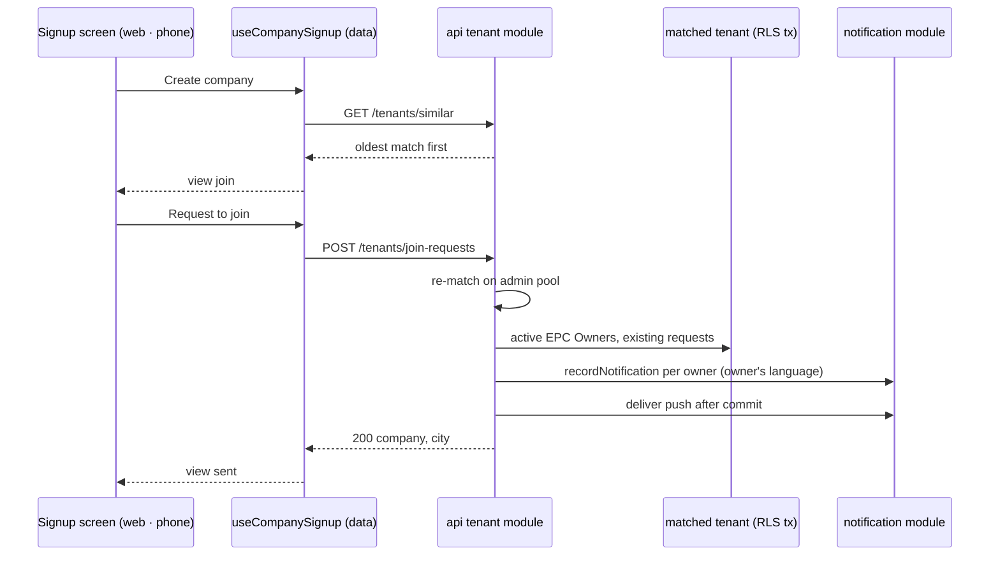

##### Package changes
- **domain:** `NOTIFICATION_TYPES` gains `join_requested`; its registry row — raised by a new source `team` (group *team*), recipients `epc_owner`, channels in-app and push, standard. Not `platform`: that source is product news (`F6.4`, `isAnnouncement`), which a company's own request is not — `centre-view.test.ts` caught it in the build. `SignupView` gains `join` and `sent`.
- **contracts:** `tenant.ts` gains `joinRequestSchema` and the `joinRequest` route; the notification read already accepts new types (`extensibleEnum`).
- **db:** migration 0022 adds the enum value; no table.
- **i18n:** the steer and request-sent words in `company-signup.ts`; the owner's notice words; `GROUP_SENTENCE` for the new type (a `Record`, so it will not compile without it); all three languages.
- **data:** `tenant` repository `joinRequest`; `useCompanySignup` gains the steer.
- **api:** the route in the tenant module; `@heliogrid/i18n` as a dependency (D2); the settings module exports `SettingsService` for its new `quietHoursOf` (a company's quiet window and clock, which a notice's push is held against, `F6-14`).
- **ui:** `NotificationCard`'s per-type icon map gains `join_requested` → `users` — the map is a `Record` over the types, so it will not compile without the row.
- **Protections (Law 12):** route → `RouteAccessMap` (`session`); type → the registry `Record` and `enum-parity`; words → the three-language checks; screens → `e2e-flow-per-screen` (existing flows extended). No new brand, table or error code.

##### Data and schema changes
- Migration `0022_join_request_notification.sql` (from `pnpm db:migration:new`): `ALTER TYPE notification_type ADD VALUE 'join_requested'`.
- Old readers: the notification read is `extensibleEnum`, so an old app shows an unknown type through its fallback. New code reads old rows unchanged. Expand only; rollback leaves an unused value.

##### File and folder changes
| action | path | purpose | placement reason |
|---|---|---|---|
| modify | `packages/domain/src/notifications/types.ts` | `join_requested` | the type list's owner |
| modify | `packages/domain/src/notifications/registry.ts` | its row | the registry `Record` |
| modify | `packages/domain/src/auth/signup-view.ts` | `join`, `sent` | the view rule's owner |
| modify | `packages/domain/tests/auth/signup-view.test.ts` | the two views | its test |
| add | `packages/db/migrations/0022_join_request_notification.sql` | the enum value | §4.2 |
| modify | `packages/contracts/src/tenant.ts` | the route and schema | tenant contract area |
| modify | `packages/contracts/openapi/openapi.json` | regenerated | generated |
| modify | `apps/api/package.json` · `pnpm-lock.yaml` | `@heliogrid/i18n` (D2) | `pnpm add` |
| modify | `docs/engineering/architecture.md` | apps/api allowed deps gain i18n (D2) | the authority |
| modify | `apps/api/src/modules/tenant/tenant.controller.ts` | route and access | the tenant module |
| add | `apps/api/src/modules/tenant/tenant.join-request.service.ts` | match, guard, words, push | the service would pass 300 lines |
| add | `apps/api/src/modules/tenant/tenant.join-request.repository.ts` | owners, existing requests, the write | tenant-scoped writes |
| modify | `apps/api/src/modules/tenant/tenant.admin.repository.ts` | `similar` ordered by `created_at` | the cross-tenant read |
| modify | `apps/api/src/modules/tenant/tenant.module.ts` | imports `NotificationModule` | Nest wiring |
| modify | `apps/api/src/modules/notification/notification.repository.ts` | `recordNotification` returns the id | the one writer |
| modify | `apps/api/src/modules/notification/notification.public.ts` | exports `TenantQuietHours` | the module's surface |
| modify | `apps/api/src/modules/settings/settings.service.ts` · `settings.module.ts` · `settings.public.ts` | `quietHoursOf`, exported | the company's quiet window is the settings module's (`F6-14`) |
| modify | `turbo.json` | the `app-api` boundary allows `i18n` (D2) | the boundary tag |
| modify | `packages/ui/src/components/NotificationCard/NotificationCard.logic.ts` | the type's icon | its `Record` |
| modify | `packages/i18n/src/index.ts` · `packages/domain/src/auth/index.ts` | the new exports | package entries |
| modify | `packages/i18n/src/copy/company-signup-frames.ts` · `packages/i18n/tests/company-signup-frames.test.ts` | `joinSteerWords`, `joinSteerFinding` — words chosen by state, the number kept whole | `.claude/rules/screen-parts.md` (words by state are a copy function) |
| modify | `packages/data/src/react/index.ts` | exports the hook's new types and `useSteerDroppedOnEdit` | the data entry |
| modify | `apps/web/features/auth/components/CompanyStep.tsx` · `apps/mobile/src/screens/company-signup/components/CompanyStep.tsx` | the steer inside the company step, sharing its form | the step owns the fields the steer keeps |
| modify | `apps/web/features/auth/company-signup.css` · `apps/mobile/src/screens/company-signup/styles.ts` · `…/components/KnownNumber.tsx` · `…/components/CompanyFields.tsx` · `apps/web/features/auth/components/CompanyFields.tsx` | the steer's placement per width, the sent-as facts; the off-flow title style renamed for both panels; the fields' helpers off under the steer (`withHelpers`, both halves); the phone fields' gap under the account (`underAccount`) | the screen's own styles |
| modify | `packages/ui/src/components/TintedBlock/TintedBlock.tsx` · `TintedBlock.native.tsx` | the block's title bold (QA round 1) | the component's owner, one contract for both halves (Law 7) |
| modify | `apps/api/src/modules/market/market.service.ts` · `apps/api/src/modules/catalog/catalog.service.ts` | `currentPackOf` — the one lookup settings, catalog and the request share (review) | the market module owns the packs |
| modify | `packages/domain/src/notifications/centre.ts` · `packages/domain/tests/notifications/centre.test.ts` | an unknown type never groups and never throws (review: release safety) | the group rule's owner |
| modify | `.dependency-cruiser.cjs` · `.claude/protections.md` · `packages/i18n/CLAUDE.md` | `server-no-i18n-frontend-entries` and its row; the notification exception to stored translations | Law 12, Law 8 |
| modify | `docs/tasks/deferred.md` · `docs/ux/briefs/SCR-M01-02-company-signup.md` | D23/D24 reopen cells, D133, D134, D135, D136, D137; brief decision 3 (the owner's city ruling); the brief's `request-failed` state and its 1536 count (board v6) | Law 8 |
| add | `apps/api/tests/tenant/join-request.test.ts` | the request's cases | testing rules |
| add | `packages/i18n/src/copy/join-request.ts` | the owner's notice words | copy module per reader |
| modify | `packages/i18n/src/copy/company-signup.ts` | steer and request-sent words | the screen's copy |
| modify | `packages/i18n/src/copy/notifications.ts` | `GROUP_SENTENCE` row | its `Record` |
| modify | `packages/i18n/src/locales/{en,hi,mr}/messages.po` · `messages.ts` | the catalogs (`.ts` compiled) | i18n catalogs |
| modify | `packages/data/src/tenant/repository.ts` | `joinRequest` | wire calls |
| modify | `packages/data/src/react/use-company-signup.ts` | the steer | the screen's hook |
| modify | `apps/web/features/auth/CompanySignupScreen.tsx` | renders the two views | the screen |
| add | `apps/web/features/auth/components/JoinSteer.tsx` · `JoinRequestSent.tsx` | the two panels | beside `CompanyStep.tsx` |
| modify | `apps/mobile/src/screens/company-signup/CompanySignupScreen.tsx` | renders the two views | the screen |
| add | `apps/mobile/src/screens/company-signup/components/JoinSteer.tsx` · `JoinRequestSent.tsx` | the two panels | beside `CompanyStep.tsx` |
| modify | `tests/e2e/web/company-signup.spec.ts` · `tests/e2e/support/door.ts` | the steer and request-sent; the signup helper stops at the company step | the screen's flow |
| modify | `docs/tasks/M01-onboarding.md` | this RFC; `T-M01-007` gains the owner's act | Law 8 |

##### API and contract changes
- `GET /tenants/similar` — unchanged shape; items now oldest first.
- `POST /tenants/join-requests` — body `{companyName, city, name}` (the existing name, city and owner-name schemas). Access `session` (signed in, no company needed). 200 `{companyName, city}` — the company as stored. 401 no session · 404 no company matches now · 409 the asker already has a company · 400 a field fails its schema (the global `VALIDATION_FAILED`). Idempotent by rule (decision 2), so no idempotency key. Additive; no client breaks.

##### Risks and rollout
- **Tenancy:** an outsider causes a write in another company. Mitigation: the target is only an exact name-and-city match; the write runs in that tenant's own RLS transaction; the planted red proves another company's owners get nothing.
- **Abuse:** anyone with a verified number can ask any company they can name. Mitigation: one request per asker per company; owners only; the OTP limits cost a verified number. No cap number is invented (no PRD row).
- **Privacy:** the asker learns that a company exists in a city — the steer's purpose (`M01-09`). No owner name crosses (brief decision 6).
- **Release:** the enum value is expand-only and readers fall back (Data).
- **An older api reading the new type:** the inbox derives each item's urgency from the registry, and an api built before this type would fail on a `join_requested` row. No deployed api exists yet (hosting is not set up), so no older api can read one; the inbox read gains an unknown-type guard here so a later type is safe in its roll.
- **Two requests at the same instant** may both write before either sees the other: the screen sends one request at a time, and a second notice is harmless. No lock is taken.

##### Acceptance criteria and proof
- **AC-1** — (M01-09 carries no dedicated Given/When/Then line in the PRD's acceptance block; the requirement text quoted above is the binding criterion.) → proof: QA (web and phone) a company name and city matching an existing workspace renders the steer with both roads full-size, "Create a new company anyway" still creates, and "Request to join" leaves the matched tenant's EPC Owner a request naming the asker and lands the asker on the `request-sent` state · QA (api) the Owner's notification carries the registered type

| AC/row | owner | tier | surface | action → expected | proof |
|---|---|---|---|---|---|
| AC-1 | main-dev | required | api tests | a match → each active EPC Owner gets one `join_requested` in their language naming the asker, other members none, another company nothing; repeat → nothing new; no match → 404; asker with a company → 409; no session → 401; two matches → the oldest | `apps/api/tests/tenant/join-request.test.ts`; planted reds (Delivery size): the EPC Owner role filter, the active filter, the repeat check and the oldest-first order, each removed |
| AC-1 | main-dev | required | domain | `signupView` → `join`, `sent` | `signup-view.test.ts` |
| AC-1 | qa-api | required | api `8084` | the request live, then the owner's `GET` inbox shows `join_requested`; a second request adds none | live |
| AC-1 | qa-web | required | web `3002` at 375 and 1536 | steer with both roads; *anyway* creates; *Request to join* → `request-sent`; the owner's centre shows the notice | live, board compared |
| AC-1 | qa-ios | required | simulator | the same on the phone | live |
| AC-1 | qa-android | required | Pixel_8 emulator | the same on Android (owner ruling 2026-10-07: the phone flow cannot reach the steer — it stops before *Create company*, T-FPLAT-079, and the steer needs a second account) | live |
| AC-1 | ci | required | `e2e-web` | a second number types an existing company → the steer → `request-sent`; and *anyway* → home; a request that does not go through keeps the steer, says so (*anyway* disabled while it is on its way), and sends again | `tests/e2e/web/company-signup.spec.ts` |
| all | evaluator · ci | required | `pnpm check:all` · `quality` | the gate passes | gate · CI |

##### Delivery size
- **Estimate:** 31 authored files, 3 generated (`openapi.json`, `pnpm-lock.yaml`, the three compiled `messages.ts` counted once). Authored lines: code about 650 · tests about 350 · docs about 120 — about 1,120.
- **D3 — size ruling (owner).**
  - **A · one part (recommended).** The steer without the request leads nowhere, and the request without the steer has no caller. About 31 files and 1,120 lines.
  - **B · split.** **a** — the route, the type, the words (about 14 files, 550 lines; proved by api tests and `qa-api`). **b** — the two screens (about 17 files, 570 lines). Two PRs and two QA runs.
- **D2 — the owner's notice words (owner).**
  - **A · the api may import `@heliogrid/i18n`'s React-free entry (recommended).** `architecture.md` already names that entry for "a server render or a job"; every later notification type needs the same.
  - **B · the words go in the market pack**, as SMS words do (`platformMessage`). No new dependency, but UI words become pack data, which owns market facts, not copy.
- **Order:** as in Proposal.
- **Owner rulings (2026-10-07):** RFC approved; D2 → **A** (the api imports `@heliogrid/i18n`); D3 → **A** (one part).
- **Scope delta approved (2026-10-07):** `packages/ui`'s notification icon for the new type; the settings module's `quietHoursOf`; `turbo.json`'s `app-api` boundary; validation answers 400; the race note.
- **Build delta (2026-10-07, after the first review)** — the build ran over the 20% line, so approval is void until D4 and D5 are ruled.
  - **Measured:** 49 authored files (42 tracked, 7 new) and about 1,560 authored lines (code about 970, tests about 380, docs about 210), against 31 files and 1,120 lines planned. Generated: `openapi.json`, `pnpm-lock.yaml`, three compiled catalogs.
  - **Why it grew:** the copy and catalogs in three languages; the steer living inside both `CompanyStep`s; `quietHoursOf` and the `team` source; the e2e helper split; the RFC's own deltas.
  - **The review's fixes add about 8 files and 150 lines:** one market-pack lookup reused by settings, catalog and the request; the quiet-hours type reused; a `checking` wait so a matching check never says *Creating your company*; the view passed into `CompanyStep`; the edit-drops-steer rule written once; the 404 rule above; the push after commit caught per notice; the phone number kept whole in the steer sentence; a dependency-cruiser rule keeping i18n's `./react` and `./rn` out of the api (seen firing, then its protections row); the i18n docs naming the api's use; a deferred row to drop `tenantId` from `GET /tenants/similar`.
  - **D4 — size (owner).** **A · one part at about 57 files and 1,710 lines (recommended)** — built and proven; the steer without the request leads nowhere. **B · split now** — the backend as one PR, the screens as a second; the code is written, so a split only adds a second review and QA run.
  - **D5 — `D23` and `D24` (owner).** **A · keep both deferred (recommended)**: add `JoinSteer` and `JoinRequestSent` to `D24`'s list, and both rows reopen on the owner scheduling the door-parts lift as its own task — twelve parts into `packages/ui` is its own RFC. **B · lift now**: the twelve parts move into `packages/ui` in this task, roughly doubling it.
  - **Owner rulings (2026-10-07):** delta approved; D4 → **A** (one part); D5 → **A** (both stay deferred).
- **Planted reds, each seen failing by name in `apps/api/tests/tenant/join-request.test.ts`, then restored:** the EPC Owner role filter removed → *sends each active EPC Owner of the oldest match one join request…* (the worker got one); the active-membership filter removed → the same case (the left owner got one); the repeat check removed → *writes nothing new when the same person asks again*; the oldest-first order removed → *lists the oldest match first on the steer read*. The tenant predicate is a second guard behind RLS (the write runs in the matched company's own transaction), so removing it alone cannot go red. `server-no-i18n-frontend-entries` fired on a planted `@heliogrid/i18n/react` import in the api, then was restored. `centre.test.ts`'s unknown-type case failed before the guard.
- **Review, not changed (with reason):** the repository resolves the registry's `epc_owner` rule to holders of `FOUNDER_ROLE`. The rule names a relationship and the role is its people (`registry.ts`: resolving a rule to people is the emitting slice's); filtering by the rule's string would conflate the two vocabularies.
- **After the owner's design review (2026-10-07):** the build missed the board's details on `request-sent` and the steer (the Sent-as tile on `--fill` with `--tile-pad` and `--r-tile`, its name `body-sm` bold and number mono bold, the prompt `body-sm` centred `sp-2` over its route, the phone request-sent heading `sp-8` from the header, the phone steer heading → fields `sp-5` and fields → finding `sp-5`, the roads `sp-3` apart, the 1536 finding block) and two states were never driven (the sending lock, a failed request). Owner approved the fix plan; D6 → **A**: the owner draws `request-failed` on the board first. QA adds an element-by-element check of type, colour, fill, padding and gaps against the board's tokens.
- **Board redrawn (2026-10-07, D6 A):** `m-request-failed` / `d-request-failed` and their Hindi and Marathi renders; the sending lock and the 404 return written on the board (decision 26); every finding and failure block at 1536 one size, `d-duplicate-phone`'s. Read again and to be checked by `design-check` when this task resumes.
- **Blocked on the design tokens (D7 A, D8 A, 2026-10-07):** `packages/theme/src/_generated/` is the snapshot pulled at #12; the live design system has since moved to the open page (`--canvas` white), added `--fill`, `--tile-pad`, `--r-tile` and more, and changed values (`--surface-form`, `--r-input-expressive`). The Sent-as tile cannot be built to the board without them. The pull runs first as its own task on `feat/T-FPLAT-pull`, stacked on `feat/T-M01-030g`; this branch then stacks on it, and the visual fixes, the `request-failed` state, the sending lock and an element-by-element QA follow.
- **As built (2026-10-07):** 55 authored files (46 changed, 9 new) and about 1,780 authored lines — code about 1,120, tests about 400, docs about 260 — inside D4's approved size. Generated: `openapi.json` (+248), `pnpm-lock.yaml` (+3), three compiled catalogs.
  - **Planned and built:** every row of `##### File and folder changes`, as amended by the two approved deltas.
  - **Built but not planned:** `packages/domain/src/notifications/centre-view.ts` — `isKnownType` moved to `types.ts` so the inbox and the announcement rule share one check (review, Law 5).
  - **Planned but not built:** `tests/e2e/mobile/company-signup.yaml` — the phone flow cannot reach the steer (owner ruling: live `qa-android`).
  - **Changed from the RFC:** the steer lives inside both `CompanyStep`s, sharing the form, not in a separate `JoinSteer` screen; validation answers 400; a 404 returns to the plain step; *Check* is its own wait.
- **Size after the resume (2026-10-07, approval void by size until ruled):** the board-v6 round — the `request-failed` block and *Send the request again*, the sending lock (facts, spinner, bare-disabled *anyway*), the Sent-as tile, the steer's road gap, the prompt's size and centring, the phone heading padding, the brief's `request-failed` state, the words in three languages and a failing-request e2e case — touched 17 files already in the table and added about 390 authored lines. Built: 55 authored files (no new file) and about 2,170 authored lines, against D4's 57 files and 1,710 lines (+27%). One part still: the round finishes states of the same two panels.
  - **Owner ruling (2026-10-07):** size **A** — one part at about 55 files and 2,170 lines.
  - **Side-by-side review (owner's request, 2026-10-07):** every frame of this task shot on web 375 and 1536, iOS and Android, English, Hindi and Marathi, beside its board frame. Fixed: the field helpers hidden under the steer (the steer's one sentence is its finding — both `CompanyFields`); six Hindi and Marathi phrases set to the board's words. Rulings: **D14 B** — the board's white secondary button (`--surface`, `--e2`) is drawn in `T-FPLAT-082` part c, every screen at once; **D15 B** — the web door at 375 matches the phone board in its own task, `T-M01-038`, next after this one (replaces D137). Kept: a number never wraps (ui-adherence), where the board breaks it after `+91`.
  - **Process rules changed (owner, 2026-10-07), in this commit:** `/task` step 3 captures every frame from the board and never follows it blindly (a wrong frame goes to the owner with two options); `references/qa.md` and the three QA helpers compare each screenshot with its board frame element by element and list every difference (`board?` where the board looks wrong); `docs/tasks/README.md` adds one `side-by-side` proof row per frame; `ui-adherence.md` copies Hindi and Marathi words from the board's renders; the commit card shows the side-by-side images.
  - **From QA, round 1 (2026-10-07):** every statement block's title is bold — `TintedBlock`'s two halves (`packages/ui`), as the board's blocks draw it (*"a `--fs-body-sm` bold title"*, *"what happened in its bold line"*). This also bolds the sign-in door's blocks (`SCR-M01-01`), whose record names no weight; said here out loud. At 1536 a finding holds the identity half at its 560 measure, so the block sits at the half's left edge, 520 wide (the board's 176 → 696). The rule selects `DoorFrame`'s own `.hg-door-identity` from `company-signup.css`, because only a finding widens the half — the board's `d-step2-code` keeps the half shrink-wrapped — so a rename of that ui class drops it silently; no check holds it, said out loud.
- **Mistakes found, each fixed, with what now prevents it:**
  - *Main, found by the side-by-side* — the field helpers were drawn under the steer, where `m-request-to-join` and `m-request-failed` show none (the steer's one sentence is its finding). Prevention: the board's frames are captured at design check and every QA row compares its screenshot with them (`/task` step 3, the QA helpers); no automatic check reads a board — said out loud.
  - *Main, found by the side-by-side* — six Hindi and Marathi phrases were written, not read from the board's language renders. Prevention: Hindi and Marathi words are copied from the board's renders (`.claude/rules/ui-adherence.md`); no automatic check reads a board — said out loud.
  - *Main, after the resume* — QA packets named `…906` and `…907` as company-less, but both belong to *QA api primary*; and called `000000` a wrong code when it is `DEV_OTP_CODE`. Each cost one helper run. Prevention: read the numbers' memberships from the test database and the dev code from `.env.local` before writing a packet — no check can see a packet; said out loud.
  - *Main, after the resume* — the web steer's block title rendered at weight 400 and its 1536 block shrank to its content; `TintedBlock` never drew the board's bold line. Found by element-level QA; the bold title is now one contract on both halves.
  - *Main* — migration 0022 applied to `heliogrid_dev`: `pnpm --filter @heliogrid/db migrate <url>` ignores the argument and reads `DATABASE_ADMIN_URL` from the shell. Applied again correctly to `heliogrid_test`; `heliogrid_dev` stays one migration ahead until this merges (an enum value cannot be dropped). Prevention: `packages/db/CLAUDE.md` already says `pnpm db:migrate` reads the shell; no check can see which database a person meant — said out loud.
  - *Main* — the walk did not list the deferred rows due at this start (D23, D24); the review found them, the owner ruled D5. Prevention: `docs/tasks/deferred.md`'s header rule; review holds it.
  - *Main* — a scripted edit of this file wrote it back without its tail (every task after this one); rebuilt from git and checked against `git diff HEAD --stat`. No check holds a task file whole — said out loud.
  - *Main* — the iOS packet gave the board's 375×812 home-bar line (778) for a 402×874 device; the rerun measured against 840.
  - *design-check* — the steer's second sentence passed two rounds before it was flagged; the owner redrew it.
  - *A helper* — 36 files were found staged in git after QA; no helper may write the repository. Unstaged; no content changed. The status hash detects it; nothing prevents it.
  - *Review* — the registry's `platform` source made the request read as product news (`centre-view.test.ts` caught it in the build); the `team` source fixes it.

**Checklist** — [x] domain · [x] migration 0022 · [x] contracts · [x] api · [x] words · [x] data · [x] web · [x] phone · [x] e2e · [x] docs · [x] AC-1 main-dev · [x] qa-api · [x] review (clean on the third pass, before the pause) · board-v6 round: [x] words · [x] web · [x] phone · [x] e2e (10 passed on one worker; planted red: the failure block removed → *element(s) not found* at both widths) · [x] docs · [x] qa-web · [x] qa-ios · [x] qa-android (steer, request-failed with the api stopped, request-sent, the sign-in door's bold block; the owner's notice on web) · [x] review (clean, fourth pass) · [x] qa-api (live again: 401, 200, a repeat adds no notice, the owner's one notice, 404) · [x] *anyway* creates, live on web, iOS and Android · [x] side-by-side of every frame (web 375/1536, iOS, Android; English, हिन्दी, मराठी) · [x] gate — run 1 passed before the side-by-side round; run 2, the final, passed after it (2,763 tests, every invariant green)

#### Runtime
Recorded at the step's start (2026-10-07), before anything ran. Branch `feat/T-M01-035` from `feat/T-M01-030g` `05674c73` — stacked on the open PR #246, by the owner's call.

| resource | state at start | identity |
|---|---|---|
| web `3002` · api `8084` · metro `8081` | free | — |
| postgres `5544` | pre_existing | container `heliogrid-pg-local` |
| object store `9000` | pre_existing | container `heliogrid-object-store-local` |
| temporal `7233` | pre_existing | container `heliogrid-temporal` |
| simulators · emulators | none booted, none attached | — |
| browser tabs | the pane is closed | — |
| database routing | `heliogrid_dev` on both `DATABASE_URL` and `DATABASE_ADMIN_URL` | `.env.local` |
| logs | `.qa/api.log` 3,967,218 bytes · `.qa/metro.log` 14,661 bytes · `.qa/web.log` not created | byte marks |

**At the end** (resource → initial → final):
- api `8084` → free → started through the `api` launch configuration (serverId `69c9cfea…`), stopped; free.
- web `3002` → free → started through `web` (`c2c37d7c…`), stopped before the gate; free.
- metro `8081` → free → started through `mobile-metro` (`ce4219d9…`), stopped; free. No `tsx watch` left.
- simulator iPhone 17 Pro `40ED0117-7FB4-4A1E-BCA4-08A160670C63` → shut down → booted (restarted once when its screen did not come up), shut down.
- emulator `Pixel_8_Emulator` (`emulator-5554`) → not running → started with 4 GB, its app data cleared once for a signed-out start, stopped.
- browser tabs → pane closed → `seed` and `tab-1` opened by the previews, closed.
- database routing → `heliogrid_dev` on both → `heliogrid_test` for QA → `heliogrid_dev` on both, `.env.local` byte-identical to its start.
- `heliogrid_test` → migrated to 0022. `heliogrid_dev` → migrated to 0022 by mistake (above).
- standing accounts → `…902` and `…903` stay company-less, each holding one join request; `…901` and `…904` hold the notices; QA's fresh numbers own new companies named like the targets (oldest still the standing ones).
- Postgres, object store, Temporal → pre_existing, untouched.
- logs → `.qa/api.log` 3,967,218 → 4,375,636 · `.qa/web.log` created → 35,364 · `.qa/metro.log` 14,661 → 118,197 bytes; kept.

**Measurements** — about 330 Main tool calls; helper runs: `design-check` 4 (one helper continued), `qa-api` 2, `qa-web` 2, `qa-ios` 3, `qa-android` 3, `reviewer` 3, `evaluator` 1, plus one read-only code map; Main's own tokens are not measured by this session. Planned 31 files and 1,120 lines; built 55 files and about 1,780 lines (both deltas approved).

**Resumed (2026-10-07, after `T-FPLAT-082a` merged as #247).** Branch `feat/T-M01-035` moved to `origin/main` `c08a52cd`; the paused work restored from `stash@{0}`; its deferred rows renumbered D130–D132 → D133–D135 (part a took D130–D132). State at resume:

| resource | state at resume | identity |
|---|---|---|
| web `3002` · api `8084` · metro `8081` | free | — |
| postgres · object store · temporal | pre_existing | `heliogrid-pg-local`, `heliogrid-object-store-local`, `heliogrid-temporal` |
| simulators · emulators | none booted | — |
| browser tabs | the pane is closed | — |
| database routing | `heliogrid_dev` on both URLs; `heliogrid_dev` and `heliogrid_test` at 0022 | `.env.local` |
| logs | `.qa/api.log` 4,535,039 · `.qa/web.log` 69,520 · `.qa/metro.log` 241,995 bytes | byte marks |

**At the end of the resume** (resource → at resume → final):
- web `3002` · api `8084` · metro `8081` → free → started through `web`, `api`, `mobile-metro`; the api stopped once by Main for the request-failed rows and started again; all stopped; free.
- Docker → running → the daemon went down during the build (not by Main) and the containers exited; Main started Docker Desktop and ran `pnpm infra:up`, which reused the images and the volumes; running.
- simulator `40ED0117-7FB4-4A1E-BCA4-08A160670C63` → shut down → booted, its keychain reset once for a signed-out start; shut down.
- emulator `emulator-5554` → not running → started (4 GB), its app data cleared twice for signed-out starts; stopped.
- browser tabs → pane closed → `seed`, `tab-1`; closed.
- database routing → `heliogrid_dev` on both → `heliogrid_test` for QA → `heliogrid_dev` on both. The start copy of `.env.local` was lost with the scratchpad, so the restore changed only the two database names back; not checked byte for byte — said out loud.
- test data on `heliogrid_test`, all through the app: companies made by *anyway* — "QA api second" again for +91 98765 03910 (web), +91 98765 03911 (iOS) and +91 99999 99903 (Android); +903 is no longer company-less, so the Android standing account needs a new company-less number next time. Join requests from +91 98765 01906 (Standing Web EPC), 01907 (QA Solar Ten), 98345 67890 (QA iOS Solar) and 98765 02908 (QA api primary).
- logs → `.qa/api.log` 5,202,325 · `.qa/web.log` 107,592 · `.qa/metro.log` 411,597 bytes; kept.

**The side-by-side round** (owner's request, after the first commit card) → the stack started again on `heliogrid_test` and stopped; the api stopped once for the failed shots; the simulator's keychain reset twice and the emulator's app data cleared twice for signed-out starts; the board read in the browser pane, signed in by the owner; web shots by a temporary spec, created and deleted; a company "Suryodaya Solar Solutions Pvt Ltd" (owner +91 98765 04900) made through the api, plus a second "Suryodaya Solar Solutions" (+91 98765 04911, an input slip); join requests from +91 98765 04912–04916 and web numbers. Both phones signed out once when Metro rebuilt mid-run; a plain relaunch resumes the session, so it is a development reload, not the product. End: ports free, devices off, tabs closed, `.env.local` on `heliogrid_dev`.

**Measurements of the resume** — helper runs: `design-check` 1 (one continuation), `reviewer` 1 (four passes), `qa-web` 1 (seven continuations), `qa-ios` 1 (six), `qa-android` 1 (seven), `qa-api` 1, `evaluator` 1 (one continuation); one full gate. Main's own turns and tokens are not counted. Size: 61 authored files and about 2,294 lines against the re-ruled 55 and 2,170 (+11% files, +6% lines).

### T-M01-038 · The web door at phone width matches the phone board
**Type:** screen · **Tier:** P0 (`F7-43`)
**Status:** shipped
**Why:** At 375 the web door (`/login`, `/company-signup`) is laid out as the 1536 two-field composition stacked, not as the phone board: the heading sits above the step header and at `h1`, an off-flow state's content is centred low on the page, and the action flows under the column instead of being pinned. The boards draw one phone layout for both the app and the web at 375 (`F7-43` item 1, parity).
**PRD rows:** none of its own — `F7-43` item 1 (375 and 1536, parity by capability); the boards `SCR-M01-01` and `SCR-M01-02` are the reference.
**Design:** the existing boards' 375 frames (`SCR-M01-01`, `SCR-M01-02`) — no new drawing.
**Chosen by the owner** (`T-M01-035`'s side-by-side review, ruling D15 B, 2026-10-07): its own task, next after `T-M01-035`. It replaces deferred row D137.
**Depends on:** `T-M01-035` (the web frames it rebuilds at 375).
**Found by:** the side-by-side comparison of `T-M01-035`'s frames (web 375 against `m-request-to-join`, `m-request-failed`, `m-request-sent`).
**Out of scope:** the white secondary button (`T-FPLAT-082` part c, D14 B); the 1536 layout, which matches.
**DONE WHEN:**
- At 375 every web door frame lays out as its phone board (each record's "375 vertical layout"): the step header above the heading, the heading in the `--fs-h2` role, the gap under the header or the step header the board's token, the front door's column centred between the header and its foot where `SCR-M01-01` centres it and the signup frames top-aligned, and the action pinned at the bottom where the board pins it. → proof: a side-by-side of every web door frame at 375 against its board frame, and the e2e door specs green.

Corrected before approval (2026-10-08): the line read "an off-flow title `sp-8` under the header". The boards' 375 tables put `m-request-sent`'s heading `sp-8` under the header and `m-duplicate-phone`'s `sp-6`, and draw the step header on `m-request-to-join` and `m-request-failed`; the front door centres its column and the signup frames do not.

#### Design check
**READY** (2026-10-08, after the owner added each board's "Heading" section and "375 vertical layout" table; both records re-read that day). The heading is an `<h1>` in the `--fs-h2` role at 375 and `--fs-h1` at 1536 on both boards. `SCR-M01-01`: the front door centres between equal flex spacers (min `sp-8` above the title, min `sp-6` under the form) with the signup door at the column's foot — never a viewport pin (N9); the code family centres between spacers (min 0), nothing pinned. `SCR-M01-02`: header 78 → 122, step header `sp-6` under it, heading `sp-8` under it on steps 1 and 2 and `m-number-invalid`, `sp-6` elsewhere; no spacer above any heading; the action is pinned under a scroll region on steps 3, `m-error`, `m-resume`, `m-request-to-join`, `m-request-failed`, and held at the foot on step 1, `m-loading`, `m-request-sent`, `m-fields-invalid`; nothing pinned on step 2 and `m-duplicate-phone`. Not blocking: the words-law FAILs (D133); `m-google-failed` not yet measured in Hindi and Marathi (the board's own contract item 4, D139).

**Board pictures** (scratchpad `board/`, 53 frames, board zoom 75% for 375 and 50% for 1536): `SCR-M01-01` — `m01-m-normal`, `m-number-invalid`, `m-loading`, `m-google-failed`, `m-google-loading`, `m-google-link`, `m-google-link-locked`, `m-otp-sent`, `m-otp-entry`, `m-otp-auto-read`, `m-wrong-code`, `m-expired-code`, `m-resend-cooldown`, `m-call-me-instead`, `m-delivery-failed`, `m-cap-reached`, `m-number-locked`, `m-auth-error`, `m-google-link-code`, `m-google-phone-taken`, `m-success-dwell`, `m-switch-discards`; `d-normal`, `d-switch-discards`, `d-code-family`, `d-number-locked`, `d-google-link`. `SCR-M01-02` — `m02-m-step1-number`, `m-step2-code`, `m-step3-empty`, `m-step3-filled`, `m-loading`, `m-error`, `m-duplicate-phone`, `m-request-to-join`, `m-request-sent`, `m-request-failed`, `m-resume`, `m-number-invalid`, `m-fields-invalid`; `m-request-to-join-hi`, `-mr`, `m-request-failed-hi`, `-mr`, `m-request-sent-hi`, `-mr`; `d-step1-number`, `d-step2-code`, `d-step3-filled`, `d-duplicate-phone`, `d-request-to-join`, `d-request-sent`, `d-request-failed`.

#### RFC

##### Title
T-M01-038 — the web door at 375 laid out as the phone board: the step header above the heading, the heading at phone size, the board's gaps, and the action pinned where the board pins it.

##### Description
- **User impact:** someone who signs in or creates a company on a phone's browser sees the same screen the app shows: the step bar first, a phone-sized heading, and the button they need held at the bottom of the screen while the fields scroll. Directly: the main button never drops below the fold in Hindi or Marathi. Indirectly: one phone design serves the app and the web, so every later door screen is built once.
- **Who gains:** a new owner signing up on a phone browser; anyone signing in on the web from a phone.
- **Problem solved:** the shared `DoorFrame`'s web half draws one DOM order at every width — the identity (with the heading) before the task (with the step header) — centres every column, never uses its `footer`, and every heading is `Text variant="h1"` (32px). Found by `T-M01-035`'s side-by-side (D15 B); the boards' 375 tables (READY above) are the reference.

##### Goals
- At 375 every web door frame matches its board frame side by side: order, heading size, gaps, centring or top alignment, pinned action.
- At 1536 every door frame is unchanged against its board frame.
- The frame's behaviour at both widths is held by a component test.

##### Non-goals
- Words, states, routes, the 1536 composition, the phone app's screens (they already pass their own side-by-side), the white secondary button (`T-FPLAT-082c`). The bloom's sideways scroll (D135) closes as a side effect: `overflow: clip` no longer makes the page a scroll container (measured: the language menu open at 375 on both doors, `scrollX` 0, overflow 0).

##### Readiness and dependencies
- Landed: `T-M01-035` (on this branch, PR #248 open — this branch is cut from it; it rebases onto `main` after #248 merges). Design check READY (above).
- Assumption: "pinned" on the web is the page's own scroll with the action held at the viewport's foot (`position: sticky`) — the web's form of the board's "scroll region with the action below it" (`SCR-M01-02` decision 9). The front door's signup link is not pinned: it follows the form at the column's foot (`SCR-M01-01` N9).
- No blocker.

##### Proposal
**Flow.** A web door screen hands `DoorFrame` four slots — `lead` (the step header), `identity` (heading, intro, account, findings), the task (fields, primary), `footer` (the action the board pins) — and the frame places them per width: at 375 one column in that order with the footer held at the viewport's foot; at 1536 the two-field grid, the identity left and the lead, task and footer stacked in the task column.

**Findings from testing the requirement:**
1. **The DONE WHEN's off-flow gap was wrong** — corrected above from the boards' tables before approval.
2. **The phone app differs from the board on two signup frames:** step 1 and the code step centre their column on the phone (`apps/mobile/src/screens/shared/PhoneStep.tsx` `spacerTop`, `door-styles.ts` `codeColumnAfterLead`); the board top-aligns both under the step header. Out of this web task's scope → D138 (decision D1 below).
3. **Simpler than a new component:** the heading size is the frame's to set, as `Sheet` and `Modal` set their title per width (`Sheet.css` `--hg-sheet-title`): `DoorFrame.css` draws the identity's heading in the `--fs-h2` role under the door's breakpoint, so the seven call sites keep `Text variant="h1"` and change nothing.
4. **Centring belongs to the screen, not the frame:** the phone's frame centres nothing and each screen places its own spacers; the web frame's unconditional centring (`DoorFrame.css` `.hg-door-body::before`) is removed and the sign-in screens add the board's two spacers, as their phone twins do.

**Key decisions** (one reason each):
1. **`lead` is a slot of the shared contract** (`DoorFrame.types.ts`), so its place per width is the frame's, not each screen's; the native half renders it under the header (Law 7), and no phone screen changes.
2. **`footer` moves inside the frame's body**, so at 1536 it sits in the task column in reading order (the board's "sign-in door under the form") and at 375 it is held at the viewport's foot.
3. **A focused field never hides under the pinned action:** the page's `scroll-padding-bottom` is the footer's height.

**Order:** component test (red) → `DoorFrame` web and native → sign-in screens → signup screens → docs → side-by-side QA at 375 and 1536.

**Twin:** the phone app already lays these frames out per board; the native `DoorFrame` gains only the `lead` render.

**Build delta (2026-10-08, from QA and review — approved by the owner, A):** three more 375 differences from the board, each one the phone app already draws: (a) step 1's note sits under the primary at 375 and stays in the identity half at 1536; (b) the code step's header holds "Change number" alone at 375, the language control from the breakpoint (as `GoogleLinkStep` already does); (c) the identity's intro takes `--fs-body` at 375 and `--fs-body-lg` at 1536, by the heading's rule. The company step's note now renders above the held primary, as both boards draw it, so its i18n contract comment is corrected (`packages/i18n`, a package this RFC did not name — the reason the approval is asked again).

##### Architecture diagram
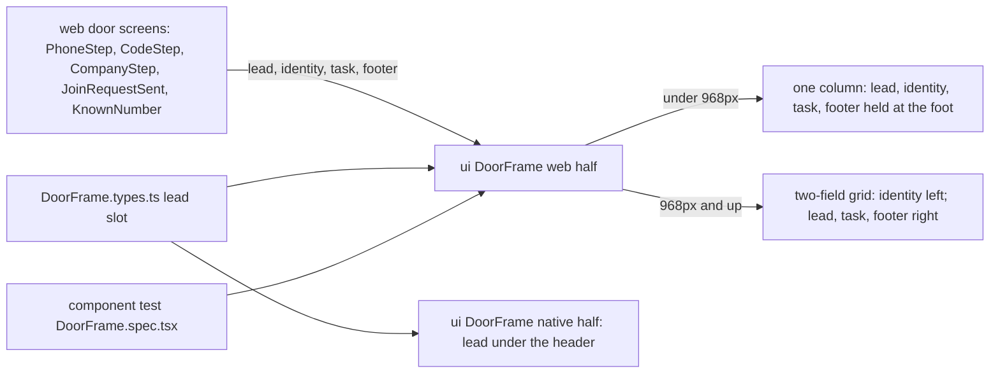

##### Package changes
- **ui:** `DoorFrame` gains `lead?: ReactNode` (types, web, native); the web half moves `footer` into the body, drops the centring spacer, and sizes the identity's heading per width. No new export.
- **web:** the door screens pass `lead` and `footer`; `sign-in.css` and `company-signup.css` carry the boards' spacers and gaps; `constants.ts` names the column rule once (`doorColumn`).
- **i18n:** one contract comment (delta above).
- **Protections (Law 12):** none — no brand, enum, token, route, table or error code. Said out loud: `DoorFrame.css` sizes `Text`'s `h1` and `body-lg` inside the identity, held by `DoorFrame.spec.tsx`; the web's `sign-in.css` and `company-signup.css` select the frame's own `.hg-door-body::before` and `.hg-door-identity`, and no check holds those — a rename in `packages/ui` drops them silently.

##### Data and schema changes
None — no stored shape changes.

##### File and folder changes
| action | path | purpose | placement reason |
|---|---|---|---|
| modify | `packages/ui/src/components/DoorFrame/DoorFrame.types.ts` | the `lead` slot | the one contract (Law 7) |
| modify | `packages/ui/src/components/DoorFrame/DoorFrame.tsx` | `lead` before the identity; `footer` inside the body; the page's `scroll-padding-bottom` follows the held footer | the web half |
| modify | `packages/ui/src/components/DoorFrame/DoorFrame.css` | 375: no centring, `sp-6` under the header, heading `--fs-h2` and intro `--fs-body`, footer held at the foot; 1536: grid areas; `overflow: clip` | the frame's stylesheet |
| modify | `packages/ui/src/components/DoorFrame/DoorFrame.native.tsx` | renders `lead` under the header | Law 7 |
| modify | `apps/web/features/auth/components/PhoneStep.tsx` | `lead` slot; the front door's two spacers; the signup's top alignment | the screen owns its spacers |
| modify | `apps/web/features/auth/components/CodeStep.tsx` | `lead` slot; the code family centred on the front door, top-aligned under a step header | same |
| modify | `apps/web/features/auth/components/CompanyStep.tsx` | `lead`; Create company, and the finding with both roads, into `footer`; the note above the action | the board pins them |
| modify | `apps/web/features/auth/components/JoinRequestSent.tsx` | prompt and route into `footer`; heading `sp-8` under the header | board `m-request-sent` |
| — | `apps/web/features/auth/components/KnownNumber.tsx` | **not changed:** top-aligned and `sp-6` under the header through the frame alone | board `m-duplicate-phone` |
| modify | `apps/web/features/auth/components/GoogleLinkStep.tsx` | `hg-door-front`: its column centres, as the front door's | built but not planned — the frame stopped centring |
| modify | `apps/web/features/auth/constants.ts` | `doorColumn(lead)`, the one place the centring-or-top rule is named | built but not planned — review (one rule, two callers) |
| modify | `apps/web/features/auth/components/SignupProgress.tsx` | its comment: the step header, no longer "atop the task column" | built but not planned — Law 8 |
| modify | `packages/i18n/src/copy/company-signup-frames.ts` | the caption's comment: above the held primary | built but not planned — Law 8 (delta) |
| modify | `apps/web/features/auth/sign-in.css` · `company-signup.css` | the boards' spacers and gaps, hidden at 1536 | the screens' stylesheets |
| add | `tests/e2e/components/DoorFrame.spec.tsx` | the frame at 375 and 1536 | component tests (`tests/e2e/CLAUDE.md`) |
| modify | `docs/tasks/M01-onboarding.md` · `docs/tasks/deferred.md` | this RFC; D135 and D137 closed, D138 (phone step 1 and code step centring), D139 (`m-google-failed` language proof), D140–D142 (older web-door differences QA found) | Law 8 |

##### API and contract changes
None — no wire boundary changes.

##### Risks and rollout
- **1536 moves when the frame's DOM changes** — AC-2's side-by-side of all 12 desktop frames, and the component test's 1536 case.
- **A pinned action covers a focused field on a phone browser** — `scroll-padding-bottom`; QA focuses the last field at 375 with the footer present.
- **Stacked branch** — rebased onto `main` after #248 merges; nothing deployed.

##### Acceptance criteria and proof
- **AC-1** — the DONE WHEN line above (375, verbatim).
- **AC-2** (new) — Given every door frame at 1536, when it renders, then it matches its board frame: identity left, the step header atop the task column, the action in reading order under the task.
- **AC-3** (new) — Given `DoorFrame` with a `lead`, an identity heading and a `footer`, when it renders at 375, then the lead is above the heading, the heading is in the `--fs-h2` role and the footer stays inside the viewport while the column scrolls; at 1536 the lead and footer sit in the task column and the heading is `--fs-h1`.
- **AC-4** (new, owner 2026-10-08) — Given a window between the boards' two widths (768), when every door frame renders, then it is the phone layout centred at its task measure, with no sideways scroll and the pinned action in view — the frame's rule (`DoorFrame.css`), since no board frame draws this width.

| AC/row | owner | tier | surface | action → expected | proof |
|---|---|---|---|---|---|
| AC-3 | main-dev | required | component tests | mount at 375 and 1536 → order, heading size, footer in view, columns; planted reds: the old DOM order (lead under the heading) and no sticky footer | `tests/e2e/components/DoorFrame.spec.tsx` (ct, new) |
| AC-1 | qa-web | required | web `3002` at 375 | each of the 41 board frames' states (22 sign-in, 13 signup, 6 language renders) → side-by-side with `board/<frame>.png`, every difference listed | live |
| AC-4 | qa-web | required | web `3002` at 768 | one frame per door step and state family (`m-normal`, `m-otp-entry`, `m-step1-number`, `m-step3-filled`, `m-request-to-join`, `m-request-sent`) → phone layout centred, `scrollWidth` = 768, the pinned action inside the viewport | live |
| AC-2 | qa-web | required | web `3002` at 1536 | each of the 12 desktop board frames → side-by-side, unchanged | live |
| AC-1 · AC-2 | main-dev · ci | required | Playwright `phone` and `desktop` projects | `tests/e2e/web/login.spec.ts`, `login-google.spec.ts`, `company-signup.spec.ts` green | e2e |
| — | qa-ios · qa-android | not_applicable | — | no phone screen changes; the native half's `lead` has no caller | — |
| — | qa-api | not_applicable | — | no API change | — |
| all | evaluator | required | `pnpm check:all` | every check passes | gate |

##### Delivery size
- **Estimate:** 16 authored files, about 400 authored lines — code about 200, tests about 110, docs about 90. One part.
- **Order:** as in Proposal.
- **Owner rulings (2026-10-08):** RFC approved; D1 → **A** (deferred row D138); AC-4 added — one QA row at 768. Build delta → **A** (the three 375 matches and the i18n comment). Five board frames **not applicable** to the web side-by-side (owner, A): `m-otp-auto-read` (no SMS autofill in a desktop browser), `m-google-loading` (the press leaves for Google's own page), `m-switch-discards` and `d-switch-discards` (held work only a phone session holds), `m-success-dwell` (drawn by `SuccessDwell`, which this change does not touch) — AC-1 is proven on the other 37 of 41 frames at 375, AC-2 on 11 of 12 at 1536.
- **D1 — the phone's step 1 and code step (finding 2).** **A · deferred row D138 (recommended):** this task stays web-only and needs no phone QA; the next phone door task fixes the two spacers. **B · fix here:** two style lines in `apps/mobile`, plus iOS and Android side-by-side of the two frames.

**Checklist** — [x] component test red · [x] DoorFrame web + native · [x] sign-in screens · [x] signup screens · [x] docs · [x] e2e green (local, 34 passed; CI pending) · [x] qa-web 375 · [x] qa-web 1536 · [x] qa-web 768 · [x] review · [x] gate (`pnpm check:all` run 1 passed; evaluator PASS)

**Planted reds** (`DoorFrame.spec.tsx`): the step header under the heading → "Expected < 74.25, Received 1778.25"; the action not held → "Expected <= 812, Received 1873.5"; the intro at the desktop size under the breakpoint → "Expected 15px, Received 17px". Each restored and green.

**QA record (2026-10-08):** `qa-web` two passes on Main's shots of 38 states at 375, 768 and 1536 (a temporary Playwright script, deleted before the commit; the pane was signed in, so the live rows ran in the script's fresh browser). Pass 1 found the step-1 note above the field, the language control in the code step's header, the intro at 17 px, and the column low on the front door; review found the 1536 bottom padding lost under a footer (blocker), the grid's empty rows, the footer's ground at 1536 and four smaller items — all fixed, reviewer clean on the third pass. Pass 2: 375, 1536 and 768 match; the code column's residual offset measured as the board's own rule (186 px of free height above and below inside the body, the board's `sp-6` gap above) on a taller page; older differences recorded as D140–D142. Live: 768 columns 420 and 480 wide, centred (174/174, 144/144), no sideways scroll; 375 *Create company* 740–788 with the page at its top; City focused 577.7–631.7, above it; the language menu leaves `scrollX` 0 on both doors (D135 closed).

#### Runtime
Recorded at the step's start (2026-10-08), before anything ran. Branch `feat/T-M01-038` from `feat/T-M01-035` `78f9320e` (PR #248 open, not merged — owner's call; the walk read the branch, and the owner chose this task over `T-FPLAT-082b`, which the block walk gives first, by D15 B's "next after this one").

| resource | state at start | identity |
|---|---|---|
| web `3002` · api `8084` · metro `8081` | free | — |
| postgres `5544` · object store `9000` · temporal `7233` | pre_existing | containers `heliogrid-pg-local`, `heliogrid-object-store-local`, `heliogrid-temporal` |
| simulators · emulators | none booted | — |
| browser tabs | the pane is closed | — |
| database routing | `heliogrid_dev` on both URLs | `.env.local` |
| logs | `.qa/api.log` 5,392,732 · `.qa/web.log` 125,003 · `.qa/metro.log` 470,188 bytes | byte marks |

Since the start: the browser pane, `started_by_task` (tab `seed`, the board for the design check's pictures).

**At the end (2026-10-08)** (resource → at start → final):
- web `3002` · api `8084` · metro `8081` → free → `web` and `api` started through their launch configurations for QA, stopped by Main → free; no `tsx … watch` left.
- postgres · object store · temporal → pre_existing → untouched.
- simulators · emulators → none booted → none booted.
- browser pane → closed → opened by Main (board pictures, preview tabs) → every tab closed; the pane is closed.
- database routing → `heliogrid_dev` on both → `heliogrid_test` for QA → `heliogrid_dev` on both; `.env.local` byte-equal to its start copy.
- logs → `.qa/api.log` 6,038,321 · `.qa/web.log` 151,354 · `.qa/metro.log` 470,188 bytes; kept.
- test data on `heliogrid_test`, all through the app: fresh signup numbers from the shot script and the e2e specs (companies named `E2E <number>` and `Shots <number>`, join requests to them); none on the standing accounts.
- a temporary Playwright script (`tests/e2e/web/door-shots.spec.ts`) made the web shots and the live measurements; deleted before the commit.

**Measurements:** helper runs — Explore 2 (shell map 112k, door map 105k tokens), `design-check` 1 (three passes), `reviewer` 1 (three passes, about 146k), `qa-web` 1 (two passes, about 143k), `evaluator` 1 (two passes). Main's own turns and tokens were not counted. Size: planned 16 files and about 400 authored lines; built 18 files and about 595 authored lines — code 339, tests 102, docs about 155 (+49% lines). **Size re-ruled by the owner (2026-10-08): A** — one inseparable part: the frame and its screens change together, and either half alone fails its side-by-side. The growth: the owner's build delta, three review passes, and the QA and mistakes records. Full gate: one run, passed.

**Mistakes and the rule that now holds each**
- `.hg-door-page:has(.hg-door-footer)` outranked the 1536 padding inside the media block, so every desktop door with a held action lost its bottom `sp-8` (review blocker) → a width-scoped override is restated inside the media block; no test holds the page's padding yet (said out loud).
- The 1536 grid's empty `lead` and `footer` rows took a share of a tall identity's height (review) → two free `1fr` rows frame the task column; QA measured the centres (3–5 px apart).
- The task's DONE WHEN line said "an off-flow title `sp-8`", which the board contradicts on `m-duplicate-phone` (`sp-6`) → corrected before approval from the boards' 375 tables, which the design check now holds the boards to.
- A planted red restored by moving a backup file back kept the component-test cache stale, and the green run still failed → `tests/e2e/CLAUDE.md` now says to restore by editing, since `test:ct` clears its cache by modification time.
- QA pass 1 found three 375 differences the phone app already drew (the note under the primary, the code step's header, the intro size) — the RFC had compared order, size, gaps and pins only → each board element is compared, as the side-by-side row says; built as the owner-approved delta.

### T-M01-039 · The door and the web when the network or the session fails
**Type:** screen · **Tier:** P0 (`F8-36`)
**Status:** shipped
**Why:** The door blames the server for the person's own connection (D1), a boot during a deploy or a timeout signs a signed-in person out (D7), a person whose access was removed lands on the door with no reason (D6), the company step says *nothing was created* after a request that got no answer (D39), the web has no offline state and loads forever (D80), both apps render API failures each their own way (D68), and the phone's dev build shows an unread debugger warning (D78).
**PRD rows:** `F8-36` (a failure says what happened, plainly); `M01-07` (sessions end only by their own rules).
**DESIGN:** SCR-M01-01 → https://claude.ai/design/p/2b5c5a1e-561a-4116-a710-63b85f669b70?file=SCR-M01-01+Sign+In+-+Mobile.dc.html · SCR-M01-02 → https://claude.ai/design/p/2b5c5a1e-561a-4116-a710-63b85f669b70?file=SCR-M01-02+Company+Signup+-+Mobile.dc.html — each board holds every frame and language render.
**Chosen by the owner** (deferred review, 2026-10-08): D1 and D7 as one task; D6, D39, D68, D78, D80, D87, D133, D139 and D142 ride with it — the RFC splits it into parts under the 30-file rule.
**Depends on:** `T-M01-038`.
**DONE WHEN:**
- A request that got no answer reads as *could not be reached*, never *something on our side failed*; a server refusal keeps its own words. → proof: unit test of `loginFrame`; QA web and phone with the network off.
- A boot that fails for anything but a lost session keeps the person signed in and offers a retry over the loading frame. → proof: unit test of the session store; QA with the api stopped during boot.
- A person whose access was removed sees the board's access-removed frame on the door, cleared by the next sign-in. → proof: QA web and phone; side-by-side with the board.
- After a create that got no answer, the company step says the company may have been made and trying again is safe; a server refusal keeps *nothing was created*. → proof: unit test of the words; QA with the api stopped mid-create; side-by-side with the redrawn `SCR-M01-02` frame.
- With no connection the web shows the shared no-connection screen instead of loading forever. → proof: a Playwright case that drops the network.
- Both apps render an API failure through one `ApiErrorText` in `packages/ui` (one `.types.ts`, words from `packages/i18n`). → proof: typecheck; QA web and phone.
- The phone dev build's debugger warning is read and its source fixed, or recorded with why it stays. → proof: QA on a cold start.
- A path no route serves shows a drawn not-found frame in the reader's language, with a way home (D87). → proof: e2e web; side-by-side with the board.
- `SCR-M01-02`'s frames meet the words law after the board's copy pass, and the app's words follow (D133). → proof: the design check's word inventory; side-by-side.
- `m-google-failed` is drawn and measured in Hindi and Marathi (D139), and four small web-door differences are ruled and built — the board wins unless a law says otherwise (D142). → proof: side-by-side, web and phone.

#### Design check
**READY** (2026-10-09, both boards). The owner's redesign that day drew `m-access-removed`, `m-not-reached`, `m-not-found` / `d-not-found` and the Hindi and Marathi renders of `m-google-failed`, `m-access-removed`, `m-not-reached` on `SCR-M01-01`, and `SCR-M01-02`'s copy pass, `m-not-reached` and `m-request-not-reached` / `d-request-not-reached`; a first check asked for geometry only, and two fix prompts printed it (`SCR-M01-01` "1536 alignment"; `SCR-M01-02` "What each failure frame's scroll region holds at rest"). Notes carried to QA, not to the board: `SCR-M01-01` counts twenty 1536 states named where nineteen are (cosmetic); `d-normal`'s *Create a company account* ends 10.1 px inside the measure's right edge — measure it, never copy it blind; on `SCR-M01-02`'s failure frames the note line and the lower fields sit below the scroll region's edge at rest, as the record lists — QA compares with that, not with an all-visible frame. Out of scope and standing: the company name on `SCR-SHELL-01` Frame 8 (decision 16), the code family's "one line under the title" call. Owed in the repo: both briefs' State lists gain the owner-ruled states, and `SCR-M01-02`'s brief lines 21 and 49 follow the record (parts c and d).

**Board pictures** are captured into the scratchpad `board/` at each part's build start — the frames that part renders, 375 and 1536, each language render — and listed here as they land.

#### RFC

##### Title
T-M01-039 — a failure says what happened: the door and the company step tell "no answer" from "refused", a boot during an outage keeps the person signed in, the shell shows the no-connection screen, and the door draws access removed, not-found and the boards' new words.

##### Description
- **User impact:** someone signing in on a weak network reads *HelioGrid could not be reached, from your side or ours* instead of being told the server broke; a signed-in owner who opens the app during a deploy gets a *Try again* screen instead of being signed out; someone removed from a company is told so at the door. Directly: no failure blames the wrong side, and nothing loads forever. Indirectly: one failure vocabulary (refused · no answer · offline) serves every later screen.
- **Who gains:** every person at the door, a new owner whose *Create company* timed out, anyone using the web on a train.
- **Problem solved:** `DataError.failure` already tells a transport failure from a refusal (`packages/data/src/errors/errors.ts:20-76`), but the session store folds both into `'failed'` (`store.ts:172-213`), `boot()` turns every rejection into a sign-out (`store.ts:149-160`, `session-transitions.ts:39-41`), `doorView` never reads `ended` (`door-view.ts:12-20`), the signup hook sets `failed` on any error (`use-company-signup.ts:62-63`), and the web query client pauses reads offline (`query-client.ts:20-27`) with `NoConnection` mounted nowhere. Rows: `F8-36`, `M01-07`, `S1.wrong.4`; boards `SCR-M01-01`, `SCR-M01-02` (Design check above).

##### Goals
- A door request with no answer shows the board's `m-not-reached` block on web and phone; a refusal keeps `m-auth-error`'s words.
- A boot that gets no answer, or a 5xx, keeps the device's session and shows `NoConnection` with *Try again*; a lost session still opens the door.
- A create or a join request with no answer shows `m-not-reached` / `m-request-not-reached`; a refusal keeps `m-error` / `m-request-failed`.
- The signed-in web and phone show `NoConnection` while the device is offline, and return when it is back.
- The door shows `m-access-removed` after the boot check finds a removal; the next sign-in clears it.
- An address no route serves shows the board's not-found frame with a way home.
- Every `SCR-M01-02` frame carries the board's words after its copy pass; the four D142 differences are ruled and built.

##### Non-goals
- Google sign-in failures: `m-google-failed` already says *did not finish* and blames no side; its words are unchanged (only its Hindi and Marathi are proven, D139).
- A deep link's return after sign-in (`T-M01-040`), lifting the door's parts into `packages/ui` (`T-M01-041`), the door's 200%-text and keyboard defects (D109, D132), carrying the door's language into signup (D143 — decision below).
- `ApiErrorText` (finding 2): no screen renders a raw API failure.
- `NoConnection`'s English *Last tried at* line after a failed retry → D168. A code-step resend with no answer twice is not spoken the second time → D170. (The door's blocks are spoken since part c: `TintedBlock`'s `announce`.)

##### Readiness and dependencies
- Landed: `T-M01-038` (#249). Design check: READY, 2026-10-09 (above).
- Assumptions: "no answer" is a `DataError` whose `failure` is set (`no_connection`, `no_answer`, `unreadable_answer`); `cancelled` never reaches a frame (the person left). A 5xx with the error envelope is a refusal and keeps *Something on our side failed*.
- The shell's offline screen shows only once the device says it is offline (`onlineManager`); a single request with no answer on a device that thinks it is online is the screen's own error state, as today.
- No blocker.

##### Proposal
**Flow.** The store reads `DataError.failure` once: set → `unreached`, else the refusal's code as today. Domain maps `unreached` to the board's not-reached block under the step's own title; the reducers, frames and hooks carry it; the apps render what domain picks. Boot: a check with no answer or a server failure sends `boot-failed`, which now keeps `checking` with `unreachable: true` (a 401 the transport could not turn into a loss sends `boot-signed-out`: the door); each app's gate renders `NoConnection`, whose *Try again* calls `retryBoot()` — the same check again, resolving `false` while it still gets no answer, so the screen stays and says so. Offline: `useConnection()` in `packages/data/react` reads the query client's online manager; each shell renders `NoConnection` while it is false.

**Findings from testing the requirements:**
1. **AC-2's "retry over the loading frame" has no frame to sit on:** the web renders nothing while booting (`SessionGate.tsx:32`) and the phone a placeholder (`BootScreen.tsx`). The design system's one full-screen state for "the app can reach nothing" is `NoConnection` (its contract, `NoConnection.types.ts:6-10`), already built on both halves — so the retry is that screen. Simpler than a new frame; costs nothing to switch.
2. **AC-6 (`ApiErrorText`) has no caller:** every failure a person meets today is a drawn frame with its own words (the door, the company step, the join steer, the notification centre, the shell's first load); none renders an API error's text. `apps/web/CLAUDE.md:55-57` and `apps/mobile/CLAUDE.md:57-58` already say the first screen that renders one builds it. Building it now is a component with no caller (`CLAUDE.md` §8 *Solve today's problem*). Recommend: strike AC-6 and delete D68 (decision 2).
3. **AC-2's "unit test of the session store" — `packages/data` has no unit tests** (`packages/config/unit-test-packages.json`); the decision lives in domain's `sessionAfter`, which the store only calls (`packages/data/CLAUDE.md`). The proof is `session-transitions.test.ts`, plus QA with the api stopped at boot.
4. **The door's access-removed block can only name no company:** `ended.tenantId` is set only when the removal is found while signed in, and the shell holds that person (`session-transitions.ts:55-62`); signing out clears it. At the door the removal was found by the boot check (`tenantId: null`). So the door prints the board's company-less form, *Your access was removed* — the shell's existing `SHELL.accessRemoved` words, no new string.
5. **The no-connection words are not on any board:** `NoConnection` types English defaults (`NoConnection.tsx:25-30`, D2's kind). The apps pass every word from `packages/i18n`: one set for boot and offline, the door's own sentence — *HelioGrid could not be reached* · *It may be your connection or ours. Try again in a moment.* The Hindi and Marathi are drafted and flagged for a native review (`.claude/rules/ui-adherence.md`, Screens).
6. **The join request repeats safely enough:** the api skips owners who already hold a `join_requested` notification from the asker (`tenant.join-request.repository.ts:35-94`), so `m-request-not-reached`'s *Send the request again* sends no second notice; two requests at the same instant could (read-then-insert, no unique index). The board promises nothing, so nothing changes here; the race → one deferred row.
7. **Board item outside the design system (D142):** the board draws *Send a new code* as an "accent ghost" button; `Button` has no accent form in the code or in the design system's contract (`packages/theme/src/_generated/contracts/forms/Button.d.ts.txt:7`). Decision 4.
8. **"Sent by SMS to" is `PhoneValue`'s overline label**, which `AccountCard` (*Your account*) and `KnownNumber` (*Mobile number*) also use as overlines, as their boards draw them. So `CodeTitle` renders the lead-in as a sentence-case line above a `PhoneValue` with no label; `PhoneField` is not changed.
9. **Not-found inside the shell:** a signed-in person on a door the shell does not offer meets `notFound()` inside `(inside)/layout.tsx`, so Next renders the not-found frame inside the shell; the board draws it with no shell. Decision 3.

**Owner rulings** (RFC approval, 2026-10-09, the recommended option each): the four parts as split; AC-6 struck and D68 deleted (finding 2); a signed-in person's not-found frame renders inside the shell (finding 9); *Send a new code* stays the design system's ghost `Button` (finding 7); D143 stays, re-pointed to `T-M01-041 starts`; D8, D105, D138, D146 stay.

**Key decisions** (one reason each):
1. **One `unreached` outcome, not one per failure kind:** the board draws one block for every no-answer request (`SCR-M01-01` decision 17).
2. **Boot keeps `checking` and adds `unreachable`,** so nothing that reads `authenticated` changes and the person's cookie is never touched.
3. **The offline screen belongs to the signed-in shell only:** the door's requests fail fast and draw their own frame (AC-1), and the shell's reads are what pause and load forever (D80).

**Order:** part a → b → c → d (Parts below); inside each, tests first.

**Twin:** every part changes web and phone together, except the not-found route (the phone has no addresses; a deep link's landing is `T-M01-040`).

##### Architecture diagram
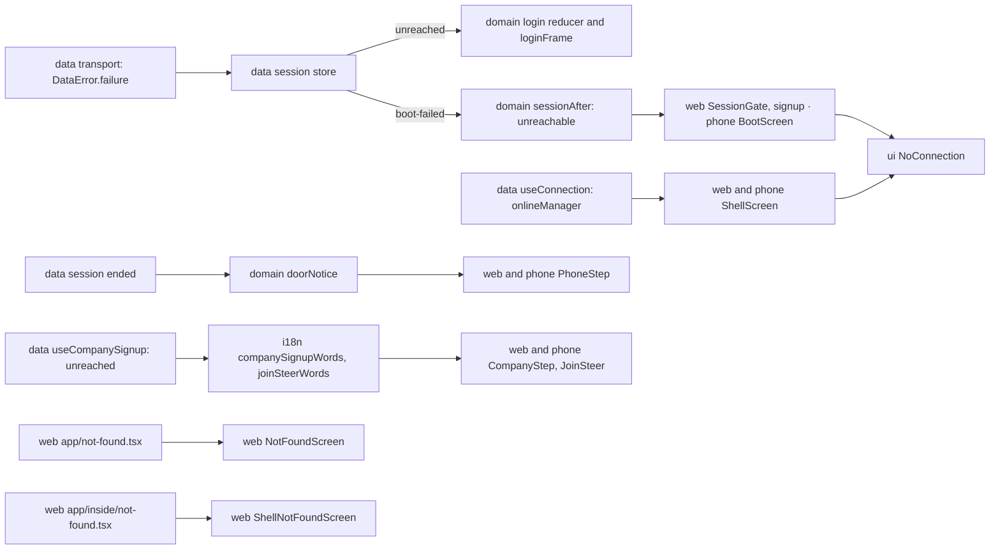

##### Package changes
- **domain:** `OtpRequestOutcome` and `OtpVerifyOutcome` gain `'unreached'`; `SessionSnapshot.unreachable`, set by `boot-failed` (no new event); `doorNotice(state, ended, door)` → `'not-reached' | 'access-removed' | null` (the removal on the front door only); `BlockTone` (`danger` · `warning` · `info`) moves here from `ui`. The orphan `failure` comment in `session.ts:112-116` goes.
- **data:** the store classifies `failure` (`cancelled` excluded) and gains `retryBoot(): Promise<boolean>`; `CompanyCreation` and `JoinRequesting` gain `'unreached'`; new `useConnection()` on `./react`.
- **i18n:** the not-reached block (`sign-in.ts`), the no-connection words (new `copy/connection.ts`), the signup not-reached and refusal words, the copy pass, the not-found words; catalogs regenerated.
- **ui:** `TintedBlock` gains `announce` (part c); `NoConnection`, `Explainer`, `DoorFrame` are used as they are.
- **web · mobile:** the gates, shells, door and signup screens render what the packages pick; web adds `app/not-found.tsx`.
- **Protections (Law 12):** no brand, token, table or error code. The new union members are held by typecheck: `FrameKind` by `FRAMES` and `FRAME` (full `Record`s), the request outcomes by `REQUEST_REFUSAL` (a full `Record`); the verify outcomes by review (an `if` chain); `WriteFailure` (part b) — its blocks by a full `Record` in `failureBlock`, `failureOf` and the heading by review. The not-found route joins `e2e-flow-per-screen` through its spec and baseline (part c).

##### Data and schema changes
None — no stored shape changes.

##### File and folder changes
| part | action | path | purpose | placement reason |
|---|---|---|---|---|
| a | modify | `packages/domain/src/auth/login-state.ts` | `'unreached'` on the request and verify outcomes | the outcomes' home |
| a | modify | `packages/domain/src/auth/login-reducer.ts` | carries `unreached` like `failed` | the reducer |
| a | modify | `packages/domain/src/auth/login-frame.ts` | `unreached` → the not-reached block under the step's own title | the frame picker |
| a | modify | `packages/domain/src/auth/session.ts` | `unreachable`; the two events; the orphan comment out | the snapshot's type |
| a | modify | `packages/domain/src/auth/session-transitions.ts` | `boot-failed` keeps `checking` and sets `unreachable` | `sessionAfter` |
| a | modify | `packages/domain/tests/auth/login-frame.test.ts` · `session-transitions.test.ts` | AC-1, AC-2 | domain's tests |
| a | modify | `packages/data/src/session/store.ts` | `failure` → `unreached`; a 401 at boot opens the door; `retryBoot()` asks the check again | the one store |
| a | — | `packages/data/src/react/use-session-phase.ts` | **planned, not built:** the gate and the boot screen read `unreachable` from `useSession()`, so the phase is unchanged | — |
| a | modify | `packages/data/src/session/types.ts` · `packages/data/src/react/use-session.ts` | built, not planned: `retryBoot()` on the store's contract and on `useSession()` | the store's one contract; the one auth surface |
| a | modify | `packages/data/src/react/use-sign-in.ts` | built, not planned: `notice` — the front door's block for a first send with no answer (`m-not-reached` is drawn on the front door, not the code step) | the one sign-in hook |
| a | modify | `packages/domain/src/auth/door-view.ts` · `index.ts` · `tests/auth/door-view.test.ts` | built, not planned here (was part c): `doorNotice` — `not-reached` now, `access-removed` in part c | the door's view |
| a | modify | `packages/domain/tests/auth/login-state.test.ts` | built, not planned: a first send with no answer stays on the number | the reducer's tests |
| a | add | `packages/i18n/tests/sign-in-frames.test.ts` | built, not planned (review): the no-answer and refusal words, and the number step's notice | i18n's `copy/` functions are unit-tested |
| a | add | `apps/web/features/auth/UnreachableScreen.tsx` · modify `CompanySignupScreen.tsx` | built, not planned (review): the one web retry screen, also on `/company-signup`, which sits outside the gates | the auth feature |
| a | modify | `packages/i18n/src/copy/sign-in-google.ts` | built, not planned (review): `GoogleBlockWords` → `DoorBlockWords`, the one block shape the notice also returns | the block's one type |
| a | add | `packages/domain/src/auth/login-frame-kind.ts` · modify `tests/auth/login-google.test.ts` | built, not planned (review): which frame the facts add up to, split from `login-frame.ts` when the full `REQUEST_REFUSAL` record took it past 300 lines | split by responsibility (`CLAUDE.md` §8) |
| a | modify | `docs/tasks/deferred.md` | built, not planned (review): D168, `NoConnection`'s English *Last tried at* | out of scope |
| a | modify | `apps/web/CLAUDE.md` · `apps/mobile/CLAUDE.md` | built, not planned: the pointer to the deleted D68 removed; the rule stays | Law 8 |
| a | modify | `apps/web/features/auth/components/PhoneStep.tsx` · `apps/mobile/src/screens/shared/PhoneStep.tsx` | built, not planned here (were part c): the block above the number | the phone step |
| a | modify | `packages/i18n/src/copy/sign-in.ts` · `sign-in-frames.ts` | the not-reached block | the door's words |
| a | add | `packages/i18n/src/copy/connection.ts` | the no-connection words | one file per surface |
| a | modify | `packages/i18n/src/index.ts` | export | the entry |
| a | modify | `packages/i18n/src/locales/{en,hi,mr}/messages.{po,ts}` | regenerated; hi/mr drafted (6 files, generated) | the catalogs |
| a | modify | `apps/web/features/auth/SessionGate.tsx` | `unreachable` → `NoConnection` | the gate |
| a | modify | `apps/mobile/src/screens/boot/BootScreen.tsx` | the same on the phone (`root.tsx` **planned, not built**: Boot already shows while `checking`) | the boot screen |
| a | modify | `tests/e2e/web/login.spec.ts` | the offline cases expect the not-reached block; a refused boot shows `NoConnection`, *Try again* signs in | the route's spec |
| a | modify | `apps/mobile/src/push/messaging.ts` | D78's source: React Native Firebase's namespaced `messaging()` warned on every start (`messaging.ts:105`, read in React Native DevTools); the modular calls replace it | the one push file |
| b | modify | `packages/data/src/react/use-company-signup.ts` | `failure` → `unreached` on create and join | the hook |
| b | add | `packages/data/src/react/use-connection.ts` · modify `react/index.ts` | online state from the online manager | every hook lives in `src/react/` |
| b | modify | `packages/i18n/src/copy/company-signup.ts` · `company-signup-frames.ts` | refusal and not-reached words | the signup's words |
| b | modify | `packages/i18n/tests/company-signup-frames.test.ts` | AC-4's words | its test |
| b | modify | `packages/i18n/src/locales/{en,hi,mr}/messages.{po,ts}` | regenerated (generated) | the catalogs |
| b | modify | `apps/web/features/auth/components/CompanyStep.tsx` · `JoinSteer.tsx` | the picked block | the screens |
| b | modify | `apps/mobile/src/screens/company-signup/components/CompanyStep.tsx` · `JoinSteer.tsx` | the same | the screens |
| b | modify | `apps/web/features/shell/ShellScreen.tsx` · `apps/mobile/src/screens/shell/ShellScreen.tsx` | `NoConnection` while offline | the shells |
| b | modify | `tests/e2e/web/company-signup.spec.ts` · `[door].spec.ts` | create and join with the api aborted; the shell offline on a door (moved from `home.spec.ts`, which would pass 300 lines — review) | the routes' specs |
| b | modify | `packages/data/src/errors/errors.ts` · `packages/data/src/session/store.ts` | built, not planned: `isUnanswered` written once beside `DataError` — the store's part-a copy moves there, the signup hook reads it too | zero duplication (`CLAUDE.md` §8) |
| b | modify | `packages/data/src/session/types.ts` | built, not planned: `createCompany`'s doc said *nothing is created on a rejection* — false after no answer | Law 8 |
| b | modify | `packages/domain/src/auth/signup-view.ts` · `index.ts` | built, not planned: `WriteFailure` (`failed` · `unreached`), the vocabulary the hook and the words both read | a vocabulary lives in domain (Law 11) |
| c | modify | `packages/domain/src/auth/door-view.ts` · `tests/auth/door-view.test.ts` | `doorNotice` gains `access-removed` (the function lands in part a) | the door's view |
| c | modify | `packages/i18n/src/copy/sign-in.ts` · `shell.ts` | the not-found words; *Sent by SMS to* as a line | the door's and the app's words |
| c | modify | `packages/i18n/src/locales/{en,hi,mr}/messages.{po,ts}` | regenerated (generated); three door words set to the board's renders (QA) | the catalogs |
| c | modify | `apps/web/features/auth/components/PhoneStep.tsx` · `apps/mobile/src/screens/shared/PhoneStep.tsx` | the access-removed block (`role="status"`); D142 Google per the board | the phone step |
| c | modify | `apps/web/features/auth/components/CodeTitle.tsx` · `CodeStep.tsx` · `apps/mobile/src/screens/shared/CodeTitle.tsx` · `CodeStep.tsx` | D142: the lead-in line, *Send a new code* | the code step |
| c | add | `apps/web/app/not-found.tsx` · `apps/web/features/auth/NotFoundScreen.tsx` · modify `features/auth/index.ts` | the route and its screen — in `auth`, not `shell` (built against planned): outside the shell it wears the front door's header and language control, which `auth` owns | the door's feature |
| c | modify | `packages/domain/src/auth/login-frame-parts.ts` · `index.ts` · `packages/i18n/src/copy/sign-in-google.ts` | built, not planned: `BlockTone` (`danger` · `warning` · `info`) moves from `packages/ui` to domain beside `FrameTone`, so `DoorBlockWords` can carry the access-removed block's `info` and `TintedBlock` reads the same type | a vocabulary lives in domain (Law 11) |
| c | modify | `packages/i18n/tests/sign-in-frames.test.ts` | built, not planned: the access-removed block's words in en/hi/mr | i18n's `copy/` functions are unit-tested |
| c | add | `tests/e2e/web/not-found.spec.ts` | AC-8 — signed out and inside the shell; **no baseline** (delta: `e2e-flow-per-screen` holds looks for `page` routes only, and `not-found` is not one, so a look would be held by nothing — no second commit) | the routes' specs |
| c | add | `apps/web/app/(inside)/not-found.tsx` | delta: the not-found frame inside the shell for a door the shell does not offer (ruling of finding 9) — heading and *Go to home*, no door header | Next's file convention, per group |
| c | add | `apps/web/features/shell/ShellNotFoundScreen.tsx` · `components/EmptyShellPage.tsx` · modify `PlaceholderScreen.tsx` · `index.ts` | built, not planned (review): the inside form is the shell's — it stands on the shell's page class — and its page markup is `PlaceholderScreen`'s, now written once | the shell feature; zero duplication |
| c | modify | `packages/ui/src/components/TintedBlock/TintedBlock.types.ts` · `TintedBlock.tsx` · `TintedBlock.native.tsx` | delta: `announce` — a block that appears after a press says itself on arrival (web `role="alert"`, an announcement on both phones: a live region that mounts holding its words is not reliably spoken, and `Text`'s `live` is a live region iOS never speaks); set on the door's own blocks (phone step, code step); D110 narrowed to the signup step's blocks (built against planned: their files are part b's and d's) | the one block (Law 7) |
| c | — | `packages/ui/src/components/PhoneField/PhoneField.types.ts` · `PhoneField.tsx` · `PhoneField.native.tsx` | **planned, not built:** `CodeTitle` draws the lead-in as a `body-sm` line and the number in `mono`, so `PhoneValue` keeps its required overline | — |
| c | modify | `packages/domain/src/auth/login-reducer.ts` · `tests/auth/login-state.test.ts` · `login-google.test.ts` | delta: *Continue with Google* stays live while the number step's code is sending (D142, the board's `m-loading`): a Google press then takes the round trip, and the send's late answer is dropped, also once Google has ended; the screens no longer disable it themselves. A send again clears the last no-answer block while it runs, so the next one is spoken afresh (review) | the reducer |
| c | modify | `packages/data/src/react/use-sign-in.ts` | `doorNotice` reads the session's `ended` and the door | the one sign-in hook |
| d | modify | `packages/i18n/src/copy/company-signup.ts` | the copy pass; the three Explainers' pages; the two helpers (D142) | the signup's words |
| d | modify | `packages/i18n/src/locales/{en,hi,mr}/messages.{po,ts}` | regenerated; hi/mr from the board's renders where drawn (generated) | the catalogs |
| d | modify | `apps/web/features/auth/CompanySignupScreen.tsx` · `components/KnownNumber.tsx` · `components/PhoneStep.tsx` · `components/CodeStep.tsx` | the words; the Explainers; the number helper and the code hint (D142) | the screens |
| d | modify | `apps/mobile/src/screens/company-signup/CompanySignupScreen.tsx` · `components/KnownNumber.tsx` · `apps/mobile/src/screens/shared/PhoneStep.tsx` · `CodeStep.tsx` | the same | the screens |
| d | modify | `tests/e2e/web/company-signup.spec.ts` · its landing baselines (generated, CI-drawn, commit 2) | the new words | the route's spec |
| c | modify | `docs/ux/briefs/SCR-M01-01-sign-in.md` | the State list gains access-removed, not-reached, not-found (owner-ruled) | start-here Edit 2 |
| d | modify | `packages/i18n/src/copy/explainer.ts` · `index.ts` | built, not planned (size ruling): `ExplainerWords`, the one ask shape every door's words return | beside the pager words it is spread with |
| d | modify | `packages/i18n/src/copy/sign-in-frames.ts` · `sign-in-google.ts` | built, not planned (size ruling): the code frames' and the link step's asks take `ExplainerWords`; `SignInLabels.explainer`, the door's ask where the frame has no rule of its own | the door's words |
| d | modify | `packages/i18n/tests/sign-in-frames.test.ts` · `sign-in-google.test.ts` | built, not planned (size ruling): the door's ask stands, a limit frame keeps its own (planted red); the cap's ask in the one shape | i18n's `copy/` functions are unit-tested |
| d | modify | `apps/web/features/auth/components/CodeTitle.tsx` · `GoogleLinkStep.tsx` · `apps/mobile/src/screens/shared/CodeTitle.tsx` · `apps/mobile/src/screens/login/components/GoogleLinkStep.tsx` | built, not planned (size ruling): spread the one ask shape onto `Explainer` | the screens that draw it |
| d | modify | `apps/mobile/src/screens/shared/door-styles.ts` · `apps/web/features/auth/sign-in.css` | built, not planned: the door's `caption` lost its last user (the signup note) and went; `titleText` lets a door title wrap so its Explainer stays on screen (QA: *That number already has an account* pushed it off at 375, review); both title-row comments name every door title | the door's shared styles |
| d | modify | `packages/i18n/src/copy/company-signup-frames.ts` · `tests/company-signup-frames.test.ts` · both `CompanyStep.tsx` · both `CompanyFields.tsx` | built, not planned (owner ruling in QA): `fieldRefused` joins the frame's facts; `CompanyFieldHelpers` and `cityHelper` — the step's helpers and intro only as it opens, the city's line while City is empty (the field calls it with its own value, so the phone's step never re-renders per keystroke) | the signup's words; the screens that draw them |
| d | modify | `docs/ux/briefs/SCR-M01-02-company-signup.md` | the State list gains not-reached, request-not-reached; lines 21 and 49 follow the record | start-here Edit 2 |
| all | modify | `docs/tasks/M01-onboarding.md` · `docs/tasks/deferred.md` | this RFC and the part rows; the rows that ship | Law 8 |

##### API and contract changes
None — no wire boundary changes. The api already answers every case; only how the apps read its failures changes.

##### Risks and rollout
- **A failure misread as "no answer":** a refusal shown as *could not be reached* invites a pointless retry. Mitigation: only `failure !== null` reads as unreached; `ApiError` with an envelope keeps its code — proven by the frame tests on both kinds.
- **A boot that never ends:** `unreachable` holds the person on `NoConnection` until a retry answers; *Try again* reports a failed or slow retry (`NoConnection`'s own lifecycle), so nothing spins forever.
- **Old app versions:** nothing stored or sent changes; an old app keeps its old words.
- **Screenshot baselines:** parts c and d change web looks; each lands its CI-drawn baselines in a second commit the owner approves (`tests/e2e/CLAUDE.md`).
- **Offline unmounts the inside page (part b):** both shells replace the page with `NoConnection`, so a form typed inside the shell would lose its values on a short drop. Today the inside routes are the home and placeholder doors, so nothing is lost; the first inside form keeps its values across the screen (D169).
- **Hindi and Marathi drafted, not from the board (part b):** *Nothing was created, so trying again is safe.* (`m-error` has no language render) and *Your request may already be with the owner.* (`m-request-not-reached` has none) — owed a native review.
- **Words set to the board's language renders (part c QA):** hi *Create a company account* → *कंपनी का खाता बनाएँ*; mr → *कंपनीचे खाते तयार करा*; mr *Continue with Google* → *Google ने पुढे चला*, and its spoken name with it — the door's earlier drafts differed from `m-google-failed-hi`/`-mr`, `m-access-removed-hi`/`-mr` and `m-not-reached-hi`/`-mr`.
- **Hindi and Marathi drafted, not from the board (part d):** the copy pass — Frame 1's body, step 3's body, the first-owner helper, the writing line, the known number's body and block body, the resumed line, the three Explainers' labels, titles and pages, and the two helpers (*We'll send a code by SMS.*, *You can paste the whole code.*): no board renders them in Hindi or Marathi — owed a native review.
- **Hindi and Marathi drafted, not from the board (part c):** *This page does not exist*, *Go to sign in*, *Go to home* (`m-not-found` has no language render) — owed a native review.
- **A spoken block is not heard on a device yet (part c):** the simulators drive no screen reader, so `announce` is proven by its markup (web `role="alert"`) and its code; the owner hears it once with VoiceOver, TalkBack and a web screen reader.

##### Acceptance criteria and proof
- **AC-1** — A request that got no answer reads as *could not be reached*, never *something on our side failed*; a server refusal keeps its own words. → proof: unit test of `loginFrame`; QA web and phone with the network off.
- **AC-2** — A boot that fails for anything but a lost session keeps the person signed in and offers a retry over the loading frame. → proof: unit test of the session store; QA with the api stopped during boot.
- **AC-3** — A person whose access was removed sees the board's access-removed frame on the door, cleared by the next sign-in. → proof: QA web and phone; side-by-side with the board.
- **AC-4** — After a create that got no answer, the company step says the company may have been made and trying again is safe; a server refusal keeps *nothing was created*. → proof: unit test of the words; QA with the api stopped mid-create; side-by-side with the redrawn `SCR-M01-02` frame.
- **AC-5** — With no connection the web shows the shared no-connection screen instead of loading forever. → proof: a Playwright case that drops the network.
- **AC-6** — Both apps render an API failure through one `ApiErrorText` in `packages/ui` (one `.types.ts`, words from `packages/i18n`). → proof: typecheck; QA web and phone.
- **AC-7** — The phone dev build's debugger warning is read and its source fixed, or recorded with why it stays. → proof: QA on a cold start.
- **AC-8** — A path no route serves shows a drawn not-found frame in the reader's language, with a way home (D87). → proof: e2e web; side-by-side with the board.
- **AC-9** — `SCR-M01-02`'s frames meet the words law after the board's copy pass, and the app's words follow (D133). → proof: the design check's word inventory; side-by-side.
- **AC-10** — `m-google-failed` is drawn and measured in Hindi and Marathi (D139), and four small web-door differences are ruled and built — the board wins unless a law says otherwise (D142). → proof: side-by-side, web and phone.

| AC/row | owner | tier | surface | action → expected | proof |
|---|---|---|---|---|---|
| AC-1 frame | main-dev | required | unit | `request`/`verify` `unreached` → the `*-unreached` frames; planted red: `request: 'unreached'` mapped to `request-failed` | `login-frame.test.ts` |
| AC-1 words | main-dev | required | unit | each `*-unreached` frame's block is *HelioGrid could not be reached, from your side or ours.*, each refusal's *Something on our side failed*; the number step's notice in en/hi/mr; planted red: `auth-unreached` → `OUR_SIDE` | `packages/i18n/tests/sign-in-frames.test.ts` |
| AC-1 web | qa-web | required | `/login` | network off → Send code → *We could not send the code* + *HelioGrid could not be reached, from your side or ours.*; side-by-side `m-not-reached` 375, 1536 per decision 17 | QA + `login.spec.ts` |
| AC-1 iOS · Android | qa-ios · qa-android | required | door | airplane mode → Send code → the same block; side-by-side `m-not-reached` | QA |
| AC-2 rule | main-dev | required | unit | `boot-failed` from `checking` keeps `checking` + `unreachable`; again changes nothing; `boot-signed-out` and a loss still open the door; planted red: `boot-failed` → `SIGNED_OUT` | `session-transitions.test.ts` |
| AC-2 web | qa-web | required | `/home` signed in | api stopped, reload → `NoConnection`; *Try again* while still stopped → *Still no answer from HelioGrid.*; api started, *Try again* → home, still signed in | QA + `login.spec.ts` (refused boot, axe, a retry with no answer) |
| AC-2 iOS · Android | qa-ios · qa-android | required | cold start | api stopped → `NoConnection`; api back, *Try again* → home | QA |
| AC-3 rule | main-dev | required | unit | `ended` set at the front door → `access-removed`, kept after *Change number*; on the code step, on the signup door, or under a Google failure → null; planted red: `ended !== null` → `false` | `door-view.test.ts` |
| AC-3 web · iOS · Android | qa-web · qa-ios · qa-android | required | door | a member removed while signed out, then a cold start → the block; sign in again → gone; side-by-side `m-access-removed` | QA |
| AC-4 words | main-dev | required | unit | `unreached` → *We could not confirm the company* / *Your company may have been made — trying again cannot make a second.*; refusal → *Nothing was created, so trying again is safe.*; the join's two | `company-signup-frames.test.ts` |
| AC-4 web · iOS · Android | qa-web · qa-ios · qa-android | required | step 3 | api stopped, *Create company* → `m-not-reached`; *Request to join* → `m-request-not-reached`; side-by-side both, and `m-not-reached` in Hindi and Marathi | QA + `company-signup.spec.ts` |
| AC-4 refusal frames | main-dev | required | unit | `m-error` and `m-request-failed` need a server refusal the app cannot make through its own data — their words are proven in `company-signup-frames.test.ts` and their layout is the drawn frames' already built | `company-signup-frames.test.ts` |
| AC-4 api | qa-api | required | `POST /tenants` | the same retry key twice after a lost answer → one company, `201` both times | QA |
| AC-5 web | ci | required | `e2e-web` | `/leads` inside the shell → `setOffline(true)` → `NoConnection`; back online → the door | `[door].spec.ts` |
| AC-5 phone twin | qa-android | required | shell | Wi-Fi and data off → `NoConnection`; on → the home (the iOS simulator follows the Mac's network and has no airplane mode — not reachable there) | QA |
| AC-6 | — | not_applicable | — | struck by the owner's ruling (finding 2): no screen renders a raw API failure | — |
| AC-7 | qa-ios | required | cold start | the debugger warning read; fixed or recorded | QA + Metro log |
| AC-8 | ci | required | `e2e-web` | `/no/such-page` signed out → *This page does not exist*, *Go to sign in*; `/no-such-door` signed in → inside the shell, *Go to home*. A one-part address signed out matches the shell's `[door]` route, whose gate sends it to sign in first | `not-found.spec.ts` |
| AC-8 look | qa-web | required | `/no-such-page` | side-by-side `m-not-found` (375), `d-not-found` (1536), in Hindi | QA |
| AC-9 | qa-web · qa-ios · qa-android | required | signup | side-by-side every `SCR-M01-02` frame the app reaches, 375 and 1536, the Hindi and Marathi renders. Owner rulings during QA (2026-10-10): the step's helpers and intro belong to the step as it opens — a resumed frame, a field refusing the press and a failed write carry none, the city's line stands only while City is empty, and a step back from the join steer is the step as it opens again, as the record's Frame 4 (the board's frames; `companySignupWords` and `cityHelper`, unit-tested in `company-signup-frames.test.ts`); the phones' `m-loading` is proven by the web's capture with the create held and the shared `companySignupWords` and `CompanyFacts` the phones draw on the same `writing` fact, since a write there lands before any read | QA |
| AC-10 | qa-web · qa-ios · qa-android | required | door | side-by-side `m-google-failed-hi`/`-mr`; the four D142 items as ruled. The web reaches `m-google-failed` through Google's return with an error (`/login/google#error=server_error`); the phones' native sheet cannot be made to fail in QA, so there the frame is the same `PhoneStep` and `phoneGoogleWords` the web draws, its words in `sign-in-google.test.ts` | QA |
| gate | evaluator | required | all | `pnpm check:all` green, invariants on `heliogrid_test` | gate |

**Planted reds seen (part a):** `refusalFrameOf` mapping `request: 'unreached'` to `request-failed` failed `login-frame.test.ts` › *an SMS request that got no answer*, *a call request that got no answer*, *request-unreached / call-request-unreached keeps its refusal twin's code field and controls*; `boot-failed` → `SIGNED_OUT` failed `session-transitions.test.ts` › *holds a boot check that got no answer, or a server failure, signed in and unreachable*; `auth-unreached` → `OUR_SIDE` failed `sign-in-frames.test.ts` › *auth-unreached carries its own block*. Each restored from a scratchpad copy and green again.

**Planted reds seen (part c):** `doorNotice` with `ended !== null` → `false` failed `door-view.test.ts` › *a removal the boot check found, at the door as it opens* and *a removal, back on the number after Change number*; the door check dropped failed › *the signup door draws no removal*; the Google-failed check dropped failed › *a removal under a Google sign-in that did not finish*; `requestEnded`'s guard back to `pending !== null && kind !== 'request'` failed `login-google.test.ts` › *a send Google took over stays dropped once the sheet is cancelled* / *failed*; the takeover without `step === 'phone'` failed › *Google pressed while a resend on the code step is ignored*. Each restored from a scratchpad copy.

**Planted reds seen (part d):** `signInWords` choosing `labels.explainer ?? explainerWords(frame.explainer, t)` (the door's ask over the frame's own rule) failed `sign-in-frames.test.ts` › *signInWords — the door’s ask beside the title* › *a capped frame keeps its own rule*; restored from a scratchpad copy. `asItOpens` without the field-refusal fact failed `company-signup-frames.test.ts` › *the step with a field refusing the press: its helpers and intro*, without `!frame.restored` failed › *the step resumed: its helpers and intro*, and `cityHelper` ignoring the typed value failed › *the city line under a typed City*; each restored from a scratchpad copy.
| CI | ci | required | `quality`, `e2e-web` | green on the head SHA | CI |

##### Delivery size
- **Split into four parts** — one PR each, web and phone together in every part.
- **a** · door and boot · planned ~20 files (6 generated) · code ~260, tests ~170. **Built (delta, 2026-10-09):** 31 files (6 generated, 1 doc) · code 181, tests 123 authored lines — 9 built but not planned, 2 planned but not built (the file table names each); lines under the estimate. **Built after review (second delta):** 39 files (6 generated, 2 docs) · code 356, tests 182 authored lines, of which about 120 are `login-frame.ts`'s frame-kind decision moved whole into `login-frame-kind.ts` — the review's retry, 401, signup-route, words-test and file-size fixes and D78's push file.
- **b** · signup failures and the offline shell · planned ~22 files (6 generated) · code ~230, tests ~150. **Built (delta, 2026-10-09):** 27 files (6 generated, 2 docs) · code 270, tests 130 authored lines — 5 built but not planned (the file table names each).
- **c** · access removed, not-found, the door's D142 items · planned ~22 files (6 generated, 2 baselines) · code ~250, tests ~120. **Delta before build (2026-10-09):** ~31 files (6 generated, 3 docs, no baselines) · code ~300, tests ~140 — `packages/ui` joins (`TintedBlock.announce`, `PhoneValue.label` optional), a second not-found file inside the shell, the reducer's Google-while-sending, D110 joins. **Built:** 34 files (6 generated, 3 docs) · code 207, tests 90 authored lines — `PhoneValue` not built; `BlockTone` moved to domain; the not-found screen in `auth`; D110 narrowed, not deleted.
- **d** · the signup copy pass · ~16 files (6 generated, 2 baselines) · code ~180, tests ~40. **Delta before build (2026-10-10):** ~22 files (6 generated, 2 baselines, 2 docs) · code ~150, tests ~30. The board's word plan (`SCR-M01-02` record, *Word plan*) moves three long lines off the frames into one `Explainer` each, at the heading — *What signup asks for* (Frame 1; its two pages replace `intro` and `nothingElse`), *What the code does* (the code step; replaces the `codeMakesTheAccount` note), *One number, one account* (duplicate-phone) — and shortens eight lines: Frame 1's body *Verify your number, then add three company details.*, step 3's *Three details, and you're in.*, *You become the first EPC owner.*, `m-loading`'s *Writing these three details now.*, the known number's body and block body, and the resumed line *No company was made yet — carry on from here.*; D142's two helpers land on the fields (*We'll send a code by SMS.*, *You can paste the whole code.*). The shared `PhoneStep` and `CodeStep` (both apps) gain an optional field helper and a heading `Explainer` that only the signup door passes, so the front door is unchanged. Hindi and Marathi: the four frames the board drew in both (`m-request-to-join`, `m-request-failed`, `m-request-sent`, `m-not-reached`) are read off the board and the catalogs follow them; the copy-pass lines have no language render, so they are drafted and flagged for a native review. `company-signup.spec.ts` follows the new words; its landing baselines are drawn by CI in a second commit. The brief's States list gains *not-reached* and *request-not-reached*, and lines 21 and 49 follow the record. **Size ruling during build (2026-10-10):** 33 files (6 generated, 2 baselines, 3 docs, 22 code and test); **with the helpers ruling: 39 files, 28 code and test** — inside the ruling's 20%; **built: 268 code and 61 test lines added (171 removed)**, above the ~160 / ~22 estimate by the helpers ruling and the review's fixes — put to the owner on the commit card · code ~160, tests ~22 — the file count passed the delta by 45%. The code step's ask is passed as the door's words (`SignInLabels.explainer`, a limit frame keeps its own rule — one decision in i18n, not one per screen), and the door's two ask shapes (`{ page }` on the code frames, `{ pages }` on the Google link step) became one, `ExplainerWords` in `copy/explainer.ts`, so the signup's two-page ask fits: `sign-in-frames.ts`, `sign-in-google.ts`, `explainer.ts`, `index.ts`, both `CodeTitle` and both `GoogleLinkStep` files, `sign-in-google.test.ts`, and the door's ask rule tested in `sign-in-frames.test.ts`; the phone's door `caption` style lost its last user and went, and a door title now wraps beside its Explainer (`door-styles.ts`, the comment in `sign-in.css`).
- Order: a → b → c → d; each part's tests first.

#### Parts
| part | delivers | AC | depends on | status |
|---|---|---|---|---|
| a | a door request with no answer and a boot during an outage: the not-reached block, `NoConnection` with *Try again* on both apps; D78 read | AC-1, AC-2, AC-7 | — | shipped |
| b | the company step's and the join's no-answer frames; the offline shell on both apps | AC-4, AC-5 | a | shipped |
| c | the door's access-removed block, the web's not-found frame, `m-google-failed` in Hindi and Marathi, the door's D142 items | AC-3, AC-8, AC-10 | a | shipped |
| d | `SCR-M01-02`'s copy pass and its D142 helpers | AC-9 | b | shipped |

#### Runtime
| resource | state | identity |
|---|---|---|
| branch | `feat/T-M01-039` created from `origin/main` `a3b2963b` | — |
| web `3002` · api `8084` · Metro `8081` | none listening | — |
| Postgres · object store · Temporal | `pre_existing`, running | `heliogrid-pg-local`, `heliogrid-object-store-local`, `heliogrid-temporal` (+ `-admin`, `-jwks`) |
| simulators · emulators | none booted | — |
| browser tabs | `pre_existing` | `seed` (the Claude Design board) |
| database routing | `heliogrid_test` / `heliogrid_test` | `.env.local` `DATABASE_URL`, `DATABASE_ADMIN_URL` |
| logs | `.qa/api.log` 7,541,062 · `.qa/web.log` 283,394 · `.qa/metro.log` 904,808 bytes | byte marks |

**Part a · QA and gate (2026-10-09)** — one stack on `heliogrid_test`: the api, web and Metro started by the task (`preview_start`), the iPhone 17 Pro simulator (`40ED0117-…`, app installed that morning, no native change, no rebuild) and the `Pixel_8_Emulator` (`emulator-5554`, `-memory 4096`) booted by the task; standing accounts …901 web, …902 iOS, …903 Android. Four phases, the api stopped and started by Main between them: A signed in; B api stopped → `NoConnection`, *Try again* while still stopped → *Still no answer*; C api up → *Try again* → home, still signed in; D signed out, api stopped → *Send code* → the not-reached block in English, Hindi and Marathi. A first B run found the review's retry fault; B–D ran again after the fixes. Board picture `board/m-not-reached.png` (100% zoom); its Hindi and Marathi words were read from the board file, their layout from the record. Side-by-side `side/m-not-reached.png`: board, web 375, iOS, Android — the same block, words and order; Android's column sits lower on the taller screen by the board's own centring rule. A web 500 seen once was the dev server reading a package mid-rebuild (`.qa/web.log`: *Unexpected end of JSON input*), not the product. `pnpm check:all` once: pass (3,518 unit tests; invariants on `heliogrid_test`, none vacuous); nothing regenerated.

**Measurements (part a)** — helper runs: Explore 1, `design-check` 1 (one continuation), `qa-web` 1 (five continuations), `qa-ios` 1 (five), `qa-android` 1 (five), `reviewer` 1 (one continuation), `evaluator` 1; one full gate. Main's own turns and tokens are not counted. Size: planned ~20 files, code ~260, tests ~170; built 41 files (6 generated, 4 docs), code 356, tests 182 authored lines — the two deltas the owner approved.

| resource | initial | at part a's card |
|---|---|---|
| web `3002` · api `8084` | none | stopped (`started_by_task`) |
| Metro `8081` | none | running (`started_by_task`, preview server `847ff624…`) — kept for part b |
| simulator · emulator | none booted | booted (`started_by_task`) — kept for part b |
| browser tabs | `seed` | `seed`, `tab-1` (`started_by_task`) |
| database routing | `heliogrid_test` / `heliogrid_test` | unchanged |
| logs | `.qa/api.log` 7,541,062 · `.qa/web.log` 283,394 · `.qa/metro.log` 904,808 bytes | kept |

**Part b · QA and gate (2026-10-09)** — the same stack, branch `feat/T-M01-039b` stacked on part a (PR #264). Five phases, the api stopped and started by Main: P1 a fresh number to step 3; P2 api stopped → *Create company* → `m-not-reached` (English, Hindi, Marathi); P3 api up → *Try again* makes the company, a second fresh number is steered to the same company (Android also: Wi-Fi and data off → `NoConnection`, *Try again* offline → *Still no answer*, on → home by itself); P4 api stopped → *Request to join* → `m-request-not-reached`; P5 api up → *Send the request again* → request sent. qa-web first failed the 375 frame (the pinned finding over City at rest) and withdrew it after measuring City reachable by scroll and by Tab — the board's decision-9 rule; qa-ios's first P4 was blocked by a Metro dev reload Main caused by editing packages mid-phase, then redone. qa-api: the same retry key twice → `201` with one company; a different body → `422 IDEMPOTENCY_KEY_REUSED`. Board pictures `board/m-signup-not-reached.png`, `board/m-request-not-reached.png` (100% zoom); side-by-sides `side/m-signup-not-reached.png`, `side/m-request-not-reached.png` (board, iOS, Android; web by measurement). `pnpm check:all` once: pass (3,521 unit tests); nothing regenerated.

**Measurements (part b)** — helper runs: `qa-web` 1 (six continuations), `qa-ios` 1 (seven), `qa-android` 1 (five), `qa-api` 1, `reviewer` 1 (two continuations), `evaluator` 1; one full gate. Main's own turns and tokens are not counted. Size: planned ~22 files, code ~230, tests ~150; built 27 files (6 generated, 2 docs), code 270, tests 130 authored lines — the delta the owner approved.

**Part c · QA and gate (2026-10-09/10)** — the same stack, branch `feat/T-M01-039c` (part b merged as #265 meanwhile; part c sits on `main`). `qa-api` invited three fresh numbers into the `…904` company (+91 98765 07501 web, 07502 iOS, 07503 Android), each accepted. Phase A signed each in: the code step's lead-in *Sent by SMS to* and the number in mono bold on all three; *Continue with Google* never disabled while *Sending the code* on the web (a MutationObserver, two runs; the phones' send ended before a dump — the reducer's planted reds stand there); not-found signed out at 375 and 1536 (exact to `d-not-found` at a 976 viewport) and in Hindi, inside the shell and signed in. Both phones first opened on an old signup draft with no way out (D146): Main reset the simulator keychain and cleared the emulator app's data. Review: ten findings, all fixed, then one (the access-removed block spoken as an alert, against decision 16) → `BlockAnnouncement`, then CLEAN. Phase B: `qa-api` deactivated the three memberships; a cold start (a reload on the web) opened the door with the info block, `role="status"`, in English, Hindi and Marathi, kept across the switch, gone after a new sign-in (…901/…902/…903). The first full gate failed one row: `m-google-failed-hi`/`-mr` had no side-by-side — the web reaches it through Google's error return, so it was driven and measured, and the same pass found three door words differing from the board's renders (fixed; review CLEAN; rerun on all three). The second full gate passed (3,538 unit tests, invariants green on `heliogrid_test`). Found and deferred: D170 (a code-step resend unanswered twice is spoken once), D171 (the web's signed-out language lost on a full load), D172 (the Devanagari heading box puts hi/mr 7 px lower), D173 (iOS exposes the secondary Google button as an image — predates this part).

**Measurements (part c)** — helper runs: `qa-web` 1 (five continuations), `qa-ios` 1 (three), `qa-android` 1 (three), `qa-api` 1 (three), `reviewer` 1 (three continuations), `evaluator` 1 (one); two full gates. Main's own turns and tokens are not counted. Size: planned ~31 files, code ~300, tests ~140 (the delta); built 39 files (6 generated, 3 docs), code 230, tests 149 authored lines.

| resource | initial | at part c's card |
|---|---|---|
| web `3002` · worker | none | stopped (`started_by_task`) |
| api `8084` · Metro `8081` | none | running (`started_by_task`) — kept for part d |
| simulator · emulator | none booted | booted (`started_by_task`) — kept for part d; the simulator's keychain reset and the emulator app's data cleared (D146) |
| browser tabs | `seed` | `seed`, `tab-1`, `tab-2` (`started_by_task`) |
| database routing | `heliogrid_test` / `heliogrid_test` | unchanged |

**Part d · QA and gate (2026-10-10)** — the same stack, branch `feat/T-M01-039d` on part c (`cf531725`). The board's words were read from the board file by a helper (`DesignSync`), every frame's strings into the scratchpad; the four frames the board drew in Hindi and Marathi equal the catalogs (compared by script), the 19 copy-pass strings are drafted (Risks). Rows D1–D7 on web (375 and 1536), iOS and Android with fresh numbers: step 1's ask and helper, the code step's ask and helper, step 3's lines, the resumed line, the duplicate-number frame and its ask, Hindi and Marathi on step 1, the front door unchanged. Found and fixed in QA and review: on both phones the English *That number already has an account* pushed its Explainer off the screen (`titleText`); the code step's ask moved into `signInWords` (`SignInLabels.explainer`); one `ExplainerWords` shape. The first full gate passed and the evaluator failed AC-9's proof (three board pictures, summaries without the helpers' own reports, no phone `m-loading`): eleven more board frames were captured and set beside the app, the helpers' own reports supplied, and the owner ruled the phones' `m-loading` proven by the web's held capture with the shared code (a write there lands before any read; pausing the api was not permitted). The same pictures showed the board draws step 3's helpers and intro only on the step as it opens — the owner ruled it built (`CompanyFieldHelpers`, `cityHelper`, `fieldRefused`); rows H1–H7 passed on web and iOS, and on Android all but the blur row, which D132's keyboard layout blocks. Both phones first ran those rows on a stale bundle (Fast Refresh disconnected) and were cold-started. The second full gate passed (3,548 unit tests, invariants green on `heliogrid_test`). The local web suite ran whole: 76 of 78, the two failures the dev server's own tools button over the account button. Found and deferred: D174 (the shared web `Input` marks no refused field); D173 extended. Still to come in this part's PR: the landing baselines CI draws, in a second commit.

**Measurements (part d)** — helper runs: `qa-web` 1 (three continuations), `qa-ios` 1 (seven), `qa-android` 1 (seven), `reviewer` 1 (six continuations), `evaluator` 1 (one), one `general-purpose` (the board's words), one `ci-investigator` (part c's `e2e-web`); two full gates. Main's own turns and tokens are not counted. Size: planned ~16 files, then ~22, then 33 and 39 by the two rulings; built 37 files (6 generated, 3 docs) plus 2 baselines to come, 268 code and 61 test lines added.

| resource | initial | at part d's card |
|---|---|---|
| web `3002` · worker | none | stopped (`started_by_task`) |
| api `8084` · Metro `8081` | none | running (`started_by_task`) — stopped at teardown, after the push |
| simulator · emulator | none booted | booted (`started_by_task`) — shut down at teardown |
| browser tabs | `seed` | `seed`, `tab-1`, `tab-2`, `tab-11` (`started_by_task`) — closed at teardown |
| database routing | `heliogrid_test` / `heliogrid_test` | unchanged |

### T-M01-040 · Signing in returns the person to where they were going
**Type:** screen · **Tier:** P1 (`M01-61`)
**Status:** shipped
**Why:** A deep link opened while signed out lands on home after sign-in (D20); the owner ruled the person returns to the link.
**PRD rows:** `M01-61` (P1).
**DESIGN:** none — no new frame; the door is `SCR-M01-01` as drawn.
**Chosen by the owner** (deferred review, 2026-10-08).
**Depends on:** `T-M01-039`.
**DONE WHEN:**
- `M01-61` → proof: e2e web (a signed-out deep link returns to it after sign-in; a route the roles cannot open shows the not-found frame); QA phone with a deep link.

#### Design check
Not applicable — `DESIGN: none`. The door is `SCR-M01-01` as drawn and gains no frame. The one state new to the phone, a door the person's shell does not offer, takes the form the owner ruled for the web inside the shell (`T-M01-039` finding 9: the heading and *Go to home*), in the words that frame already has (`SHELL.notFound`, `SHELL.goToHome`).

#### RFC

##### Title
T-M01-040 — signing in returns the person to the link they opened, on the web and the phone.

##### Description
- **User impact:** a salesperson taps a link to *Leads* in a message, is asked to sign in, and lands on *Leads* — not on the home, where they would have to find the page again. Directly: one tap fewer after every sign-in that began with a link. Indirectly: every later link the product sends — a notification, a shared lead — opens what it names.
- **Who gains:** anyone who opens a HelioGrid link while signed out; every later module that sends a link.
- **Problem solved:** the web's gate sends a signed-out visitor to `/login` and forgets the address (`apps/web/features/auth/SessionGate.tsx:46-48`), and the door then sends everyone to `ROUTE_OF.home`. The phone claims the `heliogrid://` scheme (`AndroidManifest.xml:34-39`, `Info.plist`) but no route declares a path (`apps/mobile/src/navigation/routes/app.ts:18-31`), so a link opens the app and nothing else. Row: `M01-61` (P1); deferred `D20`.

##### Goals
- Web: a signed-out visitor who opens an inside address lands on that address after signing in — by code or by Google.
- Phone: `heliogrid://<door>` opened while signed out opens that door after sign-in, with the home under it; opened while signed in, it opens the door at once.
- A door the person's shell does not offer never opens by address on either platform.
- A person who signs out and signs in again lands on the home, as today.

##### Non-goals
- A session that ends while the person is inside (expiry, removal): the next sign-in opens the home, as today.
- Links to a record (`leads/:leadId`): each module declares its own path when its screen lands (`apps/mobile/src/navigation/linking.ts:4-11`).
- A phone link no route declares (`heliogrid://no-such-page`): the app opens where it is; the phone has no not-found route of its own.
- `https://` links that open the phone app (universal and app links): they need a hosted domain file, which is the hosting task's.
- A notification tap: it carries a payload, not a URL (`linking.ts:13-16`).

##### Readiness and dependencies
- `T-M01-039`: parts a–c are on `main` (#264, #265, #266); part d is draft PR #267 with CI running. **By the owner's word (2026-10-10) this branch is cut from `feat/T-M01-039d`, not from `origin/main`,** and does not wait for #267. This task's PR opens on `main` after #267 merges; until then the branch takes each new commit of part d by merge.
- Design check: not applicable (above).
- Assumptions, each proven on the running app before its code is kept: React Navigation `7.3.14` restores a link it could not open once the routes exist (`UNSTABLE_routeNamesChangeBehavior: 'lastUnhandled'`, present in the installed `@react-navigation/core` `types.tsx:262`); on iOS a link to a running app reaches JavaScript only through an app-delegate hand-over, which `AppDelegate.swift` lacks (it holds `didFinishLaunchingWithOptions` alone, line 14). If the running app shows the link already arrives, `AppDelegate.swift` is not changed.
- No blocker.

##### Proposal
**Flow — web.** The inside gate turns away a visitor it never let in: before it sends them to the door it keeps the address (path and query) in the tab's storage. The door's gate, when the sign-in beat ends on `home`, reads the kept address and goes there instead of `/home`. A new company's first entry (`CompanySignupScreen.tsx:42`) reads it the same way. The inside gate forgets it once a person is inside, and from then on this page load keeps no address. The address then renders as any address does: an offered door opens, any other shows the not-found frame inside the shell.

**Flow — phone.** Each door route declares its path. The root navigator restores the last link it could not open once the signed-in routes mount, so the same link opens after sign-in with no code of ours holding it. `PlaceholderScreen` shows the not-found form for a door the shell does not offer.

**Built against plan (delta, 2026-10-10)** — three things the running app showed:
- **The restored link is the stack's only route.** On Android, Back from it left the app. `root.tsx` puts the home under a screen that opened alone (`homeUnderALoneScreen`), for a restored link and a cold start alike, so the planned `linking.ts` change is not needed.
- **A dev build reported the kept link as an error.** React Navigation says "The action 'NAVIGATE' … was not handled" for every unhandled action, and the kept link is one until sign-in. `reportUnhandledAction` says nothing for a link kept for sign-in and keeps the error for any other action; a release build never said anything.
- **The web's read and its removal are two steps.** A read that also removed the address ran twice under React's strict mode and sent the second pass to the home. The door reads; the inside gate forgets once a person is inside — which also clears the address after any other way in.

**Findings from testing the requirement:**
1. **`M01-61`'s last clause disagrees with a later owner ruling.** The row (2026-10-08) says a route the roles cannot open *lands on their home with its reason*. On 2026-10-09 the owner ruled that a signed-in person on a door their shell does not offer sees the not-found frame inside the shell with *Go to home* (`T-M01-039` finding 9, line 700 of this file), and it is built and proven (`apps/web/features/shell/PlaceholderScreen.tsx:18-19`, `tests/e2e/web/[door].spec.ts:102-111`). "Home with its reason" needs a message no board draws and new words in three languages; the not-found frame needs nothing new and does not say which addresses exist for other roles. Recommend: keep the built frame, give the phone the same form, and correct the row's clause first (decision 1).
2. **`D20` proposed a `next` in the address; the tab's storage is simpler.** A `?next=` is lost when the tab leaves for Google and returns at `/login/google` (`use-google-sheet.ts:30`), so it would need the storage as well; and a value read from the address is an open-redirect surface that needs its own rule. The door already keeps one value in `sessionStorage` across the Google trip (`use-google-sheet.ts:11,27`). Kept there, the address is written only by our gate, survives Google, and dies with the tab. Cost to switch later: one file. Recommend the storage (decision 2).
3. **The phone would type the nine door addresses a second time.** The web owns them as `DOOR_PATH` (`apps/web/features/shell/constants.ts:7-17`). A link is the same fact on both platforms (`/add-lead` · `heliogrid://add-lead`), so the segments move to domain as `DOOR_SEGMENT: Record<ShellDoor, string>` beside `ShellDoor`; the web derives `DOOR_PATH` from it and the phone's routes read it. Cost: three files; a door added to `ShellDoor` then fails to compile until it has an address.
4. **The phone opens any door by address today, offered or not.** `PlaceholderScreen` titles whatever route it is on (`apps/mobile/src/screens/shell/PlaceholderScreen.tsx:40-59`); only the pill kept an owner off *Proposals*. A declared path makes it reachable, so the screen now asks `offersDoor` (`packages/domain/src/shell/doors.ts:31-36`), as the web does (`F7-48`).
5. **A person who signs out would be sent back to the page they left**, if the gate kept every address it turns away — and the next person on a shared computer would land there. The gate keeps the address only for a visitor it never let in during this page load.

**Owner rulings** (RFC approval, 2026-10-10, the recommended option each): a door the roles cannot open keeps the not-found frame on the web and takes the same form on the phone, and `M01-61`'s last clause now says so (finding 1); the web keeps the address in the tab's storage (finding 2); `D20` joins and is deleted, `D169` and `D105` stay.

**Key decisions** (one reason each):
1. **The kept address serves the first entry inside** — a sign-in or a new company — and is forgotten there, so no stale value outlives the visit, and the web matches the phone, where the navigator restores the link whichever way the person gets in.
2. **Only a path on this site is used:** a kept value that does not resolve to this site, read as the router reads it, is dropped, so a planted value cannot send the tab elsewhere.
3. **No domain rule for "return":** the phone needs none (the navigator restores the link), so the web's three functions (keep, read, forget) stay in the web's auth feature and the e2e flows prove them (`.claude/rules/testing.md`: web is proven by running it).

**Order:** tests first — the four web flows red → `return-path.ts`, the gate, the company step → `DOOR_SEGMENT` and the web's derived paths → the phone's paths, the navigator option, the not-found form → the iOS hand-over if the running app needs it → docs.

**Errors and refusals:** none new. Storage that throws (a private window) keeps nothing, and sign-in opens the home as today.

**Twin:** web and phone land together; the mechanism differs because the phone's navigator already does the keeping. The not-found form is screen composition on each side, not a part of its own: both shells put `SHELL.notFound` and a *Go to home* `Button` into `packages/ui`'s `EmptyState`, the web inside its page heading (`EmptyShellPage`), the phone inside `ShellFrame`.

##### Architecture diagram
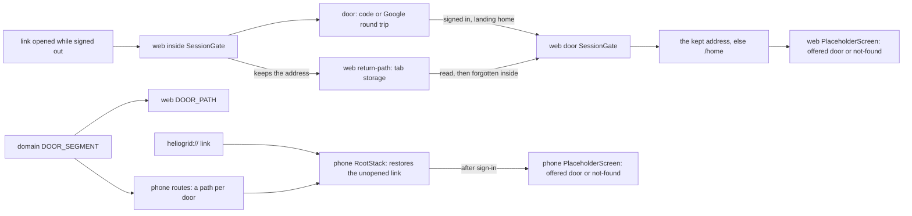

##### Package changes
- `packages/domain` — `shell/doors.ts` gains `DOOR_SEGMENT`, exported through `shell/index.ts`. No new dependency.
- `apps/web` — `features/auth` gains `return-path.ts` (three functions, feature-local); `features/shell/constants.ts` derives `DOOR_PATH`. Direction unchanged: web → domain.
- `apps/mobile` — navigation only; mobile → domain as today.
- **Law 12:** `DOOR_SEGMENT` is a `Record` over `ShellDoor`, so the typecheck holds that every door has an address. A phone link path is a new kind of public fact and **no check holds a phone path against a flow** (`e2e-flow-per-screen` holds screens, not links) — said out loud; QA proves the nine by opening two.

##### Data and schema changes
None — no stored shape changes. The kept address lives in the tab's `sessionStorage` under one key and is read only by the code that wrote it; an old tab without the key behaves as today.

##### File and folder changes
| action | path | purpose | placement reason |
|---|---|---|---|
| add | `apps/web/features/auth/return-path.ts` | keep, read and forget the address; only a path on this site, resolved as the router resolves it (review: a tab before the second `/` passed the first rule); a page load that let a person in keeps no address (review: after a sign-out, Back to a page left open kept its address) | feature-local; beside the gate that calls it |
| modify | `apps/web/features/auth/SessionGate.tsx` | keeps on turning away, reads on `home`, forgets once a person is inside (built against plan: a read that also removed ran twice under React's strict mode and sent the second pass home, so reading and forgetting are two steps) | the one gate |
| modify | `apps/web/features/auth/CompanySignupScreen.tsx` | a new company's first entry takes the address | line 42, the send home |
| modify | `packages/domain/src/shell/doors.ts` · `shell/index.ts` | `DOOR_SEGMENT` | beside `ShellDoor` |
| modify | `apps/web/features/shell/constants.ts` | `DOOR_PATH` derived | the web's paths |
| modify | `apps/mobile/src/navigation/routes/app.ts` | a path per door | one entry per route (`apps/mobile/CLAUDE.md`) |
| modify | `apps/mobile/src/navigation/root.tsx` | the navigator restores an unopened link; built, not planned: the home goes under a screen a link opened alone (the restored link is the stack's only route, and Back left the app — met on Android), and a dev build no longer reports the kept link as an unhandled action | the route map |
| — | `apps/mobile/src/navigation/linking.ts` | **planned, not built:** the home under a linked door is `root.tsx`'s, for a cold start and a restored link alike | — |
| modify | `apps/mobile/src/navigation/index.tsx` | built, not planned: hands the navigator `reportUnhandledAction` | where the navigator is rendered |
| modify | `apps/mobile/src/screens/shell/PlaceholderScreen.tsx` | not-found form for a door not offered | the phone's door screen |
| modify | `apps/mobile/src/screens/shell/ShellScreen.tsx` | built, not planned (QA, rows I11 and A11): the home's first-run mark shows only while the home is in front — under a door a link opened, the mounted home drew its mark over the door, its ring off the button; the web's mark is the home page's alone | the phone's home |
| modify | `apps/mobile/ios/HelioGridMobile/AppDelegate.swift` | hand an opened URL to React Native — needed: on the simulator a link to the running app did nothing before it, and opened *Leads* after it; a link that starts the app worked without it | the app's one delegate |
| modify | `tests/e2e/web/[door].spec.ts` | the five flows of AC-1; four wait out the 30 s resend gap, since their number asked for a signup code seconds before, and the new-company flow asks for its first | the door route's spec |
| modify | `tests/e2e/support/door.ts` | built, not planned (review): `fillCompanyDetails`, the company step's three fields, which `fillCompanyStep` and the new-company flow both call | the door helpers |
| modify | `docs/prd/modules/M01-onboarding-and-tenant-config.md` | `M01-61`'s last clause, by decision 1 | the row |
| modify | `docs/tasks/deferred.md` | `D20` deleted | ships |
| modify | `docs/tasks/M01-onboarding.md` | this RFC, the ledger, `Status:` | the task |
| modify | `docs/tasks/README.md` | built, not planned: the estimate counts comment lines and counts a changed row twice — this task's estimate missed both, twice | the size rule's owner |

##### API and contract changes
None — no wire boundary changes. The phone's nine paths (`heliogrid://leads` … `heliogrid://search`) are new public addresses; each equals the web's.

##### Risks and rollout
- **Open redirect:** the kept value is written only from this page's own path and is used only when it resolves to this site, read as the router reads it; an e2e flow plants `/<tab>/example.com`, which a browser reads as `//example.com`, and lands on `/home`.
- **Shared computer:** a page load that let a person in keeps no address afterwards — not at the sign-out, and not when Back returns to a page left open (finding 5); proven by an e2e flow.
- **Phone, a link held too long:** the navigator restores the last unopened link when the routes change. A link opened on the company step opens after the company is made — the same rule as the web (key decision 1).
- **iOS native change:** `AppDelegate.swift` changes only if needed, and then the iOS app is rebuilt once for QA; Android's manifest already hands the link over.
- **Old app versions:** a phone build without the paths ignores a link, as today. Nothing stored or sent changes.
- **Stacked on an open PR:** a CI fix on #267 arrives here by merge; this PR opens only after #267 is on `main`.

##### Acceptance criteria and proof
- **AC-1** — **M01-61** (P1) — **Signing in returns the person to where they were going.** A signed-out person who opens a link to a signed-in route lands on that route after signing in, not on their home — on the web and the phone; a route their roles cannot open shows the not-found frame, with the way home.

| AC/row | owner | tier | surface | action → expected | proof |
|---|---|---|---|---|---|
| AC-1 · return | ci | required | web | signed out, open `/leads`; sign in with the code → the address is `/leads` and the *Leads* door shows; `/home` is never drawn | `tests/e2e/web/[door].spec.ts` — *a link opened while signed out is where sign-in lands* (`e2e-web`) |
| AC-1 · roles | ci | required | web | signed out, an owner opens `/proposals`; sign in → the not-found frame inside the shell; *Go to home* → `/home` | same spec — *a link to a door the person is not offered is not found after sign-in* |
| AC-1 · sign-out | ci | required | web | open *Leads* then *Projects*, sign out, press Back (the tab returns to `/leads`, then the door); sign in → `/home` | same spec — *signing out, then in, opens the home — also after Back to a page left open*; planted red: the page-load memory removed → landed on `/leads` |
| AC-1 · new company | ci | required | web | signed out, a new number opens `/leads`, signs in, makes its company → `/leads` | same spec — *a new company opens on the link its owner came by* |
| AC-1 · planted address | ci | required | web | the kept value is swapped for `/<tab>/example.com` (one swap, asserted); sign in → `/home` | same spec — *a kept value that is not a path on this site is dropped*; planted red twice: the rule removed, and the first rule (one `/`, no `//`) in its place → the tab went to `http://example.com/` both times |
| AC-1 · Google | — | not_applicable | web | — | no agent holds a Google password (`tests/e2e/mobile/login.yaml:5-6`); the kept address is read by the same gate after either sign-in |
| AC-1 · iPhone | qa-ios | required | iOS | signed out, app in the background: open `heliogrid://leads`; sign in → the *Leads* door, Back → home. The same from a cold start. Signed in as an owner: `heliogrid://proposals` → the not-found form, *Go to home* → home. A new number opens the link, signs in and makes its company → the *Leads* door | tree and screenshots — **passed** (rows I1–I14): the link opened *Leads* after sign-in from a running app and from a cold start, Back reached the home, `heliogrid://proposals` showed the not-found form and *Go to home*, and a new company opened on *Leads* with the home's first-run mark waiting for the home, its ring on the button |
| AC-1 · Android | qa-android | required | Android | the same four | tree and screenshots — **passed** (rows A1–A14), no unhandled-action line in logcat on the built code; the first-run mark waits for the home, and its ring sits above the button there as it does on a signup with no link (`deferred.md` D176, not this change); planted red (main-dev, on the emulator): the offer rule forced true → an owner's `heliogrid://proposals` opened the *Proposals* door |
| AC-1 · web by hand | qa-web | required | web 375 · 1536 | the return and the roles row on the running app; no flash of the home before the door | measurements — **passed** twice (rows W1–W6, the second run on the review's fixes): the address sampler never held `/home`; the tab held one entry, `/leads`, at the door and none after; after a sign-out and Back the tab kept nothing and sign-in opened `/home` |
| API | qa-api | not_applicable | — | — | no reachable API behaviour changes |
| every door has an address | main-dev | required | typecheck | a door added to `ShellDoor` without a segment fails `tsc` | `pnpm check`; planted red: one key removed |
| the gate | evaluator | required | repo | — | `pnpm check:all` |

##### Delivery size
- One part. About 15 files (0 generated, 3 docs).
- Code: about 130 authored lines.
- Tests: about 80 authored lines.
- Order: as *Order* above.
- **Built (delta, 2026-10-10):** 15 files (0 generated, 3 docs) — the file count holds. Code 230 authored lines against about 130; tests 94 against about 80. The code is over the 20% line: about 45 lines are the two phone additions above (the home under a lone screen, the dev report), about 20 are the nine door rows and the nine web paths counted as a line removed and a line added each, and the rest is the estimate's miss — it counted statements and left out the constraint comments. Still one part, well inside the 30-file and 1,000-line targets.
- **Size ruling (2026-10-10):** the owner approved option (a) — one part at its built size, 15 files, 230 code lines and 94 test lines.
- **After review and QA (2026-10-10):** 17 files (0 generated, 3 docs) — code 247 authored lines, tests 136. The review added the page-load memory and the router's own address rule (code +9), the new-company flow, the Back step and the swap count (tests +42, with `tests/e2e/support/door.ts`); QA added the home's mark waiting for the home (`ShellScreen.tsx`, code +8). The tests are 45% above the ruled 94 and the whole is 18% above the ruled 324, so the size goes back to the owner on the commit card. `docs/tasks/README.md` gains the estimate rule this task's two misses call for, the eighteenth file.
- **Size ruling (commit card, 2026-10-10):** the owner approved option (a) — one part at 18 files, 247 code lines and 136 test lines.

#### Runtime
Branch `feat/T-M01-040`, cut from `feat/T-M01-039d` (`beea4257`) on a clean tree, 2026-10-10.

| resource | initial | identity |
|---|---|---|
| web `3002` · api `8084` · Metro `8081` · component tests `3100` | none listening | — |
| Postgres `5544` · object store `9000` · Temporal `7233` | running (`pre_existing`) | `heliogrid-pg-local` · `heliogrid-object-store-local` · `heliogrid-temporal` (with `-admin`, `-jwks`) |
| simulator · emulator | none booted | — |
| browser tabs | pane closed | — |
| database routing | `heliogrid_test` / `heliogrid_test` | `.env.local` lines 7 and 12 |
| runtime logs | `api.log` 11,030,767 · `web.log` 406,792 · `metro.log` 1,483,589 bytes | — |

**QA and gate (2026-10-10)** — one stack on `heliogrid_test`: the api from source, the web built (rebuilt after the review's fixes), one Metro, the iPhone 17 Pro simulator (`40ED0117…`, the iOS app built once for the app-delegate change) and the `Pixel_8_Emulator`. Main sent every link (`simctl openurl`, `am start`), since the phone helpers send none. `qa-web` drove rows W1–W5, then W1–W6 again on the fixes; `qa-ios` rows I1–I14 and `qa-android` rows A1–A14 in six phases each — a link to the running app, a door not offered, a cold start from the link, the same again on the fixes, a new company by a link, and that row again after the mark's fix. Five test companies were made through the app (`QA link 9173550142`, `…0187`, `…0266`, `…0391`, `QA nolink 9173550477`). The repository's hash was equal before and after each helper round. Found and fixed here: the reviewer's sign-out-then-Back and tab-address findings (each seen red on the built web first), and QA's finding that the home's first-run mark drew over a linked door. Found and deferred: D175 (a React Native warning seen once on iOS), D176 (the mark's ring above its button on Android, the same on a signup with no link). `#267` merged while this ran; the branch takes `main` by merge before its PR.

**Measurements** — helper runs: `qa-web` 1 (one continuation), `qa-ios` 1 (five), `qa-android` 1 (five), `reviewer` 1 (three continuations), `evaluator` 1; one full gate, passed. Main's own turns and tokens are not counted. Size: planned about 15 files, code about 130, tests about 80; ruled at 15 files, code 230, tests 94; built 18 files (0 generated, 4 docs), code 247, tests 136 authored lines.

| resource | initial | final |
|---|---|---|
| web `3002` · api `8084` · Metro `8081` | none | stopped (`started_by_task`) |
| simulator · emulator | none booted | shut down (`started_by_task`); the iOS app on the simulator is this branch's build |
| browser tabs | pane closed | closed (`seed`, `tab-1`, `tab-2` were `started_by_task`) |
| Postgres · object store · Temporal | running (`pre_existing`) | unchanged |
| database routing | `heliogrid_test` / `heliogrid_test` | unchanged |

### T-M01-041 · The door's parts lifted into packages/ui
**Type:** screen · **Tier:** P1
**Status:** planned
**Why:** Twelve door parts exist once per platform, drawn the same from the same hooks and words (D24), and the phone's code step lacks the language control the web keeps (D23).
**PRD rows:** none of its own — Law 7 (one prop contract per shared component); `SCR-M01-01`, `SCR-M01-02` as drawn.
**DESIGN:** none — the existing boards.
**Chosen by the owner** (deferred review, 2026-10-08): its own task, after `T-FPLAT-082` part c.
**Depends on:** `T-FPLAT-082` (part c), `T-M01-040`.
**DONE WHEN:**
- Each door part lives in `packages/ui` with one `<Name>.types.ts` and both halves; the apps render them; ~~the phone's code step carries the language control.~~ → proof: typecheck and the e2e door specs; side-by-side of every door frame against its board. *(The struck clause: owner ruling on finding 3, 2026-10-10 — the board stands, and `docs/ux/briefs/SCR-M01-01-sign-in.md` records where the control sits.)*

#### Design check
No new drawing — `DESIGN: none — the existing boards`. Both boards read **READY** on 2026-10-09 (`T-M01-039`'s check). Both records were fetched again on 2026-10-10: `SCR-M01-01` still counts thirty-seven frames (31 at 375, 6 at 1536) and `SCR-M01-02` twenty-three (15 and 8), under the same state names, so that verdict stands and no helper ran. One clause of this task's `DONE WHEN` disagrees with the board (finding 3 of the RFC).

**Board pictures** are captured into the scratchpad `board/` at each part's build start — the frames that part renders, 375 and 1536, each language render — and listed here as they land.

Part a (2026-10-10), from the board in the browser pane: `SCR-M01-01` `m-normal`, `m-number-invalid`, `m-loading`, `m-google-failed`, `m-google-loading`, `m-access-removed`, `m-not-reached`, `m-google-failed-mr`, `m-access-removed-hi`, `m-access-removed-mr`, `m-not-reached-hi`, `m-not-reached-mr` — each phone frame 338 px wide, the board at 90%, which is the largest whole frame one pane screenshot holds (800 × 905); a 375 px frame needs the board at 100% and does not fit one shot — and `d-normal` at 50%. Reused from `T-M01-039`'s captures of the same day's boards, smaller (208 to 513 px wide): `SCR-M01-01` `m-google-failed-hi`, and `SCR-M01-02` `m-step1-number`, `m-number-invalid`, `d-step1-number`.

Part b (2026-10-10): both records were fetched again before its RFC — `SCR-M01-01` thirty-seven frames (31 and 6), `SCR-M01-02` twenty-three (15 and 8), the same state names — so the verdict stands and no helper ran. The records' exact file names in the project: `SCR-M01-01 - decisions &amp; self-audit.md` and `SCR-M01-02 - decisions &amp; self-audit.md`. Its board pictures, taken from the board in the browser pane at its build start: `SCR-M01-01` `m-otp-sent`, `m-otp-entry`, `m-otp-auto-read`, `m-wrong-code`, `m-expired-code`, `m-resend-cooldown`, `m-call-me-instead`, `m-delivery-failed`, `m-cap-reached`, `m-number-locked`, `m-auth-error`, `m-google-link-code`, `m-google-phone-taken` — each phone frame 220 px wide, the board at 75%, two frames to a pane screenshot (the pane gave 800 × 600) — and `d-code-family`, `d-number-locked` at 50%; `SCR-M01-02` `m-step2-code` (338 px wide, the board at 90%) and `d-step2-code` at 50%.

#### RFC

##### Title
`T-M01-041` — The door's parts, authored once in `packages/ui`

##### Description
**User impact.** None a person meets on the day it ships — internal. Indirectly, a fix to the sign-in or signup door lands on the web and on the phone in one change, so the two cannot drift apart again: five open rows in `deferred.md` (D23, D110, D138, D141, D154) are each a place where one app's door already differs from the other's or from the board.

Who gains: every later change to the two doors. The problem: fifteen door parts exist once per app — 1,673 lines under `apps/web/features/auth/` and 1,293 under `apps/mobile/src/screens/{shared,login,company-signup}/` — drawn from the same hooks and the same words, with the markup written twice (D24; Law 7; `.claude/rules/screen-parts.md`).

##### Goals
- Every door part both apps draw has one prop contract in `packages/ui`; neither app keeps a copy.
- Every frame looks as it does today: the web's landing baselines hold pixel for pixel, and each part passes its side-by-side on web, iOS and Android. A look changes only where a row below is ruled to join.
- The words a frame picks by state come from one `packages/i18n` function per frame; a screen passes facts and presses, and picks nothing.
- Each deferred row that joins is deleted in its part's commit.

##### Non-goals
- No new frame, word, route, table or API.
- The flow is unchanged: `useSignIn`, `useCompanySignup`, the reducers and the frames in `domain`.
- The four screens stay in their apps (`SignInScreen`, `LoginScreen`, both `CompanySignupScreen`): the router, Google's sheet and the phone's safe-area inset are theirs.
- A door language kept through signup or a reload (D143, D171) and the Devanagari heading's line box (D172).

##### Readiness and dependencies
- `T-FPLAT-082` part c is shipped (`docs/tasks/F-platform.md:3371`).
- `T-M01-040` is shipped on this branch's base only: PR #268 is in review. Owner's word, 2026-10-10: do not wait, branch from `feat/T-M01-040`. On `origin/main` the walk still stops at `T-M01-040` (`docs/tasks/M01-onboarding.md:939` there reads `planned`). Part a's PR is opened on `main` once #268 merges, or on `feat/T-M01-040` before it. (#268 merged during part a's QA; the branch was moved onto `main`, whose tree equalled its base.)
- Design check: above.
- Assumption, **disproved in part a (2026-10-10)**: git records each web part and each phone part as a move into `packages/ui`, so only the changed lines count. A half that takes facts in place of the hook is mostly rewritten — git scores the two number-step halves 27% and 28% alike, under its 50% line — so each half counts as a file deleted and a file added, and the size went back to the owner (*Delivery size*, delta).
- No blocker.

##### Proposal
**The flow, the same for every frame.** The screen reads its hook (`data`), asks `i18n` for the frame's words over plain facts, and renders the frame's component from `ui` with those words, the facts and the presses. The component draws inside `DoorFrame`. The screen picks no word and holds no markup of its own.

```tsx
// apps/web SignInScreen and apps/mobile LoginScreen — the same call
<DoorNumberStep
  words={numberStepWords(t, { notice: signIn.notice, google: signIn.google, problem: state.phoneProblem, sending })}
  phone={state.phone} busy={signIn.busy} sending={sending} googleBusy={signIn.google?.busy ?? false}
  onPhone={signIn.typePhone} onPress={signIn.press}
  title={{ title: t(SIGN_IN.signIn), intro: t(SIGN_IN.intro) }} road={road} language={<LanguageControl />}
/>
```

**Key decisions, one reason each.**
1. **One folder per frame, not one per part.** Nine folders: `DoorNumberStep`, `DoorCodeStep`, `DoorLinkStep`, `DoorSwitch`, `DoorLanguage`, `SignupSteps`, `SignupCompanyStep`, `SignupKnownNumber`, `SignupRequestSent`. A part only one frame draws (`CodeTitle`, `CodeGoogle`, `AccountCard`, `CompanyFacts`, `CompanyFields`, the join steer's blocks) is a file inside that frame's folder, its props in that frame's `<Name>.types.ts` — as `AppShell/` holds `MobileTopBar` and `CountBadge`. Reason: nobody else draws them, and nine contracts are fewer to keep honest than fifteen. This is the simpler of the two readings of *each door part lives in `packages/ui` with one `<Name>.types.ts`*.
2. **The title block is the frame's.** Six frames draw the same heading, `Explainer` and intro; `DoorFrame/` gains `DoorTitle`, and each frame uses it.
3. **Where the column sits is the frame's fact.** Today the web passes a class name (`doorColumn`, `apps/web/features/auth/constants.ts:32`) and the phone has its own spacers (`door-styles.ts:22`). `DoorFrame` takes `column: 'centred' | 'deep'` and both halves place it.
4. **A part takes facts, never the hook.** `ui` may import `domain` but not `data`, `i18n` or `forms` (`docs/engineering/architecture.md:194`). Types that are `domain`'s (`DoorRoad`, `LoginFrame`, `LoginPress`, `DoorNotice`, `PhoneGoogle`) are imported; words arrive as a prop whose shape the `i18n` function returns, and `tsc` at the call site proves the two agree.
5. **The stylesheet follows the component.** Rules leave `sign-in.css`, `company-signup.css`, `door-styles.ts` and `company-signup/styles.ts` with the part that owns them; the last part, g, deletes what is left.
6. **The phone's inset stays the app's.** `ui` holds no safe-area package. `DoorFrame`'s phone half reads its top inset from a context it exports; the app's `InsetDoorFrame` becomes the one wrapper a phone screen puts around its door.
7. **Each half is moved, not retyped** (`git mv`), then edited. The diff still shows a deleted file and a new one (see *Readiness*).

**Findings from testing the task's own lines.**

| # | finding | where | recommendation · cost |
|---|---|---|---|
| 1 | D24 names twelve parts; fifteen exist. `CodeTitle`, `CodeGoogle` and `GoogleLinkStep` are pairs too. | `apps/web/features/auth/components/GoogleLinkStep.tsx:21` · `apps/mobile/src/screens/login/components/GoogleLinkStep.tsx:16` | Lift all fifteen — the rule is the same. In the size below. |
| 2 | Fifteen folders are not needed. | decision 1 | Nine folders. Saves about 25 files. |
| 3 | *The phone's code step carries the language control* contradicts the board. The record's code-family row at 375 draws the header as *Wordmark + Change number*; the language control is page chrome at 1536 only. The web at 375 already follows it (`CodeStep.tsx:55-58`), and so does the phone. | `SCR-M01-01` record, *375 vertical layout* and *1536 — where the arrangement genuinely differs* | **Owner rules** (Decisions, 1). Keep the board: no code change, the brief records it, the clause is struck. |
| 4 | The lift is about 3,000 changed lines over five PRs, each with web, iOS and Android QA, for no change a user sees. | *Delivery size* | **Owner rules** (Decisions, 2). All five in order — the rule says the next task on either twin lifts the pair. |
| 5 | `CompanyFields` binds its three fields with `forms`' `Controller`, which `ui` may not import; the phone needs each field to re-render alone (`apps/mobile/.../CompanyFields.tsx:17-19`). | part e | Ruled in part e's RFC: the component takes one field binder from the screen. |

**Deferred rows this task meets.** Rows a later part's files meet (D110, D141, D154, D170, D171) are ruled in that part's RFC.

| row | what | recommendation |
|---|---|---|
| D24 | the twelve twin parts | **joins** — it is this task; deleted with the last part |
| D23 | no language control on the phone's code step | **joins part b** as finding 3 rules it |
| D138 | the phone centres signup's step 1 and code step under the step header; the board puts the heading `sp-8` under it | **joins** — the number step in part a, the code step in part b: decision 3 writes that placement once, and the web already has it |
| D175 | iOS showed the yellow warning toast once on the door | **joins parts a and b as a QA watch** — `qa-ios` reads the console after each step of a cold start; no code is planned unless it shows |
| D143 | the door's language is lost in signup; the account is stored `en` | **stays** → `T-M01-003 starts` — it writes `interface_language`, the language task's own column |
| D172 | the Hindi and Marathi heading box is 42 px against 28 px on the web | **stays** → `T-M01-003 starts` — it is the type scale's Devanagari line box, not a door part |

Rows part a's files also meet, found by its review and put to the owner on the commit card (none is the number step's lift, so each is recommended to stay). **Ruled on the commit card (2026-10-10): all eight stay.**

| row | met by | what | recommendation |
|---|---|---|---|
| D102 | `packages/ui/src/components/DoorFrame/` | on iOS the door's wordmark is a button under 44 pt that does nothing | **stays** |
| D109 | the same | at 375 with 200% text the door's header and road clip | **stays** — its next step now names `DoorNumberStep.css` |
| D132 | the same | with the keyboard up the phone door does not bring the field and its error fully into view | **stays** |
| D140 | `DoorFrame.tsx` | at 1536 the way back sits top-right and the foot is stacked, where the board differs | **stays** — the foot's rule is `DoorNumberStep.css` now, and its cell names that folder too; changing it redraws two baselines |
| D2 · D92 | `packages/ui/src/components/` | English left inside `ui` components; `UnavailableNote`'s default title | **stay** — this part adds no English to `ui` |
| D105 | `apps/mobile/src/` | two 403s on `/notifications/devices` after a sign-in with notifications declined | **stays** |
| D146 | `apps/mobile/src/screens/company-signup/` | no way back from signup's step 3 on the phone | **stays** — ruled again in part f, which lifts that step |

**Owner rulings (2026-10-10, with the approval).** Finding 3: the board stands — the phone's code step and the web at 375 carry no language control; the brief records it and the `DONE WHEN` clause is struck, in part b. Finding 4: the whole lift, every part in order. Deferred rows: D24, D23, D138 and D175 join as the table says; D143 and D172 stay and reopen at `T-M01-003 starts`.

**Order.** Parts a → g, as `#### Parts`. Inside a part: the `i18n` words test, then the words; the `ui` component (types, web half, phone half, styles); the two screens; the app copies and their styles out.

**Errors and refusals.** None new: every block a frame shows today arrives as words.

**The twin screen.** Each part is its own twin: one `<Name>.types.ts`, both halves, both apps in the same part.

##### Architecture diagram
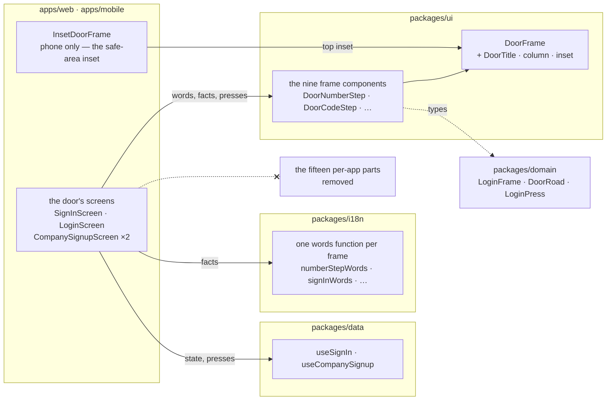

##### Package changes
- **`ui`** — gains the nine frame components and `DoorTitle`, each exported from `src/index.ts`; `DoorFrame` gains `column` and the phone's inset context. Dependency direction unchanged: `contracts`, `domain`, `theme`.
- **`i18n`** — gains a words function for each frame that has none today (`numberStepWords` in part a); the others exist (`signInWords`, `googleLinkWords`, `companySignupWords`, `joinSteerWords`). No new message, so no catalog changes.
- **`apps/web` · `apps/mobile`** — lose the fifteen parts and their styles; keep the four screens and the phone's inset wrapper.
- **Law 12.** No new brand, enum, token, route, table or error code. A new `ui` component is held by `tsc`: both halves implement the one types file, and the phone typechecks the `.native` halves first (`.claude/protections.md:82`). Said out loud: no check compares the two halves' markup (`packages/ui/CLAUDE.md:61`), and `design-system-props` has nothing to compare, because the pulled manifest names none of these components.

##### Data and schema changes
None — no stored shape changes.

##### File and folder changes
Part a's files are one row each in `#### Part a · RFC`. Parts b–g are budgeted here by group and get their rows in their own RFC at their turn. No new folder category: each new folder is `packages/ui/src/components/<Name>/` (architecture §4, step 8).

| part | action | path | purpose | placement reason |
|---|---|---|---|---|
| a | see part a | about 28 files | the frame's title, column and inset; the number step | §4 steps 6, 8, 9 |
| b | add · move | `packages/ui/src/components/DoorCodeStep/` (5) · `src/index.ts` · `src/styles.css` | the code family, with its title and its Google way inside | §4 step 8 |
| b | delete · modify | web `CodeStep` `CodeTitle` `CodeGoogle` · phone the same three · four screens · `sign-in.css` · `door-styles.ts` · `constants.ts` | the copies and their styles out | §4 step 9 |
| b | modify | `docs/ux/briefs/SCR-M01-01-sign-in.md` · `deferred.md` | finding 3's ruling; D23, D138 | the brief owns the state |
| c | add · delete · modify | `packages/ui/src/components/DoorLinkStep/` (5) · web and phone `GoogleLinkStep` · two screens · styles | the link step | §4 steps 8, 9 |
| d | add · delete · modify | `packages/ui/src/components/{DoorSwitch,DoorLanguage}/` (about 9) · an `i18n` hook for the language list and its test · web `SwitchPanel` `LanguageControl` · phone `SwitchSheet` `LanguageControl` · every caller of `LanguageControl` | the switch (panel and sheet around one body) and the language control | §4 steps 6, 8, 9 |
| e | add · delete · modify | `packages/ui/src/components/SignupSteps/` (5) and step 3's pieces in `SignupCompanyStep/` — the account, the facts, the fields · web and phone `SignupProgress` `AccountCard` `CompanyFacts` `CompanyFields` | the step header and step 3's pieces | §4 steps 8, 9 |
| f | add · delete · modify | `packages/ui/src/components/SignupCompanyStep/` — the step and its join steer · web and phone `CompanyStep` `JoinSteer` · two screens · `company-signup.css` · `company-signup/styles.ts` | step 3 itself | §4 steps 8, 9 |
| g | add · delete · modify | `packages/ui/src/components/{SignupKnownNumber,SignupRequestSent}/` (about 10) · web and phone `KnownNumber` `JoinRequestSent` · `sign-in.css` · `company-signup.css` · `door-styles.ts` · `company-signup/styles.ts` · `apps/mobile/CLAUDE.md` · the dependency-cruiser comment on `screens/shared/` · `deferred.md` | the two off-flow frames; what is left out; `screens/shared/` keeps only the inset wrapper; D24 deleted | §4 step 8 · Law 8 |

##### API and contract changes
None — no wire boundary changes.

##### Risks and rollout
- **The product's first screen changes its code.** Mitigation: the web's landing baselines for `/login` and `/company-signup` at 375 and 1536 are compared pixel for pixel in CI; each part has side-by-side rows on web, iOS and Android for every frame it draws that the app can reach.
- **The phone drops typed characters when a field re-renders late.** Only part e moves fields bound to a form; its RFC keeps one binding per field and `qa-ios` and `qa-android` type fast into each.
- **This branch stands on an unmerged PR.** If #268's review changes `T-M01-040`, the owner merges that into this branch; `git log` is read after every approval.
- **Release safety.** Nothing stored or sent changes; no old reader is affected.
- **A deleted source file can leave a stale `dist`** (`CLAUDE.md` §3.6): cleared before the gate.

##### Acceptance criteria and proof
- **AC-1** — Each door part lives in `packages/ui` with one `<Name>.types.ts` and both halves; the apps render them; ~~the phone's code step carries the language control.~~ → proof: typecheck and the e2e door specs; side-by-side of every door frame against its board.

Each part's rows are in its own RFC. The rows every part carries:

| AC/row | owner | tier | surface | action → expected | proof |
|---|---|---|---|---|---|
| AC-1 · contract | main-dev | required | typecheck | the part's components compile in `ui`'s web and native projects and at both apps' call sites; no copy of the part is left in either app | `pnpm check` |
| AC-1 · words | main-dev | required | unit | each state's words in English, Hindi and Marathi from the frame's `i18n` function | the part's `packages/i18n/tests/*.test.ts` |
| AC-1 · look | ci | required | `e2e-web` | the door flows pass and the landing baselines are unchanged | `tests/e2e/web/{login,login-google,company-signup,[door]}.spec.ts` |
| AC-1 · phone flows | ci | required | `android` | `Phone flows (tests/e2e/mobile) on the emulator` runs `login.yaml` and `company-signup.yaml` | CI step |
| AC-1 · side-by-side | qa-web · qa-ios · qa-android | required | the part's frames | each frame the part draws and the app reaches, against its board picture | QA |
| AC-1 · the language control clause | — | blocked | — | — | cleared by the owner's ruling on finding 3, in part b |
| API | qa-api | not_applicable | — | — | no reachable API behaviour changes |
| the gate | evaluator | required | repo | — | `pnpm check:all` |

##### Delivery size
- **Split into parts** (five as first approved, seven since the size ruling below) — one PR each, web and phone together in every part. About 110 files and 3,000 authored lines in all; no single part is under the caps otherwise.
- **a** · the frame's title, column and inset; the number step · about 28 files · code about 870, tests about 130.
- As first approved, before the size ruling below: **b** the code step, about 20 files, code about 600, tests about 60 · **c** the link step, the switch and the language control, about 30 files, code about 650, tests about 80 · **d** the company step and the step header, about 28 files, code about 800, tests about 80 · **e** the known number, the request sent and the leftovers, about 18 files, code about 450, tests about 20.
- Order: as `#### Parts`. Each later part is estimated in its own RFC.
- **Delta after part a's build (2026-10-10).** The move assumption failed (*Readiness*): a lifted half counts whole, deleted in the app and added in `ui`. Part a is built at 29 files, code 1,071 and tests 151 authored lines against about 28, 870 and 130 — 22% over on lines, all of it the two deleted halves (253 lines). Counted the same way the later parts come to about: b 950 · c 1,100 · d 1,650 · e 950 lines, so c and d no longer fit one part each. The size ruling is the owner's.
- **Size ruling (2026-10-10):** the owner approved part a at its built size — 29 files, 1,071 code lines and 151 test lines — and the rest of the task cut into parts that each stay under the 1,000-line target: six more, b → g, as `#### Parts` lists them, each sized in its own RFC.

#### Parts

| part | what | AC | depends on | status |
|---|---|---|---|---|
| a | `DoorFrame` owns the title, the column's place and the phone's inset; the number step is `DoorNumberStep` on both apps (`#### Part a · RFC`) | AC-1 (number step) | `T-M01-040` | shipped |
| b | the code step is `DoorCodeStep`, its title and its Google way inside; finding 3's ruling is in the brief; the flow's glue is `useSignIn`'s `sending` and `googleBusy`; the step closes its own centred column on the phone (`#### Part b · RFC`) | AC-1 (code step, the language clause struck) | a | shipped |
| c | the link step is `DoorLinkStep` — its own RFC | AC-1 (link step) | b | open |
| d | the switch and the language control are `DoorSwitch`, `DoorLanguage` — its own RFC | AC-1 (switch, language) | c | open |
| e | signup's step header is `SignupSteps`; step 3's account, facts and fields move into `SignupCompanyStep/` — its own RFC | AC-1 (step header, step 3's pieces) | d | open |
| f | step 3 itself and its join steer are `SignupCompanyStep` — its own RFC | AC-1 (company step) | e | open |
| g | the known number and the request sent are `SignupKnownNumber`, `SignupRequestSent`; the leftover styles and D24 go — its own RFC | AC-1 (off-flow frames) | f | open |

#### Part a · RFC

##### Title
`T-M01-041a` — The number step, authored once

##### Description
**User impact.** None — internal, with one ruled look change on the phone: signup's step 1 puts its heading `sp-8` under the step header, as the board and the web do (D138). The rest is the task RFC's.

##### Goals
- `DoorNumberStep` draws frame 1 of both doors on both apps; no `PhoneStep` file is left in either app.
- `DoorFrame` owns the title block, the column's place and the phone's top inset.
- `/login` and `/company-signup` keep their landing baselines at 375 and 1536.

##### Non-goals
- The code step, the link step, the switch and the language control keep their app files until parts b, c and d; they keep working through `InsetDoorFrame` and their class names.
- The switch frames' look: no V1 code makes held work, so the app cannot reach them.

##### Readiness and dependencies
As the task RFC. Nothing more.

##### Proposal
- **`DoorTitle`** (`DoorFrame/`): `title`, optional `explainer`, optional `intro`. Web: `h1` and `body-lg`, sized by the frame's stylesheet as today. Phone: `h2` and `body`.
- **`DoorFrame.column`**: `'centred'` — the column sits between the header and its foot (`SCR-M01-01`); `'deep'` — the heading is `sp-8` under what leads it (`SCR-M01-02`). The two web rules move from `sign-in.css:11` and `company-signup.css:47` into `DoorFrame.css` under their present class names, which the web half now sets from `column`; a caller not yet lifted still passes the class and meets the same one rule. The phone half places the same two ways, so D138's number-step half is met.
- **The inset.** `DoorFrame`'s phone half reads a top inset from a context exported beside it (default 0). `InsetDoorFrame.tsx` gains `InsetDoor`, the wrapper around a lifted step; `InsetDoorFrame` itself stays for the parts not yet lifted and sets the same context.
- **`numberStepWords(t, facts)`** in `packages/i18n/src/copy/sign-in-number.ts` (`sign-in-frames.ts` is 291 lines): the field's label and refusal, the primary's label, the Google part, the block above the number. Facts: `notice`, `google`, `problem`, `sending`. It composes `phoneGoogleWords` and `doorNoticeWords`; no new message.
- **`DoorNumberStep`**: `words`, `title`, `phone`, `busy`, `sending`, `googleBusy`, `onPhone`, `onPress` (`LoginPress`: `send`, `google`), `road` (`DoorRoad`), `language`, and optional `lead`, `taskMeasure`, `helper`, `task`. (`sending` and `googleBusy` were built, not listed at approval: the primary's and the Google control's spinners are facts the hook holds.) The web half focuses the field on open and draws `task` in place of the form (the switch at 1536); the phone half does neither, as today.
- **The screens** call it as the task RFC's example shows; signup passes `lead`, `taskMeasure="steps"`, its `Explainer` and helper.
- **Order.** `sign-in-number.test.ts` → `numberStepWords` → the `DoorFrame.spec.tsx` cases → `DoorFrame` (title, column, inset) → `DoorNumberStep` (types, both halves moved and edited, styles) → the four screens → the app styles out.
- **Twin.** One types file, both halves, four screens.

##### Architecture diagram
As the task RFC's; this part lands `DoorNumberStep`, `DoorTitle`, `column` and the inset.

##### Package changes
- `ui`: exports `DoorNumberStep`, `DoorNumberStepProps`, `DoorTitle`, `DoorTitleProps`, `DoorColumn`, and the inset provider.
- `i18n`: exports `numberStepWords`, `NumberStepWords`, `NumberStepFacts`.
- Law 12: as the task RFC — no new fact of a guarded kind.

##### Data and schema changes
None — no stored shape changes.

##### File and folder changes

| action | path | purpose | placement reason |
|---|---|---|---|
| modify | `packages/ui/src/components/DoorFrame/DoorFrame.types.ts` | `DoorTitleProps`, `DoorColumn`, `column` | the frame's contract |
| add | `packages/ui/src/components/DoorFrame/DoorTitle.tsx` | the title block, web | §4 step 8, inside the frame's folder |
| add | `packages/ui/src/components/DoorFrame/DoorTitle.native.tsx` | the title block, phone | the same |
| modify | `packages/ui/src/components/DoorFrame/DoorFrame.tsx` | sets the column's class from `column` | the frame |
| modify | `packages/ui/src/components/DoorFrame/DoorFrame.native.tsx` | places the column; reads the inset | the frame |
| modify | `packages/ui/src/components/DoorFrame/DoorFrame.css` | the title rules and the two column rules, moved in | the stylesheet follows the component |
| modify | `packages/ui/src/components/DoorFrame/index.ts` | exports | the folder's one door |
| add | `packages/ui/src/components/DoorNumberStep/DoorNumberStep.types.ts` | the one prop contract | Law 7 |
| move | `apps/web/features/auth/components/PhoneStep.tsx` → `packages/ui/src/components/DoorNumberStep/DoorNumberStep.tsx` | the web half — moved, then rewritten over facts; git shows a deleted file and a new one | §4 step 8 |
| move | `apps/mobile/src/screens/shared/PhoneStep.tsx` → `packages/ui/src/components/DoorNumberStep/DoorNumberStep.native.tsx` | the phone half — the same | §4 step 8 |
| add | `packages/ui/src/components/DoorFrame/DoorFrame.logic.ts` | built, not planned: `DoorTopInset`, the inset's context — it is not markup, and the app imports it through the folder's index. Said out loud (review): only the phone half reads it, where `packages/ui/CLAUDE.md` described `<Name>.logic.ts` as *consumed by BOTH halves*; the owner ruled on the commit card that the line widens | the folder's `.logic.ts` |
| modify | `packages/ui/CLAUDE.md` | built, not planned (the owner's ruling on the commit card): `<Name>.logic.ts` is what is not markup — shared by both halves, or handed to the app through the index | the package's own rules |
| modify | `apps/web/features/auth/NotFoundScreen.tsx` | built, not planned (review): it used only the two rules that moved into `DoorFrame.css`, so it takes `column="centred"` and `DoorTitle` and stops importing `sign-in.css` | the screen |
| add | `packages/ui/src/components/DoorNumberStep/DoorNumberStep.css` | the form, the Google rows, the road — from `sign-in.css` | the stylesheet follows the component |
| add | `packages/ui/src/components/DoorNumberStep/index.ts` | exports | the folder's one door |
| modify | `packages/ui/src/index.ts` | exports the new folder | the package's entry |
| modify | `packages/ui/src/styles.css` | imports the new stylesheet | where every component's is listed |
| add | `packages/i18n/src/copy/sign-in-number.ts` | `numberStepWords` | §4 step 6 |
| modify | `packages/i18n/src/index.ts` | export | the entry |
| add | `packages/i18n/tests/sign-in-number.test.ts` | each state's words, three languages | `.claude/rules/testing.md` |
| modify | `apps/web/features/auth/SignInScreen.tsx` | renders `DoorNumberStep` | the screen |
| modify | `apps/web/features/auth/CompanySignupScreen.tsx` | the same | the screen |
| modify | `apps/web/features/auth/sign-in.css` | the moved rules out | the screen keeps only its own |
| modify | `apps/web/features/auth/company-signup.css` | the `deep` rule out | the same |
| modify | `apps/mobile/src/screens/login/LoginScreen.tsx` | renders `DoorNumberStep` inside `InsetDoor` | the screen |
| modify | `apps/mobile/src/screens/company-signup/CompanySignupScreen.tsx` | the same | the screen |
| modify | `apps/mobile/src/screens/shared/door-styles.ts` | the number step's styles out | the same |
| modify | `apps/mobile/src/screens/shared/InsetDoorFrame.tsx` | `InsetDoor`; sets the frame's inset | the app's one adapter |
| modify | `tests/e2e/components/DoorFrame.spec.tsx` | `column` centred and deep at 375 | the frame's spec |
| modify | `docs/tasks/M01-onboarding.md` | this RFC, the part's row, the ledger | the task |
| modify | `docs/tasks/deferred.md` | D138 narrowed to the code step; D24 narrowed; D143 and D172 re-pointed to `T-M01-003 starts`; D23 and D175 re-pointed to the code step's file; D109 and D140 name `DoorNumberStep`; D177–D179 added from QA | the rows this part meets |

##### API and contract changes
None — no wire boundary changes.

##### Risks and rollout
- **`DoorFrame` changes under five callers not yet lifted.** They pass the same class names and the same slots; the baselines and `DoorFrame.spec.tsx` hold their look.
- **The phone's step 1 of signup moves up** (D138). It is the ruled look; side-by-side `m-step1-number` on both phones.
- The rest is the task RFC's.

##### Acceptance criteria and proof
AC-1 is the task RFC's. This part's rows:

| AC/row | owner | tier | surface | action → expected | proof |
|---|---|---|---|---|---|
| AC-1 · contract | main-dev | required | typecheck | `DoorNumberStep` compiles in `ui`'s web and native projects and at four call sites; `rg PhoneStep apps` finds nothing | `pnpm check` |
| AC-1 · words | main-dev | required | unit | as it opens; a short number (*That is 7 digits …*); sending (*Sending the code*); Google busy and failed; the not-reached and access-removed blocks — en, hi, mr; planted red: `sending` → *Send code* | `packages/i18n/tests/sign-in-number.test.ts` |
| AC-1 · column | ci | required | component tests | `column="centred"` at 375: equal space above the title and under the task; `column="deep"`: the heading `sp-8` under the lead; planted red: the centred rule removed | `tests/e2e/components/DoorFrame.spec.tsx` |
| AC-1 · look | ci | required | `e2e-web` | `/login` and `/company-signup` flows pass; landing baselines at 375 and 1536 unchanged | `login.spec.ts` · `login-google.spec.ts` · `company-signup.spec.ts` · `[door].spec.ts` · `not-found.spec.ts` (the not-found frame signed out and inside the shell) |
| AC-1 · phone flows | ci | required | `android` | `Phone flows (tests/e2e/mobile) on the emulator` runs `login.yaml`, `company-signup.yaml` | CI step |
| side-by-side · front door | qa-web | required | `/login` 375 · 1536 | `m-normal` · `d-normal`; `m-number-invalid`; `m-loading` (the request held); `m-not-reached` and its `-hi`, `-mr`; `m-access-removed` and its `-hi`, `-mr`; `m-google-failed` and its `-hi`, `-mr` (Google's return with an error); 1536 by the record's stated rule where no frame is drawn | QA |
| side-by-side · not found | qa-web | required | `/no/such-page` 375 · 1536 | added in review, with `NotFoundScreen.tsx`: the heading and *Go to sign in* centred in the column at 375 (equal space above and below), the two fields at 1536 at the record's x (identity to 736, the measure 800 → 1220); `m-not-found` beside the web at 375; `d-not-found` by the record's numbers | QA |
| side-by-side · front door | qa-ios · qa-android | required | door | `m-normal`; `m-number-invalid`; `m-not-reached` and its `-hi`, `-mr` (the api stopped by Main); `m-access-removed` and its `-hi`, `-mr` | QA |
| side-by-side · signup step 1 | qa-web · qa-ios · qa-android | required | signup | `m-step1-number`, `m-number-invalid`; the web also `d-step1-number`; on the phones the heading sits `sp-8` under the step header (D138) | QA |
| `m-loading`, `m-google-failed`, `m-google-loading` on the phones | — | not_applicable | — | — | a phone write lands before any read, and the native Google sheet cannot be made to fail or be held; the frames are the web's capture of the same `DoorNumberStep` and `numberStepWords` |
| `m-google-loading` on the web · the switch frames | — | not_applicable | — | — | Google's page takes the tab at once; no V1 code makes held work, so no switch can be pending — the `task` slot is held by `tsc` |
| D175 watch | qa-ios | required | cold start | the JS console read after each step from a cold start to the home; a warning seen is reported with its text | QA + Metro |
| API | qa-api | not_applicable | — | — | no reachable API behaviour changes |
| the gate | evaluator | required | repo | — | `pnpm check:all` |

##### Delivery size
- One part. About 28 files (0 generated, 2 docs).
- Code: about 870 authored lines, counting each moved half by its changed lines only.
- Tests: about 130 authored lines.
- At the 1,000-line target, not under it: the frame's three pieces cannot ship without a step that draws them, and the step cannot ship without them.
- **Built (delta, 2026-10-10):** 29 files (0 generated, 2 docs) — every planned file, and one built but not planned (`DoorFrame.logic.ts`, the file table says why); nothing planned was left out. **After review:** 31 files (0 generated, 3 docs) — `NotFoundScreen.tsx` is the second built but not planned, and `docs/tasks/README.md` the third, for the estimate rule this part's miss calls for — code 1,082 authored lines and tests 151, two files and 11 lines over the ruled size, inside its 20%. **Commit card (2026-10-10):** the owner approved it, and `packages/ui/CLAUDE.md` joined as the thirty-second file (4 docs) by the ruling above. Code 1,071 authored lines against about 870, tests 151 against about 130: 22% over on lines. The whole overage is the two app halves, 253 lines, which git counts as deleted files beside their rewritten copies in `ui` (27% and 28% alike); without them the code is 818 lines. Inside the plan and said here: each `CompanySignupScreen` draws step 1 from a second function in the same file, `SignupNumberStep`, because the screen's one function passed Biome's 80-line cap; the four call sites each pass the same fourteen prop lines, and where that glue lives once is put to the owner in part b's RFC, where the code step needs the same.

**Planted reds seen (part a):** `numberStepWords`'s primary ignoring `sending` failed `sign-in-number.test.ts` › *numberStepWords — the primary says what it is doing* › *at rest and while the code is sending, in en*, *in hi*, *in mr*; the centred rule's `data-column` selector broken in `DoorFrame.css` failed `DoorFrame.spec.tsx` › *at 375* › *a centred column leaves as much room above its heading as under its task* (expected over 32, received 24). Each restored from a scratchpad copy and green again.

Checklist:
- [x] `sign-in-number.test.ts`, then `numberStepWords`
- [x] `DoorFrame.spec.tsx` cases, then `DoorFrame` — title, column, inset
- [x] `DoorNumberStep` — types, web half, phone half, styles, exports
- [x] the four screens; `InsetDoor`
- [x] the app styles out; `deferred.md`
- [x] board pictures captured; side-by-side on web, iOS, Android
- [x] review; the gate

#### Part b · RFC

##### Title
`T-M01-041b` — The code step, authored once

##### Description
**User impact.** None on the web and none on sign-in — internal. One ruled look change on the phone: on company signup the code step puts its heading `sp-8` under the step header, as the board and the web do; today the phone centres it lower (D138). Indirectly, the next fix to the code step lands on the web and on both phones in one change.

Who gains: every later change to the code family (thirteen states at 375). The problem: `CodeStep`, `CodeTitle` and `CodeGoogle` exist once per app — 185 lines under `apps/web/features/auth/components/` and 181 under `apps/mobile/src/screens/shared/` — the same markup written twice. The rest is the task RFC's.

##### Goals
- `DoorCodeStep` draws the code family of both doors on both apps; `rg -w 'CodeStep|CodeTitle|CodeGoogle' apps` finds nothing.
- Every code frame looks as it does today, except the phone's signup code step (D138).
- `/login` and `/company-signup` keep their landing baselines at 375 and 1536.
- Finding 3's ruling is on record: the brief says where the language control sits, the `DONE WHEN` clause is struck, D23 is deleted.
- The two facts the four screens derive today (`sending`, Google busy) are held once.

##### Non-goals
- The link step, the switch and the language control keep their app files until parts c and d.
- No new word, frame, route or API; no message joins the catalog.
- The way back at the top-left at 1536 (D140) and the repeated no-answer block's announcement (D170).
- The number step's look.

##### Readiness and dependencies
- Part a is shipped (`#269`, `f0af0550`); `T-FPLAT-082` is shipped (`docs/tasks/F-platform.md:3359`).
- Design check: both records were fetched again on 2026-10-10 — thirty-seven frames and twenty-three, the same state names — so the READY verdict stands (`#### Design check`).
- Board pictures are captured at this part's build start, as `#### Design check` says: `SCR-M01-01` the thirteen code-family frames, `d-code-family`, `d-number-locked`; `SCR-M01-02` `m-step2-code`, `d-step2-code`. The owner is signed in to the board in the browser pane.
- Each lifted half counts whole, deleted in the app and added in `ui` (part a's lesson; `docs/tasks/README.md`).
- No blocker.

##### Proposal
**The flow.** As the task RFC: the screen reads `useSignIn`, asks `signInWords` for the frame's words, and renders `DoorCodeStep` with the words, the facts and the presses.

```tsx
// apps/web SignInScreen — the phone's LoginScreen wraps the same call in <InsetDoor>
<DoorCodeStep
  language={<LanguageControl />}
  words={signInWords(t, signIn.frame, signIn.state)}
  frame={signIn.frame} phone={signIn.state.phone} code={signIn.state.code}
  busy={signIn.busy} googleBusy={signIn.googleBusy}
  onCode={signIn.typeCode} onPress={signIn.press}
/>
```

Signup adds `lead` (its step header), `taskMeasure="steps"`, its two labels to `signInWords`, and `helper`.

**Key decisions, one reason each.**
1. **Five files in the folder.** The title and the Google way are local functions inside each half, not exported: only this step draws them (task RFC, decision 1).
2. **`signInWords` writes every word the step draws.** It gains `changeNumber`, `codeLabel`, and the pager's words inside `explainer`; `ui` may not ask `i18n` for them. No second words function.
3. **`doorNoticeWords` moves to `sign-in-number.ts`, with its two tests.** `sign-in-frames.ts` is 291 lines and would pass 300; the function writes the number step's block, so that file is its home.
4. **The step takes facts.** `frame` is `Pick<LoginFrame, 'code' | 'primary' | 'resend'>` (`domain`'s type), then `phone`, `code`, `busy`, `googleBusy`, `onCode`, `onPress`. The step formats the number itself (`useFormat` is `ui`'s).
5. **`language` is required; the phone half draws none.** Finding 3's ruling: at 375 the header holds *Change number* alone. The web half shows it from the door's breakpoint. Required, so `tsc` refuses a web call that forgets it.
6. **The column's place comes from the frame.** `column` is `'centred'` with no `lead` and `'deep'` with one, on both halves — the number step's rule. On the phone this is D138.
7. **The flow's glue — `Decisions for you`, 1.** `useSignIn` hands out `sending` and `googleBusy` beside `busy`. The four screens stop deriving them. Props stay listed one by one: a ready-made props object in the hook would make `data` copy `ui`'s prop names.
8. **The lower half of a centred column on the phone — `Decisions for you`, 2.** The step closes its own column with one free-height view, as the number step does before its road. The frame-owned way needs a second foot slot on `DoorFrame`, beside `footer`, for one caller (the number step's road).
9. **The stylesheet follows the component.** Web: the Google rows, the centred row and the 1536-only language rule go to `DoorCodeStep.css` under the step's own names; `.hg-door-locked-google` leaves `sign-in.css`. `.hg-door-centred` and `.hg-door-desktop-only` stay there for the link step and the known number until parts c and g. Phone: `lockedGoogle`, `codeColumnAfterLead` and `centred` leave `door-styles.ts`; `codeColumn`, `codeTitle`, `titleRow` and `titleText` stay for the link step until part c. `doorColumn` leaves `constants.ts`.
10. **The web half's title uses the frame's two title classes** (`DoorFrame.css:103-113`). One rule, no copy. `DoorTitle` is not used: the code title has three lines under the heading in other sizes, and the phone's gaps differ (`sp-1` against `sp-2`).

**Findings from testing this part's own lines.**

| # | finding | where | recommendation · cost |
|---|---|---|---|
| 1 | The record's *Layout* says the code family's blocks sit `sp-6` apart at 375. Both apps draw `sp-5`, and `T-M01-038`'s side-by-side passed these frames. | `DoorFrame.css:141` · `door-styles.ts:22` | Keep today's look; QA measures the gap on the board picture. A real 4-point difference becomes a deferred row, not a change here. No cost. |
| 2 | On the phone, `column="centred"` keeps at least `sp-8` above the heading; today's code column keeps `sp-6`. | `DoorFrame.native.tsx:74` · `door-styles.ts:23` | Accept. It shows only when the column is taller than the screen; every drawn frame has 126 points or more to spare (the record's contract item 4). |
| 3 | D23 says the record is silent on the code frame. It is not now: the 375 table's code-family row reads *Wordmark + Change number*. | `SCR-M01-01` record, *375 vertical layout* | The owner's ruling stands and the record agrees. The brief gets one line; D23 is deleted. |
| 4 | The lower half of a centred column cannot move into the frame with a plain wrapper: the number step's road would sit 12 points off the board. | *Proposal*, decision 8 | **Owner rules** (Decisions, 2). |
| 5 | The honest size is over the 1,000-line target: 366 lines are the two app copies, deleted, and about 425 are the same step added in `ui`. | *Delivery size* | **Owner rules** (Decisions, 3). |

**Deferred rows this part meets** (every `touches` path that is a planned file or its parent).

| row | met by | what | recommendation |
|---|---|---|---|
| D23 | phone `CodeStep.tsx` | no language control on the phone's code step | **joins** (ruled) — the brief records it; deleted |
| D138 | phone `CodeStep.tsx` | the phone centres signup's code step under the step header | **joins** (ruled) — `column="deep"`; deleted |
| D24 | `apps/web/features/auth/components/` | the twin door parts | **joins** (ruled) — narrowed to the eleven parts left |
| D175 | phone `CodeStep.tsx` | iOS showed the yellow warning toast once | **joins as the QA watch** (ruled); the row is re-pointed or deleted on the commit card |
| D170 | both `CodeStep.tsx` | a second no-answer block is not announced again | **stays** — it needs a send counter in the reducer, which is new behaviour; re-pointed to `packages/ui/src/components/DoorCodeStep/` |
| D2 · D92 | `packages/ui/src/components/` | English left inside `ui` components | **stay** — this part adds no English to `ui` |
| D105 | `apps/mobile/src/` | two 403s on `/notifications/devices` | **stays** |
| D146 | `apps/mobile/src/screens/company-signup/` | no way back from signup's step 3 on the phone | **stays** — ruled again in part f |

**Order.** The words tests (red) → `signInWords` and the `doorNoticeWords` move → `useSignIn`'s two facts → `DoorCodeStep` (types, both halves moved and edited, styles, exports) → the four screens → the app copies and their styles out → the brief and `deferred.md`.

**Errors and refusals.** None new: every block a code frame shows arrives as words.

**The twin screen.** One `DoorCodeStep.types.ts`, both halves, four screens, in this part.

##### Architecture diagram
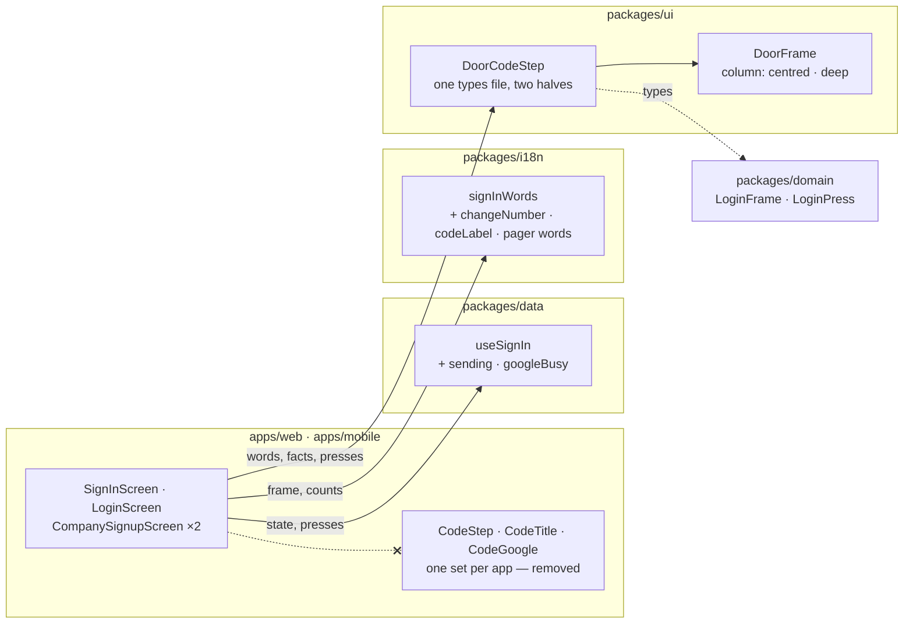

##### Package changes
- **`ui`** — exports `DoorCodeStep`, `DoorCodeStepProps`, `DoorCodeStepWords`. Dependency direction unchanged: `domain`, `theme`.
- **`i18n`** — `SignInWords` gains `changeNumber`, `codeLabel`, and the pager's words in `explainer`; `doorNoticeWords` is exported from `sign-in-number.ts`. No new message.
- **`data`** — `SignIn` gains `sending` and `googleBusy`. A package the task RFC did not name; this part's RFC rules it (the `#### Parts` row).
- **`apps/web` · `apps/mobile`** — lose the three code parts each and their styles.
- **Law 12.** No new brand, enum, token, route, table or error code. The component is held by `tsc`, as the task RFC says.

##### Data and schema changes
None — no stored shape changes.

##### File and folder changes
One new folder, `packages/ui/src/components/DoorCodeStep/` (architecture §4, step 8).

| action | path | purpose | placement reason |
|---|---|---|---|
| add | `packages/ui/src/components/DoorCodeStep/DoorCodeStep.types.ts` | the one prop contract and the words' shape | Law 7 |
| move | `apps/web/features/auth/components/CodeStep.tsx` → `packages/ui/src/components/DoorCodeStep/DoorCodeStep.tsx` | the web half — moved, then rewritten over facts; counted as one file deleted and one added | §4 step 8 |
| delete | `apps/web/features/auth/components/CodeTitle.tsx` | folded into the web half | its one caller moved |
| delete | `apps/web/features/auth/components/CodeGoogle.tsx` | the same | the same |
| move | `apps/mobile/src/screens/shared/CodeStep.tsx` → `packages/ui/src/components/DoorCodeStep/DoorCodeStep.native.tsx` | the phone half — the same | §4 step 8 |
| delete | `apps/mobile/src/screens/shared/CodeTitle.tsx` | folded into the phone half | its one caller moved |
| delete | `apps/mobile/src/screens/shared/CodeGoogle.tsx` | the same | the same |
| add | `packages/ui/src/components/DoorCodeStep/DoorCodeStep.css` | the Google rows, the centred row, the 1536-only language rule | the stylesheet follows the component |
| add | `packages/ui/src/components/DoorCodeStep/index.ts` | exports | the folder's one door |
| modify | `packages/ui/src/index.ts` | exports the new folder | the package's entry |
| modify | `packages/ui/src/styles.css` | imports the new stylesheet | where every component's is listed |
| modify | `packages/i18n/src/copy/sign-in-frames.ts` | `changeNumber`, `codeLabel`, the pager's words; `doorNoticeWords` out | the code frames' words |
| modify | `packages/i18n/src/copy/sign-in-number.ts` | `doorNoticeWords` in | the number step's words |
| modify | `packages/i18n/src/index.ts` | the export follows the move | the entry |
| modify | `packages/i18n/tests/sign-in-frames.test.ts` | the three new words, three languages; the notice tests out | `.claude/rules/testing.md` |
| modify | `packages/i18n/tests/sign-in-number.test.ts` | the notice tests in | the same |
| modify | `packages/data/src/react/use-sign-in.ts` | `sending`, `googleBusy` | the hook holds the flow's facts |
| modify | `apps/web/features/auth/SignInScreen.tsx` | renders `DoorCodeStep`; reads the two facts | the screen |
| modify | `apps/web/features/auth/CompanySignupScreen.tsx` | the same | the screen |
| modify | `apps/web/features/auth/sign-in.css` | `.hg-door-locked-google` out | the screen keeps only its own |
| modify | `apps/web/features/auth/constants.ts` | `doorColumn` out | orphaned by the move |
| modify | `apps/mobile/src/screens/login/LoginScreen.tsx` | renders `DoorCodeStep` inside `InsetDoor`; reads the two facts | the screen |
| modify | `apps/mobile/src/screens/company-signup/CompanySignupScreen.tsx` | the same | the screen |
| modify | `apps/mobile/src/screens/shared/door-styles.ts` | the code step's three styles out | the same |
| modify | `docs/ux/briefs/SCR-M01-01-sign-in.md` | where the language control sits (finding 3's ruling) | the brief owns the state |
| modify | `docs/tasks/deferred.md` | D23 and D138 deleted; D24 narrowed; D170 and D175 re-pointed | the rows this part meets |
| modify | `docs/tasks/M01-onboarding.md` | this RFC, the struck clause, the part's row, the ledger | the task |

##### API and contract changes
None — no wire boundary changes.

##### Risks and rollout
- **The code step changes its code on three surfaces.** Mitigation: the e2e door specs, the landing baselines, and a side-by-side row for every frame the app reaches.
- **The phone's signup code step moves up** (D138). It is the ruled look; side-by-side `m-step2-code` on both phones.
- **`signInWords` changes its `explainer` shape.** Its one caller is this step; `tsc` proves the call sites.
- The rest is the task RFC's. Nothing stored or sent changes.

##### Acceptance criteria and proof
AC-1 is the task RFC's. The clause *the phone's code step carries the language control* is struck by the owner's ruling on finding 3. This part's rows:

| AC/row | owner | tier | surface | action → expected | proof |
|---|---|---|---|---|---|
| AC-1 · contract | main-dev | required | typecheck | `DoorCodeStep` compiles in `ui`'s web and native projects and at four call sites; `rg -w 'CodeStep\|CodeTitle\|CodeGoogle' apps` finds nothing | `pnpm check` |
| AC-1 · words | main-dev | required | unit | `changeNumber` and `codeLabel` (it names 6 digits) in en, hi, mr; the ask beside the title carries the pager's words, for the frame's own rule and for the door's ask; planted red: the pager's words left out | `packages/i18n/tests/sign-in-frames.test.ts` |
| AC-1 · the notice's words | main-dev | required | unit | the two moved tests pass unchanged | `packages/i18n/tests/sign-in-number.test.ts` |
| AC-1 · look | ci | required | `e2e-web` | the door flows pass; the landing baselines at 375 and 1536 are unchanged | `login.spec.ts` · `login-google.spec.ts` · `company-signup.spec.ts` · `[door].spec.ts` |
| AC-1 · phone flows | ci | required | `android` | `Phone flows (tests/e2e/mobile) on the emulator` runs `login.yaml`, `company-signup.yaml` | CI step |
| state for QA | qa-api | required | api | state only: one number at the request cap (three codes) and one locked (three codes, five refused checks each) per surface, made through the api; the member for the D175 trip | the numbers handed to the surfaces |
| side-by-side · code family | qa-web | required | `/login` 375 · 1536 | `m-otp-sent`, `m-otp-entry` (after the 30 s gap), `m-resend-cooldown`, `m-wrong-code`, `m-call-me-instead`, `m-cap-reached`, `m-expired-code` (after 5 minutes), `m-number-locked`; at 1536 `d-code-family` and `d-number-locked` against their pictures, the others by the record's stated rule. The way back top-right at 1536 is D140, not a finding. The gap between blocks is measured (finding 1) | QA |
| side-by-side · answers QA cannot make | qa-web | required | `/login` 375 | `m-delivery-failed`, `m-auth-error`, `m-google-link-code`, `m-google-phone-taken`: Main takes each picture with a scratchpad Playwright script that answers the request in the browser; `qa-web` judges it against the board | QA |
| side-by-side · signup code step | qa-web | required | `/company-signup` 375 · 1536 | `m-step2-code`, `d-step2-code` | QA |
| the facts held once | qa-web | required | `/login` 375 | the code request held: the primary reads *Sending the code* and spins; *Continue with Google* stays live (`m-loading`) | QA |
| side-by-side · code family | qa-ios · qa-android | required | door | the same eight frames as the web's first row; the header holds the wordmark and *Change number* only; the space above the heading and under the last control is equal within 9 points (the heading's raised line box; part a measured 8.3 and 7.6) | QA |
| side-by-side · signup code step | qa-ios · qa-android | required | signup | `m-step2-code`: the heading's top is 32 points under the step header, within 1; the free height is only below (D138) | QA |
| no answer on the code step | qa-web · qa-ios · qa-android | required | door | the api stopped by Main, *Verify* pressed → the no-answer block under the step's title, ~~the code kept~~ (`SCR-M01-01` decision 17; no frame is drawn; the struck clause is D180, owner ruling 2026-10-10) | QA |
| language | qa-web · qa-ios · qa-android | required | door | `m-otp-sent` and `m-wrong-code` in Hindi and in Marathi, the language chosen on the number step: no English, nothing clipped | QA |
| `m-otp-auto-read` | — | not_applicable | — | — | no SMS autofill in a desktop browser (owner, `T-M01-038`), a simulator or an emulator |
| the four answers QA cannot make, on the phones | — | not_applicable | — | — | a phone's request cannot be answered from outside; the frames are the web's pictures of the same `DoorCodeStep` and `signInWords` |
| D175 watch | qa-ios | required | cold start | the trip that showed it: a member signed in, deactivated, the app cold-started; the JS console read after each step through the code step. A warning seen is reported with its text | QA + Metro |
| AC-1 · the language control clause | — | not_applicable | — | — | struck by the owner's ruling on finding 3 (2026-10-10); the brief records where the control sits |
| API | qa-api | not_applicable | — | — | no reachable API behaviour changes |
| the gate | evaluator | required | repo | — | `pnpm check:all` |

##### Delivery size
- One part — `Decisions for you`, 3. 29 files (0 generated, 3 docs).
- Code: about 1,020 authored lines — the two app copies deleted 366, the step in `ui` about 425, the four screens about 135, `i18n` about 55, styles and `constants.ts` about 32, `data` about 8.
- Tests: about 100 authored lines — 64 of them the two notice tests, moved.
- Over the 1,000-line target by about 12%. No smaller part can be accepted alone: a half without its twin, or the step without its four call sites, leaves a copy in an app, which is the defect this task removes.
- Order: as *Proposal*.

**Owner rulings (2026-10-10, with the approval).** The RFC is approved with every recommendation: the glue is A (`useSignIn` hands out `sending` and `googleBusy`); the lower half is A (the step closes its own column); the size is A (one part, 29 files, about 1,020 code lines and 100 test lines); the deferred rows are as the table. **During QA (2026-10-10):** the no-answer row's clause *the code kept* is struck — the reducer clears the code by its own tested rule, and the bug it leaves (*Try again* then sends nothing) stays as D180 for its own fix; no code changes here.

**Built against planned (delta as it lands).** Built but not planned: `packages/i18n/tests/sign-in-google.test.ts` — one row, its exact match on the cap frame's ask now meets the pager's words (`toMatchObject`). Planned but not built: `centred` stays in `door-styles.ts` — the known number's frame reads it (`KnownNumber.tsx:49`) until part g. The phone half draws its closing free height under a step header too, so the signup code step keeps at least `sp-6` under its last control, as before. D175's watch ended with nothing seen, and its `reopens when` cell is `touches apps/mobile/src/navigation/` alone. Review, pass 1: the phone half reads `useFormat` from `MarketProvider/market-context`, the file both platforms share, as `DatePicker.native.tsx` does.

**Planted reds seen (part b):** `signInWords` returning the ask without the pager's words failed `sign-in-frames.test.ts` › *signInWords — the ask beside the title carries the pager's words* › *the frame's own rule and the door's ask, in en*, *in hi*, *in mr* (expected undefined to be 'Next'); `codeLabel` given the way back's words failed › *signInWords — the words every code frame draws* › *the way back and the field's label, in en*, *in hi*, *in mr*. Each restored from a scratchpad copy and green again.

Checklist:
- [x] the words tests, then `signInWords`; `doorNoticeWords` moved with its tests
- [x] `useSignIn`: `sending`, `googleBusy`
- [x] `DoorCodeStep` — types, web half, phone half, styles, exports
- [x] the four screens
- [x] the app copies and their styles out; the brief; `deferred.md`; the struck clause
- [x] board pictures captured; side-by-side on web, iOS, Android
- [x] review; the gate

#### Runtime
Branch `feat/T-M01-041a`, cut from `feat/T-M01-040` (`e4e9d978`) on a clean tree, 2026-10-10 — the owner's word, PR #268 being in review. #268 merged during QA (`c7cf0783`, the same tree), and the branch, which held no commit of its own, was moved onto `main`.

| resource | initial | identity |
|---|---|---|
| web `3002` · api `8084` · Metro `8081` · component tests `3100` | none listening | — |
| Postgres `5544` · object store `9000` · Temporal `7233` | running (`pre_existing`) | `heliogrid-pg-local` · `heliogrid-object-store-local` · `heliogrid-temporal` (with `-admin`, `-jwks`) |
| simulator · emulator | none booted | — |
| browser tabs | pane closed | — |
| database routing | `heliogrid_test` / `heliogrid_test` | `.env.local` lines 7 and 12 |
| runtime logs | `api.log` 14,544,367 · `web.log` 434,313 · `metro.log` 1,538,039 bytes | — |

**Part a · QA (2026-10-10)** — one stack on `heliogrid_test`: the api and the web from source, the worker (started so the invite messages are delivered), one Metro, the iPhone 17 Pro simulator (`40ED0117…`) and the `Pixel_8_Emulator`, both on the apps already installed — no native file changed, so nothing was rebuilt. `qa-api` prepared the access-removed state as `T-M01-039` part c did: four fresh numbers invited into the `…904` company and accepted (+91 98765 08101 web, 08102 iOS, 08103 Android, 08104 the web's picture), then deactivated once each surface was signed in.

- **Rows.** Web W1–W10, iPhone I0–I7, Android A0–A7: every row passed, each difference ruled or already an open row. On both phones the door as it opens is **the same picture, pixel for pixel**, as the screenshots `T-M01-038` and `T-M01-039` took before this change (0 pixels differ under the status bar: `I1.png`, `A1.png`). Signup's step 1 on both phones now puts its heading row 32 points under the step header, as the web does at 375 (32.0 px) — D138's number-step half. `m-loading` on the web: the primary read *Sending the code* with its request held and *Continue with Google* stayed live. Not-reached and access-removed read in English, Hindi and Marathi on all three surfaces, string by string as the board has them. The not-found page, changed in review, centres at 375 (322 px above and below) and holds the record's two fields at 1536.
- **First-pass verdicts that were Main's own packet, not the app.** The phones' door row asked for the two gaps around the centred block to match within 6 points; they differ by 8.3 (iOS) and 7.6 (Android), which is the heading's own raised line box and is unchanged (the pixel comparison above). The web's row had no ruling for the road stacked at 1536 — already D140, and in the committed baseline. The web's access-removed and not-reached pictures could not be taken in the browser pane (it was hidden; and the door must be open before a request can fail), so Main took them with a scratchpad Playwright script on the same running web and `qa-web` judged them.
- **Found, out of scope, now rows:** D177 (no example number in the field), D178 (a refused field keeps the focus ring on the phones), D179 (the boards draw six digits under *That is 7 digits*). The Hindi and Marathi access-removed titles end in *है* / *आहे*, where the board's company-named sentence has no closing verb — `T-M01-039`'s wording for the title without a company, unchanged here.
- **D175 watch.** Seen once on iOS: a cold start whose boot check finds the member removed lands on the door with the yellow toast, and the Hermes console holds React Native's `Sending \`onAnimatedValueUpdate\` with no listeners registered.` once. Neither the number step nor the frame runs an animation, so no code changed; the row now carries the trip that showed it and stays for part b's watch — the owner's ruling on the commit card.
- **Board pictures and the pane.** The board's canvas stopped scrolling while the pane was hidden, so `d-not-found` was judged by the record's numbers, and the phone frames are 338 px wide (the *Design check* says why).
- **Review and gate.** `reviewer`: six findings, all applied (the met rows listed, two rows' paths, the RFC's props and part letters, `NotFoundScreen.tsx`'s orphan import, `DoorFrame.logic.ts`'s departure said out loud), then two, then one, each applied. `evaluator`: every part-a row passed or is `pending ci`; `pnpm check:all` passed on its one run — 205 test files, 3,562 tests, the invariants on `heliogrid_test`, nothing regenerated.

**Measurements** — helper runs: `qa-api` 1 (five continuations — state only), `qa-web` 1 (two), `qa-ios` 1 (one), `qa-android` 1 (one), `reviewer` 1 (two), `evaluator` 1; one full gate, passed. Helper tokens, as reported: `qa-api` about 52 k, `qa-web` 131 k, `qa-ios` 89 k, `qa-android` 87 k, `reviewer` 241 k, `evaluator` 35 k. Main's own turns and tokens are not counted. Size: planned about 28 files, code about 870, tests about 130; ruled at 29 files, code 1,071, tests 151; built 32 files (0 generated, 4 docs), code 1,082, tests 151 authored lines.

| resource | initial | final |
|---|---|---|
| web `3002` · api `8084` · Metro `8081` · worker | none | stopped (`started_by_task`) |
| simulator · emulator | none booted | shut down (`started_by_task`); both apps are the builds that were installed — no native rebuild |
| browser tabs | pane closed | closed (`seed`, `tab-1`, `tab-2`, `tab-3` were `started_by_task`) |
| Postgres · object store · Temporal | running (`pre_existing`) | unchanged |
| database routing | `heliogrid_test` / `heliogrid_test` | unchanged |
| test data left in `heliogrid_test` | — | four deactivated members of the `…904` company (+91 98765 08101–08104), made through the api |

**Part b** — branch `feat/T-M01-041b`, cut from `origin/main` (`f0af0550`) on a clean tree, 2026-10-10.

| resource | initial | identity |
|---|---|---|
| web `3002` · api `8084` · Metro `8081` · component tests `3100` | none listening | — |
| Postgres `5544` · object store `9000` · Temporal `7233` | running (`pre_existing`) | `heliogrid-pg-local` · `heliogrid-object-store-local` · `heliogrid-temporal` (with `-admin`, `-jwks`) |
| simulator · emulator | none booted | — |
| browser tabs | pane closed | — |
| database routing | `heliogrid_test` / `heliogrid_test` | `.env.local` lines 7 and 12 |
| runtime logs | `api.log` 14,789,613 · `web.log` 452,373 · `metro.log` 1,588,198 bytes | — |

**Part b · QA (2026-10-10)** — one stack on `heliogrid_test`: the api and the web from source, the worker (for the invite's message), one Metro, the iPhone 17 Pro simulator (`40ED0117…`) and the `Pixel_8_Emulator`, both on the apps already installed — no native file changed, so nothing was rebuilt. Both phones were started signed out (the simulator's keychain reset, the emulator's app data cleared). Every row ran on fresh numbers, +91 98765 082xx; none finished a signup.

- **State (`qa-api`, state only).** Three numbers at the request cap (three codes each) and three locked (three codes, five refused checks each; the fifteenth check answered 429 `OTP_LOCKED`), handed to the surfaces inside the 15 minutes they hold. For the D175 trip: +91 98765 08218 invited into the `…904` company and accepted through the api, then deactivated once the iPhone was signed in.
- **Rows.** Web W1–W10, iPhone I1–I13, Android A1–A12. Every frame the app reaches was drawn and set beside its board picture on each surface: `m-otp-sent`, `m-otp-entry`, `m-resend-cooldown`, `m-wrong-code`, `m-call-me-instead`, `m-cap-reached`, `m-number-locked`, `m-expired-code` (after 5 minutes), signup's `m-step2-code`, and on the web `d-code-family`, `d-number-locked`, `d-step2-code`. The 375 header holds the wordmark and *Change number* alone on all three; at 1536 the language control is back beside it. Words, order and layout are the board's; the step's own controls are 44 or more on both axes (three Android controls at 43.8 dp are D103). Hindi and Marathi: the code step and its wrong-code frame carry no English and clip nothing on any surface.
- **D138, the one ruled look change.** On both phones signup's code step now puts its title row 32 points under the step header — iPhone: the bar's bottom about 187, the row's top 219; Android: 177.1 and the heading's top 216.8 inside the 44-point row — with the free height under the last control; the web at 375 reads the same (the step header's bottom 127, the heading 166.6 inside its row).
- **The centred column on the phones.** The space above the heading and under the last control: iPhone 191 and 183 points, Android 220.9 and 213.0 dp (the navigation bar's top is 2,337 px, read by Main from the window) — 8.0 and 7.9 apart, inside the row's 9, the heading's raised line box as in part a.
- **The facts held once.** The web's code request held by a scratchpad script: the primary read *Sending the code* with `aria-busy`, and *Continue with Google* stayed enabled.
- **Answers QA cannot make** — Main's pictures on the running web, the request answered in the browser: `m-delivery-failed` (502 `OTP_DELIVERY_FAILED`), `m-auth-error` (a refusal with no known code), `m-google-link-code` and `m-google-phone-taken` (Google's return with a token whose claims carry the email, then 409 `LOGIN_NOT_LINKED` and 409 `LOGIN_PHONE_TAKEN`). Each drew its title, lead-in, block and controls as `signInWords` writes them.
- **No answer on the code step.** The web's check aborted in the browser, and on both phones the api stopped by Main: the title *We could not sign you in*, the block *HelioGrid could not be reached, from your side or ours.*, *Try again*, the foot. The typed code is NOT kept, where this RFC's row asks for *the code kept*: `verifyEnded` clears it for every outcome but a mismatch (`login-reducer.ts:180`), a `domain` test asserts that (`login-state.test.ts:216`), and `domain` is not in this diff — so the clause was wrong, not the build. It is D180; the owner ruled the clause struck and the bug deferred.
- **First-pass verdicts that were Main's own packet, not the app.** All three surfaces answered FAIL on the cap frame because the packet copied the board's primary *Get the code by call*; the app draws none there by `domain`'s own rule, decided in `T-M01-032` and unchanged here (now D183). The packets also did not list three older differences from the board, which every surface then reported: the live resend in grey and the waiting resend with no pill (D182), the blocks `sp-5` apart (D181, measured: 20 px on the web where the board draws about 24), and the code boxes' fixed width, which leaves the row shorter than the column on both phones (D184). None is this part's: the step draws the same primitives with the same props as the copies it replaces (review, check 1).
- **Found, out of scope, now rows:** D180 (a refused or unanswered check clears the code and *Try again* then does nothing — seen on the web and on both phones), D181, D182, D183, D184.
- **D175 watch.** Not seen. Main read the Hermes console after a cold start on the door, after the sign-in through the code step, and after the cold start that finds the member removed: empty each time, no toast in any picture. The row stays for the navigator and no longer names the code step.
- **Mistakes found, and what now holds each.** (1) Main wrote the QA packets' expected results from the board pictures alone, so a ruled difference read as a failure on three surfaces — the board's known differences are now rows (D181–D184), which a later part's packet lists as ruled. (2) Main edited a checked file (`DoorCodeStep.native.tsx`, an import path) while the phone helpers were running; nothing broke, and the rows that ran after it exercised the edited file — review fixes wait for the helpers from now on. (3) Main's search for a style's readers looked for `styles.centred` and missed the reader that imports the sheet as `door`; `tsc` caught it at once and `centred` stays. (4) Main wrote *the code kept* into the no-answer row from the board's decision 17 without reading `verifyEnded`; the reducer and its test say otherwise — a proof row's expected result is read from the code that decides it, and the board's difference is D180. Review, pass 2: D182 first asked the owner to rule the live resend's grey again, which `T-M01-039` had ruled, and D184 said the web's boxes fill the measure, which they do not; both rows are corrected.
- **Review and gate.** `reviewer`: pass 1 — two should-fix and one note, all applied; pass 2 — one blocker (the no-answer row's struck clause, ruled by the owner) and three should-fix on the new rows' wording, all applied, documents only. `evaluator`: every part-b row passed or is `pending ci` — its first report failed one row because Main, not `qa-web`, had judged the four pictures of answers QA cannot make; `qa-web` then judged them (row W11) and the row passed. `pnpm check:all` passed on its one run — 205 test files, 3,569 tests, the invariants on `heliogrid_test`, nothing regenerated.

**Measurements** — helper runs: `qa-api` 1 (three continuations — state only), `qa-web` 1 (one), `qa-ios` 1 (two), `qa-android` 1 (one), `reviewer` 1 (one), `evaluator` 1 (one); one full gate, passed. Helper tokens, as reported: `qa-api` about 44 k, `qa-web` 122 k, `qa-ios` 129 k, `qa-android` 93 k, `reviewer` 204 k, `evaluator` 41 k. Main's context: about 668 k tokens, read from the session's usage just after the commit card; its turns are not counted. Size: planned 29 files, code about 1,020, tests about 100; built 30 files (0 generated, 3 docs), code 1,046 authored lines and tests 101 — one file and 27 lines over, inside the 20%.

| resource | initial | final |
|---|---|---|
| web `3002` · api `8084` · Metro `8081` · worker | none | stopped (`started_by_task`); the api was stopped and started once for the no-answer row |
| simulator · emulator | none booted | shut down (`started_by_task`); both apps are the builds that were installed — the simulator's keychain reset and the emulator's app data cleared once, for a signed-out start |
| browser tabs | pane closed | closed (the board's tab and three preview tabs were `started_by_task`) |
| Postgres · object store · Temporal | running (`pre_existing`) | unchanged |
| database routing | `heliogrid_test` / `heliogrid_test` | unchanged |
| test data left in `heliogrid_test` | — | one deactivated member of the `…904` company (+91 98765 08218), made through the api; sign-in codes asked for +91 98765 082xx numbers, no account made for them |

### T-M01-003 · Onboarding — Language
**Type:** screen · **Tier:** P0
**Status:** designed
**Why:** A surveyor whose phone runs in Marathi opens the app in Marathi before anyone explains a setting, and the choice follows them to every screen; without it the first minute is in the wrong language for the people who live on the phone.
**PRD rows:** F3-03 (P0)
**DESIGN:** SCR-M01-03 → https://claude.ai/design/p/2b5c5a1e-561a-4116-a710-63b85f669b70?file=SCR-M01-03+Onboarding+Language+-+Mobile.dc.html
**Requirements (verbatim):** Verbatim rows live in `docs/ux/briefs/SCR-M01-03-onboarding-language.md`; they are the specification.
**Data model:** none — reads `user_account.interface_language` authored by `T-M01-025` (migration 0002) and `onboarding_progress` authored by `T-M01-026` (migration 0006); the language set is `UI_LANGUAGES` in `packages/contracts/src/locale.ts`, never a table.
**Contract:** `packages/contracts/src/tenant-settings.ts` — PUT /onboarding/progress/{step} (the step completed, or skipped when the set holds one language) · `packages/contracts/src/session.ts` — GET /auth/session. The write of `interface_language` is `T-M01-025`'s `PATCH /users/me` (landed, #40), and the app follows the value through `T-FPLAT-005`'s session field and the provider's `follow` seam — the screen calls `useI18n().setLocale`, and nothing else.
**Depends on:** `T-M01-025` (migration 0002; the profile write above) · `T-M01-026` (migration 0006; the onboarding step) · `T-M01-002` (the step this one follows) · `T-FPLAT-005` (the runtime language resolution that redraws the screen in the language just touched) · `T-FPLAT-007` (the Devanagari face on mobile and per-script line height).
**Out of scope:** the permanent picker — `T-M01-011`; the invitee's language control — `T-M01-009`; the message catalog and the immediate re-render — `T-FPLAT-005`; script rendering on mobile — `T-FPLAT-007`; the `OptionCardGroup` per-option `lang` gap — `docs/tasks/UI.md`.
**DONE WHEN:**
- Given any user of any preset, when they open onboarding for the first time and when they open their profile afterwards, then a language picker is available on both platforms, listing each language in its own script and name (`F3-03`). → proof: QA web · ios · android the first-run picker and the profile picker list English · हिन्दी · मराठी in their own scripts on both platforms, and choosing one redraws the screen in it with no Save
- Given a user whose device language is in the set, when they first run the app, then the app renders in that language without their intervention (`F3-03`). → proof: QA (web and phone) a device (or browser) locale of Hindi opens first run in Hindi with the device pill on हिन्दी; a locale outside the set opens in English with the picker fully available
- Three base states + brief-listed states present at 375px and 1536px with full parity; zero raw colour literals/off-scale values. → proof: QA (web and phone) every base and brief-listed state drawn at 375px and 1536px, the colour-literal lint clean on both

### T-M01-004 · Setup — What You Sell
**Type:** screen · **Tier:** P0
**Status:** designed
**Why:** The owner says whether they sell residential, C&I or both and their typical system size in kWp, and the first proposal opens close to a real job instead of at zero; without it every seeded default is a guess nobody declared.
**PRD rows:** M01-23 (P0)
**DESIGN:** SCR-M01-04 → https://claude.ai/design/p/2b5c5a1e-561a-4116-a710-63b85f669b70?file=SCR-M01-04+What+You+Sell+-+Mobile.dc.html
**Requirements (verbatim):** Verbatim rows live in `docs/ux/briefs/SCR-M01-04-setup-what-you-sell.md`; they are the specification.
**Data model:** none — reads the segment and typical-kWp declaration stored by `T-M01-025` (`tenant`, migration 0002) with its later home on `business_profile` (`T-M01-026`, migration 0006), and `onboarding_progress` (`T-M01-026`); the segment vocabulary is `TENANT_SEGMENTS` in `packages/domain/src/tenancy/segment.ts`.
**Contract:** `packages/contracts/src/tenant-settings.ts` — PUT /settings/business-profile (the two declarations, the size in kWp carrying its `estimated` tier) · GET /settings/business-profile (a returning owner's declaration, filling only what is untouched) · PUT /onboarding/progress/{step}. `tenantSegmentSchema` in `packages/contracts/src/common.ts` (`T-M01-025`).
**Depends on:** `T-M01-025` (migration 0002; `tenantSegmentSchema`) · `T-M01-026` (migration 0006; the business-profile routes and the step write) · `T-M01-003` (the step before).
**Out of scope:** what the declaration seeds — the studio's target capacity and M06's defaults, which inherit its tier and never present a stronger one; editing the declarations later — `T-M01-005`; the skippable steps that follow — `T-M01-005`, `T-M01-007`; the two-door landing — `T-M01-006`.
**DONE WHEN:**
- Given the onboarding sequence, when it runs, then segment + typical size are asked (M01-23), company profile and invites are skippable (M01-24, M01-12), and the final screen offers exactly the two doors (M01-26). → proof: QA (web and phone) run onboarding end to end: this step asks the two questions and draws no Skip, the profile and invite steps skip, and the landing shows exactly two doors; the size renders `estimated · Declared by you` and an undeclared size is empty, never 0
- Three base states + brief-listed states present at 375px and 1536px with full parity; zero raw colour literals/off-scale values. → proof: QA (web and phone) every base and brief-listed state drawn at 375px and 1536px, the colour-literal lint clean on both

### T-M01-005 · Business Profile
**Type:** screen · **Tier:** P0
**Status:** designed
**Why:** The owner enters the company's logo, tax registration, address and bank details once — or skips them until the first proposal needs them — and every proposal, agent script, customer link and invoice reads the same facts; without it each surface asks again and the documents disagree.
**PRD rows:** M01-24 (P0), M01-25 (P0), M01-31 (P0)
**DESIGN:** SCR-M01-05 → https://claude.ai/design/p/2b5c5a1e-561a-4116-a710-63b85f669b70?file=SCR-M01-05+Business+Profile+-+Mobile.dc.html
**Requirements (verbatim):** Verbatim rows live in `docs/ux/briefs/SCR-M01-05-business-profile.md`; they are the specification.
**Data model:** none — reads `business_profile`, `tax_registration` and `onboarding_progress` authored by `T-M01-026` (migration 0006), and the `pack.tax` registration types and formats of the tenant's market pack (`T-FCORE-016`, migration 0001).
**Contract:** `packages/contracts/src/tenant-settings.ts` — GET, PUT /settings/business-profile (the five parts, the two M01-23 declarations among them) · GET, PUT /settings/tax-registrations (a failure explains the format) · PUT /onboarding/progress/{step} (the onboarding appearance's one forward act) · PUT /onboarding/prompt-points/{fact} (the first-send prompt: fired, completed or declined) · `packages/contracts/src/market.ts` — GET /market-packs/{marketCode} (the `pack.tax` types and formats the live check reads). The logo goes to the one `file` table through the presigned upload — no engine ticket carries that slice yet.
**Depends on:** `T-M01-026` (migration 0006 and every settings route above) · `T-FCORE-016` (migration 0001; the pack read) · `T-FCORE-001` (`IN_FORMATS`, the tax-format validators — landed) · `T-M01-025` (the guard for `onboarding.manage_tenant_settings`) · `T-M01-004` (the step before, whose Finish-later route lands here) · the first `file` slice (the logo upload; no task id yet — the logo part waits on it, the other four parts do not).
**Out of scope:** the settings tables, their defaults and the prompt-point state machine — `T-M01-026`; the send moment that fires the prompt — `T-M06-022`; the consumers that read the profile by reference — M06, M07, F5, M11; the `file` row — the first file slice; audit of the change — `T-FPLAT-004`; the settings shell it renders inside — `T-SHELL-001`.
**DONE WHEN:**
- Given a skipped company profile, when the first proposal is about to be sent, then the prompt to complete it fires there, inline (M01-24, M01-29). → proof: QA (web and phone) skip the step, build a proposal to its send: the tax-registration field set opens over the proposal, do-it-now saves and keep-skipping leaves the default in place; the send itself is `T-M06-022`'s
- Given a malformed tax registration, when it is typed, then validation is live against the market pack's format, the format is explained, and skip remains available (M01-25). → proof: QA (web and phone) a malformed registration is answered on the field against the market format with the format explained, and the forward act stays live
- Given the business profile, when any consumer surface needs company identity facts, then it reads the one profile and the user is never asked to re-enter them (M01-31). → proof: QA (api) `GET /settings/effective` carries the profile's facts and no consumer route re-asks them; the document renders are proven with `T-M06-017`'s first render
- Three base states + brief-listed states present at 375px and 1536px with full parity; zero raw colour literals/off-scale values. → proof: QA (web and phone) every base and brief-listed state drawn at 375px and 1536px, the colour-literal lint clean on both

### T-M01-006 · Setup — You're Ready
**Type:** screen · **Tier:** P0
**Status:** designed
**Why:** Onboarding ends on a real choice — add the first lead or open the finished demo rooftop — so an owner is quoting or learning within a minute of signing up; without it setup ends on a blank dashboard.
**PRD rows:** M01-26 (P0)
**DESIGN:** SCR-M01-06 → https://claude.ai/design/p/2b5c5a1e-561a-4116-a710-63b85f669b70?file=SCR-M01-06+Youre+Ready+-+Mobile.dc.html
**Requirements (verbatim):** Verbatim rows live in `docs/ux/briefs/SCR-M01-06-setup-ready.md`; they are the specification.
**Data model:** none — reads `tenant` (`T-M01-025`, migration 0002 — the company name read back), `onboarding_progress` (`T-M01-026`, migration 0006) and the demo instance `T-M01-029` seeds from `demo_project_content`.
**Contract:** `packages/contracts/src/tenant.ts` — GET /tenants/me (the company name) · `packages/contracts/src/tenant-settings.ts` — PUT /onboarding/progress/{step} (the corridor closed; the screen is never reachable again) · the demo door reads the demo lead through M02's lead read shape carrying `isDemo` (`T-M01-029`, added in M02's contract file when that slice begins) — `error-demo-unavailable` is that read failing while the workspace answers.
**Depends on:** `T-M01-025` (migration 0002) · `T-M01-026` (migration 0006) · `T-M01-029` (the demo instance the second door opens; until it lands the door renders its `error-demo-unavailable` card honestly) · `T-M01-007` (the step before).
**Out of scope:** quick-add — `T-M02-001`; the demo content and its seeding — `T-M01-029`; the demo label on every surface — the owning modules read the marker; the shell the doors open into — `T-SHELL-001`.
**DONE WHEN:**
- Given the onboarding sequence, when it runs, then segment + typical size are asked (M01-23), company profile and invites are skippable (M01-24, M01-12), and the final screen offers exactly the two doors (M01-26). → proof: QA (web and phone) the landing shows exactly two doors and nothing else; door one routes to Leads, door two opens the demo project labelled demo, and no shell route leads back here; the empty Leads screen door one lands on is `T-M02-003`'s own empty state, proven there
- Three base states + brief-listed states present at 375px and 1536px with full parity; zero raw colour literals/off-scale values. → proof: QA (web and phone) every base and brief-listed state drawn at 375px and 1536px, the colour-literal lint clean on both

### T-M01-007 · Invite Teammate
**Type:** screen · **Tier:** P0
**Status:** designed
**Why:** The owner invites a surveyor by name and phone with the presets they need in one tap, from onboarding or from Team, and the invite reaches that phone as a message; without it a company stays one person.
**PRD rows:** M01-12 (P0), F2-21 (P1)
**DESIGN:** SCR-M01-07 → https://claude.ai/design/p/2b5c5a1e-561a-4116-a710-63b85f669b70?file=SCR-M01-07+Invite+Teammate+-+Mobile.dc.html
**Requirements (verbatim):** Verbatim rows live in `docs/ux/briefs/SCR-M01-07-invite-teammate.md`; they are the specification.
**Data model:** none — reads `invitation` and `invitation_role` authored by `T-M01-028` (migration 0005); the per-tenant daily invite count (M01-04) is derived from `invitation.sent_at` there, never a counter; the twelve presets are `ROLE_PRESETS` in `packages/domain/src/authz/roles.ts`, never a table.
**Contract:** `packages/contracts/src/invitation.ts` — POST /invitations (name, phone, ≥1 preset → pending; zero roles refused before anything sends; an already-member phone and the daily cap refused with the reason the surface renders) · `packages/contracts/src/tenant-settings.ts` — PUT /onboarding/progress/{step} (skip during onboarding). `rolePresetSchema` (`common.ts`); preset display names and clauses are `packages/i18n` copy.
**Depends on:** `T-M01-028` (migration 0005; POST /invitations) · `T-M01-025` (migration 0002; the guard for `m01.manage_team`, the invite cap) · `T-FPLAT-003` (the zero-role guard, F2-21) · `T-M01-026` (the onboarding step write) · `T-M01-012` (the Team screen it is one tap from outside onboarding).
**Out of scope:** the invite record, the send on the platform rail, expiry and the cap value — `T-M01-028`; the guard — `T-FPLAT-003`; the invitee's side — `T-M01-008`; revocation and the pending list — `T-M01-012`; the invite message's language — the tenant default on `tenant` (`T-M01-025`) rendered by `packages/i18n`.
**Carried from `T-M01-035`:** the `join_requested` notice's act — *invite this person*, opening this screen with the asker's name and number filled in (`M01-09`). The notice's subject is the asker's `user_account`; a notification carries no link yet, so the act lands with this screen.
**DONE WHEN:**
- Given an invite with zero roles, when it is submitted, then it is blocked before sending (M01-12, F2-21). → proof: QA (web and phone) submit with no preset: the refusal renders on the role group and no request leaves the client; QA (api) a zero-role body is refused by `POST /invitations` before any message is sent
- Given an invite composed with zero roles, when it is submitted, then it is blocked before sending (F2-21). → proof: QA (api) `POST /invitations` with an empty role list answers the refusal and sends nothing — the guard's own unit is `T-FPLAT-003`'s
- Three base states + brief-listed states present at 375px and 1536px with full parity; zero raw colour literals/off-scale values. → proof: QA (web and phone) every base and brief-listed state drawn at 375px and 1536px, the colour-literal lint clean on both

### T-M01-008 · Invite Landing
**Type:** screen · **Tier:** P0
**Status:** designed
**Why:** A new hire taps the message, sees who invited them and to which company, enters the code that arrived with the page, and is a member with their roles in one act — never half-joined; without it the second first-impression is a form.
**PRD rows:** M01-13 (P0)
**DESIGN:** SCR-M01-08 → https://claude.ai/design/p/2b5c5a1e-561a-4116-a710-63b85f669b70?file=SCR-M01-08+Invite+Landing+-+Mobile.dc.html
**Requirements (verbatim):** Verbatim rows live in `docs/ux/briefs/SCR-M01-08-invite-landing.md`; they are the specification.
**Data model:** none — reads `invitation` and `invitation_role` authored by `T-M01-028` (migration 0005) and `otp_challenge` authored by `T-M01-025` (migration 0002); the accept writes `user_account`, `tenant_membership` and `membership_role` through `T-M01-028`'s one transaction.
**Contract:** `packages/contracts/src/invitation.ts` — GET /invitations/landing/{token} (public: inviter, company, the prefilled phone, the role names) · POST /invitations/{id}/accept (the verified challenge → the `sessionProjectionSchema`) · POST /invitations/{id}/decline (confirmed; voids and notifies the Owner) · POST /invitations/{id}/request-reinvite (expired only) · `packages/contracts/src/auth.ts` — POST /auth/otp/request (sent on arrival, keyed to the invite's phone — never typed here) · POST /auth/otp/verify. `RESEND_SECONDS` is read from domain — the same 30 s the front door draws.
**Depends on:** `T-M01-028` (migration 0005; the landing, accept, decline and re-invite routes) · `T-M01-025` (migration 0002; the OTP routes the landing sends through, the session the accept returns) · `T-FPLAT-017` (the Owner and inviter notifications decline and re-invite raise) · `T-M01-007` (the send that mints the link).
**Out of scope:** the atomic accept and the invite lifecycle — `T-M01-028`; the resend cooldown, caps and lock states — `T-M01-001`, inherited; the next two screens — `T-M01-009`, `T-M01-010`; the role-decided home — `T-SHELL-001`, `T-M13-006`.
**DONE WHEN:**
- Given a valid invite, when the invitee verifies the OTP, then user + membership + roles exist atomically and the next screen is name/photo, then the role card, then their role's home with their real assigned work (M01-13, M01-14, M01-17). → proof: QA (web and phone) open a live link on both platforms: the code arrives without a tap, one act verifies, and the corridor runs name/photo → role card → the role's home with assigned work in it; the atomicity is `T-M01-028`'s unit
- Three base states + brief-listed states present at 375px and 1536px with full parity; zero raw colour literals/off-scale values. → proof: QA (web and phone) every base and brief-listed state drawn at 375px and 1536px, the colour-literal lint clean on both

### T-M01-009 · First-Run Profile
**Type:** screen · **Tier:** P0
**Status:** designed
**Why:** The invited person confirms the name the inviter typed, adds a photo or keeps their initials, and is two taps from real work; without it a two-minute first run becomes a form nobody finishes on a phone.
**PRD rows:** M01-14 (P0)
**DESIGN:** SCR-M01-09 → https://claude.ai/design/p/2b5c5a1e-561a-4116-a710-63b85f669b70?file=SCR-M01-09+First-Run+Profile+-+Mobile.dc.html
**Requirements (verbatim):** Verbatim rows live in `docs/ux/briefs/SCR-M01-09-first-run-profile.md`; they are the specification.
**Data model:** none — reads `user_account` (name, photo, interface_language) authored by `T-M01-025` (migration 0002) and the invitee name from `invitation` (`T-M01-028`, migration 0005), which the accept already wrote onto an unnamed account.
**Contract:** `packages/contracts/src/session.ts` — GET /auth/session (the actor's display name, pre-filled from the invite). **Gap filled at `T-M01-025`'s `/start`:** `PATCH /users/me` (`user.ts`, `T-M01-025`) writes name, `interface_language` and `unit_preference`; the photo goes to the one `file` table through the presigned upload — the first file slice, no task id yet.
**Depends on:** `T-M01-028` (the accept that lands here with the invite's name) · `T-M01-025` (migration 0002; the profile write above) · `T-M01-008` (the step before) · `T-FPLAT-005` (the language control's immediate redraw) · the first `file` slice (the photo; until it lands the circle shows initials and the act still saves the name).
**Out of scope:** the accept — `T-M01-028`; the language set and the picker's own rules — `T-M01-003`; where name and photo are edited later — this screen, re-entered from `T-M01-011`; the role card — `T-M01-010`.
**DONE WHEN:**
- Given a valid invite, when the invitee verifies the OTP, then user + membership + roles exist atomically and the next screen is name/photo, then the role card, then their role's home with their real assigned work (M01-13, M01-14, M01-17). → proof: QA (web and phone) after accept the name field is pre-filled with the inviter's spelling, saving with the photo skipped shows initials and moves to the role card; the whole corridor is proven at `T-M01-008`
- Three base states + brief-listed states present at 375px and 1536px with full parity; zero raw colour literals/off-scale values. → proof: QA (web and phone) every base and brief-listed state drawn at 375px and 1536px, the colour-literal lint clean on both

### T-M01-010 · Role Explainer
**Type:** screen · **Tier:** P1
**Status:** designed
**Why:** A new Sales Executive reads, in one card, what they will see and do and what they will not, and can reopen that card from their profile whenever a screen refuses them; without it a refusal reads as a bug.
**PRD rows:** M01-15 (P1)
**DESIGN:** SCR-M01-10 → https://claude.ai/design/p/2b5c5a1e-561a-4116-a710-63b85f669b70?file=SCR-M01-10+Role+Explainer+-+Mobile.dc.html
**Requirements (verbatim):** Verbatim rows live in `docs/ux/briefs/SCR-M01-10-role-explainer.md`; they are the specification.
**Data model:** none — reads the held presets from `membership_role` authored by `T-M01-025` (migration 0002) through the session projection; the grants are `CAPABILITY_MATRIX` in `packages/domain/src/authz/capabilities.ts`, never a table.
**Contract:** `packages/contracts/src/session.ts` — GET /auth/session (`membership.roles`); the inviter's name from `T-M01-028`'s landing read. Domain type this task adds (Law 11): a role-card view-model in `packages/domain/src/authz/` — the union of grants across the held presets and the complement of that union as limits, one function both platforms render; every clause and preset display name is `packages/i18n` copy.
**Depends on:** `T-M01-025` (migration 0002; the session projection) · `T-FPLAT-001` (`ROLE_PRESETS`, `CAPABILITY_MATRIX` — landed) · `T-M01-009` (the step before) · `T-M01-011` (the profile it re-opens from) · `T-SHELL-001`, `T-M13-006` (the role-decided home its act names).
**Out of scope:** the home itself — `T-SHELL-001`, `T-M13-006`; the presets and matrix — `T-FPLAT-001`; the grant line on Assign Roles, composed from the same matrix — `T-M01-013`.
**DONE WHEN:**
- Given a valid invite, when the invitee verifies the OTP, then user + membership + roles exist atomically and the next screen is name/photo, then the role card, then their role's home with their real assigned work (M01-13, M01-14, M01-17). → proof: QA (web and phone) the card renders between profile capture and the home, its act names the destination, and the same card opens as a sheet from Profile & preferences
- (M01-15 carries no dedicated Given/When/Then line in the PRD's acceptance block; the requirement text in the brief is the binding criterion.) → proof: unit packages/domain/tests/authz/role-card.test.ts — a stacked pair yields the union of grants and no limit either preset lifts; `sales_executive` alone names selling and no money cell beyond its scope
- Three base states + brief-listed states present at 375px and 1536px with full parity; zero raw colour literals/off-scale values. → proof: QA (web and phone) every base and brief-listed state drawn at 375px and 1536px, the colour-literal lint clean on both

### T-M01-011 · Profile & Preferences
**Type:** screen · **Tier:** P0
**Status:** designed
**Why:** A field technician switches the app to Marathi and metres from one place and mutes the push groups they do not need, and the whole app follows without a reload; without it those settings have no home.
**PRD rows:** F3-03 (P0), F3-23 (P1), F6-15 (P2)
**DESIGN:** SCR-M01-11 → https://claude.ai/design/p/2b5c5a1e-561a-4116-a710-63b85f669b70?file=SCR-M01-11+Profile+and+Preferences+-+Mobile.dc.html
**Requirements (verbatim):** Verbatim rows live in `docs/ux/briefs/SCR-M01-11-profile-preferences.md`; they are the specification.
**Data model:** none — reads `user_account.interface_language` and `unit_preference` authored by `T-M01-025` (migration 0002) and the per-user push mutes (`notification_preference`) that `T-FPLAT-018` owns (F6-15).
**Contract:** `packages/contracts/src/session.ts` — GET /auth/session. The writes of `interface_language` and `unit_preference` are `T-M01-025`'s `PATCH /users/me` (landed, #40); a language choice goes through `useI18n().setLocale`, which `T-FPLAT-005` persists and every mount follows. **Gap recorded, not filled:** the push-mute read and write per type-group have no route — owed to `T-FPLAT-018` beside `notification_preference`, with F6's type-groups replacing the five drawn ones, settled before the build. `uiLanguageSchema` (`locale.ts`) and `unitsPrefSchema` (`common.ts`) exist.
**Depends on:** `T-M01-025` (migration 0002; the profile write) · `T-FPLAT-018` (the type-group registry and the per-user mute) · `T-FPLAT-005` (the immediate re-render, F3-04) · `T-FPLAT-008` (`resolveMeasurementSystem`, `PROCUREMENT_SYSTEM` — landed) · `T-FPLAT-007` (Devanagari on mobile).
**Out of scope:** the first-run picker — `T-M01-003`, `T-M01-009`; the role card it re-opens — `T-M01-010`; name and photo — `T-M01-009`; sign-out — `T-SHELL-001`; the metric law on procurement surfaces — the BOM and procurement screens read `PROCUREMENT_SYSTEM`; the notification records and delivery — `T-FPLAT-018`.
**DONE WHEN:**
- Given any user of any preset, when they open onboarding for the first time and when they open their profile afterwards, then a language picker is available on both platforms, listing each language in its own script and name (`F3-03`). → proof: QA web · ios · android More → Profile on mobile and the sidebar on web both list the languages in their own scripts, and choosing one redraws the screen in it with no Save
- Given a user with a non-default measurement preference, when they open a procurement or BOM quantity, then it is metric (`F3-23`). → proof: unit packages/domain/tests/format/measurement.test.ts — `PROCUREMENT_SYSTEM` is a constant, not a preference (existing case); QA (web and phone) a BOM quantity renders metric with `ft` chosen once the studio's BOM lands
- (F6-15 carries no dedicated Given/When/Then line in the PRD's acceptance block; the requirement text in the brief is the binding criterion.) → proof: QA (web and phone) muting a type-group stops its push while its in-app record still lands; the Owner's billing and compliance group renders locked and cannot be muted
- Three base states + brief-listed states present at 375px and 1536px with full parity; zero raw colour literals/off-scale values. → proof: QA (web and phone) every base and brief-listed state drawn at 375px and 1536px, the colour-literal lint clean on both

### T-M01-012 · Team
**Type:** screen · **Tier:** P0
**Status:** designed
**Why:** The owner sees everyone with the presets they hold, when they were last active and whether an invite is still pending, and ends a leaver's access from one tap that also kills their sessions within ten minutes; without it there is no way to run the team or revoke a device.
**PRD rows:** M01-19 (P0), F2-10 (P0), F2-19 (P0)
**DESIGN:** SCR-M01-12 → https://claude.ai/design/p/2b5c5a1e-561a-4116-a710-63b85f669b70?file=SCR-M01-12+Team+-+Mobile.dc.html
**Requirements (verbatim):** Verbatim rows live in `docs/ux/briefs/SCR-M01-12-team.md`; they are the specification.
**Data model:** none — reads `tenant_membership`, `membership_role`, `user_account` and `session` authored by `T-M01-025` (migration 0002) and `invitation` authored by `T-M01-028` (migration 0005).
**Contract:** `packages/contracts/src/invitation.ts` — GET /invitations (pending and expired) · POST /invitations/{id}/revoke · `packages/contracts/src/auth.ts` — POST /auth/sign-out-everywhere (the actor's own) · `packages/contracts/src/session.ts` — GET /auth/session. **Gap filled at `T-M01-025`'s `/start`:** the roster is `GET /tenants/me/members` (`tenant.ts`, `T-M01-025`) over the `(tenant_id, status, last_active)` index; the deactivate transition is `POST /tenants/me/members/{membershipId}/deactivate` (`tenant.ts`, `T-FPLAT-003`).
**Depends on:** `T-M01-025` (migration 0002; the roster read, the guard for `m01.manage_team`, the revocation sweep) · `T-M01-028` (migration 0005; the invite list and revoke) · `T-FPLAT-003` (the last-Owner, last-Manage-team and deactivation transitions) · `T-FPLAT-004` (the audit entry a blocked attempt writes).
**Out of scope:** the guards and the deactivation transition — `T-FPLAT-003`; session revocation — `T-M01-025`; the audit row — `T-FPLAT-004`; reassignment of open work on deactivation — the owning modules' pickers (M02, M08); reactivation — no row of this slice, reported by the brief and not invented here; the assignment pickers that exclude the deactivated — each module's own picker over the roster read; the Invite screen and a person's Assign-roles screen — `T-M01-007`, `T-M01-013` — which open from here, land after this one and each wire their own entry, so neither is a build dependency of this screen.
**DONE WHEN:**
- Given an attempt to deactivate the last EPC Owner, when it is submitted, then it is blocked with an explanation and the blocked attempt is audit-logged (M01-19, M01-18, F2-19/F2-22). → proof: QA (web and phone) in a one-owner tenant the owner's own row shows the control `aria-disabled` with the route out beside it; QA (api) the write is refused with the F2-19 reason and an audit row exists — the guard's unit is `T-FPLAT-003`'s
- Given a deactivated person, when the Team screen is read, then their history remains attributed to them, their role chips and status render, and they are absent from assignment pickers (M01-19, M01-18, F2-20). → proof: QA (web and phone) a deactivated row keeps name, chips, status and last-active undimmed, their lead history still names them, and a lead-assignment picker omits them
- Given a deactivation or "sign out everywhere", when it is issued, then every session of that user ends within 10 minutes (M01-07). → proof: QA (api) deactivate a member holding a live mobile token: `/auth/refresh` on that device is refused within the revocation window `T-M01-025` fixes; the sweep itself is `T-M01-025`'s unit
- Given a tenant with one EPC Owner, when anyone attempts to remove that person's Owner preset or deactivate them, then the attempt is blocked with an explanation and the blocked attempt is audit-logged (F2-19, F2-22). → proof: QA (api) removing the sole Owner's preset and deactivating them are both refused with the explanation and both attempts appear in the audit log
- (F2-10 carries no Team-screen Given/When/Then line in the PRD's acceptance blocks; the requirement text in the brief — all held presets shown as chips — is the binding criterion.) → proof: QA web · ios · android a person holding three presets shows three `Badge` chips in F2's order on both platforms
- Three base states + brief-listed states present at 375px and 1536px with full parity; zero raw colour literals/off-scale values. → proof: QA (web and phone) every base and brief-listed state drawn at 375px and 1536px, the colour-literal lint clean on both

### T-M01-013 · Assign Roles
**Type:** screen · **Tier:** P0
**Status:** designed
**Why:** The owner ticks the presets a person holds and reads, live, one sentence saying what that person can now do — stacking is the only way to widen access; without it a role change is a guess about a matrix nobody can see.
**PRD rows:** M01-20 (P0)
**DESIGN:** SCR-M01-13 → https://claude.ai/design/p/2b5c5a1e-561a-4116-a710-63b85f669b70?file=SCR-M01-13+Assign+Roles+-+Mobile.dc.html
**Requirements (verbatim):** Verbatim rows live in `docs/ux/briefs/SCR-M01-13-assign-roles.md`; they are the specification.
**Data model:** none — reads `membership_role` authored by `T-M01-025` (migration 0002); presets and grants are `ROLE_PRESETS` and `CAPABILITY_MATRIX` in `packages/domain/src/authz/`, never tables.
**Contract:** `packages/contracts/src/session.ts` — GET /auth/session. The role-set write is `PUT /tenants/me/members/{membershipId}/roles` (`tenant.ts`, `T-FPLAT-003`): the whole set, old → new, refused with `LAST_OWNER` when it would remove the last EPC Owner. Domain type this task adds (Law 11): the grant-line view-model in `packages/domain/src/authz/` — the set of grants a preset combination yields, rendered through a whole translated sentence with slots and a per-language list joiner in `packages/i18n`, never name + "can" + phrases.
**Depends on:** `T-M01-025` (migration 0002; the guard for `m01.manage_team`) · `T-FPLAT-001` (the matrix — landed) · `T-FPLAT-003` (the role-set transition and the last-Owner guard it applies) · `T-FPLAT-004` (the old → new audit entry) · `T-M01-012` (the person's row it opens from).
**Out of scope:** the transition, its guards and audit — `T-FPLAT-003`, `T-FPLAT-004`; the role card that explains the same grants to their holder — `T-M01-010`; the read-only reference — `T-M01-014`.
**DONE WHEN:**
- Given the Assign-roles screen, when presets are toggled, then the plain-English grant line updates live to describe exactly the resulting grants (M01-20). → proof: QA web · ios · android toggling a preset updates the sentence before any save on both platforms; unit packages/domain/tests/authz/grant-line.test.ts — each combination yields exactly the grants the matrix ORs, and the Hindi and Marathi templates place the verb after the list
- Three base states + brief-listed states present at 375px and 1536px with full parity; zero raw colour literals/off-scale values. → proof: QA (web and phone) every base and brief-listed state drawn at 375px and 1536px, the colour-literal lint clean on both

### T-M01-014 · Roles Reference
**Type:** screen · **Tier:** P0
**Status:** designed
**Why:** Before inviting, the owner reads what each of the twelve presets grants and how many people hold each — including none — and finds no way to edit a role, because none exists; without it every invite is composed from memory.
**PRD rows:** M01-21 (P0)
**DESIGN:** SCR-M01-14 → https://claude.ai/design/p/2b5c5a1e-561a-4116-a710-63b85f669b70?file=SCR-M01-14+Roles+Reference+-+Mobile.dc.html
**Requirements (verbatim):** Verbatim rows live in `docs/ux/briefs/SCR-M01-14-roles-reference.md`; they are the specification.
**Data model:** none — reads holder counts over `membership_role` authored by `T-M01-025` (migration 0002, the `(tenant_id, role_preset)` index); descriptions and matrices are `CAPABILITY_MATRIX` and `packages/i18n` copy, never tables.
**Contract:** **Gap recorded, not filled:** the per-preset holder count has no route in any engine ticket — owed to `T-M01-025` (`tenant.ts`, the read its `membership_role` index exists for); settled before the build. Everything else on the screen is static: `ROLE_PRESETS`, `CAPABILITY_MATRIX`, `packages/i18n` descriptions.
**Depends on:** `T-M01-025` (migration 0002; the holder-count read, the guard for `m01.manage_team`) · `T-FPLAT-001` (the matrix — landed) · `T-M01-012` (the Team family it sits beside).
**Out of scope:** role editing — does not exist (F2-02, F2-16); the assignment surface — `T-M01-013`; the matrix's content — `T-FPLAT-001`, extended only by a product release.
**DONE WHEN:**
- Given the Roles reference, when it renders, then it is read-only, shows per-preset holder counts, and no role-editing action exists (M01-21). → proof: QA web · ios · android all twelve presets render in F2's order with a `measured` holder count, a preset held by nobody shows 0, and no create, edit, duplicate or delete control exists on either platform
- Three base states + brief-listed states present at 375px and 1536px with full parity; zero raw colour literals/off-scale values. → proof: QA (web and phone) every base and brief-listed state drawn at 375px and 1536px, the colour-literal lint clean on both

### T-M01-015 · Catalog Settings
**Type:** screen · **Tier:** P0
**Status:** designed
**Why:** The owner browses their market's panels and inverters beside their own SKUs in one list, sets their price and tax on a platform item, hides what they never stock, publishes a named release and keeps every past price-book version readable; without it the studio and the builder resolve against nothing and a rate edit rewrites history.
**PRD rows:** M01-32 (P0), M01-34 (P0), M01-35 (P0), M01-37 (P0), M01-38 (P0), M01-43 (P0), M01-48 (P0)
**DESIGN:** SCR-M01-15 → https://claude.ai/design/p/2b5c5a1e-561a-4116-a710-63b85f669b70?file=SCR-M01-15+Catalog+Settings+-+Mobile.dc.html · also: States https://claude.ai/design/p/2b5c5a1e-561a-4116-a710-63b85f669b70?file=SCR-M01-15+Catalog+Settings+-+States.dc.html · Language https://claude.ai/design/p/2b5c5a1e-561a-4116-a710-63b85f669b70?file=SCR-M01-15+Catalog+Settings+-+Language.dc.html
  · states → https://claude.ai/design/p/2b5c5a1e-561a-4116-a710-63b85f669b70?file=SCR-M01-15+Catalog+Settings+-+States.dc.html
  · Hindi and Marathi → https://claude.ai/design/p/2b5c5a1e-561a-4116-a710-63b85f669b70?file=SCR-M01-15+Catalog+Settings+-+Language.dc.html
**Requirements (verbatim):** Verbatim rows live in `docs/ux/briefs/SCR-M01-15-catalog-settings.md`; they are the specification.
**Data model:** none — reads the eight catalog tables authored by `T-M01-027` (migration 0015) and `price_book_version`, `price_book_rate` authored by `T-M01-031` (migration 0016); the schemes it badges are `pack.certificationSchemes` (`T-FCORE-016`, migration 0001).
**Contract:** `packages/contracts/src/catalog.ts` — GET /catalog/items (the unified search with its filters) · GET /catalog/items/{id} (tier attribution, the open-draft count) · PUT /catalog/items/{id} · POST /catalog/items/{id}/archive · POST /catalog/items/{id}/unarchive · PUT, DELETE /catalog/items/{id}/override · POST, GET /catalog/items/{id}/rate-entries · GET /catalog/releases · GET /catalog/releases/{id} · POST /catalog/releases (the publish act with its label) · `packages/contracts/src/price-book.ts` — GET /price-book/active · GET /price-book/versions · GET /price-book/versions/{id} · POST /price-book/versions (the rates-panel publish) · `packages/contracts/src/market.ts` — GET /market-packs/{marketCode} (the declared schemes). Domain read: `resolveCatalogItem` / `ResolvedCatalogItem`, `CATALOG_PROVENANCE_LABELS`, `PRICE_BOOK_RATE_BASES` (`packages/domain/src/catalog/`); the price-book view-model is the wire's `priceBookActiveSchema` and `priceBookVersionSchema` (`packages/contracts/src/price-book.ts`).
**Depends on:** `T-M01-027` (migration 0015 and the catalog routes; the publisher ruling its release table waits on) · `T-M01-031` (migration 0016 and the price-book routes) · `T-FCORE-016` (migration 0001; the pack read) · `T-FCORE-001` (`badgedSchemes`, `holdsScheme` — landed) · `T-M01-025` (the guard for `m01.manage_catalog`; Finance's read-only money grant).
**Out of scope:** the resolver, the tables, the rate ledger and the release write — `T-M01-027`; the version structure — `T-M01-031`; the pinned-design staleness comparison and the "N designs will show as out of date" count — `T-FPLAT-028` and the studio's `design` pin columns (the count renders as absent until they land, per F8-01); the add sheet — `T-M01-016` and the import wizard — `T-M01-017`, which open from here, land after this screen and each wire their own entry and return, so neither is a build dependency; the DD12 pickers that share the search — `T-MS-201`, `T-MS-202`; audit of publishes — `T-FPLAT-004`.
**DONE WHEN:**
- Given a tenant with an override on a platform item, when any surface resolves that item, then the override's set fields win, an unset tax rate falls through to the pack's category rate and an unset price to nothing — the item's rate is absent unless an own SKU carries one — and own SKUs shadow nothing (M01-32, M01-37). → proof: QA web · ios · android the rates panel attributes each field to its tier on both platforms — the override price plain, the pack's tax struck under a tax override, a missing rate where neither tier supplies one; the resolution itself is `T-M01-027`'s unit
- Given a market whose pack declares certification schemes, when the picker or search renders an item, then compliance badges for exactly those schemes appear; given an empty scheme set, then no badges and no errors (M01-34). → proof: QA (web and phone) an IN tenant's list badges the two declared schemes per item, and a tenant on a pack with no schemes renders no badge column and no error
- Given any catalog item, when it renders in detail or picker, then its provenance label (verified-datasheet / tenant-provided / representative) is visible (M01-35). → proof: QA web · ios · android every row and every detail carries verified-datasheet, tenant-provided or representative on both platforms
- Given a search query with the source filter set to "own", when results render, then only tenant SKUs appear; given no source filter, then platform-slice items and own SKUs rank in one list with preferred items first (M01-38). → proof: QA (web and phone) source = own lists only the tenant's SKUs; no filter ranks preferred items first in one list; archived items appear only under the archived filter
- Given a catalog release publish, when designs pinned to an older label are next read, then they read as stale per F8 — visibly, never silently recomputed — and sent proposals are untouched (M01-43). → proof: QA (web) publishing a named release lists it append-only with its before-and-after and the sent proposal is untouched; the pinned designs turning stale is `T-FPLAT-028`'s and the studio's proof
- Given any rate change, when it is saved, then a new price-book version exists, the old one is untouched and browsable, and exactly one version is active (M01-48). → proof: QA (web and phone) saving the rates panel creates a new version, the previous one opens read-only from the versions list, and the panel marks exactly one active; the immutability is `T-M01-031`'s unit
- Given a person without `F2.M01.manage-catalog`, when they open Catalog settings, then administration actions are absent; given a person with `F2.M01.add-own-catalog-items` in the picker, then inline add is present (permissions). → proof: QA (web) an Operations member sees the administration acts, a Finance member sees prices and margin with none of them, and a Sales Executive opening a picker sees inline add
- Three base states + brief-listed states present at 375px and 1536px with full parity; zero raw colour literals/off-scale values. → proof: QA (web and phone) every base and brief-listed state drawn at 375px and 1536px, the colour-literal lint clean on both

### T-M01-016 · Add Catalog Item
**Type:** screen · **Tier:** P0
**Status:** designed
**Why:** A rep mid-proposal adds the panel the supplier just quoted — by typing it, by dropping the datasheet PDF, or through the spreadsheet path — and it is selected in place before the customer notices a pause; without it a missing product means leaving the builder for settings, or waiting on the platform.
**PRD rows:** M01-36 (P0), M01-39 (P0), M01-40 (P0)
**DESIGN:** SCR-M01-16 → https://claude.ai/design/p/2b5c5a1e-561a-4116-a710-63b85f669b70?file=SCR-M01-16+Add+Catalog+Item+-+Mobile.dc.html · also: States https://claude.ai/design/p/2b5c5a1e-561a-4116-a710-63b85f669b70?file=SCR-M01-16+Add+Catalog+Item+-+States.dc.html · Language https://claude.ai/design/p/2b5c5a1e-561a-4116-a710-63b85f669b70?file=SCR-M01-16+Add+Catalog+Item+-+Language.dc.html
  · states → https://claude.ai/design/p/2b5c5a1e-561a-4116-a710-63b85f669b70?file=SCR-M01-16+Add+Catalog+Item+-+States.dc.html
  · Hindi and Marathi → https://claude.ai/design/p/2b5c5a1e-561a-4116-a710-63b85f669b70?file=SCR-M01-16+Add+Catalog+Item+-+Language.dc.html
**Requirements (verbatim):** Verbatim rows live in `docs/ux/briefs/SCR-M01-16-add-catalog-item.md`; they are the specification.
**Data model:** none — reads `tenant_catalog_item`, `catalog_item` and `catalog_rate_entry` authored by `T-M01-027` (migration 0015); the source datasheet attaches through the one `file` table (its slice has no task id yet).
**Contract:** `packages/contracts/src/catalog.ts` — POST /catalog/items (the single form and the datasheet-review save; a picker pre-fill carries brand, model and specs only — the server copies no certification and no price) · GET /catalog/items/{id} (the selected item the pre-filled sheet reads) · POST /catalog/items/{id}/rate-entries (the rate entered afresh) · `packages/contracts/src/market.ts` — GET /market-packs/{marketCode} (the scheme flags the tenant enters). Domain read: the per-kind spec envelopes and gates in `packages/domain/src/catalog/specs.ts` (field-addressable `details[]` on a gate failure). **Gap recorded, not filled:** the datasheet-PDF extraction has no route and no engine ticket — `T-M01-027` assigns the extraction engine and its `file` row to this task, which Law 11 forbids a screen to build; it needs an engine task of its own (an extraction job on the worker returning typed fields with the page each was read from, over the `file` slice), settled before the build.
**Depends on:** `T-M01-027` (migration 0015; the routes and spec gates) · `T-M01-025` (the guard for `m01.add_own_catalog_items` and `m01.manage_catalog`) · `T-FCORE-016` (the pack read) · `T-M01-015` (the settings entry and the return landing) · `T-M01-017` (the spreadsheet path it hands to) · the first `file` slice and the extraction engine recorded above.
**Out of scope:** the tables, the resolver and the gates — `T-M01-027`; the spreadsheet import — `T-M01-017`, `T-M01-030`; the pickers themselves — `T-M06-010`, `T-MS-201`, `T-MS-202`; the extraction engine — the gap above; a platform request queue — does not exist (M01-46).
**DONE WHEN:**
- Given a missing product mid-proposal, when the person invokes add-in-flow, then single-form, datasheet-PDF and spreadsheet paths are all available, and completing any of them selects the new SKU in place without leaving the builder (M01-36, M01-39). → proof: QA (web and phone) from the catalog settings entry each of the three paths opens in the sheet, and a saved SKU is in the catalog with the settings screen still open; the in-flow open from the builder's picker and the studio's picker, with the SKU selected in place, is proven at `T-M06-010` (M06-28) and `T-MS-201` (MS4-06)
- Given a datasheet PDF upload, when extraction completes, then every extracted field is shown for review and nothing is created until the person confirms (M01-40). → proof: QA (web and phone) an uploaded datasheet renders every extracted field `estimated` with its page named and creates nothing until save; a failed extraction lands on the form with what was salvaged and the datasheet still attached
- Given a picker with a component already selected, when Enter specs manually is invoked, then the sheet opens pre-filled with that item's brand, model and typed specs, its certification flags and rate fields are blank, and saving creates a new own SKU selected in place with the platform item unchanged (M01-39). → proof: QA (api) a create carrying a picker's pre-fill body is saved with brand, model and specs only, and the created SKU carries no certification and no rate entry it was not given, and the platform item is byte-identical; Enter specs manually on a selected platform item in the picker, opening with scheme flags and rate blank, is proven at `T-MS-201` (MS4-06)
- Three base states + brief-listed states present at 375px and 1536px with full parity; zero raw colour literals/off-scale values. → proof: QA (web and phone) every base and brief-listed state drawn at 375px and 1536px, the colour-literal lint clean on both

### T-M01-017 · Catalog Import Wizard
**Type:** screen · **Tier:** P0
**Status:** designed
**Why:** The owner drops the supplier's price list in, sees how many rows match the platform book, how many are new and how many need attention, fixes those in the grid and watches the import run with the report kept to reopen; without it hundreds of products are typed one by one.
**PRD rows:** M01-41 (P0)
**DESIGN:** SCR-M01-17 → https://claude.ai/design/p/2b5c5a1e-561a-4116-a710-63b85f669b70?file=SCR-M01-17+Catalog+Import+Wizard+-+Mobile.dc.html · also: Language https://claude.ai/design/p/2b5c5a1e-561a-4116-a710-63b85f669b70?file=SCR-M01-17+Catalog+Import+Wizard+-+Language.dc.html
  · Hindi and Marathi → https://claude.ai/design/p/2b5c5a1e-561a-4116-a710-63b85f669b70?file=SCR-M01-17+Catalog+Import+Wizard+-+Language.dc.html
**Requirements (verbatim):** Verbatim rows live in `docs/ux/briefs/SCR-M01-17-catalog-import-wizard.md`; they are the specification.
**Data model:** none — reads `catalog_import_job` and `catalog_import_row` authored by `T-M01-030` (migrations 0019, 0020 and 0021) and the overrides, SKUs and rate entries the run writes through `T-M01-027` (migration 0015); the uploaded file is the one `file` table's row (no task id yet).
**Contract:** `packages/contracts/src/catalog-import.ts` — POST /catalog/imports (from an uploaded file id, the entry point, and the file's name and saved date as the device's picker gives them — the step 1 subtitle names no supplier, since no source holds one: `T-M01-030c` decision 8) · GET /catalog/imports (the re-openable reports) · GET /catalog/imports/{id} (the one read the wizard polls — its state, mapping and counts) · PUT /catalog/imports/{id}/mapping · GET /catalog/imports/{id}/rows (the preview grid, paged and narrowed by outcome; `T-M01-030d` decision 11) · PUT /catalog/imports/{id}/rows/{rowNumber} · POST /catalog/imports/{id}/run (the job then reads `run: { done, total, at, by }` while it runs and `results` once completed; each row its `result` and `failure` — `T-M01-030f`). The matching pass shows a short wait, not a counted "256 of 412 rows" — the run carries the counted progress (owner ruling R1 at `T-M01-030d`; board decision 24 is redrawn to match). A row judged again at the run can fail as `changed_since_preview` — its product changed in the catalog since the preview — and the report says so (`T-M01-030f` D2); that row keeps the verdict it was judged by, so the grid asks its question. The report pages `GET …/rows?result=…` (one result per read — the *Left out* and *Failed* chips are two reads) and renders each row's `priceBefore` and `priceApplied` as *Price before* and *Price now* — null `priceApplied` is *Unchanged*; *Fix the N rows* takes N from domain's `importRowsToFix(results)`, fixes the open rows with the same `PUT …/rows/{rowNumber}` on the completed job, and presses the same `POST …/run`, which writes only those rows (`T-M01-030g`). Domain read: `CATALOG_IMPORT_STATES`, `CATALOG_IMPORT_ENTRY_POINTS`, the target-field vocabulary of `import-columns.ts`, `importRunProgress`, `CATALOG_IMPORT_ROW_RESULTS`, `importRowsToFix`.
**Depends on:** `T-M01-030` (migrations 0019, 0020 and 0021 and the routes; the workflow on `heliogrid-catalog`) · `T-M01-027` (migration 0015) · `T-M01-025` (the guard for `m01.manage_catalog`) · the first `file` slice (the presigned upload the first step needs — no task id yet; the wizard cannot start before it) · `T-M01-015` (the settings entry; onboarding is another).
**Out of scope:** matching, the async run, idempotency and the report's storage — `T-M01-030`; the tables it writes — `T-M01-027`; the file bytes path — the first file slice; M02's lead import, the same pattern — `T-M02-005`; the outbox and dispatcher — `T-M01-030`, `infra/temporal`; the entry from the add sheet — `T-M01-016`, which lands after this wizard and wires that hand-off itself.
**DONE WHEN:**
- Given an import file with platform-matching rows, unknown rows and broken rows, when the preview renders, then it states the three counts, matched rows become price overrides and unknown rows tenant SKUs on import, and broken rows are fixable inline; the import runs async with progress and produces a per-row report (M01-41). → proof: QA (web and phone) one file with the three row kinds renders the counts in plain numbers, a row fixed in the grid moves the counts and the act's number, the run shows progress and the report reopens from the list; the matching and the writes are `T-M01-030`'s units
- Three base states + brief-listed states present at 375px and 1536px with full parity; zero raw colour literals/off-scale values. → proof: QA (web and phone) every base and brief-listed state drawn at 375px and 1536px, the colour-literal lint clean on both

### T-M01-018 · Branding Settings
**Type:** screen · **Tier:** P0
**Status:** designed
**Why:** The owner uploads a logo and picks the brand colour, sees the proposal cover and the customer-link header exactly as the customer will — a too-pale colour darkened rather than refused — and the app they work in stays unbranded; without it a customer document goes out unreadable or unbranded.
**PRD rows:** M01-50 (P0), F7-07 (P0)
**DESIGN:** SCR-M01-18 → https://claude.ai/design/p/2b5c5a1e-561a-4116-a710-63b85f669b70?file=SCR-M01-18+Branding+Settings+-+Mobile.dc.html
**Requirements (verbatim):** Verbatim rows live in `docs/ux/briefs/SCR-M01-18-branding-settings.md`; they are the specification.
**Data model:** none — reads `branding_settings` and `business_profile` authored by `T-M01-026` (migration 0006); logo and letterhead are rows of the one `file` table (no task id yet).
**Contract:** `packages/contracts/src/tenant-settings.ts` — GET, PUT /settings/branding (the response carries the derived compliant shades the preview draws) · GET /settings/business-profile (company details shown as they print, written once on `T-M01-005`). The preview is the `DocumentPreview` component (`docs/tasks/UI.md`) fed every prop from the tenant's own values — no sample value (`T-M01-029`).
**Depends on:** `T-M01-026` (migration 0006 and the branding routes) · `T-FPLAT-022` (the contrast re-verification that derives the shades) · `T-M01-025` (the guard for `onboarding.manage_tenant_settings`) · the first `file` slice (logo and letterhead upload).
**Out of scope:** the derivation — `T-FPLAT-022`; the settings table — `T-M01-026`; the proposal document and link page that carry the branding — `T-M06-017`, `T-F5-001`, whose renders the preview stands in for and whose own proofs show the branding carries, so neither is a build dependency; the `DocumentPreview` component and its recorded gaps — `docs/tasks/UI.md`; audit — `T-FPLAT-004`.
**DONE WHEN:**
- Given any branding save, when it completes, then the operator app is visually unchanged and only customer documents carry the branding (M01-50). → proof: QA web · ios · android after a branding save the shell, Team and Leads screens carry no tenant colour or logo on either platform, and the two framed previews carry both
- Given a branding or template edit, when it is saved, then a live preview of the affected customer document was available before saving (M01-50, M01-30). → proof: QA (web and phone) changing colour or logo redraws the proposal cover and link-header previews before Save is pressed
- **Given** a tenant has saved a brand colour and logo, **when** a proposal document and a customer-link page render, **then** both carry that branding and the operator application carries none; and **when** the saved colour would fail contrast, **then** a compliant shade is derived and previewed rather than the palette being refused (`F7-07`). → proof: QA (web and phone) a low-contrast colour shows the derived darker shade offered in the preview and saves, never refused; the document and link renders are proven at `T-M06-017` and `T-F5-001`, the derivation is `T-FPLAT-022`'s unit
- Three base states + brief-listed states present at 375px and 1536px with full parity; zero raw colour literals/off-scale values. → proof: QA (web and phone) every base and brief-listed state drawn at 375px and 1536px, the colour-literal lint clean on both

### T-M01-019 · Proposal Template Settings
**Type:** screen · **Tier:** P0
**Status:** designed
**Why:** The owner decides once which sections a proposal carries, the standard terms and the bank details that print, and the phases a project timeline shows, so every quote — Quick mode's included — comes out complete; without it each rep re-types terms and the documents disagree.
**PRD rows:** M01-51 (P0), M01-52 (P1)
**DESIGN:** SCR-M01-19 → https://claude.ai/design/p/2b5c5a1e-561a-4116-a710-63b85f669b70?file=SCR-M01-19+Proposal+Template+-+Mobile.dc.html
**Requirements (verbatim):** Verbatim rows live in `docs/ux/briefs/SCR-M01-19-proposal-template-settings.md`; they are the specification.
**Data model:** none — reads `proposal_template_settings`, `timeline_template` and `business_profile` authored by `T-M01-026` (migration 0006).
**Contract:** `packages/contracts/src/tenant-settings.ts` — GET, PUT /settings/proposal-template · GET, PUT /settings/timeline-template · GET /settings/business-profile (bank details as they print, written on `T-M01-005`) · GET /settings/effective (the defaults filled where the tenant set nothing). Domain read: `commerce/proposal-template-defaults.ts`, `commerce/timeline-template-defaults.ts`; the default T&C and phase descriptions are `packages/i18n` copy; the document name is F3-11's copy.
**Depends on:** `T-M01-026` (migration 0006 and the routes) · `T-M01-025` (the guard for `onboarding.manage_tenant_settings`) · `T-M01-005` (bank details' write-point).
**Out of scope:** the builder's use of the defaults, Quick mode and the T&C round-trip — `T-M06-027`, `T-M06-011`, `T-M06-008`; the live preview's real document render — `T-M06-017`; the settings tables and their defaults — `T-M01-026`; the several-T&C-templates condition — `T-M01-026` at `/start` with M06's owner; audit — `T-FPLAT-004`.
**DONE WHEN:**
- Given the proposal-template settings, when the builder generates a document, then cover, included sections, default terms and bank details come from these settings (or their platform defaults), and the document is titled with the ruled name in every locale (M01-51). → proof: QA (web and phone) save a cover, section set, terms and the printed bank details, and each reads back after a reload; QA (api) `GET /settings/effective` returns what was saved; a generated proposal showing each, titled with the ruled name in all three languages, is proven at `T-M06-027`
- Given a tenant with untouched template settings, when Quick mode builds a proposal, then the platform defaults fill the hidden steps and the result is generable (M01-53, M01-28). → proof: QA (api) `GET /settings/effective` for a tenant that never saved carries every default marked default — `T-M01-026`'s unit; Quick mode's build is `T-M06-027`'s
- (M01-52 carries no dedicated Given/When/Then line in the PRD's acceptance block; the requirement text in the brief is the binding criterion.) → proof: QA (web and phone) phases add, edit in a sheet and reorder with the 44px controls, and the saved order reads back after a reload; the builder's timeline step opening with it is proven at `T-M06-027` (M06-12)
- Three base states + brief-listed states present at 375px and 1536px with full parity; zero raw colour literals/off-scale values. → proof: QA (web and phone) every base and brief-listed state drawn at 375px and 1536px, the colour-literal lint clean on both

### T-M01-020 · Payment Terms Settings
**Type:** screen · **Tier:** P0
**Status:** designed
**Why:** The owner names the payment splits customers are asked for — 10/60/20/10 on the stages a job passes through — and every proposal, and the collection schedule at Won, uses the same numbers to the minor unit; without it each rep invents a split and the money paths diverge.
**PRD rows:** M01-54 (P0)
**DESIGN:** SCR-M01-20 → https://claude.ai/design/p/2b5c5a1e-561a-4116-a710-63b85f669b70?file=SCR-M01-20+Payment+Terms+-+Mobile.dc.html
**Requirements (verbatim):** Verbatim rows live in `docs/ux/briefs/SCR-M01-20-payment-terms-settings.md`; they are the specification.
**Data model:** none — reads `tranche_template` and `tranche_template_line` authored by `T-M01-026` (migration 0006) and the stage labels of the tenant's pack (`T-FCORE-016`, migration 0001).
**Contract:** `packages/contracts/src/tenant-settings.ts` — GET, POST /settings/tranche-templates · PUT /settings/tranche-templates/{id} (a save whose lines do not sum to 100.00 is refused with the unallocated remainder) · POST /settings/tranche-templates/{id}/archive · POST /settings/tranche-templates/{id}/make-default · `packages/contracts/src/market.ts` — GET /market-packs/{marketCode} (the market's real stages and their labels). Domain read: `commerce/tranche-template-defaults.ts`; the allocation verdict is ONE domain rule both the `AllocationMeter` and the save read — exact 100.00 in two-decimal percentages, no tolerance (`M01-54`): the meter shows the remainder and the save refuses until it is zero, never computed twice.
**Depends on:** `T-M01-026` (migration 0006 and the routes; the two seeded templates) · `T-FCORE-016` (the pack's stage labels) · `T-M01-025` (the guard for `onboarding.manage_tenant_settings`) · `PROJECT_STAGES` (`packages/domain/src/projects/stages.ts`, `T-M01-026` — `M08-08`'s chain; M08's slice mirrors it as the pgEnum).
**Out of scope:** the builder's payment step and Quick mode — `T-M06-009`; the collection schedule at Won — `T-M11-005`; the seeding and the sum refusal — `T-M01-026`; the skippable-stage due-derivation — `T-M11-006`; audit — `T-FPLAT-004`; the sample contract value the preview prices from — a policy number in domain, its tier `assumed`.
**DONE WHEN:**
- Given a new tenant, when settings are first opened, then the two seeded templates exist and one is marked default (M01-54). → proof: QA (web and phone) a new tenant's first open lists 10/60/20/10 and 30/60/10 with one marked default; the seed is `T-M01-026`'s unit
- Given a template whose tranches sum to anything but 100.00, when save is attempted, then it is blocked with the unallocated remainder stated (M01-54). → proof: QA (web and phone) a 10/60/20 split shows the 10% unallocated on the meter and the save is refused naming it; unit packages/domain/tests/commerce/tranche-allocation.test.ts — 10/60/20/10 and 30/60/10 are met, 10/60/20 states 10.00, and the meter and the save share the verdict
- Three base states + brief-listed states present at 375px and 1536px with full parity; zero raw colour literals/off-scale values. → proof: QA (web and phone) every base and brief-listed state drawn at 375px and 1536px, the colour-literal lint clean on both

### T-M01-021 · Message Template Settings
**Type:** screen · **Tier:** P0
**Status:** planned
**Why:** The owner writes the proposal-share, follow-up and reminder messages in Hindi, Marathi and English the way their customers are spoken to, sees each composed with a real name and amount, and reps send that text — never a raw placeholder; without it every rep improvises the message a customer reads.
**PRD rows:** M01-55 (P0)
**DESIGN:** SCR-M01-21 → PENDING
**Requirements (verbatim):** Verbatim rows live in `docs/ux/briefs/SCR-M01-21-message-template-settings.md`; they are the specification.
**Data model:** authors `message_template` itself — `T-FPLAT-021` ruled no table in V1, because this V2 editor is the first and only writer of a tenant's own template (per key × language, `F6-26`), and a table with no writer is storage for no need. `T-FPLAT-021` supplies the closed key list and the composer.
**Contract:** settled at `T-FPLAT-021`'s `/start`: the read and write of a template per key and language, and the composed preview over a sample context, are THIS task's (a `packages/contracts/src/message-template.ts`), landing with their first writer. Domain read: the placeholder rule (resolved or safely omitted) `T-FPLAT-021`'s composer holds; the missing-language note is `packages/i18n` copy.
**Depends on:** `T-FPLAT-021` (the closed key list and the composer) · `T-FPLAT-006` (the per-language content class, F3-10) · `T-M01-025` (the guard for `onboarding.manage_tenant_settings`) · `T-M02-013` (the transactional send and copy path the composed text goes through).
**Out of scope:** the closed key list and the composer — `T-FPLAT-021`; each key's starter words — the task that first sends it; the send and the copy-paste path — `T-M02-013`, `T-M06-018`; campaign templates — M03; the amount's money format — `packages/domain` formatters (`T-FPLAT-008`).
**DONE WHEN:**
- Given a tenant in any launch language, when a rep invokes the share message, then the composed text uses the tenant's template for the recipient-appropriate language, with every variable resolved or safely omitted (M01-55). → proof: QA (web and phone) a share invoked by a rep in each launch language composes the tenant's template for the recipient's language with every variable resolved or omitted, and a missing language shows the original with the note; the composition is `T-FPLAT-021`'s unit
- Three base states + brief-listed states present at 375px and 1536px with full parity; zero raw colour literals/off-scale values. → proof: QA (web and phone) every base and brief-listed state drawn at 375px and 1536px, the colour-literal lint clean on both

### T-M01-022 · Capture Settings
**Type:** screen · **Tier:** P0
**Status:** planned
**Why:** The owner sees which lead channels actually bring leads in — manual, import, inbound call, referral — switches one off without touching the leads it already brought, and sees website forms and business messaging as later, not as a promise; without it the settings advertise channels the product does not have.
**PRD rows:** M01-58 (P0), M02-17 (P0), M02-64 (P0), M02-65 (P0)
**DESIGN:** SCR-M01-22 → PENDING
**Requirements (verbatim):** Verbatim rows live in `docs/ux/briefs/SCR-M01-22-capture-settings.md`; they are the specification.
**Data model:** none — reads the channel registry and `lead_channel_setting` that `T-M02-017` builds behind this surface (M02-64: M02 owns the channel set and the toggle, M01 the surface); the closed source set is `T-M02-009`'s. `T-M01-026` defers the table to this screen's slice, where its engine — `T-M02-017`, never this screen (Law 11) — authors it.
**Contract:** **Gap recorded, not filled:** `T-M02-017` declares no contract file — the channel list with each channel's true state and the toggle write are owed there, in M02's contract area, settled before the build.
**Depends on:** `T-M02-017` (the policy and its routes) · `T-M02-009` (the source set and the inbound-call intake) · `T-M01-025` (the guard for `onboarding.manage_tenant_settings`) · `T-M07-005` (the agent's own configuration the inbound-call toggle is distinct from).
**Out of scope:** the channel set, toggle semantics and later-card facts — `T-M02-017`; the capture flows — M02; the agent's configuration — `T-M07-005`; M03's channels — M03.
**DONE WHEN:**
- Given the capture-settings screen, when it renders, then every live channel shows a working toggle and every not-yet channel is a "later" card with no toggle (M01-58). → proof: QA (web and phone) every live channel renders a working toggle and each not-yet channel a later card without one, on both platforms
- Given capture settings, when it renders, then website and business-messaging appear as later cards with no toggle and no capture path exists for them anywhere in this module (M02-17). → proof: QA (web and phone) website and business-messaging render as later cards, and no route, screen or control in M02 captures through them
- Given a live channel toggled off, when the leads already captured through it are inspected, then they are unchanged and still carry their source badge, and no new capture arrives through that channel (M02-64). → proof: QA (api) toggle a live channel off: existing leads and their source badge are byte-identical and a new capture through that channel is refused — `T-M02-017`'s unit
- Given capture settings, when it renders, then deferred channels appear as later cards with no toggle, no snippet and no number field (M02-65). → proof: QA web · ios · android the later cards carry no toggle, no snippet and no number field at 375px and 1536px
- Three base states + brief-listed states present at 375px and 1536px with full parity; zero raw colour literals/off-scale values. → proof: QA (web and phone) every base and brief-listed state drawn at 375px and 1536px, the colour-literal lint clean on both

### T-M01-023 · Locale Defaults
**Type:** screen · **Tier:** P1
**Status:** planned
**Why:** The owner sets the language customer documents and new invites default to, and adds the company's own holidays on top of the market's, so the agent never calls and no reminder lands on a day the office is shut; without it the calendar is the statutory floor alone and every document defaults to the platform's language.
**PRD rows:** M01-59 (P1)
**DESIGN:** SCR-M01-23 → PENDING
**Requirements (verbatim):** Verbatim rows live in `docs/ux/briefs/SCR-M01-23-locale-defaults.md`; they are the specification.
**Data model:** none — reads `tenant.default_language` and `tenant.timezone` authored by `T-M01-025` (migration 0002), `tenant_holiday` authored by `T-M01-026` (migration 0006), and the pack's holiday calendar (`T-FCORE-016`, migration 0001).
**Contract:** `packages/contracts/src/tenant-settings.ts` — GET, PUT /settings/holidays (tenant additions only; the pack calendar is never written) · GET /settings/effective (the language and timezone in force) · `packages/contracts/src/tenant.ts` — GET /tenants/me · `packages/contracts/src/market.ts` — GET /market-packs/{marketCode} (the pack calendar and its labels). **Settled at `T-M01-026`'s `/start`:** the write of `default_language` and `timezone` on `tenant` is this task's own route — PUT /settings/locale in `tenant-settings.ts`, authored when this task begins; `T-M01-026` seeds both and reads them back. Domain read: `holidaysInForce`, `isHoliday` (`packages/domain/src/format/holidays.ts`).
**Depends on:** `T-M01-026` (migration 0006; the holiday routes) · `T-M01-025` (migration 0002; the tenant write above; the guard for `onboarding.manage_tenant_settings`) · `T-FCORE-016` (the pack read) · `T-FCORE-001` (`holidaysInForce` — landed).
**Out of scope:** the per-user interface language — `T-M01-011`, never overridden here; the consumers of the calendar — `T-M07-005`'s calling window, M02's snooze wake-ups; the pack calendar's content — `T-FCORE-001`; the narrowing law's enforcement in the agent gate — M07.
**DONE WHEN:**
- (M01-59 carries no dedicated Given/When/Then line in the PRD's acceptance block; the requirement text in the brief is the binding criterion.) → proof: QA (web and phone) the default language saved here changes a new invite's message and a new document's default and no user's interface language; a holiday added renders tenant-added beside the pack's entries and never removes one; unit packages/domain/tests/format/holidays.test.ts — the tenant adds and never subtracts (existing cases)
- Three base states + brief-listed states present at 375px and 1536px with full parity; zero raw colour literals/off-scale values. → proof: QA (web and phone) every base and brief-listed state drawn at 375px and 1536px, the colour-literal lint clean on both

### T-M01-024 · Integration Credentials
**Type:** screen · **Tier:** P0
**Status:** planned
**Why:** The owner sees every connected credential — the payment gateway's, the messaging and voice ones — as last-4 with a probe verdict, and a failed one nags until it is rotated, so a customer's payment link never fails silently; without it a dead key is discovered by a customer.
**PRD rows:** M01-60 (P0)
**DESIGN:** SCR-M01-24 → PENDING
**Requirements (verbatim):** Verbatim rows live in `docs/ux/briefs/SCR-M01-24-integration-credentials.md`; they are the specification.
**Data model:** none — reads the credential rows their owning modules author: `T-M11-010`'s collections-account connection (M11) and M07's messaging and voice credentials; `integration_credential` as the one settings-level row has no author yet — the data model marks it V2 and `T-M01-026` defers it to this screen's slice, where an engine, never this screen (Law 11), takes it.
**Contract:** **Gap recorded, not filled:** no engine ticket declares a credential read or rotation route — `T-M11-010` states the product-level handling (write-only, last-4, probe, audited decrypt) with no contract file; the last-4 list, the probe-status read and the rotation write are owed to the owning modules' contract areas, and the one-place health read to the engine that takes `integration_credential`, settled before the build.
**Depends on:** `T-M11-010` (the gateway credential's handling and probe) · M07's messaging and voice credential handling (no task names it yet) · `T-FPLAT-004` (the decrypt audit entries) · `T-FPLAT-017` (the alert a failed probe raises) · `T-M01-025` (the guard for `onboarding.manage_tenant_settings`).
**Out of scope:** storage, encryption, probes and rotation — `T-M11-010` and M07; the connect flows this screen links to — `T-M11-004` and M07's number and BYO flows; the audit entries — `T-FPLAT-004`; the alert — `T-FPLAT-017`.
**DONE WHEN:**
- Given a stored credential, when any settings surface renders it, then at most last-4 is visible and no read-back exists (M01-60). → proof: QA (api) the credential read returns at most last-4 and no route returns the secret; QA web · ios · android the row shows last-4 and its probe verdict on both platforms
- Given a failing credential, when the scheduled probe detects it, then an alert fires and a settings nag persists until rotation (M01-60). → proof: QA (web and phone) with a probe forced to fail the alert arrives, the settings nag renders on every settings entry and clears only after rotation; the probe is `T-M11-010`'s
- Three base states + brief-listed states present at 375px and 1536px with full parity; zero raw colour literals/off-scale values. → proof: QA (web and phone) every base and brief-listed state drawn at 375px and 1536px, the colour-literal lint clean on both

---

## Laws (enforced through screens and review, no standalone build)

- **M01-11** (P0) — **Signup contains no plan selection, no billing prompt and no payment instrument.** The trial starts without a card (`04-business-model.md` `BM-28`); every billing surface — plan pick, mandate, invoices, trial state — belongs to `modules/M12-platform-billing.md`. The deferred-era wording of the source ("billing is deferred… no trial gate anywhere") is superseded — billing **is** in v1 (OD-4) — but its signup-shaped consequence survives intact: nothing about money interrupts the front door. — *Enforced by:* the T-M01-002 signup flow containing no plan, billing or payment step (its DONE WHEN line cites M01-11), plus review; billing surfaces are `docs/prd/modules/M12-platform-billing.md`'s.
- **M01-22** (P0) — **The minimum-first law.** The product asks for the minimum to produce one real proposal and collects the rest when it is actually needed. The named trap is a requirement: the product never demands catalog, tax registration, logo, price book or team up front — "most B2B SaaS asks for everything up front… and people abandon." Goal: from "I signed up" to "my team can quote a job" without a training session. — *Enforced by:* the onboarding sequence tasks (T-M01-002, T-M01-004, T-M01-005, T-M01-006, T-M01-007) asking only the minimum, the platform defaults of T-M01-026, and review.
- **M01-29** (P0) — **Configure in context, not in a settings maze.** The moment a person needs a thing that is not configured — a component they stock, a logo about to print, a bank detail about to render — the product offers to set it **there**. "Settings screens exist for revisiting, not for setup." The sharpest instance is the catalog's inline add (M01-39). — *Enforced by:* the prompt-points built in T-M01-005 (first-proposal-send prompt) and T-M01-016 (inline add in-flow), consumer prompt-points in `docs/prd/modules/M06-proposals.md`, and review.
- **M01-30** (P1) — **Every config screen shows the effect.** Live preview is the norm: the proposal with your logo, the agent's opening line spoken aloud (M07 surface), the payment tranches as the customer sees them. — *Enforced by:* the live previews required on T-M01-018, T-M01-019, T-M01-020 and T-M01-021 (their DONE WHEN lines), the M07 test surface (`docs/prd/modules/M07-sales-execution.md`), and review.
- **M01-46** (P0) — **No tenant request queue exists, and platform-book population is never a tenant dependency.** A tenant never files a ticket, emails support, or waits on the platform to be able to quote — the self-serve paths (M01-36/39/40/41) are the whole answer. Populating and curating the platform master book (datasheet ingestion at scale) is **internal platform operations** — noted here as context, not a tenant-facing feature of this module. — *Enforced by:* the self-serve paths of T-M01-016 and T-M01-017 and the absence of any request-queue surface (review; acceptance line: "Given any missing-product moment anywhere in the product, when the person looks for a way to request the platform add it, then no request queue, ticket or support path exists — the self-serve paths are the whole answer (M01-46).").
- **M01-49** (P0) — **Sent proposals keep the rate versions they were built with — always.** A price-book update after a proposal is sent changes nothing about the sent document: it pins its price-book version and catalog release at generation (F8-15's law; this module supplies the versioned structures that make the pin possible). Publishing a new version self-stales unsent outputs per F8-13/F8-14; it never rewrites anything. — *Enforced by:* generation-time pinning in `docs/prd/modules/M06-proposals.md` under `docs/prd/foundations/F8-data-honesty.md` (F8-13…F8-15), over the versioned structures built in T-M01-031 (M01-48) and T-M01-027 (M01-44); acceptance lines: "Given a sent proposal and a subsequent version publish, when the sent document is viewed by anyone, then every figure equals the figures at send time (M01-49)." and "Given a draft pinned to an older version, when it is opened after a publish, then it is visibly stale and requires an explicit re-price — never a silent recompute (M01-49, F8-13)."
- **M01-56** (P0) — **The governing principle of agent configuration: fully tenant-owned, within the statutory floor.** Nothing about the agent is platform-locked *except* the market's statutory ruleset, which is **enforced** by the product's compliance gate — never merely surfaced: "Tenants configure within the law, not around it." The floor's content is market-pack data (`pack.calling-rules`, F1-15…F1-17; IN instance F1-36); everything above the floor — tone, topics including price talk, hand-over shaping, a narrower calling window, holidays — is the owner's. The gate also refuses a narrowing of the messaging window that would leave the scheduled send hour (`F1-15`) outside the window in force, so a send hour never sits outside the tenant's own window by the tenant's own hand (owner ruling 2026-09-07). The shipped defaults are safe out of the box (guided, pre-filled; a free-text box so the owner is never boxed in). — *Enforced by:* M07's compliance gate (`docs/prd/modules/M07-sales-execution.md`) over the pack floor data of `docs/prd/foundations/F1-global-market-framework.md`; the settings surfaces are SCR-M07-05's (`docs/ux/briefs/SCR-M07-05-agent-setup-settings.md`); acceptance line: "Given any agent-config attempt that violates the market floor, when it is saved, then the gate blocks it with the rule named (M01-56; enforcement M07)."

---

## Realized elsewhere

- **M01-16** (P1) — **First-run coach marks: maximum three, on the screen they actually landed on, dismissible. Never a carousel.**
  *realized-by:* `docs/tasks/SHELL.md` T-SHELL-001 (SCR-SHELL-01; `docs/ux/briefs/SCR-SHELL-01-app-shell.md`). Coach marks render on the shell's role home; SHELL owns the screen task and quotes the row in full.
- **M01-57** (P0) — **Tenant configuration lists the agent & voice surfaces; their behaviour is specified in `modules/M07-sales-execution.md`.** The surfaces: **Agent setup — guided** (name · voice · languages · tone · opening line · what to say when it doesn't know · hand-over rules · calling window, within the floor · free-text "anything else") · **Opening line** (pre-filled disclosure, editable per its floor status) · **Hand-over rules** (editable list; the statutory opt-out is floor) · **Calling window** (days, hours, holiday calendar — narrower than the floor only) · **Business knowledge base** (structured, eight sections, seeded per market — never an empty page; the unanswered-questions one-tap loop) · **Test the agent** ("the most important screen here" — call yourself or run a typed conversation) · **Change history** (versioned config, kept quietly) · **Number provisioning** and **inbound call routing (IVR)** (UXG-16/UXG-17 — M07's slices). M01 owns their presence in the settings information architecture and the M01-28/M01-30 laws applying to them; M07 owns every behaviour.
  *realized-by:* SCR-M07-05 screen task in the M07 tasks file (`docs/ux/briefs/SCR-M07-05-agent-setup-settings.md`; behaviour `docs/prd/modules/M07-sales-execution.md`). M01 owns only the surfaces' presence in the settings information architecture; the screens register places that surface list on SCR-M07-05.


---

## Engine tasks

### T-M01-025 · Identity, sessions and tenant creation
**Type:** engine · **Tier:** P0
**Status:** shipped (#40)
**Why:** An installer signs up with a phone and one OTP and owns a workspace on the spot, and any teammate's access can be ended from one place within ten minutes; without this spine no tenant, no session and no role exists for any other module to build on.
**PRD rows:** M01-05, M01-06, M01-07, M01-10, M01-18, F4-37
**Requirements (verbatim):**
- **M01-05** (P0) — **OTP is single-use with a 5-minute TTL, and no passwords exist anywhere in the product.** Sign-in is phone + 6-digit OTP (plus Google Login per M01-02); there is no password to set, store, forget or phish.
- **M01-06** (P1) — **OTP messages are anti-vishing by copy.** Every OTP message states the product name and "we never call to ask for this code"; support never asks for an OTP.
- **M01-07** (P0) — **Session lifetimes and revocation.** Web sessions are 30 days rolling. Mobile has no fixed maximum while the person remains active: seven full days without foreground authenticated use expires the session and requires sign-in again. Opening or using the signed-in app in the foreground resets that inactivity window; background refresh, push handling and scheduled work never reset it. Mobile API tokens remain short-lived (≤10 minutes) and renew silently while the underlying session is valid. Deactivating a user, or a user's own "sign out everywhere", kills every device's access within ≤10 minutes. The revocation surface is the Team screen (M01-19).
- **M01-10** (P0) — **Abandoning signup midway loses nothing.** Once the OTP has verified, the person is an account; returning resumes exactly where they left off — no restart, no duplicate.
- **M01-18** (P0) — **User lifecycle: phone is the login identity (E.164, unique globally); status is invited / active / deactivated — "deactivate, never delete."** Deactivation and the tenant service invariants (always ≥1 EPC Owner; always ≥1 person holding Manage team) are F2's laws (F2-19, F2-20), enforced at the transition and surfaced on this module's screens.
- **F4-37** (P0) — **On a shared device, tenant isolation beats convenience: a user switch discards work held for the previous user, and tells them before it happens.** Shared field phones are normal in this market. When a different user signs in on a device still holding photographs or submissions captured by another user and not yet uploaded, that held work is **discarded before any new data loads**, and the person whose work is being discarded is told what will be lost **before** the switch completes, with the chance to connect and upload first. This is the one **carve-out from `F4-21`**: everywhere else nothing a field user captured is ever unrecoverable, and here it is, deliberately — a rep must never reach another rep's customer photographs, and no device-held data survives the identity that captured it.
**Data model:** migration `0002_identity_spine.sql` authors the spine HelioGrid owns (owner ruling): `tenant`, `user_account`, `otp_challenge`, `session`, `tenant_membership`, `membership_role`. It runs after `0001` because `tenant` carries the market foreign key and the pack carries none out, and it never creates the pack tables. The tenancy invariant's seed rows and its tenant-table floor (`tests/invariants/src/tenancy-rls.ts`) are rewritten here for `tenant`, `user_account` and `tenant_membership`; until then they sit behind the guard that returns before any tenant table exists. Tenancy: `tenant`, `user_account`, `otp_challenge` and `session` are platform tables — no `tenant_id`, each listed in `GLOBAL_TABLES` of `tests/invariants/src/table-tenancy-scan.ts` with its written reason. Two of them are ARMED, not unreachable (ruled at `/start`): `tenant` carries RLS enabled and forced with one SELECT policy on `id = app.tenant_id`, and `user_account` the same with one SELECT policy — the row is visible to a session whose tenant holds a membership on it — so `GET /tenants/me`, the roster and every assignment picker read through the runtime pool under RLS; that second policy shape enters the canonical list of `rls-armed.ts` with its reason. `otp_challenge` and `session` stay unreachable. Every write on all four runs on the admin path — `tenant` INSERT is never granted to `app_user`, because signup crosses tenancy. `tenant_membership` and `membership_role` are tenant-scoped, all four always: `tenant_id`, a composite index leading with it, a fail-closed RLS policy for `app_user` and explicit grants — membership is a HelioGrid table because F2-19, F2-20 and F2-22 make the membership write a guarded, audited HelioGrid transition. No identity library is wrapped (owner ruling): OTP, sessions and the API token are HelioGrid's own, so no third table set exists, and `packages/contracts/src/session.ts` stays the one seam a later provider would plug into. Phones are stored E.164 only; people are deactivated, never deleted. The company-signup owner membership is created here — tenant, membership and the `epc_owner` role in one transaction — so the signer is EPC Owner server-side from the first moment and F2-19 holds from the first moment.

| entity | key fields | rules | rows |
|---|---|---|---|
| tenant | company_name; city; market_code (exactly one, references `market_pack`); currency_code (exactly one, server-assigned from the pack's `formats.currency`); default_language; timezone; segment; typical_system_kw (declared in kWp — M01-23) | One EPC company's isolated workspace — the root scope for data, market, currency, subscription and team. One market and one currency, fixed at creation; every market fact resolves from the versioned pack, never a stored constant. Signup stores exactly phone, company name, owner name and city — no tax, logo, team, plan or payment data. `default_language` governs customer-document defaults and the new-invite default only, interface language is per user; the pack supplies only a default timezone, the tenant's own is tenant data. Index `(company_name, city)` for likely-existing-workspace detection at signup. Columns whose owning module has not started — `quiet_hours_window` (F6-14), `tracking_force_stop_hour` (M09-44), `geofence_default_radius` (M09-50), the white-label custom-domain field (F5-82) — are added by that module's migration, never by 0002 (Law 9). | M01-01, M01-23, F1-07, F1-10, OV-06, BM-01, F6-14 |
| user_account | phone_e164 (natural key, unique globally); name; photo (the `file` reference, added by the first file slice); a linked provider login lives in `auth_identity`, not here (migration 0014, `T-M01-032` part c); interface_language (a value validated against `UiLanguage` — there is no language table); unit_preference | Global platform account keyed by the verified phone; one account whatever door it enters, and a Google identity binds to the SAME phone account — never a duplicate account or company; a known phone at signup offers login instead. Never deleted — history stays attributed forever; invited → active → deactivated is the membership's lifecycle. A placeholder email a provider needs stays internal, unique, non-deliverable and absent from product identity and copy. Ruled at `/start`: `status` lives on the membership — a person deactivated in one company stays active in another — so this table carries none, and an account with no membership is a signup that verified and has not yet created its company (M01-10); one phone may hold memberships in several tenants: `unique (tenant_id, user_account_id)` and nothing narrower. | M01-18, M01-02, M01-08, M01-14, F2-20, OV-31 |
| tenant_membership | tenant_id; user_account ref; status (invited / active / deactivated — a pgEnum); last_active; first-run coach-mark dismissal state (≤3); authorization_version; unique (tenant_id, user_account_id) | Attaches a user_account to a tenant with stacked preset roles; the signup owner membership is written here, the invite-accept membership by `T-M01-028`. `authorization_version` is bumped by every change to what the person may do — a role granted or removed, deactivation, sign-out-everywhere — so a token-carried claim is compared, not trusted for its remaining life (`membershipSchema`). Index by tenant_id with status and last_active for the Team screen and for assignment pickers that exclude the deactivated. Deactivate, never delete; open work is reassigned. The manager/team mapping that resolves Team scopes (M10-32) is M10's to represent. | M01-13, M01-19, M01-20, M01-16, F2-10 |
| membership_role | tenant_id; tenant_membership ref; role_preset (text, one of `ROLE_PRESETS`) | Junction stacking one preset onto one membership; a person's grants OR across their rows, and stacking is the only way to widen access — rendered as chips. assigned → removed, guarded and audited old → new: the last-EPC-Owner and last-Manage-team guards, deactivation and whether a role set may ever reach zero are `T-FPLAT-003`'s transitions over this table. Indexes (tenant_id, role_preset) for holder counts including zero, and by membership for the per-action permission check. | M01-12, M01-20, F2-10, F2-11, F2-19 |
| otp_challenge | phone_e164; code (single-use); channel (sms / user-initiated voice); ttl_expiry (5 min); failed_verify_count; delivery_state; request counters (3 per 15 min, 8 per day); lock_state (15 min) | Single-use 6-digit OTP keyed to a phone before any account exists — counters and lock attach to the phone, never to a user, and the row has no parent. sent → verified \| invalidated \| expired: five failed verifies invalidate the code, three consecutive invalidations lock the phone 15 minutes, a confirmed hard delivery failure releases only the resend cooldown, and no channel fallback ever fires automatically — SMS delivers, voice is user-initiated, failure fails loudly. The destination allowlist is `pack.formats` data. Delivery is an absorbed cost line (BM-24). The numbers are domain policy in `packages/domain/src/auth/` — `OTP_LENGTH`, `OTP_EXPIRY_SECONDS` and `RESEND_SECONDS` exist, the caps and the lock join them. Index by phone over rolling windows. | M01-03, M01-04, M01-05 |
| session | user_account ref; platform_kind (web / mobile); rolling_expiry; last_foreground_activity_at; revoked state | A device session. Web: 30 days rolling. Mobile: no fixed maximum while the person stays active — seven full days without foreground authenticated use expires it; foreground use resets the window, background refresh, push handling and scheduled work never do; mobile API tokens stay ≤10 minutes and renew silently while the session is valid. Deactivation or "sign out everywhere" revokes every device within ≤10 minutes. active → expired \| revoked. Index by user_account for the revocation sweep. Lifetimes are domain policy (`auth/session-policy.ts`, new). | M01-07, F2-20 |

**Decision — presets and the matrix are code, not tables.** `role_preset`, `capability` and `role_capability` are NOT authored, here or anywhere, and their three rows leave the data model with this ticket: the twelve presets are `ROLE_PRESETS` and the matrix is `CAPABILITY_MATRIX` in `packages/domain/src/authz/` — the only permission truth in the suite, extended only by a product release. `membership_role.role_preset` (and `invitation_role.role_preset` in `T-M01-028`) therefore stores the preset as a pgEnum mirroring `ROLE_PRESETS` — `rolePresetSchema` in contracts derives from the same tuple and `M17` proves the three equal — never a foreign key to a table that does not exist. Every rule those rows carried holds as code: exactly twelve fixed presets named 1:1 for the personas, no editor, no tenant-created role, the canonical identity is the English name and display names are `packages/i18n` copy (F2-01, F2-02, F2-16, PS-02); resolution is exactly OR across held presets — no AND, no precedence, no negative grant (F2-11); no per-person exception exists as data, every grant is explicable as "holds preset X", and role-change audit entries old → new keep that honest (F2-15, F2-22); visibility resolves per domain, widest wins within a domain, never across, EPC Owner is All everywhere (F2-12, F2-13, F2-14); capability row keys `F2.M<nn>.<slug>` are stable, modules cite them and never restate a grant, and a scope word in the cell IS the grant (F2-25, F2-26); no commercial figure reaches a surface an Installation Team Member grant can open — enforced through the money-domain cells, never weakened by stacking (F2-06, PS-27); roles bind only to tenant users — the customer never holds an account, role or cell (F2-18, PS-04, OV-32); a mid-task permission loss lets the in-flight action complete and applies from the next (F2-17). RBAC runs through ONE deny-by-default guard, which this task lands with the session resolver (`SessionResolver` port, `sessionProjectionSchema`): a route declares the capability it needs, the guard resolves it from the membership's roles, and no handler ever holds an inline role test — otherwise every new preset is a repo-wide sweep. Silence is denial: a route that genuinely needs no session is marked public explicitly.

**Contract:** `packages/contracts/src/auth.ts` (new) —
- POST /auth/otp/request — phone (E.164) and the channel, `sms` or the user-initiated `voice` → challenge id and the resend-available-at; a per-phone cap or lock answers 429 with the reason named
- POST /auth/otp/verify — challenge id + 6-digit code → a session; the fifth failure invalidates the code and says to request a fresh one
- (POST /auth/sign-in/:provider is `T-M01-032`'s — the Google sign-in engine, split from this ticket at `/start`; it lands in this file when that slice begins)
- POST /auth/refresh — a ≤10-minute API token renewed while the session is valid, on both platforms so the guard has one path; a mobile call says whether it is foreground, and only a foreground call restarts the seven-day window
- POST /auth/sign-out — this device
- POST /auth/sign-out-everywhere — every device of the actor, revoked within ≤10 minutes
- GET /auth/session — the `sessionProjectionSchema` of `session.ts` (exists; unchanged)
`packages/contracts/src/tenant.ts` (new) —
- POST /tenants — company signup from a verified OTP: company name, owner name, city; the server assigns market and currency from the pack and returns the owner's session
- GET /tenants/me — the tenant facts the shell and settings read
- GET /tenants/me/members — the roster: name, phone, presets, status and last-active over the `(tenant_id, status, last_active)` index; `T-M01-012` renders it, and deactivation is `T-FPLAT-003`'s write
- GET /tenants/similar — company name and city → the likely-existing workspaces M01-09 steers to; a workspace matches on name AND city, compared case-insensitively (ruled at `/verify`: a typing habit must not hide the company a person is about to duplicate; anything looser is a product decision for the screen task) (the read half; the join request is a message to the EPC Owner, `T-FPLAT-017`'s type raised by `T-M01-035` — never an invitation, ruled at `T-M01-028`'s `/start`)
`packages/contracts/src/user.ts` (new) —
- PATCH /users/me — name, interface_language, unit_preference; the one profile write `T-M01-009`, `T-M01-003` and `T-M01-011` share (the photo joins with the first `file` slice)
Also: `sessionClaimsSchema` and `tenantClaimSchema` re-authored in `session.ts` beside the guard (the note `common.ts` carries); `tenantSegmentSchema = z.enum(TENANT_SEGMENTS)` and `membershipStatusSchema` in `common.ts`; `ports/session.ts` keeps `SessionResolver`, implemented in `apps/api/src/modules/auth/`. **The token, ruled at `/start` — one scheme for both platforms:** the session cookie is the refresh grant, scoped to `/auth`; `POST /auth/refresh` mints the API token, a signed JWT (HS256 under `AUTH_TOKEN_SECRET`, declared in `packages/env` and `.env.example`) carrying `sub`, `tenant_id`, `roles`, `authorizationVersion`, `sid` and an `exp` at most ten minutes out; the guard verifies it and compares `authorizationVersion` to the membership row, so a role change bites on the next call and a revoked session dies within one token life; `packages/data`'s transport refreshes once on 401 and retries, the same on web and RN. **OTP delivery, ruled at `/start`:** `packages/contracts/src/ports/message-delivery.ts` declares the `MessageDelivery` port and its token — the one platform rail, which `T-M01-028` widened from the code to the invite; `apps/api/src/modules/auth/` provides the development adapter, which writes the message to the API log and refuses to run outside development; the MSG91 adapter is the IN reference rail (`F1-43`, `T-FCORE-006`) and lands with DLT registration, an owner action. **The OTP message is registered template data, not catalog copy:** `pack.callingRules.messaging.templates.sign_in_code`, a per-language `PackLabel` with a `{code}` slot — the product name untranslated, the never-call line — composed in domain (`calling/platform-message.ts`, one composer for every kind in `PLATFORM_MESSAGE_KINDS`), so a template change is a pack revision (`F1-11`, M01-06) and the API, which may not import `packages/i18n`, composes it from the pack. Domain types: `auth/session-policy.ts` (web rolling days, mobile idle days, token minutes — the revocation bound), `auth/otp-policy.ts` (the caps and the lock beside `OTP_EXPIRY_SECONDS`, and the request and verify decisions), `auth/admission.ts` (the version compare), `market/of-phone.ts` (the market a phone's dial code resolves to — the server's assignment at signup); `auth/login-state.ts` gains the user-switch step F4-37 needs (Law 11). F4-37 has no route: `packages/data` clears everything the device holds for the previous user — session, cookie jar, cache — before the new user's data loads, and consults a `HeldWork` reader that V1 answers empty; the first task to hold a capture on the device implements it, and the warning gains its count.
**Depends on:** `T-FCORE-016` (migration 0001 — `market_pack`, `market_pack_version`; `tenant.market_key` references it and the currency is read from the pack payload) · `T-FCORE-001` (`pack.formats` phone spec and OTP destination allowlist) · `packages/contracts/src/session.ts`, `ports/session.ts`, `packages/domain/src/authz/` and `auth/` (landed).
**Out of scope:** the last-Owner and last-Manage-team guards, the deactivation transition and the zero-role invite block — `T-FPLAT-003`; the deactivated person's rendering, attribution and absence from pickers on the Team screen — `T-M01-012`; invitations and the atomic accept — `T-M01-028`; the per-step setup resume after tenant creation (`onboarding_progress`) — `T-M01-026`; audit entries for auth, invite and role events — `T-FPLAT-004`'s table, written through this API once it lands; the sign-in and signup screens — `T-M01-001`, `T-M01-002`; tenant phone numbers — `telephony_number` is M07's block-6 table (the earlier register asked for it in this migration; the data model is the later record and wins, `CLAUDE.md` §7); the M09, F6 and F5 columns on `tenant` named above — their modules; the Google sign-in engine and the linking flow — `T-M01-032`; the join request — a message to the EPC Owner, `T-FPLAT-017` and `T-M01-035`; the MSG91 adapter — `T-FCORE-006`, after DLT registration.
**DONE WHEN:**
- Given any sign-in surface, when it renders, then no password field exists anywhere (M01-05) and Google Login is offered alongside Mobile OTP (M01-02). → proof: qa-api no password route, field or column exists in `packages/contracts/src/auth.ts`, migration 0002 or either sign-in surface; the Google half is proven where it lands — the engine at `T-M01-032`, the control at `T-M01-001`
- Given a deactivation or "sign out everywhere", when it is issued, then every session of that user ends within 10 minutes (M01-07). → proof: unit `packages/domain/tests/auth/admission.test.ts` — a token carrying a stale `authorizationVersion` is refused and the current one admitted; qa-api — after `POST /auth/sign-out-everywhere` every `session` row of the actor is revoked in one write and a request with the old token answers 401 within the token's life
- Given a route that declares no capability and is not marked public, when it is called, then it is denied — silence is denial (F2-25; `M15` closes here). → proof: qa-api — `GET /market-packs/IN` and `/health` answer without a session because they are marked public; a capability-bearing route answers 401 without a token and 403 with a token whose roles lack the capability
- Given a signup abandoned after OTP verification, when the person returns, then setup resumes where it stopped (M01-10). → proof: qa-api verify an OTP, abandon before the company step, sign in again: the same account exists with no tenant and signup continues at the company step — never a restart, never a duplicate
- (M01-06 carries no dedicated Given/When/Then line in the PRD's acceptance block; the requirement text quoted above is the binding criterion.) → proof: unit `packages/domain/tests/calling/platform-message.test.ts` — every composed OTP message, in each launch language, carries the product name and the never-call line, and the code slot is filled exactly once
- (M01-18's Team-screen lines are `T-M01-012`'s and its guard lines `T-FPLAT-003`'s; here the requirement text quoted above is the binding criterion — phone E.164 and unique globally, status invited / active / deactivated, never deleted.) → proof: qa-api — a second signup with the same E.164 resolves to the existing account and no second company; migration 0002 grants no DELETE on `user_account` or `tenant_membership` to any role the API uses; the deactivation transition itself is `T-FPLAT-003`'s and is proven there
- Given migration 0002, when the tenancy scan runs, then `tenant_membership` and `membership_role` pass as tenant-scoped (tenant_id, composite index, fail-closed RLS, grants), `tenant` and `user_account` pass as armed platform tables (RLS enabled and forced, one canonical SELECT policy each), and `otp_challenge` and `session` as unreachable — all four listed in `GLOBAL_TABLES` with a written reason. → proof: invariant table-tenancy-scan and tenancy-rls — cross-tenant isolation exercised on real rows for the first time — seen red on an injected policy-less `tenant_membership`
- Given work held on a shared device for one user, when a different user signs in, then the held work is discarded and the outgoing user is warned before it happens (`F4-37`). → proof: qa-mobile — sign a second user in on a device holding the first user's session: nothing of the first user — session, cookie jar, cache — survives into the second user's data load; the warning over un-uploaded captures is proven by the first task that holds a capture on the device (none in V1: `F4-21` is M04's), through the `HeldWork` reader this task lands

*(`F4-37` moved here from struck `T-FPLAT-034`: the switch happens at sign-in, and its screen half is already `SCR-M01-01` (Law 9).)*

### T-M01-032 · Google sign-in engine — the linking door onto the phone account
**Type:** engine · **Tier:** P0
**Status:** shipped
**Why:** An owner who lives in Google taps once and is in, and a locked SMS rail never locks them out; without it Google Login is a button with nothing behind it, and a first Google sign-in could mint a second account for a phone that already has one.
**PRD rows:** M01-02 (P0) — the whole Google-login row, engine AND the control that renders it: a Google button with no engine behind it is a dead control (the no-dead-controls law the brief carries), so `T-M01-001` ships the phone door without one and this task lands the control, the `google-link-first-sign-in` state and the locked state's "Google still works" sentence on both platforms, over `T-M01-001`'s frame (its DESIGN line). Split from `T-M01-025` at its `/start`: the spine ships without an external account, and a Google OAuth client is the owner's to create.
**Requirements:** M01-02 binds a Google identity to the SAME phone-identity account at the first Google sign-in and never mints a duplicate; M01-04 keeps Google available while the SMS rail is locked.
**Data model:** `auth_identity` (provider, subject → the account; one login per provider per account) and the `login_provider` enum — migration 0014, part c, in place of `user_account.google_subject` (migration 0002, dropped).
**Contract:** `packages/contracts/src/auth.ts` gains POST /auth/sign-in/:provider (`google` the one provider) — the provider's identity token; a bound subject answers the session of its phone account; an unbound subject without a code answers 409 `LOGIN_NOT_LINKED` naming the phone step to run; an unbound subject with a code in `link` binds to that phone's account, existing or new, and answers its session. The token is verified against the provider's published keys with the audience from its client ids (`GOOGLE_CLIENT_IDS`), declared in `packages/env` and `.env.example` and optional: absent, the route answers 401 and nothing else changes. The binding rule is one domain decision, `loginBindingRoad` in `packages/domain/src/auth/login-binding.ts`; the service only orders the reads. (Part a built POST /auth/google over `google_subject`; part c made it provider-neutral, by the owner's ruling.)
**Depends on:** `T-M01-025` (migration 0002 — `user_account`, the OTP challenge the linking flow verifies, the session the route answers) · the owner's Google OAuth client ids for web and mobile (an external account — owner action).
**Out of scope:** the phone door itself — `T-M01-001`, `T-M01-033`; the OTP rail — `T-M01-025`; any further sign-in method — none is asked for.
**Requirements (verbatim):**
- **M01-02** (P0) — **Google Login is supported alongside Mobile OTP — as a convenience sign-in bound to the SAME phone-identity account (owner ruling 2026-08-04).** Both sign-in methods exist on web and mobile; the account identity remains the phone number (M01-18), and a Google identity is **linked** to that phone-identified account at the **first Google sign-in** via the linking flow — never creating a duplicate account, and never standing in for the verified phone. A brand-new signup completes phone verification as part of becoming an account; Google is the convenience door onto it. Architecture stays future-friendly for further methods.
**DONE WHEN:**
- Given a Google token whose subject is bound, when it is presented, then the phone account's session is returned and no account is created (M01-02). → proof: qa-api — a bound subject answers 200 with the session projection of the phone account, and the `user_account` count is unchanged
- Given a Google token whose subject is unbound, when it is presented without a verified challenge, then the answer names the phone step; when it is presented with a verified challenge, then the subject binds to that phone's account and never mints a second one (M01-02). → proof: qa-api — 409 `GOOGLE_NOT_LINKED`, then a bound sign-in after the OTP flow; a second binding attempt for a different phone is refused
- Given a phone under its 15-minute SMS lock, when its account signs in through Google, then it is admitted (M01-04). → proof: qa-api — the locked phone's Google sign-in answers a session while `POST /auth/otp/request` for it answers 429
- Given any sign-in surface, when it renders, then no password field exists anywhere (M01-05) and Google Login is offered alongside Mobile OTP (M01-02). → proof: QA web · ios · android both sign-in frames carry the text-only Continue with Google control beside phone and code at 375px and 1536px; the no-password half is `T-M01-001`'s
- Given 5 failed verify attempts, when the fifth fails, then that OTP is invalid and the user is told to request a fresh one; given 3 consecutive invalidations, then the number is locked 15 min with an explanation (M01-04). → proof: QA web · ios · android the locked frame keeps Continue with Google live and says so, on both platforms; the lock and the invalidation are `T-M01-025`'s and the frames `T-M01-001`'s
- Given a first Google sign-in, when the subject is unbound, then the linking flow runs onto the same phone-identity account and never mints a second one (M01-02). → proof: QA web · ios · android the `google-link-first-sign-in` frame confirms the mobile number, sends the code and, on verification, lands on the home of the phone's account; the binding is proven by this task's qa-api lines

#### Design check
Board: SCR-M01-01 Sign In - Mobile.dc.html and its decisions record, read through DesignSync
Asked: the locked frame keeps Google live with the hedged sentence (owner's option A); `d-number-locked`, `d-google-link`, `m-google-link-code`, `m-google-failed`, `m-google-phone-taken`, `m-google-link-locked`, `m-google-loading` added; "Use my number instead" on the linking frame; the caption under the Google button removed; the open question closed as decision 10, cancel-is-silent as decision 11
Verified: all nine changes on the board, nothing else moved (every frame read; no older copy to diff)
Values for QA: Button lg 48 (`--sp-12`; the board's 52 is a canvas hint) · phone step order field → `--sp-5` → Send code → `--sp-5` → "or" (`--fs-caption`, `--text-secondary`, centred, no rules) → `--sp-3` → "Continue with Google" (secondary, lg, full width, text only, aria "Continue with Google. Signs you in to the same account as your mobile number."), nothing under it · desktop 420 column, gap `--sp-5` · `m-google-link`: header ghost sm "Use my number instead", h1 "Confirm your mobile number" + Explainer, tile (`--fill`, `--r-tile` 22, `--tile-pad` 16, overline "Signing in with Google", the email body-sm bold, wraps anywhere), `--sp-2` → ghost sm "Not you? Use a different Google account", `--sp-5` → field (no helper) → Send code · `m-google-link-code`: the code family plus body-sm `--text-secondary` "Links <email>" under the number · danger block `--r-card-expressive` 24, padding `--sp-4` · locked group: sentence body-sm `--text-primary` → `--sp-4` → Google 48; foot "Only the SMS codes are paused — your account is not."
Not checked from text: phone fit of `m-google-link` and `m-google-link-locked` in 812 · the h1 + Explainer row in Hindi and Marathi · "Not you? Use a different Google account" on one line in hi/mr · the long email wraps · spinners keep width · the Google sheet's cancel → QA in part c (H1, H3, H4, S7, the cancel check)
Board notes to the plan: the title-to-Explainer gap is `--sp-1` on the phone and `--sp-2` on the desktop — built as `--sp-2` on both (one pair, one gap); `m-google-link-code`'s "A code works for 10 minutes" follows the 5-minute ruling of `T-M01-001`; the brief's States list gains the five Google states (Law 8, part c)

#### Plan
**Scope** — In: POST /auth/google and its binding rule; the token check against Google's keys; the flow's Google states in the shared reducer, frames, store and copy; the Google control, the "or" divider, the linking step, the four Google frames and the locked frame's sentence on web and phone; the phone's Google sign-in library. · Out: a prod Android client and prod mobile config (waits on the store accounts — `.ops/todo.md`); publishing the consent screen (needs a domain); any other sign-in method (none asked). · Size: ~56 files over three parts, ~1,900 lines
**Where**
| package | what changes |
|---|---|
| contracts | `auth.ts` — `googleSignInSchema` (`idToken`, `platform`, optional `nonce`, optional `link: { challengeId, code }`), POST /auth/google, its refusals; `ports/google-identity.ts` — the `GoogleIdentity` port (token + nonce → `{ subject }`, refused, or unavailable); `openapi.json` re-emitted |
| env | `schema/api.ts` — `GOOGLE_CLIENT_IDS`, optional comma list (`fragments.ts`'s list parser); `schema/web.ts` — `NEXT_PUBLIC_GOOGLE_WEB_CLIENT_ID`; `schema/mobile.ts` — `GOOGLE_WEB_CLIENT_ID`, `GOOGLE_IOS_CLIENT_ID`; `.env.example` |
| api | `auth.controller.ts` (the route, `'public'` in the access map), `auth.service.ts` (`signInWithGoogle` — the unset-`GOOGLE_CLIENT_IDS` refusal lives here), `auth.module.ts` (the port's binding), `internal/google-identity.jose.ts` (Google's JWKS, issuer, audience, nonce; a key-fetch failure is `unavailable`), `internal/google-identity.test-double.ts` (test only, refused outside `test`), `internal/google-binding.admin.repository.ts` (`accountBySubject`; the bind: the code's claim — `OtpAdminRepository.claimVerified` given the transaction — and `UPDATE … WHERE id = $a AND google_subject IS NULL` in one admin transaction, a unique violation mapped to `GOOGLE_SUBJECT_TAKEN`), `internal/otp.service.ts` (`check` — every verify refusal, the code not spent — beside `verify`; one `codeAlreadyUsed` refusal) |
| domain | `auth/google-binding.ts` (new, part a — `googleBindingRoad({ linkedPhoneE164, requestedPhoneE164 })` → `session` · `subject-taken` · `not-linked` · `bind`; and `GoogleBindOutcome`, how a bind ended — `phone-taken` is found by the bind itself, after the code matched), `auth/google-sign-in.ts` (new, part b — `GoogleOutcome`, the link context), `auth/login-state.ts` (the Google events), `auth/google-frame.ts` (new — `google-failed`, `google-phone-taken`, `google-link-locked`), `auth/login-frame.ts` (the locked frame's Google part), `auth/door-view.ts` (`google-link`), `auth/index.ts` |
| data | `auth/repository.ts` (`signInWithGoogle`), `session/store.ts` (the call, `admit`), `react/use-sign-in.ts` (the Google press and its pending state) |
| i18n | `copy/sign-in.ts`, `copy/sign-in-frames.ts` (the Google words; `lockedFoot` replaced), `locales/{en,hi,mr}/messages.po` |
| ui | `components/TextDivider/` (new — the "or": types, web, native, css, index) |
| web | `features/auth/components/PhoneStep.tsx`, `CodeStep.tsx`, `GoogleLinkStep.tsx` (new), `SignInScreen.tsx`, `features/auth/google-redirect.ts` (new — Google's sign-in page and the return), `app/(door)/login/google/page.tsx` (new — the return route), `lib/env.ts` |
| mobile | `screens/shared/PhoneStep.tsx`, `CodeStep.tsx`, `GoogleLinkStep.tsx` (new), `screens/login/LoginScreen.tsx`, `src/auth/google-sign-in.ts` (new — the library call), `src/env.ts`, `package.json` (`@react-native-google-signin/google-signin`), `ios/HelioGridMobile/Info.plist` (the reversed iOS client id), `ios/Podfile.lock` |
| tests | `apps/api/tests/auth/google-sign-in.test.ts` (seeds its own phone and `otp_challenge` rows through the fixture — the development numbers skip the lock and already hold accounts), `google-sign-in-edges.test.ts` (the two forced races, the nonce, Google unreachable, an unknown challenge), `google-identity.test.ts`, `google-unconfigured.test.ts` (no client ids, the double still bound — only the service's check can refuse), `google-test-double.test.ts` (the double refused outside test); every Google suite takes its client ids from an `ENV` mock, never `.env.local`, `packages/domain/tests/auth/google-binding.test.ts`; `apps/api/tests/support/challenges.ts` (a seeded challenge with a known code), `support/google.ts` (the shared token and calls), `support/fixture.ts` (a person's linked login); domain and data unit tests; `tests/e2e/web/login.spec.ts`; `tests/e2e/mobile/login.yaml` |
| docs | `docs/ux/briefs/SCR-M01-01-sign-in.md` (the five Google states), `infra/ops/firebase-setup.md` (the OAuth clients by name), `CLAUDE.md` §6 (`.ops/`), `.gitignore` (`.ops/`) |
**How it works**
  Continue with Google → Google's sheet (web: Google's sign-in page and back to `/login/google`; phone: the library) → an ID token → `useSignIn` → POST /auth/google → `AuthService.signInWithGoogle` → `GoogleIdentity.verify` → `googleBindingRoad` → bound subject: the phone account's session · unbound, no `link`: 409 `GOOGLE_NOT_LINKED` → the linking step (its tile shows the email the device already holds) → Send code (the existing OTP request) → the code → POST /auth/google with `link` → the code checked, the subject bound to that phone's account (existing or new), its session
**Example**
  Priya taps Continue with Google → picks priya.sharma@gmail.com → "Confirm your mobile number" → 98200 41123 → Send code → 482913 → Verify and sign in → "Taking you to Owner Dashboard". Next morning one tap on Google signs her in, even while her number is locked.
  ```ts
  signInWithGoogle(input: { idToken; platform; nonce?; link?: { challengeId; code } }, language: UiLanguage, handedOverFrom: string | null, now: Date): Promise<OpenedSession>
  ```
**Data / API** — as built at part c: table `auth_identity` and enum `login_provider` (migration 0014); route POST /auth/sign-in/:provider — 200 the session projection with the cookies `verifyOtp` sets · 400 the standard shape (an unknown provider among them) · 401 `LOGIN_TOKEN_REFUSED` · 404 `NOT_FOUND` (an unknown `challengeId`) · 409 `LOGIN_NOT_LINKED` · `LOGIN_PHONE_TAKEN` · `LOGIN_LINKED_ELSEWHERE` · 503 `LOGIN_PROVIDER_UNAVAILABLE` · the verify refusals unchanged. Part a's line read the same with `user_account.google_subject`, POST /auth/google and the `GOOGLE_*` codes.
**Risks**
- A Google login takes over a phone account it never proved → the bind runs only after the code for that phone matches, in the same call → `google-sign-in.test.ts` › "an unbound subject with a wrong code binds nothing"
- A second account for one phone → the bind reuses `accountByPhone ?? createAccount` and the column's unique constraint → › "a bound subject signs in and the account count is unchanged"
- Two Google logins race onto one phone, or one login onto two phones → the bind is conditional (`google_subject IS NULL`) and runs with the code's claim in one transaction; zero rows → `GOOGLE_PHONE_TAKEN`, a unique violation → `GOOGLE_SUBJECT_TAKEN`, the loser's code left unspent → › "two subjects racing onto one phone: one 200, one 409", › "one subject racing onto two phones: one 200, one 409" (both held with `tests/support/held-lock.ts`)
- A Google sign-in on a shared field phone leaves the last person signed in → the controller passes the device's session cookie as `handedOverFrom`, as `verifyOtp` does (F4-37) → › "a Google sign-in on a device carrying another session ends it"
- A Google token is replayed for its hour → an optional `nonce` the adapter matches when sent; the web always sends one → `google-identity.test.ts` › "a nonce that does not match is refused"
- Google's keys cannot be fetched → 503 `GOOGLE_UNAVAILABLE`, never a 500 or a false refusal → › "a key-fetch failure answers unavailable"
- "Sign in with this number" after phone-taken finds the code spent → the phone-taken check runs after the code matches and before it is spent → › "phone taken leaves the code usable by /auth/otp/verify"
- The test double ships → bound only when `NODE_ENV` is `test`, the module throws in production as the delivery adapter does → › "the double is refused outside test"
- A token for another app gets in → audience is `GOOGLE_CLIENT_IDS`, issuer Google's two names, the signature Google's JWKS → `google-identity.test.ts` (a locally signed token: wrong audience, wrong issuer, expired, good)
- The locked number blocks a linked Google account → Google never reads the OTP lock → › "a locked phone's bound subject signs in while /auth/otp/request answers 429"
**Decided at /start**
1. **The link proof travels with the Google call** — `link: { challengeId, code }` on POST /auth/google, the code checked there by the same `OtpService.verify` (tries, invalidation, lock unchanged). The ticket's "a verified challenge id" read literally leaves a verified id readable again (`otp.admin.repository.ts` `challengeById` has no single-use guard) and a session already opened by `/auth/otp/verify`; one call spends the code once and opens one session.
2. **The phone-taken check runs after the code matches, before it is spent** — the front door never says which number holds which Google login before the phone is proven, and the board's "Sign in with this number" verifies the same code.
3. **A bound subject with a `link` naming another phone answers 409 `GOOGLE_SUBJECT_TAKEN`** and renders `m-google-failed` — the ticket's "a second binding attempt for a different phone is refused"; only reachable by a race or the API, so no frame of its own.
4. **The 409 `GOOGLE_NOT_LINKED` carries no email** — the standard error shape has no field for one (`error.ts:48-51`), and the device already holds it (the phone library's user, the web's token claims, read for display only).
5. **The token is checked with `jose`** (an api dependency) against Google's JWKS, not `google-auth-library` — a local key set makes every refusal testable without the network.
6. **The web reaches Google by its own sign-in page** (OpenID implicit, `response_type=id_token` with a nonce, returning to `/login/google`) — the design's text-only secondary button cannot be Google's drawn button.
7. **The split is three parts, by layer** — the backend slice alone; the shared flow both doors read; then both screens together. Each ships alone; web and phone stay in one part.
8. **The binding rule is a domain decision** (`googleBindingRoad`, part a) — the codebase keeps auth decisions in `domain` (`refreshVerdict`, `otpVerifyDecision`) and the service orders the reads; the ticket's Contract line is corrected with it.
9. **A repeated `link` after a lost answer signs in** — the login is linked by then, and a link naming its own phone is the `session` road, so the device needs no recovery step → › "a repeated link after a lost answer signs in, binding nothing new". (Planned as `OTP_INVALIDATED` then a plain call; the rule as built is simpler for the device.)
**Ruled by the owner at /start**
1. The phone signs in through Google's own library on the device. `07-integrations.md` puts third-party calls on the server; this one only hands the device an ID token that the server checks, and no secret is on the device. **Ruled: the rule's exception** — the device holds only an ID token, which the server checks.
2. Part c needs one more console change: the redirect address `http://localhost:3002/login/google` on the dev web client. **Ruled: yes**, added at part c's start.

#### Acceptance criteria
- AC1 · Given a Google token whose subject is bound, when it is presented, then the phone account's session is returned and no account is created (M01-02). → proof: google-sign-in.test.ts › "a bound subject signs in and the account count is unchanged" · QA P1
- AC2 · Given a Google token whose subject is unbound, when it is presented without a verified challenge, then the answer names the phone step; when it is presented with a verified challenge, then the subject binds to that phone's account and never mints a second one (M01-02). → proof: › "unbound without link answers GOOGLE_NOT_LINKED", › "a link binds to the existing account", › "a link to a new number creates one account" (a seeded phone, unseeded after), › "a bound subject linking another phone is refused", the two race tests · `google-binding.test.ts` (every branch) · QA P2
- AC3 · Given a phone under its 15-minute SMS lock, when its account signs in through Google, then it is admitted (M01-04). → proof: › "a locked phone's bound subject signs in while /auth/otp/request answers 429" (three invalidated challenges seeded for a fixture phone) · QA P3
- AC4 · Given any sign-in surface, when it renders, then no password field exists anywhere (M01-05) and Google Login is offered alongside Mobile OTP (M01-02). → proof: part c QA (web 375 + 1536, ios, android)
- AC5 · Given 5 failed verify attempts, when the fifth fails, then that OTP is invalid and the user is told to request a fresh one; given 3 consecutive invalidations, then the number is locked 15 min with an explanation (M01-04). → proof: sign-in-google.test.ts › "the locked frame offers Google with the hedged sentence (M01-04)" · login-frame.test.ts › "the locked frame carries the Google control …" · part c QA (the locked frame on both platforms)
- AC6 · Given a first Google sign-in, when the subject is unbound, then the linking flow runs onto the same phone-identity account and never mints a second one (M01-02). → proof: login-google.test.ts › the Google door · part c QA (`m-google-link` → code → home, on both platforms, signed in by the owner)
- AC7 · added at /start (the token check) · Given a token for another app, an expired token, a wrong issuer, or `GOOGLE_CLIENT_IDS` unset, when it is presented, then 401 `GOOGLE_TOKEN_REFUSED` and nothing changes. → proof: google-identity.test.ts (wrong audience, wrong issuer, expired, nonce mismatch, good) · › "no client ids answers 401" (the service's check, `ENV` mocked) · › "a key-fetch failure answers unavailable" · QA P4
- AC8 · added at /start (the code is the proof) · Given an unbound subject and a wrong, expired or spent code, when the link is presented, then the verify refusal answers, the try counts toward the lock, and nothing binds. → proof: › "an unbound subject with a wrong code binds nothing", › "an expired code binds nothing", › "a spent code binds nothing", › "the fifth wrong code through /auth/google answers OTP_INVALIDATED" · QA P5
- AC9 · added at /start (missing error states) · Given the phone's account already holds another Google login, when the link's code matches, then 409 `GOOGLE_PHONE_TAKEN`, nothing binds, and the same code still signs in by number. → proof: › "phone taken leaves the code usable by /auth/otp/verify", › "a wrong code on a taken phone answers OTP_MISMATCH, not GOOGLE_PHONE_TAKEN" · part c QA (`m-google-phone-taken`)
- AC10 · added at /start (missing states) · Given Google fails, is cancelled, or the number is locked during linking, when it happens, then `m-google-failed` shows, the sheet closes silently, or `m-google-link-locked` shows. → proof: google-frame.test.ts · part c QA
- AC11 · added at part c's /start (M01-02's "Architecture stays future-friendly for further methods", which no line carried) · Given a second sign-in provider, when it is added, then it is one value in the provider list and one token checker — no new route, column or bind code (M01-02). → proof: the type facts — the registry is a `Record<LoginProvider, …>` (a listed provider with no checker does not compile) and the bind repository takes the provider (`accountBySubject(provider, subject)`, `bindWithCode(provider, …)`), so no query names `google` · `google-sign-in.test.ts` › "a link writes an auth_identity row whose provider is the path's" · `google-sign-in-edges.test.ts` › "an unknown provider answers 400" · QA P2

#### Parts
| part | ships | acceptance lines | status |
|---|---|---|---|
| a | the backend slice: POST /auth/google, the port and its two adapters, the binding, `GOOGLE_CLIENT_IDS`, the OpenAPI | AC1, AC2, AC3, AC7, AC8, AC9 (api half), the shared-phone hand-over | shipped |
| b | the shared flow: the Google events and frames in `domain`, the store and `useSignIn` call, the copy in three languages, `TextDivider`, the two apps' public client-id variables | AC5 (frame half), AC10 (frame half) | shipped |
| c | first, the provider door: `POST /auth/sign-in/:provider`, the `auth_identity` table in place of `user_account.google_subject`, provider-neutral codes; then both screens: the control, the "or", the linking step, the four Google frames and the locked sentence on web and phone; the web's Google return route; the phone library and its native config; the e2e specs; the docs | AC4, AC5, AC6, AC9 (screen half), AC10, AC11 | shipped |

#### Part a · Plan
**Where** — the Plan's Where rows for `contracts`, `env` (`schema/api.ts`, `.env.example`), `api`, `domain` (`auth/google-binding.ts` and its test, `auth/index.ts`), the five api test files and `tests/support/` (`fixture.ts`, `challenges.ts`, `google.ts`); plus `.gitignore` and `CLAUDE.md` §6 for `.ops/` (the owner's ruling to carry them here) · **Deferred rows joined (owner's yes):** `D11` (the three private `MS_PER_DAY` in `domain/src/auth/` import `format/zone.ts`'s) and `D86` (the api database tests that time out under load — find what they wait on and fix it) · **Size** — ~21 files, plus what `D86` turns out to need
**D86, found while building:** every HTTP suite signs in with the one development number, and each company signup wrote the owner's name onto that account even when unchanged — taking the row lock for the rest of the signup transaction, so the parallel suites queued on one row (seen in `pg_stat_activity`: 9 waits on `update "user_account" set "name"` under a parallel typecheck). The write is skipped when the name is unchanged (`tenant.admin.repository.ts`); after it, no wait on `user_account` in two loaded runs, and 255/255 green beside the running api and built web. The advisory-lock waits left are by design (the pack publish at boot, the per-company locks).

#### Part a · QA plan
Surfaces: api

Setup
- Accounts: the standing `QA api`; a fresh `QA T-M01-032a api` for P7 — added at /qa step 1: the build changed the signup's owner-name write (`D86`), so a first signup is under test.
- A real Google token cannot be made by an agent (no Google password is typed), so P1–P3 and P5 are proven by the http harness suite (`google-sign-in.test.ts`, the test double) and read in the report; the live api checks below need no Google token. The live Google round trip is part c's, signed in by the owner.
- Phase 1 · default (`GOOGLE_CLIENT_IDS` set, as in `.env.local`) — every check but P4b
- Phase 2 · `GOOGLE_CLIENT_IDS` removed from `.env.local`, api restarted — P4b
- Phase 3 · default again — P4c

API — api · phase 1
- P1 · machine — the harness suite's AC1 tests pass; read their names in the run
- P2 · machine — AC2's four tests pass
- P3 · machine — AC3's test passes
- P4a · POST /auth/google `{ "idToken": "not-a-token", "platform": "web" }` → 401 `GOOGLE_TOKEN_REFUSED` in the standard error shape
- P4b · phase 2 · the same call → 401 `GOOGLE_TOKEN_REFUSED`; the api boots and `/auth/otp/request` still answers 200
- P4c · phase 3 · the api boots with the variable back (a boot check only)
- P5 · machine — AC8 and AC9's tests pass
- A4 · no body, `idToken` missing, `idToken` a number, `link` without `code`, `platform` not one of the list → 400 in the standard shape
- P6 · a well-formed `link` with an unknown `challengeId` and a token the api refuses → 401 `GOOGLE_TOKEN_REFUSED` first (the token is checked before the challenge is read)
- A6 · no 5xx and no error line in `.qa/api.log` across the run
- P7 · added at /qa step 1 (the signup's name write, `D86`) · a fresh number signs in (its code from the api log) and `POST /tenants` with `ownerName` "QA Owner 032a" → 201; `GET /auth/session` answers `displayName` "QA Owner 032a"; a second `POST /tenants` by the same person with the same `ownerName` and a new company name → 201, the name unchanged
- A7 · read-only: the count of non-null `google_subject` values is the same before and after the run, and `user_account` grew only by P7's one account

Regression — machine · phase 1
- R1 · `apps/api/tests/auth/*` · `pnpm check:openapi` · every unit test

Not in: A1 — the route is public by design (a sign-in door) · A2 — no tenant id crosses it · A3 — no role reaches a public route · A5 — no create key: a repeated `link` signs in and binds nothing new, proven by the harness test of Decided 9 · S*, H*, W*, M* — no screen in this part · $ — no money · E1 — no SMS beyond the existing OTP request

#### Part b · Plan
**Where** — the Plan's Where rows for `domain` (all but `google-binding.ts`), `data`, `i18n`, `ui` and the two client-id variables of `env`, landed as:
| package | what changes |
|---|---|
| domain | `auth/google-sign-in.ts` (new — `GoogleToken` `{ idToken, nonce, email }`, `GoogleSheetResult` (token · cancelled · failed), `GoogleOutcome`, `GoogleResult`); `auth/login-reducer.ts` (new — `loginReducer` moved out of `login-state.ts`, which passed 300 lines, with its Google moves); `auth/login-state.ts` (step `google-link`; `google` — the login being linked; `googleEnded`; pending `google-sheet` and `google`; presses `google`, `use-number`, `sign-in-by-number`; `change-number` while linking returns to the link step); `auth/google-frame.ts` (new — the link step's frame, `link` or `link-locked`, and the phone step's Google part: busy, failed); `auth/login-frame.ts` (`google-phone-taken` in the code family; the locked frame's `googleOffered`; the linking line); `auth/login-frame-parts.ts` (the new labels); `auth/door-view.ts` (`google-link`); `auth/index.ts` |
| data | `auth/repository.ts` (`signInWithGoogle`), `session/types.ts` + `session/store.ts` (`signInWithGoogle(token, link)` — the held challenge id, the wire codes to `GoogleOutcome`, `admit` on a session), `react/use-sign-in.ts` (`useSignIn(pack, door, openGoogle?)`; `returnFromGoogle(token)` for the web's return route) |
| i18n | `copy/sign-in.ts` (the board's Google words), `copy/sign-in-frames.ts` (the phone-taken frame, "Links {email}"), `copy/sign-in-google.ts` (new — the link step's and the phone step's Google words), `src/index.ts`, `locales/{en,hi,mr}/messages.po` + compiled `messages.ts` |
| ui | `components/TextDivider/` (new — types, web, native, css, index; the word is a prop, no English default), `src/index.ts` |
| env | `schema/web.ts` (`NEXT_PUBLIC_GOOGLE_WEB_CLIENT_ID`, optional), `schema/mobile.ts` (`GOOGLE_WEB_CLIENT_ID`, `GOOGLE_IOS_CLIENT_ID`), `.env.example`; `apps/web/lib/env.ts`, `apps/mobile/src/env.ts` |
| tests | `packages/domain/tests/auth/` — `login-google.test.ts` (new — the Google events; `change-number` off the link step never enters it), `google-frame.test.ts` (new), `login-frame.test.ts` (AC5's "the locked frame offers Google with the hedged sentence"; phone-taken), `door-view.test.ts`; `packages/i18n/tests/sign-in-google.test.ts` (new); `tests/e2e/components/TextDivider.spec.tsx` (new) |

**Size** — ~38 files, ~900 lines; six of them are the catalogs (three `.po`, three compiled). `data` has no unit tests by law (`.claude/rules/testing.md`): its Google call is proven live in part c (AC6); here the OTP path through the changed hook and store is proven unchanged (G1).

**Decided at part b's /start**
1. **One `GoogleToken` enters the flow from either platform.** The phone's sheet is a function the screen passes to `useSignIn` (`openGoogle`, part c); the web's sign-in page leaves the tab, so its return route hands the token in through `returnFromGoogle`. One reducer branch serves both.
2. **`google-phone-taken` is a code-family frame** (`login-frame.ts`), not `google-frame.ts` as the Plan's row says: the code step draws it — the spent field, the block, "Sign in with this number" — and that press re-verifies the kept code through `/auth/otp/verify` (Plan Decided 2).
3. **A lock met while linking — on the request or on a verify — is `google-link-locked`.** The plain locked frame's Google button would lead back to the same wait.
4. **`GOOGLE_SUBJECT_TAKEN`, `GOOGLE_TOKEN_REFUSED`, `GOOGLE_UNAVAILABLE`, a network failure and any unnamed code are one outcome, `failed`** → `m-google-failed`; the board draws one failure frame (Plan Decided 3). A cancelled sheet changes nothing (board decision 11).
5. **No screen changes in this part.** The Plan's "`lockedFoot` replaced" lands in part c, with the button its new words speak of; here the locked frame gains `googleOffered` and the new foot, the sentence and every Google word land in three languages, drawn by no screen yet.
6. **The phone's two client ids are written in `apps/mobile/src/env.ts`**, as `API_URL` is: bare RN has no env source, and a client id ships in every app bundle anyway. The prod ids wait with the prod mobile config (Plan Out). The web's id is optional: absent, the door draws no Google control (no dead control, `MS12-17`).
7. **The board's words are copied as drawn**, with two kept as built: "A code works for {codeMinutes} minutes" (the 5-minute ruling) and the locked body's "{tries} wrong tries".
8. **Ruled at /ship (the review): the hook owns whether a door offers Google.** `useSignIn` without a sheet nulls every frame's Google control and returns `google: null` for the phone step, so the signup door and a web build with no client id draw none, and no screen decides it (Law 11).

#### Part b · QA plan
Surfaces: machine (components at 3100) · web · ios · android — no screen draws a new part yet; the sign-in and signup screens on both platforms import the changed `useSignIn`, store and `signInWords`.

Setup
- Accounts: the standing `QA web` · `QA ios` · `QA android` — a known number signs in; no fresh account
- Codes are read from `.qa/api.log` (the development delivery adapter); G1.2's wrong try is reset by the right code that follows it
- Phase 1 · default — the suites and every check

G1 · The OTP door works as before — web 375 + 1536 · ios · android · phase 1
- G1.1 · the standing number → Send code → the code from the api log → Verify and sign in → "You are in", then the home
- G1.2 · a wrong code → "That code did not match" and "4 tries left on this code. …"; then the right code → signed in
- G1.3 · on the code step, Change number → the phone step titled "Sign in" with the number still in the field; no "Confirm your mobile number"
- G1.4 · no "Continue with Google", no "or" and no Google words on any frame — part c draws them

G2 · The signup door works as before — web 375 + 1536 · ios · android · phase 1
- G2.1 · Create a company account → a fresh number → Send code → the code → the company step opens with the number carried in — why fresh: an unknown number reaches the company step; nothing is submitted there
- G2.2 · the standing number on the signup door → the code → "That number already has an account" shows (`M01-08`)

Look — components, web at 375 and 420 · phase 1
- L1 · `TextDivider` with "or" in a 375 and a 420 column: `--fs-caption`, `--text-secondary`, the word's centre within 1 px of the column's centre, the part spans the column's full width, no rules either side; the gaps around it (`--sp-5`, `--sp-3`) are the screen's, measured in part c

Standard — web · ios · android · components · phase 1
- H1, H3, H5, H8 · the sign-in and signup doors' phone and code steps — why: `useSignIn` and `signInWords` changed beneath them (a shared-package change)
- H1, H5 · `TextDivider` in the spec — why: a new component

API — api · phase 1 · added at /qa step 1 (`packages/env`'s `googleClientIdsSchema` now composes the new one-id schema, and the api reads it)
- P1 · the api boots with `GOOGLE_CLIENT_IDS` set; POST /auth/google `{ "idToken": "not-a-token", "platform": "web" }` → 401 `GOOGLE_TOKEN_REFUSED`; no error line in `.qa/api.log`

Regression — machine · phase 1
- R1 · unit tests (domain, i18n), among them `login-frame.test.ts` › "the locked frame carries the Google control …" (AC5: the frame's Google part) and `sign-in-google.test.ts` › "the locked frame offers Google with the hedged sentence (M01-04)" (AC5: the exact sentence) and `google-frame.test.ts` (AC10: failed, cancelled changes nothing, link-locked) · `tests/e2e/components/TextDivider.spec.tsx`
- R2 · S7 by machine: `sign-in-google.test.ts` reads each new id in the real hi and mr catalogs — a non-empty translation that differs from the English ("Google" aside) — and `pnpm check:catalogs` holds the compiled files to the `.po` · `tests/e2e/web/login.spec.ts` and `company-signup.spec.ts` (both doors run `useSignIn`) · `tests/e2e/mobile/login.yaml` on both phones

Not in: A1–A7 — no route changes · S1–S6, S8–S11 — no screen changes (part c) · the locked frame — its words do not change here (Decided 5); R1 holds its new Google part · `TextDivider`'s native half — no phone screen renders it until part c, whose Look checks it · H2, H4, H6, H7, H9–H11 — no screen's look changes · W1–W4 — G1 runs both widths; no new web control · M1–M4 — no new phone screen or field · $1–$3 — no money · E1 — nothing new is sent

#### Part c · Plan
**Owner's ruling at part c's /start:** the sign-in door is made provider-neutral FIRST, in this same PR — M01-02 asks for it, nothing is deployed (`.ops/todo.md`, "At first deploy" open) and no client calls the route yet, so the change costs least now. The error codes go provider-neutral (option A), and the rule that would have caught the miss lands here too (option A).

**Stage 1 — the provider door (built and green before stage 2)**
| package | what changes |
|---|---|
| domain | `auth/google-binding.ts` → `auth/login-binding.ts`: `LOGIN_PROVIDERS = ['google'] as const`, `LoginProvider`, `loginBindingRoad` and `LoginBindOutcome` (the rule unchanged — it never named Google); `auth/index.ts`; `tests/auth/google-binding.test.ts` → `login-binding.test.ts` |
| db | `schema/identity.ts` — `loginProvider` pg enum from `LOGIN_PROVIDERS`; table `auth_identity` (`user_account_id` → `user_account`, `provider`, `subject`, `created_at`; primary key `(provider, subject)` named `auth_identity_provider_subject_pk`; unique `(user_account_id, provider)` named `auth_identity_account_provider_unique` — the repository tells the two refusals apart by these names); `user_account.google_subject` dropped · migration `0014` from `pnpm db:migration:new` through `/migration`: create the table, drop the column — no copy: nothing is deployed and the local database holds 0 linked subjects (read at /start) · admin pool only, no app-role grant |
| contracts | `common.ts` — `loginProviderSchema = z.enum(LOGIN_PROVIDERS)`; `auth.ts` — `signInWithProvider`: `POST /auth/sign-in/:provider` with `pathParams: z.object({ provider: loginProviderSchema })` (the `D29` trap closed at birth), the body as today; the codes `LOGIN_TOKEN_REFUSED` · `LOGIN_PROVIDER_UNAVAILABLE` · `LOGIN_NOT_LINKED` · `LOGIN_PHONE_TAKEN` · `LOGIN_LINKED_ELSEWHERE` in place of the five `GOOGLE_*`; `ports/google-identity.ts` → `ports/identity-provider.ts` (`IdentityProvider`, `IDENTITY_PROVIDERS`), `src/index.ts` (its export); `openapi.json` re-emitted (`/contract-change`) |
| api | `auth.controller.ts` (the one route), `auth.service.ts` (`signInWithProvider` — the provider's checker and audiences from the registry; unset audiences refuse, as today), `auth.module.ts` (the registry: `google` → the jose checker, or the test double under `test`), `internal/google-binding.admin.repository.ts` → `internal/login-binding.admin.repository.ts` (reads and inserts `auth_identity`, the provider a parameter; a violation of `auth_identity_provider_subject_pk` → linked elsewhere, of `auth_identity_account_provider_unique` → phone taken, both names constants beside the schema's), `internal/google-identity.jose.ts`, `internal/google-identity.test-double.ts` (the port's new name) |
| data | `auth/repository.ts` (the new route, `provider: 'google'`), `session/store.ts` (the five new codes onto the same `GoogleOutcome`) |
| tests | `apps/api/tests/auth/google-sign-in.test.ts`, `google-sign-in-edges.test.ts` (+ "an unknown provider answers 400", "the old /auth/google answers 404"), `google-unconfigured.test.ts`, `support/google.ts`, `support/fixture.ts` (a person's linked login is an `auth_identity` row; both of `unseed`'s account deletes remove `auth_identity` first — `/start`'s clean-up calls it) · `packages/domain/tests/auth/login-google.test.ts` (the new code) · `tests/invariants/src/table-tenancy-scan.ts` (`auth_identity` enrolled as a global, unreachable table) and `enum-parity.ts` (`login_provider: loginProviderSchema`) — Law 12 |
| harness | `.claude/skills/start/SKILL.md` step 4 **Requirements**: every sentence of a cited PRD row is an acceptance line, or is named Out with its reason · `CLAUDE.md` §8 **Solve today's problem**: "…unless a PRD row asks for the extension point; then it is built, and an acceptance line proves it" |
| docs | Law 8: this ticket's header lines **Data model** and **Contract**, its Plan's **Data / API** line and the `T-M01-001` and `T-M01-025` lines naming `POST /auth/google` or `google_subject` (`M01-onboarding.md` :20, :591, :602); `.env.example` and `packages/env/src/schema/api.ts` (the route named in `GOOGLE_CLIENT_IDS`' note) |

**Stage 2 — the screens**
| package | what changes |
|---|---|
| domain · i18n | the locked frame's foot: `copy/sign-in-frames.ts` maps it to `smsPausedFoot` ("Only the SMS codes are paused — your account is not."), `lockedFoot` removed with its entries in the three `.po` files and the compiled catalogs; `login-frame.ts` if the foot's key changes; `login-frame.test.ts`'s locked case (part b Decided 5 left this to part c) |
| ui | `components/AccountTile/` (new — types, web, native, css, index; the link step's "Signing in with Google" tile: an overline over one bold line that wraps anywhere; both platforms draw it, so it is `ui`'s, Law 7), `src/index.ts`; `tests/e2e/components/AccountTile.spec.tsx` (new) |
| web | `features/auth/components/PhoneStep.tsx` (the "or" and Continue with Google, or the failed block, from `signIn.google`), `components/CodeStep.tsx` (the locked group and the phone-taken frame's Google line, from `words.google`; "Links {email}" under the number), `components/GoogleLinkStep.tsx` (new — `m-google-link`/`d-google-link` and the locked link frame), `SignInScreen.tsx` (the `google-link` view; passes the sheet), `hooks/use-google-sheet.ts` (new — Google's sign-in page: the nonce in `sessionStorage`, `response_type=id_token`, `prompt=select_account`; on the return, the fragment read once into a `GoogleSheetResult` and cleared with `history.replaceState`), `app/(door)/login/google/page.tsx` (new — routing only: the same `SignInScreen`), `sign-in.css` |
| mobile | `screens/shared/PhoneStep.tsx`, `screens/shared/CodeStep.tsx` (as web), `screens/login/components/GoogleLinkStep.tsx` (new), `screens/login/LoginScreen.tsx`, `screens/shared/door-styles.ts`, `src/auth/google-sign-in.ts` (new — the library call as an `OpenGoogle`: `configure` once with the two client ids, `signOut` then `signIn` so the chooser always shows, a cancel code → `cancelled`, any other throw → `failed`), `package.json` (`@react-native-google-signin/google-signin`, through `pnpm add`), `ios/HelioGridMobile/Info.plist` (the reversed iOS client id as a URL scheme), `ios/Podfile.lock`, `pnpm-lock.yaml` |
| tests | `tests/e2e/web/login-google.spec.ts` (new — the control and the "or" at 375 and 1536; the return route with a refused token → the failed block, real api; the return route with `error=access_denied` → nothing shown; the signup door draws no Google control), `tests/e2e/mobile/login.yaml` (the "or" and Continue with Google seen before the number is typed) |
| docs | `docs/ux/briefs/SCR-M01-01-sign-in.md` (the five Google states), `infra/ops/firebase-setup.md` (the OAuth clients by name and where each id is set) |

**Size** — stage 1 ~28 files, ~600 lines (mostly renames); stage 2 ~27 files, ~750 lines; ~55 in all, over the ~30 guide by the owner's ruling (one PR) — the PR says so. **As built:** ~85 files, ~1,100 lines added and ~490 removed — the joined `D101` and `D104` (`apps/api/src/modules/auth/auth.controller.ts`'s session check, `packages/contracts/src/auth.ts`'s `signedOutSchema`, `packages/data/src/auth/repository.ts`, `packages/domain/src/auth/session-transitions.ts` and its test, `apps/api/tests/auth/session-check.test.ts`, the two `client-version` tests that read the old 401, `.claude/skills/start/SKILL.md`), the six catalogs, and Found while building 11–18. A real Google sign-in cannot be typed by an agent (no password is entered), so the live round trip is the owner's, in QA (Setup).

**Decided at part c's /start**
1. **The web's return route renders the same door.** `/login/google` mounts `SignInScreen`; its sheet hook reads the fragment on mount, hands the token to `returnFromGoogle`, and clears the fragment in place. A move to `/login` would remount the door and lose the link step (the reducer lives in the screen's `useSignIn`).
2. **The chooser shows on every Google press, on both platforms** — "Not you? Use a different Google account" and Continue with Google become one press (`google`), and a shared field phone never signs the last person's Google in silently.
3. **The identity tile is a new `ui` part, `AccountTile`.** No component draws a filled overline tile (`Block` has no fill or radius, `TintedBlock` only tones a refusal), and both platforms draw it.
4. **The web helper `use-google-sheet.ts` sits in `hooks/`**, not the Plan's `features/auth/google-redirect.ts`: `apps/web/CLAUDE.md` closes the feature folder, and a DOM adapter is a hook.
5. **The phone's Google part lives in the shared `PhoneStep` and `CodeStep`**: the signup door passes no sheet, so `signIn.google` and `frame.google` are `null` there and it draws none (part b Decided 8).
6. **A nonce on the phone is not sent**: the library's free `signIn` takes none; the server checks one only when sent (Plan Decided 5), and the web always sends one.
7. **The route is `POST /auth/sign-in/:provider`, not `/auth/:provider`**: a bare `:provider` under `/auth` would also match `POST /auth/refresh` and `/auth/sign-out`.
8. **One migration creates the table and drops the column, with no copy.** Expand-then-contract needs two releases only when an older reader still runs, and a copy only when rows exist; nothing is deployed, the local database holds 0 linked subjects, and the one older reader is the local main branch, until this PR merges.
9. **The client keeps its Google names** (`GoogleToken`, `GoogleOutcome`, `google-frame.ts`, the `google` press): each provider draws its own button and words, so a second provider adds its own client part; the wire and the account are what must not repeat.
10. **Each provider's audiences travel with its checker in the registry**, not in the service, so the service names no provider; unset audiences still refuse before the checker runs (`google-unconfigured.test.ts`).

**Found while building** (each with its reason)
11. **`Button` gains `spokenName`** (`packages/ui/src/components/Button/`, both halves): the board gives Continue with Google, Send code and the link step's buttons a spoken name longer than their words, and no prop carried one. It starts with the visible words; web `aria-label`, native `accessibilityLabel`.
12. **The web return checks a `state`** beside the nonce: one random value goes to Google as both; the server matches the nonce inside the token, and the tab matches the state on the way back, so a token planted from another site never signs anyone in (login CSRF). A mismatch is `failed`, decided in the tab, no request sent — QA G1.3 seeds the tab's value first.
13. **A failure read by the web return route draws the failure frame** (`login-reducer.ts`): part b ignored any sheet answer with nothing pending; the web's return route has nothing pending by nature, so a `failed` answer there is heard too (`login-google.test.ts` — the old "a failure with no sheet open is ignored" case is gone, a new case proves an answer is still ignored over a round trip in flight).
14. **`returnFromGoogle` takes the whole `GoogleSheetResult`** (`use-sign-in.ts`), not only a token, for 12 and 13; its only caller is the new return route.
15. **The web's client id lives in `apps/web/.env.local`**: Next reads env files from its own folder only, so the root `.env.local` never reached the web build (`.env.example` says so). CI's `e2e-web` job sets the development web id (public) and `GOOGLE_CLIENT_IDS`, so the door draws the control there.
16. **The link step's header holds only "Use my number instead" below the desktop breakpoint**, as `m-google-link` draws it: beside the language control it ran 20 px off a 375 screen. The language control shows from the breakpoint up.
17. **A page restored from the browser's back cache ends the pending press as `cancelled`**, so Safari's back from Google's page never leaves Continue with Google spinning.
18. **The phone flow's words** (`tests/e2e/support/mobile-cli.ts`) gain `OR` and `CONTINUE_WITH_GOOGLE` for `login.yaml`.

**Risks**
- The local database runs ahead of main once `0014` applies: main's api reads a dropped column → merge this PR before any other branch migrates (the shared-database rule in `/start` step 1).
- A linked login is lost when the column drops → none exists to lose: 0 linked subjects locally, nothing deployed (Decided 8) → QA A7.
- `/auth/sign-in/:provider` shadows another auth route → Decided 7; `pnpm check:openapi` lists every path, and R1 runs every auth suite.

**Ruled by the owner at part c's /start** — 1 and 2 took the pick; 3 and 4 option A; deferred `D101` (the `/start` clean-up passes each person's phone) and `D104` (a signed-out `GET /auth/session` answers 200, so `/login` logs no 401) join this part:
1. The board's tile names `--fill`, `--r-tile` (22) and `--tile-pad` (16); the theme has none of them. Pick: `--neutral-bg`, `--r-card-expressive` (24 — the danger block on the same board) and `--sp-4` (16). Other: a new theme token, from the design system.
2. Every first Google sign-in answers 409 `LOGIN_NOT_LINKED`, and the browser logs it as a console line (the `D104` shape). Pick: H5 accepts the 4xx lines a refusal answers by design, named in the check; `D104` keeps the rest. Other: the not-linked answer becomes a 200.
3. Provider-neutral codes — ruled A. 4. The two rules in this PR — ruled A.

**The owner's design pass, ruled after QA (option B: in this PR)** — the owner found the door's background, field contrast, empty lower half and Android status bar off, and the explanatory text breaking the words law (`F7-46`). The board `SCR-M01-01` was changed twice in Claude Design by the owner (verified through `DesignSync`): (1) the phone column and the code family centred vertically, each empty code cell draws a `--mark-subtle` bar, cells stay on their normal ground while a request runs (read-only, `aria-busy`), the bloom an ellipse from the screen top under a transparent status bar; (2) the words pass — every reason, rule and reassurance line removed or moved into an Explainer, the resend wait in the control's own label ("Resend code in 0:24"). Built here:
| package | what changes |
|---|---|
| domain | `login-frame-parts.ts` — `CodeHelper` and `WaitReason` gone, `FootLine` down to `auth-error` · `tries-left`, a code field is `open` · `read-only` · `closed` · `absent`, the wait slot carries no reason, a frame may carry the `code-limits` Explainer; `login-frame.ts` (the locked frame draws no cells and no resend, the cap frame no resend); `otp-policy.ts` `countdownClock` (m:ss) |
| i18n | `sign-in.ts`, `sign-in-frames.ts`, `sign-in-google.ts` — the board's final words; removed keys deleted; new `resendIn`, `resendInLabel`, the code-limits Explainer, `linkingExplainerIntro`; the three catalogs |
| ui | `OtpInput` (`readOnly`, the empty-cell bar), `PhoneField` (`readOnly`), `TintedBlock` (`body` optional), `BrandBloom` (ellipse on both platforms; the phone bloom back to the board's 520 × 420 at −140 — the owner's ruling reversed) |
| web | `PhoneStep`, `CodeStep`, `GoogleLinkStep`, `SwitchPanel`, `sign-in.css` (centred column below the breakpoint) |
| mobile | `PhoneStep`, `CodeStep`, `CodeTitle`, `GoogleLinkStep`, `SwitchSheet`, `InsetDoorFrame` (the bloom from the screen top), `door-styles.ts`, `App.tsx` and `android/app/src/main/res/values*/styles.xml` (a transparent status bar with dark icons) |
| docs | the brief's words lines, `T-M01-001`'s word lines, `BrandBloom.types.ts`'s ruling line (Law 8) |
Decided: the switch subtitle drops "by <name>" — `PendingSwitch` carries no name of the person who took the photographs, and a name is a later module's fact (M04's held-work store). The cap frame keeps no call primary, as before: the cap counts every request, a call included (`M01-04`), though the board draws "Get the code by call" there — told to the owner. The theme's tokens are older than the design system's open-page update (`--canvas`, `--fill`, field radius 16): a pull of its own, not this PR (a deferred row).

#### Part c · QA plan
Surfaces: api · web · ios · android · machine (components at 3100)

Setup
- Accounts: the standing `QA api` · `QA web` · `QA ios` · `QA android` for the OTP checks; fresh `QA T-M01-032c <surface>` numbers — for G2, one per surface (a first Google sign-in links a number, and a linked number cannot be linked again), and for G5, one per surface (a lock takes 15 wrong tries and lasts 15 minutes).
- **The owner signs in to Google** when a check reaches Google's sheet (web: Google's page in the browser pane; iOS: the sign-in sheet; Android: the account chooser). No agent types a Google password. **One Google account, A** (the owner's ruling): a login links once, and only its code verify binds it, so the order is fixed — G5.1 locks a fresh number on each surface → while A is still unlinked, on each surface: G2.1, G2.3, G2.4, G5.2 and every Look and Standard check of the link step → web G2.2 links A to a fresh number W (the one bind) → G3 on ios and android with A. G2.2 on ios and android reads `not run`: the phone's code step is the existing `CodeStep`, and "Links <email>" is its one new line, seen in G5.2's link step. G4 reads `not run` on every surface — it needs a second, unlinked account; its screen half is held by `login-frame.test.ts` (phone-taken) and its api half by part a's harness tests. A link that fails mid-run spends A: stop and tell the owner.
- Before QA: `NEXT_PUBLIC_GOOGLE_WEB_CLIENT_ID` set in `.env.local`; the dev web client holds the redirect `http://localhost:3002/login/google` (owner, ruled at the Plan's /start); both phones rebuilt (a native library is new); the Android emulator signed in to Google Play services.
- Phase 1 · default — every check

Smoke — web · ios · android · phase 1
- SM1 · the door opens → "Sign in", the number field, Send code, "or", Continue with Google

G1 · The phone step's Google control — web 375 + 1536 · ios · android · phase 1
- G1.1 · Continue with Google, then cancel the sheet (web: back from Google's page) → the door as it was, no message (decision 11)
- G1.2 · web only · `/login/google#error=access_denied` → the door as it was, no message
- G1.3 · web only · `/login/google#id_token=not-a-token` → "Google sign-in did not finish" and "Nothing changed. Try Google again, or use your number."; the api log shows one POST /auth/sign-in/google answering 401
- G1.4 · the signup door → no "or", no Continue with Google; its phone and code steps keep part b's layout (H1, H3: nothing clipped or overlapping) — why: the shared `PhoneStep`, `CodeStep` and `door-styles.ts` changed
- G1.5 · the control's accessible name → "Continue with Google. Signs you in to the same account as your mobile number."


G2 · The first Google sign-in links a number — web · ios · android (G2.2 web only) · phase 1 · owner at the sheet
- G2.1 · Continue with Google → pick the account → "Confirm your mobile number", the tile "Signing in with Google" and the account's email, "Not you? Use a different Google account", "Use my number instead"
- G2.2 · a fresh number → Send code → the code step with "Links <email>" under the number → the code from the api log → Verify and sign in → "You are in", "Taking you to company setup", then the company step with the number carried in (a fresh number holds no company)
- G2.3 · Use my number instead → the phone step titled "Sign in", no tile
- G2.4 · Not you? Use a different Google account → the chooser opens again

G3 · A linked Google signs in at once — ios · android (A, after web G2.2) · phase 1 · owner at the sheet
- G3.1 · Continue with Google → pick an account linked in G2 → "You are in" and the same landing that number had in G2 (the company step); no number asked

G4 · The number is taken — `not run` with one account (see Setup); kept for a run with a second account
- G4.1 · an unlinked account → the number another Google login holds → its code → "This Google login cannot be linked", "This number is linked to another Google account", Sign in with this number
- G4.2 · Sign in with this number → "You are in", then that number's landing (the company step)

G5 · The locked number keeps Google — web · ios · android · phase 1
- G5.1 · a fresh number, three codes used up (15 wrong tries) → the locked frame, no code field, no Send code; "SMS codes are paused for this number. If you've signed in with Google before, it still works." and Continue with Google under it; the foot "Only the SMS codes are paused — your account is not."
- G5.2 · web · ios · android · owner at the sheet · a G2 link step (before its number is sent) → G5.1's locked number → Send code → "SMS codes are paused for this number for 15 minutes, so this Google login cannot be linked yet.", the danger block, no Send code (`m-google-link-locked`); Use my number instead still works

API — api · phase 1
- P1 · POST /auth/sign-in/google `{ "idToken": "not-a-token", "platform": "web" }` → 401 `LOGIN_TOKEN_REFUSED` in the standard error shape
- P2 · POST /auth/sign-in/apple with the same body → 400 in the standard shape; POST /auth/google → 404
- P3 · machine — the api auth suites pass on the new table, the five new codes in their names (AC1–AC3, AC7–AC9)
- P4 · machine — `0014` applies twice (`/migration`) and the database invariants pass, `auth_identity` among the global tables
- A4 · no body, `idToken` a number, `link` without `code` → 400 in the standard shape
- A6 · no 5xx and no error line in `.qa/api.log` across the run
- A7 · main session, read as `app_admin` (`qa_readonly` has no grant on `auth_identity`, by design): `user_account` has no `google_subject` column; `auth_identity` exists, and after G2 holds one `google` row per number linked

Look — web 375 + 1536 · ios · android · components · phase 1
- L1 · phone step: field → `--sp-5` → Send code → `--sp-5` → "or" (`--fs-caption`, `--text-secondary`, centred, no rules) → `--sp-3` → Continue with Google (secondary, 48 high, full width, text only); nothing under it; desktop column 420, gap `--sp-5`
- L2 · link step: header ghost sm "Use my number instead"; h1 + Explainer; the tile (fill `--neutral-bg`, radius `--r-card-expressive` (24), padding `--sp-4` (16) — as the owner rules For you 1; overline; email body-sm bold, a 60-character email wraps inside it); `--sp-2` → "Not you? …" ghost sm; `--sp-5` → field (no helper) → Send code
- L3 · locked group: sentence body-sm `--text-primary` → `--sp-4` → Google 48
- L4 · danger block radius `--r-card-expressive` (24), padding `--sp-4` (16) on the failed and phone-taken frames
- L5 · components · `AccountTile` with a short and a 60-character email at 375

Standard — web · ios · android · phase 1
- S3 · G1.3 is the server's refusal; no connection on Google's press → the failed block — why: the step calls the server. The web's offline case is `login-google.spec.ts`'s; Android covers the phone
- S4 · a double tap on Continue with Google → one sheet — why: the press opens Google
- S7 · hi and mr: the link step's h1 + Explainer row, "Not you? Use a different Google account" on one line, the locked sentence; the language changed on the link step keeps the tile — why: new words drawn
- H1, H3, H4 · the link step and the locked frame on an 812-high phone fit without clipping; the last item scrolls above the home bar — why: the board's open fit question
- H2 · each part of the phone step, the link step and the locked group sits where the board puts it — why: new layout
- H5 · web: the only console lines are the browser's own for the refusals this flow answers by design — 409 `LOGIN_NOT_LINKED` once per link, 401 on G1.3 and on a wrong code; any other error or warning fails (as the owner rules For you 2). Phones: no red box and no error in the Metro log — why: a new screen
- H6 · Continue with Google and Send code keep their width while busy ("Opening Google sign-in", "Sending the code"), at 375, 1536 and on both phones — why: new busy states, and the Design check's "spinners keep width"
- H7 · large text: the link step's tile with a 60-character email, the locked sentence — nothing clips — why: new wrapping text
- H8 · Continue with Google, Use my number instead, Not you? measure ≥ 44 — why: new controls
- H10 · Devanagari in its own face on the link step — why: with S7
- H11 · a first-time Google user finishes the link without hesitation — why: a new flow
- H9 · on a phone set to dark mode, the door looks as in light mode — ios · android — why: the native config changed (a URL scheme, a new pod)
- W1 · 375 and 1536 — why: changed web screens
- W2 · keyboard: Tab reaches Continue with Google after Send code; Enter opens Google; on the link step Tab order is Use my number instead, the field, Send code — why: new controls
- W3 · reload `/login/google` after the return → the door, the fragment gone, no error — why: the route holds a token
- W4 · axe in `login-google.spec.ts` — why: changed web screens
- M1 · the link step on the smallest and largest phone — why: a new screen
- M2 · background the app while the Google sheet is open, return → the sheet or the door, never a spinner that stays — why: a request in flight
- M3 · the keyboard covers no field on the link step — why: it takes the number
- M4 · Android back on the link step → the phone step; back on Google's chooser → the door, no message — why: a new Android screen

Regression — machine · phase 1
- R1 · `apps/api/tests/auth/*` · `pnpm check:openapi` · `tests/e2e/web/login.spec.ts`, `login-google.spec.ts`, `company-signup.spec.ts` · `tests/e2e/mobile/login.yaml` on both phones · `tests/e2e/components/AccountTile.spec.tsx`, `TextDivider.spec.tsx` · every unit test

Not in: A1 — the route is public by design · A2 — no tenant id crosses it · A3 — no role reaches a public route · A5 — a repeated link binds nothing new (part a's harness test) · S1 — G2 and G3 are the happy paths · S2 — no list · S5 — G2.3 is the step back · S6 — no step holds a session before sign-in · S8 — the number field is unchanged · S9 — no permission gate on the door · S10 — no icon-only button · $ — no money · E1 — the code SMS is the existing request

### T-M01-028 · Invitations and the atomic accept
**Type:** engine · **Tier:** P0
**Status:** shipped (#47)
**Why:** A teammate taps an invite, enters one OTP and lands on their role's home with real work in it, never half-joined; without it a company stays one owner and the Team screen has nothing to manage.
**PRD rows:** M01-17
**Requirements (verbatim):**
- **M01-17** (P0) — **First-run lands on the role-decided home with real work already in it.** An invited person is useful within two minutes without reading anything: tap invite → OTP → name → their role's home screen, showing the work already assigned to them. The role-decides-home mechanics are `02-personas.md` `PS-01` / `modules/M13-dashboards-and-reporting.md`'s; M01 owns the handoff — onboarding ends **on** that home, never on a generic dashboard or an unexplained blank. *(This task carries the non-UI handoff half; the surface half is `docs/tasks/SHELL.md` T-SHELL-001 / SCR-SHELL-01.)*
**Data model:** migration `0005_invitations.sql` authors `invitation` and `invitation_role`, both tenant-scoped — `tenant_id`, a composite index leading with it, a fail-closed RLS policy for `app_user`, explicit grants (`invitation` SELECT, INSERT, UPDATE; `invitation_role` SELECT, INSERT; nothing deletes an invite). It also appends the invite acts to the audit vocabulary (`team.invite_sent`, `team.invite_revoked`, `team.invite_accepted`, and `invitation` as a subject kind), because the slice that performs an act owns its value (Law 9). Accept follows the signup shape exactly: the person verifies their code through `POST /auth/otp/verify`, which makes the `user_account` if the phone has none (M01-08, M01-10), and then ONE transaction on the admin path writes the `tenant_membership`, one `membership_role` per carried preset, the invitation's flip, the invitee's name onto an unnamed account (M01-14's pre-fill) and the audit entry — there is no half-joined state — after which the session moves to the company as it does at signup. The invite halves of M01-13 (the landing) and M01-14 (the first-run profile) stay on their screen tasks, `T-M01-008` and `T-M01-009`; this task is the write beneath them.

| entity | key fields | rules | rows |
|---|---|---|---|
| invitation | tenant_id; invitee_name; invitee_phone_e164; inviter (user_account ref); token_hash; status; sent_at; expires_at; accepted_at; declined_at; revoked_at; reinvite_requested_at | Phone-keyed team invite carrying ≥1 preset role. pending → accepted \| declined \| revoked, and `expired` is a READING — a pending row past `expires_at` — never a written state, so the row and the clock cannot disagree; the enum still carries it so contracts, domain and the pgEnum mirror one tuple. Revocation and decline are states, never deletes, and the PRD is silent on purging expired invites. An invite lives `INVITATION_EXPIRY_DAYS` (7, the Team brief's window) and sends are capped at `INVITATIONS_PER_TENANT_PER_DAY` (50) per tenant per rolling day, every send counting whatever became of it. A phone with a membership here in ANY status is refused (`ALREADY_MEMBER`; bringing a leaver back is the hole the Team brief reports), a phone with a live invite is refused (`ALREADY_INVITED`), and a phone whose invite ran out may be invited again. The link's secret is 32 random bytes; the row holds its hash under a deliberately global unique key (the landing knows no tenant), listed with its reason in the tenancy scan. Decline and the one-tap re-invite ask stamp the row (`declined_at`, `reinvite_requested_at` — once); the notifications they raise are `T-FPLAT-017`'s, emitted from those stamps. Indexes (tenant_id, status, expires_at) for the pending/expired listing and the HR home, (tenant_id, invitee_phone_e164) for the already-invited check, (tenant_id, sent_at) for the cap. Phone and name are PII. | M01-12, M01-13, F2-21, PS-30 |
| invitation_role | tenant_id; invitation ref; role_preset (text, one of `ROLE_PRESETS`) | One preset carried by one invitation, ≥1 per invite — the zero-role block is `T-FPLAT-003`'s guard, applied before send; accept materialises each row as a `membership_role`. Never a foreign key to a role table: presets are code (`T-M01-025`). | F2-21, M01-12 |

**Contract:** `packages/contracts/src/invitation.ts` (new) — the tenant side keyed by id under `onboarding.manage_team`, the invited person's side keyed by the link's secret token:
- POST /invitations — name, phone, ≥1 preset → a pending invite (`roleSetSchema`, `common.ts` — `T-FPLAT-003`); 409 `ALREADY_MEMBER` \| `ALREADY_INVITED`, 422 for a number no market's rail reaches, 429 `INVITE_CAP_REACHED`, 502 `INVITE_DELIVERY_FAILED` — the message is sent INSIDE the transaction, so a carrier refusal stores nothing
- GET /invitations — the tenant's invites, optionally by state (`expired` derived), newest first, for the Team screen and the HR home
- POST /invitations/{id}/revoke — a pending invite (run out or not); an answered one is 409
- GET /invitations/landing/{token} — public: inviter name, company name, the prefilled phone, the role names, and whether it is live or has run out; every other state lands nowhere (404)
- POST /invitations/landing/{token}/accept — on the session the invite's own phone opened (`session` access; another phone's session is 403): membership + roles in one transaction, the session moves to the company, the response is the `sessionProjectionSchema`, and the client hands off to the role-decided home; 409 `INVITE_EXPIRED` for a run-out link
- POST /invitations/landing/{token}/decline — public, voids; the EPC Owner's notification is `T-FPLAT-017`'s
- POST /invitations/landing/{token}/request-reinvite — public, expired invites only, stamped once; the inviter's notification is `T-FPLAT-017`'s
`invitationErrorCodes` carries its copy as a `Record` in `packages/i18n/src/copy/api-error.ts`. The platform message rail is ONE port for the code and the invite: `ports/message-delivery.ts` (`MessageDelivery`, `MESSAGE_DELIVERY`), renamed from the OTP-only port, with the development adapter writing both to the API log. The invite text is pack data like the code message — `pack.callingRules.messaging.templates.team_invite`, per language with `{inviter}`, `{company}` and `{link}` slots; the two are one `Record` over `PLATFORM_MESSAGE_KINDS` and one composer, `calling/platform-message.ts`, which fills the slots in the tenant's default language and refuses a slot no fact fills — so the IN pack takes a revision, and a third platform message is one tuple entry plus its text in every market. `packages/data/src/invitation/repository.ts` carries the typed client. Domain types: `auth/invitation-policy.ts` — `INVITATION_STATUSES`, the two numbers, `invitationStatus` (what an invite is NOW), `invitationExpiresAt`, `invitationsSince`, `inviteCapReached`, `inviteLandingPath` (the one path the message and the web route share); `authz/roles.ts` gains `inMatrixOrder`, the one place a preset set is put in F2's order.
**Depends on:** `T-M01-025` (migration 0002 — `user_account`, `tenant_membership`, `membership_role`, `otp_challenge`, `session`; the guard; `adoptTenant`) · `T-FPLAT-003` (the zero-role invite guard, F2-21) · `T-FPLAT-004` (the audit writer the three invite acts ride).
**Out of scope:** the Invite Teammate, Invite Landing, First-Run Profile and Role Explainer screens and the invite halves of M01-12, M01-13 and M01-14 — `T-M01-007`, `T-M01-008`, `T-M01-009`, `T-M01-010`; the surface half of M01-17 — `T-SHELL-001`, and the preset→home ladder — M13; the guards — `T-FPLAT-003`; the notifications decline and the re-invite ask raise — `T-FPLAT-017`, emitted from the stamps this task records; the join request (M01-09) — NOT an invitation: an invitation carries an inviter and at least one preset and a request has neither, so it is the message to the EPC Owner the PRD row names ("an invite request"), registered at `T-FPLAT-017` and raised by `T-M01-002`; reactivation of a deactivated member — the hole the Team brief reports; the MSG91 adapter — `T-FCORE-006`.
**Ruled at `/start`:** `declined` is its own state (the owner is told "X declined" and Team must not show it as revoked) · `expired` is derived, never written · 7 days and 50 per day (owner numbers) · the landing side is keyed by the secret token and is public, because a one-tap decline or re-invite ask must not demand a code first, and accept needs the session on the invite's own phone · a revoked, accepted or declined link answers 404 · the daily cap counts every send of the day, revoked ones included · decline and the re-invite ask write no audit entry (the invited person may hold no account yet; the row records them) · the deferred hand-over fix lands here: `POST /auth/otp/verify` revokes the session the incoming `hg_session` cookie names before it opens the new one.
**DONE WHEN:**
- Given a valid invite, when the invitee verifies the OTP, then user + membership + roles exist atomically and the next screen is name/photo, then the role card, then their role's home with their real assigned work (M01-13, M01-14, M01-17). → proof: unit apps/api/tests/invitations/accept.test.ts — a failure after the join's writes leaves no membership, no role row and the invitation still pending; a phone that already has an account gains a membership and no second account; an answered, run-out or withdrawn link admits nobody; the screen sequence is proven at `T-M01-008`, `T-M01-009`, `T-M01-010` and `T-SHELL-001`
- (The invite lifecycle — pending / accepted / expired / revoked, decline voids, the daily cap — has no Given/When/Then of its own; the M01-12 text quoted at `T-M01-007` is the binding criterion for the states this migration stores.) → proof: unit apps/api/tests/invitations/lifecycle.test.ts — each transition at its edges: the send with its three refusals and the message inside the transaction, the list by state, the revoke once, the decline once, the re-invite ask stamped once, the cap refusing the fiftieth-plus send (seen red on one send too few); an expired invite accepts nothing and a revoked one lands nowhere are `accept.test.ts`'s; qa-api — the owner invites a second person, that person verifies and accepts, holds a preset without `onboarding.manage_tenant_settings`, and `GET /tenants/me/audit-log` answers 403 `FORBIDDEN`; a second person verifying on a device carrying the first person's `hg_session` cookie leaves the first session revoked
- Given migration 0005, when the tenancy scan runs, then `invitation` and `invitation_role` pass as tenant-scoped. → proof: invariant table-tenancy-scan, tenancy-rls (the invite tables seeded and driven as `app_user`: own-tenant insert accepted, the cross-tenant one refused) and enum-parity on `invitation_status` — each seen red on an injected break

### T-M01-026 · Tenant settings and defaults engine
**Type:** engine · **Tier:** P0
**Status:** shipped (#49)
**Why:** An owner who never opens settings still sends a real proposal on day one, and every setting they do touch has one home that every document reads; without it the first proposal demands a settings maze and a skipped fact has nowhere to be asked for later.
**PRD rows:** M01-28, M01-53
**Requirements (verbatim):**
- **M01-28** (P0) — **Nothing is required on day one; a tenant with no config at all breaks nothing.** Every setting has a working platform default; a tenant can sign up and send a real proposal without opening settings once. Zero-config fallback is total: "everything falls back to platform defaults and nothing breaks."
- **M01-53** (P0) — **Tenant defaults feed the proposal builder's Quick mode.** The defaults this area and §M01.7 define — timeline template, default tranche template, default T&C, bank details — are exactly what Quick mode fills for its hidden steps; a tenant who never opens settings still has working platform defaults there (M01-28). Quick mode itself, and its loss-free expansion, are `modules/M06-proposals.md`'s (R11).
**Data model:** migration `0006_tenant_settings.sql` authors nine tenant-scoped tables, all four always — `tenant_id`, a composite index leading with it, a fail-closed RLS policy for `app_user`, explicit grants: `business_profile`, `tax_registration`, `onboarding_progress`, `branding_settings`, `proposal_template_settings`, `timeline_template`, `tranche_template`, `tranche_template_line`, `tenant_holiday`. `message_template` is `T-FPLAT-021`'s and is not authored here. The earlier register asked for a settings JSONB "with branding/agent/IVR/holiday room"; the data model, the later record, resolved that room as the tables below plus M07's agent and IVR tables (`CLAUDE.md` §7), so no settings JSONB column exists and each setting is a row a consumer can index. Seeded in the tenant-creation transaction: one `onboarding_progress` row at the first step, one empty `business_profile` row, and the two standard `tranche_template`s with exactly one default. **Rulings taken at `/start`:** a settings write is an audit event (`F2-22` names tenant settings, branding and tranche edits), so this slice appends its event and subject values to the audit vocabulary and writes the entry with the change, as `0005` did for invites (Law 9). Text the SERVER serves or seeds — the seeded template names and line labels, the default phases and their descriptions, the default T&C body — is authored in `packages/domain` as a `PackLabel` in all three launch languages, the way the pack's message templates are: `apps/api` may never import `packages/i18n` (`architecture.md` §2), so the earlier placement of these labels in `packages/i18n` cannot serve a document. Tenant text authored per language (`F3-10`) is stored in the same shape — `en` required, the others optional, `F3-05`'s fallback. Whether the catalog may one day serve a server is `docs/tasks/deferred.md`'s row for `T-FPLAT-017`; these defaults follow that ruling when it lands. Every value that is DERIVED — the compliant shades, the allocation remainder, the effective read — is computed on read and never stored. The logo and the letterhead IMAGE are owed to the first `file` slice, which adds their columns (Law 9); the letterhead as the design system draws it — a tagline, band lines and a footer note (`DocumentLetterhead`) — is text and lands here. Company name and city stay on `tenant`: the profile holds no second copy. The capability is `onboarding.manage_tenant_settings` (`packages/domain/src/authz/onboarding.ts`; the PRD numbers it `F2.M01.manage-tenant-settings`). Percentages are stored as whole basis points (`10000` = 100.00%), one-to-one with the wire's two-decimal percent, so the allocation rule is exact integer arithmetic (`money/basis-points.ts`).

Every setting has a platform default, and each default lives in exactly one owner:

| setting | table | platform default and where it lives |
|---|---|---|
| company identity | business_profile | the signup facts on `tenant` (company name, city); address, logo and bank details absent → documents omit them and the first-send prompt-point fires (`T-M01-005`) — no sample value ever stands in |
| tax registrations | tax_registration | none — empty until the first proposal forces the prompt; types and formats are `pack.tax` (`T-FCORE-001`), which gains a per-type `format` label — the sentence a refusal explains the format with (`M01-25`), a pack label because the module never names one market's tax id (`F1-22`) |
| setup resume | onboarding_progress | a fresh row at the first step; the step vocabulary (`language → what_you_sell → business_profile → invite_team → ready`, the order the screens `T-M01-003`…`T-M01-007` run in), the prompt-point facts (`company_profile · catalog · payment_terms · bank_details`, §M01.3's four moments) and the one-prompt-point-per-skipped-fact rule are domain (`tenancy/onboarding-steps.ts`, new — Law 11) |
| branding | branding_settings | no brand colour — the design system re-tints nothing without one (`CustomerSurface`, `DocumentPreview`), so a document renders in the platform document theme; no logo, no letterhead. Compliant-shade derivation is domain logic (`branding/compliant-shades.ts`, new folder — `F7-07`'s law): the same hue darkened until it clears 4.5:1 on paper, and whether white or ink carries on the raw colour — the two questions `SCR-M01-18` asks. `T-FPLAT-022` is planned, so this task authors it and `T-FPLAT-022` imports it |
| proposal template | proposal_template_settings | cover: `M06-08`'s achievements block (about-company text, installed kW, happy customers, cities served) — absent by default, the cover shows identity alone; section set: the builder's content sections (`commerce/proposal-template-defaults.ts`, new), every one included by default and terms never excludable (`SCR-M01-19` decision 4); default T&C: one short neutral platform body in the three launch languages, domain data, owner-editable before ship; bank details: the business profile's, absent → omitted with the prompt-point |
| timeline template | timeline_template | one template per tenant (ruled: `M01-52` is singular and `M06-12`'s reset target is "the tenant's timeline template"); the default phases are `M08-08`'s chain after Won in the customer's words, names and descriptions in the three launch languages (`commerce/timeline-template-defaults.ts`, new) |
| tranche templates | tranche_template, tranche_template_line | the two standard splits 10/60/20/10 and 30/60/10 are policy numbers in domain (`commerce/tranche-template-defaults.ts`, new), due on Won · Dispatched · Installation · Commissioned and Won · Dispatched · Commissioned (the design system's own examples: on signing, before dispatch, on commissioning); names and labels in the three launch languages beside them; the default is the first. The stage keys are `M08-08`'s verbatim chain, authored as the tuple `PROJECT_STAGES` in `projects/stages.ts` (new folder) — M08's slice mirrors it as the pgEnum and builds the machine |
| working calendar | tenant_holiday | none — the pack's holiday calendar (IN: an authored empty list) is the floor; `holidaysInForce` in domain combines the two, add-only |
| tenant timezone, default language | on `tenant` (`T-M01-025`) | timezone: `pack.formats.timeZone`; default document and new-invite language: `UI_SOURCE_LOCALE` in domain (settled — the literal `'en'` in `tenant.service.ts` becomes it); interface language stays per user; the write of both is `T-M01-023`'s own route |

| entity | key fields | rules | rows |
|---|---|---|---|
| business_profile | tenant_id (unique); address; bank_details (bank name, account name, account number, the market's bank-routing identifier — `M06-17`'s four) | Single write-point for company identity facts fed to proposal, agent script, customer link and invoice — every consumer references it and never re-asks; skippable until the first proposal send, when the prompt fires inline. One empty row per tenant from creation; company name, city and the M01-23 declarations (`segment`, `typical_system_kwp`) stay on `tenant` and the profile route writes them there. The logo column arrives with the first `file` slice. `bank_details` is financial and `address` business PII (sensitive-data register). Condition: the tenant-set OTP-at-accept value threshold (F5-44 — off at launch, no threshold set) has no carrier entity; F5's slice places it here or on `tenant` when it enables the challenge, never pre-built. | M01-24, M01-31, M01-51 |
| tax_registration | tenant_id; registration_type (a value from `pack.tax`); value (pack-format validated) | A tenant tax registration of a pack-declared type, live-validated against the pack format with the format explained, skippable, never a hard wall; empty until the first proposal forces the prompt. `registration_type` is `text` validated against the pack, never a closed enum; unique (tenant_id, registration_type). The value is a regulated business identifier (sensitive-data register). It lives in tenant configuration, not billing data: M12's subscription invoice renders it from here (M12-44, F1-13, F1-29). | M01-24, M01-25 |
| onboarding_progress | tenant_id (unique); resume_step (null once the corridor is closed); step_states (per step: completed / skipped); prompt_point_states (per skipped fact: fired / completed / declined) | Persisted setup resume point, one row per tenant; abandonment loses nothing and a returning account resumes exactly where it stopped. Exactly one later in-context prompt-point per skipped fact, checked at the moment of need; declining leaves the working default in place. | M01-10, M01-22, M01-29 |
| branding_settings | tenant_id (unique); brand_colour; letterhead (tagline, band lines, footer note — per language) | Customer-document branding only — proposal PDFs and customer-link pages; the operator app is never restyled per tenant. A palette is never rejected: compliant shades are derived computationally on every read and previewed live, never stored. Generated documents never restyle retroactively (F8-15). The logo is the profile's; logo and letterhead imagery arrive with the first `file` slice (sensitive-data register). | M01-50, M01-28 |
| proposal_template_settings | tenant_id (unique); cover (about-company text per language; installed kW, happy customers, cities served — `estimated · declared by you`); sections_included; default_terms (one `RichTextValue` — the design system's block list — per language) | Document defaults the builder and Quick mode consume; sent documents are unchanged, new generations use the new template; the document is named "Proposal" in every locale. Bank details are read from the profile — no column. Condition: the T&C save-as-template round-trip in M06's builder implies a named set of T&C templates (`M06-15`; `RichText`'s `templates` prop) — one `default_terms` here; the named set is a later M01 task that lands before `T-M06-027`, which authors no template set of its own. | M01-51, M01-53 |
| timeline_template | tenant_id (unique); phases (ordered: name + description, per language) | Default project-timeline template — ordered, editable, reorderable phases with descriptions — consumed as the builder's timeline-step default. One per tenant; absent → the platform phases. | M01-52, M01-28 |
| tranche_template | tenant_id; name (per language); is_default (exactly one per tenant — a partial unique key on tenant_id where default); archived | Named payment-term template; two standards seeded at tenant creation, exactly one default; archive never deletes and generated documents carry their own snapshot (F8-15); the default is never archived — make another default first; feeds the builder's payment step, Quick mode and — at Won — M11's collection schedule (one money path). Index (tenant_id, archived, is_default). Edits are audit events (F2-22). | M01-53, M01-54 |
| tranche_template_line | tenant_id; tranche_template ref; label (per language); percentage_basis_points; due_on_stage; position | One row of a payment-term template; a template's rows sum to exactly 10 000 basis points (100.00) or the save is refused with the unallocated remainder stated — ONE domain verdict the `AllocationMeter` and the save both read (M06's Generate-time instance is M06's). `due_on_stage` is `text` validated against `PROJECT_STAGES` (`projects/stages.ts`, `M08-08`'s market-neutral chain), labelled per the pack where it declares a label; M08's slice mirrors the tuple as its pgEnum. Unique (tenant_id, tranche_template ref, position). | M01-54 |
| tenant_holiday | tenant_id; date; label | A tenant-added holiday narrowing the pack calling calendar; never widens past the statutory floor; read by scheduling consumers (M07 calling window, M02 snooze wake-ups). Unique (tenant_id, date). | M01-59 |

**Contract:** `packages/contracts/src/tenant-settings.ts` (new) — two routers, `tenantSettingsContract` and `onboardingContract`, mounted in `index.ts`; every route `{ capability: 'onboarding.manage_tenant_settings' }`:
- GET /settings/effective — every setting resolved, the platform default filled where the tenant set nothing, each setting marked `source: tenant | platform`; the one read the builder, Quick mode (M06), documents and the customer link consume
- GET, PUT /settings/business-profile — the five parts, the two M01-23 declarations among them
- GET, PUT /settings/tax-registrations — validated live against `pack.tax` formats; a failure explains the format (422 `TAX_REGISTRATION_MALFORMED`, `details[].issue` the pack's format sentence)
- GET, PUT /settings/branding — the response carries the derived compliant shades for the live preview
- GET, PUT /settings/proposal-template
- GET, PUT /settings/timeline-template
- GET, POST /settings/tranche-templates · PUT /settings/tranche-templates/{id} · POST /settings/tranche-templates/{id}/archive · POST /settings/tranche-templates/{id}/make-default — a save whose lines do not sum to 100.00 is refused with the unallocated remainder (422 `TRANCHES_NOT_WHOLE`); archiving the default is refused (409)
- GET, PUT /settings/holidays — the tenant's additions, replaced whole; the effective read carries pack ∪ tenant
- GET /onboarding/progress · PUT /onboarding/progress/{step} — completed or skipped · PUT /onboarding/prompt-points/{fact} — fired, completed or declined
- the locale write (`default_language`, `timezone`) is `T-M01-023`'s own route, authored when it begins
Domain types: `TenantSettings` and `EffectiveSettings` view-models with the pure resolver (`commerce/effective-settings.ts`, new — Law 11: the settings screens and the builder read one shape), `PROJECT_STAGES`, the four default modules and the allocation verdict (`commerce/tranche-allocation.ts`), the tax-registration check (`tax/registration.ts`) and the shades (`branding/compliant-shades.ts`). `packages/i18n/src/copy/api-error.ts` gains the two route codes' copy.
**Depends on:** `T-M01-025` (migration 0002 — `tenant`, the tenant-creation transaction this seed joins, the guard for `onboarding.manage_tenant_settings`) · `T-FCORE-016` (migration 0001 — `pack.tax`, `pack.formats` holiday calendar, timezone and stage labels) · `T-FCORE-001` (`IN_FORMATS`, `holidaysInForce`; the `format` label this task adds to `TaxRegistrationType` is republished with `pack:publish`) · `T-FPLAT-004` (the log every settings write appends to) · `T-FPLAT-022` (planned — this task authors the derivation in domain and `T-FPLAT-022` imports it).
**Out of scope:** the settings screens — `T-M01-005`, `T-M01-018`, `T-M01-019`, `T-M01-020`, `T-M01-023`; the demo project seed — `T-M01-029`; `message_template` — `T-M01-021` (V2), its first writer; `integration_credential` and `lead_channel_setting` — V2 settings, authored when `T-M01-024` and `T-M01-022` begin; the catalog, its import and the price book — `T-M01-027`, `T-M01-030`, `T-M01-031`; Quick mode and its hidden steps — M06; the first-send prompt surface — `T-M01-005`; the logo and letterhead imagery — the first `file` slice; the locale write — `T-M01-023`; the named T&C template set — a later M01 task before `T-M06-027`; the agent, IVR and knowledge-base settings — M07; the project-stage pgEnum and machine — M08; the pack's bank-routing label and format (`M06-17`) — M06's step-11 slice with `T-FCORE-001`.
**DONE WHEN:**
- Given a fresh tenant that skipped every skippable step, when the owner builds and sends a real proposal, then no settings screen was ever required and platform defaults carried it (M01-22, M01-28). → proof: unit apps/api/tests/settings/effective-settings.test.ts — a tenant with no settings rows resolves every setting, each marked `platform`; the identity facts read absent with their prompt-point pending, and nothing is undefined; the send itself is proven with M06's first send
- Given a tenant with untouched template settings, when Quick mode builds a proposal, then the platform defaults fill the hidden steps and the result is generable (M01-53, M01-28). → proof: unit apps/api/tests/settings/effective-settings.test.ts — the effective read carries the timeline template, the default tranche template, the default T&C and the bank details (absent → omitted, prompt-point pending) for a tenant that never opened settings; Quick mode's consumption is M06's
- (The seeding this task performs at tenant creation — an `onboarding_progress` row, the empty business profile, the two tranche templates with exactly one default — has its Given/When/Then at `T-M01-020` (M01-54); here the M01-28 text quoted above is the binding criterion.) → proof: unit apps/api/tests/settings/tenant-seed.test.ts — a new tenant holds exactly those rows, the default template's lines sum to 100.00, and a second seed call for the same tenant seeds nothing twice
- Given a template whose tranches sum to anything but 100.00, when save is attempted, then it is blocked with the unallocated remainder stated (M01-54). → proof: unit packages/domain/tests/commerce/tranche-allocation.test.ts — 10/60/20/10 and 30/60/10 are met, 10/60/20 states 10.00, 33.33 × 3 states 0.01; unit apps/api/tests/settings/tranche-templates.test.ts — the save answers `TRANCHES_NOT_WHOLE` naming the remainder and writes nothing, make-default moves the one default, archiving the default is refused, archive never deletes
- Given a malformed tax registration, when it is saved, then the refusal explains the market's format and a well-formed one is stored (M01-25). → proof: unit packages/domain/tests/tax/registration.test.ts — the IN pattern at its edges and the format sentence per language; unit apps/api/tests/settings/settings-writes.test.ts — 422 with the sentence in `details[].issue`
- Given a brand colour that fails contrast, when branding is saved, then it is never refused and the response carries a same-hue shade that passes (F7-07, M01-50). → proof: unit packages/domain/tests/branding/compliant-shades.test.ts — a passing colour returns itself, a failing one returns a darker same-hue shade at ≥ 4.5:1, ink or white is chosen for text on the raw colour, and no input is refused
- Given a skipped step, when its fact is needed, then exactly one prompt-point fires, and declining leaves the default in place (M01-29). → proof: unit packages/domain/tests/tenancy/onboarding-steps.test.ts — the resume step after each completed or skipped step, a second fire refused, declined keeps the default; unit apps/api/tests/settings/onboarding-progress.test.ts — the row moves as the rule says
- Given any settings write, when it commits, then one audit entry records it with the change (F2-22). → proof: unit apps/api/tests/settings/settings-writes.test.ts — every write above leaves exactly one entry under its event type; a refused write leaves none
- Given migration 0006, when the tenancy scan runs, then all nine tables pass as tenant-scoped. → proof: invariant table-tenancy-scan

### T-M01-029 · Demo project seed per market pack
**Type:** engine · **Tier:** P0
**Status:** planned
**Why:** A new owner opens a finished rooftop of their market's kind — survey, design, proposal — and learns the studio on it without fear of breaking a real quote; without it every first session begins on an empty state.
**PRD rows:** M01-27
**Requirements (verbatim):**
- **M01-27** (P0) — **A demo project ships per market pack, ready on day one.** Every new tenant starts with a finished, realistic demo project supplied as market-pack demo content — a real rooftop of that market's kind, pre-loaded through survey, design and proposal — so new users learn by opening something finished, not an empty state, and the demo is the safe place to learn the design studio "without fear of breaking a real quote". The IN pack's demo content is the source's Pune-class residential rooftop; every other market authors its own. **Placement ruled (owner ruling 2026-08-04):** the demo project ships as **pack content** — versioned with the pack per `F1-11`, beside the eight rules keys, not a ninth key (`F1-02` carries the note).
  *Also owned here:* the `DocumentPreview` sample defaults — a fake tenant, tax registration, customer,
  document number and date, line items, subsidy and their English labels — are demo content of this
  kind and move to the pack with this task; the labels are copy and move to i18n; the settings screens
  that preview a real tenant pass every prop, so no sample value can print on a real document.
**Data model:** `demo_project_content` — readable global reference data, as `market_pack`: no `tenant_id`, SELECT held and no write privilege for `app_user`, no RLS, listed in `GLOBAL_READABLE_TABLES` with its reason. Its migration number is taken when its slice begins — after the first migrations that author `lead` (M02), `design` (the studio) and `proposal` / `proposal_version` (M06) — because seeding writes rows into those tables and a migration cannot reference a table that does not exist; no number is reserved. Whether the seed runs inside the tenant-creation transaction or through the outbox (the orchestration-handoff rule in `docs/engineering/forward-compat.md`) is settled before the build.

| entity | key fields | rules | rows |
|---|---|---|---|
| demo_project_content | market_code; pack_version_pin; localized design and proposal content (the survey chapter is added with M04) | One finished, realistic demo project per market pack — pack content versioned with the pack (F1-11), beside the eight rules keys and never a ninth key; the IN content is the Pune-class residential rooftop, every other market authors its own. Instantiated for every new tenant at creation; V1 seeds lead → design → proposal, and the survey chapter joins the pack content when M04 lands — a demo with no survey chapter is a complete demo, not a truncated one, and never a survey-shaped row faked to satisfy a parent. Tenant instances are labelled demo on every surface they reach, never count in pipeline, forecast or reports, and are resettable. Fictional content, no personal data (sensitive-data register). Index (market_code). Conditions settled before the build: the content's shape and seeding format (deferred to this row by F1-02); whether reset restores the creation-time pack version or the current one; the per-tenant demo marker's shape — a stored marker on the instantiated lead, design and proposal rows, owed here and never discovered at seed time. | F1-02, M01-27 |

**Contract:** `packages/contracts/src/demo.ts` (new) — POST /demo/reset — re-seeds the tenant's demo project from the pack content, replacing the instance. The demo marker: an `isDemo` field on the lead, design and proposal read shapes, added in their own contract files when this slice begins (Law 9; the contract change's sweep of every typed client). Domain types: the `DemoProjectContent` envelope in `packages/domain` — market, pack version pin, chapter names — with each chapter parsed by its owning module's reader; the demo label is `packages/i18n` copy. The `DocumentPreview` sample defaults move into this content, their English labels into `packages/i18n`, and the settings previews of a real tenant pass every prop.
**Depends on:** `T-FCORE-016` (migration 0001 — `pack_version_pin` re-minted through `packVersion`) · `T-M01-025` (migration 0002 — the tenant-creation hook the seed runs from) · `T-M01-026` (migration 0006 — the defaults the demo proposal is generated with) · the first migration of M02 (`lead`), of the studio (`design` and its geometry payload) and of M06 (`proposal`, `proposal_version`) — none of which has a task id yet — and, for the survey chapter, M04's first migration (`survey`, `survey_version`), which is V2. Plainly: this task cannot start until the lead, design and proposal tables exist, so its slot is after block 8's first proposal migration, and the survey chapter is added when M04 lands.
**Out of scope:** pack storage and the eight rules keys — `T-FCORE-016`; the studio's behaviour on the demo design — the MS tasks; reports and dashboards excluding the demo — M13 reads the marker; the survey chapter — M04; the `DocumentPreview` component itself — `docs/tasks/UI.md`; the onboarding landing on the demo — `T-M01-006` and `T-SHELL-001`.
**DONE WHEN:**
- Given any new tenant, when they land after onboarding, then the market-pack demo project exists, opens complete (survey → design → proposal), and is labelled demo everywhere (M01-27). → proof: QA web · ios · android a new tenant on web and mobile opens the demo lead, design and proposal, each carrying the demo label, and no pipeline, forecast or report counts them; the survey chapter is proven when M04 lands
- (The `DocumentPreview` sample defaults quoted above carry no Given/When/Then; the binding criterion is that no sample value can print on a real document.) → proof: QA (web) every settings preview of a real tenant renders that tenant's own values or platform defaults, and the sample content is reachable only from the demo project
- Given `demo_project_content`, when the tenancy scan runs, then it passes as readable global reference data — SELECT held, no write privilege, no RLS. → proof: invariant table-tenancy-scan
- Given a reset, when it runs, then the tenant's demo instance is replaced from the pack content and nothing outside the demo rows changes. → proof: unit apps/api/tests/demo/reset.test.ts

### T-M01-037 · Catalog vocabulary, spec envelopes and the item resolver
**Type:** engine · **Tier:** P1
**Status:** shipped (#195)
**Risk:** LOW — pure logic in `packages/domain/src/catalog/`, on none of `M113`'s HIGH paths, and nothing calls it until `T-M01-027`'s routes land. Its money rule — which rate a date resolves to — still gets red proofs.
**Why:** One place decides what a catalog item is — its kind, whether its datasheet figures are physically possible, and which price, tax and flags are in force for a tenant on a date. Split from `T-M01-027` at /start (owner ruling: past the size line, two tasks at the domain seam), so the routes, the pickers, BOM and M06 all read one resolver that was tested first.
**PRD rows:** M01-45 (P1)
**Requirements (verbatim):**
- **M01-45** (P1) — **The catalog holds MLPE components (micro-inverters, optimisers) as items.** Holding the components is this module's half; the string-sizing ladder and the deliberate absence of an MLPE electrical model are `modules/M05-design-studio.md`'s (its recorded non-goal).
**Scope:** **In** — `packages/domain/src/catalog/`: the vocabularies; the five per-kind spec envelopes and their gates as one zod schema, the envelope carrying its `kind`, and one parse that names every field that failed; `resolveCatalogItem` on `./server`, its input and view-model types on the index. `Resolved<T>` in `commerce/effective-settings.ts` takes its source vocabulary as a second type parameter, default unchanged, so the catalog reuses it · **Out** — the tables, the contract and the routes (`T-M01-027`); `RELEASE_CHANGE_KINDS` (its one reader is `T-M01-027`'s release lines); every word a screen shows (the screens' `i18n`); the pack's per-kind tax table (block 7 — the resolver takes that rate injected, `null` until it lands) · **Size** — about 9 files, about 800 lines, half of them tests.
**Rulings (the simplest reading, folded at /start):**
- An envelope holds specs only: no price (MS4-13, MS4-23 — a rate is not a spec), no `almm`/`dcr` (a certification is its own row, M01-34), no stock state (`catalog_item.availability`). Panel technology is a key, never display text: `mono_perc · topcon · bifacial · poly · hjt`, the POC's five.
- Gates are the rows' lists — panel (MS4-13): watt > 0, length > width, Voc > Vmp, Isc > Imp, Voc temperature coefficient < 0; inverter (MS4-23): AC kW > 0, phases 1 or 3, MPPT count and strings per MPPT whole and > 0, MPPT min V > 0, max V > min V, max current > 0, max DC V ≥ MPPT max V — plus 0 < efficiency < 100. The POC test's efficiency floor of 90 and its warranty, weight and Pmax ranges checked bundled mock rows, not physics: a real own SKU outside them is not refused. Battery (POC `batteries.ts`): usable kWh, nominal V, power kW, cycle life, width, depth, height and weight; chemistry `lfp · nmc · lead_acid`. Every figure is finite, and every one but a temperature coefficient is > 0; a count is whole.
- MLPE envelopes hold nameplate power and an optional warranty only — micro-inverter AC W, optimiser rated input W — because v1 has no MLPE electrical model (M05's non-goal) and nothing reads more. Modules per unit arrives, optional, with the first task that counts units.
- A stored spec with a key this code does not know is read with that key dropped, never refused, so a row newer code wrote reads on an older machine (`CLAUDE.md` §8); a field added later is optional.
- `preferred` lives on the own SKU as well as the override (M01-38 ranks the whole unified list). Tax has no ledger: M01-44 names price, and a past output keeps its tax on its own line (`F1-08`). A rate is per item, in the tenant currency's minor units; a cleared entry is a dated absence; the rate on a date is the newest entry on or before it, and of two on one date the later-recorded wins — by the ledger's insertion sequence, never a timestamp, because every row one transaction writes shares its `now()`.
- The resolver is on `@heliogrid/domain/server`: it hands out a money figure and only `apps/api` calls it; devices read the resolved item off the wire (`F4-04`, `M148`).
**Placement:**
| fact | owning package | why it owns it | how others reach it |
|---|---|---|---|
| `COMPONENT_KINDS`, `CATALOG_PROVENANCE_LABELS`, `CATALOG_AVAILABILITY`, `CATALOG_SOURCES` (override · own_item · platform_item · pack), `PANEL_TECHNOLOGIES`, `BATTERY_CHEMISTRIES` | `domain` — `catalog/vocabulary.ts` | a vocabulary is domain's (`CLAUDE.md` §8) | the index; `T-M01-027` derives the `z.enum`s and pgEnums, which join `M17` there |
| the spec envelopes, `parseCatalogSpec` | `domain` — `catalog/specs.ts` | a business invariant the add form and the create route both run | the index. The schema behind the parse stays unexported until `T-M01-027`'s create body needs it: a zod schema outruns `M148`'s type walk, so that task exports it onto the guard's reviewed list, with its reason |
| `resolveCatalogItem` | `domain` — `catalog/resolve.ts` | it hands out a money figure | `./server` only; `M148`'s dependency-cruiser rule refuses it to every device package — existing, read, not re-proven |
| `ResolvedCatalogItem`, `CatalogRate`, the resolver's input types | `domain` — `catalog/resolve.ts` | a screen renders what the server sent | the index |
| `isCalendarDate` — a day is written `YYYY-MM-DD` | `domain` — `format/holidays.ts` | `CalendarDate`'s owner | by path inside `domain`; onto the index when a second reader needs it |

No new guarded kind: no new brand (`MinorUnits` and `BasisPoints` are reused; `CalendarDate` is a plain string, and `deferred.md` owes it one), no route, table, db enum or word. `catalog/` is not on `M71`'s full-coverage list; the rate rule's red proofs stand in for it — said out loud, not added.
**Depends on:** `T-FCORE-001` (`badgedSchemes`, `holdsScheme` — landed) · `T-FPLAT-070` (the `./server` entry — landed).
**Cases:**
- **C1** · two rate entries on one date → the later-recorded wins → packages/domain/tests/catalog/resolve.test.ts › "of two entries on one date the later-recorded one is the rate" (money — proven red twice: the comparison flipped, and the tie-break removed, the reviewer's break)
- **C2** · entries arrive in any order → the resolver orders them itself → packages/domain/tests/catalog/resolve.test.ts › "the order entries arrive in never changes the rate" (money — proven red)
- **C3** · a date before the first entry resolves to the earliest price → absent until the first entry → packages/domain/tests/catalog/resolve.test.ts › "a date before the first entry has no rate" (money — proven red twice: the search seeded with the first entry, and the date filter removed)
- **C4** · a cleared rate still prices new work, or wipes the old price from past dates → absent from its date on, the old price before it → packages/domain/tests/catalog/resolve.test.ts › "a cleared rate is absent from its date and the earlier price still resolves before it" (money — proven red)
- **C5** · a 0% override tax (exempt) read as unset → a null check, never a falsy one → packages/domain/tests/catalog/resolve.test.ts › "a zero tax override wins over the pack rate" (money — proven red)
- **C6** · an own SKU with a platform item's brand and model shadows it → own SKUs resolve alone → packages/domain/tests/catalog/resolve.test.ts › "an own SKU shadows no platform item"
- **C7** · archiving or hiding changes what an old output resolves → both are flags only → packages/domain/tests/catalog/resolve.test.ts › "an archived or hidden item resolves identically apart from its flag (%s)"
- **C8** · a scheme the pack drops still badges, or loses the certification → kept, badge not rendered → packages/domain/tests/catalog/resolve.test.ts › "a scheme the pack no longer declares keeps its certification and loses its badge"
- **C9** · NaN, Infinity, a numeric string, a missing field or another kind's envelope passes, or throws → a violation at its field path → packages/domain/tests/catalog/specs.test.ts › "each malformed value is refused at its field path (%s)"
- **C10** · equal values pass a strict gate (Voc = Vmp, length = width, coefficient 0) → strictly greater → packages/domain/tests/catalog/specs.test.ts › "equal values fail a strictly-greater gate (%s)"
- **C11** · the roll: a stored spec with a key this code does not know is refused → dropped → packages/domain/tests/catalog/specs.test.ts › "a key this code does not know is dropped, not refused"
- **C12** · brand or model trimmed or re-cased (`F3-08`) → passed through byte for byte → packages/domain/tests/catalog/resolve.test.ts › "brand and model pass through byte-identical"
- **C13** · a screen imports the resolver → refused → `pnpm lint` (dependency-cruiser `devices-never-compute-money`, `M148`)
- **C14** · a rate is labelled with a currency other than its entry's → passed through, never defaulted; the one-currency law is held where an entry is written (`T-M01-027`) → packages/domain/tests/catalog/resolve.test.ts › "names the date and currency of the entry it used" (money — proven red, the reviewer's break)
- **C15** · a day not written `YYYY-MM-DD` orders wrongly as text and prices the wrong entry → refused with a `RangeError`, for the priced-on day and for every entry date → packages/domain/tests/catalog/resolve.test.ts › "a priced-on day not written YYYY-MM-DD is refused, never ordered as text" · packages/domain/tests/catalog/resolve.test.ts › "a rate entry dated other than YYYY-MM-DD is refused, never ordered as text" (money — proven red on each branch)
- **C16** · a figure left ungated passes zero, NaN or infinity → every figure of every kind gated → packages/domain/tests/catalog/specs.test.ts › "a zero, NaN or infinite figure is refused at its field (%s %s)"
- **C17** · two entries share a date AND a sequence, so arrival order decides → cannot occur: the sequence is `T-M01-027`'s identity column, unique → none — that uniqueness is `T-M01-027`'s migration's to prove
**Used by:** `T-M01-027` (the routes and the create's gate) · `T-M01-015`, `T-M01-016`, `T-M01-017`, `T-M01-030` · `T-MS-201`, `T-MS-202` · the studio's BOM tasks · M06's component lines.
**DONE WHEN:**
- **D1** · (M01-45 carries no dedicated Given/When/Then line in the PRD's acceptance block; the requirement text quoted above is the binding criterion.) → packages/domain/tests/catalog/specs.test.ts › "micro_inverter and optimiser are component kinds, each parsing and gating its own envelope"
- **D2** · Given the resolver, when the pickers, the settings screen, BOM or a proposal line read an item, then each reads `resolveCatalogItem` and gets the same fields, tier attribution and rate — fixed and tested before M06 consumes it (M01-32, M01-37). → packages/domain/tests/catalog/resolve.test.ts › "an override's set fields win" (money — proven red) · "an unset tax falls through to the pack rate (%s)" · "an unset price resolves to no rate (%s)" · C6
- **D3** · M01-42's Given/When/Then stays on `T-M01-027`; its domain half is proven here → C7

### T-M01-027 · Platform catalog, tenant items, overrides and rate history
**Type:** engine · **Tier:** P0
**Status:** shipped
**Why:** An installer picks a real panel, inverter or optimiser from their market's list — the scheme badge on it, their own price under it — and a proposal from last year still prices the product they archived since; without it every picker is empty, every BOM line is unpriced, and the studio, the proposal builder and the price book have nothing to resolve against.
**PRD rows:** M01-33 (P0), M01-42 (P0), M01-44 (P0)
**Requirements (verbatim):**
- **M01-33** (P0) — **The platform master catalog is market-scoped.** There is one global platform catalog; every item carries market availability, and a tenant sees exactly **their market's slice** plus their own SKUs. No tenant ever browses another market's items; no market's regulatory colour leaks into another's picker.
- **M01-42** (P0) — **Archive, never delete.** Removing a product archives it: archived items leave pickers and search defaults (surfaceable by filter), while **every existing reference keeps working** — old proposals keep serving, draft proposals keep their components, designs keep their BOM lines. Deleting a catalog item does not exist.
- **M01-44** (P0) — **Rate history on tenant items and overrides is versioned.** Every price change on a tenant SKU or override is a new dated entry, never an in-place edit, so any past output can name the rate it used (this is the catalog's half of rate versioning; the non-catalog half is the price book, §M01.5).
- *Row removed 2026-08-07 by owner decision: `M01-47` (catalog/price-book offline read cache) was deleted with the offline/sync capability.*
**Data model:** one migration, the next free number when this task starts (0014 is free on `main` at `T-M01-037`'s /start), authors eight tables. Three are platform tables and readable global reference data, as `market_pack` is: no `tenant_id`, SELECT held and no write privilege for `app_user`, no RLS, each listed in `GLOBAL_READABLE_TABLES` of `tests/invariants/src/table-tenancy-scan.ts` with its reason — `catalog_item`, `catalog_item_market_availability`, `catalog_item_certification`. Populating and curating them is internal platform operations (M01-46): writes run through the application on the explicit admin path, never through `app_user`, and no tenant surface, ticket or request queue exists for them. **A first India list lands with the tables** (owner ruling at `T-M01-037`'s /start), so no tenant opens an empty picker: the POC's panels (`panels.ts`), inverters (`inverters.ts`) and batteries (`batteries.ts`), each labelled `representative`, available in `IN`, their `dcr` flags as certification rows — no ALMM row until curation supplies the MNRE list reference `F1-44` demands, which the POC holds none of (owner ruling 2026-10-05) — and never their prices — a platform item carries none. The load goes through the same admin path, never a hand-written row. Five are tenant-scoped, all four always — `tenant_id`, a composite index leading with it, a fail-closed RLS policy for `app_user`, explicit grants: `tenant_catalog_item`, `tenant_catalog_override`, `catalog_rate_entry`, `catalog_release`, `catalog_release_line`; the rate ledger and the release pair are append-only and get no UPDATE or DELETE grant. Money and tax follow the market-and-money rules every first migration binds: amounts are `*_amount numeric(14,3)` with `currency_code` stamped on the money-bearing root at creation; tax is `tax_pct numeric(5,2)`, never a scheme-named column. Every closed set below is a domain tuple, derived as a `z.enum` in contracts and hand-mirrored as a pgEnum here in the same slice.

| entity | key fields | rules | rows |
|---|---|---|---|
| catalog_item | component_kind (one of `COMPONENT_KINDS`); brand; model; spec (jsonb, typed as its per-kind envelope, which carries its own `kind` — the column and the envelope are held equal, the mechanism ruled at the task's start); provenance_label (`verified_datasheet` or `representative`); availability (available · out_of_stock · discontinued); archived | Platform-curated master-catalog component with typed per-kind specs and market-scoped availability; read-only to tenants — the sparse override is the only tenant write on it. Carries NO price: a component's rate is the tenant's dated entry (M01-44), never the platform's, and `representative` labels a spec's provenance, never a price. Brand and model are never translated — byte-identical in every language (F3-08). active → archived, never deleted: an archived item leaves pickers and search defaults (surfaceable by filter) while every existing reference keeps resolving; unarchive exists. The availability flags are written here and rendered by the studio (S5.wrong.4). Micro-inverters and optimisers are ordinary members of `COMPONENT_KINDS` with spec envelopes of their own (M01-45); their electrical model is M05's recorded non-goal. No sponsored ranking or pay-to-play field exists on this table or any catalog surface (M01 §5 CG-13). Index (component_kind, archived) plus an index-backed text path over brand and model — never a sequential scan; the spec-range filters the DD12 picker needs (wattage, technology) read expression indexes over the envelope, settled before the build against the picker's filter list. | M01-33, M01-34, M01-35, M01-42, M01-45, MS10-26 |
| catalog_item_market_availability | catalog_item ref; market_code → `market_pack.market_code` (0001); unique (catalog_item, market_code) | Junction: one platform item's availability in one market; a tenant reads exactly its market's slice — every market-scoped list joins through this row, so no tenant ever browses another market's items and no market's regulatory colour leaks into another's picker. Index (market_code, catalog_item). | M01-33 |
| catalog_item_certification | catalog_item ref; scheme_key (text — a value validated against the tenant market's `pack.certificationSchemes` through `certificationScheme()`, never a foreign key and never an enum); reference (the list entry a `list_reference` scheme demands, null for a flag); unique (catalog_item, scheme_key) | Junction: one scheme-keyed certification held by one platform item; presence of the row IS the claim (`holdsScheme`). Badges render for exactly the schemes the pack declares (`badgedSchemes`): an empty scheme set means no badges and no error, and a scheme a pack revision drops leaves the row in place with its badge un-rendered. Drives the picker badges here and the subsidy-path gate at M06's Generate (F1-34, F1-44). | M01-34, F1-44 |
| catalog_release | tenant_id; label (human-readable, unique per tenant); published_at; published_by — a release's summary is its lines' counts, derived on read, never a stored column | Labelled append-only publish of catalog changes; the label rides into every design fingerprint and proposal version that used it (their pin columns are their migrations'), and a publish self-stales older pins by comparison — never a stored flag, never a silent recompute (F8-13, F8-14); sent proposals keep their pins forever (F8-15). No UPDATE or DELETE grant. Index (tenant_id, published_at desc). **The tenant publishes** (owner ruling at `T-M01-037`'s /start): M01 §M01.4 puts "publishing releases" inside `F2.M01.manage-catalog` and the designed `SCR-M01-15` renders the act on the tenant surface, so a release is the tenant's — its overrides, own SKUs and rates are the money a design pins. What platform curation contributes to a tenant's release is ruled at the task's start. | M01-43, M01-49, F8-13, F8-14, F8-15 |
| catalog_release_line | tenant_id; catalog_release ref; the changed item — `catalog_item` ref XOR `tenant_catalog_item` ref, a CHECK that exactly one is set; change_kind (added · changed · archived); before and after (the changed fields, envelope-typed) | One changed-item line of a release — what a release contains is inspectable as a before-and-after, not a list of names (`SCR-M01-15` decision 4). Immutable with the release. Index (tenant_id, catalog_release), (tenant_id, catalog_item). | M01-43 |
| tenant_catalog_item | tenant_id; component_kind; brand; model; spec (jsonb, the same per-kind envelope and the same gates as platform); certifications (scheme-keyed, tenant-entered — an envelope-typed array on the row, never inherited from a platform item); the label `tenant_provided` is the resolver's word for every own SKU and is not stored; source_datasheet (`file` ref); preferred; archived | A tenant's own full SKU, usable everywhere a platform item is and invisible to every other tenant. Created by the single form — empty from the catalog, or pre-filled from a picker's selected item with brand, model and typed specs only, certifications and any rate entered afresh, no derived-from reference kept (M01-39) — by datasheet extraction (M01-40: review before commit, the datasheet stays attached, failure degrades to the form) or by import (`T-M01-030`). The per-kind spec gates refuse a violating entry at the write, so it never reaches a picker (MS4-13, MS4-23); a price is never a gate, and a SKU with no rate entry is pickable. active → archived, never deleted. Index (tenant_id, component_kind, archived) plus the same text path as the platform table, and a GIN index over the certifications for the scheme-badge filter. `source_datasheet` references the one `file` table (migration 0013), never a path string. `preferred` lives here too (ruled at `T-M01-037`'s /start): M01-38's preferred-first ranking spans the whole unified list. | M01-36, M01-39, M01-40, M01-42, MS4-06, MS4-13 |
| tenant_catalog_override | tenant_id; catalog_item ref; tax_pct (sparse); hidden; preferred; unique (tenant_id, catalog_item) | Sparse per-tenant override on one platform item — only changed fields stored, at most one per platform item per tenant. An unset field falls through: tax to the pack's category rate for the item's kind (MS10-32 — a `pack.tax` category table the studio's pack revision authors; until it lands an unset tax reads as absent, per F8-01), hide and preferred to their defaults, price to NOTHING — there is no platform price, so an item with neither an override entry nor an own-SKU entry has an absent rate. `hidden` affects pickers only, never history; `preferred` pins forward in ranking. created → cleared: clearing resets the sparse fields and appends a dated entry with no amount — the history stays. Import re-runs write here through the same rate-entry append. | M01-37, M01-32, M01-41 |
| catalog_rate_entry | tenant_id; parent — tenant_catalog_item ref XOR tenant_catalog_override ref (two nullable references and a CHECK that exactly one is set); rate_amount (nullable — a cleared rate is a dated absence); currency_code (the tenant's, stamped by the write: `T-M01-037`'s resolver passes an entry's currency through and never relabels an amount); entry_date (read as `YYYY-MM-DD` text — Drizzle's `date` column in its string mode; the resolver refuses any other form); sequence (an identity column, so unique — the ledger's insertion order and the resolver's tie-break for two entries on one date); entered_by | Append-only dated ledger of a component's rate on a tenant SKU or an override — never an in-place edit — so any past output names the rate it used: rate-at-date is the newest entry at or before the date. With the override, the only source of a component's rate (MS10-26). Immutable: no UPDATE or DELETE grant. Indexes (tenant_id, tenant_catalog_item, entry_date desc) and (tenant_id, tenant_catalog_override, entry_date desc). Financial data: renders only to presets with the money grant. Price only (ruled at `T-M01-037`'s /start): M01-44 names price, and a past output keeps the tax it used on its own line (`F1-08` `per_line_rate`), so the override's `tax_pct` has no history. | M01-44, M01-41 |

**Decision — a rate has one home.** Neither `tenant_catalog_item` nor `tenant_catalog_override` carries a price column: the price the data model lists on the override IS its newest `catalog_rate_entry`, so the current rate and its history are one fact that cannot diverge (`CLAUDE.md` §8), and MS4-07's effective-from date is the entry's own. **Decision — the resolver is one function, authored by `T-M01-037`.** `resolveCatalogItem` in `packages/domain/src/catalog/resolve.ts`, on `@heliogrid/domain/server`, resolves per field — tenant override → tenant own item → platform item, unset fields falling through as above — and returns the one `ResolvedCatalogItem` view-model (Law 11) with per-field tier attribution ("which tier supplied each field") and the provenance label; the list route, the item route, the DD12 pickers (MS4-05), BOM (MS10-26) and M06's component lines all read through it and nothing else resolves an item. It is fixed and tested before M06's proposal consumes it — the forward-compatibility register's catalog row, moved here. **Decision — specs are envelopes.** The per-kind spec shapes and their gates (panel: watt > 0, length > width, Voc > Vmp, Isc > Imp, negative temperature coefficient; inverter: AC kW, phases, MPPT windows, max DC V, efficiency, warranty — MS4-13, MS4-23) are ported from the POC's `panels.ts`, `inverters.ts` and `catalog.test.ts` into `packages/domain/src/catalog/specs.ts` by `T-M01-037`, and this task's own-SKU create is their first caller — it exports the schema behind `parseCatalogSpec` for the create body and puts it on the reviewed list of the no-device-money protection (`.claude/protections.md`) in `packages/domain/tests/money/device-entry.test.ts` (a zod schema outruns that type walk), proving the entry red; `T-MS-202` then reads them and ports only its picker envelope and its tests. The jsonb column is typed as the envelope — kind and key names — and parsed whole in domain, never in `db`. **Finance's grant is already on `main`:** `packages/domain/src/authz/onboarding.ts` carries `finance: limited('view prices & margins')` on `onboarding.manage_catalog` — the read routes serve Finance the money-bearing fields and the write routes refuse, without inventing a matrix row the PRD does not have.

**Contract:** `packages/contracts/src/catalog.ts` (new) —
- GET /catalog/items — the resolved, market-scoped unified search the DD12 pickers and Catalog settings call: text over brand and model; `source` (platform / own); `kind`; spec ranges; `schemes[]`; `preferred`; `archived`; `paginationQuerySchema`. Preferred first, then relevance; archived only under its filter; hidden items absent. Each item is a `ResolvedCatalogItem`: provenance label, badges for exactly the pack's declared schemes, the resolved rate with its entry date or its absence, tier attribution per field
- GET /catalog/items/{id} — one resolved item with its tier attribution and the count of open drafts referencing it (zero until the studio and M06 land their tables; those slices add the query, never this one)
- POST /catalog/items — an own SKU from the single form (`onboarding.add_own_catalog_items` or `onboarding.manage_catalog`); a body pre-filled from a picker's selection carries brand, model and specs only — the server copies no certification and no price from any platform item; a spec-gate failure answers field-addressable `details[]`
- PUT /catalog/items/{id} — an own SKU's specs (`onboarding.manage_catalog`); a platform item is refused as read-only
- POST /catalog/items/{id}/archive · POST /catalog/items/{id}/unarchive — own SKUs; the response names the open-draft count the warning shows
- PUT /catalog/items/{id}/override — upsert the sparse override on a platform item (tax, hidden, preferred; a price in the body appends a dated rate entry) · DELETE /catalog/items/{id}/override — clear it
- POST /catalog/items/{id}/rate-entries — append a dated entry on an own SKU or an override, the one write behind every price change including the import's · GET /catalog/items/{id}/rate-entries — the dated history
- GET /catalog/releases · GET /catalog/releases/{id} — the append-only list and one release's before-and-after · POST /catalog/releases — the publish act: a label → a new release with its lines; the grant follows the publisher ruling above
Domain types: `T-M01-037` lands `packages/domain/src/catalog/` — the vocabularies, the spec envelopes and gates, `resolveCatalogItem` and `ResolvedCatalogItem`; this task adds `RELEASE_CHANGE_KINDS` beside them, its only reader being the release lines. Contracts derives `componentKindSchema`, `catalogProvenanceSchema` and `resolvedCatalogItemSchema` from them; the pack's declared schemes reach the client through `T-FCORE-016`'s tenant-facing pack read, never a catalog route.
**Depends on:** `T-M01-037` (the catalog vocabularies, spec envelopes and resolver) · `T-FCORE-016` (migration 0001 — `market_pack.market_code` the availability junction references; the stored `pack.certificationSchemes` and `pack.tax`) · `T-M01-025` (migration 0002 — `tenant`, `user_account` for `entered_by` and `published_by`, the guard for `onboarding.manage_catalog` and `onboarding.add_own_catalog_items`) · `T-FCORE-001` (`certificationScheme`, `badgedSchemes`, `holdsScheme` — landed) · `T-FPLAT-001` (`M01_CAPABILITIES` — landed).
**Out of scope:** the Catalog Settings, Add Catalog Item and Import Wizard screens — `T-M01-015`, `T-M01-016`, `T-M01-017`; the spreadsheet import job — `T-M01-030`; the price book — `T-M01-031`; the datasheet-PDF extraction engine and the `file` row it attaches — `T-M01-016`'s build over the one `file` table; the pickers, compare and BOM that consume the resolver — `T-MS-201`, `T-MS-202` and the studio's BOM tasks, and M06's component lines; the pin columns on `design` and `proposal_version` and the staleness comparison — their migrations and `T-FPLAT-028`; the pack's per-kind tax category table and the BOS base rates (`pack_rate_entry`, `steel_profile`) — the studio's block-7 pack revision; audit entries for catalog changes — `T-FPLAT-004`'s table, written through this API once it lands; platform curation tooling — internal operations on the admin path with no tenant surface (M01-46); the MLPE electrical model — M05's recorded non-goal.
**DONE WHEN:**
- Given a tenant in market A, when they browse or search the catalog, then only market A's platform slice plus their own SKUs appear (M01-33). → proof: unit apps/api/tests/catalog/market-slice.test.ts — an item available only in market B never reaches a market-A tenant's list or item route, another tenant's SKU never appears, and the tenant's own SKU does
- Given an archived product referenced by an old proposal, when that proposal renders, then every line still resolves and prices are unchanged (M01-42, M01-43). → proof: `T-M01-037`'s packages/domain/tests/catalog/resolve.test.ts — an archived item resolves identically apart from its archived flag — and this task's proof that no route or grant deletes a catalog row; the proposal render itself is proven with M06's first render
- Given a rate change on a tenant SKU or override, when it is saved, then a new dated rate entry exists and every prior output can still name the rate it used (M01-44). → proof: unit apps/api/tests/catalog/rate-entries.test.ts — a change appends one row, the earlier row is byte-identical after it, and rate-at-date for the earlier date returns the earlier amount
- Given the catalog migration, when the tenancy scan runs, then the five tenant tables pass as tenant-scoped, the three platform tables pass as readable global reference data, and `catalog_rate_entry` holds no UPDATE or DELETE grant. → proof: invariant table-tenancy-scan, seen red on an injected INSERT grant on `catalog_item` for `app_user`

#### Runtime
Recorded at the step's start (2026-10-05), before anything ran.

| resource | state at start | identity |
|---|---|---|
| web `3002` · api `8084` · metro `8081` | free; nothing started — part a has no screen and no route | — |
| postgres `5544` | pre_existing | container `heliogrid-pg-local` |
| object store `9000` | pre_existing | container `heliogrid-object-store-local` |
| temporal `7233` | pre_existing | container `heliogrid-temporal` |
| simulators · emulators | none booted, none attached | — |
| browser tabs | the pane is closed | — |
| database routing | `heliogrid_dev` on both `DATABASE_URL` and `DATABASE_ADMIN_URL` | `.env.local` |
| logs | `.qa/api.log` 671,077 bytes · `.qa/web.log`, `.qa/metro.log` not yet created | byte marks |
| scratch database | started_by_task — the planted red of AC-4 only (decision 18), dropped at teardown | `heliogrid_scratch_t_m01_027a`, made by the compose superuser `heliogrid` |

#### Plan
**Scope** — In: migration 0015 with the eight tables and four pgEnums the Data model names, and their Drizzle mirror; `packages/contracts/src/catalog.ts` — the derived enums, then the thirteen routes the Contract line lists; the catalog module in `apps/api` — the platform book's admin publish, the tenant reads and writes, the one call of `resolveCatalogItem`; the first India list through `pack:publish`; `RELEASE_CHANGE_KINDS` and the release snapshot beside the catalog vocabularies; the audit events and subject kinds the acts record; the invariant entries and the tests. · Out: the task's Out-of-scope line as written, less its audit clause (decision 13 brings the entries in, as that clause foresaw once `T-FPLAT-004` landed), and the pack's per-kind tax rate — the resolver takes `null` until block 7 authors it, so an unset tax reads absent (`F8-01`). · Size: about 60 files over three parts (the `#### Parts` table).

**UX readiness** — an engine task: no drawing of its own. The V1 screens it serves hold links: `SCR-M01-15`, `SCR-M01-16`, `SCR-M01-17` (`docs/prd/registers/screens.md:182-184`); `SCR-M01-21…24` are V2 and skipped.

**Decided at /task** — one reason each; a line the owner strikes leaves the plan whole.
1. **Kind and envelope are held equal by a CHECK** — `(spec->>'kind') = component_kind::text` on both item tables (the mechanism the Data model left to this start): a constraint holds for every writer, the admin publish included, where a parse in a service holds for the routes only.
2. **The text path is full-text, not trigram** — a GIN index over `to_tsvector('simple', brand || ' ' || model)` on each item table, queried as per-word prefix terms: `pg_trgm` needs CREATE on the database, which the migration role lacks (`has_database_privilege('app_admin', 'heliogrid_dev', 'CREATE')` reads false on the local stack), and full-text search is built in.
3. **The spec-range indexes are the picker's two** — panel `watt` and panel `technology`, partial expression indexes `WHERE component_kind = 'panel'` (the list the Data model said to settle): `MS4-10` fixes the picker's filters as search, watt window, technology and certification toggles, and no row names another range.
4. **A platform item has one natural key** — unique `(component_kind, brand, model)` on `catalog_item`, the publish's upsert key. Own SKUs carry none: a spec-edited variant keeps the listed brand and model (`M01-39`), so two own SKUs may share them.
5. **The India list lives in the catalog module's `internal/`** — `apps/api/src/modules/catalog/internal/in-platform-items.json`, handed through `catalog.public.ts` to the command and the test, and parsed at the door by the publish service — one zod schema holding `catalogSpecSchema`, then `certificationVerdict` against the market's pack — before any lock is taken. `docs/engineering/architecture.md` §4 names no home for a seed literal, so this is the §4.12 stop said out loud: the publish service is its only consumer, and a device never bundles it. Ported from the POC without its prices (a platform item carries none) and with `in_stock` → `available`, `on_order` → `out_of_stock`.
6. **The seed's certifications hold the pack's evidence rule** — `DCR` (a flag) becomes a row on every POC item flagged `dcr`; `ALMM` demands a list reference (`F1-44`), which the POC does not hold, so no ALMM row is seeded. Open to the owner below (question 2).
7. **`change_summary` is not stored** — a release's summary is its lines' counts, derived on read: no derived value is stored (`.claude/protections.md`, schema), and no PRD row asks the publisher for a note. The Data model's key-field list is corrected here.
8. **`tenant_catalog_item` has no `provenance_label` column** — every own SKU is `tenant_provided` and the resolver says so; a column holding one value forever is a second home for that fact (`CLAUDE.md` §8).
9. **The create may carry the first rate** — `POST /catalog/items` takes an optional `rate`, appended through the same write as `POST …/rate-entries`: the form saves once, so one call makes one SKU with its price and a dropped connection leaves no half-made SKU. `effectiveOn` absent means today on the tenant's clock (`localDate`, `F1-10`). The currency is the tenant's, stamped by the write; the wire's `amountSchema` text becomes `MinorUnits` through one new parser on `@heliogrid/domain/server` (`minorUnitsOfDecimal`, with its reverse), because the api is its only caller.
10. **Release lines are computed at publish, under one lock** — every tenant catalog write takes `pg_advisory_xact_lock(hashtext('catalog:' || tenant_id))` and stamps `updated_at` (items, overrides) or `recorded_at` (rate entries); the publish takes the same lock, snapshots every own SKU and override as it stands on the publish day, and writes one line per changed item with `before` = that item's newest earlier line's `after` (none → `added`), `after` = its snapshot now, skipping a line whose two sides are equal (part c decision c1: a rate dated ahead changes an item with no write, so no stamp can find it); the publish's `published_at` always moves past the tenant's newest, so "newest earlier line" is the line of the latest release. Lines stay append-only with no UPDATE grant, as the Data model writes them. **Platform curation contributes no line** — the ruling the Data model owed: the platform tables keep no history and no tenant act changes them, so a tenant's release records the tenant's own changes (overrides, own SKUs, rates).
11. **A publish with nothing changed is refused** — 422 `CATALOG_NOTHING_CHANGED`: an empty release would stale every design pinned to the previous label (`F8-13`) for nothing.
12. **Finance reads money and never writes** — the write routes declare `{ capability: 'onboarding.manage_catalog' }`, and the service refuses a holder whose only grant is limited (`limitsOn`, its first caller); `POST /catalog/items` is `member` at the door, and the service admits `onboarding.add_own_catalog_items` or an unlimited `manage_catalog`.
13. **Catalog acts are audit events** — the task's Out-of-scope line waited on `T-FPLAT-004`, which has landed, and §M01.4 says catalog changes are audit events (`F2-22`): eight event types (`catalog.item_created`, `item_changed`, `item_archived`, `item_unarchived`, `override_changed`, `override_cleared`, `rate_recorded`, `release_published`) and three subject kinds (`tenant_catalog_item`, `catalog_item`, `catalog_release`); `changePayload` is null — the ledger and the release lines are the old → new.
14. **The platform list publishes through the one command** — `pack:publish` publishes the pack, then the India platform list, each idempotent and each printing one line: a new command needs the owner's yes (`CLAUDE.md` §1), and the e2e lane already runs this one.
15. **The open-draft count is served as 0** — the field exists on the item route and the archive answers; the studio's and M06's slices add the query (as the task says).
16. **The rate in force per item is one row** — `DISTINCT ON (parent)` over `(parent, entry_date desc, sequence desc)` with `entry_date <= pricedOn`, handed to the resolver as the item's one entry; a list page never loads a ledger per item.
17. **The list is one `UNION ALL`** of the two item tables in one column shape — preferred first, then text rank or brand and model, then id; the count runs over the same union; `hidden` rows are left out and `archived` rows appear only under their filter.
18. **The planted red of AC-4 runs on a scratch database** — the migration with an injected `GRANT INSERT ON catalog_item TO app_user` is applied to `heliogrid_scratch_t_m01_027a` (created and dropped by the compose superuser `heliogrid`), the invariants run against it and go red, then the plant is removed: an applied migration is never edited (`packages/db/src/migrate.ts`), and `heliogrid_dev` is read-only to this session.
19. **The split is three parts** — the schema, the book and the vocabularies (a); the items, overrides and rates API (b); the releases (c). Each ships alone against its own proofs.

**Where** — every new file with its §4 answer; the parts below name which part lands it.

| package | file | §4 answer |
|---|---|---|
| db | `migrations/0015_catalog.sql` | §4.2 — stored schema, the module's slice |
| db | `src/schema/catalog-platform.ts` (`catalog_item`, `catalog_item_market_availability`, `catalog_item_certification`, the enums `component_kind`, `catalog_provenance_label`, `catalog_availability`), `src/schema/catalog-tenant.ts` (`tenant_catalog_item`, `tenant_catalog_override`, `catalog_rate_entry`, `catalog_release`, `catalog_release_line`, the enum `release_change_kind`), `src/schema/index.ts` | §4.2 — the Drizzle mirror, split under 300 lines |
| domain | `src/catalog/release.ts` (`RELEASE_CHANGE_KINDS`, `CatalogReleaseSnapshot`, `changeKindOf`), `src/catalog/index.ts`, `src/catalog/specs.ts` (the schema exported for the create body), `src/certification/schemes.ts` (`certificationVerdict` — whether a claim may be held under a market; the publish and the create both run it), `src/money/minor-units.ts` (`minorUnitsOfDecimal`, `minorUnitsToDecimal`), `src/server.ts`, `src/audit/events.ts`, `src/subject/kinds.ts` | §4.3 — vocabularies and decisions; the parser on `./server` |
| domain tests | `tests/catalog/release.test.ts`, `tests/certification/schemes.test.ts` (the verdict's edges), `tests/money/minor-units.test.ts` (the parser's edges), `tests/money/device-entry.test.ts` (the exported spec schema on the reviewed list, with its reason) | testing.md |
| contracts | `src/catalog.ts` (part a: `componentKindSchema`, `catalogProvenanceSchema`, `catalogAvailabilitySchema`, `releaseChangeKindSchema`; part b: `resolvedCatalogItemSchema`, the items, override and rate-entry routes; the releases are part c's `src/catalog-releases.ts`), `src/index.ts`, `openapi/openapi.json` | §4.1 — wire shapes |
| invariants | `src/enum-parity.ts` (four mappings), `src/table-tenancy-scan.ts` (three readable globals with their reasons, one global unique), `src/tenancy-rls.ts` (reads the ledger list) and `src/append-only-ledgers.ts` (the list, each ledger with its reason — moved out because `tenancy-rls.ts` sat at 300 lines) | §4.11 — existing holders, no new check; `protections.md`'s `tenancy-rls` row names the list, `packages/db/CLAUDE.md` cites it |
| api | `src/modules/catalog/catalog.module.ts`, `catalog.public.ts`, `catalog.controller.ts` (b), `catalog.service.ts` (b — items, overrides, rates), `catalog.releases.service.ts` (c), `catalog.platform.service.ts` (a — the admin publish), `catalog.repository.ts` (b — own items and overrides), `catalog.rates.repository.ts` (b), `catalog.releases.repository.ts` (c), `catalog.slice.repository.ts` (b — the market slice read, on the tenant pool: part b decision b3), `catalog.admin.repository.ts` (a — the platform publish), `internal/in-platform-items.json` (a — the list as DATA, parsed at the door: Biome's `noMagicNumbers` holds every `apps/**` `.ts` file, so a typed literal there cannot lint; the placement the owner approved is unchanged), `internal/search-terms.ts` (b — a search text as prefix terms), `internal/resolve-input.ts` (b — rows into the resolver's input), `src/app.module.ts`, `src/scripts/publish-pack.ts` | apps/api/CLAUDE.md — one module, `*.repository.ts` by pool |
| api tests | `tests/catalog/support.ts`, `grants.test.ts` (a), `platform-publish.test.ts` (a), `market-slice.test.ts` (b), `rate-entries.test.ts` (b), `own-item.test.ts` (b — the gates, the never-copied rule, archive and unarchive), `overrides.test.ts` (b), `permissions.test.ts` (b — Finance, the add grant, cross-tenant 404), `retried-create.test.ts` (b), `search-terms.test.ts` (b), `releases.test.ts` (c), `tests/support/fixture.ts` and `tests/support/tenant-tables.ts` (the five tenant tables unseeded; the table lists moved out so the fixture stays under 300 lines), `tests/support/market.ts` (`publishIndiaPack`, `marketsOf` — shared by the settings and catalog suites, so under `tests/support/`; `tests/settings/support.ts` re-exports the one its suites import) | testing.md |
| docs | `docs/tasks/M01-onboarding.md`, `apps/api/CLAUDE.md` (the command's line names the platform list; a script calls the service of each thing it does — decision 14), `README.md`, `docs/engineering/09-observability-and-ops.md` and the `pack:publish` step's name in `.github/workflows/ci.yml` (the command's description — Law 8), `.claude/protections.md` and `packages/db/CLAUDE.md` (the ledger list — Law 12) | — |

**Interfaces** — migration 0015. Routes as the Contract line, with these shapes settled: `GET /catalog/items` query `q`, `source` (platform · own), `kind`, `wattMin`, `wattMax`, `technology`, `schemes[]`, `preferred`, `archived` and `paginationQuerySchema`; the item is `resolvedCatalogItemSchema`, derived from `ResolvedCatalogItem` with money as `amountSchema` text and the tenant's `currencyCode`, plus `openDraftCount`. `POST /catalog/items` body: `kind`, `brand`, `model`, `spec` (the exported envelope schema), `certifications[]` (`scheme`, `reference`), `preferred?`, `rate?` (`amount`, `effectiveOn?`). `PUT /catalog/items/{id}/override` body: `taxPct?`, `hidden?`, `preferred?`, `rate?`. `POST …/rate-entries` body: `amount | null`, `effectiveOn?`. `POST /catalog/releases` body: `label`. Route codes: a spec gate's failure is 400 `VALIDATION_FAILED` at `spec.<field>` (part b decision b1), 422 `DOMAIN_RULE_VIOLATION` at the claim's path (b2) or at `effectiveOn` (b4), 409 `CONFLICT` (a platform item on an own-SKU write — b13), 409 `CATALOG_LABEL_TAKEN`, 422 `CATALOG_NOTHING_CHANGED`. Every 201 route carries `createHeadersSchema` and its table the creation-key columns.

**Rollout safety** — additive only: new tables, new enum types, new values on `audit_event_type` and `subject_kind` (the read side carries both as `extensibleEnum`, so an older client keeps its fallback). No column changes, no old reader. The spec envelopes drop unknown keys on read (`T-M01-037` C11), so a spec a newer release writes still reads on an older machine; the release-line envelope has no reader yet — part c's reader strips unknown keys and parses `spec` through `catalogSpecSchema` before `changeKindOf` compares two sides, or a field added later would write a `changed` line for every item on the first publish after it.

**Ruled by the owner (2026-10-05)** — 1A and 2A, written into §M01.4's permissions paragraph and the Data model line above. The questions as asked:
1. **Who reads money on the catalog?** The Data model says a rate "renders only to presets with the money grant", and no row names that grant for the catalog. (A, recommended) the money-bearing fields (`rate`, `tax`, the rate history) are served to readers holding `onboarding.manage_catalog` in any form — EPC Owner, Operations and Finance (`view prices & margins`) — and omitted for every other preset (the wire marks the keys absent, never null, so "no rate" and "not yours to see" never read alike); ruling into §M01.4's permissions paragraph. (B) every member reads them — all twelve presets pick, and the pickers show the effective-from date; ruling into `M01-37`.
2. **ALMM on the seeded list.** (A, recommended) DCR rows only; ALMM rows arrive when curation supplies MNRE list entries, because an ALMM row needs its reference (`F1-44`) and the POC holds none. (B) ALMM rows with a null reference, under the `representative` label; ruling into the `T-M01-037` /start ruling this task cites.

#### Acceptance criteria
- AC-1 · Given a tenant in market A, when they browse or search the catalog, then only market A's platform slice plus their own SKUs appear (M01-33). → proof: unit apps/api/tests/catalog/market-slice.test.ts — an item available only in market B never reaches a market-A tenant's list or item route, another tenant's SKU never appears, and the tenant's own SKU does
- AC-2 · Given an archived product referenced by an old proposal, when that proposal renders, then every line still resolves and prices are unchanged (M01-42, M01-43). → proof: `T-M01-037`'s packages/domain/tests/catalog/resolve.test.ts — an archived item resolves identically apart from its archived flag — and this task's proof that no route or grant deletes a catalog row; the proposal render itself is proven with M06's first render. This task's half: `apps/api/tests/catalog/grants.test.ts` › "no catalog table grants DELETE or TRUNCATE to a role under app_user" (a) · `own-item.test.ts` › "archive and unarchive keep the row and every rate entry" (b)
- AC-3 · Given a rate change on a tenant SKU or override, when it is saved, then a new dated rate entry exists and every prior output can still name the rate it used (M01-44). → proof: unit apps/api/tests/catalog/rate-entries.test.ts — a change appends one row, the earlier row is byte-identical after it, and rate-at-date for the earlier date returns the earlier amount
- AC-4 · Given the catalog migration, when the tenancy scan runs, then the five tenant tables pass as tenant-scoped, the three platform tables pass as readable global reference data, and `catalog_rate_entry` holds no UPDATE or DELETE grant. → proof: invariant table-tenancy-scan, seen red on an injected INSERT grant on `catalog_item` for `app_user` (decision 18) · invariant `tenancy-rls`'s append-only line, the ledgers enrolled in `tests/invariants/src/append-only-ledgers.ts`
- AC-5 · added at /task (the owner's first-list ruling) · Given `pack:publish`, when it runs on a market with no platform items, then every POC panel, inverter and battery is one `catalog_item` labelled `representative`, available in `IN` alone, with its DCR row and no price; when it runs again, then nothing is written. → proof: `apps/api/tests/catalog/platform-publish.test.ts` › "every seeded item parses through its kind's gates", › "publishes the list once, and the second publish writes nothing", › "no seeded item carries a price or an own-SKU label, and every one is India's", › "refuses … and writes nothing" · main-dev: the command's two lines on an empty book (Q5)
- AC-6 · added at /task (Law 12) · Given migration 0015, when the invariants run, then every new pgEnum equals its contract enum and the Drizzle mirror equals the built tables and indexes. → proof: invariants `enum-parity`, `schema-parity`, `rls-armed` (the five policies render canonically), `tenancy-rls`
- AC-7 · added at /task (the gates and the never-copied rule, `MS4-13`, `M01-39`) · Given an own-SKU create whose spec fails a gate or whose certification names a scheme the market does not declare, when it is sent, then it is refused at the failed field's path (400 for a gate, 422 for a claim — part b decisions b1, b2) and nothing is written; given a body pre-filled from a platform item, then the SKU carries only what the body carried — no certification and no rate the body did not name. → proof: `own-item.test.ts` › "a gate failure answers the field path and writes nothing", › "an undeclared scheme is refused at its path", › "a pre-filled body copies no certification and no rate"
- AC-8 · added at /task (`M01-37`, `M01-38`, the permissions paragraph) · Given the list, when it renders, then a hidden platform item is absent, an archived item appears only under `archived`, preferred items rank first, and `q` matches brand and model by word prefix; given Finance, then the reads carry money and every write answers 403; given a person with `add_own_catalog_items` alone, then the create is admitted and the override write is 403; given another tenant's own SKU, then 404. → proof: `overrides.test.ts`, `permissions.test.ts`, `search-terms.test.ts`, `market-slice.test.ts` › "a hidden item leaves the list and still resolves by id"
- AC-9 · added at /task (`M01-43`, `SCR-M01-15` decision 4) · Given tenant changes since the last release, when a label is published, then one release with that label and date exists, one line per changed item carries its before and after, the list and the one-release read return them newest first, a reused label answers 409, and a publish with no change answers 422. → proof: `releases.test.ts` › "a publish writes one line per changed item with before and after", › "a second publish of the same label is refused", › "nothing changed is refused", › "a change made and reverted between releases writes no line"
- AC-10 · added at /task (`F2-22`) · Given each catalog act, when it commits, then one audit entry with its event type and subject commits with it. → proof: `own-item.test.ts`, `overrides.test.ts`, `rate-entries.test.ts`, `releases.test.ts` — each act's entry read back on the admin path

#### QA plan
Surfaces: api, database, command. No screen changes: `qa-web`, `qa-ios`, `qa-android` are `not_applicable` (an engine task; no web, phone or shared-ui file changes). Before PR B no row claims local API-integration proof: each api row is its single-file red proof (`CI=1 pnpm exec vitest run <file>`) and the `quality` lane.

| id | owner | tier | surface | action → expected | proof |
|---|---|---|---|---|---|
| Q1 | main-dev | required | database | `pnpm db:migrate` twice → 0015 applied once, skipped once | the runner's two lines |
| Q2 | main-dev | required | invariants | `turbo test --filter=@heliogrid/invariants` → `table-tenancy-scan`, `enum-parity`, `schema-parity`, `rls-armed`, `tenancy-rls` green; the planted INSERT grant on the scratch database → red by name | AC-4, AC-6 |
| Q3 | main-dev | required | api · unit | `CI=1 pnpm exec vitest run apps/api/tests/catalog/grants.test.ts` → no DELETE and no TRUNCATE on any of the eight catalog tables for any role under `app_user`, and SELECT with INSERT on the five tenant tables; the ledgers' UPDATE and the platform tables' SELECT-alone are the invariants' (Q2). Red on a planted `GRANT TRUNCATE ON tenant_catalog_item` applied to the scratch database (decision 18) | AC-2 |
| Q4 | main-dev | required | api · unit | `CI=1 pnpm exec vitest run apps/api/tests/catalog/platform-publish.test.ts` → the four cases of AC-5 | AC-5 |
| Q5 | main-dev | required | command | `pnpm --filter @heliogrid/api pack:publish` on an empty book (a scratch database, decision 18) → the pack line, then `IN platform catalog: 32 items, 32 market rows, 5 certifications written`; again → `no difference; nothing written` | AC-5 |
| Q6 | main-dev | required | domain · unit | `pnpm exec vitest run packages/domain/tests/catalog/release.test.ts packages/domain/tests/money/minor-units.test.ts` → `changeKindOf` and the decimal parser at their edges; red on a flipped branch each | AC-9 (its rule), decision 9 |
| Q7 | main-dev | required | api · unit | part b: `market-slice`, `rate-entries`, `own-item`, `overrides`, `permissions`, `retried-create`, `search-terms` — each red once on its own rule | AC-1, AC-2, AC-3, AC-7, AC-8, AC-10 |
| Q8 | main-dev | required | api · curl | part b: `GET /catalog/items` against `8084` as the standing web account → 200, items preferred first, each with provenance, badges and `rate` or its absence; `POST /catalog/items` with `vocV` ≤ `vmpV` → 400 `VALIDATION_FAILED`, `details[].path` `spec.vocV`; request ids match the log | AC-7, AC-8 |
| Q9 | main-dev | required | api · unit | part c: `releases.test.ts` — red once on the equal-sides skip | AC-9, AC-10 |
| Q10 | evaluator | required | gate | `pnpm check:all` once after the surface rows → green; a regenerated `openapi.json` is read and committed | the gate |
| Q11 | ci | required | `quality`, `e2e-web` | both lanes pass on the head SHA (`apps/api/` and `packages/` match both path rules); `mobile-js` runs for `packages/domain` and `packages/contracts` and must pass | the lanes |
| Q12 | reviewer | required | the diff | findings → fixed before the card | review |

#### Parts
| part | ships | acceptance lines | status |
|---|---|---|---|
| a | migration 0015 — the eight tables, the four enums and the audit and subject values — and its Drizzle mirror; the invariant entries; the contract's four derived enums; `RELEASE_CHANGE_KINDS`, the snapshot and `changeKindOf`; the decimal parser; the India platform list through `pack:publish`; the grant proof | AC-2 (grant half), AC-4, AC-5, AC-6 | shipped |
| b | the router for items, overrides and rate entries; the module's tenant services and repositories, the market-slice read, the search, the resolver's call, the creation keys, the audit entries of those acts; the OpenAPI | AC-1, AC-2 (route half), AC-3, AC-7, AC-8, AC-10 (its acts) | shipped |
| c | the release routes: the publish under the catalog lock, its before-and-after lines, the list and the one-release read, the audit entry | AC-9, AC-10 (the publish) | shipped |

#### Part a · Plan
**Where** — the Plan's Where rows for `db`, `domain` (all), `domain tests`, `contracts` (`catalog.ts` with the four enums, `index.ts`), `invariants`, `api` (`catalog.module.ts`, `catalog.public.ts`, `catalog.platform.service.ts`, `catalog.admin.repository.ts`, `internal/in-platform-items.json`, `app.module.ts`, `scripts/publish-pack.ts`), `api tests` (`support.ts`, `grants.test.ts`, `platform-publish.test.ts`, `tests/support/fixture.ts`, `tests/support/tenant-tables.ts`, `tests/support/market.ts`, `tests/settings/support.ts`), `contracts/openapi/openapi.json` (regenerated: the audit routes' lists grow) and `docs` · **Depends on** nothing beyond the task's line · **Size** — about 25 files planned; **as built: 47** (30 modified, 17 new) · **Deferred rows met** — none reopens on this task's start; this part adds `D116`–`D119`.
**How it works** — `pack:publish` → `MarketPackService.publish` → `CatalogPlatformService.publish(IN_PLATFORM_ITEMS, now)`: every item parsed first (one zod schema holding `catalogSpecSchema`, then `certificationVerdict` against its markets' packs; an authoring error throws before anything runs) → `CatalogAdminRepository.publishItems` under one fixed advisory lock for the whole book: four statements for the whole list — the upsert on `(component_kind, brand, model)`, the index-backed read of the ids, the market rows and the claims, each inserted where absent; the outcome names how many were written.
**Example** — an empty book runs `pnpm --filter @heliogrid/api pack:publish`: `IN_PACK: published revision 1 (the seed) at …` · `IN platform catalog: 32 items, 32 market rows, 5 certifications written`. The next run: `IN platform catalog: no difference; nothing written`.
```ts
publish(raw: readonly unknown[], now: number): Promise<{ items: number; availabilities: number; certifications: number }>
```

**Found while building** — each fixed at once, and the rule that now holds it:
1. The seed literal cannot be a `.ts` file under `apps/`: Biome's `noMagicNumbers` holds every `apps/**` file. It is `internal/in-platform-items.json`, parsed at the door by `CatalogPlatformService` through one zod schema (the kind, the envelope's gates, the label, the markets) and `certificationVerdict`; the placement is the one approved. Held by Biome and by `platform-publish.test.ts` › "every seeded item parses through its kind's gates".
2. The POC holds 5 batteries, not 6 (the task's "33 items" was a count of `id:` lines, which `CHEMISTRY_LABEL` inflated): 32 items, 5 DCR rows. Held by the test's three counts, each a named constant.
3. The device-entry type walk DID flag `catalogSpecSchema` (tsc red by name), as `T-M01-037` predicted; it is on the reviewed list with its reason.
4. The api fixture crossed 300 lines with the five catalog tables: the two teardown lists moved to `tests/support/tenant-tables.ts`. Held by Biome's `noExcessiveLinesPerFile`.
5. `pack:publish` now calls two services, so `apps/api/CLAUDE.md`'s folder line read "calls ONE service"; it now reads "calls the service of each thing it does, holds no logic" (decision 14, Law 8).
6. Found by the reviewer (Law 12): the three append-only tables were never enrolled in `tenancy-rls`'s ledger list, so "tenancy-rls green" proved nothing about them. They are in `APPEND_ONLY_LEDGERS` (`tests/invariants/src/append-only-ledgers.ts`, each with its reason; `tenancy-rls` reads the list), and the invariant's append-only line names them. Held by the invariant, seen red on a planted column-level UPDATE grant.
7. Found by the reviewer: `grants.test.ts` asked `has_table_privilege('app_user', …)` alone, blind to TRUNCATE and to a grant made straight to a member role. It now asks every role under `app_user`, table-level for DELETE and TRUNCATE, as `tenancy-rls` does, and keeps only the fact no invariant holds (its ledger UPDATE and platform SELECT-alone cases, once seen red, were removed as copies of `tenancy-rls` and `table-tenancy-scan`).
8. Found by the reviewer: the publish ran four statements per item (`CLAUDE.md` §8 "no N+1"); it is four statements for the whole list. `SnapshotRate` was a second copy of `CatalogRate`; `PlatformItemToPublish` a second copy of `PlatformCatalogItem` — both derive now. Six of this file's lines still said "migration 0007" for this task (Law 8); every one reads 0015. The Data model rows for `change_summary`, the tenant item's stored label and the `evidence` column said what the migration does not build; they say what it builds. The migration's own comment "no UPDATE and no DELETE for any role" keeps 0004's imprecision (the owning admin role holds both); the file is sha-locked once applied, so the mirror's comment carries the exact wording and this line records it.

**For part b:** `platform-publish.test.ts` changes the shared Waaree 550 platform row (watt 551, then back) in the one database every api suite reads in parallel, so part b's market-slice and resolve suites must not assert that item's spec. A foreign key ignores RLS: every parent id a write names (an own SKU for a rate entry, a release for a line) is resolved inside the tenant transaction first, 404 otherwise, never taken from the body. `catalog_rate_entry.sequence` is one counter for every tenant and stays off the wire — its gaps would show other tenants' write volume. The grants test keeps only the fact no invariant holds (no DELETE or TRUNCATE on any catalog table); the ledgers' UPDATE and the platform tables' SELECT-alone are the invariants' (`tenancy-rls`, `table-tenancy-scan`). A stored release line is read through `readReleaseSnapshot` (on `./server`), which re-mints the amount; part c's reader also strips unknown keys and parses `spec` (the rollout line above).

**Planted reds, each seen by name and restored:** `minorUnitsOfDecimal` with the dropped-digit refusal replaced by a never-true check → "refuses 1234.505 at 2 digits", "0.001 at 2", "12.5 at 0" red · `changeKindOf` without its archived branch → "an own SKU archived since its last line is archived" red · `certificationVerdict` answering `held` for a reference-less list scheme → "ALMM with no list reference" red · `catalogSpecSchema` exported before its reviewed-list entry → `tsc` names it at `device-entry.test.ts:118` · a `GRANT INSERT ON catalog_item TO app_user` applied to the scratch database → `table-tenancy: 3 readable-global violation(s) — catalog_item: INSERT is held by app_runtime / app_user / qa_readonly` · a `GRANT UPDATE ("rate_amount") ON catalog_rate_entry TO app_user` and a `GRANT TRUNCATE ON tenant_catalog_item TO app_user` on the scratch database → `tenancy: append-only ledgers hold 3 mutating grant(s): UPDATE on catalog_rate_entry to app_user / app_runtime / qa_readonly` red, and the grants test red on "no catalog table grants DELETE or TRUNCATE to a role under app_user (tenant_catalog_item)" (its UPDATE case was seen red on the same plant, then removed as a copy of the invariant; an earlier form, `has_table_privilege` on `app_user` alone, was seen red on a planted `GRANT DELETE ON catalog_rate_entry` before the reviewer strengthened it) · `minorUnitsToDecimal` without its padding → "0 at 2 digits reads 0.00", "5 at 2 digits reads 0.05" and "reads back what it wrote" red · `readReleaseSnapshot` without its mint (`amount: stored.rate.amount`) → "refuses a stored amount that is not a whole number of minor units" red.

#### Part a · QA plan
Rows Q1–Q6, Q10–Q12 of the QA plan. Surfaces: database, command, api unit. Not in: Q7–Q9 (parts b and c) · every `qa-*` helper (no screen).

#### Part b · Runtime
Recorded at the step's start (2026-10-06), before anything ran. Branch `feat/T-M01-027b` from `origin/main` `f5d52603`.

| resource | state at start | identity |
|---|---|---|
| web `3002` · api `8084` · metro `8081` | free | — |
| postgres `5544` · object store `9000` · temporal `7233` | pre_existing | containers `heliogrid-pg-local`, `heliogrid-object-store-local`, `heliogrid-temporal` |
| simulators · emulators | pre_existing: Android `emulator-5554` attached; no iOS simulator booted. Not used — no screen | serial `emulator-5554` |
| browser tabs | the pane is closed | — |
| database routing | `heliogrid_dev` on both `DATABASE_URL` and `DATABASE_ADMIN_URL` | `.env.local` |
| logs | `.qa/api.log` 762,504 bytes · `.qa/metro.log` 14,661 bytes · `.qa/web.log` not created | byte marks |
| database routing (during the build) | started_by_task: both names switched to `heliogrid_test` so the api suites collect (`.claude/rules/testing.md`); restored at teardown | `.env.local` |
| api `8084` | started_by_task: launch `api` (source mode, tsx watch), on `heliogrid_test`. The first (`b29caab9…`) and its tab stopped mid-task without a stop from this session — the pane closing is the likely cause; restarted the same way | preview serverId `6c2da05d-95ab-4517-ab16-acd693dab077` |
| browser tab | started_by_task: the preview opened one | tabId `seed` |
| standing web company | created once on `heliogrid_test` through `POST /tenants` for `…901` — kept, as the standing accounts are | tenant `01a10fa4-7a6d-7c20-9b7a-2bf11e1c563e` |

**Measurements (part b)** — about 150 tool calls (an estimate; the session keeps no exact count) · context 455k tokens at the card · helper runs: `reviewer` 1 + 1 continued, `evaluator` 1 + 1 continued (its gate stopped at the stale OpenAPI by design; Main ran the full gate once more and the evaluator judged that output) · planned about 29 files, built 35 with the regenerated `openapi.json` (the delta and its reasons under "As built").

#### Part b · Plan
**Summary**
- **What:** the catalog's HTTP API — the market-slice list and the one-item read, each through `resolveCatalogItem`; own-SKU create, edit, archive and unarchive; the sparse override; the dated rate ledger and its history.
- **Routes:** 10 of the Contract line's 13 — every one but the three release routes (part c).
- **Tables:** none new. Writes `tenant_catalog_item`, `tenant_catalog_override`, `catalog_rate_entry` and `audit_log_entry`; reads the three platform tables.
- **Files:** about 29 — contracts 3 · api source 9 · the audit builder's move 7 (audit 2, settings 5) · api tests 8 · docs 2.
- **Size:** about 29 files and 1,800 lines — over the 20-file guide, held as one part (b10).
- **Proofs:** seven api suites on `heliogrid_test`, each seen red once on its own rule · curl on `8084` · `pnpm check:all` · CI `quality`, `e2e-web`, `mobile-js`.
- **Changes to the approved contract:** a spec gate answers 400, not 422 (b1) · the claim and the backdated rate answer the base 422 `DOMAIN_RULE_VIOLATION` at their paths, and a platform item on an own-SKU write the base 409 (b2, b4, b13) — no new route code · `catalog.slice.repository.ts` replaces the reference repository (b3). Interfaces, AC-7, Q8 and the Where row are corrected above.

**Scope** — In: `catalogContract` with its 10 routes and `resolvedCatalogItemSchema`, joined to `apiContract`; the controller, the service and three repositories; the search terms, the resolver's input and the wire mapping in `internal/`; the creation keys on the three appending routes; one audit entry per write; the audit builder moved to the audit module. · Out: the release routes, the publish lock's reader and the lines (part c); the open-draft query (decision 15); the pack's tax table (the resolver takes `null`).

**Decided at /task (part b)** — one reason each.
- b1. **A spec gate answers 400 `VALIDATION_FAILED` at `spec.<field>`.** The body's `spec` is `catalogSpecSchema` itself: one schema refuses the same spec at the form, the route and a stored read (`packages/domain/src/catalog/specs.ts`), and the OpenAPI shows the real envelope. A 422 would need the body typed loose, and a second code saying what `VALIDATION_FAILED` says.
- b2. **A claim the market does not hold answers 422 `DOMAIN_RULE_VIOLATION`** at `certifications.<i>.scheme` (undeclared) or `certifications.<i>.reference` (missing or unexpected), the verdict word as the issue. The base code with the field path, as settings answers a tax type the market never declared (`settings.service.ts`): a route code would need words in `packages/i18n`, and the path and the verdict already say which claim and why.
- b3. **The list and the item read run on the tenant pool, in `catalog.slice.repository.ts`.** Decision 17's `UNION ALL` joins platform and tenant tables in one statement, and `app_user` holds SELECT on the platform three. A `*.reference.repository.ts` takes the reference pool and cannot see a tenant row.
- b4. **A rate's date is today or later on the tenant's clock** (`localDate(now, tenant.timezone)`); an earlier one answers 422 `DOMAIN_RULE_VIOLATION` at `effectiveOn`. A backdated entry changes the rate an earlier day resolves to — the in-place edit `M01-44` forbids.
- b5. **The `source` filter takes domain's words `platform_item · own_item`** (`CATALOG_SOURCES`), not a new `platform · own` pair: one vocabulary (`CLAUDE.md` §8).
- b6. **`schemes[]` keeps items holding every listed scheme; `wattMin`, `wattMax` and `technology` keep panels only.** Each picker toggle narrows (`MS4-10`), and only a panel carries a watt or a technology.
- b7. **One write route is one act and one audit entry:** create → `item_created` (its first rate rides in it) · edit → `item_changed` · archive, unarchive · override save → `override_changed` (its rate rides in it) · clear → `override_cleared` · rate append → `rate_recorded`. The ledger row is the rate's own record. Subject: `tenant_catalog_item` for an own SKU, `catalog_item` for an override.
- b8. **The override save carries the creation key too.** Its rate appends a ledger row, and a retried save must not append a second; the key sits on that row's creation-key columns, so it guards the rate alone — a save with no rate sets fields, which a retry sets again, and keeps nothing under the key.
- b9. **The audit entry builder moves.** `settingsAct` (`apps/api/src/modules/settings/internal/audit-act.ts`) becomes `memberAct` in `audit.repository.ts`, exported by `audit.public.ts`; settings' four repositories import it and the catalog's call it. A fifth copy is a defect (Law 5). The three inline copies in tenant, invitation and auth get one deferred row.
- b10. **One part, though over 20 files.** The list proves `hidden`, the ledger serves both parents, and the permission suite crosses every route: a split leaves AC-3 and AC-8 each half-proven. Seven of the files are the audit move, one import line each.
- b11. **A clear with no override writes nothing and answers the item.** With one, the sparse fields reset and a null-amount entry appends dated today when a rate is in force today, and one on each later day whose newest entry is a price — a later-dated price would otherwise come back on its day (found by the reviewer).
- b12. **Money keys are absent, never null, for a reader without `onboarding.manage_catalog` in any form** (ruling 1A): `rate` and `tax` leave the item. The history route is that capability, limited grants admitted.
- b13. **No new route code in this part.** A platform item on an own-SKU write answers 409 `CONFLICT`, as an archived template does; the claim and the date answer the base 422 (b2, b4). Found at the build's start: a route code joins `ROUTE_COPY` in `packages/i18n/src/copy/api-error.ts` (Law 12), a package this part does not name, and the base codes say it with the field path.
- b14. **A rate on create is the outright grant's** (owner ruling 2026-10-06, written into §M01.4's permissions paragraph): a create carrying `rate` from a person without `onboarding.manage_catalog` held outright answers 403 and writes nothing; without `rate` the add grant still creates. Raised by the reviewer: the add grant could write a figure ruling 1A never lets it read.

**Where** — part b's rows of the Plan's Where table, as corrected:

| package | file | §4 answer |
|---|---|---|
| contracts | `src/catalog.ts` (`resolvedCatalogItemSchema`, `catalogItemSchema` with `openDraftCount`, the query and bodies, `catalogContract`), `src/index.ts` (joined to `apiContract`), `openapi/openapi.json` (regenerated) | §4.1 |
| api | `catalog.controller.ts`, `catalog.service.ts`, `catalog.repository.ts` (own SKUs and overrides), `catalog.rates.repository.ts` (the ledger append and history), `catalog.slice.repository.ts` (the list and the item, b3), `internal/search-terms.ts`, `internal/resolve-input.ts`, `internal/wire.ts` (the resolved item on the wire, money keys by grant), `catalog.module.ts` | apps/api/CLAUDE.md — one module, `*.repository.ts` by pool |
| api · audit move | `audit/audit.repository.ts` (`memberAct`), `audit/audit.public.ts`, `settings/settings.repository.ts`, `settings.admin.repository.ts`, `settings.templates.repository.ts`, `settings.tranches.repository.ts`, `settings/internal/audit-act.ts` (deleted) | apps/api/CLAUDE.md — the audit module is the leaf every repository calls |
| api tests | `tests/catalog/support.ts`, `market-slice.test.ts`, `rate-entries.test.ts`, `own-item.test.ts`, `overrides.test.ts`, `permissions.test.ts`, `retried-create.test.ts`, `search-terms.test.ts` | testing.md |
| docs | `docs/tasks/M01-onboarding.md`, `docs/tasks/deferred.md` (b9's row) | — |

**Depends on** part a (shipped). · **Deferred rows met** — none names this task.

**How it works** — `GET /catalog/items` → `CatalogService.list(tenantId, roles, query, now)` → the tenant row (market, currency, time zone) and its pack → `CatalogSliceRepository.page(...)`: one `UNION ALL` of platform items in the tenant's market (joined through `catalog_item_market_availability`, with the tenant's override) and the tenant's own SKUs, each with its rate in force (decision 16), hidden rows left out, archived only under the filter, ordered preferred first → each row through `resolveCatalogItem` → `wire.ts` drops `rate` and `tax` when the reader lacks the grant. A write → the service admits the grant (decision 12) and parses → the repository takes the catalog lock, writes the row, appends the rate through the one ledger function, records `memberAct(...)` in the same transaction.

**Example** — Asha, owner of Surya EPC (India), opens the panel picker: `GET /catalog/items?kind=panel&q=waa 55` → the platform Waaree 550 with its DCR badge, `rate` null. She prices it: `PUT /catalog/items/{id}/override` `{ "rate": { "amount": "14500.000" } }` → a ledger row dated today. Next month's price: `POST /catalog/items/{id}/rate-entries` `{ "amount": "13900.000", "effectiveOn": "2026-11-01" }` → the item reads 14500 until 31 October and 13900 from 1 November. Ravi in Finance sees both prices and gets 403 on a write. A sales rep sees the panel with no `rate` key at all.
```ts
list(tenantId: string, roles: RoleSet, query: CatalogItemsQuery, now: number): Promise<Paginated<CatalogItemWire>>
appendRate(tx: TenantScopedDb, parent: RateParent, entry: { amount: MinorUnits | null; effectiveOn: CalendarDate }, act: Act, key: CreationKey | null): Promise<void>
```

#### Part b · QA plan
Rows Q7, Q8, Q10, Q11, Q12 of the QA plan. Surfaces: api, database. `qa-web`, `qa-ios`, `qa-android`: `not_applicable` — an engine part, no screen file changes. Every suite runs on `heliogrid_test` (`/task` §5).

| id | owner | tier | surface | action → expected | proof |
|---|---|---|---|---|---|
| Q7a | main-dev | required | api · unit | `CI=1 pnpm exec vitest run apps/api/tests/catalog/market-slice.test.ts` → a market-B item and another tenant's SKU never reach the list or the item route; the own SKU does; a hidden item leaves the list and resolves by id. Red: the market join removed | AC-1, AC-8 |
| Q7b | main-dev | required | api · unit | `rate-entries.test.ts` → one append, the earlier row byte-identical, rate-at-date for the earlier day the earlier amount, a backdated day 422, `rate_recorded` read back. Red: the on-or-before bound of the rate in force removed | AC-3, AC-10 |
| Q7c | main-dev | required | api · unit | `own-item.test.ts` → gate 400 at `spec.vocV` with nothing written; undeclared scheme 422 at its path; a pre-filled body copies no claim and no rate; archive and unarchive keep the row and every rate entry; each act's entry. Red: the claim check skipped | AC-2, AC-7, AC-10 |
| Q7d | main-dev | required | api · unit | `overrides.test.ts` → hide, prefer, tax and a rate on a platform item; a clear resets and appends one null entry; a platform item refuses an own-SKU write 409 `CONFLICT`; each act's entry. Red: the clear without its null entry | AC-8, AC-10 |
| Q7e | main-dev | required | api · unit | `permissions.test.ts` → Finance reads money and every write is 403; `add_own_catalog_items` alone creates and the override is 403; a sales preset reads no `rate` key; another tenant's SKU 404 on every route. Red: the limited-grant refusal removed | AC-8 |
| Q7f | main-dev | required | api · unit | `retried-create.test.ts` → a create, a rate append and an override save each sent twice with one key make one row; a reused key 422. Red: the key lookup skipped | `F4-07` |
| Q7g | main-dev | required | api · unit | `search-terms.test.ts` → words to prefix terms, punctuation dropped, an empty text no filter. Red: the prefix mark dropped | AC-8 |
| Q8 | main-dev | required | api · curl | as the QA plan's Q8, with the standing web account `…901` on `8084`, the api on `heliogrid_test` | AC-7, AC-8 |
| Q10 | evaluator | required | gate | `pnpm check:all` once → green; the regenerated `openapi.json` read and committed | the gate |
| Q11 | ci | required | `quality`, `e2e-web`, `mobile-js` | each passes on the head SHA | the lanes |
| Q12 | reviewer | required | the diff | findings fixed before the card | review |

#### Part b · Checklist
- [x] contracts — `catalog.ts`, `index.ts`
- [x] audit move — `memberAct` and its four settings callers
- [x] api — repositories, `internal/`, service, controller, module
- [x] api tests — `support.ts` and the seven suites
- [x] docs — this file, `deferred.md`
- [x] Q7a–Q7g each red once, then green
- [x] Q8 curl, request ids matched in `.qa/api.log`
- [x] Q10 gate (evaluator PASS) · [x] Q12 review (two passes, fixed) · [ ] Q11 lanes — after the push

#### Part b · As built
**Size** — planned about 29 files and 1,800 lines; built 31 files and 3,127 lines before the regenerated `openapi.json` (the tests are 1,280 of them). Built but not planned, each split out because its file crossed 300 lines (`CLAUDE.md` §8): `catalog.prices.repository.ts` (the override and rate writes, from `catalog.repository.ts`), `catalog.standing.repository.ts` (the lock, the item's standing and the audit subject both write repositories share), `internal/write-checks.ts` (the rate's date and scale, and the refusals, from the service). Planned but not built: none. Added after the review: `packages/contracts/src/common.ts` and `tenant.ts` (one currency-code schema), `docs/prd/modules/M01-onboarding-and-tenant-config.md` (the owner's b14 ruling, written into §M01.4 first).

**Found while building** — each fixed at once, and the rule that now holds it:
1. A route error code needs words in `packages/i18n`'s `ROUTE_COPY` (Law 12), a package this part does not name. The claim and the backdated rate answer the base 422 with the field path, and a platform item on an own-SKU write the base 409 (b13), as settings already answers an undeclared tax type. Held by `own-item.test.ts` and `rate-entries.test.ts`, which assert the code and the path.
2. A retry key's fingerprint hashes the route PATTERN, not the item id, so one key replayed on another item read as a replay of the first. The rate append and the override save put the id in the fingerprinted body. Held by `retried-create.test.ts` › "refuses one key reused for another item".
3. Role names may not be written outside the permission model (`role-literal.grit`), tests included: the suites name presets through `rolePresetSchema.enum`. Held by Biome.
4. Found by the reviewer: a clear ended only today's rate, so a later-dated price came back on its day (b11). Held by `overrides.test.ts` › "a clear also ends a rate dated after today", seen red.
5. Found by the reviewer: the kind filter cast the column (`component_kind::text = …`), so the `(component_kind, archived)` indexes could not serve it; it compares the column to a cast parameter. The list names its columns rather than `select *`.
6. Found by the reviewer: `numeric(14,3)` holds 11 whole digits and the wire's `amountSchema` 12, so a 12-digit price answered 500; it is 400 at the amount's path. Held by `rate-entries.test.ts` › "refuses more whole digits than the ledger holds…", seen red; the shared schema is `D122`.
7. Found by the reviewer: an override save with a key and no rate stored the key nowhere (b8 now says the key guards the rate alone). Held by `retried-create.test.ts` › "a keyed override save with no rate keeps nothing under its key", and the reused-key case now covers the override route too.
8. Found by the reviewer, ruled by the owner (b14): the add grant could put a price on a SKU it may never read. A rate on create is the outright grant's. Held by `permissions.test.ts` › "the add grant alone cannot put a price on an add…", seen red.
9. Found by the reviewer: `OwnItemToWrite`, `OverridePatch` and the item-source pair re-typed shapes that exist (`CLAUDE.md` §8); each now derives from `OwnCatalogItemWrite`, `CatalogOverrideWrite` and `ResolvedCatalogItem['source']`. The currency code is one `currencyCodeSchema` in `contracts/src/common.ts`, used by the tenant and the catalog. The lone `400` declaration is dropped: 400 is answered globally.
10. Found by the reviewer: reading every market's pack per catalog request — `D123`. The other tenant's SKU is now also tried through the clear route.
11. Found by the reviewer's second pass — my mistake: two test edits I reported as made had not landed, because my text replace did not match the formatter-wrapped lines and failed silently (the cross-tenant clear case, and the override row of the reused-key table). Both are in now, each seen red. Rule: an edit is made with an exact-match tool that fails loudly when the text is not found, never a replace that can match nothing.

**Planted reds, each seen by name and restored:** the market condition removed from the slice's availability join → `market-slice.test.ts` › "lists its market's platform item…" and "answers 404 for an item listed only in another market…" red · the on-or-before bound of the rate in force removed → `rate-entries.test.ts` › "a change appends one row, the earlier row is byte-identical, and each day names its own rate" red · the claim verdict ignored → `own-item.test.ts` › the three claim refusals red · the clear without its null entry → `overrides.test.ts` › "a clear resets every field, ends the rate with one dated absence…" red · the limited-grant refusal removed → `permissions.test.ts` › the six "Finance is refused" cases and "Finance cannot add an own SKU either" red · the rate's key lookup skipped → `retried-create.test.ts` › the two "appends … ONCE" and the two "refuses one key reused…" cases red · the prefix mark dropped → `search-terms.test.ts` › the five "reads as" cases red · the price-on-add gate removed → "the add grant alone cannot put a price on an add" red · the later-day nulls dropped from the clear → "a clear also ends a rate dated after today" red · the whole-digit bound lifted → "refuses more whole digits than the ledger holds" red · `standingOf` answering an unseen id as an own SKU → "another tenant's own SKU is 404 when they try to read its history", "…put an override on it" and "…clear an override on it" red (the edit, archive, unarchive and record-a-rate cases stay 404 under it: RLS hides the row from the write and the read-back answers 404 — the second layer) · the item id left out of the override save's fingerprint → `retried-create.test.ts` › "refuses one key reused for another item's override…" red.

**Q8 on the running api** (`api`, source mode, on `heliogrid_test`, signed in as `…901` with its company made once through `POST /tenants`): `GET /catalog/items?kind=panel` → 200, 15 panels, each with provenance, badges and `rate: null`; `PUT …/override` `{ preferred, rate 14500 }` → the AESOLAR panel first in the list, its rate `14500.00 INR` from `2026-10-06`; a spec with `vocV` 40 below `vmpV` 41.8 → 400 `VALIDATION_FAILED` at `spec.vocV`; a rate dated `2026-01-01` → 422 `DOMAIN_RULE_VIOLATION` at `effectiveOn`. All five request ids found once each in `.qa/api.log` with the same status; no phone or name in the new range.

#### Part c · Runtime
Recorded at the step's start (2026-10-06), before anything ran. Branch `feat/T-M01-027c` from `origin/main` `96298232`.

| resource | state at start | identity |
|---|---|---|
| web `3002` · api `8084` · metro `8081` | free; `/health/ready` does not answer | — |
| postgres `5544` · object store `9000` · temporal `7233` | pre_existing | containers `heliogrid-pg-local`, `heliogrid-object-store-local`, `heliogrid-temporal` |
| simulators · emulators | pre_existing: Android `emulator-5554` attached; no iOS simulator booted. Not used — no screen | serial `emulator-5554` |
| browser tabs | the pane is closed | — |
| database routing | `heliogrid_dev` on both `DATABASE_URL` and `DATABASE_ADMIN_URL` | `.env.local` |
| logs | `.qa/api.log` 895,298 bytes · `.qa/metro.log` 14,661 bytes · `.qa/web.log` not created | byte marks |
| database routing (during the build) | started_by_task: both names switched to `heliogrid_test` so the api suites collect; restored at teardown | `.env.local` |
| api `8084` | started_by_task: launch `api` (source mode, tsx watch), on `heliogrid_test` | preview serverId `1d82aac8-852b-47fe-b5ac-76bae15210c8` |
| browser tab | started_by_task: the preview opened one | tabId `seed` |

**Measurements (part c)** — about 110 tool calls (an estimate; the session keeps no exact count) · context about 150k tokens at the card · helper runs: `reviewer` 1 + 1 continued, `evaluator` 1 + 1 continued (its gate stopped at the stale OpenAPI by design; Main read the regenerated file, ran the full gate once more, and the evaluator judged that output) · planned about 22 files, built 26 with the regenerated `openapi.json` (the delta and its reasons under "As built").

#### Part c · Plan
**Summary**
- **What:** the catalog's releases — the publish act under the catalog lock, one before-and-after line per changed item, the list, and the one-release read.
- **Routes:** the last 3 of the Contract line's 13: `POST /catalog/releases`, `GET /catalog/releases`, `GET /catalog/releases/{id}`.
- **Tables:** none new. Writes `catalog_release`, `catalog_release_line`, `audit_log_entry`; reads the two item tables, the override and the ledger.
- **Route codes:** two, as the approved Interfaces name them — 409 `CATALOG_LABEL_TAKEN`, 422 `CATALOG_NOTHING_CHANGED` — each with words in EN, HI and MR (c5).
- **Files:** about 22 — domain 2 · contracts 4 · i18n 7 · api 6 · api tests 1 · db 1 (a comment) · docs 1.
- **Size:** about 22 files and 1,000 lines — one part (the Parts table's row c).
- **Proofs:** `releases.test.ts` on `heliogrid_test`, red once on the equal-sides skip · domain `release.test.ts` · curl on `8084` · `pnpm check:all` · CI `quality`, `e2e-web`, `mobile-js`.
- **Changes to the approved contract:** decision 10's "what changed after the previous release's `published_at`" becomes "every item compared with its last line" (c1).

**Scope** — In: `catalogReleasesContract` with its 3 routes, joined to `apiContract`; the release controller, service and repository; the stored line's reader (the rollout line's promise); the two route codes and their words; the audit entry `catalog.release_published`. · Out: the "N designs pinned to <label> will show as out of date" count `SCR-M01-15` decision 4 shows before the act — no design table exists, so the studio's slice adds that read (as decision 15 does for open drafts); the pin columns and the staleness comparison (`T-FPLAT-028` and their migrations); the screen (`T-M01-015`).

**Decided at /task (part c)** — one reason each.
- c1. **The publish compares every own SKU and every override with its last line, not only the rows stamped since the last release.** A rate dated ahead comes into force on its day with no write at all, so a search by `updated_at` and `recorded_at` misses it. Both ways read the same item rows: neither stamp has an index. Each item's last line is read through that item's own index, so the read grows with the releases that changed it, never with the tenant's whole history. The `updated_at` comment in `packages/db/src/schema/catalog-tenant.ts` says what the publish reads by — it is corrected (Law 8; a comment, no schema change).
- c2. **A snapshot is the item as stored on the publish day, its rate the one in force that day** on the tenant's clock (`localDate`), through the existing `ratesInForce` — never a second rate query.
- c3. **An item no release has named says nothing until a design could pick it with something to say.** No earlier line and a cleared override (every field unset, no rate) → no line; no earlier line and an own SKU already archived → no line. This is `changeKindOf`'s rule in domain, beside its other branches, so the api holds no policy (Law 11).
- c4. **A stored line is read through one zod schema in domain** — unknown keys stripped, `spec` through `catalogSpecSchema`, the amount re-minted — before `changeKindOf` compares it. `readReleaseSnapshot` takes `unknown` and parses; the rollout line above asked for exactly this.
- c5. **The two refusals keep their route codes, with words.** The base `CONFLICT` reads "Someone changed this while you were editing" and the base 422 "That change isn't allowed here" — both wrong for "that name is used" and "nothing changed". So `CatalogReleaseErrorCode` joins `ROUTE_COPY` (`packages/i18n/src/copy/api-error.ts`), which fails compile without its words (Law 12), and the two sentences get Hindi and Marathi.
- c6. **The reads are the manage grant's, Finance's limited cell admitted; the publish is the outright grant's.** §M01.4 puts publishing inside `F2.M01.manage-catalog`, and a line carries prices, which Finance views (ruling 1A). Every reader of a release reads money, so no key is stripped.
- c7. **The retry key is checked before the label.** A replayed publish answers the release it made, not 409 for its own label. Every check runs under the catalog lock, so two publishes never race.
- c8. **A line names its item as it is now** — `item: { id, source, kind, brand, model }` from the item's row — and its two sides as they were. The screen needs to say which item; the snapshot of an override holds no name.
- c9. **The list carries each release's counts by change kind**, derived by one grouped read for the page (decision 7: never stored). The one-release read pages its lines (`paginationQuerySchema`), ordered by the item's kind, brand and model as they are now, then the line's id — a uuidv7 is not ordered inside one millisecond, so write order is no sort key.
- c10. **`published_at` always moves forward** — the later of the request's instant and the tenant's newest release plus 1 ms, read under the lock. `act.now` is read before the lock, so a publish that waited could carry an earlier instant, and two publishes could share one millisecond; "the last line" is chosen by `published_at` (found by the reviewer).

**Where** — part c's rows of the Plan's Where table, as corrected:

| package | file | §4 answer |
|---|---|---|
| domain | `src/catalog/release.ts` (the stored-line schema, `readReleaseSnapshot(unknown)`, c3's branch) | §4.3 — a decision about catalog data |
| domain tests | `tests/catalog/release.test.ts` | testing.md |
| contracts | `src/catalog-releases.ts` (new — `catalogReleaseErrorCodes`, the snapshot, line and release schemas, `catalogReleasesContract`; `catalog.ts` sits at 293 lines), `src/catalog.ts` (its header names where the releases live — Law 8), `src/index.ts` (joined to `apiContract`), `openapi/openapi.json` (regenerated) | §4.1 — wire shapes |
| i18n | `src/copy/api-error.ts` (`ROUTE_COPY` over the new codes), `src/locales/{en,hi,mr}/messages.po` and `messages.ts` (extracted, translated, compiled) | §4.6 — user-visible copy both platforms read |
| api | `catalog.releases.controller.ts`, `catalog.releases.service.ts`, `catalog.releases.repository.ts`, `internal/release-wire.ts` (a snapshot and a line on the wire), `catalog.module.ts` | apps/api/CLAUDE.md — one module, `*.repository.ts` by pool |
| api tests | `tests/catalog/releases.test.ts` (and `support.ts` if the service needs composing there) | testing.md |
| db | `src/schema/catalog-tenant.ts` (the `updated_at` comment only — c1) | — |
| docs | `docs/tasks/M01-onboarding.md` | — |

**Interfaces** — `POST /catalog/releases`: headers `createHeadersSchema`, body `{ label }` (trimmed, 1–80 characters) → 201 the release · 403 · 409 `CATALOG_LABEL_TAKEN` · 422 `CATALOG_NOTHING_CHANGED` or `IDEMPOTENCY_KEY_REUSED`. `GET /catalog/releases` (`paginationQuerySchema`) → newest first, each `{ id, label, publishedAt, counts: { added, changed, archived } }`. `GET /catalog/releases/{id}` (`paginationQuerySchema`) → `{ release, lines: Paginated<line> }`, 404 for another tenant's. A line: `{ item: { id, source, kind, brand, model }, changeKind, before | null, after }`; a side is the snapshot with its rate as `{ amount, currencyCode, effectiveOn }`, the amount as `amountSchema` text.

**Rollout safety** — additive: three new routes, two new route codes (a client reads codes through `apiErrorMessageId`, which falls back to the message for a code it does not know). No stored shape changes: lines are first written by this part, and the reader strips keys a later release adds (c4).

**How it works** — `POST /catalog/releases` → `CatalogReleasesService.publish` admits the outright grant → the tenant's scope (market, currency, day) → `CatalogReleasesRepository.publish` in one tenant transaction: the retry key → the catalog lock → the label (409) → every own SKU and override as stored, their rates in force today, and each one's newest earlier line → `changeKindOf(before, after)` per item → no line at all: 422, nothing written → else one `catalog_release`, its lines, and one audit entry.

**Example** — Asha prices the Waaree 550 at 14,500 and adds her own "Rayzon 545". She publishes "October prices": two `added` lines. In November she raises the Waaree to 13,900 dated 1 November, and publishes "November" on 2 November: one `changed` line, before 14,500 → after 13,900. A third publish the same day answers 422. A second "November" answers 409.
```ts
publish(tenantId: string, roles: RoleSet, body: { label: string }, headers: CreateHeaders, act: Act): Promise<CatalogReleaseWire>
```

#### Part c · QA plan
Rows Q9, Q10, Q11, Q12 of the QA plan, and Q8c below. Surfaces: api, database. `qa-web`, `qa-ios`, `qa-android`: `not_applicable` — an engine part, no screen file changes. Every suite runs on `heliogrid_test` (`/task` §5).

| id | owner | tier | surface | action → expected | proof |
|---|---|---|---|---|---|
| Q9a | main-dev | required | api · unit | `pnpm exec vitest run apps/api/tests/catalog/releases.test.ts` on `heliogrid_test` › "a catalog with nothing of its own is refused as nothing changed, and nothing is written", "a publish writes one line per changed item with before and after", "a second publish of the same label is refused, and nothing is written", "a change made and reverted between releases writes no line", "nothing changed since the last release is refused, and nothing is written", "a rate dated ahead says nothing before its day, and the first publish on its day names it", "an own SKU archived since its last line is archived", "the list returns the releases newest first, each with its counts", "a retried publish makes one release, and its key on another label is refused", "Finance cannot publish, and nothing is written", "a publish whose clock reads behind the last release still comes after it", "another tenant's release is 404, and its list is its own", "the publish records its one audit entry on the release". Red: the equal-sides skip removed | AC-9, AC-10 |
| Q9b | main-dev | required | domain · unit | `pnpm exec vitest run packages/domain/tests/catalog/release.test.ts` → c3's two silences and the reader stripping an unknown key. Red: each branch flipped | AC-9 (its rule) |
| Q8c | main-dev | required | api · curl | the api on `heliogrid_test` as `…901`: `POST /catalog/releases` → 201 with its counts; the same label → 409 `CATALOG_LABEL_TAKEN`; a new label with no change → 422 `CATALOG_NOTHING_CHANGED`; `GET /catalog/releases` and `/{id}` → the lines; each request id in `.qa/api.log` | AC-9 |
| Q10 | evaluator | required | gate | `pnpm check:all` once → green; the regenerated `openapi.json` and catalogs read and committed | the gate |
| Q11 | ci | required | `quality`, `e2e-web`, `mobile-js` | each passes on the head SHA | the lanes |
| Q12 | reviewer | required | the diff | findings fixed before the card | review |

#### Part c · Checklist
- [x] domain — `release.ts` and its test
- [x] contracts — `catalog-releases.ts`, `catalog.ts`, `index.ts`
- [x] i18n — `ROUTE_COPY`, three catalogs
- [x] api — repositories, service, controller, `internal/release-wire.ts`, module
- [x] api tests — `releases.test.ts`, `support.ts`
- [x] db comment · docs
- [x] Q9a, Q9b each red once, then green
- [x] Q8c curl, request ids matched in `.qa/api.log`
- [x] Q10 gate (evaluator PASS) · [x] Q12 review (two passes: fixed, then CLEAN) · [ ] Q11 lanes — after the push

#### Part c · As built
**Size** — planned about 22 files; built 25 before the regenerated `openapi.json`, about 1,300 lines (the test 260, the three catalogs 90). Built but not planned, each with its reason: `catalog.release-reads.repository.ts` (the list and the one-release read, split out because the publish repository crossed 300 lines — `CLAUDE.md` §8) · `internal/write-checks.ts` and `catalog.service.ts` (`admitWrite` and `MANAGE_CATALOG` moved to `write-checks.ts` for their second caller, and `scopeOf` made public so the publish reads the tenant's day and digits through the one door — Law 5) · `catalog.standing.repository.ts` (two comments named "part c" — Law 8) · `tests/catalog/support.ts` (`catalogReleasesServiceOf`). Planned but not built: none.

**Found while building** — each fixed at once, and the rule that now holds it:
1. The one-release 404 reused the item's refusal, "That item is not in this company's catalog" — found driving `GET /catalog/releases/{unknown}` on `8084`. It now says "That release…". Held by the running-app check (Q8c); the words are the server's message, not route copy.
2. A Finance READ cannot be proven at the service: the reads' door is the route's `RouteAccessMap` (`MANAGE`, Finance's limited cell admitted by the guard), and the service checks no role. The suite's case is "Finance cannot publish, and nothing is written"; the read rests on the declared door.
3. `catalogCertificationSchema`, `catalogItemSourceSchema` and `resolvedRateSchema` were private to `catalog.ts`; the release side would have been a second copy (`CLAUDE.md` §8). They are exported and reused.
4. Found by the reviewer — my mistake: the publish stamped `published_at` with the request's instant, read before the lock, so a waiting publish could date itself before the one it waited on, and two in one millisecond tied; the next publish then compared with the wrong line. It is c10 now. Held by `releases.test.ts` › "a publish whose clock reads behind the last release still comes after it", seen red; on the same plant three earlier cases also went red, because the suite publishes twice in one millisecond — they had passed by the uuidv7 tie-break.
5. Found by the reviewer: the last-line read ran `DISTINCT ON` over the tenant's whole line history, which no index serves. It reads each snapshotted item's lines through that item's index (c1).
6. Found by the reviewer: the stored line's shape was written twice in domain — the hand-typed envelope and the new schema. The envelope type is now `z.input` of the schema. `type Page` repeated contracts' `PaginationQuery`; it imports it. Decision 10, the parent's contracts Where row and Q9a's test names still described the plan before c1; each now says what was built (Law 8).
7. Found by the reviewer: the cross-tenant case had never been red (RLS caught the tenant-predicate plant). It is now seen red on a planted 403 for an unseen release; AC-9's "label and date" now asserts `publishedAt`.

**Planted reds, each seen by name and restored:** `changeKindOf` without the cleared-override and archived-own-SKU silences → `release.test.ts` › "a cleared override with no earlier line says nothing", "an own SKU archived before any release named it…" red · the stored-line schema passing unknown keys and the raw spec → "drops a key a later release added…" red · `changeKindOf`'s equal-sides skip removed (domain rebuilt) → `releases.test.ts` › "a change made and reverted…", "nothing changed since the last release…", "a rate dated ahead…", "an own SKU archived since its last line…", "the list returns…" red · `admitWrite` dropped from the publish → "Finance cannot publish, and nothing is written" red · the snapshot's rate read on `9999-12-31` instead of the publish day → "a rate dated ahead says nothing before its day…" red · the tenant predicate dropped from the one-release head read → stays green: RLS hides the other tenant's row (the second layer), as part b found · the unseen release answered 403 instead of 404 → "another tenant's release is 404, and its list is its own" red · `published_at` stamped with the request's instant → "a publish whose clock reads behind…", "nothing changed since the last release…", "a rate dated ahead…" and "the list returns…" red.

**Q8c on the running api** (`api`, source mode, on `heliogrid_test`, signed in as `…901`): `GET /catalog/releases` → 200, none; `POST` "QA October" → 422 `CATALOG_NOTHING_CHANGED` (the company held no override); after `PUT …/override` `{ preferred, rate 14500 }` → 201 with `added: 1`; the same key again → 201, the same release; the same label with a new key → 409 `CATALOG_LABEL_TAKEN` at `label`; a new label → 422 `CATALOG_NOTHING_CHANGED`; a blank label → 400 at `label`; the list and the one-release read → the line `before: null`, `after` the override with `14500.00 INR` from `2026-10-06`; an unknown id → 404. Every request id found in `.qa/api.log` with the same status; no phone or name in the new range.

### T-M01-030 · Catalog spreadsheet import job
**Type:** engine · **Tier:** P0
**Status:** shipped
**Why:** An owner drops the supplier's price list in and every product they stock carries their price minutes later — hundreds of rows matched against the platform book, unknown ones made their own SKUs, broken ones fixed in place (M01-41); without it the first quote waits on typing every product by hand, which is the abandonment M01-22 names.
**PRD rows:** none of its own — the import row is quoted and dispositioned at `T-M01-017` (the wizard), and this task is the job beneath that screen; quoting it a second time here would be the duplicate this suite forbids.
**Requirements:** M01-41's build-side half — smart matching, the async run, the per-row report — and §M01.4's behaviour detail and edge cases bind this task: the preview states "N rows · M match platform products (will become price overrides) · K new products · E rows need attention"; fixing happens in the preview grid, never in a bounced file; a match creates a price override and never a spec edit, and a spec conflict on a match is a needs-attention row; a re-run of the same file appends new rate entries on the matched overrides and never a duplicate SKU; column auto-guess handles headers in any launch language while the file's own header text is data and never translates; the import runs async with visible progress and the per-row report is kept and re-openable; it is one wizard at its three entry points — onboarding, Catalog settings, the picker's add-flow.
**Data model:** migration `0019_catalog_import.sql` authors `catalog_import_job` (and `0020` its rows — parts c and d), tenant-scoped, all four always — `tenant_id`, a composite index leading with it, a fail-closed RLS policy for `app_user`, explicit grants. The number follows the price book's 0006; if that slice has not landed when this one begins, this migration takes 0006 and the price book the next — numbers are taken at the slice, never reserved. The run is durable work on the worker through Temporal, and the handoff binds the orchestration rule of `docs/engineering/forward-compat.md`, copied here because this is the first M01 migration that hands anything off: **a product mutation NEVER dual-writes to Temporal. The event is written in the SAME transaction as the product change, and a dispatcher starts the workflow with an id derived from the event id — so a crashed dispatcher retries into the same workflow instead of a second one. The outbox table is therefore part of the FIRST migration that has anything to hand off, not a later addition (ADR-0025, `infra/temporal/README.md` §5). Activities stay idempotent regardless: Temporal retries them.** The outbox table is authored by whichever migration first hands off; if none has by the time this slice begins, this migration is that first one and authors it, its tenancy settled before the build — the row is written inside the tenant transaction and read by the dispatcher on the admin path. Temporal names are chosen once and are permanent: task queue `heliogrid-catalog` (added to `TASK_QUEUES`), workflow type `catalogImport`, workflow id derived from the outbox event id. Every activity keys its effect on the job and the row number and writes `INSERT … ON CONFLICT DO NOTHING`, so a retried activity creates no second SKU, override or rate entry; the writes go through the catalog area's own repositories (`T-M01-027`), never another module's.

| entity | key fields | rules | rows |
|---|---|---|---|
| catalog_import_job | tenant_id; source_file (`file` ref — the spreadsheet uploaded direct to storage through a presigned URL, its bytes never through `apps/api`); entry_point (onboarding · settings · in_flow); column_mapping (auto-guessed, adjustable; envelope-typed); status (uploaded → mapped → previewed → running → completed); progress; counts (matched, new, needs_attention); per_row_report (kept — each row's raw cells, mapped fields, match outcome, fix and result); started_by | Async spreadsheet (Excel/CSV) import run with column mapping, smart matching, inline row fixing, visible progress and a kept, re-openable per-row report. Matching is brand + model, byte-identical and never translated (F3-08), against the tenant's market slice: a match becomes a price override with a dated rate entry — never a duplicate SKU, never a spec edit, and a spec conflict is a needs-attention row; an unknown row becomes a tenant SKU carrying tenant-provided provenance, gated by the same spec gates, a failure landing in needs-attention; a fixed row moves the counts. A re-run of the same file is a new job whose matched rows append new rate entries. The report is kept — the PRD is silent on purging jobs, so nothing purges. Index (tenant_id, created_at desc) for the re-openable report list. Conditions settled before the build: whether the per-row report is a jsonb column or a child table — rows are in the hundreds and the preview grid fixes and pages them; whether a run that fails whole is a `failed` state or a completed report of errors — the brief's error state names both an unreadable file and a failed run. | M01-41 |

**Contract:** `packages/contracts/src/catalog-import.ts` (new) —
- POST /catalog/imports — start a job from an uploaded `file` id and an entry point (`m01.manage_catalog`); the parse and the column auto-guess run on the worker and the job reaches `mapped`
- GET /catalog/imports — the tenant's jobs, newest first — the re-openable reports
- GET /catalog/imports/{id} — status, progress, the mapping, the three counts, the preview rows and the per-row report; the one read the wizard polls (a streaming route is a different contract shape, and none is declared)
- PUT /catalog/imports/{id}/mapping — confirm or adjust the column mapping; the matching pass runs and the job reaches `previewed` with its counts
- PUT /catalog/imports/{id}/rows/{rowNumber} — fix one row inline; the counts recompute
- POST /catalog/imports/{id}/run — the async import: the outbox row commits with the status change, the workflow runs on `heliogrid-catalog`, progress is readable while it runs, and the job reaches `completed` with its kept report
`packages/contracts/src/workflows/catalog-import.ts` (new) — `catalogImportWorkflow` through `defineWorkflow`: the input carries the event id, the tenant id (a durable workflow has no session) and the job id; a progress query; the result is the report's counts. Domain types (`packages/domain/src/catalog/`): `CATALOG_IMPORT_STATES`, `CATALOG_IMPORT_ENTRY_POINTS`, the import target-field vocabulary with its header synonyms per launch language (`import-columns.ts` — matching data no surface renders, so not `packages/i18n` copy), and the match rule with its needs-attention outcomes (`import-matching.ts`).
**Depends on:** `T-M01-027` (migration 0015 — the tables the job writes into, the spec gates, the rate-entry append and the catalog repositories) · `T-M01-031` (migration 0016 — the migration order) · the outbox table — the orchestration-handoff rule above · the one `file` table and the presigned direct-to-storage upload (`docs/engineering/data-model.md` §2.12 `file`; `docs/engineering/forward-compat.md` "file transfer (presigned)") — no task id yet; the first file slice authors them and this task cannot start before it · `T-M01-025` (migration 0002 — `started_by`, the guard) · the Temporal stack and the dispatcher protocol `infra/temporal/README.md` proves.
**Out of scope:** the wizard screen and its three entry points' navigation — `T-M01-017`; the tables the import writes and the resolver — `T-M01-027`; the datasheet path — `T-M01-016`; M02's lead import — the same UXG-01 pattern, its own job in M02; the outbox dispatcher's durability proof — `infra/temporal`; the file bytes path and the `file` row — the first file slice; audit of the import — `T-FPLAT-004`.
**QA evidence:** this is the first task that starts a workflow from an API route, so its check reads the workflow's outcome, not only the worker's `worker up` log line: QA (api) reads it read-only through the admin tools container — `docker exec heliogrid-temporal-admin temporal workflow show --namespace heliogrid --workflow-id <the id derived from the outbox event>` — beside the job's row. The address and the token that command needs are proven once at the task's start.
**DONE WHEN:**
- Given an import file with platform-matching rows, unknown rows and broken rows, when the preview renders, then it states the three counts, matched rows become price overrides and unknown rows tenant SKUs on import, and broken rows are fixable inline; the import runs async with progress and produces a per-row report (M01-41). → proof: unit apps/worker/tests/catalog/import-run.test.ts — over one file the matching pass yields the three counts, the run creates an override with a dated rate entry and no SKU per matched row, a SKU per unknown row, and a report line per broken row; the wizard's rendering is proven at `T-M01-017`
- Given the same file imported twice, when the second run completes, then each unknown row exists as exactly one SKU and each matched override carries two dated rate entries; given an activity retried after a partial apply, then no row is created twice (§M01.4 edge cases; M01-44). → proof: unit apps/worker/tests/catalog/import-idempotency.test.ts
- Given a run is started, when the API commits the status change, then the outbox row is in the same transaction and a dispatcher that retries after a crash starts exactly one workflow. → proof: unit apps/api/tests/catalog/import-handoff.test.ts — an injected failure after the job update leaves no outbox row, and two dispatches of one event yield one workflow id
- Given a file whose headers are in Hindi or Marathi, when the mapping auto-guesses, then the same target fields are proposed as for the English headers, and the header text itself is returned untranslated (§M01.4 localization notes). → proof: unit packages/domain/tests/catalog/import-columns.test.ts
- Given a row matching a platform product at a different spec, when the matching pass runs, then it is a needs-attention row and no platform spec changes (§M01.4 edge cases). → proof: unit packages/domain/tests/catalog/import-matching.test.ts
- Given migration 0019, when the tenancy scan runs, then `catalog_import_job` passes as tenant-scoped. → proof: invariant table-tenancy-scan

#### Runtime
Recorded at the step's start (2026-10-06), before anything ran. Branch `feat/T-M01-030a`, cut from `feat/T-M01-031` (PR #236, unmerged) by the owner's word — a stacked PR.

| resource | state at start | identity |
|---|---|---|
| web `3002` · metro `8081` | free; nothing will start — an engine task, no screen | — |
| api `8084` | free; `started_by_task` for QA, through the `api` launch configuration | preview serverId, recorded when started |
| worker | not running; `started_by_task` from part b, through its launch configuration | preview serverId, recorded when started |
| postgres `5544` | pre_existing | container `heliogrid-pg-local` |
| object store `9000` | pre_existing | container `heliogrid-object-store-local` |
| temporal `7233` | pre_existing | containers `heliogrid-temporal`, `heliogrid-temporal-admin`, `heliogrid-temporal-jwks` |
| simulators · emulators | none booted, none attached | — |
| browser tabs | the pane is closed | — |
| database routing | `heliogrid_dev` on both `DATABASE_URL` and `DATABASE_ADMIN_URL` | `.env.local` |
| logs | `.qa/api.log` 1,379,216 bytes · `.qa/metro.log` 14,661 bytes · `.qa/web.log` not created | byte marks |

**Part a, at the end** (resource → initial → final):
- api `8084` → free → started once through the `api` launch configuration (serverId `3ccd7460…`), stopped; free again, no `tsx watch` left.
- database routing → `heliogrid_dev` on both → `heliogrid_test` for the tests and QA → `heliogrid_dev` on both, the file byte-identical to its start.
- `heliogrid_test` → migration 0017 applied. `heliogrid_dev` was never migrated (it stands at 0015).
- browser tab `seed` (opened by the preview) → closed. Postgres, object store, Temporal → pre_existing, untouched. The worker never started in part a.
- logs → `.qa/api.log` 1,379,216 → 1,504,193 bytes; kept.

**Part b, at the start** (2026-10-06) — branch `feat/T-M01-030b` from `origin/main` `09cdb401`. web, api, metro: free. Postgres, object store, Temporal (`heliogrid-temporal`, `heliogrid-temporal-admin`, `heliogrid-temporal-jwks`): pre_existing. No simulator booted, no device attached, the browser pane closed. Database routing: `heliogrid_dev` on both names. Logs: `.qa/api.log` 1,504,193 bytes · `.qa/metro.log` 14,661 · `.qa/web.log` absent. The api and the worker are `started_by_task` for the live check, through their launch configurations.

**Part b, at the end** (resource → initial → final):
- worker → not running → started once through the `worker` launch configuration (serverId `4a84ce9b…`), stopped; no `tsx watch` left.
- api `8084` → free → started once through the `api` launch configuration (serverId `d6f5585c…`), stopped; free again.
- database routing → `heliogrid_dev` on both → `heliogrid_test` for the tests, the live check and the gate → `heliogrid_dev` on both, the file byte-identical to its start.
- `heliogrid_test` → migration 0018 applied. `heliogrid_dev` untouched (0015).
- Temporal → pre_existing → the `outbox-sweep` schedule this task created is deleted and its one waiting run terminated; nothing of this task runs there.
- browser tabs `seed`, `tab-1` (opened by the previews) → closed. Postgres, object store → pre_existing, untouched.
- logs → `.qa/api.log` 1,504,193 → 1,774,976 bytes; kept.

**Part b measurements** — about 95 Main tool calls; helper runs: `reviewer` 2 passes (119.8k + 157.3k tokens), `evaluator` 1 gate run (33.6k); no QA helper (no route; `qa-api` rows are parts a, c, d). Main's own tokens are not measured by this session. Planned about 33 files; built 37 — the deltas in the commit card.

**Part b, planted reds** — each seen failing by name in `outbox-handoff.test.ts`, then restored: the event written through a separate connection → *leaves no event when the change that wrote it fails after the write*; `REJECT_DUPLICATE` removed, and the "already started" catch removed → *starts with USE_EXISTING and REJECT_DUPLICATE, and reads a finished run as started*; the grace inverted → *sweeps an event the fast path missed, and leaves one still inside its grace*; the tenant check absent → *refuses an event whose input names another tenant …*; the per-event catch removed, and the known-name filter removed → *sweeps past an event that fails to start and one whose workflow this release lacks*.

**Part a measurements** — about 120 Main tool calls; helper runs: `qa-api` 1 (26.8k tokens), `reviewer` 3 passes (97.4k + 117.4k + 122.8k — the third because a money rule changed), `evaluator` 2 gate runs (25.1k + 32.2k — the first stopped on the stale OpenAPI file it regenerated); Main's own tokens are not measured by this session. Planned about 17 files; built 31 changed files, the deltas in the commit card.

**Part c, at the start** (2026-10-06) — branch `feat/T-M01-030c` from `origin/main` `12aa2a52`. web `3002`, api `8084`: free. Metro `8081`: held by a foreign listener — pid 16150, `/Volumes/works-space/movo/…/react-native/cli.js start` (Movo's Metro); this task starts no Metro and leaves it alone. Postgres (`heliogrid-pg-local`), object store (`heliogrid-object-store-local`), Temporal (`heliogrid-temporal`, `heliogrid-temporal-admin`, `heliogrid-temporal-jwks`): pre_existing. No iOS simulator booted; Android `emulator-5554` attached, pre_existing, untouched (an engine part). The browser pane closed. Database routing: `heliogrid_dev` on both `DATABASE_URL` and `DATABASE_ADMIN_URL`. Logs: `.qa/api.log` 1,774,976 bytes · `.qa/metro.log` 14,661 · `.qa/web.log` absent. The api and the worker are `started_by_task` for the live check, through their launch configurations.

**Part c, at the end** (resource → initial → final):
- api `8084` → free → started once through the `api` launch configuration (serverId `13a3847d…`), stopped; free again, no `tsx watch` left.
- worker → not running → started once through the `worker` launch configuration (serverId `762b6f70…`), stopped; no `tsx watch` left.
- database routing → `heliogrid_dev` on both → `heliogrid_test` for the tests, the live check and the gate → `heliogrid_dev` on both, the file byte-identical to its start.
- `heliogrid_test` → migration 0019 applied. `heliogrid_dev` untouched (0015).
- Temporal → pre_existing → the `outbox-sweep` schedule the api re-created at boot is deleted and its one waiting run terminated; every `catalogImport` the live check started completed; nothing of this task runs there.
- browser tabs `seed`, `tab-1` (opened by the previews) → closed. Postgres, object store → pre_existing, untouched. Metro `8081` → Movo's, foreign → no longer listening; this task never touched it. `emulator-5554` → pre_existing, untouched.
- logs → `.qa/api.log` 1,774,976 → 2,313,066 bytes; kept.

**Part c measurements** — about 230 Main tool calls; helper runs: `qa-api` 3 passes (50.6k + 60.0k + 64.8k tokens), `reviewer` 4 passes (157.2k, 191.5k, 198.7k, 201.2k — each a continuation), `evaluator` 1 gate run (28.7k). Main's own tokens are not measured by this session. Planned about 38 files and 950 authored lines; built 45 files and about 2,360 — the deltas and both size rulings in the RFC's Delivery size.

**Part c, planted reds** — each seen failing by name, then restored: the unpacked bound removed (`spreadsheet.test.ts`, two cases); the zip walked by its stated count; no offset-plus-size check; no count check; no ZIP64 refusal (three cases); no CSV catch; no end-record length check; the event written in its own transaction after the job's (`import-handoff.test.ts`); `admitWrite` removed from the start (`import-handoff.test.ts`).

**Part d, planted reds** — each seen failing by name, then restored: the revision condition removed from `CatalogImportRowsRepository.replace` → *a superseded pass writes nothing, and the newer mapping’s pass writes its rows* (`import-map.test.ts`); `admitWrite` removed from the mapping → *refuses Finance the mapping and changes nothing* (`import-map.test.ts`).

**Part d, at the end** (resource → initial → final):
- api `8084` → free → started through the `api` launch configuration three times (serverIds `c0171e31…`, `2d2cd21c…`, `d6d4d5d0…` — restarted onto rebuilt packages), stopped; free again, no `tsx watch` left.
- worker → not running → started twice through the `worker` launch configuration (serverIds `9805f0ce…`, `5a9ee54e…` — the second on the rebuilt bundle), stopped.
- database routing → `heliogrid_dev` on both → `heliogrid_test` for the tests, the live check and the gate → `heliogrid_dev` on both, the file byte-identical to its start.
- `heliogrid_test` → migration 0020 applied (twice, the second a no-op). `heliogrid_dev` untouched.
- Temporal → pre_existing → the `outbox-sweep` schedule the api re-created at boot is deleted and its one waiting run terminated; every `catalogImport` the live check started completed.
- browser tabs `seed`, `tab-1`, `tab-2` (opened by the previews) → closed. Postgres, object store → pre_existing, untouched. `emulator-5554` → pre_existing, untouched.
- logs → `.qa/api.log` 2,313,066 → 2,972,622 bytes; kept.
- `heliogrid_test` keeps QA's jobs (…904's imports, `previewed` and `mapped`) and the platform item's override cleared by a dated absence — nothing purges.

**Part d measurements** — about 230 Main tool calls; helper runs: `qa-api` 4 passes (47.9k, 62.4k, 76.8k, 96.5k tokens — the first blocked by the stale worker bundle, the last for per-call evidence), `reviewer` 4 passes (148.9k, 196.1k, 209.5k, 213.5k — each a continuation; the third a full re-read for the money path), `evaluator` 2 gate runs (37.5k, 49.1k — the first stopped at dependency-cruiser). Main's own tokens are not measured by this session. Planned 26 files and about 1,930 lines for the whole of d; split by the owner to about 22 files and 1,200 lines; built 41 files (1 generated) and about 2,450 authored lines — code about 1,500, tests about 740, docs about 210 — the rulings in the RFC's Delivery size.

**Part d, at the start** (2026-10-07) — branch `feat/T-M01-030d`, cut from `feat/T-M01-030c` `10cd951e` (PR #241, open) by the owner's word — a stacked PR; it rebases onto `origin/main` after #241 merges. web `3002`, api `8084`, Metro `8081`: free. Postgres (`heliogrid-pg-local`), object store (`heliogrid-object-store-local`), Temporal (`heliogrid-temporal`, `heliogrid-temporal-admin`, `heliogrid-temporal-jwks`): pre_existing. No iOS simulator booted; Android `emulator-5554` attached, pre_existing, untouched (an engine part). The browser pane closed. Database routing: `heliogrid_dev` on both `DATABASE_URL` and `DATABASE_ADMIN_URL`. Logs: `.qa/api.log` 2,313,066 bytes · `.qa/metro.log` 14,661 · `.qa/web.log` absent. The api and the worker are `started_by_task` for the live check, through their launch configurations.

**Part e, at the start** (2026-10-07) — branch `feat/T-M01-030e` from `origin/main` `61348999`. web `3002`, api `8084`: free. Metro `8081`: held by a foreign listener — pid 22315, `/Volumes/works-space/oneohm/oneohm-mobile/…/react-native start` (OneOhm's Metro); this task starts no Metro and leaves it alone. Postgres (`heliogrid-pg-local`), object store (`heliogrid-object-store-local`), Temporal (`heliogrid-temporal`, `heliogrid-temporal-admin`, `heliogrid-temporal-jwks`): pre_existing. No iOS simulator booted; Android `emulator-5554` attached, pre_existing, untouched (an engine part). The browser pane closed. Database routing: `heliogrid_dev` on both `DATABASE_URL` and `DATABASE_ADMIN_URL`. Logs: `.qa/api.log` 2,972,622 bytes · `.qa/metro.log` 14,661 · `.qa/web.log` absent. The api and the worker are `started_by_task` for the live check, through their launch configurations.

**Part e, at the end** (resource → initial → final):
- api `8084` → free → started through the `api` launch configuration three times (serverIds `6a019a70…`, `94779cb3…`, `9194a924…` — restarted onto the rebuilt contract twice), stopped; free again, no `tsx watch` left.
- worker → not running → started once through the `worker` launch configuration (serverId `3db3c2f9…`), stopped.
- database routing → `heliogrid_dev` on both → `heliogrid_test` for the tests, the live check and the gate → `heliogrid_dev` on both, the file byte-identical to its start.
- `heliogrid_test` → at 0020, no migration in this part. `heliogrid_dev` untouched. It keeps QA's two jobs (`…e916`, `…3820`, both `previewed`) — nothing purges.
- Temporal → pre_existing → the `outbox-sweep` schedule the api re-created at boot is deleted; no workflow runs.
- browser tabs `seed`, `tab-1` (opened by the previews) → closed. Postgres, object store → pre_existing, untouched. Metro `8081` → OneOhm's, foreign → untouched. `emulator-5554` → pre_existing, untouched.
- logs → `.qa/api.log` 2,972,622 → 3,386,118 bytes; kept.

**Part e, planted reds** — each seen failing by name, then restored: `admitWrite` removed from the fix → *refuses Finance the fix and changes nothing*; the group narrowed to the fixed row → *leaving out the first of two rows naming one product matches the second*; the fix's missing job answered with another status → *reads another company’s job, and a row the sheet does not hold, as not found*; the fix body as a union again → *refuses a field no import has, naming where* (and two more); the attention compared as JSON text → *answers only the rows a fix moved, never a repeat that stays the repeat* (red before its fix).

**Part e measurements** — about 120 Main tool calls; helper runs: `qa-api` 3 passes (48.9k, 60.5k, 66.6k tokens — the first failed the malformed-body row, the third after the row bound), `reviewer` 3 passes (108.1k, 136.4k, 139.2k — each a continuation; clean on the third), `evaluator` 1 gate run (34.6k, pass). Main's own tokens are not measured by this session. Planned 15 files and about 850 authored lines; built 21 files (1 generated) and about 1,350 — code about 555, tests about 650, docs about 150 — the rulings in the RFC's Delivery size.

**Part f, at the start** (2026-10-07) — branch `feat/T-M01-030f` from `origin/main` `58996766`. web `3002`, api `8084`, Metro `8081`: free. Postgres (`heliogrid-pg-local`), object store (`heliogrid-object-store-local`), Temporal (`heliogrid-temporal`, `heliogrid-temporal-admin`, `heliogrid-temporal-jwks`): pre_existing. No iOS simulator booted; no Android device attached. The browser pane closed. Database routing: `heliogrid_dev` on both `DATABASE_URL` and `DATABASE_ADMIN_URL`. Logs: `.qa/api.log` 3,386,118 bytes · `.qa/metro.log` 14,661 · `.qa/web.log` absent. The api and the worker are `started_by_task` for the live check, through their launch configurations.

**Part f, at the end** (resource → initial → final):
- api `8084` → free → started through the `api` launch configuration twice (serverIds `b0d294f1…`, `527b0ca0…` — restarted onto the rebuilt packages after review), stopped; free again, no `tsx watch` left.
- worker → not running → started twice through the `worker` launch configuration (serverIds `403643f4…`, `9e4501d1…` — the second on the rebuilt bundle), stopped.
- database routing → `heliogrid_dev` on both → `heliogrid_test` for the tests, the live check and the gate → `heliogrid_dev` on both, the file byte-identical to its start.
- `heliogrid_test` → migration 0021 applied. `heliogrid_dev` untouched. It keeps QA's jobs (`…1c55`, `…962c`, `…5d81`, `…bb84` completed; `…dee4` previewed; `…e98f` mapped), the own SKUs `QARun122720` and `QARerun124155`, and the 12500 and 12700 tenant rates on *Adani Solar ELAN Shine 540* — nothing purges.
- Temporal → pre_existing → the `outbox-sweep` schedule the api re-created at boot is deleted; no workflow runs; every `catalogImport` the live check started completed.
- browser tabs `seed`, `tab-1` (opened by the previews) → closed. Postgres, object store → pre_existing, untouched.
- logs → `.qa/api.log` 3,386,118 → 3,723,568 bytes; kept.

**Part g, at the start** (2026-10-07) — branch `feat/T-M01-030g` from `origin/main` `65ac4e2c`. web `3002`, api `8084`, Metro `8081`: free. Postgres (`heliogrid-pg-local`), object store (`heliogrid-object-store-local`), Temporal (`heliogrid-temporal`, `heliogrid-temporal-admin`, `heliogrid-temporal-jwks`): pre_existing. No iOS simulator booted; no Android device attached. The browser pane closed. Database routing: `heliogrid_dev` on both `DATABASE_URL` and `DATABASE_ADMIN_URL`. Logs: `.qa/api.log` 3,723,568 bytes · `.qa/metro.log` 14,661 · `.qa/web.log` absent. The api and the worker are `started_by_task` for the live check, through their launch configurations.

**Part g, at the end** (resource → initial → final):
- api `8084` → free → started through the `api` launch configuration twice (serverIds `502227f5…`, `b6b42d11…` — restarted onto the review fixes), stopped; free again, no `tsx watch` left.
- worker → not running → started once through the `worker` launch configuration (serverId `b74f42d6…`), stopped.
- database routing → `heliogrid_dev` on both → `heliogrid_test` for the tests, the live check and the gate → `heliogrid_dev` on both, the file byte-identical to its start.
- `heliogrid_test` → at 0021, no migration in this part. `heliogrid_dev` untouched. It keeps QA's two jobs (`…571b`, `…739b`, both `completed`, each run twice), their own SKUs, and the standing company's *Adani Solar ELAN Shine 540* override now at 12950 — written by the second QA import — nothing purges.
- Temporal → pre_existing → the `outbox-sweep` schedule the api re-created at boot is deleted and its one waiting run terminated; every `catalogImport` the live check started completed (eight: read, match, run, run per job).
- browser tabs `seed`, `tab-1` (opened by the previews) → closed. Postgres, object store → pre_existing, untouched. Metro `8081` → free → untouched.
- logs → `.qa/api.log` 3,723,568 → 3,967,218 bytes; kept.

**Part g measurements** — about 150 Main tool calls; helper runs: `qa-api` 2 passes (46.8k, 56.8k tokens — the second after the review fixes; Main read Temporal both times, `qa-api` may not run `docker`), `reviewer` 3 passes (126.4k, 141.1k, 146.1k — each a continuation; clean on the third), `evaluator` 1 gate run (27.4k, pass on the first full gate). Main's own tokens are not measured by this session. Planned 18 files and about 1,050 authored lines; built 19 files (1 generated: `openapi.json` +150) and about 1,100 (+5%) — the deltas in the RFC's As built record.

**Part g planted reds** — each seen failing by name, then restored: the written-outcome filter removed from the second run's start → *answers a completed import with nothing to write as it stands, and hands nothing off*; the group judged in sheet order → *asks which is meant when an open row is fixed to a product the run already priced*; the written-row guard removed from the fix → *refuses a fix to a row a completed run wrote, and changes nothing*; the `left_out` condition removed from the second run's marking → *leaves out a failed row the person left out, clearing its failure*; the marking as first built → *runs again past a row that failed, which keeps its failure* (the CHECK's error).

**Part f planted reds** — each seen failing by name, then restored: results in their own transaction after the writes → *writes nothing twice when a step runs again after its commit is lost*; the event in its own transaction → *leaves neither the run nor its event when the commit is lost*; `admitWrite` removed from the run → *refuses Finance the run and changes nothing*; the stored verdict written without judging again → *makes one SKU when two imports previewed from one file run one after the other* and *fails a row whose product changed in the catalog since the preview*; the row CHECK in its bare `=` form, planted in `heliogrid_test` → *refuses a reason on a row not yet run, …*; the run's missing job answered with another status → *reads another company’s job as not found, and changes nothing*; the run dated by `run_at` → *dates a price by the day its step writes it, never the day before*.

**Part f measurements** — about 170 Main tool calls; helper runs: `qa-api` 2 passes (41.6k, 55.1k tokens — the second after the review fixes; neither could run `docker`, so Main read Temporal with a `reader` token), `reviewer` 3 passes (158.6k, 177.7k, 179.2k — each a continuation; clean on the third), `evaluator` 1 gate run (36.2k, pass on the first full gate). Main's own tokens are not measured by this session. Planned 27 files and about 1,500 authored lines; built 33 files (1 generated: `openapi.json` +764) and about 2,220 — code about 1,140, tests about 870, docs about 210 — the rulings in the RFC's Delivery size.

#### Plan
**Summary**
- **What:** the import job beneath the wizard — a CSV or Excel price list is stored, read, its columns guessed, its rows matched against the catalog, fixed in place, and imported in the background with a kept per-row report. The first product work handed to Temporal: the outbox and its dispatcher land here.
- **Owner ruling 2026-10-06 — the steps run beside their data.** The worker holds the workflow (the step list); the API process hosts the activities (the steps), so the import reuses the catalog's own repositories, audit entries and spec gates with no second copy. `architecture.md` §2 (api, worker) and `infra/temporal/README.md` §5 change in part b.
- **Files (~70), four parts, four stacked PRs:** a · the import rules and spreadsheet files (~17) · b · the handoff — outbox, dispatcher, the API's activity host (~20) · c · the job up to the preview (~22) · d · the run and the report (~11).
- **Routes:** `POST /catalog/imports` · `GET /catalog/imports` · `GET /catalog/imports/{id}` · `PUT /catalog/imports/{id}/mapping` · `PUT /catalog/imports/{id}/rows/{rowNumber}` · `POST /catalog/imports/{id}/run`.
- **Tables:** `orchestration_outbox` (0018), `catalog_import_job` and `catalog_import_row` (0019); 0017 adds two file types and one subject kind.
- **Temporal (permanent names):** queues `heliogrid-catalog`, `heliogrid-outbox`; workflows `catalogImport`, `outboxSweep`; schedule `outbox-sweep`.
- **New dependencies (`pnpm add`, api only):** `@temporalio/worker` 1.22.0 (the pin the worker holds) and `exceljs` 4.4.0.
- **Proofs:** domain units for the guess and the match; API tests on `heliogrid_test` for the handoff, the read, the run and idempotency; invariants; `qa-api` drives every route and reads each workflow through `heliogrid-temporal-admin`.

**Scope** — In: everything in the task's Contract and Data model, plus what they need that no task has built — spreadsheet types in the one file table, the outbox table and dispatcher, the API's activity host. · Out: the task's Out-of-scope line, less "the outbox dispatcher's durability proof — `infra/temporal`" (the outbox is product schema and lands here; the spike's proof stays). The wizard screen stays `T-M01-017`.

**UX readiness** — an engine task: no drawing of its own. The screen it serves, `SCR-M01-17`, holds its link; its decisions record was read on 2026-10-06 and these facts bind the backend: step 1 asks the sheet and the header row, guessed (the pass-1 audit); the matching pass shows counted progress ("256 of 412 rows") and its cancel stops the work (decisions 24, 25); a needs-attention row is fixed by typing its value, or left out, and a spec conflict offers *keep the platform spec and override the price* or *import as your own SKU* (decisions 9, 30, 31); every preview row carries the file's price and the price the catalog holds now (decision 7); a failed run is the report, never the error state, and an unreadable file is step 1's error (decisions 26, 27); the report records *price applied · product created · left out* per row with the price before and after, and its *Fix the N rows* re-enters the preview on the left-out rows (decision 32 and the pass-3 audit).

**Decided at /task** — one reason each; a line the owner strikes leaves the plan whole.
1. **Activities run in the API, the workflow in the worker** — the owner's ruling above. The API gains `common/temporal/temporal.activity-host.ts`: one activities-only Temporal worker per registration, started in the background after boot and retried, so a Temporal outage never stops the API booting or serving reads (`T-FPLAT-064`). The worker app registers `heliogrid-catalog` with the workflow bundle and no activities. Proven at build that an activities-free registration polls no activity tasks; if it does, the plan returns to the owner.
2. **The outbox is one tenant-scoped table, written in the caller's transaction** — `orchestration_outbox(id uuid = event id, tenant_id, workflow text, payload jsonb of ids only, created_at, dispatched_at)`, all four always, INSERT and SELECT for `app_user`, read and marked by the dispatcher on the admin path. The event id IS the workflow id's stem (`<area>-<event id>`), started `USE_EXISTING`.
3. **Two dispatch paths, one rule.** After the commit the service starts the workflow at once and marks the row (the fast path, seconds); a Temporal Schedule `outbox-sweep` runs `outboxSweep` every minute, whose activity starts every row still undispatched after 30 seconds. A dispatcher dying between the commit and the start costs a minute, never the work or a double. The schedule is created by the activity host at boot when absent; a periodic job never lives in the API (`architecture.md` §2).
4. **Two parts of the task's contract change shape.** The file is declared against a new file subject `catalog` — the company's catalog, ref the tenant's own id, upload and read `onboarding.manage_catalog`, CSV and XLSX, under the 2 MB ceiling — because the file exists before the job does and `POST /catalog/imports` takes its id as the task says. And the workflow's progress is the job row's `progress`, read by `GET /catalog/imports/{id}`, not a Temporal query: one source, and the wizard already polls that read.
5. **Excel means `.xlsx`; `.xls` and `.ods` are refused with "save it as .xlsx or .csv"** — `exceljs` reads `.xlsx` and CSV, and the PRD says Excel/CSV. A stored file's first bytes are held to its type at `complete`, as images are: `.xlsx` starts with the zip signature, CSV holds no NUL byte. `image-signature.ts` becomes `file-signature.ts`.
6. **A job runs in phases, one workflow per handoff.** States `reading → mapped → matching → previewed → running → completed`, and `unreadable` from `reading`. `POST /catalog/imports` commits `reading` + an outbox row (phase `read`); `PUT …/mapping` commits `matching` + a row (phase `match`); `POST …/run` commits `running` + a row (phase `run`). The workflow type is one, `catalogImport`, its input `{ eventId, tenantId, jobId, phase }` — ids only (README §4).
7. **The per-row report is a child table, `catalog_import_row`** — `(tenant_id, job_id, row_number)` unique; raw cells, mapped fields, outcome, reason, fix, result and the item it wrote. Rows are paged and fixed one at a time, and a jsonb column rewritten per fix would race two fixers. This answers the task's first open condition. Nothing purges (the task).
8. **A run that fails is a completed report, not a `failed` state** (decision 26). A row the catalog refuses at write is `failed` with its reason; Temporal retries an activity, so a whole-run failure is a row-level one. This answers the second open condition.
9. **Matching is brand + model against the market slice AND the tenant's own SKUs**, compared after trimming outer whitespace and never case-folded or translated (F3-08). A platform match → a price override with a dated rate entry; an own-SKU match → a dated rate entry on that SKU. This is what makes a second import of the same file create no second SKU (DONE WHEN 2). Both count as matched; how the screen words the own-SKU kind is `T-M01-017`'s.
10. **A new product needs its kind's whole spec envelope from the file**, held by the existing gates (`specs.ts`); a missing or impossible field is a needs-attention row naming the fields. The target-field vocabulary is `kind`, `brand`, `model`, `rate` and every envelope field per kind (an own SKU carries no tax of its own, so no `taxPct`), each with header synonyms in English, Hindi and Marathi. No partial own SKU exists today, and inventing one is `T-M01-027`'s schema, not this task's.
11. **Row outcomes and reasons are closed sets in domain** — outcomes `price_override · own_item_price · new_item · needs_attention · left_out`; reasons `brand_or_model_missing · kind_missing · price_missing · price_unreadable · price_below_zero · price_finer_than_minor_unit · spec_missing · spec_invalid · spec_conflict · several_matches · repeated_in_file`; conflict answers `keep_catalog_spec · import_as_own_item`. Until 0019 mirrors them as pgEnums, `vocabulary-copies` holds them as one list; `enum-parity` takes them with 0019 (Law 12); results `price_applied · product_created · left_out · failed`.
12. **A fix answers the row's question, never edits the platform** — `PUT …/rows/{n}` takes `{ cells }` (typed values for the mapped fields), `{ leaveOut: true }`, or for a spec conflict `{ answer: 'keep_catalog_spec' | 'import_as_own_item' }` — on an own SKU only the first, since it is already the tenant's own. The row is re-matched and the job's counts recompute in the same transaction.
13. **Every row's write is keyed** — a deterministic creation key per `(job, row)` (a name-based uuid) goes through `CatalogRepository.createOwnItem` and `CatalogPricesRepository.saveOverride`, the routes' own retry door (`F4-07`): a retried activity replays, never doubles. A completed job whose left-out or failed rows are fixed may run again, and only those rows write (decision 32).
14. **A rate enters dated the run's day in the tenant's time zone**, in the tenant's currency, refused finer than its minor unit by the catalog's existing check; the actor of every write and audit entry is the job's `started_by`.
15. **Access** — every route needs `onboarding.manage_catalog` held outright (`admitWrite`): an import writes prices, and a Finance session never writes one (owner ruling 2026-10-06). A read of another tenant's job is 404.
16. **Migration numbers are taken at their slice** — 0017 (part a), 0018 (part b), 0019 (part c); the task's "0009" lines are corrected in the same change (Law 8), and the DONE WHEN line 6 number with them.
17. **The proofs move with the activities** — DONE WHEN 1 and 2 name `apps/worker/tests/catalog/…`; the activities live in the API, so those files are `apps/api/tests/catalog/import-run.test.ts` and `import-idempotency.test.ts`. No worker test runs a workflow on Temporal's test environment (owner, part b): a workflow's step order is read live through `heliogrid-temporal-admin`.
18. **`file.content_type` becomes text held by a CHECK** — owner ruling 2026-10-06, found at build: Postgres caps an enum label at 63 bytes and the `.xlsx` type is 65. The domain tuple stays the one list; the CHECK is built from it, and `enum-parity` reads the CHECK back against the contract as it read the enum. Safe both ways while a release rolls: the column holds the same strings.
19. **Storing a file needs its capability held outright** — `mayUploadFile` refuses a limited cell, so Finance's "view prices & margins" never stores a price list. No other file rule has a limited cell, so the logo is unchanged.
20. **A price cell is read in the tenant's currency, with no market's marks hard-coded** — the market pack's own sign (`moneySymbol`) and ISO code are taken off and any other sign leaves the cell unreadable, so `$ 13,200` is never read as rupees; grouping is Indian or Western but never a mix, and the scale is the money module's rule (`minorUnitsOfDecimal`), not a second copy. India's informal `Rs.` and `/-` are not read: such a cell needs attention and is fixed in place. They would be a market fact on the pack, and no pack key holds them today.
21. **Header words are kept per launch language, typed by `UiLanguage`** — owner ruling 2026-10-06 (option A of two; B was English-only headers, which the PRD's §M01.4 localisation note and the board's decision 14 would have had to drop). A language added to `UI_LANGUAGES` does not compile in `import-columns.ts` until every field names its words in it, and a test holds each language to words for kind, brand, model and price. A word that could name two fields — `type`, `company`, `cost` — names none, and the person places that column. The guess only fills step 2; the person confirms every column.

**Rollout safety** — new tables and new enum values, and one column change: 0017 moves `file.content_type` from its pgEnum to text held by a CHECK (decision 18), holding the same strings, so an older api reads and writes it as before. An older api is also a reader of a `catalog` file row: it knows no such subject and would answer 500 on `complete` or `download-url`. No client sends one until the wizard (`T-M01-017`) ships, after every api runs this code, so the window is empty; the api deploys before any client that declares a spreadsheet. Old readers: an old app never sends a spreadsheet type and never reads an import route; an old worker without `catalogImport` leaves the workflow task to retry until the new worker deploys, and nothing is lost (the outbox row stays undispatched or the start waits on the queue). New readers: the new API reads no row an old one wrote. Deploy order: worker first, then API. No expand-then-contract is needed.

**Twin screen** — none: an engine task. Both platforms' wizard is `T-M01-017`.

**Where** — every new or changed file with its §4 answer.

| part | package | file | §4 answer |
|---|---|---|---|
| a | domain | `src/catalog/import.ts` (outcomes, reasons, conflict answers — states, entry points and results land with parts c and d), `src/catalog/import-cells.ts`, `src/catalog/import-columns.ts`, `src/catalog/import-matching.ts`, `src/catalog/specs.ts` (`SPEC_FIELDS`, derived), `src/catalog/index.ts`, `src/server.ts` | §4.3 — vocabulary and business logic |
| a | domain | `src/files/vocabulary.ts`, `src/files/rules.ts`, `src/files/file-signature.ts` (renamed from `image-signature.ts`), `src/files/index.ts`, `src/subject/kinds.ts` | §4.3 |
| a | db | `src/schema/file.ts` (the CHECK) | §4.2 |
| a | invariants · rules | `tests/invariants/src/enum-parity.ts` (CHECK-held vocabularies), `.claude/protections.md` | §4.11 · Law 12 |
| a | db | `migrations/0017_spreadsheet_files.sql` | §4.2 |
| a | api | `src/modules/file/file.service.ts`, `src/modules/file/internal/subject-lookup.ts` | the file module's own seams |
| a | contracts | `openapi/openapi.json` (regenerated) | §4.1 |
| a | tests | `packages/domain/tests/catalog/import-cells.test.ts`, `import-columns.test.ts`, `import-matching.test.ts`, `packages/domain/tests/files/file-signature.test.ts` (renamed), `subject-rules.test.ts`, `apps/api/tests/files/spreadsheet.test.ts` | `.claude/rules/testing.md` |
| b | db | `migrations/0018_orchestration_outbox.sql`, `src/schema/outbox.ts`, `src/schema/index.ts` | §4.2 |
| b | contracts | `src/workflows/outbox.ts` (`outboxSweepWorkflow`, `OutboxActivities`), `src/workflows/registry.ts` (`TASK_QUEUES`), `src/workflows/index.ts` | §4.1 — workflow messages |
| b | env | `src/temporal.ts` (`watchIdentityToken`), `src/server.ts` | env owns the identity reader |
| b | api | `src/common/temporal/temporal.activity-host.ts`, `temporal.gateway.ts`, `temporal.module.ts`, `outbox.repository.ts`, `outbox.admin.repository.ts`, `outbox.dispatcher.ts`, `outbox.activities.ts`, `src/main.ts`, `package.json` | the one Temporal seam (`temporal-client-fenced`) |
| b | worker | `src/modules/outbox/outbox.workflows.ts`, `outbox.public.ts`, `src/modules/platform/platform.public.ts`, `src/worker.workflows.ts`, `src/worker.module.ts`, `src/main.ts`, `src/common/temporal/temporal.tokens.ts`, `temporal.connection.ts`, `scripts/build-workflow-bundle.mjs` | §2 worker — one folder per area |
| b | tests | `apps/api/tests/orchestration/outbox-handoff.test.ts`, `apps/api/tests/support/fixture.ts`, `tests/invariants/src/append-only-ledgers.ts` | testing rules · Law 12 |
| b | docs | `docs/engineering/architecture.md`, `infra/temporal/README.md`, `.claude/protections.md`, `apps/worker/CLAUDE.md`, `apps/api/CLAUDE.md`, `docs/tasks/deferred.md` | Law 8 · Law 12 |
| c | db | `migrations/0019_catalog_import.sql`, `src/schema/catalog-import.ts`, `src/schema/index.ts` | §4.2 |
| c | contracts | `src/catalog-import.ts` (five routes), `src/index.ts`, `src/workflows/catalog-import.ts`, `src/workflows/index.ts`, `openapi/openapi.json` | §4.1 |
| c | api | `src/modules/catalog/catalog.import.controller.ts`, `catalog.import.service.ts`, `catalog.import.repository.ts`, `catalog.import.activities.ts`, `internal/spreadsheet.ts` (the `exceljs` reader), `catalog.module.ts`, `catalog.public.ts`, `package.json` | the catalog module (decision 2 of `T-M01-031`: the rates and imports are panels of one catalog surface) |
| c | worker | `src/modules/catalog/catalog.workflows.ts`, `catalog.activities.types.ts`, `catalog.public.ts`, `src/worker.module.ts` | §2 worker |
| c | tests | `apps/api/tests/catalog/import-handoff.test.ts`, `import-preview.test.ts` | testing rules |
| d | contracts | `src/catalog-import.ts` (`POST …/run`), `openapi/openapi.json` | §4.1 |
| d | api | `catalog.import.controller.ts`, `catalog.import.service.ts`, `catalog.import.activities.ts`, `catalog.import-run.repository.ts` | the catalog module |
| d | worker | `src/modules/catalog/catalog.workflows.ts` (the run phase) | §2 worker |
| d | tests | `apps/api/tests/catalog/import-run.test.ts`, `import-idempotency.test.ts` | testing rules |
| a–d | docs | `docs/tasks/M01-onboarding.md` (this task; `T-M01-017`'s 0009 and worker lines) | Law 8 |

#### Acceptance criteria
- **AC-1** — Given an import file with platform-matching rows, unknown rows and broken rows, when the preview renders, then it states the three counts, matched rows become price overrides and unknown rows tenant SKUs on import, and broken rows are fixable inline; the import runs async with progress and produces a per-row report (M01-41). → proof: part c `apps/api/tests/catalog/import-preview.test.ts` — one file yields the three counts and a fixed row moves them; part d `apps/api/tests/catalog/import-run.test.ts` — the run creates an override with a dated rate entry and no SKU per matched row, a SKU per unknown row, and a report line per row; the wizard's rendering is `T-M01-017`'s
- **AC-2** — Given the same file imported twice, when the second run completes, then each unknown row exists as exactly one SKU and each matched override carries two dated rate entries; given an activity retried after a partial apply, then no row is created twice (§M01.4 edge cases; M01-44). → proof: part d `apps/api/tests/catalog/import-idempotency.test.ts`
- **AC-3** — Given a run is started, when the API commits the status change, then the outbox row is in the same transaction and a dispatcher that retries after a crash starts exactly one workflow. → proof: part b `apps/api/tests/orchestration/outbox-handoff.test.ts` — an injected failure after the change leaves no outbox row, and two dispatches of one event yield one workflow id; part c `apps/api/tests/catalog/import-handoff.test.ts` — the import's start and run commit their row with the state
- **AC-4** — Given a file whose headers are in Hindi or Marathi, when the mapping auto-guesses, then the same target fields are proposed as for the English headers, and the header text itself is returned untranslated (§M01.4 localization notes). → proof: part a `packages/domain/tests/catalog/import-columns.test.ts`
- **AC-5** — Given a row matching a platform product at a different spec, when the matching pass runs, then it is a needs-attention row and no platform spec changes (§M01.4 edge cases). → proof: part a `packages/domain/tests/catalog/import-matching.test.ts`; part c `import-preview.test.ts` — the platform item's row is byte-identical after the pass
- **AC-6** — Given migrations 0018 and 0019, when the tenancy scan runs, then `orchestration_outbox`, `catalog_import_job` and `catalog_import_row` pass as tenant-scoped. → proof: invariant `table-tenancy-scan`
- **AC-7** (extension) — Given a CSV or `.xlsx` price list declared against the company's catalog, when it is uploaded and confirmed, then it is stored; given bytes that are not the declared type, or a person without `onboarding.manage_catalog` held outright, then it is refused. → proof: part a `apps/api/tests/files/spreadsheet.test.ts`; `qa-api`
- **AC-8** (extension) — Given a Finance session, when it starts, fixes or runs an import, then each is refused; given another company's job id, then it reads 404. → proof: part c `import-preview.test.ts`; `qa-api`
- **AC-9** (extension) — Given an import is run and the wizard is closed, when the run finishes, then the job reads `completed` with its report and Temporal shows exactly one completed `catalogImport` per handoff. → proof: `qa-api` with `docker exec heliogrid-temporal-admin temporal workflow show`

#### QA plan
| id | owner | tier | surface | action → expected | proof |
|---|---|---|---|---|---|
| Q1 | main-dev | required | domain | the guess and the match tables run; one rule broken each, seen red by name | AC-4, AC-5 units |
| Q2 | main-dev | required | api tests | file type and read-back tests on `heliogrid_test`; the `.xlsx` signature broken once, seen red | AC-7 |
| Q3 | qa-api | required | api `8084` | `…904` declares, uploads and completes a CSV and an `.xlsx` against `catalog`; a PNG renamed `.xlsx` is refused; `…906` (Finance) is refused the declare | AC-7 |
| Q4 | main-dev | required | api tests | the handoff test; the outbox insert moved outside the transaction once, seen red | AC-3 |
| Q5 | main-dev | required | invariants | `table-tenancy-scan`, `tenancy-rls`, `enum-parity`, `schema-parity` over 0017–0019 | AC-6 |
| Q6 | qa-api | required | api `8084` | `…904` starts an import from a stored file, polls to `mapped`, sends the mapping, polls to `previewed`, reads the counts, fixes one row and sees them move | AC-1, AC-4, AC-5 |
| Q7 | qa-api | required | api `8084` | `…906` is refused start, fix and run; `…905` reads `…904`'s job as 404 | AC-8 |
| Q8 | qa-api | required | api `8084` + temporal admin | `…904` runs the import, reads `running` then `completed` and the report; runs the same file again and sees no second SKU; `temporal workflow show` names one completed workflow per handoff | AC-1, AC-2, AC-9 |
| Q9 | main-dev | required | api tests | run and idempotency tests; the per-row key dropped once, seen red | AC-1, AC-2 |
| Q10 | ci | required | `quality` | the PR's run of each part passes | every AC |
| — | qa-web · qa-ios · qa-android | not_applicable | — | an engine task; the wizard is `T-M01-017` | — |

Q3 runs in part a; Q4 in part b; Q6–Q7 in part c; Q8–Q9 in part d. No row touches global state.

#### Parts
| part | delivers | AC | depends on | status |
|---|---|---|---|---|
| a | the import rules (guess, match, vocabularies) and spreadsheets in the one file table | AC-4, AC-5, AC-7 | `T-M01-031` (stacked) | shipped |
| b | the handoff — outbox, dispatcher, sweep schedule, the API's activity host | AC-3, AC-6 (outbox) | a | shipped |
| c | the job starts and reads its file — start, list, read, the read step (`#### Part c · RFC`) | AC-3 (start), AC-6 (job), AC-8 (start, read), AC-10 | b | shipped |
| d | the mapping, the matching pass and the preview reads — mapping, row table 0020, the match step, counts, the rows page; a new mapping during the pass supersedes it (the board's "stops the work", no cancel route) (`#### Part d · RFC`) | AC-1 (preview), AC-5, AC-6 (rows), AC-8 (mapping, rows), AC-11 | c | shipped |
| e | the row fix — `PUT …/rows/{rowNumber}`, the product-group re-match (`#### Part e · RFC`) | AC-1 (fix), AC-8 (fix), AC-12 | d | shipped |
| f | the run — `POST …/run`, the batched write step, progress and a result on every row (`#### Part f · RFC`) | AC-1 (run), AC-2, AC-3 (run), AC-8 (run), AC-9 | e | shipped |
| g | the report — price before and now, the filter by result, *Fix the N rows* (board decision 32): a completed job's open rows fixed and run again (`#### Part g · RFC`) | AC-13, AC-14, AC-8 (fix) | f | shipped |

**Part a checklist** — [x] domain import vocabularies · [x] column guess · [x] match rule · [x] file types, `catalog` subject, signature · [x] migration 0017 · [x] file service and lookup · [x] Q1 · [x] Q2 · [x] Q3 · [ ] Q10 (the PR's `quality` lane)
**Part b checklist** — [x] migration 0018 and schema · [x] workflow contract and queues · [x] activity host · [x] outbox write, dispatcher, sweep · [x] worker sweep workflow · [x] docs · [x] Q4 · [x] Q5 (outbox) · [ ] Q10
**Part c checklist** — in `#### Part c · RFC` → Delivery size.
**Part d checklist** — in `#### Part d · RFC` → Delivery size.
**Part e checklist** — in `#### Part e · RFC` → Delivery size.
**Part f checklist** — [ ] run route · [ ] apply activity and keys · [ ] workflow run phase · [ ] Q8 · [ ] Q9 · [ ] Q10

#### Part b · Plan
Found at part b's start, each with one reason; the owner chose both open ones on 2026-10-06.
1. **A finished workflow is never started twice.** `USE_EXISTING` joins a RUNNING workflow only; once one has completed, a second dispatch of the same event started a new run. The gateway's start adds `REJECT_DUPLICATE` and reads "already started" as done.
2. **Only the serving process hosts the steps.** `main.ts` starts the activity host after it listens; a test or a `src/scripts/` command never polls. A test process runs on `heliogrid_test`, and a poller there would take the local dev api's sweeps onto the wrong database.
3. **The step signatures are a contract.** The workflow (worker) and its steps (api) now run in two processes, so `OutboxActivities` lives in `@heliogrid/contracts/workflows` and both sides type against it; the worker's `outbox.activities.types.ts` is not made.
4. **The token push is written once.** The api's step host needs the native connection the worker has; the rotated-token push moves to `@heliogrid/env/server` (`watchIdentityToken`) and both apps call it.
5. **One workflow bundle entry.** The bundle took one area's file; `src/worker.workflows.ts` re-exports every area's workflows and the build reads it.
6. **The outbox is append-only for `app_user`** — it joins `APPEND_ONLY_LEDGERS`; the dispatcher marks rows on the admin path.
7. **No worker sweep test** (owner, option 1 of 2: no `@temporalio/testing`). The sweep workflow is one step call; the compiler holds its names; the live check reads the schedule's runs through `heliogrid-temporal-admin`. The dispatch rule is proven by `outbox-handoff.test.ts` on `heliogrid_test`.
8. **One part b** (owner, option 1 of 2), about 33 files.

Part b's files, replacing its `Where` rows: db `migrations/0018_orchestration_outbox.sql`, `src/schema/outbox.ts`, `src/schema/index.ts` · contracts `src/workflows/outbox.ts`, `registry.ts`, `index.ts` · env `src/temporal.ts`, `src/server.ts` · api `src/common/temporal/temporal.activity-host.ts`, `temporal.gateway.ts`, `temporal.module.ts`, `outbox.repository.ts`, `outbox.admin.repository.ts`, `outbox.dispatcher.ts`, `outbox.activities.ts`, `src/main.ts`, `package.json` · worker `src/modules/outbox/outbox.workflows.ts`, `outbox.public.ts`, `src/modules/platform/platform.public.ts`, `src/worker.workflows.ts`, `src/worker.module.ts`, `src/main.ts`, `src/common/temporal/temporal.tokens.ts`, `temporal.connection.ts`, `scripts/build-workflow-bundle.mjs` · tests `apps/api/tests/orchestration/outbox-handoff.test.ts`, `apps/api/tests/support/fixture.ts`, `tests/invariants/src/append-only-ledgers.ts` · docs `architecture.md`, `infra/temporal/README.md`, `.claude/protections.md`, `apps/worker/CLAUDE.md`, `apps/api/CLAUDE.md`, `docs/tasks/deferred.md`, this task · `pnpm-lock.yaml`.

For part c: `catalogImport` joins `OUTBOX_WORKFLOWS` (`packages/contracts/src/workflows/outbox.ts`); the platform healthcheck stays there only while `outbox-handoff.test.ts` starts it, and part c moves that test onto `catalogImport` and drops it. Its input carries `tenantId`, which `recordOutboxEvent` holds to the transaction's tenant.

#### Part c · RFC
Replaces the legacy `#### Plan` for part c, which stays above as history. Its approval is void: the build of part c needs the object store to hand over a whole file — a port the Plan did not change — and the Plan's part c (about 22 files) does not fit `docs/tasks/README.md`'s size rule once that is counted. The task's shared facts (the Plan's decisions 1–21, the AC list) stand unless a line below changes one.

##### Title
T-M01-030c — the import starts and reads its file: a stored price list becomes a job whose sheets the wizard can map.

##### Description
- **Who gains:** the owner who drops a supplier's price list into the import wizard (`SCR-M01-17`, step 1). After this part the file is read in the background, and the wizard gets each sheet's name, size and top rows to place the header row and guess the columns.
- **Problem solved:** the first product work handed to Temporal through the outbox (part b's handoff, now used by a real workflow), and the first time the api reads a whole stored file.
- **Cites:** the task header (`M01-41`, §M01.4); the brief `docs/ux/briefs/SCR-M01-17-catalog-import-wizard.md`; the board's decisions record read 2026-10-06 — step 1 asks the sheet and the header row, guessed (pass-1 audit); an unreadable file is step 1's error and a failed run is never the error state (decisions 26, 27).

##### Goals
- `POST /catalog/imports` commits a job in `reading` and its outbox event in one transaction, then starts `catalogImport` (phase `read`).
- The read step opens the stored CSV or `.xlsx` and leaves the job `mapped` with every sheet's name, row count, column count and first 10 rows — or `unreadable` with a reason.
- `GET /catalog/imports` and `GET /catalog/imports/{id}` read jobs newest first and one job; another company's job is 404.
- Every route is `onboarding.manage_catalog` held outright; Finance is refused the start.

##### Non-goals
- The mapping, the matching pass, the preview rows, row fixes (part d) and the run and the report (part e).
- The wizard screen and its three entry points (`T-M01-017`).
- Any change to how a file is declared, uploaded or confirmed (part a).
- A supplier name on step 1 — no source holds one; recorded on `T-M01-017` (decision 8).

##### Readiness and dependencies
- Landed: part a (`catalog` file subject, CSV and `.xlsx` types, signature check, migration 0017); part b (outbox 0018, dispatcher, sweep, the api's step host, `REJECT_DUPLICATE`); `T-M01-027` (catalog module); `T-M01-025` (guard, `started_by`).
- Design: an engine part — no drawing of its own. `SCR-M01-17` holds its link; its record was read on 2026-10-06 (facts above).
- Stack: Postgres, object store and Temporal run (pre_existing). The api and the worker start through `.claude/launch.json` for the live check.
- Blockers: none.

##### Proposal
**Flow.** The device declares, uploads and completes a `catalog` file (part a) → `POST /catalog/imports { fileId, entryPoint, fileName, savedAt }` → the service checks the file is this company's, a `catalog` file and uploaded → one tenant transaction inserts the job (`reading`) and the outbox event `{ eventId, tenantId, jobId, phase: 'read' }` → after the commit `OutboxDispatcher.dispatchNow` starts `catalogImport` on `heliogrid-catalog` (the sweep starts it a minute later if that fails) → the worker runs the workflow, which calls the step `readCatalogImport` → the api's step host runs it: it reads the bytes from the store, opens the workbook, and writes the sheets and `mapped` (or `unreadable`) in one tenant transaction → the wizard polls `GET /catalog/imports/{id}`.

**Key decisions** (one reason each):
1. **The store hands over a whole file.** `ObjectStore` gains `read(key)`, both adapters implement it, and `FileService.readStored(tenantId, id, subjectKind)` is the one way a module gets a stored file's bytes and type — only once uploaded, only of the kind asked; `FileService.confirmed` is the start's check of the same. The port's sentence "the api never holds a file" becomes "a request never carries a file": the device still uploads straight to the store; a workflow step may read a file its rule bounds (2 MB). The step runs in the api by the owner's ruling (Plan decision 1).
2. **A workbook is held to 20 MB unpacked.** An `.xlsx` is a zip: 2 MB can unpack to hundreds, and the read runs in the serving api. Before `exceljs` opens it, the step unpacks each entry and stops one byte past the bound — never trusting the sizes the zip's directory declares, which a crafted file writes as anything — and marks the job `unreadable` (`too_large_unpacked`). 20 MB is ten times the upload ceiling — a number no PRD row sets, so the owner's approval of this RFC is its ruling.
3. **The guess runs where it is shown.** The job stores facts only — each sheet's name, row and column counts as counted in the file, and its first `HEADER_ROW_SCAN` (10) rows as text. The header row and the columns are guessed by domain's `guessHeaderRow` and `guessColumns` (client-safe) on the device, so step 1's sheet and header-row choice redraws step 2 at once with no round trip, and nothing derived is stored (`.claude/protections.md`: no derived value is stored). The Plan's "the column auto-guess runs on the worker" is superseded.
4. **One workflow type, phased.** `catalogImport` input `{ eventId, tenantId, jobId, phase }`, ids only; part c declares phase `read`, part d adds `match`, part e `run` — each an added enum value every stored payload still parses. Workflow id `catalog-import-<eventId>`.
5. **The read step is idempotent and fails closed.** It writes only while the job is `reading`, so a retried step writes nothing twice. A file the reader cannot open is the person's (`unreadable`, `cannot_open`); a sheet set with no row is `unreadable` (`no_rows`). A store or database outage throws and Temporal retries it (5 attempts, backoff); past them the workflow ends the phase through `endCatalogImportRead` — the job reads `unreadable` (`not_read`), and the person replaces the file. No job stays `reading` for good.
6. **Cell text is the file's text.** Numbers, dates, formulas (their result), rich text and booleans become the text the matching pass reads; CSV keeps every cell as written (no number or date coercion), UTF-8 with its BOM dropped. `exceljs` 4.4.0 reads both (Plan decisions 5, 20).
7. **`catalogImport` replaces the platform healthcheck in `OUTBOX_WORKFLOWS`** (part b's note): `outbox-handoff.test.ts` moves onto it, and the healthcheck leaves the outbox list (it stays a workflow).
8. **The file's name and saved date come from the device.** `fileName` (1–255 chars) and `savedAt` (nullable) are what step 1 and the re-opened report name; both platforms' pickers give them. No supplier is stored — nothing in a file names its supplier reliably; `T-M01-017` gets the line "the step 1 subtitle names no supplier (no source; `T-M01-030c` decision 8)".
9. **Finance is refused at the door's service check** (`admitWrite`, Plan decision 15); every read is the same outright grant — a job is a price list in waiting.

**Order.** Domain vocabularies → migration 0019 and schema → contracts (routes, workflow, port) → file read seam → job repository and service → read step and spreadsheet reader → worker workflow → outbox list and test move → docs.

**Refusals.** 403 a role without the outright grant · 404 a file or job not this company's, or a file of another kind · 409 `FILE_NOT_UPLOADED` a file not yet confirmed · 400 a body outside the schema · `Idempotency-Key` replay answers the first job.

**Twin screen.** None: an engine part. Both platforms' wizard is `T-M01-017`.

##### Architecture diagram
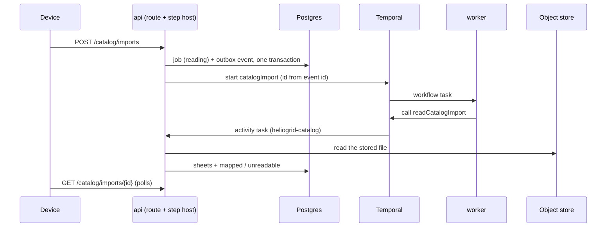

##### Package changes
- **domain** — `catalog/import.ts` gains `CATALOG_IMPORT_STATES` (`reading · unreadable · mapped · matching · previewed · running · completed` — the whole machine now, one enum), `CATALOG_IMPORT_ENTRY_POINTS` (`onboarding · settings · in_flow`), `CATALOG_IMPORT_UNREADABLE_REASONS` (`cannot_open · too_large_unpacked · no_rows · not_read`), `CATALOG_IMPORT_UNPACKED_LIMIT_BYTES`. Exported from the client-safe index.
- **contracts** — `catalog-import.ts` (three routes, wire schemas derived from the tuples); `workflows/catalog-import.ts` (`catalogImportWorkflow`, `CatalogImportActivities`); `TASK_QUEUES` + `heliogrid-catalog`; `ports/object-store.ts` `read`. Direction unchanged: contracts → domain.
- **db** — `schema/catalog-import.ts`; three pgEnums mirrored from domain.
- **api** — catalog module: import controller, service, repository, activities registration, `internal/spreadsheet.ts`; file module exports `FileService` through `file.public.ts`; both store adapters gain `read`. New dependency `exceljs` (api only, `pnpm add`).
- **worker** — `modules/catalog/` (workflow + registration with no activities), one line each in `worker.module.ts` and `worker.workflows.ts`.
- **Law 12 enrolment:** the three pgEnums → `enum-parity` (its hand-held list); `catalog_import_job` → `table-tenancy-scan` and `tenancy-rls`, which read every table from the database; the three routes → `RouteAccessMap` (typecheck) and the OpenAPI freshness check; the queue and workflow names → the `satisfies` name checks in `catalog.public.ts`. No new error code; no new brand or token.

##### Data and schema changes
- **Migration `0019_catalog_import.sql`** (started with `pnpm db:migration:new`): table `catalog_import_job` — `id uuid` pk (uuidv7) · `tenant_id` fk · `file_id` fk `file` · `entry_point catalog_import_entry_point` · `status catalog_import_status` · `unreadable_reason catalog_import_unreadable_reason` null · `file_name text` (CHECK 1–255) · `saved_at timestamptz` null · `sheets jsonb` null (`[{ name, rowCount, columnCount, topRows: string[][] }]`) · `started_by` fk `user_account` · `created_at`, `updated_at` · the creation-key columns. CHECK: `unreadable_reason` is set exactly when `status = 'unreadable'`.
- **Indexes:** `(tenant_id, created_at desc)` — the list; unique `(tenant_id, creation_key)` where set.
- **Tenancy:** all four always — `tenant_id`, the composite index leading with it, fail-closed RLS for `app_user`, grants SELECT, INSERT, UPDATE (a job moves through its states; no DELETE — nothing purges, the task).
- **Readers, both ways:** new table and new enums; no older code reads them, and no client calls these routes until `T-M01-017` ships. No backfill; rollback is the previous release, the table left unread. Expand only.

##### File and folder changes
| action | path | purpose | placement reason |
|---|---|---|---|
| modify | `packages/domain/src/catalog/import.ts` | states, entry points, unreadable reasons, unpacked limit | §4.3 vocabulary |
| modify | `packages/domain/src/catalog/index.ts` | exports | §4.3 |
| add | `packages/db/migrations/0019_catalog_import.sql` | the job table | §4.2 |
| add | `packages/db/src/schema/catalog-import.ts` | its mirror and pgEnums | §4.2 |
| modify | `packages/db/src/schema/index.ts` | export | §4.2 |
| add | `packages/contracts/src/catalog-import.ts` | three routes and wire | §4.1 |
| modify | `packages/contracts/src/index.ts` | export | §4.1 |
| add | `packages/contracts/src/workflows/catalog-import.ts` | workflow + step signatures | §4.1 workflow messages |
| modify | `packages/contracts/src/workflows/index.ts` | export | §4.1 |
| modify | `packages/contracts/src/workflows/registry.ts` | `heliogrid-catalog` | §4.1 |
| modify | `packages/contracts/src/workflows/outbox.ts` | `catalogImport` in, healthcheck out | §4.1 |
| modify | `packages/contracts/src/ports/object-store.ts` | `read` | the port's owner |
| modify | `packages/contracts/openapi/openapi.json` | regenerated | §4.1 |
| modify | `apps/api/src/modules/file/internal/object-store.s3.ts` | `read` | the adapter |
| modify | `apps/api/src/modules/file/internal/object-store.memory.ts` | `read` | the adapter |
| modify | `apps/api/src/modules/file/file.service.ts` | `readStored` | the file module's one door |
| modify | `apps/api/src/modules/file/file.module.ts` | export `FileService` | Nest wiring |
| modify | `apps/api/src/modules/file/file.public.ts` | export `FileModule`'s service | module boundary |
| add | `apps/api/src/modules/catalog/catalog.import.controller.ts` | the three routes | catalog module (Plan, `T-M01-031` decision 2) |
| add | `apps/api/src/modules/catalog/catalog.import.service.ts` | start, list, read | catalog module |
| add | `apps/api/src/modules/catalog/catalog.import.repository.ts` | job rows + outbox write | catalog module |
| add | `apps/api/src/modules/catalog/catalog.import.activities.ts` | `readCatalogImport`, `endCatalogImportRead`, registration | catalog module |
| add | `apps/api/src/modules/catalog/internal/spreadsheet.ts` | `exceljs` reader + unpacked-size check | module internal |
| modify | `apps/api/src/modules/catalog/catalog.module.ts` | wiring, `FileModule` import | Nest wiring |
| modify | `apps/api/package.json` · `pnpm-lock.yaml` | `exceljs` (generated) | `pnpm add` |
| add | `apps/worker/src/modules/catalog/catalog.workflows.ts` | `catalogImport` (phase `read`) | §2 worker, one folder per area |
| add | `apps/worker/src/modules/catalog/catalog.public.ts` | registration, name checks | §2 worker |
| modify | `apps/worker/src/worker.module.ts` · `src/worker.workflows.ts` | one line each | §2 worker extension point |
| add | `apps/api/tests/catalog/import-handoff.test.ts` | AC-3 (import), AC-8 (start, read) | testing rules |
| add | `apps/api/tests/catalog/spreadsheet.test.ts` | the reader on CSV, `.xlsx`, broken, packed-large files | testing rules |
| modify | `apps/api/tests/orchestration/outbox-handoff.test.ts` | onto `catalogImport` | part b's note |
| modify | `tests/invariants/src/enum-parity.ts` | the three pgEnums against their contract schemas | Law 12 |
| modify | `infra/temporal/README.md` | `heliogrid-catalog` queue | Law 8 |
| modify | `docs/tasks/M01-onboarding.md` | this RFC, Parts, `T-M01-017`'s supplier line and migration number | Law 8 |
| add *(built, not planned)* | `apps/api/tests/catalog/import-read.test.ts` | the read step's proofs, split from `import-handoff.test.ts` | the 300-line file rule |
| add *(built, not planned)* | `apps/api/tests/support/temporal.ts` | the recording Temporal client, moved out of `outbox-handoff.test.ts` so both tests share one copy | zero duplication |
| modify *(built, not planned)* | `apps/api/tests/catalog/support.ts` | the import's service, a stored price list, a start body | testing rules |
| modify *(built, not planned)* | `apps/api/tests/support/tenant-tables.ts` | the job table in the fixture's cleanup, before `file` | the fixture's FK order |
| modify *(built, not planned)* | `apps/api/tests/files/complete.test.ts` | its hand-built store gains `read` | the port grew |
| modify *(built, not planned)* | `docs/engineering/02-system-architecture.md` | the file-transfer rule now names the one whole-file read — this is where the sentence lives, not `architecture.md` | Law 8 |
| modify *(built, not planned)* | `docs/tasks/deferred.md` | D125, the accepted read block | the owner's ruling |
| modify *(built, not planned)* | `apps/api/src/common/temporal/temporal.activity-host.ts` | `stepCannotSucceed` — a step whose job is gone fails for good, so its workflow ends (review finding) | the one Temporal seam (`temporal-client-fenced`) |
| modify *(built, not planned)* | `docs/tasks/F-platform.md` | the file contract's sentence on bytes through the api names the bounded whole-file read | Law 8 |
| modify *(built, not planned)* | `docs/tasks/README.md` | the size estimate counts test lines on their own line — the rule this part's twice-missed estimate called for (owner, 2026-10-07) | every mistake leaves a record |

##### API and contract changes
| route / message | method | request → response | errors | access |
|---|---|---|---|---|
| `/catalog/imports` | POST | `{ fileId, entryPoint, fileName, savedAt \| null }` + `Idempotency-Key` → 201 job | 400 · 403 · 404 · 409 `FILE_NOT_UPLOADED` · `IDEMPOTENCY_KEY_REUSED` | `onboarding.manage_catalog` outright |
| `/catalog/imports` | GET | `page`, `limit` → `{ items: [{ id, status, entryPoint, fileName, savedAt, createdAt, startedBy }], totalCount }` newest first | 403 | same |
| `/catalog/imports/{id}` | GET | → `{ id, status, entryPoint, unreadableReason, fileName, savedAt, file: { id, contentType, byteSize }, sheets: [{ name, rowCount, columnCount, topRows }] \| null, startedBy, createdAt }` | 403 · 404 another company's | same |
| `catalogImport` | workflow | `{ eventId, tenantId, jobId, phase: 'read' }` → `{ status }` | — | ids only; queue `heliogrid-catalog` |
| `readCatalogImport` · `endCatalogImportRead` | activities (api) | `{ tenantId, jobId }` → `{ status }` | retried by Temporal | the tenant from the input, pinned per transaction |
| `ObjectStore.read` | port | `key` → bytes | throws on outage | api internal |

Tenancy: no `tenantId` on the wire (invariant `tenant-id-on-the-wire`); every read carries its tenant predicate. Compatibility: new routes and fields; `extensibleEnum` on every vocabulary a client reads, so part d's and e's states parse on an older client.

##### Risks and rollout
| risk | mitigation |
|---|---|
| A packed `.xlsx` exhausts the serving api's memory | decision 2 — the unpacked sum is checked before `exceljs` opens it; `spreadsheet.test.ts` plants a file over the bound |
| Parsing a 2 MB workbook blocks the api's event loop | measured in build: a 2 MB `.xlsx` blocks it for up to 377 ms in one stretch, 0.8 MB for 150 ms, a 400-row list under 10 ms. Past the 250 ms this row set, the owner accepted it (2026-10-06): large lists are rare and it is once per import. `deferred.md` D125 holds the worker-thread move |
| A job stuck in `reading` | decision 5 — bounded retries, then `endCatalogImportRead` |
| A retried read writes twice | the write is conditioned on `status = 'reading'`; the handoff test retries it |
| An event for another tenant | `recordOutboxEvent` refuses an input whose `tenantId` is not the transaction's (part b) |
| Release roll | deploy the worker first (it knows `catalogImport`), then the api; an api ahead of its worker leaves the workflow task queued, nothing lost (Plan, rollout safety) |

##### Acceptance criteria and proof
Part c's lines of the task's AC (Plan `#### Acceptance criteria`), verbatim:
- **AC-3** — Given a run is started, when the API commits the status change, then the outbox row is in the same transaction and a dispatcher that retries after a crash starts exactly one workflow. *(Part c: the import's start.)*
- **AC-6** — Given migrations 0018 and 0019, when the tenancy scan runs, then `orchestration_outbox`, `catalog_import_job` and `catalog_import_row` pass as tenant-scoped. *(Part c: `catalog_import_job`; `catalog_import_row` moves to part d's migration 0020.)*
- **AC-8** (extension) — Given a Finance session, when it starts, fixes or runs an import, then each is refused; given another company's job id, then it reads 404. *(Part c: the start and the read.)*
- **AC-10** (extension, new) — Given a stored CSV or `.xlsx` price list, when an import is started, then the job reaches `mapped` with each sheet's name, row and column counts and its top rows as the file wrote them; given a file that cannot be opened, holds no rows, or unpacks past the bound, then it reaches `unreadable` with that reason.

| AC/row | owner | tier | surface | action → expected | proof |
|---|---|---|---|---|---|
| AC-3 | main-dev | required | api tests | the commit lost after the job, and after the event → no job, no event, no start; start twice with one key → one job, one event, one workflow id; the key sent with another body → `IDEMPOTENCY_KEY_REUSED`, nothing written; the list newest first, paged, counted whole; planted red: the event written in its own transaction after the job's — *leaves neither … when the commit after its event is lost* failed by name | `import-handoff.test.ts` |
| AC-3 | main-dev | required | api tests | the outbox test moved onto `catalogImport` still passes | `outbox-handoff.test.ts` |
| AC-6 | evaluator | required | invariants | `table-tenancy-scan`, `tenancy-rls`, `enum-parity`, `schema-parity` over 0019 | `pnpm check:all` |
| AC-8 | main-dev | required | api tests | Finance's start → 403, no row; another company reads the job → 404; planted red: `admitWrite` removed from the start — *refuses Finance the start and writes nothing* failed by name | `import-handoff.test.ts` |
| AC-8 | qa-api | required | api `8084` | `…906` (Finance) start → 403; `…905` reads `…904`'s job → 404 | live |
| AC-10 | main-dev | required | api tests | reader: CSV with `1,32,000` and Hindi headers kept as text; `.xlsx` two sheets; broken bytes → `cannot_open`; empty → `no_rows`; packed past bound → `too_large_unpacked`; a crafted end record — count 0 over a packed entry (`too_large_unpacked`), a directory ending short of the end record, a count over the records, any ZIP64 marker (`not_a_zip`); an unclosed CSV quote → `cannot_open`; a top row ends at its last filled cell. Planted reds, each failed by name: the bound removed (*one byte past it*, *stops a packed zip at the bound*); the walk by stated count (*measures a packed entry whatever count the end record states*); no offset-plus-size check (*refuses a directory that ends short …*); no count check (*refuses a count of two over one record …*); no ZIP64 refusal (*refuses an end record that asks for ZIP64 through its disk number* and two more); no CSV catch (*cannot open a CSV whose quote is never closed …*) | `spreadsheet.test.ts` |
| AC-10 | main-dev | required | api tests | the read step over a stored CSV and `.xlsx` → `mapped` and sheets; run twice → one write; an `.xlsx` it cannot open → `cannot_open`; a store down → throws for the retry, then `not_read`; a step whose job is gone → fails non-retryable, read and end alike | `import-read.test.ts` |
| AC-10 | qa-api | required | api `8084` + temporal admin | `…904` uploads a CSV and an `.xlsx`, starts each, polls to `mapped`, reads sheets; a renamed broken `.xlsx` reaches `unreadable`; `temporal workflow show` names one completed `catalogImport` per start | live |
| all | ci | required | `quality` | the PR's run passes | CI |
| — | qa-web · qa-ios · qa-android | not_applicable | — | an engine part; the wizard is `T-M01-017` | — |

##### Delivery size
- **Planned:** about 38 changed files and about 950 authored lines. **Built:** 43 changed files (2 generated: `openapi.json` +1,044, `pnpm-lock.yaml` +522) and about 1,900 authored lines — code about 1,000, tests about 700, this RFC about 200. The estimate counted the code and left out the tests. Approval was void at the build's end; the owner rules on the size below.
- **Size ruling (2026-10-07):** the owner approved option A — one part at its built size, one PR.
- **After review (2026-10-07):** 45 changed files and about 2,360 authored lines — code about 1,220, tests about 920, docs about 220. The review's fixes added about 460: the zip measure read the way the parser reads it (record walk, offset-plus-size, ZIP64 and cut-off end records refused), an unclosed CSV quote read as `cannot_open`, a gone job failing for good, the list's own columns, one file-name bound, and the tests and planted reds for each. That is 24% over the approved 1,900, so the approval is void again; the owner rules once more — **A** keep one part at this size, or **B** split as above (c1 reader about 650 lines, c2 the rest about 1,700).
- **Size ruling (after review, 2026-10-07):** the owner approved option A again — one part at about 2,360 authored lines and 45 files, one PR.
- **Parts** (approved 2026-10-06) —

| part | delivers | AC | depends on | status |
|---|---|---|---|---|
| a | the import rules and spreadsheets in the one file table | AC-4, AC-5, AC-7 | `T-M01-031` | shipped |
| b | the handoff — outbox, dispatcher, sweep, the API's activity host | AC-3, AC-6 (outbox) | a | shipped |
| c | the job starts and reads its file — start, list, read, the read step | AC-3 (start), AC-6 (job), AC-8 (start, read), AC-10 | b | shipped |
| d | the mapping, the matching pass and the preview — mapping, row table 0020, row fixes, preview rows; a new mapping during the pass supersedes it (the board's "stops the work", no cancel route) | AC-1 (preview), AC-5, AC-6 (rows), AC-8 (fix) | c | open |
| e | the run and the report | AC-1 (run), AC-2, AC-3 (run), AC-8 (run), AC-9 | d | open |

- **Over both targets** — 43 files against about 30, about 1,900 authored lines against 1,000. Two ways on:
  - **A · one part at its built size (recommended).** Everything is built, and every proof row is green on `heliogrid_test`. The start without the read leaves every job in `reading` with nothing to show, so the two are one usable step for the wizard; only the reader (`spreadsheet.ts` and its test, about 350 lines) stands apart. One PR.
  - **B · split into two stacked PRs.** c1 — the store's `read`, `readStored` and the reader with its test (about 15 files, about 450 lines); c2 — the job, the routes, the workflow and both handoff tests (about 28 files, about 1,450 lines — still over the line target). Same code; two reviews and two CI runs.
- **Order:** as in Proposal.
- **Checklist (part c)** — [x] domain vocabularies · [x] migration 0019 and schema · [x] contracts and workflow · [x] store `read` and `readStored` · [x] job repository, service, routes · [x] reader and read step · [x] worker workflow · [x] outbox list and test move · [x] docs · [x] AC-3 (main-dev) · [ ] AC-6 (evaluator) · [x] AC-8 (main-dev, qa-api) · [x] AC-10 (main-dev, qa-api) · [x] review (clean after three passes) · [ ] CI

#### Part d · RFC
Replaces the legacy `#### Plan`'s part d (its `Where` rows d and its checklist line), which stays above as history. The task's shared facts — the Plan's decisions 1–21 and the AC list — stand unless a line below changes one. Branch `feat/T-M01-030d`, stacked on part c (PR #241, open) by the owner's word.

##### Title
T-M01-030d — the import maps, matches and previews: a confirmed column mapping becomes a preview of every row with its three counts, and a broken row is fixed in place.

##### Description
- **Who gains:** the owner in the import wizard (`SCR-M01-17`, steps 2 and 3). After this part, confirming the columns runs the matching pass in the background; the preview then shows every row, the counts `N rows · M match · K new · E need attention`, the file's price beside the catalog's price now, and a broken row is fixed by typing its value, left out, or — on a spec conflict — answered.
- **Problem solved:** the second workflow phase (`match`) on part b's handoff; the per-row record (`catalog_import_row`) the run (part f) applies and the report keeps; a re-match after each fix that stays exact without matching the whole file again.
- **Cites:** the task header (`M01-41`, §M01.4 behaviour detail and edge cases); the brief `docs/ux/briefs/SCR-M01-17-catalog-import-wizard.md` (decisions 2, 3, 4; states preview-three-counts, needs-attention-inline-fix); the board's decisions record as read on 2026-10-06 and summarised in the Plan's UX readiness — decisions 7, 9, 24, 25, 30, 31.

##### Goals
- `PUT /catalog/imports/{id}/mapping` stores the sheet, the header row and each column's field, moves the job to `matching` and hands phase `match` to `catalogImport` in one transaction.
- The match step reads the chosen sheet whole, matches every filled row, and leaves the job `previewed` with one `catalog_import_row` per row.
- A second mapping sent while the pass runs supersedes it: the first pass writes nothing, the job ends `previewed` with the second mapping's rows.
- `GET /catalog/imports/{id}` adds the mapping and the counts; `GET /catalog/imports/{id}/rows` pages the rows, filterable by outcome.
- `PUT /catalog/imports/{id}/rows/{rowNumber}` fixes one row; its outcome and the counts move in the same transaction.
- No platform item changes, whatever the file or the answers say (AC-5).

##### Non-goals
- The run, its progress and the kept report (part f); the row fix (part e).
- A cancel route: a new mapping supersedes the pass (Parts table, decided at part c).
- The wizard screen and its three entry points (`T-M01-017`).
- Any change to the read step, the file rules or the column guess (parts a and c).

##### Readiness and dependencies
- Landed (on this stack): part a — the match rule `matchImportRows`, the cell readers, `guessColumns`/`guessHeaderRow`, the outcome, reason and answer tuples; part b — outbox, dispatcher, sweep, the api's step host; part c — the job (0019), the read step, `readStored`, the `exceljs` reader, `catalogImport` phase `read`. `T-M01-027` — the market slice union, `ratesInForce`, `CatalogService.scopeOf`.
- Design: an engine part, no drawing of its own. `SCR-M01-17` holds its link; its record's facts are in the Plan's UX readiness.
- Stack: Postgres, object store, Temporal run (pre_existing); `heliogrid_test` at 0019. The api and worker start through `.claude/launch.json` for the live check.
- Database: 0020 lands on `heliogrid_test` only. `heliogrid_dev` stays at its level; PR #241 merges before this part's PR, and this branch then rebases onto `origin/main` (one local database serves every branch; no other branch is open on a later migration).
- Blockers: none. Two owner rulings ride on this approval — R1 (Proposal, decision 4) and the size ruling (Delivery size).

##### Proposal
**Flow.** The wizard reads the job's `sheets`, guesses the header row and columns on the device (part c decision 3), the person confirms → `PUT …/mapping { sheet, headerRow, columns }` → the service checks the job is this company's and in `mapped`, `matching` or `previewed`, and the mapping fits the sheet → one tenant transaction stores the mapping, adds 1 to `mapping_revision`, sets `matching` and writes the outbox event `{ eventId, tenantId, jobId, phase: 'match' }` → after the commit the dispatcher starts `catalogImport` → the worker calls `matchCatalogImport` → the api's step reads the job, reads the stored file again and the chosen sheet whole, turns each filled row below the header into its mapped cells, reads the catalog entries those rows name in ONE slice query, runs `matchImportRows`, and in one transaction — the job locked, its revision still the one read — replaces the job's rows and sets `previewed` → the wizard polls `GET …/{id}` (counts) and pages `GET …/{id}/rows` → a fix `PUT …/rows/{n}` re-matches that row and every row naming the same product, in one transaction.

**Key decisions** (one reason each):
1. **A mapping is `{ sheet, headerRow, columns }`.** `sheet` indexes `sheets`; `headerRow` indexes that sheet's `topRows` (so sheet row `headerRow + 1`); `columns[i]` is the field of column `i + 1` or null. Brand, model and rate are each placed once; no field twice — the contract's schema refuses both (400). The rule that it fits the sheet (`sheet` in range, `headerRow` within `topRows`, `columns` no longer than `columnCount`) is domain's `importMappingProblem`, client-safe, so the wizard disables confirm on the same rule the service refuses with (422 `DOMAIN_RULE_VIOLATION`) — Law 11. `kind` is not required: an unknown row then asks for its kind in the grid.
2. **The step reads the file again; the job never stores all rows of the file.** Part c stores only the top rows (decision 3 there). Re-reading costs one more parse per confirmed mapping (up to the 377 ms block D125 already accepts). The row numbers are the sheet's own (what the person sees in Excel); an all-blank row is skipped and not counted.
3. **A new mapping supersedes the pass by revision, not by cancel.** The step writes only when the job is `matching` and `mapping_revision` equals the revision it read; a stale pass writes nothing and answers where the job is. A retried step writes once (rows are replaced in the same transaction as the state). A mapping equal to the stored one while `matching` or `previewed` answers the job as it stands and writes no event. Past every retry `endCatalogImportMatch` puts the job back to `mapped` (same revision check): the wizard reads `mapped` after `matching` and offers to confirm again.
4. **R1 — the matching pass shows no counted progress (owner ruling asked).** The board's decision 24 draws "256 of 412 rows" during the pass. The pass is one parse plus in-memory matching, under a second for hundreds of rows, written in one transaction: a counter would jump from 0 to done. Counting it needs chunked transactions, a progress column and supersede handling between chunks (about 120 more lines and one more column). **Recommended — A:** no counted progress for the pass; the wizard shows a short wait, and the run (part f) carries the counted progress (`M01-41` "visible progress" is the import's run); the owner edits decision 24 in Claude Design. **B:** build the counter as drawn.
5. **The row table holds the pass's verdict, not derived numbers.** Each row keeps its file cells, the person's fix, left-out and answer, and the verdict — outcome, attention (reasons and fields), and the matched item's id. The counts are read with one `count(*) … group by outcome` over the job's rows (no counts column: `.claude/protections.md`, no derived value stored). The file price is read from the cells at read time (`readImportPrice`, server-only, `F4-04`); the catalog price now from `ratesInForce` for the page's targets (board decision 7). The run (part f) applies what the preview recorded.
6. **One query finds the candidates.** The slice union (`catalog.slice.repository.ts` `unionOf`) gains an `identities` condition — the file's distinct `(brand, model)` pairs, trimmed — so the market's platform items and the tenant's own SKUs come back in one statement with their specs. Archived and hidden items match too: a second SKU for a product the tenant already has is the defect `M01-41` forbids. Lookup on the platform natural key `(component_kind, brand, model)` with every kind listed; on own items through the tenant index.
7. **A fix re-matches its product group, exactly.** `PUT …/rows/{n}` takes `{ cells }` (merged into the row's fix, field by field; any import field — a spec field the file lacks is typed here), `{ leaveOut: true | false }`, or `{ answer }`. In one transaction: the job row locked (`for update` — two fixers queue), the rows naming the fixed row's old or new `(brand, model)` read in row order, `matchImportRows` over them against their candidates, changed verdicts written. Exact because `repeated_in_file` and `several_matches` depend only on rows and items of the same product. Allowed only while `previewed` (409 `CONFLICT` otherwise).
8. **Superseded rows are deleted.** A new mapping's pass replaces the job's rows, so `app_user` gets DELETE on `catalog_import_row`. "Nothing purges" (the task) holds for the report: the service deletes rows only inside the pass, which runs only before the run. Kept simpler than a revision column on every row that every read filters.
9. **The match step returns `{ status }`**, like the read; the workflow's `match` case mirrors `read` (bounded retries, then the end step).
10. **Every new route is `onboarding.manage_catalog` held outright** (`admitWrite`, part c decision 9); another company's job or row is 404.
11. **Rows have their own paged route — a change to the task's contract.** The task puts the preview rows inside `GET …/{id}`, which the wizard polls. Hundreds of rows on every poll is waste; a paged `GET …/{id}/rows?outcome=` serves the grid, and the job read carries only the counts. Cost: one route and one query.

**Order.** Domain mapping rule → migration 0020 and schema → contracts (routes, phase, steps) → slice `identities` → sheet reader → rows repository → mapping write → match step → fix → reads → worker phase → docs.

**Refusals.** 400 a body outside the schema (brand, model or rate unplaced, a field twice) · 403 a role without the outright grant · 404 a job or row not this company's · 409 `CONFLICT` a mapping in `reading`, `unreadable`, `running` or `completed`, a fix outside `previewed` · 422 `DOMAIN_RULE_VIOLATION` a mapping that does not fit its sheet.

**Twin screen.** None: an engine part. Both platforms' wizard is `T-M01-017`.

##### Architecture diagram
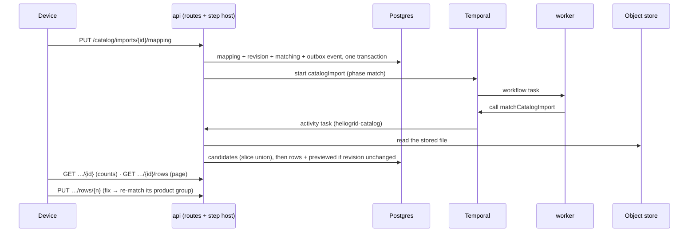

##### Package changes
- **domain** — new `catalog/import-mapping.ts` (client-safe): `CatalogImportMapping`, `importMappingProblem(mapping, sheets)`, `mappedRows(sheetRows, mapping)` (row number + cells, blank rows skipped). Exported from the client-safe index.
- **contracts** — `catalog-import.ts`: three routes (mapping, rows, fix), the mapping, row and fix schemas, `mapping` and `counts` on the job read; `workflows/catalog-import.ts`: phase `match`, steps `matchCatalogImport`, `endCatalogImportMatch`. Direction unchanged: contracts → domain.
- **db** — `schema/catalog-import.ts`: two job columns, the row table, two pgEnums mirrored from domain.
- **api** — catalog module: a preview service and a rows repository (new files — the 300-line rule), the mapping write on the job repository, the candidates condition on the slice union, `readSheetRows` in the reader, two steps registered, `formats` on `CatalogService.scopeOf`'s scope.
- **worker** — `catalog.workflows.ts`: the `match` case.
- **Law 12 enrolment:** pgEnums `catalog_import_row_outcome`, `catalog_import_conflict_answer` → `enum-parity`; `catalog_import_row` → `table-tenancy-scan`, `tenancy-rls` (read from the database); three routes → `RouteAccessMap` (typecheck) and OpenAPI freshness; the step names → the `satisfies` checks in `catalog.public.ts`. **Said out loud:** the attention reasons live inside the `attention` jsonb, held by no pgEnum — the contract's `z.enum` parses every stored reason on every read, so an unknown one fails loudly rather than renders. No new error code, brand or token.

##### Data and schema changes
- **Migration `0020_catalog_import_rows.sql`** (started with `pnpm db:migration:new`):
  - `catalog_import_job` + `mapping jsonb` null · `mapping_revision integer not null default 0` · CHECK `catalog_import_job_matched_has_mapping`: status in (`matching`, `previewed`, `running`, `completed`) implies `mapping is not null`.
  - New `catalog_import_row`: `id uuid` pk (uuidv7) · `tenant_id` fk · `job_id` fk `catalog_import_job` · `row_number integer` (CHECK ≥ 1) · `cells jsonb` (the mapped cells as the file wrote them) · `fix jsonb` (the typed cells, `{}` when none) · `left_out boolean` · `answer catalog_import_conflict_answer` null · `outcome catalog_import_row_outcome` · `attention jsonb` (`[{ reason, fields }]`, empty unless `needs_attention`) · `catalog_item_id` fk null · `tenant_catalog_item_id` fk null · `created_at`, `updated_at`. CHECK: at most one item id; `price_override` has `catalog_item_id`, `own_item_price` has `tenant_catalog_item_id`, every other outcome has neither.
  - Indexes: unique `(tenant_id, job_id, row_number)` — the grid's order and the fix's lookup; `(tenant_id, job_id, outcome, row_number)` — the filtered page and the counts.
  - Tenancy: all four always; fail-closed RLS for `app_user`; grants SELECT, INSERT, UPDATE, DELETE (decision 8).
- **Readers, both ways:** the part c api selects named job columns, so it reads a job with a mapping unchanged; it never reads the row table. A part c worker handed phase `match` would finish without calling a step — so the worker deploys first (it knows `match`), then the api (Plan, rollout safety). Expand only; no backfill (no client has called these routes); rollback is the previous release with the columns and table left unread.

##### File and folder changes
| action | path | purpose | placement reason |
|---|---|---|---|
| add | `packages/domain/src/catalog/import-mapping.ts` | mapping type, fit rule, mapped rows | §4.3 business logic, client-safe |
| modify | `packages/domain/src/catalog/index.ts` | exports | §4.3 |
| add | `packages/db/migrations/0020_catalog_import_rows.sql` | job columns, row table | §4.2 |
| modify | `packages/db/src/schema/catalog-import.ts` | their mirror, two pgEnums | §4.2 |
| modify | `packages/contracts/src/catalog-import.ts` | three routes, schemas, job read additions | §4.1 |
| modify | `packages/contracts/src/workflows/catalog-import.ts` | phase `match`, two steps | §4.1 workflow messages |
| modify | `packages/contracts/openapi/openapi.json` | regenerated | §4.1 (generated) |
| modify | `apps/api/src/modules/catalog/catalog.import.controller.ts` | three routes | catalog module |
| add | `apps/api/src/modules/catalog/catalog.import-preview.service.ts` | mapping, match step, end step, fix, rows read | catalog module; the import service stays under 300 lines |
| modify | `apps/api/src/modules/catalog/catalog.import.service.ts` | the job read gains mapping and counts | catalog module |
| modify | `apps/api/src/modules/catalog/catalog.import.repository.ts` | mapping write + outbox event; job columns | catalog module |
| add | `apps/api/src/modules/catalog/catalog.import-rows.repository.ts` | replace, page, counts, product group, verdict update | catalog module |
| modify | `apps/api/src/modules/catalog/catalog.slice.repository.ts` | `identities` condition; `unionOf` and `completed` exported to the rows repository | the one slice query (Law 5) |
| modify | `apps/api/src/modules/catalog/catalog.service.ts` | `formats` on the scope | the one scope read |
| modify | `apps/api/src/modules/catalog/internal/spreadsheet.ts` | `readSheetRows` | the one reader |
| modify | `apps/api/src/modules/catalog/catalog.import.activities.ts` | two steps registered | catalog module |
| modify | `apps/api/src/modules/catalog/catalog.module.ts` | wiring | Nest wiring |
| modify | `apps/worker/src/modules/catalog/catalog.workflows.ts` | the `match` case | §2 worker |
| add | `packages/domain/tests/catalog/import-mapping.test.ts` | the fit rule, mapped rows | testing rules |
| add | `apps/api/tests/catalog/import-preview.test.ts` | mapping, pass, counts, supersede, AC-5 | testing rules |
| add | `apps/api/tests/catalog/import-fix.test.ts` | fixes, product group, access | testing rules |
| modify | `apps/api/tests/catalog/spreadsheet.test.ts` | `readSheetRows` | testing rules |
| modify | `apps/api/tests/catalog/support.ts` | a mapped job, a priced catalog | testing rules |
| modify | `apps/api/tests/support/tenant-tables.ts` | the row table in the cleanup, before the job | the fixture's FK order |
| modify | `tests/invariants/src/enum-parity.ts` | two pgEnums against their contract schemas | Law 12 |
| modify | `docs/tasks/M01-onboarding.md` | this RFC, Parts; `T-M01-017`'s lines for R1 and the rows route | Law 8 |

##### API and contract changes
| route / message | method | request → response | errors | access |
|---|---|---|---|---|
| `/catalog/imports/{id}/mapping` | PUT | `{ sheet, headerRow, columns: (field \| null)[] }` → 200 job | 400 · 403 · 404 · 409 `CONFLICT` · 422 `DOMAIN_RULE_VIOLATION` | `onboarding.manage_catalog` outright |
| `/catalog/imports/{id}` | GET | adds `mapping: { sheet, headerRow, columns } \| null`, `counts: { rows, matched, newItems, needsAttention, leftOut } \| null` (null until `previewed`) | unchanged | same |
| `/catalog/imports/{id}/rows` | GET | `page`, `limit`, `outcome?` → `{ items: [{ rowNumber, cells, fix, leftOut, answer, outcome, attention, match: { source, id } \| null, filePrice \| null, catalogPrice: { amount, currency, effectiveOn } \| null }], totalCount }` by row number | 403 · 404 · 409 `CONFLICT` before `previewed` | same |
| `/catalog/imports/{id}/rows/{rowNumber}` | PUT | `{ cells }` \| `{ leaveOut }` \| `{ answer }` → 200 the row (the job's counts read again by the device) | 400 · 403 · 404 · 409 `CONFLICT` | same |
| `catalogImport` | workflow | phase gains `match` | — | ids only |
| `matchCatalogImport` · `endCatalogImportMatch` | activities (api) | `{ tenantId, jobId }` → `{ status }` | retried by Temporal; a gone job fails for good | the tenant from the input |

Tenancy: no `tenantId` on the wire; every read and write carries its tenant predicate. Compatibility: added routes and fields; `extensibleEnum` on every vocabulary a client reads (outcome, reason, answer, field), so a later value parses on an older client.

##### Risks and rollout
| risk | mitigation |
|---|---|
| A stale pass overwrites a newer mapping's rows | decision 3 — the write is conditioned on the revision read, inside the job lock; `import-preview.test.ts` plants a second mapping mid-pass |
| Two fixers race on one product group | decision 7 — the job row is locked for the fix's transaction |
| A large sheet (a 2 MB CSV can hold tens of thousands of rows) | the pass is one parse plus a linear match; rows insert in batches inside one transaction; a fix touches only its product group. The read blocks the event loop as D125 records, now once per mapping too — D125's worker-thread move covers both |
| An unknown attention reason stored | parsed by the contract's `z.enum` on every read (Package changes) |
| Release roll | worker before api (Data and schema changes); an api ahead of its worker leaves the `match` task queued, nothing lost |

##### Acceptance criteria and proof
Part d's lines of the task's AC (Plan `#### Acceptance criteria`), verbatim:
- **AC-1** — Given an import file with platform-matching rows, unknown rows and broken rows, when the preview renders, then it states the three counts, matched rows become price overrides and unknown rows tenant SKUs on import, and broken rows are fixable inline; the import runs async with progress and produces a per-row report (M01-41). *(Part d: the counts; the inline fix is part e's; the run, progress and report are part f's.)*
- **AC-5** — Given a row matching a platform product at a different spec, when the matching pass runs, then it is a needs-attention row and no platform spec changes (§M01.4 edge cases).
- **AC-6** — Given migrations 0018 and 0019, when the tenancy scan runs, then `orchestration_outbox`, `catalog_import_job` and `catalog_import_row` pass as tenant-scoped. *(Part d: `catalog_import_row`, in migration 0020.)*
- **AC-8** (extension) — Given a Finance session, when it starts, fixes or runs an import, then each is refused; given another company's job id, then it reads 404. *(Part d: the mapping, the rows read and the fix.)*
- **AC-11** (extension, new) — Given a read job, when a mapping that fits its sheet is confirmed, then the job reaches `previewed` with one row per filled sheet row below the header; given a mapping that does not fit, or a job not in `mapped`, `matching` or `previewed`, then it is refused and nothing changes; given a second mapping while the pass runs, then the job ends `previewed` with the second mapping's rows only.

| AC/row | owner | tier | surface | action → expected | proof |
|---|---|---|---|---|---|
| AC-1 | main-dev | required | api tests | one CSV with platform, own-SKU, unknown and broken rows → mapping → step → counts `rows/matched/newItems/needsAttention`; `filePrice` and `catalogPrice` on a page, narrowed by outcome (the fix's rows are part e's) | `import-preview.test.ts` |
| AC-1 | qa-api | required | api `8084` + temporal admin | `…904` starts an import, polls `mapped`, sends the mapping, polls `previewed`, reads counts and a filtered page, `temporal workflow show` names one completed `catalogImport` per handoff (read, match) | live |
| AC-5 | main-dev | required | api tests | a platform match at another spec → `needs_attention` (`spec_conflict`, its fields); the platform item's row byte-identical before and after the pass (the answer is part e's) | `import-preview.test.ts` |
| AC-6 | evaluator | required | invariants | `table-tenancy-scan`, `tenancy-rls`, `enum-parity`, `schema-parity` over 0020 | `pnpm check:all` |
| AC-8 | main-dev | required | api tests | Finance's mapping and rows read → 403, nothing written; another company's job → 404 on both; planted red: `admitWrite` removed from the mapping — *refuses Finance the mapping and changes nothing* failed by name (the fix's rows are part e's) | `import-map.test.ts` |
| AC-8 | qa-api | required | api `8084` | `…906` (Finance) mapping and rows → 403; `…905` reads `…904`'s rows and maps its job → 404 | live |
| AC-11 | main-dev | required | domain | the fit rule: sheet, header row, column count; mapped rows skip blanks and keep sheet row numbers | `import-mapping.test.ts` |
| AC-11 | main-dev | required | api tests | a mapping outside the sheet → 422; a mapping on `reading` → 409; the same mapping twice → one event; a second mapping between the first's read and write → the first writes nothing, rows are the second's; the step run twice → one set of rows; past retries → back to `mapped`; planted red: the revision condition removed — *a superseded pass writes nothing, and the newer mapping’s pass writes its rows* failed by name | `import-map.test.ts` |
| AC-11 | main-dev | required | api tests | `readSheetRows` on CSV and `.xlsx`: every row, sheet row numbers, cell text as the read gives it | `spreadsheet-rows.test.ts` |
| AC-11 | qa-api | required | api `8084` | `…904` sends two mappings back to back; the job ends `previewed` with the second's columns | live |
| all | ci | required | `quality` | the PR's run passes | CI |
| — | qa-web · qa-ios · qa-android | not_applicable | — | an engine part; the wizard is `T-M01-017` | — |

##### Delivery size
- **Estimate:** 26 files (1 generated: `openapi.json`). Authored lines: code about 950 · tests about 750 · this RFC and doc lines about 230 — about 1,930. Over both targets (30 files is met; 1,000 lines is not).
- **Size ruling (owner).** The fix is separable: the preview with its counts is acceptable without it. So `docs/tasks/README.md` asks for a split.
  - **A · split (recommended).** **d** — mapping, pass, preview reads, 0020 whole: about 22 files, code about 700, tests about 500. **e** — the row fix: about 6 files, code about 250, tests about 250. The run and the report become **f**. Two stacked PRs; d is still over 1,000 lines, because the migration, the step and its supersede proof cannot be accepted apart.
  - **B · one part at about 1,930 lines and 26 files.** One PR, one review, one CI run; the fix's re-match proofs sit beside the pass they depend on.
- **Order:** as in Proposal.
- **Owner rulings (2026-10-07):** R1 → **A** (no counted progress for the matching pass; the owner edits board decision 24). Size → **A** (split). Part d builds this RFC less decision 7: the fix route, `import-fix.test.ts`, the fix rows of AC-1 and AC-8 and the fix's planted red go to part e; the run and the report become part f. Part d's AC-8 planted red moves onto the mapping: `admitWrite` removed from the mapping — *refuses Finance the mapping and changes nothing* failed by name. Part d's budget: about 22 files, code about 700, tests about 500.
- **Build delta (2026-10-07) — approval void, the owner rules again.** Built 32 changed files (1 generated: `openapi.json` +1,264) against about 22, and about 2,150 authored lines against about 1,200 + docs — code about 1,310 (about 170 of them moved, not new), tests about 640, docs about 190. Every proof row so far is green on `heliogrid_test`; live QA and review have not run.
  - **Planned and built:** `import-mapping.ts` and its test · `index.ts` · migration 0020 and the schema · `catalog-import.ts` (contract) and the workflow contract · `openapi.json` · the controller, import service, job repository, rows repository, preview service, slice repository, `catalog.service.ts`, `spreadsheet.ts`, activities, module · the worker's `match` case · `import-preview.test.ts`, `spreadsheet.test.ts`, `support.ts`, `tenant-tables.ts` · `enum-parity.ts` · this task file.
  - **Built but not planned:** `catalog.slice-conditions.repository.ts` — the slice repository crossed 300 lines with the names read, so its filter predicates and their one type, `SliceFilter`, moved out whole (the 300-line rule; dependency-cruiser's no-circular kept the type beside them, and its `drizzle-in-repositories-only` names the file a repository — first placed in `internal/`, refused at the gate) · `import-map.test.ts` — the mapping, supersede, retry and access proofs, split from `import-preview.test.ts` (the 300-line rule) · `import-text.ts`, `import-cells.ts`, `import-matching.ts` — `isBlank` moved to the client-safe text helpers, so the client-safe mapping rule loads no money reader · `server.ts` — `readImportPrice` exported for the page's file price (`F4-04`: a price is read on the server) · `internal/write-checks.ts` — `formats` on `Scope`, what the price cells are read against.
  - **Planned but not built:** none (the fix is part e).
  - **Changed from the RFC:** decision 3's end step puts a still-`matching` job back to `mapped` without a revision check — the end step's input is ids only, so it cannot know the revision its pass read. A newer pass then finds `mapped` and writes nothing; the person confirms once more. Only two passes failing past every retry at once meet it.
  - **Why the estimate missed:** the rows repository (about 220 lines: replace under the job lock, counts, the page with its rates) and the preview service (about 200) were counted at about half; the moves were not counted.
  - **Two ways on:** **A · keep part d at its built size (recommended)** — one PR; the preview is not acceptable without its mapping, its pass and its reads, and the moves are forced by the 300-line rule. **B · split once more** — d1: the mapping, migration 0020 and the match step (about 20 files, about 1,350 lines); d2: the counts and the rows page (about 10 files, about 600 lines). d1 alone shows the person nothing.
  - **After review (2026-10-07):** the review's findings, each fixed: the counts formula is domain's `countImportMatches`, now over counts by outcome (it was written again in the rows repository); the ledger-picking rule is one `itemRatesInForce` in the rates repository, which the slice's `completed` now calls too (the rows page had a copy); the product names the pass reads are domain's `importProductNames` beside the match rule's identity (the service had a copy); one `CatalogImportCells` type in domain; the state rules `takesImportMapping`, `hasImportPreview` and `sameImportMapping` in domain, client-safe, for the wizard too; the contract's counts tied to domain by `satisfies` and its mapping shape declared once; one `storedRateWire` for the rate shape; one `PRICE_LIST` and one find-or-404 (`internal/import-job.ts`); a refused-JSON reply's request id unlogged, found in live QA — platform-wide, so `docs/tasks/deferred.md` D126, not this diff; `named()` reads no claims or rates; the whole-sheet reader's tests in their own file (the 300-line rule). Built but not planned, from these: `internal/import-job.ts`, `catalog.rates.repository.ts`, `internal/wire.ts`, `import-columns.ts`, `import.ts`, `import-matching.test.ts`, `spreadsheet-rows.test.ts`.
  - **The rows page orders by `row_number` alone** — total, since `(tenant_id, job_id, row_number)` is unique, and the sheet's order is the grid's; `apps/api/CLAUDE.md`'s newest-first-then-id rule is for lists of records, not a sheet.
  - **The names read, explained on `heliogrid_test` (32 platform items):** with brand and model fixed, `catalog_item_natural_key` serves the lookup (`Index Scan using catalog_item_natural_key`, all kinds in its index condition); joined to the file's names the planner hashes the whole 32-row book instead, the cheaper plan at that size. The own-SKU side reads through `tenant_catalog_item_tenant_kind_archived_idx` by tenant, bounded by the tenant's own SKUs, as decision 6 says. No book large enough to show the planner's choice at scale exists locally; none is written to make one.
  - **Mistake found in live QA — the worker ran an old workflow bundle.** `pnpm --filter @heliogrid/worker dev` reloads source but runs the BUILT `dist/workflow-bundle.js`; the bundle predated the `match` case, so each match handoff completed doing nothing and the job stayed `matching`. Rebuilt with `pnpm --filter @heliogrid/worker build`; the trap now stands in `apps/worker/CLAUDE.md` (built but not planned).
- **Size ruling (after the build, 2026-10-07):** the owner approved option **A** — part d at its built size, about 2,150 authored lines and 32 files, one PR; the end step as built.
- **After the second review pass (2026-10-07) — files over again; the owner rules.** The review's fixes brought the change to 40 files (1 generated) against the 32 approved — 25% over — and about 2,440 authored lines against 2,150 (14%, inside the fifth): code about 1,500, tests about 740, docs about 210. The second pass's own fixes: the product-name rule moved to the client-safe `import-text.ts` (it computes no money, so it does not belong on `./server`); the slice's `ProductName` dropped for domain's `ImportProductName`; `itemRatesInForce` skips the override lookup when the caller already joined it, so the catalog list keeps its statement count; the `import.ts` tests in their own `import.test.ts`. New files since the 32: `internal/import-job.ts`, `spreadsheet-rows.test.ts`, `import.test.ts`, and modified `catalog.rates.repository.ts`, `internal/wire.ts`, `import-columns.ts`, `import.ts`, `import-matching.test.ts` (each one shared fact moved to its owner, none new behaviour). Live QA passed every row on the stack before these last fixes; the rows page and the mapping route are re-driven after the ruling.
- **Size ruling (after the second review pass, 2026-10-07):** the owner approved option **A** — part d at 40 files (1 generated) and about 2,440 authored lines, one PR.
- **Checklist (part d)** — [x] domain mapping rule · [x] migration 0020 and schema · [x] contracts and workflow phase · [x] slice `identities` and sheet reader · [x] rows repository · [x] mapping write and match step · [x] reads · [x] worker phase · [x] docs · [x] AC-1 (preview: main-dev, qa-api) · [x] AC-5 · [x] AC-6 (evaluator) · [x] AC-8 (mapping, rows: main-dev, qa-api) · [x] AC-11 (main-dev, qa-api) · [x] review (clean on the fourth pass) · [ ] CI

#### Part e · RFC
Builds `#### Part d · RFC` decision 7, which the owner's size ruling moved here. The task's shared facts — the Plan's decisions 1–21, part d's decisions and the AC list — stand unless a line below changes one. Branch `feat/T-M01-030e` from `origin/main`.

##### Title
T-M01-030e — the import fixes a row in place: a typed value, a row left out or a spec conflict answered re-judges that product's rows and moves the counts.

##### Description
- **User impact:** in the import wizard's preview (`SCR-M01-17`, step 3) the owner fixes a broken row where it stands — types the missing wattage, leaves a row out, or answers a spec conflict — and the counts move at once. Directly: no supplier file is edited and uploaded again. Indirectly: the run (part f) imports only rows the person has seen settled.
- **Who gains:** the owner or anyone holding `onboarding.manage_catalog` outright.
- **Problem solved:** the one write on a previewed job. A fix changes more than its own row: leaving out the first of two rows that name one product makes the second the match, and retyping a model can make a row the repeat of another. The fix judges again every row that names the fixed row's product before or after the fix, so the stored verdicts stay what a full pass would give.
- **Cites:** the task header (`M01-41`, §M01.4 edge cases); the brief `docs/ux/briefs/SCR-M01-17-catalog-import-wizard.md` (decision 3; state needs-attention-inline-fix); board decisions 9, 30, 31 as the Plan's UX readiness records them.

##### Goals
- `PUT /catalog/imports/{id}/rows/{rowNumber}` takes one of `{ cells }`, `{ leaveOut }`, `{ answer }` and answers with every row the fix changed and the job's new counts.
- After any fix, the job's stored verdicts equal what the matching pass would give over the fixed rows (proven by comparing the two in one test).
- No platform item changes, whatever the fix or the answer (AC-5 held for the fix).

##### Non-goals
- The run, its progress and the kept report (part f); the report's *Fix the N rows* re-entry (part f, board decision 32).
- Any change to the match rule, the mapping, the pass or the reads (parts a and d).
- The wizard screen (`T-M01-017`).

##### Readiness and dependencies
- Landed on `origin/main`: part d (#242) — `catalog_import_row` with `fix`, `left_out`, `answer` and the UPDATE grant (0020); `matchImportRows`; the slice's names read; the rows page and its rates read; `admitWrite`, `importJobOf`.
- Design: an engine part, no drawing of its own. `SCR-M01-17` holds its link; the facts that bind the fix are in the Plan's UX readiness (decisions 9, 30, 31).
- Stack: Postgres, object store, Temporal pre_existing; `heliogrid_test` at 0020. The api and the worker start through `.claude/launch.json` for the live check (a previewed job needs the read and match steps).
- Database: no migration.
- Blockers: none. Two rulings ride on this approval — D1 and D2 (Proposal).

##### Proposal
**Flow.** The person fixes a row → `PUT …/rows/{n}` → the service admits the grant outright, finds the job (404) → one tenant transaction: the job row locked `for update` (two fixers queue; a mapping waits), still `previewed` or 409 → the fixed row read (404) → domain checks the fix (422) and makes the row's next state → the rows that name the row's old or new product read in row order → their candidates read (the slice's names read, in this transaction) → `matchImportRows` over that group → changed verdicts and the fixed row's state written in one statement → the changed rows (with the catalog's price today) and the counts read → 200.

**Key decisions** (one reason each):
1. **The body is one of three** — `{ cells }` (import fields → typed text, merged into the row's `fix` key by key; a spec field the file lacks may be typed), `{ leaveOut: boolean }` (false brings the row back), `{ answer: 'keep_catalog_spec' | 'import_as_own_item' }`. A fix value wins over the file's cell for that field; typing `''` blanks it. The file's own cells are never rewritten. The api's body limit bounds the text.
2. **The group is found by the database, decided by domain.** The pass compares names after JavaScript's `trim()`, which Postgres does not copy exactly. So the query narrows by substring — rows of this job whose effective brand contains the trimmed brand and whose model contains the trimmed model (`strpos`, read through the `(tenant_id, job_id, …)` index, bounded by the job) — and domain's `identityOf` keeps the exact ones. The fixed row is always in the group, even with no name.
3. **The re-match is exact.** `repeated_in_file` and `several_matches` depend only on rows and items of the same product, and every other reason only on the row itself, so matching the old and the new product's rows in row order gives the verdicts a full pass would. A test holds the two equal.
4. **D1 — the fix answers the changed rows and the counts (owner ruling asked).** Part d's table wrote "200 the row". A fix can change other rows (the repeat that becomes the match), so the fixed row alone leaves the grid wrong until the next page read. **Recommended — A:** `{ rows: [every row whose verdict or fix changed, by row number], counts }`, read in the same transaction; the grid patches what it shows and the counts move without a poll. **B:** the fixed row only, as written; the wizard reads the page and the job again after each fix (two reads per fix, and a short window where the grid shows stale verdicts).
5. **D2 — an answer only where the row asks (owner ruling asked).** As built in part a, `import_as_own_item` turns ANY platform match into a new own SKU, and a stored answer silently settles a conflict that a later fix creates. **Recommended — A:** an answer is taken only on a row whose attention holds `spec_conflict`, or that already holds an answer (to change it); otherwise 422 `DOMAIN_RULE_VIOLATION`, issue `asks_no_question`. A fix that changes the row's product (brand or model) drops its answer, since the answer was about the other product. The rule is domain's, client-safe, so the wizard offers the choice on the same rule (Law 11). About 25 lines. **B:** store any answer and let the match rule read it as it does.
6. **An own SKU's conflict keeps its one answer.** On an own SKU, `import_as_own_item` is read as no answer by the match rule (part a) — the row stays a conflict. The wizard offers only *keep*; no extra refusal is built.
7. **Allowed only while `previewed`** — 409 `CONFLICT` otherwise, checked under the job lock, so a fix never lands on a job a new mapping is re-matching or a run is applying.
8. **The fix's write keeps the row table's CHECK** — the matched item id is written with its outcome in the same statement, so a fix never stores an outcome without its item, or the reverse.

**Order.** Domain fix rule and its test → contract route and schemas → slice names read inside a transaction → the fix repository → the service → the controller → api tests → OpenAPI → docs.

**Refusals.** 400 a body outside the schema (no branch, two branches, an unknown field) · 403 a role without the outright grant · 404 a job or row not this company's · 409 `CONFLICT` a job not `previewed` · 422 `DOMAIN_RULE_VIOLATION` an answer on a row that asks no question (D2 A).

**Twin screen.** None: an engine part. Both platforms' wizard is `T-M01-017`.

##### Architecture diagram
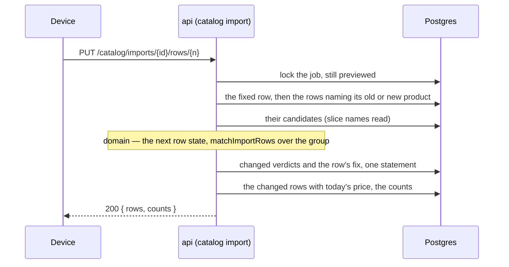

##### Package changes
- **domain** — new `catalog/import-fix.ts` (client-safe): `CatalogImportRowFix` (the three branches), `takesImportAnswer(row)`, `importFixProblem(row, fix)`, `fixedImportRow(row, fix)` (the next `fix`, `leftOut`, `answer`, the answer dropped when the product changes). Exported from the client-safe index.
- **contracts** — `catalog-import.ts`: the `fix` route, `catalogImportRowFixSchema` (a strict union; `cells` keyed by `catalogImportFieldSchema`), `catalogImportFixedSchema` (`{ rows, counts }`). Direction unchanged: contracts → domain.
- **api** — catalog module: a fix repository (new file — the rows repository would pass 300 lines), the slice's names read callable inside a caller's transaction, the fix in the preview service, the route in the controller.
- **Law 12 enrolment:** the route → `RouteAccessMap` (typecheck) and OpenAPI freshness. The issue `asks_no_question` is a 422 `details[].issue` like the mapping's problems, held by its domain type. No new table, enum, brand, token or error code.

##### Data and schema changes
None — no stored shape changes. Part d's `catalog_import_row` already holds `fix`, `left_out` and `answer`, and `app_user` holds UPDATE on it. Readers both ways: a part d api never writes these columns and reads them as stored; this api reads what part d wrote (`fix` `{}`, `left_out` false, `answer` null).

##### File and folder changes
| action | path | purpose | placement reason |
|---|---|---|---|
| add | `packages/domain/src/catalog/import-fix.ts` | the fix type, the answer rule, the next row state | §4.3 business logic, client-safe |
| modify | `packages/domain/src/catalog/index.ts` | exports | §4.3 |
| add | `packages/domain/tests/catalog/import-fix.test.ts` | the answer rule, the merge, the dropped answer | testing rules |
| modify | `packages/contracts/src/catalog-import.ts` | the `fix` route and its schemas | §4.1 |
| modify | `packages/contracts/openapi/openapi.json` | regenerated | §4.1 (generated) |
| add | `apps/api/src/modules/catalog/catalog.import-fix.repository.ts` | lock, row, group, write, changed rows and counts in one transaction | catalog module; the rows repository stays under 300 lines |
| modify | `apps/api/src/modules/catalog/catalog.import-rows.repository.ts` | `withRates` and the counts read shared with the fix | the one rows read (Law 5) |
| modify | `apps/api/src/modules/catalog/catalog.slice.repository.ts` | the names read callable inside a transaction | the one slice query (Law 5) |
| modify | `apps/api/src/modules/catalog/catalog.import-preview.service.ts` | `fix` | the preview's service |
| modify | `apps/api/src/modules/catalog/catalog.import.controller.ts` | the route | catalog module |
| modify | `apps/api/src/modules/catalog/catalog.module.ts` | wiring | Nest wiring |
| add | `apps/api/tests/catalog/import-fix.test.ts` | fixes, the group, the full-pass equality, refusals, access | testing rules |
| modify | `apps/api/tests/catalog/support.ts` | the fix repository in the composed service | one fixture (zero duplication) |
| add | `apps/api/tests/catalog/import-preview-support.ts` | a previewed panel list, shared with `import-preview.test.ts` (built, not planned: `support.ts` would pass 300 lines) | one fixture (zero duplication) |
| modify | `apps/api/tests/catalog/import-preview.test.ts` | uses the shared previewed job | the move above |
| modify | `packages/domain/src/catalog/import-text.ts` | `namesOneOf` — the pass's identity applied to the group (built, not planned) | the one identity rule (Law 5) |
| modify | `apps/api/src/modules/catalog/internal/import-job.ts` | `importNotFound` — one 404 for the job read and the fix (built, not planned) | one message |
| add | `apps/api/tests/catalog/import-fix-refusals.test.ts` | the 422, 409, 403 and 404 refusals (built, not planned: `import-fix.test.ts` would pass 300 lines) | testing rules |
| add | `packages/contracts/tests/catalog-import-fix.test.ts` | the fix body names the key at fault; the row number's bounds (built, not planned: review and live QA) | testing rules |
| modify | `packages/domain/src/catalog/import.ts` | `CATALOG_IMPORT_ROW_NUMBER_MAX` — the most the `row_number integer` column holds bounds the route's row number (built, not planned: review) | §4.3 policy number |
| modify | `docs/tasks/M01-onboarding.md` | this RFC, Parts, Runtime | Law 8 |

##### API and contract changes
| route | method | request → response | errors | access |
|---|---|---|---|---|
| `/catalog/imports/{id}/rows/{rowNumber}` | PUT | `{ cells: { [field]: string } }` \| `{ leaveOut: boolean }` \| `{ answer: 'keep_catalog_spec' \| 'import_as_own_item' }` → 200 `{ rows: CatalogImportRow[], counts }` (D1 A) | 400 · 403 · 404 · 409 `CONFLICT` · 422 `DOMAIN_RULE_VIOLATION` (D2 A) | `onboarding.manage_catalog` outright |

Tenancy: no `tenantId` on the wire; every read and write carries its tenant predicate; another company's job or row is 404. Compatibility: an added route; the row and counts shapes are part d's, with their extensible vocabularies.

##### Risks and rollout
| risk | mitigation |
|---|---|
| Two fixers on one product group | decision 7 — the job row is locked for the fix's transaction |
| A fix and a new mapping at once | the mapping and the fix both take the job lock; the fix checks `previewed` under it (409 after a mapping) |
| The group misses a row the pass would count | decision 2 — the database narrows by substring, domain keeps the exact; the full-pass equality test |
| A large sheet | the group read is bounded by the job's rows through the index; the write touches the group only |
| Release roll | an added route on existing columns; no worker change |

##### Acceptance criteria and proof
Part e's lines of the task's AC (Plan `#### Acceptance criteria`), verbatim:
- **AC-1** — Given an import file with platform-matching rows, unknown rows and broken rows, when the preview renders, then it states the three counts, matched rows become price overrides and unknown rows tenant SKUs on import, and broken rows are fixable inline; the import runs async with progress and produces a per-row report (M01-41). *(Part e: broken rows are fixable inline; the run, progress and report are part f's.)*
- **AC-8** (extension) — Given a Finance session, when it starts, fixes or runs an import, then each is refused; given another company's job id, then it reads 404. *(Part e: the fix.)*
- **AC-12** (extension, new) — Given a previewed import, when a row is fixed — a cell typed, the row left out or brought back, or a spec conflict answered — then that row and every row naming the same product before or after the fix are judged again, the counts move in the same transaction, and no platform item changes; given an answer on a row that asks no question, or a job not `previewed`, then it is refused and nothing changes.

| AC/row | owner | tier | surface | action → expected | proof |
|---|---|---|---|---|---|
| AC-1 | main-dev | required | api tests | a broken row's missing spec typed → `new_item`, the counts move by one; a price typed on a `price_missing` row → matched | `import-fix.test.ts` |
| AC-1 | qa-api | required | api `8084` | `…904` previews a file with a broken row, fixes it, and reads the row and the counts moved in the answer and in `GET …/{id}` | live |
| AC-8 | main-dev | required | api tests | Finance's fix → 403, nothing written; another company's job and row → 404; planted reds: `admitWrite` removed from the fix — *refuses Finance the fix and changes nothing* failed by name; the fix's missing job answered with another status — *reads another company’s job, and a row the sheet does not hold, as not found* failed by name | `import-fix-refusals.test.ts` |
| AC-8 | qa-api | required | api `8084` | `…906` (Finance) fix → 403; `…905` fixes `…904`'s row → 404 | live |
| AC-12 | main-dev | required | domain | the answer rule; the merge key by key; the answer dropped on a new brand or model, kept on a spec cell | `import-fix.test.ts` (domain) |
| AC-12 | main-dev | required | api tests | leaving out the first of two rows naming one product matches the second; a model retyped onto another row's product makes it the repeat; `keep_catalog_spec` → `price_override` and the platform item byte-identical; `import_as_own_item` → `new_item`; an answer on a clean row → 422 `asks_no_question`; a fix on `matching` → 409; a repeat that stays the repeat is not answered as moved; after a run of mixed fixes the stored verdicts and matched item ids equal a fresh `matchImportRows` over the fixed rows; planted red: the group narrowed to the fixed row — *leaving out the first of two rows naming one product matches the second* failed by name | `import-fix.test.ts`, `import-fix-refusals.test.ts` |
| AC-12 | main-dev | required | contract | a body with two acts, an unknown field or an unoffered answer → refused at the key at fault; a row number past `CATALOG_IMPORT_ROW_NUMBER_MAX` or below 1 → refused; planted red: the body as a union again — *refuses a field no import has, naming where* failed by name | `catalog-import-fix.test.ts` (contracts) |
| AC-12 | qa-api | required | api `8084` | `…904` leaves out one of two repeated rows and reads the other matched in the answer | live |
| all | ci | required | `quality` | the PR's run passes | CI |
| — | evaluator | not_applicable | invariants | no table, enum or migration changes; the gate still runs whole at step 5 | — |
| — | qa-web · qa-ios · qa-android | not_applicable | — | an engine part; the wizard is `T-M01-017` | — |

##### Delivery size
- **Estimate:** 15 files (1 generated: `openapi.json`). Authored lines: code about 290 · tests about 400 (about 40 of them moved from `import-preview.test.ts`) · this RFC and doc lines about 160 — about 850. Inside both targets: one part.
- **Order:** as in Proposal.
- **Owner rulings (2026-10-07):** RFC approved; D1 → **A** (the changed rows and the counts); D2 → **A** (an answer only where the row asks; a new product drops it).
- **Build delta (2026-10-07) — approval void, the owner rules again.** Built 18 changed files (1 generated: `openapi.json`) against 15, and about 1,100 authored lines against about 850 — code about 475 (planned 290), tests about 490 (planned 400; about 110 of them moved), docs about 140. Every main-dev proof row is green on `heliogrid_test` (10 api tests, 13 domain tests, `pnpm check` 628 tests); both planted reds seen failing by name; live QA and review have not run.
  - **Planned and built:** every row of the file table above, less the three marked "built, not planned".
  - **Built but not planned:** `import-preview-support.ts` (the 300-line rule on `support.ts`) · `namesOneOf` in `import-text.ts` (the group keeps rows by the pass's own identity, not a second copy of it) · `importNotFound` in `internal/import-job.ts` (one 404 for two callers).
  - **Planned but not built:** none.
  - **Why the estimate missed:** the fix repository's one-statement write and its locked reads (about 125 lines) and the service's fix with its group and verdict helpers (about 135) were counted at about half; the full-pass equality test and the fixture move were not counted.
  - **Two ways on:** **A · keep part e at its built size (recommended)** — one PR; the fix is one route whose proofs cannot be accepted apart. **B · split once more** — e1: the leave-out and the typed cells; e2: the answer and its rule. e1 alone leaves every spec conflict unanswerable, so the preview still cannot settle.
- **Size ruling (after the build, 2026-10-07):** the owner approved option **A** — part e at its built size, about 1,100 authored lines and 18 files, one PR.
- **After live QA and the first review (2026-10-07) — lines over again; the owner rules.** Built 21 changed files (1 generated) against the 18 approved (+17%, inside the fifth), and about 1,350 authored lines against about 1,100 (+23%) — code about 555, tests about 650, docs about 150. Every main-dev proof row is green (`pnpm check`: 48 files, 653 tests); live QA passed every behaviour row before these fixes and is re-driven after the ruling.
  - **Mistakes found and fixed, with what now prevents each:**
    - *Live QA* — a two-act or unknown-field body was refused with `details[].path` `body` and "Invalid input": a `z.union` body reports no key. The body is one strict object whose refusal names the key → `catalog-import-fix.test.ts` (contracts), seen red with the union back.
    - *Review* — every unchanged needs-attention row in a group was answered and rewritten as moved: `jsonb` returns the attention's keys reordered, so the JSON text never matched. Compared field by field → *answers only the rows a fix moved, never a repeat that stays the repeat*, seen red before the fix.
    - *Review* — a row number past the `integer` column answered 500. Bounded by the most the column holds (first bounded by the last `.xlsx` row; the second review showed a CSV of blank lines passes that) → `catalog-import-fix.test.ts`.
    - *Review* — the matrix promised "a price typed on a `price_missing` row → matched" and no test proved it → *types a missing price on a row naming a platform item, and it matches*.
    - *Review* — the cross-company 404 had no planted red → recorded above.
    - *Main* — the QA rerun started while the reviewer was still reading the fixes; its next finding changed the route again and cost a third QA pass → `.claude/skills/task/references/qa.md`: a rerun starts only after the continued reviewer returns clean (the owner asked for it in this branch).
  - **Also from review:** the full-pass equality compares matched item ids; the 422's code, details and status are asserted; the write runs in the rows' batch size (`inBatches`, shared with the pass's insert); the SQL cell names the domain rule it must equal.
  - **Built but not planned (this round):** `import-fix-refusals.test.ts`, `catalog-import-fix.test.ts` (contracts), `import.ts` (domain).
  - **Two ways on:** **A · keep part e at about 1,350 lines and 21 files, one PR (recommended)** — every added line is a fix or its proof. **B · split** — not sensible after the build: each half's proofs share one fixture and one route.
- **Size ruling (after the first review, 2026-10-07):** the owner approved option **A** — part e at about 1,350 authored lines and 21 files, one PR.
- **Checklist (part e)** — [x] domain fix rule · [x] contract route · [x] slice read in a transaction · [x] fix repository · [x] service and controller · [x] docs · [x] AC-1 (fix: main-dev) · [x] AC-1 (fix: qa-api) · [x] AC-8 (fix: main-dev) · [x] AC-8 (fix: qa-api) · [x] AC-12 (main-dev) · [x] AC-12 (qa-api) · [x] review (clean on the third pass) · [ ] CI

#### Part f · RFC
The task's shared facts — the Plan's decisions 1–21, parts c, d and e's decisions and the AC list — stand unless a line below changes one. Branch `feat/T-M01-030f` from `origin/main`.

##### Title
T-M01-030f — the import runs: a previewed price list is written into the catalog in the background, row by row, with counted progress and a kept result on every row.

##### Description
- **User impact:** in the import wizard (`SCR-M01-17`, the run and step 4) the owner presses *Import 405 rows* and can close the wizard. The prices land in the catalog in the background, the wizard shows "218 of 405", and every row keeps what happened to it — price applied, product created, left out, or failed with its reason. Directly: a supplier's whole price list is in the catalog minutes after the upload, with no typing. Indirectly: the first quote is priced from real supplier prices, and a second import of the same list next month adds dated prices and never a second copy of a product.
- **Who gains:** anyone holding `onboarding.manage_catalog` outright.
- **Problem solved:** the third workflow phase (`run`) on part b's handoff; the catalog writes the preview promised, made safe against a retried step, a stale preview and two imports of one file.
- **Cites:** the task header (`M01-41`, `M01-44`, §M01.4 edge cases); the brief `docs/ux/briefs/SCR-M01-17-catalog-import-wizard.md` (states `importing-async-progress`, `per-row-report-reopenable`); the board's decisions record, read 2026-10-07 — decision 25 (the run's cancel *stops watching*; the run continues on the server), decision 26 (a failed run is the report, never the error state), pass 3 (the run is counted, "218 of 405"; the report's outcome words *Price applied · Product created · Left out*; columns *Price before* and *Price now*), decision 32 (*Fix the N rows* re-enters the preview on the left-out rows).

##### Goals
- `POST /catalog/imports/{id}/run` moves a `previewed` job to `running`, marks every row the run will not write `left_out`, and hands phase `run` to `catalogImport` — one transaction.
- The run step writes the rows in batches; each batch's catalog writes and its rows' results commit together, so a retried step writes nothing twice (AC-2).
- The job reads `completed` with a result on every row; `GET …/{id}` shows the run's progress while it runs and the results' counts after.
- A file imported twice makes exactly one SKU per unknown product and two dated rate entries per matched override (AC-2).

##### Non-goals
- The report's *Price before* and *Price now* columns, its filter by result, and *Fix the N rows* (board decision 32) — part g, if D1 rules A.
- A cancel route: the run's cancel stops watching, not the work (board decision 25).
- The wizard screen (`T-M01-017`).
- Any change to the read, the mapping, the pass or the fix (parts c, d, e).

##### Readiness and dependencies
- Landed on `origin/main`: part e (#244) — the row fix; part d (#242) — `catalog_import_row`, the pass, the slice's names read inside a caller's transaction; part b — the outbox, dispatcher and step host; `T-M01-027` — `appendRate`, `upsertOverride`, the own-SKU insert, `lockCatalog`, the audit entries.
- Design: an engine part, no drawing of its own. `SCR-M01-17` holds its link; the facts that bind the run are cited above.
- Stack: Postgres, object store, Temporal pre_existing; `heliogrid_test` at 0020. The api and the worker start through `.claude/launch.json` for the live check.
- Database: migration 0021 lands on `heliogrid_test` only.
- Blockers: none. Two rulings ride on this approval — D1 (Delivery size) and D2 (Proposal decision 4). The owner's open edit of board decision 24 (part d R1) does not touch the run.

##### Proposal
**Flow.** The person presses *Import* → `POST …/{id}/run` → the service admits the grant outright, finds the job (404) → one tenant transaction: the job locked, still `previewed` (409 otherwise; `running` or `completed` answers the job as it stands, no second event), `status = running`, `run_at` and `run_by` set, every `needs_attention` or `left_out` row given result `left_out`, the outbox event `{ eventId, tenantId, jobId, phase: 'run' }` → after the commit the dispatcher starts `catalogImport` → the worker loops on the step `applyCatalogImportRows` until it answers `completed` → each call, in one tenant transaction: the catalog lock, the next 100 rows with no result in row order, the items naming them read (the slice's names read), each row judged again by `matchImportRows`, its write made, its result recorded; when no row is left, the job → `completed` → the wizard polls `GET …/{id}` for progress, then pages `GET …/{id}/rows` for the results.

**Key decisions** (one reason each):
1. **A batch's writes and its rows' results commit in one transaction.** A retried step finds those rows already holding a result and skips them; a step that fails mid-batch rolls the whole batch back. This replaces the Plan's decision 13 (a creation key per row through `createOwnItem` and `saveOverride`): those open their own transactions, so the row's result would land in a second one and need the key to repair the gap. The writes reuse the catalog's own transaction-level pieces — `lockCatalog`, `upsertOverride`, `appendRate`, the own-SKU insert (moved out of `createOwnItem` into one function both call), `recordAuditEntry` — never a second copy (Law 5).
2. **Batches of 100, looped by the workflow.** A 2 MB CSV can hold tens of thousands of rows; one step for all of them would pass the 1-minute step timeout. Each call is bounded; the loop is the workflow's. Progress is read off the rows (`done` = rows with a result, of rows not `left_out`), never stored (`.claude/protections.md`).
3. **What each row writes.** A platform match → the tenant's override (made bare if none) and a rate entry; an own-SKU match → a rate entry on it; a new product → the own SKU with its rate entry (an own SKU is the tenant's by the table it lives in; no provenance column exists to set). Every entry is in the tenant's currency, dated as D3 below rules. Results: `price_applied`, `product_created`, `left_out`, `failed`. A row keeps the rate entry it wrote and, for `product_created`, the SKU it made.
4. **D2 — the run judges each row again at write time (owner ruling asked).** A preview can be stale: two jobs previewed from one file, then run one after the other, both say *new product* — the second run would make a second SKU, the duplicate `M01-41` forbids and AC-2 tests. **Recommended — A:** each batch re-reads the items naming its rows under the catalog lock and runs the same `matchImportRows`; a row whose verdict is still a write is written as judged now (a *new* row whose product now exists is priced on it, no second SKU); a row that now needs attention is `failed` with reason `changed_since_preview`. Race-free: the own-SKU form and the release publish take the same lock. About 40 lines. **B:** write the preview's stored verdict as it stands — simpler, and a second import previewed before the first ran makes duplicate SKUs.
4b. **D3 — the day a run's price is dated (owner ruling asked; found in review).** Decision 3 as approved dated every entry by `run_at`'s day. The ledger's rule b4 (`apps/api/src/modules/catalog/internal/write-checks.ts`, `rateToAppend`) says a rate never starts before today on the tenant's clock: a backdated entry changes the rate an earlier day already resolved to. A run whose later batch, or whose retried step, commits after midnight would write yesterday's date. **Recommended — A:** each batch dates its entries by the day it is written, on the tenant's clock; a run crossing midnight dates its later rows the next day, and no entry is ever backdated — one line, the scope read at `now` instead of `run_at`. **B:** keep `run_at`'s day — one date across the whole run, and a backdated entry whenever a run crosses midnight.
5. **The actor is who pressed *Import*.** The Plan's decision 14 named the job's `started_by`; the person who runs it may be another. `run_by` is stored and is the actor of every write and audit entry.
6. **A run that cannot finish ends as a report** (board decision 26). Each step call is retried 5 times; past them `endCatalogImportRun` marks every row still without a result `failed` (`not_applied`) and completes the job. The person sees which rows landed and which did not.
7. **Needs-attention rows do not block the run.** The board's act imports 405 of 412; the 7 are left out and say *Unchanged*. A run with nothing to write completes at once — no rule refuses it (none is in the PRD or the board).
8. **Allowed only from `previewed`, under the job lock** — the fix (part e) takes the same lock and checks `previewed`, so no fix lands on a running job.

**Order.** Domain results and progress → migration 0021 and schema → contracts (route, job additions, phase, steps) → the own-SKU insert shared → run repository → run service and step → controller → worker loop → api tests → OpenAPI → docs.

**Refusals.** 403 a role without the outright grant · 404 a job not this company's · 409 `CONFLICT` a job in `reading`, `unreadable`, `mapped` or `matching`.

**Twin screen.** None: an engine part. Both platforms' wizard is `T-M01-017`.

##### Architecture diagram
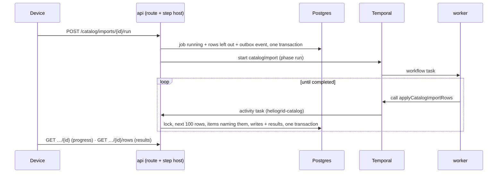

##### Package changes
- **domain** — `catalog/import.ts`: `CATALOG_IMPORT_ROW_RESULTS` (`price_applied · product_created · left_out · failed`), `CATALOG_IMPORT_ROW_FAILURES` (`changed_since_preview · not_applied`), `CATALOG_IMPORT_WRITTEN_OUTCOMES`, `takesImportRun(state)`, `hasImportRun(state)`, `importRunProgress(countsByResult)`, `countImportResults(countsByResult)`, and the policy number `CATALOG_IMPORT_RUN_BATCH_ROWS` (100 — Biome refuses a SCREAMING_CASE number in an app). Client-safe; the wizard reads progress by the same rule.
- **contracts** — `catalog-import.ts`: the `run` route; the job read gains `run: { done, total, at, by } | null` and `results: { priceApplied, productCreated, leftOut, failed } | null`; the row gains `result`, `failure`. The file is at 300 lines, so the rows' schemas move to a new `catalog-import-rows.ts` — with the row vocabularies they read (outcome, answer, field, counts), so the two files import one way and no cycle forms; every route stays in the one router. `workflows/catalog-import.ts`: phase `run`, steps `applyCatalogImportRows`, `endCatalogImportRun`. Direction unchanged: contracts → domain.
- **db** — `schema/catalog-import.ts`: three job and four row columns, two pgEnums.
- **api** — catalog module: a run service and a run repository (new files — the import service and job repository stay under 300 lines); the own-SKU insert shared by `createOwnItem` and the run; `upsertOverride` exported; `appendRate` returns the entry's id; the rows read and counts gain the result.
- **worker** — `catalog.workflows.ts`: the `run` case and its loop.
- **Law 12 enrolment:** pgEnums `catalog_import_row_result`, `catalog_import_row_failure` → `enum-parity`; the new columns → `schema-parity`; the route → `RouteAccessMap` (typecheck) and OpenAPI freshness; the step names → the `satisfies` checks in `catalog.public.ts`. No new table, error code, brand or token.

##### Data and schema changes
- **Migration `0021_catalog_import_run.sql`** (started with `pnpm db:migration:new`):
  - `catalog_import_job` + `run_at timestamptz` null · `run_by uuid` fk `user_account` null · CHECK `catalog_import_job_run_has_runner`: status in (`running`, `completed`) exactly when `run_at` and `run_by` are set.
  - `catalog_import_row` + `result catalog_import_row_result` null · `failure catalog_import_row_failure` null · `rate_entry_id uuid` fk `catalog_rate_entry` null · `created_item_id uuid` fk `tenant_catalog_item` null. CHECKs: `failure` set exactly when `result = 'failed'`; `rate_entry_id` set exactly when `result` in (`price_applied`, `product_created`); `created_item_id` set exactly when `result = 'product_created'`.
  - Index: `(tenant_id, job_id, result, row_number)` — the step's next batch (`result is null`) and the counts by result.
  - Tenancy: no new table; the grants stand (UPDATE on both tables is held).
- **Readers, both ways:** the part e api selects named columns, so it reads a job and rows with the new columns unchanged, and never sets them. A part e worker handed phase `run` would end without calling a step — so the worker deploys first, then the api (Plan, rollout safety). Expand only; no backfill (no job has run); rollback is the previous release with the columns left unread.

##### File and folder changes
| action | path | purpose | placement reason |
|---|---|---|---|
| modify | `packages/domain/src/catalog/import.ts` | results, failures, run state rule, progress and result counts | §4.3 vocabulary and policy |
| modify | `packages/domain/src/catalog/index.ts` | exports | §4.3 |
| modify | `packages/domain/tests/catalog/import.test.ts` | progress and counts | testing rules |
| add | `packages/db/migrations/0021_catalog_import_run.sql` | job and row columns | §4.2 |
| modify | `packages/db/src/schema/catalog-import.ts` | their mirror, two pgEnums | §4.2 |
| modify | `packages/contracts/src/catalog-import.ts` | `run` route, job additions | §4.1 |
| add | `packages/contracts/src/catalog-import-rows.ts` | the rows' schemas and the row vocabularies, moved; `result`, `failure` | §4.1; the 300-line rule |
| modify | `packages/contracts/src/index.ts` | export | §4.1 |
| modify | `packages/contracts/src/workflows/catalog-import.ts` | phase `run`, two steps | §4.1 workflow messages |
| modify | `packages/contracts/openapi/openapi.json` | regenerated | §4.1 (generated) |
| add | `apps/api/src/modules/catalog/catalog.import-run.service.ts` | run route, apply step, end step | catalog module; the import service stays under 300 lines |
| add | `apps/api/src/modules/catalog/catalog.import-run.repository.ts` | run start, next batch, batch write, end | catalog module |
| modify | `apps/api/src/modules/catalog/catalog.repository.ts` | the own-SKU insert as one transaction-level function | the one insert (Law 5) |
| modify | `apps/api/src/modules/catalog/catalog.prices.repository.ts` | export `upsertOverride` | the one override write (Law 5) |
| modify | `apps/api/src/modules/catalog/catalog.rates.repository.ts` | `appendRate` returns the entry id | the one ledger write |
| modify | `apps/api/src/modules/catalog/catalog.import-rows.repository.ts` | counts by result; the page's result fields | the one rows read |
| modify | `apps/api/src/modules/catalog/catalog.import.service.ts` | the job read's `run` and `results` | catalog module |
| modify | `apps/api/src/modules/catalog/catalog.import-preview.service.ts` | `rowWire` gains `result`, `failure` | the one row wire |
| modify | `apps/api/src/modules/catalog/catalog.import.controller.ts` | the route | catalog module |
| modify | `apps/api/src/modules/catalog/catalog.import.activities.ts` | two steps registered | catalog module |
| modify | `apps/api/src/modules/catalog/catalog.module.ts` | wiring | Nest wiring |
| modify | `apps/worker/src/modules/catalog/catalog.workflows.ts` | the `run` case and loop | §2 worker |
| add | `apps/api/tests/catalog/import-run.test.ts` | AC-1 run, D2, the actor, the end step | testing rules |
| add | `apps/api/tests/catalog/import-idempotency.test.ts` | AC-2 | testing rules |
| modify | `apps/api/tests/catalog/import-preview-support.ts` | a previewed job ready to run | one fixture |
| modify | `tests/invariants/src/enum-parity.ts` | two pgEnums against their contract schemas | Law 12 |
| modify | `docs/tasks/M01-onboarding.md` | this RFC, Parts, Runtime; `T-M01-017`'s run and report lines | Law 8 |
| add *(built, not planned)* | `apps/api/src/modules/catalog/internal/import-judging.ts` | `catalogOf`, `matchInput`, `namingCells` — how a stored row is put to the match rule, moved out of the preview service so the fix and the run share one copy | Law 5; the preview service stays under 300 lines |
| modify *(built, not planned)* | `apps/api/src/modules/catalog/catalog.import.repository.ts` | the job read carries `runAt`, `runBy` | the one job read |
| add *(built, not planned)* | `apps/api/tests/catalog/import-run-refusals.test.ts` | AC-3 and AC-8 of the run, split from `import-run.test.ts` | the 300-line rule |
| modify *(built, not planned)* | `packages/contracts/tests/catalog-import-fix.test.ts` | imports the fix schema from its new file | the move |
| modify *(built, not planned)* | `docs/tasks/deferred.md` | D128 — a brand or model over 120 characters becomes an own SKU the edit form cannot save; found in the build, outside part f | `CLAUDE.md` §8 |

##### API and contract changes
| route / message | method | request → response | errors | access |
|---|---|---|---|---|
| `/catalog/imports/{id}/run` | POST | no body → 200 job (`running`; `running` or `completed` answers as it stands) | 403 · 404 · 409 `CONFLICT` | `onboarding.manage_catalog` outright |
| `/catalog/imports/{id}` | GET | adds `run: { done, total, at, by } \| null` (from `running` on) and `results: { priceApplied, productCreated, leftOut, failed } \| null` (`completed`) | unchanged | same |
| `/catalog/imports/{id}/rows` | GET | each row adds `result \| null`, `failure \| null` | unchanged | same |
| `catalogImport` | workflow | phase gains `run` | — | ids only |
| `applyCatalogImportRows` · `endCatalogImportRun` | activities (api) | `{ tenantId, jobId }` → `{ status }` | retried by Temporal; a gone job fails for good | the tenant from the input |

Tenancy: no `tenantId` on the wire; every read and write carries its tenant predicate. Compatibility: added route and fields; `extensibleEnum` on `result` and `failure`, so a later value parses on an older client.

##### Risks and rollout
| risk | mitigation |
|---|---|
| A retried step writes a price or a SKU twice | decision 1 — writes and results in one transaction; `import-idempotency.test.ts` retries a committed batch and a failed one |
| A stale preview makes a second SKU | decision 4 (D2 A) — each row judged again under the catalog lock |
| A long sheet holds the catalog lock | 100 rows per transaction; the lock is held for one batch, never the whole run |
| A run stuck in `running` | decision 6 — bounded retries, then `endCatalogImportRun` |
| The wrong person on the audit entries | decision 5 — `run_by` |
| Release roll | the worker MUST deploy before the api: a part e worker completes a `run` workflow without calling a step, and the job stays `running` with no recovery — no event is left to sweep, and a second run answers `running` (review finding) |

##### Acceptance criteria and proof
Part f's lines of the task's AC (Plan `#### Acceptance criteria`), verbatim:
- **AC-1** — Given an import file with platform-matching rows, unknown rows and broken rows, when the preview renders, then it states the three counts, matched rows become price overrides and unknown rows tenant SKUs on import, and broken rows are fixable inline; the import runs async with progress and produces a per-row report (M01-41). *(Part f: matched rows become price overrides and unknown rows tenant SKUs on import; the run, its progress and the per-row result.)*
- **AC-2** — Given the same file imported twice, when the second run completes, then each unknown row exists as exactly one SKU and each matched override carries two dated rate entries; given an activity retried after a partial apply, then no row is created twice (§M01.4 edge cases; M01-44).
- **AC-3** — Given a run is started, when the API commits the status change, then the outbox row is in the same transaction and a dispatcher that retries after a crash starts exactly one workflow. *(Part f: the run.)*
- **AC-8** (extension) — Given a Finance session, when it starts, fixes or runs an import, then each is refused; given another company's job id, then it reads 404. *(Part f: the run.)*
- **AC-9** (extension) — Given an import is run and the wizard is closed, when the run finishes, then the job reads `completed` with its report and Temporal shows exactly one completed `catalogImport` per handoff.

| AC/row | owner | tier | surface | action → expected | proof |
|---|---|---|---|---|---|
| AC-1 | main-dev | required | api tests | a previewed job with platform, own-SKU, new and needs-attention rows runs → one override with one dated rate entry and no SKU per platform row; one entry per own-SKU row; one SKU with its entry per new row; `left_out` on every other row; progress `done/total` moves per batch; `completed` with result counts | `import-run.test.ts` |
| AC-1 | main-dev | required | domain | progress and result counts from counts by result | `import.test.ts` |
| AC-2 | main-dev | required | api tests | the same file imported and run twice → one SKU per unknown product, two dated entries per matched override; a batch run again after its commit → nothing new; a batch failed mid-write → nothing kept, then written once; D2 A: two jobs previewed, then run in turn → one SKU; planted red: the result written in its own transaction after the batch's writes — *writes nothing twice when a step runs again after its commit* failed by name | `import-idempotency.test.ts` |
| AC-3 | main-dev | required | api tests | the run's commit lost after the job update → no `running`, no event; run twice → one event; planted red: the event written in its own transaction — *leaves neither the run nor its event when the commit is lost* failed by name | `import-run-refusals.test.ts` |
| AC-8 | main-dev | required | api tests | Finance's run → 403, nothing written; another company's job → 404; a job not yet previewed → 409; planted red: `admitWrite` removed from the run — *refuses Finance the run and changes nothing* failed by name | `import-run-refusals.test.ts` |
| AC-8 | qa-api | required | api `8084` | `…906` (Finance) run → 403; `…905` runs `…904`'s job → 404 | live |
| AC-1 · AC-9 | qa-api | required | api `8084` + temporal admin | `…904` previews a file with platform, new and broken rows, runs it, polls `running` with progress to `completed`, reads results on the rows page; runs the same file again as a new job and reads no second SKU; `temporal workflow show` names one completed `catalogImport` per handoff (read, match, run) | live |
| 0021 | evaluator | required | invariants | `enum-parity`, `schema-parity`, `tenancy-rls` over 0021 (no new table, so AC-6 is unchanged) | `pnpm check:all` |
| all | ci | required | `quality` | the PR's run passes | CI |
| — | qa-web · qa-ios · qa-android | not_applicable | — | an engine part; the wizard is `T-M01-017` | — |

##### Delivery size
- **Estimate (part f as above):** 27 files (1 generated: `openapi.json`). Authored lines: code about 760 · tests about 550 · this RFC and doc lines about 200 — about 1,500. Over the 1,000-line target; within 30 files.
- **D1 — size ruling (owner).** The report's reads and its *Fix the N rows* route back (board decision 32) are separable from the run: the run with a result on every row meets every AC on its own.
  - **A · split (recommended).** **f** — the run, as this RFC (about 1,500 lines). It cannot be split further: a run route with no write step leaves every job `running`. **g** — the report: *Price before* (the ledger entry before the one the row wrote, read, never stored) and *Price now* on the rows page, the filter by result, and *Fix the N rows* — a fix allowed on a completed job's left-out and failed rows, and a run again that writes only those (about 600 lines). Its own RFC at its turn.
  - **B · one part, f and g together** — about 2,100 lines and 33 files; one PR.
- **Order:** as in Proposal.
- **Owner rulings (2026-10-07):** RFC approved; D1 → **A** (split: f the run, g the report); D2 → **A** (each row judged again at write time).
- **Build delta (2026-10-07) — approval void, the owner rules again.** Built 32 changed files (1 generated: `openapi.json` +764) against 27 (+18%), and about 2,100 authored lines against about 1,500 (+40%) — code about 1,100 (about 150 of them moved, not new), tests about 820, docs about 180. Every main-dev proof row is green on `heliogrid_test` (`pnpm check`: 46 files, 396 tests); all four planted reds seen failing by name (below); live QA and review have not run.
  - **Planned and built:** every row of the file table above not marked *built, not planned*.
  - **Built but not planned:** the five rows marked so in the file table, each with its reason.
  - **Planned but not built:** none.
  - **Changed from the RFC:** the batch size is domain's policy number `CATALOG_IMPORT_RUN_BATCH_ROWS`; the worker's three phases end through one `endedOnFailure` helper (Biome's complexity limit refused a third try/catch case); the contracts move carries the row vocabularies too (no import cycle).
  - **Why the estimate missed:** the run repository (about 250 lines: the start, the batch under two locks, the four writes and the one-statement result write) was counted at about half; the tests were counted at 550 and are about 820 — the handoff and refusal proofs need their own failing-pool fixtures.
  - **Planted reds, each failed by name, then restored:** results in their own transaction after the writes → *writes nothing twice when a step runs again after its commit is lost*; the event in its own transaction → *leaves neither the run nor its event when the commit is lost*; `admitWrite` removed from the run → *refuses Finance the run and changes nothing*; the stored verdict written with no judging again (D2 B) → *makes one SKU when two imports previewed from one file run one after the other* and *fails a row whose product changed in the catalog since the preview*.
  - **Two ways on:** **A · keep part f at its built size (recommended)** — one PR; the run route, the batch step and the worker loop are one usable act, and no half shows the person anything. **B · split once more** — f1: the route, the handoff and the start (about 900 lines); f2: the batch write, the loop and the end (about 1,200). f1 alone leaves every job `running` for good.
- **Size ruling (after the build, 2026-10-07):** the owner approved option **A** — part f at its built size, about 2,100 authored lines and 32 files, one PR.
- **After the first review (2026-10-07)** — 33 files (+1: `catalog.slice.repository.ts`, the names read carries each platform item's override id) and about 2,180 authored lines (+4%), inside the approved fifth. Live QA passed every row before these fixes (Temporal read by Main: `qa-api` may not run `docker`). Fixed, each with what now prevents it:
  - *Review* — the Risks row said an api ahead of its worker loses nothing; a part e worker completes a `run` workflow without a step and the job stays `running`. The row now says the worker MUST deploy first.
  - *Review* — the two new CHECKs had no proof → *refuses a reason on a row not yet run, a failed row with no reason, and a running job with no one who ran it*, seen red with the bare `=` form planted in `heliogrid_test` (a null result let the reason through), restored from the migration's own line.
  - *Review* — no test ran a step again after its commit → the second run of the twice-imported file calls the step once more and writes nothing.
  - *Review* — the cross-company 404 had no planted red → the run's missing job answered with another status, *reads another company’s job as not found, and changes nothing* failed by name.
  - *Review* — the price write existed twice, and the run's copy rewrote an existing override's `updated_at` → one `priceItemIn` in the prices repository, used by the single rate send and the run; the run passes the override id the names read already joined.
  - *Review* — the run route's state rule was a literal in the repository → `takesImportRun` there; the service refuses what `hasImportRun` does not answer.
  - *Review* — a running job with no runner answered `running` and would loop the workflow → it fails for good (`stepCannotSucceed`).
  - *Review* — `writesImportRow` had no caller → dropped. The worker's retry comment now covers the run.
  - *Review, the money red* — no test would see the run date its prices wrongly → *dates a price by the day its step writes it, never the day before* (`import-idempotency.test.ts`), seen red on the `run_at`-dated code before D3 A landed (`2026-10-06` written by a step on `2026-10-07`).
  - *Main* — migration 0021's header still says the run's entries are dated `run_at`'s day. The file is applied on `heliogrid_test`, and the runner refuses an applied file whose hash changed; editing it would need the migration undone there by hand, a direct database write. Left as written — the owner's ruling at the commit card (option A); the RFC holds the truth.
  - **Owner ruling (2026-10-07):** D3 → **A** — each batch dates its entries by the day it is written, on the tenant's clock.
  - *Not taken:* a forced-overlap test of two runs on one company (optional in the review) — both take the catalog lock first, the same lock the single form and the release publish hold; renaming `import-preview-support.ts` (optional).
- **Checklist (part f)** — [x] domain results and progress · [x] migration 0021 and schema · [x] contracts and workflow phase · [x] shared own-SKU insert, override, ledger id · [x] run repository and service · [x] route · [x] worker loop · [x] docs · [x] AC-1 (main-dev) · [x] AC-1 · AC-9 (qa-api) · [x] AC-2 · [x] AC-3 · [x] 0021 invariants (evaluator) · [x] AC-8 (main-dev, qa-api) · [x] review (clean on the third pass) · [ ] CI

#### Part g · RFC
The task's shared facts — the Plan's decisions 1–21, parts c to f's decisions and the AC list — stand unless a line below changes one. Branch `feat/T-M01-030g` from `origin/main` `65ac4e2c`.

##### Title
T-M01-030g — the import report: each row's price before and the price it applied, the rows narrowed by result, and *Fix the N rows* — the rows the run did not write fixed in place and run again.

##### Description
- **User impact:** in the import wizard's report (`SCR-M01-17`, step 4, frames O and Q) the owner scans *Price before* beside *Price now* for the one price that looks wrong, narrows the report to *Left out*, and presses *Fix the 7 rows*: the seven come back into the preview grid, are fixed there, and are imported — the other 405 are never touched again. Directly: no supplier row is lost to a dead end, and no wrong price hides in 400 lines. Indirectly: the catalog is complete after one import, so the first quote is not short of the products the file had trouble with.
- **Who gains:** anyone holding `onboarding.manage_catalog` outright.
- **Problem solved:** part f keeps a result on every row, but the report cannot show what a price was before the run, cannot be narrowed by result, and a completed job takes no fix and no second run — the board's route back (decision 32) does not exist.
- **Cites:** the task header (`M01-41`, `M01-44`); the brief `docs/ux/briefs/SCR-M01-17-catalog-import-wizard.md` (state `per-row-report-reopenable`); the board's decisions record, read 2026-10-07 — decision 32 (*Fix the 7 rows* re-enters step 3 with the *Left out* scope chosen), pass 3 N7 (*Price before* is the override's price, or *No price*; *Price now* is the price from the file), N8 (a left-out row reads *Unchanged*), finding 48 (the report's columns are the past tense of the preview's).

##### Goals
- `GET …/{id}/rows` gives each written row `priceBefore` (the rate in force on its item just before the entry the row wrote) and `priceApplied` (that entry); every other row of a run job `priceBefore` = the rate its item holds today and `priceApplied` = null.
- `GET …/{id}/rows?result=…` narrows the rows to one result.
- On a completed job, a row the run did not write (`left_out` or `failed`) takes a fix; a row it wrote is refused.
- `POST …/run` on a completed job writes only its open rows that now judge as a write; with none, the job is answered as it stands and nothing is handed off.
- One import never prices one product twice, across its runs.

##### Non-goals
- The wizard and its words — `T-M01-017`.
- A run history: a second run moves `run_at` and `run_by` to the new run; each rate entry keeps its own date and person (`M01-44`).
- Any change to the read, the mapping or the matching pass (parts c, d).
- A new import job for the open rows (see decision 2's rejected way).

##### Readiness and dependencies
- Landed on `origin/main`: part f (#245) — results, `rate_entry_id`, the run step; part e (#244) — the fix; `T-M01-027` — the rate ledger and `ratesInForce`.
- Design: an engine part, no drawing of its own. `SCR-M01-17` holds its link; the facts that bind the report are cited above.
- Stack: Postgres, object store, Temporal pre_existing; `heliogrid_test` at 0021. The api and the worker start through `.claude/launch.json` for the live check.
- Database: no migration.
- Blockers: none. One ruling rides on this approval — D1 (Delivery size).

##### Proposal
**Flow.** The report pages `GET …/{id}/rows?result=left_out` → each row with its two prices → *Fix the N rows* (N from domain's `importRowsToFix(results)`) → `PUT …/rows/{n}` on the completed job, as in part e → `POST …/run` → one tenant transaction: the job locked, the open rows that now judge as a write lose their result, `running`, the new runner, the outbox event → the run step writes only rows with no result (part f, unchanged) → `completed`.

**Key decisions** (one reason each):
1. **The two prices are read from the ledger, never stored.** `priceApplied` is the entry the row kept (`rate_entry_id`); `priceBefore` is the newest entry on the same parent ordered before it by `(entry_date, sequence)`, one statement per page. The ledger is append-only (`M01-44`) and a run never backdates (part f D3), so the read is exact. Storing a copy would be the second copy of a price §8 forbids. A new SKU's or a bare override's first entry has nothing before it → null, the board's *No price*.
2. **The fix and the second run work in place on the completed job.** Domain gains `CATALOG_IMPORT_OPEN_RESULTS` (`left_out`, `failed`) and `takesImportFix(state, result)`: a `previewed` job's every row, a `completed` job's open rows. The job stays `completed` while fixed, so its report never disappears. *Rejected:* a new job holding only the open rows — a new route, a copy of rows and a second report for one file.
3. **A written row is never judged again into a write.** A fix on a completed job judges its product group with the rows the run wrote placed FIRST, so their products count as already seen: an open row naming one of them reads `repeated_in_file` — the first pass's own rule (`matchImportRows`: one import never writes two prices for one product). Only open rows' verdicts are stored.
4. **A row failed as `changed_since_preview` keeps the verdict the run gave it.** The run already judged it again; storing that verdict (outcome `needs_attention` and its attention) lets the fix grid ask its question. Without it, the row would show its stale preview verdict and fail again on every run. A `not_applied` row keeps its written outcome and is simply written by the next run.
5. **The second run takes only open rows that now write.** `takesImportRun` widens to `completed`; the start clears `result` and `failure` on open rows whose outcome is a write (`CATALOG_IMPORT_WRITTEN_OUTCOMES`) and leaves every other row as it is. None → the job is answered as it stands, no event (a retried *Import* stays safe). Progress stays part f's rule over the whole job: rows written of rows to write.
6. **The rows filter takes one result.** `result` beside part d's `outcome`, both optional, both ANDed, on the existing index `(tenant_id, job_id, result, row_number)`. The wizard's *Left out* and *Failed* chips are two reads; how it groups them is `T-M01-017`'s.
7. **The report's rule lives on the server and in domain** (Law 11): the two prices are filled for every row of a run job, so the screen picks no column by result; `importRowsToFix` gives N.

**Order.** Domain (open results, fix and run rules, N) → contracts (row fields, filter) → the ledger read → rows page → fix service moved and widened → run start and failed verdicts → api tests → OpenAPI → docs.

**Refusals.** 403 a role without the outright grant · 404 a job not this company's, or a row the sheet does not hold · 409 `CONFLICT` a fix on a `running` job or on a row the run wrote, and a run on a job in `reading`, `unreadable`, `mapped`, `matching`.

**Twin screen.** None: an engine part. Both platforms' wizard is `T-M01-017`.

##### Architecture diagram
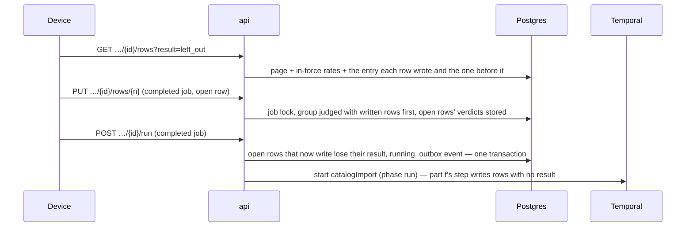

##### Package changes
- **domain** — `catalog/import.ts`: `CATALOG_IMPORT_OPEN_RESULTS`, `takesImportFix(state, result)`, `takesImportRun` widened to `completed`, `importRowsToFix(results)`. Client-safe.
- **contracts** — `catalog-import-rows.ts`: the row gains `priceBefore`, `priceApplied` (`resolvedRateSchema`, nullable); `catalogImportRowsQuerySchema` gains `result`. Direction unchanged: contracts → domain.
- **api** — catalog module: `ratesBeforeEntries` and `entriesById` in the rates repository; the rows page reads the filter and the two prices; the fix moves out of the preview service (274 lines) into `catalog.import-fix.service.ts`, widened; the run repository's start and its failed rows' verdicts.
- **Law 12 enrolment:** no new pgEnum, table, route, error code, brand or token. The query field → OpenAPI freshness. `CATALOG_IMPORT_OPEN_RESULTS` is a subset of a held vocabulary, typed `satisfies readonly CatalogImportRowResult[]`.

##### Data and schema changes
None — no stored shape changes. Part f's CHECKs hold: the start clears `result` and `failure` together; `rate_entry_id` and `created_item_id` stay null on an open row. **Readers, both ways:** a part f api refuses a fix or a run on a completed job (409) — harmless; its run step writes any row with no result, so it finishes a second run the new api started. A part g api reads part f's jobs as they are. No backfill; rollback is the previous release.

##### File and folder changes
| action | path | purpose | placement reason |
|---|---|---|---|
| modify | `packages/domain/src/catalog/import.ts` | open results, fix and run rules, N | §4.3 vocabulary and policy |
| modify | `packages/domain/src/catalog/index.ts` | exports | §4.3 |
| modify | `packages/domain/tests/catalog/import.test.ts` | the rules | testing rules |
| modify | `packages/contracts/src/catalog-import-rows.ts` | two prices, the result filter | §4.1 |
| modify | `packages/contracts/openapi/openapi.json` | regenerated | §4.1 (generated) |
| modify | `apps/api/src/modules/catalog/catalog.rates.repository.ts` | the entries by id and the entry before each | the one ledger read |
| modify | `apps/api/src/modules/catalog/catalog.import-rows.repository.ts` | the filter; the two prices on a page | the one rows read |
| modify | `apps/api/src/modules/catalog/catalog.import-preview.service.ts` | the fix moved out; `rowWire` fields | catalog module; 300-line rule |
| add | `apps/api/src/modules/catalog/catalog.import-fix.service.ts` | the fix, widened to a completed job's open rows | catalog module; 300-line rule |
| modify | `apps/api/src/modules/catalog/catalog.import-fix.repository.ts` | the page's prices for the rows a fix answers | the one fix read |
| modify | `apps/api/src/modules/catalog/catalog.import-run.repository.ts` | the second run's start; a failed row's verdict | the one run write |
| modify | `apps/api/src/modules/catalog/catalog.import-run.service.ts` | the failed row carries its verdict | catalog module |
| modify | `apps/api/src/modules/catalog/catalog.import.controller.ts` | the fix from its new service | catalog module |
| modify | `apps/api/src/modules/catalog/catalog.module.ts` | wiring | Nest wiring |
| add | `apps/api/tests/catalog/import-report.test.ts` | AC-14 — *Fix the N rows* | testing rules |
| add *(built, not planned)* | `apps/api/tests/catalog/import-report-prices.test.ts` | AC-13 — the two prices, the filter, an unwritten row, a cleared price | the 300-line rule |
| modify | `apps/api/tests/catalog/import-fix-refusals.test.ts` | a written row refused | testing rules |
| modify | `apps/api/tests/catalog/import-run.test.ts` | a failed row keeps its verdict | testing rules |
| modify | `docs/tasks/M01-onboarding.md` | this RFC, Parts, Runtime; `T-M01-017`'s report lines | Law 8 |

##### API and contract changes
| route | method | request → response | errors | access |
|---|---|---|---|---|
| `/catalog/imports/{id}/rows` | GET | adds `?result=`; each row adds `priceBefore`, `priceApplied` (`{ source, amount, currencyCode, effectiveOn } \| null`) | unchanged | `onboarding.manage_catalog` outright |
| `/catalog/imports/{id}/rows/{rowNumber}` | PUT | unchanged body; now also a completed job's open row | 409 a written row or a running job | same |
| `/catalog/imports/{id}/run` | POST | unchanged; now also a completed job with open rows that write → 200 `running`; none → 200 as it stands | unchanged | same |

Tenancy: no `tenantId` on the wire; the ledger read carries the tenant predicate. Compatibility: added fields and an optional query field.

##### Risks and rollout
| risk | mitigation |
|---|---|
| A second run writes a row twice | decision 5 — only rows with no result are written, and only open rows lose theirs; planted red: the open-row filter removed |
| One product priced twice across runs | decision 3 — written rows lead the group; planted red: the group in sheet order |
| A fix rewrites a row the run wrote | decision 2 — `takesImportFix` refuses it; planted red: the guard removed |
| A wrong *Price before* | decision 1 — tested against a ledger with an earlier entry, none, and a cleared one |
| Release roll | api only, no migration; any order is safe (Data) |

##### Acceptance criteria and proof
Part g extends the task's AC (`AC-1` … `AC-12` stand):
- **AC-13** (extension, new) — Given a completed import, when its rows are read, then each row the run wrote carries the price its item held just before that write and the price the write applied, every other row the price its item holds now and no applied price; and the rows can be narrowed to one result.
- **AC-14** (extension, new) — Given a completed import with left-out or failed rows, when one is fixed and the import is run again, then only the rows that now write are written, no row the first run wrote is written or priced again, and the job completes with a result on every row; given a fix to a row the run wrote, or a run again with nothing to write, then it is refused or answered as it stands and nothing changes.

| AC/row | owner | tier | surface | action → expected | proof |
|---|---|---|---|---|---|
| AC-13 | main-dev | required | api tests | an override with an earlier entry, a bare override, a new SKU → `priceBefore` the earlier entry, null, null, and `priceApplied` each row's entry; a `not_applied` row → its item's rate today and no applied price; a left-out row → both null (it stores no item, D129); a price cleared before the run → `priceBefore` null; `?result=left_out` returns only those rows | `import-report-prices.test.ts` |
| AC-14 | main-dev | required | api tests | a left-out row fixed and run again → only it written, the first run's entries unchanged in count; a row fixed to a written row's product → `repeated_in_file`; a fix to a written row → 409, nothing changed; run again with nothing open → `completed`, no event; a `changed_since_preview` row keeps its new verdict; planted reds: the open-row filter, the group order, the written-row guard — each failed by name | `import-report.test.ts`, `import-fix-refusals.test.ts`, `import-run.test.ts` |
| AC-14 | main-dev | required | domain | `takesImportFix`, `takesImportRun`, `importRowsToFix` | `import.test.ts` |
| AC-8 | qa-api | required | api `8084` | `…906` (Finance) fix on a completed job → 403 | live |
| AC-13 · AC-14 · AC-9 | qa-api | required | api `8084` + temporal | `…904` runs a file with a broken row, reads the report's prices and `?result=left_out`, fixes the row, runs again, reads it `product_created` and every other row unchanged; Temporal shows one completed `catalogImport` per handoff (Main reads it if `qa-api` cannot run `docker`) | live |
| all | evaluator · ci | required | `pnpm check:all` · `quality` | the gate and the PR's run pass | gate · CI |
| — | qa-web · qa-ios · qa-android | not_applicable | — | an engine part; the wizard is `T-M01-017` | — |

##### Delivery size
- **Estimate:** 18 files (1 generated: `openapi.json`). Authored lines: code about 400 (about 120 of them the fix moved, not new) · tests about 450 · this RFC and doc lines about 200 — about 1,050. Parts e and f ran 40–60% over their estimates, mostly in tests; this one counts tests at the size theirs landed.
- **D1 — size ruling (owner).**
  - **A · one part g (recommended).** The report's two prices and its act are one surface (board finding 48, decision 32); about 1,050 lines, a little over the 1,000 target.
  - **B · split.** **g1** — the two prices and the filter (about 450 lines). **g2** — the fix on a completed job and the second run (about 600). Each is acceptable alone; two PRs and two QA runs.
- **Order:** as in Proposal.
- **Owner rulings (2026-10-07):** RFC approved; D1 → **A** (one part g).
- **As built (2026-10-07):** 18 changed files (1 generated: `openapi.json` +150) against 18 planned, and about 810 authored lines against about 1,050 — inside the approval. `pnpm check`: 47 files, 406 tests.
  - **Planned and built:** domain `import.ts`, `index.ts`, `import.test.ts`; contracts `catalog-import-rows.ts`, `openapi.json`; api `catalog.import-rows.repository.ts`, `catalog.import-preview.service.ts`, `catalog.import-run.repository.ts`, `catalog.import-run.service.ts`; tests `import-report.test.ts`, `import-fix-refusals.test.ts`, `import-run.test.ts`; this file.
  - **Built but not planned:** `catalog.written-rates.repository.ts` — the ledger read, since the rates repository would pass 300 lines · `internal/import-judging.ts` — `verdictOf` shared by the fix and the run's failed rows (Law 5) · `internal/wire.ts` — `reportPricesWire`, the two prices' rule beside `storedRateWire` · `packages/contracts/src/catalog-import.ts` — the three route summaries now say what the routes take · `docs/tasks/deferred.md` — D129.
  - **Planned but not built:** `catalog.rates.repository.ts` (the read went to its own file) · `catalog.import-fix.service.ts`, `catalog.import.controller.ts`, `catalog.module.ts` (the preview service stays at 277 lines with the fix in it, so nothing moved) · `catalog.import-fix.repository.ts` (a fix's rows carry the prices through the shared `withRates`).
  - **Changed from the RFC:** the fix rule is two domain functions — `takesImportFix(state)` for the job, `fixesImportRow(state, result)` for the row — plus `wroteImportRow(result)`, so the job's 409 still comes before a missing row's 404.
  - **Found in the build:** a row the run left out because the pass flagged it stores no matched item (CHECK `catalog_import_row_match_names_its_item`), so its *Price before* is null even when its product has an override — `deferred.md` D129, outside this RFC's stored shape. The contract's comment says so.
  - **Planted reds, each failed by name, then restored:** the written-outcome filter removed from the second run's start → *answers a completed import with nothing to write as it stands, and hands nothing off*; the group judged in sheet order → *asks which is meant when an open row is fixed to a product the run already priced*; the written-row guard removed from the fix → *refuses a fix to a row a completed run wrote, and changes nothing*. The open-result filter removed is refused by the CHECK `catalog_import_row_result_names_its_write` itself (a database error, not a red), so the schema holds that rule.
- **After the first review (2026-10-07)** — 19 files (+1: `import-report-prices.test.ts`, the price edges, since `import-report.test.ts` would pass 300 lines). Live QA passed every row before these fixes (Temporal read by Main). Fixed, each with what now prevents it:
  - *Review, blocker* — a second run marked every unwritten row `left_out` whatever its result, so a `changed_since_preview` row (now `needs_attention`) kept its `failure` under `left_out`, the CHECK `catalog_import_row_result_names_its_write` refused it, and `POST …/run` answered 500. The start now marks only rows with no result, or a row the person left out (clearing its `failure`); a failed row nobody fixed stays failed with its reason → *runs again past a row that failed, which keeps its failure*, seen failing by name on the code before the fix with that CHECK's error.
  - *Review* — the proof matrix's "a left-out row reads today's rate" and the Risks row's "a cleared one" had no test → *shows a row the run never wrote at the price its item holds now, with none applied* (a `not_applied` row) and *shows no price before a write whose item's price was cleared*. A left-out row reads null, since it stores no item (D129).
  - *Review* — `import-run.test.ts` grew past 300 lines → one `toMatchObject`.
  - *Review* — the run service's comments still said a run already made answers with no second handoff → reworded.
  - *Review* — the before-entry read joined the two parent columns with `or`, which reads neither index in order → one lateral per parent column, each a top-1 read on its own `(tenant, parent, entry_date desc, sequence desc)` index.
  - *Review* — `wroteImportRow` spelt the written pair itself → `CATALOG_IMPORT_WRITTEN_RESULTS` beside the open results, which it reads.
  - *Review* — a block comment repeated `WrittenRate`'s doc → removed; this record's line count corrected.
- **After the second review (2026-10-07)** — still 19 files.
  - *Review* — the blocker's second branch, a failed row the person then leaves out, had no case → *leaves out a failed row the person left out, clearing its failure*, seen failing by name with the `left_out` condition removed, then restored.
  - *Review* — `import-run.test.ts` still read 301 lines → 299. The report's price case moved into `import-report-prices.test.ts` (224 lines), so `import-report.test.ts` (237) holds *Fix the N rows* alone.
  - *Review* — the run service's class comment ran two dashed clauses into one sentence → two sentences.
- **Checklist (part g)** — [x] domain rules · [x] contracts · [x] ledger read and rows page · [x] fix · [x] second run and failed verdicts · [x] docs · [x] AC-13 · [x] AC-14 (main-dev) · [x] qa-api (passed, and passed again after review; Temporal read by Main) · [x] review (clean on the third pass) · [x] gate (`pnpm check:all`, first run) · [ ] CI

### T-M01-031 · Price book
**Type:** engine · **Tier:** P0
**Status:** shipped
**Why:** An installer quotes installation, engineering and per-kW charges from one active rate card, and a proposal sent last month still shows last month's rates (M01-48, M01-49); without it every non-component line is typed by hand on every proposal, and a rate edit silently reprices work already sent.
**PRD rows:** none of its own — the price-book row is quoted and dispositioned at `T-M01-015` (the rates panel of the one catalog surface) and the sent-proposals law sits in this file's Laws section; this task is the versioned structure beneath both, and quoting either again would be the duplicate this suite forbids.
**Requirements:** M01-48's build-side half and §M01.5's behaviour detail bind this task: non-component rates — service and installation charges, engineering fees, per-kW adders and comparable rates — live in immutable versions; a rate update creates a new version and never mutates rates in place; exactly one version is active per tenant; a default margin percentage rides the version and is the builder's starting margin; rates are in the tenant's one currency (F1-07); publishing is an explicit act with a summary of what changed, serialized server-side, and past versions are browsable read-only; drafts and designs re-read the active version on their staleness check (F8-13) and a sent proposal keeps its pinned version forever (M01-49, F8-15); publishing is `F2.M01.manage-catalog`, Finance views prices and margins, margin figures never render to a preset without a money grant, and version publishes are audit events (F2-22).
**Data model:** migration `0016_price_book.sql` authors `price_book_version` and `price_book_rate`, both tenant-scoped, all four always — `tenant_id`, a composite index leading with it, a fail-closed RLS policy for `app_user`, explicit grants — and both immutable: no UPDATE or DELETE grant on either. Money follows the market-and-money rules: `amount numeric(14,3)`, `currency_code` stamped on the version at creation from the tenant's one currency, the margin `numeric(5,2)`.

| entity | key fields | rules | rows |
|---|---|---|---|
| price_book_version | tenant_id; version_number (server-assigned, unique per tenant); published_at; published_by; note (the publisher's sentence on what changed — decision 4); default_margin_pct; currency_code | Immutable version of the tenant's non-catalog rates. Exactly one is active per tenant — the newest published one, DERIVED by the read and never a stored flag: a flag would need the one UPDATE the table must not grant, and a comparison is what F8-13 asks of every "is this current" question. Publishing is serialized server-side, so two concurrent publishes land in server order as two versions with distinct numbers and both attempts reach the audit trail. Pinned by proposal versions at generation and by designs at save (their columns); a publish self-stales unsent outputs by comparison and rewrites nothing. Index (tenant_id, version_number desc). Financial: the margin renders only to presets with the money grant. Settled at /task: nothing is seeded — before its first publish a company reads no version, no rates and the platform default margin, and that publish is version 1 (owner ruling 1A, §M01.5); a publish names no version it was edited from, so two concurrent publishes both land (decision 6). | M01-48, M01-49, F8-14 |
| price_book_rate | tenant_id; price_book_version ref; basis (one of `PRICE_BOOK_RATE_BASES` — decision 3); name (tenant content per language — F3-10's shape, `T-FPLAT-006`); amount; order | A non-catalog rate row inside a version — service charge, installation charge, engineering fee, per-kW adder. Immutable with its version; a change is a new version carrying a new row. Index (tenant_id, price_book_version). Settled at /task: the closed set is the rate's basis — per job, per kW, per visit, per metre — as the drawn rates panel gives every rate; what a rate is stays the tenant's words (decision 3). | M01-48, M01 §M01.5 |

**Contract:** `packages/contracts/src/price-book.ts` (new) —
- GET /price-book/active — the active version: its id, number, publish date, default margin and rate rows; the one read the rates panel, the builder, Quick mode (M06) and the staleness comparison consume, and the id a proposal pins
- GET /price-book/versions — every version, newest first, with its change summary and which one is active · GET /price-book/versions/{id} — one version's rows, read-only
- POST /price-book/versions — the publish act (`m01.manage_catalog`): the full rate set, the default margin and a change summary → a new immutable version that is now the active one; serialized per tenant
Domain types (`packages/domain/src/catalog/price-book.ts`): `PRICE_BOOK_RATE_BASES`, the platform default margin and the highest margin as policy numbers (`PLATFORM_DEFAULT_MARGIN`, `MAX_MARGIN`). Contracts derives `priceBookRateBasisSchema` from the tuple, and its `priceBookActiveSchema` and `priceBookVersionSchema` are the view-model both the rates panel and the builder read (Law 11 — as built, decision 14).
**Depends on:** `T-M01-025` (migration 0002 — `tenant`, the creation transaction a seeded version joins, `user_account` for `published_by`, the guard for `m01.manage_catalog`) · `T-M01-027` (migration 0015 — the migration order and the catalog contract area the rates panel shares; component rates resolve there, never here) · `T-FPLAT-006` (the per-language shape of tenant-authored names).
**Out of scope:** the rates panel and the version-browsing surface — `T-M01-015`; component rates and their dated ledger — `T-M01-027`; the pin columns on `design` and `proposal_version`, the comparison and the stale rendering — their migrations, `T-FPLAT-028` and M06; Quick mode's use of the default margin and the per-proposal margin adjustment — M06; audit entries for publishes — `T-FPLAT-004`; the money-grant surface law — the guard and F2's surface laws.
**DONE WHEN:**
- Given any rate change, when it is saved, then a new price-book version exists, the old one is untouched and browsable, and exactly one version is active (M01-48). → proof: unit apps/api/tests/price-book/publish.test.ts — a publish inserts one version and its rows, the prior version and its rows are byte-identical after it, the versions list still serves it, and the active read returns exactly the new one
- Given a draft pinned to an older version, when it is opened after a publish, then it is visibly stale and requires an explicit re-price — never a silent recompute (M01-49, F8-13). → proof: unit apps/api/tests/price-book/active.test.ts — the active read names the version id and number a draft compares its pin against; the comparison and the stale rendering are proven at `T-FPLAT-028` and with M06's builder
- Given two people publishing at the same moment, when both requests land, then two versions exist in server order with distinct numbers, exactly one is active, and both attempts are recorded (§M01.5 edge cases). → proof: unit apps/api/tests/price-book/publish.test.ts — two concurrent publishes serialize, and the audit write is issued for each once `T-FPLAT-004` lands
- Given a fresh tenant, when the active version is read before anyone publishes, then no version answers, with zero rates and the platform default margin, and its first publish is version 1 (M01-28, F8-14; owner ruling 1A). → proof: unit apps/api/tests/price-book/active.test.ts — a new company reads no version, no rates and the platform default margin, and its first publish is version 1
- Given a Finance session, when it reads the active version and then publishes, then the read answers with prices and margin and the publish is refused (§M01.5 permissions). → proof: QA (api) a Finance member reads `/price-book/active` in full and receives the permission refusal on `POST /price-book/versions`
- Given migration 0016, when the tenancy scan runs, then both tables pass as tenant-scoped and neither holds an UPDATE or DELETE grant. → proof: invariant table-tenancy-scan

#### Runtime
Recorded at the step's start (2026-10-06), before anything ran.

| resource | state at start | identity |
|---|---|---|
| web `3002` · metro `8081` | free; nothing will start — an engine task, no screen | — |
| api `8084` | free; `started_by_task` for QA, through the `api` launch configuration | preview serverId, recorded when started |
| postgres `5544` | pre_existing | container `heliogrid-pg-local` |
| object store `9000` | pre_existing | container `heliogrid-object-store-local` |
| temporal `7233` | pre_existing | container `heliogrid-temporal` |
| simulators · emulators | none booted, none attached | — |
| browser tabs | the pane is closed | — |
| database routing | `heliogrid_dev` on both `DATABASE_URL` and `DATABASE_ADMIN_URL` | `.env.local` |
| logs | `.qa/api.log` 1,153,927 bytes · `.qa/metro.log` 14,661 bytes · `.qa/web.log` not created | byte marks |

**At the end** (resource → initial → final):
- api `8084` → free → started twice through the `api` launch configuration (serverIds `ca78aaf8…`, then `53a20262…` after the review fixes), stopped; free again, no `tsx watch` left.
- database routing → `heliogrid_dev` on both → `heliogrid_test` for QA → `heliogrid_dev` on both, the file byte-identical to its start.
- `heliogrid_test` → migration 0016 applied; the four planted grants and RLS changes reverted and checked. `heliogrid_dev` was never migrated (no branch ahead of `main`).
- standing members → `…906` (Finance) and `…907` (Sales Executive) joined `…904`'s company "QA api primary" through the invite flow; kept as standing members (decision 13).
- browser tab `seed` (opened by the preview) → closed. Postgres, object store, Temporal → pre_existing, untouched.
- logs → `.qa/api.log` 1,153,927 → 1,379,216 bytes; kept.

**Measurements** — about 150 Main tool calls; helper runs: `qa-api` 2 (26.9k + 35.3k tokens), `reviewer` 2 (98.1k + 122.1k), `evaluator` 1 (32.7k); Main's own tokens are not measured by this session. Planned about 26 files; built 25 changed files, with the deltas in As built.

#### Plan
**Summary**
- **What:** the price book's backend — immutable versions of a tenant's non-catalog rates, each with a default margin, a note and its author; the newest is the one in force.
- **Files (~26):** db 3 · domain 4 · contracts 3 · invariants 2 · api 4 · api tests 4 · docs 6. One part.
- **Routes:** `GET /price-book/active` · `GET /price-book/versions` · `GET /price-book/versions/{id}` · `POST /price-book/versions`.
- **Tables:** `price_book_version`, `price_book_rate` in migration **0016** (0008 is `0008_notifications.sql`); both append-only; one new pgEnum `price_book_rate_basis`.
- **Audit:** one event `price_book.version_published`, one subject kind `price_book_version`.
- **Proofs:** `apps/api/tests/price-book/publish.test.ts`, `active.test.ts`; invariants `table-tenancy-scan`, `tenancy-rls` (append-only), `enum-parity`, `schema-parity`, `rls-armed`; `qa-api` drives the running routes.
- **Owner rulings 1A, 2A** (2026-10-06): nothing seeded before the first publish; the platform default margin is 18%.

**Scope** — In: migration 0016 and its Drizzle mirror; the domain vocabulary (`PRICE_BOOK_RATE_BASES`) and the two margin policy numbers; `packages/contracts/src/price-book.ts` with the four routes; the price-book controller, service and repository inside the catalog module; the audit entry of a publish; the invariant entries; the tests. · Out: the task's Out-of-scope line as written, less its audit clause (`T-FPLAT-004` has landed — decision 8). · Size: about 26 files, one part.

**UX readiness** — an engine task: no drawing of its own. The V1 screen it serves, `SCR-M01-15`, holds its link; its board and decisions record were read on 2026-10-06 and three of its facts bind this task (decisions 3, 4 and ruling 1).

**Decided at /task** — one reason each; a line the owner strikes leaves the plan whole.
1. **Migration 0016, not 0008** — `0008_notifications.sql` exists on `main`; 0016 is the next free number. The three lines of this file that say 0008 (`T-M01-015` ×2, this task) are corrected in the same change (Law 8).
2. **The rates panel's API lives in the catalog module** — `catalog.price-book.controller.ts`, `.service.ts`, `.repository.ts` beside the release files: §M01.5 makes the price book a panel of the one catalog surface, and it reuses the module's `admitWrite`, `MANAGE_CATALOG` and money-precision check without a second copy.
3. **The closed set is a rate's basis, not its kind** — `PRICE_BOOK_RATE_BASES = per_job · per_kw · per_visit · per_metre`, the four the drawn board gives every rate (`SCR-M01-15` decisions: "₹1,450 per kW and ₹1,450 per job are different businesses"). The name stays tenant content per language (`F3-10`, `AuthoredPerLanguage<string>`, `en` required). This answers the Data model's open condition on `rate_kind`: what a rate IS is the tenant's words; how it APPLIES is the closed set Quick mode and the money block read. The column is `basis`.
4. **A version stores a note and its author** — `note` (1–200 characters, required) and `published_by`: the drawn version browse shows date, author, margin and a person's sentence on every version, and §M01.5 asks for "a summary of what changed" at the publish. The Data model's `change_summary` becomes `note`; nothing derived is stored.
5. **Active is derived, never stored** — the highest `version_number` of the tenant, read through the unique index `(tenant_id, version_number)` walked backwards — one index serves the key and the read.
6. **A publish is serialized and both concurrent attempts land** — the publish takes `pg_advisory_xact_lock(hashtext('price-book:' || tenant_id))`, numbers the version `max + 1`, and a unique `(tenant_id, version_number)` backs it. No "edited from" check: the task's DONE WHEN line wants two concurrent publishes to land as two versions, and a refusal would break it. This answers the Data model's second open condition.
7. **No "nothing changed" refusal** — every publish carries a note, so it is a deliberate act; and two identical concurrent publishes must still both land (decision 6).
8. **A publish is an audit event** — `price_book.version_published` on subject kind `price_book_version`, written in the publish's transaction, as the catalog's acts are: §M01.5 says "version publishes are audit events" and `T-FPLAT-004` has landed. `changePayload` is null — the version itself is the record.
9. **Reads need the money grant; the publish needs it outright** — all three reads declare `{ capability: 'onboarding.manage_catalog' }` (EPC Owner, Operations, Finance's limited cell); the publish also passes `admitWrite`, so Finance is refused. Every field but a rate's name is money or margin, and §M01.5 says margin never reaches a preset without a money grant (the owner's ruling 1A names that grant). M06's builder reads the version through its own server path when its slice begins.
10. **The publish body is the whole set** — `{ note, defaultMarginPct, rates: [{ name, basis, amount }] }`, up to 100 rates (a request-size bound; the board draws 11). `amount` is `amountSchema` text, at least 0 (a free survey visit is a real offer), refused finer than the currency's minor unit by the catalog's existing check; the currency is stamped from the tenant's market. `defaultMarginPct` is `percentSchema`, at most 60 — the studio's editable margin range (`M05-69`), held as `MAX_MARGIN` in domain, so a starting margin is always one the builder can hold.
11. **A 201 publish carries `createHeadersSchema`** and the version table the creation-key columns, as every 201 route does: a retried publish answers the version the first one made.
12. **The planted reds run on `heliogrid_test`** — the append-only line by a temporary `GRANT UPDATE ON price_book_rate TO app_user`, revoked after the red; no scratch database (the `/task` rule).
13. **Two QA members join `…904`'s company once** — a Finance member (`…906`) and a Sales Executive (`…907`), invited and accepted through the running API by Main before QA if absent, and kept as standing members: the DONE WHEN line 5 proof is a live Finance session, and no standing account holds that role today.

**Where** — every new or changed file with its §4 answer.

| package | file | §4 answer |
|---|---|---|
| db | `migrations/0016_price_book.sql` (made by `pnpm db:migration:new`), `src/schema/price-book.ts` (`price_book_version`, `price_book_rate`, the enum `price_book_rate_basis`), `src/schema/index.ts` | §4.2 — stored schema, the module's slice |
| domain | `src/catalog/price-book.ts` (`PRICE_BOOK_RATE_BASES`, `PLATFORM_DEFAULT_MARGIN`, `MAX_MARGIN`), `src/catalog/index.ts`, `src/audit/events.ts`, `src/subject/kinds.ts` | §4.3 — vocabulary, policy numbers, the view-model both platforms read |
| contracts | `src/price-book.ts` (`priceBookRateBasisSchema` derived from the tuple; the four routes), `src/index.ts`, `openapi/openapi.json` (regenerated) | §4.1 — wire shapes |
| invariants | `src/enum-parity.ts` (one mapping), `src/append-only-ledgers.ts` (two ledgers, each with its reason) | §4.11 — existing holders, no new check |
| api | `src/modules/catalog/catalog.price-book.controller.ts`, `catalog.price-book.service.ts`, `catalog.price-book.repository.ts`, `catalog.module.ts` | apps/api/CLAUDE.md — one module, `*.repository.ts` by pool |
| api tests | `tests/price-book/publish.test.ts`, `tests/price-book/active.test.ts`, `tests/price-book/support.ts`, `tests/support/tenant-tables.ts` (the two tables in the teardown lists) | testing.md |
| docs | `docs/tasks/M01-onboarding.md` (this plan; `T-M01-015`'s two 0008 lines), `docs/prd/modules/M01-onboarding-and-tenant-config.md` (rulings 1A and 2A into §M01.5), `.claude/protections.md` and `packages/db/CLAUDE.md` only if they list the ledgers by name (Law 12) | — |

**Interfaces** — migration 0016. `price_book_version`: `id`, `tenant_id`, `version_number int` (unique per tenant), `default_margin_pct numeric(5,2)`, `currency_code`, `note text`, `published_by → user_account`, `published_at`, the creation-key columns; the unique index `(tenant_id, version_number)` is also the index the in-force read walks backwards. `price_book_rate`: `id`, `tenant_id`, `price_book_version_id`, `position int`, `name jsonb` (`AuthoredPerLanguage<string>`), `basis price_book_rate_basis`, `amount numeric(14,3)`; index `(tenant_id, price_book_version_id)`. Both: RLS fail-closed for `app_user`, SELECT and INSERT only.
```ts
// GET /price-book/active → 200
{ version: { id, number, publishedAt, publishedBy: { id, name }, note } | null,
  defaultMarginPct: '18.00', currencyCode: 'INR',
  rates: [{ name: { en: 'Engineering and drawings' }, basis: 'per_job', amount: '6500.000' }] }
// GET /price-book/versions?page&limit → 200 paginated, newest first:
//   { id, number, publishedAt, publishedBy, note, defaultMarginPct, rateCount, active }
// GET /price-book/versions/{id} → 200 one version with its rates · 404 another tenant's or none
// POST /price-book/versions (Idempotency-Key) body { note, defaultMarginPct, rates[] } → 201 the version head
//   400 VALIDATION_FAILED at the field path · 403 FORBIDDEN (no grant, or Finance) · 422 IDEMPOTENCY_KEY_REUSED
```

**Rollout safety** — additive only: two new tables, one new enum type, one new value on each of `audit_event_type` and `subject_kind` (the read side carries both as `extensibleEnum`, so an older client keeps its fallback). No old reader exists for the new routes. A rate's `name` jsonb reads through the per-language shape that drops nothing it does not know. A company made before this change has no version, which is exactly the "nothing published" answer of ruling 1A: one path for old and new companies.

**Twin screen** — none: an engine task. The rates panel on web and phone is `T-M01-015`.

**Ruled by the owner (2026-10-06)** — 1A and 2A, written into §M01.5's permissions paragraph.
1. **Before the first publish, nothing is seeded (1A).** The active read answers `version: null`, no rates and the platform default margin; the first publish is version 1, as the drawn empty rates panel says. A proposal made before version 1 pins "no version", and version 1 stales it by comparison (`F8-13`). DONE WHEN line 4 is reworded by this ruling (AC-4); `seed.test.ts` is not built — its proof is in `active.test.ts`. (Asked against: seed version 1 at signup and redraw the board's empty-state sentence.)
2. **The platform default margin is 18% (2A)** — `PLATFORM_DEFAULT_MARGIN`, the figure the drawn board shows. (Asked against: 0%.)

#### Acceptance criteria
- AC-1 · Given any rate change, when it is saved, then a new price-book version exists, the old one is untouched and browsable, and exactly one version is active (M01-48). → proof: `apps/api/tests/price-book/publish.test.ts` › "a publish inserts one version and its rows and leaves the prior version byte-identical", › "the versions list serves every version and marks only the newest active"
- AC-2 · Given a draft pinned to an older version, when it is opened after a publish, then it is visibly stale and requires an explicit re-price — never a silent recompute (M01-49, F8-13). → proof: `apps/api/tests/price-book/active.test.ts` › "the active read names the id and number of the newest version" — the comparison and the stale rendering are proven at `T-FPLAT-028` and with M06's builder
- AC-3 · Given two people publishing at the same moment, when both requests land, then two versions exist in server order with distinct numbers, exactly one is active, and both attempts are recorded (§M01.5 edge cases). → proof: `publish.test.ts` › "two publishes held on the lock both land with distinct numbers and two audit entries" (the overlap forced with `tests/support/held-lock.ts`), seen red once with the newest number read before the lock (As built 1)
- AC-4 · Given a fresh tenant, when the active version is read before anyone publishes, then no version answers, with zero rates and the platform default margin, and its first publish is version 1 (M01-28, F8-14; reworded by the owner's ruling 1A — the line as written asked for a seeded version). → proof: `active.test.ts` › "a new company reads no version, no rates and the platform default margin; its first publish is version 1"
- AC-5 · Given a Finance session, when it reads the active version and then publishes, then the read answers with prices and margin and the publish is refused (§M01.5 permissions). → proof: QA (api) Q-API-2 — a Finance member reads `/price-book/active` in full and receives the permission refusal on `POST /price-book/versions`; the rule itself: `publish.test.ts` › "Finance reads every version and is refused the publish", seen red once with `admitWrite` removed
- AC-6 · Given migration 0016, when the tenancy scan runs, then both tables pass as tenant-scoped and neither holds an UPDATE or DELETE grant. → proof: invariant `table-tenancy-scan`; invariant `tenancy-rls`'s append-only line with both tables in `APPEND_ONLY_LEDGERS`, seen red on a planted `GRANT UPDATE ON price_book_rate TO app_user` on `heliogrid_test` (decision 12). (The task first named 0008, which `0008_notifications.sql` holds — decision 1.)
- AC-7 · added at /task (Law 12) · Given migration 0016, when the invariants run, then the new pgEnum equals its contract enum and the Drizzle mirror equals the built tables and indexes. → proof: invariants `enum-parity`, `schema-parity`, `rls-armed`
- AC-8 · added at /task (§M01.5 permissions, decision 9) · Given a person without `F2.M01.manage-catalog` in any form, when they call any price-book route, then it answers 403; given another tenant's version id, then 404. → proof: `route-access.test.ts` › "a Sales Executive is refused every read" (over HTTP, the guard in the path; red once with `active` opened to `member`), › "Finance reads every route" · `active.test.ts` › "another company’s version is not found" · QA (api) Q-API-3, Q-API-4
- AC-9 · added at /task (decision 10) · Given a publish whose margin is above 60, whose amount is negative or finer than the currency's minor unit, or whose note is empty, when it is sent, then it is refused at the field's path and nothing is written. → proof: `publish.test.ts` › "the contract refuses %s at its path" and › "the contract accepts %s" (margin, negative amount, empty note, the rate bound — each edge and one either side; a body the contract refuses never reaches the service) · › "a rate at %s is refused at its path, and nothing is written" (the minor unit, counted) · QA (api) Q-API-5 (a 400 on the wire writes nothing)
- AC-10 · added at /task (`F2-22`, decision 8) · Given a publish, when it commits, then one `price_book.version_published` entry on its version commits with it. → proof: `publish.test.ts` › "a publish writes one audit entry on its version", read back on the admin path
- AC-11 · added at /task (decision 11) · Given a publish retried with its key, when it lands again, then it answers the version the first one made and writes nothing. → proof: `publish.test.ts` › "a retried publish answers the first version" · QA (api) Q-API-5

#### QA plan
Surfaces: database, api. No screen changes: `qa-web`, `qa-ios`, `qa-android` are `not_applicable` (an engine task; no web, phone or shared-ui file changes). `qa-api` rows touch only `…904`'s and `…905`'s tenants, so none waits on another helper.

| id | owner | tier | surface | action → expected | proof |
|---|---|---|---|---|---|
| Q1 | main-dev | required | database | `pnpm db:migrate` twice on `heliogrid_test` → 0016 applied once, skipped once | the runner's two lines |
| Q2 | main-dev | required | invariants | the invariants on `heliogrid_test` → `table-tenancy-scan`, `tenancy-rls`, `enum-parity`, `schema-parity`, `rls-armed` green; the planted `GRANT UPDATE ON price_book_rate TO app_user` → `tenancy-rls` red by name, then revoked | AC-6, AC-7 |
| Q3 | main-dev | required | api · unit | `pnpm exec vitest run apps/api/tests/price-book/publish.test.ts` on `heliogrid_test` → green; red once each on the newest number read before the lock (AC-3, As built 1) and the removed `admitWrite` (AC-5) | AC-1, AC-3, AC-5, AC-9, AC-10, AC-11 |
| Q4 | main-dev | required | api · unit | `pnpm exec vitest run apps/api/tests/price-book/active.test.ts` → green; red once on a dropped tenant predicate in the one-version read | AC-2, AC-4, AC-8 |
| Q-API-1 | qa-api | required | api · curl | as `…904` (EPC Owner): `GET /price-book/active` → 200, `version: null`, no rates, margin `18.00` before its first publish; `POST /price-book/versions` with two rates → 201, number 1 (or next); `GET /price-book/versions` → newest first, only it `active`; `GET /price-book/versions/{id}` of the earlier one → 200, its rows unchanged | AC-1, AC-4 |
| Q-API-2 | qa-api | required | api · curl | as the Finance member `…906` of `…904`'s company: `GET /price-book/active` → 200 with amounts and margin; `POST /price-book/versions` → 403 `FORBIDDEN` | AC-5 |
| Q-API-3 | qa-api | required | api · curl | as the Sales Executive `…907` of `…904`'s company: each of the three reads → 403 | AC-8 |
| Q-API-4 | qa-api | required | api · curl | as `…905` (another company): `GET /price-book/versions/{id}` of `…904`'s version → 404; its own `GET /price-book/versions` holds none of `…904`'s | AC-8 |
| Q-API-5 | qa-api | required | api · curl | as `…904`: the same publish sent twice with one `Idempotency-Key` → the same version id both times, one new version in the list; the same key with a different body → 422 `IDEMPOTENCY_KEY_REUSED`; a body with `defaultMarginPct` `60.01` → 400 at `defaultMarginPct` | AC-9, AC-11 |
| Q5 | reviewer | required | the diff | findings → fixed before the card | review |
| Q6 | evaluator | required | gate | `pnpm check:all` once after the api rows → green; the regenerated `openapi.json` read and committed | the gate |
| Q7 | ci | required | `quality`, `e2e-web`, `mobile-js` | the lanes the paths select pass on the head SHA (`apps/api/` and `packages/` match `quality` and `e2e-web`; `packages/domain` and `packages/contracts` select `mobile-js`) | the lanes |

#### Parts
One part: about 26 files, one deliverable (the price book's API) that is rejected or kept whole.

| part | ships | acceptance lines | status |
|---|---|---|---|
| a | migration 0016 and its mirror; the domain vocabulary, policy numbers and view-model; the contract; the three read routes and the publish with its lock, creation key and audit entry; the invariant entries; the tests; the doc fixes | AC-1 – AC-11 | shipped |

**Checklist**
- [x] db — migration 0016, schema mirror, index
- [x] domain — `price-book.ts`, index, audit event, subject kind
- [x] contracts — `price-book.ts`, index · [x] `openapi.json` (regenerated before the gate; three paths, two enum values)
- [x] invariants — `enum-parity`, `append-only-ledgers`
- [x] api — controller, service, repository, module
- [x] api tests — `publish.test.ts`, `active.test.ts`, `route-access.test.ts`, support, tenant tables
- [x] docs — this task, `T-M01-015`'s lines, §M01.5 rulings (no data-model row and no ledger list names these tables — nothing to change there)
- [x] Q1–Q4 main-dev proofs, each planted red recorded (below)
- [x] Q-API-1 – Q-API-5 by `qa-api` — PASS · [x] the rerun after the review fixes — PASS
- [x] Q5 review (first pass: 1 blocker, 6 should-fix — fixed; second pass CLEAN) · [x] Q6 gate (evaluator PASS) · [ ] Q7 CI — after the push

#### As built
**Planted reds** — each rule broken once, its test seen failing by name, then restored (all on `heliogrid_test`):
1. AC-3 · the newest number read BEFORE the price-book lock → `publish.test.ts` › "two publishes held on the lock both land…" failed: `duplicate key value violates unique constraint "price_book_version_tenant_number_key"`. (Removing the lock outright failed by timeout — no overlap to force — so the sharper plant is the one recorded.)
2. AC-5 · `admitWrite(roles)` removed → › "Finance reads every version and is refused the publish" failed: `promise resolved … instead of rejecting`.
3. AC-8 tenancy · the tenant predicate dropped from the one-version read AND RLS turned off on `price_book_version` (each layer alone still holds) → `active.test.ts` › "another company’s version is not found" failed: `promise resolved … instead of rejecting`. RLS restored: `relrowsecurity t, relforcerowsecurity t`.
4. AC-6 · `GRANT UPDATE ON price_book_rate TO app_user` → invariant `tenancy`: "append-only ledgers hold 3 mutating grant(s): UPDATE on price_book_rate to app_user, app_runtime, qa_readonly". Revoked: `has_table_privilege(…, 'UPDATE')` is `f`.
5. AC-8 door · the `active` route opened to `member` → `route-access.test.ts` › "a Sales Executive is refused every read" failed: `status 403 → 200`.

**Decision 14 (as built)** — no `PriceBookVersion` type in domain: the wire's `priceBookActiveSchema` and `priceBookVersionSchema` are the shared view-model both platforms read through `packages/data`, and a domain copy would be a second definition with no reader (`CLAUDE.md` §8). `T-M01-015`'s Contract line now names them.

**Files** — planned and built: every Where row. Built but not planned: `apps/api/tests/price-book/route-access.test.ts` (the reviewer's blocker: AC-8's door had no unit proof; the guard needs HTTP); `apps/api/src/modules/catalog/internal/write-checks.ts` (`scaled` exported as `amountAtScale` — one amount check for the ledger and the price book); `packages/contracts/src/catalog.ts` (`priceSchema` exported — one non-negative amount). Planned but not built: `docs/engineering/data-model.md`, `.claude/protections.md`, `packages/db/CLAUDE.md` (none names these columns or the ledgers); the domain `PriceBookVersion` (decision 14).

**Mistakes found, and the rule that now holds each**
1. The first race test shared a one-connection pool, so the second publish waited for the pool, not the lock, and the suite hung. The test now opens its own three-connection pool and closes it in `finally`. Held by the test itself (it times out without the overlap).
2. My own `git add -N` / `git reset` ran after the helper hash, so the hash moved with no helper write; a byte-compare of the full diff proved the content unchanged. Taken in the order hash-last from now on.
3. Found by the reviewer: AC-8's door had no unit test; AC-9 named a test that did not exist; the plan named `PriceBookVersion`, `PLATFORM_DEFAULT_MARGIN_PCT`, `MARGIN_PCT_MAX` and `priceBookRateKindSchema`, none of which the code holds; the non-negative amount and the capability string were second copies. All fixed in this change; the door test is seen red (5 above).
---

## Disposition index

| Row | Disposition |
|---|---|
| M01-01 | T-M01-002, T-M01-034, T-M01-036 |
| M01-02 | T-M01-001 |
| M01-03 | T-M01-001 |
| M01-04 | T-M01-001 |
| M01-05 | T-M01-025 |
| M01-06 | T-M01-025 |
| M01-07 | T-M01-025 |
| M01-08 | T-M01-002, T-M01-034, T-M01-036 |
| M01-09 | T-M01-035 |
| M01-10 | T-M01-025 |
| M01-11 | LAW |
| M01-12 | T-M01-007 |
| M01-13 | T-M01-008 |
| M01-14 | T-M01-009 |
| M01-15 | T-M01-010 |
| M01-16 | realized-by: docs/tasks/SHELL.md T-SHELL-001 |
| M01-17 | T-M01-028 (non-UI handoff half — the atomic accept; surface half docs/tasks/SHELL.md T-SHELL-001) |
| M01-18 | T-M01-025 |
| M01-19 | T-M01-012 |
| M01-20 | T-M01-013 |
| M01-21 | T-M01-014 |
| M01-22 | LAW |
| M01-23 | T-M01-004 |
| M01-24 | T-M01-005 |
| M01-25 | T-M01-005 |
| M01-26 | T-M01-006 |
| M01-27 | T-M01-029 |
| M01-28 | T-M01-026 |
| M01-29 | LAW |
| M01-30 | LAW |
| M01-31 | T-M01-005 |
| M01-32 | T-M01-015 |
| M01-33 | T-M01-027 |
| M01-34 | T-M01-015 |
| M01-35 | T-M01-015 |
| M01-36 | T-M01-016 |
| M01-37 | T-M01-015 |
| M01-38 | T-M01-015 |
| M01-39 | T-M01-016 |
| M01-40 | T-M01-016 |
| M01-41 | T-M01-017 (the wizard; the job beneath it — T-M01-030) |
| M01-42 | T-M01-027 |
| M01-43 | T-M01-015 |
| M01-44 | T-M01-027 |
| M01-45 | T-M01-037 |
| M01-46 | LAW |
| M01-48 | T-M01-015 (the rates panel; the versioned structure beneath it — T-M01-031) |
| M01-49 | LAW |
| M01-50 | T-M01-018 |
| M01-51 | T-M01-019 |
| M01-52 | T-M01-019 |
| M01-53 | T-M01-026 |
| M01-54 | T-M01-020 |
| M01-55 | T-M01-021 |
| M01-56 | LAW |
| M01-57 | realized-by: T-M07-005 — docs/ux/briefs/SCR-M07-05-agent-setup-settings.md (SCR-M07-05 screen task, M07 tasks file) |
| M01-58 | T-M01-022 |
| M01-59 | T-M01-023 |
| M01-60 | T-M01-024 |
| F4-37 | T-M01-025 |
